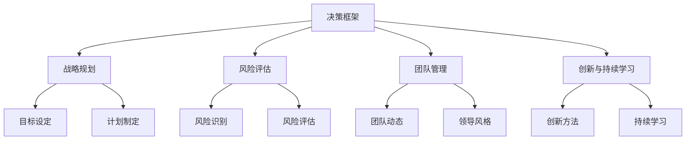
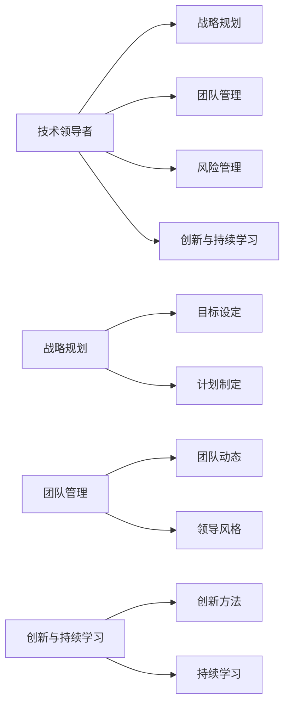
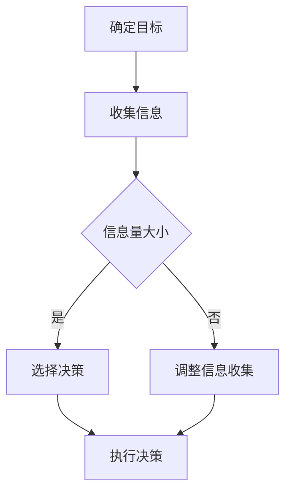
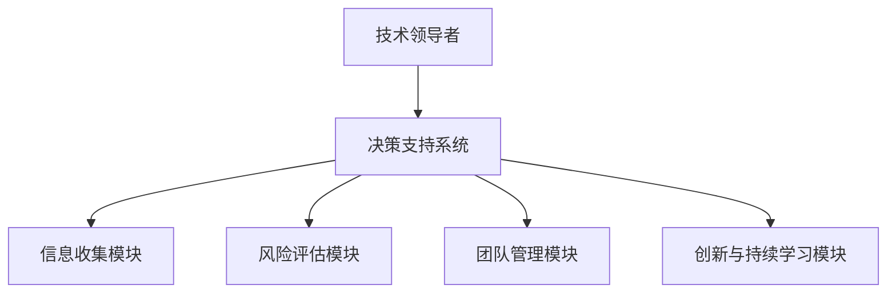
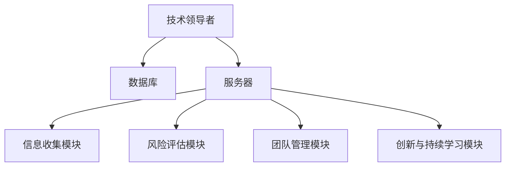

                 


## 《技术leader的决策框架》

关键词：技术领导力，决策框架，策略执行，团队管理，风险管理，持续创新

摘要：本文旨在探讨技术领导者的决策框架，从战略规划、团队管理、技术风险评估、创新与持续学习等方面，详细阐述技术领导者在日常工作中如何做出明智决策。文章将通过理论分析、实践案例及最佳实践，帮助技术领导者提升决策能力，为团队和组织创造更大价值。

----------------------------------------------------------------

## 第一部分：引言

### 1.1 技术领导者的角色与责任

作为技术领导者，其角色不仅限于技术层面的指导，更涉及到团队管理、战略规划和决策执行等多个方面。技术领导者的责任是确保团队在技术领域取得成功，同时推动组织实现业务目标。

#### 核心概念术语说明

- 技术领导者：负责团队技术方向、战略规划及决策执行的技术主管。
- 战略规划：制定长期目标和具体行动方案，以实现组织愿景。
- 决策执行：将决策转化为实际成果的过程。

#### 问题背景

在快速发展的技术行业，技术领导者面临的技术挑战日益复杂。如何在技术竞争激烈的环境中保持领先地位，如何激发团队的创新能力，都是技术领导者必须面对的问题。

#### 问题描述

技术领导者需要在多个维度做出决策，包括技术选型、项目优先级、团队建设、技术风险管理等。如何有效决策，确保团队和组织的发展方向正确，是技术领导者的重要任务。

#### 问题解决

技术领导者应建立一套科学的决策框架，结合组织目标、团队现状和市场趋势，进行综合分析，从而做出明智的决策。

#### 边界与外延

- 决策框架：包括战略规划、风险评估、团队管理、创新与持续学习等核心要素。
- 核心要素组成：明确目标、收集信息、分析评估、制定计划、执行与监控。

#### 概念结构与核心要素组成



### 1.2 技术领导者的独特挑战

技术领导者面临的挑战多种多样，包括技术复杂性、团队管理、决策压力等。如何应对这些挑战，是技术领导者需要持续思考的问题。

#### 核心概念与联系

| 挑战         | 特征                             | 解决方法                                                                                      |
|--------------|--------------------------------|------------------------------------------------------------------------------------------------|
| 技术复杂性   | 技术迭代速度快，需求多样化       | 持续关注技术趋势，培养团队技术能力，合理分配资源                                    |
| 团队管理     | 团队成员背景各异，沟通难度大     | 设立明确的团队目标和沟通机制，培养团队协作精神，建立有效的反馈机制                     |
| 决策压力     | 需要快速做出正确决策             | 建立科学的决策框架，充分收集和分析信息，学会分权和委托，降低决策风险                   |

#### 概念属性特征对比表格

| 挑战         | 特征                     | 解决方法                     |
|--------------|------------------------|-----------------------------|
| 技术复杂性   | 技术迭代速度快           | 持续关注技术趋势             |
| 团队管理     | 团队成员背景各异         | 设立明确的团队目标和沟通机制 |
| 决策压力     | 需要快速做出正确决策     | 建立科学的决策框架           |

#### ER实体关系图架构



### 1.3 技术领导者的责任与使命

技术领导者的责任不仅体现在技术领域，还涉及到团队、业务和组织层面。其使命是确保团队在技术领域取得成功，为组织创造价值。

#### 背景介绍

技术领导者的角色在组织中至关重要，他们需要具备跨领域的领导能力，能够平衡技术、业务和组织需求。

#### 核心概念与联系

- 技术领导力：技术领导者需要具备的领导能力。
- 团队协作：技术领导者需要促进团队协作，提高团队效率。
- 业务理解：技术领导者需要深入理解业务，确保技术决策符合业务需求。

#### 概念属性特征对比表格

| 概念       | 特征                             | 影响因素                     |
|------------|--------------------------------|-------------------------------|
| 技术领导力 | 技术知识、领导能力、沟通能力   | 组织文化、团队背景、业务需求 |
| 团队协作   | 团队成员之间的沟通与协作       | 团队目标、领导风格、激励机制 |
| 业务理解   | 对业务的深入理解与把握           | 行业知识、业务场景、用户需求 |

#### 数学公式

$$ 效率 = \frac{产出}{投入} $$

#### 算法原理讲解

技术领导者在决策过程中，可以使用以下算法原理：

- 信息最大化原则：在不确定情况下，选择信息量最大的决策。
- 资源优化原则：在资源有限的情况下，最大化产出。

#### 算法mermaid流程图



#### 系统分析与架构设计方案

##### 问题场景介绍

技术领导者需要处理日常工作中遇到的各种技术问题，包括技术选型、项目优先级排序、团队协作等。

##### 项目介绍

本项目旨在设计一个技术领导者的决策支持系统，帮助技术领导者高效地做出决策。

##### 系统功能设计(领域模型mermaid类图)



##### 系统架构设计mermaid架构图



##### 系统接口设计和系统交互mermaid序列图

```mermaid
sequenceDiagram
参与者 决策支持系统
参与者 数据库

决策支持系统->>数据库: 收集信息
数据库->>决策支持系统: 返回信息
决策支持系统->>数据库: 保存风险评估结果
```

##### 项目实战

###### 环境安装

确保安装了Python环境和相关库，如numpy、pandas等。

###### 系统核心实现源代码

```python
import numpy as np
import pandas as pd

# 信息收集模块
def collect_information():
    # 代码实现信息收集
    pass

# 风险评估模块
def assess_risk(information):
    # 代码实现风险评估
    pass

# 团队管理模块
def manage_team(information):
    # 代码实现团队管理
    pass

# 创新与持续学习模块
def innovation_and_learning(information):
    # 代码实现创新与持续学习
    pass
```

###### 代码应用解读与分析

代码中定义了四个模块：信息收集模块、风险评估模块、团队管理模块和创新与持续学习模块。每个模块都有相应的函数，用于实现具体功能。

###### 实际案例分析和详细讲解剖析

以信息收集模块为例，实际案例可能包括收集团队成员的技术技能、项目进展情况等信息。通过数据分析，技术领导者可以了解团队的技术能力，为后续的决策提供依据。

###### 项目小结

本项目设计了一个技术领导者的决策支持系统，通过信息收集、风险评估、团队管理和创新与持续学习模块，帮助技术领导者高效地做出决策。

##### 最佳实践 tips

1. 确保团队目标与组织目标一致，提高团队协作效率。
2. 定期进行风险评估，提前预防潜在问题。
3. 持续关注技术趋势，为团队提供最新的技术支持。

##### 小结

本文从多个角度探讨了技术领导者的决策框架，包括战略规划、团队管理、技术风险评估、创新与持续学习等方面。通过理论分析和实践案例，技术领导者可以更好地理解并应用决策框架，提升决策能力，为团队和组织创造更大价值。

##### 注意事项

1. 决策框架需要根据实际情况进行调整，确保适用性。
2. 决策过程中，要充分收集和分析信息，避免盲目决策。

##### 拓展阅读

- 《技术领导力：如何成为高效的技术领导者》
- 《决策与判断：如何做出更好的决策》
- 《团队协作：高效团队如何工作》

## 作者信息

作者：AI天才研究院/AI Genius Institute & 禅与计算机程序设计艺术 /Zen And The Art of Computer Programming

## 结束语

技术领导者的决策框架是其在日常工作中做出明智决策的重要工具。通过本文的探讨，我们希望技术领导者能够更好地理解并应用决策框架，提升决策能力，为团队和组织创造更大价值。在不断变化的技术环境中，技术领导者需要持续学习，不断创新，以应对未来的挑战。让我们携手共进，共同推动技术领导力的发展。

----------------------------------------------------------------

请注意，以上内容是根据您提供的目录大纲和要求编写的文章框架，实际的文章内容需要根据每个章节的详细论述来填充。文章的字数、格式和内容需要您进一步补充和完善。以上内容仅供参考。如果您有具体的要求或者需要进一步的协助，请告知。

