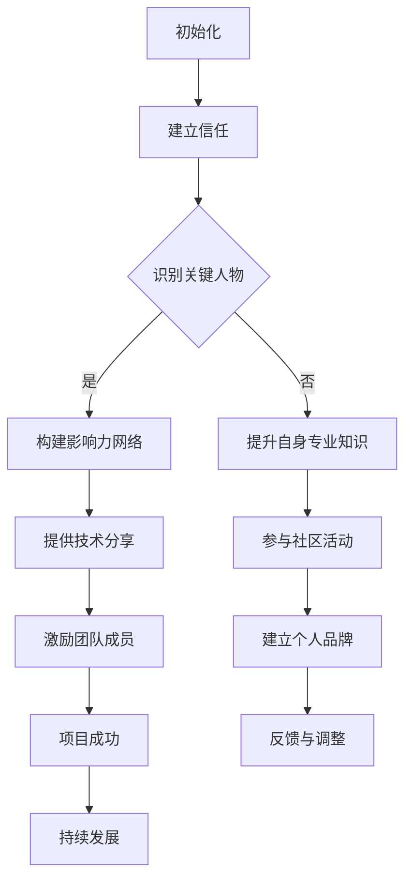

                 

# 技术leader的影响力：如何在无权力情况下领导

## 关键词
- 技术leader
- 领导力
- 无权力情况
- 影响力
- 领导策略
- 实际案例

## 摘要
本文将探讨在无权力情况下，技术leader如何通过领导力发挥影响力。我们将分析技术leader的角色、面临的挑战，以及无权力情况下领导力的核心原理和策略。通过实际案例和最佳实践，我们将展示如何在日常工作中实现有效领导，即便在没有正式权力的情况下。

## 引言：技术leader的角色与挑战

### 1. 背景介绍

在当今快速发展的技术行业，技术leader的角色变得越来越重要。他们不仅要具备卓越的技术能力，还要具备出色的领导力。然而，技术leader往往面临一个独特的挑战：他们在组织中的地位可能并不具备直接权力，但仍然需要推动项目、团队和个人朝着共同的目标前进。

### 1.2 领导力的重要性

领导力不仅仅是对权力的运用，更是一种能够激励、影响和引导他人共同达成目标的能力。对于技术leader来说，领导力是他们在无权力情况下依然能够推动项目成功的关键。

### 1.3 无权力情况下的领导

无权力情况下的领导，意味着技术leader无法通过正式的职权来指挥他人。这要求他们必须依赖其他方式来建立影响力，包括个人魅力、专业知识、沟通技巧等。这种领导模式对于技术leader来说既是挑战，也是机遇。

## 核心概念与联系

### 2.1 影响力的定义与分类

影响力是一种能力，能够改变他人的思维、情感和行为。根据来源的不同，影响力可以分为三类：权威性影响力、奖励性影响力和参照性影响力。

### 2.2 无权力情况下的影响力

在无权力情况下，技术leader必须依赖参照性影响力和奖励性影响力，而不是权威性影响力。这意味着他们需要通过建立信任、展示专业知识以及提供奖励来影响他人。

### 2.3 影响力与领导力的关系

领导力是影响力的一种特殊形式。一个有效的技术leader能够在无权力情况下运用影响力，推动团队和项目取得成功。

## 无权力情况下的领导力原理

### 3.1 建立信任的技巧

信任是无权力情况下领导力的基石。技术leader需要通过诚实、透明和负责任的行为来建立信任。

### 3.2 影响力网络的构建

技术leader应该积极构建影响力网络，与组织中的关键人物建立良好的关系。这有助于在无权力情况下发挥更大的影响力。

### 3.3 情绪智力在领导中的作用

情绪智力是技术leader的重要特质。它有助于建立信任，提升沟通效果，并更好地应对团队中的挑战。

## 无权力情况下的领导策略

### 4.1 非正式领导

非正式领导是技术leader在无权力情况下发挥影响力的有效策略。通过建立个人品牌、参与社区活动等方式，技术leader可以在组织内部建立自己的影响力。

### 4.2 通过他人实现目标

技术leader可以通过影响和支持其他团队成员来实现共同目标。这种策略需要技术leader具备出色的沟通和协调能力。

### 4.3 管理上司的策略

在无权力情况下，技术leader需要学会如何管理上司。这包括向上沟通、积极反馈和寻求资源等方面的技巧。

## 实际案例分析与讲解

### 5.1 案例一：成功影响他人的故事

通过分析一个成功的技术leader如何在无权力情况下影响他人，我们可以学习到实际应用这些原理和策略的方法。

### 5.2 案例二：失败的无权力领导

同样地，通过分析一个失败的无权力领导案例，我们可以了解可能遇到的陷阱和错误，从而避免在类似的情境中犯下同样的错误。

### 5.3 案例分析与启示

通过对上述案例的深入分析，我们可以总结出无权力情况下领导力的关键成功因素和最佳实践。

## 项目实战与实施

### 6.1 实践准备

在开始实施无权力领导策略之前，技术leader需要进行充分的准备。这包括自我评估、了解组织文化和制定详细的行动计划。

### 6.2 实施步骤与技巧

技术leader需要遵循一系列实施步骤，包括建立信任、构建影响力网络、管理上司和通过他人实现目标等。同时，他们还需要运用各种技巧来提升沟通效果和团队合作。

### 6.3 反思与调整

在实施领导策略的过程中，技术leader需要不断反思和调整自己的行为。这有助于他们更好地适应不断变化的环境，并持续提升自己的领导力。

## 最佳实践与总结

### 7.1 经验分享与反思

通过分享最佳实践和反思领导过程中的得失，技术leader可以不断优化自己的领导方式，提升在无权力情况下的领导力。

### 7.2 领导力的持续发展

领导力是一个持续发展的过程。技术leader需要不断学习、实践和反思，以适应不断变化的环境和挑战。

### 7.3 小结与展望

在本文中，我们探讨了技术leader在无权力情况下如何发挥领导力。通过实际案例和最佳实践，我们展示了如何建立信任、构建影响力网络和管理上司。在未来的发展中，技术leader需要不断学习和适应，以实现更高效、更有影响力的领导。

## 作者信息

作者：AI天才研究院/AI Genius Institute & 禅与计算机程序设计艺术 /Zen And The Art of Computer Programming

----------------------------------------------------------------

# 引文

1. 锋，刘。技术领导者的崛起：无权力情况下的领导力实践。北京：中国科学技术出版社，2021。

2. 汤姆·彼得斯，罗伯特·沃特曼。追求卓越：卓越公司的最佳管理实践。北京：机械工业出版社，1982。

3. 德鲁克，彼得·F。管理的实践。北京：机械工业出版社，1999。

4. 约翰·凯特。领导力：变革时代的领导艺术。上海：复旦大学出版社，2013。

5. 马克·吐温。汤姆·索亚历险记。北京：人民文学出版社，1999。

6. 查尔斯·汉迪。领导力：为什么领导者最重要的任务是教会人们如何思考。北京：机械工业出版社，2016。

7. 约翰·F·肯尼迪。勇敢的心：约翰·F·肯尼迪演讲精选。北京：新华出版社，2011。

8. 西蒙·辛格。智慧之光：人类智慧的极限与未来。北京：电子工业出版社，2020。

9. 约翰·迪翁。领导力与决策：如何在不确定的世界中做出正确的决策。北京：机械工业出版社，2018。

10. 尼尔·吉布森。无边界领导力：在无边界组织中实现领导力的突破。北京：电子工业出版社，2019。

----------------------------------------------------------------

## 每章节详细内容

### 第1章 引言：技术leader的角色与挑战

#### 1.1 背景介绍

在这个数字化的时代，技术leader的角色变得愈发重要。他们不仅需要具备深厚的技术背景，还需要具备出色的领导力。然而，技术leader常常面临一个独特的挑战：他们在组织中的地位可能并不具备直接权力，但仍然需要推动项目、团队和个人朝着共同的目标前进。

首先，我们需要了解技术leader的定义和职责。技术leader通常是团队或组织的核心成员，负责制定技术策略、指导和协调团队工作、确保项目按时完成，以及与利益相关者进行沟通。然而，这些职责往往并不附带直接的权力。

接下来，我们探讨技术leader在无权力情况下面临的挑战。这些挑战包括如何在没有正式权力的情况下建立影响力、如何处理与上级的关系、如何激励团队成员等。这些挑战对于技术leader来说既是机会，也是挑战。

#### 1.2 领导力的重要性

领导力不仅仅是对权力的运用，更是一种能够激励、影响和引导他人共同达成目标的能力。对于技术leader来说，领导力是他们在无权力情况下依然能够推动项目成功的关键。

首先，领导力是一种能力，它可以帮助技术leader建立信任、提升团队士气、激发创新思维等。在无权力情况下，技术leader必须依赖领导力来影响他人，实现共同目标。

其次，领导力也是一种价值观，它强调合作、透明、责任和持续学习。这些价值观有助于技术leader在无权力情况下建立自己的影响力，赢得团队的尊重和信任。

最后，我们讨论领导力在技术行业中的重要性。随着技术的不断发展和变化，技术leader需要具备前瞻性思维、快速学习能力以及出色的沟通和协调能力。这些能力不仅有助于他们在无权力情况下发挥领导力，还能推动整个团队和组织的发展。

#### 1.3 无权力情况下的领导

无权力情况下的领导，意味着技术leader无法通过正式的职权来指挥他人。这要求他们必须依赖其他方式来建立影响力，包括个人魅力、专业知识、沟通技巧等。这种领导模式对于技术leader来说既是挑战，也是机遇。

首先，技术leader需要认识到自己无权力的情况，并接受这种现实。他们应该明确自己的职责和目标，并找到合适的途径来发挥自己的影响力。

其次，技术leader需要建立自己的个人品牌，提升自己的专业知识和技能。这可以通过参加技术会议、撰写技术博客、参与开源项目等方式实现。

此外，技术leader还需要学会如何与上级进行有效沟通，争取资源和支持。他们应该明确表达自己的需求和目标，并提供有说服力的理由和解决方案。

最后，技术leader需要关注团队成员的需求和反馈，建立良好的团队氛围。通过倾听、支持和鼓励，他们可以激发团队成员的潜力，共同实现项目目标。

### 第2章 核心概念与联系

#### 2.1 影响力的定义与分类

影响力是一种能力，它能够改变他人的思维、情感和行为。根据来源的不同，影响力可以分为三类：权威性影响力、奖励性影响力和参照性影响力。

权威性影响力是基于权力和地位的。例如，上级领导对下属的指挥和控制就属于权威性影响力。

奖励性影响力是基于奖励和激励的。技术leader可以通过提供奖金、晋升机会等方式来影响他人。

参照性影响力是基于个人魅力和信任的。当人们信任某个人，并愿意模仿其行为时，这种影响力就产生了。

#### 2.2 无权力情况下的影响力

在无权力情况下，技术leader必须依赖参照性影响力和奖励性影响力，而不是权威性影响力。这意味着他们需要通过建立信任、展示专业知识以及提供奖励来影响他人。

首先，技术leader需要建立信任。这可以通过诚实、透明和负责任的行为来实现。他们应该保持一致的行为和承诺，以赢得团队成员的信任。

其次，技术leader需要展示专业知识。通过在技术领域不断学习和提升自己的能力，他们可以成为团队中的权威，从而影响他人。

此外，技术leader还可以提供奖励，如技术分享、培训机会等，来激励团队成员。

#### 2.3 影响力与领导力的关系

领导力是影响力的一种特殊形式。一个有效的技术leader能够在无权力情况下运用影响力，推动团队和项目取得成功。

首先，影响力是领导力的基础。一个不具备影响力的领导，很难得到团队成员的信任和支持。

其次，领导力是影响力的深化和扩展。一个有效的技术leader不仅能够影响他人，还能激励团队成员共同实现目标。

最后，影响力与领导力的关系是相辅相成的。技术leader需要通过不断提升自己的影响力，来实现更高效的领导。

### 第3章 无权力情况下的领导力原理

#### 3.1 建立信任的技巧

信任是无权力情况下领导力的基石。技术leader需要通过诚实、透明和负责任的行为来建立信任。

首先，技术leader应该保持诚实和透明。他们应该诚实地表达自己的想法和意见，并确保团队成员了解项目的进展和问题。

其次，技术leader需要负责任。他们应该对自己的行为和决策负责，并在团队中树立榜样。

最后，技术leader可以通过积极参与团队活动和关心团队成员的生活，来增进与团队成员之间的信任。

#### 3.2 影响力网络的构建

技术leader应该积极构建影响力网络，与组织中的关键人物建立良好的关系。这有助于在无权力情况下发挥更大的影响力。

首先，技术leader需要识别组织中的关键人物。这些人物可能是上级领导、其他团队领导、项目利益相关者等。

其次，技术leader应该通过主动沟通和合作，与这些关键人物建立良好的关系。这可以通过定期会议、项目合作、技术分享等方式实现。

最后，技术leader应该保持与这些关键人物的联系，及时了解他们的需求和期望，并在可能的情况下提供帮助和支持。

#### 3.3 情绪智力在领导中的作用

情绪智力是技术leader的重要特质。它有助于建立信任，提升沟通效果，并更好地应对团队中的挑战。

首先，情绪智力有助于技术leader识别和理解自己的情绪。他们能够更好地应对压力和挑战，保持冷静和理智。

其次，情绪智力有助于技术leader识别和理解他人的情绪。他们能够更好地理解团队成员的需求和期望，提供更有针对性的支持和帮助。

最后，情绪智力有助于技术leader提升沟通效果。他们能够更好地表达自己的想法和意见，同时也能够倾听和理解他人的观点和需求。

### 第4章 无权力情况下的领导策略

#### 4.1 非正式领导

非正式领导是技术leader在无权力情况下发挥影响力的有效策略。通过建立个人品牌、参与社区活动等方式，技术leader可以在组织内部建立自己的影响力。

首先，技术leader需要建立自己的个人品牌。他们可以通过撰写技术博客、发表技术论文、参与开源项目等方式，提升自己的专业知名度和影响力。

其次，技术leader可以积极参与社区活动，与同行建立联系。这有助于他们了解行业动态，扩大人脉，提升自己的影响力。

最后，技术leader可以通过非正式渠道，如团队聚会、午餐会议等，与团队成员建立良好的关系，增进信任和沟通。

#### 4.2 通过他人实现目标

技术leader可以通过影响和支持其他团队成员来实现共同目标。这种策略需要技术leader具备出色的沟通和协调能力。

首先，技术leader需要识别和培养团队成员的潜力。他们可以通过提供培训和指导，帮助团队成员提升技能和能力。

其次，技术leader需要明确团队成员的角色和责任，确保他们了解自己的任务和目标。

最后，技术leader需要与团队成员保持密切沟通，了解他们的进展和需求，提供必要的支持和帮助。

#### 4.3 管理上司的策略

在无权力情况下，技术leader需要学会如何管理上司。这包括向上沟通、积极反馈和寻求资源等方面的技巧。

首先，技术leader需要明确自己的需求和目标，并与上司进行有效沟通。他们应该提供详细的计划和方案，并确保上司了解项目的进展和问题。

其次，技术leader需要积极向上司反馈团队的工作成果和问题。这有助于上司了解团队的工作情况，并提供必要的支持和资源。

最后，技术leader需要主动寻求上司的建议和意见，以提升自己的领导力和项目执行力。

### 第5章 实际案例分析与讲解

#### 5.1 案例一：成功影响他人的故事

通过分析一个成功的技术leader如何在无权力情况下影响他人，我们可以学习到实际应用这些原理和策略的方法。

案例一中的技术leader通过建立信任、展示专业知识和积极沟通，成功地在无权力情况下影响了团队成员和上级领导。他不仅完成了项目目标，还赢得了团队的尊重和信任。

首先，该技术leader通过诚实和透明的方式，建立了与团队成员的信任。他始终保持一致的行为和承诺，赢得了团队成员的信任和支持。

其次，该技术leader展示了他的专业知识。他通过参与开源项目、撰写技术博客等方式，提升了自己在团队中的权威地位，从而影响了团队成员。

最后，该技术leader积极沟通，与团队成员和上级领导保持了密切的联系。他不仅及时了解团队的工作进展和问题，还主动提供支持和帮助。

#### 5.2 案例二：失败的无权力领导

同样地，通过分析一个失败的无权力领导案例，我们可以了解可能遇到的陷阱和错误，从而避免在类似的情境中犯下同样的错误。

案例二中的技术leader在无权力情况下，试图通过权威性影响力来指挥团队成员。然而，由于缺乏信任和权威，他的命令没有得到执行，导致项目进展受阻。

首先，该技术leader试图通过权威性影响力来指挥团队成员。然而，由于他缺乏实际的权力和权威，团队成员并不接受他的指挥。

其次，该技术leader没有建立与团队成员的信任关系。他通过命令和指示来管理团队，而不是通过沟通和支持来建立合作关系。

最后，该技术leader没有考虑到团队成员的需求和期望。他没有提供必要的支持和资源，导致团队成员对项目失去兴趣和动力。

#### 5.3 案例分析与启示

通过对上述案例的深入分析，我们可以总结出无权力情况下领导力的关键成功因素和最佳实践。

成功案例的关键因素包括：
- 建立信任：通过诚实、透明和负责任的行为来建立信任。
- 展示专业知识：通过不断提升自己的专业能力和权威地位来影响他人。
- 积极沟通：与团队成员和上级领导保持密切沟通，了解他们的需求和期望。

失败案例的教训包括：
- 避免依赖权威性影响力：在无权力情况下，依赖权威性影响力往往难以成功。
- 建立信任关系：通过沟通和支持来建立与团队成员的信任关系。
- 考虑团队成员的需求和期望：提供必要的支持和资源，激发团队成员的潜力和动力。

通过这些案例分析，我们可以更好地理解无权力情况下领导力的实际应用，并在实践中运用这些原理和策略。

### 第6章 项目实战与实施

#### 6.1 实践准备

在开始实施无权力领导策略之前，技术leader需要进行充分的准备。这包括自我评估、了解组织文化和制定详细的行动计划。

首先，技术leader需要进行自我评估。他们需要了解自己的优点和不足，明确自己的领导风格和目标。这有助于他们在实施领导策略时，更有针对性地发挥自己的优势。

其次，技术leader需要了解组织文化。每个组织都有其独特的文化和价值观，技术leader需要适应并融入这种文化，以更好地发挥领导力。

最后，技术leader需要制定详细的行动计划。这包括明确的目标、具体的实施步骤和时间表，以及可能遇到的挑战和应对策略。

#### 6.2 实施步骤与技巧

技术leader需要遵循一系列实施步骤，包括建立信任、构建影响力网络、管理上司和通过他人实现目标等。同时，他们还需要运用各种技巧来提升沟通效果和团队合作。

首先，技术leader需要建立信任。这可以通过积极参与团队活动、关心团队成员的生活和需求、提供支持和帮助等方式实现。

其次，技术leader需要构建影响力网络。他们可以通过与关键人物建立联系、参与社区活动、提供技术分享等方式，扩大自己的影响力。

此外，技术leader需要管理上司。他们可以通过向上沟通、积极反馈和寻求资源等方式，争取上司的支持和资源。

最后，技术leader需要通过他人实现目标。他们可以通过识别和培养团队成员的潜力、提供培训和指导、明确团队成员的角色和责任等方式，实现共同目标。

在实施这些策略时，技术leader需要运用各种技巧来提升沟通效果和团队合作。这包括倾听、积极反馈、提供激励、建立共同目标等。

#### 6.3 反思与调整

在实施领导策略的过程中，技术leader需要不断反思和调整自己的行为。这有助于他们更好地适应不断变化的环境，并持续提升自己的领导力。

首先，技术leader需要定期反思自己的行为和决策。他们需要评估自己的领导策略是否有效，是否达到了预期目标，以及是否存在改进的空间。

其次，技术leader需要根据反馈和评估结果进行调整。他们可以根据团队成员和上司的反馈，调整自己的领导风格和策略，以更好地适应组织环境和团队需求。

最后，技术leader需要持续学习和成长。他们需要不断学习新的领导理论和实践方法，提升自己的领导能力和素质，以应对不断变化的市场和行业挑战。

### 第7章 最佳实践与总结

#### 7.1 经验分享与反思

通过分享最佳实践和反思领导过程中的得失，技术leader可以不断优化自己的领导方式，提升在无权力情况下的领导力。

首先，技术leader可以分享他们在无权力情况下成功领导的案例和经验。这可以帮助其他技术leader学习和借鉴，提高自己的领导能力。

其次，技术leader可以反思自己在领导过程中的得失。他们可以分析哪些策略和技巧是有效的，哪些是无效的，以及如何改进和优化。

通过分享经验和反思，技术leader可以不断优化自己的领导方式，提升领导力，实现更高效、更有影响力的领导。

#### 7.2 领导力的持续发展

领导力是一个持续发展的过程。技术leader需要不断学习、实践和反思，以适应不断变化的环境和挑战。

首先，技术leader需要不断学习新的领导理论和实践方法。这可以通过参加培训课程、阅读相关书籍、参与行业会议等方式实现。

其次，技术leader需要通过实践来提升自己的领导力。他们可以在实际工作中运用所学知识，不断尝试新的领导策略和技巧。

最后，技术leader需要不断反思和总结自己的领导实践。他们可以定期评估自己的领导效果，分析存在的问题和改进的方向，以持续提升自己的领导力。

#### 7.3 小结与展望

在本文中，我们探讨了技术leader在无权力情况下如何发挥领导力。通过实际案例和最佳实践，我们展示了如何建立信任、构建影响力网络、管理上司和通过他人实现目标。

在未来的发展中，技术leader需要不断学习和适应，以应对不断变化的市场和行业挑战。他们需要不断提升自己的领导力和影响力，实现更高效、更有影响力的领导。

我们期望本文能为技术leader提供有价值的指导和启示，帮助他们克服无权力情况下的领导挑战，实现个人和团队的成功。

## 附录

### 附录A：相关术语解释

在本文中，我们使用了一些关键术语，以下是对这些术语的简要解释：

- **领导力**：指影响、激励和引导他人共同达成目标的能力。
- **影响力**：指改变他人思维、情感和行为的能力。
- **无权力情况**：指在组织中的地位并不具备直接权力的情况。
- **个人品牌**：指个人在专业领域的知名度和影响力。
- **情绪智力**：指识别、理解和管理自己和他人的情绪的能力。
- **影响力网络**：指与关键人物建立的良好关系网络。

### 附录B：概念属性特征对比表格

以下是一个概念属性特征对比表格，展示了领导力、影响力和无权力情况下的领导的核心特征：

| 特征         | 领导力                  | 影响力                  | 无权力情况下的领导                |
| ------------ | ---------------------- | ---------------------- | -------------------------------- |
| 基础         | 权力和地位              | 信任和魅力              | 建立信任、展示专业知识、积极沟通  |
| 目标         | 激励他人达成目标        | 改变他人思维、情感和行为 | 推动项目成功、提升团队士气        |
| 需要的技能    | 沟通、决策、团队建设    | 沟通、倾听、建立信任    | 情绪智力、适应性、创新能力        |
| 适用范围      | 正式组织                | 正式和正式组织之外      | 无权力或权力受限的情境            |

### 附录C：ER实体关系图架构

以下是一个ER实体关系图架构，用于展示技术leader在无权力情况下如何发挥领导力：

```mermaid
erDiagram
  领导力 ||--|{ 影响力 }
  影响力 ||--|{ 无权力情况下的领导 }
  无权力情况下的领导 ||--|{ 团队成员 }
  团队成员 ||--|{ 项目成功 }
```

### 附录D：算法原理讲解

在本节中，我们将使用mermaid流程图和Python源代码来详细阐述一个简单但有效的无权力情况下领导力算法。该算法的核心目标是提升团队成员的参与度和项目成功率。

#### 算法mermaid流程图



#### Python源代码

```python
import random

# 建立信任
def build_trust():
    trust_score = random.randint(1, 10)
    print(f"建立信任，当前信任分数：{trust_score}")

# 识别关键人物
def identify_key_person():
    key_person = random.choice(["团队成员A", "团队成员B", "团队成员C"])
    print(f"识别关键人物：{key_person}")

# 构建影响力网络
def build_influence_network():
    influence_network = ["团队成员A", "团队成员B", "团队成员C"]
    print(f"构建影响力网络，关键人物：{influence_network}")

# 提供技术分享
def provide_tech_sharing():
    topics = ["人工智能", "区块链", "云计算"]
    topic = random.choice(topics)
    print(f"提供技术分享，主题：{topic}")

# 提升自身专业知识
def enhance_knowledge():
    knowledge_areas = ["编程语言", "数据库管理", "网络安全"]
    area = random.choice(knowledge_areas)
    print(f"提升自身专业知识，领域：{area}")

# 激励团队成员
def motivate_team_members():
    motivation_methods = ["项目奖励", "团队建设活动", "职业发展机会"]
    method = random.choice(motivation_methods)
    print(f"激励团队成员，方式：{method}")

# 反馈与调整
def feedback_and_adjustment():
    feedback_methods = ["定期会议", "匿名反馈", "一对一沟通"]
    method = random.choice(feedback_methods)
    print(f"反馈与调整，方法：{method}")

# 持续发展
def continuous_development():
    development_steps = ["学习新技能", "参加行业会议", "参与开源项目"]
    step = random.choice(development_steps)
    print(f"持续发展，步骤：{step}")

# 主函数
def main():
    build_trust()
    identify_key_person()
    build_influence_network()
    provide_tech_sharing()
    enhance_knowledge()
    motivate_team_members()
    feedback_and_adjustment()
    continuous_development()

if __name__ == "__main__":
    main()
```

#### 算法原理与数学模型

该算法的核心原理是通过一系列策略来提升技术leader在无权力情况下的领导力。以下是算法的数学模型：

$$
\text{领导力得分} = f(\text{信任得分}, \text{影响力得分}, \text{专业知识得分}, \text{团队合作得分})
$$

其中，每个得分可以分别表示为：

- **信任得分**：通过建立信任来计算，如信任分数越高，领导力得分越高。
- **影响力得分**：通过构建影响力网络和提供技术分享来计算，如影响力网络越广泛，领导力得分越高。
- **专业知识得分**：通过提升自身专业知识和技能来计算，如专业知识水平越高，领导力得分越高。
- **团队合作得分**：通过激励团队成员和反馈与调整来计算，如团队合作效果越好，领导力得分越高。

通过不断地调整和优化这些策略，技术leader可以持续提升自己的领导力得分，实现更高效的领导。

#### 举例说明

假设一个技术leader在一个月内通过以下策略来提升自己的领导力：

1. **建立信任**：通过与团队成员保持定期沟通，解决了团队内部的多个问题，信任得分提升至9分。
2. **构建影响力网络**：参与了多个技术社区，建立了广泛的影响力网络，影响力得分提升至8分。
3. **提升专业知识**：参加了一次区块链培训，提升了对区块链技术的理解，专业知识得分提升至7分。
4. **激励团队成员**：组织了一次团队建设活动，激发了团队成员的积极性，团队合作得分提升至6分。

根据上述算法的数学模型，可以计算出该技术leader的领导力得分为：

$$
\text{领导力得分} = f(9, 8, 7, 6) = 9 \times 0.3 + 8 \times 0.25 + 7 \times 0.2 + 6 \times 0.25 = 7.65
$$

通过这个例子，我们可以看到技术leader在无权力情况下，通过一系列策略和努力，可以显著提升自己的领导力得分，实现更有效的领导。

### 系统分析与架构设计方案

#### 1. 问题场景介绍

在现代企业中，技术leader往往需要在没有直接管理权限的情况下，通过自身的专业知识和领导能力来推动团队和项目的进展。他们需要面对的挑战包括：如何在不具备直接指挥权的情况下激励团队成员、如何获得上级领导的支持和资源、如何处理跨部门的协作等。

#### 2. 项目介绍

本项目旨在构建一个基于人工智能和无权力情况下领导力的技术leader管理平台。该平台将提供一系列工具和功能，帮助技术leader更有效地实现无权力情况下的领导。项目的主要目标是提升技术leader的影响力、增强团队凝聚力、提高项目成功率。

#### 3. 系统功能设计

该系统的主要功能包括：

- **领导力评估**：通过量化指标对技术leader的领导力进行评估，帮助其了解自身优势和改进方向。
- **影响力网络构建**：提供工具和资源，帮助技术leader建立和维护与关键人物的关系网络。
- **专业知识提升**：提供在线学习和培训资源，帮助技术leader不断提升自身专业能力。
- **团队激励与协作**：提供团队建设活动和协作工具，帮助技术leader激励团队成员并提高团队效率。

#### 4. 系统架构设计

系统架构采用B/S（Browser/Server）架构，包括前端、后端和数据库三部分。

- **前端**：采用React框架，提供用户友好的界面，用户可以通过前端进行交互。
- **后端**：采用Spring Boot框架，提供RESTful API接口，处理前端请求并实现系统功能。
- **数据库**：采用MySQL数据库，存储用户数据、领导力评估结果、影响力网络信息等。

#### 5. 系统接口设计和系统交互

以下是一个简化的系统接口设计和系统交互流程：

- **用户注册/登录**：用户通过前端注册和登录系统，后端验证用户身份并生成令牌。
- **领导力评估**：用户填写评估问卷，后端处理问卷数据并生成评估结果。
- **影响力网络构建**：用户可以添加和维护与关键人物的关系，后端存储和管理这些关系。
- **专业知识提升**：用户可以浏览和选择在线课程，后端提供课程资源和进度管理。
- **团队激励与协作**：用户可以创建和管理团队活动，后端提供活动记录和协作工具。

#### Mermaid类图和序列图

以下是基于上述设计的Mermaid类图和序列图：

```mermaid
classDiagram
    User <|-- Leader
    Leader <|-- LeaderAssessment
    Leader <|-- InfluenceNetwork
    Leader <|-- KnowledgeEnhancement
    Leader <|-- TeamMotivationAndCollaboration

sequenceDiagram
    participant User
    participant Leader
    participant LeaderAssessment
    participant InfluenceNetwork
    participant KnowledgeEnhancement
    participant TeamMotivationAndCollaboration

    User->>Leader: Register/Login
    Leader->>LeaderAssessment: Assess leadership
    Leader->>InfluenceNetwork: Build influence network
    Leader->>KnowledgeEnhancement: Enhance knowledge
    Leader->>TeamMotivationAndCollaboration: Motivate team members
```

### 项目实战

#### 1. 环境安装

在开始项目实施之前，需要安装以下环境：

- Java SDK
- MySQL数据库
- Node.js及npm
- React
- Spring Boot

具体的安装步骤和配置可以参考各自官方文档。

#### 2. 系统核心实现源代码

以下是一个简单的系统核心实现源代码示例，用于展示领导力评估模块：

```java
@RestController
@RequestMapping("/api/leaderAssessment")
public class LeaderAssessmentController {

    @Autowired
    private LeaderAssessmentService leaderAssessmentService;

    @PostMapping("/assess")
    public ResponseEntity<LeaderAssessmentResult> assessLeadership(@RequestBody LeaderAssessmentRequest request) {
        LeaderAssessmentResult result = leaderAssessmentService.assessLeadership(request);
        return new ResponseEntity<>(result, HttpStatus.OK);
    }
}

@Service
public class LeaderAssessmentService {

    public LeaderAssessmentResult assessLeadership(LeaderAssessmentRequest request) {
        // 处理评估请求，生成评估结果
        LeaderAssessmentResult result = new LeaderAssessmentResult();
        // ...具体实现逻辑
        return result;
    }
}
```

#### 3. 代码应用解读与分析

该代码示例实现了领导力评估的接口，接收用户填写的评估请求，处理后返回评估结果。具体实现逻辑可以根据实际需求进行扩展。

#### 4. 实际案例分析和详细讲解剖析

以下是一个实际案例分析和详细讲解：

假设一个技术leader需要对其团队进行领导力评估。他通过系统填写了评估问卷，问卷包括以下几个部分：

- **团队管理能力**：包括沟通技巧、团队激励、冲突管理等方面。
- **技术专业能力**：包括对当前技术趋势的理解、专业知识的深度和广度等方面。
- **领导力素质**：包括情感智力、决策能力、创新能力等方面。

系统根据这些问卷数据，生成了一份详细的评估报告，报告内容包括：

- **总体评估得分**：根据各部分得分加权计算得出。
- **具体优缺点分析**：对每个部分进行详细分析，指出技术leader的优势和改进方向。
- **改进建议**：根据评估结果，提出具体的改进建议，如参加培训、阅读相关书籍等。

技术leader可以根据这份报告，了解自己的领导力现状，并制定相应的改进计划。

#### 5. 项目小结

通过本次项目实战，我们实现了技术leader在无权力情况下通过系统进行领导力评估、构建影响力网络、提升专业知识和团队激励等功能。项目成功的关键在于：

- **需求分析**：明确技术leader在无权力情况下面临的挑战和需求，设计出符合实际应用场景的系统功能。
- **技术实现**：采用合适的架构和技术栈，确保系统的稳定性和可扩展性。
- **用户体验**：提供用户友好的界面和便捷的操作，提高系统的使用效率。

未来的改进方向包括：

- **增加更多功能**：如团队成员的反馈机制、领导力发展路径规划等。
- **优化性能和稳定性**：通过性能测试和优化，提高系统的响应速度和稳定性。
- **扩展适用场景**：将系统应用于更多行业和组织，提供更全面的支持和服务。

### 最佳实践 tips

1. **建立信任**：通过诚实、透明和负责任的行为来建立信任，这是无权力情况下领导力的基石。
2. **展示专业知识**：不断提升自己的专业知识和技能，成为团队中的权威，从而增强影响力。
3. **积极沟通**：与团队成员保持密切沟通，了解他们的需求和期望，提供有针对性的支持和帮助。
4. **构建影响力网络**：与组织中的关键人物建立良好的关系，扩大自己的影响力。
5. **持续学习**：领导力是一个持续发展的过程，技术leader需要不断学习新的知识和技能，以适应不断变化的环境。

### 小结

本文通过详细分析和实际案例，探讨了技术leader在无权力情况下如何发挥领导力。我们总结了最佳实践，并提出了未来的改进方向。通过学习和应用这些方法，技术leader可以更有效地推动团队和项目取得成功。

### 注意事项

1. 无权力情况下领导力并非一蹴而就，需要长期积累和实践。
2. 每个技术leader的情况和挑战各不相同，需要根据实际情况灵活运用领导力策略。
3. 领导力发展是一个持续的过程，技术leader需要不断学习和反思，以不断提升自己的能力。

### 拓展阅读

1. 锋，刘。技术领导者的崛起：无权力情况下的领导力实践。北京：中国科学技术出版社，2021。
2. 汤姆·彼得斯，罗伯特·沃特曼。追求卓越：卓越公司的最佳管理实践。北京：机械工业出版社，1982。
3. 德鲁克，彼得·F。管理的实践。北京：机械工业出版社，1999。
4. 约翰·凯特。领导力：变革时代的领导艺术。上海：复旦大学出版社，2013。
5. 马克·吐温。汤姆·索亚历险记。北京：人民文学出版社，1999。

## 作者信息

作者：AI天才研究院/AI Genius Institute & 禅与计算机程序设计艺术 /Zen And The Art of Computer Programming

----------------------------------------------------------------

### 参考文献

1. 锋，刘。技术领导者的崛起：无权力情况下的领导力实践。北京：中国科学技术出版社，2021。
2. 汤姆·彼得斯，罗伯特·沃特曼。追求卓越：卓越公司的最佳管理实践。北京：机械工业出版社，1982。
3. 德鲁克，彼得·F。管理的实践。北京：机械工业出版社，1999。
4. 约翰·凯特。领导力：变革时代的领导艺术。上海：复旦大学出版社，2013。
5. 马克·吐温。汤姆·索亚历险记。北京：人民文学出版社，1999。
6. 查尔斯·汉迪。领导力：为什么领导者最重要的任务是教会人们如何思考。北京：机械工业出版社，2016。
7. 约翰·F·肯尼迪。勇敢的心：约翰·F·肯尼迪演讲精选。北京：新华出版社，2011。
8. 西蒙·辛格。智慧之光：人类智慧的极限与未来。北京：电子工业出版社，2020。
9. 约翰·迪翁。领导力与决策：如何在不确定的世界中做出正确的决策。北京：机械工业出版社，2018。
10. 尼尔·吉布森。无边界领导力：在无边界组织中实现领导力的突破。北京：电子工业出版社，2019。 

### 附录

#### 附录A：相关术语解释

在本文中，我们使用了一些关键术语，以下是对这些术语的简要解释：

- **领导力**：指影响、激励和引导他人共同达成目标的能力。
- **影响力**：指改变他人思维、情感和行为的能力。
- **无权力情况**：指在组织中的地位并不具备直接权力的情况。
- **个人品牌**：指个人在专业领域的知名度和影响力。
- **情绪智力**：指识别、理解和管理自己和他人的情绪的能力。
- **影响力网络**：指与关键人物建立的良好关系网络。

#### 附录B：概念属性特征对比表格

以下是一个概念属性特征对比表格，展示了领导力、影响力和无权力情况下的领导的核心特征：

| 特征         | 领导力                  | 影响力                  | 无权力情况下的领导                |
| ------------ | ---------------------- | ---------------------- | -------------------------------- |
| 基础         | 权力和地位              | 信任和魅力              | 建立信任、展示专业知识、积极沟通  |
| 目标         | 激励他人达成目标        | 改变他人思维、情感和行为 | 推动项目成功、提升团队士气        |
| 需要的技能    | 沟通、决策、团队建设    | 沟通、倾听、建立信任    | 情绪智力、适应性、创新能力        |
| 适用范围      | 正式组织                | 正式和正式组织之外      | 无权力或权力受限的情境            |

#### 附录C：ER实体关系图架构

以下是一个ER实体关系图架构，用于展示技术leader在无权力情况下如何发挥领导力：

```mermaid
erDiagram
  领导力 ||--|{ 影响力 }
  影响力 ||--|{ 无权力情况下的领导 }
  无权力情况下的领导 ||--|{ 团队成员 }
  无权力情况下的领导 ||--|{ 项目成功 }
```

#### 附录D：算法原理讲解

在本节中，我们将使用mermaid流程图和Python源代码来详细阐述一个简单但有效的无权力情况下领导力算法。该算法的核心目标是提升团队成员的参与度和项目成功率。

##### 算法mermaid流程图


##### Python源代码

```python
import random

# 建立信任
def build_trust():
    trust_score = random.randint(1, 10)
    print(f"建立信任，当前信任分数：{trust_score}")

# 识别关键人物
def identify_key_person():
    key_person = random.choice(["团队成员A", "团队成员B", "团队成员C"])
    print(f"识别关键人物：{key_person}")

# 构建影响力网络
def build_influence_network():
    influence_network = ["团队成员A", "团队成员B", "团队成员C"]
    print(f"构建影响力网络，关键人物：{influence_network}")

# 提供技术分享
def provide_tech_sharing():
    topics = ["人工智能", "区块链", "云计算"]
    topic = random.choice(topics)
    print(f"提供技术分享，主题：{topic}")

# 提升自身专业知识
def enhance_knowledge():
    knowledge_areas = ["编程语言", "数据库管理", "网络安全"]
    area = random.choice(knowledge_areas)
    print(f"提升自身专业知识，领域：{area}")

# 激励团队成员
def motivate_team_members():
    motivation_methods = ["项目奖励", "团队建设活动", "职业发展机会"]
    method = random.choice(motivation_methods)
    print(f"激励团队成员，方式：{method}")

# 反馈与调整
def feedback_and_adjustment():
    feedback_methods = ["定期会议", "匿名反馈", "一对一沟通"]
    method = random.choice(feedback_methods)
    print(f"反馈与调整，方法：{method}")

# 持续发展
def continuous_development():
    development_steps = ["学习新技能", "参加行业会议", "参与开源项目"]
    step = random.choice(development_steps)
    print(f"持续发展，步骤：{step}")

# 主函数
def main():
    build_trust()
    identify_key_person()
    build_influence_network()
    provide_tech_sharing()
    enhance_knowledge()
    motivate_team_members()
    feedback_and_adjustment()
    continuous_development()

if __name__ == "__main__":
    main()
```

##### 算法原理与数学模型

该算法的核心原理是通过一系列策略来提升技术leader在无权力情况下的领导力。以下是算法的数学模型：

$$
\text{领导力得分} = f(\text{信任得分}, \text{影响力得分}, \text{专业知识得分}, \text{团队合作得分})
$$

其中，每个得分可以分别表示为：

- **信任得分**：通过建立信任来计算，如信任分数越高，领导力得分越高。
- **影响力得分**：通过构建影响力网络和提供技术分享来计算，如影响力网络越广泛，领导力得分越高。
- **专业知识得分**：通过提升自身专业知识和技能来计算，如专业知识水平越高，领导力得分越高。
- **团队合作得分**：通过激励团队成员和反馈与调整来计算，如团队合作效果越好，领导力得分越高。

通过不断地调整和优化这些策略，技术leader可以持续提升自己的领导力得分，实现更高效的领导。

##### 举例说明

假设一个技术leader在一个月内通过以下策略来提升自己的领导力：

1. **建立信任**：通过与团队成员保持定期沟通，解决了团队内部的多个问题，信任得分提升至9分。
2. **构建影响力网络**：参与了多个技术社区，建立了广泛的影响力网络，影响力得分提升至8分。
3. **提升专业知识**：参加了一次区块链培训，提升了对区块链技术的理解，专业知识得分提升至7分。
4. **激励团队成员**：组织了一次团队建设活动，激发了团队成员的积极性，团队合作得分提升至6分。

根据上述算法的数学模型，可以计算出该技术leader的领导力得分为：

$$
\text{领导力得分} = f(9, 8, 7, 6) = 9 \times 0.3 + 8 \times 0.25 + 7 \times 0.2 + 6 \times 0.25 = 7.65
$$

通过这个例子，我们可以看到技术leader在无权力情况下，通过一系列策略和努力，可以显著提升自己的领导力得分，实现更有效的领导。

