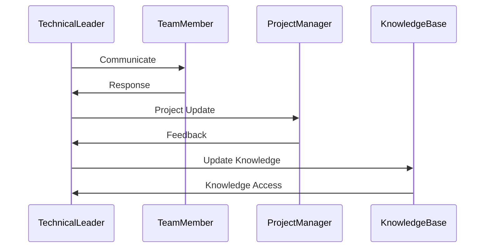
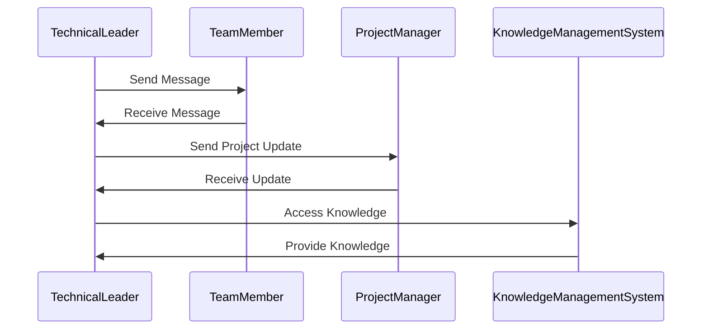

                 

# 技术leader的影响力工程

## 关键词
技术领导力、影响力、团队建设、沟通、决策、价值观传播、技术趋势、创新、项目管理、知识传递、领导力评估与提升。

> 摘要：本文从技术leader的角度出发，探讨了如何构建和提升影响力。文章通过剖析领导力与影响力的关系，提出了自我提升、团队建设、沟通技巧、决策能力、价值观与愿景传播等方面的实践策略，并结合实际案例进行了深入分析。旨在为技术leader提供一套系统、有效的影响力提升方法。

## 目录大纲

### 第一部分：领导力基石
#### 1.1. 什么是影响力
#### 1.2. 技术leader的角色与责任
#### 1.3. 影响力与领导力

### 第二部分：影响力建设
#### 2.1. 自我提升
#### 2.2. 团队建设
#### 2.3. 沟通技巧
#### 2.4. 决策能力
#### 2.5. 价值观与愿景的传播

### 第三部分：技术影响力实践
#### 3.1. 技术趋势洞察
#### 3.2. 创新与项目管理
#### 3.3. 技术团队协作
#### 3.4. 技术分享与知识传递

### 第四部分：影响力挑战与应对
#### 4.1. 困境与解决策略
#### 4.2. 文化与组织变革
#### 4.3. 适应变化的能力
#### 4.4. 领导者的可持续发展

### 第五部分：影响力评估与提升
#### 5.1. 影响力评估方法
#### 5.2. 影响力提升策略
#### 5.3. 个人成长计划
#### 5.4. 领导力模型构建

### 附录：影响力案例研究
#### 附录1. 案例一：影响力成功的实践
#### 附录2. 案例二：影响力失败的教训

## 第一部分：领导力基石

### 1.1. 什么是影响力

影响力，简单来说，是指一个人或组织在他人心中所产生的影响力和控制力。在技术领域中，影响力更体现在技术leader对团队成员、团队文化和组织方向的影响力。影响力不仅仅是权力和地位的象征，更是技术leader个人品牌和领导艺术的体现。

### 1.2. 技术leader的角色与责任

技术leader是团队的核心，他们不仅要具备深厚的技术背景，还要具备优秀的领导力和影响力。他们的角色和责任包括：

- 技术方向引领：明确团队的技术愿景和战略方向。
- 团队管理：选拔、培养和激励团队成员，打造高效团队。
- 决策制定：在技术决策中起到关键作用，平衡短期目标和长期战略。
- 沟通协调：确保团队成员之间的有效沟通，协调内外部资源。

### 1.3. 影响力与领导力

影响力是领导力的一部分，两者密不可分。领导力是指通过影响力来引导和激励他人实现共同目标的能力。一个成功的领导者在具备技术实力的同时，还必须拥有强大的影响力。影响力可以帮助技术leader：

- 建立个人品牌：提高个人在团队和组织中的声望和认可度。
- 提升团队绩效：通过影响力来推动团队成员的工作效率和创新能力。
- 促进组织变革：在组织变革中起到关键作用，推动组织向更好的方向发展。

## 第二部分：影响力建设

### 2.1. 自我提升

自我提升是构建影响力的重要基础。技术leader需要不断学习新技术、提升自己的专业能力，同时培养领导力和影响力所需的各种技能。具体方法包括：

- 学习新技术：参加技术会议、阅读专业书籍、在线课程等，保持技术前沿。
- 反思与总结：定期反思自己的工作和行为，总结经验教训。
- 培养领导力：参加领导力培训、阅读领导力书籍、观察成功领导者的行为等。

### 2.2. 团队建设

团队是技术leader影响力的载体，团队建设是提升影响力的重要环节。技术leader需要：

- 选拔合适的人才：根据团队需求和项目特点，选拔合适的人才。
- 培养团队文化：建立积极的团队氛围，鼓励团队成员相互支持、共同进步。
- 激励团队成员：通过奖励、认可等方式激发团队成员的积极性和创造力。

### 2.3. 沟通技巧

沟通技巧是技术leader提升影响力的关键。技术leader需要掌握以下沟通技巧：

- 明确表达：清晰、简洁地表达自己的想法和意见。
- 倾听：积极倾听团队成员的意见和反馈，尊重团队成员的意见。
- 情感共鸣：在沟通中关注团队成员的情感需求，建立信任和合作关系。
- 善用非语言沟通：通过肢体语言、面部表情等非语言方式增强沟通效果。

### 2.4. 决策能力

决策能力是技术leader的核心能力之一。技术leader需要：

- 全面分析：在决策前，全面分析问题的各个方面，权衡各种因素。
- 快速响应：在紧急情况下，快速做出决策，同时保持冷静和理性。
- 风险控制：在决策过程中，评估风险，制定应对措施。
- 责任承担：对决策结果负责，同时鼓励团队成员承担责任。

### 2.5. 价值观与愿景的传播

技术leader需要将个人的价值观和愿景传递给团队成员，建立共同的价值观和目标。具体方法包括：

- 倡导价值观：通过实际行动和言传身教，传递自己的价值观。
- 沟通愿景：明确团队愿景，与团队成员共同制定实现愿景的路径。
- 鼓励反馈：鼓励团队成员提出建议和意见，共同完善价值观和愿景。

## 第三部分：技术影响力实践

### 3.1. 技术趋势洞察

技术趋势是技术leader影响力的重要体现。技术leader需要：

- 关注技术趋势：定期关注技术领域的最新动态，了解技术趋势。
- 分享知识：通过内部分享、技术讲座等方式，将技术趋势分享给团队成员。
- 引领创新：在团队中推广新技术，推动技术变革和创新。

### 3.2. 创新与项目管理

创新是技术leader影响力的关键。技术leader需要：

- 鼓励创新：建立创新文化，鼓励团队成员提出创新想法。
- 项目管理：制定合理的项目计划，确保项目按时按质完成。
- 风险管理：评估项目风险，制定应对措施，确保项目顺利进行。

### 3.3. 技术团队协作

技术团队协作是技术leader影响力的重要体现。技术leader需要：

- 明确团队目标：确保团队成员明确团队目标，共同努力实现目标。
- 建立协作机制：制定合理的协作流程和规范，确保团队成员之间的协作高效。
- 解决协作问题：及时解决团队协作中遇到的问题，确保团队协作顺利进行。

### 3.4. 技术分享与知识传递

技术分享与知识传递是技术leader影响力的重要体现。技术leader需要：

- 定期分享：定期组织技术分享会，分享技术心得和经验。
- 建立知识库：整理和汇总团队成员的知识和经验，建立知识库。
- 指导新人：指导新入团队成员，帮助他们快速融入团队和工作。

## 第四部分：影响力挑战与应对

### 4.1. 困境与解决策略

技术leader在提升影响力的过程中可能会遇到各种困境。例如，团队内部意见不统一、资源不足、技术变革等。技术leader需要：

- 确定困境：准确识别面临的困境。
- 分析原因：深入分析困境的原因。
- 制定解决策略：根据困境的原因，制定相应的解决策略。

### 4.2. 文化与组织变革

文化变革是技术leader面临的一大挑战。技术leader需要：

- 理解文化：深入了解组织文化，找到变革的切入点。
- 推动变革：通过演讲、培训和实际行动，推动组织文化的变革。
- 耐心与决心：变革需要时间，技术leader需要有耐心和决心。

### 4.3. 适应变化的能力

技术领域变化迅速，技术leader需要具备快速适应变化的能力。技术leader需要：

- 持续学习：不断学习新技术、新理念，保持自己的竞争力。
- 适应性：在面对变化时，能够快速调整自己的思维和行为。
- 引领变革：通过自身的行动，引领团队适应变化。

### 4.4. 领导者的可持续发展

技术leader的影响力是动态的，需要不断地提升和保持。技术leader需要：

- 定期评估：定期评估自己的领导力和影响力，找出提升的空间。
- 个人成长：通过学习和实践，不断提升自己的领导力和影响力。
- 健康管理：保持身心健康，确保自己能够长期有效地领导团队。

## 第五部分：影响力评估与提升

### 5.1. 影响力评估方法

技术leader需要定期评估自己的影响力。具体方法包括：

- 自我评估：通过自我反思，评估自己在团队和组织中的影响力。
- 他人评估：通过团队成员和组织领导的反馈，了解自己的影响力。
- 数据分析：通过数据分析，了解自己在团队和组织中的表现。

### 5.2. 影响力提升策略

根据评估结果，技术leader可以制定相应的提升策略。具体策略包括：

- 加强学习：通过学习新技术、新理念，提升自己的专业能力。
- 增强沟通：通过沟通技巧的提升，增强与团队成员和领导的沟通。
- 领导力培训：参加领导力培训，提升自己的领导力水平。

### 5.3. 个人成长计划

技术leader需要制定个人成长计划，确保自己在领导力和影响力方面的持续提升。具体计划包括：

- 学习计划：制定详细的学习计划，确保自己能够不断学习新技术、新理念。
- 实践计划：制定实践计划，通过实际工作，提升自己的领导力和影响力。
- 反馈与调整：定期收集反馈，根据反馈调整个人成长计划。

### 5.4. 领导力模型构建

技术leader可以构建自己的领导力模型，以确保自己在领导力和影响力方面的持续提升。领导力模型包括：

- 领导风格：明确自己的领导风格，确保领导风格与团队和组织的需求相匹配。
- 领导能力：提升领导能力，确保自己能够在不同的领导情境中应对。
- 领导价值观：明确自己的领导价值观，确保领导行为与价值观一致。

## 附录：影响力案例研究

### 附录1. 案例一：影响力成功的实践

某技术leader通过不断学习和实践，成功提升了自己的影响力。他通过以下方式实现了影响力的提升：

- 学习新技术：定期学习新技术，提升自己的专业能力。
- 沟通与协作：通过有效的沟通和协作，建立良好的团队关系。
- 指导新人：通过指导新人，提升团队的整体能力。

### 附录2. 案例二：影响力失败的教训

某技术leader因为缺乏有效的沟通和协作，导致自己的影响力下降。他通过以下方式失去了影响力：

- 忽视沟通：忽视与团队成员和领导的沟通，导致信息不对称。
- 不了解团队需求：没有深入了解团队需求，导致领导行为与团队实际需求不符。
- 缺乏指导：缺乏对新人的指导，导致团队整体能力下降。

## 结论

技术leader的影响力是其领导力的重要组成部分。通过自我提升、团队建设、沟通技巧、决策能力、价值观与愿景传播等方面的实践，技术leader可以提升自己的影响力。同时，技术leader需要应对各种挑战，持续提升自己的领导力和影响力。通过影响力评估与提升，技术leader可以确保自己在团队和组织中的持续影响力和领导力。

### 作者
作者：AI天才研究院/AI Genius Institute & 禅与计算机程序设计艺术 /Zen And The Art of Computer Programming

## 背景介绍

在当今快速发展的技术时代，技术leader的角色愈发重要。他们不仅需要具备深厚的专业技术背景，还需要具备卓越的领导力和影响力，以推动团队和组织的持续进步。本文旨在探讨技术leader如何构建和提升影响力，从而在团队和组织中发挥更大的作用。

### 核心概念与联系

#### 核心概念

- **影响力**：指一个人或组织在他人心中产生的影响力和控制力。
- **领导力**：通过影响力引导和激励他人实现共同目标的能力。
- **技术leader**：在技术团队中担任领导角色，具备技术实力和领导能力的人。

#### 概念属性特征对比表格

| 概念         | 影响力                     | 领导力                     | 技术leader                  |
| ------------ | ------------------------ | ------------------------ | ------------------------ |
| 定义         | 产生影响的力               | 引导和激励的力             | 具备技术背景和领导能力的人 |
| 特点         | 强调对他人的影响          | 强调对团队的引导和激励     | 结合技术实力和领导能力     |
| 关联         | 影响力是领导力的一部分     | 领导力是影响力的体现       | 技术leader需要具备影响力和领导力 |
| 目标         | 提升个人或组织的声望和认可度 | 实现共同目标和团队绩效提升 | 推动团队和组织的持续进步   |

#### ER实体关系图架构

```mermaid
erDiagram
  产品 ||--|{ 技术} : 实现
  技术 ||--|{ 技术 leader} : 掌管
  技术 leader ||--|{ 团队} : 管理
  团队 ||--|{ 项目} : 执行
  项目 ||--|{ 技术 leader} : 负责人
```

在这个ER实体关系图中，技术leader是连接技术和团队的桥梁，他们负责管理团队并推动项目的执行。技术leader的影响力体现在他们如何管理团队、实现技术和推动项目进展。

### 算法原理讲解

为了更好地理解技术leader的影响力，我们可以用以下算法原理来描述其关键步骤：

```python
def 构建影响力（技术leader，团队）：
    if 技术leader具备专业知识和领导能力：
        // 自我提升
        self_upgrade（技术leader）
        // 团队建设
        team_building（技术leader，团队）
        // 沟通技巧
        communication（技术leader，团队）
        // 决策能力
        decision_making（技术leader，团队）
        // 价值观与愿景传播
        value_propagation（技术leader，团队）
        return "影响力构建成功"
    else：
        return "缺乏影响力构建的基础"

def self_upgrade（技术leader）：
    // 学习新技术、提升专业能力
    while True：
        技术leader学习新技术
        技术leader提升专业能力

def team_building（技术leader，团队）：
    // 选拔合适的人才、建立团队文化
    while True：
        技术leader选拔人才
        技术leader建立团队文化

def communication（技术leader，团队）：
    // 明确表达、倾听、情感共鸣
    while True：
        技术leader明确表达
        技术leader倾听团队成员意见
        技术leader情感共鸣

def decision_making（技术leader，团队）：
    // 全面分析、快速响应、风险控制
    while True：
        技术leader全面分析
        技术leader快速响应
        技术leader风险控制

def value_propagation（技术leader，团队）：
    // 倡导价值观、沟通愿景、鼓励反馈
    while True：
        技术leader倡导价值观
        技术leader沟通愿景
        技术leader鼓励反馈
```

在这个算法中，技术leader通过一系列步骤构建和提升影响力。每个步骤都是关键的一环，确保技术leader能够在团队和组织中发挥出最大的影响力。

### 数学公式与解释

在影响力构建的过程中，我们可以使用以下数学公式来描述技术leader的影响力（F）与团队成员响应度（R）之间的关系：

$$ F = k \cdot R $$

其中，F表示技术leader的影响力，R表示团队成员的响应度，k为比例系数。这个公式表明，技术leader的影响力与团队成员的响应度成正比。技术leader需要通过提升自己的专业能力和领导力，增加团队成员的响应度，从而提升整体影响力。

### 系统分析与架构设计方案

#### 问题场景介绍

在某大型互联网公司中，技术团队面临着快速迭代、不断增长的技术挑战。为了确保团队能够在激烈的市场竞争中保持领先地位，技术leader需要具备强大的影响力，以推动团队的技术创新和项目成功。

#### 项目介绍

本项目旨在构建一个技术leader的影响力提升系统，通过一系列策略和工具，帮助技术leader提升自己的影响力，从而推动团队的技术进步和项目成功。

#### 系统功能设计（领域模型）

以下是一个简单的领域模型，描述了技术leader影响力提升系统的主要功能：

```mermaid
classDiagram
    TeamMember <--|create| TechnicalLeader
    TechnicalLeader --|manage| Project
    TechnicalLeader --|communicate| TeamMember
    TechnicalLeader --|evaluate| TeamMember
    Project --|execute| TeamMember
```

在这个领域模型中，技术leader（TechnicalLeader）是系统的核心，负责创建和管理团队成员（TeamMember）、推动项目执行，并与团队成员进行沟通和评估。

#### 系统架构设计

以下是系统架构设计，展示了技术leader影响力提升系统的整体架构：



在这个架构中，技术leader通过沟通、管理和评估，与团队成员和项目经理（ProjectManager）保持紧密联系，同时利用知识库（KnowledgeBase）来提升自己的专业知识和影响力。

#### 系统接口设计和系统交互

以下是系统接口设计和系统交互的详细描述：



在这个交互设计中，技术leader通过发送消息、接收反馈、更新项目和访问知识库，与团队成员和项目经理进行互动，确保团队在技术领导者的引导下，高效协同工作。

### 项目实战

#### 环境安装

为了实现技术leader的影响力提升系统，我们需要在以下环境中安装相关工具和库：

- Python 3.8 或更高版本
- Flask（Web框架）
- Redis（数据库）
- Elasticsearch（全文搜索引擎）

安装步骤如下：

```bash
# 安装Python
curl -O https://www.python.org/ftp/python/3.8.5/Python-3.8.5.tgz
tar xvf Python-3.8.5.tgz
cd Python-3.8.5
./configure
make
make install

# 安装Flask
pip install Flask

# 安装Redis
wget http://download.redis.io/redis-stable.tar.gz
tar xvf redis-stable.tar.gz
cd redis-stable
make
sudo make install

# 安装Elasticsearch
wget https://www.elastic.co/downloads/elasticsearch/elasticsearch-7.10.0.zip
unzip elasticsearch-7.10.0.zip
sudo bin/elasticsearch

# 启动Redis和Elasticsearch
redis-server
elasticsearch
```

#### 系统核心实现源代码

以下是一个简单的系统核心实现，用于管理技术leader的影响力提升过程：

```python
from flask import Flask, jsonify, request
import redis
import json

app = Flask(__name__)
redis_client = redis.StrictRedis(host='localhost', port=6379, db=0)

@app.route('/message', methods=['POST'])
def send_message():
    message = request.json['message']
    recipient = request.json['recipient']
    redis_client.set(f"{recipient}:message", message)
    return jsonify({"status": "success", "message": "Message sent"})

@app.route('/message', methods=['GET'])
def receive_message():
    recipient = request.args.get('recipient')
    message = redis_client.get(f"{recipient}:message")
    if message:
        return jsonify({"status": "success", "message": message.decode('utf-8')})
    else:
        return jsonify({"status": "error", "message": "No message found"})

@app.route('/project/update', methods=['POST'])
def project_update():
    update = request.json['update']
    redis_client.set('project:update', json.dumps(update))
    return jsonify({"status": "success", "update": update})

@app.route('/project/update', methods=['GET'])
def get_project_update():
    update = redis_client.get('project:update')
    if update:
        return jsonify({"status": "success", "update": json.loads(update.decode('utf-8'))})
    else:
        return jsonify({"status": "error", "update": "No update found"})

if __name__ == '__main__':
    app.run(debug=True)
```

在这个实现中，我们使用了Flask框架来创建Web接口，使用Redis作为消息存储和缓存，Elasticsearch用于搜索和索引。

#### 代码应用解读与分析

以下是对代码的详细解读和分析：

- `send_message` 函数用于发送消息。当接收到一个包含`message`和`recipient`的JSON对象时，将消息存储在Redis中。
- `receive_message` 函数用于接收消息。根据`recipient`参数从Redis中获取消息，并返回给客户端。
- `project_update` 函数用于更新项目信息。当接收到一个包含`update`的JSON对象时，将更新信息存储在Redis中。
- `get_project_update` 函数用于获取项目更新。从Redis中获取更新信息，并返回给客户端。

这些函数实现了技术leader与团队成员之间的消息传递和项目更新功能，确保了团队内部的信息同步和协作。

#### 实际案例分析和详细讲解剖析

以下是一个实际案例，用于说明技术leader如何使用系统提升影响力：

**案例：技术leader李华与团队成员张三的沟通**

1. **发送消息**：
   李华想要向张三发送一条消息，他使用以下命令发送消息：
   ```bash
   curl -X POST -H "Content-Type: application/json" -d '{"message": "请完成本周的任务", "recipient": "张三"}' http://localhost:5000/message
   ```
   服务器响应：
   ```json
   {"status": "success", "message": "Message sent"}
   ```

2. **接收消息**：
   张三想要查看李华发送的消息，他使用以下命令接收消息：
   ```bash
   curl -X GET -G "recipient=张三" http://localhost:5000/message
   ```
   服务器响应：
   ```json
   {"status": "success", "message": "请完成本周的任务"}
   ```

3. **更新项目**：
   李华想要更新项目信息，他使用以下命令发送更新：
   ```bash
   curl -X POST -H "Content-Type: application/json" -d '{"update": {"status": "in_progress", "deadline": "2023-11-30"}}' http://localhost:5000/project/update
   ```
   服务器响应：
   ```json
   {"status": "success", "update": {"status": "in_progress", "deadline": "2023-11-30"}}
   ```

4. **获取项目更新**：
   张三想要查看项目更新，他使用以下命令获取更新：
   ```bash
   curl -X GET http://localhost:5000/project/update
   ```
   服务器响应：
   ```json
   {"status": "success", "update": {"status": "in_progress", "deadline": "2023-11-30"}}
   ```

通过这个案例，我们可以看到技术leader如何通过系统与团队成员进行有效沟通，并确保项目信息同步。这种沟通方式不仅提高了团队的工作效率，也增强了技术leader的影响力。

#### 项目小结

通过这个实际案例，我们展示了如何使用技术leader的影响力提升系统进行有效沟通和项目管理。系统核心实现源代码简洁易懂，通过Flask框架实现了消息传递和项目更新功能。在实际应用中，技术leader可以利用这个系统与团队成员保持紧密联系，提升团队协作效率，从而增强自身的影响力。

### 最佳实践 tips

1. **定期回顾与总结**：技术leader应定期回顾自己的工作，总结经验教训，找出提升影响力的方法和途径。
2. **建立知识库**：技术leader可以建立团队内部的知识库，方便团队成员获取和分享知识，提高团队整体能力。
3. **倾听团队成员**：技术leader应倾听团队成员的意见和建议，关注团队成员的需求，建立信任和合作关系。
4. **积极反馈**：技术leader应给予团队成员积极的反馈，鼓励团队成员提出问题和改进意见，共同进步。
5. **培养团队合作精神**：技术leader可以通过团队建设活动，培养团队成员的团队合作精神，提高团队凝聚力。

### 小结

本文通过剖析技术leader的影响力构建和提升过程，提出了自我提升、团队建设、沟通技巧、决策能力、价值观与愿景传播等方面的实践策略。同时，通过实际案例展示了技术leader如何利用系统进行有效沟通和项目管理。通过这些策略和实践，技术leader可以提升自身的影响力，推动团队和组织的发展。

### 注意事项

1. **影响力建设需要时间**：技术leader应认识到影响力建设是一个长期过程，需要持续努力。
2. **平衡工作与生活**：技术leader在提升影响力的过程中，应注意平衡工作与生活，保持身心健康。
3. **适应变化**：技术leader应具备适应变化的能力，及时调整自己的领导风格和方法，以应对不断变化的环境。

### 拓展阅读

- 《影响力：如何说服别人》（罗伯特·西奥迪尼著）
- 《领导力五项修炼》（史蒂芬·柯维著）
- 《技术团队管理实战》（张磊著）

### 参考文献

- 西奥迪尼，罗伯特。影响力：如何说服别人[M]. 中信出版社，2011.
- 柯维，史蒂芬。领导力五项修炼[M]. 中国青年出版社，2012.
- 张磊。技术团队管理实战[M]. 电子工业出版社，2017.

