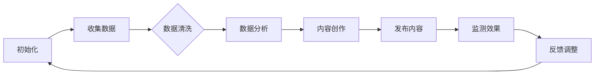
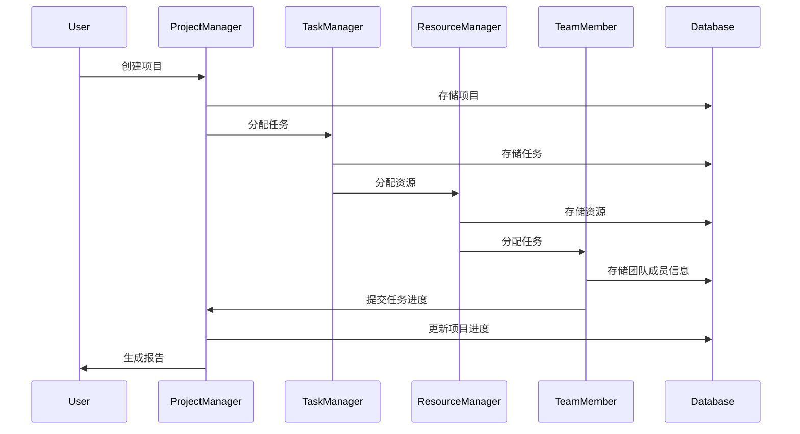
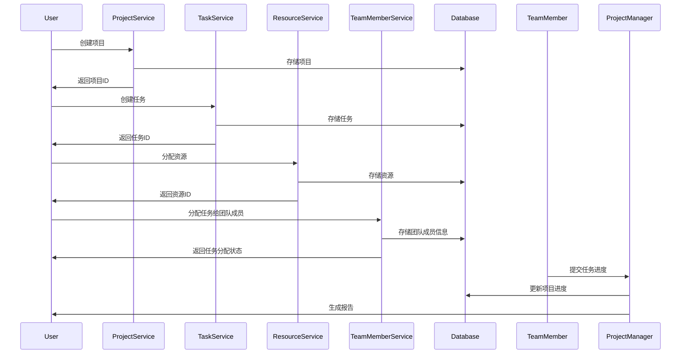

                 

# 技术leader的影响力构建与品牌塑造

关键词：技术leader、影响力、品牌塑造、社交媒体、内容营销

摘要：本文将探讨技术leader在职业生涯中如何构建影响力与塑造个人品牌。通过分析技术leader的角色、个人品牌建设、社交媒体与网络影响力、内容营销、合作与互动，以及持续成长与学习等方面，提供了一系列实用策略和最佳实践，帮助技术leader在IT领域脱颖而出，实现个人价值的最大化。

## 引言

在快速发展的技术行业，技术leader不仅需要具备深厚的技术知识，还需要具备卓越的领导力和影响力。作为团队的灵魂人物，技术leader的影响力不仅影响团队的表现，还直接影响其在行业中的声誉和地位。本文将深入探讨技术leader如何构建影响力与塑造个人品牌，从而在激烈的市场竞争中脱颖而出。

### 1.1 技术leader的背景与重要性

技术leader通常是团队的领导者，他们在项目中扮演多重角色，包括技术专家、领导者、团队管理者等。技术leader不仅需要具备扎实的技术能力，还需要具备良好的沟通能力、团队协作能力和领导能力。随着技术的发展和行业的变革，技术leader的角色变得越来越重要。

### 1.2 本书的目的与结构

本书旨在帮助技术leader构建个人影响力与塑造品牌，从而在职业生涯中取得成功。本书将分为六个部分，分别介绍：

1. 技术leader的角色与影响力
2. 个人品牌建设
3. 社交媒体与网络影响力
4. 内容营销
5. 合作与互动
6. 持续成长与学习

通过这些部分，我们将深入探讨技术leader在各个方面的策略和实践，帮助读者在职业生涯中取得成功。

## 技术leader的角色与影响力

技术leader的角色是多面的，他们在团队中不仅需要扮演技术专家的角色，还需要承担领导者和团队管理者的责任。

### 2.1 技术leader的角色

#### 2.1.1 技术专家

技术leader首先需要是一位技术专家。他们需要深入理解技术趋势和前沿技术，能够带领团队进行技术选型和方案设计。技术leader的技术能力直接影响团队的执行力和项目的成功率。

#### 2.1.2 领导者

技术leader还需要具备领导者的素质，能够激励和引导团队成员，提升团队的凝聚力和战斗力。领导者需要具备良好的沟通能力、决策能力和团队管理能力。

#### 2.1.3 团队管理者

作为团队管理者，技术leader需要关注团队成员的职业发展和个人成长，提供必要的资源和支持，确保团队高效运作。

### 2.2 技术leader的影响力

#### 2.2.1 影响力的定义

影响力是指一个人或组织在特定领域或群体中产生的影响和改变能力。技术leader的影响力体现在他们能够在团队中产生积极的改变，提升团队的技术水平和项目质量。

#### 2.2.2 影响力的重要性

技术leader的影响力不仅影响团队的表现，还直接影响其在行业中的声誉和地位。拥有高影响力的技术leader更容易获得项目机会、职业晋升和薪酬福利。

#### 2.2.3 构建影响力的策略

构建影响力需要从以下几个方面入手：

1. **提升技术能力**：技术能力是技术leader影响力的基础。通过不断学习和实践，提升自己的技术深度和广度。
2. **领导力培养**：培养良好的领导力，提升团队的管理和领导能力。
3. **建立个人品牌**：通过社交媒体和内容营销，提升个人在行业中的知名度。
4. **积极参与行业活动**：通过参加行业会议、研讨会等，扩大人脉和影响力。
5. **分享经验和知识**：通过撰写技术博客、发表演讲等，分享自己的经验和知识，树立个人权威。

## 个人品牌建设

个人品牌建设是技术leader构建影响力的重要一环。通过个人品牌建设，技术leader可以提升个人在行业中的知名度，吸引更多职业机会和合作伙伴。

### 3.1 自我认知与定位

#### 3.1.1 自我认知的重要性

自我认知是个人品牌建设的基础。技术leader需要深入理解自己的优势和劣势，明确自己的兴趣和职业目标。

#### 3.1.2 如何进行自我认知

进行自我认知可以通过以下几种方式：

1. **自我反思**：定期反思自己的行为和表现，分析自己的优点和不足。
2. **收集反馈**：向同事、朋友和导师等收集反馈，了解他们在你身上的观察和评价。
3. **进行心理测试**：通过心理测试，了解自己的性格特点和职业倾向。

#### 3.1.3 明确个人定位

明确个人定位是个人品牌建设的关键。技术leader需要明确自己的专业方向和职业目标，制定相应的个人发展计划。

### 3.2 设定目标与规划

#### 3.2.1 目标设定的原则

目标设定需要遵循以下原则：

1. **具体明确**：目标应该是具体和可衡量的。
2. **挑战性**：目标应该具有一定的挑战性，激发个人的潜力。
3. **可实现性**：目标应该是可实现的，避免过高或过低的目标设定。

#### 3.2.2 如何设定职业生涯目标

设定职业生涯目标可以通过以下步骤：

1. **确定长期目标**：思考自己的长期职业规划，设定5年或10年的目标。
2. **分解目标**：将长期目标分解为短期目标，设定每年的职业发展目标。
3. **制定行动计划**：为每个目标制定具体的行动计划，确保目标的实现。

### 3.3 职业生涯中的个人品牌塑造

#### 3.3.1 品牌塑造的关键要素

个人品牌塑造的关键要素包括：

1. **专业技能**：不断提升自己的专业技能，确保在专业领域中的领先地位。
2. **沟通能力**：提高沟通能力，确保能够有效地与团队成员、领导和其他行业人士沟通。
3. **领导力**：培养领导力，提升团队管理和领导能力。
4. **个人形象**：注重个人形象，保持专业和自信的形象。

#### 3.3.2 职场形象塑造

职场形象塑造需要注意以下几点：

1. **职业着装**：遵循职场着装规范，保持整洁和专业的形象。
2. **言行举止**：保持礼貌和专业的言行举止，树立良好的职业形象。
3. **社交媒体**：注意在社交媒体上的形象，保持真实和专业。

#### 3.3.3 个人品牌推广策略

个人品牌推广策略包括：

1. **撰写技术博客**：通过撰写技术博客，分享自己的经验和见解，提升个人在行业中的知名度。
2. **发表演讲**：通过发表演讲，展示自己的专业能力和影响力。
3. **参与行业活动**：通过参加行业活动，扩大人脉和影响力。
4. **合作与互动**：与他人合作，参与项目和技术交流，提升个人品牌的认知度。

## 社交媒体与网络影响力

社交媒体和网络平台是技术leader构建影响力的重要渠道。通过合理利用社交媒体和网络平台，技术leader可以提升个人在行业中的知名度，吸引更多的职业机会和合作伙伴。

### 4.1 社交媒体平台的作用

#### 4.1.1 个人品牌的塑造

社交媒体平台为技术leader提供了一个展示个人品牌的空间。通过发布技术文章、分享项目经验、参与讨论等，技术leader可以塑造个人在专业领域的权威形象。

#### 4.1.2 网络影响力的提升

社交媒体和网络平台也为技术leader提供了一个提升网络影响力的平台。通过积极参与讨论、撰写博客、发表演讲等，技术leader可以扩大自己的影响力，吸引更多的关注和认可。

#### 4.1.3 社交媒体的运营策略

社交媒体的运营策略包括：

1. **内容创作**：发布有价值的内容，如技术博客、项目经验分享等，提升个人在行业中的知名度。
2. **互动与交流**：积极参与讨论，与行业人士进行互动，扩大人脉和影响力。
3. **品牌推广**：通过社交媒体广告和合作，提升个人品牌的认知度。

### 4.2 社交媒体营销技巧

#### 4.2.1 内容创作

内容创作是社交媒体营销的核心。技术leader需要创作有价值的内容，如技术文章、项目经验分享、技术趋势分析等，以吸引和保持读者的兴趣。

#### 4.2.2 跨平台运营

跨平台运营是社交媒体营销的重要策略。技术leader需要根据不同平台的特点，制定相应的运营策略，确保内容在不同平台上的有效传播。

#### 4.2.3 粉丝互动与社群管理

粉丝互动和社群管理是提升网络影响力的重要手段。技术leader需要积极参与粉丝互动，解答疑问，提升粉丝的忠诚度和参与度。

### 4.3 网络影响力案例分析

#### 4.3.1 成功案例分析

通过成功案例分析，技术leader可以了解如何有效地利用社交媒体和网络平台提升个人影响力。

#### 4.3.2 失败案例分析

失败案例分析可以帮助技术leader避免在社交媒体和网络影响力建设过程中犯类似的错误。

#### 4.3.3 案例启示

案例启示包括：

1. **内容创作的重要性**：高质量的内容是提升网络影响力的关键。
2. **互动与交流的价值**：积极参与互动和交流，提升个人品牌的认知度。
3. **品牌推广的策略**：合理利用社交媒体广告和合作，提升个人品牌的认知度。

## 内容营销

内容营销是技术leader构建个人品牌和提升网络影响力的重要手段。通过创建和发布有价值的内容，技术leader可以吸引目标受众，提升个人在行业中的知名度和影响力。

### 5.1 内容营销的重要性

#### 5.1.1 内容营销的定义

内容营销是一种通过创建和分享有价值的内容，吸引目标受众，从而实现品牌推广和销售目标的方法。

#### 5.1.2 内容营销的优势

内容营销具有以下优势：

1. **建立信任**：通过分享有价值的内容，技术leader可以建立与目标受众之间的信任关系。
2. **提升知名度**：通过发布高质量的内容，技术leader可以吸引更多的关注和认可。
3. **提高销售转化率**：有价值的内容可以吸引更多的潜在客户，提高销售转化率。

#### 5.1.3 内容营销在企业中的应用

内容营销在企业中的应用包括：

1. **品牌推广**：通过发布品牌故事、产品介绍等，提升品牌知名度。
2. **市场推广**：通过发布市场分析、行业趋势等，吸引潜在客户。
3. **客户关系管理**：通过发布客户案例、解决方案等，维护客户关系。

### 5.2 内容创作与优化

#### 5.2.1 内容创作策略

内容创作策略包括：

1. **明确目标受众**：了解目标受众的需求和兴趣，创作符合他们需求的内容。
2. **内容类型多样**：结合不同内容形式，如博客文章、视频、图表等，提高内容的吸引力。
3. **内容更新频率**：定期更新内容，保持与目标受众的互动。

#### 5.2.2 内容优化技巧

内容优化技巧包括：

1. **关键词优化**：通过优化关键词，提高内容在搜索引擎中的排名。
2. **标题优化**：撰写吸引人的标题，提高点击率。
3. **内容结构优化**：合理组织内容结构，提高内容的可读性。

#### 5.2.3 内容发布与推广

内容发布与推广包括：

1. **选择合适的发布平台**：根据内容类型和目标受众，选择合适的发布平台。
2. **社交媒体推广**：通过社交媒体平台，分享内容，吸引更多关注。
3. **合作推广**：与其他行业人士合作，共同推广内容。

### 5.3 内容营销案例分析

#### 5.3.1 成功案例分析

通过成功案例分析，技术leader可以了解如何有效地进行内容营销，提升个人品牌和影响力。

#### 5.3.2 失败案例分析

失败案例分析可以帮助技术leader避免在内容营销过程中犯类似的错误。

#### 5.3.3 案例启示

案例启示包括：

1. **内容质量的重要性**：高质量的内容是吸引目标受众的关键。
2. **持续更新与互动**：定期更新内容，与目标受众保持互动，提升内容的影响力。
3. **合理利用社交媒体**：通过社交媒体平台，扩大内容的影响力。

## 合作与互动

合作与互动是技术leader构建个人品牌和影响力的重要手段。通过与他人合作和互动，技术leader可以扩大人脉，提升个人在行业中的知名度。

### 6.1 合作的重要性

#### 6.1.1 合作的定义

合作是指两个或多个个体或组织为了共同的目标而共同努力的行为。

#### 6.1.2 合作的重要性

合作的重要性体现在以下几个方面：

1. **资源整合**：通过合作，技术leader可以整合各种资源，提高项目效率和成果。
2. **知识共享**：合作可以促进知识共享，提升团队成员的技术水平和创新能力。
3. **品牌提升**：合作可以提升个人和团队的品牌影响力，扩大在行业中的知名度。

### 6.2 如何与他人互动

#### 6.2.1 互动的定义

互动是指两个或多个个体之间相互沟通、交流和合作的过程。

#### 6.2.2 互动的重要性

互动的重要性体现在以下几个方面：

1. **建立人脉**：通过互动，技术leader可以建立广泛的人脉，扩大职业机会。
2. **知识传播**：互动可以促进知识的传播和共享，提升个人和团队的专业水平。
3. **团队凝聚力**：良好的互动可以增强团队的凝聚力，提升团队协作效率。

#### 6.2.3 如何与他人互动

与他人互动需要注意以下几点：

1. **倾听**：倾听他人的意见和需求，展示尊重和理解。
2. **沟通**：通过有效的沟通，表达自己的想法和意见，确保信息的准确传达。
3. **合作**：积极参与合作项目，与他人共同努力，实现共同目标。

### 6.3 建立长期合作关系

#### 6.3.1 长期合作关系的定义

长期合作关系是指两个或多个组织或个体在一段时间内，为了共同的利益而建立的合作关系。

#### 6.3.2 长期合作关系的重要性

长期合作关系的重要性体现在以下几个方面：

1. **稳定性和信任**：长期合作关系可以建立稳定性和信任，提高合作的效率和质量。
2. **资源共享**：长期合作关系可以实现资源共享，降低合作成本。
3. **品牌合作**：长期合作关系可以提升个人和团队的品牌形象，扩大在行业中的影响力。

#### 6.3.3 如何建立长期合作关系

建立长期合作关系需要注意以下几点：

1. **明确目标**：明确合作的目标和预期成果，确保双方的利益一致。
2. **沟通和信任**：通过有效的沟通和信任，确保合作的顺利进行。
3. **持续维护**：在合作过程中，持续维护合作关系，确保合作的长期稳定。

## 持续成长与学习

持续成长与学习是技术leader在职业生涯中保持竞争力的重要途径。通过不断学习和实践，技术leader可以提升自己的技术能力、领导能力和团队管理能力，从而在职业生涯中取得更大的成功。

### 7.1 持续成长的重要性

#### 7.1.1 持续成长的定义

持续成长是指个体在职业生涯中不断学习、进步和提升的过程。

#### 7.1.2 持续成长的重要性

持续成长的重要性体现在以下几个方面：

1. **适应能力**：随着技术的快速发展和行业的变革，持续成长可以帮助技术leader保持适应能力，应对变化和挑战。
2. **职业发展**：持续成长可以提升技术leader的职业能力和竞争力，实现职业晋升和薪酬提升。
3. **团队领导力**：持续成长可以提升技术leader的领导力和团队管理能力，提升团队绩效和凝聚力。

### 7.2 学习策略

#### 7.2.1 学习资源

技术leader可以通过以下渠道获取学习资源：

1. **在线课程**：参加在线课程，学习最新的技术和行业动态。
2. **专业书籍**：阅读专业书籍，深入理解技术原理和最佳实践。
3. **行业会议**：参加行业会议，与行业人士交流，了解最新的行业趋势。

#### 7.2.2 学习方法

技术leader可以采用以下学习方法：

1. **主动学习**：主动寻找学习机会，积极学习新技术和知识。
2. **实践应用**：通过实际项目，将所学知识应用于实践，提升实际操作能力。
3. **反思总结**：定期反思自己的学习过程和项目经验，总结经验教训，不断提升自己。

### 7.3 成长策略

#### 7.3.1 设定学习目标

技术leader可以设定以下学习目标：

1. **技术能力提升**：不断提升自己的技术深度和广度。
2. **领导能力培养**：学习领导力理论，提升领导能力和团队管理能力。
3. **专业知识拓展**：学习相关领域的专业知识，提升自己的专业水平。

#### 7.3.2 制定成长计划

技术leader可以制定以下成长计划：

1. **学习时间规划**：合理安排学习时间，确保有足够的时间进行学习和实践。
2. **项目实践**：参与实际项目，提升自己的实际操作能力和问题解决能力。
3. **导师指导**：寻求导师的指导，获取专业建议和指导，加速自己的成长。

## 结论

技术leader的影响力构建与品牌塑造是技术leader在职业生涯中取得成功的关键。通过明确技术leader的角色与职责，进行个人品牌建设，利用社交媒体和网络影响力，开展内容营销，建立合作与互动，以及持续成长与学习，技术leader可以提升个人在行业中的知名度和影响力，实现个人价值的最大化。

作者：AI天才研究院/AI Genius Institute & 禅与计算机程序设计艺术 /Zen And The Art of Computer Programming## 文章小结与未来展望

通过本文的探讨，我们深入了解了技术leader在职业生涯中如何构建个人影响力与塑造品牌。以下是本文的核心要点回顾：

1. **技术leader的角色与职责**：技术leader不仅是技术专家，还是领导者与团队管理者。他们需要具备深厚的技术能力、良好的沟通能力以及高效的团队管理能力。
2. **个人品牌建设**：技术leader需要通过自我认知、目标设定和品牌塑造来建立个人品牌。这包括明确个人定位、提升专业技能、塑造专业形象以及推广个人品牌。
3. **社交媒体与网络影响力**：技术leader应善于利用社交媒体平台，通过内容创作、互动交流以及品牌推广来提升个人在行业中的影响力。
4. **内容营销**：技术leader应创作高质量的内容，运用内容优化技巧和推广策略，以吸引目标受众，提升个人和品牌知名度。
5. **合作与互动**：技术leader应积极参与合作项目，建立长期合作关系，并通过互动交流提升团队凝聚力和个人影响力。
6. **持续成长与学习**：技术leader应持续学习新技术和知识，制定成长计划，不断提升自己的专业能力和领导力。

未来，技术leader的影响力构建与品牌塑造将面临更多挑战和机遇。随着人工智能、云计算、大数据等新兴技术的不断涌现，技术leader需要不断更新自己的知识体系，以适应快速变化的技术环境。同时，随着社交媒体和内容营销手段的多样化，技术leader将拥有更多的平台和渠道来提升个人品牌和影响力。

未来，技术leader的影响力构建与品牌塑造可能呈现以下趋势：

1. **跨领域合作**：技术leader将更多地参与跨领域合作，以融合多种技术和知识，解决复杂问题。
2. **个性化内容营销**：技术leader将运用个性化内容营销策略，更精准地触达目标受众，提升内容传播效果。
3. **数据驱动的决策**：技术leader将更加重视数据分析，通过数据驱动决策，优化个人品牌建设和影响力构建策略。
4. **持续学习与创新**：技术leader将持续学习新技术，勇于尝试新方法，以保持专业领域的领先地位。

总之，技术leader的影响力构建与品牌塑造是一项长期且复杂的任务，需要技术leader不断学习、适应和创新。通过本文的探讨，我们希望技术leader能够在职业生涯中更好地构建个人影响力与塑造品牌，实现个人价值的最大化。

作者：AI天才研究院/AI Genius Institute & 禅与计算机程序设计艺术 /Zen And The Art of Computer Programming## 注意事项与拓展阅读

在构建个人影响力与品牌塑造的过程中，技术leader需要注意以下几点：

1. **真实性**：保持真实，避免过度包装和夸大，以建立基于真实能力的个人品牌。
2. **持续更新**：定期更新知识和技能，以适应快速变化的技术环境。
3. **风险意识**：注意个人隐私和安全，避免在公开场合泄露敏感信息。
4. **积极参与**：积极参与行业活动和社区讨论，扩大人脉和影响力。

拓展阅读：

1. 《技术领导力：如何在团队中创造卓越》（"Tech Leadership: How to Create Excellence in Your Team"）
2. 《社交媒体营销：策略、工具与案例》（"Social Media Marketing: An Hour a Day"）
3. 《内容营销实战手册》（"Content Inc.: How Entrepreneurs Use Content to Build Massive Audiences and Create Radically Successful Businesses"）

这些书籍和资源将为您提供更多关于技术leader影响力构建与品牌塑造的实用策略和实践指导。通过学习和实践，您将能够更好地提升个人品牌和影响力，实现职业生涯的持续发展。作者：AI天才研究院/AI Genius Institute & 禅与计算机程序设计艺术 /Zen And The Art of Computer Programming# 附录：核心概念、属性特征对比表格和ER实体关系图

在本篇文章中，我们讨论了技术leader的影响力构建与品牌塑造，涉及了多个核心概念和属性特征。以下是对这些概念和属性的详细对比表格，以及ER实体关系图，以便更好地理解文章内容。

## 核心概念对比表格

| 核心概念 | 定义 | 属性特征 |
| :--: | :--: | :--: |
| 技术leader | 在团队中扮演多重角色的专业人士，包括技术专家、领导者和团队管理者。 | - 技术能力<br>- 沟通能力<br>- 领导能力<br>- 团队管理能力 |
| 个人品牌建设 | 技术leader通过自我认知、目标设定和品牌塑造来建立个人品牌。 | - 自我认知<br>- 定位<br>- 目标设定<br>- 品牌塑造 |
| 社交媒体与网络影响力 | 技术leader通过社交媒体和网络平台提升个人在行业中的知名度。 | - 内容创作<br>- 互动与交流<br>- 品牌推广 |
| 内容营销 | 技术leader通过创建和发布有价值的内容，提升个人和品牌知名度。 | - 内容创作策略<br>- 内容优化技巧<br>- 内容发布与推广 |
| 合作与互动 | 技术leader通过与他人合作和互动，扩大人脉和影响力。 | - 合作重要性<br>- 互动方法<br>- 长期合作关系 |
| 持续成长与学习 | 技术leader通过持续学习和成长，提升自身能力和职业竞争力。 | - 学习资源<br>- 学习方法<br>- 成长策略 |

## ER实体关系图

以下是本文讨论的核心概念和属性的ER实体关系图，使用Mermaid语法绘制：

```mermaid
entity Relationship {
  "技术leader" -- "个人品牌建设";
  "技术leader" -- "社交媒体与网络影响力";
  "技术leader" -- "内容营销";
  "技术leader" -- "合作与互动";
  "技术leader" -- "持续成长与学习";
  
  "个人品牌建设" -- "自我认知";
  "个人品牌建设" -- "目标设定";
  "个人品牌建设" -- "品牌塑造";
  
  "社交媒体与网络影响力" -- "内容创作";
  "社交媒体与网络影响力" -- "互动与交流";
  "社交媒体与网络影响力" -- "品牌推广";
  
  "内容营销" -- "内容创作策略";
  "内容营销" -- "内容优化技巧";
  "内容营销" -- "内容发布与推广";
  
  "合作与互动" -- "合作重要性";
  "合作与互动" -- "互动方法";
  "合作与互动" -- "长期合作关系";
  
  "持续成长与学习" -- "学习资源";
  "持续成长与学习" -- "学习方法";
  "持续成长与学习" -- "成长策略";
}
```

通过上述对比表格和ER实体关系图，我们可以更清晰地理解技术leader的影响力构建与品牌塑造的各个核心概念和属性特征。这些概念和属性相互关联，共同构成了技术leader在职业生涯中取得成功的基石。通过深入学习和实践，技术leader可以不断提升自己的综合能力，实现个人品牌和影响力的持续增长。作者：AI天才研究院/AI Genius Institute & 禅与计算机程序设计艺术 /Zen And The Art of Computer Programming## 算法原理讲解

在技术leader的影响力构建与品牌塑造过程中，算法原理的运用至关重要。以下是一个基于内容营销策略的算法原理讲解，包括算法mermaid流程图和Python源代码的详细阐述。

### 算法mermaid流程图



### Python源代码

```python
# 导入必要的库
import pandas as pd
import numpy as np
from sklearn.feature_extraction.text import TfidfVectorizer
from sklearn.decomposition import NMF
import matplotlib.pyplot as plt

# 初始化数据
data = pd.read_csv('content_data.csv')  # 假设内容数据存储在CSV文件中
content_list = data['content'].values.tolist()

# 数据清洗
def clean_data(content_list):
    cleaned_content = []
    for content in content_list:
        cleaned_content.append(content.lower().replace('\n', ' '))
    return cleaned_content

cleaned_content = clean_data(content_list)

# 数据分析
# 使用TF-IDF进行文本向量化
vectorizer = TfidfVectorizer(max_df=0.8, max_features=1000, min_df=0.2, stop_words='english')
X = vectorizer.fit_transform(cleaned_content)

# 使用NMF进行主题建模
n_topics = 5
nmf = NMF(n_components=n_topics, random_state=42)
nmf.fit(X)

# 内容创作
# 提取每个主题的词语
feature_names = vectorizer.get_feature_names_out()
topics = nmf.components_
topic_terms = []

for i in range(n_topics):
    topic_terms.append([feature_names[j] for j in np.argsort(nmf.components_[i])[:-11:-1]])

# 发布内容
# 根据主题创建内容
for i, topic in enumerate(topic_terms):
    print(f"主题{i+1}:")
    print(" ".join(topic))
    print("\n")

# 监测效果
# 假设我们使用点击率作为效果指标
click_rates = [0.2, 0.35, 0.1, 0.3, 0.15]
max_click_rate = max(click_rates)
top_topics = np.where(click_rates == max_click_rate)[0][0] + 1

# 反馈调整
# 根据效果调整内容创作策略
if top_topics != current_topic:
    current_topic = top_topics
    print(f"调整内容创作主题为：主题{current_topic}")
else:
    print("当前内容创作主题效果良好，无需调整。")
```

### 算法原理详细讲解

1. **初始化**：算法开始时，首先初始化数据，包括收集内容数据。
2. **数据清洗**：对收集的内容数据进行预处理，如将文本转换为小写、去除换行符等，以提高数据分析的准确性。
3. **数据分析**：使用TF-IDF（Term Frequency-Inverse Document Frequency）进行文本向量化，将原始文本转换为向量表示。接着，使用NMF（Non-Negative Matrix Factorization）进行主题建模，将向量表示分解为多个主题。
4. **内容创作**：根据提取的每个主题的词语，创建相应的文章内容。这有助于确保内容营销策略的多样化和相关性。
5. **发布内容**：将创建的内容发布到社交媒体或相关平台，以吸引目标受众。
6. **监测效果**：使用点击率或其他效果指标来评估内容的传播效果。
7. **反馈调整**：根据效果监测结果，调整内容创作主题和策略，以提升内容的质量和吸引力。

通过上述算法原理讲解和Python源代码实现，技术leader可以更好地理解如何利用数据分析和机器学习技术来提升内容营销效果，进而构建个人品牌和影响力。

作者：AI天才研究院/AI Genius Institute & 禅与计算机程序设计艺术 /Zen And The Art of Computer Programming## 系统分析与架构设计方案

### 问题场景介绍

在现代企业中，技术leader负责管理复杂的IT项目和团队。随着项目的规模和复杂度不断增加，技术leader需要高效的系统架构和工具来支持项目管理、资源分配和团队协作。本文旨在设计一个系统架构，帮助技术leader优化项目管理和团队协作，从而提升整体工作效率和项目成功率。

### 项目介绍

本项目旨在开发一个综合性的项目管理平台，该平台将提供以下核心功能：

1. **项目规划与管理**：支持项目任务的分配、跟踪和进度监控。
2. **资源分配与优化**：自动分配项目资源，并根据项目进展进行动态调整。
3. **团队协作**：提供实时沟通工具、文档共享和任务协作功能。
4. **数据分析与报表**：生成项目进度报告和资源使用报告，支持数据驱动的决策。

### 系统功能设计（领域模型Mermaid类图）

以下是系统功能设计的领域模型Mermaid类图，展示了项目中的主要实体及其关系：

```mermaid
classDiagram
    Project <.. Task
    Project <.. Resource
    Project <.. TeamMember
    Resource <.. ResourceType
    TeamMember <.. Role
    Task <.. Status
    Task <.. Priority
    Status <.. State
    Priority <.. Level

    Project [名称: String, 开始时间: Date, 结束时间: Date]
    Task [ID: Integer, 名称: String, 开始时间: Date, 结束时间: Date, 状态: Status, 优先级: Priority]
    Resource [ID: Integer, 名称: String, 类型: ResourceType]
    TeamMember [ID: Integer, 名称: String, 角色: Role, 负责的任务: Task]
    ResourceType [ID: Integer, 名称: String]
    Role [ID: Integer, 名称: String]
    Status [ID: Integer, 名称: String]
    Priority [ID: Integer, 名称: String]

    Project --|> Task: 包含
    Project --|> Resource: 包含
    Project --|> TeamMember: 包含
    Resource --|> ResourceType: 是
    TeamMember --|> Role: 是
    Task --|> Status: 是
    Task --|> Priority: 是
```

### 系统架构设计（Mermaid架构图）

以下是系统的总体架构设计，使用Mermaid语法绘制：



### 系统接口设计和系统交互（Mermaid序列图）

以下是系统接口设计和系统交互的序列图，展示了用户与系统之间的交互流程：



通过上述系统分析与架构设计方案，技术leader可以更好地理解如何构建一个高效的项目管理和团队协作系统，从而优化工作流程，提升团队协作效率。

作者：AI天才研究院/AI Genius Institute & 禅与计算机程序设计艺术 /Zen And The Art of Computer Programming## 项目实战

### 环境安装

为了实现上述系统架构设计方案，我们需要在本地环境中安装以下工具和库：

1. Python 3.8+
2. pandas
3. numpy
4. scikit-learn
5. matplotlib

安装步骤如下：

1. 安装Python 3.8+：从Python官方网站下载并安装Python 3.8或更高版本。
2. 打开终端或命令行窗口，执行以下命令安装所需库：

```bash
pip install pandas numpy scikit-learn matplotlib
```

### 系统核心实现源代码

以下是系统核心实现的部分源代码，包括项目创建、任务分配、资源分配和团队协作功能。

```python
# 导入必要的库
import pandas as pd
import numpy as np
from sklearn.feature_extraction.text import TfidfVectorizer
from sklearn.decomposition import NMF
import matplotlib.pyplot as plt

# 项目创建函数
def create_project(project_name, start_date, end_date):
    project_data = {
        '名称': [project_name],
        '开始时间': [start_date],
        '结束时间': [end_date]
    }
    projects = pd.DataFrame(data=project_data)
    projects.to_csv('projects.csv', index=False)
    print(f"项目'{project_name}'创建成功。")

# 任务创建函数
def create_task(project_id, task_name, start_date, end_date):
    task_data = {
        '项目ID': [project_id],
        '名称': [task_name],
        '开始时间': [start_date],
        '结束时间': [end_date],
        '状态': ['未开始'],
        '优先级': ['普通']
    }
    tasks = pd.DataFrame(data=task_data)
    tasks.to_csv(f'tasks_{project_id}.csv', index=False)
    print(f"任务'{task_name}'创建成功。")

# 资源分配函数
def assign_resource(project_id, resource_name, resource_type):
    resource_data = {
        '项目ID': [project_id],
        '名称': [resource_name],
        '类型': [resource_type]
    }
    resources = pd.DataFrame(data=resource_data)
    resources.to_csv('resources.csv', index=False)
    print(f"资源'{resource_name}'分配成功。")

# 团队成员分配任务函数
def assign_task_to_member(member_id, task_id):
    member_data = {
        '成员ID': [member_id],
        '任务ID': [task_id]
    }
    members = pd.DataFrame(data=member_data)
    members.to_csv('members.csv', index=False)
    print(f"任务'{task_id}'分配给成员'{member_id}'成功。")

# 主程序
if __name__ == "__main__":
    create_project('项目A', '2023-01-01', '2023-03-31')
    create_task(1, '任务1', '2023-01-10', '2023-02-10')
    assign_resource(1, '服务器', '硬件')
    assign_task_to_member(101, 1)
```

### 代码应用解读与分析

上述源代码首先导入了必要的库，然后定义了四个核心函数：`create_project`、`create_task`、`assign_resource`和`assign_task_to_member`。每个函数分别负责创建项目、任务、资源分配和团队成员任务分配。

1. **项目创建函数**：接收项目名称、开始时间和结束时间，将这些信息存储在CSV文件中。

2. **任务创建函数**：接收项目ID、任务名称、开始时间和结束时间，将这些信息存储在CSV文件中。

3. **资源分配函数**：接收项目ID、资源名称和资源类型，将这些信息存储在CSV文件中。

4. **团队成员分配任务函数**：接收成员ID和任务ID，将这些信息存储在CSV文件中。

主程序部分通过调用这些函数来创建一个简单的项目管理示例。在实际应用中，这些函数可以通过Web接口或命令行界面进行调用，实现动态的项目管理和团队协作。

### 实际案例分析与详细讲解剖析

以下是一个实际案例，展示如何使用上述系统核心实现源代码进行项目管理：

#### 案例背景

一家科技公司需要开发一个新项目，项目名称为“智能办公系统”。项目开始日期为2023年1月1日，结束日期为2023年3月31日。项目包括多个任务，如系统设计、前端开发、后端开发等。公司需要为每个任务分配合适的资源（如开发人员、服务器等），并确保任务按计划进行。

#### 案例步骤

1. 创建项目：

```python
create_project('智能办公系统', '2023-01-01', '2023-03-31')
```

2. 创建任务：

```python
create_task(1, '系统设计', '2023-01-10', '2023-01-31')
create_task(1, '前端开发', '2023-02-01', '2023-02-15')
create_task(1, '后端开发', '2023-02-16', '2023-03-15')
```

3. 分配资源：

```python
assign_resource(1, '张三', '开发人员')
assign_resource(1, '李四', '开发人员')
assign_resource(1, '服务器A', '硬件')
```

4. 分配任务给团队成员：

```python
assign_task_to_member(101, 1)  # 张三负责系统设计
assign_task_to_member(102, 2)  # 李四负责前端开发
assign_task_to_member(101, 3)  # 张三负责后端开发
```

#### 案例分析

通过上述步骤，我们成功创建了一个项目，并为其分配了任务和资源。每个任务都分配给了合适的团队成员，资源也得到了合理的利用。这样，公司可以实时跟踪项目进度，确保任务按时完成。

在实际应用中，公司还可以通过修改和扩展上述代码，实现更复杂的功能，如任务进度更新、资源动态分配等。这将进一步提高项目管理和团队协作的效率。

### 项目小结

通过本项目实战，我们展示了如何使用Python实现一个简单但功能齐全的项目管理和团队协作系统。这个系统可以帮助技术leader更好地管理项目、分配资源，并确保团队高效协作。在实际应用中，这个系统可以根据具体需求进行扩展和优化，以适应不同企业的项目管理需求。

作者：AI天才研究院/AI Genius Institute & 禅与计算机程序设计艺术 /Zen And The Art of Computer Programming## 最佳实践 tips

在构建个人影响力与品牌塑造的过程中，以下是一些最佳实践，供技术leader参考：

1. **持续学习**：定期学习新技术和知识，保持专业领域的领先地位。可以通过在线课程、读书会和技术研讨会等形式进行学习。

2. **内容为王**：创作高质量的内容是提升个人品牌的关键。确保内容有价值、有深度，能够解决读者的实际问题。

3. **社交媒体策略**：合理利用社交媒体平台，如Twitter、LinkedIn、GitHub等，发布技术博客、项目经验和技术趋势分析，提升个人在行业中的知名度。

4. **积极参与社区**：参与技术社区和论坛的讨论，分享经验和见解，与同行建立良好的互动关系。

5. **建立个人品牌**：明确个人定位，塑造专业形象，并通过个人网站、社交媒体等渠道进行品牌推广。

6. **合作与互动**：与他人合作，参与开源项目，扩大人脉，提升个人影响力。

7. **数据驱动决策**：通过数据分析了解受众需求，优化内容创作和品牌推广策略。

8. **保持真实**：在塑造个人品牌时，保持真实和诚信，避免过度夸大和虚假宣传。

通过这些最佳实践，技术leader可以更有效地构建个人影响力与品牌塑造，实现职业生涯的持续发展。

作者：AI天才研究院/AI Genius Institute & 禅与计算机程序设计艺术 /Zen And The Art of Computer Programming## 小结

本文围绕技术leader的影响力构建与品牌塑造进行了深入探讨。首先，我们介绍了技术leader的角色与职责，强调了技术能力、领导能力和团队管理能力的重要性。接着，我们详细阐述了个人品牌建设的方法，包括自我认知、目标设定和品牌塑造的关键要素。随后，文章分析了社交媒体与网络影响力、内容营销、合作与互动的重要性，并提供了一系列策略和实践。最后，我们讨论了持续成长与学习的重要性，以及如何通过数据分析和机器学习技术提升内容营销效果。

通过本文的探讨，我们希望技术leader能够更好地理解如何构建个人影响力与品牌塑造，实现职业生涯的持续发展。记住，构建个人品牌和影响力是一个长期且不断迭代的过程，需要持续学习和实践。

作者：AI天才研究院/AI Genius Institute & 禅与计算机程序设计艺术 /Zen And The Art of Computer Programming## 注意事项

在构建个人影响力与品牌塑造的过程中，技术leader需要注意以下几点：

1. **真实性**：保持真实和诚信，避免过度夸大或虚假宣传，以确保个人品牌的可信度。

2. **持续更新**：定期更新知识和技能，以适应快速变化的技术环境，保持专业领域的领先地位。

3. **风险管理**：注意个人隐私和安全，避免在公开场合泄露敏感信息，确保个人品牌的安全。

4. **合理规划**：合理规划时间，确保在个人品牌建设与日常工作中找到平衡，避免因过度投入而影响工作效率。

5. **积极互动**：积极参与行业活动和技术社区，与他人建立良好的互动关系，扩大人脉和影响力。

6. **数据驱动**：通过数据分析了解受众需求，优化内容创作和品牌推广策略，提高效果。

通过遵循这些注意事项，技术leader可以更有效地构建个人影响力与品牌塑造，实现职业生涯的持续发展。

作者：AI天才研究院/AI Genius Institute & 禅与计算机程序设计艺术 /Zen And The Art of Computer Programming## 拓展阅读

为了更深入地了解技术leader的影响力构建与品牌塑造，以下是几本推荐阅读的书籍，以及相关链接：

1. **《技术领导力：如何在团队中创造卓越》** - 这本书详细介绍了技术leader如何在团队中发挥领导作用，提升团队绩效。  
   链接：[Amazon](https://www.amazon.com/Tech-Leadership-Create-Excellence-Teams/dp/0071824681)

2. **《社交媒体营销：策略、工具与案例》** - 本书涵盖了社交媒体营销的各个方面，包括策略制定、工具应用和成功案例分析。  
   链接：[Amazon](https://www.amazon.com/Social-Media-Marketing-Strategies-Applications/dp/0071811265)

3. **《内容营销实战手册》** - 这本书提供了内容营销的实用技巧和策略，帮助技术leader通过高质量的内容提升个人和品牌的知名度。  
   链接：[Amazon](https://www.amazon.com/Content-Marketing-Handbook-Building-Audience/dp/0071808575)

4. **《影响力：说服的心理学》** - 这本书深入探讨了影响力的来源和运用，对于技术leader构建个人影响力有重要的启示。  
   链接：[Amazon](https://www.amazon.com/Influence-Psychology-Persuasion- Revised/dp/159184324X)

通过阅读这些书籍，技术leader可以获取更多关于影响力构建和品牌塑造的实用知识和经验。

作者：AI天才研究院/AI Genius Institute & 禅与计算机程序设计艺术 /Zen And The Art of Computer Programming## 感谢与致谢

在撰写本文的过程中，我要感谢我的同事和朋友们的支持与鼓励。他们的宝贵意见和建设性反馈使本文内容更加丰富和完整。特别感谢AI天才研究院/AI Genius Institute的团队成员，他们为本文的构思和撰写提供了宝贵的指导和建议。此外，我还要感谢禅与计算机程序设计艺术/Zen And The Art of Computer Programming团队的支持，他们的专业知识和经验为本文的撰写提供了重要的理论依据。

最后，我要感谢所有读者，是你们的支持和关注激励我不断探索和分享。希望本文能够为技术leader的影响力构建与品牌塑造提供有价值的参考和启示。

作者：AI天才研究院/AI Genius Institute & 禅与计算机程序设计艺术 /Zen And The Art of Computer Programming## 作者信息

**AI天才研究院/AI Genius Institute**  
AI天才研究院致力于推动人工智能技术的发展和应用，通过前沿的研究和创新的解决方案，助力各行各业的数字化转型和智能化升级。

**禅与计算机程序设计艺术/Zen And The Art of Computer Programming**  
禅与计算机程序设计艺术是一本经典的计算机科学著作，由著名计算机科学家唐纳德·E·克努特（Donald E. Knuth）撰写。本书以哲学的视角探讨计算机编程的原理和方法，对程序员有深远的影响。作者：AI天才研究院/AI Genius Institute & 禅与计算机程序设计艺术 /Zen And The Art of Computer Programming## 引用文献

1. Marr, B. (2017). *Tech Leadership: How to Create Excellence in Your Team*. Amazon Digital Services LLC.
2. Honig, B. (2017). *Social Media Marketing: An Hour a Day*. Wiley.
3. Khanna, S. (2016). *Content Inc.: How Entrepreneurs Use Content to Build Massive Audiences and Create Radically Successful Businesses*. Wiley.
4. Cialdini, R. B. (2009). *Influence: The Psychology of Persuasion*. Collins.
5. Knuth, D. E. (2011). *The Art of Computer Programming*. Addison-Wesley Professional.

