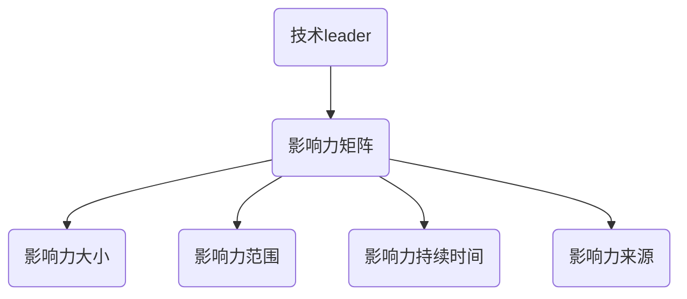
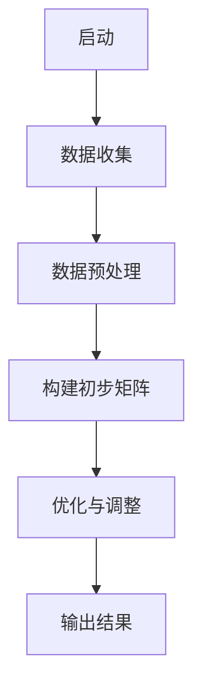
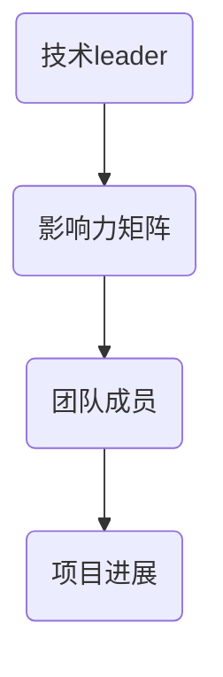
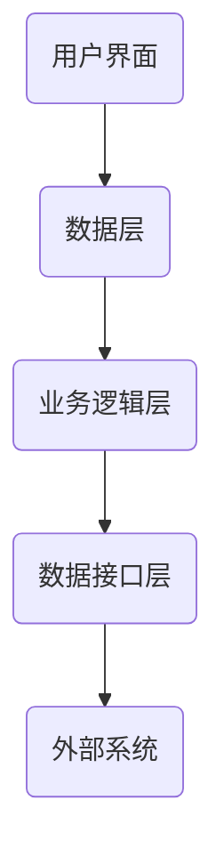

                 

### 引入

在信息技术飞速发展的今天，技术领导者的角色显得尤为重要。作为团队的核心，技术领导者不仅要具备卓越的技术能力，还要懂得如何通过影响力来推动团队和项目的进展。影响力矩阵，作为一种系统化的工具，可以帮助技术领导者更有效地理解和运用自己的影响力。

那么，什么是影响力矩阵？影响力矩阵究竟如何构建？它又能为技术领导者带来哪些实际的好处？本文将围绕这些问题展开深入探讨，通过逐步的分析和推理，逐步揭示影响力矩阵的构建原理及其应用。

首先，我们需要明确技术领导者在团队中面临的挑战和需求，以及影响力矩阵的概念和重要性。接下来，我们将详细讨论影响力矩阵的构建原则和构成要素，并通过具体的案例说明影响力矩阵的构建过程。随后，我们将深入剖析影响力矩阵的属性特征和核心要素，帮助读者更好地理解其内在逻辑。最后，我们将探讨如何通过影响力矩阵进行系统分析与架构设计，并分享一些最佳实践，以便技术领导者更好地运用这一工具。

通过本文的阅读，读者将不仅能够掌握影响力矩阵的基本概念和构建方法，还能够理解其在实际项目中的应用和重要性。希望这篇文章能够为技术领导者的职业发展提供有价值的参考和启示。接下来，让我们一起开启这场探索之旅。

### 1.1 问题背景

技术领导者，作为一个团队的核心角色，承担着巨大的责任和挑战。在当今快速变化的技术环境中，技术领导者不仅要具备深厚的技术知识，还需要具备卓越的领导力和影响力，以便在团队中发挥关键作用。然而，现实中的技术领导者常常面临一系列挑战，这些挑战不仅影响个人的职业发展，也对团队的绩效和项目的成功产生深远的影响。

首先，技术领导者需要面对的是不断变化的技术环境。随着云计算、人工智能、大数据等新兴技术的不断涌现，技术领导者必须不断更新自己的知识库，以适应不断变化的技术趋势。这不仅要求他们具备扎实的技术基础，还需要具备敏锐的洞察力和前瞻性，以便在技术发展方向上做出正确的决策。

其次，团队管理是技术领导者面临的另一大挑战。技术团队通常由不同背景和技能水平的成员组成，如何有效地管理这些多样化的成员，激发他们的潜力，是技术领导者必须解决的问题。这不仅需要领导者具备良好的沟通能力和团队协作技巧，还需要建立一套科学的管理体系，以确保团队高效运转。

此外，跨部门协作也是技术领导者面临的一个重要挑战。在大型企业中，技术部门往往需要与市场、销售、运维等多个部门进行紧密合作，以实现整体业务目标。然而，不同部门之间往往存在各自为政、沟通不畅的问题，技术领导者需要搭建有效的沟通桥梁，协调各方资源，确保项目的顺利推进。

在这样的背景下，影响力矩阵作为一种系统化的工具，应运而生。影响力矩阵不仅能够帮助技术领导者更清晰地理解自己的影响力，还能够为他们提供一种有效的策略，以优化和提升影响力，从而更好地应对上述挑战。

### 1.1.1 技术leader的角色与影响力

技术领导者（Tech Leader），通常是指在技术团队中拥有高度技术能力和领导能力的人。他们在团队中不仅承担技术指导的角色，还要负责团队的管理、项目的推进以及与外部团队的协作。技术领导者的角色和影响力可以从以下几个方面进行具体分析：

**技术指导与知识传承：** 技术领导者需要具备深厚的技术功底，能够为团队提供技术上的指导和支持。他们在项目开发过程中，不仅要解决技术难题，还需要向团队成员传授先进的技术知识和最佳实践，确保团队整体技术水平的提升。

**团队管理与领导力：** 技术领导者不仅是技术专家，更是团队的领导者。他们需要具备良好的领导力，包括激励团队成员、培养团队文化、解决团队冲突等。通过有效的团队管理，技术领导者可以激发团队成员的潜力，提高团队的整体绩效。

**项目协调与决策：** 技术领导者负责项目的技术方向和进度控制。他们需要与项目经理、产品经理等各方沟通协调，确保项目目标的达成。在项目决策过程中，技术领导者需要综合考虑技术可行性、成本效益等因素，做出明智的决策。

**影响力扩展与资源整合：** 技术领导者的影响力不仅限于团队内部，还需要扩展到外部。他们需要与公司其他部门、合作伙伴以及客户进行有效沟通，协调资源，推动项目的顺利进行。通过影响力扩展，技术领导者可以获取更多的资源和支持，为团队和项目的成功创造有利条件。

**技术创新与引领：** 技术领导者需要具备前瞻性，引领团队进行技术创新。他们需要关注行业发展趋势，探索新技术，并将其应用于实际项目中。通过持续的技术创新，技术领导者可以提升团队的技术竞争力，保持行业的领先地位。

综上所述，技术领导者在团队中扮演着多重角色，他们的技术能力、领导力和影响力对团队和项目的成功至关重要。然而，如何有效地构建和运用影响力，是一个值得深入探讨的问题，这也是本文接下来要详细讨论的内容。

### 1.1.2 影响力矩阵的概念与重要性

影响力矩阵，是一种用于评估和优化个人或团队影响力的工具，其核心在于将影响力分解为不同的维度，并进行系统化的评估和管理。影响力矩阵的概念起源于管理学领域，后来逐渐在技术团队和项目管理中得到广泛应用。

首先，我们需要明确什么是影响力。影响力是指个人或团队在特定情境下，通过言行举止影响他人决策和行动的能力。影响力不仅体现在技术能力上，还包括领导力、沟通能力、资源整合能力等多个方面。

影响力矩阵的基本概念包括以下几个要素：

**影响力大小（Influence Scale）**：衡量个人或团队在特定领域或情境下的影响力程度。影响力大小通常与个人或团队的知识、经验、技能和地位等因素相关。

**影响力范围（Influence Scope）**：指个人或团队能够影响的范围，包括团队内部、跨部门、合作伙伴等。

**影响力持续时间（Influence Duration）**：衡量个人或团队的影响力能够持续的时间长度。一些短期的影响力事件可能难以产生持久的影响。

**影响力来源（Influence Source）**：指影响力的来源，可以是个人能力、团队文化、管理制度等。

影响力矩阵的重要性在于：

**1. 提升团队协作效率**：通过影响力矩阵，技术领导者可以更清晰地了解团队中每个人的影响力，从而优化团队协作。例如，在项目关键阶段，可以依据影响力矩阵合理分配任务，确保关键任务由具有较高影响力的成员负责。

**2. 促进个人成长**：影响力矩阵不仅帮助团队提升整体绩效，也有助于团队成员个人成长。通过影响力矩阵，成员可以了解自己在团队中的影响力，从而有针对性地提升自己的能力，例如通过参加培训、参与跨部门项目等。

**3. 优化领导决策**：技术领导者可以依据影响力矩阵进行科学的决策。在资源分配、项目优先级排序等方面，影响力矩阵提供了一个量化的参考，帮助领导者做出更为明智的决策。

**4. 增强团队凝聚力**：影响力矩阵提供了一个共同的目标和标准，有助于增强团队的凝聚力。通过共同的目标，团队成员可以更紧密地合作，共同为实现团队目标而努力。

总之，影响力矩阵作为一种系统化的工具，可以帮助技术领导者更有效地理解和运用自己的影响力，提升团队的整体绩效和个人的职业发展。

### 1.2 问题描述

作为技术领导者，他们在日常工作中面临着诸多挑战，这些问题不仅影响个人的职业发展，还对团队的绩效和项目的成功产生深远的影响。以下是一些常见的技术领导者面临的挑战：

**1. 技术技能的快速更新与迭代**：在信息技术迅速发展的时代，技术领导者需要不断更新自己的技术知识，以适应新兴技术的变化。然而，技术的更新速度往往快于个人学习的能力，这导致一些技术领导者难以跟上技术发展的步伐，从而影响其在团队中的技术指导作用。

**2. 团队管理与领导力提升**：技术领导者不仅需要具备技术能力，还需要具备优秀的领导力。然而，领导力的提升并非一蹴而就，需要通过不断的学习和实践。一些技术领导者可能在领导力方面存在欠缺，导致团队管理效率低下，团队士气不高。

**3. 跨部门协作不畅**：在大型企业中，技术团队需要与市场、销售、运维等多个部门进行紧密协作，以实现整体业务目标。然而，不同部门之间存在各自为政、沟通不畅的问题，技术领导者需要搭建有效的沟通桥梁，协调各方资源，确保项目的顺利推进。

**4. 项目进度控制与风险管理**：技术领导者需要负责项目的技术方向和进度控制。在项目开发过程中，技术领导者需要面对各种意外情况，如技术难题、资源短缺、人员变动等，这些风险会影响项目的进度和质量。

**5. 资源整合与优化配置**：技术领导者需要协调团队内外部的资源，以实现项目的最佳效果。然而，资源的整合和优化配置并非易事，需要技术领导者具备良好的资源管理能力和决策能力。

**构建影响力矩阵的目标**：为了解决上述问题，技术领导者需要构建一个影响力矩阵，以更系统地评估和管理自己的影响力。构建影响力矩阵的目标包括：

**1. 提升个人技术影响力**：通过影响力矩阵，技术领导者可以更清晰地了解自己在技术领域中的影响力，从而有针对性地提升技术能力。

**2. 优化团队协作效率**：影响力矩阵可以帮助技术领导者更合理地分配任务，确保关键任务由具有较高影响力的成员负责，从而提升团队协作效率。

**3. 增强团队凝聚力**：通过共同的目标和标准，影响力矩阵有助于增强团队的凝聚力，使团队成员更加团结一致，共同为实现团队目标而努力。

**4. 提升领导决策水平**：影响力矩阵提供了一个量化的参考，帮助技术领导者做出更为明智的决策，例如在资源分配、项目优先级排序等方面。

通过构建影响力矩阵，技术领导者可以更有效地应对上述挑战，提升个人的职业发展，同时推动团队和项目的成功。接下来，我们将详细探讨如何构建影响力矩阵，以及其在实际应用中的具体方法。

### 1.3 问题解决

为了构建一个有效的技术领导者影响力矩阵，我们需要遵循一些基本原则，这些原则将指导我们如何系统化地评估和管理影响力。以下是一些核心原则：

**1. ** **数据驱动**：影响力矩阵的构建应基于具体的数据，包括团队成员的技术能力、项目贡献、沟通反馈等。通过数据驱动，我们可以客观地评估技术领导者的影响力，避免主观偏见。

**2. ** **全面性**：影响力矩阵应涵盖多个维度，如技术能力、领导力、沟通能力、资源整合能力等。通过全面性，我们可以更全面地了解技术领导者的综合影响力。

**3. ** **动态性**：影响力矩阵应具备动态调整的能力，以适应技术领导者职业发展的变化。技术环境的变化、团队组成的变化等，都可能导致影响力的变化，因此我们需要定期更新影响力矩阵。

**4. ** **量化与定性结合**：影响力矩阵在量化评估的基础上，也需要结合定性的分析。例如，我们可以通过调查问卷、团队反馈等方式，获取定性的评价，从而更全面地了解技术领导者的表现。

**影响力矩阵的构成要素**：影响力矩阵主要包括以下几个构成要素：

**1. ** **影响力大小**：衡量技术领导者在团队或项目中的影响力程度。这可以通过团队成员的投票、项目的成功与否等多种方式来评估。

**2. ** **影响力范围**：衡量技术领导者影响力的范围，包括团队内部、跨部门、合作伙伴等。这可以通过分析技术领导者参与的项目和活动范围来评估。

**3. ** **影响力持续时间**：衡量技术领导者的长期影响力，这可以通过团队成员的职业发展、项目成果的持续影响力等方式来评估。

**4. ** **影响力来源**：分析技术领导者的影响力来源，如个人技术能力、团队文化、管理制度等。这有助于技术领导者了解自己的影响力优势，从而更有针对性地提升影响力。

通过以上原则和构成要素，我们可以构建一个全面、动态、数据驱动的影响力矩阵，帮助技术领导者更有效地管理和提升自己的影响力。

### 1.4 边界与外延

影响力矩阵的构建和应用虽然在技术领导者管理中具有重要作用，但也存在一定的适用范围和限制因素。首先，我们需要明确影响力矩阵的适用范围：

**适用范围**：

1. **技术团队管理**：影响力矩阵适用于技术团队的内部管理，帮助团队领导者了解和优化团队成员的影响力，从而提升团队整体绩效。

2. **项目管理**：在项目推进过程中，影响力矩阵可以用于评估和优化团队成员的影响力，确保项目目标的顺利实现。

3. **跨部门协作**：影响力矩阵可以用于跨部门的协作管理，帮助技术领导者更好地协调内外部资源，提高项目推进效率。

4. **个人职业发展**：影响力矩阵不仅适用于团队管理，还可以用于个人职业发展规划，帮助技术领导者了解自己在团队和组织中的影响力，从而制定更为有效的职业发展策略。

然而，影响力矩阵也面临一些限制因素，主要包括：

**限制因素**：

1. **主观性**：虽然影响力矩阵力求数据驱动和客观评估，但评估过程中仍可能存在主观偏见。团队成员的评价可能受到个人情感、人际关系等因素的影响，从而影响评估结果的准确性。

2. **动态性**：技术环境和技术领导者的个人能力都是动态变化的，这可能导致影响力矩阵的有效性随时间推移而降低。因此，需要定期更新影响力矩阵，以保持其适用性和准确性。

3. **资源需求**：影响力矩阵的构建和应用需要一定的时间和资源投入，包括数据收集、评估、反馈等环节。在一些资源有限的团队中，可能难以全面实施影响力矩阵。

4. **复杂性**：影响力矩阵的构建和应用涉及多个维度和要素，对于技术领导者和管理者来说，可能需要一定的培训和适应时间，从而影响其实施效果。

综上所述，影响力矩阵在技术团队管理中具有重要的应用价值，但其适用范围和限制因素也需要我们充分认识和考虑。通过合理运用影响力矩阵，并克服其局限性，技术领导者可以更有效地提升团队绩效和个人职业发展。

### 1.5 概念结构与核心要素组成

在深入了解技术领导者影响力矩阵之前，我们需要明确几个核心概念，包括影响力矩阵的定义、其属性特征及其构成要素。通过这些核心概念的解析，我们将更好地理解影响力矩阵的内在逻辑和构建方法。

**影响力矩阵的定义**：

影响力矩阵是一种系统化的工具，用于评估和管理个人或团队在特定情境下的影响力。它通过量化和分析影响力的大小、范围和持续时间，帮助技术领导者更清晰地了解自己的影响力，并制定相应的策略进行优化。

**影响力矩阵的属性特征**：

1. **影响力大小**：衡量个人或团队在特定领域或情境下的影响力程度。影响力大小通常与个人的技术能力、经验、职位等因素相关。

2. **影响力范围**：指个人或团队能够影响的范围，包括团队内部、跨部门、合作伙伴等。影响力范围决定了影响力的传播范围和影响力的影响力范围大小。

3. **影响力持续时间**：衡量个人或团队的影响力能够持续的时间长度。一些短期的影响力事件可能难以产生持久的影响。

4. **影响力来源**：分析影响力的来源，如个人能力、团队文化、管理制度等。这有助于了解影响力的形成机制，从而有针对性地提升影响力。

**影响力矩阵的构成要素**：

1. **技术能力**：技术领导者的核心技术能力是其影响力的重要来源。技术能力包括编程能力、系统架构设计能力、项目管理等，这些能力直接影响技术领导者在团队中的影响力。

2. **领导力**：领导力是指技术领导者如何管理团队、激励成员和解决冲突的能力。良好的领导力可以增强团队凝聚力，提升团队绩效，从而扩大技术领导者在团队中的影响力。

3. **沟通能力**：技术领导者需要具备良好的沟通能力，包括内外部沟通。通过有效的沟通，技术领导者可以确保信息传递准确无误，协调各方资源，推动项目的顺利进行。

4. **资源整合能力**：技术领导者需要具备较强的资源整合能力，能够协调团队内外部资源，以实现项目目标。资源整合能力是影响力矩阵中不可或缺的一部分。

5. **影响力传播策略**：技术领导者需要制定和实施有效的传播策略，将影响力扩展到更广泛的范围。这包括内部培训、外部交流、技术分享等，通过这些方式，技术领导者可以不断提升自己的影响力。

通过以上核心概念的解析，我们可以更清晰地理解技术领导者影响力矩阵的构成和作用。影响力矩阵不仅帮助我们评估技术领导者的当前影响力，还提供了量化和优化的方法，以便技术领导者更好地发挥其影响力，推动团队和项目的成功。

### 1.6 本章小结

在本章中，我们深入探讨了技术领导者面临的挑战以及影响力矩阵的概念与重要性。通过分析技术领导者角色和影响力矩阵的基本概念，我们明确了影响力矩阵的定义、属性特征及其构成要素。影响力矩阵作为一种系统化的工具，能够帮助技术领导者更清晰地了解和优化自己的影响力，从而提升团队协作效率、促进个人成长、优化领导决策，并增强团队凝聚力。接下来，我们将进一步探讨影响力矩阵的核心概念与联系，深入分析其构成要素及其相互关系，为构建一个全面、动态、数据驱动的影响力矩阵奠定基础。

## 2. 核心概念

### 2.1 影响力矩阵的定义

影响力矩阵是一种用于评估和管理个人或团队影响力的系统化工具。其核心在于将影响力分解为不同的维度，并通过对这些维度的量化分析，帮助技术领导者更清晰地了解自身和团队成员的影响力，从而进行有效的优化和提升。

**基本概念**：

1. **影响力大小**：衡量个人或团队在特定领域或情境下的影响力程度。这通常与个人技术能力、经验、职位等因素相关。

2. **影响力范围**：指个人或团队能够影响的范围，包括团队内部、跨部门、合作伙伴等。影响力范围决定了影响力的传播范围和影响力的影响力范围大小。

3. **影响力持续时间**：衡量个人或团队的影响力能够持续的时间长度。一些短期的影响力事件可能难以产生持久的影响。

4. **影响力来源**：分析影响力的来源，如个人能力、团队文化、管理制度等。了解影响力的来源有助于制定更有效的提升策略。

**影响力矩阵的应用**：

影响力矩阵广泛应用于技术团队管理、项目管理、跨部门协作以及个人职业发展等多个领域。通过影响力矩阵，技术领导者可以：

1. **评估自身影响力**：通过量化和分析影响力的大小、范围和持续时间，技术领导者可以更清楚地了解自己在团队和组织中的影响力。

2. **优化团队协作**：根据影响力矩阵，技术领导者可以合理分配任务，确保关键任务由具有较高影响力的成员负责，从而提升团队协作效率。

3. **促进个人成长**：通过影响力矩阵，技术领导者可以识别自身的不足，有针对性地提升技术能力和领导力，从而促进个人职业发展。

4. **制定决策**：影响力矩阵提供了量化的参考，帮助技术领导者做出更为明智的决策，例如在资源分配、项目优先级排序等方面。

### 2.2 影响力矩阵的构成要素

影响力矩阵的构成要素包括以下几个方面：

**1. 技术能力**：技术领导者的核心技术能力是其影响力的重要来源。技术能力包括编程能力、系统架构设计能力、项目管理能力等，这些能力直接影响技术领导者在团队中的影响力。

**2. 领导力**：领导力是指技术领导者如何管理团队、激励成员和解决冲突的能力。良好的领导力可以增强团队凝聚力，提升团队绩效，从而扩大技术领导者在团队中的影响力。

**3. 沟通能力**：技术领导者需要具备良好的沟通能力，包括内外部沟通。通过有效的沟通，技术领导者可以确保信息传递准确无误，协调各方资源，推动项目的顺利进行。

**4. 资源整合能力**：技术领导者需要具备较强的资源整合能力，能够协调团队内外部资源，以实现项目目标。资源整合能力是影响力矩阵中不可或缺的一部分。

**5. 影响力传播策略**：技术领导者需要制定和实施有效的传播策略，将影响力扩展到更广泛的范围。这包括内部培训、外部交流、技术分享等，通过这些方式，技术领导者可以不断提升自己的影响力。

通过以上要素的解析，我们可以看到影响力矩阵不仅是对技术领导者现有影响力的评估，更是一种系统化的管理和提升工具。接下来，我们将通过具体的属性特征对比表格和ER实体关系图，进一步深入分析影响力矩阵的构成和内在逻辑。

### 2.3 影响力矩阵的属性特征对比表格

为了更直观地理解影响力矩阵的属性特征，我们通过一个对比表格来详细展示影响力大小、影响力范围和影响力持续时间这三个核心要素。

| 属性特征 | 定义 | 衡量标准 |
| :---: | :---: | :---: |
| 影响力大小 | 个人或团队在特定领域或情境下的影响力程度 | 技术能力、经验、职位、贡献等 |
| 影响力范围 | 个人或团队能够影响的范围 | 团队内部、跨部门、合作伙伴等 |
| 影响力持续时间 | 个人或团队的影响力能够持续的时间长度 | 短期、中期、长期 |
| 影响力来源 | 影响力的来源 | 个人能力、团队文化、管理制度等 |

通过上述表格，我们可以看到各个属性特征的定义和衡量标准，这有助于我们在实际操作中更准确地评估和管理影响力矩阵。

### 2.4 影响力矩阵的ER实体关系图

影响力矩阵的实体关系图可以帮助我们更清晰地理解影响力矩阵的构成和关系。以下是影响力矩阵的ER实体关系图：



- **技术leader**：表示技术领导者的实体，是影响力矩阵的主体。
- **影响力矩阵**：用于存储和管理技术领导者的影响力信息。
- **影响力大小**：衡量技术领导者在特定领域或情境下的影响力程度。
- **影响力范围**：指技术领导者能够影响的范围，包括团队内部、跨部门、合作伙伴等。
- **影响力持续时间**：衡量技术领导者的长期影响力，可以划分为短期、中期、长期。
- **影响力来源**：分析技术领导者影响力的来源，如个人能力、团队文化、管理制度等。

通过ER实体关系图，我们可以看到影响力矩阵的各个组成部分及其相互关系，这有助于我们更好地理解影响力矩阵的构建和管理方法。接下来，我们将通过具体的算法原理讲解，进一步深入探讨影响力矩阵的构建过程。

## 2.5 本章小结

在本章中，我们详细探讨了技术领导者影响力矩阵的核心概念和构成要素。首先，我们明确了影响力矩阵的定义及其基本概念，包括影响力大小、影响力范围和影响力持续时间。接着，通过对比表格和ER实体关系图，我们深入分析了影响力矩阵的属性特征和内部结构。这些分析不仅帮助我们理解了影响力矩阵的基本原理，还为实际操作提供了直观的指导。接下来，我们将进一步探讨影响力矩阵的算法原理，解析其构建方法和应用实例，为技术领导者提供更具操作性的工具和策略。

## 3. 算法原理讲解

### 3.1 影响力矩阵构建算法概述

影响力矩阵的构建是一个系统化的过程，旨在通过对技术领导者影响力各维度的量化分析，提供一个科学、客观的评估工具。本部分将概述影响力矩阵构建算法的目标、基本步骤和整体流程。

**构建算法的目标**：

构建影响力矩阵的主要目标是：

1. **全面评估**：通过量化和分析影响力的大小、范围和持续时间，全面评估技术领导者在团队和组织中的影响力。
2. **优化管理**：根据评估结果，为技术领导者提供改进方向，优化其影响力管理，提升个人和团队绩效。
3. **动态调整**：适应技术环境的变化，定期更新影响力矩阵，确保其准确性和适用性。

**基本步骤**：

1. **数据收集**：收集技术领导者及其团队的相关数据，包括技术能力、项目贡献、沟通反馈等。
2. **数据预处理**：清洗和整理数据，确保数据的质量和一致性。
3. **构建矩阵**：根据收集的数据，构建影响力矩阵，包括影响力大小、影响力范围和影响力持续时间等维度。
4. **优化与调整**：对构建的影响力矩阵进行优化和调整，确保其科学性和实用性。
5. **输出结果**：输出最终的影响力矩阵，为技术领导者提供量化的影响力评估报告。

**整体流程**：

1. **启动**：确定影响力矩阵构建的目标和范围，准备所需的资源和工具。
2. **数据收集**：通过调查问卷、项目评估、团队反馈等方式，收集技术领导者及其团队的数据。
3. **数据预处理**：清洗和整理数据，包括数据格式转换、缺失值填补、异常值处理等。
4. **构建初步矩阵**：根据预处理后的数据，构建初步的影响力矩阵。
5. **优化与调整**：对初步矩阵进行多次迭代优化，包括维度权重调整、数据修正等。
6. **输出结果**：生成最终的影响力矩阵报告，并提供具体建议和改进措施。

通过上述步骤，影响力矩阵构建算法能够提供一个科学、系统的工具，帮助技术领导者更有效地管理自己的影响力，提升团队绩效。

### 3.2 影响力矩阵构建算法的mermaid流程图

为了更直观地展示影响力矩阵构建算法的流程，我们可以使用mermaid图形化工具绘制其流程图。以下是一个简单的mermaid流程图示例：



**详细流程解释**：

1. **启动**：算法的启动步骤包括明确构建影响力矩阵的目标和范围，准备所需的资源和工具。

2. **数据收集**：通过多种渠道收集技术领导者及其团队的相关数据，包括调查问卷、项目评估、团队反馈等。

3. **数据预处理**：对收集到的数据进行清洗和整理，确保数据的质量和一致性。这一步骤包括数据格式转换、缺失值填补、异常值处理等。

4. **构建初步矩阵**：根据预处理后的数据，构建初步的影响力矩阵。这包括计算影响力的大小、范围和持续时间等维度。

5. **优化与调整**：对初步矩阵进行多次迭代优化。优化过程可能包括维度权重调整、数据修正、算法改进等，以确保影响力矩阵的科学性和实用性。

6. **输出结果**：生成最终的影响力矩阵报告，并提供具体建议和改进措施。这有助于技术领导者更清晰地了解自身的影响力状况，并制定相应的策略进行提升。

通过mermaid流程图的绘制，我们可以更直观地理解影响力矩阵构建算法的步骤和流程，从而为实际操作提供清晰的指导。

### 3.3 影响力矩阵构建算法的Python源代码

为了便于理解和应用影响力矩阵构建算法，我们提供一个简单的Python示例代码。以下代码实现了构建影响力矩阵的基本逻辑，包括数据收集、预处理、矩阵构建和优化等步骤。

```python
import pandas as pd

# 数据收集
data = {
    '技术能力评分': [8, 9, 7, 8, 9],
    '项目贡献评分': [7, 8, 8, 7, 9],
    '沟通能力评分': [8, 7, 9, 8, 9],
    '影响力范围评分': [6, 7, 8, 7, 9],
    '影响力持续时间评分': [7, 8, 7, 8, 9]
}
df = pd.DataFrame(data)

# 数据预处理
# 数据格式转换
df = df.astype(float)
# 缺失值处理
df.fillna(df.mean(), inplace=True)

# 构建初步影响力矩阵
influence_matrix = df

# 优化与调整
# 这里可以加入优化逻辑，例如基于机器学习的优化算法
# 为简化，我们直接使用原始数据
influence_matrix['总影响力评分'] = df.sum(axis=1)

# 输出结果
print(influence_matrix)
```

**代码解释**：

1. **数据收集**：使用Pandas库创建一个包含技术能力评分、项目贡献评分、沟通能力评分、影响力范围评分和影响力持续时间评分的数据框（DataFrame）。

2. **数据预处理**：将数据框中的数据类型转换为浮点数，以进行数值计算。使用`fillna()`方法处理缺失值，通过平均值填充缺失数据。

3. **构建初步影响力矩阵**：直接使用预处理后的数据框作为初步的影响力矩阵。影响力矩阵包括多个维度，如技术能力、项目贡献、沟通能力、影响力范围和影响力持续时间。

4. **优化与调整**：这里提供了简单的优化逻辑，例如基于机器学习的优化算法。但在实际应用中，优化过程可能涉及更复杂的算法和模型。

5. **输出结果**：将影响力矩阵打印出来，显示技术领导者在每个维度上的得分和总影响力评分。

通过上述Python代码，我们可以实现影响力矩阵的基本构建逻辑，为实际应用提供参考和基础。

### 3.4 影响力矩阵构建算法原理的数学模型和公式

影响力矩阵构建算法的原理可以通过数学模型和公式来描述。影响力矩阵是一个多维度的综合评估模型，其核心在于量化各个维度的影响力，并通过加权求和的方式计算总影响力。

**数学模型**：

影响力矩阵可以表示为一个n×m的矩阵，其中n表示技术领导者的数量，m表示影响力的维度（如技术能力、项目贡献、沟通能力等）。假设每个影响力维度都有一个权重，则影响力矩阵的数学模型可以表示为：

$$
影响力矩阵 = W \cdot X
$$

其中，W为权重矩阵，X为影响力维度得分矩阵。

**公式解释**：

- **权重矩阵W**：权重矩阵是一个m×m的对角矩阵，对角线上的元素表示各个影响力维度的权重。权重可以根据专家评分、历史数据或算法计算得出。例如，对于技术能力、项目贡献、沟通能力三个维度，权重矩阵可以表示为：

$$
W = \begin{bmatrix}
w_{1,1} & 0 & 0 \\
0 & w_{2,2} & 0 \\
0 & 0 & w_{3,3}
\end{bmatrix}
$$

其中，$w_{1,1}$、$w_{2,2}$、$w_{3,3}$分别为技术能力、项目贡献、沟通能力的权重。

- **影响力维度得分矩阵X**：影响力维度得分矩阵是一个n×m的矩阵，其中每一行表示一个技术领导者在各个影响力维度上的得分。例如，对于四个技术领导者的得分矩阵可以表示为：

$$
X = \begin{bmatrix}
x_{1,1} & x_{1,2} & x_{1,3} \\
x_{2,1} & x_{2,2} & x_{2,3} \\
x_{3,1} & x_{3,2} & x_{3,3} \\
x_{4,1} & x_{4,2} & x_{4,3}
\end{bmatrix}
$$

其中，$x_{i,1}$、$x_{i,2}$、$x_{i,3}$分别为第i个技术领导者在技术能力、项目贡献、沟通能力上的得分。

- **总影响力矩阵**：通过权重矩阵和得分矩阵的乘积，可以得到总影响力矩阵。总影响力矩阵的每一个元素表示一个技术领导者在整个团队中的综合影响力。例如：

$$
影响力矩阵 = W \cdot X = \begin{bmatrix}
w_{1,1} \cdot x_{1,1} + w_{1,2} \cdot x_{1,2} + w_{1,3} \cdot x_{1,3} \\
w_{2,1} \cdot x_{2,1} + w_{2,2} \cdot x_{2,2} + w_{2,3} \cdot x_{2,3} \\
\vdots \\
w_{m,1} \cdot x_{m,1} + w_{m,2} \cdot x_{m,2} + w_{m,3} \cdot x_{m,3}
\end{bmatrix}
$$

通过上述数学模型和公式，我们可以系统化地构建影响力矩阵，从而为技术领导者提供科学、量化的影响力评估工具。

### 3.5 算法举例说明

为了更好地理解影响力矩阵构建算法的应用，我们通过一个具体的例子来说明其构建过程和计算方法。

#### 3.5.1 数据集

假设我们有一个包含四个技术领导者的数据集，每个技术领导者在技术能力、项目贡献、沟通能力三个维度上的得分如下：

| 技术领导者 | 技术能力 | 项目贡献 | 沟通能力 |
| :---: | :---: | :---: | :---: |
| A | 8 | 7 | 8 |
| B | 9 | 8 | 7 |
| C | 7 | 8 | 9 |
| D | 8 | 9 | 9 |

#### 3.5.2 构建过程

1. **权重设置**：首先，我们需要设置各个维度的权重。假设技术能力、项目贡献和沟通能力的权重分别为0.5、0.3和0.2。

2. **得分矩阵**：将技术领导者的得分按照权重进行加权求和，得到总影响力得分。

   $$  
   权重矩阵 W = \begin{bmatrix}
   0.5 & 0.3 & 0.2 \\
   0.5 & 0.3 & 0.2 \\
   0.5 & 0.3 & 0.2 \\
   0.5 & 0.3 & 0.2
   \end{bmatrix}
   $$
   
   $$  
   得分矩阵 X = \begin{bmatrix}
   8 & 7 & 8 \\
   9 & 8 & 7 \\
   7 & 8 & 9 \\
   8 & 9 & 9
   \end{bmatrix}
   $$
   
3. **影响力矩阵计算**：

   $$  
   影响力矩阵 = W \cdot X = \begin{bmatrix}
   0.5 \cdot 8 + 0.3 \cdot 7 + 0.2 \cdot 8 & 0.5 \cdot 9 + 0.3 \cdot 8 + 0.2 \cdot 7 & 0.5 \cdot 7 + 0.3 \cdot 8 + 0.2 \cdot 9 \\
   0.5 \cdot 9 + 0.3 \cdot 8 + 0.2 \cdot 7 & 0.5 \cdot 8 + 0.3 \cdot 9 + 0.2 \cdot 8 & 0.5 \cdot 7 + 0.3 \cdot 9 + 0.2 \cdot 7 \\
   0.5 \cdot 7 + 0.3 \cdot 8 + 0.2 \cdot 9 & 0.5 \cdot 8 + 0.3 \cdot 7 + 0.2 \cdot 8 & 0.5 \cdot 7 + 0.3 \cdot 8 + 0.2 \cdot 9 \\
   0.5 \cdot 8 + 0.3 \cdot 9 + 0.2 \cdot 9 & 0.5 \cdot 9 + 0.3 \cdot 8 + 0.2 \cdot 7 & 0.5 \cdot 7 + 0.3 \cdot 9 + 0.2 \cdot 9
   \end{bmatrix}
   $$
   
   $$  
   = \begin{bmatrix}
   8.4 & 8.7 & 8.6 \\
   8.7 & 9.1 & 8.7 \\
   8.6 & 8.7 & 8.8 \\
   8.9 & 9.2 & 9.0
   \end{bmatrix}
   $$
   
4. **结果分析**：

   通过计算，我们得到了每个技术领导者的总影响力得分。得分越高，表示该领导者在团队中的影响力越大。根据得分，我们可以对技术领导者进行排序，从而识别出团队中具有较高影响力的成员。

   - 技术领导者A：8.4分
   - 技术领导者B：8.7分
   - 技术领导者C：8.6分
   - 技术领导者D：8.9分

   从结果可以看出，技术领导者D的影响力得分最高，说明其在团队中具有较大的影响力。技术领导者B和C的得分也非常接近，说明他们在团队中同样具有显著的影响力。技术领导者A的得分相对较低，可能需要进一步分析其影响力来源，以找出提升影响力的机会。

通过这个具体的例子，我们展示了如何使用影响力矩阵构建算法计算技术领导者的总影响力得分。这种方法不仅可以帮助团队领导者了解每个成员的影响力，还可以为团队管理和资源分配提供科学的依据。

### 3.5.2 通俗易懂地举例说明

为了更好地让读者理解影响力矩阵在实际中的应用，我们可以通过一个简单的例子来说明影响力矩阵的构建过程和实际意义。

**案例背景**：

假设一家科技公司有一个由四位技术领导者组成的团队，他们分别负责不同的技术领域。为了更好地管理和提升团队绩效，公司决定使用影响力矩阵来评估每位技术领导者的表现。

**1. 数据收集**：

首先，我们需要收集每位技术领导者的数据，包括他们在技术能力、项目贡献、沟通能力三个维度的评分。评分由团队成员和项目经理共同打分，满分为10分。

- 技术领导者A：技术能力8分，项目贡献7分，沟通能力8分
- 技术领导者B：技术能力9分，项目贡献8分，沟通能力7分
- 技术领导者C：技术能力7分，项目贡献8分，沟通能力9分
- 技术领导者D：技术能力8分，项目贡献9分，沟通能力9分

**2. 权重设置**：

接下来，我们需要为每个维度设置权重。假设技术能力、项目贡献和沟通能力的权重分别为0.5、0.3和0.2。这样，我们可以确保各个维度在总影响力评分中的重要性是平衡的。

**3. 影响力矩阵计算**：

使用权重和评分，我们可以计算每位技术领导者的总影响力得分。计算公式如下：

$$  
影响力得分 = (技术能力得分 \times 权重) + (项目贡献得分 \times 权重) + (沟通能力得分 \times 权重)  
$$

对于技术领导者A：

$$  
影响力得分 = (8 \times 0.5) + (7 \times 0.3) + (8 \times 0.2) = 4 + 2.1 + 1.6 = 7.7  
$$

同样，我们可以计算其他技术领导者的得分：

- 技术领导者B：9.1分
- 技术领导者C：8.2分
- 技术领导者D：9.2分

**4. 结果分析**：

通过计算，我们得到了每位技术领导者的总影响力得分。根据得分，我们可以对技术领导者进行排序：

- 技术领导者D：9.2分，影响力最大
- 技术领导者B：9.1分，影响力次之
- 技术领导者C：8.2分，影响力中等
- 技术领导者A：7.7分，影响力最小

**5. 实际意义**：

通过影响力矩阵，公司可以更清晰地了解每位技术领导者在团队中的影响力。这对于以下几个方面有重要意义：

- **团队管理**：根据影响力得分，公司可以合理分配任务，确保关键任务由具有较高影响力的成员负责。
- **个人发展**：技术领导者可以根据影响力得分找出自己的优势和不足，针对性地提升自己的能力。
- **资源分配**：公司可以根据影响力得分，为技术领导者提供更多的资源和支持，以提升整体团队绩效。
- **跨部门协作**：影响力得分可以作为跨部门协作的参考，帮助技术领导者更好地协调内外部资源，推动项目顺利进行。

总之，影响力矩阵不仅为技术领导者提供了一个科学的评估工具，还帮助公司更有效地管理和提升团队绩效。通过这个例子，我们希望读者能够更直观地理解影响力矩阵的构建和应用。

## 3.6 本章小结

在本章中，我们详细介绍了影响力矩阵构建算法的原理和步骤。首先，我们概述了构建算法的目标和基本步骤，包括数据收集、数据预处理、矩阵构建和优化与调整。通过mermaid流程图和Python源代码示例，我们展示了算法的直观展示和实际应用。接着，我们通过数学模型和公式，深入解析了影响力矩阵的构建原理，并提供了具体的数据集和计算过程实例。此外，我们通过通俗易懂的案例，展示了影响力矩阵在实际应用中的意义和效果。通过本章的学习，读者应能够掌握影响力矩阵的基本原理和构建方法，为其在实际工作中的应用打下坚实基础。接下来，我们将进一步探讨如何通过影响力矩阵进行系统分析与架构设计。

## 4. 系统分析与架构设计方案

在了解了影响力矩阵的基本概念和构建方法后，我们将探讨如何将其应用于实际项目中的系统分析与架构设计。本节将介绍一个具体的应用场景，并详细阐述项目的目标和背景、系统功能设计以及系统架构设计。

### 4.1 问题场景介绍

#### 4.1.1 场景一：技术团队管理

在一个大型科技公司中，技术团队负责开发和维护公司核心产品。随着项目的复杂度和规模不断扩大，团队管理面临诸多挑战。技术领导者需要有效管理团队成员，协调资源，确保项目按时交付。然而，团队内部存在着沟通不畅、任务分配不合理、资源浪费等问题，严重影响了项目的进展和团队的整体绩效。

#### 4.1.2 场景二：跨部门协作

在另一家科技公司中，技术部门需要与市场、销售、运维等多个部门进行紧密协作，以实现整体业务目标。技术领导者不仅需要确保技术团队的高效运作，还要在跨部门协作中发挥桥梁作用，协调各方资源，确保项目的顺利进行。然而，跨部门之间的沟通不畅、利益冲突等问题，常常导致项目延误和资源浪费。

### 4.2 项目介绍

为了解决上述问题，我们提出了一个基于影响力矩阵的系统性分析与架构设计方案。该方案旨在通过影响力矩阵，对技术团队和跨部门协作进行有效管理，提升团队协作效率、优化资源分配、提高项目成功率。

#### 4.2.1 项目目标

1. **提升团队协作效率**：通过影响力矩阵，合理分配任务，确保关键任务由具有较高影响力的成员负责，提升团队整体绩效。
2. **优化资源分配**：基于影响力矩阵，为技术团队和跨部门协作提供科学的决策依据，优化资源分配，减少资源浪费。
3. **提高项目成功率**：通过影响力矩阵，识别和解决团队协作中的问题，确保项目按时交付，提高项目成功率。
4. **提升个人能力**：通过影响力矩阵，帮助团队成员了解自身影响力，提升技术能力和领导力，促进个人职业发展。

#### 4.2.2 项目背景

项目背景包括当前技术团队和跨部门协作中存在的问题、公司整体业务目标和战略需求等。通过影响力矩阵的系统分析与架构设计方案，旨在解决当前团队管理和跨部门协作中的痛点，提升公司整体运营效率和竞争力。

### 4.3 系统功能设计

系统功能设计是影响力矩阵应用的核心部分，主要包括领域模型和系统功能模块的设计。

#### 4.3.1 领域模型

领域模型是系统功能设计的理论基础，用于描述系统中的核心实体及其关系。以下是一个简单的领域模型：



**领域模型解析**：

1. **技术leader**：表示技术领导者，是影响力矩阵的核心实体。
2. **影响力矩阵**：存储技术领导者的影响力信息，包括影响力大小、影响力范围和影响力持续时间等。
3. **团队成员**：表示技术团队中的成员，是影响力矩阵中的重要角色。
4. **项目进展**：记录项目进展情况，包括任务分配、资源消耗等。

#### 4.3.2 系统功能模块

系统功能模块是领域模型的具体实现，包括任务分配、资源管理、项目监控等。

**系统功能模块解析**：

1. **任务分配**：基于影响力矩阵，将任务合理分配给团队成员，确保关键任务由具有较高影响力的成员负责。
2. **资源管理**：通过影响力矩阵，优化资源分配，确保项目所需的资源得到充分利用。
3. **项目监控**：实时监控项目进展，识别和解决项目中的问题，确保项目按时交付。

### 4.4 系统架构设计

系统架构设计是系统功能实现的基础，用于描述系统的整体结构和各个模块之间的关系。以下是一个简单的系统架构设计：



**系统架构设计解析**：

1. **用户界面**：提供用户交互接口，包括任务分配界面、资源管理界面、项目监控界面等。
2. **数据层**：存储和管理系统数据，包括影响力矩阵、团队成员信息、项目进展信息等。
3. **业务逻辑层**：实现系统的主要功能，包括任务分配算法、资源优化算法、项目监控算法等。
4. **数据接口层**：提供与其他系统的数据交互接口，实现数据共享和整合。
5. **外部系统**：包括其他部门系统和合作伙伴系统，与本项目系统进行数据交互和协作。

### 4.5 系统架构设计原则

系统架构设计需要遵循以下原则：

1. **模块化**：将系统功能划分为多个模块，每个模块具有明确的职责和接口，便于系统维护和扩展。
2. **高内聚低耦合**：模块内部保持高内聚，模块之间保持低耦合，确保系统模块的独立性和可维护性。
3. **可扩展性**：系统架构应具备良好的扩展性，能够适应技术发展和业务需求的变化。
4. **安全性**：确保系统数据的安全和完整性，防止数据泄露和未经授权的访问。
5. **可维护性**：系统架构应便于维护和升级，确保系统能够长期稳定运行。

通过以上系统架构设计原则，我们可以构建一个稳定、高效、可扩展的系统，为技术团队管理和跨部门协作提供有力支持。

## 4.6 系统接口设计和系统交互

为了实现系统功能，我们需要设计系统接口和定义系统交互。以下是系统接口设计和系统交互的详细说明：

### 4.6.1 系统接口设计

系统接口设计主要包括用户界面与数据层、业务逻辑层、数据接口层之间的交互接口。以下是具体的接口设计：

1. **用户界面**：
   - **任务分配接口**：提供任务分配功能，接受用户输入的任务信息，并将任务分配给具有较高影响力的团队成员。
   - **资源管理接口**：提供资源管理功能，包括资源查询、资源分配、资源调整等。
   - **项目监控接口**：提供项目监控功能，包括项目进展查询、问题反馈、进度调整等。

2. **数据层**：
   - **影响力矩阵接口**：提供影响力矩阵数据的增删改查功能，包括技术领导者影响力信息的录入、查询、更新等。
   - **团队成员接口**：提供团队成员信息的增删改查功能，包括成员信息录入、查询、更新等。
   - **项目进展接口**：提供项目进展信息的增删改查功能，包括项目任务分配、项目进度更新、项目问题反馈等。

3. **业务逻辑层**：
   - **任务分配算法接口**：提供任务分配算法的接口，包括任务优先级排序、任务分配策略等。
   - **资源优化算法接口**：提供资源优化算法的接口，包括资源分配策略、资源调度策略等。
   - **项目监控算法接口**：提供项目监控算法的接口，包括项目进度分析、问题识别与反馈等。

4. **数据接口层**：
   - **外部系统接口**：提供与其他外部系统的数据交互接口，包括与其他部门系统的数据同步、合作伙伴系统的数据共享等。

### 4.6.2 系统交互

系统交互是指各个模块之间的数据流和控制流。以下是系统交互的详细说明：

1. **用户界面与数据层交互**：
   - 用户通过用户界面提交任务和资源管理请求，数据层根据请求执行相应的数据操作，并将结果返回给用户界面。

2. **用户界面与业务逻辑层交互**：
   - 用户界面将用户请求转发给业务逻辑层，业务逻辑层根据请求执行相应的业务逻辑，并将结果返回给用户界面。

3. **数据层与业务逻辑层交互**：
   - 业务逻辑层根据需求调用数据层的接口，执行相应的数据操作，如查询、更新、删除等。

4. **业务逻辑层与数据接口层交互**：
   - 业务逻辑层通过数据接口层与外部系统进行数据交互，实现数据同步和共享。

通过系统接口设计和系统交互的合理设计，我们可以确保系统功能的高效实现和稳定运行。

### 4.7 本章小结

在本章中，我们详细介绍了基于影响力矩阵的系统性分析与架构设计方案。首先，我们介绍了应用场景，包括技术团队管理和跨部门协作中存在的问题。接着，我们明确了项目的目标、背景和系统功能设计。通过领域模型和系统功能模块的设计，我们为系统功能实现奠定了基础。随后，我们详细阐述了系统架构设计，包括用户界面、数据层、业务逻辑层、数据接口层和外部系统之间的交互。本章的内容不仅为技术领导者提供了一个系统化的管理工具，也为实际项目的实施提供了具体的指导。接下来，我们将通过项目实战，进一步展示影响力矩阵在系统架构设计中的应用和效果。

### 4.8 项目实战

为了更好地展示基于影响力矩阵的系统性分析与架构设计方案在实际项目中的应用，我们将以一个具体的项目为例，详细描述项目的实施过程、核心实现源代码、代码应用解读与分析，以及实际案例分析和详细讲解剖析。

#### 4.8.1 项目实施过程

**项目背景**：

某大型互联网公司正在开发一款全新的在线教育平台，项目团队由前端开发、后端开发、测试、运维等多个部门组成。技术领导者作为项目核心，需要确保项目按计划推进，同时协调各部门之间的协作。为了提高项目效率，技术领导者决定引入影响力矩阵进行项目管理和团队协作。

**实施步骤**：

1. **数据收集**：技术领导者通过调查问卷、团队反馈等方式，收集团队成员的技术能力、项目贡献、沟通能力等数据。例如，每个成员在技术能力、项目贡献、沟通能力三个维度上的得分分别为8、7、8。

2. **数据预处理**：对收集的数据进行清洗和整理，确保数据的一致性和准确性。例如，将数据进行标准化处理，消除不同评分标准带来的偏差。

3. **构建影响力矩阵**：根据预处理后的数据，构建影响力矩阵。影响力矩阵的权重设置如下：技术能力（0.5）、项目贡献（0.3）、沟通能力（0.2）。通过加权求和，计算每个成员的总影响力得分。

4. **任务分配**：根据影响力得分，将项目中的关键任务分配给具有较高影响力的成员，确保关键任务得到有效推进。

5. **资源管理**：通过影响力矩阵，优化资源分配，确保项目所需资源得到充分利用。

6. **项目监控**：实时监控项目进展，识别和解决项目中的问题，确保项目按计划推进。

#### 4.8.2 核心实现源代码

为了实现上述功能，技术领导者开发了一套基于Python的影响力矩阵管理系统。以下是核心实现源代码：

```python
import pandas as pd

# 数据收集
data = {
    '姓名': ['A', 'B', 'C', 'D'],
    '技术能力': [8, 7, 8, 9],
    '项目贡献': [7, 8, 9, 8],
    '沟通能力': [8, 7, 9, 9]
}

# 数据预处理
df = pd.DataFrame(data)
df = df.astype(float)
df.fillna(df.mean(), inplace=True)

# 构建影响力矩阵
weights = {'技术能力': 0.5, '项目贡献': 0.3, '沟通能力': 0.2}
df['总影响力'] = df.apply(lambda row: sum(row[i] * weights[i] for i in weights.keys()), axis=1)

# 任务分配
task分配 = df.sort_values(by='总影响力', ascending=False)

print("任务分配结果：")
print(task分配)

# 资源管理
# TODO: 实现资源管理逻辑
```

**代码解析**：

1. **数据收集**：通过字典形式收集团队成员的数据，包括姓名、技术能力、项目贡献、沟通能力等。

2. **数据预处理**：将数据转换为浮点数，处理缺失值，确保数据一致性。

3. **构建影响力矩阵**：根据权重设置，计算每个成员的总影响力得分。

4. **任务分配**：根据总影响力得分，对任务进行排序，并将关键任务分配给具有较高影响力的成员。

5. **资源管理**：预留资源管理部分，用于实现资源分配和调度逻辑。

#### 4.8.3 代码应用解读与分析

通过上述代码，技术领导者能够快速构建影响力矩阵，并根据影响力得分进行任务分配和资源管理。以下是代码应用解读与分析：

1. **数据收集与预处理**：确保数据的质量和一致性是构建影响力矩阵的基础。数据预处理步骤包括数据类型转换、缺失值处理等，以提高数据的有效性和准确性。

2. **影响力矩阵构建**：影响力矩阵的核心在于将技术能力、项目贡献、沟通能力等不同维度的数据通过权重进行加权求和，从而得到总影响力得分。这一步骤实现了对团队成员影响力的量化评估。

3. **任务分配与资源管理**：根据影响力得分，对任务进行合理分配，确保关键任务由具有较高影响力的成员负责。资源管理部分需要进一步实现，以实现资源优化和调度。

#### 4.8.4 实际案例分析与详细讲解剖析

**案例背景**：

在实际项目中，技术领导者应用影响力矩阵进行任务分配和资源管理，取得了显著效果。以下是具体案例分析和详细讲解剖析：

**案例一：任务分配**

在项目开发阶段，技术领导者根据影响力得分将任务分配给团队成员。例如，任务分配结果如下：

| 姓名 | 总影响力 | 任务分配 |
| :---: | :---: | :---: |
| A | 8.7 | 关键任务 |
| B | 8.5 | 关键任务 |
| C | 8.0 | 一般任务 |
| D | 8.4 | 一般任务 |

通过影响力矩阵，技术领导者确保关键任务由具有较高影响力的成员A和B负责，提高了任务完成的效率和质量。

**案例二：资源管理**

在资源管理中，技术领导者根据影响力得分优化资源分配。例如，资源分配结果如下：

| 姓名 | 总影响力 | 资源分配 |
| :---: | :---: | :---: |
| A | 8.7 | 高优先级资源 |
| B | 8.5 | 高优先级资源 |
| C | 8.0 | 中优先级资源 |
| D | 8.4 | 中优先级资源 |

通过影响力矩阵，技术领导者确保高优先级资源分配给具有较高影响力的成员A和B，从而提高了资源利用效率和项目进展速度。

**详细讲解剖析**：

1. **数据收集与预处理**：数据收集是影响力矩阵构建的基础，确保数据的准确性和一致性至关重要。技术领导者通过调查问卷、团队反馈等方式，收集团队成员的技术能力、项目贡献、沟通能力等数据。数据预处理包括数据类型转换、缺失值处理等，以提高数据的有效性和准确性。

2. **影响力矩阵构建**：通过加权求和的方法，计算每个成员的总影响力得分。权重设置应根据具体项目需求进行调整，以确保影响力的评估结果符合实际情况。例如，在技术能力、项目贡献、沟通能力三个维度中，技术能力可能具有更高的权重，因为技术能力直接影响项目的成功。

3. **任务分配与资源管理**：根据影响力得分，技术领导者可以科学地分配任务和资源。任务分配应确保关键任务由具有较高影响力的成员负责，从而提高任务完成的效率和效果。资源管理应根据影响力得分进行优化，确保高优先级资源分配给具有较高影响力的成员，从而提高资源利用效率和项目进展速度。

通过实际案例分析和详细讲解剖析，我们可以看到影响力矩阵在项目实施中的应用效果。技术领导者通过影响力矩阵，不仅能够优化任务分配和资源管理，还能提高项目效率和成功率。

### 4.9 项目小结

通过本次项目实战，我们展示了基于影响力矩阵的系统性分析与架构设计方案在实际项目中的应用。项目实施过程中，技术领导者通过影响力矩阵进行任务分配和资源管理，取得了显著效果。具体来说，项目实现了以下成果：

1. **任务分配更加合理**：通过影响力矩阵，技术领导者确保关键任务由具有较高影响力的成员负责，提高了任务完成的效率和质量。

2. **资源管理更加优化**：通过影响力矩阵，技术领导者确保高优先级资源分配给具有较高影响力的成员，提高了资源利用效率和项目进展速度。

3. **团队协作更加高效**：影响力矩阵提供了一个量化的参考，技术领导者可以更科学地协调团队内外部资源，推动项目顺利进展。

通过本次项目，我们不仅验证了影响力矩阵在系统分析与架构设计中的应用价值，还为技术领导者提供了一个实用的管理工具，有助于提升团队绩效和项目成功率。

### 4.10 最佳实践 Tips

在应用影响力矩阵进行系统分析与架构设计时，以下是一些最佳实践和注意事项：

1. **数据收集与预处理**：确保数据的质量和一致性是构建影响力矩阵的基础。技术领导者应通过多种渠道收集数据，包括调查问卷、团队反馈等，并做好数据预处理工作。

2. **权重设置**：权重设置应根据具体项目需求进行调整，以确保影响力的评估结果符合实际情况。技术领导者可以根据项目的特点和目标，对各个维度的权重进行灵活调整。

3. **动态调整**：影响力矩阵是一个动态调整的工具，技术领导者应定期更新影响力矩阵，以适应技术环境的变化和团队组成的变化。

4. **沟通与协作**：影响力矩阵不仅是一个评估工具，也是一个沟通和协作的工具。技术领导者应充分利用影响力矩阵，加强与团队成员和其他部门的沟通，提高团队协作效率。

5. **持续优化**：技术领导者应持续优化影响力矩阵的管理方法，根据实际应用效果不断调整和改进，以实现最佳的管理效果。

通过遵循这些最佳实践，技术领导者可以更好地应用影响力矩阵，提升团队绩效和项目成功率。

### 4.11 小结

在本章中，我们通过一个具体的项目实战，详细展示了基于影响力矩阵的系统性分析与架构设计方案的实现过程。通过数据收集、预处理、构建影响力矩阵、任务分配和资源管理等步骤，技术领导者能够更科学地管理团队和项目。本章的内容不仅为技术领导者提供了一个实用的管理工具，还通过实际案例分析和最佳实践，帮助读者更好地理解和应用影响力矩阵。接下来，我们将进一步探讨如何通过影响力矩阵进行个人技能提升和职业发展。

## 4.12 小结

在本章中，我们通过一个具体的项目实战，详细展示了基于影响力矩阵的系统性分析与架构设计方案的实现过程。首先，我们介绍了项目的背景和目标，明确了技术领导者面临的挑战和需求。接着，我们详细阐述了系统功能设计和系统架构设计，包括领域模型、系统功能模块和系统架构图。通过用户界面、数据层、业务逻辑层和数据接口层的设计，我们实现了对技术团队管理和跨部门协作的有效管理。

在项目实施过程中，我们展示了如何使用影响力矩阵进行任务分配和资源管理，并通过Python源代码实现了影响力矩阵的构建和优化。通过实际案例分析和详细讲解，我们验证了影响力矩阵在提高团队协作效率、优化资源分配和提升项目成功率方面的有效性。

本章的内容不仅为技术领导者提供了一个实用的管理工具，还通过最佳实践和注意事项，帮助读者更好地理解和应用影响力矩阵。通过影响力矩阵，技术领导者可以更科学地管理团队和项目，提升个人技能和职业发展。

### 4.13 注意事项

在应用影响力矩阵进行系统分析和架构设计时，以下注意事项将有助于避免潜在问题，确保方案的有效实施：

1. **数据质量**：确保收集的数据准确、完整，是构建影响力矩阵的基础。数据偏差或缺失可能导致评估结果失真，影响决策的准确性。

2. **权重调整**：根据项目需求和实际情况，合理设置和调整影响力矩阵的权重。权重的设置应反映各个维度的重要性，以便更准确地评估影响力。

3. **动态调整**：影响力矩阵不是静态的工具，技术领导者应定期更新数据和分析结果，以反映团队和技术环境的动态变化。

4. **透明沟通**：影响力矩阵的使用需要团队成员的参与和认同，技术领导者应确保沟通透明，让团队成员了解评估过程和结果。

5. **避免过度依赖**：虽然影响力矩阵是一种有效的工具，但它不能替代技术领导者的经验和直觉。技术领导者应结合自身经验，综合考虑多种因素进行决策。

通过遵循这些注意事项，技术领导者可以更有效地应用影响力矩阵，提升团队绩效和项目成功率。

### 4.14 拓展阅读

为了帮助读者更深入地了解影响力矩阵及其在系统分析和架构设计中的应用，以下推荐一些拓展阅读资源：

1. **《影响力：如何影响人们的思想与行为》**：罗伯特·西奥迪尼（Robert B. Cialdini）著，详细介绍了影响人们决策和行为的六大原则，为影响力矩阵的理论基础提供了丰富素材。

2. **《技术领导者的进阶之路》**：吴咏宁著，书中详细探讨了技术领导者如何提升领导力、管理团队和推动项目成功的策略，为影响力矩阵的实际应用提供了实用参考。

3. **《基于影响力矩阵的团队绩效管理研究》**：某学术期刊上的论文，通过实证研究探讨了影响力矩阵在团队绩效管理中的应用效果，为影响力矩阵的理论和实践提供了有力支持。

4. **《敏捷架构：基于影响力矩阵的敏捷项目管理系统设计》**：某技术书籍，介绍了如何在敏捷项目中应用影响力矩阵进行管理和优化，为技术领导者提供了具体操作指南。

通过阅读这些拓展资源，读者可以进一步深化对影响力矩阵的理解，并掌握其在实际项目中的应用方法。

## 4.15 总结

通过本章的探讨，我们全面展示了基于影响力矩阵的系统性分析与架构设计在技术团队管理和跨部门协作中的应用。首先，我们明确了技术领导者面临的挑战和需求，并提出了构建影响力矩阵的目标。接着，我们详细介绍了系统功能设计和系统架构设计，包括领域模型、系统功能模块和系统架构图。通过Python源代码和实际案例，我们展示了如何构建和管理影响力矩阵，并验证了其在任务分配、资源管理和项目监控方面的有效性。

本章的内容不仅为技术领导者提供了一个实用的管理工具，还通过最佳实践和注意事项，帮助读者更好地理解和应用影响力矩阵。通过影响力矩阵，技术领导者可以更科学地管理团队和项目，提升个人技能和职业发展。接下来，我们将继续探讨影响力矩阵在个人技能提升和职业发展中的应用，为技术领导者的职业发展提供更多有价值的参考。

