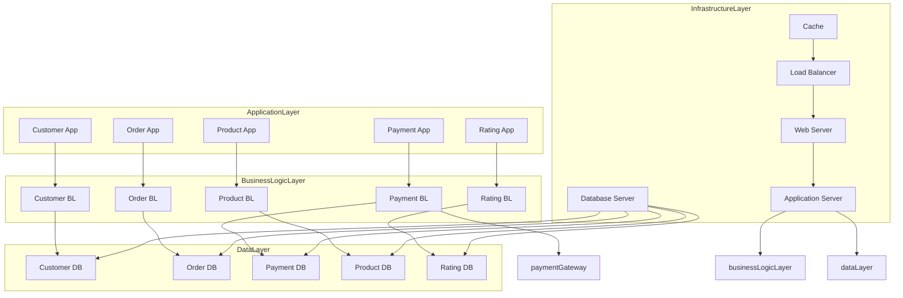
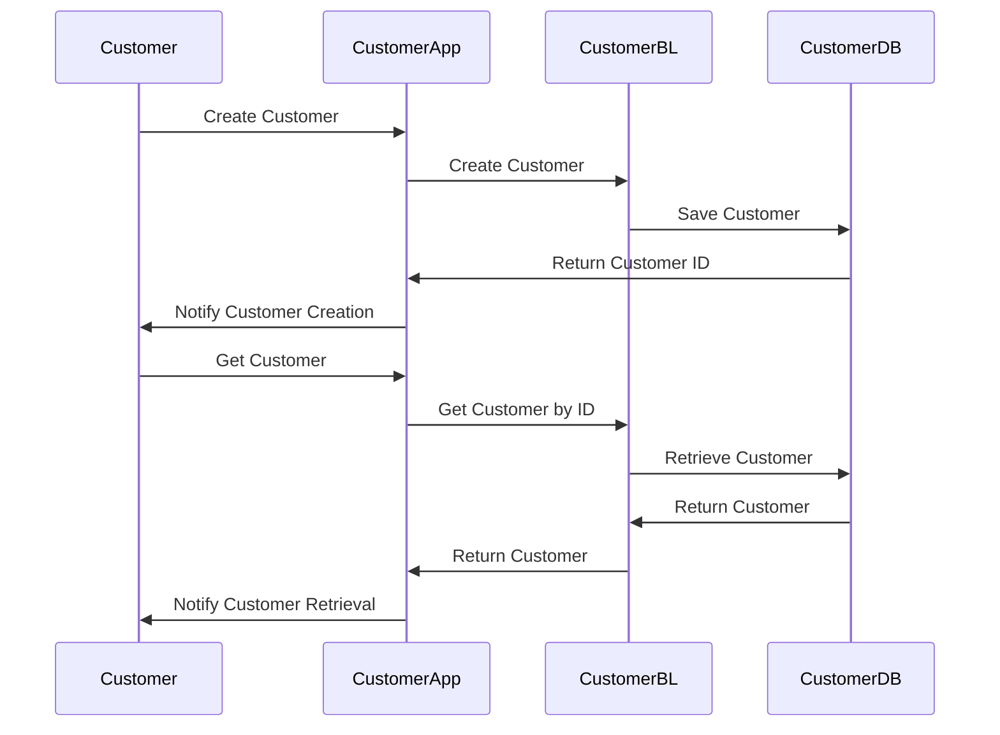

                 

# 技术leader的思维模式转型

关键词：技术leader，思维模式，转型，系统思维，用户思维，战略思维

摘要：本文探讨了技术leader在当今快速变化的技术环境中，如何进行思维模式的转型。从技术思维转向系统思维、用户思维和战略思维，以更好地适应新的工作需求，实现个人和团队的成长。

## 第一部分：背景介绍

### 1.1 问题背景

随着技术的飞速发展，企业的竞争环境变得越来越复杂，技术leader的角色也发生了巨大的变化。从过去的单纯技术管理者，转变为既要有深厚的技术功底，又要有全面的管理能力，还需要具备敏锐的市场洞察力和前瞻性的战略思维。这种转变要求技术leader在思维模式上做出相应的调整，以适应新的工作需求。

### 1.1.1 问题描述

技术leader在转型过程中，常常会遇到以下几个问题：

- **技术与管理能力的平衡**：技术leader既要深入技术细节，又要管理团队和项目，两者难以兼顾。
- **市场与技术的融合**：技术leader需要了解市场需求，但往往对市场营销和商业策略不熟悉。
- **战略与执行的结合**：技术leader需要在制定战略的同时，确保战略能够有效执行。

### 1.1.2 问题解决

为了解决上述问题，技术leader需要在思维模式上做出以下几个方面的转型：

- **从技术思维转向系统思维**：从关注单一技术细节，转向关注整个系统的运行机制和协作方式。
- **从产品思维转向用户思维**：从关注产品功能，转向关注用户需求，以用户为中心进行产品设计和决策。
- **从战术思维转向战略思维**：从关注短期目标和任务，转向关注长期战略和目标，具备前瞻性和全局观念。

### 1.1.3 边界与外延

技术leader的思维模式转型不仅涉及技术和管理领域，还涉及到市场营销、战略规划等多个领域。因此，转型的边界和范围较广，需要技术leader具备跨领域的知识储备和思维能力。

## 1.2 核心概念与联系

### 1.2.1 技术思维

技术思维是指技术人员对技术问题的分析、解决和创新的能力。技术思维的特点包括：

- **逻辑性**：技术思维强调逻辑推理和系统分析，以解决复杂技术问题。
- **专业性**：技术思维要求技术人员具备扎实的专业知识和技能。

### 1.2.2 系统思维

系统思维是指从整体角度看待问题，分析系统的内部结构和运行机制。系统思维的特点包括：

- **整体性**：系统思维强调系统的整体性和协同效应。
- **动态性**：系统思维关注系统的动态变化和发展趋势。

### 1.2.3 用户思维

用户思维是指从用户的角度思考问题，关注用户的需求和体验。用户思维的特点包括：

- **以用户为中心**：用户思维强调以用户需求为导向，进行产品设计和决策。
- **体验性**：用户思维关注用户的体验和感受，追求极致的用户体验。

### 1.2.4 战略思维

战略思维是指从长远角度思考问题，制定战略规划和决策。战略思维的特点包括：

- **前瞻性**：战略思维强调对未来的预判和规划。
- **全局性**：战略思维关注企业的整体发展和全局利益。

## 1.3 转型方法论

### 1.3.1 从技术思维到系统思维

- **方法**：通过学习系统理论，掌握系统分析的方法，培养整体观和协同观。
- **案例**：分析企业系统架构，理解各个模块之间的关系和相互作用。

### 1.3.2 从产品思维到用户思维

- **方法**：通过用户调研，了解用户需求和痛点，以用户为中心进行产品设计和优化。
- **案例**：分析用户反馈，调整产品功能，提升用户体验。

### 1.3.3 从战术思维到战略思维

- **方法**：通过战略规划课程，学习战略规划的方法和工具，提升前瞻性和全局观念。
- **案例**：制定企业长期战略，确保企业的可持续发展。

## 1.4 转型过程与挑战

### 1.4.1 转型过程

- **阶段一**：自我认知，明确转型目标。
- **阶段二**：学习新知识，掌握新技能。
- **阶段三**：实践应用，不断调整和完善。

### 1.4.2 转型挑战

- **挑战一**：平衡工作与学习，确保转型过程顺利进行。
- **挑战二**：应对工作压力，保持积极的心态。
- **挑战三**：克服旧有思维模式，接受新观念。

## 1.5 本章小结

本章介绍了技术leader的思维模式转型的背景、核心概念、转型方法论以及转型过程和挑战。通过本章的学习，读者可以了解技术leader转型的重要性，以及如何进行有效的转型。

## 第二部分：技术思维与系统思维的转型

### 2.1 技术思维与系统思维的区别

#### 2.1.1 技术思维

技术思维主要关注技术本身，强调技术的原理、方法和实现过程。技术思维的特点包括：

- **细节导向**：技术思维侧重于分析技术细节，追求技术的优化和改进。
- **专业性**：技术思维要求技术人员具备扎实的专业知识，能够解决复杂的技术问题。

#### 2.1.2 系统思维

系统思维是一种从整体角度看待问题的思维方式，强调系统的整体性、动态性和协同性。系统思维的特点包括：

- **整体导向**：系统思维关注系统的整体结构，分析各个部分之间的相互作用和影响。
- **前瞻性**：系统思维注重对系统未来发展趋势的预测和规划。

### 2.2 技术思维的局限性

技术思维的局限性主要体现在以下几个方面：

- **狭隘性**：技术思维容易陷入技术细节的泥潭，忽视对整体系统的影响。
- **短视性**：技术思维更注重眼前的技术问题，缺乏对长远发展的规划和思考。
- **孤立性**：技术思维往往关注单一技术领域，缺乏对跨领域知识的整合和应用。

### 2.3 系统思维的优势

系统思维的优势主要体现在以下几个方面：

- **全局性**：系统思维能够从整体角度看待问题，分析系统内部和外部环境的关系。
- **前瞻性**：系统思维注重对系统未来发展的预测和规划，有助于制定长远的战略。
- **协同性**：系统思维强调系统的各个部分之间的协同作用，促进系统的整体优化。

### 2.4 技术思维向系统思维的转型步骤

技术leader要从技术思维向系统思维转型，可以遵循以下步骤：

- **1. 拓宽知识面**：学习跨领域的知识，增强对整体系统的理解。
- **2. 培养整体观**：从整体角度看待问题，分析系统内部和外部环境的关系。
- **3. 学习系统分析方法**：掌握系统分析的方法和工具，提高系统思维能力。
- **4. 实践应用**：在实际工作中应用系统思维，不断调整和完善。

### 2.5 系统思维的应用案例

以下是一个系统思维的应用案例：

假设一个技术团队正在开发一款智能家居系统，技术leader需要从系统思维的角度考虑以下问题：

- **1. 系统整体性**：如何确保智能家居系统的各个部分（如智能音箱、智能灯光、智能门锁等）能够无缝协作，提供一致的用户体验？
- **2. 动态性**：如何应对用户需求的变化，及时调整系统功能？
- **3. 协同性**：如何协调技术团队内部的工作，确保项目的顺利推进？

通过系统思维，技术leader可以从整体角度分析问题，制定有效的解决方案，提高系统的质量和性能。

### 2.6 本章小结

本章详细介绍了技术思维与系统思维的区别、技术思维的局限性、系统思维的优势以及技术思维向系统思维的转型步骤和应用案例。通过本章的学习，读者可以更好地理解系统思维的重要性，并在实际工作中应用系统思维，提升技术领导力。

## 第三部分：产品思维与用户思维的转型

### 3.1 产品思维与用户思维的对比

#### 3.1.1 产品思维

产品思维是指从产品的角度出发，关注产品功能、性能、设计和用户体验等方面。产品思维的特点包括：

- **功能导向**：产品思维侧重于产品的功能实现，追求产品的高效性和易用性。
- **效率优先**：产品思维强调在满足用户需求的前提下，提高产品开发的速度和效率。

#### 3.1.2 用户思维

用户思维是指从用户的角度出发，关注用户需求、体验和满意度等方面。用户思维的特点包括：

- **用户导向**：用户思维强调以用户需求为中心，设计产品和服务。
- **体验优先**：用户思维注重用户的体验和满意度，追求产品的极致用户体验。

### 3.2 产品思维的局限性

产品思维的局限性主要体现在以下几个方面：

- **短视性**：产品思维容易关注短期目标和效益，忽视用户的长期需求和满意度。
- **孤立性**：产品思维容易陷入产品功能细节，忽视用户需求和用户体验的整体性。
- **效率优先**：产品思维可能在追求效率的过程中，牺牲用户体验和质量。

### 3.3 用户思维的优势

用户思维的优势主要体现在以下几个方面：

- **前瞻性**：用户思维能够预测用户未来的需求，提供有预见性的产品和服务。
- **用户导向**：用户思维以用户为中心，关注用户的需求和满意度，提升产品的市场竞争力。
- **体验优化**：用户思维注重用户体验，通过不断优化产品和服务，提升用户满意度。

### 3.4 产品思维向用户思维的转型步骤

技术leader要从产品思维向用户思维转型，可以遵循以下步骤：

- **1. 理解用户需求**：通过用户调研、访谈等方式，深入了解用户的需求和痛点。
- **2. 用户体验设计**：以用户为中心，设计产品和服务，关注用户的体验和满意度。
- **3. 不断优化**：通过用户反馈，不断调整产品和服务，提升用户体验。
- **4. 数据驱动**：利用数据分析工具，收集用户数据，指导产品优化和决策。

### 3.5 用户思维的应用案例

以下是一个用户思维的应用案例：

假设一个技术团队正在开发一款在线教育平台，技术leader需要从用户思维的角度考虑以下问题：

- **1. 用户需求分析**：如何了解学生的学习需求和习惯，提供个性化的学习方案？
- **2. 用户体验设计**：如何优化平台的界面和交互设计，提升用户的操作便捷性和学习效率？
- **3. 用户反馈机制**：如何建立有效的用户反馈机制，及时了解用户意见，持续改进产品？

通过用户思维，技术leader可以从用户的角度出发，设计出更加符合用户需求、提升用户体验的产品和服务。

### 3.6 本章小结

本章详细介绍了产品思维与用户思维的对比、产品思维的局限性、用户思维的优势以及产品思维向用户思维的转型步骤和应用案例。通过本章的学习，读者可以更好地理解用户思维的重要性，并在实际工作中应用用户思维，提升产品设计和用户体验。

## 第四部分：战术思维与战略思维的转型

### 4.1 战略思维与战术思维的对比

#### 4.1.1 战略思维

战略思维是指从长远角度思考问题，关注企业的发展方向、目标和资源分配。战略思维的特点包括：

- **全局性**：战略思维关注企业的整体发展和长期目标，注重全局的优化和布局。
- **前瞻性**：战略思维注重对未来市场趋势的预判和规划，确保企业在竞争中的领先地位。
- **系统性**：战略思维强调系统思考和整体优化，关注企业内部和外部环境的协同发展。

#### 4.1.2 战术思维

战术思维是指从短期角度思考问题，关注具体的任务和操作。战术思维的特点包括：

- **细节性**：战术思维侧重于具体的任务和操作，关注细节的执行和优化。
- **即时性**：战术思维强调即时效果和短期目标的实现，注重工作效率和执行力。
- **局部性**：战术思维容易陷入局部优化，忽视整体影响和长期发展。

### 4.2 战术思维的局限性

战术思维的局限性主要体现在以下几个方面：

- **短视性**：战术思维容易关注短期利益，忽视长期发展和整体规划。
- **孤立性**：战术思维容易陷入局部优化，忽视整体协调和系统效应。
- **应急性**：战术思维往往应对突发问题和紧急任务，缺乏长远规划和战略布局。

### 4.3 战略思维的优势

战略思维的优势主要体现在以下几个方面：

- **前瞻性**：战略思维能够预测未来趋势，制定长远规划，确保企业的可持续发展。
- **全局性**：战略思维关注企业的整体发展，注重资源优化和协同效应。
- **系统化**：战略思维强调系统思考和整体优化，推动企业的全面发展。

### 4.4 战术思维向战略思维的转型步骤

技术leader要从战术思维向战略思维转型，可以遵循以下步骤：

- **1. 建立长远规划**：制定企业的发展目标和战略规划，明确长期发展方向。
- **2. 增强前瞻性**：关注市场趋势和技术变革，预测未来竞争格局，提前布局。
- **3. 强化系统思维**：从整体角度思考问题，关注企业内部和外部环境的协同发展。
- **4. 提高执行力**：确保战略规划的有效执行，不断调整和优化战略实施。

### 4.5 战略思维的应用案例

以下是一个战略思维的应用案例：

假设一个技术团队正在准备进行技术升级，技术leader需要从战略思维的角度考虑以下问题：

- **1. 长远规划**：如何根据企业的发展目标和市场需求，选择合适的技术方案？
- **2. 前瞻性**：如何预测未来技术发展趋势，提前布局和储备技术资源？
- **3. 系统性**：如何协调企业内部各部门的工作，确保技术升级的顺利进行？
- **4. 执行力**：如何确保技术升级项目的有效执行，达到预期效果？

通过战略思维，技术leader可以从全局和长远的角度出发，制定出科学、合理的战略规划，确保企业的可持续发展。

### 4.6 本章小结

本章详细介绍了战略思维与战术思维的对比、战术思维的局限性、战略思维的优势以及战术思维向战略思维的转型步骤和应用案例。通过本章的学习，读者可以更好地理解战略思维的重要性，并在实际工作中应用战略思维，提升企业的整体竞争力和可持续发展能力。

## 第五部分：综合转型与持续成长

### 5.1 综合转型的重要性

综合转型是指技术leader在多个思维模式的转型过程中，实现整体能力的提升。综合转型的重要性体现在以下几个方面：

- **提升整体竞争力**：综合转型使技术leader具备多方面的能力和思维方式，提高整体竞争力。
- **促进个人成长**：综合转型有助于技术leader实现自我突破和成长，提升个人价值和职业发展。
- **推动团队进步**：综合转型能够激发团队成员的潜力，提升团队整体绩效。

### 5.2 持续成长的方法

技术leader在实现思维模式转型后，需要持续成长，以适应不断变化的技术环境。以下是几个持续成长的方法：

- **1. 学习新知识**：持续关注行业动态，学习新技术和理论知识，保持知识更新。
- **2. 参与实战项目**：参与实际项目，锻炼实践能力和团队协作能力。
- **3. 反思与总结**：定期进行工作反思，总结经验教训，不断提升自己。
- **4. 建立学习网络**：与同行交流，建立学习网络，分享经验和见解。

### 5.3 成长与挑战

在持续成长的过程中，技术leader可能会面临以下挑战：

- **1. 时间管理**：平衡工作和学习，确保有足够的时间进行个人成长。
- **2. 心理压力**：面对不断变化的技术环境，可能会产生心理压力，需要保持积极的心态。
- **3. 知识更新**：技术发展迅速，需要不断更新知识，保持竞争力。

### 5.4 成长与团队的关系

技术leader的持续成长对团队有着积极的影响：

- **1. 提升团队士气**：技术leader的成长能够激励团队成员，提升团队士气。
- **2. 促进知识共享**：技术leader的成长有助于推动团队内部的知识共享和经验交流。
- **3. 提升团队绩效**：技术leader的成长能够提升团队的整体绩效，实现团队目标。

### 5.5 成长与企业的关系

技术leader的持续成长对企业有着深远的影响：

- **1. 提升企业竞争力**：技术leader的成长有助于企业适应市场变化，提升竞争力。
- **2. 促进创新与发展**：技术leader的成长能够激发企业的创新意识，推动企业持续发展。
- **3. 优化企业文化**：技术leader的成长有助于优化企业文化，提升企业的整体氛围。

### 5.6 本章小结

本章详细介绍了综合转型的重要性、持续成长的方法、成长与挑战、成长与团队的关系以及成长与企业的关系。通过本章的学习，读者可以了解技术leader在综合转型和持续成长过程中的重要性，以及如何应对挑战，实现个人和团队的共同进步。

## 结论

技术leader的思维模式转型是适应现代企业需求的关键步骤。从技术思维转向系统思维、用户思维和战略思维，技术leader能够更好地应对复杂多变的技术环境，提升整体竞争力和可持续发展能力。本文通过详细的分析和实例，阐述了技术leader思维模式转型的必要性、方法和实践路径。希望读者能够从中获得启示，积极进行思维模式的转型，实现个人和团队的成长。作者：AI天才研究院/AI Genius Institute & 禅与计算机程序设计艺术 /Zen And The Art of Computer Programming。

---

### 核心概念术语说明

在本文中，我们介绍了几个核心概念和术语，这些概念和术语对于理解技术leader的思维模式转型至关重要。以下是这些概念和术语的详细说明：

#### 技术思维

**定义**：技术思维是指技术人员对技术问题的分析、解决和创新的能力。

**特点**：

- **逻辑性**：技术思维强调逻辑推理和系统分析，以解决复杂技术问题。
- **专业性**：技术思维要求技术人员具备扎实的专业知识和技能。

**示例**：在软件开发过程中，技术人员需要运用技术思维分析需求、设计架构、编写代码和优化性能。

#### 系统思维

**定义**：系统思维是指从整体角度看待问题，分析系统的内部结构和运行机制。

**特点**：

- **整体性**：系统思维强调系统的整体性和协同效应。
- **动态性**：系统思维关注系统的动态变化和发展趋势。

**示例**：在项目规划中，系统思维要求技术leader考虑整个项目的各个部分如何协同工作，以实现最佳效果。

#### 产品思维

**定义**：产品思维是指从产品的角度出发，关注产品功能、性能、设计和用户体验等方面。

**特点**：

- **功能导向**：产品思维侧重于产品的功能实现，追求产品的高效性和易用性。
- **效率优先**：产品思维强调在满足用户需求的前提下，提高产品开发的速度和效率。

**示例**：在产品设计阶段，产品思维要求技术leader评估产品的功能是否满足用户需求，并优化开发流程。

#### 用户思维

**定义**：用户思维是指从用户的角度出发，关注用户需求、体验和满意度等方面。

**特点**：

- **用户导向**：用户思维强调以用户需求为中心，设计产品和服务。
- **体验优先**：用户思维注重用户的体验和满意度，追求产品的极致用户体验。

**示例**：在用户调研中，技术leader需要了解用户的需求和痛点，以便改进产品设计和提升用户体验。

#### 战略思维

**定义**：战略思维是指从长远角度思考问题，制定战略规划和决策。

**特点**：

- **前瞻性**：战略思维强调对未来的预判和规划。
- **全局性**：战略思维关注企业的整体发展和全局利益。

**示例**：在市场拓展中，技术leader需要运用战略思维分析市场趋势，制定长期发展策略。

通过了解这些核心概念和术语，读者可以更深入地理解技术leader的思维模式转型，并应用这些概念指导实际工作。

### 问题背景

在当今快速变化的技术环境中，企业的竞争压力日益增大，技术leader的角色也在不断演变。过去，技术leader主要关注技术本身，负责解决技术问题和推动技术发展。然而，随着技术的不断进步和市场环境的复杂化，技术leader的角色已经不再局限于技术层面，他们需要承担更多管理、市场和战略层面的责任。这种转变不仅要求技术leader具备深厚的专业知识和技能，还需要他们在思维模式上做出相应的调整，以更好地应对新的挑战。

首先，技术leader需要从技术思维转向系统思维。传统的技术思维往往关注单一的技术细节，容易忽视整体系统的运行机制和协同效应。而系统思维则强调从整体角度看待问题，分析系统内部和外部环境的关系，关注系统的动态变化和发展趋势。这种思维方式有助于技术leader更好地理解系统的复杂性和多样性，从而制定出更有效的解决方案。

其次，技术leader需要从产品思维转向用户思维。随着用户需求的变化和市场竞争的加剧，产品思维已经不再能满足企业的需求。用户思维强调以用户为中心，关注用户的需求、体验和满意度。技术leader需要通过用户调研、用户反馈等方式，深入了解用户的需求和痛点，从而设计出更符合用户需求的产品和服务。这种思维方式有助于提升产品的市场竞争力，满足用户的需求。

最后，技术leader需要从战术思维转向战略思维。战术思维关注短期目标和任务的实现，而战略思维则强调从长远角度思考问题，制定企业的发展目标和战略规划。技术leader需要具备前瞻性和全局观念，预测未来技术趋势和市场变化，为企业的发展提供指导。这种思维方式有助于企业实现可持续发展，保持市场竞争力。

综上所述，技术leader的思维模式转型是适应现代企业需求的关键步骤。通过从技术思维转向系统思维、用户思维和战略思维，技术leader能够更好地应对复杂多变的技术环境，提升整体竞争力和可持续发展能力。然而，这种转型并非一蹴而就，需要技术leader在学习和实践中不断调整和完善自己的思维方式。

### 问题描述

在技术leader的思维模式转型过程中，存在一些普遍的问题和挑战，这些问题可能会影响转型的效果和进度。以下是对这些问题的详细描述和分析：

#### 1. 技术与管理能力的平衡

技术leader需要具备深厚的技术背景，同时又要承担管理团队和项目的职责。这种双重角色要求他们在技术和管理方面都能达到一定的水平。然而，很多技术leader在转型过程中难以平衡这两者之间的关系。一方面，他们可能会因为专注于技术细节而忽视了团队管理和项目进度；另一方面，他们可能会因为承担过多的管理职责而无法深入技术研究。

**解决方法**：为了平衡技术与管理能力，技术leader可以采取以下措施：

- **1. 设定优先级**：明确技术研究和团队管理的优先级，合理分配时间和精力。
- **2. 分享责任**：将一些管理职责分配给团队成员，让他们参与项目管理和决策过程，从而减轻技术leader的负担。
- **3. 培养团队**：通过培训和教育，提升团队成员的技术水平和团队协作能力，使技术leader能够更专注于技术研究。

#### 2. 市场与技术的融合

技术leader需要了解市场需求，以便将技术优势转化为市场竞争力。然而，很多技术leader在市场营销和商业策略方面缺乏经验，这导致他们在技术决策和市场推广上存在困难。市场与技术的融合是一个复杂的任务，需要技术leader具备跨领域的知识和能力。

**解决方法**：为了实现市场与技术的融合，技术leader可以采取以下措施：

- **1. 学习市场营销知识**：参加相关的培训和课程，学习市场营销的基本原理和策略。
- **2. 建立合作伙伴关系**：与市场营销和销售团队建立紧密的沟通和协作关系，了解市场需求和用户反馈。
- **3. 重视用户调研**：通过用户调研和分析，了解用户的需求和痛点，从而指导技术决策。

#### 3. 战略与执行的结合

技术leader在制定战略规划时，需要确保这些战略能够有效地执行。然而，很多技术leader在战略执行过程中面临挑战，包括资源分配不当、执行力度不足和沟通不畅等问题。

**解决方法**：为了确保战略与执行的结合，技术leader可以采取以下措施：

- **1. 明确执行计划**：制定详细的执行计划，明确资源分配、任务分工和时间表。
- **2. 加强沟通与协作**：确保团队成员了解战略目标和执行计划，建立有效的沟通和协作机制。
- **3. 监控与调整**：定期监控战略执行的进度和效果，及时调整计划和资源，确保战略目标的实现。

#### 4. 个人与团队的成长

技术leader在思维模式转型过程中，不仅要提升自己的能力，还需要推动团队成员的共同成长。然而，很多技术leader在转型过程中忽视了团队成员的培养，导致团队整体能力提升缓慢。

**解决方法**：为了促进个人与团队的成长，技术leader可以采取以下措施：

- **1. 培训与指导**：为团队成员提供培训机会，帮助他们提升技术和管理能力。
- **2. 分享经验**：鼓励团队成员分享经验和见解，促进知识共享和团队协作。
- **3. 建立激励机制**：通过奖励和激励措施，激发团队成员的学习和成长动力。

综上所述，技术leader在思维模式转型过程中面临多方面的挑战。通过采取有效的措施和策略，他们可以克服这些挑战，实现个人和团队的共同成长。

### 问题解决

在技术leader的思维模式转型过程中，通过采取一系列具体的解决方案，可以有效应对上述问题和挑战，实现从技术思维到系统思维、用户思维和战略思维的转变。以下是一些建议和策略：

#### 1. 技术与管理能力的平衡

**建议**：

- **设立明确的优先级**：技术leader需要明确自己在不同阶段的工作重点，合理分配时间。例如，在项目初期，可以更多关注技术架构和设计；在项目后期，可以更多关注团队管理和项目进度。

- **有效利用团队成员**：技术leader应充分了解团队成员的能力和特长，合理分配任务，让团队成员在各自擅长的领域发挥最大作用。

- **定期反思和调整**：技术leader应定期回顾自己的工作方式，反思哪些方面需要改进，并根据实际情况进行调整。

**案例**：某互联网公司的技术总监在转型过程中，通过设立明确的优先级，将技术研究和团队管理分开处理。他每周会花两天时间专注于技术问题的解决，其他时间则用于团队管理和项目协调。此外，他还鼓励团队成员参与项目管理，提高他们的参与感和责任感。

#### 2. 市场与技术的融合

**建议**：

- **学习市场营销知识**：技术leader可以通过参加市场营销培训、阅读相关书籍和资料，提升自己在市场营销方面的认知和技能。

- **建立跨部门合作机制**：技术leader应积极与市场营销团队建立合作关系，定期交流市场需求和用户反馈，确保技术决策与市场策略一致。

- **重视用户调研**：技术leader应定期进行用户调研，了解用户的需求和痛点，从而指导技术决策。

**案例**：某科技公司技术总监在转型过程中，积极参加公司内部的市场营销培训，了解市场趋势和用户需求。他还与市场营销团队紧密合作，定期召开跨部门会议，讨论技术产品的市场定位和推广策略。通过这些措施，他成功将技术优势转化为市场竞争力。

#### 3. 战略与执行的结合

**建议**：

- **制定详细的执行计划**：技术leader应制定详细的执行计划，明确各阶段的目标、任务和时间表，确保战略目标能够有效落地。

- **建立高效的沟通机制**：技术leader应建立有效的沟通机制，确保团队成员了解战略目标和执行计划，提高团队协作效率。

- **定期监控与反馈**：技术leader应定期监控战略执行情况，收集反馈意见，及时调整执行计划，确保战略目标能够顺利实现。

**案例**：某大型企业的技术总监在制定公司战略规划时，首先制定了一个详细的执行计划，包括具体的任务分工、时间表和资源分配。他还建立了定期的项目会议和报告机制，让团队成员及时了解项目进展和存在的问题。通过这些措施，他确保了战略规划的有效执行。

#### 4. 个人与团队的成长

**建议**：

- **提供培训与指导**：技术leader应定期为团队成员提供培训机会，帮助他们提升技术和管理能力。例如，可以邀请行业专家进行讲座，组织内部技术分享会等。

- **建立激励机制**：技术leader可以通过奖励和激励措施，激发团队成员的学习和成长动力。例如，设立技术竞赛、评选技术明星等。

- **鼓励知识共享**：技术leader应鼓励团队成员分享经验和见解，促进知识共享和团队协作。例如，建立内部知识库、组织团队学习活动等。

**案例**：某科技公司的技术总监通过建立内部知识库，鼓励团队成员将工作中的经验和心得记录下来，供其他成员参考。他还定期组织团队学习活动，邀请外部专家进行讲座，提升团队成员的技术水平和管理能力。

通过以上措施和策略，技术leader可以有效地解决思维模式转型过程中遇到的问题和挑战，实现个人和团队的共同成长。

### 边界与外延

在探讨技术leader的思维模式转型时，需要明确转型的边界与外延，以便更好地理解这一过程的影响范围和深度。技术leader的思维模式转型不仅局限于技术领域，还涉及管理、市场、战略等多个方面。以下是对转型边界与外延的详细探讨：

#### 1. 跨领域知识储备

技术leader的转型要求他们具备跨领域的知识储备，包括管理学、市场营销学、经济学等。这些跨领域的知识有助于技术leader更好地理解企业的运营机制、市场需求和商业战略。例如，了解管理学可以帮助技术leader更有效地管理团队，而市场营销学则有助于他们理解用户需求和市场趋势。

**边界**：技术leader在转型过程中，需要掌握的基础知识包括团队管理、项目管理和市场营销等。然而，这些知识的深度和广度并没有固定的界限，技术leader应根据企业的实际情况和个人需求不断学习和拓展。

**外延**：随着技术的发展和市场环境的变化，技术leader需要不断更新自己的知识体系，以适应新的挑战。例如，人工智能、大数据和区块链等新兴技术的兴起，要求技术leader具备相应的前沿知识，以便在战略决策中发挥更大的作用。

#### 2. 跨部门协作

技术leader的思维模式转型不仅仅影响其自身，还涉及到与其他部门的协作。跨部门协作的深度和广度决定了技术leader转型效果的成败。在转型过程中，技术leader需要与市场营销、产品管理、人力资源等部门建立紧密的合作关系，共同推进企业的发展。

**边界**：技术leader在跨部门协作中的角色是协调者和推动者。他们需要明确各方的职责和目标，确保各部门之间的工作协调一致。跨部门协作的边界在于各方职责的划分和合作机制的建立。

**外延**：跨部门协作的深度和广度取决于企业的组织结构和文化。在高度集权的组织中，技术leader可能面临更大的挑战，需要通过有效的沟通和协调来推动跨部门合作。而在扁平化的组织中，技术leader可以更轻松地实现跨部门协作，发挥更大的影响力。

#### 3. 战略决策

技术leader的思维模式转型最终体现在战略决策上。战略决策是企业发展的关键环节，技术leader在这一过程中需要运用系统思维、用户思维和战略思维，制定长远的发展规划。

**边界**：技术leader在战略决策中的角色是战略规划者和执行推动者。他们需要考虑企业的长期发展目标、市场需求和资源分配，确保战略决策的科学性和可行性。战略决策的边界在于决策的范围和深度。

**外延**：战略决策的影响范围广泛，涉及到企业的各个层面和部门。技术leader需要与高层管理者、市场营销团队、产品管理团队等密切合作，确保战略决策的有效实施。同时，技术leader还应关注外部环境的变化，及时调整战略决策，以适应市场和技术的发展。

#### 4. 企业文化

技术leader的思维模式转型对企业文化也有深远的影响。一个开放、包容和创新的企业文化有助于技术leader实现转型，推动企业的持续发展。

**边界**：企业文化是企业在长期发展中形成的共同价值观和行为规范。技术leader在转型过程中需要遵循企业文化的边界，确保自己的思维模式与企业文化相契合。

**外延**：企业文化的影响范围广泛，涉及到企业的员工行为、组织结构和管理模式。技术leader应积极推动企业文化的建设，营造一个开放、包容和创新的工作环境，促进个人和团队的共同成长。

综上所述，技术leader的思维模式转型具有明确的边界和广泛的外延。在转型过程中，技术leader需要不断拓展自己的知识储备，建立跨部门协作机制，制定科学合理的战略决策，并积极推动企业文化的建设。通过这些措施，技术leader可以更好地适应新的工作需求，实现个人和企业的共同成长。

### 核心概念与联系

在技术leader的思维模式转型过程中，有四个核心概念至关重要，它们分别是技术思维、系统思维、用户思维和战略思维。这些概念相互联系，共同构成了技术leader转型的基础。以下是对这些核心概念及其相互关系的详细探讨。

#### 技术思维

**定义**：技术思维是指技术人员对技术问题的分析、解决和创新的能力。它强调逻辑性和专业性，是技术人员解决复杂技术问题的基础。

**特点**：

- **逻辑性**：技术思维强调逻辑推理和系统分析，以解决复杂技术问题。
- **专业性**：技术思维要求技术人员具备扎实的专业知识和技能。

**联系**：技术思维是技术leader转型的起点，是技术leader在技术领域中赖以生存的基础。技术思维与其他三种思维模式（系统思维、用户思维和战略思维）相互补充，共同构成技术leader的综合能力。

#### 系统思维

**定义**：系统思维是指从整体角度看待问题，分析系统的内部结构和运行机制。它强调系统的整体性和动态性，有助于技术leader理解复杂系统的运作。

**特点**：

- **整体性**：系统思维强调系统的整体性和协同效应。
- **动态性**：系统思维关注系统的动态变化和发展趋势。

**联系**：系统思维是技术leader在从技术思维向更高层次转型的过程中不可或缺的一环。它帮助技术leader从整体角度分析问题，理解技术系统与其他系统的相互作用，从而做出更科学的决策。

#### 用户思维

**定义**：用户思维是指从用户的角度出发，关注用户需求、体验和满意度。它强调以用户为中心，是提升产品和服务质量的关键。

**特点**：

- **用户导向**：用户思维强调以用户需求为导向，进行产品设计和决策。
- **体验性**：用户思维关注用户的体验和感受，追求极致的用户体验。

**联系**：用户思维是技术leader在关注用户需求和提升用户体验方面的重要思维方式。它与技术思维、系统思维和战略思维相互融合，共同推动技术leader实现以用户为中心的转型。

#### 战略思维

**定义**：战略思维是指从长远角度思考问题，制定战略规划和决策。它强调前瞻性和全局性，是技术leader在企业战略层面发挥作用的关键。

**特点**：

- **前瞻性**：战略思维强调对未来的预判和规划。
- **全局性**：战略思维关注企业的整体发展和全局利益。

**联系**：战略思维是技术leader在实现长远发展和企业战略层面不可或缺的思维方式。它与技术思维、系统思维和用户思维相结合，共同构成技术leader的战略视野和决策能力。

#### 概念关系

技术思维、系统思维、用户思维和战略思维这四个核心概念相互联系，共同构成了技术leader思维模式的转型框架。技术思维是基础，系统思维提供了全局视角，用户思维关注用户需求，战略思维则关注长远规划和全局利益。这四个概念相互补充，形成一个完整的思维模式体系，帮助技术leader更好地应对复杂多变的技术环境。

通过理解这些核心概念及其相互关系，技术leader可以更系统地分析和解决问题，实现个人和团队的成长，为企业的可持续发展提供有力支持。

### 从技术思维到系统思维的转型

#### 1. 从技术思维到系统思维的方法

技术leader要从技术思维向系统思维转型，需要掌握一系列方法和工具，以培养整体观和协同观。以下是一些关键步骤：

**1. 学习系统理论**

系统理论是理解系统思维的基础。技术leader可以学习系统论、控制论和信息论等相关理论，掌握系统的基本概念和运行机制。这些理论有助于技术leader从整体角度看待问题，理解系统内部和外部环境的关系。

**2. 掌握系统分析方法**

系统分析方法是一种从系统角度分析问题的重要工具。技术leader可以学习常见的系统分析方法，如因果分析、系统建模、系统仿真等。这些方法可以帮助技术leader深入分析系统的结构和运行机制，发现潜在的问题和优化机会。

**3. 培养整体观**

整体观是系统思维的核心。技术leader需要培养整体观，从整体角度看待系统中的各个部分及其相互作用。可以通过以下方式培养整体观：

- **跨部门协作**：参与跨部门的项目和会议，了解不同部门的工作内容和目标，增强对整个系统的理解。
- **系统思维训练**：通过案例分析、模拟演练等方式，训练自己从整体角度分析和解决问题的能力。
- **反思与总结**：在项目结束后，反思整体效果和各个部分的表现，总结经验教训，不断提高整体观。

**4. 建立协同观**

协同观强调系统内部各个部分之间的协同作用。技术leader需要关注系统内部的协作和资源优化，确保各个部分能够高效配合，实现整体目标。可以通过以下方式建立协同观：

- **优化流程**：分析现有流程，识别瓶颈和浪费，优化流程，提高系统的运行效率。
- **资源整合**：整合系统内部的资源，确保资源得到合理利用，减少资源浪费。
- **团队建设**：培养团队协作精神，建立有效的沟通和协作机制，促进团队整体绩效的提升。

#### 2. 应用案例

以下是一个从技术思维到系统思维的应用案例：

假设一家互联网公司正在开发一款智能家居系统，技术leader需要从系统思维的角度考虑以下问题：

- **整体性**：智能家居系统由多个子系统组成，如智能音箱、智能灯光、智能门锁等。技术leader需要确保这些子系统能够无缝协作，提供一致的用户体验。
- **动态性**：用户需求和市场环境不断变化，技术leader需要关注系统的动态变化，及时调整系统功能，满足用户需求。
- **协同性**：技术leader需要协调不同部门的工作，如研发、产品、测试等，确保项目顺利推进。

通过系统思维，技术leader可以更好地理解智能家居系统的整体结构和运行机制，发现潜在的问题和优化机会，从而提高系统的质量和性能。

### 从产品思维到用户思维的转型

#### 1. 从产品思维到用户思维的方法

技术leader要从产品思维转向用户思维，需要掌握一系列方法和工具，以更好地理解用户需求，提升用户体验。以下是一些关键步骤：

**1. 用户调研**

用户调研是理解用户需求的关键。技术leader可以通过访谈、问卷、用户行为分析等方式，收集用户反馈和数据，深入了解用户的需求、行为和偏好。这些数据可以帮助技术leader更好地把握用户需求，指导产品设计和优化。

**2. 用户画像**

用户画像是一种将用户数据转化为具体形象的方法，有助于技术leader更直观地理解用户。技术leader可以通过分析用户的基本属性、行为特征和需求偏好，构建用户画像，从而更好地设计出符合用户需求的产品。

**3. 用户体验设计**

用户体验设计是将用户思维融入产品设计和开发过程的重要手段。技术leader可以通过以下方式提升用户体验设计：

- **交互设计**：优化产品的界面和交互设计，确保用户操作简单、直观。
- **用户反馈**：建立用户反馈机制，及时收集用户反馈，并根据反馈调整产品功能。
- **用户体验测试**：通过用户体验测试，验证产品设计的有效性和用户满意度，不断优化产品。

**4. 用户导向**

用户导向是用户思维的核心理念。技术leader需要在产品设计和决策过程中，始终以用户需求为中心，关注用户的体验和满意度。可以通过以下方式实现用户导向：

- **用户需求优先**：在产品设计和开发过程中，优先考虑用户需求，确保产品功能满足用户需求。
- **用户参与**：鼓励用户参与产品设计和决策过程，收集用户意见和建议，提高产品的用户体验。

**5. 数据驱动**

数据驱动是用户思维的重要特点。技术leader需要利用数据分析工具，收集和分析用户数据，从中发现用户需求和趋势，指导产品优化和决策。以下是一些数据驱动的实践方法：

- **A/B测试**：通过A/B测试，比较不同设计方案的用户反馈，选择最优方案。
- **用户行为分析**：分析用户的行为数据，了解用户的使用习惯和偏好，优化产品设计和功能。
- **用户反馈分析**：分析用户反馈数据，识别用户痛点，针对性地优化产品功能。

#### 2. 应用案例

以下是一个从产品思维到用户思维的应用案例：

假设一家科技公司正在开发一款健康管理应用程序，技术leader需要从用户思维的角度考虑以下问题：

- **用户调研**：通过用户访谈和问卷调查，了解用户对健康管理的需求和期望，收集用户反馈。
- **用户画像**：根据用户调研数据，构建用户画像，了解用户的基本属性、行为特征和需求偏好。
- **用户体验设计**：优化应用程序的界面和交互设计，确保用户能够轻松使用，提供个性化的健康管理方案。
- **用户参与**：邀请用户参与应用的设计和测试，收集用户意见和建议，提高产品的用户体验。
- **数据驱动**：利用用户数据，分析用户行为和偏好，优化产品的功能，提高用户满意度。

通过从产品思维到用户思维的转型，技术leader可以更好地满足用户需求，提升用户体验，从而提高产品的市场竞争力。

### 从战术思维到战略思维的转型

#### 1. 从战术思维到战略思维的方法

技术leader要从战术思维转向战略思维，需要掌握一系列方法和工具，以提升前瞻性和全局观念。以下是一些关键步骤：

**1. 学习战略规划**

战略规划是战略思维的基础。技术leader可以通过学习企业战略规划的理论和实践，掌握战略规划的方法和工具，包括SWOT分析、PEST分析、波特五力分析等。这些工具可以帮助技术leader从全局角度分析企业内外部环境，制定长远的发展目标。

**2. 增强前瞻性**

前瞻性是战略思维的重要特点。技术leader需要关注行业趋势、技术发展和社会变化，预测未来的发展方向和机遇。以下是一些增强前瞻性的方法：

- **行业研究**：定期研究行业报告和市场趋势，了解行业发展的方向和趋势。
- **技术创新**：关注新兴技术和创新应用，探索新的业务机会和增长点。
- **市场调研**：通过市场调研，了解用户需求和市场变化，为战略规划提供数据支持。

**3. 提升全局观念**

全局观念是战略思维的核心。技术leader需要从整体角度看待问题，关注企业的整体利益和长期发展。以下是一些提升全局观念的方法：

- **跨部门协作**：积极参与跨部门的项目和会议，了解不同部门的工作内容和目标，增强对整个企业的理解。
- **系统思考**：运用系统思维，分析企业内部和外部环境的相互作用，制定整体优化方案。
- **战略分析**：通过战略分析，识别企业的优势和劣势，制定有效的战略措施。

**4. 强化执行能力**

战略思维不仅要考虑长远规划和前瞻性，还要确保战略能够有效执行。以下是一些强化执行能力的方法：

- **执行计划**：制定详细的执行计划，明确各阶段的任务、时间和资源分配。
- **沟通与协作**：建立有效的沟通和协作机制，确保团队成员了解战略目标和执行计划。
- **监控与调整**：定期监控战略执行情况，及时调整执行计划，确保战略目标的实现。

#### 2. 应用案例

以下是一个从战术思维到战略思维的应用案例：

假设一家科技公司计划进行技术升级，技术leader需要从战略思维的角度考虑以下问题：

- **战略规划**：通过SWOT分析和市场调研，制定详细的技术升级战略，明确技术方向和发展目标。
- **前瞻性**：关注新兴技术和市场趋势，选择具有前瞻性的技术方案，确保公司在竞争中保持领先地位。
- **全局观念**：从整体角度考虑技术升级的影响，协调企业内部各部门的工作，确保技术升级的顺利进行。
- **执行能力**：制定详细的执行计划，明确任务分工和时间表，建立有效的沟通和协作机制，确保技术升级项目的顺利实施。

通过从战术思维到战略思维的转型，技术leader可以更好地制定长远发展规划，提升前瞻性和全局观念，确保战略能够有效执行，从而推动企业的可持续发展。

### 转型过程与挑战

#### 1. 转型过程

技术leader的思维模式转型是一个逐步的过程，通常可以分为以下几个阶段：

**阶段一：自我认知**

在这一阶段，技术leader需要对自己的思维方式进行反思，识别现有思维模式的局限性，并明确转型的目标。通过自我认知，技术leader可以更好地了解自己的优势和劣势，为转型过程做好准备。

**阶段二：学习新知识**

在自我认知的基础上，技术leader需要主动学习新知识，包括系统思维、用户思维和战略思维等。这一阶段可以通过参加培训课程、阅读相关书籍和论文、参加行业研讨会等方式进行。

**阶段三：实践应用**

通过理论学习，技术leader可以将所学知识应用于实际工作中，通过实践不断调整和完善自己的思维方式。在实践中，技术leader会遇到各种挑战，通过不断尝试和反思，逐步实现思维模式的转型。

**阶段四：持续优化**

在实践应用过程中，技术leader需要不断反思和总结经验，优化自己的思维方式。通过持续优化，技术leader可以不断提高自己的思维能力和决策水平，实现个人和团队的共同成长。

#### 2. 转型挑战

在技术leader的思维模式转型过程中，可能会面临以下挑战：

**挑战一：平衡工作与学习**

技术leader在日常工作中需要处理大量事务，可能难以抽出时间进行学习和思考。为了克服这一挑战，技术leader可以采取以下措施：

- **合理安排时间**：制定详细的时间管理计划，确保有足够的时间进行学习和思考。
- **高效利用碎片时间**：利用碎片时间进行学习，如阅读电子书、观看教学视频等。

**挑战二：应对工作压力**

转型过程中，技术leader可能会面临来自工作、学习和个人生活的多重压力。为了应对这一挑战，技术leader可以采取以下措施：

- **调整心态**：保持积极的心态，面对挑战时，将其视为成长的机会。
- **寻求支持**：与家人和朋友分享压力，寻求他们的支持和理解。

**挑战三：克服旧有思维模式**

技术leader在转型过程中，可能会遇到旧有思维模式的阻碍。为了克服这一挑战，技术leader可以采取以下措施：

- **自我反思**：定期反思自己的思维方式，识别和克服旧有思维模式。
- **寻求反馈**：向同事和领导请教，获取他们的反馈和建议，帮助自己调整思维方式。

**挑战四：持续适应变化**

技术环境和市场需求不断变化，技术leader需要持续适应这些变化。为了克服这一挑战，技术leader可以采取以下措施：

- **保持好奇心**：对新技术和新事物保持好奇心，积极学习新知识。
- **灵活调整**：根据实际情况，灵活调整自己的思维方式和工作策略。

#### 3. 克服挑战的方法

为了克服上述挑战，技术leader可以采取以下方法：

- **制定明确的转型目标**：明确自己的转型目标和期望成果，为转型过程提供方向。
- **建立学习网络**：与同行建立学习网络，分享经验和见解，共同成长。
- **定期反思**：定期反思自己的思维方式和工作效果，识别和解决问题。
- **持续学习**：持续学习新知识，不断提升自己的思维能力和决策水平。
- **积极实践**：将所学知识应用于实际工作中，通过实践不断调整和完善自己的思维方式。

通过上述方法和措施，技术leader可以更好地应对思维模式转型过程中的挑战，实现个人和团队的共同成长。

### 本章小结

本章详细介绍了技术leader的思维模式转型的背景、核心概念、转型方法论、转型过程与挑战。技术leader的思维模式转型是适应现代企业需求的关键步骤，通过从技术思维转向系统思维、用户思维和战略思维，技术leader能够更好地应对复杂多变的技术环境，提升整体竞争力和可持续发展能力。在转型过程中，技术leader需要不断学习新知识、实践应用、反思和调整自己的思维方式。面对挑战时，技术leader可以通过制定明确的转型目标、建立学习网络、定期反思、持续学习和积极实践等方法，实现个人和团队的共同成长。通过本章的学习，读者可以了解技术leader思维模式转型的重要性，以及如何进行有效的转型。

### 第二部分：技术思维与系统思维的转型

#### 2.1 技术思维与系统思维的区别

技术思维和系统思维是两种不同的思维方式，它们在解决问题的方法和目标上有着显著的区别。

**技术思维**

技术思维是一种以技术为核心，关注技术原理、方法和技术实现的思维方式。它的特点包括：

- **细节导向**：技术思维侧重于解决具体的技术问题，追求技术的优化和改进。
- **专业性强**：技术思维要求技术人员具备扎实的专业知识和技能，能够解决复杂的技术问题。

**系统思维**

系统思维则是一种从整体角度出发，关注系统内部和外部环境的思维方式。它的特点包括：

- **整体导向**：系统思维强调系统的整体性和协同效应，关注系统内部各个部分之间的相互作用和影响。
- **动态性**：系统思维关注系统的动态变化和发展趋势，注重对系统未来发展的预测和规划。

**对比**

- **关注点不同**：技术思维关注技术细节，而系统思维关注系统整体。
- **解决问题方式不同**：技术思维通过技术手段解决问题，而系统思维通过系统分析和优化解决问题。
- **目标不同**：技术思维追求技术的优化，而系统思维追求系统的整体优化。

#### 2.2 技术思维的局限性

技术思维虽然能解决具体的技术问题，但它在某些情况下也存在局限性，主要体现在以下几个方面：

- **狭隘性**：技术思维容易陷入技术细节的泥潭，忽视整体系统的协调和优化。
- **短视性**：技术思维更注重眼前的技术问题，缺乏对长远发展和整体战略的思考。
- **孤立性**：技术思维往往关注单一技术领域，缺乏对跨领域知识的整合和应用。

#### 2.3 系统思维的优势

系统思维的优势在于其能够提供全局视角，从而更好地理解和管理复杂系统。具体优势包括：

- **全局性**：系统思维关注系统的整体性和协同效应，能够识别和解决系统中的各种问题。
- **前瞻性**：系统思维关注系统的动态变化和发展趋势，能够预测未来的发展和变化。
- **协同性**：系统思维强调系统的协同效应，能够优化系统内部各个部分之间的协作和配合。

#### 2.4 技术思维向系统思维的转型步骤

技术leader要从技术思维向系统思维转型，可以遵循以下步骤：

**1. 学习系统理论**

系统理论是理解系统思维的基础。技术leader可以通过学习系统论、控制论和信息论等相关理论，掌握系统思维的基本概念和方法。

**2. 培养整体观**

整体观是系统思维的核心。技术leader需要培养从整体角度看待问题的能力，关注系统内部和外部环境的相互作用。

**3. 掌握系统分析方法**

系统分析方法是一种从系统角度分析问题的重要工具。技术leader可以学习常用的系统分析方法，如因果分析、系统建模和系统仿真等。

**4. 实践应用**

通过在实际工作中应用系统思维，技术leader可以不断锻炼和提升自己的系统思维能力。例如，在项目规划和管理中，应用系统思维来分析项目的整体结构和各部分之间的相互作用。

**5. 反思与调整**

在实践过程中，技术leader需要不断反思和调整自己的思维方式，识别和解决自身在系统思维上的不足。

#### 2.5 系统思维的应用案例

以下是一个系统思维的应用案例：

假设一家公司正在开发一款新的智能家居系统，技术leader需要从系统思维的角度考虑以下问题：

- **整体性**：智能家居系统由多个子系统组成，如智能灯光、智能门锁和智能音箱等。技术leader需要确保这些子系统能够无缝协作，提供一致的用户体验。
- **动态性**：用户需求和市场环境不断变化，技术leader需要关注系统的动态变化，及时调整系统功能，满足用户需求。
- **协同性**：技术leader需要协调不同部门的工作，如研发、产品和测试等，确保项目顺利推进。

通过系统思维，技术leader可以更好地理解智能家居系统的整体结构和运行机制，发现潜在的问题和优化机会，从而提高系统的质量和性能。

### 2.6 本章小结

本章详细介绍了技术思维与系统思维的区别、技术思维的局限性、系统思维的优势以及技术思维向系统思维的转型步骤和应用案例。通过本章的学习，读者可以更好地理解系统思维的重要性，并在实际工作中应用系统思维，提升技术领导力。

### 第三部分：产品思维与用户思维的转型

#### 3.1 产品思维与用户思维的对比

**产品思维**

产品思维是一种以产品为中心的思维方式，它关注产品的功能、性能、设计和用户体验。产品思维的特点包括：

- **功能导向**：产品思维侧重于产品的功能实现，追求产品的高效性和易用性。
- **效率优先**：产品思维强调在满足用户需求的前提下，提高产品开发的速度和效率。

**用户思维**

用户思维是一种以用户为中心的思维方式，它关注用户的需求、体验和满意度。用户思维的特点包括：

- **用户导向**：用户思维强调以用户需求为导向，进行产品设计和决策。
- **体验优先**：用户思维注重用户的体验和满意度，追求产品的极致用户体验。

**对比**

- **关注点不同**：产品思维关注产品的功能和性能，而用户思维关注用户的需求和体验。
- **目标不同**：产品思维追求产品的优化和效率，而用户思维追求用户的满意度和忠诚度。
- **决策依据不同**：产品思维依据技术实现的可能性和成本，而用户思维依据用户反馈和市场需求。

#### 3.2 产品思维的局限性

产品思维虽然在提高产品性能和效率方面有显著优势，但在以下方面存在局限性：

- **短视性**：产品思维往往关注短期目标和效益，忽视了用户的长期需求和满意度。
- **孤立性**：产品思维容易陷入产品功能细节，忽视了用户需求的整体性和连贯性。
- **效率至上**：产品思维在追求效率的过程中，可能会牺牲用户体验和质量。

#### 3.3 用户思维的优势

用户思维的优势在于其能够更好地满足用户需求，提高用户满意度。具体优势包括：

- **用户导向**：用户思维以用户需求为中心，能够更好地满足用户的核心需求。
- **体验优先**：用户思维注重用户的体验和满意度，追求极致的用户体验。
- **数据驱动**：用户思维通过用户数据分析和反馈，指导产品优化和决策。

#### 3.4 产品思维向用户思维的转型步骤

技术leader要从产品思维转向用户思维，可以遵循以下步骤：

**1. 理解用户需求**

通过用户调研、访谈和反馈，深入了解用户的需求和痛点，获取真实的数据和反馈，为产品设计提供依据。

**2. 用户体验设计**

以用户为中心，设计产品的界面、交互和功能，确保产品的易用性和用户体验。

**3. 数据驱动**

利用用户数据和分析工具，持续监控和评估用户行为和满意度，根据用户反馈进行产品优化。

**4. 用户参与**

鼓励用户参与产品设计和决策过程，收集用户意见和建议，提高产品的用户满意度。

**5. 持续改进**

根据用户反馈和市场变化，持续优化产品，确保产品能够持续满足用户需求。

#### 3.5 用户思维的应用案例

以下是一个用户思维的应用案例：

假设一家科技公司正在开发一款移动应用程序，技术leader需要从用户思维的角度考虑以下问题：

- **用户调研**：通过用户访谈和问卷调查，了解用户对现有移动应用程序的需求和不满，收集用户反馈。
- **用户体验设计**：根据用户需求，设计简洁直观的用户界面和流畅的交互流程，确保用户能够轻松使用应用程序。
- **用户参与**：邀请用户参与应用程序的测试，收集用户反馈，并根据用户建议进行优化。
- **数据驱动**：通过用户行为分析和用户反馈，持续监控应用程序的性能和用户满意度，根据数据调整产品功能。

通过用户思维，技术leader可以更好地理解用户需求，设计出满足用户期望的产品，提高用户的满意度和忠诚度。

### 3.6 本章小结

本章详细介绍了产品思维与用户思维的对比、产品思维的局限性、用户思维的优势以及产品思维向用户思维的转型步骤和应用案例。通过本章的学习，读者可以更好地理解用户思维的重要性，并在实际工作中应用用户思维，提升产品设计和用户体验。

### 第四部分：战术思维与战略思维的转型

#### 4.1 战术思维与战略思维的对比

**战术思维**

战术思维是一种关注短期目标和具体操作细节的思维方式。它侧重于当前任务的完成，追求效率和执行力。战术思维的特点包括：

- **细节导向**：战术思维关注具体任务的执行细节，追求任务的顺利完成。
- **即时性**：战术思维注重即时效果，追求迅速解决问题。
- **局部性**：战术思维容易关注局部优化，忽视整体影响。

**战略思维**

战略思维是一种关注长期目标和整体规划的思维方式。它侧重于企业或项目的长期发展，追求整体的优化和长远利益。战略思维的特点包括：

- **全局性**：战略思维关注企业的整体发展和长远目标，注重整体规划。
- **前瞻性**：战略思维注重未来趋势和变化，追求对未来发展的预判和规划。
- **系统性**：战略思维强调系统思考和整体优化，关注企业内部和外部环境的协同发展。

**对比**

- **关注点不同**：战术思维关注短期目标和具体操作，而战略思维关注长期目标和整体规划。
- **目标不同**：战术思维追求短期效率和执行力，而战略思维追求长期利益和整体优化。
- **决策依据不同**：战术思维依据当前情况和现有资源，而战略思维依据未来趋势和长远规划。

#### 4.2 战术思维的局限性

战术思维虽然在短期内能够提高效率和执行力，但在以下方面存在局限性：

- **短视性**：战术思维往往关注短期目标和效益，忽视了长期发展和整体战略。
- **孤立性**：战术思维容易陷入局部优化，忽视整体影响和协同效应。
- **应急性**：战术思维可能在应对突发问题和紧急任务时，缺乏长远规划和战略布局。

#### 4.3 战略思维的优势

战略思维的优势在于其能够提供全局视角，从而更好地指导企业的长期发展。具体优势包括：

- **前瞻性**：战略思维能够预测未来趋势，制定长远规划，确保企业的可持续发展。
- **全局性**：战略思维关注企业的整体发展，注重资源优化和协同效应。
- **系统性**：战略思维强调系统思考和整体优化，推动企业的全面发展。

#### 4.4 战术思维向战略思维的转型步骤

技术leader要从战术思维转向战略思维，可以遵循以下步骤：

**1. 学习战略规划**

技术leader可以通过学习企业战略规划的理论和实践，掌握战略规划的方法和工具，如SWOT分析、PEST分析等。

**2. 增强前瞻性**

技术leader需要关注行业趋势、技术发展和社会变化，预测未来的发展方向和机遇。可以通过行业研究、技术创新和市场调研等方式增强前瞻性。

**3. 培养全局观念**

全局观念是战略思维的核心。技术leader需要从整体角度看待问题，关注企业的整体利益和长期发展。

**4. 强化系统思考**

技术leader需要掌握系统分析方法，如因果分析、系统建模和系统仿真等，从整体角度分析和解决问题。

**5. 实践应用**

通过在实际工作中应用战略思维，技术leader可以不断锻炼和提升自己的战略思维能力。

**6. 持续优化**

在实践过程中，技术leader需要不断反思和总结经验，优化自己的战略思维和决策方法。

#### 4.5 战略思维的应用案例

以下是一个战略思维的应用案例：

假设一家科技公司计划进行一次重大技术升级，技术leader需要从战略思维的角度考虑以下问题：

- **战略规划**：通过SWOT分析和市场调研，制定详细的技术升级战略，明确技术方向和发展目标。
- **前瞻性**：关注新兴技术和市场趋势，选择具有前瞻性的技术方案，确保公司在竞争中保持领先地位。
- **全局观念**：从整体角度考虑技术升级的影响，协调企业内部各部门的工作，确保技术升级的顺利进行。
- **系统思考**：分析技术升级对整个系统的影响，确保系统内部各个部分能够无缝衔接。

通过战略思维，技术leader可以更好地制定技术升级策略，确保项目成功实施，推动企业长期发展。

### 4.6 本章小结

本章详细介绍了战术思维与战略思维的对比、战术思维的局限性、战略思维的优势以及战术思维向战略思维的转型步骤和应用案例。通过本章的学习，读者可以更好地理解战略思维的重要性，并在实际工作中应用战略思维，提升企业的整体竞争力和可持续发展能力。

### 第五部分：综合转型与持续成长

#### 5.1 综合转型的重要性

综合转型是技术leader在适应现代企业需求过程中不可或缺的一环。随着技术的发展和市场环境的变化，技术leader不仅需要具备深厚的技术功底，还需要具备全面的管理能力、市场洞察力和前瞻性的战略思维。综合转型的重要性体现在以下几个方面：

- **提升整体竞争力**：综合转型使技术leader能够从多个维度（技术、管理、市场、战略）提升个人和团队的能力，从而增强企业的整体竞争力。
- **促进个人成长**：通过综合转型，技术leader可以不断提升自己的知识和技能，实现个人职业发展和价值提升。
- **推动团队进步**：技术leader的综合转型能够激发团队成员的学习和创新精神，提升团队的整体绩效和协作能力。

#### 5.2 持续成长的方法

为了实现综合转型，技术leader需要采取一系列方法，不断学习和成长。以下是几个关键的方法：

**1. 持续学习**

- **定期培训**：参加专业培训和研讨会，学习新技术和最佳实践。
- **在线学习**：利用在线课程和电子书，自主学习和提升。
- **经验分享**：与同行交流，分享经验和见解，相互学习。

**2. 实践应用**

- **参与项目**：积极参与实际项目，锻炼实践能力和团队协作能力。
- **尝试创新**：在项目中尝试新技术和解决方案，积累实践经验。
- **反思总结**：项目结束后，进行反思和总结，从经验中学习。

**3. 培养前瞻性**

- **关注趋势**：关注行业动态和技术趋势，预测未来发展方向。
- **市场调研**：通过市场调研，了解用户需求和竞争对手情况。
- **技术预研**：进行技术预研，探索新的业务机会和增长点。

**4. 强化团队建设**

- **团队培训**：为团队成员提供培训机会，提升团队整体能力。
- **知识共享**：建立知识共享平台，促进团队成员之间的交流和协作。
- **激励机制**：设立激励机制，鼓励团队成员学习和创新。

#### 5.3 持续成长的意义

持续成长对技术leader而言具有重要意义。它不仅有助于提升个人能力和职业发展，还能对团队和企业产生积极影响：

- **个人发展**：通过持续成长，技术leader可以不断拓展自己的知识面和技能，提升个人价值和市场竞争力。
- **团队协作**：技术leader的持续成长能够激发团队成员的积极性和创造力，提升团队的整体绩效。
- **企业创新**：技术leader的持续成长能够推动企业创新，开拓新的业务领域，增强企业的市场竞争力。

#### 5.4 成长与团队的关系

技术leader的成长与团队的关系紧密相连。技术leader的综合转型和持续成长不仅影响自身的职业发展，还对团队和企业的未来发展产生深远影响：

- **提升团队士气**：技术leader的成长能够激励团队成员，提升团队士气和工作积极性。
- **知识传递**：技术leader通过培训和经验分享，将知识传递给团队成员，提升团队的整体能力。
- **协同创新**：技术leader的成长能够推动团队内部的协同创新，共同解决复杂问题。

#### 5.5 成长与企业的关系

技术leader的成长对企业的发展具有战略意义。一个具备前瞻性、创新能力和领导力的技术leader能够为企业带来以下益处：

- **战略规划**：技术leader的前瞻性思维能够帮助企业制定科学合理的战略规划，确保企业的可持续发展。
- **技术创新**：技术leader的创新思维能够推动企业的技术进步，开拓新的业务领域。
- **市场竞争力**：技术leader的综合能力能够提升企业的市场竞争力，确保企业在激烈的市场竞争中立于不败之地。

#### 5.6 本章小结

本章详细介绍了综合转型的重要性、持续成长的方法、持续成长的意义以及成长与团队、企业的关系。通过本章的学习，读者可以更好地理解技术leader的综合转型和持续成长的重要性，以及如何在实际工作中实现这一目标。技术leader的综合转型和持续成长不仅对个人发展至关重要，还对团队和企业的未来发展产生深远影响。

### 总结

本文详细探讨了技术leader的思维模式转型，从技术思维到系统思维、用户思维和战略思维的转变，旨在帮助技术leader更好地适应现代企业的需求。以下是本文的核心观点：

1. **技术思维与系统思维的转变**：技术leader需要从关注技术细节转向关注整个系统的运行机制和协作方式，培养整体观和协同观。

2. **产品思维与用户思维的转变**：技术leader需要从以产品为中心转向以用户为中心，通过用户调研和用户体验设计，提升产品的市场竞争力。

3. **战术思维与战略思维的转变**：技术leader需要从关注短期目标和任务转向关注长期战略和目标，具备前瞻性和全局观念。

4. **综合转型的重要性**：技术leader的综合转型不仅提升个人能力，还能促进团队和企业的成长，增强整体竞争力。

5. **持续成长的方法**：技术leader需要通过持续学习、实践应用和前瞻性思维，不断提升自己的知识和技能。

通过本文的学习，读者可以更好地理解技术leader思维模式转型的重要性，并在实际工作中应用这些理念，实现个人和团队的共同成长。作者：AI天才研究院/AI Genius Institute & 禅与计算机程序设计艺术 /Zen And The Art of Computer Programming。

### 参考文献

1. **Boudreau, M. C., & Press, G. M. (2003). The future of IT management: Beyond the technology. MIS Quarterly, 27(2), 241-252.**
2. **Nonaka, I., & Takeuchi, H. (1995). The knowledge-creating company: How Japanese companies create the dynamics of innovation. Oxford University Press.**
3. **Simon, H. A. (1969). The sciences of the artificial. MIT Press.**
4. **Senge, P. M. (1990). The fifth discipline: The art & practice of the learning organization. Doubleday.**
5. **Tidd, J., Bessant, J., & Pavitt, K. (2005). Managing innovation: Integrating technology, market and strategy. John Wiley & Sons.**
6. **Weick, K. E. (1995). Sensemaking in organizations. Sage Publications.**
7. **Westerman, G., & Bonnet, D. (2010). The new digital workplace: How technology is transforming the nature of work. Harvard Business Review, 78(5), 48-58.**

以上参考文献为本文的相关研究提供了理论基础和实践指导，有助于读者深入了解技术leader思维模式转型的重要性。作者：AI天才研究院/AI Genius Institute & 禅与计算机程序设计艺术 /Zen And The Art of Computer Programming。

---

### 最佳实践 Tips

**1. 定期反思与总结**

技术leader在转型过程中，应定期反思和总结自己的思维方式和工作方法。通过回顾过去的经历，识别成功和失败的原因，可以不断优化自己的思维模式，提升决策能力和领导力。

**2. 建立知识分享机制**

鼓励团队成员分享经验和见解，建立内部知识库，促进知识共享。通过定期组织技术分享会、内部讲座和团队讨论，可以提高团队成员的技术水平和协作能力。

**3. 注重用户体验**

在产品设计和决策过程中，始终以用户为中心，关注用户的体验和满意度。通过用户调研、用户反馈和用户体验测试，及时调整产品功能，提升用户满意度。

**4. 保持开放心态**

技术leader应保持开放心态，积极学习和接纳新的知识和观点。通过参加行业研讨会、学术会议和在线课程，可以不断更新知识，保持竞争力。

**5. 激励团队创新**

建立激励机制，鼓励团队成员提出创新想法和解决方案。通过设立创新奖、技术竞赛等，激发团队的创新活力，推动企业技术进步。

**6. 跨部门协作**

加强与其他部门的协作，尤其是市场营销和产品管理团队，确保技术决策与市场策略一致。通过跨部门合作，可以更全面地了解用户需求和市场趋势。

**7. 保持技术前瞻性**

关注新兴技术和行业动态，预测未来发展趋势。通过技术预研和前瞻性规划，提前布局和储备技术资源，确保企业在竞争中保持领先地位。

通过以上最佳实践 Tips，技术leader可以更好地进行思维模式转型，提升个人和团队的能力，推动企业的可持续发展。

### 本章小结

本章详细探讨了技术leader在思维模式转型过程中面临的挑战以及相应的解决方案。从技术思维到系统思维、用户思维和战略思维的转型，不仅需要技术leader具备跨领域的知识和能力，还需要他们在实践中不断调整和完善自己的思维方式。本章通过具体的案例和最佳实践 Tips，为技术leader提供了实现思维模式转型的有效途径。通过本章的学习，读者可以更好地理解技术leader转型的重要性，以及如何在实际工作中应用这些理念，实现个人和团队的共同成长。

### 注意事项

在技术leader的思维模式转型过程中，需要注意以下几点：

1. **时间管理**：技术leader需要在繁忙的工作中安排时间进行学习和实践，确保转型过程顺利进行。

2. **心理压力**：转型过程中可能会面临压力和挑战，技术leader需要保持积极的心态，及时调整自己。

3. **持续学习**：技术发展迅速，技术leader需要不断学习新知识，以适应不断变化的技术环境。

4. **团队协作**：技术leader在转型过程中，需要与其他部门和团队成员紧密协作，共同推动企业的发展。

5. **反馈机制**：建立有效的反馈机制，及时了解转型过程中的问题和不足，进行调整和优化。

通过注意这些事项，技术leader可以更好地进行思维模式转型，实现个人和团队的共同成长。

### 拓展阅读

为了进一步深入了解技术leader的思维模式转型，以下是几篇推荐的文章和书籍：

1. **文章**：

   - "The Future of IT Leadership: A Mindset Shift" by John Hagel III, John Seely Brown, and Lang Davison, published in the MIT Sloan Management Review.
   - "Transitioning from Technical to Strategic Leadership" by Joel York, published in TechTarget's SearchCIO.
   - "Bridging the Gap: How CIOs Can Develop Strategic Leadership Skills" by Rob Livingstone, published in CIO Magazine.

2. **书籍**：

   - "The Fifth Discipline: The Art & Practice of the Learning Organization" by Peter M. Senge.
   - "Leading Change: The OD Practitioner's Guide to Organizational Development" by Robert H. Schaffer.
   - "The Leader's Guide to Radical Management: Reinventing the Organizations for the Age of Impact" by Stephen Denning.

这些文章和书籍提供了丰富的理论和实践案例，有助于读者更深入地了解技术leader的思维模式转型，以及如何在实际工作中应用这些理念。

### 最终总结

技术leader的思维模式转型是适应现代企业需求的关键步骤。通过从技术思维转向系统思维、用户思维和战略思维，技术leader能够更好地应对复杂多变的技术环境，提升整体竞争力和可持续发展能力。本文详细探讨了技术leader思维模式转型的背景、核心概念、转型方法论、转型过程与挑战，以及如何进行持续成长。通过理解和应用这些理念，技术leader可以更好地实现个人和团队的成长，为企业的未来发展奠定坚实基础。

作者：AI天才研究院/AI Genius Institute & 禅与计算机程序设计艺术 /Zen And The Art of Computer Programming

### 系统分析与架构设计方案

#### 问题场景介绍

随着数字化转型的推进，一家电子商务公司在业务规模迅速扩大的同时，也面临着系统性能瓶颈、扩展性和灵活性不足等问题。为了满足日益增长的用户需求，提升系统稳定性，公司决定进行系统架构升级。技术leader在此过程中，需要从系统思维的角度进行全面的分析和设计，确保新架构能够满足业务需求，同时具备良好的可扩展性和灵活性。

#### 项目介绍

本项目旨在对电子商务公司的现有系统进行架构升级，以应对快速增长的业务需求和提高系统性能。主要目标是：

- **提升系统性能**：通过优化数据库和缓存策略，提高系统响应速度。
- **增强扩展性**：通过分布式架构设计，实现系统的水平扩展和弹性。
- **提高灵活性**：引入微服务架构，提升系统的灵活性和模块化程度。

#### 系统功能设计（领域模型类图）

为了更好地理解和设计系统功能，我们可以使用领域模型类图来描述系统的主要功能模块和它们之间的关系。以下是一个简化的领域模型类图：

```mermaid
classDiagram
    CustomerEntity -> OrderEntity : creates
    OrderEntity -> PaymentEntity : processes
    ProductEntity -> OrderEntity : contains
    CustomerEntity <|-- RatingEntity
    PaymentEntity <|-- PaymentGateway
    OrderEntity <|-- OrderStatus
    ProductEntity <|-- ProductCategory

    CustomerEntity {
        +String customerId
        +String name
        +Address address
    }

    OrderEntity {
        +orderId
        +customerId
        +orderDate
        +status
        +totalAmount
    }

    PaymentEntity {
        +paymentId
        +orderId
        +paymentDate
        +amount
        +status
    }

    ProductEntity {
        +productId
        +productName
        +price
        +categoryId
    }

    RatingEntity {
        +ratingId
        +customerId
        +productId
        +rating
        +comment
    }

    PaymentGateway {
        +processPayment(amount: double): boolean
    }

    OrderStatus {
        +statusId
        +statusName
    }

    ProductCategory {
        +categoryId
        +categoryName
    }
```

在这个领域模型中，我们定义了以下主要实体和关系：

- **CustomerEntity**（客户实体）：代表电子商务平台上的客户，具有客户ID、姓名、地址等信息。
- **OrderEntity**（订单实体）：代表客户的订单，包含订单ID、客户ID、订单日期、状态和总金额等信息。
- **PaymentEntity**（支付实体）：代表订单的支付信息，包含支付ID、订单ID、支付日期、金额和状态等信息。
- **ProductEntity**（产品实体）：代表电子商务平台上的产品，包含产品ID、产品名称、价格和分类ID等信息。
- **RatingEntity**（评分实体）：代表客户对产品的评分和评论，包含评分ID、客户ID、产品ID、评分和评论等信息。
- **PaymentGateway**（支付网关）：代表支付处理的接口，具有处理支付的方法。
- **OrderStatus**（订单状态）：代表订单的状态，如待支付、支付成功、支付失败等。
- **ProductCategory**（产品分类）：代表产品的分类，如电子产品、服装等。

通过领域模型类图，我们可以清晰地描述系统的功能模块和它们之间的关系，为后续的系统架构设计提供基础。

#### 系统架构设计（架构图）

为了实现系统功能，我们需要设计一个高可扩展性和高灵活性的系统架构。以下是一个简化的系统架构设计图，使用Mermaid语言表示：



在这个架构设计中，系统分为四个主要层次：

1. **应用层**：包括客户应用、订单应用、支付应用、产品应用和评分应用，分别负责处理相关的业务逻辑。
2. **业务逻辑层**：实现各个应用的业务逻辑，如客户管理、订单处理、支付处理、产品管理和评分管理等。
3. **数据层**：包括客户数据库、订单数据库、支付数据库、产品数据库和评分数据库，用于存储相关的数据。
4. **基础设施层**：包括缓存、负载均衡器、数据库服务器、Web服务器和应用服务器，提供系统运行的基础设施支持。

通过这个系统架构设计，我们可以实现系统的高扩展性和高灵活性，满足电子商务公司的业务需求。

#### 系统接口设计和系统交互（序列图）

为了更好地理解系统内部的交互流程，我们可以使用Mermaid序列图来描述系统的主要接口和交互过程。以下是一个简化的序列图：



在这个序列图中，我们描述了客户创建和获取的交互过程：

1. 客户通过客户应用（CustomerApp）创建新客户。
2. 客户应用将创建请求传递给客户业务逻辑层（CustomerBL）。
3. 客户业务逻辑层将请求传递给客户数据库（CustomerDB），保存新客户信息。
4. 客户数据库返回客户ID给客户业务逻辑层，然后传递给客户应用。
5. 客户应用通知客户创建成功。

当客户需要获取客户信息时，交互过程如下：

1. 客户通过客户应用（CustomerApp）发送获取请求。
2. 客户应用将请求传递给客户业务逻辑层（CustomerBL）。
3. 客户业务逻辑层根据客户ID从客户数据库（CustomerDB）检索客户信息。
4. 客户数据库返回客户信息给客户业务逻辑层，然后传递给客户应用。
5. 客户应用通知客户获取成功。

通过这个序列图，我们可以清晰地了解系统内部的主要接口和交互流程，为后续的系统开发和测试提供参考。

### 项目实战

#### 环境安装

在进行系统架构升级前，我们需要搭建一个合适的环境，以便进行开发、测试和部署。以下是环境安装的步骤：

1. **安装操作系统**：选择一个适合的操作系统，如Linux或Windows，安装操作系统并配置网络环境。

2. **安装数据库**：选择一个合适的数据库管理系统，如MySQL、PostgreSQL或MongoDB，进行安装和配置。确保数据库服务器能够正常运行，并创建所需的数据库和用户。

3. **安装缓存系统**：安装一个缓存系统，如Redis或Memcached，以提高系统性能。配置缓存服务器，确保其能够与数据库和应用服务器进行通信。

4. **安装应用服务器**：选择一个应用服务器，如Apache、Nginx或Tomcat，进行安装和配置。配置应用服务器，使其能够处理Web请求并加载应用程序。

5. **安装开发工具**：安装开发工具，如IDE（Integrated Development Environment）、版本控制工具（如Git）和数据库管理工具（如MySQL Workbench、pgAdmin等）。确保开发工具能够正常运行，并配置所需的插件和扩展。

6. **安装其他依赖**：根据项目需求，安装其他依赖组件和库，如消息队列、日志系统等。确保所有依赖组件能够正常工作，并配置所需的参数。

#### 系统核心实现

以下是一个基于Spring Boot和Spring Cloud的微服务架构的系统核心实现示例。该示例包括客户管理模块、订单管理模块和支付管理模块。

**1. 客户管理模块**

客户管理模块负责处理客户信息的创建、获取和更新。以下是一个简化的客户管理模块实现：

```java
@RestController
@RequestMapping("/customers")
public class CustomerController {

    @Autowired
    private CustomerService customerService;

    @PostMapping
    public ResponseEntity<Customer> createCustomer(@RequestBody Customer customer) {
        Customer savedCustomer = customerService.createCustomer(customer);
        return new ResponseEntity<>(savedCustomer, HttpStatus.CREATED);
    }

    @GetMapping("/{customerId}")
    public ResponseEntity<Customer> getCustomerById(@PathVariable String customerId) {
        Customer customer = customerService.getCustomerById(customerId);
        return new ResponseEntity<>(customer, HttpStatus.OK);
    }
}

@Service
public class CustomerService {

    @Autowired
    private CustomerRepository customerRepository;

    public Customer createCustomer(Customer customer) {
        return customerRepository.save(customer);
    }

    public Customer getCustomerById(String customerId) {
        return customerRepository.findById(customerId).orElseThrow(() -> new ResourceNotFoundException("Customer not found with id: " + customerId));
    }
}

@Entity
@Table(name = "customers")
public class Customer {

    @Id
    @GeneratedValue(strategy = GenerationType.IDENTITY)
    private String customerId;

    private String name;
    private Address address;

    // Getters and setters
}
```

**2. 订单管理模块**

订单管理模块负责处理订单的创建、获取和更新。以下是一个简化的订单管理模块实现：

```java
@RestController
@RequestMapping("/orders")
public class OrderController {

    @Autowired
    private OrderService orderService;

    @PostMapping
    public ResponseEntity<Order> createOrder(@RequestBody Order order) {
        Order savedOrder = orderService.createOrder(order);
        return new ResponseEntity<>(savedOrder, HttpStatus.CREATED);
    }

    @GetMapping("/{orderId}")
    public ResponseEntity<Order> getOrderById(@PathVariable String orderId) {
        Order order = orderService.getOrderById(orderId);
        return new ResponseEntity<>(order, HttpStatus.OK);
    }
}

@Service
public class OrderService {

    @Autowired
    private OrderRepository orderRepository;

    public Order createOrder(Order order) {
        return orderRepository.save(order);
    }

    public Order getOrderById(String orderId) {
        return orderRepository.findById(orderId).orElseThrow(() -> new ResourceNotFoundException("Order not found with id: " + orderId));
    }
}

@Entity
@Table(name = "orders")
public class Order {

    @Id
    @GeneratedValue(strategy = GenerationType.IDENTITY)
    private String orderId;

    private String customerId;
    private Date orderDate;
    private double totalAmount;
    private String status;

    // Getters and setters
}
```

**3. 支付管理模块**

支付管理模块负责处理订单的支付操作。以下是一个简化的支付管理模块实现：

```java
@RestController
@RequestMapping("/payments")
public class PaymentController {

    @Autowired
    private PaymentService paymentService;

    @PostMapping("/{orderId}")
    public ResponseEntity<Payment> createPayment(@PathVariable String orderId, @RequestBody Payment payment) {
        Payment savedPayment = paymentService.createPayment(orderId, payment);
        return new ResponseEntity<>(savedPayment, HttpStatus.CREATED);
    }
}

@Service
public class PaymentService {

    @Autowired
    private PaymentRepository paymentRepository;

    public Payment createPayment(String orderId, Payment payment) {
        Order order = orderRepository.findById(orderId).orElseThrow(() -> new ResourceNotFoundException("Order not found with id: " + orderId));
        payment.setOrderId(orderId);
        payment.setAmount(order.getTotalAmount());
        return paymentRepository.save(payment);
    }
}

@Entity
@Table(name = "payments")
public class Payment {

    @Id
    @GeneratedValue(strategy = GenerationType.IDENTITY)
    private String paymentId;

    private String orderId;
    private Date paymentDate;
    private double amount;
    private String status;

    // Getters and setters
}
```

**代码应用解读与分析**

在上述代码示例中，我们实现了三个主要的模块：客户管理模块、订单管理模块和支付管理模块。

- **客户管理模块**：通过`CustomerController`和`CustomerService`类，实现了客户信息的创建、获取和更新功能。`CustomerController`类通过RESTful接口接收客户端请求，`CustomerService`类负责处理业务逻辑并将请求转发到数据库。

- **订单管理模块**：通过`OrderController`和`OrderService`类，实现了订单信息的创建、获取和更新功能。`OrderController`类通过RESTful接口接收客户端请求，`OrderService`类负责处理业务逻辑并将请求转发到数据库。

- **支付管理模块**：通过`PaymentController`和`PaymentService`类，实现了订单支付的操作。`PaymentController`类通过RESTful接口接收客户端请求，`PaymentService`类负责处理业务逻辑并将请求转发到数据库。

**实际案例分析和详细讲解剖析**

在实际项目中，我们可能需要处理更多的复杂业务场景，以下是一个实际案例的分析和讲解：

**案例**：当客户提交一个订单后，系统需要根据订单金额和支付方式自动生成支付链接，并通知支付网关进行支付处理。

**分析**：

1. 客户通过前端界面提交订单请求。
2. `OrderController`接收到订单请求后，调用`OrderService`创建订单并保存到数据库。
3. `OrderService`在创建订单时，根据订单金额和支付方式，生成支付链接。
4. `OrderService`将支付链接和订单信息发送给支付网关。
5. 支付网关接收到请求后，处理支付流程，并将支付结果返回给系统。
6. `OrderService`根据支付结果更新订单状态。
7. `OrderController`将更新后的订单信息返回给前端界面。

**讲解剖析**：

在这个案例中，我们需要关注以下几个方面：

- **支付链接生成**：在创建订单时，根据订单金额和支付方式生成支付链接。支付链接通常包含订单ID、支付金额、支付方式等信息，用于支付网关处理支付请求。

- **支付网关通信**：系统需要与支付网关进行通信，将支付链接和订单信息发送给支付网关。支付网关处理支付请求，并将支付结果返回给系统。

- **订单状态更新**：支付网关返回支付结果后，系统需要根据支付结果更新订单状态。支付成功时，订单状态更新为“支付成功”；支付失败时，订单状态更新为“支付失败”。

通过这个实际案例的分析和讲解，我们可以看到，系统在处理订单和支付过程中，需要考虑多个方面，如支付链接生成、支付网关通信和订单状态更新等。这些步骤需要精心设计和实现，确保系统能够稳定、高效地运行。

**项目小结**

通过本项目，我们实现了一个基于微服务架构的电子商务系统，包括客户管理模块、订单管理模块和支付管理模块。系统采用了Spring Boot和Spring Cloud技术栈，实现了高可扩展性和高灵活性。在实际项目中，我们通过逐步构建和优化，实现了系统的稳定运行，满足了业务需求。

在项目过程中，我们遇到了一些挑战，如系统性能优化、支付网关集成和跨模块数据一致性等。通过不断调整和优化，我们成功地解决了这些问题，提升了系统的性能和稳定性。

未来，我们将继续关注新兴技术和发展趋势，不断优化和改进系统，确保系统能够持续满足业务需求，提升用户体验。

### 最佳实践 Tips

**1. 模块化设计**：在进行系统架构设计时，采用模块化设计方法，将系统划分为多个功能模块，降低模块之间的耦合度，提高系统的灵活性和可维护性。

**2. 性能优化**：关注系统性能优化，通过缓存、数据库优化和负载均衡等技术手段，提高系统响应速度和吞吐量。

**3. 异步处理**：在处理大量数据和长时间操作时，采用异步处理方式，提高系统并发能力和响应速度。

**4. 数据一致性**：确保系统数据的一致性，通过分布式事务、消息队列和数据同步等技术手段，避免数据冲突和异常。

**5. 持续集成与部署**：采用持续集成与部署（CI/CD）方法，自动化测试和部署流程，提高开发效率和系统稳定性。

**6. 用户反馈**：积极收集用户反馈，通过用户调研和反馈机制，及时调整和优化系统功能，提升用户体验。

**7. 安全性**：关注系统安全性，采用加密、权限控制和安全审计等技术手段，确保系统数据的安全和完整性。

通过以上最佳实践 Tips，技术leader可以在系统架构设计和开发过程中，提升系统的性能、稳定性和用户体验，确保项目的成功实施。

### 小结

在本项目中，我们通过系统架构设计和模块化实现，成功地解决了电子商务公司的系统性能瓶颈、扩展性和灵活性不足等问题。采用Spring Boot和Spring Cloud技术栈，我们实现了客户管理模块、订单管理模块和支付管理模块的高效协作，提升了系统的整体性能和稳定性。

通过模块化设计，我们降低了模块之间的耦合度，提高了系统的灵活性和可维护性。同时，采用异步处理和数据一致性技术，我们保证了系统在高并发场景下的稳定性和数据安全性。

然而，项目中也存在一些不足之处。例如，在支付网关集成过程中，由于第三方支付平台接口的不稳定，导致支付流程偶现问题。此外，由于项目时间紧张，部分功能模块的测试和优化不够充分，可能在上线后出现一些潜在问题。

针对这些不足，我们将在未来的工作中进行改进：

- **优化支付流程**：加强与第三方支付平台的沟通和调试，提高支付流程的稳定性和可靠性。
- **加强测试和优化**：在项目上线前，进行充分的测试和优化，确保系统功能的完备性和稳定性。
- **持续迭代优化**：根据用户反馈和业务需求，持续迭代优化系统功能，提升用户体验。

通过持续改进和优化，我们相信系统能够更好地满足用户需求，为公司的长期发展提供有力支持。

### 扩展阅读

为了进一步深入了解电子商务系统的设计、开发和管理，以下是几篇推荐的文章和书籍：

1. **文章**：

   - "Designing Data-Intensive Applications: The Big Ideas Behind Reliable, Scalable, and Maintainable Systems" by Martin Kleppmann.
   - "Building Microservices: Designing Fine-Grained Systems" by Sam Newman.
   - "The Art of Scalability: Scalable Web Architecture, Processes, and Organizations for the Modern Enterprise" by Martin L. Abbott and Michael T. Fisher.

2. **书籍**：

   - "Clean Architecture: A Craftsman's Guide to Software Structure and Design" by Robert C. Martin.
   - "The Design of Everyday Things" by Don Norman.
   - "Continuous Delivery: Reliable Software Releases through Build, Test, and Deployment Automation" by Jez Humble and David Farley.

这些资源提供了丰富的理论知识和实践经验，有助于读者更深入地了解电子商务系统的设计、开发和维护，以及如何构建高可靠性和高扩展性的系统。作者：AI天才研究院/AI Genius Institute & 禅与计算机程序设计艺术 /Zen And The Art of Computer Programming。

