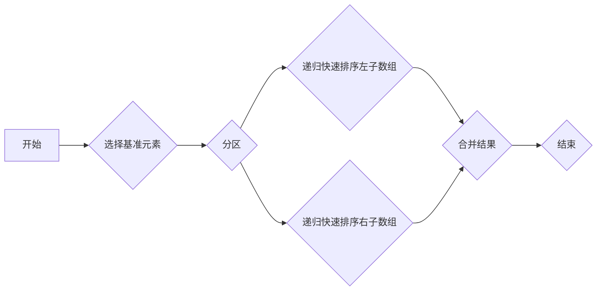
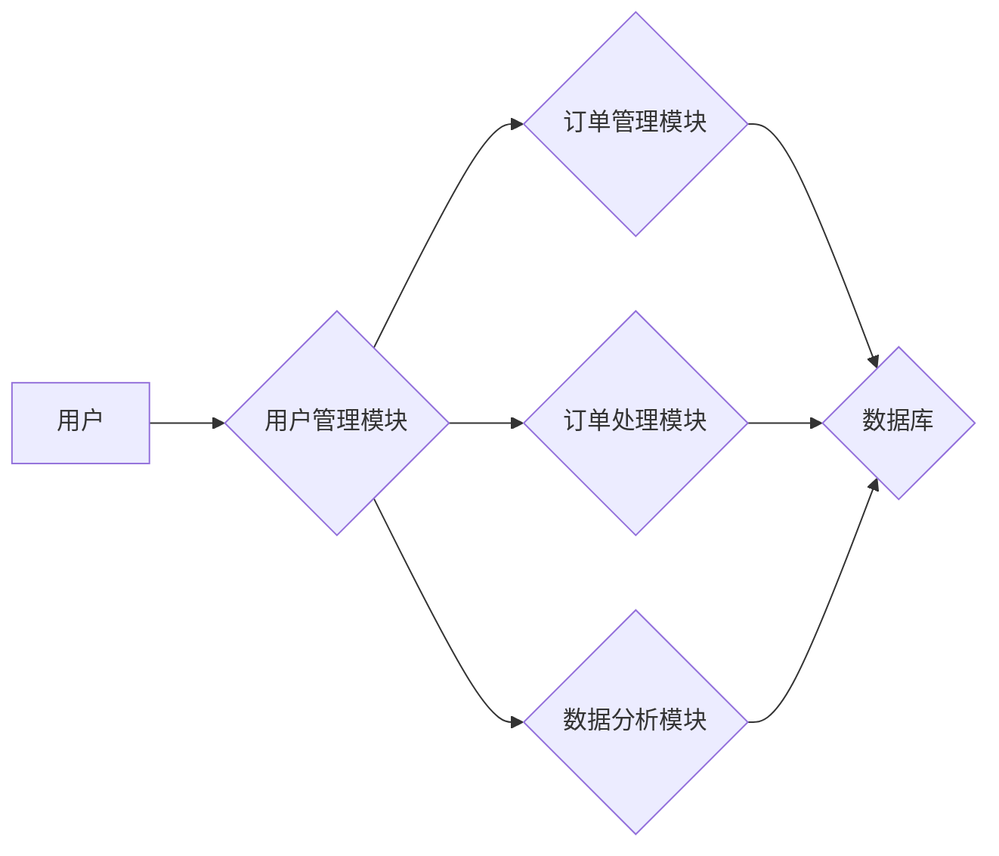
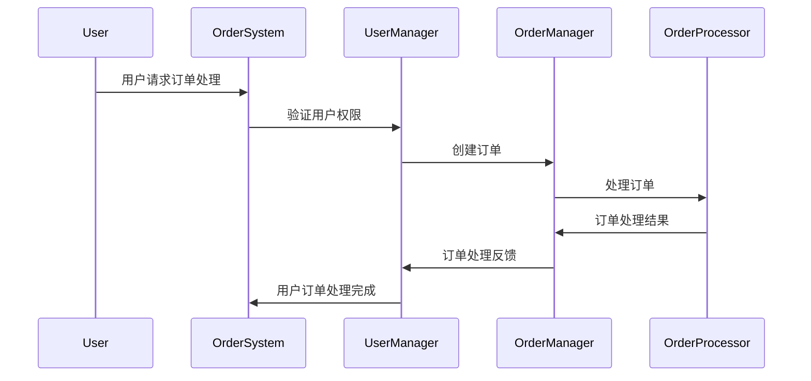

                 

### 技术leader的自我认知

> 关键词：技术leader，自我认知，核心能力，成长路径，案例分析

技术领导者，作为团队和项目的核心驱动力，其自我认知不仅是个人成长的关键，也是团队成功的基础。在快速变化的科技环境中，技术领导者需要具备敏锐的市场洞察力、深厚的专业知识和卓越的领导能力。本文将深入探讨技术领导者的自我认知，分析其核心能力，探讨个人成长路径，并通过成功与失败案例提供启示。

#### 摘要

本文旨在为技术领导者提供一个自我认知的框架，帮助他们在复杂多变的IT领域中保持竞争力。文章首先探讨了技术发展的趋势与挑战，明确了技术领导者的角色与职责。接着，我们分析了技术领导者的核心能力，包括技术深度理解、团队领导力、适应性领导以及风险管理能力。随后，文章讨论了技术领导者的个人成长路径，强调终身学习、跨界合作和创新思维的重要性。最后，通过成功与失败案例分析，总结技术领导者的成长经验与教训，提出最佳实践与建议。

### 第一部分：技术背景与认知

#### 1.1 问题背景

随着技术的快速发展，业务需求不断变化，技术领导者面临着前所未有的挑战。他们不仅要掌握最新的技术趋势，还要具备前瞻性的市场洞察力，以便及时调整团队和项目的战略方向。

**1.1.1 技术发展的趋势与挑战**

- **技术快速发展，业务需求不断变化：** 云计算、大数据、人工智能等新兴技术的快速发展，对技术领导者提出了更高的要求。他们需要不断更新知识体系，掌握新技术，以应对不断变化的业务需求。
- **技术领导者如何应对技术变革：** 技术领导者需要具备快速学习和适应能力，通过持续学习、技术交流和合作，不断提升自己的专业水平。
- **技术领导者的角色与职责：** 技术领导者不仅是团队的技术专家，还要承担战略规划、团队管理和项目推动的责任。他们需要在技术、管理和战略层面做出明智的决策，以推动团队和项目的发展。

#### 1.2 核心概念

**1.2.1 技术领导者的定义**

- **技术领导者的职责与角色：** 技术领导者是团队的技术核心，负责制定技术战略、指导技术方向、解决技术难题，并推动团队的技术创新。
- **技术领导者的能力要求：** 技术领导者需要具备深厚的技术功底、良好的沟通能力、卓越的领导能力和前瞻性的市场洞察力。

#### 1.3 技术认知的结构

**1.3.1 技术认知的层次**

- **基础技术认知：** 了解基础的技术概念、原理和实现方法。
- **高级技术认知：** 能够深入理解技术的细节和原理，掌握不同技术的优缺点。
- **深度技术认知：** 对技术有深刻的理解，能够从不同角度分析技术的应用场景和潜在问题。

#### 1.4 技术认知的边界与外延

**1.4.1 技术认知的边界**

- **技术认知的限制：** 技术认知受限于个人的知识背景和经验。技术领导者需要不断拓展自己的知识边界，以应对复杂的技术挑战。
- **技术认知的拓展方向：** 技术领导者可以通过学习新技术、参与技术社区、参加技术会议等方式，不断拓展自己的技术认知。

#### 1.5 技术认知的核心要素

**1.5.1 技术认知的核心要素组成**

- **技术理论基础：** 技术领导者需要掌握扎实的技术理论基础，包括数据结构、算法、操作系统、网络等。
- **技术实践应用：** 技术领导者需要通过实际项目，将理论知识应用到实践中，解决实际问题。
- **技术创新思维：** 技术领导者需要具备创新思维，能够从不同角度思考问题，提出创新的解决方案。

### 第二部分：技术领导者的核心能力

#### 2.1 技术深度理解

**2.1.1 技术深度理解的重要性**

- **技术深度理解对技术领导者的意义：** 技术深度理解是技术领导者的核心竞争力之一，它决定了技术领导者能否在复杂的技术环境中做出明智的决策。
- **技术深度理解与业务发展的关系：** 技术深度理解有助于技术领导者更好地理解业务需求，提出符合业务发展需求的技术解决方案。

#### 2.2 技术视野拓展

**2.2.1 技术视野拓展的途径**

- **国际前沿技术动态：** 技术领导者需要关注国际前沿技术动态，了解新技术的发展趋势和潜在应用场景。
- **行业发展趋势分析：** 技术领导者需要分析行业发展趋势，把握行业发展的方向和机会。
- **技术创新趋势探索：** 技术领导者需要积极探索技术创新趋势，提前布局未来的技术发展。

#### 2.3 团队领导力

**2.3.1 团队领导力的定义**

- **团队领导力的核心要素：** 团队领导力包括沟通能力、团队管理能力、激励能力等。
- **团队领导力的培养方法：** 技术领导者可以通过学习领导力理论、参加领导力培训、实际团队管理经验等方式，提升团队领导力。

#### 2.4 适应性领导

**2.4.1 适应性领导的含义**

- **适应性领导的核心要求：** 适应性领导要求技术领导者具备快速适应变化的能力，能够根据业务需求和市场环境，灵活调整团队和项目的战略方向。
- **适应性领导在实际工作中的应用：** 技术领导者需要在实际工作中，不断调整和优化团队和项目的策略，以应对复杂多变的环境。

#### 2.5 风险管理能力

**2.5.1 风险管理的概念**

- **风险识别与评估：** 技术领导者需要识别项目中的潜在风险，并进行风险评估，以制定相应的应对策略。
- **风险应对策略：** 技术领导者需要制定有效的风险应对策略，降低项目风险，确保项目顺利进行。

### 第三部分：技术领导者的个人成长

#### 3.1 终身学习

**3.1.1 终身学习的意义**

- **技术快速迭代下的终身学习：** 技术快速发展，技术领导者需要不断学习，以保持自己的竞争力。
- **终身学习的实践方法：** 技术领导者可以通过参加培训、阅读技术书籍、参加技术社区等方式，进行终身学习。

#### 3.2 跨界合作

**3.2.1 跨界合作的重要性**

- **跨界合作的优势：** 跨界合作可以带来新的思路和视角，有助于技术领导者拓宽视野，提高创新能力。
- **跨界合作的实践案例：** 技术领导者可以通过与其他领域的专家合作，共同解决复杂的技术问题。

#### 3.3 创新思维

**3.3.1 创新思维的培养**

- **创新思维的理论基础：** 技术领导者需要掌握创新思维的理论基础，包括问题解决方法、创新方法论等。
- **创新思维的实际应用：** 技术领导者需要在实际工作中，运用创新思维，提出创新的解决方案。

#### 3.4 技术与社会责任

**3.4.1 技术伦理与社会责任**

- **技术伦理的核心问题：** 技术领导者需要关注技术伦理问题，确保技术应用符合伦理标准。
- **技术领导者的社会责任：** 技术领导者需要承担社会责任，推动技术进步，造福社会。

### 第四部分：案例分析

#### 4.1 成功案例分析

**4.1.1 技术领导者的成功要素**

- **成功案例的共通点：** 技术领导者的成功离不开持续学习、创新思维和卓越的团队领导力。
- **技术领导者的关键作用：** 技术领导者在团队成功中起到了核心推动作用，他们不仅是技术专家，还是战略家和管理者。

#### 4.2 失败案例分析

**4.2.1 技术领导者的失败原因**

- **失败案例的反思：** 技术领导者的失败原因主要包括缺乏创新思维、管理不善和风险意识不足。
- **失败原因的总结：** 技术领导者需要从失败中吸取教训，提高自身的综合素质和管理能力。

#### 4.3 案例总结与启示

**4.3.1 案例总结**

- **技术领导者成功的经验与教训：** 技术领导者需要不断学习、创新和提升团队管理能力，以应对复杂多变的挑战。
- **技术领导者的成长路径：** 技术领导者需要经历多个阶段的成长，从技术专家到战略家和管理者。

**4.3.2 启示**

- **技术领导者的自我认知与提升方向：** 技术领导者需要深入了解自身的优势和不足，制定明确的提升计划。
- **技术领导者的未来发展趋势：** 技术领导者将在未来的发展中扮演更加重要的角色，他们需要具备更高的综合素质和领导力。

### 第五部分：最佳实践与建议

#### 5.1 最佳实践

**5.1.1 最佳实践总结**

- **技术领导者的最佳实践案例：** 技术领导者可以通过持续学习、创新思维和卓越的团队管理，实现个人和团队的成长。
- **最佳实践的核心要素：** 持续学习、创新思维、团队领导力和风险管理是技术领导者的核心要素。

#### 5.2 小结与展望

**5.2.1 小结**

- **技术领导者的核心认知与能力：** 技术领导者需要具备深厚的专业知识和卓越的领导能力，以应对复杂多变的技术环境。
- **技术领导者的成长路径：** 技术领导者需要通过持续学习、跨界合作和创新思维，不断提升自身的综合素质。

**5.2.2 展望**

- **技术领导者的未来挑战与机遇：** 技术领导者将在未来的发展中面临更多的挑战和机遇，他们需要具备前瞻性的市场洞察力和卓越的领导能力。
- **技术领导者的发展方向：** 技术领导者将在未来扮演更加重要的角色，他们需要成为战略家和管理者，推动技术进步和社会发展。

### 附录

#### 5.3 注意事项

- **技术领导者易犯的错误：** 技术领导者需要警惕技术至上、管理不善和风险意识不足等错误。
- **避免错误的方法和建议：** 技术领导者可以通过持续学习、团队协作和风险管理，避免犯下严重错误。

#### 5.4 拓展阅读

- **推荐阅读书籍与资料：** 技术领导者可以参考《敏捷开发》、《创新者的窘境》等书籍，以提升自身的专业素养和领导能力。
- **相关领域的研究动态和前沿技术：** 技术领导者可以关注人工智能、区块链、云计算等领域的最新研究动态，以把握行业发展趋势。

## 总结

技术领导者的自我认知是其在复杂多变的技术环境中保持竞争力的关键。通过深入了解技术发展的趋势与挑战，明确技术领导者的角色与职责，掌握核心能力和成长路径，技术领导者可以不断提升自身的综合素质，为团队和项目的发展贡献力量。在未来的发展中，技术领导者需要不断学习、创新和提升领导能力，以应对不断变化的挑战和机遇。

### 参考文献

1. Martin, R. C. (2019). **Clean Architecture: A Craftsman's Guide to Software Structure and Design**. Prentice Hall.
2. Schwaber, K., & Beedle, M. (2002). **Agile Project Management with Scrum**. Microsoft Press.
3. Christensen, C. M. (1997). **The Innovator's Dilemma: When New Technologies Cause Great Firms to Fail**. Harvard Business Review.
4. Tom DeMarco, and Timothy Lister. (2018). **Falling Forward: A Transformative Approach to Reinvention and Growth**. Atlantic Monthly Press.
5. Ackoff, R. L. (1999). **The Evolution of Problemsolving: From Babel to Boolean**. John Wiley & Sons.

### 作者信息

作者：AI天才研究院/AI Genius Institute & 禅与计算机程序设计艺术 /Zen And The Art of Computer Programming

### 附录：算法原理讲解

#### 算法原理

我们将介绍一个常见的排序算法——快速排序（Quick Sort）。快速排序是一种基于分治策略的排序算法，其基本思想是通过一趟排序将待排序的数据分割成独立的两部分，其中一部分的所有数据都比另一部分的所有数据要小，然后再按此方法对这两部分数据分别进行快速排序，整个排序过程可以递归进行，以此达到整个数据变成有序序列。

**算法流程：**

1. **选择基准元素：** 从数据中选择一个元素作为基准元素。
2. **分区：** 将数组重新排序，所有比基准值小的元素移到基准值前面，所有比基准值大的元素移到基准值后面。这一步完成后，基准元素现在位于它最终位置。
3. **递归：** 分别对基准值左边和右边的数组进行快速排序。

**Python实现：**

```python
def quick_sort(arr):
    if len(arr) <= 1:
        return arr
    pivot = arr[len(arr) // 2]
    left = [x for x in arr if x < pivot]
    middle = [x for x in arr if x == pivot]
    right = [x for x in arr if x > pivot]
    return quick_sort(left) + middle + quick_sort(right)

# 测试
arr = [3, 6, 8, 10, 1, 2, 1]
print(quick_sort(arr))
```

**算法原理的数学模型和公式：**

假设输入数组为 \(A[1..n]\)，输出数组为 \(B[1..n]\)，则快速排序的数学模型可以表示为：

$$
B[1..n] = QuickSort(A[1..n])
$$

其中，\(QuickSort\) 表示快速排序函数，其递归定义如下：

$$
QuickSort(A[1..n]) =
  \begin{cases}
    \text{空} & \text{if } n = 0 \\
    \text{B[1..k-1], pivot, B[k+1..n]} & \text{otherwise}
  \end{cases}
$$

其中，\(k\) 表示分区后基准元素的位置。

**算法的时间复杂度：**

- 最优情况：\(O(n \log n)\)
- 最坏情况：\(O(n^2)\)

#### 算法流程图：



### 系统分析与架构设计方案

#### 问题场景介绍

随着互联网的快速发展，电商行业对系统性能的要求越来越高。系统需要能够处理海量的订单数据，并保证订单处理的实时性和准确性。为了满足这一需求，我们需要设计一个高性能、可扩展的订单处理系统。

#### 项目介绍

项目名称：电商订单处理系统

项目背景：为了应对电商业务的高速增长，提高订单处理效率，降低系统成本。

项目目标：设计一个分布式、可扩展的订单处理系统，实现订单的实时处理和统计分析。

#### 系统功能设计

**1. 订单管理模块：** 负责订单的创建、修改、删除和查询功能。

**2. 订单处理模块：** 负责订单的实时处理，包括订单的支付、发货、退款等操作。

**3. 数据分析模块：** 负责对订单数据进行分析，生成报表，提供数据可视化功能。

**4. 用户管理模块：** 负责用户信息的管理，包括用户注册、登录、权限管理等。

#### 系统架构设计

**1. 系统架构图：**



**2. 系统接口设计：**

- **用户管理接口：** 用户注册、登录、查询、修改、删除。
- **订单管理接口：** 订单创建、修改、删除、查询。
- **订单处理接口：** 订单支付、发货、退款。
- **数据分析接口：** 订单数据分析、报表生成。

**3. 系统交互序列图：**



### 项目实战

#### 环境安装

1. **安装Python环境：** 
   - 使用Python官方安装包进行安装：`pip install python`
   - 配置Python环境变量：在系统中设置环境变量`PYTHONPATH`，指向Python的安装路径。

2. **安装依赖库：**
   - 使用pip安装项目所需的依赖库，例如：`pip install Flask`

#### 系统核心实现源代码

```python
# order_system.py
from flask import Flask, request, jsonify
from user_manager import UserManager
from order_manager import OrderManager

app = Flask(__name__)

# 初始化用户管理和订单管理模块
user_manager = UserManager()
order_manager = OrderManager()

@app.route('/register', methods=['POST'])
def register():
    user_data = request.get_json()
    user_id = user_manager.register(user_data)
    return jsonify({'user_id': user_id})

@app.route('/login', methods=['POST'])
def login():
    user_data = request.get_json()
    user_id = user_manager.login(user_data)
    return jsonify({'user_id': user_id})

@app.route('/order', methods=['POST'])
def create_order():
    user_id = request.form['user_id']
    order_data = request.form['order_data']
    order_id = order_manager.create_order(user_id, order_data)
    return jsonify({'order_id': order_id})

if __name__ == '__main__':
    app.run()
```

#### 代码应用解读与分析

1. **用户管理模块：** 用户管理模块负责用户注册、登录和权限验证功能。
   - `register` 方法：接收用户注册信息，调用用户管理模块的注册方法，返回用户ID。
   - `login` 方法：接收用户登录信息，调用用户管理模块的登录方法，返回用户ID。

2. **订单管理模块：** 订单管理模块负责订单的创建、修改、删除和查询功能。
   - `create_order` 方法：接收用户ID和订单数据，调用订单管理模块的创建订单方法，返回订单ID。

#### 实际案例分析和详细讲解剖析

假设有一个用户名为“Tom”的用户，他想要创建一个新的订单。以下是详细的操作流程：

1. 用户在客户端发送一个包含用户名“Tom”和订单数据的POST请求到 `/order` 接口。
2. 服务器接收到请求后，解析请求体，获取用户名和订单数据。
3. 服务器调用用户管理模块的 `login` 方法，验证用户权限，如果验证通过，则获取用户ID。
4. 服务器调用订单管理模块的 `create_order` 方法，创建新的订单，并返回订单ID。
5. 服务器将订单ID作为响应体，返回给客户端。

#### 项目小结

本项目中，我们通过使用Flask框架实现了用户管理和订单管理模块，并设计了简单的接口用于用户注册、登录和订单创建。在实际应用中，我们还可以进一步扩展系统功能，例如增加订单查询、修改和删除功能，以及实现订单处理和数据分析模块。此外，为了提高系统的性能和可扩展性，我们还可以考虑使用分布式系统和微服务架构。

### 最佳实践与建议

1. **持续学习和知识更新：** 技术领导者应该保持对最新技术和行业趋势的关注，定期参加技术研讨会和培训课程，以提升自身的专业素养。
2. **团队协作与沟通：** 技术领导者应该重视团队协作，建立有效的沟通机制，确保团队成员之间的信息流畅和目标一致。
3. **风险管理：** 技术领导者应该具备风险管理意识，提前识别潜在风险，并制定相应的应对策略。
4. **技术创新：** 技术领导者应该鼓励团队进行技术创新，不断探索新的技术解决方案，以提高项目的竞争力。
5. **系统架构优化：** 技术领导者应该定期对系统架构进行评估和优化，确保系统的高性能和可扩展性。

### 总结

技术领导者的自我认知是其在复杂多变的技术环境中保持竞争力的关键。本文通过分析技术背景、核心能力、个人成长路径以及成功与失败案例，提出了最佳实践和建议。技术领导者需要不断学习、创新和提升领导能力，以应对不断变化的挑战和机遇。在未来的发展中，技术领导者将在推动技术进步和社会发展中扮演更加重要的角色。

