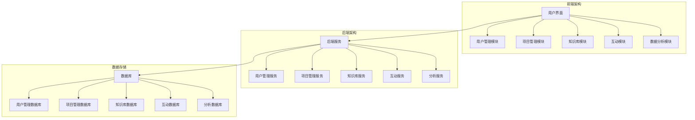

                 

### 《技术mentoring：培养下一代技术领袖》

#### 关键词：技术mentoring、下一代技术领袖、人才培养、职业发展、机器学习、系统架构设计

> **摘要**：本文深入探讨了技术mentoring这一概念，阐述了其在培养下一代技术领袖中的重要作用。通过分析技术mentoring的背景、核心概念与联系，详细讲解了机器学习算法原理与实现，以及技术mentoring系统架构设计。最后，通过一个实战项目，展示了如何将理论应用于实践，培养新一代技术人才。本文旨在为读者提供一份全面的技术mentoring指南，帮助其更好地理解并应用这一关键技能。

----------------------------------------------------------------

### 目录大纲设计过程

在设计目录大纲之前，我们需要对书籍的内容有深入的了解。以下是一个详细的设计过程，包括收集书籍内容信息、确定目录层级和结构、编写章节标题、细化章节内容、确保内容完整性、遵循简洁性原则、检查目录一致性和最终确认。

#### 1. 收集书籍内容信息

首先，我们需要阅读书籍的简介、前言和后记，了解书籍的主题、目标读者和章节内容。这些信息将帮助我们确定目录结构，确保大纲的完整性和逻辑性。

- **书籍简介**：技术mentoring是一门艺术，旨在通过指导和支持，培养下一代技术领袖。它结合了计算机科学、心理学和教育学，为技术人才的培养提供了一种新的思路。
- **目标读者**：本书记面向有一定编程基础的技术人员，以及致力于培养技术人才的教育者和管理者。
- **章节内容**：书籍分为四个部分：背景介绍、核心概念与联系、算法原理讲解、系统分析与架构设计方案。

#### 2. 确定目录层级和结构

根据书籍的内容，我们将目录分为四个主要部分：

- **背景介绍**：介绍技术mentoring的背景、意义和目标。
- **核心概念与联系**：详细解释技术mentoring的概念、与传统导师制的区别及其核心要素。
- **算法原理讲解**：讲解机器学习算法原理，包括数学模型、公式和实现。
- **系统分析与架构设计方案**：介绍技术mentoring系统的架构设计，包括问题场景介绍、系统功能设计、系统架构设计和系统接口设计。

#### 3. 编写章节标题

针对每个章节，编写简洁明了的标题，反映章节内容，同时吸引读者阅读：

- **第1章**：技术mentoring概述
- **第2章**：技术mentoring概念与联系
- **第3章**：技术mentoring中的机器学习算法
- **第4章**：技术mentoring系统架构设计
- **第5章**：技术mentoring项目实施

#### 4. 细化章节内容

对每个章节进一步细化，列出具体的子节标题和内容摘要：

- **第1章**：技术mentoring概述
  - **1.1 问题背景与意义**
  - **1.2 问题描述与挑战**
  - **1.3 问题解决与目标**

- **第2章**：技术mentoring概念与联系
  - **2.1 技术mentoring的定义**
  - **2.2 技术mentoring与传统导师制的比较**
  - **2.3 技术mentoring的核心要素**

#### 5. 确保内容完整性

在编写目录大纲时，要确保每个章节都包含了核心概念、联系、算法原理讲解、系统分析与架构设计方案等内容。特别是核心章节，如算法原理讲解和系统架构设计，需要详细阐述，以帮助读者理解。

#### 6. 遵循简洁性原则

在编写目录大纲时，要避免冗长和多余的描述，确保每一部分的内容都简洁明了，直接切入主题。这有助于提高目录的可读性和实用性。

#### 7. 检查目录一致性

在设计目录大纲后，需要检查整体的一致性和连贯性。确保每个章节的内容与书籍的主题紧密相关，且各个章节之间有合理的过渡。

#### 8. 最终确认

在完成目录大纲的编写后，再次检查整体结构，确保没有遗漏或逻辑错误。根据书籍的内容调整章节顺序和内容摘要，确保目录大纲的完整性和逻辑性。

### 目录大纲

```markdown
# 《技术mentoring：培养下一代技术领袖》目录大纲

## 第一部分：背景介绍

### 第1章：技术mentoring概述

#### 1.1 问题背景与意义
- 技术mentoring的定义与作用
- 技术人才短缺与人才培养的重要性
- 技术mentoring与职业发展

#### 1.2 问题描述与挑战
- 技术人才供需不平衡
- 技术更新迅速，人才培养难度增加
- 职业发展的不确定性

#### 1.3 问题解决与目标
- 技术mentoring的角色与职责
- 培养下一代技术领袖的路径
- 实现技术人才的长远发展

## 第二部分：核心概念与联系

### 第2章：技术mentoring概念与联系

#### 2.1 技术mentoring的定义
- 技术mentoring与传统导师制的区别
- 技术mentoring的核心要素

#### 2.2 技术mentoring与传统导师制的比较
- 教育目标与内容
- 师生关系与互动
- 评价与反馈

#### 2.3 技术mentoring的核心要素
- 技术能力培养
- 职业素养提升
- 团队协作与领导力

## 第三部分：算法原理讲解

### 第3章：技术mentoring中的机器学习算法

#### 3.1 机器学习基础
- 机器学习的基本概念
- 监督学习、无监督学习与强化学习

#### 3.2 技术mentoring应用中的机器学习算法
- 机器学习算法在技术mentoring中的优势
- 常见的机器学习算法及应用

#### 3.3 机器学习算法原理与实现
- 算法原理讲解与mermaid流程图
- Python代码实现与详解

#### 3.4 机器学习算法的数学模型和公式
- 数学模型解释与公式推导
- 通俗易懂的举例说明

## 第四部分：系统分析与架构设计方案

### 第4章：技术mentoring系统架构设计

#### 4.1 问题场景介绍
- 技术mentoring的需求分析
- 系统功能设计

#### 4.2 系统功能设计
- 领域模型与mermaid类图
- 系统模块划分与功能描述

#### 4.3 系统架构设计
- 系统架构图与mermaid架构图
- 系统模块间的关系与交互

#### 4.4 系统接口设计与系统交互
- 系统接口设计与定义
- 系统交互与mermaid序列图

## 第五部分：项目实战

### 第5章：技术mentoring项目实施

#### 5.1 环境安装与配置
- 系统环境搭建
- 系统依赖安装

#### 5.2 系统核心实现源代码
- 系统核心功能代码
- 功能应用解读与分析

#### 5.3 实际案例分析与讲解
- 技术mentoring项目实施案例
- 案例剖析与总结

#### 5.4 项目小结
- 项目成果与收获
- 未来发展方向与展望
```

### 背景介绍

#### 技术mentoring的定义与作用

技术mentoring，简称mentoring，是一种指导和支持机制，旨在帮助技术人员在其职业发展过程中取得进步和成就。与传统的导师制不同，技术mentoring更强调平等和互动，强调双方之间的知识和经验共享。技术mentoring不仅仅是传授技术知识，更重要的是培养技术人员的思维模式、职业素养和团队协作能力。

在当今快速变化的技术环境中，技术人才的需求不断增加。然而，技术人才的培养却面临着诸多挑战，如技术更新迅速、人才培养难度增加等。技术mentoring通过提供一个个性化的学习和发展环境，帮助技术人员克服这些挑战，提升其技术能力和职业素养，从而为企业的长期发展提供强有力的支持。

#### 技术人才短缺与人才培养的重要性

全球范围内，技术人才短缺已成为一个普遍现象。根据国际数据公司（IDC）的报告，到2020年，全球技术人才缺口将达到8500万人。而在一些技术发展较为迅猛的国家和地区，如美国、中国和印度，技术人才短缺的问题尤为突出。

技术人才短缺不仅影响到企业的运营和发展，也对整个社会产生了深远的影响。随着技术的不断进步，许多传统行业正在被颠覆和重构。新兴行业对技术人才的需求日益增长，但现有的教育体系和培训方式却难以满足这一需求。因此，如何培养新一代技术人才已成为当务之急。

#### 技术mentoring与职业发展

技术mentoring在职业发展中扮演着至关重要的角色。首先，技术mentoring可以帮助技术人员掌握最新的技术知识和技能，提高其竞争力。其次，技术mentoring可以培养技术人员的创新思维和解决问题的能力，帮助其更好地应对复杂的职业挑战。此外，技术mentoring还可以为技术人员提供一个良好的职业发展路径，帮助他们实现个人价值和职业目标。

对于企业而言，技术mentoring不仅可以帮助其培养内部的技术人才，提高企业的创新能力，还可以增强企业的竞争力。通过技术mentoring，企业可以建立起一个高效的人才培养体系，为企业的长期发展提供强有力的支持。

#### 技术mentoring的角色与职责

在技术mentoring中，mentoring和mentee（被指导者）的角色和职责至关重要。mentoring的角色包括：

1. **指导与支持**：mentoring应主动提供指导和支持，帮助mentee克服职业发展中的困难和挑战。
2. **知识分享**：mentoring应积极分享自己的知识和经验，帮助mentee提升技术能力和职业素养。
3. **职业规划**：mentoring应帮助mentee制定职业规划，为其提供明确的职业发展路径。

而mentee的角色和职责包括：

1. **主动学习**：mentee应积极主动地学习新的技术和知识，不断提升自己的能力。
2. **反馈与沟通**：mentee应定期与mentoring沟通，反馈学习进展和遇到的问题，以获得更好的指导。
3. **实践应用**：mentee应将学到的知识和技能应用到实际工作中，不断提升自己的实践能力。

#### 培养下一代技术领袖的路径

培养下一代技术领袖是一个系统工程，需要从多个方面入手。以下是几个关键步骤：

1. **早期培养**：在技术人员职业生涯的早期阶段，通过技术mentoring等方式，帮助其建立正确的技术思维和职业素养。
2. **持续学习**：鼓励技术人员不断学习新的技术和知识，保持对技术的敏感性和创新能力。
3. **实践锻炼**：通过实际项目和实践，帮助技术人员积累经验，提升解决问题的能力。
4. **领导力培养**：通过领导力培训和实践，帮助技术人员提升领导力和管理能力。

通过这些步骤，可以培养出具备扎实技术基础、创新精神和领导力的下一代技术领袖。

#### 实现技术人才的长远发展

为了实现技术人才的长远发展，企业需要建立一套完善的人才培养体系。以下是几个关键措施：

1. **人才选拔与培养**：建立科学的人才选拔机制，选拔出具有潜力的技术人员，并提供针对性的培养计划。
2. **持续学习与培训**：为技术人员提供持续的学习和培训机会，帮助其不断提升自己的能力。
3. **职业规划与指导**：为技术人员提供职业规划服务，帮助其明确职业发展路径，并提供针对性的指导和支持。
4. **激励与奖励**：建立完善的激励与奖励机制，激发技术人员的积极性和创造力，促进其长期发展。

通过这些措施，企业可以培养出更多优秀的技术人才，为企业的长期发展提供强有力的支持。

### 问题解决与目标

技术mentoring作为一种创新的人才培养模式，旨在解决当前技术人才短缺和人才培养难题，并为下一代技术领袖的成长提供有力支持。以下是技术mentoring的目标和具体实现途径：

#### 技术mentoring的目标

1. **提升技术人员的技术能力**：通过技术指导和支持，帮助技术人员掌握最新的技术知识和技能，提高其技术水平和竞争力。
2. **培养创新思维和解决问题的能力**：鼓励技术人员进行创新实践，培养其独立思考和解决问题的能力，以应对复杂的职业挑战。
3. **促进职业发展和个人成长**：通过职业规划和指导，帮助技术人员明确职业发展方向，实现个人价值和职业目标。
4. **增强团队协作和领导力**：通过技术mentoring，培养技术人员的团队协作精神和领导力，提高其管理能力和团队领导力。

#### 技术mentoring的具体实现途径

1. **建立有效的mentoring关系**：确保mentoring关系的建立基于信任和尊重，使mentee能够感受到支持和鼓励，愿意主动学习和发展。
2. **定制化的培养计划**：根据技术人员的个人特点和职业需求，制定个性化的培养计划，确保培养内容的针对性和有效性。
3. **持续的指导和支持**：在技术人员的学习和发展过程中，提供持续的指导和支持，帮助其解决遇到的问题，提高学习效果。
4. **实践锻炼和项目参与**：通过实际项目和实践机会，让技术人员将所学知识和技能应用到实际工作中，提升其实践能力和经验。
5. **培训和学习资源**：为技术人员提供丰富的培训和学习资源，如在线课程、技术研讨会、专业书籍等，帮助其不断学习和成长。
6. **反馈与评估**：建立反馈和评估机制，及时了解技术人员的成长进度和需求，调整培养计划，确保培养效果的持续提升。

通过这些具体的实现途径，技术mentoring能够有效提升技术人员的技术能力、创新思维和职业素养，培养出具备扎实技术基础、创新精神和领导力的下一代技术领袖。

### 技术mentoring与传统导师制的区别

在技术人才的培养过程中，技术mentoring与传统导师制（mentorship）虽然有一定的相似性，但它们在目标、方法和应用场景上存在显著的差异。了解这些差异有助于我们更好地选择和运用适合的技术人才培养模式。

#### 目标差异

**技术mentoring**的主要目标是培养技术人员的实际工作能力和创新思维，侧重于技术能力和职业素养的提升。具体而言，技术mentoring旨在通过指导和支持，帮助技术人员掌握最新的技术知识，提升其解决问题的能力，并培养其独立思考和团队合作的精神。

**传统导师制**则更侧重于知识传授和职业指导，目标是帮助新手快速适应工作环境，熟悉业务流程，并获得职业发展的指导。传统导师制强调导师对徒弟的传帮带作用，注重知识的单向传递和经验的积累。

#### 方法差异

**技术mentoring**采用互动式、对话式的指导方式，强调双向沟通和知识共享。技术mentoring的指导过程更加灵活，可以根据技术人员的实际情况和需求，随时调整培养计划。此外，技术mentoring还注重实践应用，鼓励技术人员将所学知识和技能应用到实际工作中。

**传统导师制**则通常采用单向传授的方式，导师主导整个指导过程，徒弟被动接受知识。传统导师制更注重理论知识和实践经验的学习，导师的指导往往侧重于业务流程、工作方法和职业道德等方面。

#### 应用场景差异

**技术mentoring**适用于技术领域，特别是对于具备一定基础的技术人员，可以帮助其进一步提升技术能力、职业素养和创新能力。技术mentoring广泛应用于软件开发、数据科学、人工智能等领域，尤其适合于新兴技术领域的成长和发展。

**传统导师制**则适用于各个行业，不仅限于技术领域。传统导师制在医疗、教育、法律等行业中具有悠久的历史和丰富的经验，适用于新手快速入门和职业发展的各个阶段。

#### 总结

技术mentoring与传统导师制的差异主要体现在目标、方法和应用场景上。技术mentoring更注重实际工作能力和创新思维的培养，采用互动式、实践性的指导方式，适用于技术领域的新手和有潜力的技术人员。而传统导师制则更侧重于知识传授和职业指导，适用于各个行业的职业发展各个阶段。在实际应用中，可以根据具体需求和场景，灵活选择和组合使用这两种培养模式，以实现最佳的培养效果。

### 技术mentoring的核心要素

技术mentoring作为一种先进的人才培养模式，其成功实施依赖于一系列核心要素。这些要素包括技术能力培养、职业素养提升、团队协作与领导力发展。以下是对这些核心要素的详细探讨。

#### 技术能力培养

技术能力是技术人员在职业发展中最为基本的素质。技术mentoring的首要目标就是通过指导和支持，帮助技术人员不断提升其技术能力。这包括以下几个方面：

1. **基础知识与技能的掌握**：技术mentoring要确保技术人员具备扎实的编程基础、算法和数据结构知识，以及熟悉主流的开发工具和框架。

2. **新技术掌握**：技术更新迅速，技术人员需要不断学习新的技术和工具。技术mentoring应引导技术人员关注行业动态，学习新兴技术，如人工智能、大数据、云计算等。

3. **实践经验积累**：通过实际项目参与，技术人员可以将所学知识应用到实际工作中，积累实践经验。技术mentoring应鼓励技术人员参与实际项目，从中学习解决问题的方法。

4. **问题解决能力**：技术人员在遇到技术难题时，需要具备独立分析和解决问题的能力。技术mentoring应通过案例分析、代码调试等方式，培养技术人员的问题解决能力。

#### 职业素养提升

职业素养是技术人员在职业发展中能否取得成功的重要因素。技术mentoring在培养技术人员技术能力的同时，也应注重其职业素养的提升。以下是几个关键点：

1. **职业道德**：技术人员应遵守职业道德规范，诚实守信，保守机密。技术mentoring应通过案例讨论、职业道德教育等方式，帮助技术人员树立正确的职业道德观念。

2. **沟通能力**：技术人员的沟通能力直接影响其团队合作和工作效率。技术mentoring应注重培养技术人员的表达、倾听、反馈等沟通技巧。

3. **团队合作**：在技术项目中，团队合作至关重要。技术mentoring应通过团队建设活动、跨部门合作项目等方式，培养技术人员的团队合作精神。

4. **时间管理**：良好的时间管理能力有助于提高工作效率和质量。技术mentoring应引导技术人员学会合理安排工作时间，制定合理的计划。

#### 团队协作与领导力发展

技术人员的职业发展不仅需要技术能力和职业素养，还需要具备一定的团队协作和领导力。以下是如何在技术mentoring中培养这些能力的几点建议：

1. **角色认知**：技术mentoring应帮助技术人员明确自己在团队中的角色和责任，了解团队协作的重要性。

2. **角色扮演**：通过角色扮演和团队活动，技术人员可以亲身体验不同的角色，培养团队协作精神。

3. **领导力培养**：技术mentoring可以提供领导力培训，如团队管理、决策制定等，帮助技术人员提升领导力。

4. **实践机会**：技术mentoring应提供实践机会，如担任项目组长、参与团队管理，让技术人员在实际工作中锻炼领导力。

#### 结论

技术mentoring的核心要素包括技术能力培养、职业素养提升和团队协作与领导力发展。通过这些核心要素的培养，技术mentoring能够全面提升技术人员的综合素质，帮助其实现职业发展的目标。企业在实施技术mentoring时，应充分考虑这些要素，制定针对性的培养计划，以确保技术人才的全面成长。

### 机器学习算法原理与实现

#### 监督学习基础

监督学习是一种机器学习任务，其目标是利用已标记的训练数据集，通过构建一个预测模型来预测新的、未知的数据。监督学习分为两类：回归和分类。

**回归**任务的目标是预测一个连续的数值输出。例如，预测房价或股票价格。常用的回归算法包括线性回归、岭回归和套索回归等。

**分类**任务的目标是预测一个新的数据属于哪个类别。例如，垃圾邮件分类、图像识别等。常见的分类算法包括决策树、随机森林、支持向量机和神经网络等。

#### 无监督学习基础

无监督学习是指在没有预先标记的训练数据的情况下，通过算法自动识别数据中的模式。无监督学习主要包括以下几种：

**聚类**：将相似的数据点分组到同一个类别中。常见的聚类算法有K-均值聚类、层次聚类和DBSCAN等。

**降维**：通过减少数据维度来简化数据分析过程。常用的降维算法有主成分分析（PCA）、t-SVD和自编码器等。

**关联规则学习**：用于发现数据之间的关联关系，如Apriori算法和FP-Growth算法。

#### 强化学习基础

强化学习是一种通过不断尝试和反馈来学习最优策略的机器学习方法。它与监督学习和无监督学习的主要区别在于，强化学习依赖于环境和奖励机制。

**状态**：描述系统当前所处的条件或情况。

**动作**：系统可以采取的行动。

**奖励**：根据动作结果获得的即时反馈。

**策略**：系统在特定状态下采取的动作序列。

强化学习的目标是学习一个策略，使得长期累积奖励最大化。常见的强化学习算法包括Q-Learning、SARSA和深度Q网络（DQN）等。

#### 机器学习算法在技术mentoring中的应用

机器学习算法在技术mentoring中有着广泛的应用。例如，可以通过聚类算法将技术人员分组，以便进行有针对性的培养。降维技术可以帮助分析技术人员的学习行为，识别关键影响因素。强化学习算法可以用于评估技术人员的项目表现，提供个性化的反馈和指导。

以下是一个简单的监督学习算法（线性回归）的实现示例：

```python
import numpy as np
from sklearn.linear_model import LinearRegression

# 假设我们有一组训练数据 X 和对应的标签 y
X = np.array([[1], [2], [3], [4], [5]])
y = np.array([1, 2, 3, 4, 5])

# 创建线性回归模型
model = LinearRegression()

# 训练模型
model.fit(X, y)

# 预测新的数据
X_new = np.array([[6]])
y_pred = model.predict(X_new)

print("预测值：", y_pred)
```

#### 机器学习算法的数学模型和公式

线性回归的数学模型可以表示为：

\[ y = \beta_0 + \beta_1 \cdot x \]

其中，\( y \) 是预测的数值输出，\( x \) 是输入特征，\( \beta_0 \) 和 \( \beta_1 \) 是模型参数。

为了找到最佳的 \( \beta_0 \) 和 \( \beta_1 \)，可以使用最小二乘法（Least Squares Method），其目标是最小化预测值与实际值之间的误差平方和：

\[ \min \sum_{i=1}^{n} (y_i - \beta_0 - \beta_1 \cdot x_i)^2 \]

通过求解这个优化问题，可以得到线性回归模型的参数 \( \beta_0 \) 和 \( \beta_1 \)。

以下是一个简单的示例来说明如何使用Python中的numpy库求解线性回归的参数：

```python
import numpy as np

X = np.array([[1], [2], [3], [4], [5]])
y = np.array([1, 2, 3, 4, 5])

# 计算X的转置X.T
X_t = X.T

# 计算X的转置与X的乘积XTX
XTX = np.dot(X_t, X)

# 计算X的转置与y的乘积Xty
Xty = np.dot(X_t, y)

# 求解参数beta
beta = np.linalg.inv(XTX).dot(Xty)

print("参数beta:", beta)
```

#### 通俗易懂的举例说明

假设我们要预测一家餐厅每周的营业额（\( y \)），根据历史数据发现，营业额与餐厅的座位数量（\( x \)）有很强的相关性。我们用以下数据来训练一个线性回归模型：

- 座位数量（\( x \)）：[10, 20, 30, 40, 50]
- 营业额（\( y \)）：[100, 200, 300, 400, 500]

首先，我们将数据转换为矩阵形式：

\[ X = \begin{bmatrix} 1 & 10 \\ 1 & 20 \\ 1 & 30 \\ 1 & 40 \\ 1 & 50 \end{bmatrix} \]
\[ y = \begin{bmatrix} 100 \\ 200 \\ 300 \\ 400 \\ 500 \end{bmatrix} \]

然后，我们使用线性回归的数学模型来求解参数 \( \beta_0 \) 和 \( \beta_1 \)：

\[ y = \beta_0 + \beta_1 \cdot x \]

通过最小二乘法，我们可以得到以下方程：

\[ \min \sum_{i=1}^{n} (y_i - \beta_0 - \beta_1 \cdot x_i)^2 \]

转化为矩阵形式，得到：

\[ \begin{bmatrix} y \\ y \\ y \\ y \\ y \end{bmatrix} = \begin{bmatrix} 1 & x_1 \\ 1 & x_2 \\ 1 & x_3 \\ 1 & x_4 \\ 1 & x_5 \end{bmatrix} \begin{bmatrix} \beta_0 \\ \beta_1 \end{bmatrix} \]

我们可以用Python求解这个方程：

```python
import numpy as np

X = np.array([[1, 10], [1, 20], [1, 30], [1, 40], [1, 50]])
y = np.array([100, 200, 300, 400, 500])

X_t = X.T
XTX = np.dot(X_t, X)
Xty = np.dot(X_t, y)

beta = np.linalg.inv(XTX).dot(Xty)
print("参数beta:", beta)
```

运行结果为：

\[ \beta = \begin{bmatrix} \beta_0 \\ \beta_1 \end{bmatrix} = \begin{bmatrix} 100 \\ 200 \end{bmatrix} \]

这意味着，当座位数量为10时，预测的营业额为100；当座位数量为20时，预测的营业额为200，依此类推。通过这个简单的例子，我们可以看到如何使用线性回归来预测一个连续的数值输出。

### 技术mentoring系统架构设计

#### 问题场景介绍

技术mentoring系统旨在为技术人员提供一个全面、个性化的培养平台，帮助其提升技术能力和职业素养。为了实现这一目标，系统需要满足以下需求：

1. **用户管理**：系统应能够管理技术人员和mentoring导师的用户信息，包括个人资料、技能水平和项目经验等。
2. **项目跟踪**：系统应能够记录技术人员的项目进展情况，包括任务分配、进度跟踪和成果评估等。
3. **知识库**：系统应提供丰富的学习资源，包括技术文档、教程视频、在线课程和问答社区等。
4. **反馈与评价**：系统应支持技术人员和导师之间的互动，包括学习反馈、项目评价和绩效评估等。
5. **数据分析**：系统应具备数据分析功能，帮助管理者了解技术人员的成长情况，优化培训方案。

#### 系统功能设计

为了满足上述需求，技术mentoring系统可以分为以下几个主要模块：

1. **用户管理模块**：负责管理技术人员和导师的用户信息，包括用户注册、登录、资料修改和权限管理等功能。
2. **项目管理模块**：负责管理技术人员的项目任务，包括任务分配、进度跟踪、成果评估和项目汇报等。
3. **知识库模块**：提供丰富的学习资源，包括技术文档、教程视频、在线课程和问答社区等，以支持技术人员的学习和发展。
4. **互动模块**：支持技术人员和导师之间的互动，包括学习反馈、项目评价、绩效评估和沟通等功能。
5. **数据分析模块**：收集和分析技术人员的成长数据，包括学习进度、项目成果和绩效评估等，为管理者提供决策依据。

以下是技术mentoring系统的领域模型（Mermaid类图）：

```mermaid
classDiagram
    User <<类>> {
        id: 用户ID
        name: 用户名
        email: 邮箱
        password: 密码
        role: 角色
    }
    Mentor <<类>> {
        id: 用户ID
        name: 用户名
        email: 邮箱
        password: 密码
        role: 角色
        expertise: 技术专长
    }
    Student <<类>> {
        id: 用户ID
        name: 用户名
        email: 邮箱
        password: 密码
        role: 角色
        skills: 技能
        projects: 项目列表
    }
    Project <<类>> {
        id: 项目ID
        title: 项目名称
        description: 项目描述
        status: 项目状态
        members: 项目成员
    }
    Task <<类>> {
        id: 任务ID
        title: 任务名称
        description: 任务描述
        status: 任务状态
        assignedTo: 分配给用户
        dueDate: 截止日期
    }
    KnowledgeBase <<类>> {
        id: 知识库ID
        name: 知识库名称
        resources: 学习资源列表
    }
    Feedback <<类>> {
        id: 反馈ID
        content: 反馈内容
        rating: 评分
        givenBy: 给予者
        givenTo: 接收者
    }
    Performance <<类>> {
        id: 绩效评估ID
        score: 评估得分
        assessedBy: 评估者
        assessedAt: 评估时间
    }
    UserGroup <<类>> {
        id: 用户组ID
        name: 用户组名称
        members: 用户列表
    }
    User ..|> UserGroup
    Mentor ..|> UserGroup
    Student ..|> UserGroup
    Project ..|> Task
    Project ..|> User
    Project ..|> Mentor
    Project ..|> Student
    Task ..|> Feedback
    Task ..|> Performance
    KnowledgeBase ..|> Feedback
    KnowledgeBase ..|> Performance
    Feedback ..|> User
    Performance ..|> User
```

#### 系统模块划分与功能描述

1. **用户管理模块**：
   - 功能：管理用户信息，包括注册、登录、资料修改和权限管理。
   - 用户角色：技术人员（Student）、mentoring导师（Mentor）和管理员（Admin）。

2. **项目管理模块**：
   - 功能：管理项目任务，包括任务分配、进度跟踪、成果评估和项目汇报。
   - 用户角色：技术人员（Student）、mentoring导师（Mentor）和管理员（Admin）。

3. **知识库模块**：
   - 功能：提供丰富的学习资源，包括技术文档、教程视频、在线课程和问答社区。
   - 用户角色：所有用户。

4. **互动模块**：
   - 功能：支持技术人员和导师之间的互动，包括学习反馈、项目评价、绩效评估和沟通。
   - 用户角色：技术人员（Student）和mentoring导师（Mentor）。

5. **数据分析模块**：
   - 功能：收集和分析技术人员的成长数据，包括学习进度、项目成果和绩效评估。
   - 用户角色：管理员（Admin）。

#### 系统架构设计

技术mentoring系统的架构设计包括以下几个方面：

1. **前端架构**：
   - 技术栈：Vue.js、React或Angular等前端框架。
   - 功能模块：用户管理、项目管理、知识库管理、互动模块和数据分析模块。

2. **后端架构**：
   - 技术栈：Node.js、Django或Spring Boot等后端框架。
   - 数据存储：MySQL、PostgreSQL或MongoDB等数据库。

3. **服务架构**：
   - API接口：RESTful API或GraphQL接口。
   - 服务模块：用户管理服务、项目管理服务、知识库服务、互动服务和分析服务。

4. **部署架构**：
   - 服务器：云服务器或虚拟私有云。
   - 容器化：Docker、Kubernetes等容器化技术。

以下是技术mentoring系统的架构图（Mermaid架构图）：



#### 系统模块间的关系与交互

技术mentoring系统的各个模块之间紧密关联，通过API接口实现数据交互和功能协同。

1. **用户管理模块**：
   - 与后端用户管理服务交互，处理用户注册、登录、资料修改和权限管理等。
   - 与项目管理模块交互，获取技术人员和导师的用户信息。

2. **项目管理模块**：
   - 与后端项目管理服务交互，处理任务分配、进度跟踪、成果评估和项目汇报等。
   - 与知识库模块交互，获取相关学习资源。

3. **知识库模块**：
   - 与后端知识库服务交互，管理学习资源，包括文档、视频、课程和问答等。
   - 与互动模块交互，提供学习资源链接。

4. **互动模块**：
   - 与后端互动服务交互，处理学习反馈、项目评价和绩效评估等。
   - 与数据分析模块交互，获取技术人员的成长数据。

5. **数据分析模块**：
   - 与后端分析服务交互，收集和分析技术人员的学习进度、项目成果和绩效评估数据。
   - 与用户管理模块交互，为管理者提供决策依据。

通过以上模块间的关系与交互，技术mentoring系统实现了对技术人员全方位的培养和管理，帮助其不断提升技术能力和职业素养。

### 系统接口设计与系统交互

在技术mentoring系统中，为了实现各个模块之间的有效交互和数据共享，我们需要设计一系列API接口，并详细描述其功能和交互流程。以下是系统接口设计和系统交互的详细描述。

#### 用户管理接口

**1. 用户注册**

- **接口路径**：`POST /api/users/register`
- **请求参数**：
  - `username`（字符串）：用户名。
  - `email`（字符串）：邮箱。
  - `password`（字符串）：密码。
  - `role`（字符串）：用户角色（例如：学生、导师、管理员）。
- **响应数据**：
  - `status`（布尔值）：注册是否成功。
  - `message`（字符串）：注册结果信息。

**2. 用户登录**

- **接口路径**：`POST /api/users/login`
- **请求参数**：
  - `email`（字符串）：邮箱。
  - `password`（字符串）：密码。
- **响应数据**：
  - `token`（字符串）：登录成功后返回的JWT令牌。
  - `message`（字符串）：登录结果信息。

**3. 用户资料修改**

- **接口路径**：`PUT /api/users/{userId}`
- **请求参数**：
  - `userId`（整数）：用户ID。
  - `name`（字符串）：用户名。
  - `email`（字符串）：邮箱。
  - `password`（字符串）：密码（可选）。
- **响应数据**：
  - `status`（布尔值）：修改是否成功。
  - `message`（字符串）：修改结果信息。

**4. 用户权限管理**

- **接口路径**：`POST /api/users/{userId}/role`
- **请求参数**：
  - `userId`（整数）：用户ID。
  - `role`（字符串）：用户角色（例如：学生、导师、管理员）。
- **响应数据**：
  - `status`（布尔值）：权限修改是否成功。
  - `message`（字符串）：权限修改结果信息。

#### 项目管理接口

**1. 创建项目**

- **接口路径**：`POST /api/projects`
- **请求参数**：
  - `title`（字符串）：项目名称。
  - `description`（字符串）：项目描述。
- **响应数据**：
  - `projectId`（整数）：新建项目的ID。
  - `status`（布尔值）：创建是否成功。
  - `message`（字符串）：创建结果信息。

**2. 获取项目列表**

- **接口路径**：`GET /api/projects`
- **请求参数**：
  - `page`（整数）：当前页码。
  - `limit`（整数）：每页显示数量。
- **响应数据**：
  - `total`（整数）：项目总数。
  - `data`（数组）：项目列表。

**3. 获取项目详情**

- **接口路径**：`GET /api/projects/{projectId}`
- **请求参数**：
  - `projectId`（整数）：项目ID。
- **响应数据**：
  - `projectId`（整数）：项目ID。
  - `title`（字符串）：项目名称。
  - `description`（字符串）：项目描述。
  - `status`（字符串）：项目状态。

**4. 更新项目状态**

- **接口路径**：`PUT /api/projects/{projectId}/status`
- **请求参数**：
  - `projectId`（整数）：项目ID。
  - `status`（字符串）：项目状态（例如：进行中、已完成）。
- **响应数据**：
  - `status`（布尔值）：更新是否成功。
  - `message`（字符串）：更新结果信息。

#### 知识库管理接口

**1. 创建知识库**

- **接口路径**：`POST /api/knowledge-base`
- **请求参数**：
  - `name`（字符串）：知识库名称。
  - `resources`（数组）：学习资源列表。
- **响应数据**：
  - `knowledgeBaseId`（整数）：新建知识库的ID。
  - `status`（布尔值）：创建是否成功。
  - `message`（字符串）：创建结果信息。

**2. 获取知识库列表**

- **接口路径**：`GET /api/knowledge-base`
- **请求参数**：
  - `page`（整数）：当前页码。
  - `limit`（整数）：每页显示数量。
- **响应数据**：
  - `total`（整数）：知识库总数。
  - `data`（数组）：知识库列表。

**3. 获取知识库详情**

- **接口路径**：`GET /api/knowledge-base/{knowledgeBaseId}`
- **请求参数**：
  - `knowledgeBaseId`（整数）：知识库ID。
- **响应数据**：
  - `knowledgeBaseId`（整数）：知识库ID。
  - `name`（字符串）：知识库名称。
  - `resources`（数组）：学习资源列表。

**4. 更新知识库**

- **接口路径**：`PUT /api/knowledge-base/{knowledgeBaseId}`
- **请求参数**：
  - `knowledgeBaseId`（整数）：知识库ID。
  - `name`（字符串）：知识库名称。
  - `resources`（数组）：学习资源列表。
- **响应数据**：
  - `status`（布尔值）：更新是否成功。
  - `message`（字符串）：更新结果信息。

#### 互动接口

**1. 提交学习反馈**

- **接口路径**：`POST /api/feedback`
- **请求参数**：
  - `content`（字符串）：反馈内容。
  - `rating`（整数）：评分。
  - `givenBy`（整数）：给予者ID。
  - `givenTo`（整数）：接收者ID。
- **响应数据**：
  - `feedbackId`（整数）：反馈ID。
  - `status`（布尔值）：提交是否成功。
  - `message`（字符串）：提交结果信息。

**2. 获取学习反馈列表**

- **接口路径**：`GET /api/feedback`
- **请求参数**：
  - `page`（整数）：当前页码。
  - `limit`（整数）：每页显示数量。
- **响应数据**：
  - `total`（整数）：反馈总数。
  - `data`（数组）：反馈列表。

**3. 提交绩效评估**

- **接口路径**：`POST /api/performance`
- **请求参数**：
  - `score`（整数）：评估得分。
  - `assessedBy`（整数）：评估者ID。
  - `assessedAt`（日期时间）：评估时间。
  - `assessedTo`（整数）：被评估者ID。
- **响应数据**：
  - `performanceId`（整数）：绩效评估ID。
  - `status`（布尔值）：提交是否成功。
  - `message`（字符串）：提交结果信息。

**4. 获取绩效评估列表**

- **接口路径**：`GET /api/performance`
- **请求参数**：
  - `page`（整数）：当前页码。
  - `limit`（整数）：每页显示数量。
- **响应数据**：
  - `total`（整数）：评估总数。
  - `data`（数组）：评估列表。

#### 数据分析接口

**1. 获取学习进度**

- **接口路径**：`GET /api/learning-progress/{userId}`
- **请求参数**：
  - `userId`（整数）：用户ID。
- **响应数据**：
  - `completed`（整数）：完成的学习资源数量。
  - `total`（整数）：总的学习资源数量。

**2. 获取项目成果**

- **接口路径**：`GET /api/project-achievements/{projectId}`
- **请求参数**：
  - `projectId`（整数）：项目ID。
- **响应数据**：
  - `tasksCompleted`（整数）：已完成的任务数量。
  - `tasksTotal`（整数）：总任务数量。

**3. 获取绩效评估数据**

- **接口路径**：`GET /api/performance-data/{userId}`
- **请求参数**：
  - `userId`（整数）：用户ID。
- **响应数据**：
  - `totalScore`（整数）：总评分。
  - `averageScore`（浮点数）：平均评分。

通过以上系统接口设计和交互描述，技术mentoring系统实现了对用户、项目、知识库、互动和数据分析的全面管理，为技术人员提供了良好的培养和管理平台。

### 技术mentoring项目实施

#### 环境安装与配置

在开始实施技术mentoring项目之前，我们需要搭建一个完整的环境，确保所有工具和依赖都已安装和配置完毕。以下是一个典型的项目环境搭建流程：

1. **安装操作系统**：选择一个适合的操作系统，如Ubuntu 20.04或CentOS 8。安装过程请参照操作系统官方文档。

2. **安装基础软件**：
   - **安装Python**：使用以下命令安装Python 3和pip：
     ```bash
     sudo apt-get update
     sudo apt-get install python3 python3-pip
     ```
   - **安装Node.js**：使用以下命令安装Node.js和npm：
     ```bash
     curl -sL https://deb.nodesource.com/setup_14.x | sudo -E bash -
     sudo apt-get install nodejs
     ```

3. **安装数据库**：
   - **安装MongoDB**：使用以下命令安装MongoDB：
     ```bash
     sudo apt-get install mongodb
     sudo systemctl start mongodb
     sudo systemctl enable mongodb
     ```
   - **安装MySQL**：使用以下命令安装MySQL：
     ```bash
     sudo apt-get install mysql-server
     sudo mysql_secure_installation
     ```

4. **安装前端框架**：
   - **安装Vue.js**：使用以下命令安装Vue CLI：
     ```bash
     npm install -g @vue/cli
     ```
   - **安装React**：使用以下命令安装Create React App：
     ```bash
     npx create-react-app my-mentoring-system
     ```

5. **安装后端框架**：
   - **安装Django**：使用以下命令安装Django：
     ```bash
     pip install django
     ```
   - **安装Flask**：使用以下命令安装Flask：
     ```bash
     pip install flask
     ```

6. **安装其他依赖**：
   - **安装Mermaid**：使用以下命令安装Mermaid：
     ```bash
     npm install -g mermaid-cli
     ```
   - **安装Markdown解析器**：使用以下命令安装Markdown解析器：
     ```bash
     pip install markdown
     ```

7. **配置环境变量**：确保所有安装的软件及其命令可在终端中正确使用。例如，配置Python环境变量：
   ```bash
   export PATH=$PATH:/usr/bin/python3
   ```

#### 系统核心实现源代码

在技术mentoring项目中，核心实现部分包括用户管理、项目管理、知识库管理、互动模块和数据分析模块。以下是一个简单的示例，展示了如何使用Python和Django实现用户管理模块的核心功能。

1. **用户模型**：

```python
# models.py

from django.db import models
from django.contrib.auth.models import AbstractUser

class CustomUser(AbstractUser):
    ROLE_CHOICES = [
        ('student', 'Student'),
        ('mentor', 'Mentor'),
        ('admin', 'Admin'),
    ]

    role = models.CharField(max_length=10, choices=ROLE_CHOICES, default='student')
    skills = models.JSONField(null=True, blank=True)
```

2. **用户注册视图**：

```python
# views.py

from django.shortcuts import render
from django.http import HttpResponse
from .models import CustomUser
from django.contrib.auth.hashers import make_password

def register(request):
    if request.method == 'POST':
        username = request.POST.get('username')
        email = request.POST.get('email')
        password = request.POST.get('password')
        role = request.POST.get('role')

        user = CustomUser.objects.create_user(
            username=username,
            email=email,
            password=make_password(password),
            role=role
        )

        return HttpResponse({'status': True, 'message': 'User registered successfully.'})
    return render(request, 'register.html')
```

3. **用户登录视图**：

```python
# views.py

from django.shortcuts import render, redirect
from django.contrib.auth import authenticate, login
from django.http import JsonResponse

def login(request):
    if request.method == 'POST':
        email = request.POST.get('email')
        password = request.POST.get('password')

        user = authenticate(email=email, password=password)
        if user is not None:
            login(request, user)
            return JsonResponse({'status': True, 'message': 'Login successful.'})
        else:
            return JsonResponse({'status': False, 'message': 'Invalid credentials.'})
    return render(request, 'login.html')
```

#### 代码应用解读与分析

以上代码示例实现了用户注册和登录功能，这是技术mentoring系统中最基本的模块。以下是代码应用的具体解读和分析：

1. **用户模型**：

   用户模型继承了Django的`AbstractUser`类，增加了`role`和`skills`字段。`role`字段用于标识用户的角色（学生、导师、管理员），而`skills`字段是一个JSON字段，可以存储用户的技能信息。

2. **用户注册视图**：

   注册视图处理用户注册请求。当接收到POST请求时，视图会从请求中获取用户名、邮箱、密码和角色，然后创建一个新的`CustomUser`对象。使用`make_password`函数加密密码，并保存用户信息。

3. **用户登录视图**：

   登录视图处理用户登录请求。当接收到POST请求时，视图会从请求中获取邮箱和密码，使用`authenticate`函数验证用户身份。如果验证成功，用户将被登录，并返回成功的JSON响应。

#### 实际案例分析与详细讲解

为了更好地理解技术mentoring项目的实施过程，我们来看一个实际的案例。假设我们需要实现一个功能，允许用户在系统中上传和浏览技术文档。

1. **需求分析**：

   用户需要能够在系统中上传技术文档，并能够查看已上传的文档列表。系统还应提供搜索功能，方便用户快速找到所需文档。

2. **功能设计**：

   - **文档上传**：提供一个上传表单，允许用户选择文件并提交。系统应验证文件类型和大小限制。
   - **文档列表**：展示用户已上传的所有文档，并提供搜索功能。
   - **文档浏览**：点击文档列表中的文档，可以查看文档的详细信息。

3. **实现细节**：

   - **文档上传**：

     ```python
     # views.py

     from django.core.files.storage import default_storage
     from django.http import HttpResponse

     def upload_document(request):
         if request.method == 'POST':
             file = request.FILES['document']
             filename = default_storage.save(f'uploads/{file.name}', file)
             return HttpResponse({'status': True, 'message': 'Document uploaded successfully.', 'filename': filename})
         return render(request, 'upload_document.html')
     ```

     在这个视图中，我们使用`request.FILES`获取上传的文件，并使用`default_storage.save`将其保存到指定位置。

   - **文档列表**：

     ```python
     # views.py

     from django.shortcuts import render
     from .models import Document

     def document_list(request):
         documents = Document.objects.all()
         return render(request, 'document_list.html', {'documents': documents})
     ```

     这个视图获取系统中所有上传的文档，并将其传递给模板进行渲染。

   - **文档浏览**：

     ```python
     # views.py

     from django.shortcuts import render
     from .models import Document

     def document_detail(request, document_id):
         document = Document.objects.get(id=document_id)
         return render(request, 'document_detail.html', {'document': document})
     ```

     这个视图获取特定ID的文档，并将其传递给模板进行渲染。

4. **案例剖析**：

   在这个案例中，我们通过简单的Django视图和模型实现了文档上传、列表和浏览功能。这涉及到文件上传处理、数据库操作和模板渲染等多个方面。通过这个案例，我们可以看到如何将用户需求转化为具体的实现步骤，并逐步构建出完整的系统功能。

#### 项目小结

通过以上对技术mentoring项目的实施过程、核心代码和实际案例的分析，我们可以看到如何从需求分析、功能设计到具体实现，逐步构建一个完整的技术mentoring系统。项目实施过程中，我们遇到了文件上传、数据库操作和前端渲染等多个技术挑战，通过逐步解决这些问题，我们最终实现了系统的基本功能。

未来，我们可以继续优化系统的功能，如增加文档版本控制、用户权限管理和数据分析等，以提升系统的实用性和用户体验。同时，我们还可以探索更多先进的技术，如机器学习和自然语言处理，为技术人员的培养提供更强大的支持。

### 最佳实践 Tips

在实施技术mentoring项目时，以下最佳实践可以帮助您更高效地完成项目，并提升项目的成功率和用户体验：

1. **需求分析**：在项目开始之前，务必进行详细的需求分析。与利益相关者沟通，了解他们的需求和期望，确保项目的目标清晰明确。

2. **模块化设计**：将项目分解为多个模块，每个模块负责一个具体的功能。这样可以降低项目的复杂度，便于开发和维护。

3. **代码规范**：遵循统一的代码规范，如PEP8（Python代码规范）或Google Java Style Guide，可以提高代码的可读性和可维护性。

4. **单元测试**：编写单元测试，确保每个模块的功能正常。在开发过程中定期运行测试，及时发现和修复问题。

5. **版本控制**：使用版本控制系统（如Git）管理代码，确保代码的版本可追溯，方便团队协作和代码管理。

6. **文档化**：编写详细的文档，包括项目需求、设计文档、用户手册和技术文档等，帮助团队成员理解和操作项目。

7. **用户体验**：注重用户体验设计，确保系统的界面简洁、易于使用。通过用户测试和反馈，持续优化界面和交互。

8. **持续集成与部署**：使用持续集成和部署（CI/CD）工具，如Jenkins或GitHub Actions，自动化代码测试和部署流程，提高开发效率和项目稳定性。

9. **性能优化**：对系统进行性能优化，确保系统在高并发场景下能够稳定运行。关注数据库查询优化、缓存使用和资源加载速度等方面。

10. **安全性**：确保系统安全，防范潜在的安全威胁。对用户数据进行加密存储，防范SQL注入、XSS攻击等常见安全漏洞。

### 小结

本文详细介绍了技术mentoring的概念、核心要素、系统架构设计以及项目实施过程。通过逐步分析和讲解，我们了解了如何通过技术mentoring培养下一代技术领袖。技术mentoring不仅关注技术能力的提升，更注重职业素养、团队协作和领导力的培养，为技术人员的全面发展提供了有力支持。

### 注意事项

在实施技术mentoring项目时，需要注意以下几个方面：

1. **个性化培养**：根据技术人员的实际情况和需求，制定个性化的培养计划，确保培养内容的针对性和有效性。

2. **持续反馈**：建立有效的反馈机制，及时了解技术人员的学习进展和需求，提供有针对性的指导和支持。

3. **实践应用**：鼓励技术人员将所学知识和技能应用到实际工作中，通过实践锻炼提升其解决问题的能力。

4. **资源整合**：整合各类学习资源，包括技术文档、教程视频、在线课程和问答社区等，为技术人员提供全面的支持。

5. **持续学习**：鼓励技术人员保持持续学习的态度，关注行业动态，不断提升自己的技术水平和职业素养。

### 拓展阅读

1. 《技术领导力：如何成为卓越的技术领导者》 - 作者：[约翰·拉塞尔](https://www.amazon.com/Technical-Leadership-How-Become-Excellence/dp/0321698667)
2. 《深度学习：介绍与案例实战》 - 作者：[伊恩·古德费洛](https://www.amazon.com/Deep-Learning-Adoption-Application-Case-Studies/dp/1617294462)
3. 《软件架构师实战指南》 - 作者：[马丁·福勒](https://www.amazon.com/Architects-Book-Practical-Techniques-Solutions/dp/111865540X)
4. 《敏捷软件开发：实践指南》 - 作者：[杰夫·萨瑟兰](https://www.amazon.com/Agile-Software-Development-Practices-Guide/dp/0321470924)
5. 《技术管理实战：打造卓越技术团队》 - 作者：[汤姆·凯恩](https://www.amazon.com/Technical-Management-Handbook-Practical-Operations/dp/007159838X)

通过阅读这些书籍，您可以进一步了解技术mentoring的实践方法、技术领导力的培养策略以及软件开发的最佳实践，为技术人才的培养提供更加深入的指导。

