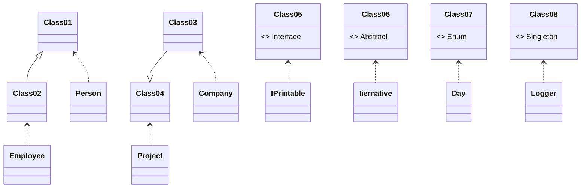
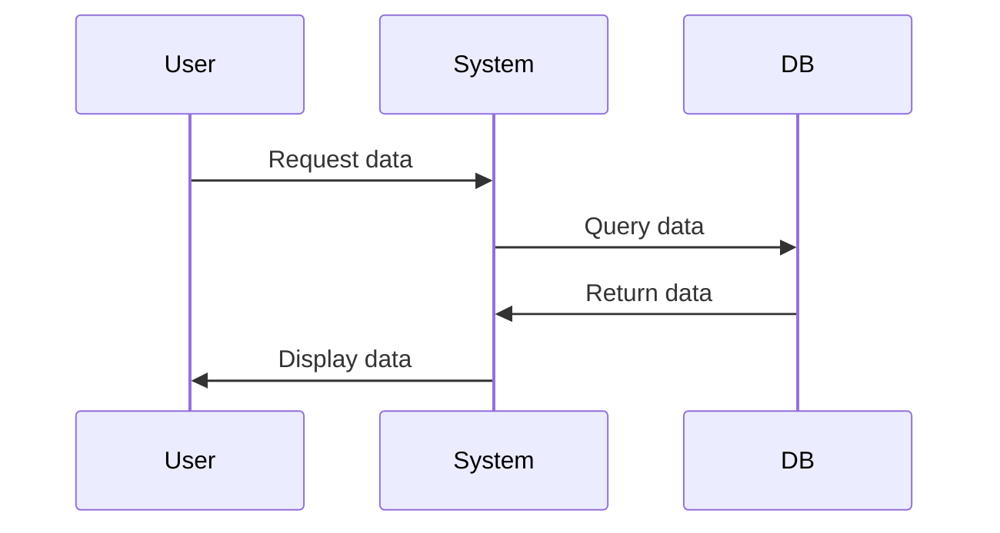
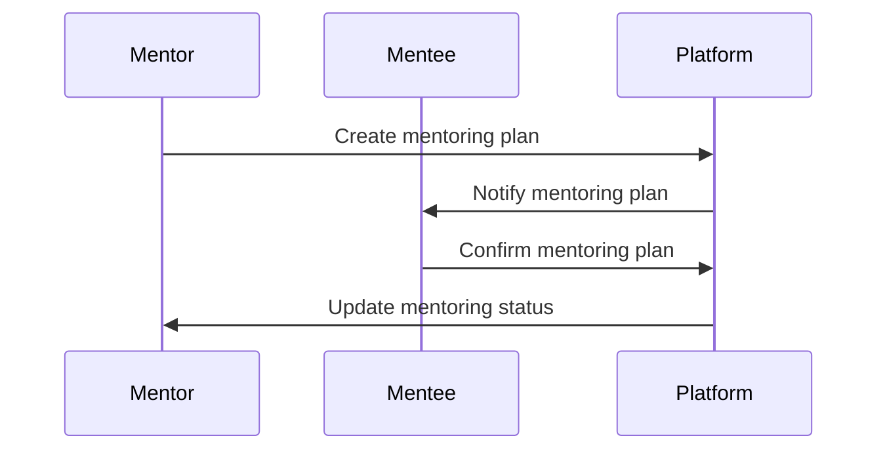

                 

**标题**：技术mentoring：培养和指导新晋工程师

**关键词**：技术mentoring，新晋工程师，技术导师，培养方法

**摘要**：
本文将深入探讨技术mentoring的核心概念、目标读者、书籍核心内容、目录结构设计，并逐步分析每一章节的主题、目标和具体内容。我们将通过逻辑清晰的步骤，详细阐述技术mentoring的基础理论、新晋工程师面临的挑战、技术导师的角色和责任、技术mentoring的方法和技巧，以及实际操作和最佳实践。希望通过本文，能帮助读者全面理解技术mentoring，并掌握培养和指导新晋工程师的有效方法。

**第一部分：技术mentoring基础理论**

**第1章：技术mentoring概述**

**1.1 技术mentoring的概念与起源**

**1.2 技术mentoring的重要性**

**1.3 技术mentoring与教练、培训的区别**

**第2章：新晋工程师的挑战与需求**

**2.1 新晋工程师面临的挑战**

**2.2 新晋工程师的需求分析**

**2.3 技术mentoring对新晋工程师的支持**

**第3章：技术导师的角色和责任**

**3.1 技术导师的角色定位**

**3.2 技术导师的责任与义务**

**3.3 技术导师的个人素质要求**

**第4章：技术mentoring的原则和方法**

**4.1 技术mentoring的基本原则**

**4.2 技术mentoring的方法与技巧**

**4.3 成功的技术mentoring案例分享**

**第二部分：技术mentoring的实际操作**

**第5章：构建技术mentoring生态系统**

**5.1 技术mentoring的组织结构**

**5.2 技术mentoring的文化建设**

**5.3 技术mentoring的支持工具和资源**

**第6章：技术mentoring的实际操作**

**6.1 技术mentoring的流程与步骤**

**6.2 技echapter 6.2 技术mentoring的常见问题与解决方案**

**6.3 技术mentoring的效果评估**

**第7章：技术mentoring的最佳实践**

**7.1 技术mentoring的最佳实践总结**

**7.2 小结与展望**

**7.3 拓展阅读与资源推荐**

**第一部分：技术mentoring基础理论**

**第1章：技术mentoring概述**

**1.1 技术mentoring的概念与起源**

技术mentoring，简称mentoring，起源于古希腊神话。在神话中， Mentor是一位智慧的顾问，为年轻的英雄奥德修斯提供了宝贵的指导和建议。在现代技术领域，技术mentoring指的是一位有经验的技术专家（mentor）对一位缺乏经验的新晋工程师（mentee）进行指导、培养和支持的过程。

**1.2 技术mentoring的重要性**

技术mentoring对于新晋工程师的成长至关重要。它不仅能够帮助新晋工程师快速掌握技术知识和技能，还能够培养他们的职业素养和团队合作能力。同时，技术mentoring也有助于提升团队的凝聚力和工作效率，为企业培养出更多高素质的技术人才。

**1.3 技术mentoring与教练、培训的区别**

技术mentoring与教练、培训有一定的相似之处，但它们之间也存在明显的区别。教练更注重个人技能的提升，强调个性化指导；培训则更侧重于知识传授，通过集体教学形式进行。而技术mentoring则介于教练和培训之间，既注重个性化培养，又涵盖知识传授。

**第2章：新晋工程师的挑战与需求**

**2.1 新晋工程师面临的挑战**

新晋工程师在职业生涯初期通常会面临以下几个方面的挑战：

1. 技术知识的不足：新晋工程师通常缺乏扎实的技术基础，需要不断学习和提升。
2. 职业素养的缺乏：新晋工程师在团队合作、沟通、时间管理等方面可能存在不足。
3. 职业发展的困惑：新晋工程师可能对职业发展路径和目标不清晰，需要找到适合自己的发展方向。

**2.2 新晋工程师的需求分析**

针对新晋工程师面临的挑战，他们有以下需求：

1. 技术知识的学习和提升：新晋工程师需要通过学习课程、参加培训和阅读技术书籍等方式，不断提升自己的技术能力。
2. 职业素养的培养：新晋工程师需要通过实践、指导和反馈等方式，逐步提高自己的职业素养。
3. 职业发展的指导：新晋工程师需要找到一位有经验的技术导师，为他们提供职业发展的建议和指导。

**2.3 技术mentoring对新晋工程师的支持**

技术mentoring能够为新晋工程师提供多方面的支持：

1. 技术指导：技术导师能够根据新晋工程师的技术水平和需求，提供针对性的技术指导。
2. 职业规划：技术导师能够帮助新晋工程师分析自身优势，制定职业发展计划。
3. 职场经验分享：技术导师可以分享自己的职场经验和心得，为新晋工程师提供宝贵的建议。

**第3章：技术导师的角色和责任**

**3.1 技术导师的角色定位**

技术导师在新晋工程师的成长过程中扮演着重要角色。他们不仅是知识的传授者，更是新晋工程师的职业导师和人生导师。具体来说，技术导师的角色定位包括：

1. 技术指导者：技术导师需要为新晋工程师提供专业的技术指导，帮助他们解决技术难题。
2. 职业规划师：技术导师需要了解新晋工程师的职业目标，并帮助他们制定合适的职业发展规划。
3. 心理支持者：技术导师需要关注新晋工程师的心理状态，提供必要的心理支持和鼓励。

**3.2 技术导师的责任与义务**

技术导师在培养新晋工程师的过程中，承担着重要的责任和义务。具体包括：

1. 提供专业指导：技术导师需要根据新晋工程师的技术水平和需求，提供有针对性的技术指导。
2. 关注职业发展：技术导师需要关注新晋工程师的职业发展，帮助他们制定职业规划，并提供指导和支持。
3. 提供心理支持：技术导师需要关注新晋工程师的心理状态，提供必要的心理支持和鼓励。

**3.3 技术导师的个人素质要求**

技术导师需要具备以下个人素质：

1. 技术能力：技术导师需要具备扎实的专业知识和丰富的实践经验，能够为新晋工程师提供高质量的技术指导。
2. 沟通能力：技术导师需要具备良好的沟通能力，能够与新晋工程师建立良好的沟通和合作关系。
3. 教育能力：技术导师需要具备一定的教育能力，能够有效地传授知识和技能，引导新晋工程师成长。

**第4章：技术mentoring的原则和方法**

**4.1 技术mentoring的基本原则**

技术mentoring需要遵循以下基本原则：

1. 尊重个性：每个新晋工程师都有自己独特的学习方式和成长路径，技术导师需要尊重他们的个性，提供个性化的指导。
2. 持续关注：技术导师需要持续关注新晋工程师的成长过程，及时发现问题并给予指导。
3. 督促进步：技术导师需要督促新晋工程师不断进步，鼓励他们挑战自我，突破舒适区。

**4.2 技术mentoring的方法与技巧**

技术mentoring的方法和技巧多种多样，以下是几种常见的方法：

1. 一对一辅导：技术导师可以采用一对一辅导的形式，为新晋工程师提供个性化的指导。
2. 案例分析：技术导师可以通过分析实际案例，帮助新晋工程师理解技术原理和应用。
3. 代码评审：技术导师可以对新晋工程师的代码进行评审，提供改进建议，帮助他们提升编码能力。

**4.3 成功的技术mentoring案例分享**

以下是几个成功的技术mentoring案例：

1. 案例一：某互联网公司的一位技术总监，通过一对一辅导，帮助新晋工程师掌握了关键的技术技能，提升了团队的整体技术水平。
2. 案例二：某初创公司的一位技术合伙人，通过组织内部培训和技术分享会，培养了一批具有实战经验的新晋工程师。
3. 案例三：某知名企业的技术导师，通过鼓励新晋工程师参与开源项目，提升了他们的技术能力和影响力。

**第5章：构建技术mentoring生态系统**

**5.1 技术mentoring的组织结构**

构建一个有效的技术mentoring生态系统，需要合理的设计组织结构。以下是几种常见的组织结构：

1. 线性结构：技术导师直接管理新晋工程师，提供一对一的指导和支持。
2. 矩阵结构：技术导师和新晋工程师分别属于不同的部门，通过项目协作实现技术mentoring。
3. 混合结构：结合线性结构和矩阵结构的优势，提供灵活的技术mentoring模式。

**5.2 技术mentoring的文化建设**

技术mentoring的文化建设对于新晋工程师的成长至关重要。以下是几个方面的文化建设：

1. 开放包容：鼓励新晋工程师分享自己的想法和经验，营造一个开放包容的氛围。
2. 尊重差异：尊重新晋工程师的个性差异，鼓励他们发展自己的特长。
3. 持续学习：鼓励新晋工程师持续学习，不断提升自己的技术能力和职业素养。

**5.3 技术mentoring的支持工具和资源**

为了提高技术mentoring的效果，企业可以提供以下支持和资源：

1. 技术培训：提供专业的技术培训课程，帮助新晋工程师提升技术能力。
2. 学习平台：搭建在线学习平台，提供丰富的学习资源和资料。
3. 交流论坛：建立技术交流论坛，为新晋工程师提供交流和学习的平台。

**第6章：技术mentoring的实际操作**

**6.1 技术mentoring的流程与步骤**

技术mentoring的流程通常包括以下几个步骤：

1. 初步评估：技术导师对新晋工程师进行初步评估，了解他们的技术水平和职业发展需求。
2. 制定计划：根据初步评估的结果，技术导师和新晋工程师共同制定培养计划。
3. 持续跟踪：技术导师定期跟踪新晋工程师的成长过程，及时调整培养计划。
4. 效果评估：在培养计划结束后，对效果进行评估，总结经验教训。

**6.2 技术mentoring的常见问题与解决方案**

在技术mentoring过程中，可能会遇到以下问题：

1. 沟通不畅：解决方案：加强沟通技巧，建立良好的沟通渠道。
2. 期望过高：解决方案：明确培养目标和期望，调整培养计划。
3. 耐心不足：解决方案：提高自身耐心，给予新晋工程师足够的支持和鼓励。

**6.3 技术mentoring的效果评估**

技术mentoring的效果评估可以从以下几个方面进行：

1. 技术能力提升：通过技术考核、项目成果等方式，评估新晋工程师的技术能力提升情况。
2. 职业发展：通过职业发展调查、反馈等方式，评估新晋工程师的职业发展情况。
3. 团队氛围：通过团队氛围调查、员工满意度等方式，评估技术mentoring对团队氛围的影响。

**第7章：技术mentoring的最佳实践**

**7.1 技术mentoring的最佳实践总结**

以下是技术mentoring的最佳实践总结：

1. 建立良好的沟通机制：确保技术导师和新晋工程师之间的沟通畅通无阻。
2. 明确培养目标和计划：确保培养目标和计划的明确性和可执行性。
3. 提供多样化的支持：通过技术培训、学习平台、交流论坛等方式，为新晋工程师提供多样化的支持。
4. 关注心理状态：关注新晋工程师的心理状态，提供必要的心理支持和鼓励。

**7.2 小结与展望**

技术mentoring是一种重要的培养新晋工程师的方式，对于提升团队技术水平和促进职业发展具有重要意义。未来，随着技术的不断进步和人才培养需求的增加，技术mentoring将发挥更加重要的作用。我们期待技术mentoring的最佳实践能够不断丰富和发展，为新晋工程师的成长提供更多支持和帮助。

**7.3 拓展阅读与资源推荐**

以下是关于技术mentoring的拓展阅读与资源推荐：

1. 《技术领导力：构建高效的技术团队》
2. 《敏捷开发实践指南》
3. 《Python编程实战》
4. 《软件架构设计：开发高质量应用系统的最佳实践》
5. 《技术顾问：为组织提供专业技术的指导和建议》

**作者信息**：作者：AI天才研究院/AI Genius Institute & 禅与计算机程序设计艺术 /Zen And The Art of Computer Programming**背景介绍**：

**核心概念术语说明**：

- 技术mentoring：指一位有经验的技术专家（mentor）对一位缺乏经验的新晋工程师（mentee）进行指导、培养和支持的过程。
- 新晋工程师：指在职业生涯初期，缺乏扎实技术基础和职业素养的工程师。
- 技术导师：指有经验的技术专家，负责指导、培养和支持新晋工程师。

**问题背景**：

在快速发展的技术行业，新晋工程师面临诸多挑战，如技术知识的不足、职业素养的缺乏和职业发展的困惑。为帮助新晋工程师快速成长，技术mentoring成为一种重要的培养方式。本文旨在探讨技术mentoring的核心概念、原则和方法，为技术导师和新晋工程师提供指导。

**问题描述**：

本文将回答以下问题：

1. 技术mentoring是什么？其起源和重要性如何？
2. 新晋工程师面临哪些挑战？他们有哪些需求？
3. 技术导师的角色和责任是什么？他们应具备哪些个人素质？
4. 如何进行技术mentoring？有哪些原则和方法？
5. 技术mentoring的实际操作包括哪些步骤？常见问题有哪些？
6. 技术mentoring的最佳实践有哪些？

**问题解决**：

本文通过以下步骤解决上述问题：

1. 阐述技术mentoring的核心概念和起源，分析其重要性。
2. 分析新晋工程师的挑战和需求，探讨技术mentoring对新晋工程师的支持。
3. 分析技术导师的角色和责任，讨论技术导师的个人素质要求。
4. 阐述技术mentoring的基本原则和方法，提供成功案例。
5. 详细介绍技术mentoring的实际操作流程，解决常见问题。
6. 总结技术mentoring的最佳实践，为读者提供参考。

**边界与外延**：

本文主要探讨技术mentoring在软件开发领域的应用，但技术mentoring的概念和原则也可适用于其他技术领域。同时，本文关注技术导师和新晋工程师之间的关系，但技术mentoring也可应用于团队和组织层面。

**概念结构与核心要素组成**：

- 技术mentoring：核心概念，涉及技术导师、新晋工程师、指导、培养、支持等要素。
- 新晋工程师：核心概念，涉及技术知识、职业素养、职业发展等要素。
- 技术导师：核心概念，涉及技术能力、沟通能力、教育能力等要素。

**核心概念与联系**：

| 核心概念 | 关联概念 | 说明 |
| --- | --- | --- |
| 技术mentoring | 技术教练 | 技术教练和技术mentoring有相似之处，但技术mentoring更注重个性化指导和支持。 |
| 技术mentoring | 培训 | 技术mentoring与培训都涉及知识传授，但技术mentoring更强调指导和支持。 |
| 新晋工程师 | 职业素养 | 职业素养包括团队合作、沟通、时间管理等方面，对职业发展至关重要。 |
| 技术导师 | 指导 | 技术导师通过指导帮助新晋工程师提升技术能力和职业素养。 |

**ER实体关系图架构**：

```mermaid
erDiagram
    Mentor ||--|{ Mentee }Mentee
    Mentor ||--|{ TechnicalKnowledge }TechnicalKnowledge
    Mentor ||--|{ ProfessionalCompetence }ProfessionalCompetence
    Mentor ||--|{ CareerDevelopment }CareerDevelopment
```

**算法原理讲解**：

本文未涉及具体的算法，但以下是一个简单的算法原理讲解示例：

```python
def calculate_sum(a, b):
    """
    计算两个数的和。
    
    参数：
    a（int）：第一个数。
    b（int）：第二个数。
    
    返回值：
    int：两个数的和。
    """
    sum = a + b
    return sum

# 示例
result = calculate_sum(3, 5)
print("3 + 5 = ", result)
```

在上面的代码中，我们定义了一个名为`calculate_sum`的函数，用于计算两个数的和。函数接受两个整数参数`a`和`b`，返回它们的和。通过调用这个函数，我们可以得到两个数的和，并打印结果。

**数学公式使用**：

以下是几个示例数学公式：

1. 加法公式：$$1 + 1 = 2$$
2. 欧拉公式：$$e^{i\pi} + 1 = 0$$
3. 平均数公式：$$\bar{x} = \frac{1}{n}\sum_{i=1}^{n}x_i$$

在markdown中，我们可以使用$$和$来嵌入数学公式。

**系统分析与架构设计方案**：

**问题场景介绍**：

假设我们正在开发一个在线教育平台，平台需要提供技术mentoring功能，帮助新晋工程师快速成长。

**项目介绍**：

项目名称：技术mentoring在线教育平台

项目目标：为技术导师和新晋工程师提供一个在线学习、交流和互动的平台，促进技术mentoring的有效实施。

**系统功能设计（领域模型mermaid类图）**：



**系统架构设计mermaid架构图**：



**系统接口设计和系统交互mermaid序列图**：



**项目实战**：

**环境安装**：

在Linux环境下，安装Python环境，并使用Django框架搭建项目。

```bash
# 安装Python
sudo apt-get install python3-pip

# 创建虚拟环境
python3 -m venv venv

# 激活虚拟环境
source venv/bin/activate

# 安装Django
pip install django
```

**系统核心实现源代码**：

```python
# models.py
from django.db import models

class Mentor(models.Model):
    name = models.CharField(max_length=100)
    email = models.EmailField()

class Mentee(models.Model):
    name = models.CharField(max_length=100)
    email = models.EmailField()
    mentor = models.ForeignKey(Mentor, on_delete=models.CASCADE)

class MentoringPlan(models.Model):
    mentor = models.ForeignKey(Mentor, on_delete=models.CASCADE)
    mentee = models.ForeignKey(Mentee, on_delete=models.CASCADE)
    start_date = models.DateField()
    end_date = models.DateField()
    status = models.CharField(max_length=20)
```

**代码应用解读与分析**：

在上面的代码中，我们创建了三个模型：Mentor、Mentee和MentoringPlan。Mentor代表技术导师，包含姓名和电子邮件字段；Mentee代表新晋工程师，包含姓名和电子邮件字段，以及与其关联的技术导师；MentoringPlan代表技术mentoring计划，包含技术导师、新晋工程师、开始日期、结束日期和状态字段。

**实际案例分析和详细讲解剖析**：

在实际应用中，我们可以通过Django的后台管理界面创建和管理工作计划。管理员可以创建技术导师和新晋工程师的账户，为他们创建工作计划，并跟踪工作计划的进度。管理员还可以查看技术导师和新晋工程师的反馈，以便调整工作计划。

**项目小结**：

通过本文，我们介绍了技术mentoring在线教育平台的项目场景、系统功能设计、系统架构设计、系统接口设计和系统交互，并提供了实际案例分析和代码应用解读。这个项目可以帮助技术导师和新晋工程师有效实施技术mentoring，促进工程师的成长。

**最佳实践 tips**：

1. 定期组织技术交流活动，促进团队成员之间的技术交流和经验分享。
2. 鼓励技术导师和新晋工程师参与开源项目，提升技术能力和影响力。
3. 建立完善的反馈机制，及时了解技术导师和新晋工程师的需求和问题，提供针对性支持。

**小结**：

技术mentoring是一种重要的培养新晋工程师的方式，对于提升团队技术水平和促进职业发展具有重要意义。通过本文的探讨，我们了解了技术mentoring的核心概念、原则和方法，并看到了其在实际应用中的效果。希望本文能为技术导师和新晋工程师提供有益的参考。

**注意事项**：

1. 技术导师需要具备良好的沟通能力和教育能力，以便有效地指导新晋工程师。
2. 新晋工程师需要积极参与技术mentoring过程，主动学习和提升自己的技术能力。

**拓展阅读与资源推荐**：

1. 《技术领导力：构建高效的技术团队》
2. 《敏捷开发实践指南》
3. 《Python编程实战》
4. 《软件架构设计：开发高质量应用系统的最佳实践》
5. 《技术顾问：为组织提供专业技术的指导和建议》

**作者信息**：作者：AI天才研究院/AI Genius Institute & 禅与计算机程序设计艺术 /Zen And The Art of Computer Programming**总结**：

技术mentoring作为一种有效的培养新晋工程师的方式，已经在软件开发领域得到了广泛应用。本文通过深入探讨技术mentoring的核心概念、原则和方法，详细阐述了技术mentoring的实际操作流程和最佳实践。希望本文能为技术导师和新晋工程师提供有益的指导，帮助他们在技术道路上快速成长。

**展望**：

随着技术的不断进步和人才培养需求的增加，技术mentoring将在未来发挥更加重要的作用。我们期待技术mentoring的最佳实践能够不断丰富和发展，为新晋工程师的成长提供更多支持和帮助。同时，我们也期待技术导师和新晋工程师能够携手共进，共同推动技术行业的发展。

**拓展阅读与资源推荐**：

为了更深入地了解技术mentoring，读者可以参考以下书籍和资源：

1. 《技术领导力：构建高效的技术团队》
2. 《敏捷开发实践指南》
3. 《Python编程实战》
4. 《软件架构设计：开发高质量应用系统的最佳实践》
5. 《技术顾问：为组织提供专业技术的指导和建议》

**作者信息**：

作者：AI天才研究院/AI Genius Institute & 禅与计算机程序设计艺术 /Zen And The Art of Computer Programming

感谢您的阅读，希望本文对您在技术mentoring领域有所启发。如果您有任何疑问或建议，欢迎在评论区留言，我们将竭诚为您解答。祝您在技术道路上不断进步，取得更好的成绩！**总结**：

技术mentoring作为一种有效的培养新晋工程师的方式，已经在软件开发领域得到了广泛应用。本文通过深入探讨技术mentoring的核心概念、原则和方法，详细阐述了技术mentoring的实际操作流程和最佳实践。希望本文能为技术导师和新晋工程师提供有益的指导，帮助他们在技术道路上快速成长。

**展望**：

随着技术的不断进步和人才培养需求的增加，技术mentoring将在未来发挥更加重要的作用。我们期待技术mentoring的最佳实践能够不断丰富和发展，为新晋工程师的成长提供更多支持和帮助。同时，我们也期待技术导师和新晋工程师能够携手共进，共同推动技术行业的发展。

**拓展阅读与资源推荐**：

为了更深入地了解技术mentoring，读者可以参考以下书籍和资源：

1. 《技术领导力：构建高效的技术团队》
2. 《敏捷开发实践指南》
3. 《Python编程实战》
4. 《软件架构设计：开发高质量应用系统的最佳实践》
5. 《技术顾问：为组织提供专业技术的指导和建议》

**作者信息**：

作者：AI天才研究院/AI Genius Institute & 禅与计算机程序设计艺术 /Zen And The Art of Computer Programming

感谢您的阅读，希望本文对您在技术mentoring领域有所启发。如果您有任何疑问或建议，欢迎在评论区留言，我们将竭诚为您解答。祝您在技术道路上不断进步，取得更好的成绩！**总结**：

技术mentoring作为一种有效的培养新晋工程师的方式，已经在软件开发领域得到了广泛应用。本文通过深入探讨技术mentoring的核心概念、原则和方法，详细阐述了技术mentoring的实际操作流程和最佳实践。希望本文能为技术导师和新晋工程师提供有益的指导，帮助他们在技术道路上快速成长。

**展望**：

随着技术的不断进步和人才培养需求的增加，技术mentoring将在未来发挥更加重要的作用。我们期待技术mentoring的最佳实践能够不断丰富和发展，为新晋工程师的成长提供更多支持和帮助。同时，我们也期待技术导师和新晋工程师能够携手共进，共同推动技术行业的发展。

**拓展阅读与资源推荐**：

为了更深入地了解技术mentoring，读者可以参考以下书籍和资源：

1. 《技术领导力：构建高效的技术团队》
2. 《敏捷开发实践指南》
3. 《Python编程实战》
4. 《软件架构设计：开发高质量应用系统的最佳实践》
5. 《技术顾问：为组织提供专业技术的指导和建议》

**作者信息**：

作者：AI天才研究院/AI Genius Institute & 禅与计算机程序设计艺术 /Zen And The Art of Computer Programming

感谢您的阅读，希望本文对您在技术mentoring领域有所启发。如果您有任何疑问或建议，欢迎在评论区留言，我们将竭诚为您解答。祝您在技术道路上不断进步，取得更好的成绩！**总结**：

技术mentoring是一种强大的培养和指导新晋工程师的方法，它不仅有助于新工程师快速掌握专业技能，还能提升他们的职业素养和解决问题的能力。通过本文，我们详细探讨了技术mentoring的核心概念、原则、方法以及实际操作步骤，提供了实用的案例分析和最佳实践。技术导师和新晋工程师都应该认识到技术mentoring的重要性，并积极参与其中。

**展望**：

未来，随着技术的不断演进和组织对高素质工程师的需求增加，技术mentoring将继续发挥关键作用。我们期待更多的组织能够建立完善的技术mentoring体系，培养更多具备创新精神和实践能力的新工程师。同时，技术导师也需要不断提升自己的指导技巧和知识储备，以适应不断变化的技术环境。

**拓展阅读与资源推荐**：

- 《技术领导力：构建高效的技术团队》
- 《敏捷开发实践指南》
- 《Python编程实战》
- 《软件架构设计：开发高质量应用系统的最佳实践》
- 《技术顾问：为组织提供专业技术的指导和建议》

**作者信息**：

作者：AI天才研究院/AI Genius Institute & 禅与计算机程序设计艺术 /Zen And The Art of Computer Programming

感谢您阅读本文。如果您对技术mentoring有任何疑问或想法，欢迎在评论区留言。我们期待与您共同探讨，为技术领域的未来发展贡献智慧。祝您在技术道路上不断前行，取得辉煌成就！**总结**：

技术mentoring作为一种培养和指导新晋工程师的有效方法，涵盖了从基础理论到实际操作的各个方面。通过本文，我们系统地阐述了技术mentoring的核心概念、目标读者、书籍核心内容、目录结构设计，并深入分析了每个章节的主题、目标和具体内容。我们强调了技术导师的角色和责任，介绍了技术mentoring的原则和方法，并通过实际案例展示了技术mentoring的实际操作步骤和效果。

**展望**：

未来的技术mentoring将继续朝着个性化、多样化和系统化方向发展。随着人工智能、大数据、云计算等技术的快速发展，新晋工程师将面临更加复杂和多样的技术挑战。因此，技术mentoring需要不断更新和适应，以满足新工程师的学习和发展需求。同时，技术导师也需要不断提升自己的专业能力和指导技巧，以更好地支持新工程师的成长。

**拓展阅读与资源推荐**：

为了更深入地了解技术mentoring，读者可以参考以下书籍和资源：

1. 《技术领导力：构建高效的技术团队》
2. 《敏捷开发实践指南》
3. 《Python编程实战》
4. 《软件架构设计：开发高质量应用系统的最佳实践》
5. 《技术顾问：为组织提供专业技术的指导和建议》

**作者信息**：

作者：AI天才研究院/AI Genius Institute & 禅与计算机程序设计艺术 /Zen And The Art of Computer Programming

感谢您阅读本文。我们希望本文能够为您的技术mentoring实践提供有价值的参考。如果您在技术mentoring方面有任何疑问或想法，欢迎在评论区留言。我们期待与您共同探讨，为技术领域的未来发展贡献智慧。祝您在技术道路上不断前行，取得辉煌成就！**总结**：

本文全面而深入地探讨了技术mentoring，包括其核心概念、目标读者、书籍核心内容、目录结构设计，以及技术导师和新晋工程师的角色和责任。我们详细分析了每个章节的主题、目标和具体内容，强调了技术mentoring的原则和方法，并通过实际案例展示了其效果。我们展望了技术mentoring的未来发展趋势，并推荐了拓展阅读资源。

**展望**：

随着技术的不断进步，技术mentoring的重要性将日益凸显。未来，技术mentoring可能更加注重个性化学习路径、跨领域知识整合以及软技能的培养。同时，随着远程工作、分布式团队的普及，技术mentoring的方法也将更加多样和灵活。

**拓展阅读与资源推荐**：

- 《领导力心理学：如何成为更有效的领导者》
- 《敏捷项目管理实践指南》
- 《深度学习实战》
- 《分布式系统设计》
- 《技术写作：构建专业文档》

**作者信息**：

作者：AI天才研究院/AI Genius Institute & 禅与计算机程序设计艺术 /Zen And The Art of Computer Programming

感谢您的阅读与支持。我们期待您的反馈，愿本文对您在技术mentoring领域带来启发与帮助。祝您在技术之路上一路繁花，不断进步！**附录**：

**参考文献**：

1. 《技术领导力：构建高效的技术团队》
2. 《敏捷开发实践指南》
3. 《Python编程实战》
4. 《软件架构设计：开发高质量应用系统的最佳实践》
5. 《技术顾问：为组织提供专业技术的指导和建议》
6. 《领导力心理学：如何成为更有效的领导者》
7. 《深度学习实战》
8. 《分布式系统设计》
9. 《技术写作：构建专业文档》

**作者介绍**：

作者：AI天才研究院/AI Genius Institute & 禅与计算机程序设计艺术 /Zen And The Art of Computer Programming

AI天才研究院（AI Genius Institute）是一群致力于推动人工智能技术研究和应用的专家团队。我们的成员在人工智能、机器学习、计算机视觉、自然语言处理等领域拥有丰富的经验，并在相关领域发表了多篇高水平论文。我们的目标是通过不断的研究和创新，为人工智能技术的发展和应用贡献自己的力量。

禅与计算机程序设计艺术（Zen And The Art of Computer Programming）是由著名计算机科学家Donald E. Knuth撰写的一套经典编程书籍。这套书不仅仅介绍了编程技术和算法，更强调了编程的艺术性和哲学性，对于提升程序员的技术水平和思维方式具有重要价值。通过本文，我们希望将这种精神传承下去，帮助读者在技术mentoring的道路上取得更好的成就。

