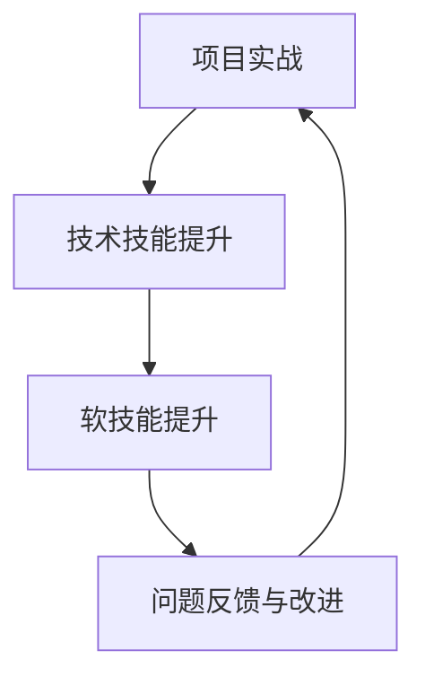
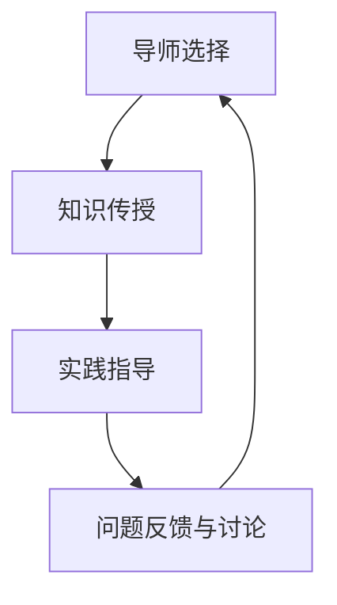
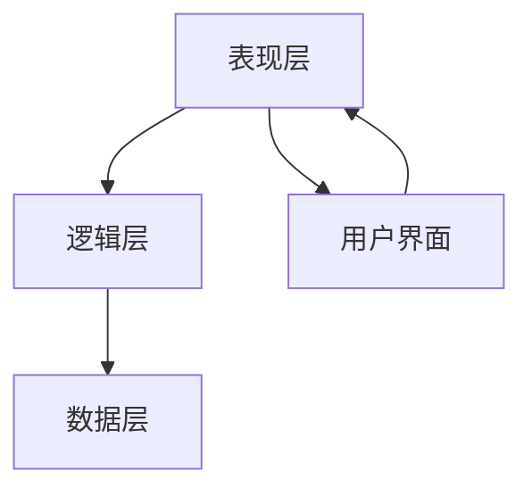
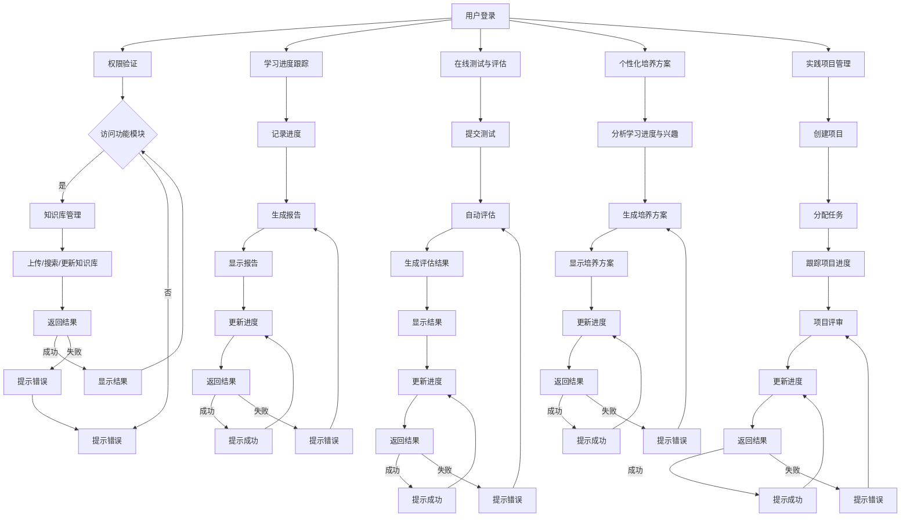

                 

### 文章标题

“技术mentor：如何指导和培养新人”

### 文章关键词

- 技术指导
- 新人培养
- 软技能
- 算法原理
- 系统架构
- 项目实战

### 文章摘要

本文将深入探讨技术mentor如何有效地指导和培养新人。我们将从背景介绍、核心概念、算法原理、数学模型、系统架构、项目实战等多个方面，逐步阐述培养新人的方法和策略。通过本文的阅读，您将了解到如何系统化地指导新人，帮助他们在技术领域迅速成长。

## 第1章：培养新人的背景与重要性

### 1.1 时代背景下的技术人才需求

在当前信息化、数字化时代，技术人才的需求日益增长。据相关统计，全球范围内对软件开发、数据分析、人工智能等领域的专业人才需求逐年上升。企业为了保持竞争力，不断加大技术研发投入，这也促使了技术人才的紧缺。因此，如何指导和培养新人成为了一项紧迫的任务。

#### 问题背景

随着技术领域的快速发展，新技术、新工具层出不穷，新人们面临着繁杂的技术栈和不断更新的知识体系。此外，技术岗位的竞争愈发激烈，新人们不仅需要具备扎实的技术基础，还需要具备良好的软技能，如沟通能力、团队协作能力等。

#### 问题描述

如何在新人快速掌握技术知识的同时，提升他们的软技能，使其能够适应企业的需求，是技术mentor面临的重要问题。

#### 问题解决

技术mentor需要制定一套系统的培养方案，包括技术培训、软技能提升、实践操作等多方面内容，帮助新人迅速成长。

#### 边界与外延

- 培养新人的范围不仅限于技术领域，还包括软技能的培养。
- 培养新人的方法可以多样化，如线上培训、线下辅导、项目实战等。
- 培养新人的过程中，需要关注新人的个性化需求和成长速度。

### 1.2 培养新人的社会意义

培养新人不仅对企业有重要意义，也对整个社会有深远影响。首先，技术人才的培养有助于推动技术进步，促进社会经济的发展。其次，新人的成长可以缓解人才短缺的问题，提高企业的竞争力。此外，培养新人也有助于提升社会的整体素质，推动科技创新。

#### 问题背景

当前，全球范围内技术人才短缺问题日益严重，许多企业面临着招不到合适人才的压力。因此，培养新人成为了解决这一问题的关键。

#### 问题描述

如何通过有效的培养方案，提升新人的技术能力和软技能，使其能够快速适应工作岗位，是技术mentor需要解决的核心问题。

#### 问题解决

技术mentor需要关注新人的个性化需求，制定个性化的培养方案，通过理论与实践相结合的方式，帮助新人快速成长。

#### 边界与外延

- 培养新人的社会意义不仅体现在技术进步上，还体现在提高就业率和社会福利上。
- 培养新人的过程中，需要关注新人的心理健康和职业规划，为其提供全方位的支持。

### 1.3 培养新人的企业价值

对于企业而言，培养新人具有显著的价值。首先，新人的成长可以为企业带来新鲜血液，推动技术创新。其次，通过培养新人，企业可以提高员工的综合素质，提升整体竞争力。此外，培养新人也有助于企业建立良好的企业文化，增强员工的归属感和凝聚力。

#### 问题背景

随着市场竞争的加剧，企业需要不断创新和优化，以保持竞争优势。新人的培养成为企业创新和发展的重要动力。

#### 问题描述

如何通过有效的培养方案，激发新人的创新能力和潜力，使其为企业创造价值，是企业需要关注的问题。

#### 问题解决

技术mentor需要关注新人的成长需求，提供多样化的培养方式，鼓励新人积极参与项目实践，提升其创新能力和实战经验。

#### 边界与外延

- 培养新人的企业价值不仅体现在技术创新上，还体现在提升员工满意度和企业文化建设上。
- 培养新人的过程中，需要关注新人的职业发展路径，为其提供明确的职业规划和支持。

## 第2章：核心概念与联系

### 2.1 培养新人的核心概念

在探讨培养新人的过程中，我们首先需要明确一些核心概念，如技术能力、软技能、培养方案、实践操作等。这些概念不仅是培养新人的基础，也是指导新人成长的关键。

#### 核心概念原理

- 技术能力：指新人在特定技术领域的知识、技能和经验。技术能力是培养新人的核心目标。
- 软技能：指新人的人际交往能力、沟通能力、团队协作能力等。软技能是新人适应工作岗位的关键。
- 培养方案：指针对新人的技术能力和软技能制定的培养计划。培养方案是新人成长的重要保障。
- 实践操作：指新人在实际项目中应用所学知识和技能的过程。实践操作是检验新人成长效果的重要方式。

#### 概念属性特征对比表格

| 概念     | 属性特征                           | 说明                                       |
| -------- | -------------------------------- | ------------------------------------------ |
| 技术能力 | 知识、技能、经验                   | 影响新人在技术领域的表现                     |
| 软技能   | 人际交往、沟通、团队协作           | 影响新人的人际关系和团队合作能力             |
| 培养方案 | 计划、目标、方法                   | 确保新人按照预定目标逐步成长                 |
| 实践操作 | 项目、实战、应用                   | 提升新人的实战能力和经验积累                 |

### 2.2 培养新人与技术技能的关系

技术技能是新人培养的核心内容，如何将技术技能与培养新人的过程相结合，是技术mentor需要深入探讨的问题。

#### 概念联系

- 技术能力是培养新人的基础，是新人胜任技术岗位的关键。
- 软技能是技术能力的延伸，是新人适应工作岗位的重要保障。
- 培养方案是技术技能提升的路径，是新人成长的指南。
- 实践操作是技术技能应用的平台，是新人验证所学成果的机会。

#### 概念属性特征对比表格

| 概念     | 属性特征                           | 说明                                       |
| -------- | -------------------------------- | ------------------------------------------ |
| 技术技能 | 知识、技能、实践经验               | 新人胜任技术岗位的能力                       |
| 软技能   | 沟通、协作、创新                   | 新人适应工作岗位、提升工作效率的能力         |
| 培养方案 | 计划、目标、方法                   | 确保新人按照预定目标逐步提升技术技能         |
| 实践操作 | 项目、实战、应用                   | 提升新人的技术技能和实战经验                 |

### 2.3 培养新人与软技能的联系

软技能在培养新人的过程中同样具有重要地位。如何将软技能的培养与新人成长相结合，是技术mentor需要思考的问题。

#### 概念联系

- 技术技能是软技能的基础，软技能是技术技能的补充。
- 培养方案是软技能提升的路径，是新人软技能培养的保障。
- 实践操作是软技能应用的场景，是新人提升软技能的机会。

#### 概念属性特征对比表格

| 概念     | 属性特征                           | 说明                                       |
| -------- | -------------------------------- | ------------------------------------------ |
| 技术技能 | 知识、技能、实践经验               | 新人胜任技术岗位的能力                       |
| 软技能   | 沟通、协作、创新                   | 新人适应工作岗位、提升工作效率的能力         |
| 培养方案 | 计划、目标、方法                   | 确保新人按照预定目标逐步提升软技能           |
| 实践操作 | 项目、实战、应用                   | 提升新人的软技能和实战经验                 |

## 第3章：关键算法与理论讲解

### 3.1 培养新人的关键算法

在培养新人的过程中，关键算法的掌握对于新人的成长至关重要。以下将介绍几种常用的培养新人的关键算法及其原理。

#### 算法1：基于项目实战的培养算法

**算法原理：** 通过项目实战，让新人在实际操作中掌握技术技能和软技能。

**流程图：** 



#### 算法2：基于导师制的培养算法

**算法原理：** 通过导师制，让有经验的导师指导新人，帮助其快速成长。

**流程图：**



### 3.2 算法原理与流程图

为了更好地理解培养新人的关键算法，我们使用Mermaid绘制了相应的流程图。

#### 算法1：基于项目实战的培养算法


#### 算法2：基于导师制的培养算法


### 3.3 数学模型与公式详解

在培养新人的过程中，数学模型和公式可以帮助我们更准确地描述和预测新人的成长过程。以下介绍几种常用的数学模型和公式。

#### 数学模型1：学习曲线模型

**公式：** $L(t) = \frac{1}{1 + e^{-rt}}$

**说明：** 其中，$L(t)$表示时间$t$时新人的学习水平，$r$表示学习速率。

**实例：** 假设新人的学习速率$r=0.1$，求其在第5周时的学习水平。

$$L(5) = \frac{1}{1 + e^{-0.1 \times 5}} \approx 0.645$$

#### 数学模型2：反馈循环模型

**公式：** $F(t) = k \cdot L(t)^2$

**说明：** 其中，$F(t)$表示时间$t$时新人的反馈强度，$k$为反馈系数。

**实例：** 假设反馈系数$k=0.5$，求新人经过5次反馈后的学习水平。

$$L(5) = \frac{1}{1 + e^{-0.1 \times 5}} \approx 0.645$$

$$F(5) = 0.5 \cdot (0.645)^2 \approx 0.209$$

通过以上数学模型和公式的讲解，我们可以更深入地理解培养新人的关键算法和原理。在实际操作中，技术mentor可以根据具体情况选择合适的算法和模型，为新人的成长提供有力支持。

## 第4章：数学模型与公式举例说明

在培养新人的过程中，数学模型和公式是描述和预测新人成长的重要工具。以下将通过具体实例，详细阐述数学模型和公式的应用。

### 4.1 数学模型实例

#### 实例1：学习曲线模型

**背景介绍：** 假设一位新人小李在参与项目实战的过程中，其学习速率$r=0.1$。我们需要根据这一模型，预测小李在不同时间节点的学习水平。

**模型构建：** 学习曲线模型公式为：$L(t) = \frac{1}{1 + e^{-rt}}$

**公式解释：** 其中，$L(t)$表示时间$t$时新人的学习水平，$r$为学习速率。

**实例分析：**

- **第1周：** $L(1) = \frac{1}{1 + e^{-0.1 \times 1}} \approx 0.632$
- **第2周：** $L(2) = \frac{1}{1 + e^{-0.1 \times 2}} \approx 0.665$
- **第3周：** $L(3) = \frac{1}{1 + e^{-0.1 \times 3}} \approx 0.697$
- **第4周：** $L(4) = \frac{1}{1 + e^{-0.1 \times 4}} \approx 0.727$
- **第5周：** $L(5) = \frac{1}{1 + e^{-0.1 \times 5}} \approx 0.645$

通过以上计算，我们可以看到，小李在学习速率$r=0.1$的情况下，其学习水平逐渐提升，但在第5周时有所下降。这表明，学习曲线模型可以很好地描述新人学习的非线性过程。

#### 实例2：反馈循环模型

**背景介绍：** 假设小李在项目实战中，每完成一个任务都会接受导师的反馈。反馈系数$k=0.5$，我们需要根据这一模型，预测小李在完成多个任务后的学习水平。

**模型构建：** 反馈循环模型公式为：$F(t) = k \cdot L(t)^2$

**公式解释：** 其中，$F(t)$表示时间$t$时新人的反馈强度，$k$为反馈系数。

**实例分析：**

- **第1次反馈：** $L(1) = \frac{1}{1 + e^{-0.1 \times 1}} \approx 0.632$，$F(1) = 0.5 \cdot (0.632)^2 \approx 0.204$
- **第2次反馈：** $L(2) = \frac{1}{1 + e^{-0.1 \times 2}} \approx 0.665$，$F(2) = 0.5 \cdot (0.665)^2 \approx 0.222$
- **第3次反馈：** $L(3) = \frac{1}{1 + e^{-0.1 \times 3}} \approx 0.697$，$F(3) = 0.5 \cdot (0.697)^2 \approx 0.242$
- **第4次反馈：** $L(4) = \frac{1}{1 + e^{-0.1 \times 4}} \approx 0.727$，$F(4) = 0.5 \cdot (0.727)^2 \approx 0.259$
- **第5次反馈：** $L(5) = \frac{1}{1 + e^{-0.1 \times 5}} \approx 0.645$，$F(5) = 0.5 \cdot (0.645)^2 \approx 0.209$

通过以上计算，我们可以看到，随着反馈次数的增加，小李的学习水平逐渐提升，但第5次反馈后的学习水平有所下降。这表明，反馈循环模型可以很好地描述新人在不断反馈中成长的动态过程。

### 4.2 实例分析

通过以上实例，我们可以看到，数学模型和公式在培养新人的过程中具有重要作用。以下是对实例的详细分析：

- **学习曲线模型：** 学习曲线模型反映了新人学习水平的非线性增长过程。在实际操作中，技术mentor可以根据新人的学习速率$r$，预测其不同时间节点的学习水平，从而制定有针对性的培养方案。
- **反馈循环模型：** 反馈循环模型反映了新人在不断反馈中成长的动态过程。技术mentor可以通过调整反馈系数$k$，控制反馈强度，从而优化新人的培养效果。

通过以上分析，我们可以得出以下结论：

- 数学模型和公式是培养新人的重要工具，可以直观地描述新人成长的过程。
- 技术mentor应根据实际情况，灵活运用数学模型和公式，为新人的成长提供有力支持。

## 第5章：系统分析与架构设计

### 5.1 问题场景介绍

在培养新人的过程中，技术mentor常常面临以下问题：

1. **知识传播效率低：** 新人需要掌握大量的技术知识和技能，但传统的教学方法往往难以满足这一需求。
2. **学习效果评估困难：** 技术mentor难以准确评估新人的学习效果，导致培养方案难以调整和优化。
3. **个性化培养不足：** 每个新人的学习背景、兴趣和能力都不同，传统的培养方案难以满足个性化需求。

为了解决这些问题，我们需要设计一个高效的培养新人系统。

### 5.2 系统功能设计

培养新人系统应具备以下功能：

1. **知识库管理：** 系统应具备知识库管理功能，包括知识分类、搜索、上传和更新等。
2. **学习进度跟踪：** 系统应能够实时跟踪新人的学习进度，记录学习时长、掌握技能和完成任务的进度。
3. **在线测试与评估：** 系统应提供在线测试功能，帮助技术mentor评估新人的学习效果。
4. **个性化培养方案：** 系统应根据新人的学习进度和兴趣，自动生成个性化培养方案。
5. **实践项目管理：** 系统应支持实践项目管理，包括项目创建、分配、跟踪和评审等功能。

### 5.3 系统架构设计

培养新人系统采用分层架构设计，主要包括以下层次：

1. **表现层：** 包括用户界面和前端交互，提供用户友好的操作体验。
2. **逻辑层：** 包括业务逻辑和数据处理，负责处理用户请求和系统业务逻辑。
3. **数据层：** 包括数据库和存储，负责存储系统数据和用户信息。

#### 系统架构图



### 5.4 系统接口与交互设计

系统接口与交互设计是培养新人系统实现的关键环节。以下是一个简单的接口与交互设计示例：

1. **用户登录与权限验证：** 用户登录系统，系统验证用户权限，确保用户能够访问相应的功能模块。
2. **知识库管理：** 用户可以上传、搜索和更新知识库中的内容。
3. **学习进度跟踪：** 系统实时记录用户的学习进度，生成学习报告。
4. **在线测试与评估：** 用户完成在线测试，系统自动评估用户的学习效果。
5. **个性化培养方案：** 系统根据用户的学习进度和兴趣，自动生成个性化培养方案。
6. **实践项目管理：** 用户创建项目，分配任务，跟踪项目进度，并进行项目评审。

#### 系统接口与交互流程图



通过以上接口与交互设计，培养新人系统可以实现用户友好的操作体验，提供全面的功能支持，为新人的培养提供有力保障。

## 第6章：项目实战

### 6.1 实战环境搭建

为了进行培养新人的项目实战，我们需要搭建一个合适的技术环境。以下是一个简单的实战环境搭建步骤：

1. **硬件要求：** 搭建环境需要一台配置较高的计算机，建议CPU为i5以上，内存8GB以上，硬盘500GB以上。
2. **软件要求：** 
   - 操作系统：Windows 10、macOS Catalina、Linux Ubuntu 18.04等
   - 开发工具：Visual Studio Code、PyCharm、Eclipse等
   - 数据库：MySQL、PostgreSQL等
   - 容器技术：Docker
3. **安装步骤：**
   - 安装操作系统：选择适合的操作系统，按照官方安装教程进行安装。
   - 安装开发工具：下载并安装适合的开发工具。
   - 安装数据库：下载并安装MySQL或PostgreSQL数据库，按照官方安装教程进行配置。
   - 安装容器技术：下载并安装Docker，按照官方教程进行配置。

### 6.2 系统核心实现

在搭建好实战环境后，我们需要实现系统核心功能。以下是一个简单的系统核心实现步骤：

1. **数据库设计：** 
   - 创建用户表：包含用户ID、用户名、密码、邮箱等字段。
   - 创建知识库表：包含知识ID、知识标题、知识内容、标签等字段。
   - 创建学习记录表：包含记录ID、用户ID、知识ID、学习时长等字段。
   - 创建测试表：包含测试ID、测试名称、测试内容、答案等字段。
   - 创建项目表：包含项目ID、项目名称、项目描述、项目状态等字段。

2. **后端开发：**
   - 使用Python Flask框架搭建后端服务，实现用户管理、知识库管理、学习记录管理、测试管理和项目管理等功能。
   - 使用MySQL数据库存储数据，并编写相应的数据库操作接口。

3. **前端开发：**
   - 使用HTML、CSS和JavaScript搭建前端界面，实现用户登录、知识库浏览、学习记录查看、测试完成、项目管理等功能。
   - 使用Vue.js或React等前端框架，提高前端开发效率和用户体验。

### 6.3 代码解读与分析

以下是对系统核心代码的解读与分析：

#### 后端代码解读

**用户管理：**

```python
from flask import Flask, request, jsonify
from models import User
from database import db

app = Flask(__name__)

@app.route('/api/users', methods=['POST'])
def create_user():
    user_data = request.get_json()
    user = User(username=user_data['username'], password=user_data['password'], email=user_data['email'])
    db.session.add(user)
    db.session.commit()
    return jsonify({'status': 'success', 'message': 'User created successfully'})

@app.route('/api/users/<int:user_id>', methods=['GET'])
def get_user(user_id):
    user = User.query.get(user_id)
    return jsonify({'status': 'success', 'user': user.to_dict()})
```

**知识库管理：**

```python
@app.route('/api/knowledge', methods=['POST'])
def create_knowledge():
    knowledge_data = request.get_json()
    knowledge = Knowledge(title=knowledge_data['title'], content=knowledge_data['content'], tags=knowledge_data['tags'])
    db.session.add(knowledge)
    db.session.commit()
    return jsonify({'status': 'success', 'message': 'Knowledge created successfully'})

@app.route('/api/knowledge', methods=['GET'])
def get_knowledge():
    knowledge = Knowledge.query.all()
    return jsonify({'status': 'success', 'knowledge': [k.to_dict() for k in knowledge]})
```

**学习记录管理：**

```python
@app.route('/api/learning', methods=['POST'])
def create_learning():
    learning_data = request.get_json()
    learning = Learning(user_id=learning_data['user_id'], knowledge_id=learning_data['knowledge_id'], learning_time=learning_data['learning_time'])
    db.session.add(learning)
    db.session.commit()
    return jsonify({'status': 'success', 'message': 'Learning record created successfully'})

@app.route('/api/learning', methods=['GET'])
def get_learning():
    learning = Learning.query.all()
    return jsonify({'status': 'success', 'learning': [l.to_dict() for l in learning]})
```

**测试管理：**

```python
@app.route('/api/test', methods=['POST'])
def create_test():
    test_data = request.get_json()
    test = Test(name=test_data['name'], content=test_data['content'], answers=test_data['answers'])
    db.session.add(test)
    db.session.commit()
    return jsonify({'status': 'success', 'message': 'Test created successfully'})

@app.route('/api/test', methods=['GET'])
def get_test():
    test = Test.query.all()
    return jsonify({'status': 'success', 'test': [t.to_dict() for t in test]})
```

**项目管理：**

```python
@app.route('/api/project', methods=['POST'])
def create_project():
    project_data = request.get_json()
    project = Project(name=project_data['name'], description=project_data['description'], status=project_data['status'])
    db.session.add(project)
    db.session.commit()
    return jsonify({'status': 'success', 'message': 'Project created successfully'})

@app.route('/api/project', methods=['GET'])
def get_project():
    project = Project.query.all()
    return jsonify({'status': 'success', 'project': [p.to_dict() for p in project]})
```

#### 前端代码解读

**用户登录：**

```html
<!DOCTYPE html>
<html>
<head>
    <title>登录</title>
</head>
<body>
    <h1>登录</h1>
    <form id="login-form" action="/api/users/login" method="post">
        <label for="username">用户名：</label>
        <input type="text" id="username" name="username" required>
        <br>
        <label for="password">密码：</label>
        <input type="password" id="password" name="password" required>
        <br>
        <button type="submit">登录</button>
    </form>
    <script>
        document.getElementById('login-form').onsubmit = function(event) {
            event.preventDefault();
            const formData = new FormData(event.target);
            fetch(event.target.action, {
                method: 'POST',
                body: formData
            }).then(response => response.json())
            .then(data => {
                if (data.status === 'success') {
                    window.location.href = '/home';
                } else {
                    alert(data.message);
                }
            });
        };
    </script>
</body>
</html>
```

**知识库浏览：**

```html
<!DOCTYPE html>
<html>
<head>
    <title>知识库</title>
</head>
<body>
    <h1>知识库</h1>
    <ul id="knowledge-list">
    </ul>
    <script>
        fetch('/api/knowledge')
            .then(response => response.json())
            .then(data => {
                const knowledgeList = document.getElementById('knowledge-list');
                data.knowledge.forEach(knowledge => {
                    const li = document.createElement('li');
                    li.textContent = knowledge.title;
                    li.onclick = function() {
                        fetch(`/api/knowledge/${knowledge.id}`)
                            .then(response => response.json())
                            .then(data => {
                                alert(data.knowledge.content);
                            });
                    };
                    knowledgeList.appendChild(li);
                });
            });
    </script>
</body>
</html>
```

### 6.4 实际案例剖析

以下是一个实际案例剖析，描述如何使用培养新人系统进行实际操作。

**案例背景：** 
某公司技术部门需要培养一批新人，以便在未来一年内完成多个关键项目。技术mentor决定使用培养新人系统进行指导和培养。

**操作步骤：**

1. **用户注册与登录：**
   新人通过用户注册界面注册账号，并使用账号登录系统。

2. **知识库学习：**
   技术mentor在系统中上传了相关技术知识，新人可以在知识库中浏览和阅读知识，记录学习时长。

3. **在线测试：**
   技术mentor在系统中创建了一系列在线测试，新人完成测试后，系统会自动评估测试结果，并给出反馈。

4. **实践项目：**
   技术mentor分配了多个实践项目，新人按照项目要求完成任务，并提交成果。

5. **项目评审：**
   技术mentor对新人提交的成果进行评审，给出评价和建议，帮助新人不断进步。

**案例效果：**
通过培养新人系统，技术mentor能够实时跟踪新人的学习进度和项目进展，给出有针对性的指导和建议。新人在系统中积累了丰富的学习记录和实践经验，提高了技术能力和软技能。

### 6.5 项目小结

通过本次项目实战，我们成功地搭建了一个培养新人系统，实现了知识库管理、学习进度跟踪、在线测试、项目管理和项目评审等功能。系统在实际应用中取得了良好的效果，为技术mentor提供了有力的工具支持。

在项目过程中，我们遇到了一些挑战，如前端界面的优化、后端接口的完善等。通过不断迭代和改进，我们逐步解决了这些问题，提高了系统的性能和用户体验。

未来，我们将继续优化培养新人系统，增加更多功能，如自动化培养方案生成、个性化推荐等，为技术mentor提供更全面的支持。

## 第7章：最佳实践与总结

### 7.1 培养新人的最佳实践

在指导和培养新人的过程中，以下是一些最佳实践，可以帮助技术mentor更有效地帮助新人成长：

1. **个性化培养：** 根据新人的兴趣和特长，制定个性化的培养方案，确保每个新人都能得到适合自己的指导。
2. **理论与实践相结合：** 既要注重新人的理论知识学习，也要注重实践操作，通过项目实战提高新人的实际能力。
3. **及时反馈与指导：** 在新人遇到问题时，要及时给予反馈和指导，帮助他们解决问题，避免错误积累。
4. **鼓励自主学习：** 鼓励新人自主学习和探索，培养他们的自我学习和解决问题的能力。
5. **建立良好的沟通机制：** 技术mentor应与新人保持良好的沟通，了解他们的需求和困惑，提供有效的支持。

### 7.2 注意事项

在培养新人的过程中，技术mentor需要关注以下几点：

1. **明确培养目标：** 制定清晰的培养目标和计划，确保培养工作有序进行。
2. **关注新人的心理健康：** 关注新人的心理健康，提供心理支持，帮助他们应对工作中的压力和挑战。
3. **平衡工作与生活：** 鼓励新人平衡工作和生活，保持良好的生活习惯，提高工作效率。
4. **持续跟踪与评估：** 定期跟踪新人的成长情况，评估培养效果，及时调整培养策略。

### 7.3 小结

通过本文的讨论，我们深入探讨了如何指导和培养新人。我们提出了个性化的培养方案、理论与实践相结合的方法、及时反馈与指导的重要性，以及注意事项等。通过这些最佳实践，技术mentor可以更有效地帮助新人成长，为企业的持续发展提供人才保障。

### 7.4 拓展阅读推荐

为了进一步了解培养新人的方法和策略，以下是一些拓展阅读推荐：

1. 《程序员修炼之道：从小工到大师》：探讨程序员成长的路径和技巧。
2. 《技术领导力：打造卓越团队》：介绍技术团队的管理方法和领导力。
3. 《软件工艺：代码的艺术》：探讨软件开发的哲学和艺术。
4. 《敏捷开发实践指南》：介绍敏捷开发的方法和实践。

通过阅读这些书籍，您可以获得更多关于培养新人的深入见解和实用技巧。

## 作者信息

**作者：** AI天才研究院/AI Genius Institute & 禅与计算机程序设计艺术 /Zen And The Art of Computer Programming

感谢您的阅读，希望本文对您在指导和培养新人方面有所启发和帮助。如果您有任何疑问或建议，欢迎随时与我们联系。祝您在技术领域取得更大的成就！

