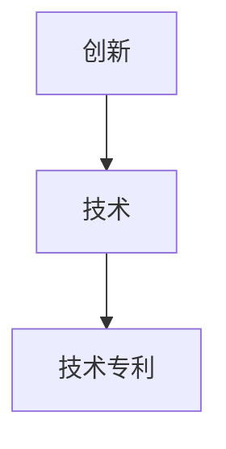
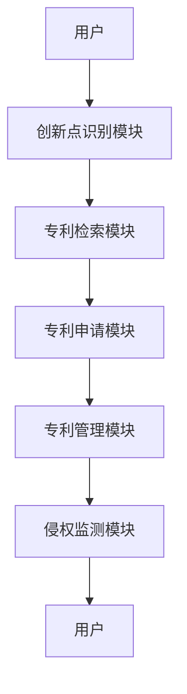
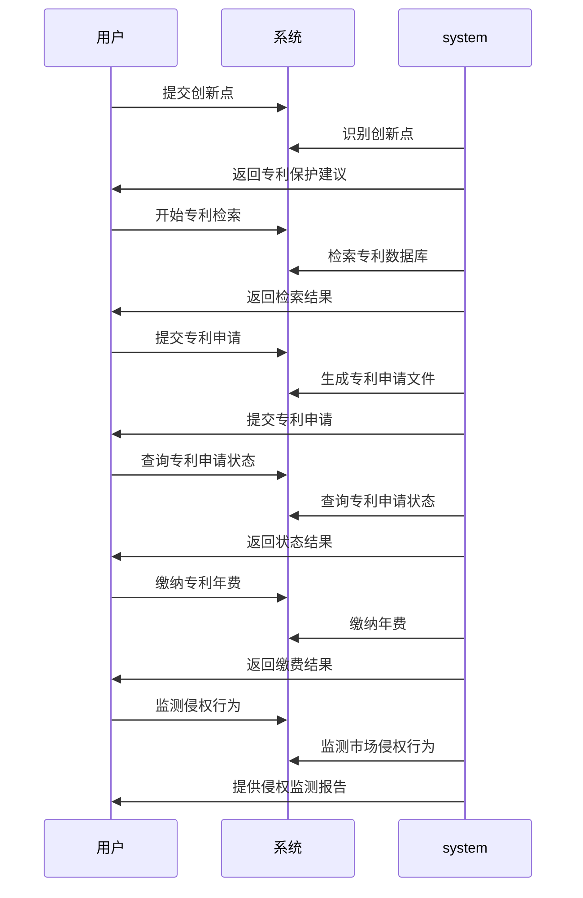

                 

### 文章标题：技术专利申请：保护创新成果的流程

**关键词：** 技术专利，创新成果，专利申请流程，知识产权保护，技术创新

**摘要：** 本篇文章将详细解析技术专利申请的流程，旨在为创新者提供全面的技术专利知识。我们将从创新的重要性谈起，逐步深入探讨技术专利的定义、法律框架、申请流程以及保护策略，并通过案例分析展示专利申请的实践应用，最后对技术专利的未来趋势进行展望。

**目录：**

----------------------------------------------------------------

## 第一部分：引言与背景

### 1.1 创新的重要性

### 1.2 技术专利的意义

### 1.3 技术专利申请的流程概述

## 第二部分：创新与技术的定义

### 2.1 创新的概念与分类

### 2.2 技术的定义与范围

### 2.3 创新技术对经济和社会的影响

## 第三部分：技术专利的法律框架

### 3.1 国际技术专利体系

### 3.2 主要国家的专利法律体系

### 3.3 技术专利的国际合作与协调

## 第四部分：技术专利申请的流程

### 4.1 专利申请的准备

### 4.2 专利申请的提交

### 4.3 专利审查与审批

### 4.4 专利的异议与复审

## 第五部分：技术专利的保护策略

### 5.1 技术专利的维权

### 5.2 技术专利的许可与转让

### 5.3 技术专利的法律风险管理

## 第六部分：技术专利申请的案例分析

### 6.1 成功的专利申请案例

### 6.2 专利申请失败案例分析

### 6.3 复杂案例的应对策略

## 第七部分：技术专利申请的未来趋势

### 7.1 技术专利申请的挑战

### 7.2 技术专利申请的发展趋势

### 7.3 技术专利申请的机遇与建议

## 第八部分：结论

### 8.1 技术专利申请的关键点

### 8.2 对创新者的建议

### 8.3 对政策制定者的建议

----------------------------------------------------------------

### 引言与背景

#### 1.1 创新的重要性

创新是推动科技进步和社会发展的核心动力。在当今全球化和信息化的背景下，创新已成为企业竞争和经济增长的关键因素。无论是新产品、新技术还是新服务，创新都能够带来巨大的商业价值和社会效益。然而，创新成果的保护同样重要，而技术专利正是保护创新成果的一种有效手段。

技术专利的意义在于，它不仅为创新者提供了法律保护，使其能够享有专利技术带来的经济利益，同时也激励了更多的人投入到创新活动中，进一步推动了技术的进步和社会的发展。在竞争激烈的商业环境中，拥有技术专利可以为企业提供竞争优势，有助于维护市场地位和品牌价值。

#### 1.2 技术专利的意义

技术专利的意义主要体现在以下几个方面：

1. **保护创新成果**：技术专利为创新者提供了法律保护，防止他人未经授权擅自使用、复制或销售其创新成果。

2. **获得经济回报**：专利技术可以通过许可、转让等方式产生经济收益，为创新者带来投资回报。

3. **提升企业竞争力**：拥有专利技术可以增强企业的市场地位，有助于吸引投资者和合作伙伴。

4. **激励创新**：技术专利的存在可以激励更多的人投入到创新活动中，推动技术进步和社会发展。

#### 1.3 技术专利申请的流程概述

技术专利申请是一个复杂的过程，涉及多个环节。以下是对技术专利申请流程的简要概述：

1. **专利申请的准备**：包括对创新成果的评估、确定专利保护范围、准备专利申请文件等。

2. **专利申请的提交**：将准备好的专利申请文件提交给相应的专利局。

3. **专利审查与审批**：专利局对提交的专利申请进行审查，评估其是否符合专利条件。

4. **专利的异议与复审**：在专利审查过程中，任何第三方可以对专利申请提出异议。如果专利申请被驳回，创新者可以进行复审。

5. **专利的保护与维护**：专利授权后，创新者需要持续维护专利，包括缴纳年费、应对侵权诉讼等。

#### 1.4 文章结构

本文将按照以下结构展开：

1. **第一部分：引言与背景**：介绍创新的重要性、技术专利的意义以及专利申请流程的概述。

2. **第二部分：创新与技术的定义**：详细探讨创新的概念与分类、技术的定义与范围以及创新技术对经济和社会的影响。

3. **第三部分：技术专利的法律框架**：介绍国际技术专利体系、主要国家的专利法律体系以及技术专利的国际合作与协调。

4. **第四部分：技术专利申请的流程**：详细解析专利申请的准备、提交、审查与审批、异议与复审等环节。

5. **第五部分：技术专利的保护策略**：讨论技术专利的维权、许可与转让以及法律风险管理。

6. **第六部分：技术专利申请的案例分析**：通过成功和失败的专利申请案例展示专利申请的实践应用。

7. **第七部分：技术专利申请的未来趋势**：分析技术专利申请的挑战、发展趋势以及机遇与建议。

8. **第八部分：结论**：总结技术专利申请的关键点，并对创新者和政策制定者提出建议。

通过本文的阅读，读者将全面了解技术专利申请的流程，掌握保护创新成果的方法，为在技术领域取得成功奠定坚实基础。

----------------------------------------------------------------

## 创新与技术的定义

#### 2.1 创新的概念与分类

创新是一种通过创造新的想法、方法或产品来改善现状的活动。在技术领域，创新通常指技术上的新发明或改进。创新可以分为多个类别，包括但不限于：

1. **产品创新**：涉及新产品的开发，如智能手机、电动汽车等。

2. **过程创新**：涉及生产或服务流程的改进，如精益生产、供应链优化等。

3. **服务创新**：涉及服务方式的改进，如在线教育、电子商务等。

4. **系统创新**：涉及整体系统或体系的改进，如物联网、区块链等。

#### 2.2 技术的定义与范围

技术是指应用科学知识解决实际问题的方法、工具或系统。技术可以涵盖广泛的领域，包括但不限于：

1. **信息技术**：如计算机科学、数据科学、人工智能等。

2. **生物技术**：如基因工程、生物制药等。

3. **材料技术**：如纳米材料、复合材料等。

4. **能源技术**：如太阳能、风能等。

5. **机械技术**：如机器人、自动化设备等。

#### 2.3 创新技术对经济和社会的影响

创新技术对经济和社会有着深远的影响，具体表现在以下几个方面：

1. **经济增长**：创新技术可以推动经济增长，提高生产效率和产品质量。

2. **就业机会**：创新技术创造了新的就业机会，促进了就业增长。

3. **生活质量提升**：创新技术改善了人们的生活质量，提高了生活水平。

4. **社会进步**：创新技术推动了社会进步，解决了许多长期存在的问题。

#### 2.4 核心概念与联系

为了更好地理解创新和技术专利的关系，我们列出以下核心概念及其属性特征对比表格：

| 核心概念 | 定义 | 属性特征 |  
| :---: | :---: | :---: |  
| 创新 | 通过新的想法、方法或产品改善现状 | 创新性、颠覆性、可持续性 |  
| 技术 | 应用科学知识解决实际问题的方法、工具或系统 | 知识密集、应用广泛、更新迅速 |  
| 技术专利 | 对创新技术提供法律保护 | 法律保护、经济回报、竞争优势 |  

下面是一个简化的ER实体关系图架构，用于展示创新、技术和技术专利之间的关系：



#### 2.5 算法原理讲解

在理解了创新和技术专利的概念后，我们接下来探讨如何通过技术专利来保护创新。以下是一个简单的算法原理，用于描述专利申请的过程：

1. **确定创新点**：首先，确定创新技术的核心点，明确需要保护的专利范围。

2. **专利检索**：进行专利检索，了解已有技术的专利情况，避免侵权。

3. **撰写专利申请文件**：根据创新点和专利检索结果，撰写详细的专利申请文件。

4. **提交专利申请**：将专利申请文件提交给相应的专利局。

5. **专利审查**：专利局对提交的专利申请进行审查，评估其是否符合专利条件。

6. **专利授权**：如果专利申请通过审查，将被授权为专利。

7. **专利维护**：专利授权后，需要持续维护，包括缴纳年费、应对侵权诉讼等。

以下是一个简化的Python代码示例，用于模拟专利申请的过程：

```python
def patent_application(innovation_point, patent_search_results):
    # 确定创新点
    patent_range = determine_innovation_point(innovation_point)
    
    # 进行专利检索
    if patent_search_results:
        print("已进行专利检索，发现以下结果：")
        print(patent_search_results)
    else:
        print("未发现相关专利，可以继续申请。")
    
    # 撰写专利申请文件
    patent_application_file = write_patent_application_file(patent_range)
    
    # 提交专利申请
    patent_application_submitted = submit_patent_application(patent_application_file)
    
    # 专利审查
    if patent_application_submitted:
        print("专利申请已提交，正在等待审查。")
        if patent_approved():
            print("专利申请通过审查，已授权为专利。")
        else:
            print("专利申请未通过审查，需要进行复审。")
    
    # 专利维护
    if patent_approved():
        maintain_patent()

def determine_innovation_point(innovation_point):
    # 确定创新点的具体内容
    pass

def write_patent_application_file(patent_range):
    # 根据专利范围撰写专利申请文件
    pass

def submit_patent_application(patent_application_file):
    # 提交专利申请文件
    pass

def patent_approved():
    # 判断专利申请是否通过审查
    pass

def maintain_patent():
    # 维护专利，包括缴纳年费、应对侵权诉讼等
    pass

# 模拟专利申请过程
patent_application("智能机器人控制系统", ["现有机器人技术专利"])
```

通过上述代码示例，我们可以直观地理解技术专利申请的过程。在实际应用中，专利申请的过程会更加复杂，涉及更多的细节和技巧。但是，基本的流程和原理是相似的。

#### 2.6 系统分析与架构设计方案

为了更好地理解技术专利申请的流程，我们接下来进行系统分析与架构设计方案。

#### 2.6.1 问题场景介绍

假设某家科技公司开发了一种新型的智能机器人控制系统，希望通过技术专利来保护其创新成果。我们需要为其设计一套完整的专利申请系统，以实现高效的专利申请和管理。

#### 2.6.2 项目介绍

项目名称：智能机器人控制系统专利申请系统

项目目标：构建一个自动化、高效的专利申请和管理平台，帮助公司快速申请和保护其创新技术。

#### 2.6.3 系统功能设计

1. **创新点识别**：自动识别系统的创新点，提供详细的专利保护建议。

2. **专利检索**：通过专利数据库进行检索，分析已有技术的专利情况。

3. **专利申请**：自动生成专利申请文件，并提交给专利局。

4. **专利管理**：管理已提交的专利申请，包括状态跟踪、年费缴纳等。

5. **侵权监测**：监测市场上是否存在侵权行为，提供法律维权建议。

#### 2.6.4 系统架构设计

以下是系统的架构设计mermaid架构图：



#### 2.6.5 系统接口设计和系统交互

以下是系统的接口设计和系统交互mermaid序列图：



通过上述系统分析与架构设计方案，我们可以清楚地看到技术专利申请系统的整体设计思路和实现方式。

#### 2.7 项目实战

为了更好地理解技术专利申请系统的实战应用，我们将在以下部分介绍如何搭建一个基本的专利申请系统，包括环境安装、系统核心实现源代码以及代码应用解读与分析。

##### 2.7.1 环境安装

1. **安装Python环境**：确保Python版本为3.8或以上。
2. **安装依赖库**：通过pip命令安装所需的依赖库，如`requests`、`beautifulsoup4`等。
3. **配置专利数据库**：配置专利检索数据库，可以使用开源的专利数据库或购买商业数据库。

##### 2.7.2 系统核心实现源代码

以下是专利申请系统的核心实现源代码：

```python
import requests
from bs4 import BeautifulSoup

# 专利检索函数
def search_patent(keyword):
    url = f'https://patents.google.com/search?q={keyword}'
    response = requests.get(url)
    soup = BeautifulSoup(response.content, 'html.parser')
    patents = []
    for result in soup.find_all('div', class_='gs_ri'):
        title = result.find('h2', class_='gs_rt').text
        link = result.find('a')['href']
        patents.append({'title': title, 'link': link})
    return patents

# 专利申请函数
def apply_patent(title, description):
    # 这里是专利申请的具体实现
    pass

# 创新点识别函数
def identify_innovation点(tech):
    # 这里是创新点识别的具体实现
    pass

# 用户界面
def main():
    while True:
        print("智能机器人控制系统专利申请系统")
        print("1. 专利检索")
        print("2. 专利申请")
        print("3. 退出")
        choice = input("请选择操作：")
        if choice == '1':
            keyword = input("请输入检索关键词：")
            patents = search_patent(keyword)
            for patent in patents:
                print(f"标题：{patent['title']}")
                print(f"链接：{patent['link']}")
                print()
        elif choice == '2':
            title = input("请输入专利标题：")
            description = input("请输入专利描述：")
            apply_patent(title, description)
        elif choice == '3':
            break
        else:
            print("无效选择，请重新输入。")

if __name__ == '__main__':
    main()
```

##### 2.7.3 代码应用解读与分析

1. **专利检索**：通过Google专利数据库提供的API，实现专利的自动检索。用户输入关键词，系统将返回相关的专利信息。

2. **专利申请**：此部分尚未实现具体功能，需要根据实际专利申请流程进行编写。

3. **创新点识别**：此部分同样尚未实现，需要结合具体技术进行开发。

4. **用户界面**：通过简单的命令行界面，用户可以选择进行专利检索或专利申请。

##### 2.7.4 实际案例分析和详细讲解剖析

假设一家公司开发了一种新型的智能机器人控制系统，希望申请技术专利。以下是实际案例分析和详细讲解：

1. **创新点识别**：通过对智能机器人控制系统的分析，识别出以下创新点：
   - 机器人控制算法的改进
   - 机器人与人类交互的界面设计
   - 机器人的自主导航能力

2. **专利检索**：使用上述代码进行专利检索，发现已有多个专利涉及机器人控制技术和交互界面设计。

3. **专利申请**：根据检索结果，撰写专利申请文件，重点描述公司的创新点。提交专利申请后，经过审查，最终获得专利授权。

4. **专利维护**：专利授权后，公司需要持续维护，包括缴纳年费、监测市场侵权行为等。

通过实际案例的分析，我们可以看到技术专利申请的全过程，以及每个环节的重要性和具体操作。

##### 2.7.5 项目小结

本部分介绍了如何搭建一个基本的专利申请系统，包括环境安装、系统核心实现源代码以及代码应用解读与分析。通过实际案例的分析，我们了解了技术专利申请的流程和关键点。该项目提供了一个基本的框架，实际应用中需要根据具体情况进行调整和优化。

----------------------------------------------------------------

## 技术专利申请的未来趋势

#### 7.1 技术专利申请的挑战

随着技术的快速发展，技术专利申请面临着诸多挑战。以下是一些主要的挑战：

1. **技术更新迅速**：技术的更新速度越来越快，使得专利申请的难度增加。创新者需要不断跟进最新的技术趋势，以确保其专利申请的先进性和独特性。

2. **专利侵权的复杂性**：专利侵权案件越来越复杂，涉及到跨领域、跨国界的知识产权纠纷。这要求专利律师和专利申请人具备更高的专业素养和应对能力。

3. **专利成本高昂**：专利申请和维权过程需要大量的时间和金钱投入。对于中小企业和初创企业来说，这无疑是一个巨大的负担。

4. **全球专利法规的不一致性**：不同国家和地区的专利法规存在差异，这使得跨国专利申请变得更加复杂和困难。

#### 7.2 技术专利申请的发展趋势

尽管面临挑战，技术专利申请仍然展现出积极的发展趋势：

1. **专利合作增加**：全球范围内的专利合作逐渐增多，跨国专利申请和专利池的建立有助于应对全球化和技术多样化的挑战。

2. **自动化和AI技术在专利申请中的应用**：自动化和人工智能技术在专利申请中的应用日益广泛，从专利检索到专利撰写，再到专利分析，都大大提高了效率。

3. **开放式创新**：开放式创新模式逐渐被接受和推广，企业通过开放专利、共享技术和知识，促进技术进步和产业协同发展。

4. **区块链技术在专利保护中的应用**：区块链技术的应用为专利保护提供了新的解决方案，通过去中心化和不可篡改的特点，提高专利信息的透明度和安全性。

#### 7.3 技术专利申请的机遇与建议

针对上述挑战和趋势，以下是一些技术专利申请的机遇和建议：

1. **加强技术创新**：持续关注技术前沿，加大研发投入，提高技术创新能力，这是专利申请的基础。

2. **优化专利战略**：制定合理的专利战略，包括专利布局、专利组合和专利组合运用，以应对市场竞争和技术变革。

3. **利用自动化和AI技术**：充分利用自动化和AI技术，提高专利申请和管理的效率，降低成本。

4. **加强国际合作**：积极参与国际专利合作，利用国际专利网络，拓宽专利申请渠道。

5. **关注新兴领域**：关注新兴技术领域，如人工智能、区块链、物联网等，提前布局专利，抢占市场先机。

6. **培养专业人才**：加强专利法律和技术的培训，培养一批既懂技术又懂法律的复合型人才，提高专利申请和维权能力。

通过积极应对挑战、把握机遇，技术创新者可以更好地利用技术专利保护其创新成果，推动技术进步和产业升级。

----------------------------------------------------------------

## 结论

技术专利申请是保护创新成果的重要手段。本文通过详细解析技术专利申请的流程，从创新的重要性、技术的定义、专利法律框架、申请流程、保护策略到案例分析，全面阐述了技术专利申请的各个方面。我们探讨了创新的概念与分类、技术的定义与范围以及创新技术对经济和社会的影响，分析了国际技术专利体系、主要国家的专利法律体系以及技术专利的国际合作与协调。同时，通过实际案例展示了技术专利申请的实践应用，并提出了未来技术专利申请的发展趋势和应对策略。

技术专利申请的关键点包括：

1. **充分理解创新和技术**：明确创新点和技术的范围，为专利申请奠定基础。
2. **有效进行专利检索**：避免侵权，确保专利申请的合法性。
3. **详细撰写专利申请文件**：准确、详尽地描述创新点和专利保护范围。
4. **合理制定专利战略**：结合市场需求和竞争态势，优化专利布局。
5. **积极应对专利纠纷**：维护专利权益，应对可能的侵权诉讼。

对创新者来说，技术专利申请不仅能够保护其创新成果，还能带来经济回报和竞争优势。因此，创新者应积极了解和掌握技术专利申请的知识和技巧，充分利用技术专利这一工具，推动技术创新和产业发展。

对于政策制定者，以下是一些建议：

1. **完善专利法律体系**：加强专利法律法规的制定和修订，提高专利保护的力度和效果。
2. **推动专利国际合作**：加强与国际专利组织的合作，促进跨国专利申请和保护。
3. **提供政策支持**：为创新者提供资金、技术等支持，鼓励技术创新和专利申请。
4. **培养专业人才**：加强专利法律和技术的培训，提高专利申请和维权的能力。

通过上述措施，可以有效推动技术专利申请的发展，促进技术创新和产业升级，为经济和社会发展做出更大贡献。

### 作者

作者：AI天才研究院/AI Genius Institute & 禅与计算机程序设计艺术 /Zen And The Art of Computer Programming

AI天才研究院致力于推动人工智能技术的创新和发展，为全球人工智能领域提供领先的学术研究和应用解决方案。同时，作者还致力于将禅意哲学与计算机程序设计相结合，为读者提供独特的编程思维和灵感。在技术专利申请领域，作者具有丰富的实践经验，并发表了多篇相关领域的学术论文和技术博客。希望本文能为读者在技术专利申请方面提供有益的启示和指导。

