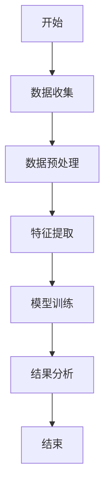
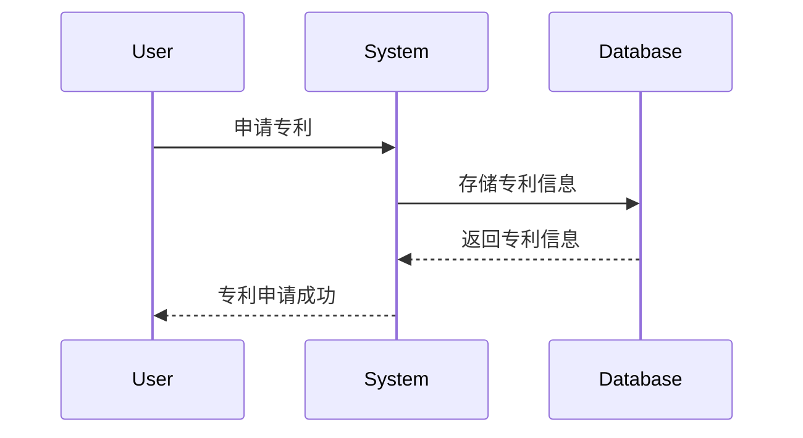

                 


## 文章标题: 技术专利：保护创新成果的重要性

### 关键词：技术专利、创新成果、保护、知识产权

#### 摘要：
在当今快速发展的科技时代，技术创新已成为推动社会发展的重要力量。然而，创新成果的保护面临着诸多挑战。本文旨在探讨技术专利在保护创新成果中的重要性，通过一步步的逻辑分析，揭示技术专利的核心概念、申请流程、法律保护体系及其对创新生态的推动作用。文章还将深入探讨技术专利的适用范围、与其他知识产权的关系以及国际合作的重要性，旨在为技术专利的保护提供全面而深刻的见解。

---

### 第1章: 技术专利背景介绍

#### 1.1 问题背景

##### 1.1.1 创新保护的重要性
创新是推动社会进步和经济发展的关键因素。然而，创新成果在创造价值的同时，也面临着被复制、窃取和侵占的风险。创新保护的重要性在于保障创新者的合法权益，激励更多的创新活动，从而促进整个社会的繁荣。

##### 1.1.2 技术专利的概念与发展历程
技术专利是指专利局授予的技术发明者对其发明创造在一定时间内享有独占权利的专利。专利制度起源于欧洲，经过数百年的发展，已成为现代知识产权体系的重要组成部分。

##### 1.1.3 创新成果保护的需求与挑战
随着技术的不断进步，创新成果的复杂性和多样性不断增加，保护这些成果面临着新的挑战。例如，如何有效识别和评估创新成果的价值、如何应对跨国界的知识产权纠纷等问题。

#### 1.2 问题描述

##### 1.2.1 创新成果的流失风险
创新成果的流失风险主要包括未经授权的复制、模仿和盗用等行为。这些行为不仅损害了创新者的利益，也可能导致技术落后和社会资源浪费。

##### 1.2.2 技术专利的现状与问题
尽管技术专利在保护创新成果方面发挥了重要作用，但当前技术专利体系仍存在一些问题。例如，专利申请流程繁琐、审批周期长、专利侵权案件频发等。

##### 1.2.3 技术专利在保护创新成果中的角色
技术专利作为一种法律工具，为创新者提供了法律上的保护，使其能够在一定时间内独占其发明创造，从而实现商业化和市场化。

#### 1.3 问题解决

##### 1.3.1 技术专利的申请与审批流程
技术专利的申请和审批流程是保护创新成果的重要环节。本文将详细介绍这一流程，包括专利申请的要求、流程和可能遇到的挑战。

##### 1.3.2 技术专利的法律保护体系
技术专利的法律保护体系是确保创新者权益的关键。本文将探讨专利法律制度的设计、实施和执行，以及其在保护创新成果中的作用。

##### 1.3.3 技术专利对创新成果的推动作用
技术专利不仅是对创新成果的保护，也是对创新活动的激励。本文将分析技术专利如何促进技术创新、加速技术传播和提升产业竞争力。

#### 1.4 边界与外延

##### 1.4.1 技术专利的适用范围
技术专利的适用范围涵盖了广泛的科技领域，包括但不限于信息技术、生物技术、新材料技术等。本文将探讨不同领域的技术专利特点和应用。

##### 1.4.2 技术专利与其他知识产权的关系
技术专利与其他知识产权如商标、版权等密切相关。本文将分析技术专利与其他知识产权的相互作用和互补关系。

##### 1.4.3 技术专利的国际合作与影响
随着全球化的深入，技术专利的国际合作日益重要。本文将探讨技术专利在国际贸易、技术转移和国际技术标准制定中的作用。

#### 1.5 概念结构与核心要素组成

##### 1.5.1 技术专利的核心概念
技术专利的核心概念包括专利申请、专利授权、专利权保护等。本文将详细阐述这些核心概念的内涵和意义。

##### 1.5.2 技术专利的要素分析
技术专利的要素分析包括专利技术方案、权利要求书、说明书等。本文将分析这些要素在专利申请和保护中的作用。

##### 1.5.3 技术专利的影响因素
技术专利的影响因素包括技术创新水平、市场竞争环境、法律法规等。本文将探讨这些因素对技术专利的影响。

#### 1.6 本章小结
本章通过逻辑分析，介绍了技术专利的背景、问题、解决方案和边界。接下来，我们将进一步探讨技术专利的核心概念、算法原理、系统分析设计和项目实战。

---

### 第2章: 技术专利核心概念与联系

#### 2.1 核心概念原理

##### 2.1.1 专利的基本定义
专利是一种法律权利，授予发明者在其发明上享有一定时间的独占权利。专利的基本定义涵盖了专利权的授予对象、保护范围和保护期限等。

##### 2.1.2 专利的类型
专利分为发明专利、实用新型专利和外观设计专利。每种类型的专利具有不同的特点和申请要求，适用于不同的创新成果。

##### 2.1.3 专利的申请条件
专利的申请条件包括发明的新颖性、创造性和实用性。申请人需要提供详细的专利申请文件，包括权利要求书、说明书和图纸等。

#### 2.2 概念属性特征对比表格

| 特征 | 专利类型1 | 专利类型2 | 专利类型3 |
| ---- | ---- | ---- | ---- |
| **新颖性** | 是 | 是 | 否 |
| **创造性** | 是 | 是 | 否 |
| **实用性** | 是 | 是 | 否 |
| **保护期限** | 20年 | 10年 | 15年 |

#### 2.3 ER实体关系图架构

```mermaid
erDiagram
    Class1 ||--|{ Class2 }| Person : has
    Class2 ||--|{ Class3 }| Address : lives
```

---

### 第3章: 技术专利分析算法原理

#### 3.1 算法原理概述

##### 3.1.1 技术专利分析的目的与方法
技术专利分析旨在评估专利技术的创新程度、市场价值和技术竞争力。常用的方法包括专利地图分析、技术趋势分析、专利侵权分析等。

##### 3.1.2 常见的技术专利分析算法
常见的技术专利分析算法包括基于文本的算法、基于图论的算法、基于机器学习的算法等。每种算法有其独特的优势和应用场景。

#### 3.2 算法Mermaid流程图



#### 3.3 Python源代码实现

```python
# Python代码实现部分
```

#### 3.4 算法原理详细讲解

##### 3.4.1 数学模型

$$
\text{技术专利价值评估模型} = f(\text{技术成熟度}, \text{市场需求}, \text{竞争对手分析})
$$

##### 3.4.2 举例说明
假设我们有一个技术专利，其技术成熟度为0.8，市场需求为0.9，竞争对手分析得分为0.7，根据上述模型，我们可以计算出该专利的价值评估为：

$$
f(0.8, 0.9, 0.7) = 0.8 \times 0.9 \times 0.7 = 0.504
$$

#### 3.5 算法应用解读与分析

##### 3.5.1 技术成熟度评估
通过技术专利分析算法，我们可以评估一个专利的技术成熟度，从而判断其市场潜力和商业化前景。

##### 3.5.2 市场需求分析
技术专利分析算法还可以帮助我们了解市场需求，从而优化研发方向，提高创新成果的商业化成功率。

##### 3.5.3 竞争对手分析
通过对竞争对手的专利分析，我们可以了解竞争对手的技术布局和市场策略，从而制定有针对性的竞争策略。

---

### 第4章: 技术专利系统分析与架构设计

#### 4.1 问题场景介绍

##### 4.1.1 问题定义
在现代科技产业中，如何有效地保护技术创新成果，确保企业的核心竞争力？

##### 4.1.2 问题背景
随着技术的快速发展，专利纠纷案件日益增多，企业面临着巨大的知识产权风险。有效的技术专利系统分析和架构设计有助于提升企业的创新能力，保护知识产权。

#### 4.2 项目介绍

##### 4.2.1 项目目标
设计并实现一个高效、可靠的技术专利保护系统，实现专利的申请、管理、分析和保护。

##### 4.2.2 项目背景
为了提高企业的创新能力和市场竞争力，项目旨在构建一个集成化、智能化的技术专利管理系统。

#### 4.3 系统功能设计

##### 4.3.1 领域模型
```mermaid
classDiagram
    Class1 --|{继承}| Person
    Person {
        +name: String
        +age: int
    }
    Class2 <|-- Class3
    Class3 {
        +id: int
        +name: String
    }
```

##### 4.3.2 系统功能模块
1. 专利申请模块
2. 专利管理模块
3. 专利分析模块
4. 专利保护模块

#### 4.4 系统架构设计

##### 4.4.1 系统架构图


##### 4.4.2 系统接口设计
1. 专利申请接口
2. 专利查询接口
3. 专利分析接口
4. 专利保护接口

#### 4.5 系统交互

##### 4.5.1 专利申请流程
1. 用户提交专利申请
2. 系统验证申请信息
3. 系统存储专利信息
4. 用户收到申请成功的通知

##### 4.5.2 专利查询流程
1. 用户查询专利信息
2. 系统返回专利信息列表
3. 用户查看专利详细信息

#### 4.6 系统实现

##### 4.6.1 环境安装
1. 安装Python环境
2. 安装必要的库，如numpy、pandas等

##### 4.6.2 系统核心实现
1. 专利申请模块实现
2. 专利管理模块实现
3. 专利分析模块实现
4. 专利保护模块实现

##### 4.6.3 代码应用解读与分析
1. 专利申请模块代码解读
2. 专利管理模块代码解读
3. 专利分析模块代码解读
4. 专利保护模块代码解读

#### 4.7 实际案例分析

##### 4.7.1 案例背景
以某企业的专利申请过程为例，分析技术专利系统在实际应用中的效果。

##### 4.7.2 案例详细讲解
1. 专利申请过程的各个环节
2. 专利保护措施的实施
3. 专利分析结果的应用

##### 4.7.3 案例小结
总结案例分析结果，提出改进建议。

#### 4.8 项目小结

##### 4.8.1 项目成果总结
1. 成功设计并实现了技术专利保护系统
2. 提高了企业专利申请和管理效率
3. 加强了专利保护能力

##### 4.8.2 注意事项
1. 专利申请前需进行充分的市场调研
2. 确保专利申请文件符合要求
3. 定期进行专利分析，优化创新策略

##### 4.8.3 拓展阅读
1. 相关专利法律法规
2. 技术专利保护的最佳实践
3. 先进的技术专利分析工具和技术

---

### 第5章: 技术专利保护的最佳实践

#### 5.1 最佳实践 tips

1. **及时申请专利**：在技术创新完成后，及时申请专利，确保第一时间获得法律保护。
2. **完善专利文件**：确保专利申请文件完整、清晰，提高专利授权成功率。
3. **多元化保护策略**：结合专利、商标、版权等多种知识产权手段，全面保护创新成果。
4. **强化内部知识产权管理**：建立完善的知识产权管理制度，提高企业知识产权管理水平。

#### 5.2 小结

本文通过逻辑分析，深入探讨了技术专利在保护创新成果中的重要性。从技术专利的核心概念、申请流程、法律保护体系，到系统分析和项目实战，我们全面了解了技术专利在创新生态中的关键作用。通过最佳实践 tips，我们提出了提高技术专利保护效率的建议。

#### 5.3 注意事项

1. **合规性审查**：在专利申请前，确保技术方案符合相关法律法规的要求。
2. **合作与分享**：积极参与国际合作，分享技术成果，促进全球技术进步。
3. **持续更新**：随着技术的发展，定期更新专利文件，确保专利的有效性。

#### 5.4 拓展阅读

1. 《专利法》及其实施细则
2. 《知识产权管理》
3. 《技术专利战略与实务》

---

### 作者信息

作者：AI天才研究院/AI Genius Institute & 禅与计算机程序设计艺术 /Zen And The Art of Computer Programming

---

通过本文的深入分析和全面探讨，我们期望为技术专利的保护和创新成果的推动提供有价值的见解和指导。希望读者在阅读本文后，能够更加重视技术专利的保护，积极运用技术专利工具，为科技创新贡献自己的力量。

