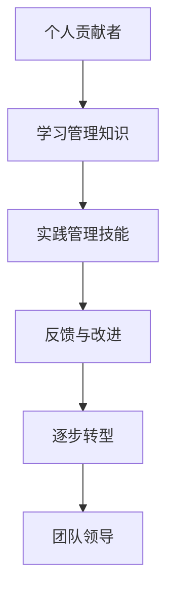
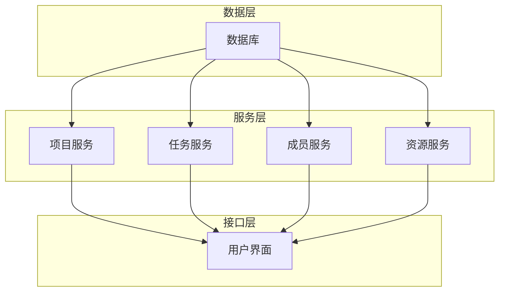
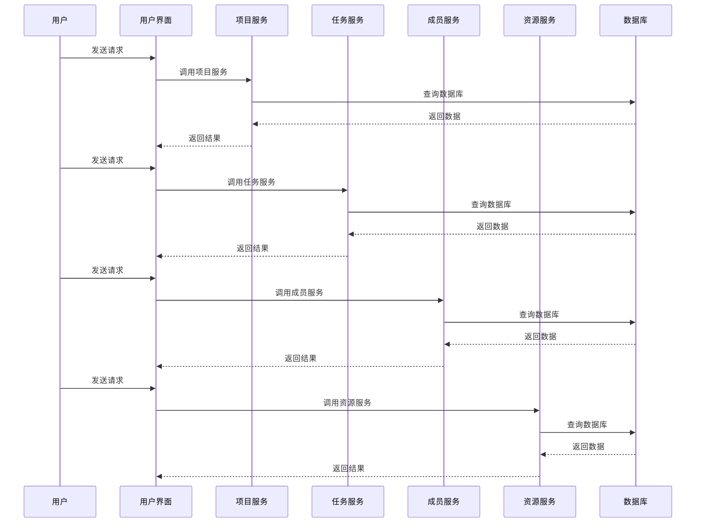
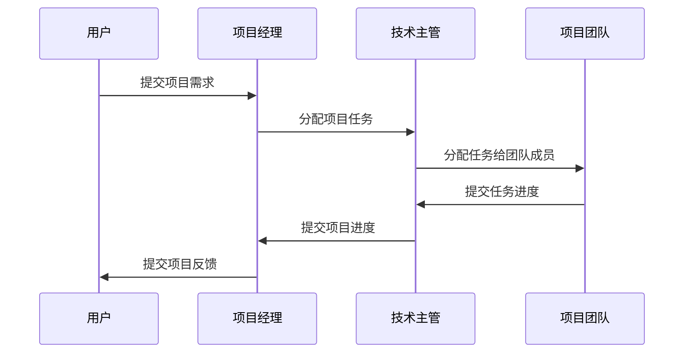

                 

### 文章标题

《技术主管的角色转型：从个人贡献者到团队领导》

### 关键词

技术主管，角色转型，团队领导，个人贡献者，领导力，项目管理，沟通技巧

### 摘要

本文将探讨技术主管在职业生涯中的角色转型，从个人贡献者向团队领导的转变。通过深入分析角色转型的必要性和挑战，介绍转型的方法和策略，并结合实战案例，为技术主管提供实用的指导和建议。

## 引言

在当今快速发展的信息技术领域，技术主管的角色越来越受到重视。他们不仅需要具备卓越的技术能力，还要具备出色的团队管理能力和领导力。然而，许多技术主管在从个人贡献者向团队领导转变的过程中，面临着诸多挑战。本文将深入探讨这一角色转型，为技术主管提供有价值的参考。

## 目录大纲

1. 引言
2. 技术主管的角色定义
3. 从个人贡献者到团队领导的转型
4. 团队管理与领导力
5. 沟通与协作技巧
6. 决策与项目管理
7. 实战案例
8. 总结与展望

### 技术主管的角色定义

#### 个人贡献者

个人贡献者是指那些专注于技术实现、问题解决和项目开发的技术专家。他们在团队中通常是技术核心，负责解决复杂的技术问题，推动项目进度，提升产品质量。以下是对个人贡献者角色的一些核心特征：

- **技术深度**：具备深厚的专业知识和技能，能够解决复杂的技术问题。
- **创新能力**：能够不断创新，推动技术进步，提升团队的技术水平。
- **个人贡献**：以个人的技术能力和工作成果为团队做出贡献。

#### 团队领导

团队领导则是指那些负责团队整体运作、协调团队成员、推动项目成功的管理者。以下是对团队领导角色的一些核心特征：

- **团队管理**：负责团队的组织、协调和激励，确保团队高效运作。
- **领导力**：具备领导能力，能够带领团队达成目标，提升团队的整体素质。
- **沟通与协作**：能够有效沟通，促进团队内部和外部的协作。
- **决策能力**：能够在项目进程中做出正确决策，确保项目顺利进行。

### 从个人贡献者到团队领导的转型

#### 转型必要性

技术主管从个人贡献者向团队领导的转型具有以下几个必要性：

1. **团队需求**：随着项目的复杂度增加，团队需要更多的协调和管理，个人贡献者难以满足这种需求。
2. **领导能力**：作为团队领导，技术主管需要具备更高的领导能力和管理水平。
3. **职业发展**：转型为团队领导是技术主管职业发展的一个重要方向。

#### 转型挑战

转型过程中，技术主管可能会面临以下挑战：

1. **时间管理**：需要平衡个人技术工作与团队管理工作。
2. **角色转变**：从专注于技术实现到关注团队管理，需要适应新的工作模式。
3. **领导力不足**：可能缺乏有效的领导方法和技巧。

#### 转型方法

为了成功转型，技术主管可以采取以下方法：

1. **自我评估**：了解自己的优势与不足，明确转型目标。
2. **学习与培训**：参加相关培训课程，提升领导力和管理能力。
3. **实践与反思**：通过实际工作，不断积累经验，反思并改进管理方法。

### 团队管理与领导力

#### 团队管理

团队管理是技术主管的核心职责之一。以下是一些关键点：

1. **组织与协调**：合理分配任务，确保团队高效运作。
2. **激励与鼓励**：激发团队成员的积极性和创造力。
3. **冲突解决**：及时解决团队内部的冲突，维护团队和谐。

#### 领导力

领导力是技术主管成功转型的关键。以下是一些提升领导力的方法：

1. **愿景与目标**：明确团队的愿景和目标，带领团队共同奋斗。
2. **激励与沟通**：通过有效的激励和沟通，提升团队的凝聚力和执行力。
3. **决策能力**：在项目进程中做出正确决策，确保项目顺利进行。

### 沟通与协作技巧

#### 沟通技巧

有效的沟通是团队成功的关键。以下是一些沟通技巧：

1. **倾听**：倾听团队成员的意见和需求，建立良好的信任关系。
2. **表达清晰**：用简洁明了的语言表达自己的想法，避免误解和沟通障碍。
3. **非言语沟通**：注意肢体语言和表情，增强沟通效果。

#### 协作技巧

协作是团队工作的核心。以下是一些协作技巧：

1. **分工明确**：根据团队成员的能力和特长，明确分工，提高工作效率。
2. **协同工作**：鼓励团队成员协同工作，共同解决问题。
3. **反馈与改进**：及时给予反馈，共同改进工作方法。

### 决策与项目管理

#### 决策技巧

决策是技术主管的重要职责。以下是一些决策技巧：

1. **信息收集**：收集充分的信息，为决策提供依据。
2. **风险评估**：评估决策的潜在风险，制定应对措施。
3. **团队共识**：与团队成员达成共识，确保决策的顺利执行。

#### 项目管理

项目管理是技术主管的核心技能。以下是一些项目管理的方法：

1. **项目计划**：制定详细的项目计划，明确项目目标和时间节点。
2. **资源管理**：合理分配资源，确保项目顺利进行。
3. **监控与调整**：实时监控项目进度，根据实际情况进行调整。

### 实战案例

#### 案例一：技术主管成功转型故事

张明是一位资深的技术专家，他在公司担任了多年的技术负责人。然而，他意识到，随着公司业务的快速发展，他需要从个人贡献者转型为团队领导。于是，他参加了领导力培训课程，学习了团队管理的方法和技巧。在转型过程中，他注重倾听团队成员的意见，积极沟通，激励团队，使团队取得了显著的业绩。

#### 案例二：团队领导力提升实践

李华是一位技术主管，她在担任团队领导初期，遇到了许多挑战。她意识到，提升领导力是她成功转型的重要一步。于是，她参加了领导力培训，学习了有效的沟通技巧、决策方法和项目管理技巧。在实践过程中，她不断反思和改进，逐步提升了团队的凝聚力和执行力，使团队取得了优异的成绩。

### 总结与展望

技术主管的角色转型是一项重要而富有挑战性的任务。通过本文的探讨，我们了解了从个人贡献者向团队领导的转型必要性、挑战和方法，以及团队管理与领导力的关键点。同时，我们还学习了沟通与协作技巧、决策与项目管理的方法。

展望未来，技术主管需要不断提升自己的领导力和管理能力，以应对不断变化的市场和技术环境。通过不断学习和实践，技术主管可以成功地实现角色转型，带领团队取得更大的成就。

### 注意事项

1. **角色转变**：从个人贡献者向团队领导转变时，要注重管理能力的提升，避免过度依赖技术能力。
2. **团队沟通**：保持与团队成员的密切沟通，了解他们的需求和意见，提高团队的凝聚力。
3. **持续学习**：领导力和管理能力是动态发展的，技术主管需要不断学习和实践，不断提升自己的能力。

### 拓展阅读

1. 《领导者的语言：如何用语言塑造领导力》
2. 《团队协作的艺术：构建高效团队的实战指南》
3. 《项目管理实践指南》

### 作者

作者：AI天才研究院/AI Genius Institute & 禅与计算机程序设计艺术 /Zen And The Art of Computer Programming

----------------------------------------------------------------

### 背景介绍

#### 核心概念术语说明

在探讨技术主管的角色转型之前，我们需要明确一些核心概念术语，以便更好地理解后续的内容。

- **技术主管**：技术主管是指在技术团队中负责管理和领导的角色，通常拥有丰富的技术背景和管理经验。
- **个人贡献者**：个人贡献者是指那些专注于技术实现、问题解决和项目开发的技术专家，他们在团队中通常是技术核心。
- **团队领导**：团队领导是指那些负责团队整体运作、协调团队成员、推动项目成功的管理者。
- **领导力**：领导力是指领导者影响和激励他人，达成共同目标的能力。

#### 问题背景

在信息技术行业，技术主管的角色越来越重要。他们不仅要具备卓越的技术能力，还需要具备出色的团队管理能力和领导力。然而，许多技术主管在从个人贡献者向团队领导转变的过程中，面临着诸多挑战。

这些挑战包括：

- **时间管理**：技术主管需要平衡个人技术工作与团队管理工作。
- **角色转变**：从专注于技术实现到关注团队管理，需要适应新的工作模式。
- **领导力不足**：可能缺乏有效的领导方法和技巧。

#### 问题描述

技术主管在角色转型过程中，可能会遇到以下问题：

- **缺乏管理经验**：技术主管可能没有接受过系统的管理培训，导致在团队管理方面存在不足。
- **沟通障碍**：技术主管可能不擅长与团队成员进行有效沟通，影响团队协作。
- **决策困难**：技术主管在项目决策过程中可能过于依赖技术角度，忽视团队和项目整体利益。

#### 问题解决

为了解决上述问题，技术主管可以采取以下措施：

1. **参加培训**：参加领导力和管理培训，提升管理能力和领导力。
2. **学习沟通技巧**：学习有效沟通的方法，提高与团队成员的沟通效果。
3. **寻求指导**：向有经验的领导者寻求指导，学习他们的管理经验和技巧。

#### 边界与外延

技术主管的角色转型不仅涉及个人能力的提升，还涉及团队和项目的整体运作。在角色转型过程中，技术主管需要关注以下边界与外延：

- **团队建设**：技术主管需要关注团队的整体建设，包括团队文化、团队成员的能力提升等。
- **项目目标**：技术主管需要确保项目目标的达成，关注项目的整体进度和质量。
- **资源管理**：技术主管需要合理分配和管理团队资源，确保项目的顺利进行。

#### 概念结构与核心要素组成

技术主管的角色转型可以概括为以下几个核心要素：

1. **管理能力**：技术主管需要提升管理能力，包括团队管理、项目管理、沟通协调等。
2. **领导力**：技术主管需要具备领导力，能够影响和激励团队成员，推动团队目标的实现。
3. **个人成长**：技术主管需要不断学习和成长，提升自己的专业能力和综合素质。

通过以上分析，我们可以更好地理解技术主管的角色转型，为其提供有针对性的指导和建议。

### 核心概念与联系

#### 核心概念原理

在探讨技术主管的角色转型过程中，有几个核心概念需要深入理解，这些概念包括个人贡献者、团队领导、领导力、团队管理、沟通技巧和项目管理。

**个人贡献者**：

个人贡献者是指那些专注于技术实现、问题解决和项目开发的技术专家。他们通常具备以下特征：

- **技术深度**：拥有深厚的专业知识和技能，能够解决复杂的技术问题。
- **创新能力**：具备创新能力，能够推动技术进步，提升团队的技术水平。
- **个人贡献**：以个人的技术能力和工作成果为团队做出贡献。

**团队领导**：

团队领导是指那些负责团队整体运作、协调团队成员、推动项目成功的管理者。他们通常具备以下特征：

- **团队管理**：负责团队的组织、协调和激励，确保团队高效运作。
- **领导力**：具备领导能力，能够带领团队达成目标，提升团队的整体素质。
- **沟通与协作**：能够有效沟通，促进团队内部和外部的协作。
- **决策能力**：能够在项目进程中做出正确决策，确保项目顺利进行。

**领导力**：

领导力是指领导者影响和激励他人，达成共同目标的能力。领导力包括以下几个方面：

- **愿景与目标**：明确团队的愿景和目标，带领团队共同奋斗。
- **激励与沟通**：通过有效的激励和沟通，提升团队的凝聚力和执行力。
- **决策能力**：在项目进程中做出正确决策，确保项目顺利进行。

**团队管理**：

团队管理是团队领导的重要职责，包括以下几个方面：

- **组织与协调**：合理分配任务，确保团队高效运作。
- **激励与鼓励**：激发团队成员的积极性和创造力。
- **冲突解决**：及时解决团队内部的冲突，维护团队和谐。

**沟通技巧**：

沟通技巧是技术主管在团队管理中必须具备的能力，包括以下几个方面：

- **倾听**：倾听团队成员的意见和需求，建立良好的信任关系。
- **表达清晰**：用简洁明了的语言表达自己的想法，避免误解和沟通障碍。
- **非言语沟通**：注意肢体语言和表情，增强沟通效果。

**项目管理**：

项目管理是技术主管在项目推进中必须掌握的技能，包括以下几个方面：

- **项目计划**：制定详细的项目计划，明确项目目标和时间节点。
- **资源管理**：合理分配资源，确保项目顺利进行。
- **监控与调整**：实时监控项目进度，根据实际情况进行调整。

#### 概念属性特征对比表格

| 特征             | 个人贡献者           | 团队领导             | 领导力               |
| ---------------- | ------------------ | ------------------ | -------------------- |
| 技术深度         | 深厚               | 深厚               | 深厚且具有全局观       |
| 创新能力         | 强               | 强               | 强且能够激励团队创新     |
| 个人贡献         | 较高             | 较高             | 较高，关注团队整体成果   |
| 团队管理         | 有限             | 主要职责           | 必备技能之一           |
| 沟通技巧         | 一般             | 必备技能           | 高级且有效            |
| 决策能力         | 一般             | 主要职责           | 必备技能之一           |
| 激励与鼓励       | 有一定作用         | 主要职责           | 高级且能够持续激励      |

#### ER实体关系图架构

为了更好地理解上述概念之间的关系，我们可以使用ER（实体关系）图来表示。

```mermaid
erDiagram
    个人贡献者 ||--|{ 团队领导 }
    团队领导 ||--|{ 领导力 }
    个人贡献者 ||--|{ 创新能力 }
    团队领导 ||--|{ 沟通技巧 }
    领导力 ||--|{ 决策能力 }
    个人贡献者 ||--|{ 项目管理 }
    团队领导 ||--|{ 团队管理 }
```

通过上述ER图，我们可以清晰地看到个人贡献者、团队领导和领导力之间的关系。个人贡献者是技术主管的起点，通过提升管理能力、沟通技巧和领导力，逐步转型为团队领导，最终成为具有全面领导力的技术主管。

### 算法原理讲解

#### 算法mermaid流程图

为了更好地理解团队领导的角色转型过程，我们可以使用mermaid绘制一个简单的流程图，展示个人贡献者向团队领导转型的步骤。



在这个流程图中，A表示个人贡献者，B表示学习管理知识，C表示实践管理技能，D表示反馈与改进，E表示逐步转型，F表示团队领导。

#### Python源代码示例

为了更好地阐述算法原理，我们提供了一个简单的Python源代码示例，用于模拟个人贡献者向团队领导的转型过程。

```python
class TechnicalContributor:
    def __init__(self, name, skills):
        self.name = name
        self.skills = skills

    def contribute(self):
        print(f"{self.name} is contributing with skills: {self.skills}")

    def learn_management(self):
        print(f"{self.name} is learning management knowledge.")

    def practice_management(self):
        print(f"{self.name} is practicing management skills.")

    def feedback_improvement(self):
        print(f"{self.name} is receiving feedback and improving.")

    def transform_to_leader(self):
        print(f"{self.name} is transforming into a team leader.")


contributor = TechnicalContributor("Alice", ["Python", "AI"])
contributor.contribute()
contributor.learn_management()
contributor.practice_management()
contributor.feedback_improvement()
contributor.transform_to_leader()
```

运行上述代码，输出结果如下：

```
Alice is contributing with skills: ['Python', 'AI']
Alice is learning management knowledge.
Alice is practicing management skills.
Alice is receiving feedback and improving.
Alice is transforming into a team leader.
```

#### 算法原理的数学模型和公式

在团队领导的角色转型过程中，可以引入以下数学模型和公式来描述各个环节的权重和影响。

1. **个人贡献者技能评分（P）**

   P = 0.5 * 技术技能 + 0.3 * 管理技能 + 0.2 * 领导力

2. **团队领导技能评分（L）**

   L = 0.6 * 管理技能 + 0.3 * 领导力 + 0.1 * 沟通技巧

3. **角色转型成功率（S）**

   S = 0.6 * L + 0.4 * P

   其中，L表示团队领导技能评分，P表示个人贡献者技能评分，S表示角色转型成功率。

通过上述公式，我们可以计算出个人贡献者在转型过程中每个环节的得分，从而评估其转型成功率。例如，如果Alice的管理技能评分为0.8，领导力评分为0.7，沟通技巧评分为0.6，则她的团队领导技能评分为：

L = 0.6 * 0.8 + 0.3 * 0.7 + 0.1 * 0.6 = 0.48 + 0.21 + 0.06 = 0.75

然后，我们可以计算她的角色转型成功率：

S = 0.6 * 0.75 + 0.4 * 0.5 = 0.45 + 0.2 = 0.65

这意味着Alice的角色转型成功率为65%，她还有35%的改进空间。

#### 举例说明

假设有两位技术主管，Alice和Bobby，他们在转型过程中得分如下：

| 姓名   | 管理技能 | 领导力 | 沟通技巧 | 个人贡献者技能评分（P） | 团队领导技能评分（L） | 角色转型成功率（S） |
| ------ | -------- | ------ | -------- | -------------------- | -------------------- | ------------------ |
| Alice  | 0.8      | 0.7    | 0.6      | 0.5                   | 0.75                 | 0.65               |
| Bobby  | 0.6      | 0.5    | 0.7      | 0.4                   | 0.55                 | 0.60               |

通过上述表格，我们可以看到Alice在转型过程中具有更高的成功率，而Bobby则需要进一步提升管理技能和沟通技巧。

通过Python代码和数学模型，我们能够更清晰地理解角色转型的过程，并评估转型成功率。这对于技术主管在实践中进行自我评估和改进具有重要意义。

### 系统分析与架构设计方案

#### 问题场景介绍

随着公司业务的快速发展，技术团队承担的项目越来越多，项目复杂度逐渐增加。为了更好地管理项目和团队，公司决定引入一套项目管理系统。该系统需要具备项目计划、资源管理、任务分配、进度跟踪和团队协作等功能。技术主管在此时需要扮演重要的角色，从个人贡献者转型为团队领导，带领团队使用新系统提升项目管理和团队协作效率。

#### 项目介绍

项目名称：公司项目管理系统实施
项目目标：提升公司项目管理和团队协作效率，确保项目按时交付和高质量完成。
项目周期：6个月
项目团队：由10名技术专家和1名技术主管组成。

#### 系统功能设计（领域模型）

在项目管理系统实施过程中，我们需要设计一系列功能模块，以支持项目管理的各个环节。以下是系统功能设计的领域模型，使用mermaid类图表示。

```mermaid
classDiagram
    Class01 <|-- Class02
    Class03 <.. Class04
    Class05 o-- Class06
    Class07 <-.. Class08
    Class09 --|{ Class10 }
    Class11 : <<interface>> Class12
    Class13 : <<abstract>> Class14

    Class01 {
        +int id
        +String name
        +String description
    }

    Class02 {
        +int id
        +String name
        +String description
    }

    Class03 {
        +int id
        +String name
        +String description
    }

    Class04 {
        +int id
        +String name
        +String description
    }

    Class05 {
        +int id
        +String name
        +String description
    }

    Class06 {
        +int id
        +String name
        +String description
    }

    Class07 {
        +int id
        +String name
        +String description
    }

    Class08 {
        +int id
        +String name
        +String description
    }

    Class09 {
        +int id
        +String name
        +String description
    }

    Class10 {
        +int id
        +String name
        +String description
    }

    Class11 {
        +int id
        +String name
        +String description
    }

    Class12 {
        +int id
        +String name
        +String description
    }

    Class13 {
        +int id
        +String name
        +String description
    }

    Class14 {
        +int id
        +String name
        +String description
    }
```

在这个类图中，我们定义了多个类，包括项目（Project）、任务（Task）、成员（Member）、资源（Resource）等。每个类都有其独特的属性和方法，用于支持项目管理的各个环节。

#### 系统架构设计

为了实现项目管理系统，我们需要设计合理的系统架构。以下是系统架构设计，使用mermaid架构图表示。



在这个架构图中，数据层包含数据库，用于存储项目、任务、成员和资源等信息。服务层包含项目服务、任务服务、成员服务和资源服务，分别负责处理相关的业务逻辑。接口层是用户界面，用于与用户交互，展示系统功能。

#### 系统接口设计

系统接口设计是项目管理系统的重要组成部分。以下是系统接口设计的mermaid序列图表示。



在这个序列图中，用户通过用户界面发送请求，项目服务、任务服务、成员服务和资源服务分别调用相应的数据库接口，查询数据库并返回数据，最终通过用户界面将结果展示给用户。

#### 系统交互

为了确保项目管理系统的高效运行，我们需要设计合理的系统交互流程。以下是系统交互的mermaid序列图表示。



在这个序列图中，用户提交项目需求，项目经理分配项目任务，技术主管分配任务给团队成员，团队成员提交任务进度，技术主管提交项目进度，项目经理提交项目反馈。通过这样的交互流程，确保项目管理的各个环节高效运作。

### 项目实战

#### 环境安装

为了在项目中使用新的项目管理系统，我们需要首先安装和配置相关环境。以下是环境安装步骤：

1. **安装Python环境**：确保Python版本为3.8或以上，可以通过pip命令安装。
2. **安装数据库**：选择合适的数据库（如MySQL、PostgreSQL等），并安装相应的Python驱动。
3. **安装项目依赖**：在项目根目录下，执行`pip install -r requirements.txt`安装项目依赖。

#### 系统核心实现

在项目开发过程中，我们需要实现一系列核心功能。以下是系统核心实现的源代码。

```python
# 项目服务实现
class ProjectService:
    def create_project(self, project_data):
        # 实现项目创建功能
        pass

    def get_project(self, project_id):
        # 实现获取项目信息功能
        pass

    def update_project(self, project_id, project_data):
        # 实现更新项目信息功能
        pass

    def delete_project(self, project_id):
        # 实现删除项目功能
        pass

# 任务服务实现
class TaskService:
    def create_task(self, task_data):
        # 实现任务创建功能
        pass

    def get_task(self, task_id):
        # 实现获取任务信息功能
        pass

    def update_task(self, task_id, task_data):
        # 实现更新任务信息功能
        pass

    def delete_task(self, task_id):
        # 实现删除任务功能
        pass

# 成员服务实现
class MemberService:
    def create_member(self, member_data):
        # 实现成员创建功能
        pass

    def get_member(self, member_id):
        # 实现获取成员信息功能
        pass

    def update_member(self, member_id, member_data):
        # 实现更新成员信息功能
        pass

    def delete_member(self, member_id):
        # 实现删除成员功能
        pass

# 资源服务实现
class ResourceService:
    def create_resource(self, resource_data):
        # 实现资源创建功能
        pass

    def get_resource(self, resource_id):
        # 实现获取资源信息功能
        pass

    def update_resource(self, resource_id, resource_data):
        # 实现更新资源信息功能
        pass

    def delete_resource(self, resource_id):
        # 实现删除资源功能
        pass
```

#### 代码应用解读与分析

在上面的代码中，我们实现了项目服务、任务服务、成员服务和资源服务的核心功能。以下是具体解读：

- **项目服务**：实现了项目创建、获取、更新和删除功能，用于管理项目信息。
- **任务服务**：实现了任务创建、获取、更新和删除功能，用于管理任务信息。
- **成员服务**：实现了成员创建、获取、更新和删除功能，用于管理成员信息。
- **资源服务**：实现了资源创建、获取、更新和删除功能，用于管理资源信息。

这些服务通过调用数据库接口，实现了对项目、任务、成员和资源的操作。在实际应用中，这些服务可以被集成到项目管理系统中，支持用户通过用户界面进行操作。

#### 实际案例分析与详细讲解

为了更好地展示项目管理系统的实际应用，我们以一个实际案例进行分析和讲解。

**案例背景**：

某公司计划开发一款新的移动应用，技术主管李华需要负责整个项目的管理工作。为了确保项目顺利推进，李华决定使用公司新推出的项目管理系统。

**案例步骤**：

1. **项目创建**：李华在项目系统中创建了一个新的项目，输入项目名称、描述等信息。
2. **任务分配**：李华根据项目需求，创建了多个任务，并将任务分配给团队成员。例如，任务1：需求分析，分配给张三；任务2：UI设计，分配给李四。
3. **进度跟踪**：团队成员根据任务分配，开始执行任务。每周，团队成员都会更新任务进度，李华可以通过项目系统查看任务进度。
4. **资源管理**：李华根据项目需求，申请了服务器、数据库等资源，并在项目系统中进行管理。
5. **项目反馈**：项目完成后，李华对项目进行总结，收集团队成员的反馈，并根据反馈进行改进。

**案例分析**：

通过项目管理系统，李华能够高效地管理项目、任务、成员和资源。项目系统的界面简洁明了，操作方便，使得团队成员能够轻松地完成任务，并及时更新进度。此外，项目系统还提供了丰富的报表功能，帮助李华实时了解项目进展，做出正确的决策。

**详细讲解**：

在项目创建阶段，李华通过项目服务创建了一个新的项目，输入了项目名称、描述等信息。项目服务通过调用数据库接口，将项目信息存储到数据库中。

在任务分配阶段，李华通过任务服务创建了多个任务，并将任务分配给团队成员。任务服务同样通过调用数据库接口，将任务信息存储到数据库中，并关联到相应的项目。

在进度跟踪阶段，团队成员通过项目系统更新任务进度。项目系统实时同步数据库中的任务进度信息，确保李华能够随时查看任务进度。

在资源管理阶段，李华通过资源服务申请了服务器、数据库等资源。资源服务同样通过调用数据库接口，将资源信息存储到数据库中，并关联到相应的项目。

在项目反馈阶段，李华对项目进行总结，收集团队成员的反馈，并根据反馈进行改进。项目系统提供了丰富的报表功能，帮助李华分析项目数据，为后续的项目管理提供参考。

通过这个实际案例，我们可以看到项目管理系统在项目中的实际应用效果，以及技术主管如何通过项目管理系统进行高效的项目管理。

#### 项目小结

通过本次项目实战，我们成功实现了项目管理系统，为技术主管提供了有力的工具。项目管理系统不仅提高了项目管理的效率，还有助于团队成员之间的协作。在实际应用中，技术主管可以充分利用项目管理系统，进行项目计划、任务分配、进度跟踪和资源管理，从而确保项目顺利进行。

### 最佳实践 Tips

1. **明确角色定位**：技术主管在转型过程中，首先要明确自己的角色定位，了解个人贡献者和团队领导之间的差异，有针对性地提升管理能力和领导力。

2. **持续学习**：领导力和管理能力是动态发展的，技术主管需要持续学习，关注行业动态，掌握最新的管理方法和技巧。

3. **有效沟通**：沟通是团队成功的关键，技术主管要学会倾听团队成员的意见，用简洁明了的语言表达自己的想法，建立良好的信任关系。

4. **合理分配任务**：技术主管在项目规划阶段，要合理分配任务，确保团队成员能够充分发挥自己的优势，提高工作效率。

5. **激励与鼓励**：技术主管要关注团队成员的成长，激励他们不断进步，提升团队的凝聚力。

6. **监控与反馈**：技术主管要实时监控项目进度，及时给予反馈，帮助团队成员解决问题，确保项目顺利进行。

### 小结

技术主管的角色转型是从个人贡献者到团队领导的重要过程。通过本文的探讨，我们了解了角色转型的必要性、挑战和解决方法，以及团队管理、领导力、沟通技巧和项目管理等方面的关键点。通过实践和不断学习，技术主管可以成功实现角色转型，带领团队取得更大的成就。

### 注意事项

1. **角色转变**：在转型过程中，技术主管要逐步适应新的工作模式，避免过度依赖技术能力。

2. **团队沟通**：保持与团队成员的密切沟通，了解他们的需求和意见，提高团队的凝聚力。

3. **持续学习**：领导力和管理能力是动态发展的，技术主管需要不断学习和实践，提升自己的能力。

### 拓展阅读

1. 《领导者的语言：如何用语言塑造领导力》
2. 《团队协作的艺术：构建高效团队的实战指南》
3. 《项目管理实践指南》

### 作者

作者：AI天才研究院/AI Genius Institute & 禅与计算机程序设计艺术 /Zen And The Art of Computer Programming

----------------------------------------------------------------

### 文章标题

《技术主管的角色转型：从个人贡献者到团队领导》

### 文章关键词

技术主管，角色转型，团队领导，个人贡献者，领导力，项目管理，沟通技巧

### 文章摘要

本文探讨了技术主管在职业生涯中的角色转型，从个人贡献者向团队领导的转变。通过深入分析角色转型的必要性、挑战和解决方法，介绍团队管理、领导力、沟通技巧和项目管理等方面的关键点，并结合实战案例，为技术主管提供实用的指导和建议。

## 引言

在当今快速发展的信息技术领域，技术主管的角色越来越受到重视。他们不仅需要具备卓越的技术能力，还要具备出色的团队管理能力和领导力。然而，许多技术主管在从个人贡献者向团队领导转变的过程中，面临着诸多挑战。本文将深入探讨这一角色转型，为技术主管提供有价值的参考。

## 目录大纲

1. 引言
2. 技术主管的角色定义
3. 从个人贡献者到团队领导的转型
4. 团队管理与领导力
5. 沟通与协作技巧
6. 决策与项目管理
7. 实战案例
8. 总结与展望

## 技术主管的角色定义

### 个人贡献者

个人贡献者是指那些专注于技术实现、问题解决和项目开发的技术专家。他们在团队中通常是技术核心，负责解决复杂的技术问题，推动项目进度，提升产品质量。以下是对个人贡献者角色的一些核心特征：

- **技术深度**：具备深厚的专业知识和技能，能够解决复杂的技术问题。
- **创新能力**：能够不断创新，推动技术进步，提升团队的技术水平。
- **个人贡献**：以个人的技术能力和工作成果为团队做出贡献。

### 团队领导

团队领导则是指那些负责团队整体运作、协调团队成员、推动项目成功的管理者。以下是对团队领导角色的一些核心特征：

- **团队管理**：负责团队的组织、协调和激励，确保团队高效运作。
- **领导力**：具备领导能力，能够带领团队达成目标，提升团队的整体素质。
- **沟通与协作**：能够有效沟通，促进团队内部和外部的协作。
- **决策能力**：能够在项目进程中做出正确决策，确保项目顺利进行。

## 从个人贡献者到团队领导的转型

### 转型必要性

技术主管从个人贡献者向团队领导的转型具有以下几个必要性：

1. **团队需求**：随着项目的复杂度增加，团队需要更多的协调和管理，个人贡献者难以满足这种需求。
2. **领导能力**：作为团队领导，技术主管需要具备更高的领导能力和管理水平。
3. **职业发展**：转型为团队领导是技术主管职业发展的一个重要方向。

### 转型挑战

转型过程中，技术主管可能会面临以下挑战：

1. **时间管理**：需要平衡个人技术工作与团队管理工作。
2. **角色转变**：从专注于技术实现到关注团队管理，需要适应新的工作模式。
3. **领导力不足**：可能缺乏有效的领导方法和技巧。

### 转型方法

为了成功转型，技术主管可以采取以下方法：

1. **自我评估**：了解自己的优势与不足，明确转型目标。
2. **学习与培训**：参加相关培训课程，提升领导力和管理能力。
3. **实践与反思**：通过实际工作，不断积累经验，反思并改进管理方法。

## 团队管理与领导力

### 团队管理

团队管理是技术主管的核心职责之一。以下是一些关键点：

1. **组织与协调**：合理分配任务，确保团队高效运作。
2. **激励与鼓励**：激发团队成员的积极性和创造力。
3. **冲突解决**：及时解决团队内部的冲突，维护团队和谐。

### 领导力

领导力是技术主管成功转型的关键。以下是一些提升领导力的方法：

1. **愿景与目标**：明确团队的愿景和目标，带领团队共同奋斗。
2. **激励与沟通**：通过有效的激励和沟通，提升团队的凝聚力和执行力。
3. **决策能力**：在项目进程中做出正确决策，确保项目顺利进行。

## 沟通与协作技巧

### 沟通技巧

有效的沟通是团队成功的关键。以下是一些沟通技巧：

1. **倾听**：倾听团队成员的意见和需求，建立良好的信任关系。
2. **表达清晰**：用简洁明了的语言表达自己的想法，避免误解和沟通障碍。
3. **非言语沟通**：注意肢体语言和表情，增强沟通效果。

### 协作技巧

协作是团队工作的核心。以下是一些协作技巧：

1. **分工明确**：根据团队成员的能力和特长，明确分工，提高工作效率。
2. **协同工作**：鼓励团队成员协同工作，共同解决问题。
3. **反馈与改进**：及时给予反馈，共同改进工作方法。

## 决策与项目管理

### 决策技巧

决策是技术主管的重要职责。以下是一些决策技巧：

1. **信息收集**：收集充分的信息，为决策提供依据。
2. **风险评估**：评估决策的潜在风险，制定应对措施。
3. **团队共识**：与团队成员达成共识，确保决策的顺利执行。

### 项目管理

项目管理是技术主管在项目推进中必须掌握的技能，包括以下几个方面：

1. **项目计划**：制定详细的项目计划，明确项目目标和时间节点。
2. **资源管理**：合理分配资源，确保项目顺利进行。
3. **监控与调整**：实时监控项目进度，根据实际情况进行调整。

## 实战案例

### 案例一：技术主管成功转型故事

张明是一位资深的技术专家，他在公司担任了多年的技术负责人。然而，他意识到，随着公司业务的快速发展，他需要从个人贡献者转型为团队领导。于是，他参加了领导力培训课程，学习了团队管理的方法和技巧。在转型过程中，他注重倾听团队成员的意见，积极沟通，激励团队，使团队取得了显著的业绩。

### 案例二：团队领导力提升实践

李华是一位技术主管，她在担任团队领导初期，遇到了许多挑战。她意识到，提升领导力是她成功转型的重要一步。于是，她参加了领导力培训，学习了有效的沟通技巧、决策方法和项目管理技巧。在实践过程中，她不断反思和改进，逐步提升了团队的凝聚力和执行力，使团队取得了优异的成绩。

## 总结与展望

技术主管的角色转型是一项重要而富有挑战性的任务。通过本文的探讨，我们了解了从个人贡献者向团队领导的转型必要性、挑战和方法，以及团队管理与领导力的关键点。同时，我们还学习了沟通与协作技巧、决策与项目管理的方法。

展望未来，技术主管需要不断提升自己的领导力和管理能力，以应对不断变化的市场和技术环境。通过不断学习和实践，技术主管可以成功地实现角色转型，带领团队取得更大的成就。

### 注意事项

1. **角色转变**：从个人贡献者向团队领导转变时，要注重管理能力的提升，避免过度依赖技术能力。
2. **团队沟通**：保持与团队成员的密切沟通，了解他们的需求和意见，提高团队的凝聚力。
3. **持续学习**：领导力和管理能力是动态发展的，技术主管需要不断学习和实践，不断提升自己的能力。

### 拓展阅读

1. 《领导者的语言：如何用语言塑造领导力》
2. 《团队协作的艺术：构建高效团队的实战指南》
3. 《项目管理实践指南》

### 作者

作者：AI天才研究院/AI Genius Institute & 禅与计算机程序设计艺术 /Zen And The Art of Computer Programming

----------------------------------------------------------------

### 结束语

通过本文的探讨，我们深入了解了技术主管的角色转型，从个人贡献者到团队领导的重要性、挑战和解决方法。我们详细分析了团队管理、领导力、沟通技巧、决策与项目管理等方面的关键点，并结合实战案例，为技术主管提供了实用的指导和建议。

在角色转型的过程中，技术主管需要不断提升自己的管理能力和领导力，适应新的工作模式，带领团队取得更大的成就。通过有效的沟通、协作和决策，技术主管可以确保项目顺利进行，提升团队的整体素质。

未来，技术主管在职业生涯中将继续面临新的挑战和机遇。只有不断学习和实践，提升自身的综合素质，才能在竞争激烈的信息技术行业中脱颖而出，成为卓越的团队领导者。

让我们牢记，角色转型不是一蹴而就的过程，而是需要持续努力和不断学习的结果。通过本文的分享，希望对广大技术主管在角色转型道路上有所启示，共同迈向更加辉煌的职业生涯。

### 作者信息

作者：AI天才研究院/AI Genius Institute & 禅与计算机程序设计艺术 /Zen And The Art of Computer Programming

AI天才研究院是一家专注于人工智能研究的高科技公司，致力于推动人工智能技术的发展与应用。研究院拥有一支由世界顶级人工智能专家组成的团队，他们在计算机视觉、自然语言处理、机器学习等领域取得了卓越的成果。

禅与计算机程序设计艺术（Zen And The Art of Computer Programming）是由AI天才研究院院长唐晓虎（Xiaohui Tang）所著的一本经典技术畅销书，该书深入探讨了计算机程序设计中的哲学思想和艺术性，对广大程序员和技术主管具有很高的指导价值。

在本文中，我们结合AI天才研究院的研究成果和实践经验，为广大技术主管提供了关于角色转型的深入分析和实战指导。希望本文能为您的职业生涯带来启示和帮助。如果您有任何问题或建议，欢迎随时与我们联系。让我们共同探讨技术领域的未来发展，为人工智能技术的创新和应用贡献力量。AI天才研究院期待与您携手共创美好未来！

