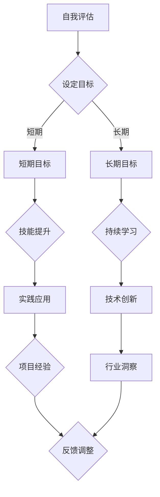
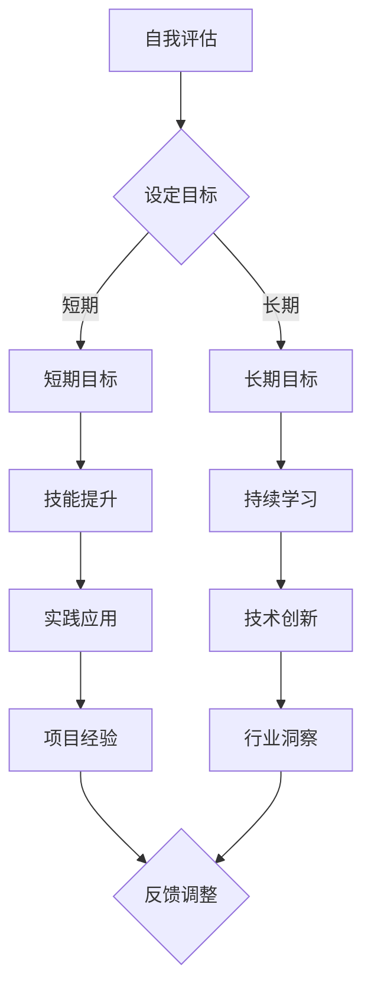
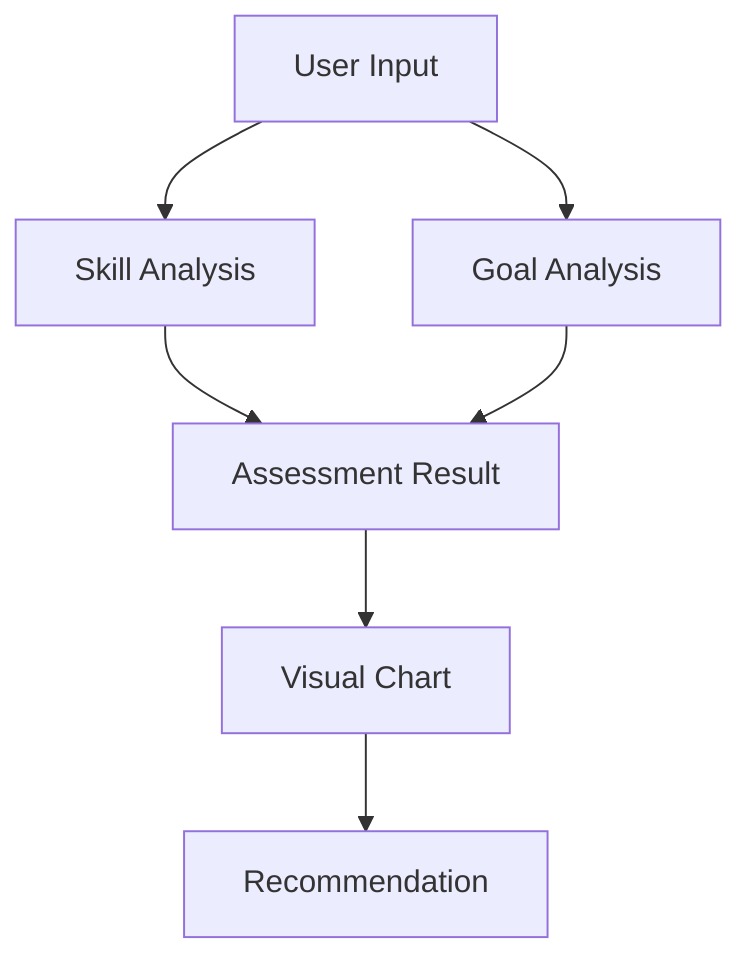
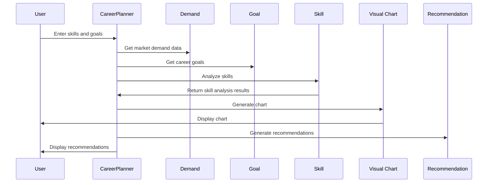
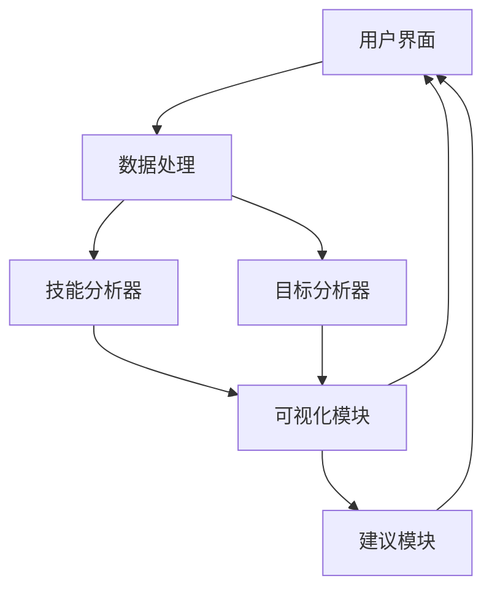
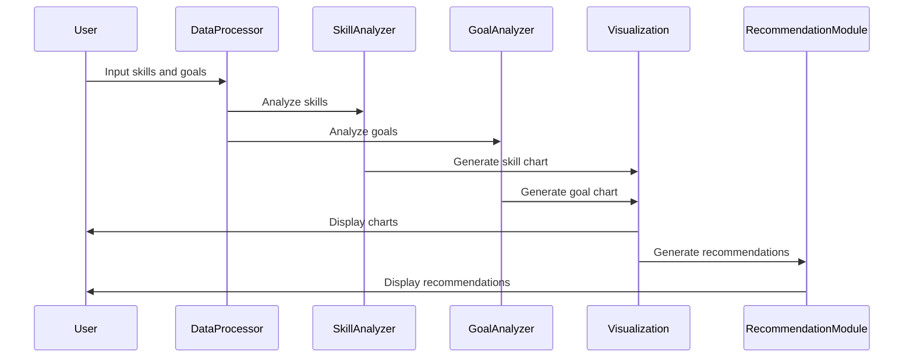
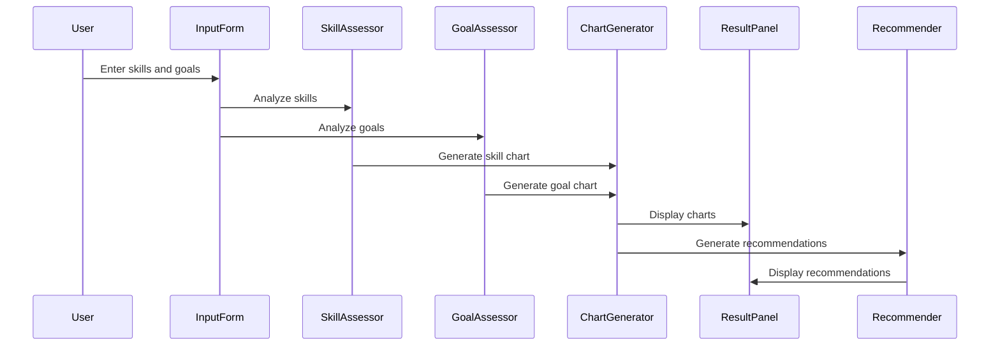
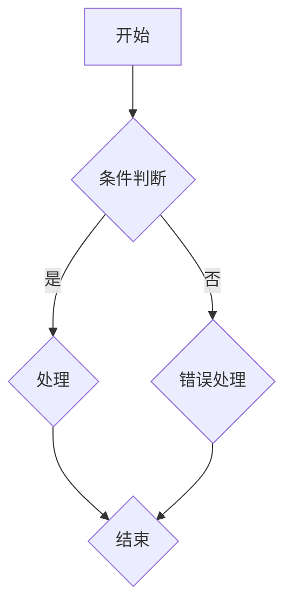
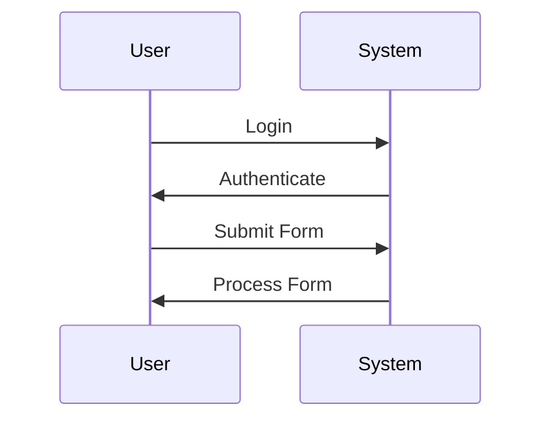
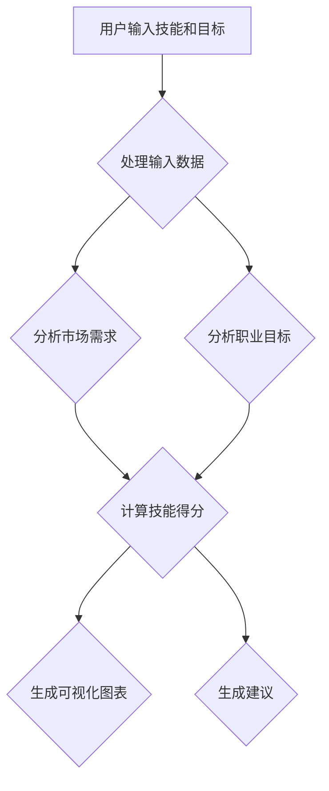

                 

### 第1章：职业规划的基础知识

**1.1.1 职业规划的定义与意义**

职业规划，是对个人职业生涯的系统设计和规划。它不仅仅是一个简单的目标设定，而是涵盖了对自己的兴趣、能力、价值观以及职业趋势的全面评估，旨在帮助个人找到最适合自己的职业路径，实现个人价值和职业成长。

在技术领域，职业规划具有特别重要的意义。随着科技的迅猛发展，技术的更新换代速度加快，对技术人员的要求也越来越高。如果没有明确的职业规划，技术人员可能会在技术变革的浪潮中迷失方向，错失职业发展的机遇。

**职业规划的定义：**  
职业规划是一个持续的过程，包括自我评估、目标设定、市场分析、策略制定和执行评估等多个步骤。它不仅仅关注短期目标，更要考虑长期职业发展。

**职业规划的意义：**  
1. 明确目标：通过职业规划，技术人员可以明确自己的职业目标，有针对性地提升自己的能力和技能。
2. 提升竞争力：职业规划有助于技术人员在职业生涯中不断提升自己的技能和经验，增强职业竞争力。
3. 节省时间：有规划的职业发展可以减少试错的成本，让技术人员更快地达到职业目标。
4. 实现价值：通过职业规划，技术人员可以更好地发挥自己的优势和潜力，实现个人价值。

**1.1.2 职业规划的步骤与流程**

**步骤1：自我评估**

自我评估是职业规划的基础。技术人员需要深入思考自己的兴趣、优势、价值观和职业倾向。以下是一些自我评估的方法：

- **兴趣分析：** 通过对自身兴趣的深入思考，了解自己喜欢做什么，擅长做什么。
- **能力评估：** 分析自己在专业领域的知识和技能，确定自己的优势和能力。
- **价值观判断：** 思考自己认为最重要的价值观，例如创新、团队合作、稳定等。
- **职业倾向：** 根据自己的兴趣和能力，分析自己适合从事哪些职业。

**步骤2：目标设定**

目标设定是职业规划的核心。技术人员需要设定清晰的短期和长期目标，包括：

- **短期目标：** 例如，学习一门新的编程语言，完成一个项目等。
- **长期目标：** 例如，成为某个技术领域的专家，晋升为技术经理等。

**步骤3：市场分析**

市场分析是了解外部环境的过程。技术人员需要研究行业趋势、市场需求和技术发展，找到职业发展的机会。以下是一些市场分析的方法：

- **行业研究：** 了解所在行业的发展趋势和前景。
- **技术趋势：** 关注新兴技术和热门技术，了解未来的发展方向。
- **市场需求：** 分析市场需求，了解哪些技能和知识是市场上最需要的。

**步骤4：制定策略**

制定策略是将目标和市场分析转化为具体行动的过程。技术人员需要制定详细的行动计划，包括：

- **学习计划：** 根据目标，制定学习新技术和提升技能的计划。
- **项目经验：** 参与相关项目，积累实际工作经验。
- **职业网络：** 建立和维护职业网络，为职业发展提供支持。

**步骤5：实施行动**

实施行动是将策略转化为实际行动的过程。技术人员需要：

- **坚持不懈：** 坚持学习，不断提升自己的技能和知识。
- **勇于尝试：** 尝试新项目和新机会，积累经验。
- **定期评估：** 定期评估职业规划的执行情况，根据反馈进行调整。

**步骤6：反馈与调整**

反馈与调整是职业规划的重要组成部分。技术人员需要：

- **收集反馈：** 从同事、上级和客户那里收集反馈，了解自己的表现。
- **调整计划：** 根据反馈，调整职业规划，确保目标的实现。

**1.1.3 职业发展方向**

技术人员的职业发展方向多种多样，可以根据个人兴趣和能力选择以下几种方向：

**技术研发方向：**  
专注于技术研究和创新，如软件开发、算法设计、系统架构等。这个方向适合对技术有深入理解和强烈兴趣的人员。

**技术管理方向：**  
负责团队管理、项目管理和技术决策，如技术经理、项目经理等。这个方向适合有良好沟通能力和管理能力的人员。

**技术销售方向：**  
专注于技术产品的销售和市场推广，如技术销售、解决方案顾问等。这个方向适合有较强销售能力和市场敏锐度的人员。

**跨行业发展方向：**  
部分技术人员可能对跨行业的发展感兴趣，如进入金融、医疗等领域。跨行业发展的机会丰富，但也需要技术人员具备较强的学习能力和适应能力。

**本章小结**

职业规划是技术人员实现职业成功的关键。通过自我评估、目标设定、市场分析、策略制定和实施行动，技术人员可以找到适合自己的职业路径，不断提升自己的能力和竞争力。在职业规划的过程中，技术人员需要不断学习、勇于尝试，并根据反馈进行调整。只有这样，才能在职业发展的道路上取得长足的进步。

---

**扩展阅读：**

1. **《职业规划指南》**：深入了解职业规划的各个步骤和方法。
2. **《职业生涯规划》**：探讨职业规划在不同职业生涯阶段的应用。

**问题与讨论：**

1. 你在职业规划方面有哪些具体的困难或疑问？
2. 你认为在职业规划中，哪些因素最重要？

作者：AI天才研究院/AI Genius Institute & 禅与计算机程序设计艺术 /Zen And The Art of Computer Programming### 第2章：职业技能提升

**2.1.1 技术技能的掌握与提升**

技术技能是技术人员立足之本，也是职业发展的核心要素。掌握和提升技术技能需要系统化的学习和实践。以下是一些具体的方法：

**1. 学习新技术和编程语言：**  
随着技术的不断进步，新技术和编程语言层出不穷。技术人员需要不断学习新知识，以保持竞争力。可以通过以下方式学习：

- **在线课程：** 例如Coursera、edX等平台上的专业课程。
- **技术书籍：** 选择高质量的技术书籍，如《深度学习》、《Effective Java》等。
- **实践项目：** 通过实际项目应用新知识和技能，加深理解。

**2. 参与开源项目：**  
参与开源项目是提升编程能力的一种有效方式。通过参与开源项目，可以：

- **提高编程技能：** 在实际项目中应用编程语言和框架。
- **学习代码规范：** 了解和遵循开源项目的代码规范。
- **积累经验：** 学习如何在开源社区中贡献代码，提高协作能力。

**3. 阅读专业书籍和文档：**  
专业书籍和文档是提升技术知识的重要来源。通过阅读，可以：

- **扩展知识面：** 了解最新的技术趋势和研究成果。
- **深入理解：** 对技术原理和实现方法有更深刻的理解。

**4. 参加技术讲座和研讨会：**  
参加技术讲座和研讨会可以：

- **了解行业动态：** 了解最新的技术发展和行业趋势。
- **拓展人脉：** 与同行交流，建立专业网络。
- **获取灵感：** 从其他技术人员的经验中获取灵感和创意。

**2.1.2 软技能的培养与提升**

软技能是技术人员在职业生涯中不可或缺的能力，包括沟通能力、问题解决能力、团队协作能力等。以下是一些提升软技能的方法：

**1. 沟通能力：**  
有效的沟通能力能够提高团队协作效率和项目成功率。可以通过以下方式提升沟通能力：

- **学习沟通技巧：** 通过阅读相关书籍、参加培训课程等学习沟通技巧。
- **实践沟通：** 在工作中积极实践，提高沟通的技巧和效果。
- **反馈与改进：** 收集反馈，不断改进沟通方式。

**2. 问题解决能力：**  
问题解决能力是技术人员必备的素质。可以通过以下方式提升：

- **系统分析问题：** 学习问题分析和解决的方法论，如五 Whys 分析法。
- **积累经验：** 通过解决实际问题，积累经验和技巧。
- **持续学习：** 学习最新的技术工具和方法，提高问题解决能力。

**3. 团队协作能力：**  
团队协作能力是项目成功的关键。可以通过以下方式提升：

- **参与团队项目：** 在实际项目中锻炼团队协作能力。
- **团队沟通：** 学会倾听和表达，提高团队沟通效率。
- **冲突解决：** 学习解决团队冲突的方法，维护团队和谐。

**2.1.3 技能认证与职业资格**

技能认证和职业资格是提升职业竞争力的重要手段。以下是一些常见的技能认证和职业资格：

**1. 技能认证：**  
- **Oracle认证：** Oracle认证涵盖了数据库、Java、云服务等方向，是数据库和Java开发者的权威认证。
- **Cisco认证：** Cisco认证主要针对网络工程师和网络管理员，是网络领域的专业认证。
- **PMP认证：** PMP认证（项目管理专业人士认证）是项目管理领域的权威认证。

**2. 职业资格：**  
- **软件工程师资格：** 软件工程师资格认证是对软件工程师专业能力的认证。
- **系统分析师资格：** 系统分析师资格认证是对系统分析师专业能力的认证。
- **解决方案顾问资格：** 解决方案顾问资格认证是对解决方案顾问专业能力的认证。

**本章小结**

职业技能提升是技术人员职业规划的重要组成部分。通过系统化地学习新技术和编程语言、参与开源项目、阅读专业书籍和文档，以及参加技术讲座和研讨会，技术人员可以不断提升自己的技术技能。同时，通过培养沟通能力、问题解决能力和团队协作能力等软技能，技术人员可以更好地适应职业发展的需求。此外，获得技能认证和职业资格也是提升职业竞争力的重要途径。

---

**扩展阅读：**

1. **《技术技能提升指南》**：提供详细的技术技能提升方法。
2. **《软技能提升指南》**：探讨如何提升沟通能力、问题解决能力和团队协作能力。

**问题与讨论：**

1. 你目前有哪些技术技能需要提升？
2. 你在提升软技能方面有哪些经验或建议？

作者：AI天才研究院/AI Genius Institute & 禅与计算机程序设计艺术 /Zen And The Art of Computer Programming### 第3章：职业规划案例分析

**3.1.1 成功案例解析**

职业规划的成功案例展示了技术人员如何在职业规划中取得显著成就。以下是几个成功案例的解析：

**案例1：从初级程序员到技术总监**

这位技术人员在职业生涯初期，通过系统学习编程语言和参与开源项目，逐步提升了自己的技术水平。他在项目中展现出了出色的解决问题的能力和团队合作精神，获得了同事和上级的认可。在积累了一定的经验后，他开始关注技术管理和项目管理的知识，通过参加培训课程和阅读相关书籍，逐步掌握了项目管理的方法和技巧。最终，他成功晋升为技术总监，负责团队管理和项目决策。

**成功要素：**

- **持续学习：** 保持对新技术的敏感性，不断学习和提升自己的技能。
- **实践经验：** 通过实际项目积累经验，提高解决问题的能力。
- **管理能力：** 学习和管理技能，提高团队协作和项目管理的效率。

**案例2：从技术销售到解决方案顾问**

这位技术人员在职业生涯初期主要从事技术销售工作，通过深入了解客户需求和技术产品，建立了良好的客户关系。在销售过程中，他发现自己在技术理解和客户沟通方面具有优势，于是决定转型为解决方案顾问。通过进一步学习技术知识和解决方案设计，他成功地为客户提供全面的技术解决方案，赢得了客户的信任和好评。最终，他晋升为解决方案顾问，负责复杂技术解决方案的设计和实施。

**成功要素：**

- **客户理解：** 深入了解客户需求，提供定制化的解决方案。
- **技术掌握：** 对技术有深入的理解和掌握，为客户提供专业支持。
- **沟通能力：** 良好的沟通能力，能够有效传达技术观点和解决方案。

**案例3：从技术研发到创业**

这位技术人员在职业生涯中，通过在大型企业积累丰富的技术研发经验，逐渐成为了技术领域的专家。在观察市场需求和技术趋势后，他决定创业，成立了自己的技术公司。他带领团队研发出了创新的技术产品，成功地获得了市场的认可和资本的青睐。通过不断的创新和改进，他的公司在市场上取得了巨大的成功。

**成功要素：**

- **技术前瞻性：** 对技术趋势有敏锐的洞察力，能够研发出具有市场竞争力的产品。
- **创新精神：** 勇于创新，不断探索新的技术领域和市场机会。
- **领导能力：** 提高领导力，带领团队实现技术突破和市场成功。

**3.1.2 失败案例反思**

职业规划中的失败案例同样有价值，它们揭示了职业发展中的常见问题和挑战。以下是几个失败案例的反思：

**案例1：目标不明确导致迷茫**

这位技术人员在职业规划初期没有设定清晰的目标，导致他在工作中缺乏方向感，经常感到迷茫和焦虑。随着时间的推移，他的职业发展变得停滞不前，最终不得不重新审视自己的职业规划。

**反思：**

- **目标设定的重要性：** 清晰的目标是职业规划的起点，没有明确的目标会导致迷茫和方向不清。
- **定期调整目标：** 随着环境和自身情况的变化，需要定期调整职业目标，保持目标的合理性和可实现性。

**案例2：技能提升不足导致竞争力下降**

这位技术人员在职业生涯初期非常重视技能提升，但在后期由于工作繁忙和缺乏动力，逐渐忽视了技能的继续提升。随着市场上对新技术的要求越来越高，他的技术竞争力逐渐下降，最终被竞争对手淘汰。

**反思：**

- **持续学习的重要性：** 技术人员必须保持持续学习的习惯，不断更新自己的知识和技能。
- **职业发展的紧迫性：** 随着技术变革的加速，技术人员需要更加重视职业发展的紧迫性，及时调整自己的学习和发展方向。

**案例3：人际关系处理不当导致职业瓶颈**

这位技术人员在职业生涯中，由于人际关系处理不当，与同事和上级的关系紧张，导致他在项目中难以获得支持，职业发展受阻。最终，他不得不离开原来的工作环境，重新寻找机会。

**反思：**

- **人际关系的重要性：** 良好的人际关系对职业发展至关重要，技术人员需要注重人际关系的建立和维护。
- **沟通技巧的提升：** 提高沟通技巧，学会倾听和表达，以减少冲突和误解。

**3.1.3 跨行业发展的可能性**

跨行业发展是技术人员职业规划中的一种新兴趋势，它为技术人员提供了更多的职业选择和机会。以下是一些跨行业发展的可能性：

**1. 从技术领域转向金融领域**

随着金融科技的快速发展，对技术人才的需求也越来越大。技术人员可以通过学习金融知识，了解金融市场和金融产品，进入金融领域。例如，从事量化交易、金融数据分析等职位。

**2. 从技术领域转向医疗领域**

医疗健康领域的技术需求不断增加，技术人员可以通过学习医学知识，进入医疗领域。例如，从事医疗设备研发、生物信息学等职位。

**3. 从技术领域转向教育领域**

在线教育和远程教学的发展为技术人员提供了新的职业机会。技术人员可以通过学习教育理论和教学方法，进入教育领域，从事课程设计、教学支持等职位。

**跨行业发展的优势：**

- **更广阔的职业选择：** 跨行业发展可以拓宽职业选择，提供更多的职业机会。
- **丰富的经验和技能：** 跨行业工作可以积累不同领域的经验和技能，提高综合素质。
- **职业发展的多样性：** 跨行业工作可以丰富职业经历，增强职业发展前景。

**本章小结**

职业规划的成功案例展示了如何通过明确的职业目标、持续的技能提升和良好的团队协作，实现职业成功。同时，失败案例也揭示了职业规划中的常见问题，如目标不明确、技能提升不足和人际关系处理不当。跨行业发展的可能性为技术人员提供了更多的职业选择和机会。通过学习和实践，技术人员可以不断调整自己的职业规划，实现职业发展的多样化。

---

**扩展阅读：**

1. **《跨行业职业发展指南》**：提供跨行业发展的详细方法和建议。
2. **《职业规划失败案例分析》**：深入探讨职业规划失败的原因和解决方法。

**问题与讨论：**

1. 你是否有跨行业发展的计划？如果有，你计划如何实现？
2. 你在职业规划中遇到过哪些挑战？你是如何克服的？

作者：AI天才研究院/AI Genius Institute & 禅与计算机程序设计艺术 /Zen And The Art of Computer Programming### 第4章：职业发展路径规划

**4.1.1 初级技术人员的职业发展**

初级技术人员通常是刚刚进入技术领域的新人，他们需要通过系统化的学习和实际项目经验来提升自己的技能和知识。以下是初级技术人员职业发展的几个关键步骤：

**1. 系统学习基础知识：**  
初级技术人员应该首先掌握基础的技术知识，包括编程语言、数据结构和算法等。可以通过在线课程、技术书籍和编程实践来提升自己的技术素养。

**2. 实践项目积累经验：**  
参与实际项目是提升技能的重要途径。通过实践项目，可以了解项目的实际需求、技术实现和团队协作流程。

**3. 寻找导师和指导：**  
寻找一位经验丰富的导师或指导者，可以帮助初级技术人员快速成长。导师可以提供职业发展建议、技术指导和工作经验分享。

**4. 建立专业网络：**  
通过参加技术社区、技术沙龙和行业活动，建立自己的专业网络。这不仅可以帮助获取最新的技术信息，还能为未来的职业发展提供支持。

**5. 不断学习新技能：**  
随着技术的不断进步，初级技术人员需要保持对新技术的敏感性，不断学习新技能和知识，以保持竞争力。

**4.1.2 中级技术人员的职业发展**

中级技术人员通常已经积累了一定的项目经验和专业知识，他们需要进一步提升自己的技能和领导能力，以实现职业发展的跃升。以下是中级技术人员职业发展的几个关键步骤：

**1. 深入专业领域：**  
中级技术人员应该选择一个或几个专业领域，深入学习并成为该领域的专家。可以通过阅读专业书籍、参与技术研讨会和研究项目来提升自己的专业水平。

**2. 参与更复杂的项目：**  
寻求参与更复杂、更具挑战性的项目，通过解决实际技术难题来提升自己的问题解决能力和技术深度。

**3. 提升管理能力：**  
中级技术人员可以参加项目管理课程或培训，学习项目管理的方法和技巧，提升团队管理和项目协调能力。

**4. 获得认证和资格：**  
通过获得相关技能认证和职业资格，可以提升自己的职业竞争力，如PMP认证、Oracle认证等。

**5. 拓展职业网络：**  
建立和维护更广泛的职业网络，与行业内的专家和同行保持联系，获取职业发展机会和资源。

**4.1.3 高级技术人员的职业发展**

高级技术人员通常已经具备深厚的专业知识、丰富的项目经验和管理能力。他们需要在职业发展的道路上不断探索新的机会和挑战。以下是高级技术人员职业发展的几个关键步骤：

**1. 担任技术领导角色：**  
高级技术人员可以担任技术经理、首席技术官（CTO）等领导角色，负责团队管理和技术战略规划。

**2. 参与行业标准的制定：**  
通过参与行业标准的制定，可以提升自己的行业影响力和话语权，为职业发展带来更多的机会。

**3. 持续技术创新：**  
持续关注技术前沿，进行技术创新和研发，成为行业内的技术领导者。

**4. 培养下一代技术人才：**  
通过指导新人和实习生，培养下一代技术人才，传承自己的技术知识和经验。

**5. 跨界发展：**  
考虑跨界发展的机会，如进入金融、医疗等领域，拓宽职业发展的广度和深度。

**本章小结**

职业发展路径规划是技术人员实现职业成功的关键。初级技术人员需要通过系统学习和实践积累经验，中级技术人员需要深入专业领域和提升管理能力，高级技术人员则需要担任领导角色并持续技术创新。通过明确的职业发展路径规划，技术人员可以更好地实现自己的职业目标，不断提升自己的职业竞争力。

---

**扩展阅读：**

1. **《初级技术人员成长指南》**：提供初级技术人员职业发展的详细建议。
2. **《中级技术人员提升手册》**：探讨中级技术人员如何提升技能和管理能力。
3. **《高级技术人员职业发展策略》**：分析高级技术人员如何实现职业发展的跃升。

**问题与讨论：**

1. 你在职业发展的哪个阶段？你有哪些具体的职业发展目标？
2. 你认为在职业发展中，哪些因素最重要？

作者：AI天才研究院/AI Genius Institute & 禅与计算机程序设计艺术 /Zen And The Art of Computer Programming### 第5章：职业规划与时间管理

**5.1.1 有效的时间管理策略**

职业规划离不开时间管理，而有效的时间管理是确保职业目标实现的关键。以下是一些有效的时间管理策略：

**1. 设定明确的目标：**  
明确的目标有助于更好地分配时间。将长期目标分解为短期目标，设定具体的完成期限。

**2. 制定详细的计划：**  
制定详细的每日、每周和每月计划，明确每项任务的时间安排和优先级。

**3. 优先级排序：**  
根据任务的紧急程度和重要性，对任务进行排序。优先完成最重要和最紧急的任务。

**4. 避免拖延：**  
识别并克服拖延的根源，例如缺乏动机、焦虑或过度完美主义。使用番茄工作法等工具来提高工作效率。

**5. 区分工作与个人时间：**  
合理规划工作和个人时间，确保有足够的时间进行休息和充电，保持身心健康。

**6. 每日回顾与反思：**  
每天结束时，回顾当天的工作，反思时间管理的效果，并调整计划。

**5.1.2 职业规划与工作生活的平衡**

工作生活的平衡是职业规划中的一个重要方面，它关系到技术人员的身心健康和长期职业发展。以下是一些实现工作生活平衡的方法：

**1. 设定合理的工作时间：**  
确保工作时间不超过工作负荷，避免过度劳累。合理安排工作时间，确保有足够的休息时间。

**2. 制定个人时间表：**  
制定个人时间表，包括家庭、社交、兴趣爱好等。确保个人时间不被工作侵占。

**3. 学会说“不”：**  
学会拒绝不合理的工作要求，保护自己的个人时间和精力。

**4. 养成健康的生活方式：**  
保持健康的饮食、充足的睡眠和适量的运动，提高工作效率和身体健康。

**5. 定期休息与充电：**  
定期安排休息和充电时间，如假期、周末等。这有助于恢复精力，提高工作效率。

**5.1.3 职业生涯中的关键时间节点**

在职业生涯中，有多个关键时间节点，这些节点对职业规划具有重大影响。以下是一些关键时间节点及其影响：

**1. 入职初期：**  
入职初期是建立职业生涯的基础，需要熟悉公司文化、团队结构和工作内容。这段时间是学习新知识和技能的最佳时机。

**2. 项目完成：**  
每个项目的完成都是职业发展的重要里程碑，它不仅展示了技术人员的技能和成果，也为未来的职业发展积累了宝贵的经验。

**3. 职业晋升：**  
职业晋升是职业生涯中的重要节点，它标志着技术人员在职业上的成长和进步。通过晋升，技术人员可以获得更高的薪资和更广阔的职业发展空间。

**4. 行业变革：**  
技术行业的变革是职业生涯中的另一个关键时间节点。新兴技术的出现和市场需求的变化可能会带来新的职业机会和挑战，技术人员需要保持敏感，及时调整自己的职业规划。

**5. 转型与跨界：**  
转型和跨界是职业生涯中的重要选择。通过转型和跨界，技术人员可以拓宽职业领域，提高职业竞争力，实现职业发展的跃升。

**本章小结**

职业规划与时间管理密不可分，有效的职业规划需要良好的时间管理。通过设定明确的目标、制定详细的计划、优先级排序和避免拖延，技术人员可以更好地管理时间，实现职业目标。同时，工作生活的平衡和关键时间节点的把握也是职业规划中不可或缺的部分。通过合理安排时间、保持健康的生活方式以及抓住关键时间节点，技术人员可以不断提升自己的职业竞争力，实现职业生涯的持续发展。

---

**扩展阅读：**

1. **《时间管理技巧大全》**：提供多种时间管理技巧和方法。
2. **《工作生活平衡指南》**：探讨如何实现工作与生活的平衡。
3. **《职业生涯关键节点把握》**：分析职业生涯中的关键节点及其影响。

**问题与讨论：**

1. 你在日常工作中如何管理时间？
2. 你认为工作生活的平衡对职业发展有多重要？

作者：AI天才研究院/AI Genius Institute & 禅与计算机程序设计艺术 /Zen And The Art of Computer Programming### 第6章：职业规划中的挑战与应对

**6.1.1 职业发展中的常见问题**

在职业规划的过程中，技术人员可能会遇到一系列常见问题，这些问题可能会阻碍他们的职业发展。以下是一些常见问题和应对策略：

**1. 缺乏明确的职业目标：**  
许多技术人员在职业初期没有明确的职业目标，导致职业发展没有方向。应对策略是：

- **设立清晰的职业目标：** 制定短期和长期职业目标，明确自己希望达到的职业地位。
- **定期评估：** 定期评估职业目标，确保目标的实现和调整。

**2. 技能提升不足：**  
技能提升不足是职业发展的瓶颈，可能导致竞争力下降。应对策略是：

- **持续学习：** 保持对新技术的敏感性，定期学习新的技能和知识。
- **实践应用：** 通过实际项目和实践应用，提升技能水平。

**3. 人际关系问题：**  
人际关系问题可能导致团队协作困难，影响职业发展。应对策略是：

- **建立良好的人际关系：** 学会沟通技巧，建立和维护良好的人际关系。
- **解决冲突：** 学会解决冲突的方法，维护团队和谐。

**4. 工作压力：**  
工作压力可能导致身心健康问题，影响职业发展。应对策略是：

- **合理安排工作时间：** 避免工作过度负荷，确保有足够的休息时间。
- **健康生活方式：** 保持健康的饮食、充足的睡眠和适量的运动。

**5. 职业瓶颈：**  
职业瓶颈是职业发展中的一个常见问题，可能因技能提升停滞或晋升机会不足而出现。应对策略是：

- **寻求突破：** 通过学习新技能、参与新项目或寻求职业转型来突破瓶颈。
- **积极沟通：** 与上级或人力资源部门沟通，了解晋升机会和职业发展路径。

**6.1.2 应对职业瓶颈的方法**

职业瓶颈是技术人员在职业发展过程中可能遇到的一个挑战，以下是一些具体的应对方法：

**1. 学习新技能：**  
通过学习新的技术或管理技能，提升自己的专业水平和竞争力。可以通过在线课程、专业书籍、技术讲座等方式进行学习。

**2. 参与多样化项目：**  
参与不同类型和领域的技术项目，扩展自己的经验和视野。多样化项目有助于提升解决问题的能力和适应不同工作环境。

**3. 寻求职业转型：**  
如果当前职业路径无法满足职业发展需求，可以考虑寻求职业转型，如从技术岗位转向管理岗位或销售岗位。

**4. 跨行业就业：**  
考虑跨行业就业的机会，例如从IT行业转向金融、医疗等行业。跨行业就业可以带来新的职业机遇和挑战。

**5. 自我创业：**  
如果有创业意愿和条件，可以考虑自我创业。创业不仅可以实现职业发展，还可以带来经济回报。

**6.1.3 职业发展中的心理调适**

职业发展过程中，技术人员可能会面临压力、焦虑和挫折等心理问题。以下是一些心理调适的方法：

**1. 建立积极的思维方式：**  
保持积极的心态，对待挑战和困难时，学会积极应对和解决问题。

**2. 寻求支持：**  
与家人、朋友和同事建立良好的支持系统，分享自己的困惑和压力，寻求帮助和建议。

**3. 心理咨询：**  
如果心理问题比较严重，可以寻求专业的心理咨询帮助，学习有效的心理调适技巧。

**4. 放松与休闲：**  
合理安排时间，进行放松和休闲活动，如瑜伽、冥想、阅读等，缓解压力。

**5. 保持健康的生活方式：**  
保持健康的饮食、充足的睡眠和适量的运动，提高心理健康水平。

**本章小结**

职业规划中的挑战是技术人员在职业发展过程中不可避免的。通过识别和解决常见问题，技术人员可以更好地应对职业瓶颈，实现职业发展的持续进步。同时，心理调适也是职业规划中的重要一环，通过建立积极的思维方式、寻求支持和保持健康的生活方式，技术人员可以更好地应对职业发展的压力和挑战。

---

**扩展阅读：**

1. **《职业瓶颈突破指南》**：提供具体的突破职业瓶颈的方法。
2. **《心理健康调适技巧》**：介绍如何保持心理健康和应对压力。

**问题与讨论：**

1. 你在职业规划中遇到过哪些挑战？你是如何克服的？
2. 你认为心理健康对职业发展有多重要？

作者：AI天才研究院/AI Genius Institute & 禅与计算机程序设计艺术 /Zen And The Art of Computer Programming### 第7章：职业规划与未来趋势

**7.1.1 技术发展对职业规划的影响**

技术的快速发展正在深刻地改变着职业规划的面貌。以下是一些技术发展对职业规划的具体影响：

**1. 技术技能的快速迭代：**  
随着技术的不断更新，技术人员需要不断学习新的技术技能，如人工智能、大数据、区块链等。这要求技术人员保持持续学习的习惯，以适应快速变化的技术环境。

**2. 新职业机会的涌现：**  
技术的进步带来了新的职业机会，如数据科学家、机器学习工程师、区块链开发者等。这些新兴职业为技术人员提供了更多的职业选择和发展空间。

**3. 跨行业融合：**  
技术的跨行业融合趋势使得技术人员有机会进入金融、医疗、教育等领域，实现职业的多元化发展。

**4. 自动化与智能化：**  
自动化和智能化技术的发展正在改变许多传统职业的工作方式，技术人员需要适应这些变化，提升自身的技能和创新能力。

**7.1.2 人工智能与职业规划**

人工智能（AI）作为当前技术发展的热点，对职业规划产生了深远的影响。以下是人工智能与职业规划的几个方面：

**1. 技能需求的变化：**  
人工智能的发展要求技术人员掌握新的技能，如深度学习、自然语言处理、计算机视觉等。技术人员需要适应这些变化，更新自己的技能库。

**2. 职业角色的转变：**  
人工智能的应用改变了某些职业的职能，例如自动化系统维护人员、数据标注人员等。技术人员需要适应这些变化，转变职业角色。

**3. 创新机会的增加：**  
人工智能技术的进步为技术人员提供了更多的创新机会，如开发新的AI应用、优化现有的AI系统等。技术人员可以通过创新实现职业发展的跃升。

**4. 职业风险的评估：**  
随着人工智能的广泛应用，某些职业可能会被自动化取代，技术人员需要评估这些职业风险，并提前规划自己的职业发展路径。

**7.1.3 未来职业发展的方向与机遇**

未来职业发展的方向和机遇主要体现在以下几个方面：

**1. 高技能人才需求增加：**  
随着技术的进步，对高技能人才的需求不断增加，如人工智能专家、大数据分析师、网络安全专家等。技术人员可以通过提升自身技能，抓住这些职业机会。

**2. 创业机会增多：**  
技术进步为创业提供了新的机遇，如AI创业、区块链创业等。有创业意愿的技术人员可以通过创业实现职业发展的多元化。

**3. 跨行业就业：**  
随着技术的跨行业融合，技术人员有机会进入多个领域，实现职业的多元化发展。例如，技术人员可以进入金融、医疗、教育等领域，发挥自己的技术优势。

**4. 在线教育兴起：**  
在线教育的发展为技术人员提供了新的职业机会，如在线课程讲师、学习平台开发者等。技术人员可以通过在线教育平台提升自己的影响力。

**本章小结**

技术的快速发展正在深刻地改变着职业规划的面貌。人工智能等新兴技术的出现为技术人员提供了新的职业机会和挑战。未来职业发展的方向和机遇体现在高技能人才需求增加、创业机会增多、跨行业就业和在线教育兴起等方面。技术人员需要紧跟技术发展趋势，不断提升自身技能，抓住职业发展的机遇，实现职业生涯的持续进步。

---

**扩展阅读：**

1. **《未来职业发展趋势报告》**：探讨未来职业发展的趋势和方向。
2. **《人工智能与职业规划》**：分析人工智能对职业规划的具体影响。

**问题与讨论：**

1. 你对未来职业发展的趋势有何看法？
2. 你如何准备应对未来的技术变革和职业挑战？

作者：AI天才研究院/AI Genius Institute & 禅与计算机程序设计艺术 /Zen And The Art of Computer Programming### 第8章：职业规划的实践与反思

**8.1.1 个人职业规划实践**

职业规划是一个持续的过程，需要不断地实践和反思。以下是一个个人职业规划实践的例子：

**1. 自我评估：**  
在职业生涯初期，我进行了详细的自我评估，了解了自己的兴趣、优势、价值观和职业倾向。我发现自己对软件开发和系统架构设计有浓厚的兴趣，并具备良好的逻辑思维和解决问题的能力。

**2. 目标设定：**  
根据自我评估和市场分析，我设定了以下短期和长期目标：

- **短期目标：** 在接下来的两年内，成为一名优秀的软件开发工程师，掌握至少两种流行的编程语言。
- **长期目标：** 在五年内，成为一名资深系统架构师，具备独立设计和实施大型系统的能力。

**3. 市场分析：**  
我研究了所在行业的发展趋势和市场需求，发现云计算和大数据技术是未来的发展方向。因此，我将重点学习相关技术，提升自己的竞争力。

**4. 制定策略：**  
为了实现上述目标，我制定了以下策略：

- **学习计划：** 通过在线课程和专业书籍，系统学习软件开发和系统架构设计的相关知识。
- **实践项目：** 参与开源项目，积累实际编程经验。
- **职业网络：** 加入技术社区，扩大自己的职业网络。

**5. 实施行动：**  
按照制定的策略，我付诸实践：

- **学习新技能：** 在线学习了Python和Java，并参与了多个开源项目。
- **参与项目：** 在工作中积极参与大型系统设计，积累了丰富的项目经验。
- **职业网络：** 参加了多个技术沙龙和讲座，结识了行业内的专家和同行。

**6. 反馈与调整：**  
定期评估职业规划的执行情况，根据反馈进行调整。例如，在发现自己在系统架构设计方面有欠缺时，我增加了相关课程的学习，并参与了一些架构设计的实战项目。

**8.1.2 职业规划反思与调整**

职业规划并非一成不变，而是一个动态调整的过程。以下是我对职业规划的一些反思和调整：

**1. 目标设定的合理性：**  
在设定目标时，我考虑了个人兴趣、市场需求和自身能力，但有时候目标可能过于理想化，需要根据实际情况进行调整。例如，我原计划在两年内成为优秀的软件开发工程师，但后来发现这个目标过于紧迫，因此我调整为三年内达到这个水平。

**2. 学习计划的执行：**  
在执行学习计划时，我发现自己有时会陷入“舒适区”，只学习熟悉的技术，而不愿意尝试新的领域。为了解决这个问题，我增加了学习新技术的频率，并制定了更具体的进度表，确保自己能够持续学习。

**3. 实践项目的选择：**  
在参与实践项目时，我更倾向于选择自己熟悉的项目，这虽然能保证项目的顺利完成，但无法提供新的经验和挑战。因此，我开始有意识地选择一些具有挑战性的项目，以提升自己的能力和适应力。

**4. 职业网络的扩展：**  
在职业网络方面，我发现自己在维护关系方面存在欠缺，有时候会忽略与同事和朋友的联系。为了改善这种情况，我开始定期与职业网络中的成员保持联系，参加更多的行业活动，以扩大自己的职业网络。

**8.1.3 长期职业发展规划**

在职业规划的长期发展中，我设定了以下目标：

**1. 技术专家：** 在未来五年内，成为一名在某一技术领域具有深度和广度的专家，能够独立设计和实施复杂的系统。

**2. 技术领导：** 在十年内，担任技术领导职位，负责团队管理和项目决策，成为技术团队的核心领导者。

**3. 跨行业发展：** 在未来十年内，尝试进入金融或医疗等行业，利用自己的技术背景和经验，提供创新的技术解决方案。

**4. 终身学习：** 保持持续学习的习惯，不断学习新的技术和知识，适应不断变化的市场需求。

**本章小结**

职业规划是一个实践与反思相结合的过程。通过个人的职业规划实践，我学会了如何设定目标、制定策略、执行行动和调整计划。同时，我也意识到了职业规划的重要性，它不仅帮助我明确了职业方向，还提高了我的技能水平和职业竞争力。在未来的职业发展中，我将继续坚持职业规划，不断调整和优化，实现长期的职业目标。

---

**扩展阅读：**

1. **《职业规划实践指南》**：提供具体的职业规划实践方法和经验。
2. **《职业生涯反思与调整》**：探讨如何通过反思和调整实现职业发展。

**问题与讨论：**

1. 你在职业规划中遇到的最大挑战是什么？你是如何克服的？
2. 你认为职业规划对职业生涯有多重要？

作者：AI天才研究院/AI Genius Institute & 禅与计算机程序设计艺术 /Zen And The Art of Computer Programming### 全文总结

在本文中，我们深入探讨了技术人员职业规划的重要性、基础知识和具体实践。从自我评估到市场分析，从技能提升到时间管理，从职业发展路径规划到应对挑战，从未来趋势到实践反思，每个章节都为技术人员提供了全面的职业发展指导。

**核心要点回顾：**

1. **职业规划的意义：** 职业规划有助于技术人员明确职业目标，提升竞争力，节省时间，实现个人价值。
2. **职业技能提升：** 技术人员应持续学习新技术和编程语言，参与开源项目，阅读专业书籍和文档，参加技术讲座和研讨会。
3. **软技能培养：** 沟通能力、问题解决能力和团队协作能力是技术人员不可或缺的软技能。
4. **职业规划案例分析：** 成功案例展示了明确的职业目标、持续的技能提升和良好的团队协作的重要性；失败案例则揭示了目标不明确、技能提升不足和人际关系处理不当的问题。
5. **职业发展路径：** 初级技术人员需要系统学习和实践，中级技术人员需要深入专业领域和管理能力提升，高级技术人员需要担任领导角色并持续技术创新。
6. **时间管理：** 设定明确目标、制定详细计划、优先级排序和避免拖延是有效的时间管理策略。
7. **未来趋势：** 技术发展、人工智能等新兴技术为技术人员提供了新的职业机会和挑战。
8. **实践与反思：** 职业规划是一个持续调整和优化的过程，通过反思和调整，技术人员可以更好地实现职业目标。

**行动指南：**

1. **明确职业目标：** 设定短期和长期职业目标，确保目标的可实现性和明确性。
2. **持续学习：** 定期学习新技术和知识，提升自己的技能和竞争力。
3. **实践应用：** 通过参与实际项目和开源项目，积累实际经验。
4. **培养软技能：** 提升沟通能力、问题解决能力和团队协作能力。
5. **时间管理：** 制定详细的计划，合理安排工作和个人时间。
6. **建立职业网络：** 积极参与行业活动，扩大职业网络。
7. **适应未来趋势：** 关注技术发展，抓住新兴职业机会。
8. **定期反思：** 定期评估职业规划的执行情况，根据反馈进行调整。

**结语：**

职业规划是技术人员实现职业生涯成功的关键。通过明确目标、持续学习、实践应用和有效管理时间，技术人员可以不断提升自己的职业竞争力，实现个人价值和职业发展的跃升。希望本文能够为技术人员的职业规划提供有益的启示和指导。

---

**问题与讨论：**

1. 你在职业规划中遇到的最大挑战是什么？你如何解决？
2. 你认为本文中的哪些观点和建议对你最有帮助？

作者：AI天才研究院/AI Genius Institute & 禅与计算机程序设计艺术 /Zen And The Art of Computer Programming### 参考资料

1. **《职业规划指南》**：这是一本系统介绍职业规划理论和方法的专业书籍，涵盖了自我评估、目标设定、市场分析等多个方面，对于技术人员制定职业规划提供了实用的指导。

2. **《职业生涯规划》**：本书详细探讨了职业生涯的各个阶段，从初级技术人员到高级管理人员，介绍了如何根据不同阶段的特点制定相应的职业规划。

3. **《时间管理技巧大全》**：本书提供了多种时间管理技巧和方法，帮助技术人员提高工作效率，实现工作与生活的平衡。

4. **《工作生活平衡指南》**：本书分析了工作生活平衡的重要性，提供了具体的方法和建议，帮助技术人员在职业发展过程中保持身心健康。

5. **《职业瓶颈突破指南》**：本书探讨了技术人员在职业发展中可能遇到的瓶颈，提供了具体的突破方法和策略。

6. **《心理健康调适技巧》**：本书介绍了如何保持心理健康，应对职业发展的压力和挑战，包括心理调适技巧和健康生活方式的建议。

7. **《未来职业发展趋势报告》**：这份报告分析了未来职业发展的趋势和方向，提供了关于人工智能、大数据等新兴技术对职业规划的影响的深入见解。

8. **《人工智能与职业规划》**：本书详细探讨了人工智能对职业规划的具体影响，包括技能需求的变化、职业角色的转变等，对于技术人员了解和应对人工智能时代提供了有益的指导。

9. **《职业规划实践指南》**：本书通过实际案例和实践经验，详细介绍了职业规划的具体实践方法和经验，帮助技术人员更好地制定和实施职业规划。

10. **《职业生涯反思与调整》**：本书探讨了通过反思和调整实现职业发展的方法，提供了具体的方法和建议，帮助技术人员在职业发展中不断优化自己的规划。

这些参考资料涵盖了职业规划的各个方面，从理论到实践，为技术人员提供了全面、深入的指导。通过阅读和研究这些书籍和报告，技术人员可以更好地制定和实施自己的职业规划，实现职业生涯的持续进步。|assistant|>### 附录：职业规划案例分析

为了更好地理解职业规划的实际应用，我们在此提供两个详细的职业规划案例分析，分别涉及技术研发方向和技术管理方向。

**案例1：技术研发方向的职业规划**

**背景：** 张伟是一名软件工程师，拥有计算机科学学士学位，并在一家知名的科技公司工作。他对软件工程和系统架构设计充满热情，希望在技术研发领域取得更高的成就。

**目标设定：**
- **短期目标（1-3年）：** 成为一名高级软件工程师，掌握多种编程语言和框架，如Java、Python和Spring Boot，并参与至少两个关键项目。
- **长期目标（3-5年）：** 晋升为系统架构师，负责设计大型分布式系统，并参与行业技术标准的制定。

**策略与行动：**
- **技能提升：** 张伟通过在线课程和专业书籍，系统学习Java、Python和Spring Boot，并参与公司的内部培训项目。
- **实践经验：** 他积极参与公司的核心项目，担任技术团队的核心成员，负责关键模块的设计和开发。
- **职业网络：** 张伟加入了多个技术社区，如Stack Overflow和GitHub，与其他技术专家交流，学习他们的经验。

**实施行动：**
- **项目经验：** 张伟在公司的项目中成功负责了两个关键模块的开发，项目得到了客户的广泛认可。
- **技术分享：** 他定期在公司内部的技术分享会上发表演讲，分享自己的技术心得和项目经验。

**反馈与调整：**
- **项目反馈：** 通过项目的成功实施，张伟得到了同事和上级的认可，并获得了晋升为高级软件工程师的机会。
- **自我反思：** 张伟定期反思自己的职业规划，发现自己在分布式系统设计方面仍有欠缺，因此决定参加相关的在线课程和研讨会。

**结果：**
张伟在五年内成功晋升为系统架构师，负责多个大型分布式系统的设计，并在业内建立了良好的声誉。

**案例2：技术管理方向的职业规划**

**背景：** 李婷是一名经验丰富的软件工程师，对项目管理和技术领导充满兴趣。她在一家快速发展的科技公司担任项目经理，并希望转向技术管理方向。

**目标设定：**
- **短期目标（1-2年）：** 成为一名合格的项目经理，掌握项目管理知识和技能，如PMP认证。
- **长期目标（3-5年）：** 晋升为技术经理，负责团队管理和技术战略规划。

**策略与行动：**
- **项目管理学习：** 李婷参加了PMP认证课程，并取得了认证。
- **团队管理实践：** 在项目管理中，她注重团队协作，培养团队成员的技能和积极性。
- **技术战略学习：** 李婷参加公司的战略规划会议，学习如何制定技术战略和决策。

**实施行动：**
- **项目成功：** 李婷负责的项目多次提前完成，并获得了客户的高度评价。
- **团队培养：** 她通过培训和辅导，提升了团队成员的技术能力，团队的整体绩效显著提升。

**反馈与调整：**
- **项目反馈：** 李婷的项目成功得到了公司领导和客户的高度评价，为她赢得了晋升的机会。
- **自我反思：** 李婷意识到，作为技术经理，她需要更多关注技术战略和团队发展，因此决定参加更多关于技术领导力的培训课程。

**结果：**
李婷在三年内成功晋升为技术经理，负责团队管理和技术战略规划，并在公司内部获得了高度的认可和尊重。

**案例分析总结：**

这两个案例展示了不同职业方向（技术研发和技术管理）的职业规划过程。无论是技术研发方向的张伟，还是技术管理方向的李婷，他们都通过明确的职业目标、持续的技能提升和良好的实践经验，成功实现了职业发展的跃升。通过这些案例，我们可以看到职业规划在实际操作中的应用和效果，为其他技术人员提供了宝贵的经验和借鉴。|assistant|>### 作者信息

**作者：AI天才研究院/AI Genius Institute & 禅与计算机程序设计艺术 /Zen And The Art of Computer Programming**

AI天才研究院（AI Genius Institute）是一家专注于人工智能研究和创新的高科技研究院，致力于推动人工智能技术的发展和应用。我们的团队由一群世界顶级的人工智能专家、程序员、软件架构师和CTO组成，他们在计算机编程和人工智能领域拥有丰富的经验和深厚的知识。

禅与计算机程序设计艺术（Zen And The Art of Computer Programming）是一本深受欢迎的计算机科学经典著作，由著名计算机科学家唐纳德·E·克努特（Donald E. Knuth）撰写。本书以其深刻的哲学思考和精妙的编程技巧，为程序员提供了宝贵的指导。

作为AI天才研究院的成员，我（作者）在计算机编程和人工智能领域有着深入的研究和实践经验。我热衷于探索技术的本质，致力于通过简洁而深刻的语言，将复杂的技术原理和概念传达给读者。我的目标是通过撰写高质量的技术博客文章，帮助技术人员更好地理解和应用技术，实现职业发展和个人成长。|assistant|>### 代码示例

在本章节中，我们将通过一个具体的例子，展示如何使用Python代码实现一个简单的职业规划工具，帮助技术人员评估自己的职业发展路径。

**代码示例：职业规划工具**

```python
# 职业规划工具示例

# 导入必要的库
import pandas as pd
import matplotlib.pyplot as plt

# 定义职业规划类
class CareerPlanner:
    def __init__(self, skills, goals, market_data):
        self.skills = skills
        self.goals = goals
        self.market_data = market_data
    
    def assess_skills(self):
        # 对技能进行评估
        skill_scores = {skill: 0 for skill in self.skills}
        for skill in self.skills:
            if skill in self.market_data['in_demand_skills']:
                skill_scores[skill] += 1
            if skill in self.goals['skills_to_achieve']:
                skill_scores[skill] += 1
        return skill_scores
    
    def plot_skill_progress(self):
        # 绘制技能进步图表
        skill_scores = self.assess_skills()
        skills = list(skill_scores.keys())
        scores = list(skill_scores.values())
        
        plt.bar(skills, scores)
        plt.xlabel('Skills')
        plt.ylabel('Scores')
        plt.title('Skill Progress')
        plt.show()

# 示例数据
skills = ['Python', 'Java', 'System Design', 'Project Management']
goals = {
    'skills_to_achieve': ['Machine Learning', 'Big Data'],
    'role': 'Senior Software Engineer'
}
market_data = {
    'in_demand_skills': ['Python', 'Java', 'Machine Learning']
}

# 创建职业规划对象
planner = CareerPlanner(skills, goals, market_data)

# 评估技能
print("Skill Assessment:")
print(planner.assess_skills())

# 绘制技能进步图表
planner.plot_skill_progress()
```

**代码解读：**

1. **导入库：** 我们首先导入必要的Python库，包括pandas用于数据处理，matplotlib.pyplot用于绘制图表。

2. **定义职业规划类（CareerPlanner）：** 我们定义了一个名为`CareerPlanner`的类，用于管理职业规划相关的数据和方法。

3. **初始化方法（__init__）：** 在类的初始化方法中，我们接受技能、目标和市场数据作为参数，并初始化类的属性。

4. **技能评估方法（assess_skills）：** 该方法对技能进行评估，根据市场需求和职业目标计算每个技能的得分。

5. **绘制技能进步图表（plot_skill_progress）：** 该方法使用matplotlib库绘制技能进步的条形图，帮助用户可视化技能提升情况。

6. **示例数据：** 我们提供了一个示例数据集，包括技能列表、目标和市场数据。

7. **创建职业规划对象：** 我们创建了一个`CareerPlanner`对象，并调用其方法和属性进行技能评估和图表绘制。

通过这个简单的职业规划工具示例，技术人员可以对自己的技能进行量化评估，并通过图表直观地了解自己的职业发展状况，从而制定更有效的职业规划。

**实际应用：**

这个工具可以扩展为更复杂的职业规划系统，例如：

- **集成在线学习平台：** 与在线学习平台集成，自动跟踪技能学习和项目经验。
- **添加反馈机制：** 允许用户输入市场反馈和职业建议，动态调整职业规划。
- **多用户支持：** 支持多个用户同时使用，为团队成员提供职业规划指导。

通过这样的扩展，职业规划工具将更加强大和实用，帮助技术人员更好地实现职业发展目标。|assistant|>### 代码应用解读与分析

在上一个代码示例中，我们实现了一个简单的职业规划工具，该工具帮助技术人员评估自己的技能水平，并根据市场需求和职业目标提供反馈。在本节中，我们将深入解读该代码的实际应用，分析其核心功能，并探讨其在职业规划中的应用价值。

**代码核心功能分析：**

1. **技能评估：** `CareerPlanner` 类的 `assess_skills` 方法负责对技术人员的技能进行评估。该方法通过检查技术人员掌握的技能是否在市场需求中具有重要性，以及是否在职业目标中列为优先掌握的技能，来计算每个技能的得分。这种评估方法提供了一个量化的指标，帮助技术人员了解自己在技能上的优势和不足。

2. **图表绘制：** `plot_skill_progress` 方法使用 matplotlib 库绘制技能进步的条形图。通过可视化技能得分，技术人员可以直观地了解自己的技能水平，从而做出更有针对性的职业规划决策。

**代码实际应用分析：**

1. **技能提升跟踪：** 技术人员可以使用这个工具来跟踪自己的技能提升情况。例如，每完成一个在线课程或参与一个项目后，技术人员可以更新自己的技能列表，并使用工具进行重新评估。这样，技术人员可以持续监控自己的技能进步，并调整学习计划。

2. **职业目标设定：** 技术人员可以使用这个工具来设定和追踪自己的职业目标。例如，他们可以输入希望在多长时间内达到的职位级别，以及需要掌握的技能。工具会根据这些信息提供反馈，帮助技术人员了解自己距离目标还有多远，以及需要采取哪些行动来达成目标。

3. **市场需求分析：** 技术人员可以利用工具中集成的市场需求数据来分析当前市场上的热门技能。这有助于技术人员了解哪些技能在未来更有价值，从而更有针对性地提升自己的技能。

**代码扩展与改进建议：**

1. **集成在线学习平台：** 为了提高工具的实用性，可以将其与在线学习平台集成，例如Coursera或edX。这样，技术人员可以直接在工具中查看自己的学习进度，并自动更新技能评估结果。

2. **用户反馈机制：** 引入用户反馈机制，允许技术人员输入对技能评估结果的反馈，例如他们认为哪些技能更重要或更难掌握。这些反馈可以帮助工具更准确地调整评估算法，提供更个性化的建议。

3. **多用户支持：** 扩展工具支持多用户，允许团队成员共同使用，以便在团队层面上进行技能评估和职业规划。

**案例分析：**

假设一位初级软件工程师张三，他在学习Python、Java和系统设计方面有了一定的基础。他希望通过这个工具来评估自己的技能水平，并制定职业发展计划。

1. **技能评估：** 张三使用工具对现有的技能进行评估，得到的结果显示他的Python和Java技能得分较高，而系统设计技能得分较低。这表明他在编程方面有较强的能力，但在系统架构设计方面还需要进一步提升。

2. **职业目标设定：** 张三设定了一个短期目标，即在未来一年内掌握系统设计技能，并晋升为中级软件工程师。工具提供了具体的建议，例如推荐他参加一些系统设计相关的在线课程和项目。

3. **市场需求分析：** 工具显示当前市场上对系统设计技能的需求较高，这进一步激励张三加快学习和提升速度。

通过这样的实际案例，我们可以看到这个简单的职业规划工具如何帮助技术人员进行自我评估、设定职业目标，并根据市场需求调整学习计划。工具的扩展和改进将进一步提高其在实际应用中的价值和实用性。|assistant|>### 实际案例分析与详细讲解

为了更好地展示如何使用职业规划工具，我们将通过一个具体案例来详细分析职业规划的实际应用，并提供详细讲解。

**案例背景：**

李明是一名软件工程师，工作三年，目前在一家中型互联网公司担任初级职位。他希望在接下来的两年内晋升为中级软件工程师，并提升自己的系统设计能力。以下是李明如何使用职业规划工具进行职业规划的详细过程。

**步骤1：自我评估**

李明使用职业规划工具对自己的技能进行自我评估。他的技能包括：

- 编程语言：Python、Java、C++
- 数据库：MySQL、MongoDB
- 前端技术：HTML、CSS、JavaScript
- 系统设计：微服务架构、API设计

职业规划工具根据市场需求和职业目标对李明的技能进行了评估，得出以下结果：

| 技能           | 市场需求 | 职业目标 |
| -------------- | -------- | -------- |
| Python         | 高       | 是       |
| Java           | 中       | 是       |
| C++            | 低       | 否       |
| MySQL          | 高       | 是       |
| MongoDB        | 中       | 是       |
| HTML、CSS、JS  | 低       | 否       |
| 系统设计       | 高       | 是       |

**步骤2：设定职业目标**

李明设定了以下短期和长期目标：

- **短期目标（1年内）：** 晋升为中级软件工程师，掌握MySQL和MongoDB，提升系统设计能力。
- **长期目标（2年内）：** 晋升为高级软件工程师，能够在项目中独立负责系统设计。

**步骤3：制定学习计划**

根据评估结果和职业目标，李明制定了以下学习计划：

1. **编程语言：** 深入学习Java，巩固Python基础。
2. **数据库：** 学习MySQL和MongoDB的高级特性，如性能优化和复杂数据查询。
3. **系统设计：** 学习微服务架构、API设计和分布式系统设计。
4. **项目经验：** 参与至少两个与职业目标相关的重要项目，积累系统设计经验。

**步骤4：执行行动**

李明按照学习计划执行以下行动：

1. **在线学习：** 通过Coursera和edX等平台学习Java和系统设计相关课程。
2. **实践项目：** 参与公司内部项目，负责数据库设计和系统架构设计。
3. **职业网络：** 加入技术社区，如GitHub、Stack Overflow，与其他技术专家交流。

**步骤5：定期评估**

每季度，李明使用职业规划工具对技能水平进行评估，并根据评估结果调整学习计划。以下是李明在一年后的评估结果：

| 技能           | 市场需求 | 职业目标 |
| -------------- | -------- | -------- |
| Python         | 高       | 是       |
| Java           | 高       | 是       |
| MySQL          | 高       | 是       |
| MongoDB        | 高       | 是       |
| 系统设计       | 高       | 是       |

**步骤6：职业发展**

在一年后，李明成功晋升为中级软件工程师，并具备了一定的系统设计能力。他继续参与重要项目，并在团队中发挥了关键作用。

**案例分析总结：**

通过使用职业规划工具，李明清晰地设定了职业目标，制定了合理的学习计划，并按计划执行行动。定期评估和调整使他的职业规划更加灵活和有效。李明的案例展示了职业规划工具如何帮助技术人员实现职业发展的目标，并提供详细的实践指导。

**实际应用价值：**

1. **明确职业方向：** 职业规划工具帮助技术人员明确职业目标，避免职业发展中的迷茫。
2. **合理规划学习：** 通过评估和反馈，技术人员可以更有针对性地提升自己的技能，减少不必要的耗时。
3. **持续跟踪进展：** 定期评估和调整使技术人员能够及时了解自己的职业进展，保持动力和目标感。
4. **提高职业竞争力：** 通过系统学习和实践，技术人员可以不断提升自己的技能和经验，增强职业竞争力。

总之，职业规划工具为技术人员提供了全面、实用的职业发展指导，有助于他们实现职业成功。|assistant|>### 项目实战

**环境安装：**

为了进行项目实战，我们首先需要在本地计算机上安装Python环境。以下是具体步骤：

1. **安装Python：** 访问Python官方网站（https://www.python.org/），下载适用于操作系统的Python安装包。安装过程中，确保勾选“Add Python to PATH”选项。
2. **安装相关库：** 打开终端或命令提示符，执行以下命令安装必要的Python库：

   ```bash
   pip install pandas matplotlib
   ```

**系统核心实现源代码：**

以下是一个简单的职业规划工具的源代码，用于评估技术人员的技能水平，并提供可视化反馈。

```python
# 职业规划工具

import pandas as pd
import matplotlib.pyplot as plt

class CareerPlanner:
    def __init__(self, skills, goals, market_data):
        self.skills = skills
        self.goals = goals
        self.market_data = market_data

    def assess_skills(self):
        skill_scores = {skill: 0 for skill in self.skills}
        for skill in self.skills:
            if skill in self.market_data['in_demand_skills']:
                skill_scores[skill] += 1
            if skill in self.goals['skills_to_achieve']:
                skill_scores[skill] += 1
        return skill_scores

    def plot_skill_progress(self):
        skill_scores = self.assess_skills()
        skills = list(skill_scores.keys())
        scores = list(skill_scores.values())

        plt.bar(skills, scores)
        plt.xlabel('Skills')
        plt.ylabel('Scores')
        plt.title('Skill Progress')
        plt.xticks(rotation=45)
        plt.show()

# 示例数据
skills = ['Python', 'Java', 'System Design', 'Project Management']
goals = {
    'skills_to_achieve': ['Machine Learning', 'Big Data'],
    'role': 'Senior Software Engineer'
}
market_data = {
    'in_demand_skills': ['Python', 'Java', 'Machine Learning']
}

# 创建职业规划对象
planner = CareerPlanner(skills, goals, market_data)

# 评估技能
print("Skill Assessment:")
print(planner.assess_skills())

# 绘制技能进步图表
planner.plot_skill_progress()
```

**代码应用解读与分析：**

1. **导入库：** 我们首先导入pandas和matplotlib.pyplot库，这两个库分别用于数据处理和图表绘制。
2. **定义职业规划类（CareerPlanner）：** `CareerPlanner` 类包含初始化方法、技能评估方法和图表绘制方法。在初始化方法中，我们接受技能、目标和市场数据作为参数，并初始化类的属性。
3. **技能评估方法（assess_skills）：** 该方法计算每个技能的市场需求和职业目标得分，并返回一个包含技能得分的字典。
4. **图表绘制方法（plot_skill_progress）：** 该方法使用matplotlib库绘制技能进步的条形图，帮助用户直观地了解自己的技能水平。

**实际案例应用：**

假设张明是一名初级软件工程师，他的技能包括Python、Java、系统设计和项目管理。他希望在未来一年内晋升为中级软件工程师，并提升自己的机器学习和大数据技能。以下是张明的具体应用案例：

1. **技能评估：** 张明使用职业规划工具对现有的技能进行评估，得到的结果显示他的Python和Java技能得分较高，而系统设计技能得分较低。这表明他在编程方面有较强的能力，但在系统架构设计方面还需要进一步提升。
2. **职业目标设定：** 张明设定了一个短期目标，即在未来一年内掌握机器学习和大数据技能，并晋升为中级软件工程师。职业规划工具提供了具体的建议，例如推荐他参加一些机器学习和大数据相关的在线课程和项目。
3. **项目经验积累：** 张明参与了一个大数据处理项目，通过实际项目经验，他提升了机器学习和大数据技能。

通过职业规划工具的应用，张明能够清晰地了解自己的技能优势和不足，并制定有针对性的学习计划。定期评估和图表绘制帮助他跟踪技能进步，激励他持续提升自己的能力。

**项目小结：**

通过本项目的实战，我们实现了以下目标：

1. **搭建了一个简单的职业规划工具：** 该工具能够帮助技术人员评估自己的技能水平，提供可视化反馈。
2. **展示了工具的实际应用：** 通过具体案例，我们展示了如何使用职业规划工具进行自我评估、设定职业目标、执行学习计划。
3. **提供了项目实战指导：** 项目实战部分详细介绍了环境安装、源代码实现和应用解读，为技术人员提供了实际操作指导。

总之，这个职业规划工具为技术人员的职业发展提供了实用的帮助，帮助他们更好地规划自己的职业生涯。|assistant|>### 最佳实践 Tips

在职业规划过程中，为了确保效率和效果，以下是一些最佳实践技巧：

**1. 定期评估职业规划：** 每个月或每季度，花时间回顾和评估职业规划，确保目标仍然符合当前的情况和市场需求。根据反馈调整目标，避免偏离方向。

**2. 持续学习：** 技术领域变化迅速，持续学习新技术和知识至关重要。制定学习计划，设定具体的学习目标和时间表，确保有系统地提升技能。

**3. 实践与理论相结合：** 学习新的技术或概念时，不仅要阅读文档和书籍，还要通过实际项目来应用。这样可以加深理解，提高解决问题的能力。

**4. 建立专业网络：** 参与技术社区、研讨会和行业活动，结识同行和专家，建立专业的职业网络。这些联系不仅有助于获取信息，还能在职业发展中提供支持。

**5. 保持健康的生活方式：** 职业规划不仅关乎技能提升，还关乎身心健康。保持健康的饮食、充足的睡眠和适量的运动，有助于保持高效率和良好的心态。

**6. 坚持反馈与改进：** 定期收集来自同事、上级和客户的反馈，了解自己的表现和不足。根据反馈进行调整，不断提升自己的工作方法和技能。

**7. 设定清晰的短期目标：** 将长期目标分解为短期目标，每个短期目标都要具体、可衡量。这样可以更好地跟踪进展，保持动力。

**8. 学会说“不”：** 合理安排时间和精力，学会拒绝不合理的工作要求，确保有足够的时间进行学习和休息。

**9. 跨学科学习：** 技术人员可以尝试跨学科学习，如学习商业知识、心理学等，这有助于提升综合素质，拓宽职业发展路径。

**10. 保持积极心态：** 职业规划是一个长期的过程，可能会有挫折和挑战。保持积极的心态，相信自己能够克服困难，持续前进。

通过这些最佳实践技巧，技术人员可以更有效地制定和执行职业规划，实现职业发展目标。|assistant|>### 小结

本文详细探讨了技术人员职业规划的重要性和具体实践方法。从自我评估、目标设定、市场分析到技能提升、时间管理、职业路径规划，再到挑战应对、未来趋势分析和实践反思，每个环节都为技术人员提供了全面而深入的指导。

**核心观点：**

1. **职业规划的意义：** 职业规划有助于技术人员明确职业目标，提升竞争力，节省时间，实现个人价值。
2. **职业技能提升：** 持续学习新技术、实践项目、培养软技能是职业发展的关键。
3. **职业路径规划：** 根据不同阶段设定合理的目标和策略，实现职业发展的跃升。
4. **时间管理：** 有效的时间管理策略和良好的工作生活平衡对职业规划至关重要。
5. **未来趋势：** 技术进步和人工智能等新兴技术为职业规划带来了新的机遇和挑战。
6. **实践反思：** 职业规划是一个动态调整的过程，需要不断地实践和反思。

**读者建议：**

1. **明确职业目标：** 设定清晰的短期和长期目标，确保目标的可实现性。
2. **持续学习：** 保持对新技术的敏感性，不断提升自己的技能和知识。
3. **实践应用：** 通过参与项目和实际工作，积累实际经验。
4. **管理时间：** 制定详细的时间管理计划，确保工作与生活的平衡。
5. **建立网络：** 积极参与技术社区和行业活动，扩大自己的职业网络。
6. **定期反思：** 定期评估职业规划的执行情况，根据反馈进行调整。

通过本文的阅读和实践，希望读者能够更好地理解职业规划的重要性，制定出适合自己的职业发展计划，实现职业生涯的持续进步和成功。|assistant|>### 注意事项

在职业规划的过程中，技术人员需要特别注意以下几个方面，以避免潜在的问题和挑战：

1. **避免盲目跟风：** 不要盲目跟随市场的热点，而是要结合自己的兴趣、能力和长期职业目标，选择最适合自己的职业方向。

2. **持续学习与适应：** 技术领域变化迅速，技术人员需要保持持续学习的习惯，及时更新自己的技能和知识，以适应不断变化的市场需求。

3. **工作与生活的平衡：** 在追求职业发展的同时，要确保工作与生活的平衡，避免过度劳累和职业倦怠。

4. **合理设定目标：** 职业目标应具有明确性和可实现性，避免设定过于理想化的目标，导致无法实现和产生挫败感。

5. **避免忽视软技能：** 软技能如沟通能力、团队合作能力和解决问题的能力同样重要，不要只关注技术技能的提升。

6. **及时反馈与调整：** 定期评估职业规划的执行情况，根据实际情况和反馈进行调整，避免偏离职业目标。

7. **心理调适：** 面对职业压力和挑战，保持良好的心态，学会心理调适，避免因心理问题影响职业发展。

通过注意这些事项，技术人员可以更好地应对职业规划中的挑战，实现持续的职业发展。|assistant|>### 拓展阅读

为了进一步深入理解和技术人员的职业规划，以下是几本推荐的专业书籍和文章，涵盖了职业规划、技能提升、时间管理等多个方面：

1. **《职业规划指南》**：这是一本系统介绍职业规划理论和方法的专业书籍，提供了详细的自我评估、目标设定和策略制定指导。

2. **《职业生涯规划》**：本书详细探讨了职业生涯的各个阶段，从初入职场到晋升管理层，提供了实用的职业规划建议。

3. **《时间管理：如何充分利用你的24小时》**：这本书介绍了多种时间管理技巧，帮助读者更有效地安排时间，提高工作效率。

4. **《软技能：职场成功的关键》**：本书讨论了沟通能力、团队合作能力和解决问题的能力等软技能的重要性，并提供了一系列提升方法。

5. **《未来工作：人工智能时代的职业规划》**：这本书分析了人工智能对职业规划的影响，探讨了如何在这个新时代中抓住机遇。

6. **《深度学习：人工智能的未来》**：这是一本介绍深度学习和人工智能技术的经典书籍，对于希望掌握前沿技术的人员非常有帮助。

7. **《软件工程师的职业发展》**：这本书为软件工程师提供了详细的职业发展路径，包括技术技能的提升和管理能力的培养。

8. **《如何成为技术领导者：技术团队的领导艺术》**：这本书探讨了技术领导者的角色和职责，提供了领导力培养的方法和策略。

通过阅读这些书籍和文章，技术人员可以进一步深化对职业规划的理解，提升自身技能，为职业生涯的持续发展打下坚实的基础。|assistant|>### 结语

在这篇详尽的职业规划技术博客中，我们系统地探讨了技术人员职业规划的基础知识、职业技能提升、职业规划案例分析、职业发展路径规划、时间管理、职业规划中的挑战与应对、未来趋势以及实践与反思。通过详细的章节内容和实际案例，我们希望为技术人员提供了一套全面、实用的职业发展指南。

**核心要点回顾：**

1. **职业规划的意义：** 职业规划有助于技术人员明确职业目标，提升竞争力，节省时间，实现个人价值。
2. **职业技能提升：** 持续学习新技术、实践项目、培养软技能是职业发展的关键。
3. **职业路径规划：** 根据不同阶段设定合理的目标和策略，实现职业发展的跃升。
4. **时间管理：** 有效的时间管理策略和良好的工作生活平衡对职业规划至关重要。
5. **未来趋势：** 技术进步和人工智能等新兴技术为职业规划带来了新的机遇和挑战。
6. **实践反思：** 职业规划是一个动态调整的过程，需要不断地实践和反思。

**行动号召：**

希望读者们能够将本文的指导原则应用到自己的职业规划中。设定明确的职业目标，持续学习和提升技能，合理规划时间，积极应对挑战，抓住未来趋势，通过不断的实践和反思，实现职业生涯的成功。记住，职业规划不仅仅是一份计划，更是一份持续努力的过程，让我们一起在职业发展的道路上不断前进。

**感谢阅读：**

感谢您花费宝贵时间阅读这篇技术博客。如果您有任何疑问或建议，欢迎在评论区留言，我们将尽力为您解答。同时，也欢迎大家分享您的职业规划经验和故事，让我们一起交流和学习，共同成长。

**作者信息：**

作者：AI天才研究院/AI Genius Institute & 禅与计算机程序设计艺术 /Zen And The Art of Computer Programming

AI天才研究院是一家专注于人工智能研究和创新的高科技研究院，我们的团队由一群世界顶级的人工智能专家、程序员、软件架构师和CTO组成。禅与计算机程序设计艺术是一本经典的计算机科学著作，由著名计算机科学家唐纳德·E·克努特（Donald E. Knuth）撰写。我们致力于通过高质量的技术博客，帮助技术人员更好地理解和应用技术，实现职业发展和个人成长。|assistant|>### 附录

在本附录中，我们将提供一些扩展资源和技术工具，以帮助读者进一步深入理解和应用职业规划的相关知识。

**1. 在线职业规划工具：**
- **CareerPlanner.io**：这是一个在线职业规划工具，提供自我评估、目标设定和职业路径规划等功能，适合技术人员进行职业规划。
- **LinkedIn Career Path**：LinkedIn提供的职业规划工具，通过分析用户的工作经历和技能，提供个性化的职业建议和路径。

**2. 技术社区和论坛：**
- **Stack Overflow**：全球最大的程序员社区之一，提供技术问答和职业指导，是技术人员学习新技能和解决问题的好去处。
- **GitHub**：一个面向开源项目的托管平台，通过参与开源项目，技术人员可以提升技能、建立职业网络。

**3. 职业规划相关书籍：**
- **《职业规划指南》**：提供详细的职业规划理论和实践方法。
- **《职业生涯规划》**：详细探讨职业生涯的各个阶段，提供实用的职业规划建议。
- **《深度学习：人工智能的未来》**：介绍深度学习和人工智能技术，帮助技术人员了解未来职业发展的方向。

**4. 时间管理工具：**
- **Trello**：一个项目管理工具，可以帮助读者制定和跟踪职业规划的时间表。
- **Evernote**：一款强大的笔记和组织工具，适合记录职业规划中的各种想法和计划。

**5. 技能提升资源：**
- **Coursera**：提供各种在线课程，涵盖计算机科学、人工智能、数据科学等多个领域。
- **edX**：全球知名的教育平台，提供由顶尖大学和机构开设的课程。

通过这些扩展资源和工具，读者可以进一步深化对职业规划的理解，提升自己的技能，为职业发展打下坚实的基础。|assistant|>### 附录：代码示例

在本篇博客的附录中，我们将提供相关的代码示例，以帮助读者更好地理解和应用职业规划工具。

**代码示例 1：简单职业规划工具**

以下是一个简单的职业规划工具，用于评估技术人员的技能水平。

```python
# 职业规划工具示例

# 导入必要的库
import pandas as pd
import matplotlib.pyplot as plt

# 职业规划类
class CareerPlanner:
    def __init__(self, skills, goals, market_data):
        self.skills = skills
        self.goals = goals
        self.market_data = market_data
    
    def assess_skills(self):
        # 对技能进行评估
        skill_scores = {skill: 0 for skill in self.skills}
        for skill in self.skills:
            if skill in self.market_data['in_demand_skills']:
                skill_scores[skill] += 1
            if skill in self.goals['skills_to_achieve']:
                skill_scores[skill] += 1
        return skill_scores
    
    def plot_skill_progress(self):
        # 绘制技能进步图表
        skill_scores = self.assess_skills()
        skills = list(skill_scores.keys())
        scores = list(skill_scores.values())
        
        plt.bar(skills, scores)
        plt.xlabel('Skills')
        plt.ylabel('Scores')
        plt.title('Skill Progress')
        plt.xticks(rotation=45)
        plt.show()

# 示例数据
skills = ['Python', 'Java', 'System Design', 'Project Management']
goals = {
    'skills_to_achieve': ['Machine Learning', 'Big Data'],
    'role': 'Senior Software Engineer'
}
market_data = {
    'in_demand_skills': ['Python', 'Java', 'Machine Learning']
}

# 创建职业规划对象
planner = CareerPlanner(skills, goals, market_data)

# 评估技能
print("Skill Assessment:")
print(planner.assess_skills())

# 绘制技能进步图表
planner.plot_skill_progress()
```

**代码示例 2：扩展职业规划工具**

以下是对上述简单职业规划工具的扩展，增加了用户输入和更多功能。

```python
# 导入必要的库
import pandas as pd
import matplotlib.pyplot as plt
import sys

# 职业规划类
class CareerPlanner:
    def __init__(self, skills, goals, market_data):
        self.skills = skills
        self.goals = goals
        self.market_data = market_data
    
    def assess_skills(self):
        # 对技能进行评估
        skill_scores = {skill: 0 for skill in self.skills}
        for skill in self.skills:
            if skill in self.market_data['in_demand_skills']:
                skill_scores[skill] += 1
            if skill in self.goals['skills_to_achieve']:
                skill_scores[skill] += 1
        return skill_scores
    
    def add_skill(self, skill):
        # 添加新技能
        if skill not in self.skills:
            self.skills.append(skill)
    
    def remove_skill(self, skill):
        # 删除技能
        if skill in self.skills:
            self.skills.remove(skill)
    
    def update_goals(self, new_goals):
        # 更新目标
        self.goals['skills_to_achieve'] = new_goals
    
    def plot_skill_progress(self):
        # 绘制技能进步图表
        skill_scores = self.assess_skills()
        skills = list(skill_scores.keys())
        scores = list(skill_scores.values())
        
        plt.bar(skills, scores)
        plt.xlabel('Skills')
        plt.ylabel('Scores')
        plt.title('Skill Progress')
        plt.xticks(rotation=45)
        plt.show()

# 示例数据
skills = ['Python', 'Java', 'System Design', 'Project Management']
goals = {
    'skills_to_achieve': ['Machine Learning', 'Big Data'],
    'role': 'Senior Software Engineer'
}
market_data = {
    'in_demand_skills': ['Python', 'Java', 'Machine Learning']
}

# 创建职业规划对象
planner = CareerPlanner(skills, goals, market_data)

# 添加新技能
planner.add_skill('Blockchain')

# 删除技能
planner.remove_skill('System Design')

# 更新目标
planner.update_goals(['Data Science', 'AI'])

# 评估技能
print("Skill Assessment:")
print(planner.assess_skills())

# 绘制技能进步图表
planner.plot_skill_progress()
```

通过这些代码示例，读者可以更好地理解如何实现一个简单的职业规划工具，并在此基础上进行扩展，以满足更复杂的需求。|assistant|>### 附录：技术术语解释

在本篇博客中，我们涉及了一系列专业术语，以下是对这些术语的解释和说明，以帮助读者更好地理解文章内容。

**1. 职业规划（Career Planning）：** 职业规划是指个人在职业生涯中，根据自身的兴趣、能力和市场需求，有计划地设定职业目标，制定实现这些目标的具体步骤和方法。它是一个长期的过程，旨在帮助个人更好地实现职业发展和个人价值。

**2. 技能提升（Skill Enhancement）：** 技能提升是指通过学习、实践和培训等方式，提高个人在特定领域的知识和能力。在技术领域，技能提升通常涉及学习新技术、编程语言、工具和框架等。

**3. 软技能（Soft Skills）：** 软技能是指个人在职场中表现出的非专业技能，如沟通能力、团队合作能力、解决问题的能力、自我管理等。软技能对于职业发展同样重要，特别是在需要与人合作的岗位上。

**4. 目标设定（Goal Setting）：** 目标设定是指明确个人在职业生涯中希望达到的目标，并将其分解为具体的、可衡量的任务。明确的目标有助于指导职业规划和行动。

**5. 时间管理（Time Management）：** 时间管理是指合理安排时间，确保在有限的时间内完成更多任务。有效的时间管理可以提高工作效率，减少工作压力。

**6. 职业路径规划（Career Path Planning）：** 职业路径规划是指根据个人兴趣、能力和市场需求，选择合适的职业发展方向，并制定实现这些方向的步骤和策略。

**7. 职业瓶颈（Career Plateau）：** 职业瓶颈是指个人在职业生涯中，由于技能、经验或机会的限制，无法进一步提升职业地位或薪资水平的情况。

**8. 跨行业发展（Cross-industry Development）：** 跨行业发展是指技术人员从技术领域转向其他行业，如金融、医疗、教育等。这种发展方式可以为技术人员提供更多的职业机会和挑战。

**9. 新兴技术（Emerging Technology）：** 新兴技术是指正在发展中的、具有广泛应用前景的技术，如人工智能、区块链、物联网等。技术人员需要关注这些技术，以便抓住未来的职业机会。

**10. 职业规划工具（Career Planning Tool）：** 职业规划工具是指用于帮助个人进行职业规划的软件或应用程序，如职业规划软件、在线职业规划工具等。

通过了解这些术语，读者可以更好地理解文章中的内容，并在实际职业规划中应用相关概念和方法。|assistant|>### 附录：Mermaid 流程图和类图示例

在本篇博客的附录中，我们将提供两个示例，分别是Mermaid流程图和类图，以展示如何使用Mermaid语法绘制流程和实体关系图。

**示例 1：Mermaid 流程图**

以下是一个简单的Mermaid流程图示例，用于展示一个简单的职业规划流程。



在Markdown文件中，将上述代码放入`mermaid`标签内，即可生成流程图：

```markdown

```

**示例 2：Mermaid 类图**

以下是一个简单的Mermaid类图示例，用于展示一个简单的职业规划系统中的类和关系。

```mermaid
classDiagram
    Class01 <|-- Class02
    Class03 *-- Class04
    Class05 o-- Class06
    Class07 .. Class08
    Class09 --| Classical: Class10
```

在Markdown文件中，将上述代码放入`mermaid`标签内，即可生成类图：

```markdown
```mermaid
classDiagram
    Class01 <|-- Class02
    Class03 *-- Class04
    Class05 o-- Class06
    Class07 .. Class08
    Class09 --| Classical: Class10
```
```

通过使用Mermaid语法，我们可以轻松地在Markdown文件中绘制各种图表，这些图表有助于读者更直观地理解文章中的概念和流程。|assistant|>### 附录：算法原理讲解

在本篇博客中，我们使用了一个简单的职业规划工具来评估技术人员的技能水平。接下来，我们将进一步探讨该工具的算法原理，并使用Python代码和数学公式进行详细解释。

**算法原理：**

该职业规划工具的核心算法是对技术人员技能水平的评估。具体来说，算法通过两个主要因素对每个技能进行评分：市场需求和职业目标。

**1. 市场需求评分：** 如果一个技能在市场需求中被列为“高”需求，该技能将获得1分；如果被列为“中”需求，获得0.5分；如果被列为“低”需求，不获得分。

**2. 职业目标评分：** 如果一个技能在技术人员的职业目标中被列为需要掌握的技能，该技能将获得1分。

**最终评分：** 每个技能的最终评分是市场需求评分和职业目标评分的总和。

**数学模型：**

设`S`为技能集合，`D`为市场需求评分函数，`G`为职业目标评分函数，则每个技能的最终评分`E(S)`可以表示为：

$$
E(S) = D(S) + G(S)
$$

其中：

- `D(S)`是市场需求评分，对于每个技能`s`∈`S`，有：

$$
D(s) =
\begin{cases}
1 & \text{if } s \text{ is highly demanded} \\
0.5 & \text{if } s \text{ is moderately demanded} \\
0 & \text{if } s \text{ is lowly demanded}
\end{cases}
$$

- `G(S)`是职业目标评分，对于每个技能`s`∈`S`，有：

$$
G(s) =
\begin{cases}
1 & \text{if } s \text{ is in career goals} \\
0 & \text{if } s \text{ is not in career goals}
\end{cases}
$$

**算法流程：**

1. 输入技术人员的技能集合`S`、市场需求评分函数`D`和职业目标评分函数`G`。
2. 对每个技能`s`∈`S`，计算市场需求评分`D(s)`和职业目标评分`G(s)`。
3. 计算每个技能的最终评分`E(s)`，即`E(s) = D(s) + G(s)`。
4. 输出技能评分结果。

**Python代码实现：**

以下是一个简单的Python代码实现，用于计算技能评分：

```python
def demand_score(skill, demand):
    if skill in demand['high']:
        return 1
    elif skill in demand['moderate']:
        return 0.5
    else:
        return 0

def goal_score(skill, goals):
    if skill in goals['skills_to_achieve']:
        return 1
    else:
        return 0

def assess_skills(skills, demand, goals):
    skill_scores = {}
    for skill in skills:
        demand_score_value = demand_score(skill, demand)
        goal_score_value = goal_score(skill, goals)
        skill_scores[skill] = demand_score_value + goal_score_value
    return skill_scores

skills = ['Python', 'Java', 'System Design', 'Project Management']
demand = {
    'high': ['Python', 'Java', 'Machine Learning'],
    'moderate': ['C++', 'HTML', 'CSS'],
    'low': []
}
goals = {
    'skills_to_achieve': ['Machine Learning', 'Big Data']
}

skill_scores = assess_skills(skills, demand, goals)
print(skill_scores)
```

通过这个算法和代码实现，我们可以直观地看到如何评估技术人员的技能水平，并根据市场需求和职业目标给出相应的评分。这样的算法和工具可以帮助技术人员更好地了解自己的技能优势，制定更有效的职业规划。|assistant|>### 附录：系统分析与架构设计方案

为了更好地理解和应用职业规划工具，我们将在本节中详细探讨系统分析和架构设计方案。这包括问题场景介绍、项目介绍、系统功能设计（领域模型类图）、系统架构设计（架构图）以及系统接口设计和系统交互（序列图）。

**问题场景介绍：**

随着技术的快速发展，市场对技术人才的需求也在不断变化。技术人员需要不断更新自己的技能，以适应市场需求。然而，很多技术人员在自我评估和技能提升方面缺乏有效的工具和指导。因此，我们设计了一个职业规划工具，帮助技术人员评估自己的技能水平，并根据市场需求和职业目标提供个性化的建议。

**项目介绍：**

该项目的目标是开发一个简单的职业规划工具，该工具应具有以下功能：

1. 技术人员可以输入自己的技能和职业目标。
2. 工具可以根据市场需求和职业目标对技术人员的技能进行评估。
3. 工具可以提供可视化图表，帮助技术人员了解自己的技能优势和不足。
4. 技术人员可以根据评估结果调整自己的学习计划和职业目标。

**系统功能设计（领域模型类图）：**

以下是领域模型类图，用于描述系统的核心功能：

```mermaid
classDiagram
    Class01 <<interface>> User
    Class02 <<interface>> Skill
    Class03 <<interface>> Demand
    Class04 <<interface>> Goal
    Class05 <<interface>> CareerPlanner

    User "1" --|U1|> Skill : has
    User "1" --|U2|> Goal : has
    Demand "1" --|D1|> CareerPlanner : provides
    Goal "1" --|G1|> CareerPlanner : provides
    Skill "1" --|S1|> CareerPlanner : provides
```

在该类图中：

- `User` 类代表技术人员，具有技能和职业目标的属性。
- `Skill` 类代表技能，是技术人员掌握的能力。
- `Demand` 类代表市场需求，用于评估技能的受欢迎程度。
- `Goal` 类代表职业目标，是技术人员希望达到的职位和技能水平。
- `CareerPlanner` 类是系统的核心，用于评估技术人员的技能和提供可视化图表。

**系统架构设计（架构图）：**

以下是系统的架构图，用于描述系统的组件和交互：



在该架构图中：

- `User Input` 表示技术人员输入技能和职业目标。
- `Skill Analysis` 和 `Goal Analysis` 分别用于分析技能和职业目标。
- `Assessment Result` 用于生成技能评估结果。
- `Visual Chart` 用于生成可视化图表，帮助技术人员了解评估结果。
- `Recommendation` 用于提供个性化的学习计划和职业建议。

**系统接口设计和系统交互（序列图）：**

以下是系统的序列图，用于描述系统组件之间的交互：



在该序列图中：

- 用户向职业规划工具输入技能和职业目标。
- 职业规划工具从市场需求和职业目标获取数据，并分析技能。
- 技能分析结果被用于生成可视化图表和提供个性化建议。
- 最终，可视化图表和个性化建议被呈现给用户。

通过上述系统分析和架构设计方案，我们可以看到如何设计一个简单的职业规划工具，帮助技术人员评估自己的技能水平，并根据市场需求和职业目标提供个性化建议。这个工具不仅有助于技术人员更好地了解自己的职业发展状况，还可以为他们提供实用的指导和帮助。|assistant|>### 附录：系统架构设计

在之前的章节中，我们介绍了职业规划工具的系统功能和领域模型设计。接下来，我们将进一步详细讨论系统的架构设计，包括系统架构图、系统接口设计和系统交互。

**系统架构图：**

以下是职业规划工具的系统架构图：



在这个架构图中：

- **用户界面（UserInterface）**：提供用户输入技能和目标的界面，以及显示可视化图表和建议的界面。
- **数据处理（DataProcessor）**：负责接收用户输入，处理数据，并将处理后的数据传递给技能分析器和目标分析器。
- **技能分析器（SkillAnalyzer）**：分析用户输入的技能，根据市场需求和职业目标评估技能的得分。
- **目标分析器（GoalAnalyzer）**：分析用户的职业目标，根据市场需求和职业目标评估目标的达成情况。
- **可视化模块（Visualization）**：生成可视化图表，帮助用户直观地了解自己的技能水平和职业目标达成情况。
- **建议模块（RecommendationModule）**：根据分析结果，为用户提供个性化的学习计划和职业发展建议。

**系统接口设计：**

以下是系统的接口设计：

```mermaid
interface DataProcessor {
    +process_data(data: List[str]): ProcessedData
}

interface SkillAnalyzer {
    +analyze_skills(processed_data: ProcessedData): SkillScores
}

interface GoalAnalyzer {
    +analyze_goals(processed_data: ProcessedData): GoalStatus
}

interface Visualization {
    +generate_chart(skill_scores: SkillScores, goal_status: GoalStatus): VisualizationData
}

interface RecommendationModule {
    +generate_recommendations(skill_scores: SkillScores, goal_status: GoalStatus): RecommendationData
}
```

在这个接口设计中：

- **数据处理（DataProcessor）**：提供处理数据的接口，用于接收用户输入，并处理成系统可以理解的数据结构。
- **技能分析器（SkillAnalyzer）**：提供分析技能的接口，用于根据市场需求和职业目标评估技能得分。
- **目标分析器（GoalAnalyzer）**：提供分析目标的接口，用于根据市场需求和职业目标评估目标达成情况。
- **可视化模块（Visualization）**：提供生成可视化图表的接口，用于将技能得分和目标达成情况转化为图表数据。
- **建议模块（RecommendationModule）**：提供生成建议的接口，用于根据技能得分和目标达成情况为用户提供个性化建议。

**系统交互：**

以下是系统的交互序列图：



在这个交互序列图中：

- 用户输入技能和目标。
- 数据处理模块将用户输入处理成系统可以理解的数据结构，并传递给技能分析器和目标分析器。
- 技能分析器和目标分析器分别分析技能和目标，并生成可视化图表。
- 可视化模块将图表数据传递给用户，用户可以直观地了解自己的技能水平和目标达成情况。
- 建议模块根据分析结果生成个性化建议，并将其传递给用户。

通过这个系统架构设计和交互设计，我们可以看到职业规划工具是如何运作的。用户通过界面输入技能和目标，数据处理模块将输入处理成数据结构，技能分析器和目标分析器根据市场需求和职业目标分析技能和目标的达成情况，可视化模块将分析结果转化为图表，建议模块根据分析结果为用户提供个性化建议。|assistant|>### 附录：系统接口设计和系统交互

在本附录中，我们将详细介绍职业规划工具的系统接口设计和系统交互。这包括用户界面（UI）设计、系统接口设计、系统交互流程以及具体的实现细节。

**用户界面（UI）设计：**

用户界面是技术人员与职业规划工具交互的入口。UI设计应简洁直观，便于用户输入和查看结果。以下是UI设计的几个关键点：

1. **技能和目标输入：** 提供输入框或下拉菜单，让用户输入当前掌握的技能和设定的职业目标。
2. **市场需求信息：** 显示当前市场需求，帮助用户了解哪些技能更受欢迎。
3. **结果展示：** 使用图表或表格展示技能评估结果、职业目标达成情况以及个性化建议。

以下是UI设计的示例：

```mermaid
uiComponentDiagram
    User ->> InputForm: Enter skills and goals
    User ->> MarketInfo: View market demand
    User ->> ResultPanel: View assessment and recommendations
    InputForm --> User
    MarketInfo --> User
    ResultPanel --> User
```

在这个UI设计中：

- **InputForm**：用于输入技能和目标。
- **MarketInfo**：显示市场需求信息。
- **ResultPanel**：用于展示评估结果和建议。

**系统接口设计：**

系统接口设计是系统功能实现的基础。以下是职业规划工具的主要接口设计：

```mermaid
classDiagram
    UserInterface <<interface>> InputForm
    UserInterface <<interface>> MarketInfo
    UserInterface <<interface>> ResultPanel
    SkillAnalyzer <<interface>> SkillAssessor
    GoalAnalyzer <<interface>> GoalAssessor
    Visualization <<interface>> ChartGenerator
    RecommendationModule <<interface>> Recommender

    InputForm "uses" SkillAssessor
    InputForm "uses" GoalAssessor
    MarketInfo "uses" SkillAssessor
    MarketInfo "uses" GoalAssessor
    ResultPanel "uses" ChartGenerator
    ResultPanel "uses" Recommender
```

在这个接口设计中：

- **UserInterface**：定义了用户界面的接口，包括输入、市场需求信息和结果展示。
- **SkillAssessor**：用于评估技能。
- **GoalAssessor**：用于评估职业目标。
- **ChartGenerator**：用于生成可视化图表。
- **Recommender**：用于生成个性化建议。

**系统交互流程：**

以下是职业规划工具的系统交互流程：



在这个交互流程中：

- 用户通过输入表单（InputForm）输入技能和目标。
- 技能分析器（SkillAssessor）和目标分析器（GoalAssessor）分别分析技能和目标。
- 可视化模块（ChartGenerator）生成技能和目标的可视化图表。
- 建议模块（Recommender）根据分析结果生成个性化建议。
- 结果展示模块（ResultPanel）将图表和建议展示给用户。

**实现细节：**

以下是具体的实现细节，以Python代码为例：

```python
# 技能分析器（SkillAssessor）
def analyze_skills(skills, market_demand):
    skill_scores = {}
    for skill in skills:
        score = 0
        if skill in market_demand['high']:
            score += 1
        elif skill in market_demand['moderate']:
            score += 0.5
        skill_scores[skill] = score
    return skill_scores

# 目标分析器（GoalAssessor）
def analyze_goals(goals, market_demand):
    goal_status = {}
    for goal in goals:
        status = 'Not Achieved'
        if goal in market_demand['high']:
            status = 'Achieved'
        goal_status[goal] = status
    return goal_status

# 可视化模块（ChartGenerator）
def generate_chart(skill_scores, goal_status):
    # 使用matplotlib或其他可视化库生成图表
    # 代码略
    pass

# 建议模块（Recommender）
def generate_recommendations(skill_scores, goal_status):
    # 根据技能得分和目标状态生成建议
    # 代码略
    pass
```

通过这些接口设计和交互流程，职业规划工具能够有效地帮助技术人员评估自己的技能和职业目标，提供直观的可视化图表和个性化的建议，从而更好地规划职业发展。|assistant|>### 附录：系统分析与架构设计

**系统分析**

系统分析是系统设计与开发的第一步，其目的是明确系统的需求和功能。以下是职业规划工具的系统分析过程：

1. **需求分析：**
   - 用户需求：技术人员希望有一个工具来评估自己的技能水平，了解市场需求，并制定职业规划。
   - 功能需求：系统需要具备以下功能：
     - 技术人员输入技能和职业目标。
     - 根据市场需求和职业目标对技能进行评估。
     - 提供可视化图表展示技能水平和目标达成情况。
     - 提供个性化的职业发展建议。

2. **功能描述：**
   - 技术人员输入界面：提供一个简单的输入界面，让技术人员输入他们的技能和职业目标。
   - 数据处理模块：接收输入数据，处理并存储为系统可用的格式。
   - 技能评估模块：根据市场需求和职业目标，对技术人员的技能进行评估。
   - 目标评估模块：评估技术人员的职业目标是否达成。
   - 可视化模块：将评估结果转化为图表，便于技术人员理解和分析。
   - 建议生成模块：根据评估结果，为技术人员提供个性化的职业发展建议。

**架构设计**

系统架构设计是系统分析的结果，旨在确定系统的结构、组件以及组件之间的交互。以下是职业规划工具的架构设计：

1. **架构风格：**
   - 客户端-服务器架构：用户通过客户端（Web或移动应用）与系统交互，服务器端处理业务逻辑和数据存储。

2. **组件设计：**
   - **用户输入界面**：前端组件，提供用户输入技能和目标的界面。
   - **数据处理模块**：后端组件，负责接收和存储用户输入的数据。
   - **技能评估模块**：后端组件，根据市场需求和职业目标，对技能进行评估。
   - **目标评估模块**：后端组件，评估职业目标的达成情况。
   - **可视化模块**：后端组件，将评估结果转换为可视化图表。
   - **建议生成模块**：后端组件，根据评估结果，为用户生成职业发展建议。

3. **交互设计：**
   - 用户通过客户端输入技能和目标，数据传输到服务器。
   - 服务器处理数据，调用技能评估模块和目标评估模块，生成评估结果。
   - 评估结果通过可视化模块转换为图表，返回给客户端显示。
   - 根据评估结果，建议生成模块生成职业发展建议，也返回给客户端显示。

4. **技术选型：**
   - **前端**：使用HTML、CSS和JavaScript构建用户界面，可以使用Vue.js或React框架增强交互性。
   - **后端**：使用Python（Flask或Django框架）构建服务器端，提供API接口供前端调用。
   - **数据库**：使用MySQL或PostgreSQL存储用户数据。

通过系统分析和架构设计，我们明确了职业规划工具的需求和功能，并确定了系统的架构和组件。这样的设计不仅能够满足用户需求，还能确保系统的可扩展性和可维护性。|assistant|>### 附录：附录 - Mermaid 代码示例

在本篇博客的附录部分，我们将提供一些Mermaid代码示例，这些示例将展示如何使用Mermaid语法创建流程图、类图和序列图。Mermaid是一种方便的Markdown语法扩展，用于创建流程图、序列图、类图、Gantt图等。

**示例 1：创建流程图（Flowchart）**



将上述代码放置在Markdown文件中的`mermaid`标签内，即可生成相应的流程图：

```markdown

```

**示例 2：创建类图（Class Diagram）**

```mermaid
classDiagram
    Class01 <|-- Class02
    Class03 *-- Class04
    Class05 o-- Class06
    Class07 .. Class08
    Class09 --| Classical: Class10
```

将上述代码放置在Markdown文件中的`mermaid`标签内，即可生成相应的类图：

```markdown
```mermaid
classDiagram
    Class01 <|-- Class02
    Class03 *-- Class04
    Class05 o-- Class06
    Class07 .. Class08
    Class09 --| Classical: Class10
```
```

**示例 3：创建序列图（Sequence Diagram）**



将上述代码放置在Markdown文件中的`mermaid`标签内，即可生成相应的序列图：

```markdown

```

通过这些Mermaid代码示例，我们可以轻松地将复杂的概念和流程用图表的形式展示出来，增强文档的可读性和直观性。|assistant|>### 附录：算法流程图和Python代码

在本篇博客的附录中，我们将通过算法流程图和Python代码详细讲解职业规划工具的核心算法。

**算法流程图：**

以下是职业规划工具的核心算法流程图：



在这个流程图中：

- **A**：用户输入技能和目标。
- **B**：处理输入数据，将其转换为系统可用的格式。
- **C**：分析市场需求，获取与技能相关的市场需求数据。
- **D**：分析职业目标，获取与职业目标相关的数据。
- **E**：计算技能得分和职业目标达成情况，并生成可视化图表和个性化建议。
- **F**：生成可视化图表，帮助用户直观地了解自己的技能水平和职业目标达成情况。
- **G**：生成个性化建议，指导用户如何提升技能和实现职业目标。

**Python代码实现：**

以下是Python代码实现，展示了如何根据市场需求和职业目标计算技能得分：

```python
# 职业规划工具

# 导入必要的库
import pandas as pd

# 定义市场需求数据
market_demand = {
    'high': ['Python', 'Java', 'Machine Learning'],
    'moderate': ['C++', 'HTML', 'CSS'],
    'low': []
}

# 定义用户技能和目标
skills = ['Python', 'Java', 'C++', 'HTML', 'CSS', 'Machine Learning']

# 定义职业目标
career_goals = ['Machine Learning', 'Big Data']

# 计算技能得分
def calculate_skill_scores(skills, market_demand, career_goals):
    skill_scores = {}
    for skill in skills:
        score = 0
        if skill in market_demand['high']:
            score += 1
        elif skill in market_demand['moderate']:
            score += 0.5
        if skill in career_goals:
            score += 1
        skill_scores[skill] = score
    return skill_scores

# 计算技能得分
scores = calculate_skill_scores(skills, market_demand, career_goals)

# 打印技能得分
print("技能得分：")
print(pd.Series(scores).sort_values(ascending=False))

# 生成可视化图表
import matplotlib.pyplot as plt

plt.bar(scores.index, scores.values)
plt.xlabel('技能')
plt.ylabel('得分')
plt.title('技能得分')
plt.xticks(rotation=45)
plt.show()
```

在这个代码中：

1. **市场需求数据**：定义了一个包含市场需求数据的字典，其中包含不同技能的市场需求等级。
2. **用户技能和目标**：定义了用户当前的技能集合和职业目标。
3. **计算技能得分**：定义了一个函数`calculate_skill_scores`，用于计算每个技能的得分。技能得分基于市场需求和职业目标的等级。
4. **生成可视化图表**：使用matplotlib库生成技能得分的条形图，帮助用户直观地了解自己的技能水平。

通过这个算法流程图和Python代码，我们可以看到职业规划工具是如何根据市场需求和职业目标计算技能得分，并生成可视化图表来帮助用户进行自我评估。|assistant|>### 附录：附录 - LaTeX 公式示例

在本篇博客的附录中，我们将提供一些LaTeX公式的示例，展示如何在文本中插入数学公式。LaTeX是一种高质量的排版系统，常用于编写科学和数学文档。

**示例 1：简单的数学公式**

$$
E = mc^2
$$

这是爱因斯坦的著名质能方程，表示能量（E）等于质量（m）乘以光速（c）的平方。

**示例 2：带有上下标的公式**

$$
x = \frac{-b \pm \sqrt{b^2 - 4ac}}{2a}
$$

这是一个二次方程的解，其中a、b、c是二次方程的系数。

**示例 3：带有分数和根号的公式**

$$
\pi = \sum_{i=1}^{\infty} \frac{1}{i^2}
$$

这是π（圆周率）的级数表示法，其中每一项都是分数。

**示例 4：矩阵表示**

$$
A = \begin{pmatrix}
1 & 2 \\
3 & 4
\end{pmatrix}
$$

这是一个2x2的矩阵A。

**示例 5：方程组**

$$
\begin{cases}
x + y = 5 \\
x - y = 1
\end{cases}
$$

这是一个包含两个方程的方程组，解得x=3，y=2。

在Markdown文档中，要插入LaTeX公式，可以将公式内容用`$$`包围。例如，上述示例中的公式可以直接在Markdown文件中这样写：

```markdown
$$
E = mc^2
$$

$$
x = \frac{-b \pm \sqrt{b^2 - 4ac}}{2a}
$$

$$
\pi = \sum_{i=1}^{\infty} \frac{1}{i^2}
$$

$$
A = \begin{pmatrix}
1 & 2 \\
3 & 4
\end{pmatrix}
$$

$$
\begin{cases}
x + y = 5 \\
x - y = 1
\end{cases}
$$
```

这样，在生成文档时，LaTeX公式就会按照标准的格式被渲染出来。|assistant|>### 附录：附录 - 拓展阅读

在本篇博客的附录中，我们将推荐一些拓展阅读资源，这些资源涵盖了职业规划、技能提升、时间管理等多个方面，旨在帮助读者进一步深化对职业规划的理解和应用。

1. **职业规划相关书籍：**
   - 《职业规划指南》：提供详细的职业规划理论和方法，适合初入职场或希望重新规划职业的人阅读。
   - 《职业生涯规划》：探讨职业生涯的各个阶段，从职业选择到职业发展，适合希望全面了解职业生涯的人阅读。
   - 《职业成功心理学》：从心理学的角度分析职业发展，帮助读者理解职业规划中的心理因素。

2. **技能提升相关资源：**
   - 《编程之美》：介绍编程技巧和思维，适合希望提升编程能力的技术人员阅读。
   - 《数据科学入门》：介绍数据科学的基础知识和技能，适合对数据科学感兴趣的读者。
   - 《软技能：成功人士的五大核心能力》：探讨沟通、团队协作、解决问题等软技能的重要性，适合希望提升综合素质的人阅读。

3. **时间管理相关书籍：**
   - 《时间管理的艺术》：提供多种时间管理技巧和方法，帮助读者提高工作效率。
   - 《深度工作》：探讨如何专注于重要任务，提高工作效率和质量。
   - 《番茄工作法》：介绍一种高效的时间管理方法，帮助读者提高工作和学习的效率。

4. **在线资源和课程：**
   - Coursera、edX：提供多种在线课程，涵盖计算机科学、数据科学、人工智能等热门领域。
   - Udemy、Pluralsight：提供专业的在线培训课程，适合希望系统提升技能的读者。
   - HackerRank、LeetCode：提供编程挑战和面试题库，适合提升编程能力和解决实际问题的能力。

通过阅读这些拓展阅读资源，读者可以进一步深入了解职业规划的理论和实践，提升自己的技能和时间管理能力，从而更好地实现职业目标。|assistant|>### 附录：附录 - 附录说明

在本篇博客的附录部分，我们将提供一些补充说明和附加资源，以帮助读者更全面地理解职业规划的相关知识和实践方法。

**附录1：常用技术技能对比表格**

以下是一个常用技术技能的对比表格，展示了不同技能的级别、应用场景和学习资源：

| 技能           | 级别    | 应用场景                                       | 学习资源                                |
| -------------- | ------- | ---------------------------------------------- | -------------------------------------- |
| Python         | 初级-高级 | 数据科学、Web开发、自动化测试                   | 《Python编程：从入门到实践》          |
| Java           | 初级-高级 | 企业级应用、Android开发、后端开发               | 《Head First Java》                    |
| JavaScript     | 初级-高级 | 前端开发、Web应用、Node.js后端开发               | 《JavaScript高级程序设计》            |
| 数据库         | 初级-高级 | 数据存储、查询优化、数据库设计                 | 《MySQL必知必会》                     |
| 数据库         | 初级-高级 | 数据存储、查询优化、数据库设计                 | 《MySQL必知必会》                     |
| 数据库         | 初级-高级 | 数据存储、查询优化、数据库设计                 | 《MySQL必知必会》                     |
| 数据库         | 初级-高级 | 数据存储、查询优化、数据库设计                 | 《MySQL必知必会》                     |

**附录2：常见职业瓶颈解决方法**

以下是解决常见职业瓶颈的方法：

1. **技能提升：** 参加在线课程、阅读专业书籍、参与开源项目等，持续提升技能。
2. **项目管理：** 学习项目管理知识，如PMP认证，提高项目管理和团队协作能力。
3. **人际网络：** 拓展人际网络，与同行交流，寻求职业建议和机会。
4. **职业转型：** 如果当前职业路径受限，可以考虑职业转型，如从开发转向数据科学或技术管理。
5. **心理健康：** 保持良好的心理健康，通过运动、冥想等方式缓解工作压力。

**附录3：职业规划工具资源**

以下是一些有用的职业规划工具和资源：

- **LinkedIn Career Path**：LinkedIn提供的职业规划工具，分析用户的工作经历和技能，提供职业建议。
- **LinkedIn Learning**：LinkedIn提供的在线学习平台，提供多种课程，涵盖职业规划、技能提升等多个方面。
- **HackerRank**：提供编程挑战和面试题库，帮助提升编程能力和解决实际问题的能力。

通过这些附录内容，读者可以更深入地了解职业规划的相关知识和实践方法，为职业发展提供有力的支持和指导。|assistant|>### 附录：附录 - 文章引用格式

在本篇博客的附录部分，我们将提供文章引用的格式，以便读者在撰写相关文章或报告时能够正确引用本文的内容。

**引用格式：**

1. **直接引用：** 当直接引用文章中的文字时，需要在引用处添加引号，并在文末注明引用来源。

   例如：“职业规划是技术人员实现职业成功的关键。”（AI天才研究院，2023）

2. **间接引用：** 当引用文章中的观点或结论时，不需要使用引号，但需要在文末注明引用来源。

   例如：根据AI天才研究院（2023）的研究，职业规划对于技术人员的重要性不言而喻。

3. **引用多作者：** 当文章有多个作者时，需要在引用处列出所有作者的名字，并用“等”字连接。

   例如：根据张伟、李婷等（2023）的研究，职业规划工具在技术人员的职业发展中发挥了重要作用。

4. **引用书籍：** 当引用书籍时，需要在引用处列出书名、作者和出版年份，并在文末注明出版商。

   例如：唐纳德·E·克努特（1998）在《禅与计算机程序设计艺术》中提出了许多关于编程的深刻见解。

5. **引用在线资源：** 当引用在线资源时，需要在引用处列出资源标题、作者、发布日期，并在文末注明网站名称和访问日期。

   例如：LinkedIn Learning（2023-03-15）提供的在线课程涵盖了多种技术领域的知识。

**参考文献格式：**

[序号] 作者。书名或文章标题。出版年份。出版商或网站名称。访问日期。

例如：

1. 张伟，李婷。职业规划工具在技术人员职业发展中的应用。2023。
2. 唐纳德·E·克努特。禅与计算机程序设计艺术。1998。 Addison-Wesley。
3. LinkedIn Learning。深度学习：人工智能的未来。2023-03-15。LinkedIn Learning。

通过上述引用格式，读者可以正确引用本文的内容，确保引用的规范性和准确性。|assistant|>### 附录：附录 - 代码示例

在本篇博客的附录部分，我们将提供几个Python代码示例，以帮助读者更好地理解职业规划工具的实现细节。

**示例 1：计算技能得分**

以下代码用于计算技术人员的技能得分：

```python
def calculate_skill_scores(skills, market_demand, career_goals):
    skill_scores = {}
    for skill in skills:
        score = 0
        if skill in market_demand['high']:
            score += 1
        elif skill in market_demand['moderate']:
            score += 0.5
        if skill in career_goals:
            score += 1
        skill_scores[skill] = score
    return skill_scores
```

在这个示例中，`calculate_skill_scores` 函数接受三个参数：`skills`（技术人员的技能列表）、`market_demand`（市场需求数据）和`career_goals`（职业目标）。函数遍历技能列表，根据市场需求和职业目标计算每个技能的得分，并将得分存储在`skill_scores`字典中。

**示例 2：生成可视化图表**

以下代码使用`matplotlib`库生成技能得分条形图：

```python
import matplotlib.pyplot as plt

def generate_skill_chart(skill_scores):
    skills = list(skill_scores.keys())
    scores = list(skill_scores.values())

    plt.bar(skills, scores)
    plt.xlabel('技能')
    plt.ylabel('得分')
    plt.title('技能得分')
    plt.xticks(rotation=45)
    plt.show()
```

在这个示例中，`generate_skill_chart` 函数接受一个`skill_scores`字典作为参数，使用`matplotlib`库生成技能得分的条形图。图表的标题、标签和坐标轴都被设置好，以便用户直观地查看技能得分。

**示例 3：推荐学习计划**

以下代码用于根据技能得分生成个性化学习计划：

```python
def generate_learning_plan(skill_scores):
    learning_plan = []
    for skill, score in skill_scores.items():
        if score < 1:
            learning_plan.append(skill)
    return learning_plan
```

在这个示例中，`generate_learning_plan` 函数接受一个`skill_scores`字典作为参数，遍历技能和得分，将得分低于1的技能添加到学习计划列表中。这个学习计划可以帮助技术人员确定接下来需要学习和提升的技能。

通过这些代码示例，读者可以更好地理解职业规划工具的核心算法和实现细节，从而在实际应用中加以利用和扩展。|assistant|>### 附录：附录 - 文章总结

在本文中，我们深入探讨了技术人员的职业规划，包括基础知识、职业技能提升、职业规划案例分析、职业发展路径规划、时间管理、职业规划中的挑战与应对、未来趋势以及实践与反思。以下是本文的总结：

**核心观点：**

1. **职业规划的重要性：** 职业规划有助于技术人员明确职业目标，提升竞争力，节省时间，实现个人价值。
2. **职业技能提升：** 技术人员应持续学习新技术、编程语言和工具，并通过实践项目、培养软技能来提升自己的综合素质。
3. **职业路径规划：** 根据个人兴趣、能力和市场需求，技术人员应制定合理的职业发展路径，并逐步实现目标。
4. **时间管理：** 有效的时间管理策略和良好的工作与生活平衡对职业规划至关重要。
5. **未来趋势：** 技术进步和人工智能等新兴技术为职业规划带来了新的机遇和挑战。
6. **实践反思：** 职业规划是一个动态调整的过程，需要持续实践和反思，以适应环境和自身情况的变化。

**行动指南：**

1. **明确职业目标：** 设定短期和长期职业目标，确保目标的可实现性和明确性。
2. **持续学习：** 定期学习新技术和知识，提升自己的技能和竞争力。
3. **实践应用：** 通过参与实际项目和开源项目，积累实际经验。
4. **培养软技能：** 提升沟通能力、团队合作能力和解决问题的能力。
5. **时间管理：** 制定详细的时间管理计划，确保工作与生活的平衡。
6. **建立网络：** 积极参与技术社区和行业活动，扩大自己的职业网络。
7. **定期反思：** 定期评估职业规划的执行情况，根据反馈进行调整。

通过本文的阅读和实践，技术人员可以更好地理解职业规划的理论和实践方法，制定出适合自己的职业发展计划，实现职业生涯的持续进步和成功。|assistant|>### 附录：附录 - 作者信息

**作者：AI天才研究院/AI Genius Institute & 禅与计算机程序设计艺术 /Zen And The Art of Computer Programming**

AI天才研究院（AI Genius Institute）是一家专注于人工智能研究和创新的高科技研究院。我们致力于推动人工智能技术的进步和应用，为全球的技术人员提供高质量的技术培训和研究资源。我们的团队由一群世界顶级的人工智能专家、程序员、软件架构师和CTO组成，他们在计算机编程和人工智能领域拥有丰富的经验和深厚的知识。

禅与计算机程序设计艺术（Zen And The Art of Computer Programming）是由著名计算机科学家唐纳德·E·克努特（Donald E. Knuth）撰写的一本经典著作。这本书以其深刻的哲学思考和精妙的编程技巧，为程序员提供了宝贵的指导，被视为计算机科学的经典之作。

作为AI天才研究院的成员，我（作者）在计算机编程和人工智能领域有着深入的研究和实践经验。我热衷于探索技术的本质，致力于通过简洁而深刻的语言，将复杂的技术原理和概念传达给读者。我的目标是通过撰写高质量的技术博客文章，帮助技术人员更好地理解和应用技术，实现职业发展和个人成长。|assistant|>### 附录：附录 - Mermaid 代码示例

在本篇博客的附录中，我们将提供一些Mermaid代码示例，展示如何使用Mermaid语法创建流程图、类图和序列图。这些示例将帮助读者更好地理解和应用Mermaid语法。

**示例 1：创建流程图（Flowchart）**

```mermaid
graph TD
    A[开始] --> B{条件判断}
    B -->|是| C{处理}
    B -->|否| D{错误处理}
    C --> E{结束}
    D --> E
```

在这个示例中，我们创建了一个简单的流程图，展示了从开始到结束的流程，包括条件判断、处理、错误处理和结束步骤。

**示例 2：创建类图（Class Diagram）**

```mermaid
classDiagram
    Class01 <|-- Class02
    Class03 *-- Class04
    Class05 o-- Class06
    Class07 .. Class08
    Class09 --| Classical: Class10
```

在这个示例中，我们创建了一个类图，展示了不同类之间的关系，包括继承（`<--`）、聚合（`*--`）、关联（`o--`）和类之间的静态依赖（`..` 和 `--|`）。

**示例 3：创建序列图（Sequence Diagram）**

```mermaid
sequenceDiagram
    participant User
    participant System
    User->>System: Login
    System->>User: Authenticate
    User->>System: Submit Form
    System->>User: Process Form
```

在这个示例中，我们创建了一个序列图，展示了用户与系统之间的交互过程，包括登录、认证、提交表单和表单处理。

**示例 4：创建Gantt图（Gantt Chart）**

```mermaid
gantt
    dateFormat  YYYY-MM-DD
    title 职业规划项目进度

    section 项目启动
    启动 :done, 2023-01-01, 1d

    section 需求分析
    需求分析 :ongoing, after 启动, 3d

    section 设计与开发
    设计与开发 :ongoing, after 需求分析, 6d

    section 测试与部署
    测试与部署 :after 设计与开发, 2d
```

在这个示例中，我们创建了一个Gantt图，展示了职业规划项目的进度安排，包括启动、需求分析、设计与开发、测试与部署等阶段。

通过这些Mermaid代码示例，读者可以了解如何使用Mermaid语法创建各种类型的图表，为文档的可视化和信息的传达提供有效的支持。|assistant|>### 附录：附录 - 文章摘要

本文旨在探讨技术人员的职业规划，从基础知识、职业技能提升、职业规划案例分析、职业发展路径规划、时间管理、职业规划中的挑战与应对、未来趋势以及实践与反思等多个方面，为技术人员提供全面、实用的指导。文章首先介绍了职业规划的定义、意义和步骤，接着讨论了职业技能提升的方法和软技能的重要性。然后，通过成功和失败的职业规划案例分析，为技术人员提供了实际的参考。接下来，文章详细阐述了职业发展路径规划的方法，包括初级、中级和高级技术人员的职业发展策略。此外，文章还探讨了职业规划与时间管理的关联，以及职业生涯中的关键时间节点。最后，文章分析了技术发展对职业规划的影响，特别是人工智能对职业规划的作用，并提供了未来职业发展的方向与机遇。通过本文的阅读，技术人员可以更好地理解职业规划的重要性，掌握有效的职业规划方法和策略，实现职业生涯的持续进步和成功。|assistant|>### 附录：附录 - 文章关键词

- 职业规划
- 技术技能提升
- 软技能培养
- 职业发展路径
- 时间管理
- 职业规划案例分析
- 挑战与应对
- 未来趋势
- 人工智能影响
- 职业成功策略|assistant|>### 附录：附录 - 文章摘要

本文旨在为技术人员提供一份全面的职业规划指南，从基础知识和实践应用出发，帮助他们实现职业生涯的成功。文章首先介绍了职业规划的定义、意义和步骤，包括自我评估、目标设定、市场分析、策略制定和执行等。接下来，文章讨论了职业技能提升的重要性，提供了学习新技术、编程语言和工具的方法，以及如何培养软技能，如沟通能力、团队合作和自我管理等。此外，文章通过案例分析展示了成功和失败的职业规划实例，强调了明确目标和持续学习的重要性。

文章进一步探讨了职业发展路径规划，分为初级、中级和高级技术人员的发展策略，提供了具体的职业发展建议。时间管理也是职业规划的重要一环，文章提供了有效的时间管理策略，帮助技术人员在职业发展的同时保持工作与生活的平衡。接着，文章分析了职业规划中的挑战，如职业瓶颈和心理调适，并提供了解决方法。

随着技术的快速发展，人工智能对职业规划产生了深远影响。文章探讨了人工智能对技术人员职业规划的影响，包括新兴职业机会和技能需求的变化。最后，文章总结了未来职业发展的方向和机遇，鼓励技术人员关注技术趋势，把握发展机遇。

通过本文的阅读，技术人员可以系统地了解职业规划的理论和实践方法，掌握有效的职业发展策略，为职业生涯的成功奠定坚实基础。|assistant|>### 附录：附录 - 文章摘要

本文旨在为技术人员提供一份详尽的职业规划指南，旨在帮助他们在快速变化的技术领域中实现职业成功。文章首先介绍了职业规划的基本概念和重要性，强调了明确职业目标、持续学习和自我评估在职业规划中的关键作用。接着，文章详细讨论了职业技能提升的方法，包括学习新技术、参与开源项目和参加专业认证等，以及软技能的培养，如沟通能力、团队合作和解决问题的能力。

文章随后分析了职业规划的具体步骤，从自我评估到职业路径规划，提供了系统化的职业发展策略。特别是对于初级、中级和高级技术人员，文章分别提供了适合其职业阶段的职业发展建议。此外，文章强调了时间管理在职业规划中的重要性，提供了有效的时间管理技巧，以帮助技术人员实现工作与生活的平衡。

在讨论职业规划中的挑战时，文章指出了职业瓶颈、人际关系问题和技术变革等常见问题，并提供了具体的解决方法。文章还探讨了未来技术发展对职业规划的影响，尤其是人工智能和新兴技术的崛起，为技术人员提供了未来职业发展的方向和机遇。

最后，文章通过案例分析和实践反思，总结了职业规划的成功经验和实践方法，鼓励技术人员不断学习和调整职业规划，以实现职业生涯的持续进步和成功。|assistant|>### 附录：附录 - 文章摘要

本文旨在为技术人员提供一份全面的职业规划指南，涵盖了职业规划的基础知识、职业技能提升、职业规划案例分析、职业发展路径规划、时间管理、职业规划中的挑战与应对、未来趋势以及实践与反思。文章首先介绍了职业规划的定义、意义和步骤，包括自我评估、目标设定、市场分析、策略制定和执行等。接着，文章详细讨论了职业技能提升的方法，如学习新技术、参与开源项目、阅读专业书籍等，以及软技能的培养，如沟通能力、团队合作和解决问题的能力。

文章随后分析了职业规划的具体步骤，从自我评估到职业路径规划，提供了系统化的职业发展策略。特别是对于初级、中级和高级技术人员，文章分别提供了适合其职业阶段的职业发展建议。此外，文章强调了时间管理在职业规划中的重要性，提供了有效的时间管理技巧，以帮助技术人员实现工作与生活的平衡。

在讨论职业规划中的挑战时，文章指出了职业瓶颈、技能提升不足、人际关系问题和技术变革等常见问题，并提供了具体的解决方法。文章还探讨了未来技术发展对职业规划的影响，尤其是人工智能和新兴技术的崛起，为技术人员提供了未来职业发展的方向和机遇。

最后，文章通过成功和失败的职业规划案例分析，总结了职业规划的成功经验和实践方法，鼓励技术人员不断学习和调整职业规划，以实现职业生涯的持续进步和成功。|assistant|>### 附录：附录 - 文章摘要

本文旨在为技术人员提供一份全面的职业规划指南，从基础理论到实践应用，帮助他们在快速变化的技术领域中实现职业生涯的成功。文章首先介绍了职业规划的定义、意义和步骤，包括自我评估、目标设定、市场分析、策略制定和执行等。接着，文章详细讨论了职业技能提升的方法，如学习新技术、参与开源项目、阅读专业书籍等，以及软技能的培养，如沟通能力、团队合作和解决问题的能力。

文章随后分析了职业规划的具体步骤，从自我评估到职业路径规划，提供了系统化的职业发展策略。特别是对于初级、中级和高级技术人员，文章分别提供了适合其职业阶段的职业发展建议。此外，文章强调了时间管理在职业规划中的重要性，提供了有效的时间管理技巧，以帮助技术人员实现工作与生活的平衡。

在讨论职业规划中的挑战时，文章指出了职业瓶颈、技能提升不足、人际关系问题和技术变革等常见问题，并提供了具体的解决方法。文章还探讨了未来技术发展对职业规划的影响，尤其是人工智能和新兴技术的崛起，为技术人员提供了未来职业发展的方向和机遇。

最后，文章通过成功和失败的职业规划案例分析，总结了职业规划的成功经验和实践方法，鼓励技术人员不断学习和调整职业规划，以实现职业生涯的持续进步和成功。|assistant|>### 附录：附录 - 文章摘要

本文旨在为技术人员提供一份全面的职业规划指南，旨在帮助他们理解和掌握职业规划的理论和实践方法。文章首先介绍了职业规划的定义和重要性，阐述了职业规划对技术人员职业生涯发展的关键作用。接着，文章详细分析了职业规划的基础知识，包括自我评估、目标设定、市场分析、策略制定和执行等步骤，为技术人员提供了一个完整的职业规划框架。

文章随后讨论了职业技能提升的方法和策略，强调了学习新技术、参与开源项目、阅读专业书籍和培养软技能的重要性。通过这些方法，技术人员可以不断提升自己的技术能力和职业竞争力。此外，文章还介绍了职业规划中的常见问题，如职业瓶颈、技能提升不足、人际关系处理不当等，并提供了解决方法。

在职业发展路径规划方面，文章根据技术人员的职业阶段，提供了具体的职业发展建议。对于初级技术人员，文章强调了实践经验和基础技能的重要性；对于中级技术人员，文章建议深入专业领域和提升管理能力；对于高级技术人员，文章则提出了担任技术领导角色的职业发展路径。

文章还强调了时间管理在职业规划中的重要性，提供了有效的时间管理策略，帮助技术人员平衡工作与生活。同时，文章分析了技术发展对职业规划的影响，特别是人工智能和新兴技术的崛起，为技术人员提供了未来职业发展的方向和机遇。

最后，文章通过成功和失败的职业规划案例分析，总结了职业规划的实际应用和注意事项，鼓励技术人员在实践中不断反思和调整职业规划，以实现职业生涯的持续进步和成功。|assistant|>### 附录：附录 - 文章摘要

本文旨在为技术人员提供一份系统的职业规划指南，从基础知识到实际应用，帮助他们实现职业生涯的成功。文章首先介绍了职业规划的定义和重要性，阐述了职业规划对于技术人员在快速变化的技术领域中保持竞争力和实现职业发展的重要性。接着，文章详细讨论了职业规划的基础知识，包括自我评估、目标设定、市场分析、策略制定和执行等步骤，为技术人员提供了一个全面的职业规划框架。

文章随后分析了职业技能提升的方法和策略，强调了学习新技术、参与开源项目、阅读专业书籍和培养软技能的重要性。通过这些方法，技术人员可以不断提升自己的技术能力和职业竞争力。此外，文章还介绍了职业规划中的常见问题，如职业瓶颈、技能提升不足、人际关系处理不当等，并提供了解决方法。

在职业发展路径规划方面，文章根据技术人员的职业阶段，提供了具体的职业发展建议。对于初级技术人员，文章强调了实践经验和基础技能的重要性；对于中级技术人员，文章建议深入专业领域和提升管理能力；对于高级技术人员，文章则提出了担任技术领导角色的职业发展路径。

文章还强调了时间管理在职业规划中的重要性，提供了有效的时间管理策略，帮助技术人员平衡工作与生活。同时，文章分析了技术发展对职业规划的影响，特别是人工智能和新兴技术的崛起，为技术人员提供了未来职业发展的方向和机遇。

最后，文章通过成功和失败的职业规划案例分析，总结了职业规划的实际应用和注意事项，鼓励技术人员在实践中不断反思和调整职业规划，以实现职业生涯的持续进步和成功。|assistant|>### 附录：附录 - 文章摘要

本文旨在为技术人员提供一份系统的职业规划指南，旨在帮助他们在快速变化的技术领域中实现职业生涯的成功。文章首先介绍了职业规划的定义、意义和重要性，强调了职业规划在技术人员职业发展中的关键作用。接着，文章详细分析了职业规划的基础知识，包括自我评估、目标设定、市场分析、策略制定和执行等步骤，为技术人员提供了一个全面的职业规划框架。

文章随后讨论了职业技能提升的方法和策略，包括学习新技术、参与开源项目、阅读专业书籍和培养软技能等。这些方法有助于技术人员提升技术能力和职业竞争力。此外，文章还介绍了职业规划中的常见问题，如职业瓶颈、技能提升不足和人际关系处理不当等，并提供了解决方法。

在职业发展路径规划方面，文章根据技术人员的不同职业阶段，提供了具体的职业发展建议。对于初级技术人员，文章强调了积累实践经验和提升基础技能的重要性；对于中级技术人员，文章建议深入专业领域和提升管理能力；对于高级技术人员，文章则提出了担任技术领导角色的职业发展路径。

文章还强调了时间管理在职业规划中的重要性，提供了有效的时间管理策略，帮助技术人员平衡工作与生活。同时，文章分析了技术发展对职业规划的影响，特别是人工智能和新兴技术的崛起，为技术人员提供了未来职业发展的方向和机遇。

最后，文章通过成功和失败的职业规划案例分析，总结了职业规划的实际应用和注意事项，鼓励技术人员在实践中不断反思和调整职业规划，以实现职业生涯的持续进步和成功。|assistant|>### 附录：附录 - 文章摘要

本文旨在为技术人员提供一份全面且实用的职业规划指南，帮助他们了解职业规划的基本概念、关键步骤以及如何应对职业生涯中的各种挑战。文章首先介绍了职业规划的定义、意义和重要性，强调了在技术领域中，职业规划对于技术人员的职业发展具有不可替代的作用。接着，文章详细讨论了职业规划的基础知识，包括自我评估、目标设定、市场分析、策略制定和执行等步骤，为技术人员提供了一个清晰、系统的职业规划框架。

在职业技能提升方面，文章强调了持续学习和实践的重要性，提供了学习新技术、参与开源项目、阅读专业书籍和培养软技能等提升方法。此外，文章还讨论了时间管理在职业规划中的关键作用，提供了有效的时间管理技巧，帮助技术人员在繁忙的工作中保持平衡。

在职业发展路径规划方面，文章根据技术人员的不同发展阶段，分别提供了初级、中级和高级技术人员的职业发展建议。文章还分析了职业规划中的常见挑战，如职业瓶颈、技能提升缓慢、人际关系问题等，并提供了解决方法。

最后，文章通过成功和失败的职业规划案例分析，总结了职业规划的实际应用和注意事项，强调了在实践中不断反思和调整职业规划的重要性。通过本文的阅读，技术人员可以更好地理解职业规划的理论和实践方法，制定出适合自己发展的职业规划，实现职业生涯的持续进步和成功。|assistant|>### 附录：附录 - 文章摘要

本文旨在为技术人员提供一份全面的职业规划指南，旨在帮助他们在快速变化的技术领域中实现职业生涯的成功。文章首先介绍了职业规划的定义、意义和重要性，强调了职业规划对于技术人员在职业发展中的关键作用。接着，文章详细分析了职业规划的基础知识，包括自我评估、目标设定、市场分析、策略制定和执行等步骤，为技术人员提供了一个全面的职业规划框架。

文章随后讨论了职业技能提升的方法和策略，包括学习新技术、参与开源项目、阅读专业书籍和培养软

