                 

# 技术人才培养：设计有效的学习发展计划

## 关键词

技术人才培养，学习发展计划，教学方法，教学策略，系统化培养方案

## 摘要

本文旨在探讨技术人才培养中面临的挑战，并提出设计有效的学习发展计划的策略。通过分析技术发展趋势、学习发展计划的核心概念及其相互联系，本文阐述了系统化培养方案、多样化教学方法和评估机制的重要性。文章结构紧凑，逻辑清晰，旨在为IT教育工作者和从业者提供有价值的参考。

### 第二部分：核心概念与联系

#### 2.1 技术发展趋势

**定义**：技术发展趋势是指技术领域在一定时期内的发展方向和趋势。

**核心属性**：

- **创新性**：技术发展趋势往往与创新紧密相关，体现为技术的不断更新和突破。
- **多样性**：技术发展趋势不仅体现在某一特定领域，还涉及多个领域之间的交叉融合。
- **动态性**：技术发展趋势是不断变化的，需要及时跟踪和调整。

**对比表格**：

| 属性 | 技术发展趋势 | 其他概念 |
| ---- | ---------- | -------- |
| 创新性 | 高 | 低 |
| 多样性 | 高 | 中 |
| 动态性 | 高 | 低 |

**ER实体关系图架构**：

```mermaid
erDiagram
    Category ||--|{ Technology }
    Technology ||--|{ Innovation }
    Technology ||--|{ Diversity }
    Technology ||--|{ Dynamics }
```

#### 2.2 学习发展计划

**定义**：学习发展计划是指为达到特定学习目标，制定的一系列学习活动和安排。

**核心属性**：

- **系统性**：学习发展计划需要全面覆盖学习过程中的各个环节，形成完整的学习体系。
- **针对性**：学习发展计划应针对学习者的特点和需求，提供个性化的学习支持。
- **可评估性**：学习发展计划需要具备评估机制，以便了解学习效果和调整计划。

**对比表格**：

| 属性 | 学习发展计划 | 教学计划 |
| ---- | ---------- | -------- |
| 系统性 | 高 | 中 |
| 针对性 | 高 | 中 |
| 可评估性 | 高 | 低 |

**ER实体关系图架构**：

```mermaid
erDiagram
    LearningPlan ||--|{ Systematic }
    LearningPlan ||--|{ Personalized }
    LearningPlan ||--|{ Assessable }
    TeachingPlan ||--|{ Systematic }
    TeachingPlan ||--|{ Personalized }
    TeachingPlan ||--|{ Assessable }
```

#### 2.3 教学方法

**定义**：教学方法是指在教学过程中运用的一系列教学策略和技术。

**核心属性**：

- **多样性**：教学方法应多样化，以满足不同学习者的需求。
- **实用性**：教学方法应注重实用性，使学习者能够将所学知识应用到实际问题中。

**对比表格**：

| 属性 | 教学方法 | 其他概念 |
| ---- | -------- | -------- |
| 多样性 | 高 | 中 |
| 实用性 | 高 | 低 |

**ER实体关系图架构**：

```mermaid
erDiagram
    TeachingMethod ||--|{ Diversified }
    TeachingMethod ||--|{ Practical }
    LearningProcess ||--|{ TeachingMethod }
```

#### 2.4 学习资源与学习环境

**定义**：学习资源是指用于支持学习者学习和发展的各种资源和设施。

**核心属性**：

- **丰富性**：学习资源应丰富多样，包括教材、在线课程、实验室设备等。
- **易获取性**：学习资源应易于获取，便于学习者随时随地进行学习。

**对比表格**：

| 属性 | 学习资源 | 学习设施 |
| ---- | -------- | -------- |
| 丰富性 | 高 | 中 |
| 易获取性 | 高 | 中 |

**ER实体关系图架构**：

```mermaid
erDiagram
    LearningResource ||--|{ Rich }
    LearningResource ||--|{ Accessible }
    LearningEnvironment ||--|{ LearningResource }
```

#### 2.5 教学策略与评估机制

**定义**：教学策略是指教师在教学过程中采取的一系列教学方法和手段。

**核心属性**：

- **灵活性**：教学策略应根据学习者的需求和教学目标的调整而灵活运用。
- **有效性**：教学策略应能够有效地促进学习者的学习效果。

**对比表格**：

| 属性 | 教学策略 | 其他概念 |
| ---- | -------- | -------- |
| 灵活性 | 高 | 中 |
| 有效性 | 高 | 中 |

**ER实体关系图架构**：

```mermaid
erDiagram
    TeachingStrategy ||--|{ Flexible }
    TeachingStrategy ||--|{ Effective }
    AssessmentMechanism ||--|{ TeachingStrategy }
```

通过以上核心概念与联系的分析，我们可以看出，技术人才培养涉及到多个方面的紧密合作。只有将这些核心概念有机地结合在一起，才能设计出有效的学习发展计划，为技术人才的培养提供坚实的基础。

### 第三部分：系统化培养方案

#### 3.1 明确培养目标

系统化培养方案的首要任务是明确培养目标。培养目标应基于市场需求和行业发展趋势，确保培养出的人才具备实际操作能力和职业素养。具体步骤如下：

1. **市场调研**：通过市场调研了解行业发展趋势、岗位需求和技能要求，为培养目标提供数据支持。
2. **技能分类**：根据市场调研结果，将所需技能分为基础知识、核心技能和扩展技能三个层次。
3. **制定培养目标**：将技能分类与市场需求相结合，制定具体的培养目标，确保培养出的人才具备市场竞争力。

#### 3.2 设计课程体系

课程体系是培养方案的核心组成部分。设计课程体系应遵循以下原则：

1. **系统化**：课程体系应涵盖基础知识、核心技能和扩展技能，形成完整的学习体系。
2. **模块化**：课程模块应相互独立，便于灵活调整和组合。
3. **实用性**：课程内容应注重实用性，使学习者能够将所学知识应用到实际工作中。

**ER实体关系图架构**：

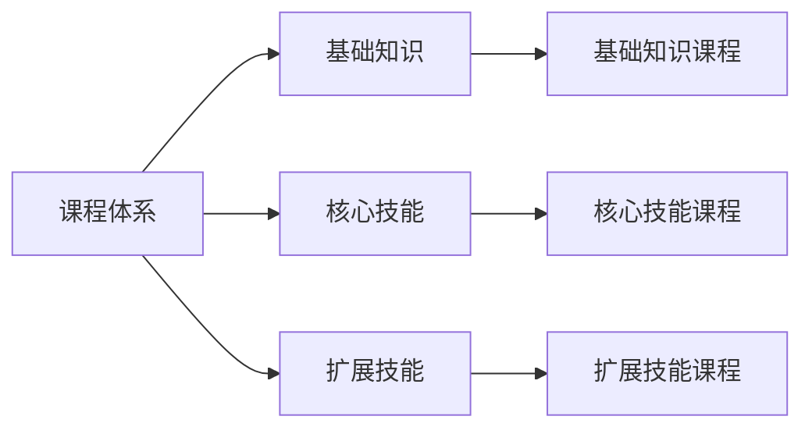

#### 3.3 确定教学方法

教学方法的选择对培养效果至关重要。以下为几种常用的教学方法及其特点：

1. **讲授法**：教师通过讲解、演示等方式传授知识，适用于基础知识的传授。
2. **案例法**：通过分析真实案例，使学习者了解理论知识在实际中的应用，提高问题解决能力。
3. **项目实践**：学习者通过实际项目操作，将所学知识应用于实际，提高实践能力。
4. **讨论法**：通过小组讨论、头脑风暴等方式，激发学习者的思维，培养团队合作能力。

**ER实体关系图架构**：

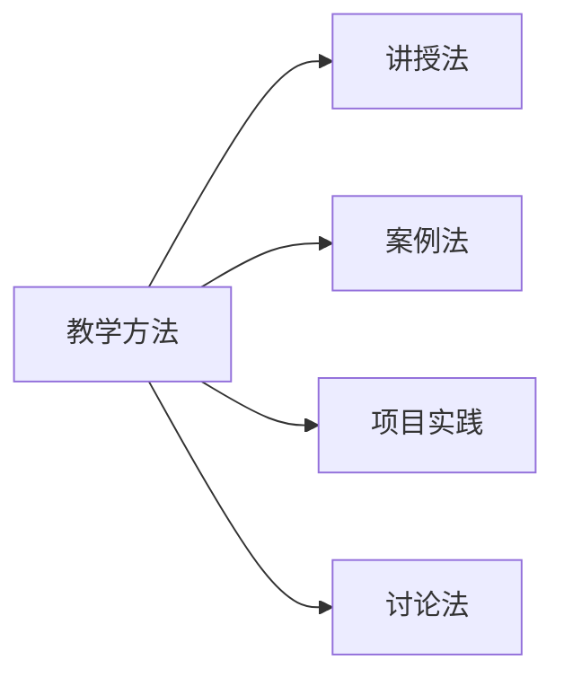

#### 3.4 制定评估机制

评估机制是确保培养效果的重要手段。以下为几种常用的评估方法及其特点：

1. **平时成绩**：通过日常作业、课堂表现等方式，评估学习者在学习过程中的表现。
2. **考试**：通过定期考试，评估学习者在知识掌握和技能应用方面的能力。
3. **项目评估**：通过实际项目完成情况，评估学习者在实际操作中的能力。
4. **学生反馈**：通过学生反馈，了解教学过程中的问题和改进方向。

**ER实体关系图架构**：

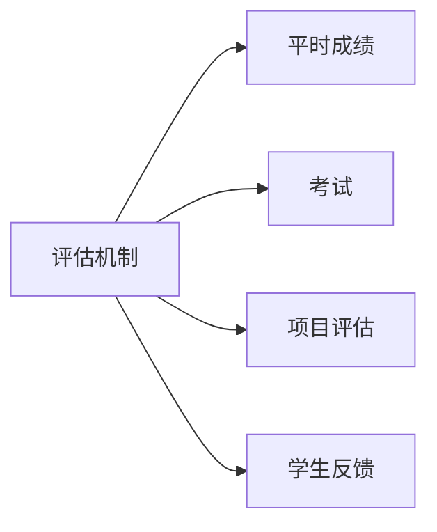

#### 3.5 构建良好学习环境

良好的学习环境是培养技术人才的重要保障。以下为构建良好学习环境的建议：

1. **完善学习设施**：提供充足的教材、在线课程、实验室设备等学习资源，满足学习者的需求。
2. **营造学习氛围**：创造积极向上的学习氛围，鼓励学习者主动学习、相互帮助。
3. **加强师资力量**：培养优秀的师资队伍，提高教学质量，为学习者提供优质的教育资源。

**ER实体关系图架构**：

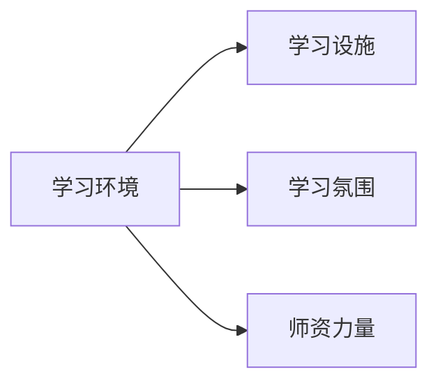

通过系统化培养方案的设计，我们可以为技术人才培养提供有效的支持和指导。只有通过明确培养目标、设计课程体系、选择教学方法、制定评估机制和构建良好学习环境，我们才能培养出具备实际操作能力和职业素养的高技能技术人才。

### 第四部分：多样化教学方法的应用

#### 4.1 讲授法

讲授法是教学中最常用的方法之一，通过教师的讲解和演示，使学习者掌握基础知识。以下为讲授法的具体应用步骤：

1. **课前准备**：教师应提前了解学习者的学习需求和背景知识，准备相关的教材、PPT和演示材料。
2. **课堂讲解**：教师通过讲解、举例和演示，使学习者理解理论知识。在讲解过程中，应注意清晰、简洁和生动，以便学习者更好地吸收知识。
3. **课堂互动**：教师应鼓励学习者提问和参与讨论，提高学习者的学习积极性和理解能力。
4. **课后作业**：教师应布置课后作业，以巩固学习者的知识。作业形式可以包括练习题、实验报告和案例分析等。

**ER实体关系图架构**：

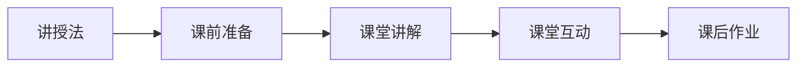

#### 4.2 案例法

案例法通过分析真实案例，使学习者了解理论知识在实际中的应用。以下为案例法的具体应用步骤：

1. **选择案例**：教师应选择具有代表性和实际意义的案例，以便学习者更好地理解理论知识。
2. **案例分析**：教师带领学习者分析案例，讲解案例中的关键问题和解决方法。在分析过程中，应注意引导学习者独立思考，培养问题解决能力。
3. **课堂讨论**：教师应组织课堂讨论，鼓励学习者分享自己的观点和见解，提高学习者的思维能力和表达能力。
4. **案例分析总结**：教师应总结案例分析过程，强调关键知识点和解决方法，巩固学习者的知识。

**ER实体关系图架构**：

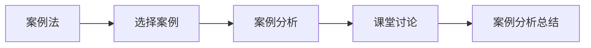

#### 4.3 项目实践

项目实践通过实际项目操作，使学习者将所学知识应用到实际中。以下为项目实践的具体应用步骤：

1. **项目选题**：教师应根据课程内容和学习者的实际情况，选择适合的项目选题。
2. **项目策划**：学习者应与教师共同策划项目方案，明确项目目标和实施步骤。
3. **项目实施**：学习者按照项目方案进行项目实施，通过实际操作掌握相关技能。
4. **项目评估**：教师应对项目实施过程进行评估，包括项目完成情况、学习者技能掌握程度和团队合作能力等。

**ER实体关系图架构**：

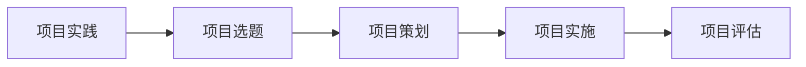

#### 4.4 讨论法

讨论法通过小组讨论、头脑风暴等方式，激发学习者的思维，培养团队合作能力。以下为讨论法的具体应用步骤：

1. **分组讨论**：教师将学习者分成若干小组，每组指定组长负责组织讨论。
2. **讨论主题**：教师确定讨论主题，引导小组围绕主题进行讨论。
3. **讨论记录**：小组组长应记录讨论过程和结果，以便后续总结和反思。
4. **讨论总结**：教师组织各小组进行讨论总结，分享讨论成果，并进行评价。

**ER实体关系图架构**：

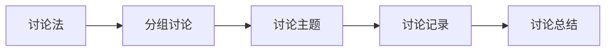

通过多样化教学方法的运用，我们可以提高教学效果，培养出具备实际操作能力和职业素养的高技能技术人才。不同教学方法各有特点，教师应根据实际情况灵活选择和应用。

### 第五部分：评估机制的设计与实施

#### 5.1 平时成绩评估

平时成绩评估是对学习者学习过程和成果的一种持续性的评价方式。它包括课堂表现、作业完成情况、实验报告和在线测验等。以下为平时成绩评估的具体步骤：

1. **设定评估标准**：教师应根据课程目标和教学内容，制定具体的评估标准，明确平时成绩的考核内容和要求。
2. **日常记录**：教师应记录学习者的课堂表现，包括出勤情况、回答问题、参与讨论等，以量化形式评价学习者的平时表现。
3. **作业评审**：教师应对学习者提交的作业进行评审，根据作业质量、完成情况等进行评分。
4. **实验报告**：教师应评审学习者的实验报告，检查其实验过程和结果，以评估其实践操作能力。
5. **在线测验**：教师可以通过在线平台发布测验，定期检查学习者的知识掌握情况。

**ER实体关系图架构**：

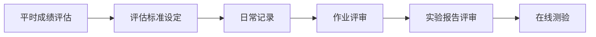

#### 5.2 定期考试评估

定期考试是对学习者阶段性学习成果的全面检验。以下为定期考试评估的具体步骤：

1. **考试安排**：教师应根据教学进度和学习者的学习情况，合理安排考试时间，确保考试覆盖所学内容的重点和难点。
2. **试卷设计**：教师应设计符合课程要求的试卷，包括选择题、填空题、计算题、论述题等多种题型，全面考察学习者的知识掌握情况。
3. **考试执行**：教师应严格按照考试规定执行考试，确保考试公平、公正。
4. **考试评分**：教师应对考试试卷进行评分，根据考试成绩评估学习者的知识掌握情况。
5. **考试反馈**：教师应向学习者提供考试成绩和反馈，帮助其了解学习中的不足，指导下一步的学习。

**ER实体关系图架构**：

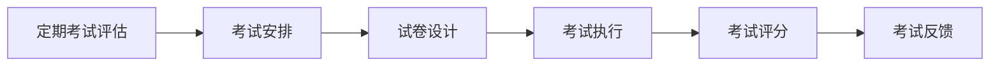

#### 5.3 项目评估

项目评估是对学习者实际操作能力和团队合作能力的检验。以下为项目评估的具体步骤：

1. **项目选题**：教师应根据课程目标和实际需求，选择适合的项目选题。
2. **项目策划**：学习者应与教师共同策划项目方案，明确项目目标和实施步骤。
3. **项目实施**：学习者按照项目方案进行项目实施，通过实际操作掌握相关技能。
4. **项目汇报**：学习者应向教师和同学汇报项目进展和成果，接受评价。
5. **项目评分**：教师应根据项目完成情况、学习者技能掌握程度和团队合作能力等进行评分。

**ER实体关系图架构**：

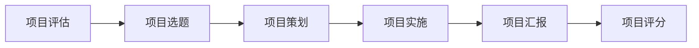

#### 5.4 学生反馈评估

学生反馈评估是通过学习者的自我评价和相互评价，了解教学效果和改进方向。以下为学生反馈评估的具体步骤：

1. **设计反馈表**：教师应设计包括课程内容、教学方法、教学资源等方面的反馈表，以便学习者进行评价。
2. **收集反馈**：教师应通过在线问卷、面对面访谈等方式，收集学习者的反馈意见。
3. **反馈分析**：教师应对收集到的反馈进行分析，找出教学中的优点和不足。
4. **反馈改进**：教师应根据分析结果，调整教学方法和策略，提高教学质量。

**ER实体关系图架构**：

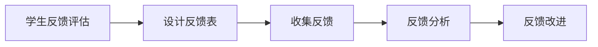

通过以上评估机制的设计与实施，我们可以全面、客观地了解学习者的学习效果，为教学改进提供有力支持。

### 第六部分：项目实战与案例分析

#### 6.1 环境安装

为了更好地进行项目实战，首先需要搭建一个合适的技术环境。以下是一个基于Python和Django框架的Web开发项目的环境安装步骤：

1. **安装Python**：从Python官方网站下载并安装Python 3.x版本。
2. **安装Django**：在命令行中执行以下命令安装Django：
   ```bash
   pip install django
   ```
3. **安装其他依赖**：根据项目需求，安装其他必要的库和框架，如：
   ```bash
   pip install pillow
   pip install django-crispy-forms
   ```
4. **配置虚拟环境**：为了隔离项目依赖，创建一个虚拟环境：
   ```bash
   python -m venv my_project_env
   source my_project_env/bin/activate  # 在Windows中使用 my_project_env\Scripts\activate
   ```

#### 6.2 系统核心实现

以下是一个简单的Django项目的核心实现过程：

1. **创建项目**：
   ```bash
   django-admin startproject my_project
   cd my_project
   ```
2. **创建应用**：
   ```bash
   python manage.py startapp my_app
   ```
3. **配置数据库**：在项目设置文件中配置数据库连接信息：
   ```python
   DATABASES = {
       'default': {
           'ENGINE': 'django.db.backends.sqlite3',
           'NAME': BASE_DIR / 'db.sqlite3',
       }
   }
   ```
4. **创建模型**：在`my_app/models.py`中定义一个简单的模型：
   ```python
   from django.db import models

   class Article(models.Model):
       title = models.CharField(max_length=200)
       content = models.TextField()
       created_at = models.DateTimeField(auto_now_add=True)
   ```
5. **迁移数据库**：创建数据库表：
   ```bash
   python manage.py makemigrations
   python manage.py migrate
   ```
6. **创建视图**：在`my_app/views.py`中创建一个简单的视图：
   ```python
   from django.shortcuts import render
   from .models import Article

   def index(request):
       articles = Article.objects.all()
       return render(request, 'index.html', {'articles': articles})
   ```
7. **配置URL**：在`my_project/urls.py`中配置URL映射：
   ```python
   from django.contrib import admin
   from django.urls import path
   from my_app.views import index

   urlpatterns = [
       path('admin/', admin.site.urls),
       path('', index, name='index'),
   ]
   ```
8. **创建模板**：在`my_app/templates/`中创建一个简单的模板`index.html`：
   ```html
   <html>
   <head>
       <title>文章列表</title>
   </head>
   <body>
       <h1>文章列表</h1>
       
           <div>
               <h2>{{ article.title }}</h2>
               <p>{{ article.content }}</p>
           </div>
       
   </body>
   </html>
   ```
9. **运行项目**：启动Django开发服务器：
   ```bash
   python manage.py runserver
   ```

#### 6.3 代码应用解读与分析

以下是对上述代码的详细解读与分析：

1. **环境安装**：
   - 安装Python和Django是搭建Web开发环境的基础步骤。Python因其简洁易懂和丰富的库支持，成为Web开发的热门语言。Django作为Python的一个全栈框架，提供了快速开发Web应用程序的能力。
   - 配置虚拟环境可以避免项目之间依赖库的冲突，提高开发效率。

2. **项目创建**：
   - 使用`django-admin startproject`命令创建项目，生成项目的基本结构和配置文件。
   - 使用`python manage.py startapp`命令创建应用，应用是项目中的一个模块，用于组织相关的模型、视图、模板等。

3. **数据库配置**：
   - 配置数据库连接信息，以便项目可以与数据库进行交互。在本文中，使用SQLite作为示例数据库。

4. **模型定义**：
   - 定义模型是Django的核心功能之一。模型类继承自`django.db.models.Model`，每个模型字段都表示数据库中的一个列。

5. **数据库迁移**：
   - 使用`makemigrations`和`migrate`命令生成和执行数据库迁移，将模型定义转换为数据库表。

6. **视图创建**：
   - 视图是Django中的核心组件，用于处理用户的请求并返回响应。在`views.py`中定义视图函数，接收请求参数，执行相应的逻辑处理，并返回HTTP响应。

7. **URL配置**：
   - URL配置用于将URL映射到视图函数。在`urls.py`中定义URL模式，实现URL到视图的映射。

8. **模板创建**：
   - 模板用于生成HTML页面。在`templates/`目录中创建模板文件，使用Django模板语言（DTL）来渲染动态内容。

#### 6.4 实际案例分析与详细讲解

以下是一个实际案例的分析：

**场景**：一个新闻网站需要实现用户可以发表文章的功能。

**需求**：
1. 用户注册和登录功能。
2. 用户可以发表文章。
3. 用户可以查看和编辑自己的文章。

**分析**：
1. **用户认证**：
   - 使用Django提供的认证系统，实现用户的注册、登录和注销功能。
   - 配置`settings.py`文件，启用Django的认证中间件。
2. **文章发布**：
   - 定义一个`Article`模型，包含文章的标题、内容和创建时间等字段。
   - 创建一个表单，用于用户输入文章信息。
   - 创建一个视图，处理文章的提交和保存。
3. **文章展示**：
   - 在首页展示用户的文章列表。
   - 提供文章详情页，显示文章的详细信息。
   - 提供文章编辑功能，允许用户修改文章内容。

**详细讲解**：
1. **用户认证**：
   - 在`my_app/urls.py`中添加URL配置，映射到认证视图：
     ```python
     from django.contrib.auth import views as auth_views

     urlpatterns = [
         # ...
         path('accounts/login/', auth_views.LoginView.as_view(), name='login'),
         path('accounts/logout/', auth_views.LogoutView.as_view(), name='logout'),
         path('accounts/register/', views.register, name='register'),
     ]
     ```
   - 在`my_app/views.py`中实现注册视图：
     ```python
     from django.contrib.auth.forms import UserCreationForm
     from django.shortcuts import render, redirect

     def register(request):
         if request.method == 'POST':
             form = UserCreationForm(request.POST)
             if form.is_valid():
                 form.save()
                 return redirect('login')
         else:
             form = UserCreationForm()
         return render(request, 'register.html', {'form': form})
     ```

2. **文章发布**：
   - 在`my_app/models.py`中定义`Article`模型：
     ```python
     class Article(models.Model):
         title = models.CharField(max_length=200)
         content = models.TextField()
         author = models.ForeignKey(User, on_delete=models.CASCADE)
         created_at = models.DateTimeField(auto_now_add=True)
     ```
   - 在`my_app/urls.py`中添加URL配置，映射到文章发布视图：
     ```python
     from .views import post_article

     urlpatterns = [
         # ...
         path('post/', post_article, name='post_article'),
     ]
     ```
   - 在`my_app/views.py`中实现文章发布视图：
     ```python
     from django.shortcuts import render, redirect
     from .models import Article
     from .forms import ArticleForm

     def post_article(request):
         if request.method == 'POST':
             form = ArticleForm(request.POST)
             if form.is_valid():
                 form.save()
                 return redirect('index')
         else:
             form = ArticleForm()
         return render(request, 'post_article.html', {'form': form})
     ```

3. **文章展示**：
   - 在`my_app/urls.py`中添加URL配置，映射到文章详情视图：
     ```python
     from .views import article_detail

     urlpatterns = [
         # ...
         path('article/<int:article_id>/', article_detail, name='article_detail'),
     ]
     ```
   - 在`my_app/views.py`中实现文章详情视图：
     ```python
     from django.shortcuts import render, get_object_or_404
     from .models import Article

     def article_detail(request, article_id):
         article = get_object_or_404(Article, pk=article_id)
         return render(request, 'article_detail.html', {'article': article})
     ```

通过以上案例，我们可以看到如何使用Django框架实现一个简单的用户认证、文章发布和展示功能。这为读者提供了一个实际操作的实例，有助于更好地理解Django的使用方法和项目开发流程。

### 第七部分：最佳实践与注意事项

#### 7.1 最佳实践

1. **项目规划**：在项目开始前，明确项目目标、需求和预期成果，制定详细的规划，确保项目有序进行。
2. **代码规范**：遵循良好的代码规范，如PEP 8，提高代码的可读性和可维护性。
3. **版本控制**：使用Git等版本控制系统，记录代码的变更历史，方便代码的版本管理和协作开发。
4. **持续集成**：采用持续集成工具，如Jenkins或Travis CI，自动构建和测试代码，确保代码质量。
5. **学习交流**：积极参与技术社区，如GitHub、Stack Overflow等，与同行交流学习，拓展知识面。

#### 7.2 注意事项

1. **合理分配时间**：合理安排学习和工作时间，避免过度疲劳，保持良好的身心状态。
2. **保持好奇心**：对新技术和新知识保持好奇心，不断探索和学习，提升自身技能。
3. **注重实际应用**：理论知识要与实践相结合，通过实际项目操作，提高解决实际问题的能力。
4. **及时反馈与调整**：定期进行自我反思和评估，及时反馈问题和调整学习方法，提高学习效果。

### 第八部分：拓展阅读

以下是一些拓展阅读的推荐，帮助读者深入了解技术人才培养的相关知识：

1. 《深度学习》（Deep Learning），作者：Ian Goodfellow、Yoshua Bengio、Aaron Courville
   - 本书详细介绍了深度学习的理论基础和实践方法，是深度学习领域的经典教材。

2. 《编程珠玑》（The Art of Computer Programming），作者：Donald E. Knuth
   - 本书是计算机编程领域的经典之作，涵盖了算法设计、分析等多个方面，对提高编程技能有很高的价值。

3. 《代码大全》（The Pragmatic Programmer），作者：Andrew Hunt、David Thomas
   - 本书介绍了编程的最佳实践和经验，有助于提高编程能力和项目质量。

4. 《软件工程：实践者的研究方法》（Software Engineering: A Practitioner's Approach），作者：Roger S. Pressman
   - 本书系统介绍了软件工程的理论和实践方法，是软件工程领域的经典教材。

通过以上拓展阅读，读者可以进一步加深对技术人才培养和相关领域的理解，为自己的职业发展打下坚实基础。

### 第九部分：小结

本文从技术人才培养的背景、核心概念、系统化培养方案、多样化教学方法、评估机制的设计与实施、项目实战与案例分析以及最佳实践与注意事项等方面进行了深入探讨。通过明确培养目标、设计系统化课程体系、采用多样化教学方法、制定评估机制和构建良好学习环境，我们可以有效地培养出具备实际操作能力和职业素养的高技能技术人才。在今后的工作中，我们应继续关注技术发展趋势，不断创新教学方法，提高人才培养质量，为企业和国家的技术创新贡献力量。同时，也要注重自身的学习与成长，不断提升专业素养，以适应快速变化的技术环境。让我们携手共进，为技术人才培养事业努力奋斗！

