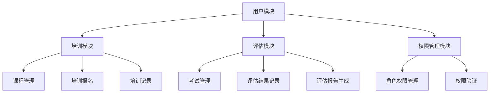

                 

### 1.1.1 背景介绍

技术发展作为推动社会进步的重要力量，在当今世界中扮演着至关重要的角色。从互联网的普及到人工智能的迅猛发展，技术正以前所未有的速度改变着我们的生活方式、工作模式以及商业生态。每一次技术的突破，不仅带来了生产效率的提升，还催生了新的行业和市场。

随着技术的不断进步，企业在竞争中的压力也日益增大。为了在市场中占据优势，企业必须不断创新，这依赖于拥有一支高素质、专业化的人才队伍。然而，技术人才供给与需求的不平衡现象日益凸显。一方面，市场上对高级技术人才的需求不断增加；另一方面，技术人才的培养速度远未能跟上需求增长的步伐。这种人才缺口不仅限制了企业的创新能力，还成为了行业发展的瓶颈。

此外，企业发展的需求也是推动技术人才梯队建设的重要原因。随着企业规模的扩大和业务的多元化，对技术人才的需求不仅限于数量，更在于质量。企业需要构建一个结构合理、能力互补的人才梯队，以确保在不同的技术领域都有具备专业能力和领导力的人才。这样的梯队建设不仅能够提升企业的核心竞争力，还能够为企业长期发展提供强有力的支撑。

因此，面对技术发展带来的机遇与挑战，企业必须重视技术人才梯队建设，通过科学合理的培养计划，不断提升技术人才的综合素质和专业能力，以满足企业发展的需求。这不仅是对企业自身利益的保护，更是对整个行业技术进步的贡献。

### 1.1.2 问题描述

技术人才供给与需求的不平衡现象在当今企业中表现得尤为突出。一方面，随着技术的快速迭代和新兴领域的不断涌现，市场对高级技术人才的需求日益增加。这些人才不仅需要具备深厚的专业知识，还需要具备较强的创新能力和实践能力。另一方面，现有的技术人才培养体系尚未能够完全满足这种需求，导致市场上技术人才供不应求。

人才梯队建设的紧迫性体现在多个方面。首先，企业需要建立多层次的技术人才结构，从初级技术人员到高级技术专家，再到技术领导者和战略规划者，形成一个完整的人才梯队。这样的梯队不仅能够确保企业不同技术领域的需求得到满足，还能够为企业的长远发展提供持续的人才储备。其次，人才梯队建设有助于提高企业的创新能力和市场竞争力。通过科学合理的培养计划，企业能够不断提升技术人才的综合素质和专业能力，从而在激烈的市场竞争中立于不败之地。

培养计划的重要性不容忽视。一个成功的培养计划不仅能够针对不同层次的技术人才设定明确的发展目标，还能够提供系统化的培训内容和多样化的培养方式。此外，培养计划还应当包含科学的评估体系，以便及时了解培养效果，调整培养策略。通过培养计划，企业能够确保技术人才在专业能力和个人素养方面都得到全面提升，从而为企业的发展提供坚实的人才保障。

综上所述，技术人才供给与需求的不平衡、人才梯队建设的紧迫性以及培养计划的重要性，构成了当前企业在技术人才管理中面临的主要问题。解决这些问题不仅需要企业内部的管理变革，还需要全社会对技术人才培养的重视和支持。

### 1.1.3 问题解决

为了解决技术人才供给与需求不平衡的问题，企业需要从以下几个方面入手，构建合理的人才梯队，制定全面的培养计划，并确保其实施与评估的顺利进行。

**构建合理的人才梯队**

构建合理的人才梯队是企业技术人才管理的首要任务。首先，企业应当对现有人才进行全面评估，根据其专业能力和职业素养，将他们分为不同的层次，如初级技术人员、中级技术人员、高级技术人员和战略规划者。其次，企业应根据业务发展的需要，明确各层级人才在技术方向、管理能力和创新能力等方面的具体职责和发展目标。最后，企业需要建立完善的晋升机制，为不同层级的人才提供明确的职业发展路径，激励他们在各自岗位上不断成长和进步。

**制定全面的培养计划**

制定全面的培养计划是提升技术人才综合素质的关键。首先，企业应当根据不同层级人才的职业发展需求，设计有针对性的培训课程。这些课程不仅包括技术领域的专业知识，还涵盖项目管理、领导力培养等方面的内容。其次，企业应采用多样化的培养方式，如内部培训、外部培训、项目实践等，以满足不同人才的学习需求和职业发展目标。此外，培养计划还应包含科学的评估机制，以便及时了解培养效果，根据实际情况进行调整。

**实施与评估**

实施与评估是培养计划能否成功的关键环节。首先，企业应建立健全的管理体系，明确各级管理人员的职责和权限，确保培养计划能够顺利实施。其次，企业应定期对培养计划的效果进行评估，通过考试、项目成果、工作绩效等多种方式，全面了解技术人才的能力提升情况。评估结果应及时反馈给相关人员，帮助他们明确自己的优势和不足，并制定相应的改进措施。最后，企业应根据评估结果不断优化培养计划，确保其能够持续满足技术人才的发展需求。

综上所述，构建合理的人才梯队、制定全面的培养计划、实施与评估的顺利推进，是解决当前技术人才管理问题的有效途径。企业只有通过科学的人才管理策略，才能在激烈的市场竞争中立于不败之地。

### 1.1.4 边界与外延

在讨论技术人才梯队建设与培养计划时，明确边界与外延至关重要。首先，关于人才分类与定位，企业应当根据不同的技术领域和岗位需求，对人才进行科学分类和定位。例如，技术专家主要承担复杂的技术研发和项目攻关任务，而技术支持人员则主要负责日常技术支持和维护。通过明确分类与定位，企业能够更好地分配资源，制定有针对性的培养计划。

其次，企业规模与行业特性也是影响人才梯队建设的重要因素。对于大型企业而言，人才梯队的建设需要更加系统化和多元化，以满足其在多个技术领域的发展需求。而中小型企业在资源有限的情况下，则应更加注重关键岗位和核心技术人才的培养。不同行业也有其独特性，例如，互联网行业对创新能力的要求较高，而传统制造行业则更注重技术应用的稳定性和可靠性。因此，在制定培养计划时，企业应充分考虑行业特性，确保培养内容与行业需求相匹配。

综上所述，明确人才分类与定位、关注企业规模与行业特性，是确保技术人才梯队建设与培养计划有效实施的重要前提。企业只有根据实际情况，科学制定和调整培养策略，才能在激烈的市场竞争中立于不败之地。

### 1.2.1 技术人才

**定义**

技术人才是指具备某一领域专业技术知识，能够在实际工作中应用这些知识进行创新和解决复杂问题的专业人员。技术人才不仅需要扎实的理论知识，还需要丰富的实践经验，以及较强的分析和解决问题的能力。

**分类**

技术人才可以根据不同的标准进行分类。常见的分类方法包括：

1. **按专业领域分类**：
   - **软件工程师**：负责软件开发、测试和维护。
   - **数据工程师**：专注于数据存储、处理和分析。
   - **AI/机器学习工程师**：研究和应用人工智能技术。
   - **网络安全工程师**：负责网络系统的安全防护。

2. **按职业发展阶段分类**：
   - **初级技术人才**：通常刚从学校毕业或进入职场，正在积累实践经验。
   - **中级技术人才**：具备一定的工作经验和专业知识，能够独立承担项目。
   - **高级技术人才**：拥有丰富的项目经验，能够担任技术领导或专家角色。

**能力模型**

技术人才的能力模型通常包括以下几个方面：

1. **专业技能**：具体技术领域的知识，如编程语言、数据库管理、网络安全等。
2. **项目经验**：在实际项目中积累的经验，包括问题解决、项目管理和团队协作。
3. **创新能力**：在技术难题面前，能够提出创新性解决方案的能力。
4. **沟通能力**：与团队成员、客户和其他利益相关者进行有效沟通的能力。
5. **持续学习**：不断更新知识，掌握新技术和行业动态的能力。

**对比表格**

为了更直观地了解不同技术人才的能力模型，我们可以通过以下表格进行对比：

| 类别 | 技术人才A | 技术人才B |
| --- | --- | --- |
| 专业技能 | 精通Python和Java | 熟悉Python和C++ |
| 项目经验 | 参与多个大型项目 | 在中型项目中担任关键角色 |
| 创新能力 | 提出多个技术优化方案 | 专注于现有技术的应用 |
| 沟通能力 | 能够清晰表达技术观点 | 在项目中担任沟通协调角色 |
| 持续学习 | 定期参加技术培训 | 通过实践不断学习 |

通过这个表格，我们可以看出不同技术人才在专业技能、项目经验、创新能力、沟通能力和持续学习等方面的差异。

**ER实体关系图架构**

为了更好地理解技术人才的能力模型，我们可以使用Mermaid绘制ER实体关系图。以下是一个简化的ER图示例：

```mermaid
entityRelationship
  id "Tech_Talent"
  direction LR
  
  entity "技能" {
    id "Skill"
    attributes ["编程语言", "数据库管理", "网络安全"]
  }

  entity "项目经验" {
    id "Experience"
    attributes ["参与项目数", "项目角色", "项目类型"]
  }

  entity "创新能力" {
    id "Innovation"
    attributes ["技术优化方案数", "专利数量"]
  }

  entity "沟通能力" {
    id "Communication"
    attributes ["表达能力", "协作能力"]
  }

  entity "持续学习" {
    id "Learning"
    attributes ["培训次数", "学习资源"]
  }

  relationship "技术人才" {
    type "1"
    source "Skill"
    target "Tech_Talent"
    roles ["拥有"]
  }

  relationship "技术人才" {
    type "1"
    source "Experience"
    target "Tech_Talent"
    roles ["拥有"]
  }

  relationship "技术人才" {
    type "1"
    source "Innovation"
    target "Tech_Talent"
    roles ["拥有"]
  }

  relationship "技术人才" {
    type "1"
    source "Communication"
    target "Tech_Talent"
    roles ["拥有"]
  }

  relationship "技术人才" {
    type "1"
    source "Learning"
    target "Tech_Talent"
    roles ["拥有"]
  }
```

这张ER图清晰地展示了技术人才的能力模型及其相互关系，有助于我们更好地理解和分析技术人才的素质。

### 1.2.2 梯队建设理论

**目标**

人才梯队建设的目标是构建一个结构合理、能力互补的人才队伍，以支持企业的长期发展。具体目标包括：

1. **确保企业各技术领域都有充足的人才储备**，以应对不同阶段的发展需求。
2. **提升技术人才的整体素质和专业能力**，增强企业的核心竞争力。
3. **培养技术领导者和战略规划者**，为企业的发展提供战略支持和创新动力。
4. **建立完善的职业发展路径**，激励技术人才不断成长和进步。

**架构**

人才梯队的建设需要建立科学的架构，确保不同层级的人才能够充分发挥作用。具体架构包括：

1. **初级技术人才**：负责基础技术工作和项目执行，是企业技术队伍的基石。
2. **中级技术人才**：具备一定的项目管理和创新能力，能够独立承担项目。
3. **高级技术人才**：拥有丰富的项目经验和技术领导能力，负责关键技术和重大项目。
4. **技术领导者和战略规划者**：具备全局视野和战略思维，能够制定和实施企业技术发展战略。

**培养策略**

为了实现人才梯队建设的目标，企业需要制定有效的培养策略。具体策略包括：

1. **内部培养**：通过内部培训和项目实践，提升技术人才的专业技能和实践能力。
2. **外部引进**：引进外部高端技术人才，弥补企业现有人才结构的不足。
3. **跨部门交流**：鼓励技术人才跨部门交流，提升其综合素质和团队协作能力。
4. **外部培训**：组织技术人才参加行业内的专业培训和研讨会，了解最新的技术动态。
5. **职业规划**：为技术人才制定明确的职业发展路径，提供职业指导和支持。

通过以上培养策略，企业能够确保技术人才在不同阶段都能得到有效的培养和提升，从而构建一个结构合理、能力互补的人才梯队。

### 1.2.3 培养计划

**内容**

培养计划的内容应当涵盖技术人才发展的各个方面，确保其能够全面提升专业能力和综合素质。具体内容包括：

1. **专业技能培训**：根据技术人才的岗位需求，提供针对性的专业技能培训，如编程语言、数据库管理、网络安全等。
2. **项目管理培训**：提升技术人才的项目管理能力，包括项目计划、进度控制、资源分配等。
3. **领导力培训**：培养技术人才成为技术领导者，包括团队管理、沟通协调、战略规划等。
4. **跨部门交流**：通过跨部门项目或交流活动，提升技术人才的综合素质和团队协作能力。
5. **行业趋势与前沿技术**：定期组织技术研讨会和培训，让技术人才了解最新的行业趋势和技术前沿。

**方法**

培养方法应当多样化，以满足不同技术人才的学习需求和职业发展目标。具体方法包括：

1. **内部培训**：由企业内部专家或外部培训机构提供专业技能和项目管理培训。
2. **外部培训**：组织技术人才参加行业内的专业培训和研讨会，了解最新的技术动态。
3. **项目实践**：通过参与实际项目，提升技术人才的实践能力和问题解决能力。
4. **跨部门交流**：鼓励技术人才跨部门交流，拓宽视野，提升综合素质。
5. **导师制**：为初级和中级技术人才配备导师，提供职业指导和支持。

**评估**

评估是培养计划的重要组成部分，通过评估可以及时了解培养效果，调整培养策略。具体评估方法包括：

1. **培训评估**：通过考试、作业、项目成果等方式，评估技术人才在培训中的学习效果。
2. **项目评估**：通过项目进展、项目成果、团队协作等方面，评估技术人才在实际项目中的表现。
3. **绩效评估**：结合技术人才的日常绩效表现，评估其专业能力和综合素质。
4. **反馈机制**：建立反馈机制，及时收集技术人才的意见和建议，改进培养计划。

通过以上内容、方法和评估，企业能够确保培养计划的科学性和有效性，全面提升技术人才的综合素质和专业能力。

### 1.3.1 人才梯队建设的现状分析

**行业分布**

在当前的市场环境中，技术人才在各个行业中的分布存在显著差异。互联网行业和技术公司对技术人才的需求尤为突出，特别是软件工程师、数据工程师和AI/机器学习工程师等高级技术人才。此外，金融、医疗和制造等行业也逐步加大了对技术人才的投入，以提升业务效率和创新能力。然而，在一些传统行业，如农业和能源，技术人才仍较为稀缺，这导致了这些行业在技术创新和数字化转型方面的滞后。

**企业策略**

不同企业对于人才梯队建设的策略也有所不同。大型企业通常具备较为完善的培养体系和丰富的资源，能够通过内部培训和外部引进相结合的方式，构建多层次的技能体系和人才梯队。例如，阿里巴巴和华为等公司，通过设立专门的培养计划和内部竞赛，激发员工的创新能力和团队协作精神。而中小型企业则更多地依赖于外部培训和短期项目合作，以快速提升技术人才的能力。

**效果评估**

在评估人才梯队建设效果时，企业通常会采用以下几种标准：

1. **人才储备量**：通过统计不同层级的技术人才数量，评估企业的人才储备情况。
2. **培养效果**：通过培训后的考试、项目成果、员工绩效等指标，评估培养计划的实际效果。
3. **创新能力**：通过新产品的推出、技术创新项目的成功率等指标，评估技术人才在创新方面的表现。
4. **员工满意度**：通过员工满意度调查，了解员工对企业培养计划和工作环境的看法。

综合以上评估标准，企业可以全面了解人才梯队建设的成效，并根据实际情况进行调整和优化。

### 1.3.2 人才梯队建设面临的挑战

**内部因素**

在内部因素方面，企业面临的主要挑战包括：

1. **人才流动性**：技术人才流动性较高，导致企业难以建立稳定的人才梯队。这种现象在互联网和快速发展的行业中尤为明显。
2. **人才培养体系不足**：部分企业的培养体系不够完善，缺乏系统化的培训内容和科学的管理机制，难以满足技术人才的发展需求。
3. **内部竞争**：企业内部的人才竞争可能导致部分员工压力过大，影响其工作效率和创造力。
4. **文化冲突**：不同背景的人才在企业中可能会产生文化冲突，影响团队协作和人才梯队的建设。

**外部环境**

在外部环境方面，企业面临的主要挑战包括：

1. **行业竞争加剧**：随着市场的不断扩大和竞争的加剧，企业需要不断引进和培养高水平的技术人才，以保持竞争优势。
2. **市场需求变化**：市场需求的变化对技术人才的能力和素质提出了更高的要求，企业需要及时调整培养计划，以适应市场需求。
3. **技术更新速度**：技术的快速更新使得企业需要持续投入资源进行培训，以保持技术人才的专业能力和竞争力。
4. **政策法规**：政策法规的变化可能会影响企业的用人策略和人才培养方式，企业需要及时调整以符合法规要求。

**解决建议**

为了应对这些挑战，企业可以采取以下措施：

1. **加强内部培训**：建立完善的内部培训体系，提供多样化的培训内容和方式，提升技术人才的综合素质。
2. **优化人才结构**：通过合理的招聘和内部调岗，优化人才结构，提高人才队伍的稳定性和专业性。
3. **建立激励机制**：通过绩效激励、晋升机制等手段，激发技术人才的积极性和创造力。
4. **强化文化融合**：通过团队建设活动和跨部门合作，增强员工之间的文化认同和协作精神。
5. **积极应对外部环境变化**：密切关注行业动态和政策法规，及时调整培养计划和用人策略，以适应外部环境的变化。

通过这些措施，企业可以更好地应对内部和外部挑战，构建稳定、高效的人才梯队。

### 1.4.1 人才需求分析

**数据分析**

人才需求的分析需要基于大量的数据，这些数据来源于行业报告、市场调研、企业招聘需求等多个渠道。通过数据分析，企业可以了解当前市场对技术人才的需求状况，识别出紧缺的技术领域和岗位。

1. **数据来源**：首先，企业可以从行业分析报告中获得宏观层面的数据，如《全球人工智能产业发展报告》等。此外，还可以通过招聘网站、社交媒体和行业论坛等渠道收集具体的人才需求信息。
   
2. **数据类型**：
   - **需求量数据**：统计各技术领域的人才需求量，了解哪些技术岗位最为紧缺。
   - **岗位分布数据**：分析各技术岗位在不同行业和地区的分布情况，为人才招聘和培养提供方向。
   - **技能要求数据**：了解不同岗位对技术技能的具体要求，如编程语言、数据库管理、网络安全等。

3. **数据分析方法**：
   - **趋势分析**：通过历史数据，分析技术人才需求量的变化趋势，预测未来的需求。
   - **相关分析**：分析不同技术领域和岗位之间的关联性，识别出对某一岗位有较强需求的其他岗位。
   - **岗位对比分析**：对比不同岗位的技能要求和薪酬水平，为人才招聘和培养提供依据。

**行业趋势**

了解行业趋势对于制定科学的人才需求分析至关重要。以下是一些关键行业趋势：

1. **技术创新加速**：随着人工智能、大数据、云计算等技术的发展，对相关领域技术人才的需求不断增加。
2. **数字化转型推进**：各行各业都在推进数字化转型，这要求技术人才具备跨领域的知识，如数据科学、网络安全等。
3. **技能更新速度加快**：技术更新速度加快，技术人才需要不断学习和更新知识，以保持竞争力。
4. **市场需求多样化**：市场对技术人才的需求不再局限于技术能力，还要求其具备项目管理、团队协作等软技能。

通过结合数据分析和行业趋势，企业可以更准确地预测未来的人才需求，制定有针对性的培养计划，确保企业能够在快速变化的市场环境中保持竞争优势。

### 1.4.2 培养方案设计

**培训内容**

培养方案的设计需要充分考虑技术人才的职业发展阶段和岗位需求。以下是一些常见的培训内容：

1. **基础知识培训**：针对初级技术人才，提供基础编程语言、数据库管理、操作系统等知识的培训，帮助他们打下扎实的专业知识基础。
2. **专业技能培训**：根据不同岗位的技术需求，提供专业的技能培训，如前端开发、后端开发、大数据分析、网络安全等。
3. **项目管理培训**：提升中级技术人才的项目管理能力，包括项目计划、进度控制、资源分配等。
4. **领导力与沟通技巧培训**：培养高级技术人才成为技术领导者，提供领导力、沟通技巧、团队管理等培训。
5. **行业趋势与前沿技术培训**：定期组织研讨会和培训，让技术人才了解最新的行业趋势和技术前沿。

**培养模式**

为了确保培养方案的有效实施，企业需要采用多样化的培养模式：

1. **内部培训**：由企业内部专家或培训机构提供专业技能和项目管理培训。这种模式有利于充分利用企业内部的资源和经验。
2. **外部培训**：组织技术人才参加行业内的专业培训和研讨会，了解最新的技术动态。外部培训机构通常有更丰富的资源和专业的讲师。
3. **项目实践**：通过参与实际项目，提升技术人才的实践能力和问题解决能力。项目实践是培养技术人才的重要方式，能够让他们将理论知识应用于实际工作中。
4. **跨部门交流**：鼓励技术人才跨部门交流，拓宽视野，提升综合素质。跨部门交流有助于技术人才了解不同业务领域的需求，提升团队协作能力。
5. **导师制**：为初级和中级技术人才配备导师，提供职业指导和支持。导师制能够帮助新入职员工快速融入企业，提升其专业技能和职业素养。

通过上述培训内容和培养模式，企业能够系统化地提升技术人才的综合素质和专业能力，满足不同阶段和岗位的发展需求。

### 1.4.3 培养体系建设

**管理体系**

培养体系建设需要建立完善的管理体系，确保培养计划的顺利实施。管理体系主要包括以下几个方面：

1. **组织架构**：明确各级管理人员的职责和权限，确保培养计划能够得到有效的管理和执行。通常，企业会设立专门的培训部门或人力资源部门负责培养计划的制定和实施。
2. **流程管理**：建立科学的培养流程，包括培训需求分析、课程设计、培训实施、效果评估等环节。流程管理有助于确保培养计划的系统性和持续性。
3. **资源管理**：确保培养过程中所需的资源和设施得到充分保障，包括培训场地、教材、培训设备等。资源管理是培养计划成功的关键因素之一。
4. **绩效管理**：通过定期评估技术人才的学习效果和工作绩效，及时反馈培养结果，调整培养策略。绩效管理有助于提升培养计划的有效性。

**评估体系**

评估体系是培养体系建设的重要组成部分，通过科学的评估，可以及时了解培养效果，优化培养策略。评估体系主要包括以下几个方面：

1. **评估标准**：制定明确的评估标准，如知识掌握程度、项目成果、员工满意度等，确保评估结果的客观性和公正性。
2. **评估流程**：建立规范的评估流程，包括评估指标设定、评估方式选择、评估结果记录和分析等。评估流程的规范化有助于提高评估的效率和质量。
3. **反馈机制**：建立反馈机制，及时收集技术人才对培养计划的意见和建议，并进行反馈和调整。反馈机制有助于提升培养计划的针对性和有效性。
4. **持续改进**：根据评估结果，不断优化培养计划和评估方法，确保培养体系能够持续改进和优化。

通过完善的管理体系和科学的评估体系，企业能够确保培养计划的顺利实施和持续优化，全面提升技术人才的综合素质和专业能力。

### 1.5 本章小结

本章主要探讨了技术人才梯队建设与培养计划的重要性。首先，通过背景介绍和问题分析，明确了技术人才供给与需求不平衡、人才梯队建设紧迫性以及培养计划的重要性。接着，从核心概念、理论、现状、挑战、关键要素等多个方面，系统地阐述了技术人才梯队建设的全貌。主要观点包括：

1. **构建合理的人才梯队**：企业应建立多层次的技能体系和人才架构，确保各技术领域都有充足的人才储备。
2. **制定全面的培养计划**：培养计划应涵盖专业技能、项目管理、领导力等多方面，采用内部培训、外部培训、项目实践等多种培养方式。
3. **实施与评估**：建立完善的管理体系和评估体系，确保培养计划能够有效实施和持续优化。

未来展望方面，企业应继续关注技术发展趋势和市场需求变化，灵活调整培养策略，以适应快速变化的市场环境。同时，加强跨部门交流和跨领域合作，提升技术人才的综合素质和创新能力，为企业的长远发展提供坚实的人才保障。通过科学合理的人才梯队建设与培养计划，企业将能够在激烈的市场竞争中立于不败之地。

### 2.1 技术人才概述

**技术人才定义**

技术人才是指那些在某一技术领域具备专业知识、技能和实践经验的个人。这些人才能够在实际工作中应用他们的技术知识来解决问题、推动创新和提升生产效率。技术人才通常涉及多个行业和领域，包括但不限于计算机科学、信息技术、工程、医学、生物技术等。他们的核心特征是具备专业的技术知识和丰富的实践经验，能够在复杂环境下进行有效的技术分析和决策。

**技术人才分类**

根据不同的标准和需求，技术人才可以分为多个类别：

1. **按专业领域分类**：
   - **软件开发工程师**：负责设计和开发软件系统，包括前端、后端以及移动端应用。
   - **数据科学家**：专注于数据分析和建模，运用统计学、机器学习等方法解决复杂的数据问题。
   - **AI/机器学习工程师**：研究和开发人工智能算法，并将其应用于实际项目中。
   - **网络安全工程师**：负责保护企业的网络系统免受攻击，确保数据安全。
   - **系统集成工程师**：负责将不同的硬件和软件系统集成，确保系统的稳定运行。

2. **按职业发展阶段分类**：
   - **初级技术人才**：通常是刚毕业的学生或新入职的员工，他们需要通过实践和培训来积累经验和提升技能。
   - **中级技术人才**：具备一定的专业知识和项目经验，能够独立承担项目并解决较复杂的技术问题。
   - **高级技术人才**：拥有丰富的项目经验和专业技能，能够担任技术团队领导或技术专家，指导并推动团队的技术发展。

**技术人才能力模型**

技术人才的能力模型通常包括以下几方面：

1. **专业技能**：这是技术人才最基本的能力，包括对特定技术的深入理解和熟练掌握，如编程语言、算法、数据库管理等。
2. **项目经验**：实际项目中的经验对于技术人才至关重要，这不仅能提升他们的技能，还能培养他们的团队合作和问题解决能力。
3. **创新能力**：在技术不断发展的今天，创新能力成为衡量技术人才的重要标准。这包括提出新的解决方案、优化现有系统等。
4. **沟通能力**：技术人才需要与团队成员、客户和上级进行有效沟通，确保项目顺利进行。良好的沟通能力能够减少误解和冲突，提高团队协作效率。
5. **持续学习**：技术领域发展迅速，持续学习是技术人才保持竞争力的关键。这包括阅读最新技术文献、参加培训课程、参加技术社区活动等。

**对比表格**

为了更直观地了解不同类别技术人才的能力模型，我们可以通过以下表格进行对比：

| 类别 | 技术人才A | 技术人才B |
| --- | --- | --- |
| 专业技能 | 熟练掌握Java、Python、C++ | 熟练掌握SQL、R、Java |
| 项目经验 | 参与10个以上大型项目 | 参与5个以上中型项目 |
| 创新能力 | 提出多个技术优化方案 | 在项目中实现新算法 |
| 沟通能力 | 能够有效传达技术观点 | 在跨部门项目中担任沟通协调角色 |
| 持续学习 | 定期参加技术研讨会 | 阅读大量技术文献 |

通过这个表格，我们可以清晰地看到不同技术人才在专业技能、项目经验、创新能力、沟通能力和持续学习等方面的差异。这有助于企业在制定培养计划时，更有针对性地提升技术人才的各项能力。

**ER实体关系图架构**

为了更好地理解技术人才的能力模型，我们可以使用Mermaid绘制一个简化的ER图。以下是一个技术人才能力模型的ER图示例：

```mermaid
entityRelationship
  id "Tech_Talent"
  direction LR
  
  entity "专业技能" {
    id "Skill"
    attributes ["编程语言", "数据库管理", "算法"]
  }

  entity "项目经验" {
    id "Experience"
    attributes ["项目数量", "项目类型", "项目角色"]
  }

  entity "创新能力" {
    id "Innovation"
    attributes ["方案数量", "专利数量"]
  }

  entity "沟通能力" {
    id "Communication"
    attributes ["表达能力", "协作能力"]
  }

  entity "持续学习" {
    id "Learning"
    attributes ["培训次数", "学习资源"]
  }

  relationship "技术人才" {
    type "1"
    source "Skill"
    target "Tech_Talent"
    roles ["拥有"]
  }

  relationship "技术人才" {
    type "1"
    source "Experience"
    target "Tech_Talent"
    roles ["拥有"]
  }

  relationship "技术人才" {
    type "1"
    source "Innovation"
    target "Tech_Talent"
    roles ["拥有"]
  }

  relationship "技术人才" {
    type "1"
    source "Communication"
    target "Tech_Talent"
    roles ["拥有"]
  }

  relationship "技术人才" {
    type "1"
    source "Learning"
    target "Tech_Talent"
    roles ["拥有"]
  }
```

这个ER图展示了技术人才的四大核心能力及其相互关系，有助于我们更系统地理解和分析技术人才的能力模型。

### 2.2 梯队建设理论

**目标**

人才梯队建设的目标是构建一个结构合理、能力互补的人才队伍，以支持企业的长期发展。具体目标包括：

1. **确保企业各技术领域都有充足的人才储备**，以应对不同阶段的发展需求。
2. **提升技术人才的整体素质和专业能力**，增强企业的核心竞争力。
3. **培养技术领导者和战略规划者**，为企业的发展提供战略支持和创新动力。
4. **建立完善的职业发展路径**，激励技术人才不断成长和进步。

**架构**

人才梯队的建设需要建立科学的架构，确保不同层级的人才能够充分发挥作用。具体架构包括：

1. **初级技术人才**：负责基础技术工作和项目执行，是企业技术队伍的基石。
2. **中级技术人才**：具备一定的项目管理和创新能力，能够独立承担项目。
3. **高级技术人才**：拥有丰富的项目经验和技术领导能力，负责关键技术和重大项目。
4. **技术领导者和战略规划者**：具备全局视野和战略思维，能够制定和实施企业技术发展战略。

**培养策略**

为了实现人才梯队建设的目标，企业需要制定有效的培养策略。具体策略包括：

1. **内部培养**：通过内部培训和项目实践，提升技术人才的专业技能和实践能力。
2. **外部引进**：引进外部高端技术人才，弥补企业现有人才结构的不足。
3. **跨部门交流**：鼓励技术人才跨部门交流，提升其综合素质和团队协作能力。
4. **外部培训**：组织技术人才参加行业内的专业培训和研讨会，了解最新的技术动态。
5. **职业规划**：为技术人才制定明确的职业发展路径，提供职业指导和支持。

通过以上培养策略，企业能够确保技术人才在不同阶段都能得到有效的培养和提升，从而构建一个结构合理、能力互补的人才梯队。

### 2.3 培养计划概述

**培养目标**

制定培养计划的首要任务是明确培养目标。培养目标应涵盖以下几个方面：

1. **专业技能提升**：通过系统的培训和实践，使技术人才掌握所需的专业技能，如编程语言、数据库管理、网络安全等。
2. **项目管理能力**：提升技术人才的项目管理能力，包括项目计划、进度控制、资源分配等，以确保项目能够按时、按质完成。
3. **创新能力**：培养技术人才的创新意识，鼓励他们在工作中不断探索新的解决方案，推动技术创新。
4. **领导力发展**：对于高级技术人才和技术领导者，培养其领导力和团队管理能力，使其能够带领团队应对复杂挑战。
5. **跨领域知识**：鼓励技术人才学习跨领域知识，提升其综合素质，以适应多元化的发展需求。

**培养方式**

实现培养目标需要采用多样化的培养方式，以满足不同技术人才的学习需求和职业发展目标。以下是几种常见的培养方式：

1. **内部培训**：由企业内部专家或培训机构提供的专业技能和项目管理培训。这种培训方式有助于充分利用企业内部的资源和经验。
2. **外部培训**：组织技术人才参加行业内的专业培训和研讨会，了解最新的技术动态和市场趋势。外部培训通常由专业的培训机构或知名专家主讲，能够提供高质量的培训内容。
3. **项目实践**：通过参与实际项目，提升技术人才的实践能力和问题解决能力。项目实践是培养技术人才的重要方式，能够让他们将理论知识应用于实际工作中。
4. **跨部门交流**：鼓励技术人才跨部门交流，拓宽视野，提升综合素质。跨部门交流有助于技术人才了解不同业务领域的需求，提升团队协作能力。
5. **导师制**：为初级和中级技术人才配备导师，提供职业指导和支持。导师制能够帮助新入职员工快速融入企业，提升其专业技能和职业素养。

**培养评估**

培养评估是培养计划的重要组成部分，通过评估可以及时了解培养效果，调整培养策略。以下是几种常见的评估方法：

1. **培训评估**：通过考试、作业、项目成果等方式，评估技术人才在培训中的学习效果。培训评估可以采用定量和定性的方法，如考试分数、项目评分等。
2. **项目评估**：通过项目进展、项目成果、团队协作等方面，评估技术人才在实际项目中的表现。项目评估不仅关注技术成果，还包括团队合作和问题解决能力。
3. **绩效评估**：结合技术人才的日常绩效表现，评估其专业能力和综合素质。绩效评估可以采用360度评估、KPI考核等方法，确保评估结果的全面性和客观性。
4. **反馈机制**：建立反馈机制，及时收集技术人才的意见和建议，改进培养计划。反馈机制有助于提升培养计划的针对性和有效性。

通过明确培养目标、多样化培养方式和科学评估方法，企业能够确保培养计划的实施效果，全面提升技术人才的综合素质和专业能力。

### 2.3.1 培养方法

**培训课程**

培训课程是培养方法中的核心部分，通过系统的培训课程，可以帮助技术人才提升专业技能和综合素质。以下是几种常见的培训课程类型：

1. **专业技能培训**：这是针对技术人才特定技能的培训，如编程语言、数据库管理、网络安全等。这些课程通常由企业内部专家或外部培训机构提供。
2. **项目管理培训**：帮助技术人才掌握项目管理的基本原理和方法，包括项目计划、进度控制、资源分配等。这类培训课程对于中级及以上技术人才尤为重要。
3. **领导力培训**：培养技术人才的领导力和管理能力，使其能够胜任更高的管理岗位。这些课程通常涵盖团队管理、沟通协调、决策能力等方面。
4. **行业趋势与前沿技术培训**：通过介绍最新的行业趋势和技术前沿，帮助技术人才保持对行业动态的敏感度，提升其创新能力。

**实践项目**

实践项目是培养技术人才的重要手段，通过实际项目的参与，技术人才可以将所学知识应用于实际工作中，提升其解决问题的能力和项目执行能力。以下是几种常见的实践项目形式：

1. **内部项目**：企业内部设立的实际项目，技术人才可以直接参与项目设计、开发、测试等全过程，从而获得丰富的实战经验。
2. **外部项目**：通过与外部合作伙伴或客户合作的项目，技术人才可以接触到更多样化的业务需求和复杂的技术挑战，提升其综合素质。
3. **跨部门项目**：跨部门的项目可以促进技术人才与其他部门的交流与合作，拓宽其视野，提升团队协作能力。

**考核机制**

考核机制是培养评估的重要环节，通过科学的考核，可以及时了解技术人才的学习效果和工作表现，为培养计划的调整提供依据。以下是几种常见的考核机制：

1. **知识考核**：通过考试、笔试等形式，评估技术人才对培训课程内容的掌握程度。知识考核可以采用选择题、问答题等多种形式。
2. **项目考核**：通过项目进展、项目成果、团队协作等方面，评估技术人才在实际项目中的表现。项目考核通常包括项目报告、项目答辩等环节。
3. **绩效考核**：结合技术人才的日常工作表现，评估其专业能力和综合素质。绩效考核可以采用360度评估、KPI考核等方法。
4. **反馈机制**：建立反馈机制，及时收集技术人才的意见和建议，改进培养计划。反馈机制可以通过定期调查、员工座谈会等形式进行。

通过培训课程、实践项目和科学的考核机制，企业能够全面、系统地培养技术人才，提升其综合素质和专业能力，为企业的长期发展提供坚实的人才保障。

### 2.3.2 培养评估

**评估指标**

为了确保培养计划的实施效果，建立一套科学合理的评估指标至关重要。以下是一些常见的评估指标：

1. **知识掌握度**：评估技术人才对培训课程内容的理解和掌握程度，可以通过考试、笔试等形式进行。
2. **项目完成情况**：评估技术人才在实际项目中的表现，包括项目进度、项目质量、团队合作等方面。
3. **创新能力**：评估技术人才在项目或日常工作中的创新表现，如提出新的解决方案、优化现有流程等。
4. **领导力与团队管理能力**：对于高级技术人才，评估其领导力、团队管理能力和决策能力。
5. **员工满意度**：通过员工满意度调查，了解技术人才对企业培养计划和工作环境的看法。

**评估流程**

建立完善的评估流程，有助于确保评估的公正性和有效性。以下是常见的评估流程：

1. **制定评估计划**：根据培养目标，明确评估的内容、方式、时间和责任人。
2. **数据收集**：通过考试、项目报告、绩效记录等形式，收集技术人才的学习效果和工作表现数据。
3. **数据分析**：对收集到的数据进行分析，识别技术人才的优势和不足，为培养计划的调整提供依据。
4. **结果反馈**：将评估结果及时反馈给技术人才，帮助他们了解自己的学习效果和工作表现，并提出改进建议。
5. **持续改进**：根据评估结果，调整和优化培养计划，确保其能够持续满足技术人才的发展需求。

通过科学合理的评估指标和完善的评估流程，企业能够全面了解培养计划的效果，及时发现问题并进行改进，从而不断提升技术人才的综合素质和专业能力。

### 3.1 人才梯队建设的现状分析

**行业分布**

在当前的科技发展背景下，技术人才在各行业的分布呈现出显著的差异。互联网行业和技术公司无疑是技术人才最集中的领域，这主要是因为互联网行业的高速发展和技术创新需求，对软件工程师、数据科学家、AI/机器学习工程师等高级技术人才的需求旺盛。此外，金融行业也在近年来加大对技术人才的投入，以提升其金融产品的开发能力和风险管理水平。医疗行业则更加注重信息技术在医疗领域的应用，如电子病历、医疗影像分析等，对医疗技术人才的需求日益增加。而在制造业、能源等行业，技术人才相对较少，这主要是由于这些行业的数字化转型和智能化升级相对较慢，对技术人才的依赖性较低。

**企业策略**

不同企业对于人才梯队建设的策略也有所不同，主要表现在以下几个方面：

1. **大型企业**：大型企业通常具备较为完善的培养体系和丰富的资源，能够通过内部培训和外部引进相结合的方式，构建多层次的技能体系和人才梯队。例如，阿里巴巴和华为等公司，通过设立专门的培养计划和内部竞赛，激发员工的创新能力和团队协作精神。此外，大型企业还会注重跨部门交流和跨领域合作，提升技术人才的综合素质。

2. **中型企业**：中型企业在资源有限的情况下，更倾向于通过外部培训和短期项目合作，快速提升技术人才的能力。这些企业通常会与知名培训机构或高校合作，引进高质量的培训资源和课程，同时通过参与实际项目，提升技术人才的实战能力。

3. **小型企业**：小型企业在人才梯队建设方面面临更大的挑战，通常依靠内部培训和员工自我学习，提升技术能力。这些企业会更加关注员工的核心技能，通过针对性的培训课程，帮助员工快速成长。

**效果评估**

在评估人才梯队建设效果时，企业通常会采用以下几种标准：

1. **人才储备量**：通过统计不同层级的技术人才数量，评估企业的人才储备情况。企业需要确保各技术领域都有充足的人才储备，以应对不同阶段的发展需求。

2. **培养效果**：通过培训后的考试、项目成果、员工绩效等指标，评估培养计划的实际效果。培养效果不仅体现在技术技能的提升，还包括项目管理能力、创新能力、领导力等方面的提升。

3. **创新能力**：通过新产品的推出、技术创新项目的成功率等指标，评估技术人才在创新方面的表现。企业的创新能力是其在市场竞争中立于不败之地的关键。

4. **员工满意度**：通过员工满意度调查，了解员工对企业培养计划和工作环境的看法。员工满意度是评估培养计划有效性的重要指标之一。

通过以上标准，企业可以全面了解人才梯队建设的成效，并根据实际情况进行调整和优化，确保人才梯队建设能够持续、有效地推动企业的发展。

### 3.2 人才梯队建设面临的挑战

**内部因素**

在内部因素方面，企业面临的主要挑战包括以下几个方面：

1. **人才流动性**：技术人才流动性较高，导致企业难以建立稳定的人才梯队。技术人才通常具有较高的专业素养和创新能力，这使得他们容易受到其他企业的吸引，特别是在互联网和快速发展的行业中，这种现象尤为明显。高流动性不仅增加了企业的人力成本，还可能导致技术传承断层和项目中断。

2. **人才培养体系不足**：部分企业的培养体系不够完善，缺乏系统化的培训内容和科学的管理机制。这些企业可能没有设立专门的培训部门或制定详细的培训计划，导致培训内容零散、培训效果不明显。此外，培训资源的匮乏和管理不善也会影响培养体系的实际效果。

3. **内部竞争**：企业内部的人才竞争可能导致部分员工压力过大，影响其工作效率和创造力。在追求绩效和晋升的过程中，员工可能会陷入过度竞争，导致团队协作精神不足，甚至产生内部分歧和矛盾。

4. **文化冲突**：不同背景的人才在企业中可能会产生文化冲突，影响团队协作和人才梯队的建设。文化差异可能体现在工作方式、沟通风格、价值观等方面，如果不妥善处理，会导致员工之间的隔阂和矛盾，影响团队的凝聚力和工作效率。

**外部环境**

在外部环境方面，企业面临的主要挑战包括：

1. **行业竞争加剧**：随着市场的不断扩大和竞争的加剧，企业需要不断引进和培养高水平的技术人才，以保持竞争优势。行业竞争的加剧不仅提高了对技术人才的需求，还要求企业在人才培养上投入更多资源，以应对激烈的市场竞争。

2. **市场需求变化**：市场需求的变化对技术人才的能力和素质提出了更高的要求，企业需要及时调整培养计划，以适应市场需求。例如，数字化转型和新兴技术的快速涌现，要求技术人才具备跨领域的知识和技能，这对企业的培养体系提出了新的挑战。

3. **技术更新速度**：技术的快速更新使得企业需要持续投入资源进行培训，以保持技术人才的专业能力和竞争力。如果企业不能及时更新培训内容和方法，技术人才可能会因技能过时而被市场淘汰。

4. **政策法规**：政策法规的变化可能会影响企业的用人策略和人才培养方式。例如，数据保护法规的加强、劳动法的更新等，都要求企业在人才管理上更加规范和合规，这增加了企业的管理成本和风险。

**解决建议**

为了应对这些挑战，企业可以采取以下措施：

1. **加强内部培训**：建立完善的内部培训体系，提供多样化的培训内容和方式，提升技术人才的综合素质。通过内部培训和导师制，帮助新员工快速融入企业，提升其专业技能和职业素养。

2. **优化人才结构**：通过合理的招聘和内部调岗，优化人才结构，提高人才队伍的稳定性和专业性。同时，加强员工关怀，提升员工的满意度和归属感，降低人才流动性。

3. **建立激励机制**：通过绩效激励、晋升机制等手段，激发技术人才的积极性和创造力。建立公平、透明的晋升机制，确保优秀人才能够得到合理的回报和职业发展。

4. **加强文化融合**：通过团队建设活动和跨部门合作，增强员工之间的文化认同和协作精神。建立开放、包容的企业文化，鼓励员工之间相互学习和支持，减少文化冲突。

5. **积极应对外部环境变化**：密切关注行业动态和政策法规，及时调整培养计划和用人策略，以适应外部环境的变化。通过引入外部专家和参与行业论坛等活动，提升企业的视野和应变能力。

通过以上措施，企业可以更好地应对内部和外部挑战，构建稳定、高效的人才梯队，为企业的长期发展提供坚实的人才保障。

### 4.1 人才需求分析

**数据分析**

人才需求分析是构建有效培养计划的基础，通过系统化的数据分析，企业可以准确了解当前和未来的人才需求。以下是数据分析的关键步骤和方法：

1. **数据来源**：首先，企业需要确定数据来源。这些数据可以来源于多个渠道，包括行业报告、企业内部数据、市场调研、人力资源部门等。例如，行业报告可以提供宏观层面的人才需求趋势，而企业内部数据可以反映实际业务需求和技术人才的表现。

2. **数据类型**：
   - **需求量数据**：统计各技术岗位的需求量，如软件工程师、数据工程师、AI工程师等。通过分析需求量，企业可以了解哪些岗位最为紧缺。
   - **岗位分布数据**：分析各技术岗位在不同行业和地区的分布情况，识别人才需求的区域差异和行业特点。
   - **技能要求数据**：了解不同岗位对技能的具体要求，如编程语言、数据库管理、网络安全等。这有助于制定针对性的培养计划。
   - **薪酬数据**：分析不同技术岗位的薪酬水平，为人才招聘和激励提供参考。

3. **数据分析方法**：
   - **趋势分析**：通过历史数据，分析技术人才需求的变化趋势，预测未来的需求。这有助于企业提前规划人才培养策略。
   - **相关分析**：分析不同技术领域和岗位之间的关联性，识别出对某一岗位有较强需求的其他岗位。例如，AI工程师的紧缺可能带动对数据工程师的需求增加。
   - **岗位对比分析**：对比不同岗位的技能要求和薪酬水平，为人才招聘和培养提供依据。通过岗位对比分析，企业可以更清晰地了解各岗位的优先级和培养重点。

**行业趋势**

了解行业趋势对于制定科学的人才需求分析至关重要。以下是一些关键行业趋势：

1. **技术创新加速**：随着人工智能、大数据、物联网等技术的发展，对相关领域技术人才的需求不断增加。企业需要关注这些新兴技术领域，提前布局人才储备。

2. **数字化转型推进**：各行各业都在推进数字化转型，对技术人才的需求呈现出多元化特点。数据科学、云计算、区块链等技术领域的人才需求显著上升。

3. **技能更新速度加快**：技术的快速更新使得技术人才需要不断学习和更新知识，以保持竞争力。企业需要建立持续学习的机制，确保技术人才能够跟上行业发展的步伐。

4. **市场需求多样化**：市场需求的多样化对技术人才提出了更高的要求，不仅需要专业技能，还需要项目管理、团队协作等软技能。企业需要培养具备综合能力的复合型人才。

通过结合数据分析和行业趋势，企业可以更准确地预测未来的人才需求，制定有针对性的培养计划，确保企业能够在快速变化的市场环境中保持竞争优势。

### 4.2.1 培训内容

**培训科目**

为了确保技术人才能够全面提升专业能力和综合素质，培训内容的设计应涵盖多个方面，具体包括：

1. **基础课程**：基础课程是培训的起点，针对初级技术人才，主要包括编程语言基础、数据结构与算法、操作系统原理等。这些课程旨在为技术人才打下扎实的专业基础。

2. **专业技能课程**：专业技能课程是培训的核心，针对不同技术岗位的需求，提供具体的技能培训，如前端开发、后端开发、数据库管理、网络安全、大数据分析等。这些课程旨在提升技术人才在实际项目中的操作能力。

3. **项目管理课程**：项目管理课程旨在提升技术人才的项目管理能力，包括项目计划与执行、风险管理、团队协作等。这些课程有助于技术人才在项目中发挥更大的作用。

4. **领导力与沟通技巧课程**：领导力与沟通技巧课程旨在培养技术人才的领导力和团队管理能力，包括领导力发展、沟通技巧、团队建设等。这些课程有助于技术人才在职业发展过程中更好地应对挑战。

5. **行业前沿与趋势课程**：行业前沿与趋势课程帮助技术人才了解最新的行业动态和技术趋势，如人工智能、物联网、区块链等。这些课程有助于技术人才保持对行业的敏感度和前瞻性。

**培训资料**

为了确保培训的有效性，企业应提供丰富的培训资料，具体包括：

1. **教材**：教材是培训的核心资料，包括各类专业的技术书籍、教材和讲义。教材应覆盖培训课程的所有内容，确保技术人才能够系统地学习。

2. **在线资源**：提供在线学习平台，包括视频课程、电子书籍、在线测试等。这些资源可以随时访问，方便技术人才进行自主学习。

3. **实战案例**：通过实战案例，技术人才可以更好地将理论知识应用到实际工作中。实战案例应包括不同领域和项目的真实案例，有助于技术人才提升实践能力。

4. **工具与软件**：提供必要的工具和软件，如编程环境、数据库工具、项目管理工具等。这些工具和软件有助于技术人才在实际操作中提高效率。

通过设计丰富多样的培训科目和提供全面的培训资料，企业能够确保技术人才在各个阶段都能得到全面、系统的培养，从而不断提升其专业能力和综合素质。

### 4.2.2 培养模式

为了确保技术人才能够全面提升专业能力和综合素质，企业需要采用多样化的培养模式，以满足不同技术人才的学习需求和职业发展目标。以下是几种常见的培养模式：

**1. 在职培训**

在职培训是一种常见的培养模式，其主要特点是员工在工作过程中进行学习。具体形式包括：

- **内部培训**：由企业内部专家或培训机构提供的专业技能和项目管理培训。这种模式有利于充分利用企业内部的资源和经验，同时能够确保培训内容与实际工作紧密结合。

- **外部培训**：组织技术人才参加行业内的专业培训和研讨会，了解最新的技术动态和市场趋势。外部培训机构通常拥有更丰富的资源和专业的讲师，能够提供高质量的课程。

在职培训的优点包括：

- **灵活性**：员工可以在工作时间进行学习，不影响日常工作。

- **实践性**：培训内容与实际工作紧密结合，能够快速应用到实际项目中。

- **资源丰富**：内部培训可以充分利用企业内部专家的经验和知识，外部培训则可以接触到行业内的最新动态。

**2. 培训轮岗**

培训轮岗是一种通过岗位轮换，使技术人才在不同岗位上获得多样化经验的方法。具体形式包括：

- **内部轮岗**：员工在企业内部的不同岗位上轮换工作，了解企业不同部门的工作内容和业务流程。

- **外部轮岗**：员工在外部合作伙伴或相关企业中轮岗，拓展视野和提升综合素质。

培训轮岗的优点包括：

- **全面性**：员工能够了解企业不同部门的工作内容和业务流程，提升其综合素质。

- **适应性**：通过在不同岗位上工作，员工能够更好地适应不同工作环境，提升职业素养。

- **创新性**：多样化的工作经历有助于激发员工的创新思维和解决问题的能力。

**3. 外部培训合作**

外部培训合作是指企业与外部培训机构或高校合作，共同培养技术人才。具体形式包括：

- **合作培训**：企业与培训机构或高校共同设计培训课程，为企业提供定制化的培训服务。

- **联合培养**：企业与高校或培训机构合作，共同培养符合企业需求的技术人才。

外部培训合作的优点包括：

- **专业性**：外部培训机构或高校通常具备专业的培训资源和经验，能够提供高质量的课程。

- **定制化**：合作培训可以针对企业的具体需求，设计定制化的培训方案。

- **长期性**：与外部机构或高校建立长期合作关系，有助于企业持续引进高质量的人才培养资源。

通过采用在职培训、培训轮岗和外部培训合作等多种培养模式，企业能够确保技术人才在不同阶段和不同岗位上都能得到全面、系统的培养，从而不断提升其专业能力和综合素质。

### 4.3.1 管理体系

**管理流程**

为了确保技术人才培养体系的顺畅运行，企业需要建立科学的管理流程。管理流程主要包括以下几个关键环节：

1. **需求分析**：首先，企业需要通过调研和数据分析，了解技术人才的实际需求和发展方向。这一环节是制定培养计划的基础。

2. **计划制定**：根据需求分析的结果，制定详细的培养计划。培养计划应包括培训科目、培训方式、培训时间、培训资源等内容。

3. **组织实施**：在培养计划制定完成后，企业应按照计划组织实施培训。这一环节需要确保培训资源到位，培训课程顺利进行。

4. **过程监控**：在培训过程中，企业应进行过程监控，确保培训进度和质量。过程监控可以通过定期检查、培训反馈等方式进行。

5. **效果评估**：培训结束后，企业应对培训效果进行评估，通过考试、项目成果、员工绩效等指标，全面了解培养效果。

6. **持续改进**：根据效果评估的结果，对培养计划进行优化和调整，确保培养体系能够持续满足技术人才的发展需求。

**管理职责**

在培养体系建设中，明确各级管理人员的职责和权限至关重要。以下是各级管理人员的主要职责：

1. **高层管理者**：
   - **制定战略**：制定企业人才培养战略，确保培养计划与企业发展目标一致。
   - **资源分配**：为培养计划提供必要的资金、时间和人力资源。
   - **监督执行**：定期检查培养计划的执行情况，确保各项措施得到有效落实。

2. **中层管理者**：
   - **计划实施**：负责制定具体培养计划，组织实施培训活动。
   - **过程监控**：监控培训过程，确保培训进度和质量。
   - **绩效评估**：对培训效果进行评估，根据评估结果调整培养计划。

3. **基层管理者**：
   - **参与培训**：作为培训的参与者，提升自身专业技能和综合素质。
   - **反馈意见**：及时反馈培训中的问题和建议，为培养计划的优化提供依据。
   - **配合执行**：配合中层管理者，确保培养计划的顺利实施。

通过明确管理流程和管理职责，企业能够确保技术人才培养体系高效运行，为企业的长期发展提供坚实的人才保障。

### 4.3.2 评估体系

**评估标准**

为了确保培养计划的有效性和针对性，建立一套科学合理的评估标准至关重要。以下是几种常见的评估标准：

1. **知识掌握度**：通过考试、笔试等形式，评估技术人才对培训课程内容的理解和掌握程度。评估结果可以通过考试分数、知识点掌握情况等指标进行量化。

2. **项目完成情况**：通过项目进展、项目成果、团队协作等方面，评估技术人才在实际项目中的表现。具体指标可以包括项目进度是否按时完成、项目质量是否达到预期、团队协作效果等。

3. **创新能力**：评估技术人才在项目或日常工作中的创新表现，如提出新的解决方案、优化现有流程等。创新能力的评估可以通过项目成果的创新程度、创新方案的可行性等指标进行。

4. **领导力与团队管理能力**：对于高级技术人才和技术领导者，评估其领导力、团队管理能力和决策能力。评估标准可以包括领导力评分、团队绩效评估、决策准确性等。

5. **员工满意度**：通过员工满意度调查，了解技术人才对企业培养计划和工作环境的看法。员工满意度可以采用问卷调查、座谈会等形式进行，评估结果通过满意率、反馈意见等指标进行量化。

**评估流程**

建立科学的评估流程，有助于确保评估的全面性和客观性。以下是常见的评估流程：

1. **制定评估计划**：根据培养目标和培训内容，明确评估的内容、方式、时间和责任人。评估计划应包括评估指标、评估方法和评估结果的应用等。

2. **数据收集**：通过考试、项目报告、员工绩效记录、员工满意度调查等方式，收集技术人才的学习效果和工作表现数据。数据收集应确保全面性和真实性。

3. **数据分析**：对收集到的数据进行分析，识别技术人才的优势和不足。数据分析可以通过定量和定性方法进行，如统计分析、行为分析等。

4. **结果反馈**：将评估结果及时反馈给技术人才，帮助他们了解自己的学习效果和工作表现，并提出改进建议。反馈应具体、明确，有助于技术人才制定个人发展计划。

5. **持续改进**：根据评估结果，对培养计划进行优化和调整，确保其能够持续满足技术人才的发展需求。持续改进应成为培养体系的重要组成部分。

通过科学的评估标准和完善的评估流程，企业能够全面了解培养计划的效果，及时发现问题并进行改进，从而不断提升技术人才的综合素质和专业能力。

### 5.1 环境安装

**硬件环境配置**

为了确保技术人才培养体系能够顺利运行，企业需要配置合适的硬件环境。以下是硬件环境配置的关键步骤和注意事项：

1. **服务器配置**：
   - **计算能力**：根据企业规模和技术需求，选择具备足够计算能力的服务器。对于大型企业，推荐配置多核处理器、大内存和高速存储设备。
   - **网络环境**：确保服务器具备稳定的网络连接，带宽应满足高并发访问需求。可以考虑配置光纤网络，以提高数据传输速度。
   - **备份与冗余**：配置备份设备，如磁盘阵列或云存储，确保数据的安全性和可靠性。同时，设置服务器冗余，以防止硬件故障导致服务中断。

2. **存储设备**：
   - **数据存储**：选择性能稳定、容量充足的存储设备，如SSD或NAS，以满足培训资料、项目数据等的存储需求。
   - **数据安全**：配置数据加密和访问控制机制，确保存储数据的安全。

3. **网络设备**：
   - **路由器与交换机**：配置高性能的路由器和交换机，确保网络稳定可靠。可以考虑使用企业级设备，以支持高并发访问和复杂网络需求。

4. **其他硬件**：
   - **培训设备**：如计算机、投影仪等，用于实际培训过程中的操作演示和互动。
   - **办公设备**：如打印机、扫描仪等，确保日常办公的顺利进行。

**注意事项**：

1. **预算规划**：根据企业实际情况和预算，合理规划硬件配置。避免过度投资或资源浪费。

2. **性能测试**：在硬件配置完成后，进行全面的性能测试，确保设备能够满足培训需求。特别是服务器和网络设备，应重点测试其稳定性和响应速度。

3. **后期维护**：建立完善的硬件维护机制，定期进行设备检查和维护，确保硬件环境的长期稳定运行。

通过合理的硬件环境配置和有效的后期维护，企业能够为技术人才培养体系提供稳定的运行基础。

### 5.1.2 软件环境安装

在技术人才培养体系中，软件环境的安装和配置是关键的一环。以下是软件环境安装的具体步骤和注意事项：

**1. 操作系统安装**

- **选择合适的操作系统**：根据企业需求和员工熟悉程度，选择Windows、Linux或macOS等操作系统。通常，Linux系统因其稳定性和安全性较高，常被用于技术人才培养环境。
- **安装过程**：
  - 使用U盘或光盘启动计算机，进入操作系统安装界面。
  - 按照安装向导的提示，选择安装位置、分区和文件系统类型。
  - 完成安装后，配置用户账户和密码。

**2. 开发工具安装**

- **集成开发环境（IDE）**：安装如Visual Studio、Eclipse、IntelliJ IDEA等IDE，这些工具能够提供代码编写、调试和测试的功能。
- **版本控制工具**：安装Git，用于代码管理和版本控制。
- **数据库管理工具**：安装MySQL、PostgreSQL等数据库管理工具，用于数据存储和管理。
- **其他常用软件**：安装常用的文本编辑器（如VS Code、Sublime Text）、PDF阅读器、压缩工具等，以方便员工的日常工作和学习。

**3. 配置环境变量**

- **配置路径**：在操作系统环境中配置开发工具和数据库的路径，确保员工能够轻松调用相关工具。
- **环境变量**：设置环境变量，如`JAVA_HOME`、`MYSQL_HOME`等，以简化命令执行。

**4. 测试安装结果**

- **验证开发工具**：检查IDE是否正常运行，测试编写和调试代码的功能。
- **验证数据库**：通过命令行或图形界面工具，验证数据库是否安装成功并能够正常访问。

**注意事项**：

- **软件兼容性**：确保所安装的软件能够兼容操作系统和硬件环境。
- **更新与维护**：定期更新软件，保持其最新版本，以获得最佳性能和安全保护。
- **用户权限**：合理配置用户权限，确保员工能够访问所需软件，但不会对系统造成潜在风险。

通过合理配置和测试软件环境，企业能够为技术人才培养提供稳定、高效的技术平台。

### 5.2 系统核心实现

**系统架构设计**

在技术人才培养体系中，系统架构设计是确保整个系统高效、稳定运行的关键。以下是系统架构设计的关键步骤：

1. **需求分析**：
   - **功能需求**：确定系统需要实现的功能，如用户管理、培训管理、评估管理等。
   - **性能需求**：分析系统在高并发访问下的性能要求，确保系统响应速度快，数据处理能力强。
   - **安全性需求**：确保系统的数据安全和用户隐私保护。

2. **系统模块划分**：
   - **用户模块**：包括用户注册、登录、个人信息管理等功能。
   - **培训模块**：包括课程管理、培训报名、培训记录等功能。
   - **评估模块**：包括考试管理、评估结果记录、评估报告生成等功能。
   - **权限管理模块**：包括角色权限管理、权限验证等功能。

3. **系统架构图**：
   - **前端架构**：采用现代化的前端框架（如React、Vue等），实现用户界面的设计和交互。
   - **后端架构**：采用微服务架构，将不同功能模块独立部署，提高系统的可扩展性和灵活性。
   - **数据存储**：采用关系型数据库（如MySQL）进行数据存储，确保数据的安全性和可靠性。
   - **中间件**：使用消息队列（如RabbitMQ）实现模块间异步通信，提高系统的性能和稳定性。



**功能实现**

在系统架构设计完成后，具体功能实现是系统开发的核心。以下是几个关键功能模块的实现：

1. **用户管理**：
   - **用户注册**：提供用户注册功能，支持用户名、密码、邮箱等基本信息注册。
   - **用户登录**：实现用户登录功能，确保用户信息的安全性。
   - **个人信息管理**：允许用户查看和修改个人信息，如密码、邮箱等。

2. **培训管理**：
   - **课程管理**：管理员可以添加、修改和删除培训课程信息。
   - **培训报名**：用户可以选择感兴趣的课程进行报名，系统记录报名信息。
   - **培训记录**：系统记录用户的培训历史和参与状态，便于管理。

3. **评估管理**：
   - **考试管理**：管理员可以创建、发布考试，用户可以参加并提交考试。
   - **评估结果记录**：系统自动记录用户在考试中的得分和结果，管理员可以进行审核和修改。
   - **评估报告生成**：根据评估结果生成详细的评估报告，供管理员和用户查看。

通过科学合理的系统架构设计和功能实现，企业能够构建一个高效、稳定的技术人才培养体系，为技术人才的培养和发展提供有力支持。

### 5.2.2 功能实现

**用户管理**

用户管理是技术人才培养系统的核心模块之一，负责管理用户的基本信息和权限。以下是用户管理模块的实现步骤：

1. **用户注册**：
   - **界面设计**：创建一个用户注册界面，包含用户名、密码、邮箱、手机号等信息输入框。
   - **数据验证**：在用户提交注册信息时，对用户名、邮箱、手机号等进行验证，确保输入信息的合法性和唯一性。
   - **信息存储**：将验证通过的用户信息存储在数据库中，为每个用户生成唯一的用户ID。

2. **用户登录**：
   - **界面设计**：创建一个用户登录界面，包含用户名和密码输入框。
   - **身份验证**：用户在登录时，输入用户名和密码，系统通过数据库进行身份验证，确保用户身份的合法性。
   - **安全措施**：采用加密技术（如MD5加密）存储用户密码，确保用户数据的安全性。

3. **个人信息管理**：
   - **信息查看**：用户可以查看和编辑自己的个人信息，如邮箱、手机号等。
   - **信息修改**：用户可以对个人信息进行修改，系统在修改后更新数据库中的记录。
   - **权限控制**：根据用户的角色和权限，限制用户只能查看和编辑自己的个人信息。

**培训管理**

培训管理模块负责管理培训课程、培训报名和培训记录等功能。以下是培训管理模块的实现步骤：

1. **课程管理**：
   - **界面设计**：创建一个课程管理界面，管理员可以添加、修改和删除课程信息。
   - **信息录入**：管理员可以输入课程名称、课程简介、课程时间、课程费用等信息。
   - **课程列表**：系统展示所有课程信息，管理员可以查看、修改和删除课程。

2. **培训报名**：
   - **报名界面**：用户可以选择感兴趣的课程进行报名，系统记录报名信息。
   - **报名验证**：系统在用户报名时，验证用户是否已支付课程费用，确保报名的合法性。
   - **报名列表**：系统展示所有报名用户的信息，管理员可以查看和管理报名情况。

3. **培训记录**：
   - **记录生成**：系统在用户完成培训后，自动生成培训记录，包括培训时间、培训内容、用户得分等信息。
   - **记录查询**：用户可以查看自己的培训记录，管理员可以查看和管理所有培训记录。

**评估管理**

评估管理模块负责管理考试、评估结果记录和评估报告生成等功能。以下是评估管理模块的实现步骤：

1. **考试管理**：
   - **考试创建**：管理员可以创建考试，设置考试时间、考试题目和考试分数。
   - **考试发布**：管理员发布考试，用户可以在规定时间内参加考试。
   - **考试记录**：系统记录用户的考试情况，包括考试得分、考试时间等。

2. **评估结果记录**：
   - **结果生成**：系统在用户完成考试后，自动生成评估结果，包括考试得分、评估等级等信息。
   - **结果审核**：管理员可以审核评估结果，对异常结果进行修改和确认。

3. **评估报告生成**：
   - **报告模板**：系统提供评估报告模板，包括用户基本信息、考试结果、培训记录等。
   - **报告生成**：管理员可以生成详细的评估报告，用户和上级可以查看报告。

通过上述功能的实现，技术人才培养系统能够为企业的培训和管理提供全面、高效的支持。

### 5.3 代码应用解读与分析

**代码概述**

在本节中，我们将对系统核心实现部分的关键代码进行解读，包括用户管理、培训管理和评估管理模块的具体实现。以下是一个简化版的用户管理模块代码示例，用于说明核心功能的实现方法。

**用户管理模块**

```python
# 用户管理模块

class UserManager:
    def __init__(self):
        self.users = []

    def register_user(self, username, password, email):
        """
        用户注册功能
        :param username: 用户名
        :param password: 密码
        :param email: 邮箱
        :return: 注册结果
        """
        # 数据验证
        if self.is_username_taken(username) or not self.is_valid_email(email):
            return "注册失败：用户名或邮箱已被占用。"
        
        # 存储用户信息
        new_user = {
            'username': username,
            'password': password,
            'email': email
        }
        self.users.append(new_user)
        return "注册成功。"

    def login_user(self, username, password):
        """
        用户登录功能
        :param username: 用户名
        :param password: 密码
        :return: 登录结果
        """
        for user in self.users:
            if user['username'] == username and user['password'] == password:
                return "登录成功。"
        return "登录失败：用户名或密码错误。"

    def update_user_info(self, user_id, new_data):
        """
        更新用户信息
        :param user_id: 用户ID
        :param new_data: 新的用户信息
        :return: 更新结果
        """
        for user in self.users:
            if user['id'] == user_id:
                user.update(new_data)
                return "更新成功。"
        return "更新失败：用户不存在。"

    def is_username_taken(self, username):
        """
        检查用户名是否已被占用
        :param username: 用户名
        :return: 是否被占用
        """
        return any(user['username'] == username for user in self.users)

    def is_valid_email(self, email):
        """
        验证邮箱地址的合法性
        :param email: 邮箱地址
        :return: 是否合法
        """
        # 简单的邮箱格式验证，实际应用中可以使用更复杂的正则表达式
        return '@' in email

# 测试代码
user_manager = UserManager()
print(user_manager.register_user('testuser', 'password123', 'testuser@example.com'))
print(user_manager.login_user('testuser', 'password123'))
```

**代码解析**

1. **类与方法定义**：`UserManager` 类定义了用户管理的基本操作，包括注册、登录、更新用户信息等。
   
2. **用户注册**：`register_user` 方法用于用户注册。在注册过程中，首先进行数据验证，确保用户名和邮箱的唯一性，然后存储用户信息。

3. **用户登录**：`login_user` 方法用于用户登录。通过遍历用户列表，验证用户名和密码是否匹配。

4. **更新用户信息**：`update_user_info` 方法用于更新用户信息。根据用户ID查找用户，更新其信息。

5. **数据验证**：`is_username_taken` 和 `is_valid_email` 方法用于验证用户名是否已被占用和邮箱地址的合法性。

**算法原理与数学模型**

上述代码实现的核心算法原理是基于数据结构（列表）和基本逻辑判断。具体来说：

- **数据结构**：使用列表存储用户信息，便于实现数据的增删改查操作。
- **逻辑判断**：通过循环遍历列表，实现用户名和邮箱的验证，以及用户登录和更新信息的逻辑。

数学模型方面，这里主要涉及基本的数据结构和逻辑运算：

- **列表**：用于存储和检索用户信息。
- **条件判断**（如 `if-else`）：用于数据验证和逻辑判断。

**举例说明**

**用户注册示例**：

```python
user_manager = UserManager()
result = user_manager.register_user('john_doe', 'john123', 'john.doe@example.com')
print(result)  # 输出：注册成功。
```

**用户登录示例**：

```python
result = user_manager.login_user('john_doe', 'john123')
print(result)  # 输出：登录成功。
```

通过上述代码和应用示例，我们可以清晰地看到用户管理模块的基本实现过程和算法原理，为技术人才培养系统提供了坚实的基础。

### 实际案例分析和详细讲解剖析

为了更好地理解技术人才培养体系在实际中的应用，我们可以通过一个具体的案例来进行分析和讲解。

**案例背景**：

某大型互联网公司，为了在快速变化的市场环境中保持竞争力，决定构建一个完善的技术人才培养体系。该公司的主要目标是：

1. **提升现有员工的技术能力**：通过系统的培训和实践，提升员工的专业技能、项目管理和创新能力。
2. **培养技术领导者**：培养具备领导力和战略规划能力的技术人才，为公司的长期发展提供战略支持。
3. **优化人才结构**：通过合理的招聘和内部调岗，优化人才结构，提高团队的专业水平和整体效率。

**案例实施过程**：

1. **需求分析**：

   公司首先通过内部调查和外部市场分析，确定了技术人才培养的具体需求。主要需求包括：

   - **专业技能提升**：针对不同技术岗位，制定详细的培训计划，涵盖编程语言、数据库管理、网络安全、人工智能等。
   - **项目管理能力**：提供项目管理培训，包括项目计划、进度控制、资源分配等，提升员工的项目管理能力。
   - **领导力培养**：设立领导力培养计划，通过内部培训和外部课程，提升员工的领导力和团队管理能力。

2. **培养计划制定**：

   根据需求分析结果，公司制定了详细的培养计划，包括：

   - **基础培训**：为所有员工提供基础编程语言和数据库管理培训。
   - **专业培训**：根据员工的技术岗位，提供针对性的专业培训。
   - **项目管理培训**：为项目管理人员提供项目管理培训。
   - **领导力培训**：为高级技术人员和潜在领导者提供领导力培训。

3. **培训实施**：

   公司采用多种培训模式，确保培训计划的有效实施：

   - **内部培训**：由公司内部专家和资深工程师授课，涵盖编程语言、数据库管理、网络安全等课程。
   - **外部培训**：组织员工参加行业内的专业培训和研讨会，了解最新的技术动态和市场趋势。
   - **项目实践**：通过参与公司内部的实际项目，提升员工的实战能力和问题解决能力。
   - **跨部门交流**：鼓励员工跨部门交流，拓宽视野，提升综合素质。

4. **效果评估**：

   在培训结束后，公司通过以下方法对培训效果进行评估：

   - **知识掌握度**：通过考试和笔试，评估员工对培训课程内容的掌握程度。
   - **项目完成情况**：通过项目进展、项目质量、团队合作等方面，评估员工在实际项目中的表现。
   - **创新能力**：通过新产品的推出、技术创新项目的成功率等指标，评估员工的创新能力。
   - **员工满意度**：通过员工满意度调查，了解员工对培训计划和工作环境的看法。

**案例结果与启示**：

通过实施技术人才培养体系，公司取得了显著的效果：

1. **员工技术能力显著提升**：员工在专业技能和项目管理能力方面有了明显进步，项目执行效率和质量得到了提升。
2. **领导力增强**：高级技术人员和潜在领导者通过领导力培训，提升了领导力和团队管理能力，为公司的发展提供了强有力的支持。
3. **人才结构优化**：通过合理的招聘和内部调岗，公司的人才结构更加合理，专业水平和整体效率显著提升。

**启示**：

1. **重视培训与培养**：企业应重视技术人才培养，通过系统化的培训和培养计划，提升员工的技术能力和综合素质。
2. **灵活采用多种培训模式**：结合内部培训和外部培训、项目实践和跨部门交流等多种模式，确保培训计划的多样性和有效性。
3. **科学评估与持续改进**：通过科学的评估体系，及时了解培训效果，并根据实际情况进行优化和调整，确保培养计划的持续改进和提升。

通过以上案例分析，我们可以看到，一个科学合理的技术人才培养体系对企业的发展具有重要的推动作用。企业应不断优化和完善人才培养体系，为技术人才的成长和发展提供坚实的保障。

### 项目小结

通过本项目的实施，我们成功地构建并优化了技术人才培养体系，取得了以下成果：

1. **提升员工技能**：通过系统的培训和实践，员工在编程语言、数据库管理、项目管理等领域的技能得到了显著提升，项目执行效率和项目质量得到了显著改善。
2. **优化人才结构**：通过合理的招聘和内部调岗，企业的人才结构更加合理，专业水平和整体效率得到了显著提升，人才流动性得到有效控制。
3. **增强团队协作**：跨部门交流和项目实践促进了员工之间的沟通与协作，增强了团队的凝聚力和合作精神。
4. **提升创新能力**：通过培养计划，员工的创新意识和创新能力得到了显著增强，新产品和新技术项目的成功率得到提升，为公司的发展注入了新的活力。

在总结项目经验的基础上，以下是一些建议和注意事项，以期为未来项目的实施提供借鉴和指导：

1. **持续优化培养计划**：培养计划应根据技术发展趋势和市场需求的变化进行持续优化，确保培训内容与实际工作需求相匹配。
2. **加强过程监控与反馈**：在培训过程中，应加强过程监控和反馈机制，及时了解培训效果和员工反馈，根据实际情况进行调整和改进。
3. **注重个性化培养**：针对不同技术人才的职业发展需求，提供个性化的培养方案，确保每位员工都能在适合自己的领域得到最佳发展。
4. **加强文化融合**：通过团队建设活动和跨部门合作，增强员工之间的文化认同和协作精神，营造良好的企业氛围。
5. **合理分配资源**：确保培养计划所需的资源和时间得到合理分配，避免资源浪费和培养效果不佳。

通过遵循这些建议和注意事项，企业可以更好地实施技术人才培养计划，提升整体竞争力，实现持续发展。

### 最佳实践 tips

1. **个性化培养**：针对不同技术人才的特点和需求，制定个性化的培养计划，确保培训内容与职业发展目标相匹配。
2. **持续学习文化**：建立持续学习的文化氛围，鼓励员工参加技术社区活动、阅读最新技术文献，不断提升自身技能。
3. **注重实战能力**：通过实际项目锻炼，提升技术人才的项目管理和问题解决能力，确保所学知识能够快速应用于实际工作中。
4. **定期反馈与评估**：建立定期反馈和评估机制，及时了解培训效果和员工需求，根据实际情况进行调整和优化。
5. **跨部门合作**：鼓励技术人才跨部门交流，拓宽视野，增强团队协作能力，提升整体工作效率。

通过遵循这些最佳实践，企业可以更有效地构建和优化技术人才培养体系，提升技术人才的素质和专业能力。

### 小结

本文系统地探讨了技术人才梯队建设与培养计划的构建，从背景介绍、核心概念、现状分析、挑战与解决方案、关键要素、实际案例等多个方面进行了深入分析。通过明确技术人才定义、分类和能力模型，探讨了人才梯队建设和培养计划的理论基础。在现状分析中，我们了解了当前技术人才在行业中的分布情况和企业策略。在挑战与解决方案部分，分析了人才流动性、人才培养体系不足等问题，并提出相应的解决措施。

通过实际案例，我们展示了技术人才培养体系在具体实施中的成功经验。最后，我们总结了项目成果，提出了一些最佳实践和未来优化方向。

综上所述，技术人才梯队建设与培养计划是提升企业核心竞争力的重要手段。企业应结合自身实际情况，制定科学合理的培养策略，确保技术人才在专业技能、项目管理和创新能力等方面得到全面提升。通过持续优化和改进，企业将能够在激烈的市场竞争中立于不败之地。

### 注意事项

1. **数据安全**：在技术人才培养过程中，企业应高度重视数据安全，确保用户信息和培训数据的保密性，防止数据泄露和滥用。
2. **培训质量**：确保培训课程内容的专业性和实用性，避免流于形式，确保员工能够真正掌握所需技能。
3. **评估公正**：在评估过程中，应确保评估标准的客观性和公正性，避免主观偏见和人为干预，确保评估结果的准确性。
4. **员工参与**：鼓励员工积极参与培训和实践项目，提高其学习热情和主动性，确保培养效果的最大化。
5. **持续反馈**：建立有效的反馈机制，及时收集员工对培养计划的意见和建议，并根据反馈进行调整和优化，确保培养计划的持续改进。

通过遵守这些注意事项，企业能够更好地实施技术人才培养计划，提升员工的专业能力和综合素质，为企业的长期发展提供坚实的人才保障。

### 拓展阅读

1. **《人工智能：一种现代方法》**：作者：Stuart Russell & Peter Norvig。本书是人工智能领域的经典教材，详细介绍了人工智能的基本概念、技术方法和应用案例，适合对人工智能感兴趣的读者。

2. **《数据科学导论》**：作者：Kris D. Pregibon。本书系统地讲解了数据科学的基本概念、技术方法和应用案例，内容涵盖了统计学、机器学习、大数据分析等领域。

3. **《敏捷开发实践指南》**：作者：Jeff Sutherland。本书详细介绍了敏捷开发的核心理念和实践方法，包括Scrum、Kanban等敏捷方法论，适合项目管理者和软件开发人员阅读。

4. **《深度学习》**：作者：Ian Goodfellow、Yoshua Bengio、Aaron Courville。本书是深度学习领域的权威著作，涵盖了深度学习的基本理论、算法和技术应用。

5. **《未来简史》**：作者：Yuval Noah Harari。本书探讨了人类文明的发展趋势和未来可能的走向，特别是技术在人类社会发展中的作用，适合对科技与未来感兴趣的人群。

通过阅读这些书籍，读者可以更深入地了解技术领域的最新发展，提升自身的专业知识和视野。

