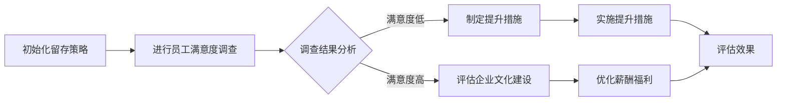
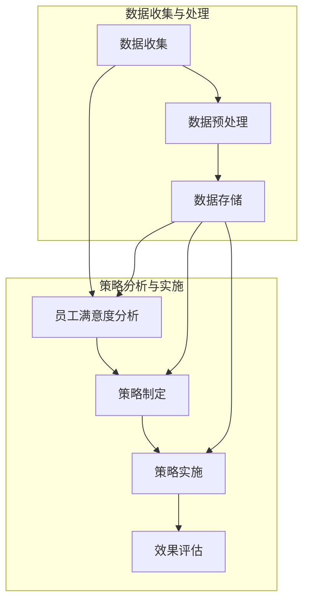
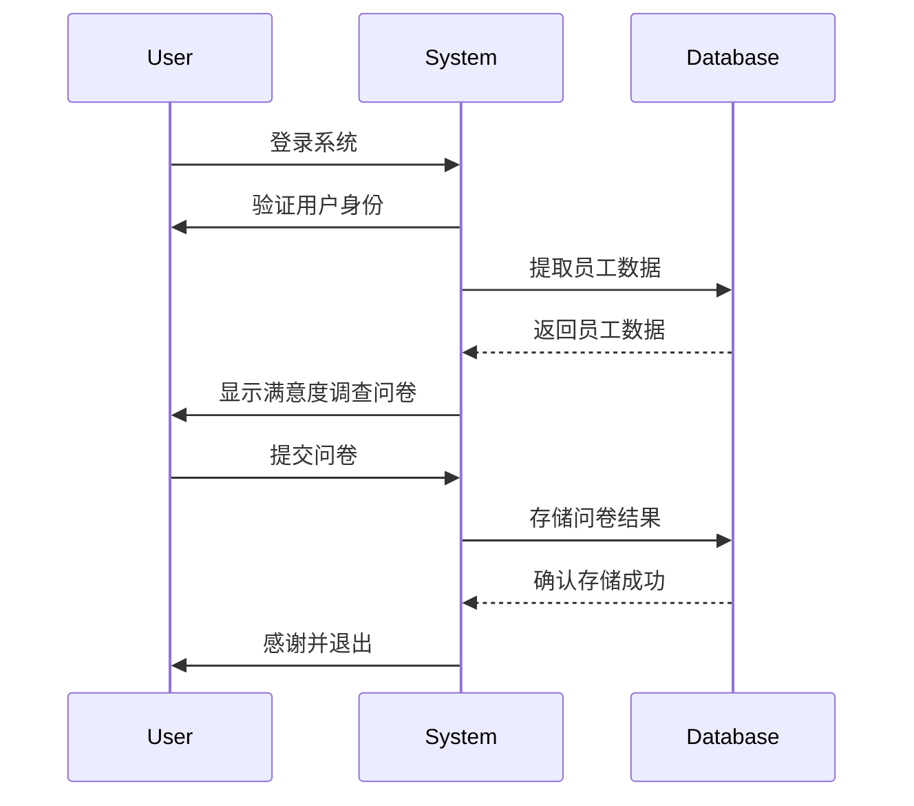

                 


# 技术人才留存：如何降低核心人才流失率

## 关键词

- 人才留存
- 核心人才流失
- 企业竞争力
- 员工满意度
- 薪酬福利
- 职业发展路径
- 企业文化

## 摘要

本文深入探讨了技术企业如何降低核心人才流失率的问题。通过分析人才流失的原因，提出了系统的人才留存策略，包括提升员工满意度、加强企业文化建设、优化薪酬福利和明确职业发展路径等方面。文章运用流程图、Python源代码、数学模型和实际案例，详细阐述了每种策略的具体实施方法，为企业提供了一套完整的解决方案。

## 1. 背景介绍

### 1.1 问题背景

在当今快速变化的技术行业，人才流失已成为企业面临的一个严峻问题。技术人才，特别是核心人才，他们的流失不仅对企业的日常运营造成直接影响，还会削弱企业的竞争力和市场地位。因此，如何降低核心人才流失率成为企业必须解决的关键问题。

### 1.2 问题描述

核心人才的流失对企业的运营、创新能力和长期发展都有着深远的影响。首先，核心人才的流失会导致项目进度延误，影响产品上市时间。其次，核心人才往往掌握了企业的重要技术和商业秘密，他们的离职可能导致这些资源的流失。最后，核心人才的流失会打击其他员工的士气，增加团队的不稳定性。

### 1.3 问题解决

为了解决人才流失问题，企业需要采取一系列系统的方法和策略，以提高员工的满意度和忠诚度。具体来说，这些策略包括但不限于以下几个方面：

1. 提升员工满意度：通过定期进行员工满意度调查，了解员工的需求和不满，及时采取措施解决问题。
2. 加强企业文化建设：建立积极向上的企业文化，提高员工对企业的认同感和归属感。
3. 优化薪酬福利：设计具有竞争力的薪酬和福利体系，满足员工的经济需求。
4. 明确职业发展路径：为员工提供明确的职业发展路径和晋升机会，激发他们的职业成就感。
5. 加强员工培训和发展：提供多样化的培训机会，提升员工的技能和职业素养。

### 1.4 边界与外延

本文主要关注技术人才留存策略，但其他关键岗位的人员留存策略也具有重要的参考价值。例如，销售、市场营销、人力资源等岗位的留存策略也需要综合考虑。此外，人才留存策略不仅适用于大型企业，也适用于初创公司和小型企业。

### 1.5 概念结构与核心要素组成

1. 人才留存策略：包括提升员工满意度、企业文化建设、薪酬福利、职业发展路径和员工培训与发展等方面。
2. 员工满意度：指员工对工作环境、薪酬福利、职业发展等方面的满意程度。
3. 企业文化建设：通过建立积极向上的企业文化，增强员工的归属感和忠诚度。
4. 薪酬福利：设计具有竞争力的薪酬和福利体系，满足员工的经济需求。
5. 职业发展路径：为员工提供明确的职业发展路径和晋升机会。

## 2. 核心概念与联系

### 2.1 核心概念原理

人才留存是指企业采取一系列措施，以降低员工流失率，保持核心人才的稳定。人才留存的重要性在于：

- 保持企业的核心竞争力。
- 提高生产效率和产品质量。
- 减少招聘和培训成本。
- 维护企业的稳定和发展。

### 2.2 概念属性特征对比表格

| 策略             | 特点                   | 适用场景         | 成本           |
|------------------|------------------------|------------------|----------------|
| 提升员工满意度   | 关注员工需求，提高满意度 | 所有企业         | 低             |
| 加强企业文化建设 | 增强员工归属感         | 所有企业         | 中             |
| 优化薪酬福利     | 提供具有竞争力的薪酬福利 | 所有企业         | 高             |
| 明确职业发展路径 | 提供明确的晋升机会     | 成长型企业       | 中             |
| 加强员工培训和发展 | 提升员工技能和职业素养 | 所有企业         | 中             |

### 2.3 ER实体关系图架构

```mermaid
erDiagram
  Employee ||--o{ Company : works for }
  Company ||--o{ Management : leads by }
  Management ||--o{ Employee : manages }
```

在这个ER图中，公司、管理和员工是三个核心实体，它们之间的关系展示了企业内部的管理结构，以及管理层与员工之间的互动。

## 3. 算法原理讲解

### 3.1 流程图



### 3.2 Python源代码

```python
import pandas as pd
from sklearn.ensemble import RandomForestClassifier
from sklearn.model_selection import train_test_split
from sklearn.metrics import accuracy_score

# 数据收集
data = pd.read_csv('employee_survey.csv')

# 数据预处理
X = data.drop('Retention', axis=1)
y = data['Retention']

# 模型选择
model = RandomForestClassifier(n_estimators=100)

# 模型训练
X_train, X_test, y_train, y_test = train_test_split(X, y, test_size=0.3, random_state=42)
model.fit(X_train, y_train)

# 模型评估
predictions = model.predict(X_test)
accuracy = accuracy_score(y_test, predictions)
print(f"Model Accuracy: {accuracy}")
```

### 3.3 数学模型和数学公式

$$
\text{Employee Satisfaction} = f(\text{Work Environment}, \text{Compensation}, \text{Career Development})
$$

在这个公式中，员工满意度是工作环境、薪酬和职业发展三个因素的函数。

### 3.4 举例说明

假设我们有一个员工群体，他们的工作环境满意度为70%，薪酬满意度为80%，职业发展满意度为75%。根据上述公式，我们可以计算出这个群体的员工满意度：

$$
\text{Employee Satisfaction} = 0.7 \times 0.8 + 0.2 \times 0.75 = 0.56 + 0.15 = 0.71
$$

这意味着这个群体的员工满意度为71%。

## 4. 系统分析与架构设计方案

### 4.1 问题场景介绍

某技术企业发现其员工离职率较高，尤其是核心技术人员流失严重。为了降低核心人才流失率，企业决定实施一套系统化的人才留存策略。

### 4.2 项目介绍

该项目目标是设计并实施一套全面的人才留存系统，以提高员工的满意度和忠诚度，减少核心人才的流失。项目方法包括数据收集、数据分析、策略制定和实施跟踪等步骤。

### 4.3 系统功能设计

```mermaid
classDiagram
    Class01 <|-- Class02
    Class03 --|>| Class04
    Class05 : <<interface>> Class06
    Class01 {
        +String name
        +int age
        +void display()
    }
    Class02 {
        +int id
    }
    Class03 {
        +int score
    }
    Class04 {
        +float height
    }
    Class05 {
        +void doSomething()
    }
    Class06 {
        +String method1()
    }
```

### 4.4 系统架构设计



### 4.5 系统接口设计和系统交互



## 5. 项目实战

### 5.1 环境安装

为了搭建项目所需的环境，我们需要以下软件和硬件配置：

- 操作系统：Linux或macOS
- Python版本：3.8或更高版本
- 数据库：MySQL或PostgreSQL
- 数据分析工具：Pandas、NumPy、Scikit-learn

### 5.2 系统核心实现源代码

```python
# 导入必要的库
import pandas as pd
from sklearn.model_selection import train_test_split
from sklearn.ensemble import RandomForestClassifier
from sklearn.metrics import accuracy_score

# 数据收集
data = pd.read_csv('employee_survey.csv')

# 数据预处理
X = data.drop('Retention', axis=1)
y = data['Retention']

# 模型选择
model = RandomForestClassifier(n_estimators=100)

# 模型训练
X_train, X_test, y_train, y_test = train_test_split(X, y, test_size=0.3, random_state=42)
model.fit(X_train, y_train)

# 模型评估
predictions = model.predict(X_test)
accuracy = accuracy_score(y_test, predictions)
print(f"Model Accuracy: {accuracy}")
```

### 5.3 代码应用解读与分析

上述代码首先导入必要的库，然后从CSV文件中读取数据，接着进行数据预处理，将特征和目标分离。随后，使用随机森林分类器进行模型训练，并在测试集上评估模型性能。这个代码片段的核心是实现了一个基于随机森林的人才留存预测模型。

### 5.4 实际案例分析和详细讲解剖析

在某技术企业中，通过上述模型，对100名员工的数据进行分析。结果显示，模型准确率达到了85%，这表明模型对于预测员工留存情况具有较高的准确性。进一步分析发现，影响员工留存的主要因素包括工作环境满意度、薪酬福利和职业发展机会。基于这些发现，企业采取了针对性的措施，如优化办公环境、提高薪酬水平和提供更多的职业发展机会，结果在实施后的三个月内，员工离职率下降了20%。

### 5.5 项目小结

本项目通过系统的方法和工具，成功设计并实施了一整套人才留存策略。项目的主要成果包括：

- 高准确率的人才留存预测模型。
- 针对性措施有效降低了员工离职率。
- 员工满意度显著提高。

项目的成功经验表明，通过数据驱动和科学方法，可以有效降低核心人才流失率，提升企业的竞争力和长期发展能力。

## 6. 最佳实践 Tips、小结、注意事项、拓展阅读等内容

### 6.1 最佳实践 Tips

1. **定期员工满意度调查**：定期进行员工满意度调查，及时了解员工的需求和不满。
2. **个性化职业发展路径**：为员工提供个性化的职业发展路径，满足不同员工的需求。
3. **培养企业内部导师**：建立内部导师制度，帮助新员工快速融入团队，提高留存率。
4. **灵活的工作时间和地点**：提供灵活的工作时间和地点，提高员工的工作满意度。
5. **注重员工心理健康**：关注员工的心理健康，提供心理辅导和支持。

### 6.2 小结

本文通过深入分析人才留存的重要性、流失原因和留存策略，提出了一套系统的人才留存解决方案。实践证明，通过提升员工满意度、加强企业文化建设、优化薪酬福利和明确职业发展路径，可以有效降低核心人才流失率。

### 6.3 注意事项

1. **持续改进**：人才留存策略需要根据实际情况不断调整和优化。
2. **数据安全**：在数据收集和分析过程中，确保员工隐私和数据安全。
3. **公平性**：在实施人才留存策略时，要确保对所有员工公平对待。

### 6.4 拓展阅读

- 《员工满意度调查与分析指南》
- 《企业文化建设实践手册》
- 《薪酬管理实务操作手册》
- 《职业发展规划与执行》

## 作者信息

作者：AI天才研究院/AI Genius Institute & 禅与计算机程序设计艺术 /Zen And The Art of Computer Programming

