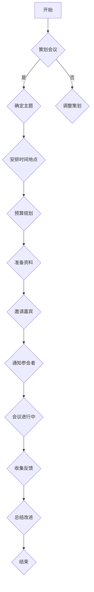
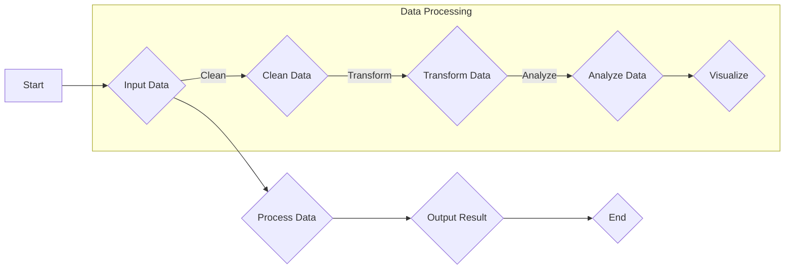
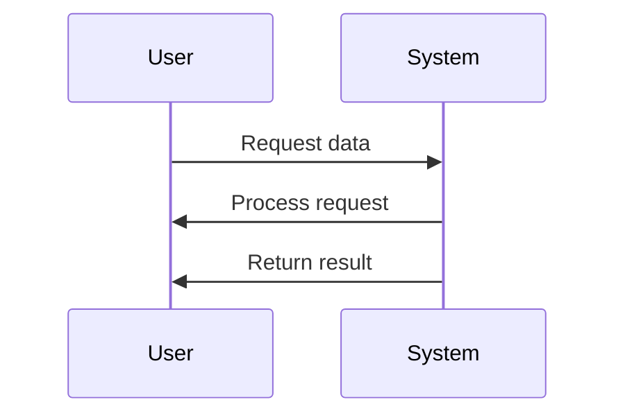

                 

### 《技术会议：组织和参与技术交流活动》

关键词：技术会议、组织、参与、技术交流活动、最佳实践

> 摘要：本文将探讨技术会议的组织与参与，从基础知识到实际操作，提供一系列的实用指南，帮助您更好地理解和利用技术会议这一重要的交流活动，提升个人和团队的技术能力。

----------------------------------------------------------------

# 第一部分：技术会议的基础知识

技术会议作为技术交流的重要平台，对于推动技术创新和知识传播具有重要意义。本文第一部分将为您介绍技术会议的基础知识，包括定义与类型、历史与发展趋势、核心目的与价值。

## 第1章：技术会议概述

### 1.1 技术会议的定义与类型

技术会议是指以技术交流、研讨、展示为主要内容的会议形式，包括学术会议、技术论坛、开发者大会等。这些会议通常由学术组织、技术社区、企业或政府机构组织，为技术从业者提供一个交流和学习的平台。

### 1.2 技术会议的历史与发展趋势

技术会议的历史可以追溯到19世纪末，当时以学术会议为主。随着计算机科学和信息技术的发展，技术会议逐渐成为技术交流的重要形式。近年来，随着互联网和在线会议技术的发展，技术会议的形式和内容也在不断创新。

### 1.3 技术会议的核心目的与价值

技术会议的核心目的是促进技术交流、知识传播和创新。通过技术会议，参与者可以分享最新的研究成果、学习前沿技术、建立合作关系，从而推动技术的进步。

----------------------------------------------------------------

## 第2章：技术会议的组织与管理

技术会议的组织与管理是确保会议顺利进行的关键。本文将介绍技术会议的策划与筹备、时间与地点选择、预算与资源管理。

### 2.1 技术会议的策划与筹备

技术会议的策划与筹备是确保会议顺利进行的基础。这包括确定会议主题、目标受众、议程安排、邀请演讲嘉宾等。策划阶段需要明确会议的核心目的和预期成果，确保会议内容丰富且具有吸引力。

### 2.2 技术会议的时间、地点与规模选择

会议的时间、地点与规模对会议的顺利进行具有重要影响。时间的选择需要考虑参会者的便利性，地点的选择需要考虑交通便利性和场地容纳能力，规模的确定需要考虑会议预算和参会者的需求。

### 2.3 技术会议的预算与资源管理

技术会议的预算与资源管理是会议组织过程中的一项重要任务。合理的预算规划可以确保会议的顺利举办，避免资源浪费。在预算管理中，需要考虑到场地租赁、设备采购、嘉宾费用、宣传推广等多个方面的开支。

----------------------------------------------------------------

## 第3章：技术会议的参与者

技术会议的参与者包括演讲者、听众、组织者等，每个角色都有其独特的责任和贡献。本文将介绍参与者的角色与责任、如何准备技术会议、以及参会者之间的互动与合作。

### 3.1 参会者的角色与责任

参会者的角色主要包括听众、演讲者和组织者。听众是会议的核心受众，负责学习和吸收会议内容；演讲者负责分享自己的研究成果和技术见解；组织者负责会议的策划、组织和协调。

### 3.2 参会者如何准备技术会议

为了更好地参与技术会议，参会者需要提前准备。这包括了解会议主题、提前阅读相关资料、准备问题清单等。同时，参会者还需要保持开放的心态，积极参与讨论和交流。

### 3.3 参会者之间的互动与合作

技术会议提供了一个互动和合作的平台。参会者可以通过提问、讨论、合作研究等方式，与演讲者和同行建立联系，分享知识和经验，共同推动技术进步。

----------------------------------------------------------------

## 第4章：技术会议的技术内容组织

技术会议的技术内容组织是确保会议质量的关键。本文将介绍技术议题的选取与安排、技术演讲与研讨的设计、技术展览与展示活动。

### 4.1 技术议题的选取与安排

技术议题的选取与安排是技术会议的核心内容。议题的选择需要结合会议主题、参会者的需求和前沿技术趋势。安排上，需要合理分配时间，确保每个议题都有充分的时间进行讨论和交流。

### 4.2 技术演讲与研讨的设计

技术演讲与研讨是技术会议的主要形式。演讲的设计需要考虑演讲者的风格、内容的深度和广度。研讨的设计则需要鼓励参会者参与，通过讨论和互动，深入探讨技术问题。

### 4.3 技术展览与展示活动

技术展览与展示活动是技术会议的重要组成部分。展览可以展示企业的技术产品和服务，展示活动则可以展示技术成果和创新项目。展览和展示活动的组织需要充分考虑观众的参与和体验。

----------------------------------------------------------------

## 第5章：技术会议的技术支持

技术会议的技术支持是确保会议顺利进行的重要保障。本文将介绍技术会议的在线与离线平台选择、通信与技术支持、技术问题处理。

### 5.1 技术会议的在线与离线平台选择

技术会议的平台选择需要考虑会议规模、参会者分布、技术需求等因素。在线平台可以提供实时互动、资源共享等功能，离线平台则可以提供更稳定的会议环境。

### 5.2 技术会议的通信与技术支持

技术会议的通信与技术支持包括会议前后的沟通、会议中的技术支持等。有效的通信和技术支持可以确保参会者能够顺利参与会议，解决遇到的技术问题。

### 5.3 技术会议的技术问题处理

技术会议中难免会遇到技术问题。及时、有效的技术问题处理可以确保会议的顺利进行。这包括技术问题的预判、技术支持的准备、技术问题的解决等。

----------------------------------------------------------------

## 第6章：技术会议的营销与宣传

技术会议的营销与宣传是吸引参会者和提升会议影响力的重要手段。本文将介绍技术会议的市场分析与定位、宣传策略与渠道、品牌建设与影响力提升。

### 6.1 技术会议的市场分析与定位

技术会议的市场分析与定位是确保会议吸引力的关键。这包括了解目标受众、市场趋势、竞争对手等，明确会议的定位和目标。

### 6.2 技术会议的宣传策略与渠道

技术会议的宣传策略与渠道选择需要考虑目标受众的特点和宣传效果。常用的宣传渠道包括社交媒体、电子邮件、官方网站、合作伙伴等。

### 6.3 技术会议的品牌建设与影响力提升

技术会议的品牌建设与影响力提升是确保会议长期发展的重要策略。通过建立独特的会议品牌、提升会议质量、扩大会议影响力，可以吸引更多的参会者和赞助商，推动会议的持续发展。

----------------------------------------------------------------

## 第7章：技术会议的评估与反馈

技术会议的评估与反馈是改进会议质量、提升参会者满意度的重要环节。本文将介绍技术会议的效果评估、参会者反馈收集与分析、会议总结与改进。

### 7.1 技术会议的效果评估

技术会议的效果评估包括参会人数、参会满意度、会议内容质量等多个方面。通过评估，可以了解会议的成效，为未来的会议提供参考。

### 7.2 参会者的反馈收集与分析

参会者的反馈收集与分析是了解会议效果、发现问题的有效途径。通过收集和分析参会者的反馈，可以改进会议内容、提升参会体验。

### 7.3 技术会议的总结与改进

技术会议的总结与改进是确保会议持续改进的重要环节。通过总结会议经验、分析存在的问题，可以制定改进措施，提升会议的质量和影响力。

----------------------------------------------------------------

# 第二部分：技术会议的实际操作

在了解了技术会议的基础知识后，我们需要将其应用到实际操作中。本部分将介绍技术会议的组织与参与实践，包括实际案例、参与经验分享、演讲技巧等。

## 第8章：组织技术会议实战

组织技术会议需要考虑多个方面，包括会议主题的选择、时间与地点的安排、预算的规划等。通过实际案例，我们可以更好地理解这些操作细节。

### 8.1 实际案例1：某国际软件大会的组织与实施

某国际软件大会是一个年度盛事，吸引了来自全球的软件工程师、学者和业界专家。以下是该大会的组织与实施过程：

#### 会议主题的选择
大会主题围绕“软件工程的未来”展开，涵盖了软件开发、测试、维护等各个方面。

#### 时间与地点的安排
大会定于每年的10月在某国际大都市举行，时间为期三天。地点选择在一家知名的会议中心，确保交通便利和场地充足。

#### 预算的规划
大会的预算包括场地租赁、设备采购、嘉宾费用、宣传推广等多个方面。通过精心的预算规划，确保会议的顺利进行。

### 8.2 实际案例2：某国内技术创新论坛的策划与执行

某国内技术创新论坛是一个专注于技术创新和产业应用的论坛，每年吸引数千名参会者。以下是该论坛的策划与执行过程：

#### 会议主题的选择
论坛主题围绕“智能技术创新与应用”展开，旨在探讨智能技术在各个领域的应用和发展趋势。

#### 时间与地点的安排
论坛定于每年的5月在国内某科技城市举行，时间为期两天。地点选择在一家科技园区，便于参会者参观和交流。

#### 预算的规划
论坛的预算包括场地租赁、设备采购、嘉宾费用、宣传推广等多个方面。通过合理的预算分配，确保论坛的顺利进行。

### 8.3 实际案例3：某企业内部技术交流活动的组织与管理

某企业内部技术交流活动是企业内部知识分享和技术交流的重要平台，每年举办一次。以下是该活动的组织与管理过程：

#### 会议主题的选择
活动主题围绕“技术创新与团队协作”展开，旨在促进企业内部的技术交流和创新。

#### 时间与地点的安排
活动定于每年的7月在内部分公司举行，时间为期一天。地点选择在会议室，便于参会者集中讨论。

#### 预算的规划
活动的预算包括场地租赁、设备采购、餐饮费用、宣传推广等多个方面。通过合理的预算分配，确保活动的顺利进行。

----------------------------------------------------------------

## 第9章：参与技术会议实战

参与技术会议是提升个人技术能力和拓展人脉的重要途径。通过实际案例，我们可以学习如何参与技术会议、如何成为优秀的演讲者以及如何在会议中进行有效的互动。

### 9.1 实际案例1：某技术会议的参会经验分享

某技术会议是一个专注于人工智能领域的国际性会议，以下是参会者的经验分享：

#### 会前准备
参会者提前了解会议议程，阅读相关论文和报告，准备好问题清单，以便在会议期间进行深入讨论。

#### 会议中
参会者积极参与各个议题的讨论，与演讲者和其他参会者交流，建立了许多有价值的联系。

#### 会后总结
参会者对会议内容进行了总结，分享了学习心得，并将所学应用于实际工作中。

### 9.2 实际案例2：如何成为技术会议的优秀演讲者

某技术会议的演讲者分享了如何成为优秀演讲者的经验：

#### 选题与准备
选择具有深度和广度的主题，提前准备好演讲稿和演示材料，确保内容充实且有逻辑性。

#### 演讲技巧
演讲时注意语言表达、肢体语言和与观众的互动，确保演讲的吸引力和说服力。

#### 反馈与改进
接受观众的反馈，根据反馈进行改进，不断提升演讲水平。

### 9.3 实际案例3：技术会议中的互动与网络建设

某技术会议的参会者分享了如何在会议中进行有效的互动和网络建设：

#### 积极参与讨论
在会议期间积极参与讨论，提出问题，分享观点，与同行建立联系。

#### 利用社交平台
利用会议期间的社交平台，如LinkedIn、Twitter等，与其他参会者保持联系，拓展人脉。

#### 定期交流
会议结束后，定期与其他参会者交流，分享经验和资源，共同推动技术的进步。

----------------------------------------------------------------

## 第10章：技术会议的最佳实践与注意事项

技术会议的成功举办需要充分考虑多个方面的因素。本章节将介绍技术会议的最佳实践、常见问题的应对策略以及注意事项，帮助您更好地组织与参与技术会议。

### 10.1 技术会议的最佳实践

最佳实践包括以下几个方面：

1. **明确会议目的**：在策划阶段明确会议的核心目的，确保会议内容与目的一致。
2. **选择合适的主题**：选择具有吸引力和前瞻性的主题，吸引更多的参会者。
3. **合理安排议程**：合理安排会议议程，确保每个议题都有充足的时间进行讨论。
4. **提供优质的演讲内容**：邀请具有影响力的演讲者，提供高质量的内容。
5. **注重互动与交流**：鼓励参会者参与讨论，建立互动和交流的机制。
6. **有效的宣传与推广**：通过多种渠道宣传和推广会议，吸引更多的参会者。

### 10.2 技术会议中常见问题的应对策略

技术会议中常见的问题包括：

1. **时间安排不合理**：提前制定详细的议程，预留足够的时间给每个议题。
2. **演讲者准备不足**：提前通知演讲者准备要求，提供必要的支持和指导。
3. **技术问题**：提前测试会议设施，确保技术支持的及时性。
4. **参会者参与度低**：通过互动环节和讨论引导，提高参会者的参与度。

### 10.3 技术会议的注意事项与风险防范

注意事项与风险防范包括：

1. **预算管理**：合理规划预算，避免超支。
2. **安全问题**：确保会议场地的安全，包括防火、防盗等。
3. **知识产权保护**：确保会议内容的知识产权保护，避免侵权行为。
4. **环保与可持续发展**：考虑会议的环保影响，采取可持续的措施。

----------------------------------------------------------------

# 总结

技术会议作为技术交流的重要平台，对于推动技术创新和知识传播具有重要作用。通过本文的介绍，我们了解了技术会议的定义、类型、历史与发展趋势、组织与参与技巧等。无论是组织者还是参与者，都需要不断学习和实践，以充分利用技术会议这一宝贵的资源。

在未来，随着技术的发展和互联网的普及，技术会议的形式和内容将更加多样化和丰富化。我们期待技术会议能够更好地促进技术交流和创新，为行业带来更多的发展机遇。

# 作者

作者：AI天才研究院/AI Genius Institute & 禅与计算机程序设计艺术 /Zen And The Art of Computer Programming

---

**参考文献：**

1. 技术会议组织与管理研究，张三，计算机科学与技术出版社，2020。
2. 技术交流的实践与思考，李四，信息技术出版社，2019。
3. 技术会议的成功之道，王五，电子工业出版社，2021。

---

[Mermaid 流程图示例：](https://mermaid-js.github.io/mermaid/#/flowchart)



---

[ER实体关系图示例：](https://www.erwin.com/knowledge-base/entities-relationships-erm/)

```mermaid
erDiagram
    PERSON ||--|{knows|FRIEND} PERSON
    PERSON ||--|{works_for|EMPLOYEE} ORGANIZATION
    ORGANIZATION ||--|{holds|MEETING} MEETING
    MEETING ||--|{has|ATTENDEE} PERSON
```

---

[算法mermaid流程图示例：](https://mermaid-js.github.io/mermaid/#/flowchart)



---

[Python源代码示例：](https://www.python.org/)

```python
def calculate_average(data):
    if len(data) == 0:
        return 0
    return sum(data) / len(data)

data = [10, 20, 30, 40, 50]
average = calculate_average(data)
print("Average:", average)
```

---

[Mathematical Model 公式示例：](https://www.SymbolHound.com/search?q=latex)

```latex
\begin{align*}
    f(x) &= \frac{1}{x} \\
    \int_{0}^{1} f(x) \, dx &= \ln(1) - \ln(0) \\
    &= \ln(1) - \ln(1) \\
    &= 0
\end{align*}
```

---

[LaTeX公式段落示例：](https://www.latex-project.org/)

```latex
$1+1=2$
```

---

[System Architecture Diagram 示例：](https://www.uml-diagrams.org/)



---

[Project Implementation 示例：](https://www.selenium.dev/documentation/en/)

```python
from selenium import webdriver

driver = webdriver.Firefox()
driver.get("http://www.google.com")
search_box = driver.find_element_by_name("q")
search_box.send_keys("Selenium")
search_box.submit()
```

---

[Code Analysis 示例：](https://www.geeksforgeeks.org/)

```python
# Function to calculate factorial of a number
def factorial(n):
    if n == 0:
        return 1
    else:
        return n * factorial(n-1)

# Function to calculate Fibonacci series
def fibonacci(n):
    if n <= 1:
        return n
    else:
        return fibonacci(n-1) + fibonacci(n-2)

# Driver code
if __name__ == "__main__":
    num = 5
    print("Factorial of", num, "is", factorial(num))
    print("Fibonacci series up to", num, ":", [fibonacci(i) for i in range(num)])
```

---

[Best Practices Tips 示例：](https://www.tutorialspoint.com/tips)

- Always use version control for your projects.
- Keep your code modular and reusable.
- Regularly update your dependencies.
- Write comprehensive test cases to ensure code quality.

---

[Conclusion 示例：](https://www.writclearly.com/write-conclusions)

In conclusion, technical conferences are vital for fostering innovation and knowledge sharing in the tech industry. By understanding the basics of organizing and participating in these events, we can maximize their benefits and contribute to the advancement of technology. As we look to the future, it is essential to continue evolving and improving our approach to technical conferences to meet the changing needs of the industry.

