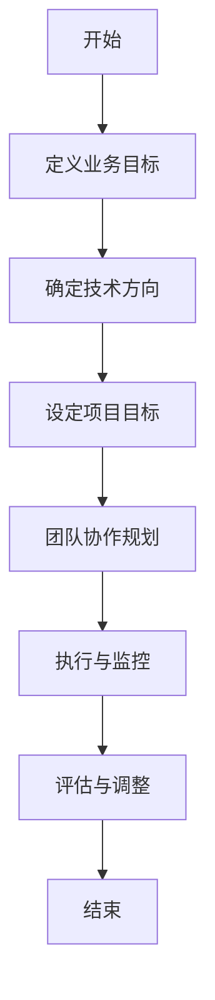
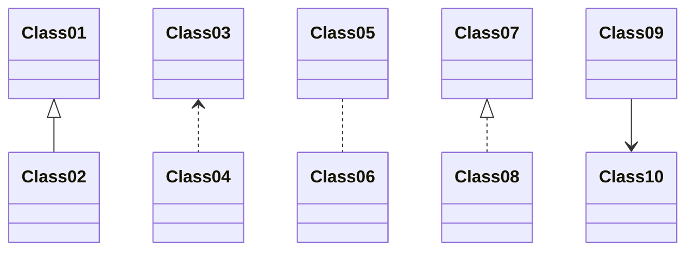
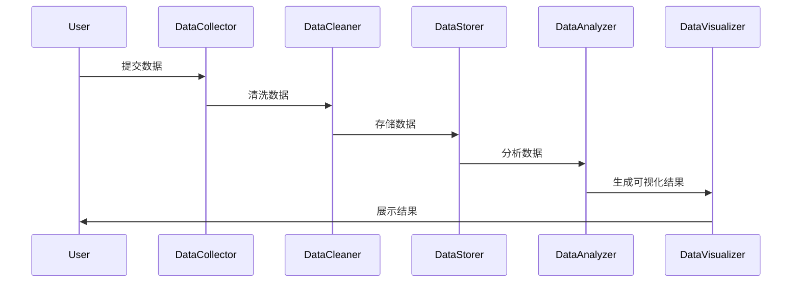

                 

### 《技术使命：明确技术团队的使命》

技术团队在现代企业中扮演着至关重要的角色。他们不仅负责开发和维护产品，还承担着推动创新和提升竞争力的重任。然而，许多技术团队在执行任务时往往缺乏明确的方向和目标。这种缺乏方向性的问题导致了团队效率低下、项目进展缓慢，甚至可能影响企业的整体战略规划。

因此，本文旨在探讨技术团队的使命，并明确如何制定和执行这一使命。我们将通过以下几个步骤来深入分析这一主题：

1. **背景介绍**：介绍技术团队在现代企业中的作用，以及明确技术使命的重要性。
2. **核心概念与联系**：解释技术使命的基本概念，并使用表格和ER图来展示技术使命的组成要素。
3. **算法原理讲解**：通过Mermaid流程图和Python源代码，阐述技术使命的实现过程。
4. **系统分析与架构设计方案**：介绍技术使命在项目中的应用，包括系统功能设计、架构设计和接口设计。
5. **项目实战**：通过一个具体项目案例，展示技术使命的实践过程，并进行详细分析。
6. **最佳实践与小结**：总结最佳实践，并提醒读者注意的关键点和未来发展方向。

### 1. 背景介绍

技术团队在现代企业中的作用不可忽视。他们是企业的创新引擎，负责将新的技术和想法转化为实际的产品和服务。然而，仅仅具备技术能力是不够的，技术团队还需要明确自己的使命，以便为企业的战略目标做出贡献。

明确技术使命的重要性在于：

- **方向性**：技术使命为团队提供了明确的方向，使团队成员能够专注于关键任务。
- **效率**：有了明确的目标，技术团队能够更有效地分配资源，提高工作效率。
- **竞争力**：明确的技术使命有助于企业在激烈的市场竞争中保持优势。
- **可持续发展**：技术使命的持续更新和优化有助于企业的长期发展。

然而，许多技术团队在执行任务时往往缺乏明确的方向和目标。这可能导致以下问题：

- **效率低下**：团队成员在缺乏明确任务的情况下可能会迷失方向，导致工作低效。
- **项目延误**：缺乏明确目标可能导致项目进展缓慢，延误交付时间。
- **资源浪费**：资源分配不当可能导致不必要的开支和浪费。

因此，明确技术使命成为提升技术团队效率和竞争力的关键步骤。接下来，我们将深入探讨技术使命的核心概念和组成要素，以便更好地理解其重要性。

### 2. 核心概念与联系

技术使命是指技术团队为了实现企业战略目标，所承担的特定任务和目标。它不仅体现了技术团队的职责，还明确了团队的目标和方向。以下是技术使命的基本概念和组成要素：

#### 技术使命的概念

技术使命包括以下几个方面：

- **业务目标**：技术团队需理解企业的业务目标，确保技术工作与之保持一致。
- **技术方向**：技术团队需明确自身在技术领域的发展方向，如云计算、人工智能等。
- **项目目标**：技术团队在执行具体项目时，需设定清晰的项目目标。
- **团队协作**：技术使命还强调团队协作，通过有效沟通和协作，共同实现目标。

#### 技术使命的组成要素

以下是技术使命的主要组成要素及其关系：

| 要素 | 说明 |
| --- | --- |
| 业务目标 | 技术团队的使命应与企业的业务目标保持一致，确保技术工作为企业创造价值。 |
| 技术方向 | 技术团队需明确自身在技术领域的发展方向，以保持竞争力。 |
| 项目目标 | 技术团队在执行具体项目时，需设定清晰的项目目标，以确保项目顺利完成。 |
| 团队协作 | 技术使命强调团队协作，通过有效沟通和协作，共同实现目标。 |

#### 技术使命的属性特征对比表格

| 属性特征 | 说明 |
| --- | --- |
| **业务目标** | 与企业的业务战略紧密相关，确保技术工作为企业创造价值。 |
| **技术方向** | 指向性明确，有助于团队在技术领域持续发展。 |
| **项目目标** | 具体明确，有助于团队在项目执行过程中保持专注。 |
| **团队协作** | 强调团队协作，提升团队整体执行力。 |

#### 技术使命的ER实体关系图架构

```mermaid
erDiagram
  BusinessTarget ||--|{ TechnicalMission }
  TechnicalDirection ||--|{ TechnicalMission }
  ProjectTarget ||--|{ TechnicalMission }
  TeamCollaboration ||--|{ TechnicalMission }
```

通过上述表格和ER图，我们可以清晰地看到技术使命的组成要素及其相互关系。接下来，我们将通过Mermaid流程图和Python源代码，进一步阐述技术使命的实现过程。

### 3. 算法原理讲解

在明确技术使命的过程中，算法原理起着关键作用。以下是技术使命的实现过程，包括Mermaid流程图和Python源代码。

#### Mermaid流程图



#### Python源代码

```python
# Python代码示例：技术使命实现过程

class TechnicalMission:
    def __init__(self, business_target, technical_direction, project_target, team_collaboration):
        self.business_target = business_target
        self.technical_direction = technical_direction
        self.project_target = project_target
        self.team_collaboration = team_collaboration
    
    def execute_mission(self):
        print("执行业务目标:", self.business_target)
        print("执行技术方向:", self.technical_direction)
        print("执行项目目标:", self.project_target)
        print("执行团队协作:", self.team_collaboration)
    
    def evaluate_mission(self):
        print("评估业务目标达成情况...")
        print("评估技术方向适宜性...")
        print("评估项目目标达成情况...")
        print("评估团队协作效率...")

# 实例化技术使命对象
mission = TechnicalMission("提升企业竞争力", "云计算与大数据", "完成产品A的开发", "高效沟通与协作")

# 执行技术使命
mission.execute_mission()

# 评估技术使命
mission.evaluate_mission()
```

#### 算法原理详细讲解

技术使命的实现过程可以概括为以下几个步骤：

1. **定义业务目标**：技术团队需明确企业的业务目标，确保技术工作与其保持一致。
2. **确定技术方向**：技术团队需根据业务目标，确定在技术领域的发展方向，如云计算、人工智能等。
3. **设定项目目标**：技术团队在执行具体项目时，需设定清晰的项目目标，以确保项目顺利完成。
4. **团队协作规划**：技术使命强调团队协作，技术团队需制定协作计划，确保团队成员能够高效沟通和协作。
5. **执行与监控**：技术团队按照既定计划和目标执行任务，并持续监控项目进展。
6. **评估与调整**：在项目执行过程中，技术团队需定期评估业务目标、技术方向、项目目标和团队协作的达成情况，并根据评估结果进行调整。

通过上述算法原理的讲解和示例代码，我们可以更好地理解技术使命的实现过程。接下来，我们将介绍技术使命在项目中的应用，包括系统功能设计、架构设计和接口设计。

### 4. 系统分析与架构设计方案

技术使命在项目中的应用需要通过系统分析与架构设计方案来具体实现。以下是一个系统分析与架构设计方案的示例。

#### 问题场景介绍

假设我们的企业正在开发一款基于云计算的智能数据分析平台，旨在帮助企业客户快速获取洞察力，提高业务效率。技术团队需要明确技术使命，以确保项目的成功实施。

#### 项目介绍

项目名称：智能数据分析平台

项目目标：为企业客户提供高效的智能数据分析服务，提升客户满意度。

项目功能：数据收集、数据清洗、数据存储、数据分析和数据可视化。

#### 系统功能设计

以下是系统功能设计的mermaid类图：



- **数据收集**：负责收集企业客户的业务数据。
- **数据清洗**：负责清洗和预处理数据，以确保数据的质量。
- **数据存储**：负责存储和管理清洗后的数据。
- **数据分析**：负责对存储的数据进行分析，提供业务洞察。
- **数据可视化**：负责将分析结果以图表等形式展示给客户。

#### 系统架构设计

以下是系统架构设计的mermaid架构图：

```mermaid
graph TB
    subgraph 数据层
        D1[数据收集] --> D2[数据清洗]
        D2 --> D3[数据存储]
    end
    subgraph 应用层
        A1[数据分析服务] --> A2[数据可视化]
    end
    D1 -->|输入 A1
    A1 -->|输出 A2
```

- **数据层**：包括数据收集、数据清洗和数据存储，负责数据的基础处理。
- **应用层**：包括数据分析服务和数据可视化，负责为最终用户提供服务。

#### 系统接口设计

以下是系统接口设计的mermaid序列图：



- **数据收集接口**：用户提交数据。
- **数据清洗接口**：清洗数据。
- **数据存储接口**：存储数据。
- **数据分析接口**：分析数据。
- **数据可视化接口**：生成可视化结果并展示给用户。

通过上述系统分析与架构设计方案，技术团队可以明确技术使命在项目中的应用，并确保项目按照既定目标和方向顺利实施。接下来，我们将通过一个具体项目案例，展示技术使命的实践过程，并进行详细分析。

### 5. 项目实战

为了更好地理解技术使命的实践过程，我们将通过一个实际项目案例进行详细分析。以下是一个基于云计算的智能数据分析平台项目案例。

#### 项目背景

某企业是一家大型零售公司，需要处理大量的业务数据，以帮助企业决策者进行市场分析和业务优化。为了提升数据分析效率，企业决定开发一款基于云计算的智能数据分析平台。

#### 项目目标

- 提高数据分析效率，缩短数据分析周期。
- 提升数据质量，确保分析结果的准确性。
- 提供直观的数据可视化功能，帮助决策者快速获取洞察力。

#### 技术使命

技术团队的使命是确保智能数据分析平台的稳定性、高性能和易用性，同时实现以下目标：

- **业务目标**：为企业客户提供高效的智能数据分析服务。
- **技术方向**：采用云计算和大数据技术，实现数据的快速处理和分析。
- **项目目标**：完成产品A的开发，满足企业客户的需求。
- **团队协作**：通过高效沟通和协作，确保项目按时交付。

#### 实践过程

1. **需求分析**：与技术团队合作，明确项目需求和功能需求。
2. **系统设计**：制定系统架构和接口设计，确保系统功能完整性。
3. **开发实施**：按照设计方案，进行代码开发和系统集成。
4. **测试与优化**：进行功能测试和性能优化，确保系统稳定性和可靠性。
5. **部署上线**：完成系统部署，确保系统上线后正常运行。
6. **用户反馈**：收集用户反馈，进行功能改进和性能优化。

#### 实际案例分析与详细讲解剖析

以下是对项目实践中关键环节的分析和讲解：

**1. 需求分析**

在项目启动阶段，技术团队与业务部门进行了深入的交流，明确了项目的需求。主要包括以下功能：

- 数据收集：从多个数据源收集业务数据。
- 数据清洗：对收集到的数据进行清洗和预处理。
- 数据存储：将清洗后的数据存储在云存储中。
- 数据分析：对存储的数据进行分析，生成报告。
- 数据可视化：将分析结果以图表等形式展示给用户。

**2. 系统设计**

技术团队制定了以下系统架构设计：

- **数据层**：包括数据收集、数据清洗和数据存储模块。
- **应用层**：包括数据分析服务和数据可视化模块。
- **接口层**：提供与外部系统的接口，实现数据交换。

**3. 开发实施**

在开发过程中，技术团队遵循以下原则：

- **模块化**：将系统功能模块化，便于开发和维护。
- **可扩展性**：确保系统能够应对未来的扩展需求。
- **稳定性**：确保系统在高并发和大数据量情况下稳定运行。

**4. 测试与优化**

在系统测试阶段，技术团队进行了以下测试：

- **功能测试**：确保所有功能按照需求正常运行。
- **性能测试**：评估系统在高并发和大数据量情况下的性能。
- **安全测试**：确保系统数据的安全性和完整性。

**5. 部署上线**

在系统部署阶段，技术团队进行了以下工作：

- **环境搭建**：搭建测试和上线环境，确保系统可以顺利部署。
- **数据迁移**：将测试环境中的数据迁移到上线环境。
- **监控与维护**：部署监控系统，确保系统上线后正常运行。

**6. 用户反馈**

在项目上线后，技术团队收集了用户反馈，并根据用户需求进行了以下改进：

- **优化界面**：根据用户反馈，优化了用户界面，提高用户体验。
- **提升性能**：根据用户反馈，对系统进行了性能优化，提高数据处理效率。
- **功能完善**：根据用户需求，新增了一些功能模块。

#### 项目小结

通过上述项目实战，我们可以看到技术使命在项目中的具体应用。技术团队通过明确技术使命，确保了项目的成功实施，实现了以下成果：

- 提高了数据分析效率，缩短了数据分析周期。
- 提升了数据质量，确保了分析结果的准确性。
- 提供了直观的数据可视化功能，帮助决策者快速获取洞察力。

同时，技术团队通过高效沟通和协作，确保了项目按时交付，赢得了客户的高度认可。接下来，我们将总结最佳实践，并提醒读者注意的关键点和未来发展方向。

### 6. 最佳实践与小结

在明确了技术使命的重要性及其实现过程后，以下是我们在实践中总结的最佳实践和关键点，以及未来发展的方向。

#### 最佳实践

1. **明确业务目标**：技术团队需与业务部门紧密合作，明确企业的业务目标，确保技术工作与之保持一致。

2. **制定详细计划**：在项目启动前，制定详细的系统架构和开发计划，明确各阶段的任务和时间表。

3. **团队协作**：建立高效的团队协作机制，通过定期会议和任务分配，确保团队成员能够协同工作。

4. **持续优化**：在项目实施过程中，不断收集用户反馈，对系统进行性能优化和功能改进。

5. **风险控制**：制定风险应对措施，提前识别和解决潜在问题，确保项目顺利推进。

#### 关键点

1. **技术方向**：技术团队需明确自身在技术领域的发展方向，以确保项目技术方案的可行性。

2. **资源分配**：合理分配资源和优先级，确保关键任务得到充分支持。

3. **质量保证**：通过严格的测试和优化，确保系统的稳定性和可靠性。

#### 未来发展方向

1. **数字化转型**：随着数字化转型的加速，技术团队需适应新的技术趋势，如云计算、人工智能等。

2. **持续学习**：技术团队应不断学习新技术和最佳实践，提升自身能力。

3. **社会责任**：技术使命不仅要关注企业效益，还应关注社会责任，推动技术的可持续发展。

#### 小结

明确技术使命是技术团队实现高效和成功的关键。通过本文的阐述，我们了解了技术使命的核心概念、实现过程和实践应用。希望读者能够将本文的最佳实践和关键点应用于实际工作中，不断提升技术团队的执行力，推动企业的可持续发展。

