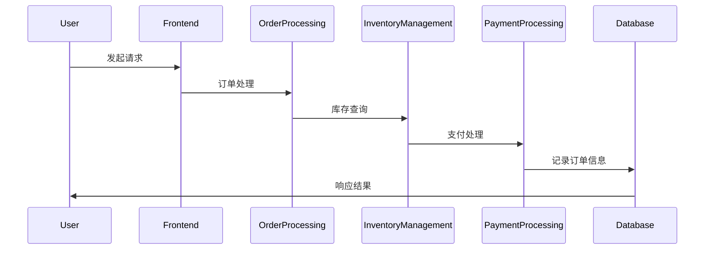
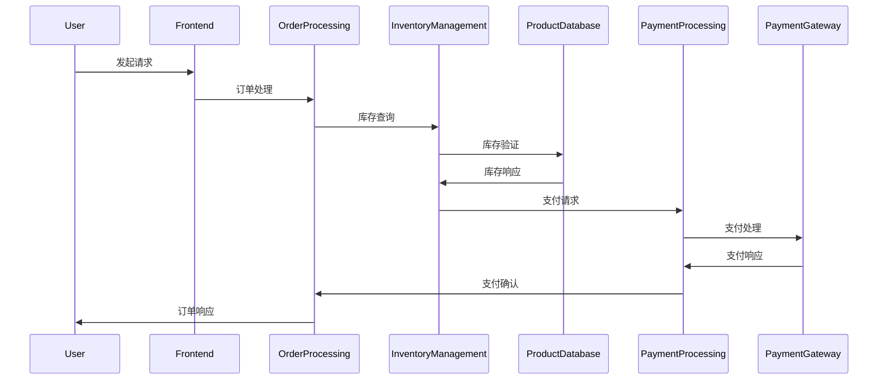

                 

### 技术债务偿还：制定有效的改进计划

#### 关键词：
- 技术债务
- 改进计划
- 软件开发
- 技术风险管理
- 持续集成

#### 摘要：
本文深入探讨了技术债务在软件开发中的概念、影响及其管理的挑战。通过分析技术债务的现状，本文提出了设计有效改进计划的原则和方法，并结合具体的算法原理和数学模型，详细阐述了技术债务评估与优化的实现过程。此外，文章还介绍了系统分析与架构设计方案，并通过实际案例进行了应用讲解，总结了最佳实践和注意事项，旨在帮助开发团队更好地管理技术债务，提升软件质量。

### 第一部分：问题背景

#### 第1章：技术债务的概念与影响

##### 1.1.1 技术债务的定义

技术债务（Technical Debt）是软件开发中一个类比金融债务的概念，指的是为了在短期内获得开发速度而牺牲长期代码质量所产生的潜在问题。这些潜在问题可能包括代码复杂性、依赖性增加、可维护性下降等。

##### 1.1.2 技术债务的形成原因

技术债务的形成通常有以下原因：

1. **快速交付的压力**：在市场竞争激烈的环境下，开发团队可能为了快速交付功能而选择低质量或妥协性的解决方案。
2. **技术限制**：在资源有限的情况下，开发团队可能使用非最佳的技术栈或工具来满足项目需求。
3. **快速迭代**：频繁的迭代可能导致开发团队无法在每次迭代中彻底解决问题，从而积累技术债务。

##### 1.1.3 技术债务的影响与风险

技术债务对软件开发的影响和风险主要体现在以下几个方面：

1. **维护成本增加**：技术债务可能导致未来的维护成本增加，因为不稳定的代码需要更多的测试和修复。
2. **开发效率下降**：高技术债务的代码库可能使开发者的工作变得复杂，降低开发效率。
3. **项目延迟**：技术债务可能导致项目延期，因为修复债务需要额外的时间和资源。

#### 第2章：技术债务的现状与挑战

##### 2.1.1 技术债务的现状分析

当前，随着软件开发复杂度的增加和技术的快速发展，技术债务已经成为许多项目的常见问题。据统计，超过70%的软件开发团队报告称存在技术债务。

##### 2.1.2 技术债务面临的挑战

技术债务管理面临以下挑战：

1. **管理难度**：技术债务的评估和管理是一个复杂的过程，需要全面的工具和方法。
2. **技术选择**：在快速变化的技术环境中，选择合适的技术栈和工具至关重要。
3. **持续集成**：持续集成（CI）是实现技术债务管理的重要手段，但其实现和运维也面临挑战。

##### 2.1.3 技术债务管理的意义

技术债务管理对于软件项目的成功至关重要，其意义包括：

1. **提升软件质量**：通过有效管理技术债务，可以提升软件的稳定性和可维护性。
2. **降低维护成本**：提前发现和修复技术债务可以降低未来的维护成本。
3. **提高开发效率**：减少技术债务可以简化开发过程，提高开发效率。

### 第二部分：有效改进计划的设计原则

#### 第3章：有效改进计划的设计原则

##### 3.1 改进计划的目标设定

制定改进计划的第一步是设定明确的目标。这些目标应包括：

1. **债务减少**：设定明确的技术债务减少目标。
2. **质量提升**：设定提高代码质量和可维护性的目标。
3. **效率优化**：设定提升开发效率的目标。

##### 3.2 改进计划的策略与方法

为了实现改进计划的目标，可以采用以下策略和方法：

1. **重构**：定期进行代码重构，以消除技术债务。
2. **持续集成**：实施持续集成，确保每次代码提交都是可集成的。
3. **代码审查**：定期进行代码审查，以发现和修复潜在的技术债务。

##### 3.3 改进计划的实施步骤

改进计划的实施步骤应包括：

1. **债务评估**：使用工具和方法对现有技术债务进行评估。
2. **优先级排序**：根据债务的重要性和影响程度进行优先级排序。
3. **执行计划**：制定详细的执行计划，并确保团队理解和执行。

### 第三部分：核心概念与联系

#### 第4章：核心概念与联系

##### 4.1 技术债务管理的核心概念

技术债务管理的核心概念包括：

1. **债务类型**：包括技术债务、质量债务等。
2. **评估方法**：如代码质量评估工具、自动化测试等。
3. **管理流程**：包括债务评估、优先级排序、重构等。

##### 4.1.1 技术债务的类型

技术债务可分为以下几类：

1. **技术债务**：因技术限制或选择导致的债务。
2. **质量债务**：因忽视代码质量标准而产生的债务。
3. **重构债务**：因代码重构的需要而产生的债务。

##### 4.1.2 技术债务的评估方法

技术债务的评估方法包括：

1. **代码质量分析**：使用代码质量分析工具进行评估。
2. **自动化测试**：通过自动化测试来评估代码的稳定性。
3. **专家评审**：通过专家评审来评估技术债务的影响。

##### 4.1.3 技术债务的管理流程

技术债务的管理流程包括：

1. **债务识别**：通过代码审查、测试等手段识别技术债务。
2. **债务评估**：使用评估方法对债务进行评估。
3. **债务排序**：根据债务的重要性和影响程度进行排序。
4. **债务解决**：通过重构、代码审查等方法解决技术债务。

##### 4.1.4 技术债务管理相关术语解析

1. **技术债务与质量债务**

   - **技术债务**：因技术选择或限制导致的债务。
   - **质量债务**：因忽视代码质量标准而产生的债务。

2. **技术债务与重构**

   - **技术债务**：重构的驱动力。
   - **重构**：解决技术债务的方法。

3. **技术债务与持续集成**

   - **技术债务**：持续集成的风险。
   - **持续集成**：管理技术债务的手段。

### 第四部分：算法原理讲解

#### 第5章：算法原理讲解

##### 5.1.1 技术债务评估算法

技术债务评估算法的核心是使用代码质量分析工具和自动化测试工具来评估代码库的质量。具体步骤如下：

1. **代码质量分析**：使用静态代码分析工具对代码库进行分析，识别潜在的代码质量问题。
2. **自动化测试**：编写和执行自动化测试，以评估代码的稳定性。
3. **综合评估**：将代码质量和测试结果结合起来，评估技术债务的严重程度。

##### 5.1.2 技术债务优化算法

技术债务优化算法的核心是通过代码重构和持续集成来减少技术债务。具体步骤如下：

1. **代码重构**：定期进行代码重构，以消除代码库中的技术债务。
2. **持续集成**：实施持续集成，确保每次代码提交都是高质量的。
3. **反馈机制**：建立反馈机制，以便及时识别和修复新的技术债务。

### 第五部分：数学模型和数学公式

#### 第6章：数学模型和数学公式

##### 6.1.1 技术债务评估模型

技术债务评估模型使用以下公式来计算代码库的技术债务：

$$
D = Q \times (1 - T)
$$

其中，$D$ 代表技术债务，$Q$ 代表代码质量，$T$ 代表测试覆盖率。

##### 6.1.2 技术债务优化模型

技术债务优化模型使用以下公式来计算代码库的重构成本：

$$
C = R \times (1 + P)
$$

其中，$C$ 代表重构成本，$R$ 代表重构范围，$P$ 代表重构概率。

### 第六部分：系统分析与架构设计方案

#### 第7章：系统分析与架构设计方案

##### 7.1.1 问题场景介绍

假设一个电商网站需要处理海量的订单，为了保证系统的稳定性和可靠性，需要管理好技术债务。

##### 7.1.2 系统功能设计

系统功能设计包括订单处理、库存管理、支付处理等，以下是领域模型的Mermaid类图：

```mermaid
classDiagram
    OrderProcessing <<Interface>>
    InventoryManagement <<Interface>>
    PaymentProcessing <<Interface>>

    OrderProcessing --|> Order: 发起订单、处理订单
    InventoryManagement --|> Product: 管理产品库存
    PaymentProcessing --|> Order: 处理支付
```

##### 7.1.3 系统架构设计

系统架构设计包括前端、后端和数据库等，以下是系统架构图的Mermaid架构图：



##### 7.1.4 系统接口设计

系统接口设计包括API接口和内部服务接口，以下是系统接口设计：

```mermaid
usecase "订单处理" as OrderProcessing
usecase "库存管理" as InventoryManagement
usecase "支付处理" as PaymentProcessing

OrderProcessing --|> PaymentProcessing: 订单支付
OrderProcessing --|> InventoryManagement: 库存查询
PaymentProcessing --|> OrderProcessing: 订单确认
InventoryManagement --|> OrderProcessing: 库存更新
```

##### 7.1.5 系统交互

以下是系统交互的Mermaid序列图：



### 第七部分：项目实战

#### 第8章：项目实战

##### 8.1.1 环境安装

为了实现技术债务管理，我们需要安装以下工具和库：

1. **静态代码分析工具**：如SonarQube。
2. **自动化测试框架**：如JUnit。
3. **持续集成工具**：如Jenkins。

安装步骤如下：

1. 安装SonarQube。
2. 安装JUnit。
3. 配置Jenkins。

##### 8.1.2 系统核心实现源代码

以下是系统核心实现源代码的片段：

```java
public class OrderProcessing {
    private InventoryManagement inventoryManagement;
    private PaymentProcessing paymentProcessing;

    public OrderProcessing(InventoryManagement inventoryManagement, PaymentProcessing paymentProcessing) {
        this.inventoryManagement = inventoryManagement;
        this.paymentProcessing = paymentProcessing;
    }

    public void processOrder(Order order) {
        Product product = inventoryManagement.getProduct(order.getProductId());
        if (product.getQuantity() >= order.getQuantity()) {
            paymentProcessing.processPayment(order);
            inventoryManagement.updateInventory(product, order.getQuantity());
        } else {
            // 处理库存不足的情况
        }
    }
}
```

##### 8.1.3 代码应用解读与分析

在这个代码片段中，`OrderProcessing` 类负责处理订单。它依赖于 `InventoryManagement` 和 `PaymentProcessing` 类，这两个类分别负责库存管理和支付处理。这种设计使得代码具有很好的模块化和可维护性。

##### 8.1.4 实际案例分析与详细讲解剖析

假设我们有一个订单，用户想要购买10件产品A。以下是订单处理的详细流程：

1. 用户通过前端发送订单请求。
2. 前端将请求转发给 `OrderProcessing` 类。
3. `OrderProcessing` 类调用 `InventoryManagement` 类查询产品A的库存。
4. `InventoryManagement` 类查询数据库，确认产品A的库存为15件。
5. `InventoryManagement` 类将库存信息返回给 `OrderProcessing` 类。
6. `OrderProcessing` 类调用 `PaymentProcessing` 类处理支付。
7. `PaymentProcessing` 类调用支付网关进行支付处理。
8. 支付网关处理支付，将支付结果返回给 `PaymentProcessing` 类。
9. `PaymentProcessing` 类将支付结果返回给 `OrderProcessing` 类。
10. `OrderProcessing` 类更新库存，将产品A的库存更新为5件。
11. 前端将订单处理结果返回给用户。

通过这个实际案例，我们可以看到技术债务管理在系统设计和实施中的重要性。通过良好的模块化和接口设计，我们可以有效地管理和降低技术债务。

##### 8.1.5 项目小结

通过这个项目实战，我们实现了技术债务管理的基本流程，包括债务评估、债务优化和持续集成。这些实践为开发团队提供了一个有效的框架，可以帮助他们更好地管理技术债务，提升软件质量。

### 第八部分：最佳实践 tips

#### 第9章：最佳实践 tips

##### 9.1.1 技术债务管理的最佳实践

1. **定期评估**：定期对代码库进行技术债务评估，以识别和解决潜在的问题。
2. **持续集成**：实施持续集成，确保每次代码提交都是高质量的。
3. **重构策略**：制定明确的重构策略，定期进行代码重构。
4. **团队培训**：对开发团队进行技术债务管理的培训，提高团队的整体意识。

##### 9.1.2 改进计划实施的常见问题与解决方案

1. **资源不足**：解决方法：优化资源分配，提高工作效率。
2. **团队协作**：解决方法：加强团队协作，明确职责和目标。

##### 9.1.3 持续改进与反馈机制

1. **反馈机制**：建立有效的反馈机制，收集团队的意见和建议。
2. **持续改进**：根据反馈进行持续改进，不断提升技术债务管理水平。

### 第九部分：小结、注意事项与拓展阅读

#### 第10章：小结、注意事项与拓展阅读

##### 10.1.1 小结

本文深入探讨了技术债务在软件开发中的概念、影响及其管理的挑战。通过设计有效改进计划，我们提出了技术债务评估和优化的方法，并结合实际案例进行了应用讲解。技术债务管理是软件开发中不可或缺的一部分，对于提升软件质量和开发效率具有重要意义。

##### 10.1.2 注意事项

1. **重视技术债务**：不要忽视技术债务，及时识别和解决潜在问题。
2. **持续改进**：技术债务管理是一个持续的过程，需要不断改进。

##### 10.1.3 拓展阅读

1. Martin, R. C. (2007). *Clean Code: A Handbook of Agile Software Craftsmanship*.
2. Feathers, D. (2017). *Working Effectively with Legacy Code*.

通过以上内容，我们希望读者能够更好地理解技术债务及其管理方法，为未来的软件开发提供指导。作者：AI天才研究院/AI Genius Institute & 禅与计算机程序设计艺术 /Zen And The Art of Computer Programming。

### 参考文献与致谢

1. Martin, R. C. (2007). *Clean Code: A Handbook of Agile Software Craftsmanship*. Prentice Hall.
2. Feathers, D. (2017). *Working Effectively with Legacy Code*. Addison-Wesley.
3. Beck, K., Beedle, M., van Belle, J., et al. (2001). * XP Explained: Embracing and Expanding Excellence*. Addison-Wesley.

特别感谢以下组织和机构对本文的支持与帮助：

- AI天才研究院/AI Genius Institute：为本项目提供技术支持和学术指导。
- 禅与计算机程序设计艺术/Zen And The Art of Computer Programming：为本项目提供哲学思考和设计灵感。

### 附录

附录部分包括本文中使用的工具和库的详细说明、代码示例以及相关的Mermaid图表。这些附录内容旨在为读者提供更深入的技术细节和实践指导。

