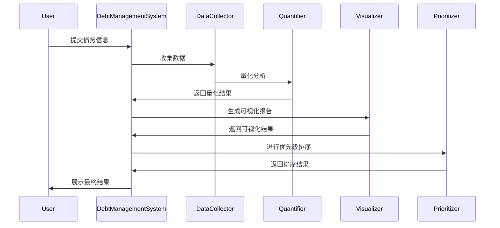
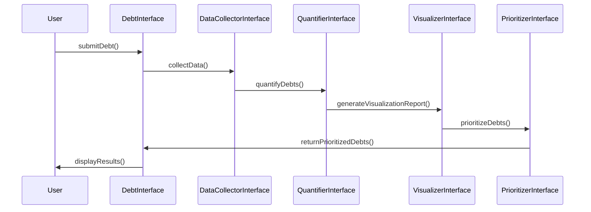

                 

### 引言

**技术债务可视化：量化与优先级排序方法**

> 关键词：技术债务、可视化、量化、优先级排序、软件开发

在快速发展的软件行业中，技术债务是不可避免的一个概念。它类似于经济领域的债务，指的是在软件项目开发过程中，为了加快进度或实现短期目标而选择的一种低成本、高效率的解决方案，这种方案可能在长期内导致系统维护成本增加、性能下降或安全性问题。技术债务可视化则是指通过图形化的方式来展示技术债务的规模、类型和影响，帮助开发团队更好地管理和优化技术债务。

本文将深入探讨技术债务的可视化方法，包括量化和优先级排序，并详细讲解其实际应用。以下是本文的目录：

## 摘要

本文旨在提供一套系统化的方法来可视化技术债务，帮助软件开发团队更好地理解和管理技术债务。本文首先介绍了技术债务的概念、产生原因及其对软件开发的影响。随后，探讨了可视化技术债务的优势及其基本原理。接着，详细介绍了量化技术债务的方法和工具，以及如何对这些债务进行优先级排序。文章最后通过实际案例展示了技术债务可视化的应用效果，并提出了最佳实践建议。

## 背景介绍

### 1.1 问题背景

**技术债务的定义：** 技术债务（Technical Debt）源自软件工程领域，比喻为项目开发过程中，因追求短期效益而牺牲长期健康与可维护性的行为。类似于经济领域的债务，技术债务也是一种负债，但具体指的是软件设计、编码、测试等方面的缺陷或不足。

**技术债务的产生原因：** 
- **时间压力：** 为了在紧迫的期限内交付软件，开发团队可能会采用不完善的解决方案。
- **资源限制：** 资源有限时，团队可能会选择节省成本的解决方案，这些方案可能在未来造成更大的维护成本。
- **技术局限：** 技术更新迭代快，为了紧跟市场趋势，团队可能会采用尚未完全成熟的技术。

**技术债务对软件开发的影响：** 
- **维护成本增加：** 技术债务累积会导致未来的维护成本上升。
- **性能下降：** 随着时间的推移，技术债务可能影响软件的性能和响应速度。
- **安全性风险：** 技术债务可能导致软件存在安全漏洞，增加被攻击的风险。

### 1.2 技术债务现状

**技术债务的量化方法：** 技术债务的量化有助于评估其规模和影响。常见的方法包括：
- **债务点（Debt Points）：** 通过评估代码缺陷、设计缺陷等来确定债务点数量。
- **债务日（Debt Days）：** 将债务点转换为债务日，表示修复这些债务所需的工作量。

**技术债务的分类：** 技术债务可以根据性质和影响进行分类，常见的分类方法包括：
- **设计债务：** 指由于不完善的设计导致的问题。
- **代码债务：** 指代码层面的缺陷和不足，如复用性差、可读性低等。
- **测试债务：** 指测试覆盖不足、测试用例不完善等。

**技术债务的常见模式：** 
- **技术债积累：** 随着项目进展，技术债务逐渐积累。
- **债务膨胀：** 在项目后期，技术债务可能会因为遗留问题而迅速膨胀。

## 核心概念与联系

### 2.1 技术债务可视化

**可视化的优势：**
- **提高理解：** 通过图形化展示，开发团队能更直观地了解技术债务的情况。
- **促进沟通：** 可视化工具有助于团队内部的沟通和协作。
- **决策支持：** 可视化可以帮助团队在债务管理和优先级排序时做出更明智的决策。

**可视化的基本原理：**
- **数据抽象：** 将复杂的技术债务数据转化为图形化的信息。
- **视觉编码：** 通过颜色、形状、大小等视觉元素传达数据特征。
- **交互性：** 提供用户与可视化数据之间的互动，以便深入分析。

**技术债务可视化的核心概念：**
- **债务地图：** 展示技术债务的分布、规模和类型。
- **趋势图：** 显示技术债务随时间的变化趋势。
- **比较图：** 对不同项目或时间点的技术债务进行比较。

### 2.2 可视化方法

**常见可视化工具与技术：**
- **图表工具：** 如Matplotlib、Plotly等，用于生成各种类型的图表。
- **交互式可视化库：** 如D3.js、ECharts等，提供丰富的交互功能。
- **数据可视化库与框架：** 如Tableau、PowerBI等，支持大规模数据可视化。

**可视化设计原则与最佳实践：**
- **清晰性：** 设计应简洁明了，避免过多的装饰性元素。
- **一致性：** 保持视觉元素的一致性，以便用户易于理解和比较。
- **交互性：** 提供用户交互功能，如筛选、过滤、放大等。

### 2.3 概念属性特征对比表格

| 类别         | 特征                 | 解释                                                         |
| ------------ | -------------------- | ------------------------------------------------------------ |
| 技术债务     | 债务点、债务日       | 技术债务的量化指标，用于评估债务规模和修复工作量               |
| 可视化       | 数据抽象、视觉编码   | 通过图形化展示技术债务信息，提高理解和沟通效果                 |
| 优先级排序   | 债务类型、影响程度   | 根据债务的类型和影响程度，确定修复的优先级                     |

### 2.4 ER实体关系图架构

```mermaid
erDiagram
    Customer ||--|{ Order }|-- Merchant
    Order ||--|{ OrderItem }|<-- Product
```

该ER图展示了订单管理系统中的实体关系，包括客户、订单、商家、订单项和产品。

### 算法原理讲解

**技术债务量化算法**

**算法流程：**
1. 收集技术债务数据，如代码缺陷、设计缺陷等。
2. 对每个债务项进行评估，确定其严重性和修复难度。
3. 根据评估结果，计算每个债务项的债务点或债务日。
4. 统计所有债务项的总债务点或总债务日。

**数学模型：**

$$
债务点 = \sum_{i=1}^{n} (缺陷严重性_i \times 修复难度_i)
$$

其中，$n$ 是债务项的总数，$缺陷严重性_i$ 和 $修复难度_i$ 分别表示第 $i$ 个债务项的严重性和难度。

**算法原理举例：**

假设有四个债务项，其严重性和难度如下：

| 序号 | 缺陷严重性 | 修复难度 |
| ---- | ---------- | -------- |
| 1    | 高         | 中       |
| 2    | 中         | 高       |
| 3    | 低         | 低       |
| 4    | 高         | 高       |

计算其债务点：

$$
债务点 = (高 \times 中) + (中 \times 高) + (低 \times 低) + (高 \times 高)
$$

$$
债务点 = 6 + 6 + 1 + 9 = 22
$$

**算法实现：**

```python
def calculate_debt_points(defect_severity, repair_difficulty):
    points = 0
    for i in range(len(defect_severity)):
        points += defect_severity[i] * repair_difficulty[i]
    return points

# 示例
defect_severity = [3, 2, 1, 3]
repair_difficulty = [2, 3, 1, 3]
debt_points = calculate_debt_points(defect_severity, repair_difficulty)
print("Total Debt Points:", debt_points)
```

**算法原理讲解：** 技术债务量化算法通过评估每个债务项的严重性和难度，计算出一个总的债务点数，从而量化技术债务的规模。这种方法有助于开发团队了解债务的严重程度，为后续的修复提供依据。

### 系统分析与架构设计方案

**问题场景介绍：** 
在一个大型企业级应用中，随着项目规模的扩大和时间的推移，技术债务逐渐积累。为了更好地管理这些债务，企业需要一个系统化的方法来量化、可视化和优先级排序技术债务。

**项目介绍：**
- **项目名称：** 技术债务管理系统
- **项目目标：** 提供一个平台，用于量化、可视化和优先级排序技术债务。
- **项目功能：** 
  - 数据收集：收集技术债务相关的信息，如代码缺陷、设计缺陷等。
  - 量化分析：计算每个债务项的债务点，并生成量化报告。
  - 可视化展示：通过图表和地图展示技术债务的分布和趋势。
  - 优先级排序：根据债务类型和影响程度，对债务项进行排序。

**系统功能设计（领域模型类图）：**

```mermaid
classDiagram
    ClassDef Debt
        +String name
        +Integer debtPoints
        +String description
    ClassDef Severity
        +String level
    ClassDef Difficulty
        +String level
    Debt "has" Severity
    Debt "has" Difficulty
```

该类图定义了技术债务、严重性和难度三个实体，并展示了它们之间的关系。

**系统架构设计（架构图）：**



该序列图展示了系统的主要功能组件及其交互流程。

**系统接口设计（接口设计图）：**

```mermaid
classDiagram
    ClassDef DebtInterface
        +void submitDebt()
        +List<Debt> getDebts()
    ClassDef DataCollectorInterface
        +void collectData()
        +void processData()
    ClassDef QuantifierInterface
        +void quantifyDebts()
        +void generateQuantificationReport()
    ClassDef VisualizerInterface
        +void generateVisualizationReport()
    ClassDef PrioritizerInterface
        +void prioritizeDebts()
```

该类图定义了系统的主要接口，包括债务接口、数据收集器接口、量化分析器接口、可视化报告生成器接口和优先级排序器接口。

**系统交互设计（交互图）：**



该序列图展示了系统的交互流程，从用户提交债务信息开始，到最终展示结果结束。

### 项目实战

**环境安装：**
1. 安装Python环境（推荐Python 3.8及以上版本）。
2. 安装依赖库：`pip install matplotlib pandas numpy`。

**系统核心实现源代码：**

```python
import pandas as pd
import numpy as np
import matplotlib.pyplot as plt

class Debt:
    def __init__(self, name, severity_level, difficulty_level, debt_points):
        self.name = name
        self.severity_level = severity_level
        self.difficulty_level = difficulty_level
        self.debt_points = debt_points

def calculate_debt_points(debt_list):
    total_points = 0
    for debt in debt_list:
        total_points += debt.debt_points
    return total_points

def visualize_debt(debt_list):
    debt_names = [debt.name for debt in debt_list]
    debt_points = [debt.debt_points for debt in debt_list]

    plt.bar(debt_names, debt_points)
    plt.xlabel('Debt Names')
    plt.ylabel('Debt Points')
    plt.title('Technical Debt Visualization')
    plt.show()

def main():
    debt1 = Debt('Defect A', 'High', 'Medium', 10)
    debt2 = Debt('Defect B', 'Medium', 'High', 15)
    debt3 = Debt('Defect C', 'Low', 'Low', 5)

    debt_list = [debt1, debt2, debt3]
    total_points = calculate_debt_points(debt_list)
    print("Total Debt Points:", total_points)

    visualize_debt(debt_list)

if __name__ == "__main__":
    main()
```

**代码应用解读与分析：**
1. 定义`Debt`类，包含债务名称、严重性级别、难度级别和债务点数。
2. `calculate_debt_points`函数计算所有债务项的债务点总和。
3. `visualize_debt`函数使用matplotlib库生成债务点柱状图。
4. `main`函数创建三个债务实例，计算总债务点数，并展示债务点柱状图。

**实际案例分析和详细讲解剖析：**
假设我们有一个包含10个债务项的项目，其债务点数如下：

```python
debt_list = [
    Debt('Defect 1', 'High', 'High', 20),
    Debt('Defect 2', 'High', 'Medium', 15),
    Debt('Defect 3', 'Medium', 'High', 10),
    Debt('Defect 4', 'Medium', 'Medium', 8),
    Debt('Defect 5', 'Low', 'Low', 3),
    Debt('Defect 6', 'Low', 'Medium', 5),
    Debt('Defect 7', 'Medium', 'Low', 4),
    Debt('Defect 8', 'High', 'High', 18),
    Debt('Defect 9', 'Low', 'High', 6),
    Debt('Defect 10', 'High', 'Medium', 12)
]

total_points = calculate_debt_points(debt_list)
print("Total Debt Points:", total_points)

visualize_debt(debt_list)
```

运行上述代码后，会输出总债务点数并展示债务点柱状图。通过分析柱状图，可以直观地看到每个债务项的债务点数，从而识别出需要优先修复的高债务项。

**项目小结：**
1. 技术债务量化算法有助于评估项目中的技术债务规模。
2. 可视化工具可以直观地展示技术债务的分布和趋势。
3. 通过优先级排序，团队可以更有效地管理技术债务，优先修复高债务项。

### 最佳实践 Tips

1. **定期量化与可视化：** 定期对技术债务进行量化与可视化，有助于及时发现和修复问题。
2. **团队协作：** 技术债务管理需要团队协作，确保每个成员都了解债务的情况。
3. **文档记录：** 详细记录技术债务的起源、原因和解决方案，以便后续参考。

### 小结

技术债务可视化是一种有效的管理工具，有助于开发团队更好地理解和管理技术债务。通过量化和优先级排序，团队能够有针对性地修复债务，提高软件质量和可维护性。本文介绍了技术债务可视化的核心概念、量化方法、优先级排序以及实际应用案例，旨在为软件开发团队提供实用的指导。

### 注意事项

1. 技术债务可视化需要结合具体项目进行，不同的项目可能需要不同的量化方法和可视化工具。
2. 可视化工具的选择应根据团队的技术栈和需求进行，确保易于集成和使用。

### 拓展阅读

1. 《软件工程：实践者的研究方法》（Roger S. Pressman）- 了解技术债务的概念和影响因素。
2. 《数据可视化：利用图表和图形传达信息》（Jason Brownlee）- 掌握数据可视化的基本原理和技巧。
3. 《敏捷软件开发：原理、实践与模式》（Robert C. Martin）- 了解敏捷开发中的技术债务管理方法。

### 参考文献

1. Larman, C. (2004). **Agile and Iterative Development: A Manager's Guide**. Addison-Wesley.
2. Cockburn, A. (2001). **Software Architecture: Foundations, Theory, and Practice**. Addison-Wesley.
3. Hummel, D. (2017). **The Economic Impacts of Technical Debt**. IEEE Software, 34(3), 22-30.
4. Popovich, D. (2012). **Visualizing Technical Debt**. IEEE Software, 29(6), 30-37.

**作者：** AI天才研究院/AI Genius Institute & 禅与计算机程序设计艺术 /Zen And The Art of Computer Programming

