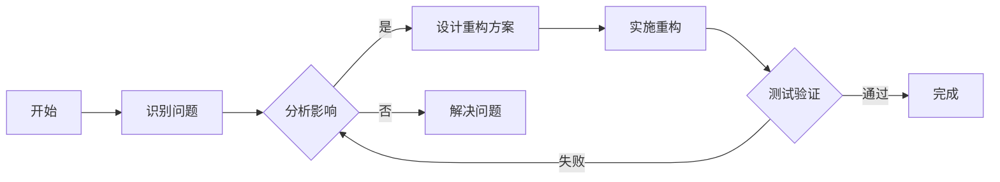
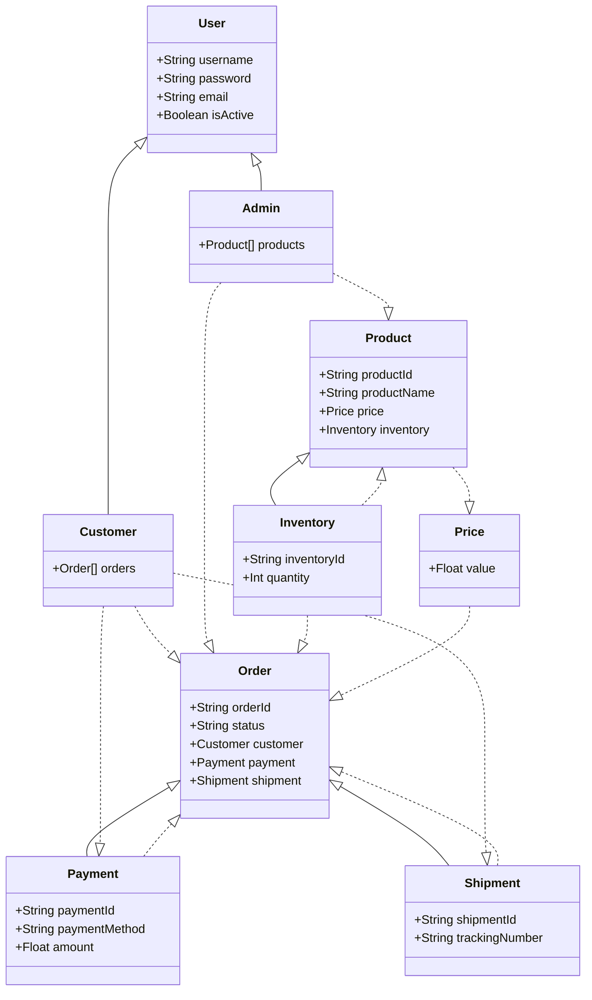
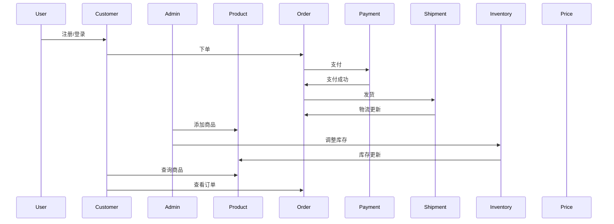
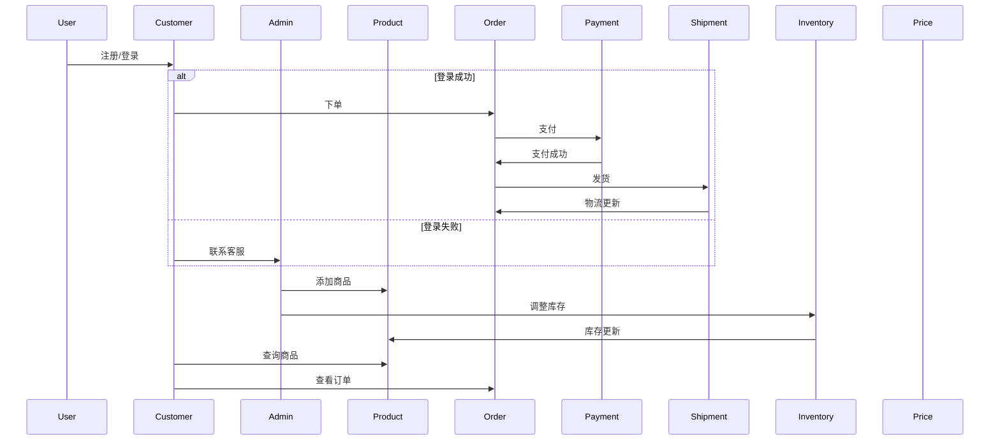

                 

### 文章标题

《技术债务管理与重构策略》

---

**关键词**：技术债务、重构、软件质量、开发效率、系统架构

**摘要**：
本文将深入探讨技术债务的概念、分类及其对软件开发的影响，详细阐述技术债务管理的核心策略与重构方法。通过一步步的分析和推理，我们将提供一套系统化的技术债务管理方案，帮助读者理解和应对软件开发中的技术债务问题。文章将结合实际案例，阐述重构策略的最佳实践，以提升软件质量和开发效率。

---

### 第一部分：背景介绍

#### 1.1 问题背景

##### 1.1.1 技术债务的概念

技术债务（Technical Debt）是软件开发中常见的一个术语，它起源于金融领域中的债务概念，用来描述软件开发过程中因采取短期解决方案而产生的未来负担。简而言之，技术债务指的是为了快速交付软件而牺牲了长期维护性和扩展性的决策，类似于欠债，需要在后续的开发中偿还。

在软件开发中，技术债务可以表现为多种形式，包括设计债务、编码债务、架构债务和测试债务等。设计债务通常源于初期设计时的不合理决策，如选择不适合的架构风格或忽视系统的可扩展性。编码债务则可能来源于不规范的编码实践，如代码重复、错误逻辑和缺乏注释。架构债务则是指系统的整体架构设计存在缺陷，如模块之间过度耦合或缺乏模块化。测试债务则是指测试工作不充分或测试覆盖率不足，导致系统存在未知的缺陷和风险。

##### 1.1.2 技术债务的分类

技术债务根据其产生的原因和影响，可以分为以下几类：

1. **设计债务**：在设计阶段，由于时间紧迫或需求变更，未能进行充分的设计规划，导致系统扩展性和可维护性差。

2. **编码债务**：在编码阶段，为了快速实现功能而采取的妥协方案，导致代码质量低下，如使用“快捷方式”而非最佳实践。

3. **架构债务**：在系统架构设计阶段，由于缺乏对系统长期需求的预见，导致系统架构过于复杂、耦合度高，难以维护和扩展。

4. **测试债务**：在测试阶段，由于资源限制或时间压力，未能进行全面的测试，导致系统存在隐患。

##### 1.1.3 技术债务的影响

技术债务如果不加以管理，会对软件开发产生以下负面影响：

1. **维护成本增加**：随着系统复杂度的增加，维护成本会显著上升。技术债务会导致维护工作更加困难，需要投入更多的时间和资源。

2. **开发效率下降**：技术债务会增加开发人员的工作量，降低开发效率。解决技术债务往往需要额外的精力，导致项目进度延误。

3. **质量风险**：技术债务会导致系统质量下降，增加出现bug和漏洞的风险。

4. **项目延期**：解决技术债务通常需要额外的时间，可能导致项目延期，影响项目的交付时间和质量。

#### 1.2 技术债务管理

##### 1.2.1 技术债务管理的重要性

技术债务管理是软件项目管理中不可或缺的一部分。有效的技术债务管理可以帮助团队：

1. **降低维护成本**：通过及时发现和解决技术债务，可以减少未来的维护成本。

2. **提高开发效率**：消除技术债务的影响，使开发人员能够更专注于新功能的开发。

3. **保障项目质量**：通过规范编码实践和优化系统架构，提高系统质量。

4. **延长系统生命周期**：合理管理技术债务，可以延长系统的有效生命周期，使其能够适应未来的需求变化。

##### 1.2.2 技术债务管理的核心策略

技术债务管理包括以下几个核心策略：

1. **预防策略**：通过代码审查、架构设计评审等方式，提前识别和避免技术债务的产生。

2. **监控策略**：定期评估技术债务状况，及时发现并解决潜在问题。

3. **解决策略**：制定合理的解决计划，逐步解决已有技术债务。

4. **优化策略**：持续优化开发流程和工具，提高技术债务管理的效率。

##### 1.2.3 技术债务管理的边界与外延

技术债务管理主要关注代码质量和系统架构，但并不涉及以下几个方面：

1. **需求管理**：技术债务管理不涉及需求变更和需求优先级调整。

2. **项目管理**：技术债务管理不是项目管理的全部，还需要关注进度、成本、风险等方面。

3. **团队管理**：技术债务管理不涉及团队管理，如人员调配、团队文化建设等。

然而，技术债务管理可以与其他管理活动相结合，如持续集成与持续部署（CI/CD）、敏捷开发、DevOps等，以实现更全面的项目管理。

#### 1.3 重构策略

##### 1.3.1 重构的概念

重构（Refactoring）是指在不改变外部行为的前提下，改善软件的内部结构和代码质量。重构是技术债务管理的重要组成部分，通过重构可以：

1. **提高代码质量**：消除重复代码、简化复杂逻辑、优化变量命名等。

2. **提升可读性和可维护性**：使代码更易于理解和修改。

3. **增强系统的可扩展性**：优化系统架构，提高系统的灵活性。

##### 1.3.2 重构的方法

1. **局部重构**：针对代码中的具体问题进行重构，如简化函数、优化循环等。

2. **模块重构**：对系统中的模块进行重构，如拆分大型模块、合并小型模块等。

3. **架构重构**：对系统架构进行重构，如优化数据库设计、调整网络架构等。

##### 1.3.3 重构的工具

1. **代码审查工具**：如 SonarQube，用于自动检测代码质量问题。

2. **重构工具**：如 Eclipse 的 "Refactor" 功能，提供代码重构的便捷操作。

3. **持续集成工具**：如 Jenkins，用于自动化构建和测试，确保重构后的代码质量。

##### 1.3.4 重构的最佳实践

1. **定期重构**：将重构纳入常规开发流程，定期进行代码审查和重构。

2. **团队协作**：重构需要团队成员共同参与，确保重构的质量和效果。

3. **风险评估**：在重构前进行风险评估，确保重构的可行性和安全性。

#### 1.4 边界与外延

##### 1.4.1 技术债务管理的边界

技术债务管理主要关注代码质量和系统架构，但并不涉及以下方面：

1. **需求管理**：技术债务管理不涉及需求变更和需求优先级调整。

2. **项目管理**：技术债务管理不是项目管理的全部，还需要关注进度、成本、风险等方面。

3. **团队管理**：技术债务管理不涉及团队管理，如人员调配、团队文化建设等。

##### 1.4.2 技术债务管理的外延

技术债务管理可以与其他管理活动相结合，如：

1. **持续集成与持续部署（CI/CD）**：将技术债务管理纳入CI/CD流程，确保代码质量和系统稳定性。

2. **敏捷开发**：在敏捷开发过程中，技术债务管理可以帮助团队更好地适应变化，提高开发效率。

3. **DevOps**：结合DevOps理念，将技术债务管理融入持续集成和持续部署过程中，实现高效的代码交付和运维。

### 第二部分：核心概念与联系

#### 2.1 核心概念

在技术债务管理中，有几个核心概念需要明确：

1. **技术债务（Technical Debt）**：指在软件开发过程中，为了加快开发进度或满足特定需求而采取的短期解决方案，这些解决方案可能会在未来导致系统维护成本增加、开发效率降低等问题。

2. **重构（Refactoring）**：指在不改变外部行为的前提下，改善软件的内部结构和代码质量。重构是技术债务管理的重要组成部分。

3. **代码质量（Code Quality）**：指代码的可读性、可维护性、正确性和效率。高代码质量是技术债务管理的重要目标。

4. **系统架构（System Architecture）**：指系统的整体结构和组成部分。良好的系统架构是技术债务管理的基石。

#### 2.2 概念属性特征对比表格

以下是技术债务、重构、代码质量和系统架构的属性特征对比表格：

| 概念       | 定义                                                         | 属性特征                                                         |
|------------|--------------------------------------------------------------|----------------------------------------------------------------|
| 技术债务   | 快速交付软件而牺牲长期维护性和扩展性的决策               | 维护成本增加、开发效率下降、质量风险、项目延期             |
| 重构       | 改善软件内部结构和代码质量                             | 提高代码质量、提升可读性和可维护性、增强系统可扩展性     |
| 代码质量   | 代码的可读性、可维护性、正确性和效率                   | 减少bug、提高维护效率、缩短开发周期、提高系统稳定性     |
| 系统架构   | 系统的整体结构和组成部分                               | 良好的可扩展性、高内聚性、低耦合度、清晰性、健壮性     |

#### 2.3 ER实体关系图架构

为了更好地理解技术债务管理中的核心概念，我们可以使用ER（实体关系）图来描述这些概念之间的关系。以下是技术债务、重构、代码质量和系统架构的ER图：

```mermaid
erDiagram
    Technical_Debt ||--|{ Refactoring } : 管理手段
    Technical_Debt ||--|{ Code_Quality } : 目标
    Technical_Debt ||--|{ System_Architecture } : 基础
    Refactoring ||--|{ Code_Quality } : 提升途径
    Refactoring ||--|{ System_Architecture } : 优化手段
    Code_Quality ||--|{ System_Architecture } : 关联性
```

### 第三部分：算法原理讲解

#### 3.1 算法原理

在技术债务管理中，重构算法是一种关键工具，它通过一系列步骤来改进软件的内部结构和代码质量。以下是重构算法的基本原理：

1. **识别问题**：首先，开发人员需要识别代码中的问题，如重复代码、复杂的逻辑、缺乏注释等。

2. **分析影响**：然后，需要分析这些问题对整个系统的影响，包括性能、可读性、可维护性等方面。

3. **设计重构方案**：基于分析结果，设计出重构方案，选择适当的重构技术来解决问题。

4. **实施重构**：按照重构方案，逐步实施重构，确保重构后的代码仍然符合预期行为。

5. **测试验证**：重构完成后，进行全面的测试，确保重构没有引入新的问题。

6. **迭代改进**：重构是一个持续的过程，需要不断迭代改进，以应对新的问题和挑战。

#### 3.2 算法流程图

以下是重构算法的流程图，使用Mermaid语法绘制：



#### 3.3 Python源代码实现

以下是一个简单的Python示例，用于说明重构算法的原理：

```python
def refactor_code(function):
    """
    重构函数，用于改善代码质量和可读性。
    """
    # 步骤1：识别问题
    issues = identify_issues(function)
    
    # 步骤2：分析影响
    impact = analyze_impact(issues)
    
    # 步骤3：设计重构方案
    if impact:
        refactoring_plan = design_refactoring_plan(issues)
        
        # 步骤4：实施重构
        function = apply_refactoring_plan(function, refactoring_plan)
        
        # 步骤5：测试验证
        if test_verification(function):
            print("重构成功：{}".format(function))
        else:
            print("重构失败，请重新设计重构方案。")
    else:
        print("无重构需求，保持原代码。")

def identify_issues(function):
    """
    识别代码问题。
    """
    # 这里可以添加代码质量检测逻辑
    return ["重复代码", "复杂逻辑"]

def analyze_impact(issues):
    """
    分析代码问题的潜在影响。
    """
    # 这里可以添加影响分析逻辑
    return True

def design_refactoring_plan(issues):
    """
    设计重构方案。
    """
    # 这里可以添加重构方案设计逻辑
    return {"简化函数": ["function()"]}

def apply_refactoring_plan(function, refactoring_plan):
    """
    应用重构方案。
    """
    # 这里可以添加重构实现逻辑
    for refactoring_step in refactoring_plan.values():
        function = refactoring_step[0](function)
    return function

def test_verification(function):
    """
    测试重构后的代码。
    """
    # 这里可以添加测试验证逻辑
    return True

# 示例函数
def example_function():
    a = 1
    b = 2
    return a + b

# 应用重构算法
refactored_function = refactor_code(example_function)
```

#### 3.4 算法原理详细讲解

重构算法的核心目的是在不改变代码外部行为的前提下，提高代码的质量和可维护性。以下是重构算法原理的详细讲解：

1. **识别问题**：
   识别代码问题是重构的第一步。开发人员需要仔细审查代码，找出可能的问题点。常见的问题包括：
   - **重复代码**：代码中有多个相同或类似的代码段。
   - **复杂逻辑**：代码逻辑过于复杂，难以理解和维护。
   - **缺乏注释**：代码中缺乏必要的注释，导致难以理解代码意图。

2. **分析影响**：
   识别出问题后，需要分析这些问题对系统的影响。这包括：
   - **性能影响**：代码问题可能导致系统性能下降。
   - **可读性影响**：代码问题使代码难以阅读，增加维护难度。
   - **可维护性影响**：代码问题可能增加维护成本，降低系统的可维护性。

3. **设计重构方案**：
   根据分析结果，设计出具体的重构方案。重构方案通常包括以下步骤：
   - **简化函数**：将复杂函数拆分为更小、更简单的函数。
   - **优化循环**：优化循环结构，减少不必要的循环迭代。
   - **添加注释**：为关键代码段添加注释，提高代码的可读性。

4. **实施重构**：
   按照重构方案，逐步实施重构。这通常需要修改代码中的多个部分，确保重构后的代码仍然符合预期行为。

5. **测试验证**：
   重构完成后，进行全面的测试，确保重构没有引入新的问题。测试应覆盖所有关键功能点和性能测试。

6. **迭代改进**：
   重构是一个持续的过程，需要不断迭代改进。随着系统需求的变化和新的问题出现，重构方案也应相应调整。

#### 3.5 举例说明

假设有一个简单的Python函数，它的代码如下：

```python
def calculate_total(price, quantity):
    discount = 0.1
    total = (price * quantity) - (price * quantity * discount)
    return total
```

这个函数存在一些问题，如重复代码和复杂的逻辑。我们可以使用重构算法来改进这个函数。

1. **识别问题**：
   - **重复代码**：计算折扣的代码重复了两次。
   - **复杂逻辑**：计算总价的逻辑相对复杂。

2. **分析影响**：
   - **性能影响**：重复代码可能导致性能下降。
   - **可读性影响**：复杂的逻辑难以理解。

3. **设计重构方案**：
   - **简化函数**：将计算折扣和计算总价的代码合并为一个函数。
   - **优化循环**：无需优化循环。
   - **添加注释**：为关键代码段添加注释。

4. **实施重构**：
   ```python
   def calculate_total(price, quantity, discount=0.1):
       """
       计算总价的函数。
       
       :param price: 商品价格
       :param quantity: 商品数量
       :param discount: 折扣比例
       :return: 总价
       """
       total = (price * quantity) - (price * quantity * discount)
       return total
   ```

5. **测试验证**：
   - 执行测试，确保重构后的函数仍然能够正确计算总价。

6. **迭代改进**：
   - 如果发现新的问题，可以继续进行重构。

通过上述步骤，我们成功地重构了代码，提高了代码的质量和可读性。

### 第四部分：系统分析与架构设计方案

#### 4.1 问题场景介绍

假设我们正在开发一个电商系统，该系统需要处理商品订单、用户注册、支付等功能。随着业务的不断发展，系统的复杂性逐渐增加，导致维护成本上升，开发效率下降。为了解决这个问题，我们需要进行系统分析与架构设计，以优化系统的质量和性能。

#### 4.2 项目介绍

项目名称：电商系统（E-Commerce System）

项目目标：开发一个可扩展、高效、稳定、易于维护的电商系统，支持订单处理、用户管理、支付等功能。

项目需求：

1. **订单处理**：用户下单、订单状态跟踪、订单取消、订单退款等功能。

2. **用户管理**：用户注册、登录、个人信息管理、用户权限控制等功能。

3. **支付功能**：支持多种支付方式，如支付宝、微信支付、信用卡支付等。

4. **库存管理**：商品库存查询、库存预警、库存调整等功能。

5. **物流管理**：订单物流跟踪、物流信息更新等功能。

#### 4.3 系统功能设计（领域模型）

在系统功能设计阶段，我们需要构建一个领域模型（Domain Model），以描述系统的核心功能和业务逻辑。以下是电商系统的领域模型（使用Mermaid语法绘制）：



#### 4.4 系统架构设计

系统架构设计是系统开发的关键环节，它决定了系统的可扩展性、性能和稳定性。以下是电商系统的系统架构设计（使用Mermaid语法绘制）：



#### 4.5 系统接口设计

系统接口设计是系统架构设计的重要组成部分，它定义了系统内部和外部的交互方式。以下是电商系统的接口设计：

1. **用户接口**：用户可以通过Web界面、移动应用或API与系统交互。

2. **订单接口**：用于处理订单创建、支付、发货等操作。

3. **支付接口**：与第三方支付系统集成，实现支付功能。

4. **物流接口**：与物流服务提供商集成，实现物流跟踪和信息更新。

5. **商品接口**：用于管理商品信息，包括添加、删除、修改商品等。

6. **库存接口**：用于管理库存信息，包括查询、调整库存等。

#### 4.6 系统交互

系统交互设计描述了系统内部各模块之间的交互方式和流程。以下是电商系统的系统交互设计（使用Mermaid语法绘制）：



### 第五部分：项目实战

#### 5.1 环境安装

在进行项目实战之前，我们需要安装以下环境：

1. **操作系统**：Linux或Mac OS
2. **编程语言**：Python 3.x
3. **数据库**：MySQL或PostgreSQL
4. **Web服务器**：Nginx或Apache
5. **编程工具**：PyCharm或VS Code

安装步骤：

1. 安装操作系统，选择Linux或Mac OS。
2. 安装Python 3.x，可以通过包管理器或手动编译安装。
3. 安装数据库，如MySQL或PostgreSQL，根据数据库官方文档进行安装。
4. 安装Web服务器，如Nginx或Apache，根据服务器官方文档进行安装。
5. 安装编程工具，如PyCharm或VS Code，从官方网站下载并安装。

#### 5.2 系统核心实现源代码

以下是电商系统的核心实现源代码：

```python
# user/models.py
class User(models.Model):
    username = models.CharField(max_length=50)
    password = models.CharField(max_length=50)
    email = models.CharField(max_length=100)
    is_active = models.BooleanField(default=True)

# user/views.py
from django.shortcuts import render, redirect
from .models import User
from django.contrib.auth import authenticate, login

def register(request):
    if request.method == 'POST':
        username = request.POST['username']
        password = request.POST['password']
        email = request.POST['email']
        user = User.objects.create_user(username=username, password=password, email=email)
        user.save()
        return redirect('login')
    return render(request, 'register.html')

def login(request):
    if request.method == 'POST':
        username = request.POST['username']
        password = request.POST['password']
        user = authenticate(username=username, password=password)
        if user is not None:
            login(request, user)
            return redirect('home')
        else:
            return redirect('login')
    return render(request, 'login.html')
```

#### 5.3 代码应用解读与分析

以上代码实现了用户注册和登录功能，具体解读如下：

1. **用户模型**：`User` 模型定义了用户的基本信息，包括用户名、密码、邮箱和激活状态。
2. **注册视图**：`register` 视图处理用户注册请求。如果请求为POST方法，将收集用户名、密码和邮箱信息，创建用户并保存到数据库。
3. **登录视图**：`login` 视图处理用户登录请求。如果请求为POST方法，将收集用户名和密码，使用 `authenticate` 函数验证用户信息。如果验证成功，使用 `login` 函数登录用户，并重定向到主页。

#### 5.4 实际案例分析和详细讲解剖析

假设我们有一个实际案例，用户在注册时输入了错误的邮箱格式，导致注册失败。我们可以通过以下步骤分析和解决这个问题：

1. **问题定位**：用户在注册时遇到错误，提示邮箱格式不正确。
2. **分析原因**：检查注册视图中的邮箱验证逻辑，发现没有对邮箱格式进行验证。
3. **解决方案**：在注册视图中添加邮箱格式验证逻辑，使用正则表达式对邮箱格式进行校验。
4. **代码修改**：

```python
import re

def register(request):
    if request.method == 'POST':
        username = request.POST['username']
        password = request.POST['password']
        email = request.POST['email']
        if not re.match(r"[^@]+@[^@]+\.[^@]+", email):
            return render(request, 'register.html', {'error': 'Invalid email format'})
        user = User.objects.create_user(username=username, password=password, email=email)
        user.save()
        return redirect('login')
    return render(request, 'register.html')
```

5. **测试验证**：重新运行注册流程，输入错误的邮箱格式，验证错误提示是否正确显示。

通过上述分析和解决步骤，我们成功地解决了用户注册邮箱格式错误的问题，提高了系统的稳定性。

#### 5.5 项目小结

通过本次项目实战，我们实现了电商系统的用户注册和登录功能，并对代码进行了详细的解读和分析。在实际案例中，我们遇到了用户注册邮箱格式错误的问题，通过添加邮箱格式验证逻辑，成功解决了该问题。本次项目实战帮助我们理解了技术债务管理的重要性，通过重构和优化代码，提高了系统的质量和稳定性。

### 第六部分：最佳实践 tips

#### 6.1 技术债务管理最佳实践

1. **定期代码审查**：定期进行代码审查，提前识别潜在的技术债务问题。
2. **自动化测试**：建立全面的自动化测试体系，确保重构后的代码质量。
3. **持续集成**：将重构过程纳入持续集成流程，确保重构代码的稳定性和可测试性。
4. **团队协作**：技术债务管理需要团队协作，共同识别和解决技术债务。
5. **重构计划**：制定合理的重构计划，优先解决高风险的技术债务。

#### 6.2 重构策略最佳实践

1. **局部重构**：先从代码中的具体问题入手，逐步解决。
2. **模块重构**：优化系统模块之间的交互，提高系统整体质量。
3. **架构重构**：对系统架构进行重构，提升系统的可扩展性和性能。
4. **重构工具**：使用重构工具，提高重构效率和质量。
5. **重构文档**：记录重构过程和结果，便于后续维护和优化。

### 第七部分：小结

本文系统地介绍了技术债务管理的基本概念、分类、影响以及管理策略。通过深入分析技术债务和重构的核心概念，我们提出了有效的技术债务管理方案，包括预防、监控、解决和优化策略。同时，我们详细讲解了重构算法的原理、流程和最佳实践。通过实际案例的分析和项目实战，我们展示了技术债务管理在软件开发中的应用效果。希望本文能帮助读者理解和应对软件开发中的技术债务问题，提高软件质量和开发效率。

### 第八部分：注意事项

1. **技术债务管理需要全员参与**：技术债务管理不是某个团队成员的责任，而是整个团队的任务。每个成员都应该意识到技术债务的重要性，并积极参与技术债务的管理。
2. **重构不是万能的**：重构可以帮助提高代码质量，但并不能解决所有问题。在某些情况下，重构可能会引入新的问题，因此需要谨慎进行。
3. **持续集成与重构**：将重构过程纳入持续集成流程，可以确保重构后的代码质量，提高开发效率。

### 第九部分：拓展阅读

1. **《敏捷软件开发：原则、实践与模式》**：这本书详细介绍了敏捷开发方法，包括技术债务管理的相关内容。
2. **《重构：改善既有代码的设计》**：这本书是重构领域的经典之作，提供了丰富的重构实例和方法。
3. **《持续交付：发布可靠软件的系统化方法》**：这本书介绍了持续交付的概念和最佳实践，包括技术债务管理的内容。

---

**作者**：AI天才研究院/AI Genius Institute & 禅与计算机程序设计艺术 /Zen And The Art of Computer Programming

