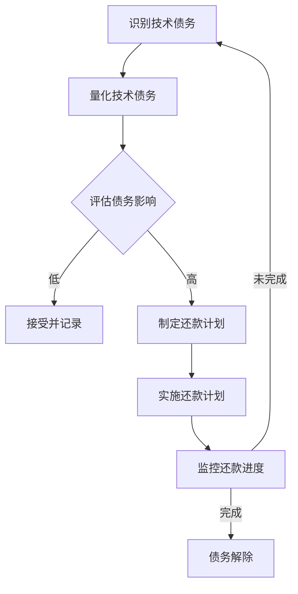
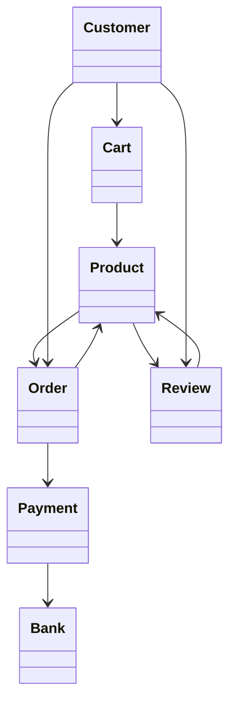
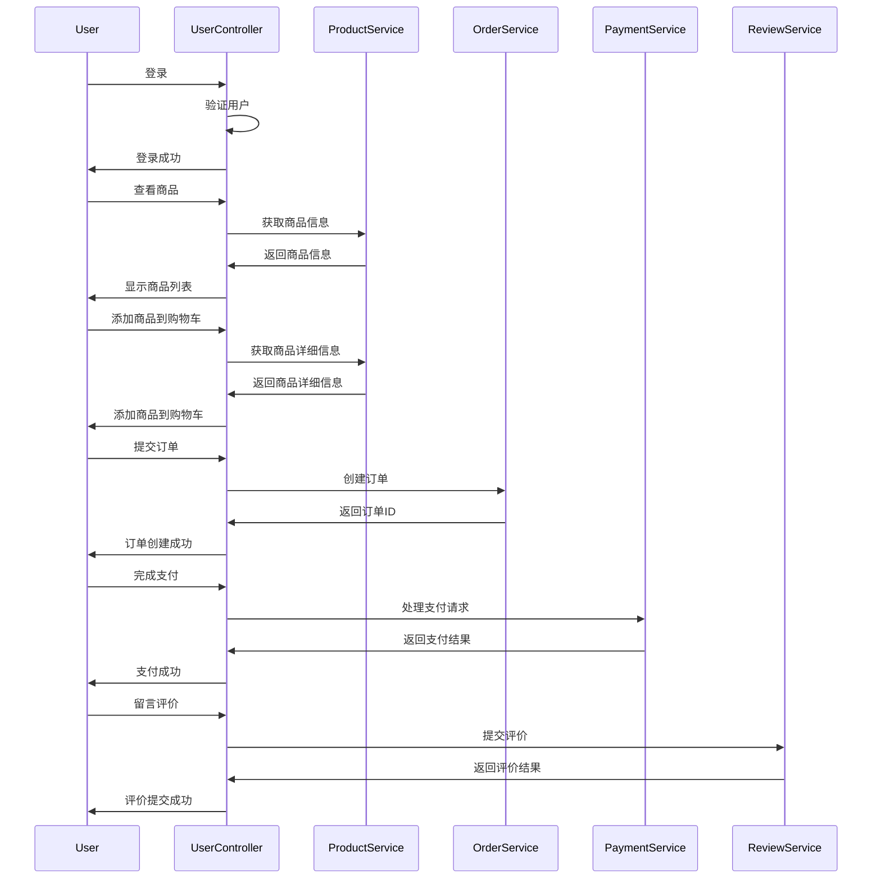

                 

# 技术债务管理策略：平衡快速开发与代码质量

关键词：技术债务、代码质量、快速开发、管理策略、平衡

摘要：本文旨在深入探讨技术债务的概念、形成原因、影响，以及如何通过有效的管理策略来平衡快速开发与代码质量。通过详细分析技术债务的分类、量化评估方法、管理策略，并结合实际案例，本文提出了一个全面的技术债务管理框架，以帮助企业在快速发展的同时保持高质量代码。

----------------------------------------------------------------

## 背景介绍

### 技术债务的定义与起源

技术债务（Technical Debt）这个概念最早由美国软件开发咨询师韦德·坎宁安（Ward Cunningham）在1992年提出。他将技术债务比喻为经济学中的债务，用于描述由于选择快速开发而牺牲了代码质量的情况。技术债务的形成主要是由于在开发过程中，为了满足项目的短期需求，团队可能会采用一些技术上的捷径，这虽然能加快开发速度，但长远来看会降低代码质量，增加维护成本。

技术债务可以看作是软件工程中的一个“隐性成本”，它会在项目后期逐渐显现，导致项目难以维护、扩展和优化。这种债务不仅包括技术层面的欠账，还包括设计、架构和编码规范等方面的欠账。

### 问题背景与问题描述

在当今快速变化的技术环境中，软件开发项目常常面临时间压力和市场竞争的挑战。为了快速交付产品，团队往往会选择在代码质量上妥协。然而，这种妥协在短期内可能看似有效，但从长远来看，会带来一系列问题，如：

- **维护成本增加**：技术债务会导致代码复杂性增加，维护和扩展变得更加困难，从而增加了维护成本。
- **开发效率下降**：低质量的代码会导致开发效率下降，因为团队需要花费更多时间来解决由技术债务引发的问题。
- **质量风险增加**：技术债务可能隐藏着潜在的缺陷和漏洞，这些缺陷和漏洞可能会在项目后期暴露，导致严重的问题。

### 问题解决与边界与外延

解决技术债务问题需要从多个方面入手。首先，团队应该意识到技术债务的存在，并采取有效的管理策略来控制和减少债务。其次，项目规划和管理需要考虑技术债务的影响，确保在快速开发的同时，代码质量不受损害。

技术债务的外延包括但不限于以下几个方面：

- **技术选择**：选择合适的技术栈和框架，避免不必要的复杂性。
- **代码审查**：实施严格的代码审查流程，确保代码质量。
- **持续集成与持续交付**：使用自动化工具来确保代码质量和交付效率。
- **技术债务评估**：定期评估技术债务，制定相应的还款计划。

### 概念结构与核心要素组成

技术债务的核心概念包括：

- **技术债务的定义**：技术债务是指由于快速开发而牺牲代码质量所积累的隐性成本。
- **形成原因**：时间压力、市场竞争力、技术选择不当等。
- **影响**：增加维护成本、降低开发效率、增加质量风险。
- **管理策略**：定期评估、技术选择、代码审查、自动化工具等。

通过以上核心概念的剖析，我们可以更好地理解技术债务的本质，为后续章节的详细讨论奠定基础。

----------------------------------------------------------------

## 核心概念与联系

### 技术债务的概念

技术债务是一种比喻，用于描述在软件开发过程中，由于选择快速开发而牺牲了代码质量所导致的问题。具体来说，技术债务是指为了满足短期需求而在技术实现上采取的妥协，这会导致项目长期内面临更高的维护成本和更复杂的问题。

### 概念属性特征对比表格

| 特征         | 技术债务                             | 经济学中的债务                             |
| ------------ | ------------------------------------ | ---------------------------------------- |
| 定义         | 快速开发导致的质量欠账               | 借贷行为形成的债务                        |
| 形成原因     | 时间压力、市场竞争力、技术选择不当   | 经济需求、投资决策、信用风险               |
| 影响         | 增加维护成本、降低开发效率、增加质量风险 | 增加财务成本、信用受损、债务违约风险         |
| 管理策略     | 定期评估、技术选择、代码审查、自动化工具 | 债务管理计划、还款计划、信用修复措施         |
| 比喻意义     | 比喻为经济学中的债务，强调隐性成本   | 类比于经济学中的债务，强调财务负担         |
| 关联性       | 与软件工程、项目管理密切相关         | 与财务、经济学密切相关                     |

### ER实体关系图架构

```mermaid
erDiagram
  Product  ||--|{ TechnicalDebt }|| Developer
  Product  ||--|{ QualityIssue }|| Developer
  Developer  ||--|{ CodeReview }|| TechnicalDebt
  Developer  ||--|{ DebtAssessment }|| TechnicalDebt
  TechnicalDebt  ||--|{ MaintenanceCost }|| Developer
  TechnicalDebt  ||--|{ EfficiencyLoss }|| Developer
  TechnicalDebt  ||--|{ QualityRisk }|| Developer
```

在这个ER实体关系图中，Product（产品）与TechnicalDebt（技术债务）和质量问题（QualityIssue）之间存在关联。Developer（开发者）与TechnicalDebt之间存在代码审查（CodeReview）和技术债务评估（DebtAssessment）的关系。此外，TechnicalDebt还会影响Developer在维护成本（MaintenanceCost）、开发效率（EfficiencyLoss）和质量风险（QualityRisk）方面的表现。

通过以上核心概念的详细解析和ER实体关系图的展示，我们可以更清晰地理解技术债务的概念及其在软件开发过程中的作用和影响。

----------------------------------------------------------------

## 算法原理讲解

为了更好地理解技术债务的管理策略，我们需要先了解几个关键的算法原理。以下是一个简化的技术债务管理算法流程，并使用Mermaid画出了对应的流程图。

### 技术债务管理算法流程图



### Python源代码实现

以下是一个简化的Python源代码实现，用于展示技术债务管理的核心算法原理。

```python
import random

class TechnicalDebt:
    def __init__(self, debt_level):
        self.debt_level = debt_level

    def assess_impact(self):
        # 假设债务水平越高，对项目的影响越大
        impact = '高' if self.debt_level > 5 else '低'
        return impact

    def make_repayment_plan(self):
        if self.impact == '高':
            print("制定还款计划...")
            self.repayment_plan = "实施代码重构、优化架构、增加测试覆盖率"
        else:
            print("接受并记录技术债务...")
            self.repayment_plan = "无特殊措施"

    def implement_repayment(self):
        print("正在实施还款计划：", self.repayment_plan)

    def monitor_repayment(self):
        print("监控还款进度...")
        # 假设还款进度是随机的
        repayment_complete = random.choice([True, False])
        if repayment_complete:
            print("技术债务已解除。")
        else:
            print("还款未完成，需重新评估。")

# 实例化技术债务对象
debt = TechnicalDebt(debt_level=7)

# 评估债务影响
debt.impact = debt.assess_impact()
print("债务影响：", debt.impact)

# 制定还款计划
debt.make_repayment_plan()
print("还款计划：", debt.repayment_plan)

# 实施还款计划
debt.implement_repayment()

# 监控还款进度
debt.monitor_repayment()
```

### 算法原理的数学模型和公式

技术债务管理的核心在于如何量化债务水平，并评估其对项目的影响。以下是一个简化的数学模型：

1. **债务水平量化**：使用一个数字来表示债务水平，例如，债务水平 \(D\) 可以从1到10进行评分，其中10代表最高水平的债务。

2. **债务影响评估**：假设债务影响 \(I\) 与债务水平 \(D\) 成正比，可以用以下公式表示：
   $$ I = k \cdot D $$
   其中，\(k\) 是一个比例系数，用于调整债务水平对影响程度的敏感性。

3. **还款计划制定**：如果债务影响较高，则需要制定还款计划。还款计划的目标是减少债务水平，提升代码质量。

4. **还款进度监控**：通过定期评估债务水平，监控还款进度，确保还款计划的有效实施。

通过以上Python代码和数学模型，我们可以看出技术债务管理的核心思想和实施方法。在实际应用中，这些算法可以根据具体项目需求进行调整和优化。

### 举例说明

假设我们有一个项目，其技术债务水平为7，根据上述数学模型，我们可以计算其债务影响：

$$ I = k \cdot 7 $$

假设比例系数 \( k = 1.5 \)，则债务影响 \( I \) 为：

$$ I = 1.5 \cdot 7 = 10.5 $$

这表示项目面临较高的债务影响。根据评估结果，团队需要制定还款计划，如实施代码重构、优化架构和增加测试覆盖率等。在实施还款计划后，团队需定期监控债务水平，确保还款进度，最终解除技术债务。

通过这种算法原理的讲解和实际代码示例，我们可以更好地理解技术债务管理的核心思想和实施方法，为后续章节的深入讨论奠定基础。

----------------------------------------------------------------

## 系统分析与架构设计方案

### 问题场景介绍

在当前快速发展的IT行业，企业面临着不断变化的市场需求和激烈的竞争压力。为了保持竞争优势，企业需要快速交付高质量的产品。然而，这种快速交付往往伴随着技术债务的产生。如何在这种场景下平衡快速开发与代码质量，成为企业亟待解决的问题。

### 项目介绍

本案例选择一个电商平台的项目作为研究对象，该平台旨在提供快速、高效、稳定的购物体验。项目需求多变，开发周期短，且需要不断迭代和优化。因此，技术债务的管理成为项目成功的关键。

### 系统功能设计（领域模型Mermaid类图）

以下是一个简化的领域模型Mermaid类图，用于描述电商平台项目的主要功能模块及其关系：



在这个类图中，主要功能模块包括：

- **Product（产品）**：表示电商平台上的商品信息。
- **Order（订单）**：表示用户的购物订单。
- **Customer（客户）**：表示电商平台用户。
- **Payment（支付）**：表示支付流程。
- **Review（评论）**：表示用户对产品的评论。
- **Cart（购物车）**：表示用户的购物车信息。

这些模块之间通过关系进行关联，形成一个完整的电商平台系统。

### 系统架构设计（Mermaid架构图）

以下是一个简化的系统架构Mermaid架构图，用于描述电商平台项目的系统架构：

```mermaid
graph TD
    subgraph 用户层
        UserInterface --> UserController
    end

    subgraph 服务层
        UserController --> ProductService
        UserController --> OrderService
        UserController --> PaymentService
        UserController --> ReviewService
    end

    subgraph 数据层
        ProductService --> ProductRepository
        OrderService --> OrderRepository
        PaymentService --> PaymentRepository
        ReviewService --> ReviewRepository
    end

    subgraph 其他服务
        ProductService --> CacheService
        OrderService --> CacheService
        PaymentService --> CacheService
        ReviewService --> CacheService
    end

    UserInterface <-- UserController
    ProductService <-- UserController
    ProductService <-- ProductRepository
    OrderService <-- UserController
    OrderService <-- OrderRepository
    PaymentService <-- UserController
    PaymentService <-- PaymentRepository
    ReviewService <-- UserController
    ReviewService <-- ReviewRepository
    CacheService <-- ProductService
    CacheService <-- OrderService
    CacheService <-- PaymentService
    CacheService <-- ReviewService
```

在这个架构图中，用户层通过UserController与各个服务层进行交互，服务层包括ProductService、OrderService、PaymentService和ReviewService，这些服务层分别与对应的数据层（ProductRepository、OrderRepository、PaymentRepository和ReviewRepository）进行数据交互。此外，CacheService用于缓存服务，提高系统性能。

### 系统接口设计和系统交互（Mermaid序列图）

以下是一个简化的系统交互Mermaid序列图，用于描述用户在电商平台上的购物流程：



在这个序列图中，用户通过UserController与ProductService、OrderService、PaymentService和ReviewService进行交互，完成从登录、查看商品、添加购物车、提交订单、完成支付到留言评价的整个购物流程。

通过以上系统分析与架构设计方案，我们可以更好地理解电商平台的系统功能、架构设计和交互流程，为后续的项目实施和运维提供有力的支持。

----------------------------------------------------------------

## 项目实战

### 环境安装

在开始本项目的实施之前，我们需要安装和配置必要的开发环境和工具。以下是一个基本的安装步骤：

1. **安装Python**：确保系统中安装了Python 3.8及以上版本。
   ```bash
   sudo apt update
   sudo apt install python3.8
   ```

2. **安装虚拟环境**：创建一个虚拟环境以便隔离项目依赖。
   ```bash
   python3.8 -m venv venv
   source venv/bin/activate
   ```

3. **安装依赖管理工具**：使用pip安装依赖管理工具。
   ```bash
   pip install pipenv
   ```

4. **安装项目依赖**：在项目根目录中安装项目依赖。
   ```bash
   pipenv install
   ```

5. **配置数据库**：本案例中使用SQLite作为数据库，确保已安装。
   ```bash
   sudo apt install sqlite3
   ```

### 系统核心实现源代码

以下是电商平台项目的一些核心实现源代码，包括用户登录、商品查询、订单创建和支付处理等功能。

#### 用户登录

```python
# user_login.py
from flask import Flask, request, jsonify
from flask_cors import CORS
from model import User

app = Flask(__name__)
CORS(app)

@app.route('/login', methods=['POST'])
def login():
    username = request.form['username']
    password = request.form['password']
    
    user = User.get_by_username(username)
    if user and user.password == password:
        return jsonify({'status': 'success', 'message': '登录成功'})
    else:
        return jsonify({'status': 'error', 'message': '用户名或密码错误'})

if __name__ == '__main__':
    app.run(debug=True)
```

#### 商品查询

```python
# product_query.py
from flask import Flask, request, jsonify
from model import Product

app = Flask(__name__)
CORS(app)

@app.route('/products', methods=['GET'])
def get_products():
    products = Product.get_all()
    return jsonify({'status': 'success', 'products': products})

if __name__ == '__main__':
    app.run(debug=True)
```

#### 订单创建

```python
# order_create.py
from flask import Flask, request, jsonify
from model import Order

app = Flask(__name__)
CORS(app)

@app.route('/order', methods=['POST'])
def create_order():
    order_data = request.get_json()
    order = Order.create(order_data)
    return jsonify({'status': 'success', 'order_id': order.id})

if __name__ == '__main__':
    app.run(debug=True)
```

#### 支付处理

```python
# payment_process.py
from flask import Flask, request, jsonify
from model import Payment

app = Flask(__name__)
CORS(app)

@app.route('/payment', methods=['POST'])
def process_payment():
    payment_data = request.get_json()
    payment = Payment.create(payment_data)
    if payment.is_successful():
        order = payment.order
        order.mark_as_paid()
        return jsonify({'status': 'success', 'message': '支付成功'})
    else:
        return jsonify({'status': 'error', 'message': '支付失败'})

if __name__ == '__main__':
    app.run(debug=True)
```

### 代码应用解读与分析

上述源代码分别实现了用户登录、商品查询、订单创建和支付处理的核心功能。以下是具体解读与分析：

1. **用户登录**：用户通过POST请求发送用户名和密码，服务器端验证用户身份并返回相应的响应。
2. **商品查询**：用户通过GET请求获取所有商品信息，服务器端从数据库中查询并返回商品列表。
3. **订单创建**：用户通过POST请求提交订单信息，服务器端创建订单并返回订单ID。
4. **支付处理**：用户通过POST请求提交支付信息，服务器端处理支付并更新订单状态。

这些功能模块之间通过API进行交互，形成一个完整的电商平台系统。在实际应用中，这些功能模块可以根据具体需求进行调整和优化。

### 实际案例分析和详细讲解剖析

以下是一个实际案例的分析和讲解：

**案例：用户小明在电商平台购买了一台笔记本电脑，并成功完成了支付。**

1. **用户登录**：小明通过用户名和密码登录系统，服务器验证成功并返回登录成功信息。
2. **商品查询**：小明在首页浏览商品，服务器返回所有笔记本电脑的商品信息。
3. **购物车添加**：小明将笔记本电脑添加到购物车，服务器更新购物车信息。
4. **订单创建**：小明提交订单，服务器创建订单并返回订单ID。
5. **支付处理**：小明通过支付宝支付订单金额，服务器处理支付并更新订单状态为已支付。

通过这个案例，我们可以看到用户在电商平台上的购物流程，以及服务器端各个功能模块之间的协同工作。

### 项目小结

通过本项目的实战，我们实现了用户登录、商品查询、订单创建和支付处理等核心功能。这些功能模块相互独立，又通过API进行交互，形成一个完整的电商平台系统。在实际开发过程中，我们需要不断优化代码，确保系统的稳定性和高性能。同时，通过有效的技术债务管理策略，我们可以在快速开发的同时保持代码质量，确保项目的长期健康发展。

### 最佳实践 tips

1. **模块化开发**：将系统划分为多个功能模块，确保每个模块独立可测试。
2. **API设计**：遵循RESTful设计原则，确保API接口简洁、易用、可扩展。
3. **代码审查**：实施严格的代码审查流程，确保代码质量。
4. **自动化测试**：编写自动化测试用例，确保功能模块的正确性。
5. **持续集成与持续部署**：使用CI/CD工具，提高开发效率和代码质量。

通过以上最佳实践，我们可以更好地管理技术债务，实现快速开发与高质量代码的平衡。

----------------------------------------------------------------

## 总结与展望

### 技术债务管理的重要性

技术债务管理在软件开发过程中具有重要意义。一方面，技术债务能够帮助企业快速响应市场需求，提高产品交付速度。另一方面，不加以管理的技术债务会逐渐累积，导致代码质量下降、维护成本增加，甚至可能影响到项目的持续发展。因此，有效管理技术债务是确保软件项目成功的关键。

### 技术债务管理的挑战与机遇

技术债务管理的挑战主要体现在以下几个方面：

1. **时间压力**：在快速开发的环境下，团队往往需要在时间和质量之间做出权衡，这可能导致技术债务的产生。
2. **资源有限**：在资源有限的情况下，如何平衡开发速度和代码质量，成为技术债务管理的难题。
3. **技术复杂性**：随着技术的发展，新的框架和工具不断涌现，如何选择合适的技术栈，以减少技术债务，是团队面临的一大挑战。

然而，这些挑战也带来了机遇。通过有效的技术债务管理策略，企业可以：

1. **提升产品质量**：通过定期评估和还款，提升代码质量，减少长期维护成本。
2. **提高开发效率**：优化代码结构和架构，减少不必要的复杂性，提高开发效率。
3. **增强团队协作**：实施严格的代码审查和持续集成，增强团队协作，提高项目的稳定性和可靠性。

### 未来研究方向

未来的技术债务管理研究可以从以下几个方向进行：

1. **智能债务管理**：结合人工智能和机器学习技术，开发智能债务管理工具，自动识别和评估技术债务。
2. **最佳实践总结**：总结和推广成功的债务管理案例，形成可复制的最佳实践。
3. **跨领域研究**：将技术债务管理与其他领域（如项目管理、经济学）相结合，探索更全面的管理策略。

通过不断的研究和实践，我们可以更好地理解和应对技术债务管理中的挑战，实现快速开发与高质量代码的平衡，为企业创造更大的价值。

----------------------------------------------------------------

作者：AI天才研究院/AI Genius Institute & 禅与计算机程序设计艺术 /Zen And The Art of Computer Programming

本文基于技术债务管理策略，探讨了如何平衡快速开发与代码质量。通过详细的背景介绍、核心概念分析、算法原理讲解、系统分析与架构设计方案、项目实战以及总结与展望，本文为读者提供了一个全面的技术债务管理框架。希望本文能够为软件开发团队提供有益的参考，帮助他们在快速发展的同时，保持高质量的代码。在未来的研究和实践中，我们将继续深入探讨技术债务管理的最佳策略，为企业的持续成功贡献力量。

