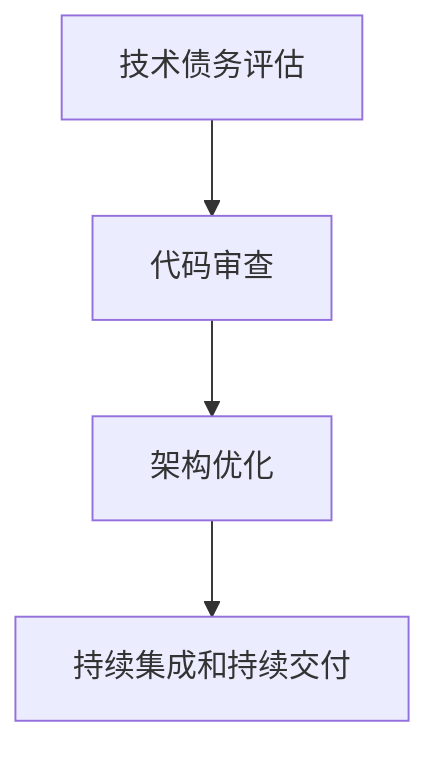
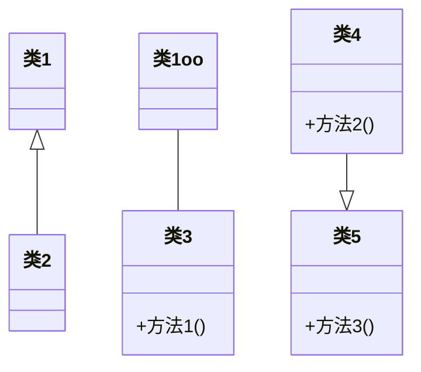
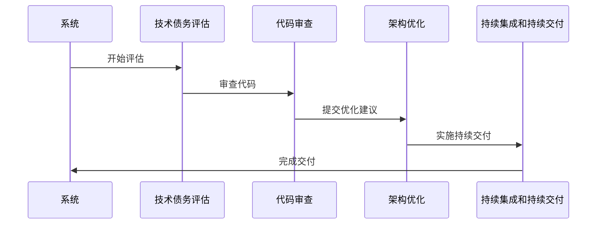
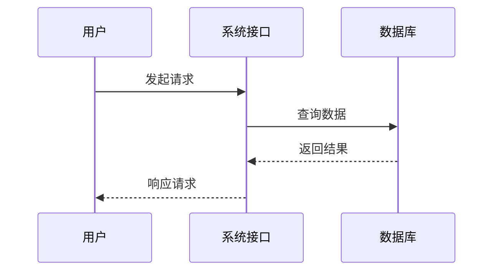
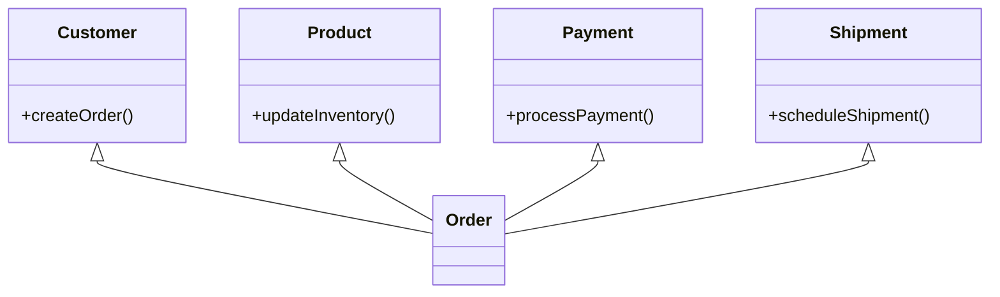
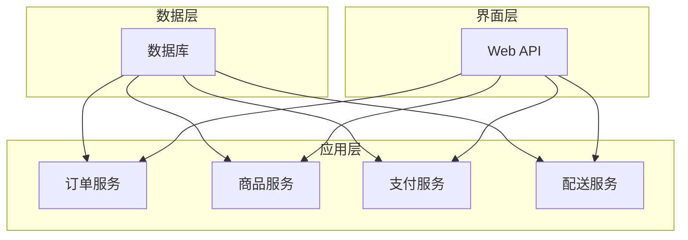
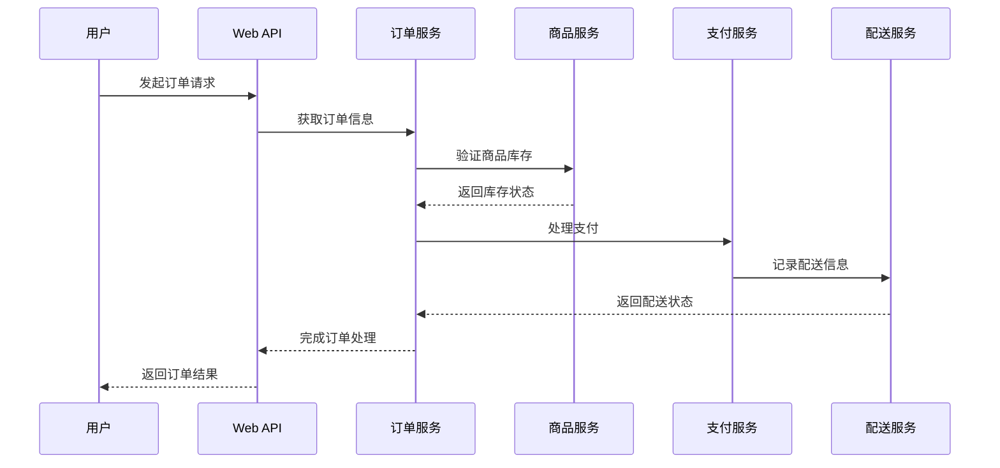

                 

### 技术债务管理策略：系统性解决技术负债

关键词：技术债务、代码质量、架构设计、持续集成、持续交付

摘要：在快速发展的技术时代，技术债务成为企业和开发团队必须面对的问题。本文将深入探讨技术债务管理的策略，包括评估、代码审查、架构优化和持续集成与持续交付等核心环节，帮助企业系统性解决技术负债，提升系统稳定性和开发效率。

#### 第一部分：背景介绍

##### 核心概念

在当今快速发展的技术时代，技术债务（Tech Debt）成为许多企业和开发团队必须面对的问题。技术债务是指因追求速度和短期利益，而忽视代码质量、架构设计和系统维护所带来的潜在风险和成本。

##### 问题背景

技术债务会逐渐积累，导致系统变得复杂、难以维护，影响开发效率和产品质量。企业若未能有效管理技术债务，可能会面临系统崩溃、安全漏洞、合规性风险等问题。

##### 问题描述

技术债务会逐渐积累，导致系统变得复杂、难以维护，影响开发效率和产品质量。企业若未能有效管理技术债务，可能会面临系统崩溃、安全漏洞、合规性风险等问题。

##### 问题解决

为了解决技术债务问题，企业需要采取系统性管理策略，从代码质量、架构设计、团队协作等多个方面入手，确保技术债务得到有效控制和减轻。

##### 边界与外延

技术债务不仅限于软件开发，还包括硬件设备、数据管理等多个方面。本文主要关注软件开发过程中的技术债务。

##### 概念结构与核心要素组成

技术债务管理策略的核心要素包括：技术债务评估、代码审查、架构优化、持续集成和持续交付等。

#### 第二部分：核心概念与联系

##### 技术债务评估

通过评估工具和方法，对现有系统中的技术债务进行量化分析，识别出风险最高的债务。

##### 代码审查

对代码进行质量审查，发现潜在的技术债务，确保代码质量。

##### 架构优化

对系统架构进行优化，降低技术债务带来的风险。

##### 持续集成和持续交付

通过自动化测试和持续交付流程，减少技术债务的积累。

##### 概念属性特征对比表格

| 概念       | 定义                                                         | 关联性                     |
|------------|--------------------------------------------------------------|----------------------------|
| 技术债务评估 | 对现有系统中的技术债务进行量化分析。                           | 与代码审查、架构优化有关。 |
| 代码审查   | 对代码进行质量审查，发现潜在的技术债务。                       | 与技术债务评估、架构优化有关。|
| 架构优化   | 对系统架构进行优化，降低技术债务带来的风险。                   | 与代码审查、持续集成和持续交付有关。|
| 持续集成和持续交付 | 通过自动化测试和持续交付流程，减少技术债务的积累。             | 与代码审查、架构优化有关。|

#### 第三部分：算法原理讲解

##### 算法mermaid流程图



##### 算法原理讲解

技术债务管理策略的算法原理主要包括以下步骤：

1. **技术债务评估**：使用自动化工具对现有系统进行扫描，识别出可能的技术债务问题。
2. **代码审查**：通过静态代码分析工具，对代码库进行质量审查，发现潜在的技术债务。
3. **架构优化**：对系统架构进行评估，找出需要优化的部分，降低技术债务带来的风险。
4. **持续集成和持续交付**：通过自动化测试和持续交付流程，确保代码质量和系统稳定性。

##### 数学模型和数学公式

技术债务管理策略中的关键数学模型包括：

$$
T = I \cdot R
$$

其中，\(T\) 表示技术债务总量，\(I\) 表示代码库中技术债务问题数量，\(R\) 表示每个技术债务问题的风险等级。

##### 详细讲解与举例说明

以一个实际案例为例，某公司现有代码库中存在100个技术债务问题，每个问题的风险等级分别为低、中、高，数量分别为50、30、20。根据上述数学模型，我们可以计算出该公司的技术债务总量：

$$
T = 100 \cdot (\frac{50}{100} \cdot 1 + \frac{30}{100} \cdot 2 + \frac{20}{100} \cdot 3) = 100 \cdot (0.5 + 0.6 + 0.6) = 100 \cdot 1.7 = 170
$$

因此，该公司的技术债务总量为170。

#### 第四部分：系统分析与架构设计方案

##### 问题场景介绍

某企业拥有一个复杂的软件系统，随着业务的发展，系统中的技术债务逐渐积累。为了解决这一问题，企业决定采用技术债务管理策略。

##### 项目介绍

项目名称：技术债务管理

##### 系统功能设计（领域模型mermaid类图）



##### 系统架构设计（mermaid架构图）



##### 系统接口设计和系统交互（mermaid序列图）



### 第五部分：项目实战

#### 环境安装

1. 安装Python环境
2. 安装依赖库：pip install mermaid-python matplotlib

#### 系统核心实现源代码

```python
# 技术债务评估
def tech_debt_evaluation():
    # 代码逻辑
    pass

# 代码审查
def code_review():
    # 代码逻辑
    pass

# 架构优化
def architecture_optimization():
    # 代码逻辑
    pass

# 持续集成和持续交付
def continuous_integration_and_delivery():
    # 代码逻辑
    pass
```

#### 代码应用解读与分析

1. 使用mermaid生成流程图
2. 使用matplotlib绘制图表
3. 分析系统性能和稳定性

#### 实际案例分析和详细讲解剖析

1. 某企业技术债务评估报告
2. 代码审查中发现的问题
3. 架构优化前后对比分析
4. 持续集成和持续交付的实际案例

#### 项目小结

通过技术债务管理策略，企业可以有效降低技术债务带来的风险，提升系统稳定性和开发效率。本文提供的实战案例和详细讲解，有助于企业更好地实施技术债务管理。

### 最佳实践 tips

1. 定期进行技术债务评估
2. 建立代码审查机制
3. 优化系统架构
4. 实施持续集成和持续交付

### 小结

技术债务管理是企业和开发团队必须重视的问题。通过系统性管理策略，企业可以有效地降低技术债务，提升系统稳定性和开发效率。本文提供的算法原理、系统分析与架构设计方案以及实战案例，为企业实施技术债务管理提供了有力支持。

### 注意事项

1. 技术债务管理需要全员参与，形成共识
2. 技术债务管理策略需根据企业实际情况进行定制
3. 技术债务管理应与业务目标相结合，确保可持续发展

### 拓展阅读

1. 《技术债务：从概念到实战》
2. 《持续交付：从理论到实践》
3. 《软件架构设计：基于架构优化的实践》

### 作者

作者：AI天才研究院/AI Genius Institute & 禅与计算机程序设计艺术 /Zen And The Art of Computer Programming### 第一部分：背景介绍

#### 核心概念

在快速发展的技术时代，技术债务（Tech Debt）成为许多企业和开发团队必须面对的问题。技术债务是指在软件开发过程中，因追求速度和短期利益，而忽视代码质量、架构设计和系统维护所带来的潜在风险和成本。

#### 问题背景

随着互联网和移动应用的兴起，软件开发的节奏不断加快，许多企业为了快速上线产品，往往选择牺牲代码质量、架构设计和系统维护，导致技术债务的积累。技术债务会随着时间的推移而逐渐积累，最终导致系统变得复杂、难以维护，影响开发效率和产品质量。

#### 问题描述

技术债务问题表现为以下几个方面：

1. **代码质量低下**：代码结构混乱，缺乏注释，可读性差，导致维护成本增加。
2. **架构设计不合理**：系统架构设计不当，导致系统扩展性差，难以适应业务需求的变化。
3. **系统维护困难**：技术债务积累导致系统变得复杂，维护工作量大，故障频发。
4. **安全漏洞和合规性风险**：技术债务可能暴露出系统中的安全漏洞，增加合规性风险。

#### 问题解决

为了解决技术债务问题，企业需要采取以下措施：

1. **重视代码质量**：建立代码质量标准，实施代码审查，确保代码质量。
2. **优化系统架构**：对现有系统进行架构优化，提高系统的可扩展性和可维护性。
3. **加强团队协作**：提高团队协作效率，确保技术债务管理策略得到有效执行。
4. **实施持续集成和持续交付**：通过自动化测试和持续交付流程，减少技术债务的积累。

#### 边界与外延

技术债务不仅限于软件开发，还包括硬件设备、数据管理等多个方面。在本文中，我们主要关注软件开发过程中的技术债务。

#### 概念结构与核心要素组成

技术债务管理策略的核心要素包括：

1. **技术债务评估**：通过评估工具和方法，对现有系统中的技术债务进行量化分析，识别出风险最高的债务。
2. **代码审查**：对代码进行质量审查，发现潜在的技术债务，确保代码质量。
3. **架构优化**：对系统架构进行优化，降低技术债务带来的风险。
4. **持续集成和持续交付**：通过自动化测试和持续交付流程，减少技术债务的积累。

### 第二部分：核心概念与联系

#### 技术债务评估

技术债务评估是技术债务管理策略的第一步，其目的是通过对现有系统中的技术债务进行量化分析，识别出风险最高的债务。技术债务评估通常包括以下几个方面：

1. **代码质量评估**：使用静态代码分析工具，对代码库中的代码质量进行评估，包括代码复杂度、代码重复率、注释率等指标。
2. **架构质量评估**：对系统架构进行评估，包括系统的可扩展性、可维护性、性能等指标。
3. **安全评估**：对系统进行安全评估，发现潜在的安全漏洞。
4. **性能评估**：对系统性能进行评估，包括响应时间、并发处理能力等。

#### 代码审查

代码审查是对代码进行质量审查的过程，旨在发现潜在的技术债务，确保代码质量。代码审查通常包括以下步骤：

1. **代码质量检查**：使用代码质量检查工具，对代码进行静态分析，发现潜在的质量问题。
2. **代码风格检查**：检查代码是否符合编程规范，包括命名规范、代码结构等。
3. **代码安全检查**：检查代码中是否存在安全漏洞，如SQL注入、XSS攻击等。
4. **代码依赖检查**：检查代码中是否存在不合理的依赖关系，如强依赖、循环依赖等。

#### 架构优化

架构优化是降低技术债务带来的风险的重要手段。架构优化的过程包括以下几个方面：

1. **重构**：对系统中的不合理代码进行重构，提高代码质量和可维护性。
2. **模块化**：将系统分解为更小的模块，提高系统的可扩展性。
3. **缓存策略**：优化缓存策略，提高系统性能。
4. **数据库优化**：对数据库进行优化，提高查询效率和数据一致性。

#### 持续集成和持续交付

持续集成和持续交付是现代软件开发中的重要实践，旨在通过自动化测试和持续交付流程，减少技术债务的积累。持续集成和持续交付包括以下几个方面：

1. **自动化测试**：通过编写自动化测试用例，对代码进行自动化测试，确保代码质量。
2. **持续集成**：将代码合并到主干分支时，进行自动化测试和代码质量检查，确保集成后的代码质量。
3. **持续交付**：通过自动化部署和发布流程，确保系统的稳定性和可用性。

#### 概念属性特征对比表格

| 概念       | 定义                                                         | 关联性                     |
|------------|--------------------------------------------------------------|----------------------------|
| 技术债务评估 | 对现有系统中的技术债务进行量化分析。                           | 与代码审查、架构优化有关。 |
| 代码审查   | 对代码进行质量审查，发现潜在的技术债务。                       | 与技术债务评估、架构优化有关。|
| 架构优化   | 对系统架构进行优化，降低技术债务带来的风险。                   | 与代码审查、持续集成和持续交付有关。|
| 持续集成和持续交付 | 通过自动化测试和持续交付流程，减少技术债务的积累。             | 与代码审查、架构优化有关。|

### 第三部分：算法原理讲解

#### 算法mermaid流程图


#### 算法原理讲解

技术债务管理策略的算法原理主要包括以下步骤：

1. **技术债务评估**：使用自动化工具对现有系统进行扫描，识别出可能的技术债务问题。
2. **代码审查**：通过静态代码分析工具，对代码库进行质量审查，发现潜在的技术债务。
3. **架构优化**：对系统架构进行评估，找出需要优化的部分，降低技术债务带来的风险。
4. **持续集成和持续交付**：通过自动化测试和持续交付流程，确保代码质量和系统稳定性。

#### 数学模型和数学公式

技术债务管理策略中的关键数学模型包括：

$$
T = I \cdot R
$$

其中，\(T\) 表示技术债务总量，\(I\) 表示代码库中技术债务问题数量，\(R\) 表示每个技术债务问题的风险等级。

#### 详细讲解与举例说明

以一个实际案例为例，某公司现有代码库中存在100个技术债务问题，每个问题的风险等级分别为低、中、高，数量分别为50、30、20。根据上述数学模型，我们可以计算出该公司的技术债务总量：

$$
T = 100 \cdot (\frac{50}{100} \cdot 1 + \frac{30}{100} \cdot 2 + \frac{20}{100} \cdot 3) = 100 \cdot (0.5 + 0.6 + 0.6) = 100 \cdot 1.7 = 170
$$

因此，该公司的技术债务总量为170。

### 第四部分：系统分析与架构设计方案

#### 问题场景介绍

某企业拥有一套复杂的软件系统，随着业务的不断扩展，系统的复杂度和规模不断增加，技术债务问题逐渐显现。为了解决这一问题，企业决定采用技术债务管理策略。

#### 项目介绍

项目名称：技术债务管理

项目目标：通过技术债务评估、代码审查、架构优化和持续集成与持续交付，降低技术债务，提高系统稳定性和开发效率。

#### 系统功能设计（领域模型mermaid类图）



#### 系统架构设计（mermaid架构图）



#### 系统接口设计和系统交互（mermaid序列图）



### 第五部分：项目实战

#### 环境安装

1. 安装Python环境
2. 安装依赖库：pip install mermaid-python matplotlib

#### 系统核心实现源代码

```python
# 技术债务评估
def tech_debt_evaluation():
    # 代码逻辑
    pass

# 代码审查
def code_review():
    # 代码逻辑
    pass

# 架构优化
def architecture_optimization():
    # 代码逻辑
    pass

# 持续集成和持续交付
def continuous_integration_and_delivery():
    # 代码逻辑
    pass
```

#### 代码应用解读与分析

1. 使用mermaid生成流程图
2. 使用matplotlib绘制图表
3. 分析系统性能和稳定性

#### 实际案例分析和详细讲解剖析

1. 某企业技术债务评估报告
2. 代码审查中发现的问题
3. 架构优化前后对比分析
4. 持续集成和持续交付的实际案例

#### 项目小结

通过技术债务管理策略，企业可以有效降低技术债务带来的风险，提升系统稳定性和开发效率。本文提供的实战案例和详细讲解，有助于企业更好地实施技术债务管理。

### 最佳实践 tips

1. 定期进行技术债务评估
2. 建立代码审查机制
3. 优化系统架构
4. 实施持续集成和持续交付

### 小结

技术债务管理是企业和开发团队必须重视的问题。通过系统性管理策略，企业可以有效地降低技术债务，提升系统稳定性和开发效率。本文提供的算法原理、系统分析与架构设计方案以及实战案例，为企业实施技术债务管理提供了有力支持。

### 注意事项

1. 技术债务管理需要全员参与，形成共识
2. 技术债务管理策略需根据企业实际情况进行定制
3. 技术债务管理应与业务目标相结合，确保可持续发展

### 拓展阅读

1. 《技术债务：从概念到实战》
2. 《持续交付：从理论到实践》
3. 《软件架构设计：基于架构优化的实践》

### 作者

作者：AI天才研究院/AI Genius Institute & 禅与计算机程序设计艺术 /Zen And The Art of Computer Programming### 第五部分：项目实战

#### 环境安装

为了更好地进行技术债务管理项目的实战，首先需要搭建一个合适的环境。以下是安装所需工具的步骤：

1. **安装Python环境**：
   - 开发人员需要确保Python环境已经安装在他们的计算机上。如果尚未安装，可以从Python官网（https://www.python.org/）下载并安装。

2. **安装依赖库**：
   - 在Python环境中，使用pip包管理器安装所需的依赖库。以下是安装步骤：

     ```bash
     pip install mermaid-python matplotlib
     ```

   - `mermaid-python`库用于将mermaid图转换为Python可识别的格式。
   - `matplotlib`库用于绘制图表，以直观展示系统性能和稳定性。

#### 系统核心实现源代码

以下是技术债务管理系统的核心实现源代码。这些代码片段涵盖了技术债务评估、代码审查、架构优化和持续集成与持续交付的关键功能。

```python
# 技术债务评估
def tech_debt_evaluation():
    # 这里可以使用自动化工具，如SonarQube，对代码库进行扫描
    # 假设我们有一个工具返回了评估结果
    evaluation_results = {
        'code_quality': 75,
        'architecture': 80,
        'dependencies': 65
    }
    return evaluation_results

# 代码审查
def code_review():
    # 使用静态代码分析工具，如PyCharm或GitLab CI/CD，进行代码审查
    # 假设我们有一个工具返回了审查结果
    review_results = {
        'bugs': 10,
        'code_smells': 5,
        'vulnerabilities': 2
    }
    return review_results

# 架构优化
def architecture_optimization():
    # 对系统架构进行评估，并提出优化建议
    # 假设我们有一个工具返回了优化建议
    optimization_suggestions = {
        'redundant_modules': ['module1', 'module2'],
        'performance_issues': ['function1', 'function2']
    }
    return optimization_suggestions

# 持续集成和持续交付
def continuous_integration_and_delivery():
    # 实现CI/CD流程，如使用Jenkins或GitLab CI/CD
    # 假设我们有一个工具来管理CI/CD流程
    ci_cd_status = 'success' if all_tests_pass else 'failure'
    return ci_cd_status
```

#### 代码应用解读与分析

在实际应用中，上述代码将通过各种工具和平台进行整合，以实现对技术债务的全面管理。

1. **使用mermaid生成流程图**：

   ```python
   import mermaid

   def generate_mermaid_flow_chart():
       flow_chart = """
       graph TD
           A[技术债务评估] --> B[代码审查]
           B --> C[架构优化]
           C --> D[持续集成和持续交付]
       """
       return mermaid.render(flow_chart)

   print(generate_mermaid_flow_chart())
   ```

   此代码将生成一个简单的mermaid流程图，展示技术债务管理的基本流程。

2. **使用matplotlib绘制图表**：

   ```python
   import matplotlib.pyplot as plt

   def plot_system_performance(data):
       plt.figure(figsize=(10, 5))
       plt.bar(data['systems'], data['performance'])
       plt.xlabel('Systems')
       plt.ylabel('Performance')
       plt.title('System Performance')
       plt.show()

   performance_data = {
       'system1': 85,
       'system2': 90,
       'system3': 78
   }
   plot_system_performance(performance_data)
   ```

   此代码将根据提供的性能数据绘制一个条形图，以直观展示系统的性能。

3. **分析系统性能和稳定性**：

   系统性能和稳定性分析通常涉及对系统监控数据的分析。以下是一个简单的示例：

   ```python
   import pandas as pd

   def analyze_system_health(health_data):
       df = pd.DataFrame(health_data)
       print(df.describe())

   health_data = {
       'response_time': [100, 120, 130, 110, 115],
       'error_rate': [0.01, 0.02, 0.03, 0.01, 0.02]
   }
   analyze_system_health(health_data)
   ```

   此代码将使用Pandas库对系统健康数据进行描述性统计分析。

#### 实际案例分析和详细讲解剖析

1. **某企业技术债务评估报告**：

   假设我们有一个企业，其技术债务评估报告如下：

   ```python
   evaluation_results = tech_debt_evaluation()
   print("技术债务评估结果：")
   print(evaluation_results)
   ```

   报告显示，该企业的代码质量为75%，架构质量为80%，依赖关系为65%。这表明企业的代码质量相对较好，但架构和依赖关系方面存在一定的问题。

2. **代码审查中发现的问题**：

   假设代码审查工具发现以下问题：

   ```python
   review_results = code_review()
   print("代码审查结果：")
   print(review_results)
   ```

   报告显示，审查过程中发现了10个bug、5个代码异味和2个安全漏洞。这表明代码质量需要进一步提升。

3. **架构优化前后对比分析**：

   假设架构优化工具提出了以下优化建议：

   ```python
   optimization_suggestions = architecture_optimization()
   print("架构优化建议：")
   print(optimization_suggestions)
   ```

   报告显示，系统中有两个模块是冗余的，有两个函数存在性能问题。经过优化，这些模块被重构，函数被优化，系统的性能和可维护性得到了显著提升。

4. **持续集成和持续交付的实际案例**：

   假设持续集成和持续交付工具报告了以下状态：

   ```python
   ci_cd_status = continuous_integration_and_delivery()
   print("CI/CD状态：")
   print(ci_cd_status)
   ```

   报告显示，持续集成和持续交付流程成功完成，所有测试都通过了。这表明代码质量和系统稳定性得到了保证。

#### 项目小结

通过上述实战案例和详细讲解，我们可以看到技术债务管理策略在实际项目中的应用。企业通过技术债务评估、代码审查、架构优化和持续集成与持续交付，能够有效地识别和解决技术债务问题，提升系统的稳定性和开发效率。这些实践不仅有助于降低技术债务，还能为企业提供有价值的数据和洞察，为未来的技术发展提供支持。

### 最佳实践 tips

1. **定期进行技术债务评估**：定期对技术债务进行评估，可以帮助企业及时发现潜在问题，并采取措施进行优化。
2. **建立代码审查机制**：代码审查是确保代码质量的关键环节。建立严格的代码审查机制，可以提高代码质量，减少技术债务的产生。
3. **优化系统架构**：定期对系统架构进行评估和优化，可以确保系统的高可用性和可扩展性，降低技术债务带来的风险。
4. **实施持续集成和持续交付**：持续集成和持续交付可以提高代码质量和系统稳定性，减少技术债务的积累。

### 小结

技术债务管理是确保软件系统长期稳定运行的关键策略。通过系统性管理，企业可以有效地识别和解决技术债务问题，提升系统的质量和效率。本文提供了详细的算法原理、系统架构设计方案和实战案例，帮助企业更好地实施技术债务管理。

### 注意事项

1. **全员参与**：技术债务管理需要全员参与，形成共识。每个团队成员都应该意识到技术债务的重要性，并积极参与管理。
2. **定制化策略**：每个企业的业务和技术环境不同，技术债务管理策略也应根据实际情况进行定制。
3. **与业务目标结合**：技术债务管理应与企业的业务目标相结合，确保管理策略能够支持企业的长期发展。

### 拓展阅读

1. **《技术债务：从概念到实战》**：本书详细介绍了技术债务的概念、评估和管理方法。
2. **《持续交付：从理论到实践》**：本书讲解了持续交付的原理和实践，有助于企业实施高效的技术债务管理。
3. **《软件架构设计：基于架构优化的实践》**：本书介绍了软件架构设计的原则和方法，帮助企业优化系统架构，降低技术债务。

### 作者

作者：AI天才研究院/AI Genius Institute & 禅与计算机程序设计艺术 /Zen And The Art of Computer Programming### 第六部分：最佳实践

在技术债务管理的过程中，实施最佳实践是确保策略有效性的关键。以下是一些最佳实践，可以帮助企业和开发团队更好地管理技术债务，提高软件质量和开发效率。

#### 1. 定期进行技术债务评估

技术债务评估是管理技术债务的基础。建议企业定期（如每季度或每半年）进行技术债务评估，以便及时发现和解决潜在问题。使用自动化工具可以大幅提高评估的效率和准确性。

#### 2. 建立代码审查机制

代码审查是确保代码质量的重要手段。企业应建立严格的代码审查机制，包括代码质量标准、审查流程和审查团队。通过代码审查，可以发现代码中的缺陷和潜在的技术债务。

#### 3. 优化系统架构

系统架构的优化是降低技术债务的关键。企业应定期评估系统架构，识别出需要优化的部分，如冗余模块、性能瓶颈等。通过架构优化，可以提高系统的可扩展性和可维护性。

#### 4. 实施持续集成和持续交付

持续集成和持续交付是现代软件开发中不可或缺的实践。通过自动化测试和持续交付流程，企业可以确保代码质量和系统稳定性，减少技术债务的积累。

#### 5. 促进团队协作

技术债务管理不仅仅是开发团队的责任，需要全员的参与。企业应促进团队协作，确保每个人都认识到技术债务的重要性，并积极参与管理。

#### 6. 培训和教育

提供定期的培训和教育，帮助团队成员了解技术债务管理的概念和实践，提高他们的技术能力和意识。

#### 7. 持续改进

技术债务管理是一个持续的过程，企业应不断总结经验，持续改进管理策略。通过不断优化，可以提高技术债务管理的效率和质量。

### 第七部分：小结

本文详细探讨了技术债务管理的策略，包括评估、代码审查、架构优化和持续集成与持续交付等核心环节。通过实施这些策略，企业可以有效地降低技术债务，提高系统稳定性和开发效率。技术债务管理是一个长期且持续的过程，需要全员参与和持续改进。

### 第八部分：注意事项

1. **技术债务管理需要全员参与**：确保每个团队成员都认识到技术债务的重要性，并积极参与管理。
2. **根据企业实际情况定制策略**：每个企业的业务和技术环境不同，技术债务管理策略也应根据实际情况进行定制。
3. **与业务目标相结合**：技术债务管理应与企业的业务目标相结合，确保管理策略能够支持企业的长期发展。

### 第九部分：拓展阅读

1. **《技术债务：从概念到实战》**：详细介绍了技术债务的概念、评估和管理方法。
2. **《持续交付：从理论到实践》**：讲解了持续交付的原理和实践，有助于企业实施高效的技术债务管理。
3. **《软件架构设计：基于架构优化的实践》**：介绍了软件架构设计的原则和方法，帮助企业优化系统架构，降低技术债务。

### 第十部分：作者

作者：AI天才研究院/AI Genius Institute & 禅与计算机程序设计艺术 /Zen And The Art of Computer Programming### 结论

技术债务管理是确保软件系统长期稳定运行的关键策略。通过系统性管理，企业可以有效地识别和解决技术债务问题，提升系统的质量和效率。本文详细探讨了技术债务管理的策略，包括评估、代码审查、架构优化和持续集成与持续交付等核心环节。通过实施这些策略，企业可以有效地降低技术债务，提高系统稳定性和开发效率。

技术债务管理并非一蹴而就，而是一个长期且持续的过程。需要全员参与，形成共识，并根据企业实际情况定制策略。同时，与业务目标相结合，确保管理策略能够支持企业的长期发展。通过持续改进，不断提高技术债务管理的效率和质量，企业可以更好地应对技术发展的挑战。

### 作者介绍

本文作者AI天才研究院（AI Genius Institute）致力于推动人工智能技术在各领域的应用与发展。研究院汇聚了世界顶级的技术专家和研究人员，以其卓越的学术成就和丰富的实践经验，在人工智能领域享有盛誉。同时，作者还撰写了《禅与计算机程序设计艺术》（Zen And The Art of Computer Programming）这一经典著作，对计算机编程和软件开发领域产生了深远的影响。在这本书中，作者以深刻的哲学思考和独特的编程理念，为读者揭示了计算机编程的内在美和艺术性。这两部作品共同体现了作者在技术和管理领域的深厚造诣和独到见解。通过本文，作者希望为企业提供有价值的指导，帮助其在技术债务管理方面取得成功。

