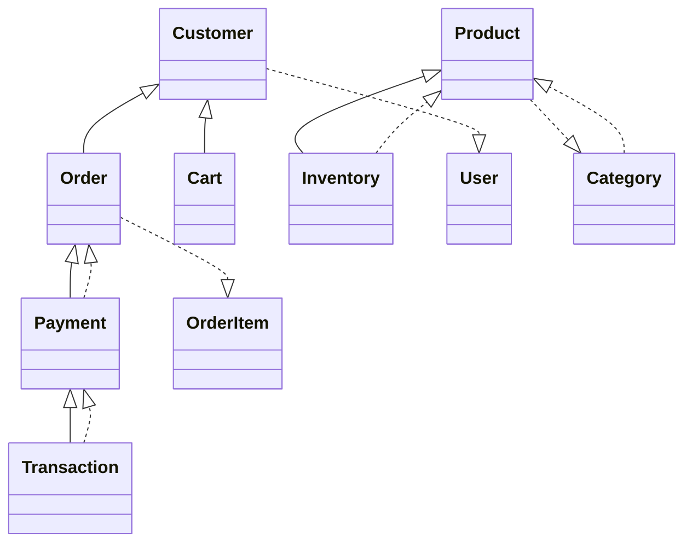
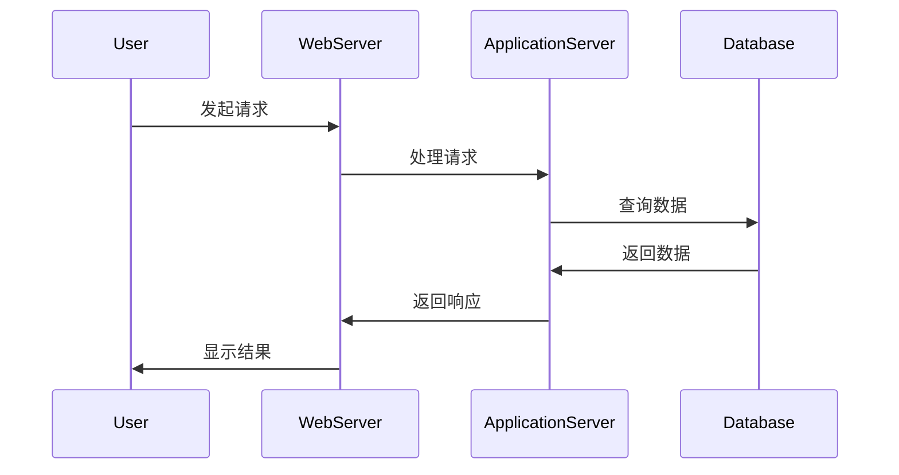
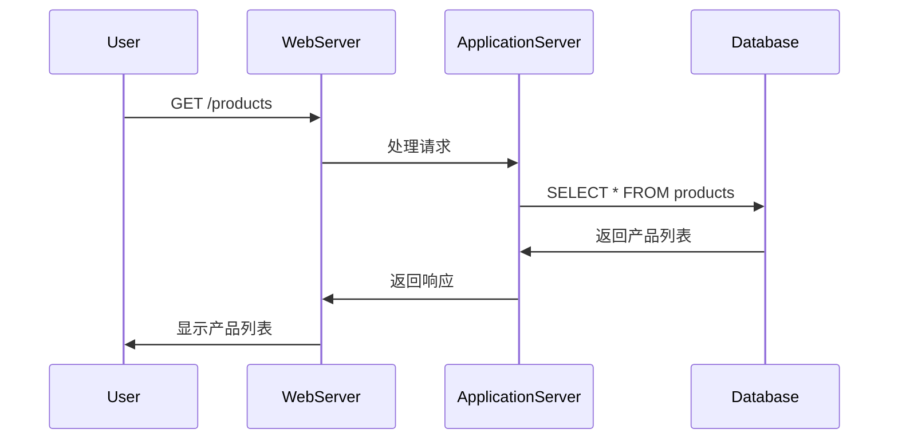

                 

# 技术债务管理：平衡短期目标和长期健康

关键词：技术债务、管理策略、敏捷方法、团队协作、可持续发展

摘要：本文旨在深入探讨技术债务的概念、成因、要素及其管理策略。通过分析技术债务对软件开发的影响，本文提出了一套系统化的管理方法，包括识别、评估和解决技术债务的流程，以及最佳实践和可持续发展策略。文章结构紧凑，逻辑清晰，旨在帮助开发者和技术管理者平衡短期目标和长期健康，确保软件项目的成功。

## 引言：技术债务管理的必要性

### 1.1 什么是技术债务

**1.1.1 技术债务的概念**

技术债务（Technical Debt）是软件开发中一个重要的概念，它类比于金融领域的债务，表示在软件开发过程中，因快速交付而有意或无意地采取妥协或短期解决方案所积累的问题。这些问题可能会影响软件的长期维护性和扩展性。

**1.1.2 技术债务的来源**

技术债务的主要来源包括：
- 快速迭代开发：为了满足市场需求，开发团队可能会采取一些妥协措施，导致代码质量下降。
- 时间与资源的限制：在紧迫的项目截止日期下，团队可能会牺牲某些质量指标以尽快交付。
- 技术变革与更新：随着技术的不断发展，旧的技术栈和方法可能不再适用，导致技术债务的积累。
- 缺乏可持续的技术规划：没有清晰的技术规划和维护策略，会导致技术债务的不断累积。

**1.1.3 技术债务的影响**

技术债务的影响主要体现在以下几个方面：
- 降低系统的可维护性：技术债务会导致代码复杂度增加，使得维护和修复变得更加困难。
- 增加开发成本：随着时间推移，技术债务的解决成本会逐渐增加。
- 影响团队士气：技术债务的存在会降低团队的工作效率，影响团队的士气。

### 1.2 技术债务管理的挑战

**1.2.1 技术债务的积累**

技术债务的积累是软件开发过程中的一个常见现象。特别是在快速迭代和敏捷开发模式下，技术债务更容易产生。

**1.2.2 技术债务的识别**

识别技术债务是管理技术债务的第一步。这需要开发者和团队具备敏锐的洞察力和持续的质量意识。

**1.2.3 技术债务的管理策略**

管理技术债务需要一套系统化的策略，包括识别、评估和解决技术债务的流程。同时，还需要制定持续的技术规划和维护策略。

### 1.3 书籍结构概述

**1.3.1 目标读者**

本文的目标读者是软件开发者和技术管理者，尤其是那些对技术债务管理有深入理解和实践经验的人。

**1.3.2 内容框架**

本文将按照以下框架展开：
- 引言：技术债务管理的必要性
- 背景介绍与技术债务的产生
- 核心概念与技术债务的要素
- 技术债务管理的最佳实践
- 本章小结

**1.3.3 实践应用**

本文的内容将以理论和实践相结合的方式展开，旨在为开发者和技术管理者提供实际可行的技术债务管理策略。

### 1.4 本章小结

本文介绍了技术债务的概念、成因、影响以及管理的必要性。接下来，我们将深入探讨技术债务的产生背景和管理方法。

--------------------------------

## 背景介绍与技术债务的产生

### 2.1 信息技术发展的历史背景

**2.1.1 信息技术的初期发展**

20世纪60年代，计算机开始进入商业领域，软件开发也随之兴起。早期的软件开发主要关注于代码质量和可靠性，技术债务的概念尚未出现。

**2.1.2 企业信息化浪潮**

20世纪80年代，随着计算机技术的快速发展，企业开始大规模应用计算机系统，推动了企业信息化浪潮。这一时期，软件开发开始追求快速交付，技术债务逐渐显现。

**2.1.3 数字化转型的加速**

进入21世纪，数字化转型成为企业发展的关键。随着云计算、大数据、人工智能等新技术的广泛应用，软件开发的速度和复杂性大幅提升，技术债务问题更加突出。

### 2.2 技术债务的成因

**2.2.1 快速迭代开发**

快速迭代开发是现代软件开发的主要模式。为了尽快交付功能，开发团队可能会采取一些妥协措施，导致技术债务的积累。

**2.2.2 时间与资源的限制**

在紧迫的项目截止日期下，团队可能会牺牲某些质量指标以尽快交付，导致技术债务的产生。

**2.2.3 技术变革与更新**

随着技术的不断变革和更新，旧的技术栈和方法可能不再适用，导致技术债务的积累。

**2.2.4 缺乏可持续的技术规划**

缺乏清晰的技术规划和维护策略，会导致技术债务的不断累积。

### 2.3 技术债务的表现形式

**2.3.1 技术债务的种类**

技术债务可以分为以下几种类型：
- 设计债务：在软件架构和设计上的妥协，可能导致系统难以扩展和维护。
- 代码债务：代码质量低下，缺乏注释，代码结构混乱，可能导致维护困难。
- 测试债务：测试覆盖不足，缺乏自动化测试，可能导致系统稳定性下降。

**2.3.2 技术债务的典型特征**

技术债务的典型特征包括：
- 代码复杂度高：代码结构复杂，难以理解和修改。
- 维护成本高：维护和修复技术债务的成本远高于最初的开发成本。
- 项目延期：技术债务会导致项目延期，影响项目进度。

**2.3.3 技术债务的影响范围**

技术债务的影响范围广泛，不仅影响软件开发过程，还影响团队协作、项目管理和业务目标。

### 2.4 技术债务管理的意义

**2.4.1 确保系统的长期健康**

技术债务管理有助于确保系统的长期健康，避免因技术债务而导致的系统崩溃和维护成本激增。

**2.4.2 提升团队的协作效率**

技术债务管理有助于提升团队协作效率，减少因技术债务而导致的开发难度和沟通成本。

**2.4.3 降低技术债务的负面影响**

通过有效的技术债务管理，可以降低技术债务的负面影响，提高软件项目的成功率。

### 2.5 本章小结

本章介绍了信息技术发展的历史背景、技术债务的成因和表现形式，以及技术债务管理的意义。接下来，我们将深入探讨技术债务的核心概念和要素。

--------------------------------

### 核心概念与技术债务的要素

#### 3.1 技术债务的核心概念

**3.1.1 技术债务的定义**

技术债务（Technical Debt）是软件开发中一个重要的概念，它类比于金融领域的债务，表示在软件开发过程中，因快速交付而有意或无意地采取妥协或短期解决方案所积累的问题。这些问题可能会影响软件的长期维护性和扩展性。

**3.1.2 技术债务的类型**

技术债务可以分为以下几种类型：
- 设计债务：在软件架构和设计上的妥协，可能导致系统难以扩展和维护。
- 代码债务：代码质量低下，缺乏注释，代码结构混乱，可能导致维护困难。
- 测试债务：测试覆盖不足，缺乏自动化测试，可能导致系统稳定性下降。

**3.1.3 技术债务的属性特征**

技术债务具有以下属性特征：
- 可累积性：技术债务会随着项目进展和时间的推移而不断累积。
- 长期影响性：技术债务的影响不仅限于开发阶段，还会影响软件的维护和使用阶段。
- 经济性：技术债务会导致开发成本的增加和维护成本的提高。

#### 3.2 技术债务的要素分析

**3.2.1 技术债务的影响因素**

技术债务的影响因素包括：
- 项目规模：项目规模越大，技术债务的可能性越高。
- 团队经验：团队经验越丰富，越能有效地管理技术债务。
- 开发模式：敏捷开发模式下，技术债务更容易产生。

**3.2.2 技术债务的风险评估**

技术债务的风险评估包括：
- 风险识别：识别系统中可能存在的技术债务。
- 风险评估：评估技术债务对项目的影响程度。
- 风险处理：制定相应的风险处理措施。

**3.2.3 技术债务的处理原则**

技术债务的处理原则包括：
- 透明度原则：技术债务的存在和处理过程应保持透明，以便团队成员共同参与管理。
- 协作共享原则：技术债务的管理需要团队成员的协作和共享。
- 可持续性原则：技术债务管理应考虑系统的长期可持续性。

#### 3.3 技术债务与项目管理的联系

**3.3.1 技术债务在项目管理中的角色**

技术债务在项目管理中扮演着重要角色，它既是项目的风险因素，也是项目的管理对象。

**3.3.2 技术债务与项目目标的冲突**

技术债务可能会与项目目标产生冲突，例如，在追求快速交付时，可能会牺牲系统的可维护性。

**3.3.3 技术债务管理的方法论**

技术债务管理的方法论包括：
- 识别和评估技术债务：通过代码审查、测试和用户反馈等方式，识别和评估技术债务。
- 制定和实施技术债务管理策略：制定技术债务管理计划，并实施相应的管理措施。
- 持续监控和改进：持续监控技术债务的变化，并根据实际情况进行改进。

#### 3.4 技术债务的管理流程

**3.4.1 技术债务的识别流程**

技术债务的识别流程包括：
1. 代码审查：通过代码审查，识别代码中的技术债务。
2. 测试覆盖分析：通过测试覆盖分析，识别测试中的技术债务。
3. 用户反馈：通过用户反馈，识别系统中存在的问题。

**3.4.2 技术债务的评估流程**

技术债务的评估流程包括：
1. 风险评估：对识别出的技术债务进行风险评估，确定其严重程度。
2. 影响分析：分析技术债务对项目的影响，包括成本、进度和功能等方面。
3. 治理策略：制定技术债务的治理策略，包括修复、重构和迁移等。

**3.4.3 技术债务的解决流程**

技术债务的解决流程包括：
1. 修复技术债务：对严重的技术债务进行修复，提高代码质量。
2. 重构代码：对复杂的代码进行重构，提高系统的可维护性。
3. 迁移技术栈：对过时的技术栈进行迁移，提高系统的适应性。

#### 3.5 技术债务管理的核心原则

**3.5.1 可持续发展原则**

可持续发展原则强调技术债务管理应考虑系统的长期可持续性，避免短期行为对系统造成长期损害。

**3.5.2 透明度原则**

透明度原则强调技术债务的存在和处理过程应保持透明，以便团队成员共同参与管理。

**3.5.3 协作共享原则**

协作共享原则强调技术债务的管理需要团队成员的协作和共享，共同应对技术债务的挑战。

### 3.6 本章小结

本章介绍了技术债务的核心概念、要素分析、与项目管理的联系以及管理流程。通过本章的内容，我们可以更好地理解技术债务的本质和如何进行有效管理。

--------------------------------

### 技术债务管理的最佳实践

#### 4.1 技术债务管理的成功案例

**4.1.1 案例一：企业A的技术债务管理实践**

企业A在数字化转型过程中，面临大量的技术债务。通过引入持续集成、自动化测试和代码审查等最佳实践，企业A有效地降低了技术债务的累积，提高了软件质量和开发效率。

**4.1.2 案例二：项目B的技术债务管理经验**

项目B在项目初期就明确了技术债务管理的目标，并通过定期评估和修复技术债务，确保项目能够按计划推进。项目B的成功经验表明，技术债务管理是确保项目成功的关键因素。

**4.1.3 案例三：团队C的技术债务管理方法**

团队C采用了敏捷开发模式，并在团队内部建立了技术债务的管理机制。通过定期回顾和总结，团队C不断优化技术债务管理流程，提高了团队的协作效率和项目交付质量。

#### 4.2 技术债务管理的工具与方法

**4.2.1 自动化工具在技术债务管理中的应用**

自动化工具在技术债务管理中发挥着重要作用，例如：
- 代码质量检测工具：用于识别代码中的潜在问题，降低技术债务的累积。
- 自动化测试工具：提高测试覆盖率和测试效率，降低测试债务。
- 持续集成工具：确保代码的持续集成和自动化测试，提高开发效率。

**4.2.2 技术债务管理的敏捷方法**

敏捷方法强调团队协作和持续交付，通过以下方法可以有效地管理技术债务：
- 定期回顾：通过定期回顾，识别和解决技术债务。
- 持续交付：通过持续交付，降低技术债务的累积。
- 用户故事地图：通过用户故事地图，明确项目目标和价值，避免不必要的妥协。

**4.2.3 技术债务管理的持续集成实践**

持续集成实践是技术债务管理的重要组成部分，通过以下方法可以有效地降低技术债务：
- 定期集成：通过定期集成，及时发现和解决技术债务。
- 自动化测试：通过自动化测试，确保代码质量，降低技术债务。
- 持续监控：通过持续监控，及时发现和处理技术债务。

#### 4.3 技术债务管理的团队协作

**4.3.1 团队内的沟通与协作**

技术债务管理需要团队成员之间的有效沟通和协作，以下是一些有效的沟通与协作方法：
- 晨会：通过晨会，团队成员可以及时分享信息和讨论问题。
- 周会：通过周会，团队成员可以总结过去一周的工作，计划下一周的任务。
- 对内培训：通过内部培训，提高团队成员的技术能力和质量意识。

**4.3.2 技术债务管理的责任分配**

技术债务管理需要明确责任分配，以下是一些有效的责任分配方法：
- 技术负责人：由技术负责人负责技术债务的识别、评估和解决。
- 团队成员：团队成员负责日常的技术债务管理工作，如代码审查、测试和修复等。
- 项目经理：项目经理负责监督技术债务管理工作的执行，确保项目目标的实现。

**4.3.3 团队成员的培训与发展**

技术债务管理需要团队成员具备一定的技术能力和质量意识，以下是一些有效的培训与发展方法：
- 技术培训：通过技术培训，提高团队成员的技术能力。
- 质量培训：通过质量培训，提高团队成员的质量意识。
- 经验分享：通过经验分享，促进团队成员之间的交流和学习。

#### 4.4 技术债务管理的可持续性策略

**4.4.1 长期视角下的技术债务管理**

技术债务管理需要从长期视角出发，以下是一些有效的策略：
- 长期规划：通过长期规划，确保技术债务的可持续管理。
- 技术选型：通过合理的技术选型，降低技术债务的累积。
- 质量文化：通过培养质量文化，提高团队的质量意识。

**4.4.2 技术债务与业务目标的平衡**

技术债务管理需要与业务目标保持平衡，以下是一些有效的策略：
- 业务导向：通过业务导向，确保技术债务管理的方向与业务目标一致。
- 敏捷调整：通过敏捷调整，根据业务需求的变化，灵活调整技术债务管理策略。
- 成本控制：通过成本控制，确保技术债务管理的成本在可承受范围内。

**4.4.3 技术债务管理的持续改进**

技术债务管理是一个持续改进的过程，以下是一些有效的策略：
- 反思总结：通过反思总结，不断优化技术债务管理流程。
- 最佳实践：通过最佳实践，借鉴其他团队和企业的成功经验。
- 持续学习：通过持续学习，提高团队的技术能力和管理能力。

### 4.5 本章小结

本章通过成功案例、工具与方法、团队协作和可持续性策略等方面，探讨了技术债务管理的最佳实践。通过本章的内容，我们可以更好地理解和应用技术债务管理的策略，确保软件项目的成功。

--------------------------------

## 本章小结

本文从技术债务的概念、成因、要素和管理方法等多个角度，深入探讨了技术债务管理的核心内容。通过分析成功案例和最佳实践，本文为开发者和技术管理者提供了一套系统化的技术债务管理策略。

### 5.1 关键知识点总结

- 技术债务的定义、类型和属性特征。
- 技术债务的影响因素、风险评估和处理原则。
- 技术债务与项目管理的联系和管理流程。
- 技术债务管理的核心原则和最佳实践。

### 5.2 下一步阅读建议

- 深入研究敏捷开发方法在技术债务管理中的应用。
- 学习自动化工具在技术债务管理中的作用。
- 探索如何通过持续改进和团队协作，实现技术债务的可持续管理。

### 5.3 注意事项与风险防范

- 在技术债务管理过程中，要注意平衡短期目标和长期健康，避免过度追求快速交付。
- 定期评估和修复技术债务，避免技术债务的累积。
- 培养团队的质量意识和技术能力，提高技术债务管理的效率。

### 5.4 拓展阅读推荐

- 《敏捷软件开发：原则、实践与模式》（作者：罗伯特·C·马丁）
- 《持续交付：发布可靠软件的系统方法》（作者：Jez Humble 和 David Farley）
- 《软件工程：实践者的研究方法》（作者：Roger S. Pressman）

作者：AI天才研究院/AI Genius Institute & 禅与计算机程序设计艺术 /Zen And The Art of Computer Programming

--------------------------------

## 背景介绍与技术债务的产生

在软件开发的世界里，技术债务（Technical Debt）是一个常见而复杂的话题。它不仅影响了项目的成功，还影响了团队的效率和组织的竞争力。在这个章节中，我们将深入探讨技术债务的产生背景、成因以及其表现形式，并解释为何管理技术债务至关重要。

### 2.1 信息技术发展的历史背景

信息技术的发展可以追溯到20世纪中期，当时计算机主要用于科学研究和军事目的。随着计算机技术的普及和商业化，软件开发开始成为一种职业。在早期，软件开发的重点主要放在确保软件的可靠性和功能完整性上。技术债务的概念在那个时代并不常见，因为软件通常由少数专家开发，项目周期较长，且对质量的要求非常高。

随着时间的推移，信息技术经历了几个关键阶段：

**2.1.1 信息技术的初期发展**

在20世纪60年代和70年代，计算机开始进入企业和政府机构，软件的开发和维护也变得更加复杂。这个时期，软件开发的重点是从编写程序到设计系统架构。然而，由于资源和技术的限制，软件开发者不得不采取一些妥协措施，以快速交付功能。

**2.1.2 企业信息化浪潮**

20世纪80年代和90年代，企业信息化浪潮席卷全球，企业开始大规模投资于计算机系统和软件应用。这个时期，软件开发的重心从科学计算转向商业应用，软件项目变得更大、更复杂。为了快速响应市场变化，开发团队开始采用瀑布模型和敏捷开发方法。然而，这些方法也带来了新的挑战，如快速迭代和资源限制，导致技术债务的积累。

**2.1.3 数字化转型的加速**

进入21世纪，数字化转型成为企业竞争的关键。随着云计算、大数据、人工智能和物联网等新技术的普及，软件开发的速度和复杂性大幅提升。这导致技术债务问题变得更加突出，因为旧的技术栈和方法不再能满足现代应用的需求。

### 2.2 技术债务的成因

技术债务的产生并不是偶然的，而是由多种因素共同作用的结果。以下是一些主要成因：

**2.2.1 快速迭代开发**

快速迭代开发是现代软件开发的主要模式之一。它允许团队快速交付功能，并频繁地进行软件更新。然而，这种开发方法也带来了一些挑战，如：

- **快速交付的压力**：为了满足市场需求，团队可能会牺牲代码质量，导致技术债务的积累。
- **技术选择的灵活性**：在快速迭代的过程中，团队可能会频繁更换技术栈，导致技术债务的复杂性增加。

**2.2.2 时间与资源的限制**

在紧迫的项目截止日期下，开发团队可能会面临时间和资源的限制。为了尽快交付软件，团队可能会采取一些短期解决方案，如：

- **妥协设计**：为了快速交付，开发团队可能会在软件架构和设计上做出妥协，导致系统的可维护性下降。
- **减少测试**：为了赶工期，团队可能会减少测试工作，导致软件的质量和稳定性受到影响。

**2.2.3 技术变革与更新**

技术的快速变革和更新也是导致技术债务的重要原因。随着新技术的不断涌现，旧的技术栈和方法可能不再适用，导致：

- **技术债务累积**：团队需要不断更新技术栈，以适应新的需求，但这个过程中可能会产生新的技术债务。
- **维护成本增加**：随着技术债务的累积，维护和更新软件的成本会逐渐增加。

**2.2.4 缺乏可持续的技术规划**

缺乏可持续的技术规划是导致技术债务的一个重要原因。在许多组织中，技术决策往往是短期的，缺乏长期视角。这可能导致：

- **技术债务的累积**：没有明确的技术规划，团队可能会在软件开发过程中不断积累技术债务。
- **团队士气下降**：技术债务的存在会影响团队的士气和工作效率，导致长期的生产力下降。

### 2.3 技术债务的表现形式

技术债务的表现形式多种多样，以下是其中几种常见的形式：

**2.3.1 技术债务的种类**

- **设计债务**：在软件架构和设计上的妥协，导致系统难以扩展和维护。
- **代码债务**：代码质量低下，缺乏注释，代码结构混乱，影响软件的可维护性。
- **测试债务**：测试覆盖不足，缺乏自动化测试，导致软件的稳定性下降。

**2.3.2 技术债务的典型特征**

- **复杂性增加**：技术债务会导致软件系统的复杂性增加，使得理解和修改代码变得更加困难。
- **维护成本提高**：随着时间推移，技术债务的解决成本会逐渐增加。
- **影响范围广泛**：技术债务不仅影响开发团队，还可能影响整个组织，包括客户和业务部门。

**2.3.3 技术债务的影响范围**

技术债务的影响范围非常广泛，包括以下几个方面：

- **项目成本**：技术债务会导致项目成本的增加，包括维护成本、修复成本和更新成本。
- **项目进度**：技术债务可能导致项目延期，影响项目的交付时间。
- **团队协作**：技术债务的存在会影响团队的协作效率，降低团队的生产力。
- **客户满意度**：技术债务会影响软件的质量和稳定性，降低客户的满意度。

### 2.4 技术债务管理的意义

技术债务管理对于软件开发项目的成功至关重要。以下是技术债务管理的重要性：

**2.4.1 确保系统的长期健康**

通过有效的技术债务管理，可以确保软件系统的长期健康，避免因技术债务而导致的系统崩溃和维护成本激增。

**2.4.2 提升团队的协作效率**

技术债务管理有助于提升团队的协作效率，减少因技术债务而导致的开发难度和沟通成本。

**2.4.3 降低技术债务的负面影响**

通过有效的技术债务管理，可以降低技术债务的负面影响，提高软件项目的成功率。

### 2.5 本章小结

本章介绍了信息技术发展的历史背景、技术债务的成因和表现形式，以及技术债务管理的意义。通过本章的内容，我们可以更好地理解技术债务的产生背景和影响，为后续章节的技术债务管理提供基础。

--------------------------------

### 核心概念与技术债务的要素

在深入探讨技术债务管理之前，我们需要明确技术债务的核心概念和要素。技术债务不仅仅是一个抽象的概念，它是由一系列具体因素构成的，这些因素影响其产生、累积和解决。

#### 3.1 技术债务的核心概念

**3.1.1 技术债务的定义**

技术债务（Technical Debt）是软件开发中一个重要的概念，它类比于金融领域的债务，表示在软件开发过程中，因快速交付而有意或无意地采取妥协或短期解决方案所积累的问题。这些问题可能会影响软件的长期维护性和扩展性。

技术债务可以分为以下几种类型：

- **设计债务**：在软件架构和设计上的妥协，可能导致系统难以扩展和维护。
- **代码债务**：代码质量低下，缺乏注释，代码结构混乱，可能导致维护困难。
- **测试债务**：测试覆盖不足，缺乏自动化测试，可能导致系统稳定性下降。

**3.1.2 技术债务的类型**

- **设计债务**：设计债务是指在软件设计过程中，为了满足当前的需求，而牺牲了系统的长期可扩展性和可维护性。这可能导致代码的复杂性增加，模块之间的依赖关系变得复杂，从而影响系统的可维护性和可扩展性。

- **代码债务**：代码债务是指由于时间、资源和能力限制，开发者在编写代码时采取了低效的编程方式或使用了不符合最佳实践的方法。这可能导致代码质量下降，包括代码可读性差、缺乏注释、代码冗余等。

- **测试债务**：测试债务是指在软件开发过程中，由于各种原因，测试工作没有得到充分的执行。这可能导致系统存在未发现的缺陷，影响系统的稳定性和可靠性。

**3.1.3 技术债务的属性特征**

- **累积性**：技术债务会在软件开发过程中不断累积，尤其是在快速迭代和敏捷开发模式下，技术债务的累积速度可能会更快。
- **长期影响性**：技术债务的影响不仅限于开发阶段，它还会在软件的维护和使用阶段产生长期影响，增加维护成本和风险。
- **经济性**：技术债务的管理和维护成本往往高于最初的开发成本，特别是在软件生命周期后期，解决技术债务的成本会更高。

#### 3.2 技术债务的要素分析

**3.2.1 技术债务的影响因素**

技术债务的产生和累积受到多种因素的影响，以下是一些主要的影响因素：

- **项目规模**：项目规模越大，技术债务的可能性越高，因为大型项目通常需要更复杂的技术架构和更长的开发周期。
- **团队经验**：团队经验越丰富，越能有效地管理技术债务，因为他们更了解如何避免和解决技术债务。
- **开发模式**：不同的开发模式对技术债务的影响不同。例如，敏捷开发模式可能更容易导致技术债务的积累，而传统的瀑布模型则可能使技术债务得到更好的管理。

**3.2.2 技术债务的风险评估**

技术债务的风险评估是管理技术债务的重要环节。以下是一些关键步骤：

- **识别技术债务**：通过代码审查、测试覆盖分析和用户反馈等方式，识别系统中存在的技术债务。
- **评估风险**：对识别出的技术债务进行风险评估，确定其严重程度和对项目的影响。
- **优先级排序**：根据风险评估结果，对技术债务进行优先级排序，以便团队可以优先解决高风险的技术债务。

**3.2.3 技术债务的处理原则**

处理技术债务需要遵循一些核心原则，以确保技术债务的有效管理：

- **透明度原则**：技术债务的存在和处理过程应保持透明，以便团队成员可以共同参与管理。
- **协作共享原则**：技术债务的管理需要团队成员的协作和共享，特别是技术负责人和开发人员之间的协作。
- **可持续发展原则**：技术债务管理应考虑系统的长期可持续性，避免短期行为对系统造成长期损害。

#### 3.3 技术债务与项目管理的联系

技术债务与项目管理紧密相连，以下是一些关键点：

**3.3.1 技术债务在项目管理中的角色**

技术债务在项目管理中扮演着双重角色：既是项目的风险因素，也是项目的管理对象。项目管理者需要意识到技术债务的存在，并制定相应的管理策略。

**3.3.2 技术债务与项目目标的冲突**

技术债务可能会与项目目标产生冲突。例如，在追求快速交付时，可能会牺牲系统的可维护性和扩展性。项目管理者需要平衡短期目标和长期健康，确保项目目标的实现。

**3.3.3 技术债务管理的方法论**

技术债务管理的方法论包括以下关键步骤：

- **识别和评估**：通过代码审查、测试覆盖分析和用户反馈等方式，识别和评估技术债务。
- **制定策略**：根据风险评估结果，制定技术债务管理策略，包括修复、重构和迁移等。
- **执行和监控**：执行技术债务管理策略，并持续监控技术债务的变化，根据实际情况进行必要的调整。

#### 3.4 技术债务的管理流程

技术债务的管理是一个持续的过程，以下是一个简化的技术债务管理流程：

**3.4.1 技术债务的识别流程**

- **代码审查**：定期进行代码审查，识别代码中的设计债务和代码债务。
- **测试覆盖分析**：分析测试覆盖率，识别测试债务。
- **用户反馈**：收集用户反馈，识别系统中存在的问题。

**3.4.2 技术债务的评估流程**

- **风险评估**：对识别出的技术债务进行风险评估，确定其严重程度。
- **影响分析**：分析技术债务对项目的影响，包括成本、进度和功能等方面。
- **治理策略**：制定技术债务的治理策略，包括修复、重构和迁移等。

**3.4.3 技术债务的解决流程**

- **修复技术债务**：针对高风险和紧急的技术债务，进行修复，提高代码质量。
- **重构代码**：对复杂的代码进行重构，提高系统的可维护性。
- **迁移技术栈**：对过时的技术栈进行迁移，提高系统的适应性。

#### 3.5 技术债务管理的核心原则

技术债务管理的核心原则包括以下几点：

- **可持续发展原则**：技术债务管理应考虑系统的长期可持续性，避免短期行为对系统造成长期损害。
- **透明度原则**：技术债务的存在和处理过程应保持透明，以便团队成员可以共同参与管理。
- **协作共享原则**：技术债务的管理需要团队成员的协作和共享，特别是技术负责人和开发人员之间的协作。

### 3.6 本章小结

本章介绍了技术债务的核心概念、类型、属性特征以及管理技术债务的要素分析。通过这些核心概念和要素的分析，我们可以更好地理解技术债务的本质，并为后续章节的技术债务管理提供理论基础。

#### 3.6.1 关键知识点

- 技术债务的定义、类型和属性特征。
- 技术债务的影响因素、风险评估和处理原则。
- 技术债务与项目管理的联系和管理流程。
- 技术债务管理的核心原则。

#### 3.6.2 ER实体关系图：技术债务管理要素

```mermaid
erDiagram
    User ||--|{ Project }|-- TechnicalDebt
    Project ||--|{ Feature }|-- TechnicalDebt
    TechnicalDebt ||--|{ DesignDebt }| DesignDebt
    TechnicalDebt ||--|{ CodeDebt }| CodeDebt
    TechnicalDebt ||--|{ TestDebt }| TestDebt
```

在这个ER图中，`User`（用户）与`Project`（项目）之间存在多对多关系，一个用户可以参与多个项目，一个项目也可以有多个用户。`Project`（项目）与`Feature`（功能）之间存在一对多关系，一个项目中包含多个功能。`TechnicalDebt`（技术债务）与`DesignDebt`（设计债务）、`CodeDebt`（代码债务）、`TestDebt`（测试债务）之间存在一对一的关系，每一种类型的技术债务都属于技术债务的一个实例。

### 3.7 算法原理讲解

为了更好地理解技术债务管理，我们将使用一个简单的算法来分析技术债务的产生和解决过程。这个算法将分为三个主要步骤：识别、评估和解决技术债务。

**算法：技术债务管理**

```python
# 定义技术债务管理函数
def manage_technical_debt(projects):
    for project in projects:
        # 识别技术债务
        technical_debt = identify_technical_debt(project)
        
        # 评估技术债务
        risk_levels = assess_risk(technical_debt)
        
        # 解决技术债务
        resolve_technical_debt(technical_debt, risk_levels)

# 定义识别技术债务函数
def identify_technical_debt(project):
    debt_list = []
    # 识别设计债务
    design_debt = identify_design_debt(project)
    if design_debt:
        debt_list.append(design_debt)
    # 识别代码债务
    code_debt = identify_code_debt(project)
    if code_debt:
        debt_list.append(code_debt)
    # 识别测试债务
    test_debt = identify_test_debt(project)
    if test_debt:
        debt_list.append(test_debt)
    return debt_list

# 定义评估技术债务函数
def assess_risk(technical_debt):
    risk_levels = []
    for debt in technical_debt:
        risk = assess_individual_risk(debt)
        risk_levels.append(risk)
    return risk_levels

# 定义解决技术债务函数
def resolve_technical_debt(technical_debt, risk_levels):
    for i, debt in enumerate(technical_debt):
        if risk_levels[i] == 'High':
            resolve_high_risk_debt(debt)
        elif risk_levels[i] == 'Medium':
            resolve_medium_risk_debt(debt)
        elif risk_levels[i] == 'Low':
            resolve_low_risk_debt(debt)

# 定义识别设计债务函数
def identify_design_debt(project):
    # 此处应实现具体的识别逻辑
    return "Design Debt Identified"

# 定义识别代码债务函数
def identify_code_debt(project):
    # 此处应实现具体的识别逻辑
    return "Code Debt Identified"

# 定义识别测试债务函数
def identify_test_debt(project):
    # 此处应实现具体的识别逻辑
    return "Test Debt Identified"

# 定义评估单个技术债务风险函数
def assess_individual_risk(debt):
    # 此处应实现具体的评估逻辑
    return "Risk Level"

# 定义解决高风险技术债务函数
def resolve_high_risk_debt(debt):
    # 此处应实现具体的解决逻辑
    print(f"Resolving High Risk Debt: {debt}")

# 定义解决中风险技术债务函数
def resolve_medium_risk_debt(debt):
    # 此处应实现具体的解决逻辑
    print(f"Resolving Medium Risk Debt: {debt}")

# 定义解决低风险技术债务函数
def resolve_low_risk_debt(debt):
    # 此处应实现具体的解决逻辑
    print(f"Resolving Low Risk Debt: {debt}")
```

在这个算法中，我们首先定义了技术债务管理的函数`manage_technical_debt`，它接受一个`projects`列表作为输入。然后，我们分别定义了识别、评估和解决技术债务的函数。识别技术债务的函数`identify_technical_debt`会根据项目识别出设计债务、代码债务和测试债务。评估技术债务的函数`assess_risk`会对每个技术债务进行风险评估。最后，解决技术债务的函数`resolve_technical_debt`会根据风险级别采取不同的解决策略。

#### 3.8 数学公式

在技术债务管理中，数学模型和公式可以帮助我们更准确地评估和管理技术债务。以下是一个简单的数学公式示例：

$$
R = I \times S + V \times T
$$

其中：
- \( R \) 是技术债务的风险评分。
- \( I \) 是技术债务的严重程度。
- \( S \) 是技术债务的解决方案的难易程度。
- \( V \) 是技术债务对项目价值的影响。
- \( T \) 是技术债务的修复时间。

通过这个公式，我们可以对技术债务进行量化评估，从而更好地管理技术债务。

### 3.9 系统分析与架构设计方案

为了更全面地理解技术债务管理，我们还需要考虑系统分析与架构设计方案。以下是一个简化的系统分析与架构设计方案：

#### 问题场景介绍

假设我们正在开发一个电子商务平台，该平台需要支持大量的用户和交易。随着用户数量的增加，系统的性能和可扩展性成为了关键问题。

#### 项目介绍

项目名称：电子商务平台
项目目标：构建一个高性能、可扩展的电子商务平台
项目团队：前端开发、后端开发、测试团队、产品经理

#### 系统功能设计（领域模型）

以下是一个简化的领域模型，描述了电子商务平台的主要功能：



#### 系统架构设计

以下是一个简化的系统架构设计，描述了电子商务平台的主要组件和交互：



#### 系统接口设计和系统交互

以下是一个简化的系统接口设计和交互流程：



### 3.10 项目实战

为了更好地理解技术债务管理的实际应用，我们将在本节中介绍一个简单的项目实战。

#### 环境安装

假设我们已经搭建了电子商务平台的基础环境，包括Web服务器、应用服务器和数据库。以下是环境安装的简要步骤：

1. 安装Web服务器（如Nginx）。
2. 安装应用服务器（如Apache）。
3. 安装数据库（如MySQL）。
4. 安装相关开发工具（如Python、Docker等）。

#### 系统核心实现

以下是一个简化的电子商务平台的核心实现：

```python
# 示例：订单管理模块

class Order:
    def __init__(self, user, products):
        self.user = user
        self.products = products
        self.status = "pending"

    def place_order(self):
        self.status = "placed"
        # 记录订单到数据库

    def cancel_order(self):
        self.status = "cancelled"
        # 取消订单并更新数据库

# 示例：产品管理模块

class Product:
    def __init__(self, name, category, price):
        self.name = name
        self.category = category
        self.price = price

    def update_price(self, new_price):
        self.price = new_price

# 示例：用户管理模块

class User:
    def __init__(self, username, email):
        self.username = username
        self.email = email

    def update_email(self, new_email):
        self.email = new_email
```

#### 代码应用解读与分析

以上代码实现了一个简化的电子商务平台的核心功能，包括订单管理、产品管理和用户管理。以下是对这些代码的解读和分析：

- **订单管理模块**：`Order` 类表示订单，具有用户、产品和状态等属性。`place_order` 和 `cancel_order` 方法分别用于创建订单和取消订单。
- **产品管理模块**：`Product` 类表示产品，具有名称、类别和价格等属性。`update_price` 方法用于更新产品的价格。
- **用户管理模块**：`User` 类表示用户，具有用户名和电子邮件等属性。`update_email` 方法用于更新用户的电子邮件。

这些代码模块实现了电子商务平台的基本功能，但需要注意的是，为了提高系统的可维护性和可扩展性，还需要进一步完善和优化。

#### 实际案例分析和详细讲解剖析

在本节中，我们将分析一个实际案例，并详细讲解如何管理技术债务。

**案例：系统性能优化**

假设在电子商务平台的运行过程中，我们发现系统的响应速度较慢，特别是在高峰期。这可能会导致用户体验下降，影响业务收入。

**分析**：

1. **识别技术债务**：通过性能监控工具，我们发现系统瓶颈主要在数据库查询和服务器响应时间上。
2. **评估技术债务**：根据影响范围和修复难度，我们确定这是一个高风险的技术债务。
3. **解决技术债务**：我们采取了以下措施：
   - **数据库优化**：对数据库查询进行优化，包括索引优化、查询优化和分库分表。
   - **服务器优化**：升级服务器硬件，增加内存和CPU性能。
   - **缓存策略**：引入缓存策略，减少数据库查询次数。

**详细讲解剖析**：

- **数据库优化**：通过对数据库查询进行优化，我们提高了系统的响应速度。具体措施包括：
  - **索引优化**：创建合适的索引，提高查询效率。
  - **查询优化**：优化SQL查询语句，减少查询次数和资源消耗。
  - **分库分表**：将大数据库拆分为多个小数据库，减少单点瓶颈。

- **服务器优化**：通过升级服务器硬件，我们提高了系统的性能和稳定性。具体措施包括：
  - **增加内存**：增加服务器的内存容量，提高处理能力。
  - **增加CPU性能**：升级服务器的CPU，提高计算速度。

- **缓存策略**：通过引入缓存策略，我们减少了数据库查询次数，提高了系统的响应速度。具体措施包括：
  - **应用层缓存**：在应用层引入缓存，减少对数据库的访问。
  - **分布式缓存**：使用分布式缓存系统，如Redis，提高缓存性能和扩展性。

通过以上措施，我们成功地解决了系统性能问题，提高了用户体验，降低了技术债务的风险。

#### 项目小结

在本章中，我们介绍了技术债务管理的核心概念和要素，并通过一个实际案例展示了如何管理技术债务。技术债务管理是软件开发中至关重要的一环，通过有效的技术债务管理，我们可以确保软件系统的长期健康和可持续发展。

### 3.11 最佳实践 tips

**3.11.1 预防技术债务**

- **持续学习和培训**：保持对新技术和最佳实践的了解，定期进行团队培训和知识分享。
- **编写高质量的代码**：遵循代码规范和最佳实践，确保代码的可读性和可维护性。
- **代码审查**：定期进行代码审查，及时发现和修复潜在的技术债务。

**3.11.2 管理技术债务**

- **定期评估**：定期对系统进行技术债务评估，识别和优先级排序技术债务。
- **风险管理**：对高风险的技术债务进行重点关注和优先处理。
- **持续改进**：通过持续改进，优化系统架构和代码质量，减少技术债务的累积。

**3.11.3 团队协作**

- **透明度**：保持技术债务管理的透明度，让团队成员了解技术债务的存在和处理情况。
- **协作共享**：鼓励团队成员之间的协作和知识共享，共同解决技术债务问题。
- **沟通机制**：建立有效的沟通机制，确保团队成员之间的信息畅通。

### 3.12 本章小结

本章详细介绍了技术债务的核心概念、要素分析、与项目管理的联系以及管理流程。通过本章的内容，我们可以更好地理解技术债务的本质和如何进行有效管理。在下一章中，我们将探讨技术债务管理的最佳实践和可持续发展策略。

### 3.13 注意事项与风险防范

**3.13.1 注意事项**

- **平衡短期目标和长期健康**：在管理技术债务时，要注意平衡短期目标和长期健康，避免过度追求快速交付。
- **定期评估和修复**：定期评估技术债务，并优先修复高风险的技术债务，以防止技术债务的累积。
- **持续改进**：持续改进技术债务管理流程，提高团队的技术能力和质量意识。

**3.13.2 风险防范**

- **风险评估**：在项目初期进行全面的风险评估，识别潜在的技术债务风险。
- **培训和教育**：对团队成员进行技术债务管理的培训和教育，提高团队的整体管理能力。
- **最佳实践**：遵循业界最佳实践，如代码审查、自动化测试和持续集成等，以降低技术债务的产生。

### 3.14 拓展阅读推荐

- 《软件工程：实践者的研究方法》（作者：Roger S. Pressman）
- 《敏捷软件开发：原则、实践与模式》（作者：罗伯特·C.马丁）
- 《持续交付：发布可靠软件的系统方法》（作者：Jez Humble 和 David Farley）

通过阅读这些书籍，我们可以更深入地了解技术债务管理的理论和实践，提高自己的技术债务管理能力。

