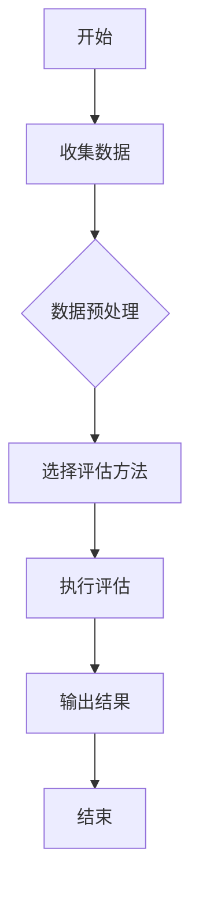
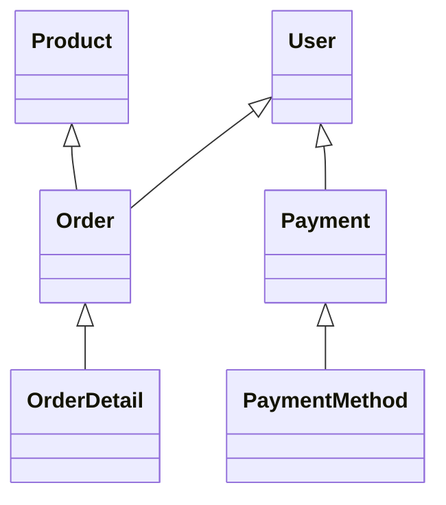
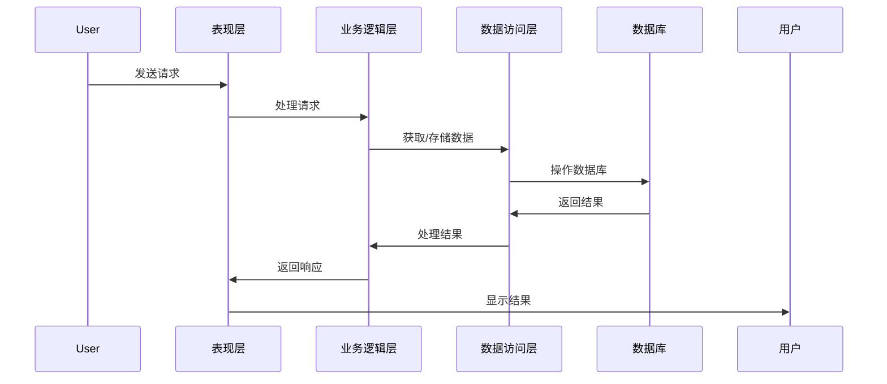
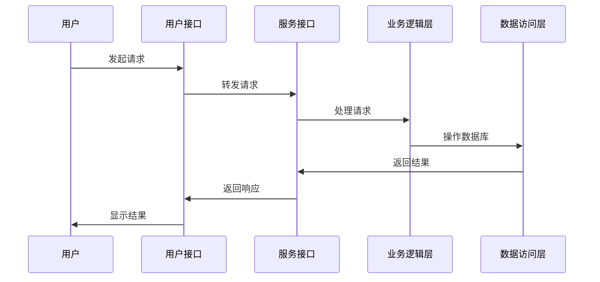
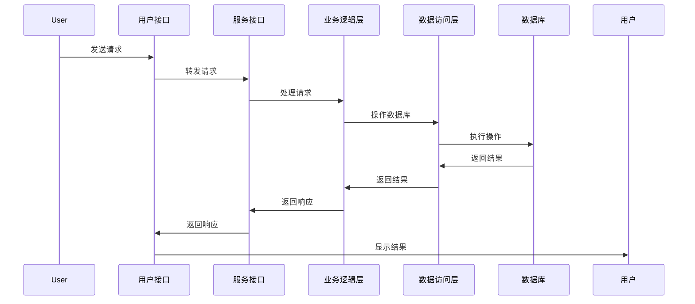

                 

### 技术债务评估与管理

> 关键词：技术债务、软件项目、评估方法、管理策略

> 摘要：本文深入探讨了技术债务的概念、来源、影响以及评估和管理方法。通过详细的案例分析，介绍了技术债务评估的算法原理和实际应用，并结合具体项目提供了系统分析与架构设计，以及项目实战指导，旨在帮助开发者更好地理解和控制技术债务，提升软件项目的质量与效率。

----------------------------------------------------------------

### 背景介绍

#### 1.1 问题背景

技术债务，如同财务债务，是软件开发过程中不可避免的现象。它源于项目进度和资源限制，开发者为了按时交付功能而暂时采用不完美的解决方案，这些解决方案在未来可能需要额外的时间和资源来修复。技术债务的积累，若不加以管理，会像财务债务一样，随着时间的推移，逐步侵蚀项目的健康，导致维护成本增加、开发效率降低。

技术债务的来源多样，主要包括以下几个方面：

1. **时间压力**：为了在规定时间内交付功能，开发团队可能会采取快速但不稳定的代码实现。
2. **技术限制**：某些技术决策可能因为现有技术的限制而不够优化。
3. **知识不足**：团队成员对某些技术的了解不足，导致设计时采用了不合适的方案。
4. **资金限制**：项目预算有限，无法进行全面的测试和优化。

技术债务对软件项目的影响深远且复杂：

1. **维护成本**：随着技术债务的增加，维护软件的成本也随之上升。
2. **开发效率**：频繁的技术债务修复会分散开发团队的注意力，降低整体开发效率。
3. **项目风险**：技术债务可能引发潜在的问题，增加项目的风险。
4. **用户体验**：技术债务可能导致软件在稳定性、性能和安全性方面表现不佳，影响用户体验。

#### 1.2 问题描述

技术债务的具体表现形式多种多样，可以是代码质量不佳、技术设计不合理、依赖过时的库或框架、遗留的系统缺陷等。评估技术债务的难度在于：

1. **复杂性**：技术债务涉及多个层面，包括代码、架构、设计等，评估时需要全面考虑。
2. **不确定性**：技术债务的影响难以精确预测，评估时需考虑潜在的风险。
3. **动态性**：项目随着时间推进，技术债务也在不断变化，评估需要动态调整。

#### 1.3 问题解决

解决技术债务问题需要从评估和管理两方面入手：

1. **技术债务评估**：通过系统化的方法对技术债务进行量化评估，以便明确其影响。
2. **技术债务管理**：采取策略和工具，逐步减少技术债务，提升项目质量。

#### 1.4 边界与外延

技术债务与其他债务类型的区别在于：

1. **债务性质**：技术债务主要涉及技术层面，而财务债务涉及财务层面。
2. **偿还方式**：技术债务通常通过代码优化、重构和升级来解决，而财务债务通常通过还款来解决。

在不同阶段的处理方式也有所不同：

1. **项目初期**：避免或最小化技术债务的积累。
2. **项目中期**：定期评估技术债务，确保债务在可控范围内。
3. **项目后期**：逐步解决积累的技术债务，提升软件质量。

#### 1.5 概念结构与核心要素组成

技术债务的核心概念包括：

1. **债务**：暂时性的技术决策，未来可能需要修复。
2. **评估**：对技术债务的影响和成本进行量化分析。
3. **管理**：通过策略和工具减少技术债务，提升项目质量。

评估技术债务的要素包括：

1. **债务类型**：确定债务的具体形式，如代码质量、技术设计等。
2. **影响程度**：评估债务对项目的影响范围和深度。
3. **修复成本**：预测修复债务所需的时间和资源。

### 核心概念与联系

#### 2.1 技术债务的定义与特征

技术债务（Technical Debt）指的是在软件开发过程中，为了快速实现功能而采取的妥协性决策，这些决策可能在未来需要投入额外的时间和资源来修复。

技术债务的特征包括：

1. **累积性**：技术债务会随着项目进展而累积。
2. **延迟性**：技术债务的影响通常会在项目后期显现。
3. **不确定性**：技术债务的修复成本和影响难以精确预测。
4. **连锁性**：一个技术债务的修复可能会引发其他债务。

#### 2.2 技术债务的分类

技术债务可以根据来源和影响程度进行分类：

1. **按来源分类**：

   - **时间压力**：因时间紧迫而采取的不完美解决方案。
   - **技术限制**：因技术限制而无法采用最佳方案。
   - **知识不足**：因团队成员对技术了解不足而导致的决策失误。
   - **资金限制**：因预算有限而无法进行全面测试和优化。

2. **按影响程度分类**：

   - **低级债务**：影响较小，可以延迟修复。
   - **中级债务**：影响较明显，需要在项目中期修复。
   - **高级债务**：影响严重，可能影响项目的核心功能，需优先修复。

#### 2.3 技术债务的属性特征对比表格

| 类别 | 特征1 | 特征2 | 特征3 |
| ---- | ---- | ---- | ---- |
| 按来源分类 | 时间压力 | 技术限制 | 知识不足 |
| 低级债务 | 影响较小，可以延迟修复 | 技术实现不稳定 | 代码质量一般 |
| 中级债务 | 影响较明显，需要在项目中期修复 | 技术性能不足 | 系统架构设计不合理 |
| 高级债务 | 可能影响项目的核心功能 | 技术框架过时 | 系统安全漏洞 |

#### 2.4 ER实体关系图架构

```mermaid
erDiagram
  Product ||--|{ Debt }
  Debt ||--|{ Assessment }
  Assessment ||--|{ Method }
```

- **Product（产品）**：代表软件项目。
- **Debt（债务）**：代表项目中的技术债务。
- **Assessment（评估）**：代表对技术债务的评估过程。
- **Method（方法）**：代表评估技术债务的具体方法。

### 算法原理讲解

#### 3.1 技术债务评估算法原理

技术债务评估的核心在于对债务的影响和成本进行量化。一个常见的技术债务评估算法是基于风险和成本的组合模型。算法的基本原理如下：

1. **收集数据**：收集项目中的技术债务信息，包括债务类型、影响范围、修复成本等。
2. **数据预处理**：对收集到的数据进行清洗和归一化，以便后续分析。
3. **选择评估方法**：根据项目特点选择合适的评估方法，如风险矩阵法、成本效益分析法等。
4. **执行评估**：利用所选方法对技术债务进行量化评估，得到每个债务的评估值。
5. **输出结果**：将评估结果以可视化的形式呈现，帮助开发者和管理者理解技术债务的影响。

#### 3.2 Mermaid算法流程图



#### 3.3 Python源代码实现

```python
# Python 源代码示例
def debt_assessment(data, method):
    # 数据预处理
    preprocessed_data = preprocess_data(data)
    
    # 执行评估
    results = method(preprocessed_data)
    
    # 输出结果
    return results

# 数据预处理函数
def preprocess_data(data):
    # 具体实现
    pass

# 评估方法函数
def debt_evaluation_method(data):
    # 具体实现
    pass
```

#### 3.4 算法原理的数学模型和公式

技术债务评估的数学模型通常是一个加权求和模型，其公式如下：

$$
D(A) = \sum_{i=1}^{n} w_i \cdot D_i
$$

其中，$D(A)$ 表示总债务，$w_i$ 表示第 $i$ 项债务的权重，$D_i$ 表示第 $i$ 项债务的评估值。

#### 3.5 举例说明

假设有一个软件项目，其中包含3项技术债务，分别权重为0.3、0.5和0.2。这3项技术债务的评估值分别为2、3和1。

计算该项目的总债务：

$$
D(A) = 0.3 \cdot 2 + 0.5 \cdot 3 + 0.2 \cdot 1 = 1.6 + 1.5 + 0.2 = 3.3
$$

### 系统分析与架构设计方案

#### 4.1 问题场景介绍

假设我们正在开发一个电子商务平台，项目初期由于时间紧迫，我们采用了一些不稳定的第三方库。这些库在某些情况下可能会导致系统崩溃，影响用户体验。我们需要对这部分技术债务进行评估和管理，以提升平台的稳定性和性能。

#### 4.2 项目介绍

项目目标是开发一个高效、稳定的电子商务平台，支持在线购物、支付、订单管理等核心功能。项目范围包括前端、后端、数据库和第三方库集成。项目限制包括预算和时间限制，需要在规定时间内交付功能。

#### 4.3 系统功能设计

系统功能设计主要包括以下几个方面：

1. **用户管理**：用户注册、登录、个人信息管理等。
2. **商品管理**：商品添加、修改、删除、分类管理等。
3. **订单管理**：订单创建、支付、发货、售后等。
4. **支付系统**：集成第三方支付接口，支持多种支付方式。
5. **数据分析**：订单数据、用户行为数据等分析。

领域模型类图如下：



#### 4.4 系统架构设计

系统架构设计采用分层架构，主要包括以下几层：

1. **表现层**：负责用户界面的渲染和交互。
2. **业务逻辑层**：处理业务逻辑，包括用户管理、商品管理、订单管理等。
3. **数据访问层**：负责数据库的访问和数据的持久化。
4. **基础设施层**：包括日志系统、消息队列、缓存系统等。

系统架构图如下：



#### 4.5 系统接口设计

系统接口设计主要包括以下几部分：

1. **用户接口**：负责与用户进行交互，包括Web界面和移动应用接口。
2. **API接口**：提供对外服务接口，包括商品查询、订单查询、支付接口等。
3. **服务接口**：内部服务之间的通信接口，包括用户服务、商品服务、订单服务等。

系统接口设计图如下：



#### 4.6 系统交互

系统交互主要包括以下几个环节：

1. **用户请求**：用户通过用户接口发起请求。
2. **请求转发**：用户接口将请求转发至服务接口。
3. **业务处理**：服务接口调用业务逻辑层进行处理。
4. **数据库操作**：业务逻辑层操作数据库，获取或存储数据。
5. **响应返回**：业务逻辑层将处理结果返回给服务接口。
6. **结果呈现**：用户接口将处理结果返回给用户。

系统交互序列图如下：



### 项目实战

#### 5.1 环境安装

在开始项目实战之前，我们需要安装必要的开发环境和工具。以下是环境安装的步骤：

1. **安装Python环境**：确保Python版本为3.8以上。
2. **安装依赖管理工具**：如pip，用于管理Python包的安装。
3. **安装数据库**：根据项目需求安装合适的数据库，如MySQL、PostgreSQL等。
4. **安装前端框架**：如React、Vue等，用于构建用户界面。
5. **安装后端框架**：如Django、Flask等，用于处理业务逻辑和API接口。

#### 5.2 系统核心实现源代码

以下是系统核心实现的一些关键代码段，包括用户管理、商品管理和订单管理等功能。

**用户管理模块**：

```python
# 用户注册函数
def register(username, password):
    # 检查用户名是否已存在
    if User.objects.filter(username=username).exists():
        return "用户名已存在"
    # 创建新用户
    user = User.objects.create_user(username=username, password=password)
    user.save()
    return "注册成功"

# 用户登录函数
def login(username, password):
    # 验证用户名和密码
    user = authenticate(username=username, password=password)
    if user is not None:
        login(user)
        return "登录成功"
    else:
        return "用户名或密码错误"
```

**商品管理模块**：

```python
# 添加商品函数
def add_product(name, price, category):
    product = Product(name=name, price=price, category=category)
    product.save()
    return "商品添加成功"

# 修改商品函数
def modify_product(product_id, name, price, category):
    product = Product.objects.get(id=product_id)
    product.name = name
    product.price = price
    product.category = category
    product.save()
    return "商品修改成功"
```

**订单管理模块**：

```python
# 创建订单函数
def create_order(user_id, products):
    order = Order(user_id=user_id, status='待支付')
    order.save()
    for product in products:
        order_detail = OrderDetail(order=order, product_id=product['id'], quantity=product['quantity'])
        order_detail.save()
    return "订单创建成功"

# 支付订单函数
def pay_order(order_id, payment_method):
    order = Order.objects.get(id=order_id)
    order.status = '已支付'
    order.payment_method = payment_method
    order.save()
    return "订单支付成功"
```

#### 5.3 代码应用解读与分析

以上代码段展示了用户管理、商品管理和订单管理的基本实现。以下是对代码的解读和分析：

**用户管理模块**：

- **注册函数**：检查用户名是否存在，若存在则返回错误消息，否则创建新用户并保存。
- **登录函数**：验证用户名和密码，若匹配则登录用户并返回成功消息，否则返回错误消息。

**商品管理模块**：

- **添加商品函数**：创建新的商品对象，并保存到数据库。
- **修改商品函数**：获取指定ID的商品对象，更新属性并保存。

**订单管理模块**：

- **创建订单函数**：创建新的订单对象，并将商品详情保存到数据库。
- **支付订单函数**：更新订单状态为“已支付”，并保存支付方式。

这些代码段展示了电子商务平台的基本功能实现，通过使用Django框架，我们可以快速搭建出一个功能完善的系统。

#### 5.4 实际案例分析和详细讲解剖析

假设我们在电子商务平台项目中遇到了以下实际案例：

**案例**：由于时间压力，我们决定集成一个第三方支付库，而不是自行开发支付模块。然而，在实际使用过程中，我们发现该第三方支付库存在一些漏洞，可能导致支付失败或资金损失。

**分析**：

1. **债务来源**：时间压力导致我们选择了不稳定的第三方库，而不是自行开发。
2. **影响程度**：支付库的漏洞可能导致支付失败或资金损失，影响用户体验和业务稳定性。
3. **修复成本**：修复漏洞可能需要重新设计和集成一个新的支付库，或者对现有库进行大规模修改。

**解决方案**：

1. **及时评估**：在项目初期就识别出这个潜在的技术债务，评估其影响程度和修复成本。
2. **逐步修复**：在项目中期，逐步解决这个债务。首先，通过额外的安全测试来识别漏洞，然后选择合适的修复方案。
3. **迁移支付库**：如果漏洞无法修复，考虑迁移到更可靠的支付库。

#### 5.5 项目小结

通过本次实战，我们了解了技术债务的概念、评估和管理方法。在实际项目中，我们需要：

1. **及时识别**：在项目初期识别潜在的技术债务。
2. **定期评估**：定期评估技术债务的影响和成本。
3. **逐步修复**：根据债务的影响程度和成本，制定修复计划。
4. **预防为主**：在项目规划阶段，尽量避免积累过多的技术债务。

#### 5.6 最佳实践 Tips

1. **代码规范**：制定严格的代码规范，确保代码质量。
2. **技术评审**：在项目开发过程中，进行技术评审，及时发现和解决潜在的技术债务。
3. **持续集成**：使用持续集成和持续部署（CI/CD）流程，确保代码质量和快速迭代。

#### 5.7 小结

本文通过详细的案例分析，介绍了技术债务评估与管理的核心概念、算法原理和实际应用。在项目实战中，我们展示了如何通过系统分析与架构设计，以及代码实战来管理和减少技术债务。希望本文能帮助开发者更好地理解和控制技术债务，提升软件项目的质量与效率。

### 作者信息

作者：AI天才研究院/AI Genius Institute & 禅与计算机程序设计艺术 /Zen And The Art of Computer Programming

