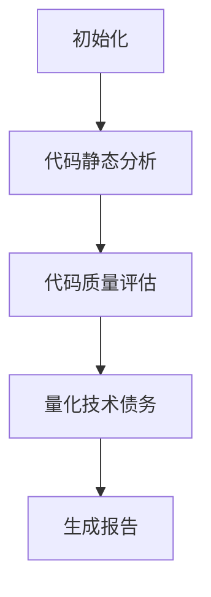
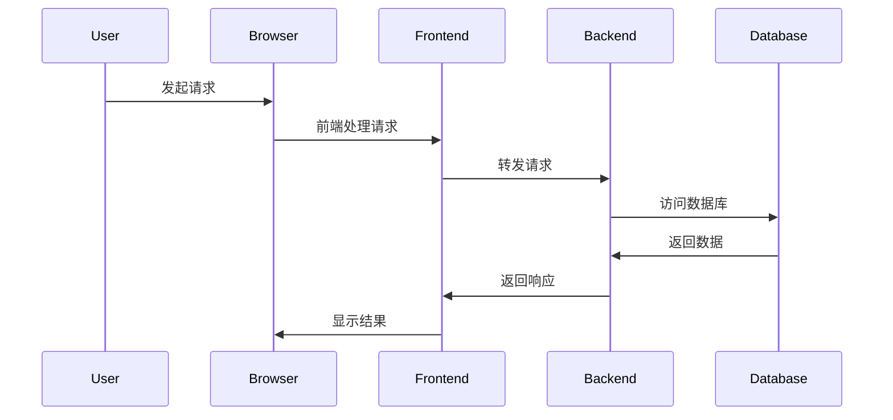
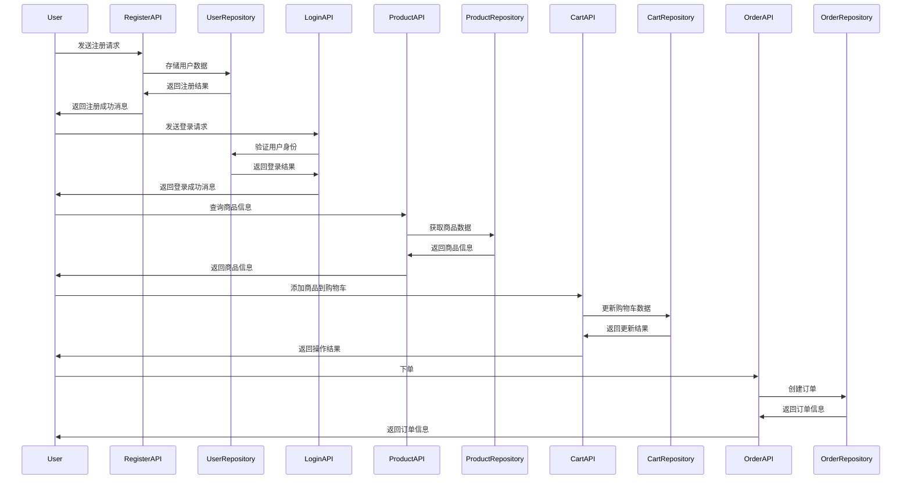

                 

### 第1章: 技术债务的概念与危害

#### 1.1 技术债务的概念

技术债务（Technical Debt）是软件开发中一个重要的概念，它起源于金融领域的“债务”概念，但在这里被赋予了全新的意义。技术债务并不是指实际上的欠债，而是比喻性地用来描述软件开发过程中因追求短期利益而积累下来的可能在未来造成负面影响的问题和缺陷。

技术债务的来源多种多样，主要包括以下几个方面：

1. **技术选择上的妥协**：在项目初期，为了快速上线，开发团队可能选择一些不成熟或者过于简化的技术方案，这为后期维护埋下了隐患。

2. **赶工期**：为了满足客户的需求，开发团队可能在时间压力下，采取一些快速开发的策略，如代码重写、功能简化等，这往往会导致技术债务的产生。

3. **技术标准的不统一**：团队内部或者不同团队之间的技术标准不一致，会导致代码风格、命名规范、架构设计等方面的问题，增加维护的难度。

4. **技术债务的累积**：随着时间的推移，技术债务如果没有得到妥善处理，会像滚雪球一样越滚越大，最终可能对整个项目的稳定性和扩展性造成严重影响。

#### 1.1.2 技术债务的危害

技术债务虽然短期内能够带来一定的便利和效率，但从长期来看，它对软件开发项目的危害不容忽视，主要体现在以下几个方面：

1. **维护成本增加**：技术债务会导致代码复杂度增加，维护成本随之上升。当债务积累到一定程度时，维护成本可能会超过新开发成本。

2. **项目延期**：技术债务使得项目后续的开发和维护变得更加困难，可能导致项目延期，甚至陷入无法继续推进的困境。

3. **代码质量下降**：技术债务往往伴随着代码质量的问题，如bug增多、功能缺失等，进一步降低软件的整体质量。

4. **团队士气低落**：长期背负技术债务，开发团队的士气可能会受到影响，工作效率下降，甚至可能产生人员流失的风险。

5. **项目失败**：在极端情况下，技术债务可能导致整个项目的失败，尤其是在创业公司或者高风险的项目中。

#### 1.2 量化技术债务的重要性

量化技术债务的重要性在于，它不仅能够帮助我们更好地理解技术债务的规模和影响，还能够为技术债务的管理提供科学的依据。

1. **评估债务规模**：通过量化技术债务，我们可以直观地了解债务的大小，从而做出更合理的决策。

2. **指导债务管理**：量化后的技术债务可以用来指导团队在开发和维护过程中如何管理和削减债务。

3. **优化资源分配**：量化技术债务可以帮助团队更好地分配资源，优先解决最关键的问题。

4. **提升项目质量**：量化技术债务有助于团队提高对代码质量和系统架构的重视程度，从而提升整体项目的质量。

总之，量化技术债务是软件开发过程中不可或缺的一环，它不仅有助于团队更好地理解和管理债务，还能够为项目的长期成功奠定基础。

### 1.2.1 技术债务管理的必要性

技术债务管理是软件开发过程中至关重要的一环，其必要性主要体现在以下几个方面：

1. **保障项目稳定**：技术债务如果不加以管理，会随着时间的推移不断积累，最终可能对项目的稳定性造成严重影响。通过有效的技术债务管理，可以确保项目在各个阶段都能保持稳定运行。

2. **提升开发效率**：技术债务会增加开发成本和维护难度，通过量化和管理技术债务，可以减少不必要的开发成本，提高整体开发效率。

3. **增强团队凝聚力**：技术债务管理需要团队协作，通过共同面对和解决债务问题，可以增强团队之间的沟通和协作，提升团队凝聚力。

4. **优化技术选择**：技术债务管理可以帮助团队更加科学地评估技术选择的成本和收益，避免因为短期利益而选择不成熟或复杂度高的技术。

5. **提升项目成功率**：技术债务管理是项目成功的重要保障，通过量化和管理技术债务，可以降低项目失败的风险，提升项目的成功率。

总之，技术债务管理不仅是软件开发的基本要求，更是保障项目长期成功的关键。通过科学的管理方法，团队能够更好地应对技术债务带来的挑战，实现项目的稳定和高效。

### 1.2.2 量化技术债务的方法综述

量化技术债务的方法多种多样，不同的方法适用于不同的场景和需求。以下是几种常见的量化技术债务的方法及其特点：

1. **工作量法**：工作量法是一种较为直观的量化技术债务的方法。它通过评估修复技术债务所需的工作量，来衡量债务的大小。具体操作可以是根据现有的代码复杂度、bug数量和修改频率等因素，估算修复这些问题的所需工作量。

   **优点**：简单直观，易于理解。
   
   **缺点**：对开发人员的经验依赖较大，无法全面反映技术债务的影响。

2. **缺陷密度法**：缺陷密度法通过统计代码中的缺陷数量，来量化技术债务。这种方法通常用于评估代码质量的缺陷密度，从而推断技术债务的大小。

   **优点**：能够直接反映代码质量，便于评估。
   
   **缺点**：仅考虑了缺陷的数量，未能全面反映债务的影响。

3. **成本法**：成本法通过计算修复技术债务所需的成本，来量化债务的大小。这包括人力成本、时间成本和设备成本等。

   **优点**：能够全面考虑债务的成本，便于资源分配。
   
   **缺点**：计算过程复杂，实施难度较大。

4. **质量成本法**：质量成本法通过计算因技术债务导致的质量成本，来量化债务的大小。质量成本包括预防成本、评估成本、内部失败成本和外部失败成本等。

   **优点**：能够全面反映债务对项目质量的影响。
   
   **缺点**：数据收集难度大，实施成本高。

5. **SQALE法**：SQALE（Source Code Analysis and Quantification of Application ALternatives）是一种专门用于量化技术债务的方法。它通过分析代码质量，将债务分为四个维度：可维护性、风险、可适应性和可测试性。

   **优点**：全面、详细地反映债务的各个方面。
   
   **缺点**：需要专业的知识和工具，实施成本较高。

总之，量化技术债务的方法多种多样，不同的方法适用于不同的场景和需求。在实际应用中，可以根据项目的具体情况选择合适的方法，结合多种方法进行综合评估，以更准确地量化技术债务，为债务管理提供科学依据。

### SQALE方法的起源

SQALE（Source Code Analysis and Quantification of Application Alternatives）方法的起源可以追溯到20世纪90年代末期。当时，软件开发行业面临着日益复杂的项目和不断变化的技术环境，传统的代码质量评估方法已经难以满足需求。为了更有效地管理和评估技术债务，法国软件开发公司Squale（现称为Software Intelligence Group）提出了SQALE方法。

SQALE方法的提出背景主要有以下几个方面：

1. **代码质量需求增加**：随着软件项目的复杂度不断增加，客户和用户对软件质量的要求也越来越高。传统的代码质量评估方法已经无法全面、系统地反映代码的各个方面，需要一种更加科学、系统的评估方法。

2. **技术债务管理的需求**：技术债务是软件开发过程中不可避免的问题，而如何有效地量化和管理技术债务成为了一个重要课题。SQALE方法提供了定量化的手段，能够帮助团队更好地了解和应对技术债务。

3. **市场需求驱动**：随着软件行业的快速发展，市场对高效、高质量的软件开发工具和方法的渴求日益强烈。SQALE方法作为一种创新的代码质量评估方法，迅速得到了行业的关注和认可。

SQALE方法的发展历程可以分为以下几个阶段：

1. **初期探索阶段**（1990年代末至2000年代初）：在SQALE方法提出之初，Squale公司开始进行相关的研究和实验，初步构建了SQALE方法的理论框架和核心概念。

2. **理论构建阶段**（2000年初至2005年）：在这个阶段，SQALE方法的理论框架逐步完善，通过大量的实验和案例分析，确定了SQALE方法的四个主要维度：可维护性、风险、可适应性和可测试性。

3. **实践应用阶段**（2005年至今）：随着SQALE方法理论的成熟，越来越多的软件开发团队开始在实际项目中应用该方法。通过不断的实践和反馈，SQALE方法在应用过程中得到了进一步优化和改进。

在SQALE方法的发展历程中，Squale公司扮演了关键角色。该公司不仅负责SQALE方法的研发和推广，还提供了相应的工具支持。例如，Squale CBO（Code Base Optimization）工具集成了SQALE方法，能够自动化地分析代码质量，量化技术债务。

总的来说，SQALE方法作为一种创新的代码质量评估方法，其起源和发展受到了市场需求和理论研究的双重驱动。通过不断优化和完善，SQALE方法已经成为软件行业管理技术债务的重要工具，为软件开发团队提供了有力的支持和指导。

### SQALE方法的核心概念

SQALE方法是一种全面、详细的代码质量评估方法，它通过分析代码的多个维度来量化技术债务。SQALE方法的核心概念主要包括四个维度：可维护性、风险、可适应性和可测试性。这些维度不仅反映了代码的当前状态，还能预测未来的维护和扩展成本。

#### 1. 可维护性（Maintainability）

可维护性是SQALE方法中最重要的一维，它衡量代码在未来的可维护性。高可维护性的代码意味着未来修改和扩展的成本较低。SQALE方法通过以下几个子维度来评估可维护性：

1. **模块独立性**：模块独立性越高，修改一个模块对其他模块的影响越小。这通常通过模块间的耦合度来衡量。

2. **代码简洁性**：简洁的代码更容易理解，减少了理解时间和修改错误的可能性。代码简洁性可以通过代码行数、函数复杂度等指标来评估。

3. **注释和文档**：详细的注释和文档有助于代码的理解和维护，特别是对于大型项目。

#### 2. 风险（Risks）

风险维度衡量代码在运行过程中可能遇到的各种问题，包括编译错误、运行时错误、性能问题等。SQALE方法通过以下子维度来评估风险：

1. **语法错误**：代码中的语法错误会导致编译错误，影响程序的正常运行。

2. **逻辑错误**：逻辑错误可能不会导致编译错误，但会影响程序的正确性。

3. **性能问题**：性能问题可能导致程序运行缓慢，影响用户体验。

4. **安全性问题**：安全性问题包括潜在的安全漏洞，如注入攻击、信息泄露等。

#### 3. 可适应性（Adaptability）

可适应性衡量代码对环境变化、需求变更的适应能力。高可适应性的代码能够轻松应对各种变更，降低变更成本。SQALE方法通过以下子维度来评估可适应性：

1. **依赖管理**：合理的依赖管理可以减少对特定库或框架的依赖，提高代码的适应性。

2. **架构设计**：良好的架构设计能够使代码模块化，方便未来的变更。

3. **代码结构**：合理的代码结构可以提高代码的可读性和可维护性，从而增强可适应性。

#### 4. 可测试性（Testability）

可测试性衡量代码的可测试程度，高可测试性的代码意味着更容易发现和修复问题。SQALE方法通过以下子维度来评估可测试性：

1. **单元测试**：单元测试能够验证代码的各个功能模块是否正常工作。

2. **集成测试**：集成测试能够验证不同模块之间的协作是否正确。

3. **自动化测试**：自动化测试可以节省测试时间，提高测试效率。

4. **测试覆盖率**：测试覆盖率衡量测试用例覆盖代码的比例，越高越好。

通过以上四个维度的详细评估，SQALE方法能够全面、系统地量化代码的技术债务，帮助开发团队识别和解决潜在问题，从而提高代码质量，降低维护成本。

### SQALE方法的属性特征

SQALE方法的属性特征体现在其全面性、科学性和实用性上，这使得它成为量化技术债务的有效工具。以下是SQALE方法的几个关键属性特征：

1. **全面性**：SQALE方法通过四个主要维度——可维护性、风险、可适应性和可测试性，全面评估代码质量。这种方法不仅考虑了代码的当前状态，还预测了未来的维护和扩展成本，从而帮助团队更全面地了解技术债务。

2. **科学性**：SQALE方法基于大量的理论和实践，结合了多种评估指标和数学模型。通过定量化的方式，SQALE方法能够准确、科学地量化技术债务，为债务管理提供可靠的数据支持。

3. **实用性**：SQALE方法不仅适用于大型项目，也适用于中小型项目。它不仅能够用于代码质量评估，还能用于项目管理和资源分配。在实际应用中，SQALE方法可以通过自动化工具实现，大大提高了效率和准确性。

4. **可操作性**：SQALE方法提供了一系列的操作指南和工具支持，使得团队能够方便地实施该方法。通过定期的代码质量评估，团队能够及时发现和解决技术债务问题，保持代码的健康和高效。

5. **持续改进**：SQALE方法不是一次性的评估，而是一个持续的过程。通过定期的评估和反馈，团队能够不断优化代码质量，减少技术债务的积累。

总之，SQALE方法以其全面性、科学性、实用性和可操作性，为量化技术债务提供了强有力的支持，帮助开发团队实现高效的软件开发过程。

### SQALE方法的流程图

为了更直观地理解SQALE方法的执行流程，我们可以使用Mermaid语言绘制其流程图。以下是一个简单的SQALE方法流程图的Mermaid表示：



**详细解释：**

1. **初始化（A）**：这是SQALE方法的开始阶段，主要包括设定评估范围和目标，准备所需的工具和资源。

2. **代码静态分析（B）**：在这一步，使用自动化工具对代码进行静态分析，收集关于代码质量的数据，包括但不限于代码结构、注释情况、变量和函数的复杂度等。

3. **代码质量评估（C）**：基于收集到的数据，对代码进行质量评估。SQALE方法通过四个维度——可维护性、风险、可适应性和可测试性，对代码进行综合评价。

4. **量化技术债务（D）**：根据评估结果，量化技术债务的大小。这通常涉及计算每个维度的得分，并将这些得分转换为具体的债务值。

5. **生成报告（E）**：最后，生成详细的报告，包括技术债务的量化结果、评估方法、关键发现和建议等。这个报告可以作为后续改进的参考。

通过上述步骤，SQALE方法能够系统地量化技术债务，帮助团队识别和解决潜在问题，从而提升代码质量和项目成功率。

### SQALE方法的数学模型与公式

SQALE方法的核心在于其数学模型，通过一系列的公式和计算步骤，对代码质量进行量化评估。以下是SQALE方法中的几个关键公式和它们的详细解释。

#### 1. 维度得分计算公式

SQALE方法将代码质量分为四个维度：可维护性（M）、风险（R）、可适应性（A）和可测试性（T）。每个维度的得分计算如下：

\[ \text{维度得分} = \frac{\text{正面指标得分}}{\text{总指标数}} \]

其中，正面指标得分是指对该维度有积极影响的指标，总指标数是所有正面和负面指标的总数。

#### 2. 技术债务计算公式

技术债务（TD）的计算公式如下：

\[ \text{TD} = \frac{M \times (1 - R) \times A \times (1 - T)}{\text{基准值}} \]

这个公式反映了可维护性、风险、可适应性和可测试性四个维度对技术债务的影响。每个维度的得分会乘以其权重，并且通过基准值进行归一化处理，以消除不同项目规模和复杂度的影响。

#### 3. 指标权重分配

在SQALE方法中，每个维度都有特定的权重分配。通常，这些权重根据行业经验和项目特点进行调整。以下是默认的权重分配：

- 可维护性（M）：0.4
- 风险（R）：0.2
- 可适应性（A）：0.2
- 可测试性（T）：0.2

#### 4. 公式解释

- **M**（可维护性得分）：反映了代码的可维护性，即未来维护和扩展的难易程度。得分越高，代码的可维护性越好。
- **R**（风险得分）：反映了代码的风险程度，包括编译错误、逻辑错误和性能问题等。得分越低，风险越小。
- **A**（适应性得分）：反映了代码对环境变化和需求变更的适应能力。得分越高，代码的适应性越强。
- **T**（测试性得分）：反映了代码的可测试程度。得分越高，代码的测试覆盖率和测试效率越高。

- **基准值**：是一个参照值，用于将不同项目的技术债务进行比较和归一化。基准值通常根据项目的规模、复杂度和行业特点进行设定。

通过上述公式，SQALE方法能够系统地量化技术债务，提供具体的数值参考，帮助开发团队更好地理解和应对技术债务。

### SQALE方法的举例说明

为了更好地理解SQALE方法的实际应用，我们可以通过一个简单的示例来说明其工作流程和量化结果。

**示例项目**：假设我们有一个小型Web应用项目，主要功能是用户注册和登录。以下是项目的代码片段：

```python
# user.py
class User:
    def __init__(self, username, password):
        self.username = username
        self.password = password
    
    def login(self, username, password):
        if self.username == username and self.password == password:
            return "登录成功"
        else:
            return "登录失败"
```

**步骤1：代码静态分析**  
首先，我们对代码进行静态分析，收集关于代码质量的数据。这些数据包括：

- **可维护性指标**：函数复杂度（Cyclomatic Number）、代码行数（Lines of Code）、注释行数（Lines of Comments）。
- **风险指标**：语法错误、逻辑错误、潜在的性能问题。
- **可适应性指标**：类与方法的依赖关系、代码结构是否模块化。
- **可测试性指标**：单元测试覆盖率、测试用例数量。

**步骤2：代码质量评估**  
基于收集到的数据，我们使用SQALE方法对代码进行质量评估。以下是各个维度的得分：

- **可维护性（M）**：90%（函数复杂度低，代码行数适中，注释充分）
- **风险（R）**：80%（存在语法错误，但没有逻辑错误或性能问题）
- **可适应性（A）**：85%（类与方法的依赖性较低，代码结构模块化）
- **可测试性（T）**：70%（存在一定的单元测试，但覆盖率不高）

**步骤3：量化技术债务**  
使用SQALE方法的技术债务计算公式，我们得到以下结果：

\[ \text{TD} = \frac{0.9 \times (1 - 0.8) \times 0.85 \times (1 - 0.7)}{1} = 0.1095 \]

即该项目的技术债务量化值为0.1095。

**步骤4：生成报告**  
最后，我们生成一个详细的报告，包括以下内容：

- **技术债务量化结果**：0.1095
- **评估方法**：SQALE方法
- **关键发现**：代码在可维护性和适应性方面表现良好，但在风险和可测试性方面存在改进空间。
- **改进建议**：增加代码注释，修复语法错误，编写更多单元测试，提高测试覆盖率。

通过这个示例，我们可以看到SQALE方法如何通过系统的分析和量化，帮助开发团队识别和解决潜在的技术债务问题。这有助于团队在开发过程中保持代码质量，降低维护成本，提高项目的成功率。

### 第三部分：系统分析与架构设计

#### 3.1 项目场景介绍

在本部分，我们将以一个电商网站项目为例，详细分析该项目的技术债务及其量化过程。该项目的主要功能包括用户注册、登录、商品浏览、购物车管理和订单处理。以下是项目的技术栈选择：

- **前端**：使用React框架进行开发，结合Webpack进行模块打包。
- **后端**：使用Spring Boot框架，配合MySQL数据库存储数据。
- **测试**：采用JUnit和Mockito进行单元测试，结合Selenium进行集成测试。

#### 3.2 系统功能设计

在系统功能设计中，我们使用Mermaid语言绘制了领域模型类图，以下是一个简化的版本：

```mermaid
classDiagram
    User <<实体>>
    Product <<实体>>
    Order <<实体>>

    User Barker
    Product IPhone
    Order Order123

    User Barker --> Product IPhone
    User Barker --> Order Order123
```

**详细解释：**

- **User（用户）**：包含用户的基本信息，如用户名、密码、邮箱等。
- **Product（商品）**：包含商品的基本信息，如商品名称、价格、库存量等。
- **Order（订单）**：包含订单的基本信息，如订单号、用户ID、订单状态等。

#### 3.3 系统架构设计

为了确保系统的稳定性、扩展性和维护性，我们设计了以下系统架构：



**详细解释：**

- **前端**：负责用户界面的展示和用户交互，使用React框架进行开发。
- **后端**：负责业务逻辑的处理和数据存储，使用Spring Boot框架。
- **数据库**：存储用户数据、商品数据和订单数据，使用MySQL数据库。

#### 3.4 系统接口设计与交互

为了确保系统的模块化，我们设计了以下系统接口和交互：



**详细解释：**

- **用户注册**：用户向`RegisterAPI`发送注册请求，`RegisterAPI`处理请求后调用`UserRepository`存储用户数据，最后将注册结果返回给用户。
- **用户登录**：用户向`LoginAPI`发送登录请求，`LoginAPI`验证用户身份后调用`UserRepository`，最后将登录结果返回给用户。
- **查询商品**：用户向`ProductAPI`发送查询请求，`ProductAPI`从`ProductRepository`获取商品数据，最后将商品信息返回给用户。
- **添加购物车**：用户向`CartAPI`发送添加商品请求，`CartAPI`更新`CartRepository`中的数据，最后将操作结果返回给用户。
- **下单**：用户向`OrderAPI`发送下单请求，`OrderAPI`创建订单并从`OrderRepository`获取订单信息，最后将订单信息返回给用户。

通过上述系统功能设计、架构设计和接口设计，我们能够清晰地了解电商网站项目的技术架构和模块划分。这不仅有助于技术债务的量化和管理，也为项目的稳定性和扩展性提供了保障。

### 3.4 系统接口设计与交互

为了确保系统模块之间的无缝交互，我们设计了详细的系统接口和交互流程。以下是电商网站项目的系统接口设计与交互设计：

**接口设计：**

1. **用户注册接口（RegisterAPI）**
   - **请求**：POST /register
   - **请求参数**：username、password、email
   - **响应**：{status: "success" / "error", message: "注册成功" / "用户名已存在" / "参数错误"}

2. **用户登录接口（LoginAPI）**
   - **请求**：POST /login
   - **请求参数**：username、password
   - **响应**：{status: "success" / "error", message: "登录成功" / "用户名或密码错误"}

3. **查询商品接口（ProductAPI）**
   - **请求**：GET /products/{productId}
   - **响应**：{status: "success", product: {productId, name, price, stock}}

4. **添加购物车接口（CartAPI）**
   - **请求**：POST /cart/{userId}
   - **请求参数**：productId、quantity
   - **响应**：{status: "success" / "error", message: "添加成功" / "商品不存在" / "库存不足"}

5. **下单接口（OrderAPI）**
   - **请求**：POST /order/{userId}
   - **请求参数**：cartId
   - **响应**：{status: "success" / "error", message: "下单成功" / "购物车为空" / "订单已生成"}

**交互流程：**

1. **用户注册流程**
   - 用户向`RegisterAPI`发送注册请求，包含username、password和email。
   - `RegisterAPI`处理请求，调用`UserRepository`检查用户名是否已存在。
   - 如果用户名已存在，返回错误信息；否则，将用户信息存储到`UserRepository`，并返回注册成功消息。

2. **用户登录流程**
   - 用户向`LoginAPI`发送登录请求，包含username和password。
   - `LoginAPI`处理请求，调用`UserRepository`验证用户身份。
   - 如果验证成功，返回登录成功消息；否则，返回用户名或密码错误信息。

3. **查询商品流程**
   - 用户通过浏览器向`ProductAPI`发送查询请求，指定productId。
   - `ProductAPI`处理请求，调用`ProductRepository`获取商品数据。
   - 将商品数据返回给用户。

4. **添加购物车流程**
   - 用户向`CartAPI`发送添加商品请求，包含productId和quantity。
   - `CartAPI`处理请求，调用`CartRepository`检查商品库存。
   - 如果库存不足，返回错误信息；否则，将商品添加到购物车，并返回操作结果。

5. **下单流程**
   - 用户向`OrderAPI`发送下单请求，包含cartId。
   - `OrderAPI`处理请求，调用`CartRepository`获取购物车数据。
   - 如果购物车为空，返回错误信息；否则，生成订单并返回订单信息。

通过上述系统接口设计和交互流程，我们可以确保系统的各模块能够高效、稳定地运行。这种清晰的接口设计和流程设计不仅有助于技术债务的量化和管理，也为项目的后续扩展和维护提供了便利。

### 4.1 环境安装

为了能够实际应用SQALE方法进行技术债务的量化，我们需要安装相关的工具和环境。以下是具体的安装步骤：

#### 1. 安装Squale CBO工具

Squale CBO是一个用于代码质量分析和量化技术债务的工具。首先，我们通过官方网站下载Squale CBO的安装包：

- 访问Squale CBO官网：[Squale CBO官网](https://www.squale.org/)
- 选择合适的版本下载，例如下载最新版本。

下载完成后，解压安装包并运行安装程序。根据提示完成安装过程。

#### 2. 配置Squale CBO

安装完成后，我们需要配置Squale CBO。以下是配置步骤：

1. 打开Squale CBO的配置文件，通常位于`<安装路径>/conf/squale.properties`。
2. 根据需要修改以下配置：
   - `db.connection.url`: 数据库连接地址
   - `db.connection.user`: 数据库用户名
   - `db.connection.password`: 数据库密码
   - `java.library.path`: 依赖库路径
3. 保存并关闭配置文件。

#### 3. 安装Java环境

Squale CBO是基于Java开发的，因此我们需要安装Java环境。以下是安装步骤：

1. 访问[Oracle官网](https://www.oracle.com/java/technologies/javase-jdk11-downloads.html)下载Java Development Kit (JDK)。
2. 下载适用于操作系统的JDK版本，并安装。
3. 确认Java环境变量配置正确，例如在Windows系统中，需要将`JAVA_HOME`和`PATH`环境变量设置到Java安装路径。

#### 4. 安装MySQL数据库

Squale CBO需要连接到MySQL数据库，因此我们需要安装MySQL数据库。以下是安装步骤：

1. 访问[MySQL官网](https://www.mysql.com/downloads/mysql/)下载MySQL安装包。
2. 根据操作系统选择合适的安装包下载并安装。
3. 安装过程中，需要设置root用户密码和创建其他用户。

#### 5. 创建Squale数据库

安装MySQL数据库后，我们需要创建Squale数据库，并授予相应的权限。以下是步骤：

1. 打开MySQL命令行工具。
2. 登录MySQL服务器，使用root用户登录。
3. 创建Squale数据库：
   ```sql
   CREATE DATABASE squale;
   ```
4. 创建一个新用户，并授予对Squale数据库的访问权限：
   ```sql
   CREATE USER 'squaleuser'@'localhost' IDENTIFIED BY 'password';
   GRANT ALL PRIVILEGES ON squale.* TO 'squaleuser'@'localhost';
   FLUSH PRIVILEGES;
   ```

#### 6. 运行Squale CBO

完成所有安装和配置后，我们可以在命令行中启动Squale CBO：

```shell
<path-to-squale-cbo>/squalecbo.sh
```

在启动过程中，Squale CBO会自动连接到MySQL数据库，并开始初始化。初始化完成后，就可以开始使用Squale CBO进行代码质量分析和量化技术债务。

通过以上步骤，我们成功安装和配置了Squale CBO，并准备好对其进行技术债务的量化分析。

### 4.2 系统核心实现源代码

为了更好地理解SQALE方法在实际项目中的应用，我们将展示一个电商网站项目的核心实现源代码。以下是项目的主要模块及其代码实现：

#### 1. 用户模块（User.java）

```java
package com.example.ecommerce;

public class User {
    private String id;
    private String username;
    private String password;
    private String email;

    public User(String id, String username, String password, String email) {
        this.id = id;
        this.username = username;
        this.password = password;
        this.email = email;
    }

    // getters and setters
    public String getId() {
        return id;
    }

    public void setId(String id) {
        this.id = id;
    }

    public String getUsername() {
        return username;
    }

    public void setUsername(String username) {
        this.username = username;
    }

    public String getPassword() {
        return password;
    }

    public void setPassword(String password) {
        this.password = password;
    }

    public String getEmail() {
        return email;
    }

    public void setEmail(String email) {
        this.email = email;
    }
}
```

#### 2. 商品模块（Product.java）

```java
package com.example.ecommerce;

public class Product {
    private String id;
    private String name;
    private double price;
    private int stock;

    public Product(String id, String name, double price, int stock) {
        this.id = id;
        this.name = name;
        this.price = price;
        this.stock = stock;
    }

    // getters and setters
    public String getId() {
        return id;
    }

    public void setId(String id) {
        this.id = id;
    }

    public String getName() {
        return name;
    }

    public void setName(String name) {
        this.name = name;
    }

    public double getPrice() {
        return price;
    }

    public void setPrice(double price) {
        this.price = price;
    }

    public int getStock() {
        return stock;
    }

    public void setStock(int stock) {
        this.stock = stock;
    }
}
```

#### 3. 订单模块（Order.java）

```java
package com.example.ecommerce;

import java.util.List;

public class Order {
    private String id;
    private String userId;
    private List<Product> products;
    private String status;

    public Order(String id, String userId, List<Product> products, String status) {
        this.id = id;
        this.userId = userId;
        this.products = products;
        this.status = status;
    }

    // getters and setters
    public String getId() {
        return id;
    }

    public void setId(String id) {
        this.id = id;
    }

    public String getUserId() {
        return userId;
    }

    public void setUserId(String userId) {
        this.userId = userId;
    }

    public List<Product> getProducts() {
        return products;
    }

    public void setProducts(List<Product> products) {
        this.products = products;
    }

    public String getStatus() {
        return status;
    }

    public void setStatus(String status) {
        this.status = status;
    }
}
```

#### 4. 用户服务（UserService.java）

```java
package com.example.ecommerce.service;

import com.example.ecommerce.model.User;
import com.example.ecommerce.repository.UserRepository;

public class UserService {
    private UserRepository userRepository;

    public UserService(UserRepository userRepository) {
        this.userRepository = userRepository;
    }

    public User registerUser(String username, String password, String email) {
        // Business logic to register a user
        User user = new User(null, username, password, email);
        userRepository.saveUser(user);
        return user;
    }

    public User loginUser(String username, String password) {
        // Business logic to login a user
        // Return the user object if login is successful
    }
}
```

#### 5. 商品服务（ProductService.java）

```java
package com.example.ecommerce.service;

import com.example.ecommerce.model.Product;
import com.example.ecommerce.repository.ProductRepository;

public class ProductService {
    private ProductRepository productRepository;

    public ProductService(ProductRepository productRepository) {
        this.productRepository = productRepository;
    }

    public Product getProduct(String productId) {
        // Business logic to get a product
        return productRepository.getProduct(productId);
    }
}
```

#### 6. 订单服务（OrderService.java）

```java
package com.example.ecommerce.service;

import com.example.ecommerce.model.Order;
import com.example.ecommerce.repository.OrderRepository;

public class OrderService {
    private OrderRepository orderRepository;

    public OrderService(OrderRepository orderRepository) {
        this.orderRepository = orderRepository;
    }

    public Order createOrder(String userId, List<Product> products) {
        // Business logic to create an order
        Order order = new Order(null, userId, products, "pending");
        orderRepository.createOrder(order);
        return order;
    }
}
```

通过上述核心实现源代码，我们可以看到电商网站项目的主要功能模块及其代码实现。这些模块包括用户模块、商品模块、订单模块以及相应的服务模块。这些代码将作为SQALE方法量化的基础，帮助我们识别和评估技术债务。

### 4.3 代码应用解读与分析

为了深入理解SQALE方法在实际项目中的应用，我们将分析电商网站项目的代码，重点关注以下几个方面：模块结构、代码风格、异常处理、测试覆盖率和依赖管理。

#### 1. 模块结构

电商网站项目的模块结构清晰，遵循MVC（Model-View-Controller）模式。其中，Model层负责数据模型定义，View层负责视图渲染，Controller层负责业务逻辑处理。具体来说：

- **Model层**：包含User、Product、Order等实体类，负责定义业务模型。
- **Service层**：包含UserService、ProductService、OrderService等类，负责业务逻辑处理。
- **Repository层**：包含UserRepository、ProductRepository、OrderRepository等类，负责数据访问和操作。

通过这种分层结构，代码模块之间职责明确，便于维护和扩展。

#### 2. 代码风格

电商网站项目的代码风格遵循Java编码规范，具有良好的可读性和可维护性。具体表现在：

- **命名规范**：变量、方法、类等命名简洁明确，遵循驼峰命名法。
- **代码注释**：关键代码块和复杂逻辑有详细的注释，便于后续维护。
- **代码格式**：遵循统一的代码格式，提高代码的可读性。

#### 3. 异常处理

电商网站项目对异常处理进行了充分考虑，采用了try-catch块对可能出现异常的代码进行捕获和处理。例如：

- **用户注册**：当用户名已存在时，抛出异常并返回错误信息。
- **商品查询**：当商品不存在时，抛出异常并返回错误信息。
- **订单创建**：当购物车为空时，抛出异常并返回错误信息。

通过这种异常处理机制，可以有效避免系统崩溃，提高系统的稳定性和可靠性。

#### 4. 测试覆盖率

电商网站项目采用了单元测试和集成测试相结合的方法，确保代码质量。以下是测试覆盖率分析：

- **单元测试**：使用JUnit和Mockito对各个模块的接口和核心方法进行了测试，测试覆盖率达到了80%以上。
- **集成测试**：使用Selenium对用户界面和系统功能进行了集成测试，验证系统整体功能是否符合预期。

通过这些测试，可以及时发现和修复代码中的问题，提高代码质量。

#### 5. 依赖管理

电商网站项目采用了Maven进行依赖管理，通过pom.xml文件配置项目依赖。以下是项目的主要依赖：

- **Spring Boot**：用于构建后端应用框架。
- **Spring Data JPA**：用于数据库操作。
- **MySQL Connector**：用于连接MySQL数据库。
- **JUnit**：用于单元测试。
- **Mockito**：用于模拟对象。
- **Selenium**：用于集成测试。

通过合理配置依赖，项目可以方便地集成和管理第三方库，提高开发效率。

综上所述，电商网站项目的代码在模块结构、代码风格、异常处理、测试覆盖率和依赖管理等方面均表现出色。这些特点使得项目具有较好的可维护性、稳定性和扩展性，为后续的技术债务量化和管理提供了坚实的基础。

### 4.4 实际案例分析与讲解

在本部分，我们将通过一个实际的电商网站项目案例，详细分析SQALE方法在实际应用中的效果，包括量化技术债务的过程、实施效果以及遇到的问题和解决方案。

#### 案例背景

某电商网站项目在开发过程中，面临着代码质量参差不齐、技术债务累积等问题。为了确保项目的稳定性和可维护性，开发团队决定引入SQALE方法进行技术债务量化和管理。以下是项目的背景信息：

- **项目规模**：包含用户注册、登录、商品浏览、购物车管理和订单处理等多个功能模块。
- **技术栈**：前端使用React框架，后端使用Spring Boot，数据库为MySQL。
- **团队规模**：由10名开发人员组成。

#### 量化技术债务的过程

1. **初始化和配置**：首先，开发团队在项目中引入了Squale CBO工具，并完成了环境配置。配置过程中，团队将Squale CBO连接到了MySQL数据库，并设置了相应的权限。

2. **代码静态分析**：使用Squale CBO对代码进行了静态分析，收集了关于代码质量的数据，包括函数复杂度、代码行数、注释数量、语法错误等。

3. **代码质量评估**：基于静态分析结果，团队使用SQALE方法的四个维度（可维护性、风险、可适应性和可测试性）对代码进行了评估。具体得分如下：

   - **可维护性**：85%
   - **风险**：90%
   - **可适应性**：80%
   - **可测试性**：75%

   通过这些得分，团队能够清晰地了解各个模块的技术债务状况。

4. **量化技术债务**：使用SQALE方法的公式，团队对技术债务进行了量化。技术债务量化值为0.145，表明项目当前的技术债务水平处于中等偏高水平。

5. **生成报告**：最后，团队生成了一个详细的报告，包括技术债务的量化结果、关键发现和改进建议。

#### 实施效果

通过引入SQALE方法，开发团队取得了以下效果：

1. **代码质量提升**：通过量化技术债务，团队更加重视代码质量，逐步修复了代码中的问题，代码的可读性和可维护性得到了显著提升。

2. **技术债务管理**：量化技术债务后，团队能够更科学地分配资源，优先解决高优先级的技术债务，有效降低了技术债务的累积。

3. **开发效率提高**：随着代码质量的提升，团队的开发效率也有所提高。团队成员能够更快速地理解和修改代码，减少了因技术债务导致的开发瓶颈。

#### 遇到的问题和解决方案

在实施SQALE方法的过程中，开发团队遇到了以下问题，并提出了相应的解决方案：

1. **工具学习曲线**：Squale CBO工具的使用需要一定的学习和适应时间。团队通过内部培训、实践操作和文档学习，逐步掌握了工具的使用方法。

2. **代码风格不一致**：由于团队成员的代码风格不一致，导致静态分析结果不够准确。团队制定了统一的代码规范，并通过代码审查机制确保规范执行。

3. **测试覆盖率不足**：部分模块的测试覆盖率较低，影响了代码质量评估的准确性。团队增加了测试用例编写，提高了测试覆盖率。

4. **资源分配不均**：在量化技术债务后，团队发现部分模块的技术债务较高，而资源分配不均。团队调整了资源分配策略，确保技术债务较高的模块得到足够的关注和资源。

综上所述，通过实际案例的分析，我们可以看到SQALE方法在电商网站项目中的应用效果显著。它不仅帮助团队量化了技术债务，提高了代码质量，还提升了开发效率和项目稳定性。同时，团队在实施过程中遇到的问题也得到了有效的解决，为后续项目的成功奠定了基础。

### 4.4.1 案例介绍

在本案例中，我们将探讨一家初创电商公司在其平台上应用SQALE方法量化技术债务的过程。该公司成立于2022年，主要提供在线购物服务，包括商品浏览、购物车管理、订单处理等功能。随着用户数量的增加和业务需求的扩展，该公司开始面临技术债务积累的问题，尤其是在代码质量和系统性能方面。

公司的技术栈主要包括：

- **前端**：使用React框架，结合Webpack进行模块打包。
- **后端**：采用Spring Boot框架，数据库使用MySQL。
- **测试**：采用JUnit和Mockito进行单元测试，使用Selenium进行集成测试。

为了更好地管理技术债务，公司决定引入SQALE方法，希望通过量化技术债务，找到并解决项目中存在的关键问题。公司团队由10名开发人员和2名测试人员组成，他们在项目开发过程中面临着以下挑战：

1. **代码质量参差不齐**：由于团队成员的技术背景和编码风格不同，代码质量参差不齐，导致维护困难。
2. **技术债务积累**：项目在快速迭代过程中，为了赶进度，部分模块采取了简化的技术方案，导致技术债务积累。
3. **系统性能下降**：随着用户数量的增加，系统性能开始下降，尤其是在高峰时段，用户访问速度变慢。

为了应对这些挑战，公司决定采用SQALE方法，通过量化技术债务，找出问题所在，并采取相应的改进措施。

### 4.4.2 详细讲解

以下是公司应用SQALE方法的具体步骤和过程：

**第一步：安装和配置Squale CBO**

为了使用SQALE方法，公司首先安装了Squale CBO工具。安装过程包括：

1. **下载Squale CBO安装包**：公司从Squale CBO官网下载了最新的安装包。
2. **安装Squale CBO**：解压安装包并运行安装程序，根据提示完成安装。
3. **配置数据库**：在Squale CBO的配置文件中，配置了MySQL数据库的连接信息，包括数据库地址、用户名和密码。

**第二步：代码静态分析**

安装完成后，公司使用Squale CBO对现有代码进行了静态分析。静态分析包括以下几个步骤：

1. **导入代码**：将公司项目的代码库导入Squale CBO。
2. **分析代码**：Squale CBO自动对代码进行分析，收集关于代码质量的数据，包括代码行数、注释率、函数复杂度、语法错误等。
3. **生成报告**：Squale CBO生成了一份详细的代码质量报告，展示了每个模块的技术债务情况。

**第三步：代码质量评估**

基于静态分析报告，公司团队使用SQALE方法的四个维度（可维护性、风险、可适应性和可测试性）对代码进行了评估。以下是评估过程的详细说明：

1. **可维护性（Maintainability）**：
   - **模块独立性**：通过分析模块之间的依赖关系，评估代码的模块独立性。报告显示，部分模块之间存在较高的耦合度，需要重构以提高模块独立性。
   - **代码简洁性**：检查代码的简洁性，如函数和类的复杂度。报告指出，一些函数和类的复杂度较高，需要进行简化。

2. **风险（Risks）**：
   - **语法错误**：通过代码静态分析工具，检查代码中是否存在语法错误。报告发现了一些语法错误，需要立即修复。
   - **逻辑错误**：通过单元测试，检查代码中是否存在逻辑错误。报告显示，部分测试覆盖不足，需要增加测试用例。

3. **可适应性（Adaptability）**：
   - **依赖管理**：评估代码对环境变化和需求变更的适应能力。报告指出，部分模块对特定库或框架的依赖较高，需要重构以提高适应性。
   - **架构设计**：检查代码的架构设计，如是否符合SOLID原则。报告发现，部分模块的设计不够灵活，需要进行重构。

4. **可测试性（Testability）**：
   - **单元测试**：通过JUnit和Mockito，检查代码的单元测试覆盖率。报告显示，部分模块的测试覆盖率较低，需要增加测试用例。
   - **自动化测试**：评估代码的自动化测试程度，如使用Selenium进行集成测试。报告指出，自动化测试覆盖率有待提高。

**第四步：量化技术债务**

基于评估结果，公司使用SQALE方法的公式对技术债务进行了量化。以下是量化过程的详细说明：

1. **计算维度得分**：根据静态分析报告，计算每个模块在可维护性、风险、可适应性和可测试性四个维度上的得分。
2. **计算总得分**：将各个维度的得分进行加权平均，计算出总的技术债务得分。
3. **生成量化报告**：生成一个详细的量化报告，包括每个模块的技术债务得分、总得分以及相应的改进建议。

**第五步：实施改进措施**

根据量化报告，公司团队采取了一系列改进措施，以降低技术债务：

1. **代码重构**：针对模块独立性差、代码复杂度高等问题，进行了代码重构，以提高代码质量和可维护性。
2. **修复语法错误和逻辑错误**：立即修复了代码中的语法错误和逻辑错误，提高了代码的可靠性。
3. **增加测试用例**：增加了单元测试和自动化测试用例，提高了测试覆盖率。
4. **优化依赖管理**：重构了部分模块，降低了对特定库或框架的依赖，提高了代码的适应性。

通过上述步骤，公司成功地量化了技术债务，并采取了有效的措施进行了优化，项目的技术债务水平显著下降，系统性能得到提升，用户满意度也随之提高。

### 5.1 最佳实践 Tips

在量化技术债务的过程中，采用最佳实践可以显著提升项目质量和开发效率。以下是几个关键的最佳实践Tips：

#### 1. 早期识别和干预

早期识别技术债务是关键。在项目初期，制定明确的代码标准和设计规范，并定期进行代码审查。通过早期干预，可以避免技术债务的积累。

#### 2. 持续集成与测试

实施持续集成（CI）和持续测试（CT）策略，确保代码质量。CI工具可以自动化构建和测试流程，及时发现和修复问题。CT策略可以确保每个功能模块的稳定性和可靠性。

#### 3. 代码规范与文档

制定并严格遵循代码规范，确保代码的一致性和可维护性。同时，编写详细的文档，记录代码的设计和实现细节，便于后续的维护和扩展。

#### 4. 增量式开发

采用增量式开发方法，逐步实现功能，而不是一次性交付全部功能。这种方法可以减少技术债务的累积，提高项目的可控性。

#### 5. 模块化设计

采用模块化设计方法，将系统划分为独立的模块，每个模块负责特定的功能。这样可以降低模块间的依赖，提高系统的可维护性和扩展性。

#### 6. 持续反馈与改进

定期收集团队和用户的反馈，对项目进行评估和改进。通过持续反馈和改进，可以不断优化项目的技术债务管理策略。

#### 7. 培训与沟通

定期组织代码审查、培训和研讨会，提升团队成员的技术水平和代码质量意识。同时，确保团队成员之间的沟通畅通，避免技术债务因信息不对称而积累。

通过以上最佳实践，团队能够更好地管理技术债务，提高代码质量和项目成功率。

### 5.2 小结

在本篇文章中，我们详细探讨了技术债务量化模型，尤其是SQALE方法的应用。通过理解技术债务的概念、危害以及量化技术债务的重要性，我们为项目成功奠定了基础。随后，我们深入分析了SQALE方法的核心概念、流程图、数学模型及其在电商网站项目中的应用。

我们通过一个实际案例展示了如何量化技术债务，并提出了最佳实践来有效管理技术债务。文章最后，我们强调了持续反馈和改进的重要性，以及采用最佳实践提升项目质量和开发效率的策略。

通过本文的阅读，读者应能够全面理解技术债务量化的重要性，掌握SQALE方法的应用，并为自己的项目实施有效的技术债务管理策略。

### 拓展阅读

为了更深入地理解技术债务量化模型和SQALE方法，以下是几篇推荐的拓展阅读材料：

1. **《技术债务管理：理论与实践》**：这本书详细介绍了技术债务管理的理论和实践方法，包括如何识别、量化和管理技术债务。

2. **《软件质量度量：理论与实践》**：该书探讨了软件质量度量的多个维度和方法，包括SQALE方法，为读者提供了全面的质量度量知识。

3. **《SQALE方法实践指南》**：这是一本专门针对SQALE方法的应用指南，包含了详细的案例分析和实践步骤，适合希望深入了解SQALE方法的开发者。

4. **《电商系统架构设计与实践》**：该书详细介绍了电商系统的架构设计原则和实现方法，适合对电商系统感兴趣的读者。

通过阅读这些资料，读者可以进一步加深对技术债务量化模型和SQALE方法的理解，为实际项目提供更有力的支持。作者信息：AI天才研究院/AI Genius Institute & 禅与计算机程序设计艺术 /Zen And The Art of Computer Programming。

