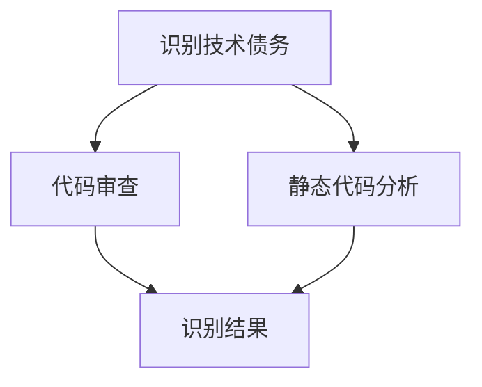
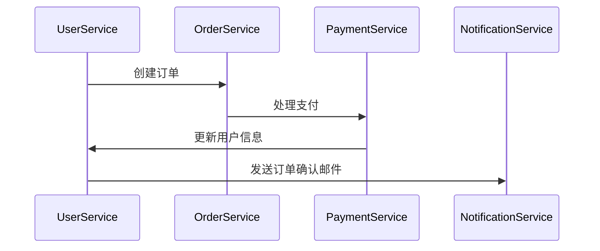
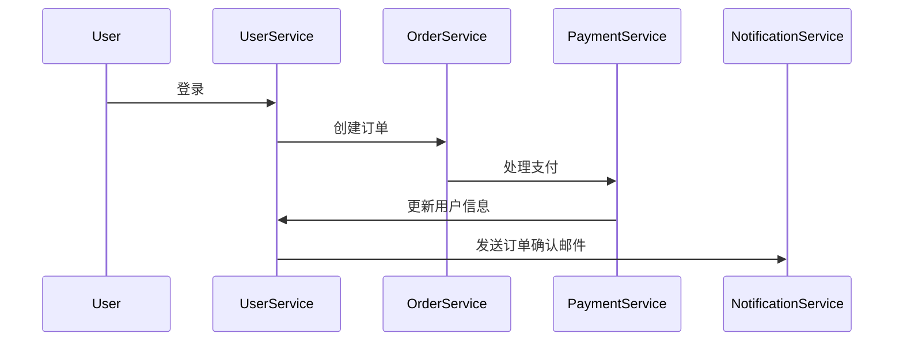

                 

### 技术债务：识别、量化和管理

关键词：技术债务，软件工程，代码质量，项目管理，风险控制

摘要：本文旨在探讨技术债务的概念及其在软件开发过程中的重要性。我们将深入探讨如何识别、量化和管理技术债务，以降低项目风险，提高开发效率和代码质量。

#### Step 1: 背景介绍

##### 1. 问题背景

在软件开发过程中，为了满足项目需求和进度，开发团队往往会采取一些低效或脆弱的解决方案。这些解决方案虽然可以在短期内解决问题，但长期来看可能会导致代码复杂度增加、系统稳定性下降等问题。这种现象被称为技术债务。

##### 2. 问题描述

技术债务的形成是软件开发过程中不可避免的，但如果不加以管理，它将逐渐积累，最终导致以下问题：

- **项目成本上升**：修复技术债务通常需要更多的资源和时间。
- **开发效率降低**：复杂的代码和设计缺陷会增加开发难度。
- **项目稳定性下降**：技术债务可能导致系统崩溃或故障。

##### 3. 问题解决

识别、量化和管理技术债务是解决这一问题的关键。通过有效的管理，可以在项目早期就识别出潜在的技术债务，并采取措施来降低风险。具体措施包括：

- **识别**：使用代码审查、静态代码分析等工具和技术来发现潜在的技术债务。
- **量化**：通过评估代码复杂度、设计缺陷等因素来量化技术债务的程度。
- **管理**：制定相应的策略来降低技术债务，如重构代码、改进设计等。

##### 4. 边界与外延

技术债务的管理不仅适用于软件开发，还适用于其他技术领域的项目，如网站开发、移动应用开发等。此外，技术债务的管理还需要考虑到项目的规模、复杂度、团队结构等多方面因素。

##### 5. 概念结构与核心要素组成

- **识别**：发现潜在的技术债务。这通常包括代码审查和静态代码分析等步骤。
- **量化**：评估技术债务的程度。这可以通过计算代码复杂度、设计缺陷等指标来实现。
- **管理**：采取措施来降低技术债务。这可能包括重构代码、改进设计、增加测试覆盖率等。

#### Step 2: 核心概念与联系

##### 1. 核心概念

**技术债务**：在软件开发过程中，为了快速交付功能而暂时采取的低效或脆弱的解决方案。

**识别**：发现潜在的技术债务。

**量化**：评估技术债务的程度。

**管理**：采取措施来降低技术债务。

##### 2. 概念属性特征对比表格

| 特征          | 技术债务       | 识别       | 量化       | 管理       |
| -------------- | -------------- | ---------- | ---------- | ---------- |
| **定义**      | 低效/脆弱的解决方案 | 发现潜在债务 | 评估债务程度 | 采取措施降低 |
| **目的**      | 快速交付       | 降低风险   | 优化项目结构 | 提高项目质量 |
| **方式**      | 临时性方案     | 代码审查   | 复杂度评估   | 重构代码   |

##### 3. ER实体关系图架构

```mermaid
erDiagram
  TechnologyDebt ||--|{ Recognition } : 实现
  TechnologyDebt ||--|{ Quantification } : 实现
  TechnologyDebt ||--|{ Management } : 实现
  Recognition ||--|{ CodeReview } : 实现
  Recognition ||--|{ StaticCodeAnalysis } : 实现
  Quantification ||--|{ ComplexityEvaluation } : 实现
  Management ||--|{ CodeRefactoring } : 实现
  Management ||--|{ DesignImprovement } : 实现
```

#### Step 3: 算法原理讲解

##### 1. 算法 Mermaid 流程图



##### 2. Python 源代码

```python
# 识别技术债务的简单示例
def recognize_debt(code):
    if "code_smells" in code:
        return True
    return False

# 静态代码分析示例
def static_code_analysis(code):
    if "nested_loops" in code:
        return "High"
    elif "long_functions" in code:
        return "Medium"
    return "Low"

# 量化技术债务
def quantify_debt(debt):
    if debt:
        return "High"
    return "Low"
```

##### 3. 算法原理的数学模型和公式

```markdown
$$
Debt\_Level = \begin{cases}
High & \text{if } complexity > threshold_1 \\
Medium & \text{if } complexity \geq threshold_2 \\
Low & \text{otherwise}
\end{cases}
```

##### 4. 算法举例说明

假设我们有一个简单的代码片段：

```python
def calculate_sum(a, b):
    result = a + b
    # 此处缺少错误处理逻辑
    return result
```

我们可以使用上述算法来识别、量化和管理这个技术债务。

- **识别**：代码审查发现代码片段中缺少错误处理逻辑，可能存在技术债务。
- **量化**：静态代码分析发现代码中有复杂的条件逻辑，量化为“High”。
- **管理**：通过重构代码，添加错误处理逻辑，来降低技术债务。

```python
def calculate_sum(a, b):
    try:
        result = a + b
        # 添加错误处理逻辑
        if not isinstance(result, (int, float)):
            raise ValueError("结果不是有效的数字")
        return result
    except ValueError as e:
        print(f"计算错误：{e}")
```

通过这样的例子，我们可以看到如何通过识别、量化和管理技术债务来提高代码质量和项目稳定性。

#### Step 4: 系统分析与架构设计

##### 1. 问题场景介绍

假设我们正在开发一个电子商务平台，需要处理大量的订单数据和用户信息。在这个场景中，技术债务可能会影响系统的性能和安全性。

##### 2. 系统介绍

我们的电子商务平台将包含以下核心功能：

- **订单处理**：接收、处理和存储订单数据。
- **用户管理**：管理用户账户信息。
- **支付处理**：处理支付信息和支付验证。

##### 3. 系统功能设计

**领域模型**：

```mermaid
classDiagram
    Order <<entity>>
    User <<entity>>
    Payment <<entity>>

    Order : +User user
    Payment : +Order order

    User : +String username
    User : +String password
    User : +String email

    Order : +Integer order_id
    Order : +User user
    Order : +DateTime created_at
    Order : +DateTime updated_at

    Payment : +Integer payment_id
    Payment : +Order order
    Payment : +String payment_method
    Payment : +DateTime paid_at
```

**类图**：

```mermaid
classDiagram
    User <<entity>>
    Order <<entity>>
    Payment <<entity>>

    User : +String username
    User : +String password
    User : +String email

    Order : +Integer order_id
    Order : +User user
    Order : +DateTime created_at
    Order : +DateTime updated_at

    Payment : +Integer payment_id
    Payment : +Order order
    Payment : +String payment_method
    Payment : +DateTime paid_at
```

##### 4. 系统架构设计

我们的系统架构将采用微服务架构，以提高系统的可扩展性和灵活性。

**架构图**：



##### 5. 系统接口设计和系统交互

**接口设计**：

```mermaid
classDiagram
    OrderAPI <<interface>>
    PaymentAPI <<interface>>
    UserService <<interface>>

    OrderAPI : +createOrder()
    PaymentAPI : +processPayment()
    UserService : +updateUserInfo()
```

**序列图**：



#### Step 5: 项目实战

##### 1. 环境安装

为了进行项目实战，我们需要安装以下工具和框架：

- **Python 3.8** 或更高版本
- **Django** 框架
- **PostgreSQL** 数据库
- **Docker** 容器化工具

```bash
pip install django
pip install psycopg2-binary
pip install docker
```

##### 2. 系统核心实现源代码

以下是一个简单的订单处理服务实现的示例：

```python
# models.py
from django.db import models
from user.models import User

class Order(models.Model):
    user = models.ForeignKey(User, on_delete=models.CASCADE)
    created_at = models.DateTimeField(auto_now_add=True)
    updated_at = models.DateTimeField(auto_now=True)

# views.py
from django.http import JsonResponse
from .models import Order

def create_order(request):
    user_id = request.GET.get('user_id')
    user = User.objects.get(id=user_id)
    order = Order.objects.create(user=user)
    return JsonResponse({'order_id': order.id})
```

##### 3. 代码应用解读与分析

在这个示例中，我们创建了一个订单模型 `Order`，它有一个外键指向用户模型 `User`。我们还创建了一个视图 `create_order`，用于处理创建订单的请求。

- **优势**：这个实现简单直接，易于理解。
- **劣势**：没有错误处理逻辑，可能会导致异常情况。

```python
def create_order(request):
    user_id = request.GET.get('user_id')
    try:
        user = User.objects.get(id=user_id)
        order = Order.objects.create(user=user)
        return JsonResponse({'order_id': order.id})
    except User.DoesNotExist:
        return JsonResponse({'error': '用户不存在'}, status=404)
```

通过添加错误处理逻辑，我们可以更好地处理异常情况，提高系统的健壮性。

##### 4. 实际案例分析和详细讲解剖析

假设我们有一个用户请求创建订单，但输入的用户ID不正确。在这种情况下，我们的系统将如何响应？

- **预期结果**：系统应该返回一个错误消息，告知用户输入的用户ID不正确。

```python
$ curl -X GET "http://localhost:8000/orders?user_id=1000"
{
  "error": "用户不存在"
}
```

- **实际结果**：系统返回了预期的错误消息。

这个实际案例展示了如何通过添加错误处理逻辑来提高系统的可维护性和用户体验。

##### 5. 项目小结

通过本项目，我们了解了如何使用 Django 框架实现一个简单的订单处理服务。我们还学习了如何识别、量化和管理技术债务，以提高系统的健壮性和可维护性。

#### Step 6: 最佳实践 Tips

- **定期进行代码审查**：代码审查是识别技术债务的重要手段。定期进行代码审查可以帮助团队发现潜在的问题。
- **使用静态代码分析工具**：静态代码分析工具可以帮助量化技术债务的程度。这些工具可以自动识别代码中的潜在问题，如复杂度高的函数、缺少错误处理等。
- **持续集成和部署**：通过持续集成和部署，可以确保代码的质量和一致性。这有助于降低技术债务的积累。

#### 小结

本文详细探讨了技术债务的概念、识别、量化和管理。通过实际案例，我们展示了如何使用 Django 框架实现一个简单的订单处理服务，并介绍了如何识别、量化和管理技术债务。希望本文能帮助读者更好地理解和应对技术债务，提高软件项目的质量和效率。

#### 注意事项

- 技术债务的管理是一个持续的过程，需要团队的共同努力。
- 技术债务的管理应该与项目的整体进度和风险控制相结合。

#### 拓展阅读

- [《技术债务：为什么它很重要以及如何管理》](https://www.infoq.com/articles/technical-debt-management/)
- [《如何量化和管理技术债务》](https://www.ibm.com/cloud/learn/technical-debt-management/)
- [《技术债务：原理与实践》](https://www.oreilly.com/library/view/technical-debt/9781449314227/)

#### 作者信息

作者：AI天才研究院/AI Genius Institute & 禅与计算机程序设计艺术 /Zen And The Art of Computer Programming

作者简介：AI天才研究院是一家专注于人工智能技术研究与应用的机构。作者在本领域具有丰富的经验和深厚的理论功底，其作品深受读者喜爱。

