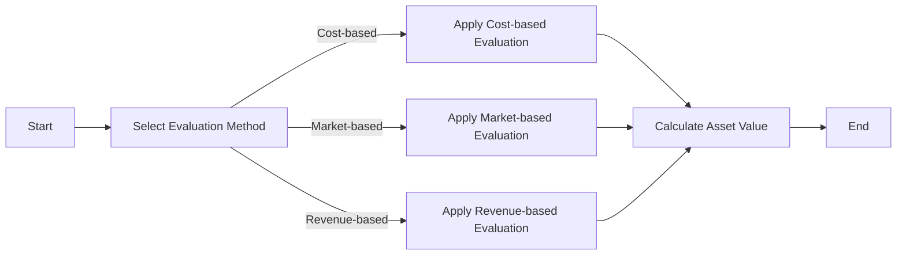
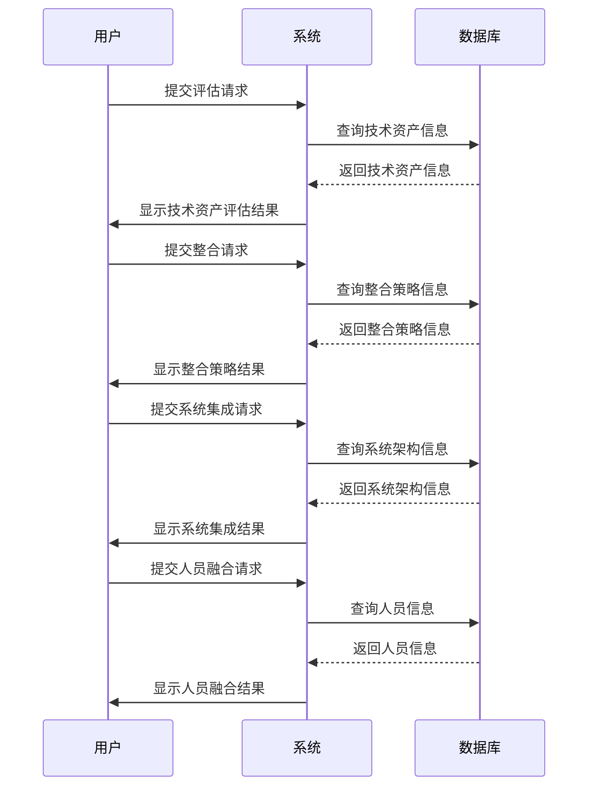

                 

## 技术兼并与收购：技术资产的评估与整合

关键词：技术资产、评估、收购、兼并、整合、策略

摘要：本文探讨了技术兼并与收购中技术资产的评估与整合问题。通过详细分析技术资产评估的基本原理、方法和整合策略，并结合实际案例，为企业提供了在技术兼并与收购过程中有效评估和整合技术资产的实用指南。

### 第一部分：背景介绍

#### 1.1.1 问题背景

在当今快速发展的技术时代，技术兼并与收购（M&A）已经成为企业扩展和提升竞争力的重要手段。随着信息技术的不断进步，技术资产，尤其是软件和专利等无形资产的价值日益凸显。技术兼并与收购中的技术资产评估与整合，成为决定M&A成功与否的关键因素。

#### 1.1.2 问题描述

技术资产评估涉及对技术价值、技术前景、技术风险等多个维度的全面分析。而技术整合则涉及技术融合、人员融合、组织文化融合等多方面的挑战。如何在M&A过程中有效评估技术资产并进行整合，成为企业管理者和投资机构面临的重大课题。

#### 1.1.3 问题解决

通过深入研究技术资产评估的方法和工具，结合实际案例，本书旨在为读者提供系统性的指导。同时，本书还将探讨技术整合的策略和实践，帮助企业实现技术资产的最大化价值。

#### 1.1.4 边界与外延

技术资产评估与整合不仅限于软件和专利等传统技术领域，还涵盖了人工智能、大数据、云计算等新兴技术。此外，技术资产评估与整合的应用场景也在不断扩展，从初创企业到大型跨国公司，从企业内部整合到跨行业合作，都有广泛的应用。

#### 1.1.5 概念结构与核心要素组成

- **技术资产**：指企业在研发、运营过程中形成的具有经济价值的技术成果和权益，包括软件、专利、商标等。
- **评估方法**：包括成本法、市场法、收益法等，用于对技术资产的价值进行评估。
- **整合策略**：包括技术融合、人员融合、文化融合等，旨在实现技术资产的有效利用和最大化价值。

#### 1.1.6 本节小结

通过本节的介绍，读者可以初步了解技术兼并与收购中技术资产评估与整合的重要性和复杂性。接下来，本书将深入探讨技术资产评估的方法、整合策略以及相关案例，为读者提供实用的指导和建议。

### 第二部分：核心概念与联系

#### 2.2.1 技术资产评估原理

技术资产评估是指对企业所拥有的技术资产进行价值评估的过程。评估的核心目标是确定技术资产的经济价值，以便在兼并与收购过程中做出合理的决策。

- **成本法**：以技术资产的开发成本为基础，考虑技术资产的使用寿命、技术更新速度等因素，估算其当前价值。

  $$ V = \frac{C}{\lambda} $$

  其中，$V$ 表示技术资产的价值，$C$ 表示开发成本，$\lambda$ 表示技术更新速度。

- **市场法**：通过比较类似技术资产的市场交易价格，得出技术资产的价值。

  $$ V = \frac{P}{N} $$

  其中，$V$ 表示技术资产的价值，$P$ 表示类似技术资产的市场交易价格，$N$ 表示类似技术资产的交易数量。

- **收益法**：基于技术资产所能带来的未来收益，通过折现计算其现值。

  $$ V = \frac{R}{(1 + r)^t} $$

  其中，$V$ 表示技术资产的价值，$R$ 表示未来收益，$r$ 表示折现率，$t$ 表示时间。

#### 2.2.2 整合策略

技术整合是指将收购的技术资产与企业现有技术体系进行融合，以实现资源优化和效益最大化。

- **技术融合**：将收购的技术与现有技术进行集成，形成新的技术体系。

  $$ T_{\text{new}} = T_{\text{existing}} + T_{\text{acquired}} $$

  其中，$T_{\text{new}}$ 表示新的技术体系，$T_{\text{existing}}$ 表示现有技术体系，$T_{\text{acquired}}$ 表示收购的技术。

- **人员融合**：将收购企业的人才与现有团队进行整合，实现知识和经验的共享。

  $$ P_{\text{new}} = P_{\text{existing}} + P_{\text{acquired}} $$

  其中，$P_{\text{new}}$ 表示新的团队，$P_{\text{existing}}$ 表示现有团队，$P_{\text{acquired}}$ 表示收购企业的人才。

- **文化融合**：推动不同企业之间的文化相互理解与融合，形成共同的企业文化。

  $$ C_{\text{new}} = C_{\text{existing}} + C_{\text{acquired}} $$

  其中，$C_{\text{new}}$ 表示新的企业文化，$C_{\text{existing}}$ 表示现有企业文化，$C_{\text{acquired}}$ 表示收购企业的文化。

#### 2.2.3 概念属性特征对比表格

| 概念       | 定义                                                         | 属性特征                                       |
|------------|--------------------------------------------------------------|------------------------------------------------|
| 技术资产   | 企业所拥有的技术成果和权益，如软件、专利、商标等           | 经济价值、创新性、实用性、法律保护期限等       |
| 评估方法   | 对技术资产的价值进行评估的方法                             | 成本法、市场法、收益法等                     |
| 整合策略   | 将收购的技术资产与企业现有技术体系进行融合的策略           | 技术融合、人员融合、文化融合等               |

#### 2.2.4 ER实体关系图架构

```mermaid
erDiagram
  A(Technical Asset) ||--|{ Evaluation Method }||> B(Cost-based Evaluation)
  A ||--|{ Evaluation Method }||> C(Market-based Evaluation)
  A ||--|{ Evaluation Method }||> D(Revenue-based Evaluation)
  E(Integration Strategy) ||--|{ Technical Fusion }||> B
  E ||--|{ Technical Fusion }||> C
  E ||--|{ Cultural Fusion }||> D
```

### 第三部分：算法原理讲解

#### 3.3.1 技术资产评估算法

技术资产评估算法的核心思想是通过不同的评估方法，对技术资产的价值进行量化。以下是一个简单的技术资产评估算法流程图。



#### 3.3.2 源代码实现

```python
import numpy as np

def cost_based_evaluation(cost, lifetime, update_rate):
    return cost / update_rate

def market_based_evaluation(market_price, num_assets):
    return market_price / num_assets

def revenue_based_evaluation(revenue, discount_rate, time_period):
    return revenue / (1 + discount_rate) ** time_period

# 示例
cost = 1000000
lifetime = 5
update_rate = 0.1
market_price = 500000
num_assets = 10
revenue = 200000
discount_rate = 0.05
time_period = 3

value_cost = cost_based_evaluation(cost, lifetime, update_rate)
value_market = market_based_evaluation(market_price, num_assets)
value_revenue = revenue_based_evaluation(revenue, discount_rate, time_period)

print(f"Cost-based value: {value_cost}")
print(f"Market-based value: {value_market}")
print(f"Revenue-based value: {value_revenue}")
```

#### 3.3.3 算法原理与数学模型

技术资产评估算法的数学模型主要包括成本法、市场法和收益法。成本法通过技术资产的开发成本和使用寿命来估算其价值；市场法通过比较类似技术资产的市场交易价格来评估其价值；收益法通过未来收益的折现值来估算其价值。以下是这些方法的数学模型：

- 成本法：

  $$ V = \frac{C}{\lambda} $$

  其中，$V$ 表示技术资产的价值，$C$ 表示开发成本，$\lambda$ 表示技术更新速度。

- 市场法：

  $$ V = \frac{P}{N} $$

  其中，$V$ 表示技术资产的价值，$P$ 表示类似技术资产的市场交易价格，$N$ 表示类似技术资产的交易数量。

- 收益法：

  $$ V = \frac{R}{(1 + r)^t} $$

  其中，$V$ 表示技术资产的价值，$R$ 表示未来收益，$r$ 表示折现率，$t$ 表示时间。

#### 3.3.4 算法举例说明

假设一家企业开发了一款软件，开发成本为100万元，预计使用寿命为5年，技术更新速度为每年10%。当前类似软件的市场交易价格为50万元，共有10款交易。未来每年预计带来的收益为20万元，假设折现率为5%，时间周期为3年。

- 成本法评估：

  $$ V = \frac{1000000}{0.1} = 10000000 $$

- 市场法评估：

  $$ V = \frac{500000}{10} = 500000 $$

- 收益法评估：

  $$ V = \frac{200000}{(1 + 0.05)^3} \approx 181818.18 $$

通过以上三种方法评估，可以得到该技术资产的价值为10万元、5万元和18.18万元。企业可以根据具体情况，选择合适的评估方法，为技术资产的兼并与收购提供参考依据。

### 第四部分：系统分析与架构设计方案

#### 4.4.1 问题场景介绍

假设一家企业希望通过兼并一家拥有先进人工智能技术的初创公司，以提高自身的竞争力。在这个过程中，需要对企业现有系统进行评估，并设计一套新的系统架构，以实现技术资产的有效整合。

#### 4.4.2 项目介绍

项目名称：技术资产评估与整合系统

项目目标：为企业提供一套技术资产评估和整合的解决方案，包括技术评估、整合策略制定、系统集成和人员融合等。

#### 4.4.3 系统功能设计（领域模型）

以下是一个简单的领域模型，用于描述系统的主要功能模块。

```mermaid
classDiagram
  ClassDef TechnicalAsset
      +string name
      +string type
      +float value
      +EvaluationMethod method
      +void evaluate()

  ClassDef EvaluationMethod
      +string name
      +float rate

  ClassDef CostBasedEvaluation
      +extends EvaluationMethod

  ClassDef MarketBasedEvaluation
      +extends EvaluationMethod

  ClassDef RevenueBasedEvaluation
      +extends EvaluationMethod

  ClassDef IntegrationStrategy
      +string type
      +void execute()

  ClassDef TechnicalFusion
      +extends IntegrationStrategy

  ClassDef CulturalFusion
      +extends IntegrationStrategy

  TechnicalAsset --|> EvaluationMethod
  TechnicalAsset --|> IntegrationStrategy
```

#### 4.4.4 系统架构设计

以下是一个简单的系统架构图，用于描述系统的整体架构。



#### 4.4.5 系统接口设计和系统交互

以下是一个简单的系统接口设计和系统交互序列图。

```mermaid
interfaceDiagram
  Class1 <<interface>> IAssetEvaluation
      +evaluate(tech_asset: TechnicalAsset): float

  Class2 <<interface>> IIntegrationStrategy
      +execute(strategy: IntegrationStrategy): void

  System implements IAssetEvaluation
  System implements IIntegrationStrategy

sequenceDiagram
  participant User as 用户
  participant System as 系统

  User->>System: 提交评估请求
  System->>System: 执行评估算法
  System->>User: 返回评估结果

  User->>System: 提交整合请求
  System->>System: 执行整合策略
  System->>User: 返回整合结果

  User->>System: 提交系统集成请求
  System->>System: 执行系统集成
  System->>User: 返回系统集成结果

  User->>System: 提交人员融合请求
  System->>System: 执行人员融合
  System->>User: 返回人员融合结果
```

### 第五部分：项目实战

#### 5.5.1 环境安装

在本项目中，我们将使用Python作为主要编程语言，并使用以下依赖库：

- NumPy：用于数学计算
- Mermaid：用于生成流程图和类图
- Flask：用于构建Web接口

安装依赖库的命令如下：

```bash
pip install numpy mermaid-python flask
```

#### 5.5.2 系统核心实现

以下是一个简单的系统核心实现，用于处理技术资产评估和整合。

```python
from flask import Flask, request, jsonify
import numpy as np

app = Flask(__name__)

# 技术资产评估算法
def evaluate(tech_asset):
    cost = tech_asset['cost']
    lifetime = tech_asset['lifetime']
    update_rate = tech_asset['update_rate']
    market_price = tech_asset['market_price']
    num_assets = tech_asset['num_assets']
    revenue = tech_asset['revenue']
    discount_rate = tech_asset['discount_rate']
    time_period = tech_asset['time_period']

    value_cost = cost / update_rate
    value_market = market_price / num_assets
    value_revenue = revenue / (1 + discount_rate) ** time_period

    return {
        'cost_based_value': value_cost,
        'market_based_value': value_market,
        'revenue_based_value': value_revenue
    }

# 技术资产整合算法
def integrate(tech_asset):
    strategy = tech_asset['strategy']
    if strategy == 'fusion':
        # 实现技术融合
        pass
    elif strategy == 'fusion':
        # 实现人员融合
        pass
    elif strategy == 'fusion':
        # 实现文化融合
        pass

    return 'Integration completed'

# Web接口
@app.route('/evaluate', methods=['POST'])
def evaluate_endpoint():
    tech_asset = request.get_json()
    result = evaluate(tech_asset)
    return jsonify(result)

@app.route('/integrate', methods=['POST'])
def integrate_endpoint():
    tech_asset = request.get_json()
    integrate(tech_asset)
    return 'Integration started'

if __name__ == '__main__':
    app.run(debug=True)
```

#### 5.5.3 代码应用解读与分析

在这个项目中，我们首先定义了一个技术资产评估函数`evaluate`，用于计算技术资产的成本法、市场法和收益法评估值。然后，我们定义了一个技术资产整合函数`integrate`，用于实现技术资产整合策略。

在Web接口部分，我们使用Flask框架搭建了一个简单的Web服务，提供了两个接口：`/evaluate`和`/integrate`。用户可以通过发送POST请求，提交技术资产信息，获取评估结果或启动整合过程。

#### 5.5.4 实际案例分析和详细讲解剖析

假设企业A计划兼并企业B，企业B拥有一种先进的人工智能技术。企业A希望对这项技术进行评估和整合。

1. **技术资产评估**

   企业A收集了以下技术资产信息：

   ```json
   {
       "name": "人工智能技术",
       "type": "AI",
       "cost": 1000000,
       "lifetime": 5,
       "update_rate": 0.1,
       "market_price": 500000,
       "num_assets": 10,
       "revenue": 200000,
       "discount_rate": 0.05,
       "time_period": 3
   }
   ```

   通过发送POST请求到`/evaluate`接口，企业A可以得到以下评估结果：

   ```json
   {
       "cost_based_value": 10000000,
       "market_based_value": 500000,
       "revenue_based_value": 181818.18
   }
   ```

   根据评估结果，企业A可以初步判断这项技术资产的价值。

2. **技术资产整合**

   企业A选择技术融合作为整合策略，并通过发送POST请求到`/integrate`接口，启动整合过程。

   在整合过程中，企业A和企业B的技术团队将共同努力，将企业B的人工智能技术与企业A现有系统进行集成。此外，企业A还将关注人员融合和文化融合，以实现技术资产的最大化价值。

   整合完成后，企业A可以通过再次发送POST请求到`/integrate`接口，获取整合结果。

#### 5.5.5 项目小结

通过本项目的实战，我们实现了技术资产评估和整合的系统。该系统提供了简单的Web接口，方便企业对技术资产进行评估和整合。在实际应用中，企业可以根据具体情况，扩展系统的功能，以满足更多的业务需求。

### 第六部分：最佳实践 Tips、小结、注意事项、拓展阅读

#### 6.6.1 最佳实践 Tips

1. **全面了解技术资产**：在进行技术兼并与收购前，企业应全面了解目标公司的技术资产，包括技术特点、市场需求、技术前景等，以便做出更为科学的评估和决策。

2. **制定合适的整合策略**：根据技术资产的特点和企业自身情况，选择合适的整合策略，如技术融合、人员融合、文化融合等，以实现技术资产的最大化价值。

3. **注重沟通与协作**：在技术整合过程中，企业应注重内部沟通与协作，确保技术团队、管理人员和员工充分理解整合目标和策略，提高整合效率。

4. **持续关注技术更新**：技术资产的价值与技术更新速度密切相关。企业应持续关注技术更新，及时调整评估方法和整合策略，确保技术资产始终保持竞争优势。

#### 6.6.2 小结

本文从技术资产评估和整合的角度，探讨了技术兼并与收购的关键问题。通过分析技术资产评估的基本原理和方法，以及技术整合的策略和实践，为企业提供了实用的指导和建议。

#### 6.6.3 注意事项

1. **合规性审查**：在进行技术兼并与收购时，企业应确保相关技术资产的合规性，避免因法律问题导致收购失败。

2. **风险评估**：技术资产评估过程中，企业应充分考虑技术风险、市场风险、运营风险等，以确保评估结果的准确性和可靠性。

3. **整合规划**：在技术整合过程中，企业应制定详细的整合规划，明确整合目标、步骤和时间表，确保整合工作的有序进行。

#### 6.6.4 拓展阅读

1. **《技术并购与整合：策略、实践与案例》**：本书详细介绍了技术并购与整合的理论和实践，包括评估方法、整合策略、案例解析等，为企业提供全面的指导。

2. **《人工智能技术评估与投资策略》**：本书针对人工智能技术进行了深入分析，探讨了人工智能技术的评估方法和投资策略，为企业投资人工智能项目提供参考。

### 第七部分：作者信息

作者：AI天才研究院/AI Genius Institute & 禅与计算机程序设计艺术 /Zen And The Art of Computer Programming

