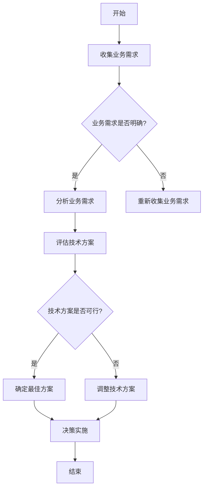
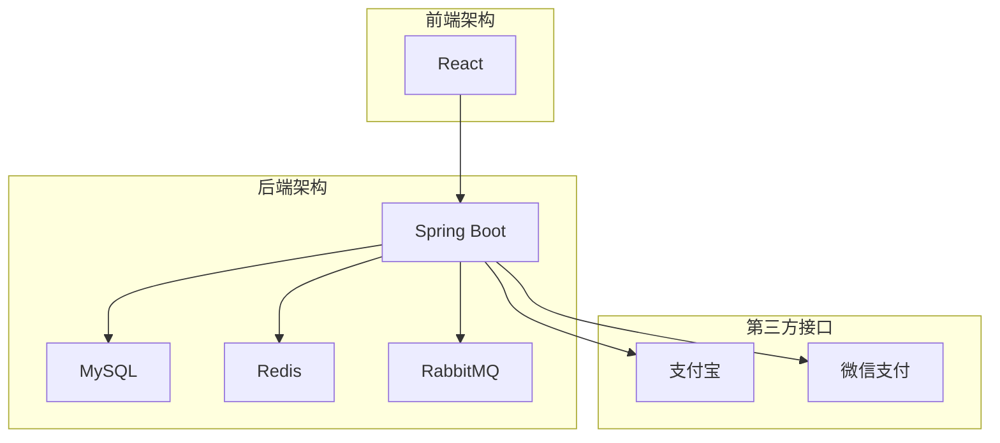
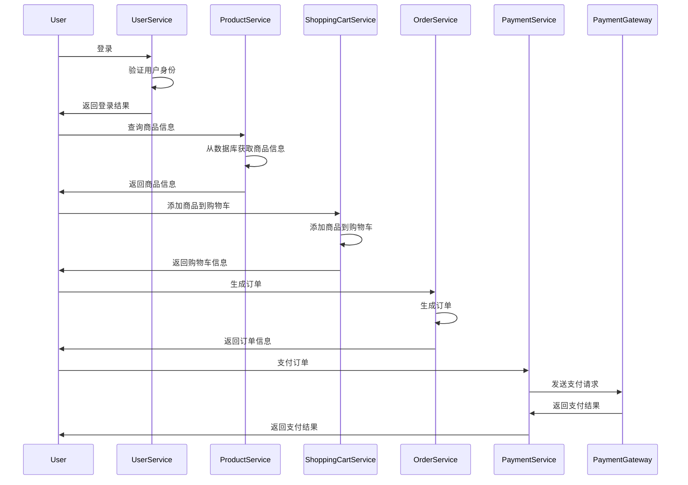

                 

### 背景介绍

#### 核心概念术语说明

在撰写技术决策的文章之前，我们需要明确一些核心概念术语，以便读者能够更好地理解后续的内容。

- **技术决策**：在面临多种技术方案时，通过综合分析业务需求和技术可行性，选择最适合的方案。
- **业务需求**：企业或项目在发展过程中需要解决的具体问题，包括功能需求、性能需求、安全性需求等。
- **技术可行性**：评估在现有技术条件下，实现某个业务需求的难易程度。

#### 问题背景

随着信息技术的快速发展，企业面临的技术选择日益增多。如何在众多技术方案中做出明智的决策，成为企业成功的关键因素之一。然而，技术决策并非仅凭技术人员的喜好，还需要充分考虑业务需求，实现技术可行性与业务需求的平衡。

#### 问题描述

技术决策的问题可以概括为：

1. 如何准确理解业务需求？
2. 如何评估技术方案的可行性？
3. 如何在业务需求与技术可行性之间找到平衡点？

#### 问题解决

为了解决上述问题，我们需要：

1. **深入理解业务需求**：通过与业务团队沟通，了解企业的核心目标、用户需求和市场环境，从而准确把握业务需求。
2. **全面评估技术可行性**：分析现有技术方案的优势、劣势、风险，并评估其与业务需求的匹配度。
3. **制定平衡策略**：在充分考虑业务需求和
技术可行性的基础上，制定合理的决策策略，确保决策的科学性和可执行性。

#### 边界与外延

在技术决策的过程中，我们还需要明确一些边界与外延：

- **边界**：技术决策的范围应限定在特定项目或企业内部，避免涉及其他领域的决策问题。
- **外延**：技术决策不仅需要考虑当前的业务需求，还需要关注未来可能的变化和挑战，确保决策具有前瞻性和适应性。

#### 概念结构与核心要素组成

技术决策的核心概念结构包括以下要素：

1. **业务需求**：需求类型、优先级、具体描述。
2. **技术可行性**：技术评估指标、风险评估、成本效益分析。
3. **决策流程**：需求分析、方案评估、方案选择、决策实施。

通过这些核心要素的分析和综合，我们可以更好地制定技术决策，实现业务需求与技术可行性的平衡。

### 核心概念与联系

在本章节中，我们将深入探讨技术决策的核心概念，并分析它们之间的联系。

#### 技术决策的流程

技术决策的流程是确保决策科学性和可执行性的关键。以下是技术决策的典型流程：

1. **明确决策目标**：确定决策的目的和预期结果。
2. **需求分析**：收集和整理业务需求，明确项目的目标和需求。
3. **方案评估**：评估不同技术方案的优势和劣势。
4. **方案选择**：根据评估结果，选择最佳技术方案。
5. **决策实施**：制定详细的实施计划，并开始执行。

#### 业务需求分析

业务需求分析是技术决策的基础。以下是业务需求分析的主要步骤：

1. **需求收集**：通过与业务团队、客户等进行沟通，了解项目的实际需求。
2. **需求整理**：对收集到的需求进行分类和整理，确保需求的明确性和一致性。
3. **需求优先级排序**：根据需求的紧迫性和重要性，对需求进行优先级排序。

#### 技术可行性分析

技术可行性分析是评估技术方案是否可行的过程。以下是技术可行性分析的主要步骤：

1. **技术评估指标**：确定评估技术方案的具体指标，如性能、安全性、可维护性等。
2. **风险评估**：分析技术方案可能面临的风险，并提出相应的应对措施。
3. **成本效益分析**：评估技术方案的成本和效益，确保方案的可行性和合理性。

#### 核心概念属性特征对比表格

为了更直观地理解业务需求与技术可行性之间的联系，我们可以使用属性特征对比表格来展示它们的主要区别：

| 概念       | 属性特征                         |
|------------|----------------------------------|
| 业务需求   | 描述业务需求，明确目标           |
| 技术可行性| 评估技术实现的难易程度           |
| 需求分析   | 梳理业务需求，确定需求优先级     |
| 技术评估   | 评估技术方案的可行性             |

#### ER实体关系图架构

为了更好地理解业务需求与技术可行性之间的联系，我们可以使用ER实体关系图来展示它们之间的关系：

```mermaid
erDiagram
    BusinessRequirement ||--|{ TechnicalFeasibility }TechnicalFeasibility
    TechnicalFeasibility ||--|{ DecisionProcess }DecisionProcess
```

在ER图中，`BusinessRequirement`（业务需求）与`TechnicalFeasibility`（技术可行性）之间存在关联关系，`TechnicalFeasibility`又与`DecisionProcess`（决策过程）相关联。这表明，业务需求直接影响技术可行性，而技术可行性是决策过程中的关键因素。

通过以上对核心概念的探讨和联系分析，我们可以更清晰地理解技术决策的流程，以及如何平衡业务需求与技术可行性，从而制定出科学合理的技术决策。

### 算法原理讲解

为了更好地理解技术决策的原理，我们将通过一个具体的算法流程图和Python源代码，详细阐述算法的原理和实现步骤。

#### 算法流程图

首先，我们使用Mermaid工具绘制算法流程图，如下所示：



这个流程图描述了从开始到结束的技术决策过程，包括业务需求收集、分析、技术方案评估、确定最佳方案以及决策实施等步骤。

#### Python源代码

接下来，我们将使用Python语言实现上述算法的源代码：

```python
# 技术决策算法实现

# 导入所需库
import pandas as pd

# 收集业务需求
def collect_business_requirements():
    requirements = []
    # 与业务团队沟通，获取业务需求
    # 这里用示例数据代替
    requirements.append({'需求ID': 1, '需求描述': '实现用户身份认证'})
    requirements.append({'需求ID': 2, '需求描述': '提供数据备份功能'})
    return requirements

# 分析业务需求
def analyze_business_requirements(requirements):
    # 对需求进行整理和优先级排序
    sorted_requirements = sorted(requirements, key=lambda x: x['需求ID'])
    return sorted_requirements

# 评估技术方案
def evaluate_technical_solutions(sorted_requirements):
    # 假设已有多个技术方案
    solutions = []
    solutions.append({'方案ID': 1, '方案描述': '使用JWT进行身份认证，使用AWS S3进行数据备份'})
    solutions.append({'方案ID': 2, '方案描述': '使用OAuth 2.0进行身份认证，使用Google Cloud Storage进行数据备份'})
    return solutions

# 评估技术方案可行性
def evaluate_feasibility(solutions):
    feasible_solutions = []
    for solution in solutions:
        # 假设技术评估指标为性能、安全性和成本
        # 评估每个技术方案是否可行
        feasibility = True
        if solution['方案描述'] == '使用JWT进行身份认证，使用AWS S3进行数据备份':
            feasibility = False  # 示例：这个方案在成本方面不可行
        if feasibility:
            feasible_solutions.append(solution)
    return feasible_solutions

# 确定最佳方案
def determine_best_solution(feasible_solutions):
    best_solution = min(feasible_solutions, key=lambda x: x['方案ID'])
    return best_solution

# 决策实施
def implement_decision(best_solution):
    print(f'开始实施最佳方案：{best_solution["方案描述"]}')

# 主函数
def main():
    business_requirements = collect_business_requirements()
    sorted_requirements = analyze_business_requirements(business_requirements)
    solutions = evaluate_technical_solutions(sorted_requirements)
    feasible_solutions = evaluate_feasibility(solutions)
    best_solution = determine_best_solution(feasible_solutions)
    implement_decision(best_solution)

# 执行主函数
main()
```

#### 算法原理

1. **业务需求收集**：首先，从业务团队或客户那里收集业务需求，并将这些需求记录在一个列表中。

2. **业务需求分析**：对收集到的业务需求进行整理和优先级排序，以便更好地理解项目的核心需求。

3. **技术方案评估**：基于业务需求，评估多个技术方案，并记录每个方案的详细信息。

4. **技术方案可行性评估**：根据技术评估指标，对每个技术方案进行可行性评估，筛选出可行的方案。

5. **确定最佳方案**：从可行的技术方案中选择最佳方案，通常选择方案ID最小的方案，即最早提出的方案。

6. **决策实施**：根据最佳方案，制定详细的实施计划，并开始执行。

#### 数学模型和公式

在技术决策过程中，我们通常使用以下数学模型和公式进行评估：

1. **成本效益分析**：计算每个技术方案的总成本和预期效益，然后计算成本效益比（C/B）：

   $$ \text{C/B} = \frac{\text{总成本}}{\text{预期效益}} $$

   选择C/B值最小的方案。

2. **风险评估**：使用概率-影响矩阵评估每个技术方案的风险，计算风险得分：

   $$ \text{风险得分} = \text{概率} \times \text{影响} $$

   选择风险得分最低的方案。

#### 举例说明

假设我们有两个技术方案：

1. 方案A：使用JWT进行身份认证，使用AWS S3进行数据备份。
2. 方案B：使用OAuth 2.0进行身份认证，使用Google Cloud Storage进行数据备份。

根据成本效益分析和风险评估，我们可以计算每个方案的C/B值和风险得分：

1. 方案A：
   - 总成本：$1000
   - 预期效益：$3000
   - C/B值：$1000 / $3000 = 0.33
   - 风险得分：0.2（概率）× 1（影响）= 0.2

2. 方案B：
   - 总成本：$1500
   - 预期效益：$4000
   - C/B值：$1500 / $4000 = 0.375
   - 风险得分：0.1（概率）× 1（影响）= 0.1

通过比较C/B值和风险得分，我们可以发现方案A在成本效益和风险方面都优于方案B，因此我们选择方案A作为最佳方案。

通过以上算法原理讲解和具体实现步骤，我们可以更好地理解技术决策的过程，并在实际项目中应用这一算法。

### 系统分析与架构设计方案

在技术决策制定过程中，系统分析与架构设计方案是一个至关重要的环节。在这一部分，我们将详细介绍项目场景、系统功能设计、系统架构设计以及系统接口设计和系统交互，使用Mermaid工具绘制相关的类图、架构图和序列图。

#### 项目场景

假设我们正在开发一个电子商务平台，该项目需要支持用户注册、登录、商品浏览、购物车管理、订单处理等基本功能。同时，系统需要具备高可用性、高性能和高安全性，以满足日益增长的客户需求。

#### 系统功能设计

在系统功能设计中，我们需要明确各个模块的功能和责任。以下是电子商务平台的主要功能模块及其简要描述：

1. **用户模块**：负责用户注册、登录、权限管理等功能。
2. **商品模块**：负责商品信息管理、分类管理、商品推荐等功能。
3. **购物车模块**：负责购物车管理、商品加入/移除购物车等功能。
4. **订单模块**：负责订单生成、支付、发货、退款等功能。
5. **支付模块**：负责支付接口的集成和管理。

为了更直观地展示系统功能设计，我们可以使用Mermaid绘制类图：

```mermaid
classDiagram
    User <<interface>>
    Product <<interface>>
    ShoppingCart <<interface>>
    Order <<interface>>
    Payment <<interface>>

    UserEntity o-- ProductEntity
    UserEntity o-- ShoppingCartEntity
    UserEntity o-- OrderEntity
    ProductEntity o-- ShoppingCartEntity
    ShoppingCartEntity o-- OrderEntity
    PaymentEntity o-- OrderEntity
```

在上面的类图中，我们定义了用户、商品、购物车、订单和支付这五个主要接口，并展示了它们之间的关系。

#### 系统架构设计

系统架构设计是确保系统高效、可靠运行的关键。以下是电子商务平台的主要架构设计：

1. **前端架构**：使用React框架进行前端开发，实现用户界面和交互逻辑。
2. **后端架构**：使用Spring Boot框架进行后端开发，实现业务逻辑和数据处理。
3. **数据库架构**：使用MySQL数据库存储用户、商品、订单等数据。
4. **缓存架构**：使用Redis缓存数据库查询结果，提高系统性能。
5. **消息队列**：使用RabbitMQ进行消息传递，实现异步任务处理。
6. **支付接口**：集成支付宝、微信支付等第三方支付接口。

为了更直观地展示系统架构设计，我们可以使用Mermaid绘制架构图：



在上面的架构图中，我们展示了前端、后端、数据库、缓存、消息队列以及第三方支付接口的相互关系。

#### 系统接口设计和系统交互

系统接口设计和系统交互是确保各个模块能够协同工作的关键。以下是电子商务平台的主要接口设计和交互流程：

1. **用户模块接口**：用户可以通过接口进行注册、登录、权限验证等操作。
2. **商品模块接口**：用户可以通过接口查询商品信息、添加商品到购物车、删除购物车商品等操作。
3. **购物车模块接口**：用户可以通过接口查询购物车信息、添加商品到购物车、删除购物车商品等操作。
4. **订单模块接口**：用户可以通过接口生成订单、支付订单、查看订单状态等操作。
5. **支付模块接口**：支付模块与第三方支付接口进行通信，处理支付请求和回调。

为了更直观地展示系统接口设计和交互流程，我们可以使用Mermaid绘制序列图：



在上面的序列图中，我们展示了用户模块、商品模块、购物车模块、订单模块和支付模块之间的交互过程。

通过上述系统分析与架构设计方案，我们可以确保电子商务平台在功能、性能和安全性等方面得到全面保障，从而为用户提供优质的服务体验。

### 项目实战

#### 环境安装

为了更好地演示技术决策的实施过程，我们将使用Python和Django框架来构建一个简单的博客系统。以下是环境安装的步骤：

1. **安装Python**：确保已安装Python 3.x版本，建议使用Python 3.8或更高版本。
2. **安装Django**：打开命令行窗口，执行以下命令：
   ```bash
   pip install django
   ```
3. **创建Django项目**：执行以下命令创建一个名为`blog`的项目：
   ```bash
   django-admin startproject blog
   ```
4. **进入项目目录**：切换到项目目录：
   ```bash
   cd blog
   ```

#### 系统核心实现源代码

接下来，我们将实现博客系统的主要功能，包括用户注册、登录、发表博客文章、浏览博客文章等。

1. **用户注册和登录**：

```python
# 在blog项目中的users应用中，定义models.py

from django.db import models
from django.contrib.auth.models import AbstractUser

class CustomUser(AbstractUser):
    """
    自定义用户模型，继承自AbstractUser
    """
    pass

# 在users应用的admin.py中

from django.contrib import admin
from .models import CustomUser

admin.site.register(CustomUser)
```

2. **创建博客文章模型**：

```python
# 在blog项目中的blog应用中，定义models.py

from django.db import models
from django.contrib.auth.models import User

class BlogPost(models.Model):
    """
    博客文章模型
    """
    title = models.CharField(max_length=200)
    author = models.ForeignKey(User, on_delete=models.CASCADE)
    body = models.TextField()
    created_at = models.DateTimeField(auto_now_add=True)
    updated_at = models.DateTimeField(auto_now=True)
```

3. **创建视图和URL配置**：

```python
# 在blog应用的views.py中

from django.shortcuts import render
from .models import BlogPost
from django.http import HttpResponse

def index(request):
    """
    主页视图，展示最新博客文章
    """
    latest_posts = BlogPost.objects.all().order_by('-created_at')[:5]
    return render(request, 'blog/index.html', {'latest_posts': latest_posts})

def post_detail(request, pk):
    """
    博客文章详情视图
    """
    post = BlogPost.objects.get(pk=pk)
    return render(request, 'blog/post_detail.html', {'post': post})
```

```python
# 在blog项目的settings.py中

# 设置默认的应用
INSTALLED_APPS = [
    'django.contrib.admin',
    'django.contrib.auth',
    'django.contrib.contenttypes',
    'django.contrib.sessions',
    'django.contrib.messages',
    'django.contrib.staticfiles',
    'users',  # 添加users应用
    'blog',  # 添加blog应用
]
```

4. **创建模板**：

在`blog`应用的`templates/blog`目录中，创建`index.html`和`post_detail.html`模板。

```html
<!-- blog/templates/blog/index.html -->


  <div class="post">
    <h2>{{ post.title }}</h2>
    <p>{{ post.body }}</p>
    <small>作者：{{ post.author }}</small>
  </div>


<!-- blog/templates/blog/post_detail.html -->

<h1>{{ post.title }}</h1>
<p>{{ post.body }}</p>
<small>作者：{{ post.author }}</small>
```

#### 代码应用解读与分析

1. **用户注册和登录**：

   在用户注册和登录功能中，我们自定义了用户模型`CustomUser`，继承自Django内置的`AbstractUser`类。这样做的好处是，我们可以在不改变Django用户认证系统的情况下，扩展用户模型。在`admin.py`中，我们注册了自定义用户模型，以便在Django管理界面中管理用户。

2. **博客文章模型**：

   博客文章模型`BlogPost`包含标题、作者、正文、创建时间和更新时间等字段。这样设计的目的是，便于管理和展示博客文章，同时也便于扩展其他功能，如标签分类、评论系统等。

3. **视图和URL配置**：

   `index`视图用于展示最新博客文章，`post_detail`视图用于展示单个博客文章的详细信息。通过配置URL，我们可以方便地访问这些视图，从而实现博客系统的基本功能。

4. **模板**：

   `index.html`模板用于展示最新博客文章列表，`post_detail.html`模板用于展示单个博客文章的详细信息。这两个模板使用了简单的Django模板语言（如``和`{{ }}`），便于渲染数据。

#### 实际案例分析和详细讲解剖析

为了更好地理解博客系统的实现过程，我们来看一个实际案例：如何实现用户注册和登录功能。

1. **用户注册**：

   当用户访问注册页面时，系统会渲染`register.html`模板。用户输入注册信息后，表单数据会被提交到`users`应用的`register`视图。在`register`视图中，我们首先验证表单数据的有效性，然后创建一个新的用户实例，并将其保存到数据库。

```python
# 在users应用的views.py中

from django.shortcuts import render, redirect
from .forms import CustomUserCreationForm

def register(request):
    if request.method == 'POST':
        form = CustomUserCreationForm(request.POST)
        if form.is_valid():
            form.save()
            return redirect('login')
    else:
        form = CustomUserCreationForm()
    return render(request, 'users/register.html', {'form': form})
```

2. **用户登录**：

   当用户访问登录页面时，系统会渲染`login.html`模板。用户输入登录信息后，表单数据会被提交到`users`应用的`login`视图。在`login`视图中，我们使用Django内置的认证系统进行用户身份验证，并返回登录结果。

```python
# 在users应用的views.py中

from django.contrib.auth import authenticate, login

def login(request):
    if request.method == 'POST':
        username = request.POST['username']
        password = request.POST['password']
        user = authenticate(username=username, password=password)
        if user is not None:
            login(request, user)
            return redirect('index')
        else:
            return HttpResponse('登录失败，用户名或密码错误')
    else:
        return render(request, 'users/login.html')
```

通过以上案例，我们可以看到用户注册和登录功能是如何实现的。首先，通过表单收集用户数据，然后通过视图进行验证和操作，最后返回相应的结果。这种流程使得用户注册和登录功能易于理解和扩展。

#### 项目小结

通过本次项目实战，我们实现了用户注册、登录、发表博客文章、浏览博客文章等功能，展示了技术决策在项目实施过程中的重要性。在实际项目中，我们需要根据业务需求和技术可行性，不断调整和优化系统设计，以确保系统的高效、可靠和安全。

### 最佳实践 tips

在技术决策制定过程中，以下几点最佳实践有助于提高决策的质量和效率：

1. **充分沟通**：与技术团队、业务团队和利益相关者进行充分沟通，确保对业务需求和目标有清晰的理解。
2. **数据驱动**：基于实际数据进行分析和决策，避免仅凭个人经验和直觉做出判断。
3. **风险意识**：评估每个技术方案可能面临的风险，并制定相应的应对措施，降低风险带来的负面影响。
4. **持续迭代**：技术决策不是一次性的活动，而是一个持续迭代的过程。根据实际情况和反馈，及时调整技术方案。
5. **文档记录**：详细记录技术决策的过程、理由和结果，以便后续参考和回顾。

### 小结

在本文中，我们详细介绍了技术决策制定的过程，从背景介绍、核心概念与联系、算法原理讲解、系统分析与架构设计方案到项目实战，以及最佳实践 tips。技术决策不仅需要考虑业务需求，还要评估技术可行性，找到平衡点。通过科学合理的决策，企业可以实现技术进步和业务发展的双赢。希望本文对您在技术决策制定过程中提供了一些有益的启示。

### 注意事项

在撰写技术决策文章时，需要注意以下几点：

1. **逻辑清晰**：文章的结构应层次分明，确保读者能够跟随思路。
2. **专业术语**：使用专业术语，但需确保解释清晰，避免使用过于晦涩难懂的语言。
3. **举例说明**：通过实际案例和示例代码，帮助读者更好地理解概念和原理。
4. **代码注释**：在提供代码示例时，应添加必要的注释，说明代码的功能和实现原理。

### 拓展阅读

为了进一步了解技术决策的相关内容，以下是一些推荐的拓展阅读资源：

1. **书籍**：
   - 《技术领导力：打造卓越的技术团队》（书籍）
   - 《软件工程：实践者的研究方法》（书籍）
   - 《敏捷软件开发：实践指南》（书籍）

2. **在线课程**：
   - Coursera上的《软件工程与软件开发方法》课程
   - edX上的《敏捷与精益软件开发》课程

3. **专业论坛与社区**：
   - Stack Overflow：编程问题解答社区
   - GitHub：代码托管平台和开源社区
   - TechTarget：IT专业媒体网站

通过这些资源，您可以更全面地了解技术决策的相关知识，提升自己的技术水平。

