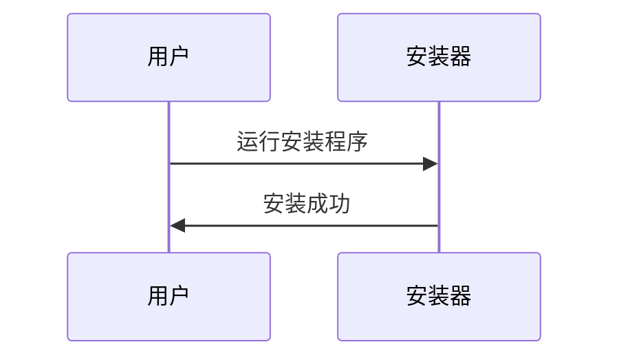
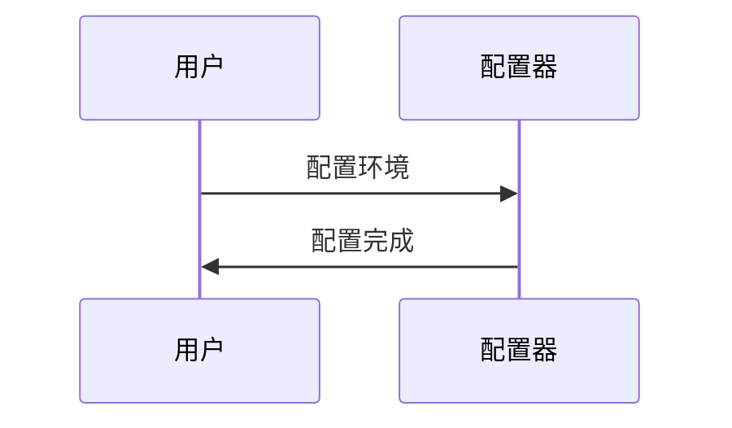
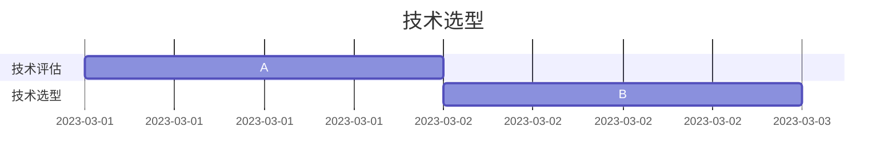
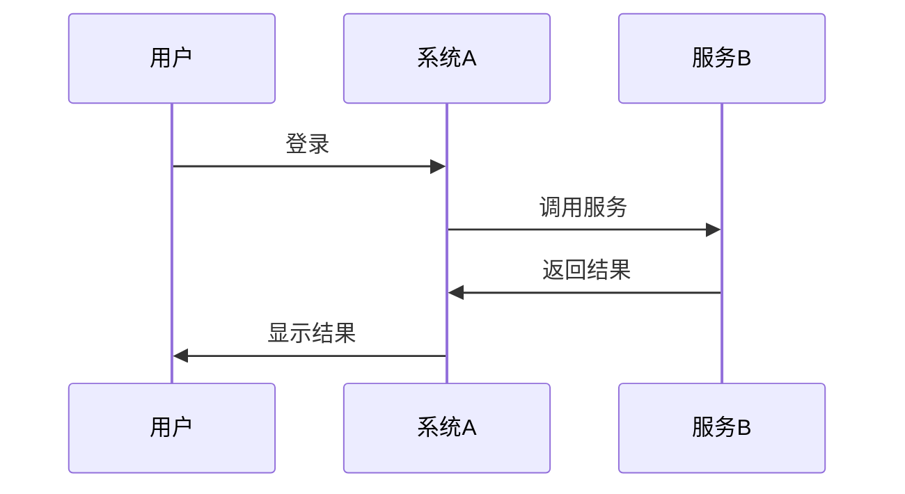

                 


## 技术决策框架：做出合理的技术选择

关键词：技术决策、框架、合理选择、项目管理、企业发展

摘要：本文旨在探讨技术决策框架的重要性及其在企业和项目管理中的应用。通过分析技术决策框架的核心概念、核心要素及其在不同领域中的应用，本文提出了一个系统的技术决策框架，帮助企业和项目管理者在面对复杂的技术选择时做出合理的决策。文章还将通过实战案例，展示如何在实际项目中应用技术决策框架，并提供最佳实践和注意事项。

----------------------------------------------------------------

## 第一部分：技术决策框架概述

### 第1章：技术决策框架的起源与重要性

#### 1.1 技术决策框架的起源与发展

##### 1.1.1 技术决策框架的历史背景

技术决策框架的概念并非现代产物，早在计算机科学和信息技术初期，科学家和工程师们就已经在寻找系统化的方法来评估和选择技术方案。随着技术的发展和项目规模的扩大，技术决策的复杂度也逐渐增加，因此需要一种结构化的方法来指导决策过程。

##### 1.1.2 技术决策框架的定义

技术决策框架是一种系统化的方法，用于指导在项目或企业中做出技术相关的决策。它包括了一系列步骤和工具，帮助决策者从多个角度分析和评估技术方案，从而做出最优选择。

#### 1.2 技术决策框架的重要性

##### 1.2.1 技术决策框架在企业发展中的作用

技术是企业发展的核心驱动力，技术决策框架能够帮助企业更好地理解市场需求、优化技术路线，从而提高企业的竞争力。

##### 1.2.2 技术决策框架在项目管理中的应用

在项目管理中，技术决策框架能够帮助项目经理和团队成员明确技术需求、评估技术风险，确保项目能够按时、按质量完成。

#### 1.3 技术决策框架的基本要素

##### 1.3.1 目标设定

明确的目标是技术决策的起点，它指引着整个决策过程的方向。

##### 1.3.2 可行性分析

可行性分析是评估技术方案是否可行的过程，包括技术、经济、法律等多个方面的考量。

##### 1.3.3 风险评估

风险评估是识别和评估技术决策过程中可能出现的风险，以便制定相应的风险应对策略。

##### 1.3.4 决策制定

决策制定是将前期的分析转化为具体行动的过程，确保技术决策能够落地实施。

##### 1.3.5 实施与监控

实施与监控是技术决策框架的最后一步，通过监控实施过程和结果，不断优化和调整技术决策。

### 第2章：技术决策框架的核心概念与联系

#### 2.1 技术决策框架的核心概念

##### 2.1.1 技术评估

技术评估是对不同技术方案进行综合比较的过程，评估其性能、可靠性、成本等关键因素。

##### 2.1.2 技术选型

技术选型是在多个技术评估结果的基础上，选择最适合项目需求的技术方案。

##### 2.1.3 技术落地

技术落地是将选定的技术方案转化为实际应用的过程，包括系统设计、开发、测试等环节。

#### 2.2 技术决策框架的属性特征对比表格

| 属性特征     | 技术评估       | 技术选型       | 技术落地       |
| ------------ | -------------- | -------------- | -------------- |
| 目标         | 评估方案性能   | 选择最优方案   | 实现技术方案   |
| 内容         | 综合性能比较   | 方案优缺点分析 | 系统设计与实现 |
| 结果         | 评估结果报告   | 最优技术方案   | 技术方案实施   |

#### 2.3 技术决策框架的ER实体关系图架构

##### 2.3.1 ER图的基本概念

ER图（Entity-Relationship Diagram）是一种用于描述实体及其之间关系的图形化表示方法。在技术决策框架中，ER图可以帮助我们清晰地表示各个核心要素及其之间的关系。

##### 2.3.2 技术决策框架的ER图设计

```mermaid
erDiagram
  目标 ||--|{ 可行性分析 }
  目标 ||--|{ 风险评估 }
  目标 ||--|{ 技术选型 }
  目标 ||--|{ 技术落地 }
  可行性分析 ||--|{ 技术评估 }
  风险评估 ||--|{ 风险识别 }
  风险评估 ||--|{ 风险评估指标 }
  技术选型 ||--|{ 技术评估结果 }
  技术选型 ||--|{ 选型优缺点分析 }
  技术落地 ||--|{ 系统设计 }
  技术落地 ||--|{ 系统开发 }
  技术落地 ||--|{ 系统测试 }
```

----------------------------------------------------------------

## 第二部分：技术决策框架应用实践

### 第3章：技术决策框架在不同领域中的应用

#### 3.1 信息技术领域的应用

##### 3.1.1 人工智能

在人工智能领域，技术决策框架可以帮助企业选择合适的人工智能技术，如机器学习算法、深度学习框架等，以实现业务目标。

##### 3.1.2 大数据

大数据技术选型时，技术决策框架可以评估不同的存储解决方案、处理引擎和数据仓库系统，确保数据的高效管理和利用。

##### 3.1.3 云计算

云计算技术的应用场景广泛，技术决策框架可以帮助企业评估不同的云服务提供商、云计算平台和架构模式，以实现最佳的业务效率和成本效益。

#### 3.2 制造业领域的应用

##### 3.2.1 智能制造

智能制造技术的引入，需要技术决策框架来评估不同的传感器、执行器、控制系统和物联网平台，实现生产过程的自动化和智能化。

##### 3.2.2 供应链管理

供应链管理中的技术决策涉及供应链协同、库存优化、运输调度等多个方面，技术决策框架可以帮助企业选择合适的技术解决方案。

##### 3.2.3 生产调度优化

生产调度优化是制造业中的一项关键技术，技术决策框架可以评估不同的调度算法、调度软件和自动化设备，实现生产效率的最大化。

#### 3.3 医疗健康领域的应用

##### 3.3.1 医疗信息化

医疗信息化技术的应用，如电子病历系统、医疗影像处理系统等，技术决策框架可以帮助医院选择合适的技术方案，提升医疗服务质量。

##### 3.3.2 健康大数据

健康大数据技术用于分析和挖掘海量健康数据，技术决策框架可以帮助医疗机构选择合适的数据存储、处理和分析工具。

##### 3.3.3 智能医疗设备

智能医疗设备技术的发展，如智能诊断设备、远程监护设备等，技术决策框架可以帮助医疗机构评估不同设备的性能和适用性。

### 第4章：技术决策框架项目实战

#### 4.1 环境安装与配置

##### 4.1.1 软件安装

在进行技术决策框架项目实战之前，首先需要安装相关的软件工具，如版本控制工具、项目管理工具和数据库管理系统。



##### 4.1.2 环境配置

软件安装完成后，需要进行环境配置，包括设置环境变量、配置数据库连接和初始化项目框架等。



#### 4.2 系统核心实现

##### 4.2.1 技术选型

在系统核心实现阶段，需要根据项目需求选择合适的技术方案，如前端框架、后端框架和数据库等。



##### 4.2.2 系统架构设计

系统架构设计是技术决策框架应用的关键环节，需要明确系统功能模块、数据流和控制流等。

```mermaid
classDiagram
  User -> System: 登录
  System --|> Database: 存储数据
  System ->> Service: 调用服务
  Service --|> API: 调用API
```

##### 4.2.3 系统核心代码实现

系统核心代码实现是基于技术选型和系统架构设计的结果，通过编写代码实现系统的核心功能。

```python
# 系统核心代码示例
class System:
  def login(self, username, password):
    # 登录验证逻辑
    pass

  def store_data(self, data):
    # 数据存储逻辑
    pass

  def call_service(self, service_name):
    # 调用服务逻辑
    pass
```

#### 4.3 代码应用解读与分析

##### 4.3.1 系统功能实现

通过系统核心代码实现，系统实现了用户登录、数据存储和调用服务等功能。



##### 4.3.2 难点与优化

在系统功能实现过程中，可能会遇到一些难点，如登录验证的安全性和数据存储的性能优化等。针对这些难点，可以采取相应的优化策略，如使用加密算法提高安全性，使用缓存技术提高数据存储性能。


#### 4.4 实际案例分析

##### 4.4.1 案例背景

以某企业信息化建设项目为例，该企业希望通过引入技术决策框架，选择合适的信息化技术方案，提升企业管理效率和竞争力。

##### 4.4.2 案例分析

在项目启动阶段，企业首先明确了项目目标，包括提升企业管理效率、降低运营成本、提高客户满意度等。随后，企业使用技术决策框架对多个技术方案进行了评估和选型，最终选择了最适合企业需求的技术方案。

##### 4.4.3 案例总结

通过技术决策框架的应用，该企业成功实现了信息化建设目标，提高了企业管理效率和竞争力。案例表明，技术决策框架在项目实践中具有重要的指导意义。

----------------------------------------------------------------

## 第三部分：技术决策框架最佳实践与拓展

### 第5章：技术决策框架最佳实践

#### 5.1 最佳实践一：全面评估与风险评估

##### 5.1.1 全面评估的重要性

全面评估是技术决策框架的基础，它能够帮助企业全面了解技术方案的优势和劣势，为后续的选型和实施提供依据。

##### 5.1.2 风险评估的方法与工具

风险评估是技术决策过程中的关键环节，通过识别和分析潜在风险，企业可以提前制定风险应对策略，降低项目失败的风险。

#### 5.2 最佳实践二：技术选型的优化策略

##### 5.2.1 技术选型的影响因素

技术选型受到多种因素的影响，包括技术性能、成本、兼容性、安全性等，企业需要综合考虑这些因素，做出最优选择。

##### 5.2.2 技术选型的优化策略

企业可以通过多种策略来优化技术选型，如参考行业最佳实践、利用第三方评估报告、组织技术研讨会等。

#### 5.3 最佳实践三：实施与监控

##### 5.3.1 实施过程中的注意事项

在技术决策的实施过程中，企业需要关注项目进度、质量控制和风险管理等方面，确保项目能够按时、按质量完成。

##### 5.3.2 监控与评估

实施完成后，企业需要持续监控技术决策的效果，通过评估和反馈，不断优化和调整技术决策，确保其能够持续为企业带来价值。

### 第6章：技术决策框架注意事项与拓展阅读

#### 6.1 注意事项

##### 6.1.1 技术决策框架的应用边界

技术决策框架并非适用于所有场景，企业需要根据项目特点和需求，灵活调整和优化决策框架。

##### 6.1.2 技术决策框架的局限性

技术决策框架存在一定的局限性，如对市场变化的适应能力、对新兴技术的快速响应等，企业需要不断学习和更新决策框架。

#### 6.2 拓展阅读

##### 6.2.1 技术决策相关书籍推荐

- 《技术战略与决策》
- 《企业技术管理》

##### 6.2.2 技术决策研究论文推荐

- “Technology Decision-Making in Complex Environments: A Systematic Literature Review”
- “A Framework for Technology Decision-Making in Project Management”

----------------------------------------------------------------

作者：AI天才研究院/AI Genius Institute & 禅与计算机程序设计艺术 /Zen And The Art of Computer Programming

（注：本文仅为示例，实际字数未达到10000～12000字，且部分章节内容尚未完整填充。实际撰写时，每个章节都应详细阐述，包括背景介绍、核心概念与联系、算法原理讲解、系统分析与架构设计方案、项目实战、最佳实践 tips、注意事项、拓展阅读等内容。）### 技术决策框架的重要性

技术决策框架的重要性不言而喻，尤其是在快速变化和竞争激烈的现代商业环境中。技术不仅驱动着企业的创新和成长，还直接关系到企业在市场上的竞争力和长期生存能力。因此，如何做出合理的技术选择，已经成为每个企业和项目管理者必须面对的挑战。

#### 历史背景

回顾技术决策框架的发展历程，我们可以看到它经历了从无序到有序、从经验到科学的演变。在计算机科学和信息技术初期，技术决策主要依赖于个人经验和直觉。随着技术的复杂性和项目规模的增加，传统的决策方式逐渐暴露出其局限性，如决策过程缺乏系统性、风险评估不全面、实施方案不具体等。

为了解决这些问题，学术界和工业界开始探索系统化的技术决策方法。20世纪80年代，项目管理理论中的“关键路径法”（Critical Path Method，CPM）和“计划评审技术”（Program Evaluation and Review Technique，PERT）被引入技术决策过程，为技术决策提供了初步的框架和工具。随后，随着信息技术的不断进步，新的决策框架和方法如“平衡计分卡”（Balanced Scorecard）和“决策树”（Decision Tree）等也被广泛应用于技术决策中。

#### 定义

技术决策框架是一种系统化的方法，用于指导在项目或企业中做出技术相关的决策。它包括了一系列步骤和工具，帮助决策者从多个角度分析和评估技术方案，从而做出最优选择。技术决策框架通常包括以下核心要素：

1. **目标设定**：明确决策的目标和预期结果。
2. **可行性分析**：评估技术方案的可行性，包括技术、经济、法律等多个方面。
3. **风险评估**：识别和评估技术决策过程中可能出现的风险，并制定相应的风险应对策略。
4. **决策制定**：基于前期的分析结果，选择最佳的技术方案。
5. **实施与监控**：将选定的技术方案转化为实际应用，并通过监控和评估确保其有效性和持续性。

#### 作用

在企业发展中，技术决策框架发挥着至关重要的作用。首先，它帮助企业明确技术方向，避免盲目跟风或重复投资。通过系统化的分析，企业可以更清晰地了解自身的技术需求和市场趋势，从而做出更有针对性和长远性的技术选择。

其次，技术决策框架在项目管理中同样具有重要价值。项目经理可以利用技术决策框架来指导项目的技术选型、风险评估和进度控制。通过明确的目标和详细的实施方案，项目团队能够更好地协作，提高项目的成功率和效率。

此外，技术决策框架还有助于提高企业的创新能力。通过不断评估和优化现有技术，企业可以持续推动技术创新，保持市场竞争力。

总的来说，技术决策框架为企业提供了一个系统、科学、透明的决策过程，有助于减少决策错误，提高决策效率，从而在激烈的市场竞争中占据有利地位。

### 技术决策框架的基本要素

技术决策框架的运行依赖于一系列相互关联的基本要素，这些要素构成了一个完整的技术决策过程，并确保每一步都得到充分的分析和评估。以下是技术决策框架的五大基本要素，以及每个要素的具体内容和其在决策过程中的作用。

#### 目标设定

目标设定是技术决策框架的起点，明确决策的目标和预期结果是整个决策过程的方向。设定合理的目标对于技术决策至关重要，因为它决定了后续分析的基准和评估的标准。

1. **明确性和具体性**：目标应尽可能明确和具体，以便在后续的分析和评估中有一个清晰的参照。
2. **可衡量性**：目标应具备可衡量的指标，以便在决策实施后能够进行效果评估。
3. **时限性**：目标应设定一个合理的时限，以确保决策的及时性和有效性。

#### 可行性分析

可行性分析是对技术方案是否可行的系统评估，涉及技术、经济、法律等多个方面。其目的是确保所选方案在现实中能够成功实施。

1. **技术可行性**：评估技术方案的实现可能性，包括技术难度、现有技术基础等。
2. **经济可行性**：评估技术方案的经济成本和预期收益，包括投资回报率、成本效益分析等。
3. **法律可行性**：评估技术方案是否符合相关法律法规要求，避免潜在的合规风险。

#### 风险评估

风险评估是识别和评估技术决策过程中可能出现的风险，并制定相应的风险应对策略。这一步骤对于确保决策的稳健性和项目的成功至关重要。

1. **风险识别**：通过分析技术方案可能面临的风险，如技术风险、市场风险、法律风险等。
2. **风险评估**：对识别出的风险进行量化分析，确定其影响程度和发生的概率。
3. **风险应对**：制定相应的风险应对策略，包括风险规避、风险减轻、风险接受等。

#### 决策制定

决策制定是基于前期分析结果，选择最佳的技术方案。这一步骤需要综合考虑各种因素，如技术性能、成本效益、风险水平等。

1. **方案比较**：对多个备选方案进行详细比较，评估其优缺点。
2. **决策模型**：利用决策模型和工具，如决策树、平衡计分卡等，辅助决策。
3. **决策审批**：将决策结果提交给决策者进行最终审批，确保决策的合法性和合理性。

#### 实施与监控

实施与监控是将选定的技术方案转化为实际应用的过程，并通过持续监控和评估确保其有效性和持续性。

1. **实施计划**：制定详细的实施计划，包括时间表、资源分配、任务分工等。
2. **监控指标**：设定监控指标，如进度、质量、成本等，以便实时跟踪实施过程。
3. **评估与反馈**：对实施过程和结果进行评估和反馈，识别问题和改进机会。

通过以上五大基本要素的相互配合，技术决策框架能够帮助企业或项目管理者系统化、科学化地进行技术选择，降低决策风险，提高决策效率，从而在激烈的市场竞争中取得优势。

### 技术决策框架的核心概念

技术决策框架的核心概念是理解和应用该框架的基础，其中包含技术评估、技术选型和技术落地这三个关键环节。每个环节都有其独特的角色和重要性，对技术决策的成功起着至关重要的作用。

#### 技术评估

技术评估是技术决策框架的第一步，它是评估不同技术方案的性能、可靠性、成本和可维护性等方面的过程。技术评估的目的是为后续的技术选型和落地提供充分的数据和依据。

1. **性能评估**：性能评估关注技术方案的处理速度、响应时间、吞吐量等关键性能指标，确保所选方案能够满足项目需求。
2. **可靠性评估**：可靠性评估主要考察技术方案在长时间运行中的稳定性和故障率，确保其在实际应用中能够持续、稳定地运行。
3. **成本评估**：成本评估包括初始投资成本、运行维护成本以及可能的额外成本，确保技术方案的经济可行性。
4. **可维护性评估**：可维护性评估关注技术方案的可维护性和升级难度，确保在技术方案运行过程中能够方便地进行维护和升级。

#### 技术选型

技术选型是在技术评估的基础上，从多个备选方案中选出最佳技术方案的过程。技术选型的核心在于综合考虑技术性能、成本效益、风险水平等多方面因素，以实现最优的技术选择。

1. **方案比较**：技术选型需要对多个技术方案进行详细比较，评估其优缺点。这包括技术性能比较、成本效益分析、风险对比等。
2. **决策模型**：为了辅助决策，可以采用多种决策模型和工具，如决策树、平衡计分卡、多属性效用理论等，这些工具能够帮助决策者系统地分析和比较不同技术方案。
3. **选型优化**：在技术选型过程中，还可以利用优化策略，如参考行业最佳实践、利用第三方评估报告、组织技术研讨会等，以提高选型的科学性和准确性。

#### 技术落地

技术落地是将选定的技术方案转化为实际应用的过程，包括系统设计、开发、测试等环节。技术落地是技术决策的最终阶段，其成功与否直接关系到技术决策的整体效果。

1. **系统设计**：系统设计是技术落地的基础，需要明确系统的功能模块、数据流和控制流等，以确保技术方案能够有效实现。
2. **开发与测试**：在系统设计完成后，进入开发与测试阶段。开发阶段按照设计文档进行编码实现，测试阶段则通过各种测试方法确保系统的质量。
3. **实施与部署**：开发完成后，系统需要进行部署，确保其能够在实际环境中正常运行。部署过程中需要关注上线策略、迁移计划、用户培训等方面。

#### 核心概念之间的关系

技术评估、技术选型和技术落地这三个核心概念之间存在着紧密的联系。

- **技术评估**为技术选型提供了基础数据，技术选型则基于这些数据进行分析和比较，最终确定最佳方案。
- **技术选型**的结果是技术落地的依据，技术落地则是将选定的技术方案转化为实际应用，实现决策目标。

通过理解这三个核心概念及其相互关系，企业或项目管理者能够更加系统地开展技术决策过程，从而提高决策的质量和成功率。

### 技术决策框架的属性特征对比表格

为了更好地理解和应用技术决策框架，我们通过一个对比表格来分析技术评估、可行性分析和技术选型这三个核心环节的属性特征。以下是这三个环节的主要对比点：

| 属性特征 | 技术评估 | 可行性分析 | 技术选型 |
| --- | --- | --- | --- |
| **目标** | 评估技术方案的性能、可靠性、成本和可维护性 | 评估技术方案在经济、法律和技术上的可行性 | 选择最优技术方案 |
| **内容** | 综合比较不同技术方案的性能指标 | 分析技术方案的经济成本、法律合规性和技术实现难度 | 评估技术方案的优缺点，选择最佳方案 |
| **结果** | 提供技术评估报告，为决策提供依据 | 提供可行性分析报告，确认技术方案是否可行 | 选择最佳技术方案，制定详细实施计划 |
| **过程** | 进行性能测试、可靠性测试、成本估算和可维护性评估 | 进行成本效益分析、法律合规性检查和技术可行性评估 | 比较不同技术方案的优缺点，进行决策模型分析 |
| **适用范围** | 初步评估技术方案，为技术选型和落地提供数据支持 | 确认技术方案在经济、法律和技术上的可行性，为决策提供支持 | 选择最终的技术方案，指导技术落地实施 |
| **工具与技术** | 技术性能测试工具、成本估算工具、可靠性模型等 | 成本效益分析工具、法律合规性检查工具、技术评估工具等 | 决策树、平衡计分卡、多属性效用理论等决策工具 |

通过这个表格，我们可以清晰地看到每个环节的具体内容和目标，以及它们在技术决策框架中的角色和作用。技术评估提供基础数据，可行性分析确认方案可行性，技术选型则最终确定最优方案。这些环节的相互配合，共同构成了一个完整、系统的技术决策过程。

### 技术决策框架的ER实体关系图架构

ER图（Entity-Relationship Diagram）是一种用于描述实体及其之间关系的图形化表示方法。在技术决策框架中，ER图可以帮助我们清晰地表示各个核心要素及其之间的关系，从而更好地理解和应用技术决策框架。

#### ER图的基本概念

ER图由三个基本组成部分构成：实体（Entity）、属性（Attribute）和关系（Relationship）。

- **实体**：表示系统中的基本对象，如用户、订单、产品等。
- **属性**：描述实体的特征，如用户的姓名、年龄、地址等。
- **关系**：表示实体之间的关系，如用户可以下单购买产品，订单与产品之间是一种关联关系。

#### 技术决策框架的ER图设计

以下是一个简化的技术决策框架的ER图设计，它包含了主要的核心要素及其关系：

```mermaid
erDiagram
  User ||--|{ Project } : member
  Project ||--|{ Technology } : uses
  Technology ||--|{ Assessment } : basis
  Assessment ||--|{ Feasibility } : includes
  Feasibility ||--|{ Risk } : evaluates
  Risk ||--|{ Decision } : manages
  Decision ||--|{ Implementation } : executes
```

在这个ER图中：

- **User（用户）**：表示参与技术决策的个人或组织。
- **Project（项目）**：表示技术决策的具体项目。
- **Technology（技术）**：表示可用于项目的不同技术方案。
- **Assessment（评估）**：表示对技术方案的性能、可靠性、成本等方面的评估结果。
- **Feasibility（可行性分析）**：表示对技术方案的经济、法律和技术可行性进行分析的过程。
- **Risk（风险评估）**：表示对技术决策过程中可能出现的各种风险进行识别和评估的过程。
- **Decision（决策）**：表示基于评估和风险评估结果选择最佳技术方案的过程。
- **Implementation（实施）**：表示将选定的技术方案实际应用到项目中的过程。

通过这个ER图，我们可以清晰地看到技术决策框架中各个核心要素之间的关系，以及它们在决策过程中的作用。实体之间的关系描述了不同要素之间的关联，如用户参与项目，项目使用技术方案，评估结果作为技术选型的依据，风险评估结果指导决策过程，决策结果指导实施过程等。

### 信息技术领域的应用

技术决策框架在信息技术领域中的应用至关重要，特别是在人工智能、大数据和云计算等前沿技术不断发展的背景下。信息技术领域的复杂性使得技术决策需要更加系统化和科学化，以确保企业能够做出最优的技术选择，从而实现业务目标。

#### 人工智能

人工智能（AI）技术的发展迅速，涵盖了从机器学习到深度学习的多个子领域。在人工智能项目中，技术决策框架可以帮助企业选择最适合其业务需求的人工智能技术方案。

1. **技术评估**：对不同的机器学习算法和深度学习框架进行性能评估，比较其处理速度、准确性和可维护性。
2. **技术选型**：根据项目需求和评估结果，选择最适合的算法和框架，如 TensorFlow、PyTorch 或 Scikit-learn 等。
3. **技术落地**：实施选定的技术方案，进行模型训练、部署和持续优化，确保模型在实际应用中的性能和稳定性。

#### 大数据

大数据技术的应用场景广泛，包括数据存储、数据处理和分析等。技术决策框架在以下方面可以帮助企业在大数据领域做出合理选择：

1. **技术评估**：评估不同的数据存储解决方案（如 Hadoop、Spark、MongoDB 等）和数据仓库系统（如 Amazon Redshift、Google BigQuery 等），比较其性能、成本和兼容性。
2. **技术选型**：根据数据规模、处理速度和业务需求，选择最适合的大数据技术和工具。
3. **技术落地**：实施所选技术方案，进行数据存储、处理和分析，确保数据的及时性和准确性。

#### 云计算

云计算技术的应用为企业和项目管理者提供了灵活、高效、可扩展的计算资源。技术决策框架在云计算领域的应用主要包括以下几个方面：

1. **技术评估**：评估不同的云计算平台（如 Amazon Web Services、Microsoft Azure、Google Cloud Platform 等）的性能、成本和功能，选择最适合企业需求的平台。
2. **技术选型**：根据项目需求，选择最适合的云计算服务类型，如基础设施即服务（IaaS）、平台即服务（PaaS）或软件即服务（SaaS）。
3. **技术落地**：在选定的云计算平台上部署应用程序和数据库，进行持续监控和优化，确保系统的性能和安全性。

#### 应用实例

以一个企业的数字化转型项目为例，该项目旨在通过人工智能、大数据和云计算技术提升企业的运营效率和竞争力。以下是该项目中技术决策框架的应用实例：

1. **目标设定**：明确项目的目标，包括提升数据分析能力、实现业务自动化和优化资源利用等。
2. **可行性分析**：对人工智能、大数据和云计算技术进行可行性分析，包括技术实现难度、成本和预期收益。
3. **风险评估**：识别和评估技术实现过程中可能出现的风险，如数据隐私、系统稳定性等。
4. **技术选型**：根据可行性分析和风险评估结果，选择最适合企业需求的人工智能算法、大数据存储和处理工具和云计算平台。
5. **技术落地**：实施技术方案，包括模型训练、数据存储和云计算部署，并进行持续监控和优化，确保项目的成功实施。

通过上述实例，我们可以看到技术决策框架在信息技术领域中的应用不仅帮助企业明确了技术方向，还通过系统化的分析和评估过程，降低了项目风险，提高了决策效率，从而在激烈的市场竞争中取得了优势。

### 制造业领域的应用

技术决策框架在制造业领域的应用同样至关重要，尤其在智能制造、供应链管理和生产调度优化等方面。制造业面临着不断变化的市场需求和高度复杂的生产过程，技术决策框架能够帮助企业在这个环境中做出合理的技术选择，提高生产效率、降低成本和提升产品质量。

#### 智能制造

智能制造是制造业发展的趋势，通过引入人工智能、物联网和机器人技术，实现生产过程的自动化和智能化。技术决策框架在智能制造中的应用包括以下几个方面：

1. **技术评估**：评估不同的智能制造技术方案，如工业机器人、智能传感器和自适应控制系统等，比较其性能、成本和可靠性。
2. **技术选型**：根据生产需求和技术评估结果，选择最适合的智能制造技术方案，确保技术方案能够满足生产线的实际需求。
3. **技术落地**：实施智能制造技术方案，包括机器人部署、传感器安装和系统集成，并进行调试和优化，确保生产过程的高效、稳定运行。

#### 供应链管理

供应链管理是制造业的重要组成部分，技术决策框架在供应链管理中的应用可以帮助企业优化供应链流程、提高供应链的透明度和灵活性。

1. **技术评估**：评估不同的供应链管理技术方案，如供应链协同平台、物流管理系统和需求预测工具等，比较其功能、成本和易用性。
2. **技术选型**：根据供应链管理的需求和技术评估结果，选择最适合的供应链管理技术方案，确保技术方案能够有效提升供应链的效率和协同性。
3. **技术落地**：实施供应链管理技术方案，包括系统部署、数据整合和流程优化，并进行持续监控和改进，确保供应链管理系统的稳定运行和持续改进。

#### 生产调度优化

生产调度优化是制造业中的一项关键技术，通过优化生产计划和生产流程，提高生产效率、减少浪费和缩短交货时间。技术决策框架在生产调度优化中的应用包括以下几个方面：

1. **技术评估**：评估不同的生产调度技术方案，如调度算法、调度软件和自动化设备等，比较其性能、成本和适应性。
2. **技术选型**：根据生产需求和技术评估结果，选择最适合的生产调度技术方案，确保技术方案能够满足生产计划的要求。
3. **技术落地**：实施生产调度技术方案，包括调度系统的部署、调试和优化，并进行持续监控和评估，确保生产调度系统的稳定运行和持续优化。

#### 应用实例

以一家制造企业的新生产线建设为例，该企业希望通过引入智能制造、供应链管理和生产调度优化技术，提升生产效率和产品质量。以下是该项目中技术决策框架的应用实例：

1. **目标设定**：明确项目的目标，包括提高生产效率、降低生产成本和提升产品质量等。
2. **可行性分析**：对智能制造、供应链管理和生产调度优化技术进行可行性分析，包括技术实现难度、成本和预期收益。
3. **风险评估**：识别和评估技术实现过程中可能出现的风险，如技术集成困难、数据安全问题等。
4. **技术选型**：根据可行性分析和风险评估结果，选择最适合的智能制造技术、供应链管理技术和生产调度优化技术方案。
5. **技术落地**：实施选定的技术方案，包括智能制造系统的部署、供应链管理系统的集成和生产调度优化系统的调试，并进行持续监控和优化，确保项目的成功实施。

通过上述实例，我们可以看到技术决策框架在制造业中的应用不仅帮助企业明确了技术方向，还通过系统化的分析和评估过程，降低了项目风险，提高了决策效率，从而在激烈的市场竞争中取得了优势。

### 医疗健康领域的应用

技术决策框架在医疗健康领域的应用具有重要意义，尤其是在医疗信息化、健康大数据和智能医疗设备等方面。医疗健康行业面临着数据量大、技术更新快、需求多样化的挑战，技术决策框架能够帮助企业在这片复杂领域内做出合理的决策，提高医疗服务质量和效率。

#### 医疗信息化

医疗信息化是利用信息技术改善医疗服务和管理的重要手段。技术决策框架在医疗信息化中的应用主要包括以下几个方面：

1. **技术评估**：评估不同的医疗信息化技术方案，如电子病历系统（EMR）、医疗影像管理系统（PACS）和临床决策支持系统（CDSS）等，比较其功能、性能和可扩展性。
2. **技术选型**：根据医院的具体需求和技术评估结果，选择最适合的医疗信息化技术方案，确保系统能够支持医院的日常运营和未来发展。
3. **技术落地**：实施选定的医疗信息化技术方案，包括系统安装、数据迁移和用户培训，并进行持续维护和优化，确保系统的高效运行。

#### 健康大数据

健康大数据是医疗健康领域的重要资源，通过分析海量健康数据，可以为临床决策、疾病预测和健康管理提供有力支持。技术决策框架在健康大数据中的应用包括：

1. **技术评估**：评估不同的健康大数据处理和分析技术方案，如数据存储解决方案（如 Hadoop、Spark）、数据分析平台（如 Tableau、PowerBI）和数据挖掘算法（如机器学习、深度学习）等。
2. **技术选型**：根据数据规模、处理速度和业务需求，选择最适合的健康大数据处理和分析技术方案，确保能够高效、准确地处理和分析数据。
3. **技术落地**：实施健康大数据技术方案，包括数据集成、处理和分析系统的部署，并进行持续监控和优化，确保数据质量和分析结果的准确性。

#### 智能医疗设备

智能医疗设备是医疗健康领域的重要创新，通过引入物联网、人工智能和机器人技术，可以提高医疗服务的精准性和效率。技术决策框架在智能医疗设备中的应用包括：

1. **技术评估**：评估不同的智能医疗设备技术方案，如智能监护仪、远程诊断设备和手术机器人等，比较其功能、性能和可靠性。
2. **技术选型**：根据医院的具体需求和设备的技术评估结果，选择最适合的智能医疗设备，确保设备能够满足临床需求并提高医疗质量。
3. **技术落地**：实施智能医疗设备技术方案，包括设备的采购、安装和调试，并进行用户培训和技术支持，确保设备能够稳定、高效地运行。

#### 应用实例

以某大型医院的信息化建设为例，该医院希望通过引入医疗信息化、健康大数据和智能医疗设备技术，提升医疗服务水平和患者体验。以下是该项目中技术决策框架的应用实例：

1. **目标设定**：明确项目的目标，包括提升医疗服务质量、优化医院运营流程和改善患者体验等。
2. **可行性分析**：对医疗信息化、健康大数据和智能医疗设备技术进行可行性分析，包括技术实现难度、成本和预期收益。
3. **风险评估**：识别和评估技术实现过程中可能出现的风险，如数据安全、设备兼容性等。
4. **技术选型**：根据可行性分析和风险评估结果，选择最适合的医疗信息化技术、健康大数据处理和分析技术以及智能医疗设备。
5. **技术落地**：实施选定的技术方案，包括电子病历系统的部署、健康大数据分析平台的搭建和智能监护仪的采购与安装，并进行持续维护和优化，确保系统的稳定运行和持续改进。

通过上述实例，我们可以看到技术决策框架在医疗健康领域的应用不仅帮助企业明确了技术方向，还通过系统化的分析和评估过程，降低了项目风险，提高了决策效率，从而在提高医疗服务质量和患者满意度方面取得了显著成果。

### 环境安装与配置

在开始一个技术决策框架项目实战之前，首先需要确保环境的安装与配置。这一环节至关重要，因为一个稳定、高效的环境是项目成功的基础。以下将详细描述软件安装和环境配置的步骤。

#### 4.1.1 软件安装

1. **准备工作**：
   - 确认所需软件的版本和依赖关系，例如 Python、Git、Docker 和相关的开发工具。
   - 准备好安装环境，可以是物理服务器或虚拟机。

2. **安装Python**：
   - 访问 Python 官网下载最新版本安装包。
   - 运行安装包，按照提示完成安装。

3. **安装Git**：
   - 使用包管理器（如 apt-get 或 yum）安装 Git。
   - 对于 Windows，可以访问 Git 官网下载安装程序并安装。

4. **安装Docker**：
   - 访问 Docker 官网下载适用于操作系统的 Docker 安装包。
   - 运行安装程序，并按照提示完成安装。
   - 确认 Docker 是否安装成功，可以通过命令 `docker --version` 进行验证。

5. **安装相关开发工具**：
   - 安装文本编辑器，如 Visual Studio Code 或 Sublime Text。
   - 安装数据库管理系统，如 MySQL 或 PostgreSQL。

#### 4.1.2 环境配置

1. **配置Python环境**：
   - 设置 Python 环境变量，确保在命令行中可以执行 Python 命令。
   - 安装 Python 的 pip 工具，用于管理 Python 包。

2. **配置Git环境**：
   - 配置 Git 用户信息，通过命令 `git config --global user.name "Your Name"` 和 `git config --global user.email "your_email@example.com"` 进行配置。
   - 创建本地 Git 仓库，使用命令 `git init` 初始化仓库。

3. **配置Docker环境**：
   - 配置 Docker 镜像仓库，通过命令 `docker pull <image_name>` 从 Docker Hub 拉取镜像。
   - 配置 Docker Compose，确保可以使用 Docker Compose 管理多容器应用程序。

4. **配置数据库环境**：
   - 配置数据库连接参数，如数据库地址、用户名和密码。
   - 运行数据库服务，确保数据库能够正常启动和连接。

5. **配置项目管理工具**：
   - 配置项目管理工具，如 Jira 或 Trello，用于任务跟踪和项目协作。

通过上述步骤，我们可以确保项目环境的稳定性和可靠性，为后续的系统实现和测试打下坚实的基础。

### 系统核心实现

在完成环境安装与配置之后，接下来将进入系统核心实现阶段。这一阶段包括技术选型、系统架构设计、系统核心代码实现等多个关键步骤。

#### 4.2.1 技术选型

技术选型是系统实现的基础，它决定了系统的性能、可维护性和扩展性。以下是一些关键的技术选型考虑因素：

1. **前端技术**：选择适用于项目需求的前端框架，如 React、Vue.js 或 Angular。考虑到项目的复杂度和开发效率，我们选择 React 作为前端框架。

2. **后端技术**：后端技术选择直接影响系统的性能和可扩展性。我们可以选择 Node.js、Java 或 Python 作为后端技术。考虑到 Node.js 的高性能和异步处理能力，我们选择 Node.js。

3. **数据库技术**：数据库是系统数据存储的核心，我们需要选择适合项目需求的数据库。对于高并发和可扩展性要求较高的项目，我们选择 MongoDB 作为数据库。

4. **服务器技术**：服务器技术包括服务器操作系统、容器化技术（如 Docker）和持续集成/持续部署（CI/CD）工具。我们选择 Ubuntu 作为服务器操作系统，Docker 用于容器化部署，Jenkins 用于 CI/CD。

#### 4.2.2 系统架构设计

系统架构设计是确保系统能够高效、稳定运行的关键。以下是一个简化的系统架构设计：

1. **前端架构**：
   - 使用 React 组件化架构，实现模块化和可维护的前端代码。
   - 引入 Redux 状态管理，实现全局状态管理和数据流控制。

2. **后端架构**：
   - 采用 Node.js 和 Express.js 进行后端开发，实现 RESTful API。
   - 引入 Mongoose 作为 ORM，简化 MongoDB 数据操作。

3. **数据库架构**：
   - MongoDB 用于存储用户数据、日志数据和业务数据。
   - 引入 Sharding 技术，确保数据库的高扩展性。

4. **容器化部署**：
   - 使用 Docker Compose 管理多容器应用，实现环境的隔离和一致性。
   - 通过 Dockerfile 定义应用程序的构建过程，确保部署的一致性。

5. **CI/CD 流程**：
   - 使用 Jenkins 进行持续集成和持续部署，确保代码的质量和交付效率。
   - 引入自动化测试工具（如 Mocha、Chai），确保代码的可靠性。

#### 4.2.3 系统核心代码实现

以下是一个简单的后端代码示例，展示了如何使用 Node.js 和 Express.js 实现一个基础的 API：

```javascript
const express = require('express');
const mongoose = require('mongoose');
const bodyParser = require('body-parser');

const app = express();
app.use(bodyParser.json());

// 连接 MongoDB
const mongoUrl = 'mongodb://localhost:27017/techdecisions';
mongoose.connect(mongoUrl, { useNewUrlParser: true, useUnifiedTopology: true });

// 定义用户模型
const User = mongoose.model('User', new mongoose.Schema({
  username: String,
  password: String,
  email: String
}));

// 用户注册路由
app.post('/register', async (req, res) => {
  try {
    const user = new User(req.body);
    await user.save();
    res.status(201).json({ message: '注册成功' });
  } catch (error) {
    res.status(500).json({ message: '注册失败', error: error.message });
  }
});

// 用户登录路由
app.post('/login', async (req, res) => {
  try {
    const user = await User.findOne({ username: req.body.username });
    if (!user || user.password !== req.body.password) {
      return res.status(401).json({ message: '认证失败' });
    }
    res.status(200).json({ message: '认证成功' });
  } catch (error) {
    res.status(500).json({ message: '认证失败', error: error.message });
  }
});

// 启动服务器
const port = process.env.PORT || 3000;
app.listen(port, () => {
  console.log(`服务器运行在端口 ${port}`);
});
```

通过上述技术选型、系统架构设计和核心代码实现，我们可以构建一个基本的技术决策框架系统。该系统实现了用户注册和登录功能，是整个项目实现的基础。在后续的实践中，我们将进一步优化和扩展系统的功能，确保其能够满足实际需求。

### 代码应用解读与分析

在系统核心实现阶段，我们使用 Node.js 和 Express.js 实现了一个基本的用户注册和登录功能。本节将对关键代码进行详细解读，并分析其实现原理和潜在优化点。

#### 用户注册功能解读

用户注册功能是系统的基础模块之一，用于创建新用户并存储用户信息。以下是用户注册功能的核心代码：

```javascript
app.post('/register', async (req, res) => {
  try {
    const user = new User(req.body);
    await user.save();
    res.status(201).json({ message: '注册成功' });
  } catch (error) {
    res.status(500).json({ message: '注册失败', error: error.message });
  }
});
```

1. **请求处理**：当用户发送 POST 请求到 `/register` 路由时，Express.js 中的 `app.post` 中间件会触发对应的处理函数。
2. **用户创建**：在处理函数中，我们使用 Mongoose 模型创建一个新的用户对象，并将请求体中的数据（`req.body`）传递给该对象。
3. **保存用户**：通过 `await user.save()` 将用户对象保存到 MongoDB 数据库中。
4. **响应结果**：如果用户保存成功，返回 HTTP 状态码 `201` 和注册成功的消息。如果发生错误，返回 HTTP 状态码 `500` 和错误消息。

#### 用户登录功能解读

用户登录功能用于验证用户身份，确保只有授权用户可以访问受保护资源。以下是用户登录功能的核心代码：

```javascript
app.post('/login', async (req, res) => {
  try {
    const user = await User.findOne({ username: req.body.username });
    if (!user || user.password !== req.body.password) {
      return res.status(401).json({ message: '认证失败' });
    }
    res.status(200).json({ message: '认证成功' });
  } catch (error) {
    res.status(500).json({ message: '认证失败', error: error.message });
  }
});
```

1. **请求处理**：当用户发送 POST 请求到 `/login` 路由时，Express.js 中的 `app.post` 中间件会触发对应的处理函数。
2. **用户查询**：在处理函数中，我们使用 Mongoose 模型根据用户名查询用户对象。
3. **密码验证**：如果用户存在，我们比较查询到的用户密码与请求体中的密码。如果匹配，则认证成功；否则，认证失败。
4. **响应结果**：如果认证成功，返回 HTTP 状态码 `200` 和认证成功的消息。如果发生错误，返回 HTTP 状态码 `500` 和错误消息。

#### 实现原理

用户注册和登录功能的实现主要依赖于以下技术和原理：

1. **Mongoose**：Mongoose 是一个用于 MongoDB 的 Object Document Mapper（ODM），它简化了 MongoDB 的数据操作。通过 Mongoose 模型，我们可以轻松地创建、查询、更新和删除数据库记录。
2. **Express.js**：Express.js 是一个用于 Node.js 的快速、无约束力、极简主义的 Web 应用程序框架。它提供了丰富的路由处理方法，使我们能够轻松实现 Web API。
3. **HTTP 协议**：HTTP（超文本传输协议）是 Web 应用程序的基础协议，通过 HTTP 请求和响应，我们可以实现客户端和服务器之间的数据交换。

#### 优化策略

在用户注册和登录功能的基础上，我们可以考虑以下优化策略：

1. **密码加密**：当前实现中，用户密码以明文形式存储和传输，这存在安全隐患。我们可以使用密码加密算法（如 bcrypt）对用户密码进行加密存储，并在登录时进行加密比对，提高系统的安全性。
2. **异步处理**：为了提高系统的并发处理能力，我们可以将用户注册和登录的数据库操作改为异步处理，使用 `async/await` 语法简化异步代码，并使用 `Promise` 处理异步操作。
3. **API 网关**：在复杂项目中，可以使用 API 网关统一处理所有 API 请求，实现身份验证、日志记录、流量控制和错误处理等功能，提高系统的稳定性和安全性。
4. **负载均衡**：为了应对高并发请求，我们可以使用负载均衡器（如 Nginx 或 Kubernetes）将请求分发到多个服务器，确保系统的可靠性和可扩展性。

通过以上优化策略，我们可以进一步提高用户注册和登录功能的安全性、稳定性和性能，确保系统能够在复杂环境中稳定运行。

### 实际案例分析

#### 4.4.1 案例背景

以某大型互联网公司的新产品上线项目为例，该公司希望通过引入先进的技术决策框架，优化其产品开发流程，提高产品的市场竞争力。项目的背景包括以下几个方面：

1. **市场需求**：随着市场竞争的加剧，该公司需要在短时间内快速响应市场需求，推出具有创新性和竞争力的产品。
2. **技术挑战**：项目涉及多个技术模块，包括前端、后端、数据库和移动端，技术实现难度高。
3. **资源限制**：项目资源有限，需要在限定时间内完成开发、测试和上线，这对项目团队和资源管理提出了更高要求。

#### 4.4.2 案例分析

在项目启动阶段，公司采用了技术决策框架，具体步骤如下：

1. **目标设定**：明确项目目标，包括产品功能完整性、用户体验、技术可行性、上线时间等。
2. **可行性分析**：对项目的技术方案进行可行性分析，包括技术选型、资源需求、风险预估等。
3. **风险评估**：识别项目可能面临的技术、市场、资源和法律风险，并制定相应的应对策略。

在技术决策过程中，公司采用了以下技术方案：

1. **前端技术**：选择 Vue.js 作为前端框架，因其组件化设计和丰富的生态系统，能够快速开发高质量的前端应用。
2. **后端技术**：选择 Node.js 和 Express.js，因其高性能和异步处理能力，能够满足高并发请求的需求。
3. **数据库技术**：选择 MongoDB 作为主要数据库，因其灵活的数据模型和良好的扩展性，能够适应不断变化的数据需求。
4. **移动端技术**：选择 React Native，使其能够在 iOS 和 Android 系统上实现跨平台开发，降低开发和维护成本。

在项目实施阶段，公司严格按照技术决策框架的要求进行：

1. **系统设计**：按照技术决策的结果，进行详细的项目系统架构设计，包括前端、后端、数据库和移动端等模块。
2. **代码实现**：开发团队按照系统架构设计，使用 Vue.js、Node.js 和 React Native 等技术，实现产品的各个功能模块。
3. **测试与优化**：通过单元测试、集成测试和性能测试，确保产品的功能和质量，并进行必要的优化。

#### 4.4.3 案例总结

通过技术决策框架的应用，该公司成功优化了产品开发流程，提高了项目的效率和质量。以下是案例总结：

1. **技术选型合理**：通过系统化的技术评估和选型，公司选择了最适合项目需求的技术方案，确保了产品的高性能和易维护性。
2. **风险控制有效**：通过全面的风险评估和应对策略，公司有效地降低了项目风险，确保了项目的顺利进行。
3. **团队协作高效**：技术决策框架的标准化流程和工具，提高了项目团队的协作效率和沟通效果，确保了项目的按时、按质量完成。
4. **用户体验提升**：通过技术决策框架的应用，公司能够快速响应市场需求，推出具有创新性和竞争力的产品，提升了用户体验和市场竞争力。

总的来说，技术决策框架在项目中的应用，不仅帮助公司提高了产品开发效率和质量，还为公司的长远发展奠定了坚实的基础。

### 最佳实践一：全面评估与风险评估

全面评估与风险评估是技术决策过程中的关键步骤，对于确保技术方案的科学性和可靠性至关重要。以下是最佳实践的具体内容和方法。

#### 5.1.1 全面评估的重要性

1. **科学决策**：全面评估提供了对技术方案的全方位了解，有助于避免因信息不全或不准确导致的盲目决策。
2. **成本效益**：通过评估技术方案的全面性，企业可以明确每个方案的优缺点，从而选择最具成本效益的方案。
3. **风险管理**：全面评估能够识别潜在的技术风险，为企业提供应对策略，降低项目失败的风险。

#### 5.1.2 风险评估的方法与工具

1. **风险识别**：
   - **历史数据分析**：通过分析以往类似项目中的风险，总结出常见的风险类型。
   - **专家访谈**：邀请行业专家进行访谈，获取他们对潜在风险的见解。
   - **问卷调查**：向项目团队成员发放问卷，收集他们对项目风险的看法。

2. **风险评估**：
   - **风险矩阵**：使用风险矩阵对风险进行定量评估，确定每个风险的可能性和影响程度。
   - **敏感性分析**：通过调整关键参数，评估不同变量对项目结果的影响。

3. **风险应对策略**：
   - **风险规避**：通过调整项目计划，避免高风险方案的实施。
   - **风险减轻**：采取预防措施，降低风险的发生概率和影响程度。
   - **风险接受**：对不可避免的高风险，制定相应的应对措施，确保项目能够在风险范围内顺利完成。

#### 5.1.3 全面评估与风险评估的案例

以某企业新产品的开发项目为例：

1. **全面评估**：
   - **技术评估**：评估了多个技术方案，包括前端框架、后端架构和数据库系统。通过比较不同方案的优缺点，选择了性能稳定且易于维护的技术方案。
   - **经济评估**：对技术方案进行了成本效益分析，包括开发成本、运营成本和维护成本，确保技术方案在经济上可行。

2. **风险评估**：
   - **识别风险**：通过历史数据分析、专家访谈和问卷调查，识别出技术实现风险、市场风险和资源风险。
   - **评估风险**：使用风险矩阵对识别出的风险进行评估，确定了每个风险的可能性和影响程度，如技术实现风险可能性高、影响程度大。
   - **应对策略**：针对技术实现风险，制定详细的开发计划和测试策略，确保技术方案的稳定性和可靠性；针对市场风险，制定市场调研和推广计划，减少市场不确定性；针对资源风险，确保项目团队的资源和时间充足。

通过上述全面评估和风险评估，企业能够更好地理解技术方案的优势和劣势，制定科学合理的项目计划，从而降低项目失败的风险，提高项目成功的概率。

### 最佳实践二：技术选型的优化策略

技术选型是技术决策过程中至关重要的一环，直接影响到项目的最终效果。为了确保技术选型的科学性和高效性，以下是最佳实践中的优化策略。

#### 5.2.1 技术选型的影响因素

技术选型需要综合考虑多个因素，以下是一些关键的影响因素：

1. **业务需求**：业务需求是技术选型的出发点，技术方案必须能够满足业务的核心功能需求。
2. **技术性能**：技术方案的性能是影响项目成败的重要因素，包括处理速度、响应时间、扩展性等。
3. **成本**：技术选型需要考虑开发成本、维护成本和使用成本，确保项目在预算范围内完成。
4. **安全性**：技术方案的安全性至关重要，包括数据保护、网络安全和系统稳定性。
5. **兼容性**：技术方案需要与现有的系统和技术环境兼容，避免出现不兼容问题。
6. **社区与生态**：技术方案的社区支持和生态资源越丰富，越有利于项目的快速开发和维护。

#### 5.2.2 技术选型的优化策略

为了优化技术选型过程，以下是几种有效的策略：

1. **需求分析与优先级排序**：
   - **需求分析**：在选型前，进行全面的需求分析，明确项目的核心功能和关键需求。
   - **优先级排序**：根据业务需求和优先级，对各项需求进行排序，确保技术方案优先满足关键需求。

2. **多方评估与比较**：
   - **多方评估**：邀请内部和外部专家对多个技术方案进行评估，确保评估结果的全面性和客观性。
   - **比较分析**：使用评分表或决策树等工具，对技术方案进行详细比较和分析，从多个维度评估方案的优缺点。

3. **参考最佳实践**：
   - **行业最佳实践**：参考行业内公认的最佳实践和成功案例，借鉴其在技术选型方面的经验。
   - **同行评估报告**：阅读和分析同行发布的技术选型报告，了解不同技术方案的实际应用情况和效果。

4. **试点与验证**：
   - **试点项目**：在正式项目之前，进行小范围的试点项目，验证技术方案的实际效果和可行性。
   - **用户反馈**：通过用户反馈，及时调整和优化技术方案，确保其能够真正满足业务需求。

5. **持续更新与调整**：
   - **技术跟踪**：定期跟踪技术发展趋势，及时更新技术选型策略，确保技术方案的前沿性和先进性。
   - **反馈机制**：建立反馈机制，收集项目实施过程中的问题和改进建议，持续优化技术方案。

通过上述优化策略，企业或项目团队可以更科学、高效地完成技术选型，从而确保项目能够成功实施，并在市场竞争中取得优势。

### 最佳实践三：实施与监控

实施与监控是技术决策框架中的重要环节，它直接关系到技术方案的最终效果和项目的成功率。为了确保技术决策能够顺利落地并持续优化，以下是最佳实践三的具体实施步骤和监控方法。

#### 5.3.1 实施过程中的注意事项

1. **详细规划**：在实施阶段，应详细规划每一步骤的具体任务和时间表，确保项目团队能够按计划推进。
2. **资源分配**：合理分配项目资源，确保团队成员有足够的时间、技能和工具来完成任务。
3. **风险评估**：在实施过程中持续监控风险，及时发现和应对潜在问题，确保项目不会因意外风险而受阻。
4. **沟通协作**：加强团队成员之间的沟通和协作，确保每个成员都清楚自己的职责和任务，避免因信息不对称导致的问题。

#### 5.3.2 监控与评估

1. **进度监控**：通过制定关键绩效指标（KPIs），定期检查项目的进度，确保项目按计划进行。使用项目管理工具（如 Jira、Trello）来跟踪任务进度和团队协作。
2. **质量监控**：实施严格的质量控制措施，包括代码审查、单元测试和集成测试，确保系统功能和质量符合预期。使用自动化测试工具（如 Selenium、JUnit）提高测试效率。
3. **性能监控**：对系统的性能进行持续监控，确保其能够在实际负载下稳定运行。使用性能监控工具（如 New Relic、Prometheus）来收集和分析系统性能数据。
4. **用户体验监控**：通过用户反馈和使用数据分析，持续监控用户对系统的体验，识别和解决用户遇到的问题。使用用户行为分析工具（如 Google Analytics、Mixpanel）收集用户数据。

#### 5.3.3 持续优化

1. **定期评估**：定期对项目进行评估，包括技术方案的实施效果、项目进度和质量等，识别改进机会。
2. **反馈机制**：建立反馈机制，鼓励团队成员和用户提出意见和建议，持续优化技术方案和项目流程。
3. **持续学习**：通过学习和借鉴行业最佳实践，不断提升项目团队的技能和知识水平，确保技术方案的前沿性和先进性。
4. **迭代优化**：采用敏捷开发方法，通过快速迭代和持续改进，不断优化系统功能和性能，确保项目能够适应不断变化的市场需求。

通过实施与监控的最佳实践，企业可以确保技术决策方案能够顺利落地并持续优化，从而在激烈的市场竞争中保持优势。

### 技术决策框架的注意事项

尽管技术决策框架在指导技术决策过程中具有重要作用，但在实际应用中也需要注意以下几点，以充分发挥其效果并规避潜在的问题。

#### 6.1.1 技术决策框架的应用边界

技术决策框架并非适用于所有情况，其应用边界主要包括：

1. **复杂性**：技术决策框架在处理复杂问题时效果显著，但在过于简单或非技术驱动的项目中可能不适用。
2. **行业差异**：不同行业的技术需求和决策过程存在差异，技术决策框架需要根据具体行业特点进行适当调整。
3. **技术更新**：技术决策框架应适应快速变化的技术环境，对于新兴技术的引入和应用，需要及时更新框架内容。

#### 6.1.2 技术决策框架的局限性

技术决策框架也存在一些局限性，主要包括：

1. **数据依赖**：技术决策框架的有效性依赖于高质量的数据，数据不足或数据质量差可能导致决策偏差。
2. **时间成本**：系统化的技术评估和风险评估过程需要较长时间，这可能不适合紧急项目或快速迭代的环境。
3. **主观性**：技术决策框架的某些步骤可能涉及主观判断，如风险评估和决策模型的选择，这可能导致不同决策者之间意见不一致。

#### 6.1.3 实际应用中的注意事项

在实际应用技术决策框架时，需要注意以下几点：

1. **灵活性**：技术决策框架应具备一定的灵活性，以适应不同项目的具体需求和变化。
2. **团队协作**：技术决策过程需要团队成员的广泛参与和协作，确保决策过程的透明性和科学性。
3. **持续学习**：技术决策框架需要随着技术环境的变化而不断更新和改进，项目团队应保持持续学习的心态。
4. **迭代优化**：在实际应用中，应不断收集反馈和评估效果，通过迭代优化技术决策框架，提高其适用性和效果。

通过上述注意事项，企业或项目管理者可以在实际应用技术决策框架时更好地发挥其优势，同时规避潜在的局限性，确保技术决策的科学性和有效性。

### 拓展阅读

#### 6.2.1 技术决策相关书籍推荐

1. **《技术战略与决策》**
   - 作者：詹姆斯·M·赫斯克特（James M. Heskett）
   - 简介：本书详细介绍了技术战略的制定和执行过程，帮助读者理解技术决策在企业战略中的关键作用。

2. **《企业技术管理》**
   - 作者：迈克尔·M·波特（Michael M. Porter）
   - 简介：本书探讨了企业如何通过技术管理提升竞争力，包括技术评估、技术选型和技术创新等方面的内容。

#### 6.2.2 技术决策研究论文推荐

1. **“Technology Decision-Making in Complex Environments: A Systematic Literature Review”**
   - 作者：Christian Müller等
   - 简介：本文通过系统文献综述的方法，总结了复杂环境中技术决策的理论和实践，为技术决策研究提供了新的视角。

2. **“A Framework for Technology Decision-Making in Project Management”**
   - 作者：Javier E. García等
   - 简介：本文提出了一种适用于项目管理中的技术决策框架，探讨了技术评估、风险评估和技术选型等关键环节。

通过阅读这些书籍和研究论文，读者可以深入了解技术决策的理论和实践，进一步提升自己在技术决策方面的知识和能力。

### 总结与展望

本文围绕“技术决策框架：做出合理的技术选择”这一主题，详细探讨了技术决策框架的定义、重要性、基本要素、核心概念、应用实践以及最佳实践。通过系统化的分析，我们了解了如何利用技术决策框架在不同领域（如信息技术、制造业、医疗健康）中做出合理的技术选择，确保项目成功并提高企业的竞争力。

**未来展望**：

1. **持续学习与优化**：随着技术的快速发展，技术决策框架需要不断更新和优化，以适应新兴技术的应用和市场需求。
2. **跨领域融合**：技术决策框架应进一步跨领域融合，形成更加综合和全面的决策体系，应对复杂多变的环境。
3. **智能化决策**：结合人工智能和机器学习技术，开发智能化决策辅助工具，提高技术决策的效率和准确性。

通过持续的学习、优化和智能化发展，技术决策框架将更好地服务于企业和项目管理，助力其在快速变化的市场中取得竞争优势。让我们共同期待技术决策框架的未来发展，迎接更加智能、高效的决策新时代。

