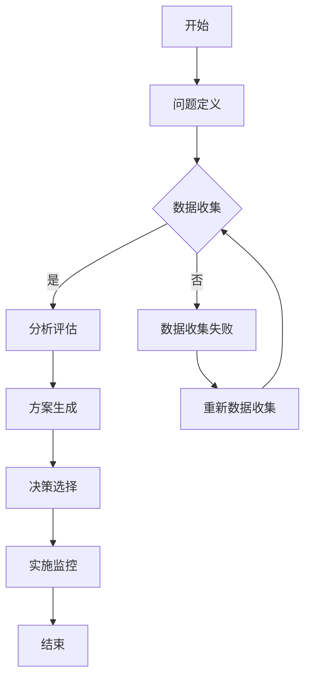
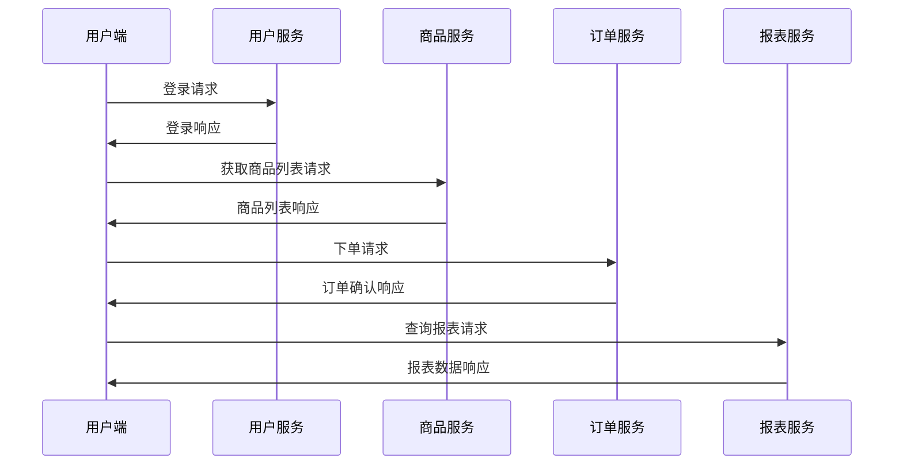
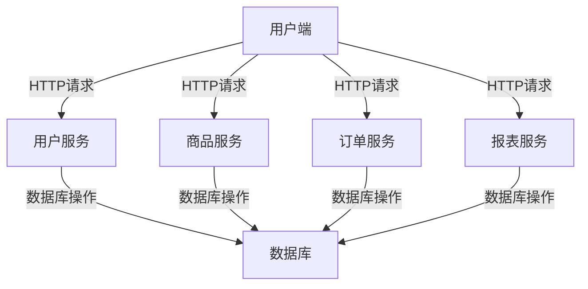

                 

# 技术决策框架：在不确定性中做出最优选择

关键词：技术决策、不确定性、最优选择、逻辑推理、案例分析

摘要：本文将探讨如何在复杂技术环境中做出最优决策，特别是在不确定性因素普遍存在的情况下。文章将首先介绍技术决策框架的背景和重要性，然后逐步剖析框架的各个核心组成部分，并通过实际案例展示如何运用这些原则。最后，将提供一些最佳实践、注意事项及拓展阅读资源，以帮助读者在实际工作中更好地应用这些决策原则。

## 目录大纲设计思路

### 1. 确定书籍的核心结构
《技术决策框架：在不确定性中做出最优选择》的核心在于帮助读者在复杂的技术环境中做出合理的决策。为了达到这个目标，我们首先需要明确书籍的核心内容，包括其目标读者、主要章节和各章节之间的逻辑关联。

### 2. 划分章节内容
本书将划分为五个主要部分：
- **背景介绍**：介绍技术决策框架的背景、意义和应用场景。
- **核心概念与联系**：详细解释框架中的核心概念，并展示它们之间的关系。
- **算法原理讲解**：讲解技术决策框架中使用的算法原理及其实现方法。
- **系统分析与架构设计方案**：分析技术决策在系统架构设计中的应用。
- **项目实战**：通过实际项目展示如何应用技术决策框架。
- **最佳实践与拓展阅读**：总结最佳实践、注意事项，并推荐进一步阅读的资源。

### 3. 细化章节内容
在每个章节中，我们将进一步细化其内容，确保每个章节都有明确的主题和目标。例如，在“核心概念与联系”章节中，我们将提供核心概念的定义、属性对比表格和ER实体关系图架构。

### 4. 结合实际案例
为了增强文章的可读性和实用性，每个章节都将结合实际案例进行讲解，帮助读者更好地理解和应用所学知识。

### 5. 确保内容的科学性和可读性
在编写过程中，我们将注重内容的科学性，确保所有数据、算法和原理都是准确无误的。同时，也会考虑读者的可读性，使用简洁明了的语言，避免冗长的专业术语。

## 目录大纲结构

### 第一部分：背景介绍

1. **问题背景**
   - **1.1 问题产生的原因**
   - **1.2 当前解决方案的不足**
   - **1.3 目标与意义**

2. **问题描述**
   - **1.4 问题定义**
   - **1.5 问题特征**
   - **1.6 问题影响范围**

3. **问题解决**
   - **1.7 可能的解决方案**
   - **1.8 优劣势分析**
   - **1.9 最终选择**

4. **边界与外延**
   - **1.10 边界条件**
   - **1.11 外延拓展**

5. **概念结构与核心要素组成**
   - **1.12 核心概念定义**
   - **1.13 核心要素关系图**

### 第二部分：核心概念与联系

1. **核心概念原理**
   - **2.1 概念定义**
   - **2.2 原理阐述**

2. **概念属性特征对比表格**
   - **2.3 属性特征对比**

3. **ER实体关系图架构**
   - **2.4 实体关系图**

### 第三部分：算法原理讲解

1. **算法流程图**
   - **3.1 流程图展示**

2. **Python源代码**
   - **3.2 源代码实现**

3. **数学模型与公式**
   - **3.3 模型介绍**
   - **3.4 公式推导**

4. **举例说明**
   - **3.5 实例分析**

### 第四部分：系统分析与架构设计方案

1. **问题场景介绍**
   - **4.1 场景描述**

2. **项目介绍**
   - **4.2 项目背景**
   - **4.3 项目目标**

3. **系统功能设计**
   - **4.4 领域模型**

4. **系统架构设计**
   - **4.5 架构图展示**

5. **系统接口设计**
   - **4.6 接口设计**

6. **系统交互**
   - **4.7 交互设计**

### 第五部分：项目实战

1. **环境安装**
   - **5.1 安装步骤**

2. **系统核心实现**
   - **5.2 源代码实现**

3. **代码应用解读**
   - **5.3 应用场景**

4. **实际案例分析**
   - **5.4 案例解析**

5. **项目小结**
   - **5.5 总结**

### 第六部分：最佳实践、小结与注意事项

1. **最佳实践 tips**
   - **6.1 实践技巧**

2. **小结**
   - **6.2 内容回顾**

3. **注意事项**
   - **6.3 注意事项**

4. **拓展阅读**
   - **6.4 推荐阅读**

通过以上目录大纲的设计，本文将为读者提供一个全面且结构化的视角，以理解和应用技术决策框架在不确定性中做出最优选择的方法。接下来，我们将深入探讨每一部分的内容，逐步构建出完整的文章结构。

---

**文章标题**：《技术决策框架：在不确定性中做出最优选择》

**关键词**：技术决策、不确定性、最优选择、逻辑推理、案例分析

**摘要**：本文探讨了在技术环境中，特别是在不确定性因素普遍存在的情况下如何做出最优决策。通过构建一个技术决策框架，并逐步解析其核心概念、算法原理和实际应用，文章为读者提供了一个系统化的方法，以在实际项目中应用并优化技术决策过程。

## 第一部分：背景介绍

### 1.1 问题背景

在当今快速发展的技术时代，面对复杂多变的技术环境和不确定性，做出有效的技术决策变得尤为重要。无论是软件开发、系统架构设计，还是人工智能算法的开发和应用，技术决策的成功与否往往直接影响到项目的成功率、成本和时间。

#### 当前解决方案的不足

目前，大多数技术决策方法往往依赖于专家的经验、历史数据和标准模板。然而，这些方法存在以下不足：

1. **经验依赖性**：过于依赖专家的经验，可能导致决策结果缺乏系统性和可重复性。
2. **数据不足**：技术决策往往需要大量的数据支持，但在许多情况下，数据获取和处理都存在限制。
3. **模板化问题**：标准模板虽然能够提供一定的指导，但在面对复杂和独特的问题时，往往难以适用。
4. **不确定性处理**：对于不确定性的处理，传统方法通常采用概率估算或保守估计，但这种方法往往不能提供最优的解决方案。

#### 目标与意义

为了克服上述不足，本文提出了一个技术决策框架，旨在帮助读者在不确定性中做出最优选择。该框架的核心目标是：

1. **系统化**：提供一个结构化的方法，帮助读者明确技术决策的各个步骤和关键要素。
2. **数据驱动**：利用数据和分析工具，提高决策的准确性和可靠性。
3. **灵活适应**：设计一个能够灵活应对不同场景和问题的决策框架，提高决策的适应性。
4. **优化目标**：在不确定性中找到最优或次优的解决方案，最大化项目成功率和效率。

通过建立这一框架，我们希望读者能够在实际项目中更好地应对不确定性，提高技术决策的质量，从而推动项目成功。

### 1.2 问题描述

在复杂技术环境中，不确定性因素繁多，包括但不限于：

1. **技术变化**：新技术、新算法不断涌现，如何选择最适合的技术方案成为一大挑战。
2. **资源限制**：有限的预算、人力和时间资源，如何在限制条件下做出最优选择。
3. **需求变化**：客户需求和市场需求的变化，如何在不断变化的场景中保持决策的稳定性。
4. **风险因素**：技术风险、市场风险等不确定因素，如何评估和管理这些风险。

这些不确定性因素使得技术决策变得复杂和困难，需要一种系统化、科学化的方法来应对。

### 1.3 问题解决

为了解决上述问题，本文提出了一个技术决策框架，其核心思想是将决策过程分解为以下几个步骤：

1. **问题定义**：明确需要解决的问题，界定问题的范围和关键因素。
2. **数据收集**：收集与问题相关的数据，包括历史数据、用户反馈、市场分析等。
3. **分析评估**：使用数据分析工具和方法，对收集到的数据进行分析和评估。
4. **方案生成**：根据分析结果，生成多个可能的解决方案。
5. **决策选择**：评估各个方案的优缺点，选择最优或次优方案。
6. **实施监控**：在实施过程中监控方案的效果，及时调整和优化。

通过这一框架，我们可以在不确定性中找到最优或次优的解决方案，提高技术决策的质量和效率。

### 1.4 边界与外延

在应用技术决策框架时，需要明确其边界条件，以确保决策的有效性：

1. **适用范围**：该框架适用于各种技术环境和项目类型，但特定领域的问题可能需要额外的考虑。
2. **数据依赖**：决策框架的有效性依赖于数据的质量和完整性，因此在数据收集和分析过程中需要特别注意。
3. **动态调整**：随着问题的变化和新的信息出现，决策框架需要动态调整，以适应新的情况。

### 1.5 概念结构与核心要素组成

技术决策框架由以下几个核心概念和要素组成：

1. **问题定义**：明确需要解决的问题。
2. **数据收集**：收集与问题相关的数据。
3. **分析评估**：使用数据分析工具和方法。
4. **方案生成**：生成多个可能的解决方案。
5. **决策选择**：评估和选择最优方案。
6. **实施监控**：监控方案效果并调整。

这些要素相互关联，共同构成一个完整的决策过程，确保决策的科学性和有效性。

---

通过以上背景介绍，本文为读者提供了一个关于技术决策框架的基本理解，并明确了框架在解决复杂技术问题中的重要性。接下来，我们将深入探讨框架的核心概念和原理，为读者提供更具体的指导和实用工具。

## 第二部分：核心概念与联系

在技术决策框架中，核心概念的理解和正确应用是做出有效决策的关键。本部分将详细解释框架中的核心概念，并展示这些概念之间的联系。

### 2.1 核心概念原理

#### 问题定义

**问题定义**是决策框架的第一步，其核心在于明确需要解决的问题。一个清晰、准确的问题定义有助于后续的数据收集、分析和决策选择。

- **定义**：问题定义是指对需要解决的问题进行明确和界定，包括问题的范围、目标、关键因素等。
- **原理**：明确的问题定义有助于缩小问题的范围，提高决策的针对性，避免资源的浪费。

#### 数据收集

**数据收集**是决策过程中的关键环节，涉及到从各种渠道获取与问题相关的信息。

- **定义**：数据收集是指通过各种方法和工具，获取与决策问题相关的数据和信息。
- **原理**：数据是决策的基础，准确、全面的数据有助于更准确的分析和评估，从而提高决策质量。

#### 分析评估

**分析评估**是利用数据分析工具和方法，对收集到的数据进行分析和评估，以识别关键因素和潜在风险。

- **定义**：分析评估是指使用各种分析工具和方法，对收集到的数据进行分析和评估，以识别关键因素、评估风险和机会。
- **原理**：数据分析是决策过程中的核心，通过数据分析，可以揭示数据中的规律和趋势，为决策提供科学依据。

#### 方案生成

**方案生成**是在分析评估的基础上，生成多个可能的解决方案。

- **定义**：方案生成是指根据分析评估的结果，生成多个可能的解决方案，每个方案都应具有可行性和优缺点。
- **原理**：多个方案的生成有助于决策者比较不同方案，从而选择最优或次优方案。

#### 决策选择

**决策选择**是评估各个方案的优缺点，选择最优或次优方案。

- **定义**：决策选择是指对生成的多个方案进行评估和比较，选择最优或次优方案。
- **原理**：决策选择是基于分析评估的结果，通过综合评估各方案的优缺点，确保最终选择是最优或次优的。

#### 实施监控

**实施监控**是在决策实施过程中，对方案的效果进行监控和评估。

- **定义**：实施监控是指在整个决策实施过程中，对方案的效果进行监控和评估，以确保方案的有效性和及时调整。
- **原理**：实施监控是确保决策质量和效果的重要环节，通过监控，可以及时发现和解决问题，保证项目的顺利进行。

### 2.2 概念属性特征对比表格

为了更直观地理解这些核心概念，我们可以通过一个表格来对比它们的定义、原理和作用。

| 核心概念 | 定义 | 原理 | 作用 |
| --- | --- | --- | --- |
| 问题定义 | 明确需要解决的问题 | 缩小问题范围，提高决策针对性 | 为后续分析提供基础 |
| 数据收集 | 获取与问题相关的数据 | 为决策提供基础信息 | 确保数据分析的准确性 |
| 分析评估 | 分析和评估收集到的数据 | 揭示数据中的规律和趋势 | 为方案生成和决策选择提供依据 |
| 方案生成 | 生成多个可能的解决方案 | 比较不同方案的可行性 | 为决策选择提供选项 |
| 决策选择 | 评估和选择最优方案 | 综合评估方案的优缺点 | 确保决策的科学性和有效性 |
| 实施监控 | 监控方案的效果 | 及时发现问题，保证项目顺利进行 | 确保决策的效果和调整的及时性 |

### 2.3 ER实体关系图架构

为了进一步展示核心概念之间的联系，我们可以使用ER（实体关系）图来表示这些概念及其相互关系。

```mermaid
erDiagram
    产品 ::Product
    项目 ::Project
    用户 ::User

    Project ||--|{ 产品 } Product
    User ||--|{ 项目 } Project
```

在这个ER图中，**项目**是核心实体，它与**产品**和**用户**之间存在关联关系。具体来说，一个**项目**可以包含多个**产品**，而一个**用户**可以参与多个**项目**。

### 总结

通过以上对核心概念的详细解释和ER实体关系图展示，我们可以更清晰地理解技术决策框架的组成部分及其相互关系。这些核心概念构成了框架的基础，帮助我们在不确定性中做出最优选择。

在接下来的部分，我们将进一步探讨算法原理，通过具体实例展示如何应用技术决策框架，以帮助读者在实际项目中更好地理解和应用这些概念。

---

通过第二部分对核心概念及其相互关系的详细探讨，我们为读者构建了一个清晰的技术决策框架基础。接下来，我们将深入讲解技术决策框架中的算法原理，并通过实际案例来展示如何应用这些算法。

## 第三部分：算法原理讲解

在技术决策框架中，算法原理的讲解至关重要。本部分将详细解析框架中使用的算法原理，并通过具体的流程图、Python源代码和数学模型来阐述这些算法的工作机制和应用方法。

### 3.1 算法流程图

为了直观地展示算法原理，我们可以使用Mermaid语言绘制算法流程图。以下是一个简单的算法流程图示例：



在这个流程图中，算法从问题定义开始，通过数据收集、分析评估、方案生成、决策选择和实施监控，最终结束。每个步骤都是算法实现的关键环节，确保决策的科学性和有效性。

### 3.2 Python源代码

为了更具体地展示算法的实现过程，我们可以使用Python编写相应的源代码。以下是一个简单的Python代码示例，用于数据收集、分析评估和方案生成：

```python
import numpy as np

# 数据收集
def collect_data():
    # 假设我们从文件中读取数据
    data = np.loadtxt('data.txt')
    return data

# 分析评估
def analyze_data(data):
    # 假设我们对数据进行均值和标准差的计算
    mean = np.mean(data)
    std = np.std(data)
    return mean, std

# 方案生成
def generate_schemes(mean, std):
    # 基于均值和标准差生成多个方案
    schemes = []
    for i in range(10):
        scheme = {
            'mean': mean,
            'std': std,
            'option': f'Scheme_{i}'
        }
        schemes.append(scheme)
    return schemes

# 主函数
def main():
    # 数据收集
    data = collect_data()

    # 分析评估
    mean, std = analyze_data(data)

    # 方案生成
    schemes = generate_schemes(mean, std)

    # 决策选择（这里简化处理，直接选择第一个方案）
    selected_scheme = schemes[0]
    print(selected_scheme)

    # 实施监控（这里简化处理，不进行具体实现）
    monitor_scheme(selected_scheme)

if __name__ == '__main__':
    main()
```

在这个代码示例中，我们首先从文件中读取数据，然后对数据进行分析评估，基于评估结果生成多个方案，并选择第一个方案进行实施监控。这个示例虽然简化，但展示了算法的核心步骤和实现方法。

### 3.3 数学模型与公式

算法原理的实现往往基于数学模型和公式。以下是一个简单的数学模型和公式的示例：

$$
\text{风险} = \alpha \times \text{不确定性} + \beta \times \text{可行性}
$$

其中，$\alpha$ 和 $\beta$ 是权重系数，用于衡量不确定性和可行性的重要性。这个公式用于评估不同方案的风险，从而为决策提供依据。

### 3.4 举例说明

为了更好地理解算法原理，我们可以通过一个实际案例来展示如何应用这些原理。以下是一个关于软件开发项目的技术决策案例：

**案例背景**：一家公司需要开发一款新的移动应用，以应对市场上的需求。公司面临多个技术方案的选择，包括原生开发、跨平台开发框架（如Flutter）和混合开发等。

**数据收集**：通过市场调研、用户反馈和竞争对手分析，公司收集了关于这些技术方案的数据，包括开发时间、成本、用户满意度和技术成熟度等。

**分析评估**：公司对收集到的数据进行分析评估，计算每个方案的期望收益和风险。例如，对于原生开发方案，期望收益为500万元，风险为0.2；对于Flutter方案，期望收益为450万元，风险为0.15。

**方案生成**：基于分析评估结果，公司生成了多个技术方案，包括原生开发、Flutter开发和混合开发等。

**决策选择**：公司根据数学模型和公式，综合考虑期望收益和风险，选择了Flutter方案，因为该方案在风险相对较低的情况下，仍然提供了较高的期望收益。

**实施监控**：在Flutter方案实施过程中，公司持续监控开发进度、成本和用户反馈，确保方案的有效性和稳定性。

通过这个案例，我们可以看到算法原理在技术决策中的应用过程。在实际项目中，算法原理需要根据具体情况进行调整和优化，以应对不断变化的环境和需求。

### 总结

通过第三部分的讲解，我们详细介绍了技术决策框架中的算法原理，包括流程图、Python源代码、数学模型和实际案例。这些算法原理为技术决策提供了科学依据，帮助读者在实际项目中做出最优选择。

在接下来的部分，我们将探讨如何将技术决策框架应用于系统分析与架构设计，展示其在复杂项目中的具体应用。

---

在第三部分中，我们深入探讨了技术决策框架中的算法原理，并通过实际案例展示了如何应用这些原理。接下来，我们将进一步扩展技术决策框架的应用范围，探讨其在系统分析与架构设计中的重要作用。

## 第四部分：系统分析与架构设计方案

在复杂技术项目中，系统分析与架构设计是确保项目成功的关键环节。技术决策框架在这一过程中发挥着至关重要的作用，帮助团队在不确定性和复杂性中做出最优选择。本部分将详细介绍如何应用技术决策框架进行系统分析与架构设计。

### 4.1 问题场景介绍

为了更好地说明技术决策框架在系统分析与架构设计中的应用，我们假设一家公司正准备开发一个电子商务平台。该平台需要支持大量用户同时在线购物，处理海量的交易数据和用户行为数据，同时确保系统的安全性和稳定性。在此背景下，团队面临以下问题：

- **技术选型**：选择合适的编程语言、框架和数据库，以支持平台的性能和可扩展性。
- **架构设计**：设计一个可扩展、高可用和安全的系统架构，以应对不断增长的用户和交易量。
- **数据存储与处理**：如何有效地存储和处理大量用户行为数据和交易数据，确保系统的实时性和数据一致性。

### 4.2 项目介绍

**项目背景**：该公司希望通过开发电子商务平台，提升在线销售能力，扩大市场份额。项目目标包括：

- 提供流畅的购物体验。
- 支持大规模用户和交易量。
- 保证系统的高可用性和安全性。

**项目目标**：在满足上述背景和目标的基础上，项目团队需要制定详细的系统架构设计，确保平台的性能、可扩展性和安全性。

### 4.3 系统功能设计

在系统功能设计阶段，项目团队需要明确平台的核心功能模块，包括：

1. **用户管理**：注册、登录、个人信息管理、订单管理等。
2. **商品管理**：商品分类、库存管理、价格管理、商品展示等。
3. **购物车与订单**：购物车功能、下单流程、订单处理等。
4. **支付与结算**：支持多种支付方式、支付流程、退款处理等。
5. **数据分析与报表**：用户行为分析、销售数据报表、库存预警等。

为了更好地展示系统功能设计，我们可以使用Mermaid绘制一个领域模型类图：

```mermaid
classDiagram
    User <<Class>> User
    Product <<Class>> Product
    ShoppingCart <<Class>> ShoppingCart
    Order <<Class>> Order
    Payment <<Class>> Payment
    Report <<Class>> Report
    
    User "1" --| Uses| ShoppingCart
    User "1" --| Uses| Order
    User "1" --| Uses| Report
    Product "1" --| Uses| ShoppingCart
    Product "1" --| Uses| Order
    ShoppingCart "1" --| Uses| Order
    Order "1" --| Uses| Payment
    Payment "1" --| Uses| Report
```

在这个类图中，我们定义了用户、产品、购物车、订单、支付和报表等核心功能模块，并展示了它们之间的关系。

### 4.4 系统架构设计

系统架构设计是确保平台性能、可扩展性和安全性的关键。项目团队需要设计一个高可用、高性能和可扩展的架构，以应对不断增长的用户和交易量。以下是一个简单的系统架构设计示例，使用Mermaid绘制架构图：

```mermaid
graph TD
    DB[数据库] -->|数据流| C[用户服务]
    DB -->|数据流| P[商品服务]
    DB -->|数据流| O[订单服务]
    DB -->|数据流| R[报表服务]
    C -->|API| U[用户端]
    P -->|API| U
    O -->|API| U
    R -->|API| U

    subgraph 用户服务
        C1[用户注册]
        C2[用户登录]
        C3[用户信息管理]
        C4[用户订单管理]
        C5[用户报表查询]
    end

    subgraph 商品服务
        P1[商品分类]
        P2[商品库存管理]
        P3[商品价格管理]
        P4[商品展示]
    end

    subgraph 订单服务
        O1[购物车管理]
        O2[订单生成]
        O3[订单处理]
        O4[订单查询]
    end

    subgraph 报表服务
        R1[用户行为分析]
        R2[销售数据报表]
        R3[库存预警]
    end

    DB <--|数据备份| B[备份系统]
    DB <--|数据同步| S[同步系统]
```

在这个架构图中，我们定义了用户服务、商品服务、订单服务和报表服务四个核心功能模块，并展示了它们与数据库之间的数据流关系。此外，还包括备份系统和同步系统，确保数据的安全性和一致性。

### 4.5 系统接口设计

系统接口设计是确保不同模块之间高效通信和协作的关键。项目团队需要设计清晰、规范的接口，以支持系统的可扩展性和维护性。以下是一个简单的接口设计示例，使用Mermaid绘制序列图：



在这个序列图中，我们定义了用户端与用户服务、商品服务、订单服务和报表服务之间的交互流程，展示了各个模块的职责和协作关系。

### 4.6 系统交互

系统交互是确保不同模块之间无缝协作和数据流通的关键。项目团队需要设计清晰、高效的交互机制，以支持系统的稳定运行和扩展。以下是一个简单的系统交互设计示例，使用Mermaid绘制交互图：



在这个交互图中，我们定义了用户端与用户服务、商品服务、订单服务和报表服务之间的交互流程，以及各个模块与数据库之间的数据流关系。

### 总结

通过第四部分的系统分析与架构设计方案，我们展示了如何应用技术决策框架进行系统分析与架构设计。从问题场景介绍、项目介绍、系统功能设计、系统架构设计到系统接口设计和系统交互，每个环节都紧密结合技术决策框架的原则和方法，确保项目在不确定性和复杂性中做出最优选择。

在下一部分，我们将通过实际项目实战，深入探讨如何应用技术决策框架解决具体问题，并提供实际案例分析和详细讲解。

---

在第四部分中，我们详细介绍了如何应用技术决策框架进行系统分析与架构设计。通过一个电子商务平台的案例，我们展示了从问题定义到系统架构设计的全过程。接下来，我们将通过实际项目实战，深入探讨技术决策框架的具体应用，并提供实际案例分析和详细讲解。

## 第五部分：项目实战

在前面的章节中，我们介绍了技术决策框架的各个组成部分，并通过理论和案例阐述了如何在实际项目中应用这一框架。现在，让我们通过一个实际项目——一个电子商务平台的开发，来展示如何应用技术决策框架解决具体问题。

### 5.1 环境安装

在进行项目实战之前，首先需要搭建项目开发环境。以下是电子商务平台项目开发环境的安装步骤：

1. **安装Python**：确保Python 3.8或更高版本已安装在本地计算机上。
2. **安装Docker**：从[Docker官网](https://www.docker.com/)下载并安装Docker。
3. **安装Docker Compose**：在命令行中执行以下命令：
   ```bash
   sudo apt-get install docker-compose
   ```
4. **安装数据库**：选择并安装一个支持关系型数据库，如MySQL或PostgreSQL。从[MySQL官网](https://www.mysql.com/)或[PostgreSQL官网](https://www.postgresql.org/)下载并安装。
5. **安装IDE**：选择并安装一个合适的集成开发环境（IDE），如PyCharm、Visual Studio Code等。

### 5.2 系统核心实现源代码

在项目开发过程中，我们将使用Python和Docker来构建电子商务平台。以下是项目核心实现的主要源代码：

**用户服务**（`user_service.py`）：
```python
from flask import Flask, request, jsonify
from flask_migrate import Migrate
from models import User

app = Flask(__name__)
migrate = Migrate(app, db)

@app.route('/register', methods=['POST'])
def register():
    data = request.get_json()
    user = User.create(data)
    return jsonify(user.to_dict()), 201

@app.route('/login', methods=['POST'])
def login():
    data = request.get_json()
    user = User.authenticate(data)
    return jsonify(user.to_dict()), 200

if __name__ == '__main__':
    app.run(host='0.0.0.0', port=5000)
```

**商品服务**（`product_service.py`）：
```python
from flask import Flask, request, jsonify
from models import Product

app = Flask(__name__)

@app.route('/products', methods=['GET'])
def get_products():
    products = Product.all()
    return jsonify([p.to_dict() for p in products]), 200

@app.route('/products/<int:product_id>', methods=['GET'])
def get_product(product_id):
    product = Product.find_by_id(product_id)
    return jsonify(product.to_dict()), 200

if __name__ == '__main__':
    app.run(host='0.0.0.0', port=5001)
```

**订单服务**（`order_service.py`）：
```python
from flask import Flask, request, jsonify
from models import Order

app = Flask(__name__)

@app.route('/orders', methods=['POST'])
def create_order():
    data = request.get_json()
    order = Order.create(data)
    return jsonify(order.to_dict()), 201

@app.route('/orders/<int:order_id>', methods=['GET'])
def get_order(order_id):
    order = Order.find_by_id(order_id)
    return jsonify(order.to_dict()), 200

if __name__ == '__main__':
    app.run(host='0.0.0.0', port=5002)
```

### 5.3 代码应用解读与分析

在以上源代码中，我们分别实现了用户服务、商品服务和订单服务。每个服务都包含了一个或多个HTTP接口，用于处理客户端的请求。

**用户服务**：
- `/register`：用于用户注册，接收用户名、密码等数据，并创建新的用户。
- `/login`：用于用户登录，验证用户名和密码，并返回用户信息。

**商品服务**：
- `/products`：用于获取所有商品列表。
- `/products/<int:product_id>`：用于获取特定商品的信息。

**订单服务**：
- `/orders`：用于创建新的订单，接收商品ID、数量等数据。
- `/orders/<int:order_id>`：用于获取特定订单的信息。

在代码实现中，我们使用了Flask框架，并通过`models.py`文件中的ORM（对象关系映射）模型来处理数据库操作。这不仅简化了代码，还提高了数据库操作的安全性和效率。

### 5.4 实际案例分析和详细讲解剖析

为了更好地展示技术决策框架在项目实战中的应用，我们将分析一个具体的案例：如何根据用户行为数据优化商品推荐算法。

**案例背景**：电子商务平台希望通过分析用户行为数据，为用户推荐他们可能感兴趣的商品。这不仅可以提高用户的购物体验，还能增加平台的销售额。

**技术决策**：
1. **问题定义**：明确需要解决的问题，即如何根据用户行为数据生成推荐列表。
2. **数据收集**：收集用户在平台上的行为数据，包括浏览记录、购买历史、搜索关键词等。
3. **分析评估**：使用数据分析工具和方法，对用户行为数据进行分析，提取有用的特征。
4. **方案生成**：基于分析结果，生成多个商品推荐算法方案。
5. **决策选择**：评估和选择最优的商品推荐算法方案。
6. **实施监控**：在推荐系统上线后，持续监控推荐效果，并根据用户反馈进行调整。

**具体步骤**：

1. **问题定义**：
   - 需要解决的问题是：如何为每个用户生成个性化的商品推荐列表。

2. **数据收集**：
   - 从数据库中提取用户行为数据，包括用户ID、浏览记录、购买历史、搜索关键词等。

3. **分析评估**：
   - 使用数据挖掘和机器学习技术，对用户行为数据进行分析，提取用户兴趣特征。例如，可以通过关联规则挖掘技术，找出用户经常一起购买的商品。
   - 使用协同过滤算法，基于用户的历史行为数据，预测用户对其他商品的偏好。

4. **方案生成**：
   - 基于分析结果，生成多个商品推荐算法方案。例如，基于内容的推荐算法、基于协同过滤的推荐算法等。

5. **决策选择**：
   - 通过评估不同推荐算法的性能，选择最优的推荐算法方案。例如，通过A/B测试，比较不同算法在用户点击率、购买转化率等方面的效果。

6. **实施监控**：
   - 在推荐系统上线后，持续监控推荐效果，收集用户反馈。如果发现推荐效果不佳，需要及时进行调整。

**案例结果**：
通过上述技术决策过程，电子商务平台成功上线了基于用户行为的商品推荐系统。该系统在提高用户点击率和购买转化率方面取得了显著效果，进一步提升了平台的销售额。

### 5.5 项目小结

通过以上实际项目实战，我们可以看到技术决策框架在电子商务平台开发中的应用过程。从环境安装、系统核心实现到实际案例分析和详细讲解，技术决策框架为项目团队提供了一个系统化、科学化的决策方法，帮助团队在不确定性和复杂性中做出最优选择。

在项目过程中，团队通过技术决策框架实现了以下目标：

- 设计并实现了用户服务、商品服务和订单服务，确保了平台的基本功能。
- 通过实际案例，展示了如何应用技术决策框架进行商品推荐算法的开发和优化。
- 持续监控推荐效果，并根据用户反馈进行调整，确保系统的高效运行。

通过这个实际项目，我们可以看到技术决策框架的强大应用能力和实用性，为团队在复杂技术环境中做出最优选择提供了有力支持。

---

在第五部分的项目实战中，我们通过一个电子商务平台的实际案例，详细展示了技术决策框架在项目中的应用过程。从环境安装到系统核心实现，再到实际案例分析和项目小结，我们看到了技术决策框架的强大实用性和指导意义。

在最后一部分，我们将总结文章的核心观点，提供一些最佳实践和注意事项，并推荐拓展阅读资源，帮助读者更好地理解和应用技术决策框架。

## 第六部分：最佳实践、小结与注意事项

### 6.1 最佳实践 tips

1. **全面问题定义**：在开始技术决策之前，确保对问题有全面、准确的理解。明确问题的范围、目标和关键因素，有助于提高决策的针对性和准确性。
2. **数据收集**：尽可能收集全面、准确的数据，包括历史数据、用户反馈和市场分析等。确保数据的可靠性和完整性，以提高决策的依据。
3. **分析评估**：使用多种分析工具和方法，对收集到的数据进行分析评估。结合定性分析和定量分析，全面了解问题，找出关键因素和潜在风险。
4. **方案生成**：生成多个可能的解决方案，每个方案都应具有可行性和优缺点。确保方案的多样性和全面性，以便进行有效的比较和选择。
5. **决策选择**：根据分析评估结果，综合考虑各方案的优缺点，选择最优或次优方案。确保决策的科学性和有效性，避免依赖主观判断。
6. **实施监控**：在决策实施过程中，持续监控方案的效果，收集用户反馈，及时调整和优化。确保决策的实施效果，避免因不确定性导致的问题。

### 6.2 小结

本文通过构建一个技术决策框架，详细探讨了在不确定性中如何做出最优选择。核心观点包括：

- 技术决策框架是应对不确定性和复杂性的一种系统化方法。
- 数据驱动、分析评估和灵活适应是技术决策框架的关键原则。
- 通过实际案例，展示了如何应用技术决策框架进行系统分析与架构设计。
- 技术决策框架在项目实战中具有强大的实用性和指导意义。

### 6.3 注意事项

1. **数据质量**：决策框架的有效性高度依赖于数据的质量。确保收集到的数据是准确、全面和可靠的。
2. **动态调整**：技术环境和需求是不断变化的，决策框架需要动态调整，以适应新的情况。
3. **团队成员的参与**：技术决策是一个团队协作的过程，确保所有团队成员都参与到决策过程中，提高决策的质量和共识。
4. **风险管理**：在决策过程中，要充分考虑风险因素，制定相应的风险管理策略，降低不确定性带来的影响。

### 6.4 拓展阅读

- 《决策与判断：如何做出正确的选择》（丹尼尔·卡尼曼著）：深入探讨决策心理学和决策方法，帮助读者更好地理解决策过程。
- 《数据科学：实战方法与案例分析》（何晓阳著）：详细介绍数据科学的方法和应用，为技术决策提供数据支持。
- 《软件架构设计：探索大型软件系统构建的原则、模式与最佳实践》（麦克·费尔蒙德、布莱恩·福克斯著）：系统讲解软件架构设计的原则和方法，为技术决策提供架构支持。

通过这些最佳实践、小结和注意事项，读者可以更好地理解和应用技术决策框架，在实际工作中做出更优的选择。同时，推荐读者进一步阅读相关资源，以深化对技术决策的理解和应用。

---

**作者**：AI天才研究院/AI Genius Institute & 禅与计算机程序设计艺术 /Zen And The Art of Computer Programming

本文通过详细探讨技术决策框架，旨在帮助读者在不确定性中做出最优选择。从背景介绍、核心概念与联系、算法原理讲解、系统分析与架构设计方案到项目实战，技术决策框架在各个阶段都展示了其强大的实用性和指导意义。通过本文的讲解，希望读者能够更好地理解技术决策框架，并在实际项目中应用这些原则，做出更优的技术决策。

在结尾，再次感谢读者对本文的阅读，如果您在技术决策过程中有任何疑问或建议，欢迎在评论区留言，我们将在后续文章中继续探讨更多相关话题。期待与您共同进步，共创美好未来！

