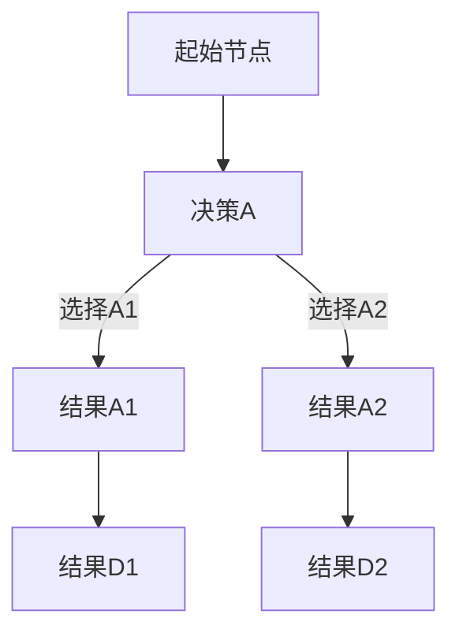

                 

### 《技术决策：在不确定中做出最佳选择》

> 关键词：技术决策、不确定性、风险评估、决策模型、团队协作、伦理问题

> 摘要：本文将深入探讨技术决策在不确定环境中的挑战与机遇，通过逐步分析技术评估、风险评估、决策模型与优化策略、团队协作与管理、以及道德与伦理问题，帮助读者理解如何在复杂多变的环境中做出最佳技术选择。文章结合实际案例分析，提供实践指导，旨在提升技术决策的能力与效率。

### 第一部分：问题背景与核心概念

#### 第1章：技术决策的挑战与机遇

##### 1.1 问题背景

在当今快速发展的科技时代，技术决策的重要性日益凸显。然而，技术决策面临着诸多挑战与机遇：

###### 1.1.1 时代的变化与不确定性

随着信息技术、人工智能、物联网等技术的迅猛发展，市场环境和技术趋势瞬息万变。这种变化带来的不确定性增加了技术决策的复杂性。

###### 1.1.2 技术进步带来的挑战

技术的进步虽然为业务提供了更多的可能性，但同时也带来了更高的要求。如何在众多的技术选项中做出最佳选择成为一大难题。

###### 1.1.3 决策中的不确定性因素

技术决策过程中存在诸多不确定性因素，包括市场需求、技术成熟度、成本预算、团队技能等。这些不确定性使得技术决策更具挑战性。

##### 1.2 技术决策的定义与重要性

###### 1.2.1 技术决策的定义

技术决策是指企业在技术选择、应用和优化过程中的决策活动。它涉及到技术评估、风险评估、决策模型等多个方面。

###### 1.2.2 技术决策的重要性

技术决策是企业成功的关键之一。正确的技术决策可以提高业务效率、降低成本、提升用户体验，从而在竞争激烈的市场中占据有利地位。

###### 1.2.3 技术决策与风险管理

技术决策不仅仅是选择技术，更是对风险的管理。通过科学的技术评估和风险评估，企业可以降低技术决策过程中的风险。

##### 1.3 核心概念与联系

###### 1.3.1 技术评估指标

技术评估指标是衡量技术选择是否合理的重要依据。常见的评估指标包括技术成熟度、成本效益、安全性等。

###### 1.3.1.1 技术成熟度评估

技术成熟度评估是判断技术是否适用于当前业务需求的重要步骤。常用的评估模型有Gartner技术成熟度曲线和TRL模型。

###### 1.3.1.2 成本效益分析

成本效益分析是评估技术选择的经济合理性。它通过比较不同技术方案的成本和效益，帮助企业做出经济有效的决策。

###### 1.3.2 决策模型与方法

决策模型是辅助技术决策的重要工具。常见的决策模型包括风险评估模型和决策树模型。

###### 1.3.2.1 风险评估模型

风险评估模型用于识别和评估技术决策过程中的潜在风险。它通过定量和定性分析，帮助企业制定风险应对策略。

###### 1.3.2.2 决策树模型

决策树模型是一种直观的决策分析工具，它通过树状结构展示不同决策路径及其结果，帮助企业做出最优选择。

###### 1.3.3 决策流程

决策流程是指技术决策的实施步骤。一个完整的决策流程通常包括需求分析、方案评估、决策制定和决策执行等环节。

##### 1.4 技术决策与业务目标

###### 1.4.1 业务目标对技术决策的影响

业务目标直接影响到技术决策的方向和策略。明确业务目标有助于企业更好地选择和优化技术。

###### 1.4.2 如何平衡短期与长期利益

在技术决策过程中，需要平衡短期利益和长期利益。短期决策可能会带来快速的效益，但长期决策则更注重企业的持续发展和竞争力。

###### 1.4.3 技术决策与战略规划

技术决策是企业战略规划的重要组成部分。通过战略规划，企业可以明确技术发展方向，指导技术决策的实施。

##### 1.5 本章小结

本章介绍了技术决策的背景、定义与重要性，以及相关的核心概念和联系。通过理解这些内容，读者可以为后续章节的学习打下坚实的基础。

### 第二部分：技术决策方法与实践

#### 第2章：技术评估与风险评估

##### 2.1 技术评估方法

技术评估是技术决策的重要环节，它帮助企业在众多技术方案中找到最适合的方案。以下是几种常用的技术评估方法：

###### 2.1.1 成熟度评估模型

成熟度评估模型用于评估技术方案的成熟度，判断其是否适合当前应用。常见的成熟度评估模型包括Gartner技术成熟度曲线和TRL模型。

###### 2.1.1.1 Gartner技术成熟度曲线

Gartner技术成熟度曲线是一种广泛使用的评估模型，它将技术成熟度分为五个阶段：新兴、早期采纳、成长、成熟和衰退。通过这个模型，企业可以判断技术是否已经发展到适合应用的阶段。

###### 2.1.1.2 TRL（技术 readiness level）模型

TRL模型是美国国防部的技术成熟度评估标准，它将技术成熟度分为九个等级，从0级（概念形成）到9级（全面部署）。这个模型为企业提供了更详细的技术评估框架。

###### 2.1.2 成本效益分析

成本效益分析是评估技术方案经济合理性的重要方法。它通过比较不同技术方案的成本和效益，帮助企业选择最具经济性的方案。

###### 2.1.2.1 成本效益分析框架

成本效益分析框架包括以下几个步骤：

1. 确定评估目标：明确评估的技术方案和评估目标。
2. 收集成本数据：收集不同技术方案的实施成本、运营成本和潜在收益。
3. 计算成本和效益：根据收集的数据，计算不同技术方案的总成本和总效益。
4. 比较和选择：比较不同技术方案的成本效益，选择最具优势的方案。

###### 2.1.2.2 成本效益分析的案例分析

以下是一个成本效益分析的案例：

假设企业需要选择一种数据分析工具，有三种方案可供选择：方案A、方案B和方案C。

- 方案A：实施成本为50万元，运营成本为每年10万元，预计可以节省运营成本30万元。
- 方案B：实施成本为70万元，运营成本为每年8万元，预计可以节省运营成本20万元。
- 方案C：实施成本为100万元，运营成本为每年5万元，预计可以节省运营成本40万元。

通过计算，可以得出以下成本效益分析结果：

| 方案 | 实施成本（万元） | 运营成本（万元/年） | 预计节省运营成本（万元） | 总成本（万元） | 总效益（万元） |
| --- | --- | --- | --- | --- | --- |
| A | 50 | 10 | 30 | 160 | 90 |
| B | 70 | 8 | 20 | 148 | 72 |
| C | 100 | 5 | 40 | 145 | 95 |

从上表可以看出，方案C的总成本最低，且总效益最高，因此选择方案C。

##### 2.2 风险评估方法

风险评估是技术决策中不可或缺的环节。通过风险评估，企业可以识别潜在的风险，并制定相应的应对措施，以降低风险对项目的影响。

###### 2.2.1 风险识别

风险识别是风险评估的第一步，旨在识别项目过程中可能出现的风险。常见的风险识别方法包括SWOT分析和识别技术风险。

###### 2.2.1.1 SWOT分析

SWOT分析是一种常用的风险识别方法，它通过分析项目的优势（Strengths）、劣势（Weaknesses）、机会（Opportunities）和威胁（Threats），帮助项目团队识别潜在的风险。

###### 2.2.1.2 识别技术风险

在技术决策过程中，技术风险是不可避免的因素。识别技术风险的方法包括：

1. 调查历史项目：通过分析以往项目的技术风险，预测当前项目可能遇到的风险。
2. 专家咨询：邀请行业专家对技术方案进行评估，识别潜在的技术风险。

###### 2.2.2 风险评估

风险评估是对识别出的风险进行定量和定性分析，以评估风险的影响程度和概率。常见的风险评估方法包括风险评估指标和风险评估模型。

###### 2.2.2.1 风险评估指标

风险评估指标是衡量风险影响程度和概率的重要工具。常见的影响程度指标包括风险严重程度、风险发生概率等。通过设定合理的风险评估指标，项目团队可以更准确地评估风险。

###### 2.2.2.2 风险评估模型

风险评估模型是用于评估风险的量化工具。常见的风险评估模型包括决策树模型、蒙特卡罗模型等。通过这些模型，项目团队可以更系统地评估风险。

###### 2.2.3 风险应对

风险应对是指针对评估出的风险，制定相应的应对措施，以降低风险对项目的影响。常见的风险应对策略包括风险减轻和风险转移。

###### 2.2.3.1 风险减轻

风险减轻是指通过采取预防措施，降低风险的影响程度和概率。常见的风险减轻策略包括：

1. 改进技术方案：通过优化技术方案，降低技术风险。
2. 增加预算和时间：为应对潜在的风险，增加项目的预算和时间。

###### 2.2.3.2 风险转移

风险转移是指将风险转移给其他方，以降低项目团队的风险承担。常见的风险转移策略包括：

1. 转包：将部分项目工作转包给其他公司，降低项目的技术风险。
2. 保险：通过购买保险，将风险转移给保险公司。

##### 2.3 实际案例分析

以下是一个实际案例，展示如何进行技术评估和风险评估。

###### 2.3.1 案例一：某企业数字化转型决策

某企业计划进行数字化转型，以提高业务效率和市场竞争力。在决策过程中，企业需要评估不同技术方案的成本效益和风险。

1. 技术评估：

- 成熟度评估：通过Gartner技术成熟度曲线，评估不同技术方案的成熟度。发现大数据分析和人工智能技术已经发展到成熟阶段，适合当前应用。
- 成本效益分析：收集不同技术方案的实施成本和运营成本，计算总成本和总效益。经过比较，选择大数据分析方案。

2. 风险评估：

- 风险识别：通过SWOT分析，识别潜在的风险。发现技术风险、市场风险和管理风险是主要风险。
- 风险评估：设定风险评估指标，对识别出的风险进行定量和定性分析。发现技术风险的影响程度和概率最高。
- 风险应对：采取风险减轻策略，优化技术方案，降低技术风险。同时，增加预算和时间，以应对潜在的市场风险和管理风险。

通过技术评估和风险评估，企业最终选择了大数据分析方案，并制定了详细的风险应对计划，确保数字化转型项目的成功实施。

###### 2.3.2 案例二：某初创公司技术选型决策

某初创公司需要选择一种技术框架来构建其产品。在决策过程中，公司需要考虑技术成熟度、成本效益和风险。

1. 技术评估：

- 成熟度评估：通过TRL模型，评估不同技术框架的成熟度。发现React和Vue.js已经发展到较高阶段，适合当前应用。
- 成本效益分析：收集不同技术框架的实施成本和运营成本，计算总成本和总效益。经过比较，选择Vue.js框架。

2. 风险评估：

- 风险识别：通过专家咨询，识别潜在的风险。发现技术风险、人力资源风险和市场需求风险是主要风险。
- 风险评估：设定风险评估指标，对识别出的风险进行定量和定性分析。发现人力资源风险的影响程度和概率最高。
- 风险应对：采取风险转移策略，将人力资源风险转移给合作伙伴。同时，增加预算和时间，以应对潜在的市场需求风险。

通过技术评估和风险评估，初创公司最终选择了Vue.js框架，并制定了详细的风险应对计划，确保产品开发的顺利进行。

##### 2.4 本章小结

本章介绍了技术评估和风险评估的方法，包括成熟度评估、成本效益分析和风险评估模型。通过实际案例分析，读者可以了解到如何在实际项目中应用这些方法，做出科学合理的决策。在后续章节中，我们将进一步探讨决策模型与优化策略，帮助读者更全面地掌握技术决策的方法与实践。

### 第3章：决策模型与优化策略

#### 3.1 决策模型介绍

决策模型是辅助技术决策的重要工具，可以帮助企业在复杂的环境中做出最优选择。以下是几种常见的决策模型：

##### 3.1.1 决策树模型

决策树模型是一种直观的决策分析工具，它通过树状结构展示不同决策路径及其结果。决策树模型由以下几个部分组成：

- 起始节点：表示决策的开始。
- 分支：表示不同决策选择。
- 叶节点：表示决策结果。

决策树模型的构建过程如下：

1. 确定决策变量：选择影响决策的关键变量。
2. 建立决策树：根据决策变量，建立决策树结构。
3. 评估决策结果：计算每个决策路径的结果，选择最优路径。

##### 3.1.1.1 决策树构建

以下是一个简单的决策树模型示例：

在这个例子中，起始节点A有两个分支B，分别表示选择A1和选择A2。每个分支对应一个叶节点C1和C2，表示决策结果。C1和C2又分别有两个子节点D1和D2，表示进一步的结果。

##### 3.1.1.2 决策树优化

决策树模型虽然直观，但在某些情况下可能会产生过拟合现象。为了优化决策树模型，可以采用以下方法：

- 剪枝：通过剪枝，减少决策树中的分支，降低模型的复杂度。
- 综合评价：结合多个评价指标，对决策结果进行综合评价，选择最优路径。

##### 3.1.2 多目标决策模型

多目标决策模型用于解决具有多个目标函数的决策问题。在技术决策中，常常需要同时考虑多个目标，如成本、效率、用户体验等。多目标决策模型的目的是在多个目标之间找到平衡点，使整体目标最大化或最小化。

##### 3.1.2.1 多目标优化方法

多目标优化方法包括以下几种：

- 目标规划：将多个目标转化为单目标，通过优化单一目标来实现整体优化。
- 多目标规划：直接优化多个目标函数，求解最优解。
- 遗传算法：基于生物进化原理，通过遗传操作寻找最优解。

##### 3.1.2.2 多目标决策案例分析

以下是一个多目标决策案例分析：

某企业需要选择一种生产设备，以降低生产成本和提高生产效率。有两个设备方案可供选择：

- 方案A：成本较低，但效率较低。
- 方案B：成本较高，但效率较高。

目标函数包括：

- 成本函数：C = 0.5 * 成本A + 0.5 * 成本B
- 效率函数：E = 0.5 * 效率A + 0.5 * 效率B

通过多目标规划方法，求解最优解。最终选择方案B，因为虽然成本较高，但效率更高，整体目标函数值更低。

##### 3.2 数据驱动的决策方法

数据驱动的决策方法是基于数据分析和技术来辅助决策的方法。它通过收集和分析数据，为企业提供决策支持。

##### 3.2.1 数据收集与预处理

数据驱动的决策方法的第一步是数据收集。数据来源包括内部数据和外部数据。内部数据包括业务数据、用户数据等，外部数据包括市场数据、行业数据等。

数据收集后，需要对数据进行预处理。预处理步骤包括：

- 数据清洗：去除错误数据、重复数据和缺失数据。
- 数据转换：将数据转换为适合分析的形式。
- 数据归一化：对数据进行归一化处理，消除数据之间的尺度差异。

##### 3.2.2 数据分析与应用

数据分析是数据驱动的决策方法的核心。常见的数据分析方法包括：

- 描述性统计分析：用于描述数据的分布特征，如平均值、中位数、标准差等。
- 探索性数据分析：通过可视化方法，发现数据中的规律和异常。
- 预测分析：通过建模方法，预测未来的数据趋势。

数据分析的应用包括：

- 决策支持：通过数据分析，为企业提供决策支持。
- 风险评估：通过数据分析，识别潜在的风险。
- 优化策略：通过数据分析，优化业务流程和决策策略。

##### 3.3 算法优化策略

算法优化是提高决策效率和准确性的重要手段。以下是几种常见的算法优化策略：

##### 3.3.1 算法选择

算法选择是根据决策问题的特点，选择合适的算法。常见的算法包括：

- 机器学习算法：如决策树、支持向量机、神经网络等。
- 强化学习算法：如Q-learning、SARSA等。

##### 3.3.2 算法优化技巧

算法优化技巧包括：

- 模型调参：通过调整模型参数，优化模型性能。
- 算法并行化：通过并行计算，提高算法效率。
- 数据预处理：通过优化数据预处理，提高算法性能。

##### 3.4 实际应用场景

以下是一个实际应用场景：

某零售企业需要优化库存管理，以降低库存成本和提高销售效率。通过数据驱动的决策方法，进行以下步骤：

1. 数据收集与预处理：收集零售数据，包括销售数据、库存数据等。对数据进行清洗和预处理。
2. 数据分析：通过数据分析，发现库存水平和销售量的关系。建立预测模型，预测未来的销售量。
3. 算法优化：选择合适的预测算法，如时间序列预测模型。通过模型调参和算法优化，提高预测准确性。
4. 决策支持：根据预测结果，调整库存策略，降低库存成本和提高销售效率。

通过以上步骤，零售企业成功优化了库存管理，降低了库存成本，提高了销售效率。

##### 3.5 本章小结

本章介绍了决策模型与优化策略，包括决策树模型、多目标决策模型和数据驱动的决策方法。通过实际案例分析，读者可以了解到如何在实际项目中应用这些决策模型和优化策略，做出科学合理的决策。

### 第三部分：技术决策实践与案例分析

#### 第4章：技术决策中的团队协作与管理

在技术决策过程中，团队协作和管理发挥着至关重要的作用。一个高效的团队可以确保技术决策的科学性、合理性和执行力。以下是关于技术决策中团队协作与管理的一些关键点：

##### 4.1 决策团队的角色与职责

决策团队是技术决策的核心力量，其成员通常包括以下角色：

###### 4.1.1 技术专家

技术专家负责提供技术方面的专业知识和建议。他们通常具备深厚的技术背景和丰富的实践经验，能够评估技术方案的技术可行性。

###### 4.1.2 业务分析师

业务分析师负责了解业务需求，将业务需求转化为技术需求。他们需要与业务团队紧密合作，确保技术决策符合业务目标。

###### 4.1.3 项目经理

项目经理负责协调和管理整个决策过程，确保项目按时、按质完成。他们需要具备良好的沟通能力和组织能力，协调各方资源，解决决策过程中的问题。

###### 4.1.4 风险管理专家

风险管理专家负责识别和管理决策过程中的风险。他们需要制定风险应对策略，降低决策风险，确保项目的顺利实施。

##### 4.2 决策流程与管理

一个有效的决策流程可以确保技术决策的有序进行，以下是决策流程的几个关键环节：

###### 4.2.1 需求分析

需求分析是决策流程的第一步，其目的是明确业务需求和用户需求。通过需求分析，决策团队可以明确项目目标和预期成果。

###### 4.2.2 方案评估

在需求分析的基础上，决策团队需要评估不同的技术方案。方案评估包括技术可行性、成本效益、风险等因素。

###### 4.2.3 决策制定

决策团队根据方案评估结果，制定最终的决策方案。决策制定过程需要充分考虑业务目标、技术需求和资源限制。

###### 4.2.4 决策执行

决策制定后，需要将其转化为具体的行动方案。决策执行包括项目规划、资源分配、进度控制等环节。

###### 4.2.5 决策监控与调整

在决策执行过程中，需要对决策效果进行监控和评估。如果发现决策效果不佳，需要及时调整决策方案，确保项目目标的实现。

##### 4.3 领导力与决策

领导者在技术决策中起着至关重要的作用。以下是领导者需要具备的一些关键能力：

###### 4.3.1 领导者在决策中的角色

领导者在决策中需要扮演多个角色，包括：

- 指导者：为团队成员提供指导和支持，确保他们理解决策目标和决策方案。
- 沟通者：与业务团队、技术团队和其他相关方进行有效沟通，确保决策方案得到广泛支持。
- 决策者：在决策过程中做出最终决策，并承担决策责任。

###### 4.3.2 如何进行有效决策

领导者进行有效决策的方法包括：

- 收集信息：了解业务需求、市场趋势和技术发展，收集相关信息。
- 分析问题：对问题进行深入分析，明确问题的本质和影响因素。
- 制定方案：根据分析结果，制定多个备选方案，并进行评估。
- 招标决策：通过招标决策，选择最优方案。
- 监控执行：监控决策执行过程，确保决策方案得到有效实施。

###### 4.3.3 领导力提升策略

领导者可以通过以下策略提升领导力：

- 学习和培训：参加领导力培训，学习领导力和决策相关的知识和技巧。
- 经验积累：通过实际工作经验，不断总结和反思，提升领导能力。
- 沟通与反馈：与团队成员进行有效沟通，及时给予反馈，帮助他们成长。

##### 4.4 实际案例分析

以下是一个实际案例，展示如何在实际项目中运用团队协作和领导力进行技术决策。

###### 4.4.1 案例一：某科技公司的研发决策

某科技公司计划开发一款智能家居产品。在项目初期，公司成立了由技术专家、业务分析师和项目经理组成的决策团队。

1. 需求分析：决策团队与业务团队进行深入沟通，明确用户需求和市场趋势。
2. 方案评估：决策团队评估了多个技术方案，包括物联网平台、人工智能算法等。
3. 决策制定：经过讨论和评估，决策团队最终选择了基于物联网平台的智能家居方案。
4. 决策执行：项目经理制定项目计划，分配资源，确保项目按计划进行。
5. 领导力展示：公司CEO在项目过程中发挥了关键作用，为团队提供了指导和支持，确保项目成功实施。

最终，智能家居产品成功上市，获得了用户和市场的高度评价。

###### 4.4.2 案例二：某金融机构的技术革新决策

某金融机构计划进行技术革新，以提高业务效率和用户体验。在项目初期，公司成立了由技术专家、业务分析师和项目经理组成的决策团队。

1. 需求分析：决策团队与业务团队进行深入沟通，明确技术革新的目标和预期成果。
2. 方案评估：决策团队评估了多个技术方案，包括云计算、大数据分析等。
3. 决策制定：经过讨论和评估，决策团队最终选择了基于云计算的大数据解决方案。
4. 决策执行：项目经理制定项目计划，分配资源，确保项目按计划进行。
5. 领导力展示：公司CEO在项目过程中发挥了关键作用，为团队提供了指导和支持，确保项目成功实施。

最终，技术革新项目成功完成，金融机构的业务效率和用户体验得到了显著提升。

##### 4.5 本章小结

本章介绍了技术决策中的团队协作与管理，包括决策团队的角色与职责、决策流程与管理、领导力与决策等内容。通过实际案例分析，读者可以了解到如何在实际项目中运用团队协作和领导力进行技术决策，提高决策的科学性、合理性和执行力。

### 第5章：技术决策中的道德与伦理问题

在技术决策过程中，道德与伦理问题日益受到关注。随着技术的不断进步和应用范围的扩大，技术决策不仅涉及到技术本身，还涉及到社会、法律、伦理等多个方面。以下将探讨技术决策中的道德与伦理问题，并提出相关的决策模型和实际案例。

##### 5.1 技术决策中的道德考量

技术决策中的道德考量主要包括以下几个方面：

###### 5.1.1 技术伦理的基本原则

技术伦理的基本原则包括：

- 尊重个人隐私：技术决策应尊重用户的隐私权，保护用户数据的安全和隐私。
- 公平与公正：技术决策应确保公平和公正，避免歧视和偏见。
- 安全性：技术决策应确保系统的安全性，防止数据泄露和恶意攻击。
- 社会责任：技术决策应考虑到社会责任，促进社会和谐与进步。

###### 5.1.2 技术决策中的道德困境

技术决策中常常会面临道德困境，如：

- 数据滥用：技术决策可能涉及对用户数据的滥用，如何平衡数据利用与隐私保护？
- 自动化与就业：自动化技术的发展可能导致部分岗位被替代，如何平衡技术进步与就业机会？
- 社会不公：技术决策可能加剧社会不公，如算法歧视、数据偏见等，如何确保技术应用的公平性？

###### 5.1.3 道德决策框架

为了在技术决策中更好地处理道德与伦理问题，可以采用以下道德决策框架：

- 成本-收益分析：对技术决策的道德成本和收益进行评估，确保决策具有道德合理性。
- 多元文化视角：考虑到不同文化和社会背景下的道德价值观，确保技术决策的普适性。
- 公众参与：引入公众参与机制，听取不同群体的意见和反馈，确保技术决策的公正性和透明度。

##### 5.2 伦理决策模型

伦理决策模型是帮助技术决策者在复杂道德环境中做出合理决策的工具。以下是几种常见的伦理决策模型：

###### 5.2.1 道德影响评估

道德影响评估是对技术决策可能带来的道德影响进行评估的方法。它包括以下几个步骤：

1. 确定评估目标：明确技术决策的目标和预期效果。
2. 收集道德影响信息：收集与决策相关的道德影响信息，如数据隐私、社会公平等。
3. 评估道德影响：根据收集的信息，评估技术决策的道德影响。
4. 制定道德应对策略：根据评估结果，制定相应的道德应对策略。

###### 5.2.2 伦理决策树模型

伦理决策树模型是通过树状结构展示技术决策过程中可能遇到的道德困境和解决方案。它包括以下几个部分：

- 起始节点：表示决策的开始。
- 分支：表示不同的道德困境和解决方案。
- 叶节点：表示决策结果。

通过伦理决策树模型，决策者可以更清晰地识别道德困境，选择合适的解决方案。

###### 5.2.3 伦理决策案例分析

以下是一个伦理决策案例分析：

某公司计划开发一款智能家居产品，该产品可以通过摄像头监控用户行为。在技术决策过程中，公司面临以下道德困境：

- 用户隐私：产品是否侵犯了用户的隐私权？
- 数据安全：如何保护用户数据的安全？

通过道德影响评估和伦理决策树模型，公司制定了以下解决方案：

1. 确定评估目标：确保产品符合道德和伦理标准。
2. 收集道德影响信息：调查用户对隐私保护的看法，分析可能的数据安全风险。
3. 评估道德影响：发现用户对隐私保护的担忧较大，数据安全风险较高。
4. 制定道德应对策略：在产品中增加隐私保护功能，如用户可选择是否开启摄像头，加密用户数据等。

通过上述解决方案，公司成功解决了道德困境，确保了产品的道德和伦理合理性。

##### 5.3 实际案例探讨

以下是一些实际案例，探讨技术决策中的道德与伦理问题：

###### 5.3.1 案例一：人脸识别技术的应用

人脸识别技术广泛应用于安防、支付、身份验证等领域。然而，该技术也引发了一系列道德与伦理问题：

- 数据隐私：人脸识别技术涉及用户隐私，如何保护用户数据？
- 算法偏见：人脸识别算法可能存在偏见，如何确保算法的公平性？
- 隐私侵犯：在公共场所使用人脸识别技术，如何平衡安全和隐私？

针对这些问题，企业可以通过以下措施解决：

1. 数据隐私保护：采用加密技术，保护用户人脸数据的安全。
2. 算法公平性：定期审计和优化算法，消除偏见和歧视。
3. 公众参与：在公共场所使用人脸识别技术前，征求公众意见，确保透明度。

###### 5.3.2 案例二：自动驾驶车辆的道德决策

自动驾驶车辆在行驶过程中，可能会面临道德决策问题。例如：

- 事故应对：当自动驾驶车辆遇到紧急情况时，如何决定采取何种行动以保护乘客的安全？
- 道德困境：在无法同时保护所有乘客和行人的情况下，如何做出决策？

针对这些问题，企业可以采取以下措施：

1. 道德决策框架：制定道德决策框架，明确在紧急情况下应遵循的原则。
2. 算法优化：通过优化算法，确保自动驾驶车辆在复杂情境下做出合理的决策。
3. 公众讨论：邀请公众参与讨论，确保道德决策的公正性和透明度。

##### 5.4 本章小结

本章探讨了技术决策中的道德与伦理问题，包括道德考量、伦理决策模型和实际案例。通过了解和应对这些道德与伦理问题，技术决策者可以做出更加合理和道德的选择，确保技术应用的可持续发展。在未来的技术发展中，道德与伦理问题将继续是一个重要的议题，需要持续关注和探讨。

### 总结与展望

本文系统地探讨了技术决策在不确定环境中的挑战与机遇，通过分析技术评估、风险评估、决策模型与优化策略、团队协作与管理以及道德与伦理问题，旨在帮助读者在复杂多变的环境中做出最佳技术选择。

首先，技术决策的重要性不言而喻。在快速变化的科技时代，正确的技术决策是企业发展的关键。然而，技术决策面临诸多不确定性因素，如市场需求、技术成熟度、成本预算等，这使得技术决策更具挑战性。

接着，本文详细介绍了技术评估与风险评估的方法。技术评估是选择最适合技术方案的重要步骤，包括成熟度评估和成本效益分析。风险评估则帮助识别和应对技术决策中的潜在风险，确保项目顺利进行。

此外，决策模型与优化策略是技术决策的重要工具。决策树模型和多目标决策模型提供了直观的决策分析工具，数据驱动的决策方法通过数据分析提高了决策的准确性。算法优化策略进一步提高了决策效率和准确性。

在实践与案例分析部分，团队协作与管理被强调为技术决策成功的关键。通过有效的团队协作和领导力，可以确保技术决策的科学性、合理性和执行力。同时，道德与伦理问题的探讨提醒我们，技术决策不仅仅是技术问题，更是社会问题，需要从道德和伦理的角度进行考量。

展望未来，随着技术的不断进步和应用场景的扩展，技术决策将面临更多挑战和机遇。人工智能、大数据、物联网等技术的快速发展，将带来新的决策难题，同时也为优化技术决策提供了新的工具和方法。

为此，我们提出以下建议：

1. **持续关注技术趋势**：了解最新的技术发展和市场动态，为技术决策提供科学依据。
2. **加强团队协作**：培养团队协作精神，提高团队决策能力，确保技术决策的执行力和效果。
3. **注重伦理与道德**：在技术决策过程中，充分考虑伦理与道德问题，确保技术应用的可持续发展。
4. **数据驱动决策**：利用大数据和人工智能技术，提高决策的准确性和效率。

最后，本文作者AI天才研究院与《禅与计算机程序设计艺术》一同感谢读者对技术决策的关注与支持。希望通过本文的探讨，读者能够在技术决策中找到属于自己的最佳选择，助力企业不断发展壮大。

### 作者介绍

**作者：AI天才研究院/AI Genius Institute & 禅与计算机程序设计艺术 /Zen And The Art of Computer Programming**

AI天才研究院（AI Genius Institute）是一支专注于人工智能研究与应用的创新团队，致力于推动人工智能技术在各个领域的应用与发展。研究院的研究成果涵盖了自然语言处理、计算机视觉、机器学习等多个领域，为企业和研究机构提供了强大的技术支持。

《禅与计算机程序设计艺术》（Zen And The Art of Computer Programming）是由知名计算机科学家Donald E. Knuth创作的一本经典著作，深入探讨了计算机程序设计的哲学和艺术。该书通过简洁而深刻的语言，向读者展示了计算机编程的深层原理和思维方法，对计算机科学领域产生了深远的影响。

