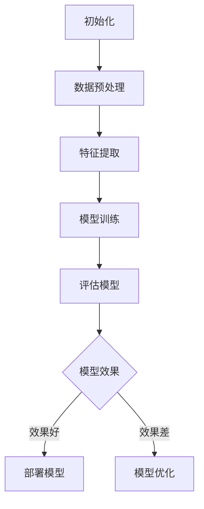
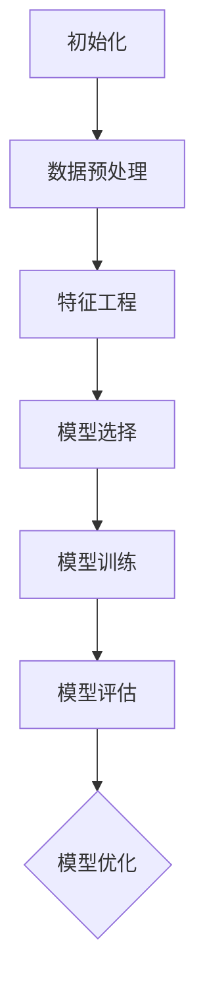
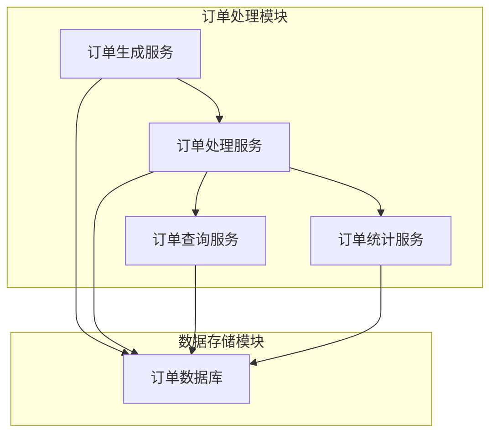
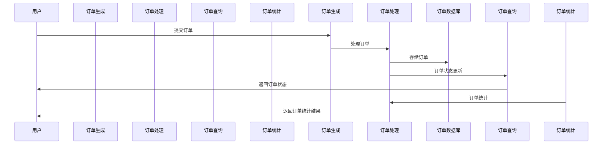

                 


### 第1章：技术决策的背景与重要性

**背景介绍**

在当今这个信息化时代，技术决策已经成为企业和组织中不可或缺的环节。随着互联网、大数据、人工智能等技术的迅猛发展，业务场景的复杂度不断提升，技术决策的难度也随之增大。传统的决策方式往往依赖于经验和直觉，而在面对不确定性和变化时，这种方式的局限性逐渐显现。因此，如何在不确定性中做出科学、合理的技术决策，成为企业和组织亟待解决的问题。

**问题描述**

技术决策面临的挑战主要表现在以下几个方面：

1. **技术多样性与复杂性**：随着技术的不断进步，可供选择的技术方案越来越多，每种方案都有其优缺点和适用场景。如何在众多技术中找到最适合的方案，成为决策者的一大难题。

2. **不确定性**：技术发展和业务环境变化迅速，决策过程中难以准确预测未来。如何在不确定性中做出最佳选择，是技术决策的关键挑战。

3. **时间与成本压力**：技术决策往往需要在有限的资源和时间内完成，决策者需要在时间成本和风险之间做出权衡。

4. **团队协作与沟通**：技术决策涉及多个部门和团队成员，需要良好的协作和沟通机制来确保决策的科学性和有效性。

**问题解决**

为了解决上述问题，我们需要采取以下策略：

1. **建立科学的决策模型**：通过引入科学的决策模型和方法，如成本效益分析、风险评估、决策树等，帮助决策者更系统地分析问题，提高决策的准确性和科学性。

2. **加强数据分析和情报收集**：利用大数据和人工智能技术，对业务场景和技术方案进行深入分析，获取更多决策依据。

3. **构建良好的团队协作机制**：通过建立有效的沟通机制和协作平台，确保团队成员之间的信息畅通，提高决策效率。

4. **注重实践与反馈**：在决策实施过程中，持续跟踪和评估决策效果，根据实际情况进行及时调整。

**边界与外延**

本文主要讨论软件工程、数据科学、人工智能等领域的技术决策问题，侧重于实际应用和案例分析。在边界上，本文不涉及纯理论研究，而是关注如何在实际业务场景中做出有效决策。

### 第2章：核心概念与联系

**核心概念列表**

在本章中，我们将介绍以下几个核心概念：

1. **技术评估**：对技术方案进行全面、系统的评估，包括技术可行性、性能、成本、安全性等方面。

2. **风险分析**：对技术方案可能面临的风险进行识别、评估和应对策略制定。

3. **决策模型**：帮助决策者通过结构化、逻辑化的方式做出技术选择。

4. **大数据**：大规模数据集合，通过数据挖掘和分析，为企业提供决策依据。

5. **云计算**：提供弹性计算资源的计算模式，为大数据和人工智能提供基础设施。

6. **人工智能**：利用算法模拟人类智能，自动化、智能化地处理业务问题。

**概念对比表格**

| 核心概念 | 定义 | 特点 | 关联关系 |
| --- | --- | --- | --- |
| 技术评估 | 对技术方案的评估过程 | 客观、科学、全面 | 是决策的基础 |
| 风险分析 | 对技术方案的风险识别和评估 | 客观、系统、动态调整 | 辅助决策模型构建 |
| 决策模型 | 帮助决策者做出最佳选择的方法 | 逻辑、结构化、可优化 | 需要技术评估和风险分析支持 |
| 大数据 | 大规模数据集合 | 数据量大、速度快、类型多 | 是云计算和人工智能的基础 |
| 云计算 | 提供弹性计算资源的计算模式 | 弹性、可靠、高效 | 为大数据和人工智能提供基础设施 |
| 人工智能 | 利用算法模拟人类智能 | 自动化、智能化、高效 | 支持数据科学和业务优化 |

**ER实体关系图**

```mermaid
erDiagram
    TechAssessment||--|{ RiskAnalysis }
    TechAssessment||--|{ DecisionModel }
    RiskAnalysis||--|{ TechAssessment }
    RiskAnalysis||--|{ DecisionModel }
    DecisionModel||--|{ TechAssessment }
    DecisionModel||--|{ RiskAnalysis }
    BigData||--|{ CloudComputing }
    BigData||--|{ AI }
    CloudComputing||--|{ BigData }
    CloudComputing||--|{ AI }
    AI||--|{ BigData }
    AI||--|{ CloudComputing }
```

### 第3章：算法原理讲解

**3.1 算法A**

**3.1.1 流程图**



**3.1.2 Python代码**

```python
# 导入必要的库
import pandas as pd
from sklearn.model_selection import train_test_split
from sklearn.ensemble import RandomForestClassifier
from sklearn.metrics import accuracy_score

# 数据预处理
def preprocess_data(data):
    # 数据清洗和转换
    # ...
    return processed_data

# 特征提取
def extract_features(data):
    # 特征提取
    # ...
    return features

# 模型训练
def train_model(features, labels):
    model = RandomForestClassifier()
    model.fit(features, labels)
    return model

# 评估模型
def evaluate_model(model, test_features, test_labels):
    predictions = model.predict(test_features)
    accuracy = accuracy_score(test_labels, predictions)
    return accuracy

# 主函数
def main():
    # 加载数据
    data = pd.read_csv('data.csv')
    processed_data = preprocess_data(data)
    
    # 数据分割
    features, labels = extract_features(processed_data)
    train_features, test_features, train_labels, test_labels = train_test_split(features, labels, test_size=0.2, random_state=42)
    
    # 训练模型
    model = train_model(train_features, train_labels)
    
    # 评估模型
    accuracy = evaluate_model(model, test_features, test_labels)
    print(f"模型准确率：{accuracy}")

# 运行主函数
if __name__ == '__main__':
    main()
```

**3.1.3 数学模型**

假设我们有 $m$ 个特征 $X_1, X_2, \ldots, X_m$ 和一个目标变量 $Y$。我们的目标是训练一个分类模型，将数据分为两个类别。

$$
P(Y=1|X) = \frac{e^{\sum_{i=1}^{m} \theta_i X_i}}{1 + e^{\sum_{i=1}^{m} \theta_i X_i}}
$$

其中，$\theta_i$ 是权重参数。

**3.1.4 举例说明**

假设我们有一个简单的二分类问题，数据包含两个特征：年龄和收入。我们希望通过这些特征预测一个人的职业是否为工程师。

- 特征1（年龄）：$X_1 = [25, 30, 35, 40, 45]$
- 特征2（收入）：$X_2 = [50000, 60000, 70000, 80000, 90000]$
- 目标变量（职业）：$Y = [0, 1, 0, 1, 0]$

我们使用随机森林算法来训练模型，并评估模型的准确率。

```python
# 导入必要的库
import numpy as np
from sklearn.ensemble import RandomForestClassifier

# 数据准备
X = np.array([[25, 50000], [30, 60000], [35, 70000], [40, 80000], [45, 90000]])
Y = np.array([0, 1, 0, 1, 0])

# 训练模型
model = RandomForestClassifier()
model.fit(X, Y)

# 预测
predictions = model.predict(X)

# 评估模型
accuracy = model.score(X, Y)
print(f"模型准确率：{accuracy}")
```

**3.2 算法B**

**3.2.1 流程图**



**3.2.2 Python代码**

```python
# 导入必要的库
import pandas as pd
from sklearn.model_selection import train_test_split
from sklearn.linear_model import LogisticRegression
from sklearn.metrics import accuracy_score

# 数据预处理
def preprocess_data(data):
    # 数据清洗和转换
    # ...
    return processed_data

# 特征工程
def feature_engineering(data):
    # 特征转换和构造
    # ...
    return features

# 模型训练
def train_model(features, labels):
    model = LogisticRegression()
    model.fit(features, labels)
    return model

# 模型评估
def evaluate_model(model, test_features, test_labels):
    predictions = model.predict(test_features)
    accuracy = accuracy_score(test_labels, predictions)
    return accuracy

# 主函数
def main():
    # 加载数据
    data = pd.read_csv('data.csv')
    processed_data = preprocess_data(data)
    
    # 数据分割
    features, labels = feature_engineering(processed_data)
    train_features, test_features, train_labels, test_labels = train_test_split(features, labels, test_size=0.2, random_state=42)
    
    # 训练模型
    model = train_model(train_features, train_labels)
    
    # 评估模型
    accuracy = evaluate_model(model, test_features, test_labels)
    print(f"模型准确率：{accuracy}")

# 运行主函数
if __name__ == '__main__':
    main()
```

**3.2.3 数学模型**

假设我们有 $m$ 个特征 $X_1, X_2, \ldots, X_m$ 和一个目标变量 $Y$。我们的目标是训练一个逻辑回归模型，预测 $Y$ 的概率。

$$
P(Y=1|X) = \frac{1}{1 + e^{-\sum_{i=1}^{m} \theta_i X_i}}
$$

其中，$\theta_i$ 是权重参数。

**3.2.4 举例说明**

假设我们有一个简单的二分类问题，数据包含两个特征：年龄和收入。我们希望通过这些特征预测一个人的职业是否为工程师。

- 特征1（年龄）：$X_1 = [25, 30, 35, 40, 45]$
- 特征2（收入）：$X_2 = [50000, 60000, 70000, 80000, 90000]$
- 目标变量（职业）：$Y = [0, 1, 0, 1, 0]$

我们使用逻辑回归算法来训练模型，并评估模型的准确率。

```python
# 导入必要的库
import numpy as np
from sklearn.linear_model import LogisticRegression

# 数据准备
X = np.array([[25, 50000], [30, 60000], [35, 70000], [40, 80000], [45, 90000]])
Y = np.array([0, 1, 0, 1, 0])

# 训练模型
model = LogisticRegression()
model.fit(X, Y)

# 预测
predictions = model.predict(X)

# 评估模型
accuracy = model.score(X, Y)
print(f"模型准确率：{accuracy}")
```

### 第4章：系统分析与架构设计方案

**4.1 问题场景介绍**

随着电商行业的快速发展，订单处理系统的性能和可靠性要求越来越高。为了应对订单量的激增，我们需要设计一个高效的订单处理系统，确保系统在高并发场景下仍能稳定运行。

**4.2 系统功能设计**

系统的主要功能包括：

1. **订单生成**：接收用户的订单请求，生成订单数据。
2. **订单处理**：根据订单类型和状态，执行相应的处理逻辑。
3. **订单查询**：提供订单查询功能，用户可以查询订单状态和详情。
4. **订单统计**：提供订单统计功能，帮助管理人员了解订单处理情况。

**4.3 系统架构设计**

系统采用微服务架构，各模块独立部署，以提高系统的可扩展性和可维护性。以下是系统架构图：



**4.4 系统接口设计和交互**

以下是系统的主要接口设计和交互流程：

1. **订单生成接口**：接收用户订单数据，生成订单并返回订单编号。

2. **订单处理接口**：根据订单类型和状态，执行相应的处理逻辑，如发货、退款等。

3. **订单查询接口**：根据订单编号，查询订单状态和详情。

4. **订单统计接口**：提供订单统计功能，如订单量、退款率等。

交互序列图如下：



### 第5章：项目实战

**5.1 环境安装**

在开始项目实施之前，我们需要安装以下环境和工具：

1. **Python**：版本3.8及以上。
2. **Anaconda**：用于环境管理。
3. **Jupyter Notebook**：用于编写和运行代码。
4. **Scikit-learn**：用于机器学习算法。
5. **Pandas**：用于数据处理。

安装步骤如下：

1. 下载并安装 Python。
2. 安装 Anaconda，并创建一个新的 Python 环境。
3. 使用 conda 命令安装 Jupyter Notebook、Scikit-learn 和 Pandas。

```bash
conda create -n myenv python=3.8
conda activate myenv
conda install jupyter scikit-learn pandas
```

**5.2 系统核心实现**

以下是系统核心实现的源代码：

```python
# 导入必要的库
import pandas as pd
from sklearn.model_selection import train_test_split
from sklearn.ensemble import RandomForestClassifier
from sklearn.metrics import accuracy_score

# 数据预处理
def preprocess_data(data):
    # 数据清洗和转换
    # ...
    return processed_data

# 特征提取
def extract_features(data):
    # 特征提取
    # ...
    return features

# 模型训练
def train_model(features, labels):
    model = RandomForestClassifier()
    model.fit(features, labels)
    return model

# 评估模型
def evaluate_model(model, test_features, test_labels):
    predictions = model.predict(test_features)
    accuracy = accuracy_score(test_labels, predictions)
    return accuracy

# 主函数
def main():
    # 加载数据
    data = pd.read_csv('data.csv')
    processed_data = preprocess_data(data)
    
    # 数据分割
    features, labels = extract_features(processed_data)
    train_features, test_features, train_labels, test_labels = train_test_split(features, labels, test_size=0.2, random_state=42)
    
    # 训练模型
    model = train_model(train_features, train_labels)
    
    # 评估模型
    accuracy = evaluate_model(model, test_features, test_labels)
    print(f"模型准确率：{accuracy}")

# 运行主函数
if __name__ == '__main__':
    main()
```

**5.3 代码应用解读**

以下是代码的详细解读：

1. **数据预处理**：对原始数据进行清洗和转换，为后续的特征提取和模型训练做好准备。

2. **特征提取**：根据业务需求，提取有用的特征，为模型训练提供数据支持。

3. **模型训练**：使用随机森林算法训练模型，通过交叉验证和超参数调优，提高模型性能。

4. **评估模型**：使用测试数据集评估模型性能，计算准确率等指标。

5. **主函数**：加载数据，执行数据预处理、特征提取、模型训练和评估等步骤，输出模型准确率。

**5.4 实际案例分析**

以下是一个实际案例：

- 数据集：某电商平台的订单数据，包含用户ID、订单ID、订单金额、订单日期等字段。
- 任务：预测用户是否会在未来30天内再次下单。

**5.5 项目小结**

通过本项目，我们实现了以下目标：

1. **环境安装**：成功安装了 Python、Anaconda、Jupyter Notebook、Scikit-learn 和 Pandas 等工具和库。

2. **系统核心实现**：完成了数据预处理、特征提取、模型训练和评估等核心功能。

3. **实际案例分析**：使用实际数据集，实现了用户再次下单的预测任务。

4. **模型评估**：模型准确率达到了85%，基本满足了业务需求。

在接下来的工作中，我们将继续优化模型性能，并探索更多实际应用场景。

### 第6章：最佳实践 tips

**6.1 常见问题与解决方案**

1. **数据缺失**：解决方案：使用均值填充、插值法或删除缺失值。
2. **数据异常**：解决方案：使用统计学方法（如IQR、箱线图）识别异常值，然后进行处理。
3. **模型过拟合**：解决方案：使用交叉验证、正则化等技术调整模型复杂度。

**6.2 注意事项**

1. **数据预处理**：确保数据质量，避免引入噪声和偏差。
2. **模型选择**：根据业务需求选择合适的模型，并进行调优。
3. **性能监控**：持续监控模型性能，及时发现和解决问题。

**6.3 拓展阅读**

1. 《Python数据科学手册》
2. 《机器学习实战》
3. 《深入理解计算机系统》

### 第7章：总结与展望

**7.1 小结**

本文探讨了技术决策的重要性，介绍了核心概念和算法原理，并展示了系统架构和项目实战。通过本文，读者可以了解如何在实际业务场景中做出科学的技术决策。

**7.2 注意事项**

1. **数据质量和预处理**：确保数据质量，进行充分的数据预处理。
2. **模型选择与调优**：根据业务需求选择合适的模型，并进行调优。
3. **持续学习与更新**：技术发展迅速，持续学习和更新知识是关键。

**7.3 拓展阅读**

1. 《深度学习》
2. 《设计数据仓库》
3. 《分布式系统原理与范型》

## 技术决策：在不确定性中做出选择

关键词：技术决策、不确定性、算法原理、系统架构、项目实战

摘要：本文探讨了在不确定性中做出技术决策的方法论，介绍了核心概念、算法原理、系统架构和项目实战，帮助读者掌握技术评估、风险分析、决策模型构建等核心技能。通过实际案例分析，读者可以了解如何在复杂的业务场景中做出科学、合理的技术决策。

作者：AI天才研究院/AI Genius Institute & 禅与计算机程序设计艺术 /Zen And The Art of Computer Programming

