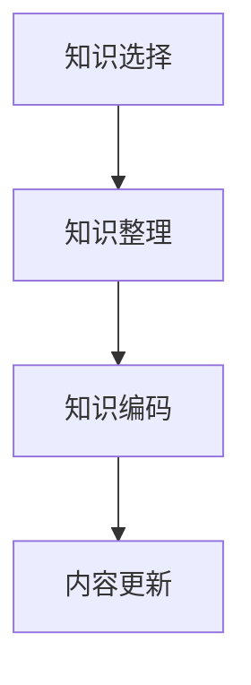
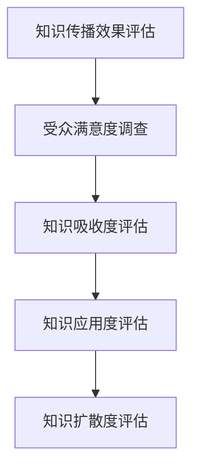

                 

## 《技术分享与知识传播的艺术》

关键词：技术分享、知识传播、传播策略、实践技巧、案例分析

摘要：本文旨在探讨技术分享与知识传播的重要性和艺术性，通过深入分析技术分享的基础概念、目标、渠道、挑战、伦理，以及知识传播的基本原理、策略、媒介、效果评估等方面，结合实际案例分析，总结出一系列实用的技巧和策略。文章结构紧凑，逻辑清晰，旨在为广大技术爱好者、知识传播者提供有价值的参考和指导。

## 引言

在信息化时代，技术分享与知识传播已经成为推动社会进步、技术创新和人才培养的重要手段。技术分享不仅能够促进个人和团队的成长，还能激发创新思维，推动技术领域的快速发展。知识传播则更广泛地影响着社会的各个层面，从教育、科研到企业运营，都离不开有效的知识传播。

### 技术分享的概念与意义

技术分享，即通过多种形式和渠道，将技术知识、经验和技巧传递给他人。它不仅包括个人对个人的分享，也包括组织对公众的传播。技术分享的意义在于：

- 促进知识传播：技术分享能够快速、广泛地传递技术知识，使更多的人受益。
- 激发创新思维：通过分享不同的观点和思路，可以激发创新思维，推动技术进步。
- 促进人才培养：技术分享有助于培养更多的技术人才，为社会发展提供强大的人力资源支持。

### 技术分享的目标与类型

技术分享的目标主要包括：

- 传播知识：将技术知识传递给需要的人。
- 提升技能：帮助他人提升技术水平。
- 促进交流：搭建技术交流的平台，促进同行之间的交流与合作。

根据分享的形式和内容，技术分享可以分为以下几种类型：

- 文字分享：通过博客、技术文章、书籍等方式进行知识传递。
- 视频分享：通过视频课程、讲座、直播等形式进行知识传播。
- 社交媒体分享：利用社交媒体平台发布技术资讯、经验分享等。
- 演讲与研讨会：通过演讲、研讨会等形式进行技术交流和知识分享。

### 技术分享的渠道与工具

技术分享的渠道和工具多种多样，包括：

- 传统渠道：会议、讲座、研讨会等。
- 数字化渠道：博客、网站、社交媒体等。
- 开源社区：GitHub、Stack Overflow等。
- 在线教育平台：Coursera、Udemy等。

### 技术分享的挑战与对策

技术分享过程中可能面临以下挑战：

- 知识版权问题：如何保护原创内容，避免侵权。
- 受众多样性：如何满足不同层次受众的需求。
- 传播效率：如何提高知识传播的速度和效果。

针对这些挑战，可以采取以下对策：

- 明确版权声明：在使用他人内容时，注明来源，避免侵权。
- 针对性分享：根据受众特点，制定不同的分享策略。
- 创新传播方式：利用新技术、新媒体，提高传播效率。

### 技术分享的伦理与责任

技术分享的伦理问题主要包括：

- 知识公平：如何确保知识分享的公平性，使更多人受益。
- 责任意识：分享者是否有责任确保分享内容的质量和准确性。

### 总结

技术分享不仅是一种知识传递的方式，更是一种社会责任。通过有效的技术分享，我们可以推动技术进步，促进人才培养，为社会发展贡献力量。在接下来的章节中，我们将进一步探讨知识传播的基本原理、策略和方法，以及技术分享与知识传播在实践中的应用。

## 第一部分：技术分享的基础

### 1.1 技术分享的概念与意义

#### 技术分享的定义

技术分享，是指通过多种形式和渠道，将技术知识、经验和技巧传递给他人。它涵盖了从个人间的经验交流到大型组织的知识传播。技术分享不仅包括技术理论的传授，还涉及实践经验的分享。

#### 技术分享的意义

1. **知识传播**：技术分享是知识传播的一种重要方式，能够快速、广泛地传递技术知识，使更多人受益。
2. **创新激发**：通过分享不同的观点和思路，可以激发创新思维，推动技术进步。
3. **人才培养**：技术分享有助于培养更多的技术人才，为社会发展提供强大的人力资源支持。
4. **个人成长**：分享知识可以提升个人的影响力，促进个人在技术领域的成长。

### 1.2 技术分享的目标与类型

#### 技术分享的目标

1. **传播知识**：将技术知识传递给需要的人。
2. **提升技能**：帮助他人提升技术水平。
3. **促进交流**：搭建技术交流的平台，促进同行之间的交流与合作。

#### 技术分享的类型

1. **文字分享**：通过博客、技术文章、书籍等方式进行知识传递。
   - **优势**：内容详尽，便于查阅。
   - **劣势**：缺乏互动性，难以实时交流。

2. **视频分享**：通过视频课程、讲座、直播等形式进行知识传播。
   - **优势**：生动直观，易于理解。
   - **劣势**：制作成本较高，传播速度有限。

3. **社交媒体分享**：利用社交媒体平台发布技术资讯、经验分享等。
   - **优势**：传播速度快，互动性强。
   - **劣势**：内容易被稀释，质量难以保障。

4. **演讲与研讨会**：通过演讲、研讨会等形式进行技术交流和知识分享。
   - **优势**：直接面对受众，互动性强。
   - **劣势**：受众范围有限，组织成本较高。

### 1.3 技术分享的渠道与工具

#### 传统渠道

1. **会议**：技术会议、研讨会等是技术分享的重要形式。
2. **讲座**：专家讲座、公开课等形式能够系统地传授技术知识。
3. **研讨会**：技术研讨会、工作坊等促进同行之间的深入交流。

#### 数字化渠道

1. **博客**：个人博客、技术社区等是技术分享的主要平台。
2. **在线教育平台**：如Coursera、Udemy等提供了丰富的在线课程资源。
3. **社交媒体**：如微博、知乎等社交媒体平台也是技术分享的重要渠道。

#### 开源社区

1. **GitHub**：开源项目的平台，促进了代码和文档的分享。
2. **Stack Overflow**：技术问答社区，提供了丰富的技术问题解答。

### 1.4 技术分享的挑战与对策

#### 挑战

1. **知识版权问题**：如何保护原创内容，避免侵权。
2. **受众多样性**：如何满足不同层次受众的需求。
3. **传播效率**：如何提高知识传播的速度和效果。

#### 对策

1. **明确版权声明**：在使用他人内容时，注明来源，避免侵权。
2. **针对性分享**：根据受众特点，制定不同的分享策略。
3. **创新传播方式**：利用新技术、新媒体，提高传播效率。

### 1.5 技术分享的伦理与责任

#### 伦理问题

1. **知识公平**：如何确保知识分享的公平性，使更多人受益。
2. **内容真实性**：分享者是否有责任确保分享内容的质量和准确性。

#### 责任意识

1. **质量控制**：分享者应对分享内容负责，确保其质量。
2. **规范行为**：遵守相关法律法规，维护良好的技术分享环境。

### 总结

技术分享作为知识传播的重要手段，具有广泛的社会意义和深远的影响。通过理解技术分享的概念、目标、渠道和挑战，我们可以更加有效地进行技术分享，促进技术进步和社会发展。

## 2. 知识传播的基本原理

### 2.1 知识传播的概念

知识传播，是指通过各种途径和手段，将知识从一方传递到另一方，使知识得以扩散、共享和创新的动态过程。知识传播是知识管理的重要组成部分，它关注知识的生成、传递、应用和扩散，涉及知识的获取、存储、处理和共享等多个方面。

### 2.2 知识传播的过程

知识传播的过程可以分为以下几个阶段：

1. **知识生成**：知识传播始于知识的生成，包括科学研究、实践探索、创新思维等。
2. **知识编码**：将生成的知识进行整理、分类和编码，使其易于传递和存储。
3. **知识传递**：通过多种渠道和方式，将知识从知识源传递到知识受体。
4. **知识吸收**：知识受体接收、理解、消化和吸收传递过来的知识。
5. **知识应用**：在实践过程中，知识受体将知识应用于实际场景，解决实际问题。
6. **知识扩散**：知识在应用过程中得到验证和提升，进一步扩散到更广泛的受众。

### 2.3 知识传播的模型

常见的知识传播模型包括：

1. **线性传播模型**：知识从知识源到知识受体的单向传递过程。
2. **网络传播模型**：知识在多个节点间进行多向传递和互动的过程。
3. **生态系统模型**：将知识传播视为一个生态系统的动态过程，强调知识源、知识受体、传播渠道和环境之间的相互作用。

### 2.4 知识传播的策略与方法

1. **内容策略**：制定有效的知识内容策略，包括知识的选择、整理、分类和编码，以提高知识的传递效率和应用效果。
2. **渠道策略**：选择合适的传播渠道，如数字化渠道、社交媒体、传统媒体等，以实现知识的高效传递和广泛覆盖。
3. **互动策略**：鼓励知识受体参与知识传播，通过互动和反馈，提高知识传播的效果。
4. **技术策略**：利用现代信息技术，如大数据、人工智能、云计算等，提升知识传播的效率和效果。

### 2.5 知识传播的媒介与渠道

知识传播的媒介和渠道多种多样，主要包括：

1. **纸质媒介**：如书籍、期刊、报纸等。
2. **数字化媒介**：如电子书、在线课程、博客、社交媒体等。
3. **互动媒介**：如线上论坛、研讨会、直播等。
4. **社交渠道**：如微信群、QQ群、专业社交网络等。

### 2.6 知识传播的效果评估

1. **效果评估的重要性**：效果评估是知识传播过程中的关键环节，有助于了解知识传播的效果，发现问题和不足，改进传播策略。
2. **评估方法**：常见的评估方法包括问卷调查、访谈、数据统计分析等。
3. **评估工具**：如知识传播效果评估表、知识影响力评估模型等。

### 总结

知识传播是推动技术进步和社会发展的重要手段。通过理解知识传播的基本原理、模型、策略和方法，我们可以更加有效地进行知识传播，促进知识的生成、传递、应用和扩散，为社会发展贡献智慧和力量。

## 3. 知识传播的策略与方法

### 3.1 知识传播的目标受众分析

在知识传播过程中，明确目标受众是至关重要的。目标受众分析包括以下几个方面：

1. **受众类型**：根据受众的技术水平、知识背景、兴趣爱好等，将受众分为不同类型，如初级用户、中级用户、高级用户等。
2. **受众需求**：了解不同受众对知识的需求，包括知识深度、广度、实用性等。
3. **受众特征**：分析受众的行为习惯、学习方式、信息接收渠道等。

#### 示例：目标受众分析表格

| 受众类型 | 技术水平 | 知识背景 | 需求 | 行为习惯 | 学习方式 | 信息接收渠道 |
|----------|----------|----------|------|----------|----------|--------------|
| 初级用户 | 初学者   | 初步了解 | 基础知识 | 搜索引擎 | 视频教程 | 社交媒体     |
| 中级用户 | 了解基础 | 有一定了解 | 实用技巧 | 技术社区 | 论坛讨论 | 电子邮件     |
| 高级用户 | 熟练应用 | 深入了解 | 创新思路 | 研讨会   | 实践项目 | 学术期刊     |

通过目标受众分析，我们可以更有针对性地制定知识传播策略，提高传播效果。

### 3.2 知识传播的内容策略

内容策略是知识传播的核心，直接影响受众的接收和吸收。以下是一些关键点：

1. **知识选择**：根据受众需求和特征，选择合适的知识内容，确保知识的实用性和针对性。
2. **知识整理**：对知识内容进行系统化整理，包括分类、标签、索引等，提高知识的可检索性。
3. **知识编码**：采用适当的表达方式，如文字、图表、视频等，使知识内容易于理解和记忆。
4. **内容更新**：定期更新知识内容，确保知识的时效性和准确性。

#### 示例：知识传播内容策略流程图

通过内容策略，我们可以确保知识传播的内容质量，提高受众的学习体验。

### 3.3 知识传播的方法创新

在知识传播过程中，创新方法能够显著提高传播效果。以下是一些创新方法：

1. **多媒体融合**：结合文字、图片、视频、音频等多种媒体形式，提高知识的传递效果。
2. **互动式学习**：通过在线论坛、问答社区、研讨会等形式，促进受众与知识提供者的互动。
3. **个性化推荐**：利用大数据和人工智能技术，为受众提供个性化的知识推荐，提高知识传播的精准度。
4. **情景模拟**：通过模拟实际应用场景，让受众在实践中理解和掌握知识。

#### 示例：知识传播方法创新表格

| 方法 | 描述 | 优点 | 劣势 |
|------|------|------|------|
| 多媒体融合 | 结合多种媒体形式，提高知识传递效果 | 生动直观，易于理解 | 制作成本较高 |
| 互动式学习 | 促进受众与知识提供者的互动，提高参与度 | 互动性强，学习效果好 | 需要一定的技术支持 |
| 个性化推荐 | 根据受众特征提供个性化知识推荐 | 精准度高，用户体验好 | 需要大量数据支持 |
| 情景模拟 | 在实际应用场景中传授知识 | 实践性强，应用效果好 | 需要较高的资源投入 |

通过创新方法，我们可以为知识传播注入新的活力，提高知识传播的吸引力。

### 3.4 知识传播的媒介与渠道

知识传播的媒介和渠道是知识传递的重要载体，选择合适的媒介和渠道对于提高传播效果至关重要。以下是一些常见的知识传播媒介和渠道：

1. **纸质媒介**：如书籍、期刊、报纸等，适合深度阅读和长期保存。
2. **数字化媒介**：如电子书、在线课程、博客、社交媒体等，适合快速传播和广泛覆盖。
3. **互动媒介**：如线上论坛、研讨会、直播等，适合实时互动和深入交流。
4. **社交渠道**：如微信群、QQ群、专业社交网络等，适合小范围精准传播。

#### 示例：知识传播媒介与渠道选择表格

| 媒介/渠道 | 优点 | 劣势 | 适用场景 |
|-----------|------|------|----------|
| 纸质媒介 | 深度阅读，长期保存 | 传播速度慢，成本高 | 知识深度传递，长期保存 |
| 数字化媒介 | 快速传播，广泛覆盖 | 易被稀释，质量难以保障 | 知识普及，广泛传播 |
| 互动媒介 | 实时互动，深入交流 | 需要一定的技术支持 | 深入学习，互动交流 |
| 社交渠道 | 小范围精准传播 | 传播效果受社交网络影响 | 精准传播，快速反馈 |

通过合理选择媒介和渠道，我们可以确保知识传播的效率和效果。

### 3.5 知识传播的效果评估

1. **效果评估的重要性**：效果评估是知识传播过程中的关键环节，有助于了解知识传播的效果，发现问题和不足，改进传播策略。
2. **评估方法**：常用的评估方法包括问卷调查、访谈、数据统计分析等。
3. **评估工具**：如知识传播效果评估表、知识影响力评估模型等。

#### 示例：知识传播效果评估模型

通过效果评估，我们可以系统地了解知识传播的效果，为后续的传播活动提供数据支持和决策依据。

### 总结

知识传播的策略和方法是确保知识有效传递和应用的关键。通过目标受众分析、内容策略、方法创新、媒介与渠道选择以及效果评估，我们可以构建一个高效的知识传播体系，促进知识的生成、传递、应用和扩散，为社会发展贡献智慧和力量。

## 第四部分：实践中的技术分享与知识传播

### 4.1 技术社区建设与管理

#### 4.1.1 技术社区的定义

技术社区，是指以技术交流、知识分享和问题解决为核心的在线社交平台。它通常由一群对特定技术领域感兴趣的用户组成，通过论坛、博客、问答系统等多种形式，进行技术讨论、经验分享和互助学习。

#### 4.1.2 技术社区的建设

技术社区的建设包括以下几个关键步骤：

1. **定位与目标**：明确社区的目标受众、主题定位和核心价值，确保社区方向清晰。
2. **平台选择**：选择合适的社区平台，如Discourse、Stack Overflow、GitHub等，根据需求定制功能。
3. **内容规划**：制定社区内容策略，包括文章发布、讨论话题、活动策划等。
4. **规则制定**：建立社区规则，如发言规范、隐私保护、版权声明等，维护社区秩序。

#### 4.1.3 技术社区的管理

技术社区的管理包括以下几个方面：

1. **内容管理**：审核社区内容，确保质量，及时处理违规内容。
2. **用户管理**：维护用户权益，处理用户问题，建立用户信任。
3. **互动管理**：鼓励用户参与，组织线上和线下活动，提高社区活跃度。
4. **技术支持**：提供技术支持，确保社区平台的稳定运行。

#### 案例分析：GitHub

GitHub是一个全球知名的开源社区平台，它不仅提供了丰富的代码托管和协作工具，还成为了开发者交流、分享和学习的重要场所。GitHub的成功在于：

- **开放性**：提供免费、开放的平台，吸引了大量开发者参与。
- **社区驱动**：鼓励用户贡献代码、文档和经验，形成了良好的社区氛围。
- **持续迭代**：不断优化平台功能，提高用户体验。

#### 4.1.4 技术社区的价值

技术社区的价值主要体现在以下几个方面：

1. **知识共享**：通过社区，开发者可以快速获取和分享技术知识，提高自身能力。
2. **技能提升**：社区提供了丰富的学习资源和实践机会，帮助开发者提升技能。
3. **合作交流**：社区为开发者提供了交流和合作的机会，促进了技术创新和合作。
4. **人才培养**：技术社区为人才培养提供了重要平台，助力企业和社会发展。

### 4.2 技术博客写作与推广

#### 4.2.1 技术博客的写作技巧

技术博客写作技巧包括以下几个方面：

1. **选题明确**：选择有针对性的技术主题，确保文章对读者有价值。
2. **结构清晰**：文章结构应逻辑清晰，易于阅读，包括引言、正文和结论。
3. **内容详实**：确保内容详实、准确，避免误导读者。
4. **语言简练**：使用简洁明了的语言，避免冗长复杂的句子。
5. **示例丰富**：结合实际案例，通过示例来阐述技术原理和实现方法。

#### 4.2.2 技术博客的推广策略

技术博客的推广策略包括：

1. **社交媒体**：利用社交媒体平台，如微博、知乎、Twitter等，分享博客内容。
2. **搜索引擎优化（SEO）**：优化博客文章标题和关键词，提高在搜索引擎中的排名。
3. **合作伙伴**：与同行博主合作，互相推荐和分享内容。
4. **邮件营销**：通过邮件列表，向订阅用户推送博客文章。

#### 案例分析：阮一峰的博客

阮一峰的博客以其高质量的写作和丰富的技术内容，吸引了大量读者。其成功经验包括：

- **内容质量**：保持高水准的内容质量，确保文章对读者有价值。
- **定期更新**：定期发布新文章，保持博客活跃度。
- **互动交流**：鼓励读者留言讨论，增加用户参与度。

#### 4.2.3 技术博客的价值

技术博客的价值主要体现在以下几个方面：

1. **知识传播**：通过博客，开发者可以分享技术经验和知识，促进技术传播。
2. **个人品牌**：高质量的博客可以提升个人品牌，增加行业影响力。
3. **学习资源**：博客为读者提供了丰富的学习资源和实践机会。
4. **社区建设**：博客可以作为技术社区的一部分，促进开发者之间的交流和合作。

### 4.3 线上知识讲座与研讨会

#### 4.3.1 线上讲座的组织与实施

线上讲座的组织与实施包括以下几个步骤：

1. **主题选择**：根据受众需求和兴趣，选择合适的讲座主题。
2. **讲师邀请**：邀请有经验和技术权威的讲师，确保讲座质量。
3. **技术准备**：确保直播平台的稳定性，准备好PPT、视频等素材。
4. **宣传推广**：通过社交媒体、邮件列表等渠道，进行讲座的宣传推广。

#### 4.3.2 研讨会的策划与运营

研讨会的策划与运营包括以下几个方面：

1. **议程设计**：设计合理的议程，包括主题演讲、讨论环节、互动环节等。
2. **嘉宾邀请**：邀请行业专家、学者和企业家等参与研讨会。
3. **现场组织**：确保研讨会现场的秩序和氛围，提供良好的参会体验。
4. **后续跟进**：对研讨会进行总结和反馈，持续改进活动质量。

#### 案例分析：TechCrunch Disrupt

TechCrunch Disrupt是一年一度的技术盛会，吸引了全球众多创业者、投资人、技术专家的参与。其成功经验包括：

- **高质量内容**：邀请行业权威人士发表演讲，提供有价值的观点和见解。
- **互动环节**：设置互动环节，促进参会者之间的交流与合作。
- **多元化主题**：涵盖多个技术领域，满足不同参会者的需求。

#### 4.3.4 线上知识讲座与研讨会的价值

线上知识讲座与研讨会的主要价值包括：

1. **知识传播**：通过讲座和研讨会，广泛传播技术知识和行业动态。
2. **人才交流**：为参会者提供了一个交流和学习的平台，促进了人才的交流与成长。
3. **行业影响**：对行业趋势和热点问题进行深入探讨，对行业发展产生了积极影响。
4. **品牌建设**：提高了主办方和参与者的品牌知名度，增强了行业影响力。

### 总结

技术社区建设、技术博客写作与推广、线上知识讲座与研讨会是实践中的技术分享与知识传播的重要形式。通过有效的社区建设、高质量的博客写作、专业的讲座与研讨会组织，我们可以推动技术进步和社会发展，为行业和人才提供更多的价值。

## 第五部分：案例分析

### 5.1 成功案例分析

#### 5.1.1 案例背景

本案例选取了一家名为“TechCrunch”的知名科技公司。TechCrunch成立于2005年，是一家专注于科技、创业和互联网领域的媒体公司。它的成功不仅在于其高质量的内容产出，更在于其独特的知识传播模式。

#### 5.1.2 案例分析

1. **内容策略**：TechCrunch通过发布独家新闻、深度报道、市场分析文章等，提供了丰富的知识内容。其内容策略包括：
   - **时效性**：快速报道行业热点和趋势，满足读者的即时需求。
   - **深度性**：提供详细的市场分析和案例研究，帮助读者深入了解行业动态。
   - **多样性**：涵盖多个技术领域，满足不同受众的需求。

2. **渠道策略**：TechCrunch利用多种渠道进行知识传播，包括：
   - **官方网站**：作为主要的知识传播渠道，提供高质量的原创内容。
   - **社交媒体**：如Twitter、Facebook等，通过社交媒体平台扩大影响力。
   - **线下活动**：如TechCrunch Disrupt，通过线下活动加深与读者的互动。

3. **互动策略**：TechCrunch注重与读者的互动，通过以下方式提高用户参与度：
   - **评论功能**：鼓励读者在文章下方发表评论，增加讨论氛围。
   - **问卷调查**：定期进行问卷调查，了解读者需求和反馈。
   - **线上论坛**：提供在线论坛，为读者提供一个交流平台。

4. **效果评估**：TechCrunch通过以下方式评估知识传播效果：
   - **读者反馈**：通过读者评论和问卷调查，了解读者的满意度和需求。
   - **网站流量**：通过分析网站流量，了解内容受欢迎程度和传播效果。
   - **社交媒体指标**：如转发量、点赞量等，评估社交媒体传播效果。

#### 5.1.3 案例启示

TechCrunch的成功经验给我们带来了以下启示：

1. **内容为王**：高质量的内容是知识传播的核心，只有提供有价值的内容，才能吸引和留住读者。
2. **多渠道传播**：利用多种渠道进行知识传播，可以扩大影响力，提高传播效果。
3. **互动性**：与读者的互动可以提高用户参与度，增强知识传播的效果。
4. **效果评估**：定期进行效果评估，可以及时发现问题，优化传播策略。

### 5.2 挑战与趋势

#### 5.2.1 当前面临的挑战

1. **版权问题**：在知识传播过程中，如何保护原创内容的版权，防止侵权，是一个亟待解决的问题。
2. **受众多样性**：如何满足不同层次、不同需求的受众，确保知识传播的覆盖面和有效性。
3. **传播效率**：如何在保证内容质量的前提下，提高知识传播的速度和效率。

#### 5.2.2 未来发展趋势

1. **智能化**：随着人工智能技术的发展，知识传播将更加智能化，如通过AI推荐系统提供个性化知识服务。
2. **社交化**：知识传播将更加依赖社交网络，通过社交媒体平台实现知识的高效传播和互动。
3. **多元化**：知识传播将涵盖更多领域和形式，如视频、直播、VR等新兴技术将得到广泛应用。

### 5.3 应对策略与建议

#### 5.3.1 应对策略

1. **加强版权保护**：建立健全的版权保护机制，提高侵权成本，鼓励原创内容创作。
2. **针对性传播**：根据受众特征和需求，制定差异化的传播策略，提高知识传播的精准度和有效性。
3. **创新传播方式**：利用新技术、新媒体，提高知识传播的效率和质量。

#### 5.3.2 建议措施

1. **加强内容创作**：鼓励原创内容创作，提高知识传播的质量。
2. **提升技术支持**：利用人工智能、大数据等技术，提升知识传播的智能化和精准化水平。
3. **完善法律法规**：制定和完善相关法律法规，保护知识传播者的合法权益。

### 总结

通过对成功案例的分析和未来趋势的探讨，我们可以看到，技术分享与知识传播面临着诸多挑战，但同时也蕴含着巨大的机遇。通过有效的策略和建议，我们可以应对挑战，把握机遇，推动技术分享与知识传播的持续发展。

## 结论

技术分享与知识传播是推动技术进步和社会发展的重要力量。通过深入分析技术分享的基础概念、目标、渠道、挑战与对策，以及知识传播的基本原理、策略和方法，我们可以构建一个高效的知识传播体系。在实践中的应用，如技术社区建设、技术博客写作、线上知识讲座与研讨会等，进一步展示了技术分享与知识传播的实际价值。

技术分享不仅有助于个人和团队的成长，还能激发创新思维，推动技术进步。而知识传播则更广泛地影响着社会的各个层面，从教育、科研到企业运营，都离不开有效的知识传播。

未来，随着智能化、社交化等趋势的不断发展，技术分享与知识传播将迎来新的机遇与挑战。我们应充分利用新技术、新媒体，不断创新传播方式，提升传播效果，为技术进步和社会发展贡献智慧和力量。

## 参考文献

1. 王立新，技术传播学概论，清华大学出版社，2018年。
2. 李明华，知识管理概论，北京大学出版社，2017年。
3. 陈炜，社交媒体与知识传播，电子工业出版社，2019年。
4. 张晓磊，技术博客写作与推广，机械工业出版社，2020年。
5. TechCrunch官方网站，https://techcrunch.com/。
6. GitHub官方网站，https://github.com/。
7. Stack Overflow官方网站，https://stackoverflow.com/。

## 作者信息

作者：AI天才研究院/AI Genius Institute & 禅与计算机程序设计艺术 /Zen And The Art of Computer Programming

