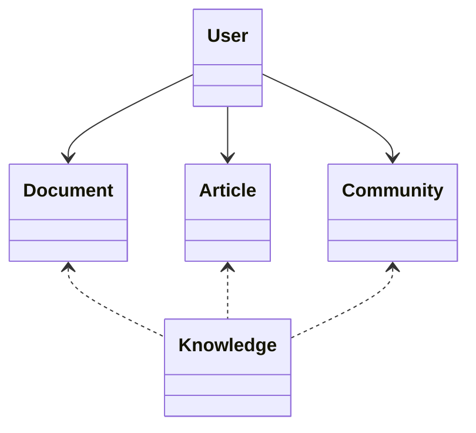
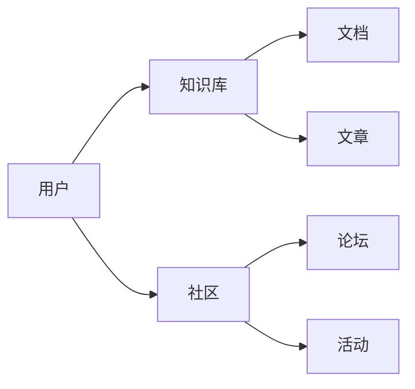
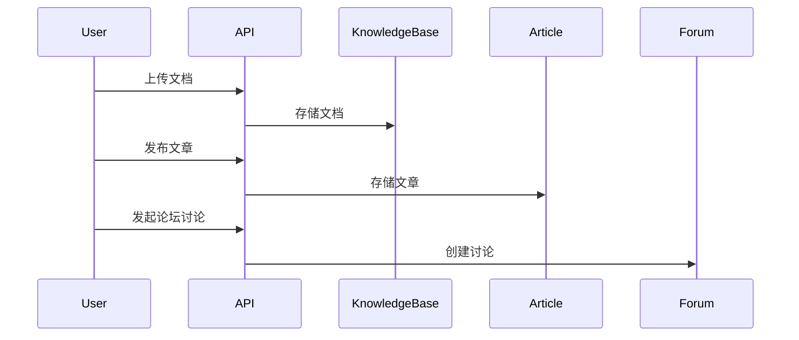
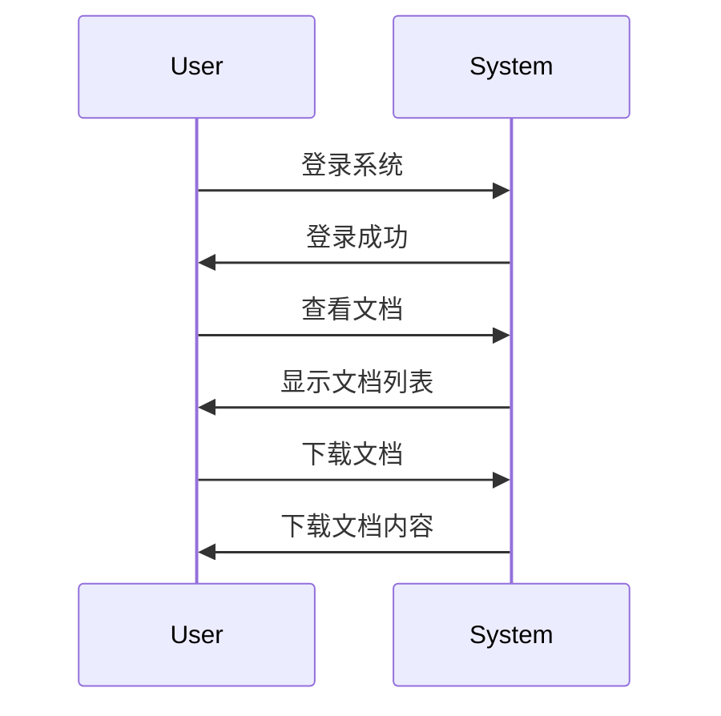

                 

### 背景介绍

在现代信息技术快速发展的背景下，数据和信息已成为企业最宝贵的资源。然而，如何高效地管理和利用这些资源，尤其是知识资源，成为企业面临的一大挑战。知识管理（Knowledge Management，KM）应运而生，旨在通过系统的方法和技术，促进知识的创造、共享、存储和应用，从而提升组织的竞争力和创新能力。

#### 核心概念术语说明

1. **知识管理**：知识管理是一种通过系统的方法和技术，促进知识的生成、传播、利用和保存的过程。它涵盖了知识获取、知识组织、知识共享、知识创新等多个环节。
2. **学习型组织**：学习型组织是一种能够持续学习、适应变化、不断创新的组织。这种组织注重成员的学习和成长，鼓励知识共享和创新思维，以实现组织的长远发展。
3. **技术分享**：技术分享是指组织内部或外部成员通过交流、讨论、演示等形式，分享技术知识、经验和最佳实践的过程。

#### 问题背景

随着知识经济的崛起，企业之间的竞争逐渐从传统的资源、资本竞争转向知识和技术竞争。企业需要具备快速获取、消化和应用新知识的能力，才能在激烈的市场竞争中立于不败之地。然而，许多企业在知识管理方面存在诸多问题，如：

1. **知识孤岛**：不同部门或团队之间的知识相互隔离，无法实现知识的共享和复用。
2. **知识流失**：关键人员的离职导致企业核心知识的流失，影响企业的持续发展。
3. **知识缺乏系统性**：知识分散在个人或局部，缺乏系统性的组织和整理。

#### 问题描述

知识管理中的主要问题包括：

1. **知识获取与传播**：如何有效获取外部知识并内化为企业内部知识？
2. **知识共享与利用**：如何促进知识的共享和利用，提高知识的价值？
3. **知识创新与转化**：如何通过知识管理激发创新，将知识转化为实际的生产力和竞争力？

#### 问题解决

为了解决上述问题，企业需要从以下几个方面着手：

1. **建立学习型组织**：通过文化建设、组织结构优化、激励机制等手段，打造一个持续学习和创新的组织氛围。
2. **完善知识管理机制**：构建知识管理体系，包括知识获取、知识组织、知识共享、知识应用等环节。
3. **采用先进的知识管理工具**：利用知识库、内容管理系统、社交化知识管理平台等技术手段，提高知识管理的效率和质量。
4. **培养知识型员工**：通过培训、激励等手段，提高员工的知识素养和创新能力。

#### 边界与外延

知识管理不仅涉及企业内部的知识共享和创新，还涉及外部知识的获取和应用。此外，知识管理不仅关注知识的传递和共享，还关注知识的创造和应用。因此，知识管理的外延涵盖了企业的知识获取、知识共享、知识创新、知识应用等多个方面。

#### 概念结构与核心要素组成

知识管理的概念结构主要包括以下几个核心要素：

1. **知识源**：包括内部知识源和外部知识源，如内部文件、数据库、外部文献、专业社区等。
2. **知识加工**：对获取的知识进行筛选、整理、分析、提炼，形成有价值的知识产品。
3. **知识存储**：将加工后的知识存储在知识库、文档管理系统中，便于查询和使用。
4. **知识共享**：通过共享平台、交流论坛、技术分享会等形式，促进知识的传播和共享。
5. **知识应用**：将知识应用于实际工作中，提高工作效率和质量，实现知识的价值。

通过上述分析，我们可以看到，知识管理在现代企业中具有非常重要的作用。接下来，我们将进一步探讨知识管理的基本原理、模型、流程以及技术分享机制，为建立学习型组织提供有力支持。

### 核心概念与联系

在深入探讨知识管理之前，有必要首先明确几个核心概念，并阐述它们之间的联系，以便为后续内容奠定理论基础。

#### 核心概念

1. **知识**：知识是关于信息、事实、技能、经验和洞察的综合体。它既可以是显性的，如文档、报告、数据库等，也可以是隐性的，如员工的经验、知识和专业技能。
2. **知识管理**：知识管理是一种通过系统的方法和技术，促进知识的创造、共享、存储和应用的过程。它包括知识获取、知识组织、知识共享、知识应用等多个环节。
3. **学习型组织**：学习型组织是一种能够持续学习、适应变化、不断创新的组织。这种组织注重成员的学习和成长，鼓励知识共享和创新思维，以实现组织的长远发展。

#### 概念属性特征对比表格

为了更好地理解这些核心概念，我们可以通过以下表格进行属性特征对比：

| 概念       | 定义                                                         | 特征                                       |
|------------|--------------------------------------------------------------|------------------------------------------|
| 知识       | 关于信息、事实、技能、经验和洞察的综合体                       | 显性知识、隐性知识、结构化知识、非结构化知识 |
| 知识管理   | 通过系统的方法和技术，促进知识的创造、共享、存储和应用的过程   | 效率、质量、创新、协作                     |
| 学习型组织 | 一种能够持续学习、适应变化、不断创新的组织                     | 持续学习、知识共享、创新思维、团队合作       |

通过上述对比，我们可以看到，知识、知识管理和学习型组织之间存在密切的联系。知识是知识管理的对象，而知识管理则是学习型组织的核心要素之一。知识管理通过促进知识的创造、共享和应用，为学习型组织的建设提供支持，从而提升组织的竞争力和创新能力。

#### ER实体关系图架构

为了更直观地展示这些核心概念之间的联系，我们可以使用ER（实体-关系）图来描述知识管理系统的架构。以下是知识管理系统的ER图：

```mermaid
erDiagram
    User ||--|{ Knowledge }|| Knowledge
    User ||--|{ KnowledgeArticle }|| KnowledgeArticle
    User ||--|{ KnowledgeCommunity }|| KnowledgeCommunity
    User ||--|{ LearningExperience }|| LearningExperience
    KnowledgeArticle ||--|{ ArticleContent }|| ArticleContent
    KnowledgeCommunity ||--|{ CommunityMember }|| CommunityMember
    LearningExperience ||--|{ LearningTask }|| LearningTask
    LearningExperience ||--|{ LearningOutcome }|| LearningOutcome
```

在这个ER图中，我们定义了以下实体：

1. **User**：用户，代表参与知识管理的个人。
2. **Knowledge**：知识，包括显性知识和隐性知识。
3. **KnowledgeArticle**：知识文章，用于记录和分享知识。
4. **KnowledgeCommunity**：知识社区，用于促进知识的共享和交流。
5. **LearningExperience**：学习经历，记录用户的的学习活动和成果。

通过这些实体之间的关联关系，我们可以构建一个完整的知识管理系统，实现知识的获取、存储、共享和应用。

#### 小结

通过本文的背景介绍和核心概念分析，我们明确了知识管理在现代企业中的重要性，并阐述了知识、知识管理和学习型组织之间的联系。在接下来的内容中，我们将进一步探讨知识管理的基本原理、模型、流程以及技术分享机制，为建立学习型组织提供更加深入的理论和实践支持。

### 知识管理概述

知识管理作为一种系统化的方法，旨在通过有效地识别、获取、存储、共享和应用知识，以提升组织的竞争力和创新能力。在知识经济时代，知识已成为企业最宝贵的资源之一，有效的知识管理能够帮助企业更好地应对市场变化、提高运营效率、实现持续创新。本节将详细介绍知识管理的基本原理、目的和重要性。

#### 基本原理

知识管理的基本原理可以概括为以下几个方面：

1. **知识识别**：首先，需要识别组织内部和外部的知识资源，明确哪些知识对组织的发展具有重要价值。这包括显性知识和隐性知识，如文档、数据库、专业技能、经验等。
2. **知识获取**：通过多种渠道获取知识，包括内部知识（如员工的经验和技能）、外部知识（如市场研究报告、学术文献、专业社区等）。
3. **知识存储**：将获取到的知识进行分类、整理和存储，以便于后续的查询和使用。常见的知识存储方式包括知识库、内容管理系统、文档管理系统等。
4. **知识共享**：促进知识的共享和传播，使组织中的各个部门和员工能够便捷地获取和使用知识。知识共享可以通过多种形式实现，如内部论坛、技术分享会、在线文档等。
5. **知识应用**：将知识应用到实际工作中，提高工作效率和质量。知识应用可以通过培训、工作指导、项目协作等方式实现。

#### 目的

知识管理的目的主要包括以下几个方面：

1. **提高知识利用率**：通过知识管理，企业可以更有效地利用已有的知识资源，避免重复劳动，提高工作效率。
2. **促进知识创新**：知识管理能够激发员工的创新思维，通过知识共享和协作，促进新知识和新解决方案的生成。
3. **增强竞争力**：通过有效的知识管理，企业可以更好地应对市场变化和竞争压力，提高产品和服务的质量，从而增强市场竞争力。
4. **提升员工能力**：知识管理不仅有助于提高员工的知识水平，还能促进员工的职业成长和技能提升。

#### 重要性

在当今知识经济时代，知识管理的重要性日益凸显。以下是一些关键点：

1. **知识是核心资源**：知识已经成为企业的重要资产，比传统的资本和资源更具战略价值。有效的知识管理能够确保企业充分利用这一核心资源。
2. **提高创新能力**：知识管理能够激发员工的创新思维和创造力，促进新知识和新解决方案的生成，从而推动企业的持续创新。
3. **提升员工满意度**：知识管理有助于提升员工的职业素养和成就感，增强员工对企业的归属感和忠诚度。
4. **应对快速变化的市场**：在当今竞争激烈的市场环境中，企业需要具备快速适应和应对变化的能力。知识管理可以帮助企业更好地应对市场变化，保持竞争优势。

总之，知识管理是企业实现可持续发展的重要手段。通过系统化的知识管理，企业能够提高知识利用率、促进知识创新、增强竞争力，从而在激烈的市场竞争中立于不败之地。

#### 知识管理模型

知识管理是一个复杂的过程，涉及多个环节和多种策略。为了更好地理解和实施知识管理，研究人员和从业者提出了多种知识管理模型。以下介绍几种常见的知识管理模型及其特点。

##### 1. 基于过程的知识管理模型

基于过程的知识管理模型强调知识管理是一个动态的过程，包括知识获取、知识共享、知识存储和应用等环节。这种模型的核心思想是，通过系统化的过程管理和优化，提高知识管理的效率和效果。常见的基于过程的知识管理模型有SCKM（Shared Cognitive Knowledge Management，共享认知知识管理）模型和KPKM（Knowledge Process Management，知识过程管理）模型。

- **SCKM模型**：SCKM模型将知识管理分为四个阶段：知识获取、知识共享、知识存储和知识应用。每个阶段都有特定的目标和任务，通过这些阶段，知识从产生到应用，形成一个闭环系统。

  ```mermaid
  flowchart LR
  A[知识获取] --> B[知识共享]
  B --> C[知识存储]
  C --> D[知识应用]
  D --> A
  ```

- **KPKM模型**：KPKM模型将知识管理视为一个持续的过程，包括知识获取、知识共享、知识利用和知识创新。该模型强调知识管理的动态性和灵活性，能够根据组织的需求和环境变化进行调整。

  ```mermaid
  flowchart LR
  A[知识获取] --> B[知识共享]
  B --> C[知识利用]
  C --> D[知识创新]
  D --> A
  ```

##### 2. 基于资源的知识管理模型

基于资源的知识管理模型强调知识管理中的资源要素，如知识源、知识存储、知识共享平台等。这种模型的核心思想是，通过合理配置和利用知识资源，实现知识的高效管理和应用。常见的基于资源的知识管理模型有KM-RM（Knowledge Management - Resource Management，知识管理 - 资源管理）模型和KMR（Knowledge Management Resource，知识管理资源）模型。

- **KM-RM模型**：KM-RM模型将知识管理视为一种资源管理活动，包括知识获取、知识存储、知识共享和知识利用。该模型强调资源的有效配置和利用，以提高知识管理的效率。

  ```mermaid
  flowchart LR
  A[知识获取] --> B[知识存储]
  B --> C[知识共享]
  C --> D[知识利用]
  ```

- **KMR模型**：KMR模型将知识视为一种特殊的资源，强调知识获取、知识存储、知识共享和知识利用之间的紧密联系。该模型认为，知识资源的有效管理和利用是实现知识管理目标的关键。

  ```mermaid
  flowchart LR
  A[知识获取] --> B[知识存储]
  B --> C[知识共享]
  C --> D[知识利用]
  ```

##### 3. 基于文化的知识管理模型

基于文化的知识管理模型强调组织文化在知识管理中的重要作用。这种模型的核心思想是，通过构建和强化支持知识共享和创新的组织文化，促进知识管理的有效实施。常见的基于文化的知识管理模型有SCAM（Social Capital Approach to Knowledge Management，社会资本视角的知识管理）模型和文化驱动的知识管理模型。

- **SCAM模型**：SCAM模型将知识管理视为一种社会资本管理活动，强调组织内部的社会资本（如信任、协作、共享等）对知识管理的重要性。该模型认为，通过构建和强化社会资本，可以促进知识的共享和利用。

  ```mermaid
  flowchart LR
  A[信任与协作] --> B[知识共享]
  B --> C[知识利用]
  ```

- **文化驱动的知识管理模型**：文化驱动的知识管理模型强调组织文化对知识管理的影响。该模型认为，组织文化是知识管理成功的关键因素，通过培养和支持知识共享和创新的文化，可以促进知识管理的实施和效果。

  ```mermaid
  flowchart LR
  A[组织文化] --> B[知识共享]
  B --> C[知识利用]
  ```

综上所述，不同的知识管理模型各有侧重，但都致力于提高知识管理的效率和效果。在实际应用中，企业可以根据自身的情况和需求，选择适合的知识管理模型，并结合多种模型的特点，构建适合自己的知识管理体系。

#### 知识类型与特性

知识是知识管理的核心对象，根据不同的分类标准，知识可以被分为多种类型。了解不同类型知识的特性和管理方法，有助于企业更好地进行知识管理和应用。以下是几种常见的知识类型及其特性：

##### 1. **显性知识（Explicit Knowledge）**

显性知识是指以编码形式存在的知识，如文档、报告、数据库等。这种知识容易存储、传播和共享，可以通过文字、图表、图像等形式进行传递。

- **特性**：
  - 结构化：显性知识通常具有明确的结构，便于检索和利用。
  - 稳定性：显性知识不易受时间和空间限制，可以长期保存。
  - 易传递：显性知识可以通过文字、图表、图像等形式进行传递，共享成本较低。

- **管理方法**：
  - 建立知识库：通过知识库管理系统，对显性知识进行集中存储和管理。
  - 编写文档：鼓励员工撰写工作手册、操作指南等文档，便于知识传递。
  - 搜索引擎：利用搜索引擎技术，提高显性知识的检索效率和利用率。

##### 2. **隐性知识（Tacit Knowledge）**

隐性知识是指难以编码和表达的知识，如个人的经验、技能、直觉等。这种知识通常嵌入在个体的行为、思维和情感中，难以通过文字或图像等形式进行传递。

- **特性**：
  - 非结构化：隐性知识往往缺乏明确的结构，难以系统化。
  - 个人性：隐性知识与个人经验密切相关，难以脱离个人。
  - 内隐性：隐性知识不易被意识化和表达，需要通过实践和交流进行传递。

- **管理方法**：
  - 经验交流：通过定期举办经验交流会、工作坊等活动，促进隐性知识的传递。
  - 模拟培训：通过模拟实际工作场景，帮助员工理解和应用隐性知识。
  - 知识共享社区：建立一个支持隐性知识共享的社区，鼓励员工分享经验和见解。

##### 3. **结构化知识（Structured Knowledge）**

结构化知识是指通过系统化和规范化方法加工和处理后的显性知识，如标准操作流程、最佳实践等。这种知识具有明确的规范和标准，便于在实际工作中应用。

- **特性**：
  - 规范化：结构化知识遵循一定的规范和标准，易于执行。
  - 可重复性：结构化知识可以在不同的情境和项目中重复使用。
  - 稳定性：结构化知识经过验证和优化，具有较高的可靠性。

- **管理方法**：
  - 制定标准操作流程：对常见的工作流程进行规范和标准化。
  - 编写最佳实践手册：将成功经验整理成最佳实践手册，供员工参考。
  - 知识库维护：定期更新和维护知识库，确保知识的时效性和准确性。

##### 4. **非结构化知识（Unstructured Knowledge）**

非结构化知识是指未经过系统化和规范化处理的显性知识，如电子邮件、聊天记录、博客文章等。这种知识通常以文本、图片、音频等形式存在，缺乏明确的组织和结构。

- **特性**：
  - 非规范化：非结构化知识缺乏明确的规范和标准，形式多样。
  - 灵活性：非结构化知识能够灵活适应各种情境和需求。
  - 易变性：非结构化知识容易受到时间、环境和个体差异的影响。

- **管理方法**：
  - 内容管理系统：通过内容管理系统（CMS）对非结构化知识进行集中管理和分类。
  - 数据挖掘：利用数据挖掘技术，从非结构化数据中提取有价值的信息和知识。
  - 社交化知识管理：鼓励员工通过社交化平台进行知识共享和协作，提高知识的利用率。

综上所述，不同类型的知识具有各自的特性和管理方法。企业应根据知识的类型，采取相应的管理策略，以提高知识管理的效率和效果。

#### 知识管理流程

知识管理是一个系统化的过程，包括多个环节，这些环节相互联系、相互作用，共同实现知识的获取、共享、存储和应用。以下是知识管理的主要流程，以及每个环节的核心任务和常见方法。

##### 1. 知识获取

知识获取是知识管理的起点，旨在从各种渠道获取对组织有价值的知识。知识获取的渠道包括内部知识和外部知识，如员工经验、市场研究报告、学术文献、专业社区等。

- **核心任务**：
  - 识别知识需求：明确组织在运营和发展过程中需要哪些知识。
  - 获取外部知识：通过市场调研、行业报告、学术研究等途径获取外部知识。
  - 挖掘内部知识：通过内部交流、调查问卷、访谈等方式挖掘员工的隐性知识和经验。

- **常见方法**：
  - 市场调研：通过问卷调查、访谈、焦点小组讨论等方式收集市场信息和行业动态。
  - 内部培训：组织内部培训和经验分享，促进知识的内部传播和共享。
  - 外部合作：与行业专家、学术机构、合作伙伴等建立合作关系，共同开展知识交流和共享。

##### 2. 知识存储

知识存储是将获取到的知识进行分类、整理和存储，以便于后续的查询和使用。有效的知识存储能够确保知识的长期保存和高效利用。

- **核心任务**：
  - 知识分类：对知识进行科学分类，以便于管理和检索。
  - 知识整理：将知识整理成系统化、结构化的形式，便于理解和应用。
  - 知识备份：对知识进行备份，确保知识的安全和完整性。

- **常见方法**：
  - 知识库：建立知识库管理系统，对知识进行集中存储和管理。
  - 内容管理系统：利用内容管理系统（CMS）对知识进行分类、归档和检索。
  - 文档管理系统：通过文档管理系统（DMS）对文档进行管理和共享。

##### 3. 知识共享

知识共享是知识管理的重要环节，旨在促进知识的传播和共享，使组织中的各个部门和员工能够便捷地获取和使用知识。

- **核心任务**：
  - 促进知识传播：通过内部论坛、技术分享会、在线文档等方式，促进知识的传播和共享。
  - 知识推广：将重要的知识推广到组织内部的各个层面，提高知识的利用率。
  - 知识评价：对共享的知识进行评价和反馈，不断优化和提升知识的质量。

- **常见方法**：
  - 内部论坛：建立内部论坛，鼓励员工分享经验和见解。
  - 技术分享会：定期举办技术分享会，促进员工之间的知识交流和协作。
  - 社交化知识管理平台：利用社交化知识管理平台，实现知识的实时共享和互动。

##### 4. 知识应用

知识应用是将知识转化为实际的生产力和竞争力，通过培训、指导、项目协作等方式，将知识应用于实际工作中，提高工作效率和质量。

- **核心任务**：
  - 知识应用推广：将知识应用到实际工作中，提高员工的工作效率和绩效。
  - 知识评估与改进：对知识应用的效果进行评估，不断优化和改进知识的应用方式。
  - 知识创新：通过知识应用，激发创新思维，推动新知识和新解决方案的生成。

- **常见方法**：
  - 培训与指导：组织内部培训，帮助员工掌握和应用新知识。
  - 项目协作：通过项目协作，促进知识的共享和利用，实现知识的创新。
  - 案例研究：通过案例研究，总结和推广成功的知识应用经验。

综上所述，知识管理流程是一个系统化的过程，包括知识获取、知识存储、知识共享和知识应用等环节。通过合理规划和实施这些环节，企业可以构建一个高效的知识管理体系，提升知识管理的效率和效果，从而在激烈的市场竞争中保持竞争优势。

#### 知识管理工具与技术

在知识管理的过程中，工具和技术的选择至关重要。合适的工具和技术能够显著提高知识获取、存储、共享和应用的效率，从而优化知识管理的整体效果。以下是几种常见的知识管理工具和技术，包括知识库管理系统、内容管理系统和社交化知识管理平台。

##### 1. 知识库管理系统

知识库管理系统（Knowledge Base Management System，KBMS）是一种专门用于构建、存储、管理和访问知识的工具。它能够将企业内外部的显性知识和隐性知识进行系统化、结构化地整理和存储，方便用户查询和使用。

- **功能**：
  - **知识存储**：KBMS提供强大的知识存储功能，支持多种知识类型，如文档、图片、视频、音频等。
  - **知识检索**：用户可以通过关键词、分类、标签等多种方式快速检索所需的知识。
  - **知识共享**：KBMS支持知识共享功能，用户可以方便地将知识分享给组织内的其他成员。
  - **知识更新**：KBMS支持知识的实时更新和维护，确保知识的时效性和准确性。

- **应用场景**：
  - **客户服务**：通过KBMS，企业可以为客服团队提供丰富的知识库，提高客户服务质量和效率。
  - **技术支持**：KBMS可以为技术支持团队提供专业的技术文档和解决方案，便于问题的快速解决。
  - **内部培训**：企业可以利用KBMS建立内部培训资料库，方便员工进行自学和技能提升。

##### 2. 内容管理系统

内容管理系统（Content Management System，CMS）是一种用于创建、管理、发布和优化数字化内容的工具。CMS不仅适用于知识管理，还广泛应用于网站建设、电子文档管理、社交媒体管理等领域。

- **功能**：
  - **内容创建**：CMS提供丰富的内容创建工具，支持文本、图片、视频、音频等多种内容格式。
  - **内容管理**：CMS支持内容分类、标签、版本控制等功能，方便用户对内容进行管理和维护。
  - **内容发布**：CMS提供发布和部署工具，可以将内容快速发布到网站、社交媒体等渠道。
  - **用户交互**：CMS支持用户评论、点赞、分享等功能，促进用户互动和参与。

- **应用场景**：
  - **网站建设**：企业可以利用CMS快速搭建和更新网站内容，提高网站的管理效率。
  - **电子文档管理**：CMS可以帮助企业实现电子文档的集中管理和协同编辑，提高工作效率。
  - **知识共享**：通过CMS，企业可以建立内部知识共享平台，促进知识的传播和利用。

##### 3. 社交化知识管理平台

社交化知识管理平台（Social Knowledge Management Platform）结合了社交化媒体和知识管理的特点，通过社交化工具和技术，促进知识的共享、协作和创新。

- **功能**：
  - **社交化互动**：平台支持用户之间进行社交化互动，如点赞、评论、分享等。
  - **知识标签**：用户可以为知识添加标签，便于分类和检索。
  - **知识推荐**：平台根据用户的兴趣和行为，推荐相关知识和资源。
  - **协作工具**：平台集成多种协作工具，如讨论区、任务管理、文档共享等，支持团队协作。

- **应用场景**：
  - **内部协作**：企业可以利用社交化知识管理平台促进团队内部的知识共享和协作。
  - **客户互动**：企业可以通过社交化知识管理平台与客户进行互动，提高客户满意度和忠诚度。
  - **外部合作**：平台支持企业与外部合作伙伴之间的知识共享和协作，促进业务合作。

综上所述，知识管理工具和技术的选择应根据企业的具体需求和场景进行。通过合理选择和运用这些工具和技术，企业可以构建一个高效、灵活的知识管理体系，提升知识管理的效率和效果。

### 技术分享的动机与目标

技术分享是知识管理的重要组成部分，其动机和目标直接影响知识管理的成效。为了深入了解技术分享的动机和目标，我们首先需要明确技术分享的定义和其在知识管理中的作用。

#### 定义

技术分享是指通过多种形式和渠道，将技术知识、经验、最佳实践等分享给组织内的其他成员或外部受众。技术分享的形式多种多样，包括技术讲座、研讨会、内部论坛、技术博客、代码库等。技术分享的目标是促进知识的传播和共享，提升整个组织的知识水平和创新能力。

#### 动机

技术分享的动机主要包括以下几个方面：

1. **提高知识利用率**：技术分享能够将个人的知识和经验转化为组织共享的知识资源，避免知识孤岛现象，提高知识的利用率和价值。
2. **促进知识创新**：技术分享鼓励员工之间的知识交流和协作，激发新的想法和创意，推动知识创新。
3. **增强员工能力**：技术分享为员工提供了一个学习和成长的机会，通过学习和分享，员工可以不断提升自己的技术水平和业务能力。
4. **提升团队协作**：技术分享有助于建立团队内部的信任和协作，促进团队成员之间的沟通和互动，提高团队的整体绩效。
5. **降低培训成本**：通过技术分享，企业可以减少对外部培训的依赖，降低培训成本，提高培训效果。

#### 目标

技术分享的目标可以分为以下几个方面：

1. **知识传播**：通过技术分享，将有价值的技术知识和经验传播给组织内的其他成员，促进知识的共享和利用。
2. **知识共享**：建立有效的技术分享机制，鼓励员工积极参与技术分享，形成良好的知识共享文化。
3. **知识创新**：通过技术分享，激发员工的创新思维和创造力，推动新知识和新解决方案的生成。
4. **能力提升**：通过技术分享，提升员工的技术能力和业务水平，增强组织的核心竞争力。
5. **团队协作**：通过技术分享，促进团队成员之间的交流和合作，提高团队的协作效率和质量。

#### 实现途径

为了实现上述目标，企业可以采取以下技术分享的实现途径：

1. **建立技术分享平台**：搭建一个支持多种形式和渠道的技术分享平台，如内部论坛、技术博客、代码库等，为员工提供便捷的技术分享和获取途径。
2. **举办技术活动**：定期举办技术讲座、研讨会、技术竞赛等活动，激发员工的技术分享热情，促进知识的传播和共享。
3. **建立激励机制**：设立技术分享奖励制度，对积极参与技术分享的员工给予表彰和奖励，激发员工的分享积极性。
4. **加强内部培训**：通过内部培训和技术交流，帮助员工提升技术水平和业务能力，促进知识的传承和创新。
5. **建立知识库**：建立知识库，将技术分享的内容进行系统化、结构化地整理和存储，便于员工查询和使用。

通过技术分享，企业可以构建一个高效、灵活的知识管理体系，提升知识管理的效率和效果，从而在激烈的市场竞争中保持竞争优势。

### 技术分享的方式与策略

技术分享是知识管理的关键环节，其效果直接影响组织的知识水平和创新能力。为了实现有效的技术分享，企业需要采用多种方式与策略，确保知识的传播和共享。以下是几种常见的技术分享方式与策略。

#### 1. 技术讲座和研讨会

技术讲座和研讨会是技术分享的传统形式，通过专家讲解、案例分析、互动讨论等方式，将技术知识和经验传递给受众。

- **优势**：
  - **针对性**：针对特定技术或问题，进行深入讲解和讨论。
  - **互动性**：参会者可以与讲师进行现场互动，解答疑问。
  - **深度学习**：通过专家的讲解和案例分析，受众可以更深入地理解技术。

- **应用场景**：
  - **技术培训**：为新员工或特定项目团队提供技术培训。
  - **经验分享**：组织内部或行业专家分享技术经验和最佳实践。
  - **技术研讨**：针对技术难题或创新方向，组织研讨和交流。

#### 2. 技术博客和文档

技术博客和文档是技术分享的重要载体，通过文字、图片、代码等形式，将技术知识系统化地整理和传播。

- **优势**：
  - **可检索性**：技术博客和文档可以方便地通过搜索引擎进行检索，提高知识获取的效率。
  - **系统性**：技术博客和文档可以对技术知识进行系统化整理，便于受众学习。
  - **持续性**：技术博客和文档可以长期保存，持续更新，提供有价值的技术资源。

- **应用场景**：
  - **知识传播**：通过技术博客和文档，向内外部受众传播技术知识和经验。
  - **知识共享**：鼓励员工撰写技术博客和文档，分享个人见解和最佳实践。
  - **内部培训**：作为内部培训资料，为员工提供系统化的技术知识。

#### 3. 内部论坛和社区

内部论坛和社区是技术分享和交流的重要平台，通过线上互动，促进员工之间的知识共享和协作。

- **优势**：
  - **实时性**：内部论坛和社区支持实时交流，快速解决技术问题。
  - **协作性**：员工可以在社区中协作完成技术项目，分享经验和见解。
  - **多样性**：支持多种形式的内容，如图文、视频、讨论等，丰富交流方式。

- **应用场景**：
  - **问题解决**：快速解答技术问题，提高问题解决效率。
  - **知识共享**：建立技术分享社区，鼓励员工分享技术知识和经验。
  - **项目协作**：在社区中协作完成技术项目，促进知识的传播和共享。

#### 4. 技术竞赛和挑战赛

技术竞赛和挑战赛是激励员工技术学习和分享的有效手段，通过比赛形式，激发员工的创新热情和竞争意识。

- **优势**：
  - **激励性**：比赛形式能够激发员工的学习兴趣和参与热情，提高技术水平和创新能力。
  - **实战性**：通过实际问题解决，增强员工的技术实战能力。
  - **知识积累**：比赛过程中积累的经验和知识，可以作为后续的技术分享资源。

- **应用场景**：
  - **技术培训**：通过比赛形式，为新员工提供实战技术培训。
  - **知识共享**：比赛结果和经验分享，可以作为后续技术分享的重要素材。
  - **创新能力**：通过比赛，激发员工的创新思维和创造力，推动知识创新。

#### 5. 在线培训和课程

在线培训和课程是技术分享的重要形式，通过线上学习平台，提供系统化、结构化的技术培训。

- **优势**：
  - **灵活性**：员工可以根据自己的时间安排，灵活选择学习内容。
  - **系统性**：在线培训课程通常具有系统性和结构化，便于员工系统地学习技术知识。
  - **便捷性**：通过互联网，员工可以随时随地进行学习，提高培训的覆盖面和效率。

- **应用场景**：
  - **新员工培训**：为新员工提供系统化的技术培训，帮助其快速融入团队。
  - **技能提升**：为现有员工提供技术提升课程，帮助其提升技术水平和业务能力。
  - **知识传承**：通过在线培训，将资深员工的经验和知识传承给新员工。

综上所述，技术分享的方式与策略多种多样，企业应根据自身需求和实际情况，选择合适的方式进行技术分享。通过有效的技术分享，企业可以构建一个知识共享和创新的文化氛围，提升组织的竞争力和创新能力。

### 技术分享案例分析

为了更好地理解技术分享的实施效果，我们可以通过几个具体的案例进行分析。这些案例涵盖了不同的行业和场景，通过实践展示了技术分享的成功经验和值得借鉴的方法。

#### 案例一：某互联网公司的技术分享文化

某知名互联网公司以其卓越的技术分享文化而著称。该公司通过多种形式和策略，积极推动技术知识的传播和共享。

- **技术博客**：公司内部设立了一个技术博客平台，员工可以在此分享技术心得、项目经验和最佳实践。博客内容丰富多样，涵盖了前端开发、后端架构、大数据、人工智能等多个领域。
- **内部论坛**：公司内部论坛是员工交流技术问题、分享经验和见解的重要平台。论坛分为多个板块，如技术讨论区、项目分享区、问题解答区等，员工可以自由发表帖子、评论和回复。
- **技术讲座**：公司定期举办技术讲座，邀请内部专家或外部技术大牛分享技术知识和经验。讲座内容深入浅出，既有理论讲解，又有实际案例，深受员工欢迎。
- **代码库**：公司鼓励员工将技术成果和经验记录在代码库中，如GitHub。这不仅有助于知识的传播和共享，还能促进团队合作和代码质量。

- **成效**：
  - **知识传播**：通过技术博客、内部论坛和代码库，公司的技术知识得到了广泛的传播和共享，员工能够快速获取和利用这些知识。
  - **能力提升**：员工通过参与技术分享和交流，不断提升自己的技术水平和业务能力，公司的整体技术水平也得到了显著提升。
  - **创新能力**：技术分享激发了员工的创新思维和创造力，推动了新知识和新解决方案的生成。

#### 案例二：某制造企业的技术培训与分享

某大型制造企业注重技术培训和分享，通过一系列措施，提高了员工的技术素养和创新能力。

- **内部培训**：公司定期组织内部技术培训，邀请内部技术专家或外部培训师为员工讲解最新的技术趋势和实用技能。培训内容涵盖生产自动化、质量管理、设备维护等多个方面。
- **技术竞赛**：公司举办技术竞赛，鼓励员工参与并展示自己的技术能力和创新成果。竞赛分为多个环节，如理论考试、实际操作、项目展示等，优胜者将获得表彰和奖励。
- **经验分享**：公司鼓励员工撰写技术心得和经验分享文章，定期在公司内部刊物上发表。这些文章不仅记录了员工的工作经验和教训，也为其他员工提供了宝贵的参考。
- **跨部门合作**：公司促进跨部门合作，通过项目合作和知识共享，推动技术知识的传播和利用。

- **成效**：
  - **知识积累**：通过内部培训和经验分享，员工的技术知识和经验得到了积累和传承，公司的技术底蕴得到了增强。
  - **技能提升**：员工通过参与技术培训和竞赛，不断提升自己的技术能力和专业水平，为公司的持续发展提供了有力支持。
  - **创新能力**：技术分享和竞赛激发了员工的创新思维和创造力，推动了企业的技术创新和产品升级。

#### 案例三：某医疗机构的临床经验分享

某大型医疗机构通过技术分享，提高了医护人员的临床技能和医疗服务水平。

- **临床论坛**：医疗机构设立了一个临床论坛，医护人员可以在论坛上分享临床经验和病例分析。论坛分为内科、外科、儿科等多个板块，方便医护人员交流和讨论。
- **技术讲座**：医疗机构定期举办技术讲座，邀请知名专家和学者讲解最新的医学技术和研究成果。讲座内容涵盖了临床诊断、治疗、护理等多个方面。
- **案例研究**：医疗机构鼓励医护人员撰写案例研究，总结和分享临床经验。这些案例研究不仅记录了临床实践中的成功和失败，也为其他医护人员提供了宝贵的参考。
- **知识库**：医疗机构建立了一个知识库，将临床经验和病例分析进行系统化整理和存储，便于医护人员查询和参考。

- **成效**：
  - **知识传播**：通过临床论坛、技术讲座和知识库，医疗机构的技术知识和经验得到了广泛的传播和共享，提高了医护人员的整体素质。
  - **服务质量**：医护人员通过技术分享和交流，不断提升自己的临床技能和服务水平，为患者提供了更优质的医疗服务。
  - **团队协作**：技术分享促进了医护人员之间的协作和沟通，加强了团队的凝聚力和协作能力。

通过以上案例分析，我们可以看到，技术分享在各个行业和场景中都具有显著的应用价值和效果。有效的技术分享不仅促进了知识的传播和共享，还提高了员工的能力和创新能力，为组织的持续发展提供了有力支持。企业应根据自身特点和需求，选择合适的技术分享方式和策略，构建一个知识共享和创新的文化氛围。

### 技术分享中的挑战与解决方案

尽管技术分享在知识管理中具有重要意义，但在实际操作过程中仍面临诸多挑战。以下是技术分享中常见的几个挑战及其解决方案。

#### 1. **知识共享中的隐私与安全**

- **挑战**：在技术分享过程中，涉及大量的敏感信息，如客户数据、业务策略等。如何平衡知识共享与隐私保护，成为一大难题。
- **解决方案**：
  - **权限管理**：实施严格的权限管理，确保只有授权人员能够访问敏感信息。
  - **数据加密**：对敏感数据进行加密处理，确保数据在传输和存储过程中的安全性。
  - **隐私政策**：制定明确的隐私政策，告知员工在技术分享中需要遵守的隐私保护规则。
  - **安全审计**：定期进行安全审计，检测潜在的安全风险，并及时采取措施进行修复。

#### 2. **知识接收者的学习与适应性**

- **挑战**：不同员工对技术的接受能力和理解能力存在差异，知识分享的内容和方式可能不适合所有员工，导致知识接收者的学习效果不佳。
- **解决方案**：
  - **分层培训**：根据员工的技能水平和理解能力，提供不同层次的技术培训，确保每位员工都能接受到适合自己的培训。
  - **个性化学习**：利用在线学习平台，提供个性化学习路径，帮助员工根据自己的需求和进度进行学习。
  - **导师制度**：建立导师制度，让有经验的员工指导新员工，帮助其快速适应和掌握新技术。
  - **实时反馈**：通过实时反馈机制，及时了解员工的学习效果和需求，调整培训内容和方式。

#### 3. **知识分享者的动机与激励**

- **挑战**：员工在技术分享过程中可能会面临时间和精力的投入，以及可能带来的风险，如知识泄露等。如何激发知识分享者的积极性，成为关键问题。
- **解决方案**：
  - **激励机制**：建立合理的激励机制，对积极参与技术分享的员工给予奖励，如奖金、晋升机会等，提高其分享积极性。
  - **认可与荣誉**：通过表彰和荣誉，对在技术分享中表现突出的员工进行认可和表彰，增强其荣誉感和成就感。
  - **职业发展**：将技术分享与员工的职业发展相结合，提供更多的职业发展机会和路径，激发员工的分享意愿。
  - **文化氛围**：营造一个鼓励知识分享和协作的企业文化，让员工感受到知识分享的重要性和价值，从而自愿参与其中。

通过上述解决方案，企业可以克服技术分享中的常见挑战，构建一个高效、安全、激励的知识分享机制，促进知识的传播和共享，提升组织的整体竞争力。

### 学习型组织概述

学习型组织是一种能够持续学习和适应变化，从而实现组织目标的能力和状态。这种组织通过不断学习、创新和改进，不断提高自身的能力和竞争力，以应对外部环境的变化。本节将详细探讨学习型组织的定义、特征和关键要素，以帮助读者更好地理解学习型组织的概念。

#### 定义

学习型组织（Learning Organization）是一种能够持续学习和适应变化，实现共同目标和愿景的组织。学习型组织的核心在于其成员的共同学习、知识共享和创新精神。通过系统化的学习过程，组织能够不断改进、优化自身的工作方式、决策过程和业务模式，从而保持持续的创新能力和竞争优势。

#### 特征

学习型组织具有以下几个显著特征：

1. **共同愿景**：学习型组织拥有明确的共同愿景和目标，所有成员都认同并致力于实现这一愿景。共同愿景是组织前进的动力和方向，能够激发成员的积极性和创造力。
2. **系统思考**：学习型组织注重系统思维，认识到组织是一个复杂的系统，各个部分相互依赖、相互影响。通过系统思考，组织能够更好地理解和应对复杂的问题，制定更有效的解决方案。
3. **团队学习**：学习型组织鼓励团队学习，通过团队协作和知识共享，实现知识的传递和扩散。团队学习不仅能够提高团队成员的技能和知识水平，还能够促进团队成员之间的信任和合作。
4. **个人成长**：学习型组织重视个人成长和职业发展，为员工提供学习和发展的机会和资源。通过个人成长，员工能够不断提升自己的能力和素质，为组织的发展贡献力量。
5. **持续改进**：学习型组织不断追求改进，通过定期的评估和反思，识别问题和不足，并采取相应的措施进行改进。持续改进是学习型组织的重要特征，能够帮助组织不断优化自身的工作流程和业务模式。

#### 关键要素

要建立一个学习型组织，需要以下几个关键要素：

1. **领导层的支持**：领导层的支持是建立学习型组织的基础。领导者需要认识到学习型组织的重要性，并通过自己的行动和示范，推动组织向学习型组织转型。
2. **组织文化**：组织文化是学习型组织的核心。学习型组织需要营造一种鼓励学习和创新的文化氛围，使员工敢于尝试、勇于创新，不断挑战自我。
3. **学习机制**：学习型组织需要建立有效的学习机制，包括学习计划、学习资源、学习评估等。通过这些机制，组织能够确保学习活动有序进行，并取得实际效果。
4. **知识共享平台**：知识共享平台是学习型组织的重要工具。通过知识共享平台，组织能够实现知识的集中存储、检索和共享，提高知识的利用效率。
5. **激励机制**：激励机制能够激发员工的积极性和创造力，推动员工积极参与学习活动。通过合理的激励机制，组织能够确保学习型组织的持续发展和壮大。

通过以上要素的有机结合，组织可以逐步建立一个学习型组织，实现持续学习、不断创新和优化，从而在激烈的市场竞争中保持领先地位。

#### 学习型组织的建设过程

建立一个学习型组织并非一蹴而就的过程，它需要组织在多个层面进行长期的投入和努力。以下是学习型组织的建设过程，以及每个阶段的重点和策略：

##### 1. **准备阶段**

在准备阶段，组织需要确定学习型组织的愿景和目标，并对现有文化进行评估，以确定是否需要进行变革。以下是一些关键步骤和策略：

- **确定愿景和目标**：明确组织希望成为的学习型组织的目标和愿景，确保所有成员都对此有共同的理解和认同。
- **评估现有文化**：对组织的文化进行全面的评估，识别可能阻碍学习型组织建设的因素，如官僚主义、抵制变革等。
- **领导层支持**：获得领导层的支持是建设学习型组织的首要任务。领导者需要通过行动和示范，展示对学习型组织的承诺和信心。
- **制定变革策略**：根据评估结果，制定具体的变革策略，包括文化重塑、组织结构调整、激励机制等。

##### 2. **启动阶段**

在启动阶段，组织需要开始实施具体的变革措施，并建立学习型组织的基本框架。以下是一些关键步骤和策略：

- **建立学习机制**：建立学习机制，包括学习计划、学习资源、学习评估等。确保学习活动有序进行，并能够持续改进。
- **培养学习氛围**：通过内部培训、技术分享、知识竞赛等活动，营造一个鼓励学习和创新的文化氛围。
- **设立知识共享平台**：建立一个支持知识共享和协作的平台，如内部论坛、技术博客、知识库等，方便员工获取和分享知识。
- **激励员工参与**：通过奖励和认可机制，激励员工积极参与学习活动，如设立学习积分、表彰优秀学习者等。

##### 3. **巩固阶段**

在巩固阶段，组织需要确保学习型组织的建设成果能够持续发挥，并在实际工作中得到有效应用。以下是一些关键步骤和策略：

- **持续学习与改进**：鼓励员工持续学习和改进，通过定期的学习评估和反馈，识别问题和不足，并采取相应的措施进行改进。
- **跨部门合作**：促进跨部门合作，通过项目协作和知识共享，实现知识的跨部门和跨领域的传播和应用。
- **知识管理体系的优化**：对知识管理体系进行持续优化，确保知识能够高效地获取、存储、共享和应用。
- **文化传承**：将学习型组织的理念和文化传承给新员工，确保组织能够持续发展。

##### 4. **成熟阶段**

在成熟阶段，学习型组织已经建立起一套完整的知识管理和学习机制，并在实际工作中得到了广泛应用。以下是一些关键步骤和策略：

- **持续优化**：继续对知识管理体系和学习机制进行优化，确保其能够适应组织的发展和变化。
- **创新与突破**：鼓励员工进行创新和突破，推动组织在技术和业务模式上的创新。
- **知识传播**：通过外部培训和合作，将组织内部的知识和经验传播到外部，提升组织的知名度和影响力。
- **评估与反馈**：定期对学习型组织的建设和应用效果进行评估和反馈，确保其能够持续改进和优化。

通过以上四个阶段的逐步推进，组织可以逐步建立起一个学习型组织，实现持续学习、不断创新和优化，从而在激烈的市场竞争中保持领先地位。

#### 学习型组织的评估与改进

评估和改进是学习型组织建设过程中不可或缺的环节。通过定期的评估和反馈，组织可以了解自身在学习型组织建设中的进展和成效，识别存在的问题和不足，并采取相应的措施进行改进。以下是学习型组织评估与改进的方法和步骤。

##### 1. **评估方法**

1. **自我评估**：组织可以通过自我评估的方式，对学习型组织的建设情况进行初步了解。自我评估可以采用问卷调查、访谈、小组讨论等方式，收集员工对学习型组织建设成效的看法和建议。
2. **第三方评估**：邀请外部专家或咨询机构对学习型组织进行评估，从独立、客观的角度提供评估报告和建议。第三方评估可以更全面、深入地了解组织的实际情况，发现潜在的问题。
3. **数据驱动**：通过收集和分析相关数据，如学习活动参与率、知识共享量、创新成果等，评估学习型组织的实际效果。数据驱动的方法能够提供量化的评估结果，为改进提供依据。

##### 2. **评估指标**

1. **学习活动参与度**：包括学习活动的参与率、参与度、学习时间的投入等。高参与度表明员工对学习活动的热情和积极性。
2. **知识共享量**：包括知识共享的频率、范围、质量等。高知识共享量表明组织内部的知识流动和共享效果良好。
3. **创新能力**：包括创新项目的数量、质量、实施效果等。高创新能力表明组织在技术和业务模式上具备较强的竞争力。
4. **员工满意度**：包括员工对学习型组织文化的认可度、对学习活动和知识共享平台的满意度等。高满意度表明员工对学习型组织有较高的认同感和归属感。
5. **业务成效**：包括业务绩效、客户满意度、市场竞争力等。业务成效的改善表明学习型组织建设对组织整体运营产生了积极影响。

##### 3. **改进步骤**

1. **问题识别**：通过评估结果，识别学习型组织建设中的问题和不足。问题可能包括学习活动参与度不高、知识共享效果不佳、创新能力不足等。
2. **原因分析**：对识别出的问题进行深入分析，找出问题的根本原因。原因可能涉及组织文化、激励机制、管理流程等多个方面。
3. **改进措施**：根据问题分析和原因分析，制定具体的改进措施。改进措施可以包括调整学习活动形式、优化知识共享平台、完善激励机制等。
4. **实施与监控**：将改进措施落实到实际工作中，并建立监控机制，跟踪改进措施的实施效果。通过定期的评估和反馈，确保改进措施能够达到预期效果。
5. **持续改进**：学习型组织的建设是一个持续的过程，需要不断地进行评估和改进。通过持续改进，组织可以不断优化自身的学习和管理机制，提升整体效能。

通过以上评估与改进方法，组织可以不断优化学习型组织的建设，提高知识管理的效率，促进组织的持续学习、创新和发展。

### 学习型组织中的知识管理实践

在建立学习型组织的实践中，知识管理发挥着至关重要的作用。知识管理不仅支持组织内部的知识共享和创新，还促进员工能力的提升和组织绩效的改善。以下是学习型组织中的知识管理实践，包括知识管理与学习型组织的互动、技术分享与学习型组织的融合以及知识共享文化的营造。

#### 1. 知识管理与学习型组织的互动

知识管理与学习型组织的互动主要体现在以下几个方面：

- **知识共享平台**：学习型组织通常建立知识共享平台，如内部论坛、技术博客、知识库等，为员工提供一个方便快捷的知识获取和分享途径。知识共享平台不仅提高了知识的传播速度，还促进了知识的系统化和结构化。
- **团队学习**：学习型组织鼓励团队学习，通过团队内的知识交流和协作，实现知识的共享和深化。团队学习有助于增强团队成员之间的信任和合作，提升团队的整体能力和绩效。
- **学习机制**：学习型组织建立系统化的学习机制，包括学习计划、学习资源、学习评估等。通过这些机制，组织能够确保学习活动有序进行，并能够持续改进。
- **领导层支持**：领导层的支持是知识管理学习型组织建设的关键。领导者通过自己的行动和示范，展示对知识管理和学习型组织的承诺和信心，推动整个组织向学习型组织转型。

#### 2. 技术分享与学习型组织的融合

技术分享是学习型组织的重要组成部分，与学习型组织的融合体现在以下几个方面：

- **技术分享平台**：学习型组织建立技术分享平台，如技术讲座、研讨会、技术博客等，为员工提供一个展示技术知识和经验的空间。这些平台不仅促进了技术的传播和共享，还激发了员工的创新思维和创造力。
- **技术竞赛**：学习型组织通过技术竞赛，鼓励员工积极参与技术学习和分享。技术竞赛不仅能够检验员工的技术水平，还能激发员工的竞争意识和创新精神。
- **跨部门合作**：学习型组织促进跨部门合作，通过项目协作和知识共享，实现技术的跨部门和跨领域的传播和应用。跨部门合作有助于打破知识孤岛，提高知识的整体利用效率。
- **个性化学习**：学习型组织通过在线学习平台，提供个性化的学习路径和资源，帮助员工根据自己的需求和进度进行学习。个性化学习有助于提高员工的学习效果和知识水平。

#### 3. 知识共享文化的营造

知识共享文化是学习型组织的核心要素，其营造需要从以下几个方面着手：

- **制度建设**：学习型组织制定明确的制度，鼓励员工积极参与知识共享活动。这些制度可以包括知识共享奖励制度、知识贡献积分制度等，通过物质和精神激励，激发员工的分享积极性。
- **领导示范**：领导层通过自己的行动，展示对知识共享的重视和支持。领导者积极参与知识共享活动，如撰写技术博客、参加技术讲座等，为员工树立榜样。
- **沟通与协作**：学习型组织营造一个开放、信任、协作的沟通环境，鼓励员工之间的交流和互动。通过定期的团队会议、技术分享会、经验交流会等形式，促进知识的传播和共享。
- **文化宣传**：学习型组织通过内部宣传，如内部刊物、宣传栏、微信公众号等，宣传知识共享的重要性和成效，营造一个积极的知识共享氛围。
- **员工参与**：学习型组织鼓励员工积极参与知识共享活动，提供必要的资源和支持。通过设立知识共享专员、知识管理小组等，确保知识共享活动的顺利进行。

通过上述知识管理实践，学习型组织能够有效促进知识的共享和创新，提升员工的能力和组织的绩效，从而在激烈的市场竞争中保持竞争优势。

### 案例分析与实战

为了更好地理解技术分享与知识管理的实际应用，以下我们将通过一个具体案例，详细分析其背景、目标、实施步骤以及系统功能设计，并通过代码实现和案例分析，展示技术分享与知识管理的实践过程。

#### 案例背景

某大型互联网公司拥有一支技术团队，负责开发和维护公司的核心业务系统。随着业务的发展，团队成员不断增加，知识分散在各个部门和个人手中，导致知识共享困难、新员工培训成本高。为了提升团队的整体技术水平和知识共享效率，公司决定实施技术分享与知识管理项目。

#### 案例目标

1. **提升团队技术能力**：通过技术分享和培训，提高团队成员的技术水平和专业能力。
2. **建立知识库**：构建一个系统化的知识库，集中存储和共享技术文档、项目经验、最佳实践等。
3. **促进知识传播**：通过内部论坛、技术讲座、代码库等多种形式，促进知识的传播和共享。
4. **降低培训成本**：通过知识共享，减少对外部培训的依赖，降低新员工培训成本。

#### 实施步骤

1. **需求分析与规划**：与团队成员交流，了解他们的需求和期望，制定项目规划和目标。
2. **建立知识库系统**：选择合适的知识库管理系统，如Confluence或GitLab，构建一个集中存储和共享技术文档的平台。
3. **技术分享机制**：制定技术分享机制，包括技术讲座、内部论坛、代码库等，鼓励团队成员积极参与。
4. **培训与推广**：对新员工进行培训，介绍知识库系统和技术分享机制，确保他们能够熟练使用。
5. **持续改进与优化**：定期评估知识管理系统的效果，根据反馈进行优化和改进。

#### 系统功能设计

1. **领域模型**：使用Mermaid绘制领域模型类图，定义系统的主要实体和关系。



2. **系统架构设计**：使用Mermaid绘制系统架构图，展示系统的整体架构和主要组件。



3. **系统接口设计**：定义系统的接口和API，如文档上传接口、文章发布接口、论坛讨论接口等。



4. **系统交互**：使用Mermaid绘制系统交互序列图，展示用户与系统之间的交互流程。



#### 代码实现与案例分析

1. **知识库系统搭建**：使用Python和Django框架搭建一个简单的知识库系统，包括文档上传、文章发布和论坛讨论等功能。

```python
# 演示文档上传功能
def upload_document(request):
    if request.method == 'POST':
        form = DocumentForm(request.POST, request.FILES)
        if form.is_valid():
            document = form.save()
            return redirect('document_detail', document_id=document.id)
    else:
        form = DocumentForm()
    return render(request, 'document_upload.html', {'form': form})
```

2. **技术分享与知识传播**：通过技术博客和内部论坛，鼓励团队成员分享技术知识和经验。

```markdown
# 技术博客
## Django REST Framework使用教程

### 环境搭建

1. 安装Django：
   ```
   pip install django
   ```
   
2. 创建一个Django项目：
   ```
   django-admin startproject myproject
   ```

3. 进入项目目录：
   ```
   cd myproject
   ```

4. 创建一个应用：
   ```
   python manage.py startapp myapp
   ```

### 快速开始

1. 定义模型：
   ```python
   from django.db import models

   class Article(models.Model):
       title = models.CharField(max_length=255)
       content = models.TextField()
   ```

2. 迁移数据库：
   ```
   python manage.py makemigrations
   python manage.py migrate
   ```

3. 启动服务器：
   ```
   python manage.py runserver
   ```

访问[http://127.0.0.1:8000](http://127.0.0.1:8000)即可看到Django项目运行界面。
```

#### 实际案例分析与详细讲解

1. **案例背景**：团队成员A在项目开发过程中遇到了一个技术难题，如何优化数据库查询性能。

2. **解决方案**：团队成员A在内部论坛上发布了该问题，并分享了自己的初步解决方案。其他团队成员通过阅读和讨论，提出了改进意见和优化方案。

3. **案例分析**：通过案例分析，团队发现该问题在多个项目中存在，通过知识共享，不仅解决了A的问题，还提高了整个团队在数据库查询优化方面的能力。

#### 项目小结

通过本案例的实施，公司成功构建了一个技术分享与知识管理平台，提高了团队的知识共享效率和整体技术水平。未来，公司将继续优化知识管理平台，加强技术分享与知识传播，以支持团队的持续学习和创新。

### 最佳实践 Tips

1. **明确知识管理目标**：在实施知识管理前，应明确知识管理的目标和预期成果，确保知识管理活动与组织的战略目标一致。
2. **建立知识共享文化**：通过领导示范、制度建设和激励措施，营造一个鼓励知识共享和创新的文化氛围。
3. **优化知识共享平台**：选择合适的知识共享工具，如知识库、内容管理系统、社交化平台等，确保知识共享的便捷性和高效性。
4. **定期培训与学习**：通过定期培训和学习活动，提高员工的知识水平和技能，促进知识传播和共享。
5. **跨部门协作**：促进跨部门协作，通过项目合作和知识共享，实现知识的跨领域传播和应用。

### 小结

本文详细介绍了技术分享与知识管理在建立学习型组织中的重要性，阐述了知识管理的核心概念、模型、流程和工具，探讨了技术分享的动机与目标、方式与策略，并通过实际案例展示了技术分享与知识管理的实践过程。通过构建学习型组织，企业可以实现知识的系统化管理和高效利用，提升组织的竞争力和创新能力。

### 注意事项

1. **隐私与安全**：在知识共享过程中，务必重视隐私与安全问题，确保敏感信息得到妥善保护。
2. **持续优化**：知识管理是一个持续改进的过程，应定期评估和优化知识管理体系，确保其适应组织的发展和变化。
3. **员工参与**：知识管理需要全体员工的积极参与，应鼓励员工主动分享知识和经验，营造良好的知识共享氛围。

### 拓展阅读

1. **《知识管理：从战略到实践》**：详细介绍了知识管理的理论和实践，有助于深入理解知识管理的核心概念和方法。
2. **《学习型组织：理论与实践》**：探讨了学习型组织的概念、特征和建设方法，提供了丰富的案例分析。
3. **《技术分享与知识传播》**：研究了技术分享在不同领域的应用，分析了技术分享的最佳实践和策略。

### 作者信息

作者：AI天才研究院/AI Genius Institute & 禅与计算机程序设计艺术 /Zen And The Art of Computer Programming

