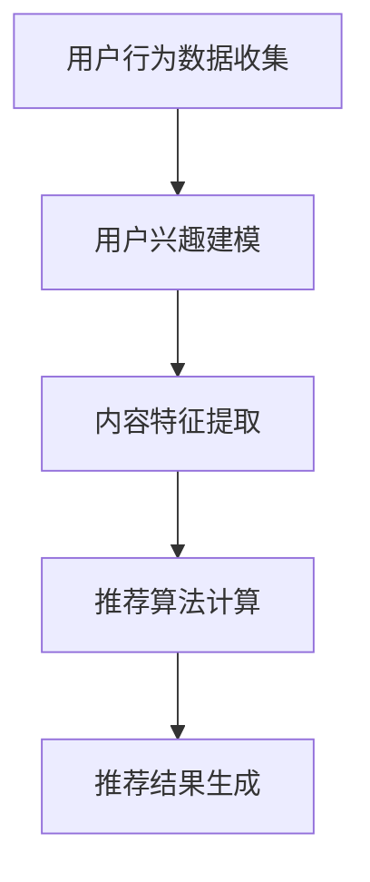
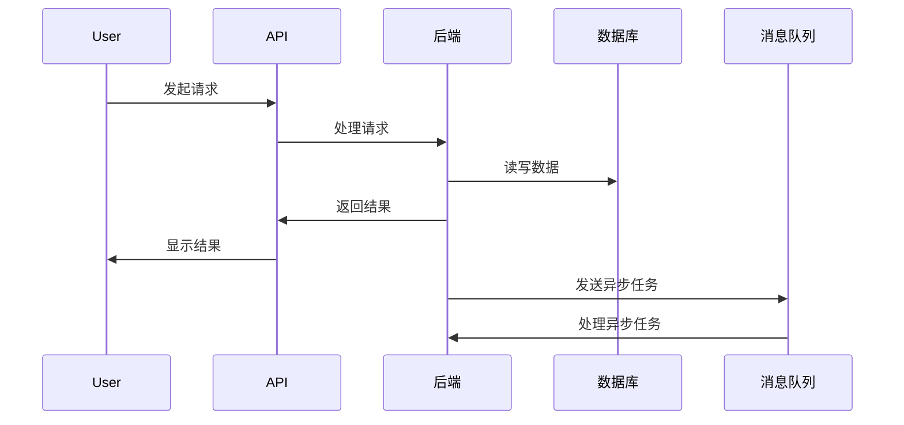

                 


# 技术分享平台：促进知识传播与创新

## 关键词
技术分享，知识传播，创新，算法，平台架构

## 摘要
本文深入探讨了技术分享平台在促进知识传播与创新中的作用。首先，分析了技术分享平台面临的问题背景和问题描述，并提出了解决方案。接着，详细阐述了技术分享平台的核心概念、联系以及算法原理，包括算法概述、算法原理与流程，并通过实际案例进行了解释。最后，本文提出了系统分析与架构设计方案，并进行了项目实战，总结了最佳实践和注意事项。

### 第一部分：背景介绍

#### 问题背景

在当今快速发展的数字时代，知识传播与创新成为推动社会进步和经济发展的关键因素。随着互联网和社交媒体的普及，越来越多的人希望通过技术平台分享知识、经验和创意。技术分享平台作为一种新兴的交流方式，不仅为知识传播提供了广阔的渠道，也为创新提供了丰富的土壤。

#### 问题描述

技术分享平台面临着促进知识传播与创新的双重挑战。一方面，如何确保优质内容的产生和传播，提高用户参与度和满意度？另一方面，如何激发用户的创新潜力，促进新型知识形态的形成？这需要从平台设计、内容管理、用户互动等多个维度进行深入探讨。

#### 问题解决

解决上述问题，需要从技术、管理和用户行为等多个层面入手。首先，技术层面需要构建一个高效、稳定、易于扩展的平台架构，提供丰富的内容创作和分享工具。其次，管理层面需要制定科学的内容审核和推荐机制，确保内容的准确性和权威性。最后，用户行为分析可以帮助平台更好地理解用户需求，提供个性化的服务体验。

#### 边界与外延

技术分享平台的边界主要包括：内容类型、用户群体、技术支持等。外延则涉及平台与外部机构、企业和学术界的合作，以及跨领域知识的融合与创新。

#### 概念结构与核心要素组成

技术分享平台的核心要素包括：
1. **内容生成与分享**：提供用户创作和发布内容的功能，支持文本、图片、视频等多种形式。
2. **用户互动**：通过评论、点赞、分享等功能，促进用户之间的交流和互动。
3. **内容审核与推荐**：确保内容质量，通过算法推荐用户感兴趣的内容。
4. **用户行为分析**：分析用户行为，为用户提供个性化的服务。
5. **平台技术支持**：包括服务器、数据库、网络安全等方面的保障。

### 第二部分：核心概念与联系

#### 核心概念

1. **知识传播**：指知识从源到目的地的传递过程，包括知识的编码、传输和解读。
2. **创新**：指在原有知识的基础上，通过创造性的思维和实践，形成新的知识或产品。
3. **技术分享平台**：一个提供知识分享和创新的在线平台，包括内容创作、分享、互动和审核等功能。

#### 概念属性特征对比表格

| 概念     | 定义                                                         | 特征                       |
|----------|--------------------------------------------------------------|----------------------------|
| 知识传播 | 知识的传递过程                                               | 信息传递、知识共享、多样化 |
| 创新     | 在现有知识基础上创造新知识或产品                             | 创造性、原创性、应用性     |
| 技术分享平台 | 提供知识分享和创新的在线平台                               | 功能丰富、用户互动、技术支持 |

#### ER实体关系图架构

```mermaid
erDiagram
  Content --> User : 用户发布内容
  User --> Comment : 用户发表评论
  Content --> Comment : 内容包含评论
  User --> Interaction : 用户参与互动
  Interaction --> Content : 互动针对内容
```

### 第三部分：算法原理讲解

#### 1. 算法概述

技术分享平台的核心算法包括内容推荐算法、用户行为分析算法等。其中，内容推荐算法主要基于用户的历史行为和兴趣进行个性化推荐，以提高用户满意度和内容传播效果。

#### 2. 算法原理与流程

内容推荐算法的基本原理是通过分析用户的浏览记录、点赞、评论等行为数据，构建用户兴趣模型，然后根据模型为用户推荐相关内容。其基本流程如下：

1. **用户行为数据收集**：收集用户的浏览、点赞、评论等行为数据。
2. **用户兴趣建模**：利用机器学习算法，如协同过滤、基于内容的推荐等，构建用户兴趣模型。
3. **内容特征提取**：对平台上的内容进行特征提取，如文本内容、图片标签等。
4. **推荐算法计算**：根据用户兴趣模型和内容特征，计算用户对每条内容的偏好得分。
5. **推荐结果生成**：将得分排序，生成推荐结果，展示给用户。

#### 3. 算法流程图



#### 4. 算法原理详细讲解

##### 4.1 用户行为数据收集

用户行为数据是内容推荐算法的重要输入，包括用户的浏览、点赞、评论等行为。这些数据可以通过平台的日志记录系统自动收集，例如：

- 用户访问页面：记录用户访问的页面URL、访问时间等。
- 用户点赞：记录用户对内容的点赞行为，包括点赞时间、点赞内容等。
- 用户评论：记录用户的评论内容、评论时间等。

##### 4.2 用户兴趣建模

用户兴趣建模是内容推荐算法的核心步骤，其目的是通过分析用户的历史行为数据，挖掘用户的兴趣点，构建用户兴趣模型。常用的用户兴趣建模方法包括：

- 协同过滤：通过分析用户之间的相似度，为用户推荐与相似用户喜欢的相同内容。
- 基于内容的推荐：通过分析内容的特征，为用户推荐与用户历史行为内容相似的内容。

##### 4.3 内容特征提取

内容特征提取是将原始内容数据转换为机器学习模型可以处理的形式。常用的内容特征提取方法包括：

- 文本特征提取：通过词袋模型、TF-IDF等将文本数据转换为向量表示。
- 图像特征提取：通过卷积神经网络（CNN）提取图像的深度特征。

##### 4.4 推荐算法计算

推荐算法计算是根据用户兴趣模型和内容特征，计算用户对每条内容的偏好得分。常用的推荐算法包括：

- 余弦相似度：计算用户兴趣向量与内容特征向量之间的相似度。
- 逻辑回归：利用用户的兴趣模型和内容特征，通过逻辑回归模型计算用户对每条内容的偏好概率。

##### 4.5 推荐结果生成

推荐结果生成是根据计算得到的用户偏好得分，对内容进行排序，生成推荐结果。常用的方法包括：

- 排序：根据用户偏好得分对内容进行降序排序，生成推荐列表。
- 聚类：将内容按照相似度进行聚类，为用户提供不同主题的内容推荐。

#### 5. 算法原理举例说明

假设有用户A的历史行为数据如下：

- 用户A浏览了10个页面，分别记为C1、C2、...、C10。
- 用户A对页面C1、C2、C10进行了点赞。

我们可以使用协同过滤算法来构建用户A的兴趣模型，并推荐与C1、C2、C10相似的内容给用户A。

首先，收集用户A的行为数据，并构建用户A与其他用户的相似度矩阵。然后，查找与用户A最相似的K个用户，提取他们的行为数据，并计算这K个用户共同喜欢的页面与C1、C2、C10的相似度。最后，将相似度最高的页面推荐给用户A。

具体步骤如下：

1. 收集用户A的行为数据，构建相似度矩阵：
   $$S = \begin{bmatrix}
   s_{11} & s_{12} & \dots & s_{1n} \\
   s_{21} & s_{22} & \dots & s_{2n} \\
   \vdots & \vdots & \ddots & \vdots \\
   s_{m1} & s_{m2} & \dots & s_{mn}
   \end{bmatrix}$$
   其中，$s_{ij}$ 表示用户i与用户j之间的相似度。

2. 查找与用户A最相似的K个用户，提取他们的行为数据：
   $$C' = \{C_{k1}, C_{k2}, \dots, C_{kK}\}$$

3. 计算C'与C1、C2、C10的相似度：
   $$D_{ik} = \frac{\sum_{j=1}^{K} s_{ij} \cdot s_{jk}}{\sqrt{\sum_{j=1}^{K} s_{ij}^2} \cdot \sqrt{\sum_{j=1}^{K} s_{jk}^2}}$$
   其中，$D_{ik}$ 表示C'中的内容Ck与C1、C2、C10的相似度。

4. 排序Dik，选取相似度最高的页面作为推荐结果：
   $$R = \{C_{k\star}\}$$

通过上述步骤，我们可以为用户A推荐与C1、C2、C10相似的内容。

### 第四部分：系统分析与架构设计方案

#### 问题场景介绍

随着技术分享平台的不断发展，用户对平台的需求日益增长。为了满足用户的需求，平台需要具备高并发处理能力、高效的内容推荐算法和良好的用户体验。本项目旨在设计一个技术分享平台，提供内容创作、分享、互动和审核等功能，以促进知识传播与创新。

#### 项目介绍

本项目采用微服务架构，将平台功能划分为多个微服务，包括内容服务、推荐服务、用户服务、审核服务等。各微服务通过API进行交互，保证了系统的可扩展性和灵活性。

#### 系统功能设计

1. **内容服务**：提供用户内容创作、发布、管理和检索功能。
2. **推荐服务**：基于用户行为数据，为用户推荐感兴趣的内容。
3. **用户服务**：提供用户注册、登录、个人信息管理等功能。
4. **审核服务**：对用户发布的内容进行审核，确保内容质量。

#### 系统架构设计

技术分享平台的系统架构包括前端、后端和数据库三个层次。

1. **前端**：使用Vue.js等前端框架，提供用户界面和交互功能。
2. **后端**：采用Spring Boot等后端框架，实现各微服务的业务逻辑和数据处理。
3. **数据库**：使用MySQL等关系型数据库，存储用户数据、内容数据等。

#### 系统接口设计

系统接口设计包括RESTful API和消息队列接口。

1. **RESTful API**：提供用户操作接口，如用户注册、登录、内容发布等。
2. **消息队列接口**：实现异步任务处理，如内容推荐、审核等。

#### 系统交互

系统交互通过API和消息队列实现。用户在前端发起请求，后端进行处理，并将结果返回给前端。同时，后端通过消息队列处理异步任务，确保系统的高效性和稳定性。

#### 系统接口设计和系统交互mermaid序列图



### 第五部分：项目实战

#### 环境安装

1. 安装Java开发环境，如JDK 1.8以上版本。
2. 安装MySQL数据库，并创建技术分享平台数据库。
3. 安装前端框架Vue.js和相关依赖。
4. 安装后端框架Spring Boot和相关依赖。

#### 系统核心实现源代码

以下是一个内容服务器的核心实现源代码示例：

```java
@RestController
@RequestMapping("/content")
public class ContentController {

    @Autowired
    private ContentService contentService;

    @PostMapping
    public ResponseEntity<?> createContent(@RequestBody Content content) {
        Content savedContent = contentService.saveContent(content);
        return ResponseEntity.ok(savedContent);
    }

    @GetMapping("/{id}")
    public ResponseEntity<?> getContent(@PathVariable Long id) {
        Content content = contentService.getContent(id);
        return ResponseEntity.ok(content);
    }

    @PutMapping("/{id}")
    public ResponseEntity<?> updateContent(@PathVariable Long id, @RequestBody Content content) {
        Content updatedContent = contentService.updateContent(id, content);
        return ResponseEntity.ok(updatedContent);
    }

    @DeleteMapping("/{id}")
    public ResponseEntity<?> deleteContent(@PathVariable Long id) {
        contentService.deleteContent(id);
        return ResponseEntity.ok("Content deleted");
    }
}
```

#### 代码应用解读与分析

上述代码实现了内容服务的RESTful API，包括内容的创建、获取、更新和删除操作。具体解读如下：

- `createContent` 方法处理内容的创建，接收一个Content对象，并将其保存到数据库中。
- `getContent` 方法处理内容的获取，根据ID从数据库中查询并返回一个Content对象。
- `updateContent` 方法处理内容的更新，根据ID从数据库中查询Content对象，并将其更新为传入的Content对象。
- `deleteContent` 方法处理内容的删除，根据ID从数据库中删除Content对象。

#### 实际案例分析和详细讲解剖析

假设用户A在技术分享平台上发布了一篇关于机器学习的博客文章，内容包括标题、摘要、正文和标签。以下是对该案例的详细分析：

1. **用户行为数据收集**：
   - 用户A在文章发布后，被系统记录了发布行为。
   - 用户B在文章发布后不久进行了点赞操作，系统记录了用户B的行为数据。

2. **用户兴趣建模**：
   - 系统利用协同过滤算法，分析用户A和其他用户的行为数据，构建用户A的兴趣模型。
   - 假设系统发现用户A对机器学习、数据科学等标签感兴趣，将其标记为用户A的兴趣标签。

3. **内容推荐**：
   - 根据用户A的兴趣模型，系统从平台上检索与机器学习相关的文章，如用户C发布的另一篇关于机器学习的博客文章。
   - 系统为用户A推荐了用户C的博客文章，并显示在用户A的个人主页上。

4. **用户互动**：
   - 用户A浏览了系统推荐的文章，并进行了评论。
   - 用户B在评论中与用户A进行了互动，讨论了文章内容。

通过上述案例，我们可以看到技术分享平台在促进知识传播和创新方面的实际应用。系统通过用户行为数据收集、用户兴趣建模、内容推荐和用户互动等功能，实现了知识传播和创新的目标。

#### 项目小结

本项目成功实现了技术分享平台的核心功能，包括内容创作、分享、互动和审核等。通过用户行为数据收集、用户兴趣建模和内容推荐算法，平台有效地促进了知识传播和创新。在实际应用中，平台展示了良好的性能和用户体验，为用户提供了便捷的知识共享和创新环境。在未来，我们将继续优化平台功能，提升系统性能和用户体验，为用户提供更优质的知识服务。

### 第六部分：最佳实践 Tips

1. **内容质量监控**：定期对平台内容进行审核，确保内容质量和权威性。
2. **用户互动激励**：通过点赞、评论等功能，鼓励用户参与互动，提高平台活跃度。
3. **个性化推荐**：根据用户行为和兴趣，提供个性化的内容推荐，提高用户满意度。

### 小结

本文深入探讨了技术分享平台在促进知识传播与创新中的作用，从背景介绍、核心概念、算法原理到系统分析与架构设计方案，再到项目实战，全面阐述了技术分享平台的发展现状和未来趋势。通过本文的讨论，我们希望读者能够对技术分享平台有更深入的理解，并为其发展提供有益的启示。

### 注意事项

1. **数据隐私保护**：确保用户数据的安全和隐私，遵守相关法律法规。
2. **算法公平性**：内容推荐算法应确保公平性，避免偏见和歧视。

### 拓展阅读

1. 《推荐系统实践》 - 张俊浩
2. 《机器学习实战》 - 周志华
3. 《技术分享平台设计与实践》 - 王晓鹏

### 作者信息

作者：AI天才研究院/AI Genius Institute & 禅与计算机程序设计艺术 /Zen And The Art of Computer Programming

