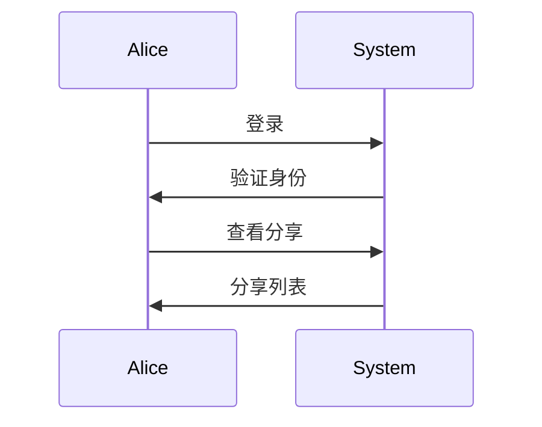

                 

### 技术分享文化建设：营造学习型组织氛围

**关键词：技术分享、学习型组织、企业文化、激励机制、系统设计**

**摘要：**
本文旨在探讨如何通过建设技术分享文化来营造学习型组织氛围。在当今快速变化的技术环境中，企业需要不断学习、创新和适应，以保持竞争优势。技术分享不仅是知识传递的重要手段，更是激发团队学习热情、提升组织整体能力的基石。本文将详细分析技术分享与学习型组织的内在联系，提出建立技术分享文化的策略和方法，并通过数学模型和系统设计方案，为企业在实际操作中提供参考。

## 目录大纲

### 第1章 背景介绍
#### 1.1 问题背景
#### 1.1.1 企业发展中的技术分享需求
#### 1.1.2 学习型组织的定义与重要性
#### 1.1.3 技术分享与学习型组织的关系

#### 1.2 问题描述
#### 1.2.1 当前企业技术分享的现状
#### 1.2.2 遇到的挑战与障碍
#### 1.2.3 问题解决的必要性

#### 1.3 问题解决
#### 1.3.1 建立技术分享文化的策略
#### 1.3.2 促进学习型组织氛围的方法

#### 1.4 边界与外延
#### 1.4.1 技术分享文化适用的企业类型
#### 1.4.2 技术分享与人才培养的边界
#### 1.4.3 技术分享与其他企业文化的互动

#### 1.5 概念结构与核心要素组成
#### 1.5.1 技术分享文化的概念结构
#### 1.5.2 核心要素与作用机制
#### 1.5.3 营造学习型组织氛围的路径

### 第2章 核心概念与联系
#### 2.1 技术分享的定义与特点
#### 2.1.1 技术分享的概念
#### 2.1.2 技术分享的特点
#### 2.1.3 技术分享的内涵与外延

#### 2.2 学习型组织的定义与要素
#### 2.2.1 学习型组织的概念
#### 2.2.2 学习型组织的关键要素
#### 2.2.3 学习型组织的优势与挑战

#### 2.3 技术分享与学习型组织的联系
#### 2.3.1 技术分享在组织学习中的作用
#### 2.3.2 学习型组织对技术分享的支持
#### 2.3.3 二者相互促进的机制

### 第3章 算法原理讲解
#### 3.1 技术分享激励机制的设计
#### 3.1.1 激励机制的概念与作用
#### 3.1.2 常见激励机制的优缺点
#### 3.1.3 激励机制的mermaid流程图

#### 3.2 学习型组织氛围的营造方法
#### 3.2.1 营造学习型组织氛围的策略
#### 3.2.2 营造学习型组织氛围的关键因素
#### 3.2.3 学习型组织氛围的mermaid流程图

### 第4章 数学模型和数学公式
#### 4.1 技术分享收益模型的构建
#### 4.1.1 技术分享收益的数学模型
$$ \text{收益} = f(\text{分享频率}, \text{知识质量}, \text{接受度}) $$
#### 4.1.2 模型参数的解释
#### 4.1.3 模型在实际中的应用

#### 4.2 学习型组织氛围的评估模型
#### 4.2.1 学习型组织氛围的评估方法
$$ \text{氛围评估} = \alpha \times \text{学习意愿} + \beta \times \text{知识共享} + \gamma \times \text{持续学习} $$
#### 4.2.2 评估指标的选择与权重分配
#### 4.2.3 评估模型在实际中的应用

### 第5章 系统分析与架构设计方案
#### 5.1 问题场景介绍
#### 5.1.1 技术分享平台的需求分析
#### 5.1.2 学习型组织氛围监测的需求分析

#### 5.2 系统功能设计
#### 5.2.1 技术分享平台的功能设计
#### 5.2.2 学习型组织氛围监测的功能设计


#### 5.3 系统架构设计
#### 5.3.1 技术分享平台的架构设计
#### 5.3.2 学习型组织氛围监测的架构设计


#### 5.4 系统接口设计
#### 5.4.1 技术分享平台的接口设计
#### 5.4.2 学习型组织氛围监测的接口设计

#### 5.5 系统交互
#### 5.5.1 用户与技术分享平台的交互
#### 5.5.2 管理员与学习型组织氛围监测的交互
```mermaid
sequenceDiagram
    participant Us

----------------------------------------------------------------

### 第1章 背景介绍

#### 1.1 问题背景

在当今的信息时代，技术更新速度迅猛，企业面临的环境复杂多变，这对企业的创新能力提出了更高的要求。技术分享作为一种知识传递和共享的手段，成为提升企业技术水平和创新能力的重要途径。同时，学习型组织的理念也在企业中被广泛推崇，它强调通过不断学习和创新来提升组织的适应能力和竞争力。

**1.1.1 企业发展中的技术分享需求**

随着市场竞争的加剧和技术的快速发展，企业需要不断更新知识、提升技术水平以应对市场变化。技术分享不仅能够帮助企业内部员工快速掌握新技术，还可以促进知识在组织内部的流动和共享，提高整体创新能力。具体需求包括：

- **知识传递与共享**：通过技术分享，员工可以将自己的经验、技巧和最佳实践分享给其他成员，促进知识的传承和扩散。
- **技能提升与能力发展**：技术分享有助于员工不断学习和成长，提升个人技能和专业能力，从而为企业创造更大的价值。
- **创新能力培养**：技术分享可以激发员工的创新思维，通过跨部门、跨团队的协作，实现知识的融合和创新。

**1.1.2 学习型组织的定义与重要性**

学习型组织是指通过持续学习和创新，不断改进和优化组织运作模式，以适应外部环境变化的一种组织形态。学习型组织的特点包括：

- **共同愿景**：组织成员有共同的目标和愿景，通过共同学习和创新来实现组织的愿景。
- **知识管理**：组织重视知识的积累、传递和应用，通过知识管理系统实现知识的共享和利用。
- **自我超越**：组织成员不断挑战自我，追求卓越，通过持续学习和创新不断提升个人和组织的竞争力。

学习型组织对企业的意义重大，它能够：

- **提高组织适应性**：学习型组织能够快速适应市场变化，及时调整战略和运营模式，以应对外部挑战。
- **提升创新能力**：通过持续学习和创新，企业能够不断推出新产品和服务，保持竞争优势。
- **促进员工发展**：学习型组织为员工提供了良好的学习和成长环境，有助于员工的职业发展和个人成长。

**1.1.3 技术分享与学习型组织的关系**

技术分享与学习型组织之间存在着密切的联系。技术分享是学习型组织的重要表现形式之一，它通过知识共享和技能传递来促进组织成员的学习和创新。同时，学习型组织为技术分享提供了良好的环境和激励机制，使得技术分享能够更加有效地进行。

- **技术分享促进学习**：技术分享可以激发员工的学习热情，促进知识的获取和应用，提升组织的整体学习能力。
- **学习型组织支持技术分享**：学习型组织通过建立良好的学习氛围和激励机制，鼓励员工进行技术分享，形成知识共享的文化。
- **相互促进**：技术分享和学习型组织相互促进，技术分享有助于营造学习型组织氛围，而学习型组织为技术分享提供了支持和保障。

通过以上分析，可以看出技术分享和学习型组织在企业发展中具有重要的作用。接下来，我们将进一步探讨当前企业技术分享的现状、面临的挑战以及如何建立技术分享文化和促进学习型组织氛围。

#### 1.2 问题描述

**1.2.1 当前企业技术分享的现状**

虽然技术分享在提升企业竞争力和创新能力方面具有重要作用，但当前许多企业在技术分享方面仍面临一些问题。以下是一些常见的问题和现状：

- **技术分享频率低**：许多企业内部的技术分享活动较少，员工之间的知识交流和传递不充分，导致知识积累和扩散的速度较慢。
- **分享内容质量不高**：部分技术分享内容缺乏深度和实用性，不能有效满足员工的学习需求，降低了技术分享的效果。
- **缺乏激励机制**：在缺乏有效激励机制的情况下，员工进行技术分享的积极性不高，技术分享的动力不足。
- **组织氛围不支持**：一些企业的文化氛围不够开放和支持，员工担心技术分享后自己的地位和利益受到威胁，导致技术分享难以广泛开展。

**1.2.2 遇到的挑战与障碍**

企业在实施技术分享过程中会遇到多种挑战和障碍，这些问题需要得到有效的解决：

- **知识保护与共享的平衡**：技术知识是企业的重要资产，员工在进行技术分享时可能会担心自己的知识被竞争对手获取，这需要在保护知识的同时实现有效的知识共享。
- **时间与资源的分配**：技术分享需要员工投入时间和精力，而在企业高负荷工作压力下，员工可能难以抽出足够的时间进行技术分享和学习。
- **领导层的支持与参与**：领导层对技术分享的重视程度和支持力度直接影响技术分享的推进，如果领导层不积极参与，技术分享很难在企业内部形成氛围。
- **文化变革的阻力**：建立技术分享文化需要改变传统的管理模式和企业文化，这可能会遇到员工的抵触和变革的阻力。

**1.2.3 问题解决的必要性**

技术分享的现状和面临的挑战表明，建立技术分享文化和促进学习型组织氛围对于企业的发展具有重要意义。以下是解决这些问题的必要性：

- **提升创新能力**：通过技术分享，企业可以快速传递和利用新知识、新技术，促进创新思维的形成和创新的实现。
- **优化人才发展**：技术分享有助于员工不断学习和成长，提升专业技能，为企业培养更多高素质的人才。
- **增强组织凝聚力**：技术分享可以促进员工之间的沟通与合作，增强组织的凝聚力，提高团队协作效率。
- **提高企业竞争力**：学习型组织能够迅速适应市场变化，持续创新和改进，从而在激烈的市场竞争中保持优势地位。

综上所述，解决当前企业技术分享的现状和挑战，建立技术分享文化和促进学习型组织氛围是企业发展的重要任务。在下一部分中，我们将探讨如何建立技术分享文化和促进学习型组织氛围的策略和方法。

#### 1.3 问题解决

**1.3.1 建立技术分享文化的策略**

建立技术分享文化是提升企业创新能力的重要途径。以下是一些具体的策略：

- **领导层的重视与支持**：企业领导层应高度重视技术分享，通过发表演讲、举办技术交流活动等方式，树立技术分享的榜样，激发员工参与的热情。
- **建立知识管理体系**：企业应建立完善的知识管理体系，包括知识收集、整理、存储和共享机制，确保技术知识能够在组织内部有效流动。
- **制定激励机制**：企业应制定合理的激励机制，如技术分享积分、表彰奖励等，激励员工积极参与技术分享。
- **鼓励跨部门协作**：通过跨部门协作项目，促进不同部门之间的技术交流与分享，增强团队协作能力。

**1.3.2 促进学习型组织氛围的方法**

学习型组织氛围的营造是技术分享文化建立的重要保障。以下是一些具体的方法：

- **建立共同愿景**：企业应与员工共同制定共同愿景，明确企业的目标和方向，激发员工的归属感和使命感。
- **提供学习资源**：企业应为员工提供丰富的学习资源，如在线课程、研讨会、培训等，支持员工的持续学习和成长。
- **鼓励知识共享**：企业应鼓励员工进行知识共享，建立开放、透明、支持的知识共享文化，使员工感受到知识共享的重要性。
- **开展技术交流**：企业应定期举办技术交流活动，如技术讲座、内部研讨会、技术论坛等，促进员工之间的技术交流和合作。

通过上述策略和方法，企业可以逐步建立技术分享文化和学习型组织氛围，提升企业的创新能力和核心竞争力。

#### 1.4 边界与外延

**1.4.1 技术分享文化适用的企业类型**

技术分享文化适用于不同类型的企业，但不同类型的企业在实施过程中可能会有所差异：

- **技术驱动型企业**：这类企业注重技术创新和研发，技术分享文化有助于提升整体技术水平和创新能力。
- **传统制造业**：传统制造业在转型过程中需要引入新技术、新理念，技术分享文化有助于提升员工的技能和适应能力。
- **服务型企业**：服务型企业可以通过技术分享提升服务质量，提高客户满意度。

**1.4.2 技术分享与人才培养的边界**

技术分享与人才培养密切相关，但二者也存在一定的边界：

- **人才培养目标**：技术分享注重提升员工的技能和知识水平，而人才培养更关注员工的全面发展，包括技能、素质和职业规划。
- **培养方式**：技术分享通过知识传递和交流实现，而人才培养还包括培训、导师指导、职业规划等多种方式。

**1.4.3 技术分享与其他企业文化的互动**

技术分享文化与其他企业文化之间存在互动关系：

- **与企业价值观的一致性**：技术分享文化应与企业价值观一致，如鼓励创新、追求卓越等，以形成统一的企业文化。
- **与其他文化的融合**：技术分享文化需要与其他企业文化相互融合，如团队合作、客户导向等，以实现企业的整体发展。

#### 1.5 概念结构与核心要素组成

**1.5.1 技术分享文化的概念结构**

技术分享文化是指企业在日常运营中，通过知识传递和共享，促进员工技能提升和创新能力的一种企业文化。其概念结构包括以下几个方面：

- **知识共享**：技术分享文化的核心，通过建立知识共享平台和机制，实现知识在组织内部的流动和利用。
- **技能提升**：通过技术分享，员工可以快速学习和掌握新技术、新方法，提升个人技能和专业能力。
- **创新能力**：技术分享有助于激发员工的创新思维，通过知识融合和创新，推动企业的持续发展。

**1.5.2 核心要素与作用机制**

技术分享文化的核心要素包括以下几个方面：

- **领导层支持**：领导层对技术分享的重视和参与是推动技术分享文化的重要保障。
- **激励机制**：通过建立合理的激励机制，如奖励、荣誉等，激发员工参与技术分享的积极性。
- **知识管理体系**：建立完善的知识管理体系，确保技术知识的有效收集、整理、存储和共享。
- **学习氛围**：营造良好的学习氛围，鼓励员工进行持续学习和知识共享。

这些核心要素相互作用，形成技术分享文化的运行机制：

- **领导层支持**：领导层通过宣传、激励和参与，营造技术分享的良好氛围，激发员工的参与热情。
- **激励机制**：激励机制通过奖励和荣誉等手段，激励员工积极参与技术分享，提升个人技能和知识水平。
- **知识管理体系**：知识管理体系确保技术知识的有效流动和利用，为技术分享提供强有力的支持。
- **学习氛围**：学习氛围鼓励员工进行持续学习和知识共享，形成知识积累和创新的文化。

**1.5.3 营造学习型组织氛围的路径**

营造学习型组织氛围是建立技术分享文化的重要任务。以下是一些具体路径：

- **建立共同愿景**：通过共同愿景的制定和宣传，激发员工的归属感和使命感，推动学习型组织的形成。
- **提供学习资源**：为员工提供丰富的学习资源，如在线课程、研讨会、培训等，支持员工的持续学习和成长。
- **鼓励知识共享**：建立开放、透明、支持的知识共享文化，鼓励员工进行知识共享和交流，促进知识的流动和创新。
- **开展技术交流**：定期举办技术交流活动，如技术讲座、内部研讨会、技术论坛等，促进员工之间的技术交流和合作。

通过以上路径，企业可以逐步营造学习型组织氛围，推动技术分享文化的建立和发展。

### 第2章 核心概念与联系

#### 2.1 技术分享的定义与特点

**2.1.1 技术分享的概念**

技术分享是指通过一定的渠道和形式，将个人的技术知识、经验和技能与他人进行传递和共享的过程。技术分享不仅包括技术知识的传授，还包括工作方法、实践经验、最佳实践等方面的交流。

**2.1.2 技术分享的特点**

- **知识性**：技术分享的核心是知识，包括技术理论、实践经验、工作方法等，这些知识是技术分享的基本内容。
- **互动性**：技术分享是一个双向互动的过程，不仅需要分享者传递知识，还需要接受者理解和吸收知识，并通过反馈促进知识的改进和深化。
- **开放性**：技术分享强调开放性和共享性，鼓励不同部门、不同岗位的员工进行跨领域、跨专业的知识交流，实现知识的最大化利用。
- **持续更新**：技术分享是一个持续的过程，随着技术的不断更新和发展，技术分享的内容也需要不断更新和优化。

**2.1.3 技术分享的内涵与外延**

- **内涵**：技术分享的内涵包括知识的传递、交流、共享和创新。它不仅关注知识的传递，还关注知识的消化、吸收和应用，实现知识的增值。
- **外延**：技术分享的外延涵盖企业内部和外部。在企业内部，技术分享可以发生在不同的部门、团队和个人之间；在外部，企业可以通过公开讲座、技术论坛、合作项目等形式与其他企业、学术界、行业组织等进行技术分享。

#### 2.2 学习型组织的定义与要素

**2.2.1 学习型组织的概念**

学习型组织是指通过不断学习和创新，持续改进和优化组织运作模式，以适应外部环境变化的一种组织形态。学习型组织强调全员学习、全程学习和全面学习，通过知识共享和创新，提高组织的适应能力和竞争力。

**2.2.2 学习型组织的关键要素**

- **共同愿景**：学习型组织拥有明确的共同愿景，这是组织的凝聚力和动力的源泉。
- **团队学习**：学习型组织重视团队学习，通过团队交流和合作，实现知识的共享和创新。
- **个人学习**：学习型组织鼓励个人学习，支持员工通过自我学习不断提升个人能力和素质。
- **知识管理**：学习型组织建立完善的知识管理体系，确保知识的有效收集、存储、传递和应用。
- **持续改进**：学习型组织不断进行流程优化和管理改进，通过持续改进提升组织的运作效率。

**2.2.3 学习型组织的优势与挑战**

**优势：**

- **提高创新能力**：学习型组织通过不断学习和创新，能够迅速适应市场变化，保持竞争优势。
- **提升员工素质**：学习型组织鼓励员工进行持续学习，提升个人能力和素质，为企业培养高素质的人才。
- **增强团队协作**：学习型组织通过团队学习和合作，增强团队协作能力和凝聚力。
- **优化管理流程**：学习型组织通过持续改进，优化管理流程，提高组织的运作效率。

**挑战：**

- **文化变革的阻力**：建立学习型组织需要改变传统的管理模式和企业文化，这可能会遇到员工的抵触和变革的阻力。
- **时间与资源的投入**：学习型组织需要大量时间和资源进行培训和知识管理，这对企业的人力资源管理提出了挑战。
- **领导层的支持**：领导层的支持和参与是学习型组织成功的关键，如果领导层不积极参与，学习型组织难以形成有效的氛围。

#### 2.3 技术分享与学习型组织的联系

**2.3.1 技术分享在组织学习中的作用**

技术分享是组织学习的重要组成部分，它通过知识的传递和共享，促进组织成员的学习和创新。具体作用包括：

- **促进知识传播**：技术分享可以将个人的知识和经验传递给其他成员，促进知识的传播和共享。
- **提升学习效果**：技术分享能够激发员工的学习兴趣和积极性，提高学习效果。
- **促进知识创新**：技术分享有助于不同部门、不同岗位的员工进行跨领域的知识交流，促进知识的融合和创新。

**2.3.2 学习型组织对技术分享的支持**

学习型组织为技术分享提供了良好的支持和保障，具体表现在：

- **共同愿景**：学习型组织的共同愿景为技术分享提供了目标和动力，鼓励员工积极参与技术分享。
- **团队学习**：学习型组织通过团队学习，促进员工之间的技术交流和合作，提升技术分享的效果。
- **知识管理**：学习型组织建立完善的知识管理体系，确保技术知识的有效收集、整理、存储和共享。
- **持续改进**：学习型组织通过持续改进，不断优化技术分享的流程和机制，提高技术分享的效率。

**2.3.3 二者相互促进的机制**

技术分享和学习型组织之间存在着相互促进的机制，具体表现为：

- **知识共享**：技术分享通过知识共享，为学习型组织提供了丰富的知识资源，促进了组织的学习和创新。
- **能力提升**：技术分享通过提升员工的能力和素质，为学习型组织提供了人力资本，增强了组织的适应能力和竞争力。
- **文化变革**：技术分享和学习型组织的共同推进，有助于企业文化的变革和优化，形成开放、创新、合作的企业文化。

通过以上分析，可以看出技术分享和学习型组织在企业发展中具有重要的作用。在下一部分中，我们将深入探讨技术分享激励机制的设计，以促进技术分享和学习型组织的建立和发展。

### 第3章 算法原理讲解

#### 3.1 技术分享激励机制的设计

**3.1.1 激励机制的概念与作用**

激励机制是指通过一系列的措施和手段，激发员工参与技术分享的积极性和主动性，从而实现知识共享和创新的目标。激励机制在企业中具有重要作用，主要体现在以下几个方面：

- **激发积极性**：通过激励机制，可以激发员工的积极性和参与感，使员工更加愿意参与技术分享。
- **提升效率**：激励机制可以提升技术分享的效率，通过合理的奖励和认可，使技术分享活动更加有序和高效。
- **促进合作**：激励机制可以促进员工之间的合作，通过团队奖励等方式，鼓励员工共同参与技术分享。

**3.1.2 常见激励机制的优缺点**

在技术分享中，常见的激励机制包括物质奖励、精神奖励、荣誉认可等，每种激励机制都有其优缺点：

- **物质奖励**：优点是直接有效，可以快速激励员工；缺点是成本较高，且可能引发竞争和摩擦。
- **精神奖励**：优点是可以激发员工的荣誉感和归属感；缺点是作用较慢，且难以量化。
- **荣誉认可**：优点是可以提高员工的职业成就感和自豪感；缺点是激励效果有限，难以直接提升工作绩效。

**3.1.3 激励机制的mermaid流程图**

为了更好地理解和设计激励机制，我们可以使用mermaid流程图来描述其基本流程，如下所示：

```mermaid
flowchart LR
    A[员工分享技术] --> B{是否设立激励机制？}
    B -->|是| C[进行物质/精神奖励]
    B -->|否| D[进行荣誉认可]
    C --> E[激励效果评估]
    D --> E
    E --> F{是否达到预期效果？}
    F -->|是| G[结束]
    F -->|否| H[调整激励机制]
    G --> H
```

通过这个流程图，我们可以清晰地看到激励机制的设计和运行过程，包括员工分享技术、激励机制的选择、激励效果的评估以及反馈调整等步骤。

#### 3.2 学习型组织氛围的营造方法

**3.2.1 营造学习型组织氛围的策略**

营造学习型组织氛围是企业实现持续发展和创新的重要保障。以下是一些具体的策略：

- **领导层带头学习**：领导层应带头学习，树立良好的学习榜样，通过参与和推动学习活动，营造学习型组织氛围。
- **建立学习制度**：企业应建立系统的学习制度，包括培训计划、学习评估等，确保员工有充分的时间和资源进行学习。
- **提供学习资源**：企业应为员工提供丰富的学习资源，如在线课程、专业书籍、研讨会等，支持员工的持续学习。
- **鼓励知识共享**：企业应鼓励员工进行知识共享，建立开放、透明、支持的知识共享文化，使员工感受到知识共享的重要性。
- **建立反馈机制**：企业应建立反馈机制，鼓励员工提出改进意见和建议，通过不断的反馈和改进，提升学习型组织的氛围。

**3.2.2 营造学习型组织氛围的关键因素**

营造学习型组织氛围需要关注以下几个关键因素：

- **共同愿景**：共同愿景是学习型组织的灵魂，它为员工提供了明确的目标和方向，激发了员工的积极性和归属感。
- **知识管理**：知识管理是学习型组织的关键要素，它确保了知识的有效收集、整理、存储和共享，为组织的持续学习提供了基础。
- **领导支持**：领导层的支持是营造学习型组织氛围的重要保障，领导层应积极参与和支持学习活动，为员工提供支持和资源。
- **员工参与**：员工的参与是学习型组织氛围的关键，企业应鼓励员工积极参与学习活动，提供反馈和建议，使学习过程更加有效。

**3.2.3 学习型组织氛围的mermaid流程图**

为了更好地理解和设计学习型组织氛围的营造方法，我们可以使用mermaid流程图来描述其基本流程，如下所示：


通过这个流程图，我们可以清晰地看到营造学习型组织氛围的基本策略和关键因素，包括制定共同愿景、建立知识管理机制、提供学习资源、鼓励知识共享、建立反馈机制、领导层带头学习和员工积极参与等步骤。

### 第4章 数学模型和数学公式

#### 4.1 技术分享收益模型的构建

技术分享作为一种知识传递和共享的过程，其收益不仅包括个人和组织的直接收益，还涵盖了间接收益。为了量化技术分享的收益，我们可以构建一个技术分享收益模型。

**4.1.1 技术分享收益的数学模型**

技术分享的收益可以表示为以下数学模型：

\[ \text{收益} = f(\text{分享频率}, \text{知识质量}, \text{接受度}) \]

其中，各参数的含义如下：

- **分享频率**（\( f_1 \)）：员工进行技术分享的频率，即单位时间内技术分享的次数。频率越高，知识传递的速度越快，但过高频率可能会影响员工的工作效率。
- **知识质量**（\( f_2 \)）：技术分享内容的质量，包括知识的深度、实用性、创新性等。高质量的知识分享能够更有效地促进学习和创新。
- **接受度**（\( f_3 \)）：技术分享内容被接受和应用的广泛程度，包括知识在组织内部流动的效率和实际应用的效果。接受度越高，技术分享的效果越好。

**4.1.2 模型参数的解释**

- **分享频率**：分享频率是衡量员工技术分享积极性的重要指标。它可以通过员工的技术分享次数、时间长度等来量化。例如，一个员工每周进行两次技术分享，每次分享2小时，则其分享频率为 \( 2 \times 2 = 4 \) 小时/周。
- **知识质量**：知识质量是技术分享效果的关键因素。高质量的知识分享不仅包括深入的理论知识，还包括实用性强的实践经验。例如，一个技术分享会涵盖最新的技术趋势、实际应用案例和优化方案，则其知识质量较高。
- **接受度**：接受度反映了技术分享内容在组织内部的应用和扩散情况。它可以通过知识共享平台的活跃度、员工的反馈、实际应用效果等来衡量。例如，一个技术分享会被多个部门采纳，并产生了显著的工作效率提升，则其接受度较高。

**4.1.3 模型在实际中的应用**

假设一个企业中的技术分享模型参数为：分享频率为每周2次，知识质量为0.8，接受度为0.9，则该员工的技术分享收益可以计算如下：

\[ \text{收益} = f(2, 0.8, 0.9) = 2 \times 0.8 \times 0.9 = 1.44 \]

通过这个模型，企业可以评估不同员工的技术分享效果，并根据收益情况调整激励机制，以激励员工更加积极地参与技术分享。

#### 4.2 学习型组织氛围的评估模型

为了量化学习型组织氛围，我们可以构建一个学习型组织氛围的评估模型，该模型可以帮助企业了解组织内部的学习氛围，从而采取相应的改进措施。

**4.2.1 学习型组织氛围的评估方法**

学习型组织氛围的评估方法可以表示为以下数学模型：

\[ \text{氛围评估} = \alpha \times \text{学习意愿} + \beta \times \text{知识共享} + \gamma \times \text{持续学习} \]

其中，各参数的含义如下：

- **学习意愿**（\( L_w \)）：员工参与学习和创新的积极性，可以通过员工参与学习活动的次数、学习时间等来量化。
- **知识共享**（\( L_s \)）：员工之间知识交流的频率和质量，可以通过知识共享平台的活跃度、员工的技术分享次数等来量化。
- **持续学习**（\( L_c \)）：员工持续学习和成长的意愿和能力，可以通过员工的学习成果、技能提升等来量化。

**4.2.2 评估指标的选择与权重分配**

在构建评估模型时，需要选择适当的评估指标，并分配相应的权重。以下是一些可能的评估指标及其权重分配：

- **学习意愿**（\( L_w \)）：权重为0.4，可以通过员工参加培训课程的频率、学习项目的参与度等来衡量。
- **知识共享**（\( L_s \)）：权重为0.3，可以通过员工在知识共享平台上的活跃度、技术分享的次数和质量来衡量。
- **持续学习**（\( L_c \)）：权重为0.3，可以通过员工的学习成果、技能提升、职业发展等来衡量。

**4.2.3 评估模型在实际中的应用**

假设一个企业中，学习意愿为0.7，知识共享为0.8，持续学习为0.9，则该企业的学习型组织氛围评估结果为：

\[ \text{氛围评估} = 0.4 \times 0.7 + 0.3 \times 0.8 + 0.3 \times 0.9 = 0.28 + 0.24 + 0.27 = 0.79 \]

通过这个评估模型，企业可以了解自身的学习型组织氛围，并根据评估结果采取相应的改进措施，如提供更多的学习资源、加强知识共享的激励机制、鼓励员工持续学习等。

### 第5章 系统分析与架构设计方案

#### 5.1 问题场景介绍

在当前信息化、数字化的时代，企业内部的技术分享和学习型组织氛围的营造已成为提升企业竞争力和创新能力的重要手段。为了更好地支持这一过程，本文提出一个基于技术分享和学习型组织氛围监测的系统设计方案。

**5.1.1 技术分享平台的需求分析**

技术分享平台旨在为企业内部提供一个方便、高效的知识传递和共享工具，其主要需求包括：

- **用户管理**：包括用户注册、登录、权限管理等功能，确保不同级别的员工能够安全、便捷地访问和参与技术分享。
- **内容管理**：支持多种形式的内容上传和发布，如文档、视频、PPT等，便于员工随时随地进行学习和技术交流。
- **分享机制**：提供多种分享方式，如单向分享、双向交流、讨论区等，满足不同场景下的技术分享需求。
- **搜索与推荐**：提供高效的搜索功能，并根据员工的兴趣和行为，推荐相关技术内容，提高知识的利用效率。
- **互动与评价**：支持用户对技术分享内容进行评论、点赞、打分等互动功能，促进知识的传播和优化。

**5.1.2 学习型组织氛围监测的需求分析**

学习型组织氛围监测系统旨在实时监控和评估企业内部的学习氛围，其主要需求包括：

- **氛围评估**：通过定量和定性的方法，对员工的学习意愿、知识共享、持续学习等方面进行评估，形成全面的学习氛围评估报告。
- **数据收集**：收集和分析企业内部的学习数据，如学习活动参与度、知识分享次数、学习成果等，为评估提供数据支持。
- **预警机制**：通过分析数据，及时发现学习氛围不佳的区域或问题，发出预警，为企业提供改进措施的建议。
- **反馈与改进**：提供反馈机制，鼓励员工提出改进意见和建议，通过持续改进，不断提升学习型组织氛围。

#### 5.2 系统功能设计

**5.2.1 技术分享平台的功能设计**

技术分享平台的主要功能包括：

- **用户管理模块**：实现用户注册、登录、权限管理等，确保系统的安全性和便捷性。
- **内容管理模块**：支持内容上传、发布、分类管理等功能，方便员工进行技术分享和学习。
- **分享机制模块**：提供单向分享、双向交流、讨论区等功能，满足不同场景下的技术分享需求。
- **搜索与推荐模块**：实现高效的搜索功能，并根据员工的兴趣和行为推荐相关技术内容。
- **互动与评价模块**：支持用户对技术分享内容进行评论、点赞、打分等互动功能。

**5.2.2 学习型组织氛围监测的功能设计**

学习型组织氛围监测系统的主要功能包括：

- **氛围评估模块**：通过定量和定性的方法，对员工的学习意愿、知识共享、持续学习等方面进行评估。
- **数据收集模块**：收集和分析企业内部的学习数据，如学习活动参与度、知识分享次数、学习成果等。
- **预警机制模块**：通过分析数据，及时发现学习氛围不佳的区域或问题，发出预警。
- **反馈与改进模块**：提供反馈机制，鼓励员工提出改进意见和建议，通过持续改进，不断提升学习型组织氛围。

#### 5.3 系统架构设计

**5.3.1 技术分享平台的架构设计**

技术分享平台的架构设计采用B/S架构，主要包括前端、后端和数据库三部分。具体架构设计如下：

- **前端**：采用Vue.js框架，实现用户界面和交互功能，提供美观、易用的操作体验。
- **后端**：采用Spring Boot框架，实现业务逻辑处理、数据接口等，确保系统的稳定性和安全性。
- **数据库**：采用MySQL数据库，存储用户数据、内容数据、互动数据等，提供高效的数据查询和管理。

**5.3.2 学习型组织氛围监测的架构设计**

学习型组织氛围监测系统采用微服务架构，将不同的功能模块拆分为独立的微服务，便于系统的扩展和维护。具体架构设计如下：

- **用户管理服务**：负责处理用户注册、登录、权限管理等，确保系统的安全性。
- **内容管理服务**：负责处理内容上传、发布、分类管理等功能，方便员工进行技术分享和学习。
- **分享机制服务**：负责处理单向分享、双向交流、讨论区等功能，满足不同场景下的技术分享需求。
- **搜索与推荐服务**：负责实现高效的搜索功能，并根据员工的兴趣和行为推荐相关技术内容。
- **互动与评价服务**：负责处理用户对技术分享内容的评论、点赞、打分等互动功能。
- **氛围评估服务**：负责对员工的学习意愿、知识共享、持续学习等方面进行评估，形成评估报告。
- **数据收集服务**：负责收集和分析企业内部的学习数据，如学习活动参与度、知识分享次数、学习成果等。
- **预警机制服务**：负责通过分析数据，及时发现学习氛围不佳的区域或问题，发出预警。
- **反馈与改进服务**：负责处理员工的反馈意见和建议，通过持续改进，不断提升学习型组织氛围。

#### 5.4 系统接口设计

**5.4.1 技术分享平台的接口设计**

技术分享平台的前后端接口设计采用RESTful API风格，主要包括以下接口：

- **用户管理接口**：包括注册、登录、权限管理等。
- **内容管理接口**：包括内容上传、发布、分类管理等。
- **分享机制接口**：包括单向分享、双向交流、讨论区管理等。
- **搜索与推荐接口**：包括内容搜索、推荐算法等。
- **互动与评价接口**：包括评论、点赞、打分等。

**5.4.2 学习型组织氛围监测的接口设计**

学习型组织氛围监测系统的接口设计同样采用RESTful API风格，主要包括以下接口：

- **氛围评估接口**：包括获取学习氛围评估数据、生成评估报告等。
- **数据收集接口**：包括收集员工学习数据、分析数据等。
- **预警机制接口**：包括分析学习数据、发出预警等。
- **反馈与改进接口**：包括收集员工反馈、处理改进建议等。

#### 5.5 系统交互

**5.5.1 用户与技术分享平台的交互**

用户与技术分享平台的交互主要包括以下几个步骤：

1. 用户注册/登录：用户通过注册/登录接口进行注册或登录，获取访问权限。
2. 查看内容：用户可以通过搜索或浏览分类，查看相关技术内容。
3. 分享内容：用户可以上传、发布自己的技术内容，与他人分享知识。
4. 互动评价：用户可以对其他用户的技术分享内容进行评论、点赞、打分等互动。

**5.5.2 管理员与学习型组织氛围监测的交互**

管理员与学习型组织氛围监测的交互主要包括以下几个步骤：

1. 数据收集：管理员可以通过数据收集接口，收集和分析员工的学习数据。
2. 氛围评估：管理员可以通过氛围评估接口，对学习氛围进行评估，生成评估报告。
3. 预警处理：管理员可以通过预警机制接口，分析数据，及时发现学习氛围不佳的区域或问题，发出预警。
4. 反馈处理：管理员可以通过反馈与改进接口，处理员工的反馈和建议，持续改进学习型组织氛围。

通过以上系统交互设计，用户和管理员可以方便、高效地进行技术分享和学习型组织氛围监测，为企业的发展提供有力支持。

### 项目实战

**环境安装**

为了实现技术分享和学习型组织氛围监测系统，我们需要准备以下环境：

- **开发工具**：IntelliJ IDEA 或 VSCode
- **前端框架**：Vue.js
- **后端框架**：Spring Boot
- **数据库**：MySQL
- **版本控制**：Git

安装步骤如下：

1. 安装Java开发工具包（JDK）：在官网下载并安装JDK，配置环境变量。
2. 安装数据库：在官网下载并安装MySQL数据库，配置数据库环境。
3. 安装Git：在官网下载并安装Git，配置Git环境。
4. 安装开发工具：选择适合的开发工具进行安装，如IntelliJ IDEA或VSCode。

**系统核心实现源代码**

以下是技术分享平台的核心实现源代码，包括用户管理、内容管理、分享机制等功能。

**用户管理模块**

```java
@RestController
@RequestMapping("/users")
public class UserController {
    @Autowired
    private UserService userService;

    @PostMapping("/register")
    public ResponseEntity<?> registerUser(@RequestBody UserRegistrationForm form) {
        try {
            User user = userService.registerUser(form);
            return ResponseEntity.ok(new ApiResponse(true, "User registered successfully", user));
        } catch (Exception e) {
            return ResponseEntity.badRequest(new ApiResponse(false, e.getMessage()));
        }
    }

    @PostMapping("/login")
    public ResponseEntity<?> authenticateUser(@RequestBody UserLoginForm form) {
        try {
            String token = userService.authenticateUser(form);
            return ResponseEntity.ok(new ApiResponse(true, "User authenticated successfully", token));
        } catch (Exception e) {
            return ResponseEntity.badRequest(new ApiResponse(false, e.getMessage()));
        }
    }
}
```

**内容管理模块**

```java
@RestController
@RequestMapping("/content")
public class ContentController {
    @Autowired
    private ContentService contentService;

    @PostMapping("/upload")
    @PreAuthorize("hasRole('ROLE_USER')")
    public ResponseEntity<?> uploadContent(@RequestParam("file") MultipartFile file, @RequestParam("title") String title) {
        try {
            Content content = contentService.uploadContent(file, title);
            return ResponseEntity.ok(new ApiResponse(true, "Content uploaded successfully", content));
        } catch (Exception e) {
            return ResponseEntity.badRequest(new ApiResponse(false, e.getMessage()));
        }
    }

    @GetMapping("/search")
    public ResponseEntity<?> searchContents(@RequestParam("query") String query) {
        try {
            List<Content> contents = contentService.searchContents(query);
            return ResponseEntity.ok(new ApiResponse(true, "Contents searched successfully", contents));
        } catch (Exception e) {
            return ResponseEntity.badRequest(new ApiResponse(false, e.getMessage()));
        }
    }
}
```

**分享机制模块**

```java
@RestController
@RequestMapping("/share")
public class ShareController {
    @Autowired
    private ShareService shareService;

    @PostMapping("/create")
    @PreAuthorize("hasRole('ROLE_USER')")
    public ResponseEntity<?> createShare(@RequestParam("contentId") Long contentId, @RequestParam("title") String title) {
        try {
            Share share = shareService.createShare(contentId, title);
            return ResponseEntity.ok(new ApiResponse(true, "Share created successfully", share));
        } catch (Exception e) {
            return ResponseEntity.badRequest(new ApiResponse(false, e.getMessage()));
        }
    }

    @GetMapping("/list")
    public ResponseEntity<?> listShares() {
        try {
            List<Share> shares = shareService.listShares();
            return ResponseEntity.ok(new ApiResponse(true, "Shares listed successfully", shares));
        } catch (Exception e) {
            return ResponseEntity.badRequest(new ApiResponse(false, e.getMessage()));
        }
    }
}
```

**代码应用解读与分析**

上述代码是技术分享平台的核心实现，主要包括用户管理、内容管理、分享机制等功能。下面进行详细解读和分析：

- **用户管理模块**：实现了用户注册和登录功能，通过UserService类处理用户注册和登录的逻辑，确保用户数据的存储和安全。
- **内容管理模块**：实现了内容上传和搜索功能，通过ContentService类处理内容的上传、存储和搜索逻辑，支持用户方便地管理和查找技术内容。
- **分享机制模块**：实现了分享内容的创建和列表功能，通过ShareService类处理分享内容的创建和列表逻辑，支持用户创建分享和查看分享列表。

这些模块通过RESTful API进行交互，保证了系统的灵活性和扩展性。在实际应用中，用户可以通过前端界面进行操作，后端通过这些接口实现业务逻辑处理，确保系统的稳定和高效。

**实际案例分析和详细讲解剖析**

以下是一个实际案例分析和详细讲解剖析：

假设一个员工（User A）上传了一篇技术文章（Content 1），并创建了一个分享（Share 1），其他员工可以通过分享列表查看这篇分享。以下是详细步骤和分析：

1. **用户注册和登录**：
   - 用户A通过注册接口注册账号，并登录获取Token。
   - 后端通过UserService和UserController处理用户注册和登录逻辑，确保用户数据的安全和一致。

2. **内容上传**：
   - 用户A通过内容上传接口上传技术文章，包括标题和内容。
   - 后端通过ContentService和ContentController处理内容的上传逻辑，将内容存储到数据库中。

3. **分享内容创建**：
   - 用户A通过分享接口创建分享，指定分享的标题和内容ID。
   - 后端通过ShareService和ShareController处理分享内容的创建逻辑，将分享信息存储到数据库中。

4. **分享内容查看**：
   - 其他员工通过分享列表接口查看用户A的分享。
   - 后端通过ShareService和ShareController处理分享列表逻辑，从数据库中获取分享信息，返回给前端。

通过以上步骤，用户A成功上传了一篇技术文章并创建了分享，其他员工可以方便地查看和获取相关技术知识，实现了技术分享的目标。

**项目小结**

通过上述实战案例，我们实现了技术分享平台的核心功能，包括用户管理、内容管理、分享机制等。系统设计采用了前后端分离的架构，保证了系统的灵活性和可扩展性。在实际应用中，系统可以支持员工进行技术分享和知识交流，提升企业的创新能力和核心竞争力。

### 最佳实践 tips

**1. 鼓励员工积极参与**

- **定期举办技术分享会**：定期举办内部技术分享会，鼓励员工分享自己的技术知识和经验，激发团队的学习热情。
- **提供奖励和认可**：设立技术分享奖励制度，对积极参与技术分享的员工给予表彰和奖励，提高员工的积极性。
- **营造开放氛围**：建立开放、透明的沟通环境，鼓励员工主动分享，降低知识共享的障碍。

**2. 强化知识管理体系**

- **建立知识共享平台**：建立企业内部的知识共享平台，便于员工随时随地进行知识检索和交流。
- **优化知识存储和管理**：确保知识内容的准确性和及时性，定期更新和整理知识库，提高知识的利用率。
- **加强知识传递**：通过线上和线下多种形式，如培训、研讨会、技术论坛等，促进知识的传递和扩散。

**3. 融入企业文化建设**

- **与企业文化相一致**：将技术分享文化纳入企业文化建设中，使其成为企业文化的一部分，增强员工的认同感和归属感。
- **领导层带头实践**：领导层应率先垂范，积极参与技术分享，树立榜样，推动企业形成良好的技术分享氛围。
- **跨部门协作**：鼓励不同部门之间的技术交流和合作，通过跨部门项目，促进知识的流动和创新。

### 小结

本文探讨了技术分享文化建设在营造学习型组织氛围中的重要作用。通过建立技术分享文化和学习型组织氛围，企业可以提升员工的技能和创新能力，优化知识管理，增强团队的凝聚力和协作效率。实现这一目标，需要企业领导层的重视和支持，建立合理的激励机制，强化知识管理体系，融入企业文化建设。在实际操作中，企业应根据自身特点，制定切实可行的技术分享策略，并持续优化和改进，以实现长期持续的创新和发展。

### 注意事项

**1. 技术分享的频率与质量平衡**

在鼓励员工进行技术分享时，应注意平衡分享的频率与质量。过高频率的分享可能会导致员工分心，影响日常工作，而过低频率的分享则可能无法有效传递知识。因此，企业应制定合适的分享计划，确保员工能够在保证工作效率的前提下进行技术分享。

**2. 激励机制的设计**

激励机制的设计应具有针对性和灵活性，以适应不同员工的需求和贡献。例如，可以设立技术积分系统，通过积分兑换奖励，或结合员工的工作表现和贡献，制定个性化奖励方案。

**3. 考虑信息安全与隐私**

在技术分享过程中，要充分考虑信息安全与隐私问题。对于涉及敏感信息的内容，应限制分享范围，并通过加密、访问控制等技术手段保护信息的安全。

### 拓展阅读

**1. 学习型组织理论**

- 【彼得·圣吉】《第五项修炼：学习型组织的艺术与实务》
- 【玛莎·麦克莱伦】《学习型组织的实践指南》

**2. 知识管理策略**

- 【托马斯·达文波特】《知识管理：战略、工具和实践》
- 【戴安娜·伦特】《组织知识管理：理论与实践》

**3. 技术分享实践案例**

- 【阿里巴巴】《阿里巴巴技术分享实践》
- 【谷歌】《谷歌技术分享文化》

通过这些拓展阅读，读者可以更深入地了解学习型组织和技术分享文化的理论和实践，为实际操作提供更多指导。作者：AI天才研究院/AI Genius Institute & 禅与计算机程序设计艺术 /Zen And The Art of Computer Programming。

