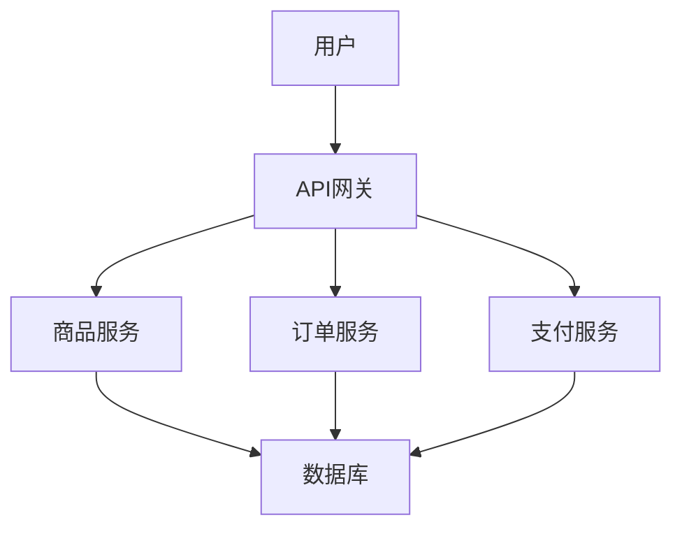

                 

# 技术创业指南：从工程师到创业者的转变

## 摘要

技术创业，对许多工程师来说，是一种充满挑战和机遇的职业转变。本文旨在为有志于从工程师转型为创业者的读者提供一份全面的技术创业指南。文章分为五个主要部分，首先从工程师的视角出发，探讨工程师的成长路径和技术栈拓展；接着深入创业准备，包括心态建设、团队组建和市场分析；然后聚焦技术与产品，介绍产品设计方法、技术选型和系统架构设计；再谈到融资与管理，阐述融资策略和路演技巧；最后是成长与拓展，讨论企业成长策略、持续创新和团队建设。本文通过逻辑清晰的分析和丰富的实例，为工程师转型创业者提供了实用的指导和建议。

## 目录大纲

### 第一部分：工程师的视角

- **第1章：工程师成长之路**
  - **1.1.1 工程师职业生涯规划**
  - **1.1.2 技术深耕与持续学习**

- **第2章：技术栈与技能拓展**
  - **2.1.1 前端技术**
    - **2.1.1.1 HTML/CSS/JavaScript**
    - **2.1.1.2 常用框架如React、Vue等**
  - **2.1.2 后端技术**
    - **2.1.2.1 Java、Python、Go等**
    - **2.1.2.2 Spring、Django、Flask等框架**

### 第二部分：创业准备

- **第3章：创业心态与团队组建**
  - **3.1.1 创业心态建设**
  - **3.1.2 团队组建策略**

- **第4章：市场分析与商业模式**
  - **4.1.1 市场调研与定位**
  - **4.1.2 商业模式设计**

### 第三部分：技术与产品

- **第5章：产品设计方法与工具**
  - **5.1.1 用户需求分析**
  - **5.1.2 产品设计流程**
    - **5.1.2.1 原型设计与迭代**

- **第6章：技术选型与系统架构**
  - **6.1.1 技术选型策略**
  - **6.1.2 系统架构设计**
    - **6.1.2.1 分层架构**
    - **6.1.2.2 微服务架构**

### 第四部分：融资与管理

- **第7章：融资策略与路演技巧**
  - **7.1.1 融资渠道与策略**
  - **7.1.2 路演准备与技巧**

- **第8章：企业运营与管理**
  - **8.1.1 人力资源规划**
  - **8.1.2 财务管理**

### 第五部分：成长与拓展

- **第9章：企业成长与拓展策略**
  - **9.1.1 市场拓展**
  - **9.1.2 产业生态构建**

- **第10章：持续创新与团队建设**
  - **10.1.1 创新机制建设**
  - **10.1.2 团队激励与文化建设**

### 附录

- **附录A：常用工具与资源推荐**
- **附录B：参考书籍与论文**

----------------------------------------------------------------

## 第一部分：工程师的视角

### 第1章：工程师成长之路

#### 1.1.1 工程师职业生涯规划

工程师职业生涯规划是一个系统性的过程，涉及职业目标设定、技能提升和职业发展路径选择。首先，工程师需要明确自己的职业目标，例如是追求技术深度成为技术专家，还是向管理方向转型成为项目经理或CTO。明确目标后，工程师应制定具体的行动计划。

**职业目标设定**

- **技术专家路径**：专注于某一领域，成为该领域的专家，如成为人工智能专家或大数据工程师。
- **管理方向**：提升管理能力，负责团队或项目，最终成为项目经理或CTO。

**技能提升**

- **基础技能**：掌握编程语言和开发工具，如熟悉Java、Python等编程语言，熟练使用Git、Docker等工具。
- **专业领域技能**：深入学习特定技术领域，如机器学习、云计算等，通过参加专业培训或自学获得证书。

**职业发展路径**

- **初级工程师**：通过实习或工作经验积累，担任初级工程师职位。
- **中级工程师**：在某一技术领域有一定积累，能够独立承担项目。
- **高级工程师**：具备丰富的经验，能够指导团队，解决复杂技术问题。
- **技术专家**：成为技术领域的专家，影响行业发展和技术创新。
- **项目经理**：负责项目管理，协调资源，确保项目按时按质完成。
- **CTO**：作为公司的技术总监，负责技术战略规划、技术研发和团队管理。

#### 1.1.2 技术深耕与持续学习

技术深耕是工程师职业生涯中不可或缺的一部分。随着技术的快速发展，工程师需要不断学习新知识、新技能，以保持竞争力。以下是一些建议：

**技术领域选择**

- **兴趣驱动**：选择自己感兴趣的技术领域，有利于长期发展和持续学习。
- **市场趋势**：关注行业发展趋势，选择有市场前景的技术领域。

**学习资源**

- **在线课程**：参加Coursera、edX等平台的在线课程，系统学习新技术。
- **技术博客**：阅读技术博客，了解业界动态和最佳实践。
- **开源项目**：参与开源项目，提高实践能力和团队合作能力。
- **专业书籍**：阅读专业书籍，掌握核心技术和原理。

**学习方法**

- **主动学习**：通过自学和实践，主动掌握新知识。
- **知识体系化**：构建自己的知识体系，将所学知识系统化。
- **技术交流**：参加技术交流会议，与同行交流心得，拓展视野。

#### 背景介绍

在当前技术高速发展的背景下，工程师面临着巨大的挑战和机遇。如何在这个快速变化的环境中保持竞争力，成为每一个工程师都需要思考的问题。职业生涯规划和技术深耕是解决这个问题的关键。通过明确的职业目标和持续学习，工程师可以不断提升自己的技能和知识，为未来的职业发展打下坚实的基础。

**问题背景**

随着互联网、人工智能、大数据等技术的迅猛发展，工程师的工作环境和职责也在不断变化。传统的开发工作已逐渐向智能化、自动化和高效化方向发展，这对工程师的技术水平和职业素养提出了更高的要求。

**问题描述**

工程师在职业发展过程中，可能会面临以下问题：

1. 如何在快速变化的技术领域中找到自己的定位？
2. 如何在职业生涯的不同阶段进行合理的规划？
3. 如何保持持续的学习动力和竞争力？

**问题解决**

通过职业生涯规划和技术深耕，工程师可以更好地应对上述问题。职业生涯规划帮助工程师明确职业目标，制定学习计划，确保在职业生涯的每个阶段都有明确的任务和目标。技术深耕则帮助工程师不断提升专业技能，保持技术竞争力。

**边界与外延**

职业生涯规划和技术深耕不仅适用于软件工程师，也适用于其他技术领域，如硬件工程师、网络工程师等。不同领域的工程师可以根据自身特点和职业目标，制定个性化的职业规划和技术深耕策略。

**概念结构与核心要素组成**

- **职业生涯规划**：职业目标、技能提升、职业发展路径
- **技术深耕**：技术领域选择、学习资源、学习方法

### 第2章：技术栈与技能拓展

#### 2.1.1 前端技术

前端技术是现代软件开发的重要组成部分，直接影响用户的使用体验。前端工程师需要掌握HTML、CSS和JavaScript等基本技能，并熟悉常用的前端框架如React和Vue。

##### 2.1.1.1 HTML/CSS/JavaScript

HTML（超文本标记语言）是构建网页结构的基础，CSS（层叠样式表）用于控制网页的布局和样式，JavaScript则用于实现网页的动态效果和交互功能。这些基本技能是前端工程师的必备素养。

- **HTML**：掌握HTML5的新特性，如本地存储、Web组件等。
- **CSS**：熟悉CSS3的动画和变换效果，能够进行响应式设计。
- **JavaScript**：掌握ES6及以上版本的JavaScript特性，了解异步编程和模块化开发。

##### 2.1.1.2 常用框架如React、Vue等

React和Vue是目前最流行的前端框架之一，它们提供了组件化开发的方式，大大提高了开发效率。

- **React**：React采用虚拟DOM和单向数据流，使得开发过程中数据更新更加高效和稳定。
  - **React Hooks**：使用React Hooks可以更方便地使用状态和副作用，提高代码的可读性和可维护性。
  - **React Router**：用于实现单页面应用的路由管理，提供良好的用户体验。

- **Vue**：Vue提供了简单、灵活的响应式系统和组合式API，使得Vue的应用开发更加直观和高效。
  - **Vuex**：用于管理应用的状态，确保状态的一致性和可预测性。
  - **Vue Router**：用于实现单页面应用的路由管理，支持动态路由和嵌套路由。

#### 2.1.2 后端技术

后端技术是支持前端应用的核心，后端工程师需要掌握多种编程语言和框架，以应对不同的开发需求。

##### 2.1.2.1 Java、Python、Go等

Java、Python和Go是目前后端开发中最常用的编程语言之一，它们各有特点和适用场景。

- **Java**：Java是一种强类型的、面向对象的编程语言，广泛应用于企业级应用开发。
  - **Spring**：Spring框架是Java后端开发的核心，提供了丰富的功能和模块，如Spring Boot、Spring MVC等。
  - **JPA/Hibernate**：用于实现ORM（对象关系映射），简化数据库操作。

- **Python**：Python是一种简洁、易学的编程语言，广泛应用于Web开发、数据分析和人工智能等领域。
  - **Django**：Django是一个高产的Web框架，遵循MVC设计模式，提供了一套完整的Web开发工具集。
  - **Flask**：Flask是一个轻量级的Web框架，适用于小型项目和原型开发。

- **Go**：Go是一种快速、高效的编程语言，广泛应用于系统编程和云计算领域。
  - **Gin**：Gin是一个高性能的Web框架，适用于构建高性能、高并发的Web服务。
  - **GORM**：GORM是一个基于Go语言的ORM库，用于简化数据库操作。

##### 2.1.2.2 Spring、Django、Flask等框架

不同的后端框架适用于不同的开发场景，选择合适的框架可以大大提高开发效率。

- **Spring**：Spring框架提供了丰富的功能和模块，适用于复杂的企业级应用。
  - **Spring Boot**：Spring Boot简化了Spring应用的配置和部署，提供了默认配置，使得开发更加高效。
  - **Spring MVC**：Spring MVC是一个经典的MVC框架，用于实现Web层的逻辑。

- **Django**：Django是一个高产的Web框架，适用于快速开发和迭代。
  - **Django ORM**：Django ORM用于简化数据库操作，提供了自动生成SQL语句的功能。
  - **Django Rest Framework**：Django Rest Framework是一个强大的RESTful API框架，用于构建RESTful Web服务。

- **Flask**：Flask是一个轻量级的Web框架，适用于小型项目和原型开发。
  - **Flask-SQLAlchemy**：Flask-SQLAlchemy是一个用于简化数据库操作的库，与Flask无缝集成。
  - **Flask-Login**：Flask-Login用于实现用户认证和会话管理。

#### 背景介绍

前端技术和后端技术在现代软件开发中发挥着至关重要的作用。前端技术直接影响用户的使用体验，而后端技术则支持前端应用的功能和性能。随着互联网和移动互联网的发展，前端和后端技术的需求不断增加，对工程师的技术水平和综合能力提出了更高的要求。

**问题背景**

随着互联网技术的迅猛发展，前端和后端技术不断演变，新的框架和工具层出不穷。工程师需要不断学习和适应这些变化，以保持竞争力。

**问题描述**

工程师在技术栈和技能拓展方面可能会面临以下问题：

1. 如何选择合适的前端和后端技术？
2. 如何高效学习和掌握新技术？
3. 如何平衡技术深度和广度，提升综合能力？

**问题解决**

通过系统性的学习和实践，工程师可以解决上述问题。首先，工程师需要明确自己的职业目标和兴趣，选择合适的技术领域进行深耕。其次，利用在线课程、技术博客和开源项目等资源，持续学习和实践新技术。最后，通过参与项目和团队合作，不断提升自己的技术能力和综合素养。

**边界与外延**

前端技术和后端技术涵盖多个方面，如编程语言、框架、数据库等。工程师可以根据自身情况和职业规划，选择合适的技术领域进行拓展。

**概念结构与核心要素组成**

- **前端技术**：HTML、CSS、JavaScript、前端框架（如React、Vue）
- **后端技术**：编程语言（如Java、Python、Go）、后端框架（如Spring、Django、Flask）

## 第二部分：创业准备

### 第3章：创业心态与团队组建

#### 3.1.1 创业心态建设

创业心态建设是创业者成功的重要因素之一。一个健康的创业心态能够帮助创业者面对挑战和困难，持续保持前进的动力。

**创业心态的重要性**

- **应对挑战**：创业过程中会遇到各种挑战，如技术难题、市场变动等。健康的创业心态可以帮助创业者冷静分析问题，找到解决方案。
- **持续动力**：创业过程中会有许多失败和挫折，健康的创业心态能够帮助创业者保持持续的动力，不断尝试和进步。
- **团队协作**：创业团队的成员需要具备相同的创业心态，才能更好地协作，共同面对挑战。

**培养创业心态的方法**

- **积极乐观**：保持积极乐观的态度，相信自己的能力和团队的潜力。
- **坚定信念**：明确自己的创业目标，坚定信念，不断激励自己。
- **适应性**：面对变化和挑战时，保持适应性，灵活调整策略。

#### 3.1.2 团队组建策略

团队组建是创业过程中至关重要的一环。一个优秀的团队可以充分发挥每个成员的优势，共同实现创业目标。

**团队组建的原则**

- **互补性**：团队成员在技能、经验和性格上互补，形成完整的团队。
- **专业性**：团队成员具备相应的专业技能，能够高效完成工作。
- **协作性**：团队成员之间能够良好协作，共同面对挑战。

**团队组建的步骤**

1. **确定团队规模和结构**：根据创业项目的需求，确定团队的规模和结构，如技术团队、市场团队、财务团队等。
2. **寻找合适的团队成员**：通过招聘、推荐和社交网络等方式，寻找合适的团队成员。
3. **团队培训与建设**：对新成员进行培训，帮助他们快速融入团队，同时通过团队建设活动增强团队凝聚力。

**团队组建的注意事项**

- **沟通与协作**：确保团队成员之间有良好的沟通和协作，避免信息孤岛和矛盾冲突。
- **激励与激励**：通过合理的激励和激励机制，激发团队成员的积极性和创造力。

#### 背景介绍

在创业过程中，心态和团队的作用至关重要。一个健康的创业心态能够帮助创业者保持冷静和理智，面对挑战和困难。一个优秀的团队则能够充分发挥每个成员的优势，共同实现创业目标。

**问题背景**

创业过程中，创业者需要面对各种挑战，如技术难题、市场变动、资金压力等。同时，团队成员之间的合作和沟通也是创业成功的关键因素。

**问题描述**

创业者可能在创业心态和团队组建方面面临以下问题：

1. 如何保持健康的创业心态？
2. 如何组建一个高效的团队？
3. 如何处理团队内部的沟通和协作问题？

**问题解决**

通过学习和实践，创业者可以解决上述问题。首先，创业者需要培养积极乐观的创业心态，坚定信念，适应变化。其次，创业者需要制定明确的团队组建策略，寻找合适的团队成员，并通过培训和团队建设活动增强团队凝聚力。最后，创业者需要建立良好的沟通和协作机制，确保团队成员之间能够高效协作。

**边界与外延**

创业心态和团队组建不仅适用于初创企业，也适用于成熟企业。对于任何一家企业来说，健康的创业心态和高效的团队都是成功的关键因素。

**概念结构与核心要素组成**

- **创业心态建设**：积极乐观、坚定信念、适应性
- **团队组建策略**：互补性、专业性、协作性

### 第4章：市场分析与商业模式

#### 4.1.1 市场调研与定位

市场调研是创业过程中至关重要的一步，它能够帮助创业者了解市场需求、分析竞争态势，从而找到自己的市场定位。

**市场调研的重要性**

- **了解市场需求**：通过市场调研，创业者可以了解目标用户的需求，开发出符合市场需求的产品。
- **分析竞争态势**：市场调研可以帮助创业者了解竞争对手的产品、优势和劣势，制定有效的竞争策略。
- **指导商业决策**：市场调研的数据可以用于指导商业决策，如产品定价、市场推广策略等。

**市场调研的方法**

- **问卷调查**：通过设计问卷，收集目标用户的需求和反馈。
- **访谈**：通过与目标用户进行深入访谈，了解他们的使用习惯和需求。
- **竞争对手分析**：分析竞争对手的产品、市场策略和用户评价，了解市场现状和趋势。
- **二手数据**：利用已有的市场研究报告、行业数据等，获取市场信息。

**市场定位**

市场定位是指将产品或品牌在目标用户心中的特定位置，使其与其他竞争对手区分开来。

- **目标用户定位**：确定产品的目标用户群体，如年龄、性别、职业等。
- **产品差异化**：通过产品特性、服务、品牌形象等方面的差异化，使产品在市场中脱颖而出。
- **市场细分**：将市场划分为多个细分市场，选择一个或几个具有潜力的细分市场进行深耕。

**市场定位的策略**

- **高端定位**：通过高品质、高价格的产品，树立高端品牌形象。
- **低端定位**：通过低价格、低质量的产品，吸引价格敏感的用户。
- **差异化定位**：通过独特的产品特性或服务，满足特定用户群体的需求。

#### 4.1.2 商业模式设计

商业模式设计是创业过程中至关重要的一步，它决定了企业的盈利模式、成本结构和竞争优势。

**商业模式的概念**

商业模式是指企业通过创造、传递和捕获价值的一系列策略和活动。

- **创造价值**：通过产品或服务满足用户需求，为用户提供价值。
- **传递价值**：通过营销、销售和售后服务等手段，将产品或服务传递给用户。
- **捕获价值**：通过定价、收入模式等手段，从用户那里获得回报。

**商业模式的设计要素**

- **价值主张**：明确产品的核心价值，即为什么用户会购买产品。
- **目标市场**：确定目标用户群体，包括用户需求和购买行为。
- **收入模式**：确定如何从用户那里获得收入，如产品销售、服务收费等。
- **成本结构**：明确企业的成本构成，包括固定成本和可变成本。
- **关键活动**：确定实现商业模式所需的关键活动，如研发、生产、销售等。
- **关键资源**：明确实现商业模式所需的关键资源，如资金、技术、人才等。
- **合作伙伴关系**：建立与供应商、分销商、用户等合作伙伴的关系，共同实现商业目标。

**商业模式的类型**

- **产品销售型**：通过销售产品获得收入，如传统制造业。
- **服务收费型**：通过提供服务获得收入，如咨询、设计等。
- **订阅收费型**：通过订阅服务获得持续收入，如软件即服务（SaaS）。
- **平台型**：通过平台连接供需双方，获得交易佣金或广告收入，如电商平台、社交媒体等。

**案例分析**

以下是一个电子商务平台的商业模式设计案例：

- **价值主张**：提供高品质的商品，满足消费者的购物需求。
- **目标市场**：面向全球消费者，特别是追求高品质生活的人群。
- **收入模式**：通过产品销售获得收入，同时提供广告服务获得广告收入。
- **成本结构**：包括商品采购成本、平台运营成本、物流成本等。
- **关键活动**：商品采购、库存管理、订单处理、营销推广等。
- **关键资源**：资金、技术平台、人力资源等。
- **合作伙伴关系**：与制造商、分销商、物流公司等建立合作关系，共同推动平台的发展。

**商业模式设计的原则**

- **价值最大化**：通过创新和优化，实现价值最大化，提高企业的盈利能力。
- **可执行性**：商业模式必须是可执行的，确保企业的运营和管理能够顺利进行。
- **适应性**：商业模式需要具备适应性，能够根据市场环境和用户需求的变化进行调整。

#### 背景介绍

市场分析和商业模式设计是创业过程中至关重要的一环。通过市场分析，创业者可以了解市场需求和竞争态势，从而找到自己的市场定位。而商业模式设计则决定了企业的盈利模式、成本结构和竞争优势。

**问题背景**

在竞争激烈的市场环境中，创业者需要了解市场需求和竞争态势，以制定有效的市场策略。同时，创业者需要设计一个可持续的商业模式，确保企业的生存和发展。

**问题描述**

创业者可能在市场分析和商业模式设计方面面临以下问题：

1. 如何进行有效的市场调研？
2. 如何找到合适的市场定位？
3. 如何设计一个可持续的商业模式？

**问题解决**

通过学习和实践，创业者可以解决上述问题。首先，创业者需要掌握市场调研的方法，通过问卷调查、访谈、竞争对手分析等方式，获取市场需求和竞争态势的信息。其次，创业者需要明确自己的市场定位，通过差异化策略和细分市场策略，找到自己的竞争优势。最后，创业者需要设计一个可持续的商业模式，通过价值主张、目标市场、收入模式等要素，实现企业的盈利和发展。

**边界与外延**

市场分析和商业模式设计不仅适用于初创企业，也适用于成熟企业。对于任何一家企业来说，了解市场需求、竞争态势和设计可持续的商业模式都是成功的关键因素。

**概念结构与核心要素组成**

- **市场调研**：了解市场需求、分析竞争态势、指导商业决策
- **市场定位**：目标用户定位、产品差异化、市场细分
- **商业模式设计**：价值主张、目标市场、收入模式、成本结构、关键活动、关键资源、合作伙伴关系

## 第三部分：技术与产品

### 第5章：产品设计方法与工具

#### 5.1.1 用户需求分析

用户需求分析是产品设计的起点，通过深入了解用户需求，可以确保产品的功能设计和用户体验满足用户期望。

**用户需求分析的重要性**

- **确保产品价值**：通过分析用户需求，确保产品的功能设计和用户体验能够为用户带来实际价值。
- **指导产品设计**：用户需求分析能够帮助产品团队明确产品的功能和设计方向，避免浪费资源和时间。
- **提高用户满意度**：深入了解用户需求，能够提高产品的用户满意度，降低用户流失率。

**用户需求分析的方法**

- **问卷调查**：通过设计问卷，收集用户对产品功能和体验的反馈。
- **用户访谈**：通过与用户进行深入访谈，了解他们的使用习惯、痛点和需求。
- **用户行为分析**：通过分析用户在使用产品过程中的行为数据，发现用户的需求和偏好。
- **用户画像**：通过对用户进行分类和分析，构建用户画像，了解不同用户群体的需求特点。

**用户需求分析的工具**

- **用户故事地图**：通过绘制用户故事地图，梳理用户在不同场景下的需求和交互流程。
- **用户旅程图**：通过绘制用户旅程图，分析用户在使用产品过程中的痛点和需求。
- **用户反馈系统**：建立用户反馈系统，收集用户的意见和建议，不断优化产品。

#### 5.1.2 产品设计流程

产品设计流程是一个系统化的过程，通过明确的需求分析、原型设计和迭代，确保产品的功能和用户体验满足用户需求。

**产品设计流程的步骤**

1. **需求分析**：通过用户需求分析，明确产品的功能和设计方向。
2. **原型设计**：通过绘制原型图，构建产品的初步设计，展示产品的功能和界面布局。
3. **迭代开发**：根据用户反馈和需求变化，不断优化和迭代产品，提升用户体验。
4. **测试与验收**：通过测试和用户验收，确保产品的功能和性能符合预期。

**需求分析**

需求分析是产品设计的第一步，通过深入分析用户需求，明确产品的功能和设计方向。

- **功能需求**：明确产品需要实现的核心功能，如用户注册、订单管理、支付功能等。
- **非功能需求**：明确产品的性能、安全性、易用性等非功能需求，如系统稳定性、响应速度、用户体验等。

**原型设计**

原型设计是产品设计的核心环节，通过绘制原型图，构建产品的初步设计，展示产品的功能和界面布局。

- **低保真原型**：通过简单的线框图或草图，快速构建产品的初步设计，用于需求验证和功能讨论。
- **高保真原型**：通过高保真原型工具，如Axure、Sketch等，构建产品的详细设计，用于用户体验测试和用户反馈。

**迭代开发**

迭代开发是产品设计的持续过程，通过不断优化和迭代产品，提升用户体验。

- **用户反馈**：收集用户的反馈和建议，分析用户的需求和痛点，制定优化方案。
- **迭代开发**：根据优化方案，对产品进行迭代开发，逐步完善功能和用户体验。
- **A/B测试**：通过A/B测试，对比不同设计方案的效果，选择最优方案进行推广。

**测试与验收**

测试与验收是产品设计的最后一步，通过测试和用户验收，确保产品的功能和性能符合预期。

- **功能测试**：通过功能测试，确保产品的功能完整性和正确性。
- **性能测试**：通过性能测试，确保产品的响应速度和稳定性。
- **用户体验测试**：通过用户体验测试，确保产品的易用性和用户体验。

**用户故事地图**

用户故事地图是一种直观、易于理解的需求分析工具，通过绘制用户在不同场景下的需求和交互流程，帮助产品团队更好地理解用户需求。

- **场景**：描述用户在不同场景下的需求和操作。
- **流程**：绘制用户在场景中的交互流程，展示用户的操作步骤。
- **需求**：明确用户在场景中的需求，为产品的功能设计提供依据。

**用户旅程图**

用户旅程图是一种描述用户在使用产品过程中的痛点和需求的分析工具，通过绘制用户在产品中的行为路径，帮助产品团队识别用户需求和优化产品设计。

- **起点**：描述用户开始使用产品的起点和触发因素。
- **路径**：绘制用户在产品中的行为路径，展示用户的操作步骤。
- **终点**：描述用户结束使用产品的终点和满意度。

**用户反馈系统**

用户反馈系统是一种收集用户意见和建议的工具，通过建立用户反馈渠道，收集用户的反馈和建议，帮助产品团队了解用户需求和优化产品设计。

- **反馈渠道**：建立多种反馈渠道，如在线表单、邮件、社交媒体等，方便用户提交反馈。
- **反馈分析**：分析用户的反馈，识别用户的需求和痛点，制定优化方案。
- **反馈响应**：对用户的反馈及时响应，展示产品团队对用户意见的重视。

#### 背景介绍

产品设计是产品开发的关键环节，直接影响产品的功能和用户体验。通过有效的用户需求分析和设计流程，可以确保产品的功能和用户体验满足用户需求，提高产品的市场竞争力和用户满意度。

**问题背景**

在激烈的市场竞争中，企业需要不断推出创新产品，满足用户的需求和期望。而用户需求分析和设计流程是确保产品成功的关键因素。

**问题描述**

产品经理可能在用户需求分析和设计流程方面面临以下问题：

1. 如何确保产品的功能设计和用户体验满足用户需求？
2. 如何有效进行用户需求分析？
3. 如何进行有效的原型设计和迭代？

**问题解决**

通过学习和实践，产品经理可以解决上述问题。首先，产品经理需要掌握用户需求分析的方法，通过问卷调查、用户访谈、用户行为分析等方式，深入了解用户需求。其次，产品经理需要熟悉原型设计和迭代流程，通过低保真原型、高保真原型和用户反馈，不断优化产品设计。最后，产品经理需要建立有效的用户反馈系统，及时收集用户意见和建议，持续优化产品设计。

**边界与外延**

用户需求分析和设计流程不仅适用于软件产品，也适用于其他类型的产品，如硬件产品、服务产品等。不同类型的产品可以根据自身特点，制定个性化的需求分析和设计流程。

**概念结构与核心要素组成**

- **用户需求分析**：问卷调查、用户访谈、用户行为分析、用户故事地图、用户旅程图
- **原型设计**：低保真原型、高保真原型、用户反馈、迭代开发
- **测试与验收**：功能测试、性能测试、用户体验测试、用户验收

### 第6章：技术选型与系统架构

#### 6.1.1 技术选型策略

技术选型是系统架构设计的关键环节，直接影响系统的性能、稳定性和可维护性。合理的选型策略能够确保系统满足业务需求，同时降低开发成本和维护难度。

**技术选型的重要性**

- **性能与稳定性**：选择合适的技术栈，可以确保系统在高并发、大数据量等极端情况下保持高性能和稳定性。
- **开发效率**：合适的技术栈能够提高开发效率，降低开发难度，缩短项目周期。
- **可维护性**：合理的技术选型能够降低系统的复杂度，提高代码的可维护性，减少后续维护成本。

**技术选型策略**

- **业务需求导向**：根据业务需求选择最适合的技术栈，如电商系统适合选用Java技术栈，而数据分析系统适合选用Python技术栈。
- **技术成熟度**：选择成熟稳定的技术，降低技术风险，如Spring、Hibernate等。
- **团队能力**：考虑团队的技术能力和熟悉程度，选择团队擅长或容易学习的技术。
- **社区与生态**：选择有良好社区支持和丰富生态的技术，便于问题解决和技术交流。
- **成本考量**：平衡开发成本和维护成本，选择性价比高的技术。

**常见技术选型**

- **前端技术**：React、Vue、Angular等框架。
- **后端技术**：Java、Python、Node.js等语言。
- **数据库技术**：MySQL、PostgreSQL、MongoDB等数据库。
- **缓存技术**：Redis、Memcached等。

#### 6.1.2 系统架构设计

系统架构设计是确保系统可扩展性、高性能和易维护性的关键。合理的架构设计能够提高系统的健壮性和灵活性，满足业务需求的变化。

**系统架构设计原则**

- **模块化**：将系统划分为多个模块，每个模块负责特定的功能，降低系统复杂度。
- **分布式**：通过分布式架构，提高系统的可扩展性和高可用性。
- **分层设计**：将系统划分为不同层次，如表示层、业务逻辑层、数据访问层，提高代码的可维护性。
- **冗余与备份**：通过冗余和备份机制，提高系统的稳定性和容错能力。

**系统架构设计步骤**

1. **需求分析**：明确业务需求和系统功能，为系统架构设计提供依据。
2. **架构设计**：根据需求分析结果，设计系统架构，包括系统模块、数据流、接口等。
3. **详细设计**：对系统架构的各个模块进行详细设计，包括模块内部的设计和模块之间的交互。
4. **架构评审**：组织架构评审，审查系统架构的设计是否符合需求、是否合理。
5. **架构实现**：根据架构设计，实现系统架构，进行模块开发和集成。

**常见系统架构**

- **分层架构**：将系统划分为表示层、业务逻辑层、数据访问层等，每个层次负责不同的功能，提高系统的可维护性和可扩展性。
- **微服务架构**：将系统划分为多个独立的微服务，每个微服务负责特定的功能，通过API进行通信，提高系统的可扩展性和灵活性。

#### 6.1.2.1 分层架构

分层架构是一种常见的系统架构设计方法，通过将系统划分为不同的层次，实现模块化和解耦。

**分层架构的核心层次**

- **表示层**：负责与用户交互，包括前端界面和API接口。
- **业务逻辑层**：实现业务逻辑，处理业务规则和流程。
- **数据访问层**：负责与数据库交互，进行数据查询和操作。

**分层架构的优点**

- **模块化**：各个层次相互独立，便于开发和维护。
- **解耦**：不同层次之间的依赖关系较弱，提高系统的灵活性和可扩展性。
- **可重用性**：各个层次的功能可以独立开发、测试和部署，提高代码的可重用性。

**分层架构的缺点**

- **复杂性**：系统分层导致设计和实现更加复杂，需要更多的沟通和协调。
- **性能开销**：不同层次之间的通信可能会增加系统的性能开销。

#### 6.1.2.2 微服务架构

微服务架构是一种基于独立服务的分布式系统架构，通过将系统划分为多个独立的微服务，实现模块化和解耦。

**微服务架构的核心概念**

- **微服务**：每个微服务负责特定的功能，是一个独立的服务单元，可以独立开发、测试和部署。
- **服务治理**：通过服务注册中心、负载均衡、服务监控等机制，实现微服务的管理和调度。
- **API网关**：作为客户端与微服务之间的统一入口，负责路由、认证、日志等操作。

**微服务架构的优点**

- **可扩展性**：通过垂直切分和水平扩展，提高系统的性能和可扩展性。
- **灵活性和可维护性**：各个微服务可以独立开发和维护，降低系统复杂度和维护成本。
- **故障隔离**：单个微服务的故障不会影响整个系统的运行，提高系统的容错能力和稳定性。

**微服务架构的缺点**

- **复杂性**：微服务架构引入了服务治理、数据一致性和网络通信等复杂问题，需要更多的技术和工具支持。
- **性能开销**：微服务架构可能导致更多的网络通信和分布式协调，增加系统的性能开销。

**技术选型与系统架构设计**

技术选型和系统架构设计是相互关联的，技术选型需要考虑系统架构的需求和特点，系统架构设计也需要考虑技术栈的支持能力。

- **技术选型**：根据业务需求和系统架构，选择合适的技术栈，如前端框架、后端语言、数据库等。
- **系统架构设计**：根据技术选型，设计系统的模块、数据流、接口等，实现系统的功能需求。

**案例分析**

以下是一个电商平台的系统架构设计案例：

- **需求分析**：电商平台需要提供商品展示、购物车、订单管理、支付等功能。
- **技术选型**：前端采用Vue框架，后端采用Spring Boot，数据库采用MySQL。
- **系统架构设计**：
  - **表示层**：前端页面，提供商品展示、购物车、订单管理等界面。
  - **业务逻辑层**：后端服务，实现商品管理、订单处理、支付等业务逻辑。
  - **数据访问层**：数据库服务，负责数据存储和查询。

**系统架构图**

**最佳实践**

- **模块化设计**：将系统划分为多个模块，每个模块负责特定的功能，降低系统复杂度。
- **服务治理**：使用服务注册中心、负载均衡等机制，提高系统的性能和可扩展性。
- **数据一致性**：使用分布式事务管理、消息队列等机制，保证数据的一致性。
- **监控与日志**：使用监控工具和日志系统，实时监控系统的性能和健康状态。

#### 背景介绍

技术选型和系统架构设计是系统开发的基石，直接影响系统的性能、稳定性、可维护性和可扩展性。合理的选型策略和架构设计能够确保系统满足业务需求，同时降低开发成本和维护难度。

**问题背景**

随着互联网和云计算的发展，企业对系统性能和可扩展性的要求越来越高。如何选择合适的技术栈和设计合理的系统架构，成为企业面临的重要问题。

**问题描述**

技术团队可能在技术选型和系统架构设计方面面临以下问题：

1. 如何选择合适的技术栈？
2. 如何设计一个高效、稳定、可扩展的系统架构？
3. 如何处理技术选型和系统架构之间的关联？

**问题解决**

通过学习和实践，技术团队可以解决上述问题。首先，技术团队需要根据业务需求，选择合适的技术栈，如前端框架、后端语言、数据库等。其次，技术团队需要设计一个高效、稳定、可扩展的系统架构，包括模块划分、服务治理、数据一致性等。最后，技术团队需要理解技术选型和系统架构之间的关联，确保技术选型支持系统架构设计。

**边界与外延**

技术选型和系统架构设计不仅适用于企业级应用，也适用于中小型应用和开源项目。不同类型的应用可以根据自身特点，选择合适的技术栈和架构设计方法。

**概念结构与核心要素组成**

- **技术选型策略**：业务需求导向、技术成熟度、团队能力、社区与生态、成本考量
- **系统架构设计**：模块化、分布式、分层设计、冗余与备份
- **分层架构**：表示层、业务逻辑层、数据访问层
- **微服务架构**：微服务、服务治理、API网关

## 第四部分：融资与管理

### 第7章：融资策略与路演技巧

#### 7.1.1 融资渠道与策略

融资是创业者面临的重大挑战之一，选择合适的融资渠道和策略对于企业的成长至关重要。

**融资渠道**

- **天使投资**：天使投资通常由个人投资者提供，他们愿意在创业初期为企业提供资金支持，并期待未来获得高额回报。
- **风险投资**：风险投资公司专注于投资处于成长期的企业，他们为企业提供资金的同时，也会提供战略支持和资源。
- **银行贷款**：银行贷款是一种传统的融资方式，适用于有稳定现金流和良好信用记录的企业。
- **众筹**：众筹平台允许创业者通过公众筹集资金，这种方式可以测试市场的需求，并在一定程度上减轻资金压力。

**融资策略**

- **需求明确**：明确企业的融资需求，包括融资额度、资金用途和预期回报。
- **市场调研**：了解不同融资渠道的特点和要求，选择最适合企业的融资方式。
- **材料准备**：准备详细的商业计划书、财务预测和团队介绍，以展示企业的价值和潜力。
- **谈判技巧**：与投资者进行谈判，争取最佳的投资条款，如投资额度、股权比例、投资期限等。

#### 7.1.2 路演准备与技巧

路演是创业者向投资者展示企业价值和融资需求的重要环节，成功路演能够增加投资者的信心，提高融资成功率。

**路演准备**

- **PPT制作**：制作精美的PPT，包括企业介绍、市场分析、商业模式、财务预测等关键内容。
- **演示练习**：多次练习演讲，熟悉PPT内容和演讲流程，确保在路演时流畅自如。
- **投资者研究**：了解潜在投资者的背景、投资偏好和关注点，有针对性地准备演讲内容。
- **团队准备**：确保团队成员熟悉演讲内容，能在路演中有效支持演讲者。

**路演技巧**

- **自信展示**：保持自信的态度，展示企业的优势和潜力。
- **清晰表达**：用简洁明了的语言阐述企业价值和融资需求，避免使用过于复杂的术语。
- **互动交流**：与投资者进行互动，回答他们的问题，展示企业的透明度和专业性。
- **灵活应对**：面对投资者的质疑和挑战，保持冷静，灵活应对，展示企业的应对能力和团队协作精神。

#### 背景介绍

融资是创业过程中不可或缺的一环，它不仅为企业提供了资金支持，也为企业带来了资源、战略建议和市场机会。然而，融资也是一个充满挑战的过程，创业者需要掌握合适的融资策略和路演技巧，以提高融资成功率。

**问题背景**

随着市场竞争的加剧，创业者需要找到合适的融资渠道和策略，以确保企业的可持续发展。同时，成功路演能够增加投资者的信心，提高融资成功率。

**问题描述**

创业者可能在融资策略和路演技巧方面面临以下问题：

1. 如何选择合适的融资渠道？
2. 如何制定有效的融资策略？
3. 如何在路演中展示企业的价值和潜力？
4. 如何应对投资者的质疑和挑战？

**问题解决**

通过学习和实践，创业者可以解决上述问题。首先，创业者需要了解各种融资渠道的特点和要求，选择最适合企业的融资方式。其次，创业者需要制定详细的融资策略，包括融资额度、资金用途和预期回报。在路演准备方面，创业者需要制作精美的PPT，进行多次演示练习，熟悉演讲内容，并研究潜在投资者的背景和关注点。在路演过程中，创业者需要自信展示，清晰表达，进行互动交流，并灵活应对投资者的质疑和挑战。

**边界与外延**

融资策略和路演技巧不仅适用于初创企业，也适用于成熟企业。对于任何一家企业来说，掌握合适的融资策略和路演技巧都是提高市场竞争力和实现可持续发展的重要手段。

**概念结构与核心要素组成**

- **融资渠道**：天使投资、风险投资、银行贷款、众筹
- **融资策略**：需求明确、市场调研、材料准备、谈判技巧
- **路演准备**：PPT制作、演示练习、投资者研究、团队准备
- **路演技巧**：自信展示、清晰表达、互动交流、灵活应对

### 第8章：企业运营与管理

#### 8.1.1 人力资源规划

人力资源规划是企业运营管理的重要一环，它关系到企业的人才储备、组织结构和绩效管理。

**人力资源规划的重要性**

- **人才储备**：通过人力资源规划，确保企业能够吸引和留住优秀人才，满足业务发展的需求。
- **组织结构**：合理的人力资源规划有助于构建高效的团队，优化组织结构，提高管理效率。
- **绩效管理**：通过人力资源规划，制定明确的绩效目标和考核标准，激发员工的积极性和创造力。

**人力资源规划的内容**

- **人才招聘**：制定招聘策略，选择合适的招聘渠道，进行人才筛选和面试。
- **员工培训**：根据业务发展需求，制定培训计划，提高员工的专业技能和综合素质。
- **绩效管理**：制定绩效考核标准，进行绩效评估，激励员工提升工作效率。
- **薪酬管理**：设计合理的薪酬体系，确保员工的薪酬与市场水平相当，提高员工满意度。
- **员工关系**：建立和谐的员工关系，通过员工福利、员工关怀等措施，提高员工的归属感和忠诚度。

**人力资源管理的最佳实践**

- **数据驱动**：通过数据分析，了解员工绩效、招聘效果等，优化人力资源规划。
- **持续改进**：定期评估人力资源规划的有效性，根据业务需求和市场变化进行调整。
- **员工参与**：鼓励员工参与企业决策，提高员工的工作满意度和积极性。

#### 8.1.2 财务管理

财务管理是企业运营管理的核心，它关系到企业的资金流动、成本控制和财务预测。

**财务管理的重要性**

- **资金流动**：合理的财务管理能够确保企业的资金充足，避免资金链断裂。
- **成本控制**：通过财务管理，企业可以有效地控制成本，提高盈利能力。
- **财务预测**：准确的财务预测有助于企业制定战略决策，规划未来发展。

**财务管理的内容**

- **预算管理**：制定合理的预算计划，监控预算执行情况，确保企业资金合理使用。
- **成本控制**：通过成本分析和成本控制措施，降低企业的运营成本。
- **资金管理**：确保企业的资金安全，优化资金结构，提高资金利用效率。
- **财务分析**：通过财务报表和分析，了解企业的财务状况，为决策提供依据。
- **税务管理**：合理避税，遵守税务法规，确保企业的税务合规。

**财务管理的最佳实践**

- **精细化**：精细化财务管理，提高财务数据的准确性和及时性。
- **自动化**：使用财务管理软件，提高财务管理效率，减少人为错误。
- **透明化**：提高财务信息的透明度，增强企业内部和外部的信任。

#### 背景介绍

企业运营与管理是创业成功的关键因素之一。通过有效的人力资源规划和财务管理，企业可以吸引和留住优秀人才，优化组织结构，提高员工绩效，确保资金流动和成本控制，从而实现可持续发展。

**问题背景**

在企业运营过程中，人力资源和财务管理面临诸多挑战，如人才流失、成本上升、资金短缺等。如何有效应对这些挑战，提高企业的运营效率，是创业者需要思考的问题。

**问题描述**

企业在运营和管理方面可能面临以下问题：

1. 如何有效进行人力资源规划？
2. 如何提高员工的绩效和满意度？
3. 如何进行有效的成本控制和财务预测？
4. 如何确保资金流动和财务安全？

**问题解决**

通过学习和实践，企业可以解决上述问题。首先，企业需要进行人力资源规划，包括人才招聘、员工培训和绩效管理，以提高员工的综合素质和工作效率。其次，企业需要制定合理的预算和成本控制措施，确保资金合理使用和成本降低。最后，企业需要进行财务分析和财务预测，优化资金结构和财务策略，确保财务安全和可持续发展。

**边界与外延**

企业运营与管理不仅适用于初创企业，也适用于成熟企业。不同类型和规模的企业可以根据自身特点，制定个性化的人力资源规划和财务管理策略。

**概念结构与核心要素组成**

- **人力资源规划**：人才招聘、员工培训、绩效管理、薪酬管理、员工关系
- **财务管理**：预算管理、成本控制、资金管理、财务分析、税务管理

## 第五部分：成长与拓展

### 第9章：企业成长与拓展策略

#### 9.1.1 市场拓展

市场拓展是企业成长的关键环节，通过扩大市场份额，企业可以实现收入增长和品牌影响力的提升。

**市场拓展的重要性**

- **收入增长**：市场拓展能够帮助企业开拓新市场，吸引更多客户，实现收入增长。
- **品牌影响力**：市场拓展有助于提升企业的品牌知名度，增强品牌影响力，提高市场竞争力。
- **长期发展**：市场拓展是企业长期发展的基础，有助于企业建立可持续的业务模式。

**市场拓展的策略**

- **目标市场选择**：根据企业特点和资源，选择具有潜力和适合目标市场，如新兴市场、海外市场等。
- **市场调研**：通过市场调研，了解目标市场的需求、竞争态势和潜在机会。
- **定位与差异化**：明确企业在目标市场的定位，通过差异化策略，形成独特的竞争优势。
- **营销策略**：制定有针对性的营销策略，如广告宣传、促销活动、渠道合作等，吸引客户。

**市场拓展的步骤**

1. **确定目标市场**：根据企业的产品特性、资源优势和市场需求，确定目标市场。
2. **市场调研**：收集目标市场的相关数据，包括市场规模、增长趋势、竞争对手等。
3. **定位与差异化**：明确企业在目标市场的定位，通过差异化策略，形成竞争优势。
4. **制定营销策略**：根据目标市场的特点和需求，制定有针对性的营销策略。
5. **执行与监控**：实施市场拓展计划，监控市场反应和销售业绩，调整策略。

#### 9.1.2 产业生态构建

产业生态构建是企业实现长期发展的关键，通过构建健康的产业生态，企业可以提升创新能力，增强市场竞争力。

**产业生态构建的重要性**

- **创新能力**：产业生态构建有助于企业吸引优秀的创新资源，如人才、技术、资本等，提升创新能力。
- **市场竞争力**：健康的产业生态能够提供良好的市场环境，增强企业的市场竞争力。
- **可持续发展**：产业生态构建有助于企业实现可持续发展，提升企业的长期价值。

**产业生态构建的策略**

- **资源整合**：整合产业链上下游的资源，构建合作网络，提升产业协同效应。
- **平台建设**：建设产业平台，提供创新服务，如孵化器、实验室、技术支持等，吸引创新创业者。
- **政策支持**：利用政府政策，如税收优惠、资金支持等，推动产业生态建设。
- **人才培养**：加强人才培养，提升产业生态的人才储备。

**产业生态构建的步骤**

1. **资源整合**：识别和整合产业链上下游的资源，建立合作网络。
2. **平台建设**：建设产业平台，提供创新服务，吸引创新创业者。
3. **政策支持**：利用政府政策，提供资金、技术、人才等方面的支持。
4. **人才培养**：加强人才培养，提升产业生态的人才储备。
5. **生态优化**：持续优化产业生态，提升产业协同效应，增强市场竞争力。

**案例分析**

以下是一个互联网公司的市场拓展和产业生态构建案例：

**市场拓展案例**

- **目标市场选择**：该公司选择了东南亚市场，因为该地区互联网用户增长迅速，且该公司在技术和产品方面具有优势。
- **市场调研**：通过市场调研，该公司了解到东南亚市场对电商和移动支付的需求强烈。
- **定位与差异化**：该公司明确了在东南亚市场的定位，通过提供本地化的服务和产品，与当地竞争对手形成差异化。
- **营销策略**：该公司采取了广告投放、社交媒体营销、线下活动等策略，吸引东南亚市场的客户。

**产业生态构建案例**

- **资源整合**：该公司整合了本地技术人才、合作伙伴和投资者资源，建立了强大的产业合作网络。
- **平台建设**：该公司建设了一个产业平台，提供技术支持、孵化服务和资金支持，吸引创新创业者。
- **政策支持**：该公司积极利用政府提供的税收优惠和资金支持，加快产业生态构建。
- **人才培养**：该公司与当地高校合作，设立奖学金和实习项目，培养本地人才。

**最佳实践**

- **数据驱动**：通过数据分析，了解市场趋势和客户需求，制定科学的市场拓展和产业生态构建策略。
- **持续创新**：保持持续创新能力，通过技术创新和产品创新，提升市场竞争力。
- **合作共赢**：与产业链上下游的企业和合作伙伴建立长期合作关系，共同推动产业生态的发展。

#### 背景介绍

企业成长与拓展是企业发展的关键阶段，通过市场拓展和产业生态构建，企业可以实现收入增长和市场竞争力提升。然而，市场拓展和产业生态构建也面临诸多挑战，如市场竞争、资源整合、创新能力等。

**问题背景**

在快速变化的市场环境中，企业需要不断拓展市场，提升竞争力。同时，构建健康的产业生态，增强创新能力，也是企业长期发展的关键。

**问题描述**

企业在成长与拓展过程中可能面临以下问题：

1. 如何选择合适的拓展市场？
2. 如何制定有效的市场拓展策略？
3. 如何构建健康的产业生态？
4. 如何提升企业的创新能力？

**问题解决**

通过学习和实践，企业可以解决上述问题。首先，企业需要进行市场调研，了解目标市场的需求和竞争态势，选择合适的拓展市场。其次，企业需要制定有针对性的市场拓展策略，如定位与差异化、营销策略等。在产业生态构建方面，企业需要整合产业链上下游资源，建立产业平台，培养人才，提升创新能力。最后，企业需要通过数据驱动和持续创新，不断提升市场竞争力。

**边界与外延**

企业成长与拓展不仅适用于初创企业，也适用于成熟企业。不同类型和规模的企业可以根据自身特点，制定个性化的发展策略。

**概念结构与核心要素组成**

- **市场拓展**：目标市场选择、市场调研、定位与差异化、营销策略
- **产业生态构建**：资源整合、平台建设、政策支持、人才培养

### 第10章：持续创新与团队建设

#### 10.1.1 创新机制建设

创新是企业的核心竞争力，构建有效的创新机制是企业持续发展的关键。通过建立创新机制，企业可以激发员工的创造力，推动技术和管理创新。

**创新机制建设的重要性**

- **提升竞争力**：创新机制有助于企业保持技术和管理上的领先地位，提升市场竞争力。
- **适应市场变化**：创新机制能够帮助企业迅速适应市场变化，抓住机遇，降低风险。
- **增强员工积极性**：创新机制激发员工的创造力，提高员工的工作满意度和忠诚度。

**创新机制建设的要素**

- **创新文化**：营造鼓励创新的企业文化，鼓励员工提出创新想法，勇于尝试。
- **激励机制**：建立激励机制，如创新奖金、晋升机会等，激励员工积极参与创新。
- **资源支持**：提供充足的资源，包括资金、技术和人才，支持创新项目的实施。
- **风险管理**：建立风险管理机制，评估创新项目的风险，确保创新项目的可行性。

**创新机制建设的步骤**

1. **建立创新目标**：明确企业的创新方向和目标，确保创新工作与业务发展相结合。
2. **营造创新文化**：通过企业内部活动和沟通，营造鼓励创新的企业文化。
3. **建立激励机制**：制定激励机制，鼓励员工提出创新想法，并提供资源支持。
4. **项目筛选与评估**：筛选有潜力的创新项目，进行评估和优先级排序。
5. **实施与监控**：实施创新项目，监控项目进展，及时调整策略。

#### 10.1.2 团队激励与文化建设

团队建设是企业管理的重要方面，通过有效的激励和文化建设，可以提高团队的凝聚力和工作效率。

**团队激励的重要性**

- **提高工作效率**：适当的激励可以激发员工的工作热情，提高工作效率和团队协作能力。
- **增强团队凝聚力**：通过激励，可以增强团队成员之间的信任和合作，提高团队凝聚力。
- **降低流失率**：良好的激励机制可以留住优秀员工，降低人才流失率。

**团队激励的方法**

- **薪酬激励**：提供有竞争力的薪酬，包括基本工资、奖金和股权激励等。
- **绩效激励**：建立绩效评估体系，根据员工的绩效给予奖励，如奖金、晋升机会等。
- **荣誉激励**：设立荣誉称号，如优秀员工、团队冠军等，表彰优秀员工和团队。
- **培训激励**：提供培训机会，提升员工的专业技能和综合素质，增强员工的职业发展信心。

**文化建设的重要性**

- **增强团队凝聚力**：企业文化是团队的共同价值观和行为准则，有助于增强团队凝聚力。
- **塑造企业品牌**：企业文化是企业品牌的重要组成部分，有助于塑造良好的企业形象。
- **提高员工满意度**：良好的企业文化可以提高员工的工作满意度，降低流失率。

**文化建设的方法**

- **企业价值观**：明确企业价值观，确保团队成员认同并遵循。
- **企业活动**：举办各类企业活动，如团队建设、团建活动等，增强团队凝聚力。
- **员工关怀**：关注员工的生活和工作状态，提供必要的支持和帮助。
- **沟通机制**：建立有效的沟通机制，确保团队成员之间能够及时交流和反馈。

**案例分析**

以下是一个高科技公司的团队激励和文化建设案例：

**团队激励案例**

- **薪酬激励**：该公司提供具有竞争力的薪酬，包括基本工资、绩效奖金和股权激励，吸引和留住优秀人才。
- **绩效激励**：通过建立完善的绩效评估体系，根据员工的绩效表现，给予相应的奖金和晋升机会。
- **荣誉激励**：定期举办优秀员工表彰大会，对表现突出的员工进行表彰，激励团队其他成员。
- **培训激励**：提供丰富的培训机会，包括内部培训和外部进修，提升员工的专业技能和综合素质。

**文化建设案例**

- **企业价值观**：该公司倡导“创新、协作、诚信、共赢”的企业价值观，确保团队成员认同并遵循。
- **企业活动**：定期举办团队建设活动，如团队拓展训练、团建活动等，增强团队凝聚力。
- **员工关怀**：关注员工的生活和工作状态，提供员工餐厅、健身房、心理辅导等福利，提升员工满意度。
- **沟通机制**：建立内部邮件、论坛、员工大会等沟通渠道，确保团队成员之间能够及时交流和反馈。

**最佳实践**

- **数据驱动**：通过数据分析，了解团队和员工的绩效表现，优化激励机制和文化建设。
- **个性化激励**：根据员工的特点和需求，提供个性化的激励和关怀，提高员工的工作满意度和忠诚度。
- **持续改进**：定期评估团队激励和文化建设的有效性，根据实际情况进行调整和改进。

#### 背景介绍

持续创新和团队建设是企业发展的关键，通过创新机制建设和团队激励与文化建设，企业可以提升竞争力，增强团队凝聚力，实现可持续发展。

**问题背景**

在竞争激烈的市场环境中，企业需要不断进行技术创新和管理创新，同时，如何激发员工的积极性和创造力，提升团队凝聚力，是企业管理者需要关注的问题。

**问题描述**

企业在持续创新和团队建设方面可能面临以下问题：

1. 如何构建有效的创新机制？
2. 如何进行团队激励和文化建设？
3. 如何提升员工的积极性和创造力？
4. 如何增强团队凝聚力？

**问题解决**

通过学习和实践，企业可以解决上述问题。首先，企业需要建立创新机制，包括创新文化、激励机制、资源支持和风险管理等。其次，企业需要制定有效的团队激励政策和文化建设策略，如薪酬激励、绩效激励、荣誉激励、员工关怀和沟通机制等。最后，企业需要通过数据驱动和持续改进，不断提升员工的积极性和创造力，增强团队凝聚力。

**边界与外延**

持续创新和团队建设不仅适用于初创企业，也适用于成熟企业。不同类型和规模的企业可以根据自身特点，制定个性化的发展策略。

**概念结构与核心要素组成**

- **创新机制建设**：创新文化、激励机制、资源支持、风险管理
- **团队激励与文化建设**：薪酬激励、绩效激励、荣誉激励、员工关怀、沟通机制

## 附录

### 附录A：常用工具与资源推荐

**开发工具**

- **IDE**：Visual Studio Code、IntelliJ IDEA、Eclipse
- **版本控制**：Git、GitHub、GitLab
- **容器化**：Docker、Kubernetes
- **持续集成/持续部署**：Jenkins、GitLab CI/CD、CircleCI

**设计工具**

- **原型设计**：Axure、Sketch、Figma
- **UML绘图**：Lucidchart、Visual Paradigm、Enterprise Architect
- **数据库管理**：MySQL Workbench、SQL Server Management Studio、PGAdmin

**学习资源**

- **在线课程**：Coursera、edX、Udemy、Pluralsight
- **技术博客**：Medium、Dev.to、Stack Overflow、GitHub
- **开源项目**：GitHub、GitLab、Bitbucket

### 附录B：参考书籍与论文

**书籍**

- 《创新与企业家精神》作者：彼得·德鲁克
- 《精益创业》作者：埃里克·莱斯
- 《商业模式新生代》作者：奥斯特瓦尔德、皮萨诺、拉姆
- 《深度学习》作者：伊恩·古德费洛等

**论文**

- "The Lean Startup" by Eric Ries
- "The Business Model Canvas" by Alexander Osterwalder and Yves Pigneur
- "Agile Project Management" by Jim Highsmith
- "Microservices: Designing Fine-Grained Systems" by Sam Newman

通过附录中的工具、资源和书籍，读者可以进一步拓展自己的知识体系，提高技术水平和创业能力。作者：AI天才研究院/AI Genius Institute & 禅与计算机程序设计艺术 /Zen And The Art of Computer Programming。

