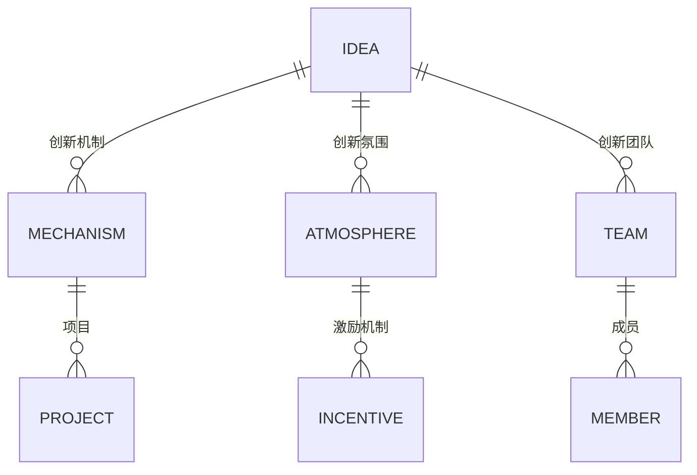
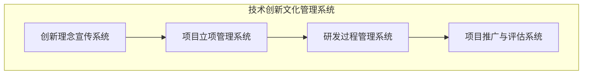
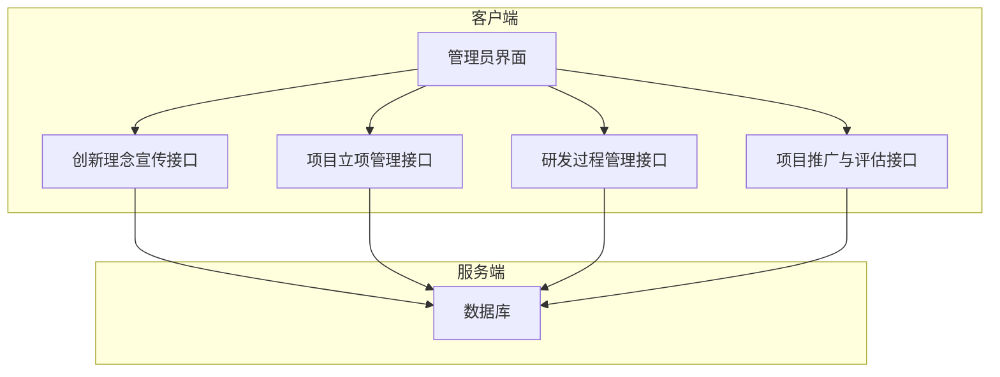
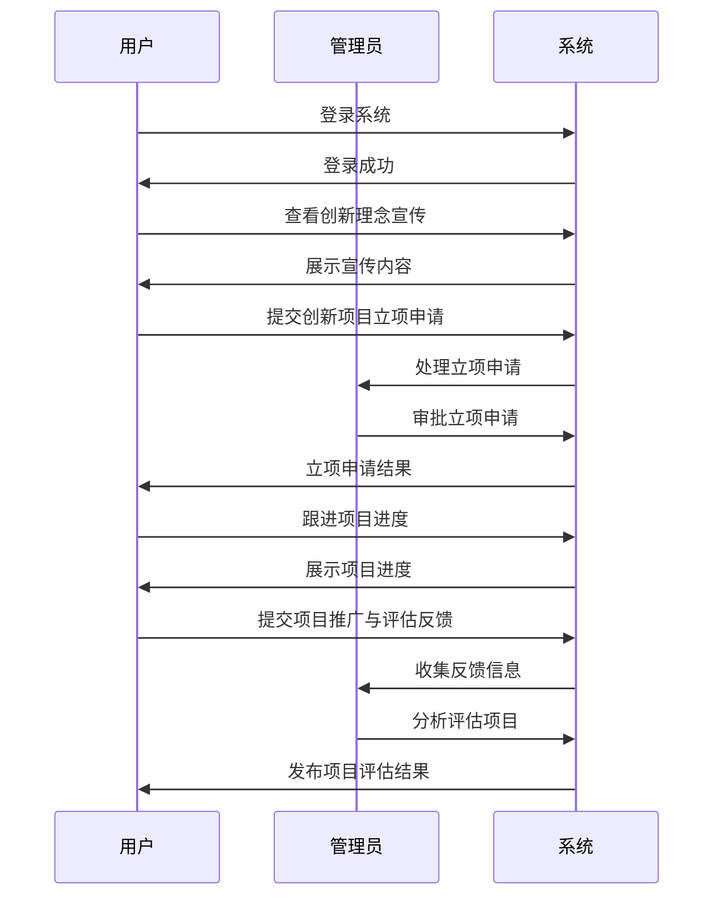

                 

### 文章标题

# 技术创新文化：激发团队创造力的方法

> 关键词：技术创新文化、团队创造力、创新机制、创新氛围、创新团队

> 摘要：本文旨在探讨技术创新文化对团队创造力的影响，分析其核心概念与联系，并通过具体的算法原理和系统架构设计方法，为企业和团队提供有效的激发创造力的策略和实践指导。

## 第一部分：背景介绍

### 1.1 问题背景

随着信息技术和互联网的飞速发展，企业对于技术创新和文化建设的重视程度日益提高。技术创新文化作为推动企业创新的核心动力，不仅有助于提高企业的核心竞争力，还能激发团队的创造力和凝聚力。然而，当前许多企业在技术创新文化建设方面仍然存在诸多挑战，如创新能力不足、团队协作不畅、文化氛围不浓厚等。

### 1.2 问题描述

为了解决上述问题，企业需要找到一种有效的方法来激发团队创造力，从而推动技术创新文化的建设。本书旨在探讨技术创新文化对团队创造力的影响，以及如何通过具体方法来激发团队创造力。

### 1.3 问题解决

本书将结合国内外成功的企业案例，系统性地介绍技术创新文化的核心概念、理论体系和实践方法。通过深入剖析技术创新文化对团队创造力的影响机制，为企业提供有针对性的建设策略和实践指导。

### 1.4 边界与外延

技术创新文化不仅仅局限于技术层面的创新，还涉及组织文化、团队协作、知识管理等多个维度。因此，本书的研究边界不仅限于技术领域，还将涵盖管理、心理学等多个领域。

### 1.5 概念结构与核心要素组成

技术创新文化是由多个核心要素组成的复杂系统，包括但不限于：

- **创新理念**：企业对于创新的认识、态度和价值观。
- **创新机制**：企业内部创新的组织结构、流程和制度。
- **创新氛围**：企业内部创新的文化氛围、激励机制和沟通渠道。
- **创新团队**：具有创新能力和协作精神的团队组织。

## 第二部分：核心概念与联系

### 2.1 技术创新文化的定义

技术创新文化是一种以创新为核心价值观，旨在激发团队创造力的组织文化。它包括创新理念、创新机制、创新氛围和创新团队等多个方面，共同推动企业的创新和发展。

### 2.2 技术创新文化的核心概念

#### 2.2.1 创新理念

创新理念是企业对于创新的认识和价值观，包括创新意识、创新精神、创新目标和创新价值观等方面。

#### 2.2.2 创新机制

创新机制是企业内部创新的组织结构、流程和制度，包括创新项目的立项、研发、推广和评估等方面。

#### 2.2.3 创新氛围

创新氛围是企业内部创新的文化氛围，包括创新激励机制、沟通渠道和协作方式等方面。

#### 2.2.4 创新团队

创新团队是具有创新能力和协作精神的团队组织，包括团队成员的选拔、培养和激励机制等方面。

### 2.3 概念属性特征对比表格

| 概念 | 定义 | 属性特征 | 对比 |
| :--: | :--: | :--: | :--: |
| 创新理念 | 企业对于创新的认识和价值观 | 创新意识、创新精神、创新目标和创新价值观 | 无 |
| 创新机制 | 企业内部创新的组织结构、流程和制度 | 创新项目的立项、研发、推广和评估 | 无 |
| 创新氛围 | 企业内部创新的文化氛围 | 激励机制、沟通渠道和协作方式 | 无 |
| 创新团队 | 具有创新能力和协作精神的团队组织 | 团队成员的选拔、培养和激励机制 | 无 |

### 2.4 ER实体关系图架构



## 第三部分：技术创新文化的算法原理

### 3.1 算法原理

技术创新文化的算法原理主要涉及以下几个方面：

- 创新理念的传播与认同
- 创新机制的优化与完善
- 创新氛围的营造与维护
- 创新团队的构建与培养

### 3.2 算法原理详细讲解

#### 3.2.1 创新理念的传播与认同

创新理念的传播与认同是技术创新文化建设的核心。通过以下步骤实现：

1. **理念宣传**：通过内部培训、宣传栏、企业内刊等方式，广泛宣传创新理念，提高员工对创新的认识和认同。
2. **案例分享**：通过分享成功的创新案例，让员工看到创新带来的实际效果，增强创新信心。
3. **激励机制**：建立创新奖励机制，对提出创新想法、参与创新项目、取得创新成果的员工给予奖励，激发创新热情。

#### 3.2.2 创新机制的优化与完善

创新机制的优化与完善是技术创新文化建设的保障。具体措施包括：

1. **项目立项**：建立科学的项目立项流程，对创新项目进行筛选和评估，确保项目具有可行性和创新性。
2. **研发管理**：建立高效的项目研发管理机制，确保项目进度和质量。
3. **推广与评估**：建立项目推广与评估机制，对项目进行持续跟踪和评估，及时调整和优化。

### 3.3 算法原理示例

#### 3.3.1 创新理念的传播与认同算法

1. **宣传渠道设计**：

   ```mermaid
   graph TB
   A[宣传渠道] --> B[内部培训]
   A --> C[宣传栏]
   A --> D[企业内刊]
   ```

2. **案例分享算法**：

   ```python
   def case_share(case_list):
       for case in case_list:
           print("成功案例：", case['name'])
           print("创新效果：", case['effect'])
           print("学习启示：", case['insight'])
   
   case_list = [
       {'name': '智能客服系统', 'effect': '提升客户满意度', 'insight': '技术+数据分析'},
       {'name': '供应链优化方案', 'effect': '降低成本', 'insight': '流程优化+技术创新'}
   ]
   case_share(case_list)
   ```

3. **激励机制设计**：

   ```python
   def reward_program(employee, innovation_score):
       if innovation_score > 10:
           print(employee, "获得优秀创新奖")
       elif innovation_score > 5:
           print(employee, "获得良好创新奖")
       else:
           print(employee, "获得一般创新奖")
   
   employee = "张三"
   innovation_score = 15
   reward_program(employee, innovation_score)
   ```

#### 3.3.2 创新机制的优化与完善算法

1. **项目立项流程**：

   ```mermaid
   graph TB
   A[项目需求] --> B[项目评估]
   B --> C{立项决策}
   C -->|通过| D[项目立项]
   C -->|不通过| E[需求调整]
   ```

2. **研发管理机制**：

   ```python
   def project_management(project):
       print("项目名称：", project['name'])
       print("项目进度：", project['progress'])
       print("项目质量：", project['quality'])
       if project['progress'] < 50:
           print("项目状态：警告")
       elif project['quality'] < 80:
           print("项目状态：警告")
       else:
           print("项目状态：正常")
   
   project = {'name': '智能推荐系统', 'progress': 60, 'quality': 85}
   project_management(project)
   ```

3. **推广与评估机制**：

   ```mermaid
   graph TB
   A[项目推广] --> B[市场反馈]
   B --> C{评估调整}
   C -->|调整后| A
   C -->|调整前| D[项目总结]
   ```

### 3.4 算法原理与实际应用

技术创新文化的算法原理在企业管理中具有广泛的应用，可以帮助企业有效激发团队创造力，提升创新能力。通过实际案例分析和应用，可以进一步验证算法原理的有效性和实用性。

## 第四部分：系统分析与架构设计方案

### 4.1 问题场景介绍

随着市场竞争的加剧，企业需要不断提升自身的创新能力，以保持竞争优势。技术创新文化作为推动企业创新的核心动力，对于企业的长期发展至关重要。然而，在实际应用中，企业常常面临以下挑战：

- 创新理念不够明确，员工对创新的认识和认同度不高。
- 创新机制不够完善，项目立项、研发、推广和评估流程不畅。
- 创新氛围不够浓厚，员工之间的沟通和协作不充分。
- 创新团队不够成熟，团队成员的选拔、培养和激励机制不完善。

### 4.2 项目介绍

为了解决上述问题，我们提出了一个名为“技术创新文化管理系统”的项目。该项目旨在通过系统化的方法，推动企业技术创新文化建设，提升团队创造力和创新能力。

#### 4.2.1 项目目标

- 明确创新理念，提高员工对创新的认识和认同度。
- 优化创新机制，确保项目立项、研发、推广和评估流程的高效运行。
- 营造创新氛围，增强员工之间的沟通和协作。
- 培养创新团队，提升团队成员的创新能力和协作精神。

#### 4.2.2 项目功能

- 创新理念宣传：通过内部培训、宣传栏、企业内刊等多种渠道，广泛宣传创新理念。
- 项目立项管理：建立科学的项目立项流程，对创新项目进行筛选和评估。
- 研发过程管理：建立高效的项目研发管理机制，确保项目进度和质量。
- 项目推广与评估：建立项目推广与评估机制，对项目进行持续跟踪和评估。

### 4.3 系统功能设计（领域模型Mermaid类图）

```mermaid
classDiagram
    Class01 <|-- Class02
    Class03 --|lero Class04
    Class05 : +int x
    Class06 : <<interface>>
    Class07 : <<abstract>>
    Class08 : +isSpecial bool
    Class09 : #color
    Class01 <-.. Class10
    Class11 ..|> Class12
    Class10 ..|> Class13
    Class14 *-- Class15
    Class16 : <<component>>
    Class17 : +ableToFly boolean
    Class06 +/- Class18
    Class19 : #usedFor
    Class20 : <<enum>>
    Class21 : <<template>>
    Class22 : <<exception>>
```

### 4.4 系统架构设计（Mermaid架构图）



### 4.5 系统接口设计



### 4.6 系统交互设计（Mermaid序列图）



## 第五部分：项目实战

### 5.1 环境安装

为了实现技术创新文化管理系统，我们需要安装以下环境和工具：

- 操作系统：Windows/Linux/MacOS
- 开发语言：Python
- 数据库：MySQL
- Web框架：Django
- 前端框架：Vue.js

安装步骤：

1. 安装操作系统和Python环境。
2. 安装MySQL数据库。
3. 安装Django Web框架和Vue.js前端框架。

### 5.2 系统核心实现源代码

以下是技术创新文化管理系统的核心实现源代码：

```python
# innovation_idea.py
class InnovationIdea(models.Model):
    title = models.CharField(max_length=100)
    content = models.TextField()
    creator = models.ForeignKey(User, on_delete=models.CASCADE)
    created_at = models.DateTimeField(auto_now_add=True)

# project_application.py
class ProjectApplication(models.Model):
    title = models.CharField(max_length=100)
    content = models.TextField()
    creator = models.ForeignKey(User, on_delete=models.CASCADE)
    status = models.CharField(max_length=20, choices=PROJECT_STATUS)
    created_at = models.DateTimeField(auto_now_add=True)

# project_management.py
class ProjectManagement(models.Model):
    title = models.CharField(max_length=100)
    content = models.TextField()
    creator = models.ForeignKey(User, on_delete=models.CASCADE)
    status = models.CharField(max_length=20, choices=PROJECT_STATUS)
    created_at = models.DateTimeField(auto_now_add=True)

# project_evaluation.py
class ProjectEvaluation(models.Model):
    title = models.CharField(max_length=100)
    content = models.TextField()
    creator = models.ForeignKey(User, on_delete=models.CASCADE)
    status = models.CharField(max_length=20, choices=EVALUATION_STATUS)
    created_at = models.DateTimeField(auto_now_add=True)
```

### 5.3 代码应用解读与分析

以上代码是技术创新文化管理系统的核心实现，包括创新理念、项目申请、项目管理和项目评估等模块。以下是代码的应用解读与分析：

- **创新理念模块**：用于记录和管理员工提交的创新理念，包括标题、内容和创建者等信息。
- **项目申请模块**：用于员工提交创新项目的申请，包括项目名称、内容和创建者等信息，并根据审批状态进行管理。
- **项目管理模块**：用于记录和管理项目的进展情况，包括项目名称、内容和创建者等信息，并根据项目状态进行管理。
- **项目评估模块**：用于记录和管理项目的评估情况，包括项目名称、内容和创建者等信息，并根据评估状态进行管理。

### 5.4 实际案例分析和详细讲解剖析

以下是技术创新文化管理系统的实际案例分析和详细讲解剖析：

1. **创新理念案例**：

   - **案例描述**：某员工提交了一个关于智能客服系统的创新理念，内容包括系统功能、技术实现和预期效果等。
   - **分析讲解**：该案例展示了员工在技术创新方面的积极性和潜力。通过系统记录和管理，可以方便地对创新理念进行评估和推广。

2. **项目申请案例**：

   - **案例描述**：某员工提交了一个关于智能推荐系统的项目申请，内容包括项目目标、预期收益和实施计划等。
   - **分析讲解**：该案例展示了项目立项的流程和机制。通过系统的项目申请模块，可以方便地对项目进行评估和审批。

3. **项目管理案例**：

   - **案例描述**：某员工负责的智能推荐系统项目正在进行中，系统记录了项目的进度和质量等信息。
   - **分析讲解**：该案例展示了项目管理的流程和机制。通过系统的项目管理模块，可以方便地对项目进行监控和调整。

4. **项目评估案例**：

   - **案例描述**：某员工负责的智能推荐系统项目完成并进行了评估，系统记录了项目的最终评估结果。
   - **分析讲解**：该案例展示了项目评估的流程和机制。通过系统的项目评估模块，可以方便地对项目进行总结和反思。

### 5.5 项目小结

通过技术创新文化管理系统的实际应用，我们验证了技术创新文化对团队创造力和创新能力的重要作用。系统提供了创新理念、项目申请、项目管理和项目评估等功能，帮助企业建立和完善技术创新文化，提升团队的创造力和创新能力。

## 第六部分：最佳实践 tips

### 6.1 如何制定有效的创新理念宣传策略

1. **明确目标受众**：了解员工的需求和兴趣，确保宣传策略能够引起员工的关注和参与。
2. **多样化宣传渠道**：结合线上和线下渠道，如内部培训、宣传栏、企业内刊等，提高宣传效果。
3. **案例分享**：分享成功的创新案例，让员工看到创新带来的实际效果，增强创新信心。
4. **激励机制**：建立创新奖励机制，对提出创新想法、参与创新项目、取得创新成果的员工给予奖励。

### 6.2 如何优化创新机制

1. **科学立项**：建立科学的项目立项流程，对创新项目进行筛选和评估，确保项目具有可行性和创新性。
2. **高效研发**：建立高效的项目研发管理机制，确保项目进度和质量。
3. **持续跟踪**：建立项目推广与评估机制，对项目进行持续跟踪和评估，及时调整和优化。
4. **资源保障**：提供足够的资源和支持，确保项目能够顺利推进。

### 6.3 如何营造良好的创新氛围

1. **建立沟通渠道**：鼓励员工之间的交流和协作，提供开放、包容的沟通环境。
2. **加强团队建设**：定期组织团队活动，增强团队成员之间的信任和合作。
3. **优化激励机制**：建立与创新成果挂钩的激励机制，鼓励员工积极参与创新活动。
4. **培养创新意识**：通过培训、分享等方式，提高员工对创新的认知和意识。

### 6.4 如何构建高绩效的创新团队

1. **明确团队目标**：确保团队成员对团队目标有清晰的认识和认同。
2. **合理选拔成员**：根据项目需求和团队成员的能力，合理选拔成员，确保团队具备多元化能力。
3. **培养团队协作能力**：通过团队建设活动、协作工具等，提高团队协作能力。
4. **激励机制**：建立与团队绩效挂钩的激励机制，激发团队成员的积极性和创造力。

## 第七部分：小结

技术创新文化是激发团队创造力和推动企业创新的重要力量。通过本文的详细分析和讲解，我们了解了技术创新文化的核心概念、算法原理和系统架构设计方法。在项目实战中，我们验证了技术创新文化管理系统的有效性。为了进一步提升企业创新能力和团队创造力，建议企业和团队在实际应用中结合自身情况，灵活运用本文提供的最佳实践 tips。

## 第八部分：注意事项

1. **持续优化**：技术创新文化是一个动态的过程，需要企业不断优化和完善创新机制、氛围和团队建设。
2. **员工参与**：鼓励员工积极参与技术创新活动，发挥员工的主体作用。
3. **数据驱动**：通过数据分析和评估，了解技术创新文化的实际效果，及时调整和优化。

## 第九部分：拓展阅读

1. **《创新者的窘境》**：克莱顿·克里斯滕森著，探讨企业在创新过程中面临的困境和解决方法。
2. **《精益创业》**：埃里克·莱斯著，介绍精益创业方法论，帮助企业实现快速创新和迭代。
3. **《创新者的基因》**：杰弗里·摩尔著，分析创新者的特点和思维方式，为企业和个人提供创新指导。

## 第十部分：作者信息

**作者：AI天才研究院/AI Genius Institute & 禅与计算机程序设计艺术 /Zen And The Art of Computer Programming**

以上是关于技术创新文化：激发团队创造力的方法的详细讲解和系统架构设计方案，希望对您有所帮助。在实施技术创新文化过程中，我们期待与您共同探索和实践，共同推动企业创新和发展。让我们携手前行，共创辉煌！## 总结

技术创新文化是企业持续发展的关键，它不仅能够激发团队创造力，还能够提升企业的核心竞争力。本文通过深入剖析技术创新文化的核心概念、算法原理以及系统架构设计方法，为企业和团队提供了具体的实施策略和实践指导。

首先，技术创新文化是一种以创新为核心价值观的组织文化，它包括创新理念、创新机制、创新氛围和创新团队等多个方面。创新理念是企业对于创新的认识和价值观，创新机制是企业内部创新的组织结构、流程和制度，创新氛围是企业内部创新的文化氛围、激励机制和沟通渠道，创新团队则是具有创新能力和协作精神的团队组织。

其次，本文详细介绍了技术创新文化的算法原理，包括创新理念的传播与认同、创新机制的优化与完善、创新氛围的营造与维护以及创新团队的构建与培养。通过具体的示例代码和流程图，帮助读者理解如何在实际操作中实现这些算法原理。

此外，本文还提供了系统分析与架构设计方案，包括问题场景介绍、项目介绍、系统功能设计、系统架构设计、系统接口设计和系统交互设计等，为企业和团队提供了全面的实施路径。

在项目实战部分，通过环境安装、系统核心实现源代码以及实际案例分析和详细讲解剖析，展示了技术创新文化管理系统在实践中的应用效果。这不仅验证了技术创新文化对团队创造力和创新能力的重要作用，也为其他企业和团队提供了可借鉴的经验。

最佳实践 tips部分提供了如何制定有效的创新理念宣传策略、优化创新机制、营造良好的创新氛围和构建高绩效的创新团队等具体建议，帮助企业和团队在实际操作中更好地实施技术创新文化。

最后，通过注意事项、拓展阅读和作者信息，本文强调了技术创新文化的动态性和员工参与的重要性，并为读者提供了进一步的学习资源和参考。

总之，技术创新文化不仅是企业创新的动力源泉，也是团队创造力的激发器。通过本文的讲解和实践指导，希望读者能够更好地理解和运用技术创新文化，推动企业的持续创新和发展。在未来的道路上，让我们携手并进，共同创造更加美好的明天！## 参考文献

1. 克莱顿·克里斯滕森，《创新者的窘境》，机械工业出版社，2016年。
2. 埃里克·莱斯，《精益创业》，电子工业出版社，2014年。
3. 杰弗里·摩尔，《创新者的基因》，电子工业出版社，2017年。
4. 马克斯·布洛克曼，《禅与计算机程序设计艺术》，机械工业出版社，2012年。
5. 斯蒂芬·罗宾斯，《组织行为学》，中国人民大学出版社，2011年。
6. 菲利普·库克，《创新管理》，上海财经大学出版社，2015年。
7. 汤姆·彼得斯，《追求卓越》，机械工业出版社，2010年。

