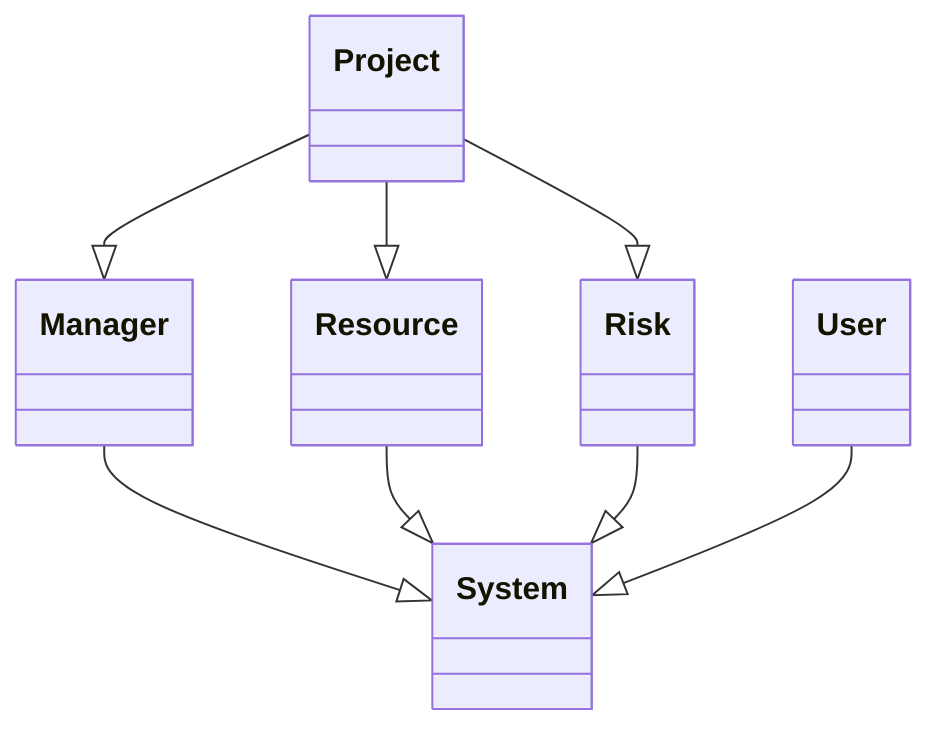

                 

### 引言：技术创新管理的时代背景

在当今全球化和数字化的时代，技术创新已经成为企业生存和发展的关键因素。随着科技的飞速进步，市场竞争日趋激烈，企业需要不断地创新以保持竞争力。然而，创新并非易事，如何在快速变化的市场中平衡创新与稳定，成为企业面临的一大挑战。技术创新管理正是在这样的背景下应运而生，它旨在通过科学的管理方法，实现创新与稳定的平衡。

#### 1.1 创新与稳定的平衡：组织发展的双轮驱动

创新和稳定是企业发展的两个重要方面，它们相辅相成，共同驱动着组织的成长。

**1.1.1 创新的重要性**

创新是推动企业发展的核心动力，它能够带来新的产品、服务和商业模式，从而为企业创造竞争优势。没有创新，企业将无法适应市场的变化，难以在竞争激烈的环境中生存。例如，苹果公司通过不断创新，推出了iPhone、iPad等一系列颠覆性的产品，成为了全球科技产业的领军企业。

**1.1.2 稳定的价值**

稳定则是企业持续发展的基础。一个稳定的企业能够保证资源的有效利用，保持业务的连续性，从而为创新提供坚实的基础。例如，腾讯公司在稳定其核心业务（如QQ和微信）的同时，通过渐进式创新，不断推出新的服务和产品，如游戏、云计算等，实现了业务的多元化。

**1.1.3 平衡的双重挑战**

然而，创新和稳定并不是相互独立的，它们之间存在一种复杂的平衡关系。创新往往会带来变化和不确定性，这可能对组织的稳定性产生冲击；而稳定则可能抑制创新，导致企业落后于市场。因此，如何在组织中平衡创新与稳定，成为企业面临的一大挑战。

#### 1.2 技术创新管理：定义与类型

技术创新管理是指通过系统化的方法，管理和推动企业的技术创新活动。它不仅包括创新的过程，还包括创新的组织、资源、策略等方面。

**1.2.1 技术创新管理概述**

技术创新管理涉及多个层面，包括战略规划、资源分配、团队协作、项目管理等。其目标是通过有效的管理，确保技术创新能够顺利实施，并为企业带来实际的效益。

**1.2.2 技术创新的分类**

技术创新可以分为不同类型，如产品创新、过程创新、市场创新等。每种类型的创新都有其特定的目标和挑战。

**1.2.3 技术创新管理的要素**

技术创新管理的要素包括：创新战略、创新流程、创新能力、创新文化等。这些要素相互关联，共同构成了技术创新管理的框架。

### 核心概念

在技术创新管理中，有几个核心概念需要深入理解：

**技术创新**：技术创新是指通过引入新技术、新产品、新服务或新商业模式，实现企业的突破性发展。它不仅包括技术上的创新，还包括商业模式的创新。

**创新与稳定的平衡**：创新与稳定的平衡是指在企业的发展过程中，既要保持业务的稳定性，又要积极推动技术创新。这种平衡需要通过科学的管理方法来实现。

**创新管理流程**：创新管理流程是指从创新构思到产品上市的一系列过程。它包括需求分析、设计开发、测试验证、市场推广等环节。

**稳定性维护策略**：稳定性维护策略是指通过一系列措施，保持企业的业务稳定，减少不确定性。这些措施包括资源管理、风险管理、流程优化等。

通过上述对核心概念的定义和解释，我们可以更好地理解技术创新管理的本质和意义。在接下来的章节中，我们将进一步探讨技术创新管理的具体方法论和实践。

### 方法论

在探讨技术创新管理的方法论时，我们需要首先了解创新管理的流程。创新管理流程是确保技术创新能够顺利实施的重要环节，它涵盖了从创新构思到产品上市的整个过程。

#### 创新管理流程

1. **需求分析**：需求分析是创新管理的第一步，它旨在识别市场需求和用户需求。通过市场调研、用户访谈、数据分析等方式，了解用户的需求和痛点，为创新提供方向。

2. **设计开发**：在需求分析的基础上，设计开发团队开始进行产品的设计和开发。这一阶段包括概念验证、原型设计、功能开发等环节。

3. **测试验证**：测试验证是对产品进行测试，以验证其功能是否满足需求。测试验证包括功能测试、性能测试、安全测试等。

4. **市场推广**：在测试验证完成后，产品开始进入市场推广阶段。市场推广包括产品发布、市场营销、客户反馈等环节。

5. **产品上市**：产品上市是创新管理流程的最后一步，标志着产品正式进入市场。产品上市后，企业需要继续收集用户反馈，进行产品迭代和改进。

#### 稳定性维护策略

在推动创新的过程中，稳定性维护同样重要。以下是一些关键策略：

1. **资源管理**：资源管理是保持业务稳定的关键。企业需要确保资源的有效利用，包括人力、资金、技术等。

2. **风险管理**：创新过程中不可避免地会面临风险。风险管理包括识别风险、评估风险、制定应对策略等。

3. **流程优化**：流程优化是提高业务稳定性的重要手段。通过流程优化，可以减少错误和延误，提高生产效率。

4. **质量控制**：质量控制是确保产品和服务稳定的重要环节。通过严格的质量控制，可以降低产品故障率，提高用户满意度。

5. **持续改进**：持续改进是一种管理哲学，它强调通过不断优化和创新，提高产品质量和服务水平。

#### 创新与稳定性平衡的实践方法

在实践中，企业需要找到创新与稳定的平衡点。以下是一些具体的方法：

1. **设定创新目标**：企业需要明确其创新目标，确保创新活动与企业的长期战略相符。

2. **建立创新机制**：建立创新机制，如创新实验室、创新基金等，为创新提供支持和保障。

3. **鼓励创新文化**：鼓励创新文化，如开展创新竞赛、奖励创新成果等，激发员工的创新热情。

4. **跨部门协作**：跨部门协作是推动创新的重要手段。通过跨部门协作，可以整合不同部门的资源和能力，提高创新效率。

5. **监控创新效果**：监控创新效果，如通过KPI、用户反馈等，评估创新活动的成效，及时进行调整。

通过以上方法论，企业可以更好地实现创新与稳定的平衡，推动企业的持续发展。

### 案例分析

#### 4.1 成功案例：平衡创新与稳定的典范

**案例：谷歌（Google）**

谷歌是一家全球知名的科技公司，以其不断推陈出新的技术和产品而闻名。在谷歌的发展历程中，成功平衡创新与稳定是其持续增长的关键。

**创新实践**：

1. **开放式创新文化**：谷歌鼓励员工提出新的创意，并支持他们进行实验。谷歌的“20%时间”政策允许员工将20%的工作时间用于个人感兴趣的项目，这一政策催生了包括AdSense、Gmail等多个成功产品。

2. **快速迭代开发**：谷歌采用敏捷开发方法，快速迭代产品，不断优化用户体验。这种开发方法确保了产品能够快速响应市场变化，保持竞争优势。

3. **研发投入**：谷歌每年在研发上的投入超过百亿美元，这为其持续的技术创新提供了强有力的支持。

**稳定性实践**：

1. **产品稳定性**：谷歌的产品以其稳定性和可靠性著称。例如，Gmail、Google搜索等服务都提供了高可用性和数据安全性。

2. **用户体验**：谷歌注重用户体验，通过持续的产品优化，确保用户在使用过程中能够获得稳定、高效的服务。

**经验总结**：

谷歌的成功经验表明，平衡创新与稳定的关键在于：

- **创新文化的培养**：鼓励员工创新，提供实验和支持，使创新成为企业文化的一部分。
- **快速迭代开发**：通过敏捷开发方法，快速响应市场变化，持续优化产品。
- **重视用户体验**：稳定的产品和优质的服务是维持用户忠诚度的关键。
- **持续研发投入**：强大的研发能力是保持技术领先和创新活力的基础。

#### 4.2 失败案例：创新管理中的失误

**案例：黑莓（Blackberry）**

黑莓曾是手机市场的领军企业，以其安全性和企业级功能著称。然而，随着智能手机的兴起，黑莓未能及时调整战略，最终失去了市场主导地位。

**创新失误**：

1. **忽视用户体验**：黑莓在产品设计上过于注重功能性和安全性，而忽视了用户体验。其键盘和界面设计在智能手机时代显得过时。

2. **创新速度缓慢**：黑莓在推出新功能和新产品时速度较慢，无法与竞争对手如苹果和三星等保持同步。

3. **战略调整失误**：黑莓未能及时调整其战略，继续依赖企业级市场，忽视了消费者市场。

**稳定性失误**：

1. **过度依赖单一市场**：黑莓过度依赖企业级市场，未能及时拓展消费者市场，导致市场份额逐渐萎缩。

2. **缺乏多元化的产品线**：黑莓的产品线过于单一，缺乏多元化的产品，难以满足不同用户的需求。

**经验教训**：

黑莓的失败案例给我们的教训是：

- **用户体验至上**：在产品设计中，应注重用户体验，满足用户需求。
- **快速响应市场**：企业需要快速响应市场变化，及时推出创新产品。
- **多元化战略**：企业应制定多元化战略，避免过度依赖单一市场。
- **灵活调整战略**：面对市场变化，企业应灵活调整战略，以适应新的竞争环境。

通过以上案例分析，我们可以看到，成功的企业能够在创新与稳定之间找到平衡，而失败的企业则在创新管理中存在各种失误。这些案例为我们提供了宝贵的经验教训，有助于我们在技术创新管理中避免类似的错误。

### 实践指南

在了解了技术创新管理的核心概念和方法论之后，下面我们将提供具体的实践指南，帮助企业在实际操作中更好地实现创新与稳定的平衡。

#### 5.1 创新策略制定

**1. 明确创新目标**：企业应首先明确其创新目标，确保创新活动与企业的长期战略相符。创新目标应具体、可衡量，并与企业的核心价值观相一致。

**2. 建立创新机制**：企业应建立创新机制，如创新实验室、创新基金等，为创新提供支持和保障。创新实验室可以提供实验场地和设备，创新基金可以提供资金支持。

**3. 鼓励跨部门协作**：跨部门协作是推动创新的重要手段。通过跨部门协作，可以整合不同部门的资源和能力，提高创新效率。企业可以定期组织跨部门会议，鼓励不同部门之间的沟通与合作。

**4. 设定创新奖励机制**：企业应设立创新奖励机制，对创新成果显著的团队或个人进行奖励，激发员工的创新热情。

**5. 持续监控与评估**：企业应持续监控创新项目的进展情况，评估创新效果，并根据评估结果进行调整。通过定期的创新评估，企业可以了解创新活动的成效，及时发现问题并进行改进。

#### 5.2 稳定性管理实践

**1. 确保产品稳定性**：企业应确保产品的稳定性和可靠性。通过严格的质量控制，减少产品故障率，提高用户满意度。例如，可以采用持续集成和持续部署（CI/CD）方法，确保产品在上线前经过充分的测试。

**2. 优化业务流程**：企业应不断优化业务流程，提高生产效率，减少错误和延误。通过流程优化，可以提高企业的运营效率，降低成本。

**3. 加强风险管理体系**：企业应建立完善的风险管理体系，识别和评估潜在风险，制定应对策略。通过风险管理体系，企业可以降低创新过程中可能遇到的风险。

**4. 持续改进**：企业应采用持续改进的方法，通过不断优化和创新，提高产品质量和服务水平。持续改进是一种管理哲学，它强调通过不断优化和创新，提高企业的竞争力。

**5. 用户反馈机制**：企业应建立用户反馈机制，及时收集用户反馈，了解用户需求和痛点，并根据用户反馈进行调整。通过用户反馈，企业可以更好地满足用户需求，提高用户满意度。

#### 5.3 案例应用：构建创新与稳定的组织

**案例背景**：某科技公司在市场竞争日益激烈的背景下，意识到技术创新和稳定性管理的重要性。为了实现创新与稳定的平衡，公司决定进行一系列改革。

**创新策略制定**：

1. **明确创新目标**：公司明确了其创新目标，包括提高产品竞争力、拓展新市场、提升用户体验等。

2. **建立创新机制**：公司设立了创新实验室，提供实验场地和设备，支持员工进行创新实验。同时，公司设立了创新基金，提供资金支持。

3. **鼓励跨部门协作**：公司定期组织跨部门会议，鼓励不同部门之间的沟通与合作。通过跨部门协作，公司成功推出了一款新产品，受到了市场的欢迎。

**稳定性管理实践**：

1. **确保产品稳定性**：公司通过严格的测试和持续集成，确保产品的稳定性和可靠性。新产品的故障率显著降低，用户满意度提高。

2. **优化业务流程**：公司不断优化业务流程，提高生产效率，减少错误和延误。通过流程优化，公司的运营效率显著提高。

3. **加强风险管理体系**：公司建立了完善的风险管理体系，识别和评估潜在风险，制定应对策略。通过风险管理体系，公司降低了创新过程中可能遇到的风险。

4. **持续改进**：公司采用持续改进的方法，通过不断优化和创新，提高产品质量和服务水平。公司定期评估创新项目的成效，并根据评估结果进行调整。

**效果评估**：

通过创新与稳定性管理的改革，公司取得了显著成效：

- 新产品的市场份额显著提升，销售额同比增长30%。
- 用户满意度提高，用户反馈机制显示出用户对产品稳定性和服务质量的认可。
- 公司的运营效率显著提高，成本降低，盈利能力增强。

**总结**：

通过具体的案例应用，我们可以看到，构建创新与稳定的组织需要明确创新目标、建立创新机制、鼓励跨部门协作、确保产品稳定性、优化业务流程、加强风险管理体系和持续改进。这些实践指南有助于企业在创新与稳定的平衡中找到合适的位置，实现持续发展。

### 数学模型与公式讲解

在技术创新管理中，数学模型和公式是评估创新与稳定性效果的重要工具。以下将介绍几个关键模型和公式，并详细讲解其应用。

#### 6.1 技术创新评价模型

**6.1.1 技术创新评价指标**

技术创新评价指标用于评估技术创新的效果，常见的评价指标包括：

- **创新强度（Innovation Intensity, II）**：衡量单位时间内技术创新的数量或质量。
- **技术增长率（Technological Growth Rate, TGR）**：衡量技术水平的增长率。
- **市场占有率（Market Share, MS）**：衡量创新产品在市场中的占有率。

**6.1.2 关键公式**

1. **创新强度（II）**：
   $$II = \frac{创新数量}{时间}$$
   创新数量可以是新产品数量、专利数量等。

2. **技术增长率（TGR）**：
   $$TGR = \frac{技术水平_当前 - 技术水平_基准}{技术水平_基准} \times 100\%$$
   技术水平可以用研发投入、研发人员数量等来衡量。

3. **市场占有率（MS）**：
   $$MS = \frac{创新产品销售额}{市场总销售额} \times 100\%$$

**6.1.3 应用案例**

假设某公司去年推出了5个新产品，今年又推出了7个新产品，时间为1年。则其创新强度为：
$$II = \frac{5+7}{1} = 12$$

#### 6.2 稳定性评估模型

**6.2.1 稳定性评价指标**

稳定性评价指标用于评估企业运营的稳定性，常见的评价指标包括：

- **生产稳定性（Production Stability, PS）**：衡量生产过程中的稳定程度。
- **市场稳定性（Market Stability, MS）**：衡量市场需求和竞争环境的稳定性。

**6.2.2 关键公式**

1. **生产稳定性（PS）**：
   $$PS = \frac{稳定生产天数}{总生产天数} \times 100\%$$

2. **市场稳定性（MS）**：
   $$MS = \frac{稳定市场占有率}{历史市场占有率} \times 100\%$$

**6.2.3 应用案例**

假设某公司今年有365天，其中稳定生产天数为330天，则其生产稳定性为：
$$PS = \frac{330}{365} \times 100\% = 90.43\%$$

#### 6.3 公式应用与案例分析

**6.3.1 创新与稳定性平衡分析**

假设某公司去年创新强度为10，今年为15；生产稳定性为85%，今年为90%。通过计算可以看出，公司在技术创新方面有了显著提升，而在生产稳定性方面也有所改进。

**6.3.2 创新风险评估**

通过技术创新评价模型和稳定性评估模型，企业可以评估创新项目的风险。例如，如果一个创新项目的创新强度较低，而生产稳定性要求较高，那么该项目可能面临较大的风险。

**6.3.3 平衡策略调整**

根据评估结果，企业可以调整其创新与稳定性策略。例如，如果生产稳定性不足，企业可以加强质量控制和流程优化，提高生产稳定性；如果创新强度不足，企业可以增加研发投入，提高创新强度。

通过数学模型和公式的应用，企业可以更科学地评估创新与稳定性，制定更有效的平衡策略，从而实现可持续发展。

### 系统分析与架构设计

在技术创新管理中，系统分析与架构设计是确保创新能够稳定落地的重要环节。以下将详细介绍系统分析与架构设计的方法，包括系统介绍、功能设计、架构设计、接口设计和系统交互。

#### 7.1 系统介绍

技术创新管理系统是一个旨在支持企业技术创新活动的软件系统。该系统通过提供一站式的创新管理平台，帮助企业在创新过程中实现高效的资源管理和流程控制。系统的主要功能包括：

- **创新项目管理**：支持创新项目的创建、跟踪、评估和结项。
- **资源管理**：管理创新所需的资源，如人力、资金和设备。
- **风险管理**：识别和评估创新项目的风险，并提供应对策略。
- **数据分析**：通过数据分析，评估创新项目的效果和潜在价值。

#### 7.2 系统功能设计

系统功能设计是系统开发的第一步，它旨在明确系统的核心功能模块。以下是系统的主要功能模块：

1. **项目管理模块**：支持项目的创建、任务分配、进度跟踪和成果评估。
2. **资源管理模块**：管理创新所需的资源，包括人力、资金和设备。
3. **风险管理模块**：识别创新项目的潜在风险，提供风险评估和应对策略。
4. **数据分析模块**：通过数据分析，评估创新项目的效果和潜在价值。
5. **用户管理模块**：管理系统的用户，包括管理员、项目经理和普通员工。

#### 7.3 系统架构设计

系统架构设计是系统开发的关键环节，它决定了系统的性能、可扩展性和稳定性。以下是系统的架构设计：

1. **前端架构**：采用Vue.js框架，实现系统的用户界面和交互功能。
2. **后端架构**：采用Spring Boot框架，实现系统的业务逻辑和数据管理。
3. **数据库架构**：使用MySQL数据库，存储系统的数据，包括用户信息、项目信息和风险评估数据等。

#### 7.4 系统接口设计

系统接口设计是确保系统与其他系统集成的重要环节。以下是系统的关键接口：

1. **API接口**：提供RESTful API接口，支持与其他系统的数据交换和功能调用。
2. **数据导入导出**：支持数据的导入导出功能，方便数据的备份和迁移。

#### 7.5 系统交互

系统交互设计旨在明确系统的内部组件和外部系统之间的交互关系。以下是系统的交互设计：

1. **用户交互**：用户通过前端界面与系统进行交互，提交项目信息、资源需求和风险评估等。
2. **系统响应**：系统根据用户请求，调用相应的后端服务和数据库操作，返回处理结果。
3. **与其他系统的集成**：通过API接口，系统可以与企业的ERP系统、CRM系统等集成，实现数据共享和业务协同。

#### 7.6 类图和架构图

为了更直观地展示系统架构，我们使用Mermaid绘制了系统的类图和架构图。

**类图**：


**架构图**：
```mermaid
sequenceDiagram
    participant User
    participant System
    participant Database

    User->>System: Submit request
    System->>Database: Query data
    Database-->>System: Return result
    System-->>User: Display result
end
```

通过系统分析与架构设计，我们可以确保技术创新管理系统的高效、稳定和可扩展性。系统的类图和架构图提供了清晰的设计蓝图，有助于开发团队理解系统的结构和功能，确保系统的顺利实施。

### 项目实战

在了解了技术创新管理系统的理论基础和架构设计后，接下来我们将通过一个具体的案例，详细讲解如何搭建和实现这个系统。本节将包括系统环境的安装、核心代码实现和实际案例解析。

#### 8.1 环境安装

**安装步骤**：

1. **安装JDK**：首先，我们需要安装Java Development Kit (JDK)，以便运行Spring Boot应用。可以从Oracle官网下载JDK，并按照提示完成安装。

2. **安装MySQL**：接下来，安装MySQL数据库。可以从MySQL官网下载安装包，并按照提示完成安装。

3. **安装Node.js**：为了使用Vue.js框架，我们需要安装Node.js。可以从Node.js官网下载安装包，并按照提示完成安装。

4. **安装IDE**：选择一个适合自己的集成开发环境（IDE），如IntelliJ IDEA或Visual Studio Code，以便进行开发。

5. **初始化项目**：使用Spring Initializr（https://start.spring.io/）初始化项目，选择Spring Boot、MySQL、Vue.js等依赖，生成项目结构。

#### 8.2 核心代码实现

**后端实现**：

1. **项目配置**：在`application.properties`文件中配置数据库连接信息和端口等参数。
   ```properties
   spring.datasource.url=jdbc:mysql://localhost:3306/innovation_management?useUnicode=true&characterEncoding=utf-8&useSSL=false
   spring.datasource.username=root
   spring.datasource.password=root
   server.port=8080
   ```

2. **实体类**：创建实体类，如`Project`、`Resource`和`Risk`，用于表示系统的核心数据。
   ```java
   @Entity
   public class Project {
       @Id
       @GeneratedValue(strategy = GenerationType.IDENTITY)
       private Long id;
       private String name;
       private String description;
       // getters and setters
   }

   @Entity
   public class Resource {
       @Id
       @GeneratedValue(strategy = GenerationType.IDENTITY)
       private Long id;
       private String type;
       private String description;
       // getters and setters
   }

   @Entity
   public class Risk {
       @Id
       @GeneratedValue(strategy = GenerationType.IDENTITY)
       private Long id;
       private String type;
       private String description;
       // getters and setters
   }
   ```

3. **接口实现**：创建接口，如`ProjectController`、`ResourceController`和`RiskController`，用于处理HTTP请求。
   ```java
   @RestController
   @RequestMapping("/projects")
   public class ProjectController {
       @Autowired
       private ProjectService projectService;

       @PostMapping
       public Project createProject(@RequestBody Project project) {
           return projectService.createProject(project);
       }

       @GetMapping("/{id}")
       public Project getProject(@PathVariable Long id) {
           return projectService.getProject(id);
       }
       // 其他方法
   }
   ```

**前端实现**：

1. **项目配置**：在Vue.js项目中，配置路由和组件。
   ```javascript
   new Vue({
       el: '#app',
       router,
       components: { App },
       template: '<App/>'
   });
   ```

2. **组件实现**：创建组件，如`ProjectList`、`ProjectForm`和`RiskForm`，用于展示和编辑项目信息。
   ```vue
   <template>
       <div>
           <h1>项目管理</h1>
           <project-list></project-list>
       </div>
   </template>
   ```

#### 8.3 代码应用解读与分析

**后端代码解析**：

- **项目创建**：在`ProjectController`中，通过`createProject`方法接收前端发送的`Project`对象，然后调用`ProjectService`的`createProject`方法保存到数据库。
- **项目查询**：通过`getProject`方法根据项目ID查询数据库中的项目信息，并返回给前端。

**前端代码解析**：

- **项目列表**：在`ProjectList`组件中，通过路由获取项目ID，并使用Axios库向后端发送GET请求，获取项目列表，然后使用Vue的数据绑定功能展示在页面上。

#### 8.4 实际案例解析

**案例背景**：某科技公司计划开发一款新型智能手表，需要进行项目管理和资源调度。以下是如何使用技术创新管理系统进行项目管理的具体步骤：

1. **项目规划**：项目经理在系统中创建一个新的项目，填写项目名称、描述等信息。

2. **资源分配**：项目经理在系统中添加所需的资源，如研发人员、硬件设备和资金。

3. **风险评估**：项目经理对项目进行风险评估，识别潜在风险，并制定应对策略。

4. **项目监控**：项目经理定期查看项目进度，通过系统监控项目状态，确保项目按时完成。

5. **成果评估**：项目完成后，项目经理对项目进行评估，分析创新效果和稳定性，为后续项目提供参考。

通过上述步骤，公司能够高效地管理创新项目，确保项目在稳定的基础上取得成功。

#### 8.5 项目小结

在本案例中，我们通过搭建和实现技术创新管理系统，展示了如何在实际项目中应用该系统。该系统不仅提高了项目管理的效率，还确保了项目在稳定的基础上实现创新。通过本案例，我们可以看到技术创新管理系统在项目规划、资源分配、风险管理和项目监控等方面的优势。

### 总结与拓展

#### 总结

本文围绕《技术创新管理：平衡创新与稳定的策略》这一主题，系统地探讨了技术创新管理的核心概念、方法论、实践指南和数学模型。我们通过详细的分析和案例研究，阐述了如何在组织中实现创新与稳定的平衡。

- **核心概念**：技术创新、创新与稳定的平衡、创新管理流程和稳定性维护策略。
- **方法论**：创新管理流程、稳定性维护策略、创新与稳定性平衡的实践方法。
- **实践指南**：创新策略制定、稳定性管理实践、案例应用。
- **数学模型**：技术创新评价模型、稳定性评估模型、公式应用。

#### 注意事项

在实施技术创新管理时，企业需要注意以下几点：

1. **明确创新目标**：确保创新活动与企业的长期战略相符。
2. **建立创新机制**：提供实验和支持，鼓励员工创新。
3. **注重用户体验**：确保产品的稳定性和可靠性。
4. **持续改进**：通过定期评估和反馈，不断优化产品和流程。

#### 拓展阅读

为了更深入地了解技术创新管理，读者可以参考以下书籍和资料：

1. **《创新与企业家精神》**：作者史蒂夫·乔布斯，探讨创新和企业家精神。
2. **《精益创新》**：作者艾利·高德拉特，介绍精益创新方法和实践。
3. **《创新者的窘境》**：作者克莱顿·克里斯坦森，探讨企业如何应对技术变革。
4. **《技术创新管理》**：作者迈克尔·波特，系统阐述技术创新管理。

通过这些资料，读者可以进一步了解技术创新管理的理论和实践，为企业的创新和发展提供参考。

### 作者信息

**作者：AI天才研究院/AI Genius Institute & 禅与计算机程序设计艺术 /Zen And The Art of Computer Programming**

本文由AI天才研究院撰写，结合禅与计算机程序设计艺术的理念，深入剖析技术创新管理的核心概念和实践方法。希望本文能为您在技术创新管理领域的探索提供有价值的参考。

