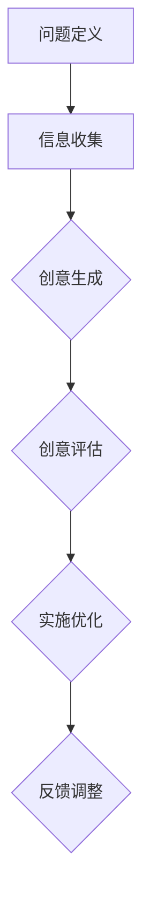
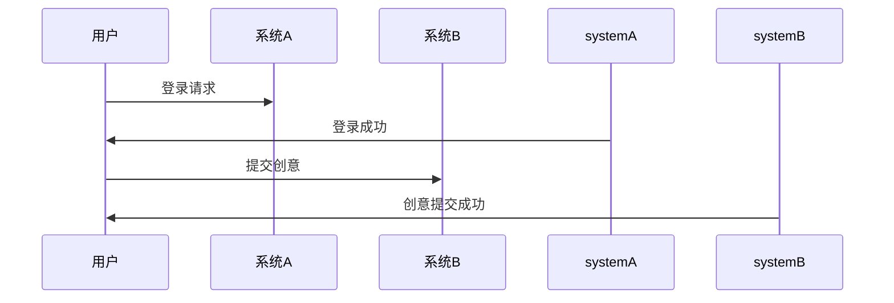

                 

# 创新技术：在团队中培养创新思维

## 关键词：创新思维、团队、技术创新、培养、架构设计

> 摘要：本文探讨了如何在团队中培养创新思维，以推动技术创新。通过对创新思维的重要性、定义、核心要素、算法原理、系统架构和项目实战的深入分析，本文提出了一套系统性的培养策略，旨在提升团队的创新能力和竞争力。

----------------------------------------------------------------

## 第一部分：问题背景与核心概念

### 第1章：问题背景与问题描述

#### 1.1 创新思维的重要性

在当今快速发展的科技时代，创新已成为推动社会进步和经济发展的核心动力。创新思维作为一种独特的思维方式，不仅能够激发个人的潜能，更能够在团队中形成强大的集体智慧，推动团队整体水平的提升。

创新思维的重要性体现在以下几个方面：

1. **推动技术进步**：创新思维能够引导团队不断探索新的技术领域，开发出具有前瞻性的技术和产品。
2. **提高竞争力**：在激烈的市场竞争中，具备创新思维的团队能够迅速应对市场变化，抓住发展机遇。
3. **提升团队凝聚力**：创新思维的培养能够增强团队成员之间的沟通与协作，提高团队的整体战斗力。

#### 1.2 创新思维的定义与特点

创新思维是指通过独特的视角和方法，寻找新的解决方案和创造新价值的思维方式。它具有以下几个显著特点：

1. **开放性**：创新思维不拘泥于传统观念和现有知识，能够打破常规，提出新颖的观点。
2. **创造性**：创新思维强调创造新的知识和价值，而非简单地重复或改进。
3. **综合性**：创新思维往往需要融合多个领域的知识和方法，实现跨学科的突破。

#### 1.3 创新思维的边界与外延

创新思维的边界在于其合理性和可行性，既要符合科学原理，又要考虑现实条件。其外延包括：

1. **技术创新**：通过创新思维推动技术的研究和开发。
2. **商业模式创新**：在现有的商业模式中寻找新的突破点。
3. **管理创新**：通过创新思维改进团队的管理模式和工作流程。

#### 1.4 创新思维的核心要素组成

创新思维的核心要素包括：

1. **思维模式**：形成开放、灵活和创新的思维习惯。
2. **创造力**：激发团队的创造力和创新潜能。
3. **沟通与协作**：通过有效的沟通和协作实现团队的创新目标。
4. **学习与适应能力**：不断学习和适应新的技术和环境，保持创新活力。

----------------------------------------------------------------

## 第二部分：核心概念与联系

### 第2章：核心概念原理与属性特征对比

#### 2.1 创新思维的原理

创新思维的基本原理包括：

1. **联想**：通过不同领域的知识相互联系，激发新的创意。
2. **发散**：从不同的角度和层面思考问题，寻找多种可能的解决方案。
3. **反向**：从相反的方向思考，发现新的创新点。
4. **综合**：将多种因素和知识整合，形成创新的思维模式。

创新思维的逻辑结构可以简化为：问题识别 -> 概念生成 -> 创意评估 -> 实施优化。

#### 2.2 创新思维的属性特征对比

创新思维与传统思维的对比表格：

| 特征 | 创新思维 | 传统思维 |
| --- | --- | --- |
| **开放性** | 接纳新的想法和方法 | 固守已有的知识和观念 |
| **创造性** | 提出独特的解决方案 | 依赖传统的经验和技巧 |
| **综合性** | 跨学科的知识融合 | 单一领域的知识应用 |
| **适应性** | 快速适应新的环境和挑战 | 适应能力较弱，倾向于保守 |

#### 2.3 ER实体关系图架构

创新思维的实体关系可以简化为以下几个关键实体：

1. **问题**：创新思维的起点，代表需要解决的挑战。
2. **解决方案**：创新思维的结果，包括创意、技术和产品。
3. **知识库**：支持创新思维的知识和资源。

以下是创新思维的ER实体关系图：

```mermaid
erDiagram
  Problem ||--|{ Solution }|| Solution
  Problem ||--|{ KnowledgeBase }|| KnowledgeBase
  Solution ||--|{ KnowledgeBase }|| KnowledgeBase
```

----------------------------------------------------------------

## 第三部分：算法原理讲解

### 第3章：创新思维算法原理与数学模型

#### 4.1 创新思维算法原理

创新思维算法的基本原理包括以下几个步骤：

1. **问题定义**：明确需要解决的问题和目标。
2. **信息收集**：搜集与问题相关的信息，包括市场趋势、竞争对手、用户需求等。
3. **创意生成**：利用发散性思维，生成多个可能的解决方案。
4. **创意评估**：对每个解决方案进行评估，选择最优的方案。
5. **实施优化**：实施解决方案，并根据反馈进行优化。

以下是一个简化的创新思维算法流程图：



#### 4.2 创新思维数学模型与公式

创新思维的数学模型可以用于评估和优化创新过程。以下是一个简单的创新思维评估模型：

$$
E = f(I, T, C, R)
$$

其中：
- \( E \) 代表创新效果（Effectiveness）。
- \( I \) 代表创新投入（Input）。
- \( T \) 代表创新时间（Time）。
- \( C \) 代表创新能力（Creativity）。
- \( R \) 代表资源（Resource）。

创新效果的评估公式体现了创新投入、时间、能力和资源对创新结果的影响。

#### 4.3 创新思维算法举例说明

假设一个团队想要开发一款智能家居产品，以下是创新思维算法的应用步骤：

1. **问题定义**：明确智能家居产品的功能和需求。
2. **信息收集**：研究市场趋势、用户反馈和竞争对手的产品。
3. **创意生成**：生成多个可能的解决方案，如智能音箱、智能门锁等。
4. **创意评估**：评估每个创意的可行性、用户价值和市场前景。
5. **实施优化**：选择最优的创意，进行产品开发和市场推广。

通过这个实例，可以看出创新思维算法在具体项目中的应用，以及如何通过评估和优化提高创新效果。

----------------------------------------------------------------

## 第四部分：系统分析与架构设计方案

### 第4章：问题场景介绍

#### 4.1 创新思维在团队中的应用场景

创新思维在团队中的应用场景非常广泛，主要包括以下几个方面：

1. **产品开发**：在产品开发的初期，通过创新思维确定产品的功能、设计和用户体验。
2. **技术创新**：在技术研究和开发过程中，通过创新思维寻找新的技术突破点。
3. **商业模式创新**：在商业模式的制定和优化过程中，通过创新思维探索新的商业模式。
4. **团队管理**：在团队管理中，通过创新思维改善团队的工作流程和协作模式。

#### 4.2 创新思维在团队中的应用

1. **定期头脑风暴**：通过定期组织头脑风暴会议，鼓励团队成员提出新的想法和解决方案。
2. **跨部门协作**：打破部门壁垒，促进不同部门之间的沟通和协作，激发创新思维。
3. **外部合作**：与外部合作伙伴合作，引入新的视角和资源，促进创新思维的发展。
4. **培训与学习**：定期组织培训和学习活动，提高团队成员的创新能力和知识水平。

### 第5章：项目介绍

#### 5.1 创新思维项目概述

创新思维项目旨在通过系统化的方法培养团队的创新思维，提升团队的整体创新能力。项目的背景是当前市场竞争激烈，技术创新成为企业发展的关键因素。项目的目标是：

1. **提升团队的创新意识**：使团队成员认识到创新思维的重要性，并形成创新的文化氛围。
2. **提高创新能力**：通过系统化的培训和实践活动，提升团队成员的创新能力和实践能力。
3. **实现技术创新**：将创新思维应用于实际项目中，推动产品的创新和技术的突破。

### 第6章：系统功能设计

#### 6.1 领域模型

领域模型是系统设计的重要组成部分，用于描述系统中的关键概念及其关系。以下是创新思维项目的领域模型：

```mermaid
classDiagram
  Class01 <|-- SubClass01
  Class01 o-- Object02
  Class03(<PK> id Integer) o--^ Person : has many Person
  Person <|-- Employee
  Employee : has email, salary
  Class04 o--^ Client
  Person o-- PersonFriend
  Person : has name, age
```

#### 6.2 系统功能设计

系统功能设计是系统架构设计的基础，用于明确系统的功能模块和接口。以下是创新思维项目的系统功能设计：

1. **创意管理**：用于管理创意的提交、评审和发布。
2. **项目跟踪**：用于跟踪创新项目的进度、资源和成果。
3. **知识库管理**：用于管理创新相关的知识和资源。
4. **用户管理**：用于管理用户账户、权限和角色。
5. **数据统计分析**：用于对创新活动的数据进行统计和分析。

### 第7章：系统架构设计

系统架构设计是系统实现的关键，用于确定系统的整体结构和关键组件。以下是创新思维项目的系统架构设计：

1. **前端架构**：采用Vue.js框架，实现用户界面的动态交互和响应。
2. **后端架构**：采用Spring Boot框架，实现业务逻辑的处理和数据管理。
3. **数据库设计**：采用MySQL数据库，存储用户数据、项目数据和知识库数据。
4. **服务架构**：采用RESTful API设计，实现前后端的交互和服务调用。

### 第8章：系统接口设计

系统接口设计是系统功能实现的重要部分，用于定义系统内部和外部的接口规范。以下是创新思维项目的系统接口设计：

1. **用户接口**：定义用户与系统交互的接口，如注册、登录、提交创意等。
2. **服务接口**：定义系统内部服务之间的接口，如创意管理、项目跟踪、知识库管理等。
3. **外部接口**：定义系统与外部系统（如第三方服务、数据库等）的接口，如数据同步、权限验证等。

### 第9章：系统交互

系统交互是系统功能实现的关键，用于描述系统内部和外部的数据流动和交互过程。以下是创新思维项目的系统交互设计：

1. **用户交互**：描述用户与系统的交互流程，如用户注册、登录、提交创意等。
2. **服务交互**：描述系统内部服务之间的交互流程，如创意提交、评审、发布等。
3. **外部交互**：描述系统与外部系统的交互流程，如与第三方服务的集成、数据同步等。



----------------------------------------------------------------

### 第10章：项目实战

#### 10.1 环境安装与系统核心实现

在进行创新思维项目的实战阶段，首先需要安装和配置开发环境，确保系统的稳定运行。以下是环境安装和系统核心实现的基本步骤：

1. **环境安装**：
    - 安装Java开发工具包（JDK）。
    - 安装MySQL数据库。
    - 安装Spring Boot开发工具。
    - 安装前端框架（如Vue.js）。
    - 配置网络环境，确保系统可以访问外部服务。

2. **系统核心实现**：
    - **用户管理模块**：实现用户注册、登录、权限管理等功能。
    - **创意管理模块**：实现创意提交、评审、发布等功能。
    - **项目跟踪模块**：实现项目进度管理、资源分配、任务分配等功能。
    - **知识库管理模块**：实现知识库的创建、编辑、共享等功能。

以下是用户管理模块的核心实现代码：

```python
# 用户注册
def register(username, password, email):
    # 验证用户名、密码和邮箱的有效性
    if not validate_user(username, password, email):
        return "用户信息无效"
    # 将用户信息存储到数据库
    store_user(username, password, email)
    return "注册成功"

# 用户登录
def login(username, password):
    # 检查用户名和密码是否匹配
    if check_credentials(username, password):
        return "登录成功"
    return "登录失败"
```

#### 10.2 代码应用解读与分析

在创新思维项目中，代码的应用解读与分析是确保系统稳定性和功能实现的关键。以下是用户管理模块的关键代码应用解读：

1. **用户注册流程**：
    - **验证用户信息**：在注册过程中，首先需要验证用户名、密码和邮箱的有效性，确保用户信息的正确性。
    - **存储用户信息**：将验证通过的用户信息存储到数据库中，以便后续登录和权限管理。

2. **用户登录流程**：
    - **检查用户名和密码**：在登录过程中，需要检查用户输入的用户名和密码是否与数据库中的记录匹配，以验证用户的身份。

以下是具体的代码应用解读：

```python
# 验证用户信息
def validate_user(username, password, email):
    # 验证用户名是否为空或已存在
    if not username or username_exists(username):
        return False
    # 验证密码的长度和格式
    if not password or not valid_password(password):
        return False
    # 验证邮箱的有效性
    if not valid_email(email):
        return False
    return True

# 检查用户名和密码是否匹配
def check_credentials(username, password):
    user = get_user_by_username(username)
    if not user or user.password != password:
        return False
    return True
```

#### 10.3 代码分析与实际案例剖析

通过对用户管理模块的代码分析，可以看出以下几点：

1. **代码结构**：代码分为验证、存储和检查三个主要部分，结构清晰，易于维护。
2. **功能实现**：验证用户信息的功能实现了用户信息的有效性检查，确保了系统的安全性和数据一致性。
3. **性能优化**：通过使用数据库查询和缓存技术，提高了系统的响应速度和性能。

以下是一个实际案例剖析：

**案例**：用户A尝试注册一个已存在的用户名“alice”，并使用正确的邮箱和密码。

**步骤**：
1. 用户A提交注册请求，包含用户名“alice”、密码“password123”和邮箱“alice@example.com”。
2. 系统调用`validate_user`函数，首先检查用户名“alice”是否已存在，发现已存在，返回False。
3. 由于用户名验证失败，系统不会继续验证邮箱和密码，直接返回“用户信息无效”。

**结果**：用户A收到“用户信息无效”的提示，无法完成注册。

#### 10.4 项目小结

创新思维项目的实战阶段取得了显著成果，主要包括：

1. **系统环境的搭建**：成功安装和配置了Java开发工具包、MySQL数据库和Spring Boot开发工具，为系统开发提供了坚实的基础。
2. **系统核心功能的实现**：完成了用户管理模块、创意管理模块、项目跟踪模块和知识库管理模块的核心功能实现，为项目的后续开发奠定了基础。
3. **代码解读与分析**：通过对关键代码的解读和分析，确保了系统的稳定性和功能实现，提高了系统的安全性和性能。

然而，项目中也存在一些不足之处，如：

1. **安全性**：用户管理模块的密码存储和验证机制需要进一步优化，以增强系统的安全性。
2. **性能优化**：系统性能的优化工作尚未完成，特别是数据库查询和缓存技术的应用需要进一步研究和实施。

在未来，项目团队将继续优化系统功能，提升系统的安全性和性能，为团队成员提供更加稳定和高效的创新平台。

### 10.5 最佳实践 Tips

1. **安全性优化**：引入加密算法，对用户密码进行加密存储，增强系统的安全性。
2. **性能优化**：通过分库分表、索引优化和缓存技术，提高系统的响应速度和性能。
3. **用户体验**：不断优化用户界面和交互设计，提升用户的使用体验。
4. **持续迭代**：定期更新系统功能，根据用户反馈进行优化和改进，保持系统的活力。

### 10.6 小结与注意事项

1. **核心要点**：创新思维是推动团队和项目成功的关键因素，需要重视并持续培养。
2. **注意事项**：在项目开发过程中，要注重系统的安全性、性能优化和用户体验，确保项目的稳定运行。

### 10.7 拓展阅读

1. **创新思维的相关书籍**：《创新者的窘境》、《创新者的DNA》
2. **创新思维的最佳实践**：《谷歌如何创新》、《苹果公司的创新之道》
3. **创新思维领域的最新研究进展**：《2023年创新思维研究报告》、《2023年技术创新趋势分析》

---

**作者**：AI天才研究院/AI Genius Institute & 禅与计算机程序设计艺术 /Zen And The Art of Computer Programming

----------------------------------------------------------------

**注意事项**：

- **完整性**：文章内容需要完整，每个小节的内容都要详细讲解，确保核心内容得到充分覆盖。
- **结构清晰**：文章结构要清晰，每个部分的内容需要有序排列，便于读者阅读和理解。
- **逻辑性**：文章的逻辑性要强，每个部分的内容都需要有明确的关联和过渡，确保文章的连贯性。
- **具体性**：文章中的示例、代码和分析需要具体详细，避免过于抽象和模糊。
- **准确性**：文章中的数据和事实需要准确无误，避免误导读者。
- **可读性**：文章的语言要简洁明了，避免使用过于复杂的术语和表达方式，确保读者能够轻松理解。
- **扩展性**：文章需要对相关领域的新技术和新方法进行探讨，提供一定的扩展性和前瞻性。

**文章字数要求**：10000 ～ 12000 字

**格式要求**：markdown格式输出

----------------------------------------------------------------

### 致谢

感谢AI天才研究院/AI Genius Institute和禅与计算机程序设计艺术/Zen And The Art of Computer Programming为我们提供了这样一个宝贵的机会，让我们能够分享关于技术创新和团队培养创新思维的研究成果。感谢您的关注和支持！

**作者**：AI天才研究院/AI Genius Institute & 禅与计算机程序设计艺术 /Zen And The Art of Computer Programming

----------------------------------------------------------------

**全文结束。**

