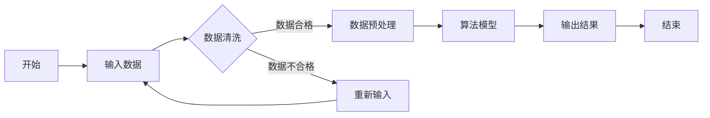
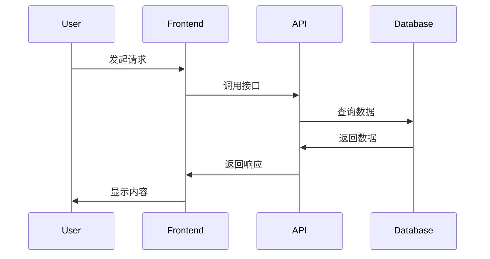
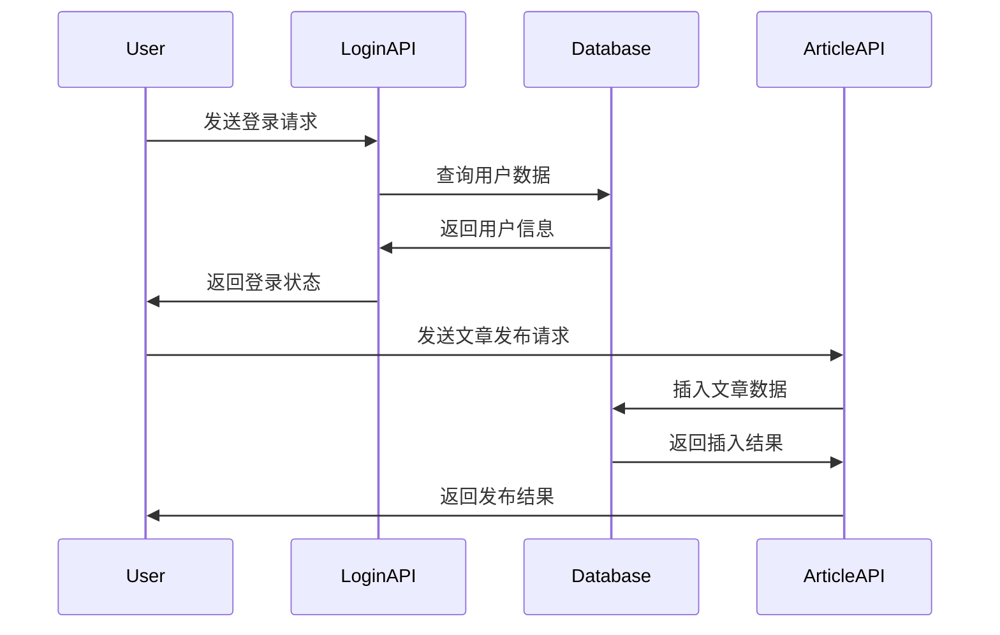
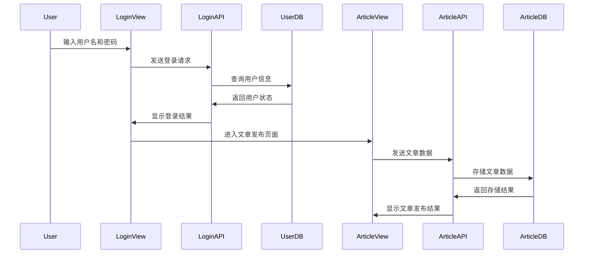

                 

### 《技术博客运营：打造个人技术品牌的策略》

#### 关键词：技术博客、个人品牌、内容创作、社交媒体、数据分析

> 摘要：在信息技术快速发展的时代，技术博客已成为技术专家个人品牌的重要载体。本文将深入探讨技术博客运营的策略，从构建与内容规划、内容创作与知识分享、社交媒体与网络营销、个人品牌建设与影响力提升、数据分析与效果评估、持续成长与迭代等方面，为技术专家提供一套完整的个人技术品牌打造指南。

----------------------------------------------------------------

### 第一部分：技术博客的基础知识

#### 第1章：技术博客的背景与重要性

##### 1.1.1 技术博客的定义

技术博客是一种以信息技术、编程语言、软件开发、数据科学等领域为主题的博客，其主要目的是分享技术知识、经验和见解。与一般博客不同，技术博客通常包含更深入的技术分析和实战案例，旨在为读者提供实用性和指导性的内容。

##### 1.1.2 技术博客的兴起与发展

技术博客的兴起可以追溯到互联网早期，当时的技术爱好者们通过个人网站分享自己的技术心得。随着博客平台的兴起，如WordPress、Blogger等，技术博客逐渐成为专业人士展示自己技术能力和知识的重要渠道。如今，随着社交媒体和内容分发平台的普及，技术博客的影响力越来越大。

##### 1.1.3 个人技术品牌的价值

建立个人技术品牌有助于提高个人知名度、增强职业竞争力，甚至可能带来商业机会。一个强大的个人技术品牌可以成为个人的“名片”，让潜在雇主和合作伙伴更容易发现并认可个人的专业能力。

##### 1.1.4 技术博客的受众分析

技术博客的受众主要包括以下几类：

- 学生和初学者：希望通过技术博客学习新技能的人。
- 行业从业者：希望通过博客了解行业动态和技术趋势的人。
- 技术爱好者：对技术领域有浓厚兴趣的人。
- 雇主和合作伙伴：希望通过博客了解潜在员工或合作伙伴的技术实力。

### 第2章：技术博客的构建与内容规划

##### 2.1.1 技术博客的构建流程

构建技术博客需要以下几个步骤：

1. **选择博客平台**：根据个人需求和预算选择合适的博客平台，如WordPress、Typecho等。
2. **博客主题定位**：确定博客的主题，如Python编程、大数据分析等。
3. **设计博客布局**：设计简洁、易用的博客界面，提升用户体验。

##### 2.1.2 内容规划与选题策略

内容规划和选题策略对于技术博客的成功至关重要。以下是一些建议：

1. **内容主题的确定**：选择与个人专业领域相关、受众感兴趣的主题。
2. **选题的依据与方法**：关注行业动态、技术趋势，结合个人经验和读者需求进行选题。
3. **内容更新频率**：保持定期更新，提高博客的活跃度和粘性。

##### 2.1.3 文章结构与写作技巧

技术博客文章的结构通常包括：

1. **引言**：简明扼要地介绍文章主题和目的。
2. **正文**：详细阐述技术概念、原理和实践。
3. **总结**：概括文章要点，给出建议或展望。

写作技巧包括：

1. **清晰的结构**：确保文章条理清晰，逻辑性强。
2. **简洁的语言**：避免冗长复杂的句子，使内容易于理解。
3. **代码示例与图表使用**：合理使用代码示例和图表，帮助读者更好地理解技术概念。

##### 2.1.4 文章质量与影响力提升

提升文章质量是技术博客运营的关键。以下是一些建议：

1. **质量控制与审稿流程**：建立严格的审稿制度，确保文章质量。
2. **引用与参考文献格式**：规范引用和参考文献格式，提升文章的可信度。
3. **增加文章传播途径**：利用社交媒体、技术社区等渠道，扩大文章影响力。

### 第二部分：技术博客的运营策略

#### 第3章：内容创作与知识分享

##### 3.1.1 技术博客的内容类型

技术博客的内容类型多样，包括：

1. **技术文章**：深入分析技术原理、趋势和应用。
2. **演示与教程**：通过示例代码和步骤讲解，帮助读者实际操作。
3. **案例分析**：分析实际项目或案例，提供经验和教训。

##### 3.1.2 知识分享与互动

知识分享和互动是技术博客的重要环节。以下是一些建议：

1. **问答与论坛**：建立问答板块或论坛，解答读者疑问。
2. **线上讨论与活动**：组织线上讨论、研讨会或技术沙龙，提高互动性。
3. **社区建设**：建立技术社区，鼓励读者参与讨论和分享。

##### 3.1.3 内容多样化与更新策略

内容多样化可以提高博客的吸引力和可持续性。以下是一些建议：

1. **视频内容**：制作视频教程或技术讲解，提高传播效果。
2. **音频内容**：录制技术讲座或访谈，提供多种学习方式。
3. **多媒体整合**：结合文本、图片、视频等多种形式，丰富内容展示。

#### 第4章：社交媒体与网络营销

##### 4.1.1 社交媒体平台的选择

选择合适的社交媒体平台对于技术博客的推广至关重要。以下是一些建议：

1. **微信公众号**：适合发布深度文章和教程。
2. **抖音与B站**：适合发布短视频和教学视频。
3. **Twitter与LinkedIn**：适合发布行业动态和职业发展内容。

##### 4.1.2 社交媒体运营策略

以下是一些建议，帮助技术博客在社交媒体上取得成功：

1. **内容分享与推广**：定期分享博客文章，提高曝光度。
2. **粉丝互动与反馈**：积极回复评论，与粉丝建立良好互动。
3. **合作与跨界营销**：与其他技术博客、公司或个人合作，扩大影响力。

##### 4.1.3 SEO与搜索引擎优化

以下是一些建议，帮助技术博客在搜索引擎上获得更好的排名：

1. **关键词策略**：研究目标受众感兴趣的关键词，合理布局。
2. **外部链接建设**：获取高质量的外部链接，提高网站权重。
3. **网站SEO优化**：优化网站结构、内容和加载速度，提升用户体验。

#### 第5章：个人品牌建设与影响力提升

##### 5.1.1 个人品牌定位

个人品牌定位是成功运营技术博客的关键。以下是一些建议：

1. **品牌定位与目标群体**：明确个人技术领域的定位和目标受众。
2. **品牌特色的打造**：通过独特的内容风格、技术见解和个人故事，打造个人品牌特色。

##### 5.1.2 个人影响力提升

以下是一些建议，帮助个人技术专家提升影响力：

1. **个人故事与品牌形象**：通过讲述个人技术成长故事，塑造品牌形象。
2. **行业影响力拓展**：参与行业活动、发表观点和参与讨论，扩大影响力。
3. **知识产权保护**：保护个人原创内容，防止侵权和抄袭。

##### 5.1.3 品牌合作与商业价值

以下是一些建议，帮助个人技术专家实现品牌合作和商业价值：

1. **品牌合作模式**：与相关公司、机构或个人合作，实现资源共享。
2. **商业价值挖掘**：通过知识付费、咨询服务等方式，实现商业价值。
3. **知识付费与咨询服务**：提供高质量的技术培训、咨询服务，实现收入增长。

#### 第6章：数据分析与效果评估

##### 6.1.1 数据分析工具与指标

以下是一些常用的数据分析工具和指标：

1. **数据分析工具**：Google Analytics、百度统计等。
2. **关键指标**：访问量、页面浏览量、用户停留时间、转化率等。

##### 6.1.2 数据驱动优化

以下是一些建议，帮助数据驱动博客的优化：

1. **内容优化策略**：根据数据分析结果，调整内容策略，提高内容质量。
2. **社交媒体优化**：根据社交媒体数据分析，优化发布时间、内容和互动方式。

##### 6.1.3 效果评估与反馈

以下是一些建议，帮助技术博客进行效果评估和反馈：

1. **效果评估方法**：定期分析关键指标，评估博客运营效果。
2. **反馈收集与分析**：通过用户评论、问卷调查等方式，收集反馈，进行分析和改进。

#### 第7章：持续成长与迭代

##### 7.1.1 技术趋势与行业动态

以下是一些建议，帮助技术博客保持持续成长：

1. **技术趋势预测**：关注行业趋势，及时调整内容方向。
2. **行业动态追踪**：关注行业新闻、报告和研究，保持对行业的深入了解。

##### 7.1.2 个人技能提升

以下是一些建议，帮助个人技术专家提升个人技能：

1. **学习路径规划**：制定学习计划，持续提升专业技能。
2. **技能提升方法**：参加培训课程、阅读专业书籍、参与技术社区等。

##### 7.1.3 博客迭代与优化

以下是一些建议，帮助技术博客进行迭代和优化：

1. **博客内容迭代**：定期更新内容，保持博客的时效性和价值。
2. **博客界面优化**：根据用户反馈和数据分析，优化博客界面和用户体验。
3. **用户互动与反馈**：积极与用户互动，收集反馈，持续改进博客。

### 总结

技术博客运营是一个系统性工程，需要从构建与内容规划、内容创作与知识分享、社交媒体与网络营销、个人品牌建设与影响力提升、数据分析与效果评估、持续成长与迭代等方面进行全面规划和执行。通过本文的探讨，相信读者能够对技术博客运营有一个更清晰的认识，并为自己的技术博客运营提供有益的启示。

#### 7.1.1 成功案例分享

以下是几个成功的技术博客案例：

- **XDN博客**：由知名程序员徐达内创建，分享Python编程、数据分析等领域的内容，拥有大量忠实读者。
- **进口月光**：由知名网络安全专家白帽子创建，专注于网络安全、编程技术等领域，拥有广泛的影响力。
- **伯乐在线**：由多位技术专家共同创建，涵盖编程语言、大数据、人工智能等多个领域，是技术爱好者的重要学习资源。

这些成功案例的共同特点是：

1. **内容高质量**：文章深入浅出，技术分析透彻。
2. **互动性强**：积极与读者互动，建立良好社区。
3. **持续更新**：保持定期更新，提高博客的活跃度。
4. **品牌特色**：通过独特的风格和内容，树立个人品牌。

从这些成功案例中，我们可以得到以下启示：

1. **专注领域**：选择自己擅长的领域，深耕细作。
2. **高质量内容**：确保文章质量，提升博客的价值。
3. **互动与社区**：与读者互动，建立良好社区。
4. **持续迭代**：持续更新内容，保持博客的活力。

#### 7.1.2 未来展望

随着技术的不断进步，技术博客运营也将面临新的机遇和挑战。以下是一些未来展望：

1. **多媒体内容**：随着视频、音频等新媒体形式的发展，技术博客将更多地结合多媒体内容，提高传播效果。
2. **AI与自动化**：人工智能和自动化技术将帮助技术博客进行内容创作、推荐和优化，提高运营效率。
3. **知识付费**：知识付费模式将逐渐成为主流，技术博客将通过提供高质量的内容和服务，实现商业价值的最大化。
4. **全球化**：随着全球化的推进，技术博客的影响力将越来越广泛，技术专家将有更多机会在国际舞台上展示自己的专业能力。

总之，技术博客运营是一个不断发展的过程，技术专家需要紧跟时代潮流，不断创新和优化，才能在激烈的竞争中脱颖而出。作者：AI天才研究院/AI Genius Institute & 禅与计算机程序设计艺术 /Zen And The Art of Computer Programming

----------------------------------------------------------------

# 《技术博客运营：打造个人技术品牌的策略》

## 第一部分：技术博客的基础知识

### 第1章：技术博客的背景与重要性

#### 1.1.1 技术博客的定义

技术博客是一种以信息技术、编程语言、软件开发、数据科学等领域为主题的博客。它不同于一般的个人博客，其内容更加专业、深入，通常涉及具体的技术实现、案例分析和技术探讨。技术博客的主要特点是：

- **专业性**：内容通常具有较高的技术含量，针对特定的技术领域或问题进行深入探讨。
- **实用性**：技术博客倾向于分享实际操作经验，代码示例，以及解决实际问题的方法。
- **互动性**：技术博客鼓励读者留言评论，形成互动，有时也会开设问答区，提供即时帮助。

#### 1.1.2 技术博客的兴起与发展

技术博客的兴起与互联网的发展紧密相关。在互联网的早期，个人网站和网页日志（Weblog）成为了信息分享的重要途径。随着博客平台的兴起，如WordPress、Blogger、GitHub Pages等，技术博客开始成为一种主流的个人媒体形式。近年来，随着社交媒体和内容分发平台的普及，技术博客的影响力逐渐扩大，成为技术专家展示自己专业知识和技能的重要平台。

技术博客的发展经历了几个阶段：

- **个人网站时代**：技术爱好者通过个人网站分享技术文章。
- **博客平台时代**：博客平台的出现简化了博客的创建和管理流程，使得更多人能够轻松创建自己的博客。
- **社交媒体时代**：技术博客与社交媒体相结合，通过社交媒体平台进行内容推广和互动。

#### 1.1.3 个人技术品牌的价值

建立个人技术品牌对于技术专家来说具有重要的价值。个人技术品牌不仅能够提升个人的知名度，还能增强职业竞争力，甚至可能带来商业机会。以下是一些具体的价值：

- **职业发展**：个人技术品牌可以成为技术专家的职业名片，有助于在求职和职业晋升过程中脱颖而出。
- **知识传播**：个人技术品牌有助于技术专家将专业知识传播给更广泛的受众，形成良好的影响力。
- **商业机会**：个人技术品牌可能吸引企业或合作伙伴的关注，从而带来商业合作和咨询机会。
- **收入来源**：通过知识付费、广告收入、咨询服务等方式，个人技术品牌可以成为技术专家的重要收入来源。

#### 1.1.4 技术博客的受众分析

技术博客的受众主要包括以下几类：

- **学生和初学者**：他们希望通过技术博客学习新技能，了解技术领域的最新动态。
- **行业从业者**：他们通过技术博客了解行业趋势、学习新技术，以及获取解决问题的方法。
- **技术爱好者**：他们对技术有浓厚的兴趣，希望深入了解技术背后的原理和应用。
- **雇主和合作伙伴**：他们通过技术博客了解潜在员工或合作伙伴的专业能力和技术水平。

了解受众的需求和兴趣点对于技术博客的运营至关重要。例如，对于学生和初学者，博客内容可以更注重基础知识和实践教程；而对于行业从业者，博客内容可以更关注行业动态和技术趋势。

### 第2章：技术博客的构建与内容规划

#### 2.1.1 技术博客的构建流程

构建一个技术博客需要以下几个步骤：

1. **选择博客平台**：根据个人需求和预算，选择合适的博客平台。常用的博客平台包括WordPress、Typecho、Hexo等。WordPress因其丰富的插件和模板，常被推荐给初学者；而Hexo则因其快速部署和高度定制化，适合技术熟练者。
   
   - **优点**：选择适合自己需求的平台，可以更好地管理内容和提高效率。
   - **缺点**：不同的平台有各自的优缺点，需要一定的学习成本。

2. **博客主题定位**：确定博客的主题，如Python编程、大数据分析、Web开发等。主题定位有助于吸引目标受众，并形成独特的品牌形象。

   - **优点**：明确的主题可以帮助博客建立专业的形象，吸引有特定需求的读者。
   - **缺点**：主题定位可能限制博客的内容范围，需要不断调整以适应市场需求。

3. **设计博客布局**：设计简洁、易用的博客界面，提升用户体验。布局设计应考虑导航的便捷性、内容的清晰性和视觉的吸引力。

   - **优点**：良好的布局可以提高用户访问的舒适度，增加用户停留时间。
   - **缺点**：设计复杂的布局可能增加开发成本和维护难度。

#### 2.1.2 内容规划与选题策略

内容规划和选题策略是技术博客运营的关键。以下是一些具体的建议：

1. **内容主题的确定**：选择与个人专业领域相关、受众感兴趣的主题。例如，如果你是Python开发专家，可以专注于Python编程技巧、库的使用等。

   - **优点**：专业化的内容有助于建立个人的技术权威性。
   - **缺点**：过于狭窄的主题可能限制了受众范围。

2. **选题的依据与方法**：关注行业动态、技术趋势，结合个人经验和读者需求进行选题。例如，针对当前热门的区块链技术，可以撰写相关的技术文章或案例分析。

   - **优点**：紧跟行业动态，有助于提高博客的吸引力和实用性。
   - **缺点**：可能需要投入更多时间和精力进行研究和更新。

3. **内容更新频率**：保持定期更新，提高博客的活跃度和粘性。例如，可以设定每周发布一篇文章。

   - **优点**：定期的更新可以培养读者的阅读习惯，提高用户黏性。
   - **缺点**：可能影响其他工作和生活的安排。

#### 2.1.3 文章结构与写作技巧

技术博客文章的结构通常包括以下几个部分：

1. **引言**：简明扼要地介绍文章主题和目的。例如：“本文将介绍如何使用Python实现一个简单的机器学习模型。”
   
2. **正文**：详细阐述技术概念、原理和实践。正文应条理清晰，逻辑性强，避免冗长的叙述。

3. **总结**：概括文章要点，给出建议或展望。例如：“通过本文的介绍，读者应该掌握了使用Python进行机器学习模型实现的步骤和注意事项。”

在写作技巧方面，以下是一些建议：

1. **清晰的结构**：确保文章条理清晰，逻辑性强。可以使用标题、段落和列表等格式，使内容易于阅读。
   
2. **简洁的语言**：避免使用过于复杂的词汇和句子，使内容易于理解。使用简洁、直接的语言可以提高文章的可读性。
   
3. **代码示例与图表使用**：合理使用代码示例和图表，帮助读者更好地理解技术概念。例如，在介绍算法时，可以提供伪代码或实际代码示例。

4. **引用与参考文献格式**：规范引用和参考文献格式，提升文章的可信度。可以使用Markdown或LaTeX格式，确保引用的准确性和一致性。

#### 2.1.4 文章质量与影响力提升

提升文章质量是技术博客运营的关键。以下是一些建议：

1. **质量控制与审稿流程**：建立严格的审稿制度，确保文章质量。可以邀请同行或专业人士进行审稿，提出改进意见。

2. **引用与参考文献格式**：规范引用和参考文献格式，提升文章的可信度。可以使用Markdown或LaTeX格式，确保引用的准确性和一致性。

3. **增加文章传播途径**：利用社交媒体、技术社区等渠道，扩大文章影响力。可以在博客文章中添加分享按钮，鼓励读者转发。

4. **互动与反馈**：积极与读者互动，回答读者的疑问，收集反馈，不断改进博客内容和质量。

### 第二部分：技术博客的运营策略

#### 第3章：内容创作与知识分享

#### 3.1.1 技术博客的内容类型

技术博客的内容类型多样，以下是一些常见的内容类型：

1. **技术文章**：这是最常见的博客内容类型，包括技术原理、实现方法、案例分析等。
   
2. **演示与教程**：通过示例代码和步骤讲解，帮助读者实际操作。这种内容类型通常包括代码示例、截图和视频。
   
3. **案例研究**：分析实际项目或案例，提供经验和教训。这种内容类型通常涉及深入的技术细节和实际操作的技巧。

4. **技术问答**：回答读者提出的技术问题，提供解决问题的方法和思路。

5. **视频教程**：制作视频教程，通过视频形式讲解技术知识和操作方法。

6. **播客**：录制技术讲座或访谈，提供音频内容，方便读者在移动中学习。

#### 3.1.2 知识分享与互动

知识分享和互动是技术博客的重要环节。以下是一些具体的建议：

1. **问答与论坛**：建立问答板块或论坛，解答读者疑问，促进技术交流。可以在博客平台上集成问答系统，如Disqus。

2. **线上讨论与活动**：组织线上讨论、研讨会或技术沙龙，提高互动性。可以通过社交媒体、邮件列表或在线会议工具实现。

3. **社区建设**：建立技术社区，鼓励读者参与讨论和分享。可以使用论坛、Discord、Telegram等工具建立社区。

4. **读者反馈**：积极回应读者的反馈，包括评论、私信和问卷调查等。通过反馈了解读者的需求，不断改进博客内容和质量。

#### 3.1.3 内容多样化与更新策略

内容多样化可以提高博客的吸引力和可持续性。以下是一些建议：

1. **视频内容**：制作视频教程或技术讲解，提高传播效果。可以使用视频平台如YouTube、Bilibili等发布视频。

2. **音频内容**：录制技术讲座或访谈，提供多种学习方式。可以使用Podcast平台如Apple Podcasts、Spotify等发布音频内容。

3. **多媒体整合**：结合文本、图片、视频等多种形式，丰富内容展示。例如，在技术文章中添加相关的图片、图表和视频链接。

4. **内容更新策略**：保持定期更新，提高博客的活跃度和粘性。可以设定每周或每月发布新的内容，确保博客持续有新内容吸引读者。

### 第4章：社交媒体与网络营销

#### 4.1.1 社交媒体平台的选择

选择合适的社交媒体平台对于技术博客的推广至关重要。以下是一些建议：

1. **微信公众号**：适合发布深度文章和教程，拥有大量的订阅用户和较高的互动性。

2. **抖音与B站**：适合发布短视频和教学视频，这些平台有较强的视觉和互动性，可以迅速吸引关注。

3. **Twitter与LinkedIn**：适合发布行业动态和职业发展内容，这些平台有广泛的行业影响力和专业人士群体。

4. **Facebook与Instagram**：适合发布视觉内容，如图片、视频和动画等，可以吸引更多的年轻用户。

#### 4.1.2 社交媒体运营策略

以下是一些社交媒体运营策略：

1. **内容分享与推广**：定期分享博客文章，提高曝光度。可以使用平台自带的功能，如推送、标签和分享等。

2. **粉丝互动与反馈**：积极回复评论，与粉丝建立良好互动。可以通过问卷调查、互动游戏等方式收集粉丝反馈，了解他们的需求。

3. **合作与跨界营销**：与其他技术博客、公司或个人合作，扩大影响力。可以联合发布内容、举办线上活动或互相推广。

4. **SEO与搜索引擎优化**：优化博客内容，提高在搜索引擎中的排名。可以使用关键词策略、外部链接建设等方法。

#### 4.1.3 SEO与搜索引擎优化

SEO（搜索引擎优化）是提高博客在搜索引擎中排名的关键。以下是一些建议：

1. **关键词策略**：研究目标受众感兴趣的关键词，合理布局。可以使用工具如Google Analytics、百度关键词规划师等。

2. **外部链接建设**：获取高质量的外部链接，提高网站权重。可以通过内容营销、合作交换、评论链接等方法获取。

3. **网站SEO优化**：优化网站结构、内容和加载速度，提升用户体验。包括网站导航、页面速度、移动优化等。

### 第5章：个人品牌建设与影响力提升

#### 5.1.1 个人品牌定位

个人品牌定位是成功运营技术博客的关键。以下是一些建议：

1. **品牌定位与目标群体**：明确个人技术领域的定位和目标受众。例如，如果你的专业领域是Python开发，可以将目标群体定位为Python开发者。
   
2. **品牌特色的打造**：通过独特的内容风格、技术见解和个人故事，打造个人品牌特色。例如，可以通过幽默的语言风格或深入的技术分析来吸引读者。

3. **个人品牌形象**：保持良好的个人形象，包括专业、诚信、友好等。个人形象直接影响读者的信任度和忠诚度。

#### 5.1.2 个人影响力提升

以下是一些建议，帮助个人技术专家提升影响力：

1. **个人故事与品牌形象**：通过讲述个人技术成长故事，塑造品牌形象。例如，可以分享如何克服技术难题、如何学习新技能等。

2. **行业影响力拓展**：参与行业活动、发表观点和参与讨论，扩大影响力。可以通过技术社区、行业论坛、会议等渠道展示个人专业能力。

3. **知识产权保护**：保护个人原创内容，防止侵权和抄袭。可以通过版权声明、原创标识等方式保护个人权益。

#### 5.1.3 品牌合作与商业价值

以下是一些建议，帮助个人技术专家实现品牌合作和商业价值：

1. **品牌合作模式**：与相关公司、机构或个人合作，实现资源共享。例如，可以与技术公司合作发布技术文章，或者与教育机构合作开设线上课程。

2. **商业价值挖掘**：通过知识付费、咨询服务等方式，实现商业价值。例如，可以提供技术培训、在线咨询或定制化解决方案。

3. **知识付费与咨询服务**：提供高质量的技术培训、咨询服务，实现收入增长。可以通过线上课程、一对一咨询、技术支持等方式提供服务。

### 第6章：数据分析与效果评估

#### 6.1.1 数据分析工具与指标

以下是一些常用的数据分析工具和指标：

1. **数据分析工具**：常用的数据分析工具有Google Analytics、百度统计等。这些工具可以提供详细的访问数据，如访问量、页面浏览量、用户停留时间等。

2. **关键指标**：关键指标包括访问量、页面浏览量、用户停留时间、转化率等。这些指标可以帮助评估博客的受欢迎程度和效果。

   - **访问量**：表示博客的总体访问次数。
   - **页面浏览量**：表示博客页面的访问次数。
   - **用户停留时间**：表示用户在博客上的平均停留时间。
   - **转化率**：表示用户完成特定目标（如注册、购买等）的比率。

#### 6.1.2 数据驱动优化

以下是一些建议，帮助数据驱动博客的优化：

1. **内容优化策略**：根据数据分析结果，调整内容策略，提高内容质量。例如，如果某篇文章的访问量较低，可以分析其内容是否过时或质量不高，然后进行改进。

2. **社交媒体优化**：根据社交媒体数据分析，优化发布时间、内容和互动方式。例如，通过分析不同时间段的访问量，确定最佳发布时间，并通过互动数据调整社交媒体策略。

#### 6.1.3 效果评估与反馈

以下是一些建议，帮助技术博客进行效果评估和反馈：

1. **效果评估方法**：定期分析关键指标，评估博客运营效果。可以通过月度、季度或年度报告来总结分析。

2. **反馈收集与分析**：通过用户评论、问卷调查等方式，收集反馈，进行分析和改进。可以通过定期的读者调研，了解读者的需求和意见。

### 第7章：持续成长与迭代

#### 7.1.1 技术趋势与行业动态

以下是一些建议，帮助技术博客保持持续成长：

1. **技术趋势预测**：关注行业趋势，及时调整内容方向。可以通过订阅技术博客、参加行业会议等方式，了解最新的技术动态。

2. **行业动态追踪**：关注行业新闻、报告和研究，保持对行业的深入了解。可以通过订阅行业新闻、加入专业社区等方式，获取行业资讯。

#### 7.1.2 个人技能提升

以下是一些建议，帮助个人技术专家提升个人技能：

1. **学习路径规划**：制定学习计划，持续提升专业技能。可以通过在线课程、书籍、技术社区等方式，学习新知识和技能。

2. **技能提升方法**：参与实践项目、编写技术文章、参与开源项目等，通过实际操作和分享，提升技能水平。

#### 7.1.3 博客迭代与优化

以下是一些建议，帮助技术博客进行迭代和优化：

1. **博客内容迭代**：定期更新内容，保持博客的时效性和价值。可以通过定期回顾和更新旧文章，确保内容的时效性。

2. **博客界面优化**：根据用户反馈和数据分析，优化博客界面和用户体验。可以通过用户调研和数据分析，了解用户的需求和偏好，然后进行相应的优化。

3. **用户互动与反馈**：积极与用户互动，收集反馈，持续改进博客。可以通过用户评论、问卷调查等方式，收集用户的反馈和建议，然后进行改进。

### 总结

技术博客运营是一个系统性工程，需要从构建与内容规划、内容创作与知识分享、社交媒体与网络营销、个人品牌建设与影响力提升、数据分析与效果评估、持续成长与迭代等方面进行全面规划和执行。通过本文的探讨，相信读者能够对技术博客运营有一个更清晰的认识，并为自己的技术博客运营提供有益的启示。

## 作者：AI天才研究院/AI Genius Institute & 禅与计算机程序设计艺术 /Zen And The Art of Computer Programming

### 背景介绍

在信息技术飞速发展的当今时代，技术博客作为一种重要的知识传播和分享渠道，已经成为技术专家和开发者展示自己专业技能、传播技术知识的重要平台。技术博客不仅为读者提供了丰富的技术内容，也为博主个人品牌的建立提供了有力支持。在这个背景下，如何有效地运营技术博客，打造个人技术品牌，已经成为众多技术专家和开发者关注的焦点。

本文将围绕技术博客运营这一主题，系统地探讨以下几个核心概念、术语和问题：

1. **技术博客的定义与特点**：介绍技术博客的定义、特点以及与一般博客的区别。
2. **技术博客的兴起与发展**：回顾技术博客的历史背景、流行趋势以及其在信息技术行业中的作用。
3. **个人技术品牌的价值**：阐述建立个人技术品牌的重要性，以及如何通过技术博客实现个人品牌的塑造和提升。
4. **技术博客的受众分析**：分析技术博客的主要受众群体，了解他们的需求、期望和行为习惯。
5. **技术博客的内容规划与运营策略**：探讨技术博客的内容规划、选题策略、写作技巧以及运营策略。

通过以上核心概念和问题的阐述，本文旨在为技术专家和开发者提供一套系统、实用的技术博客运营指南，帮助他们更好地打造个人技术品牌，提升个人影响力。

### 核心概念与联系

在讨论技术博客运营的过程中，以下核心概念和术语是不可或缺的：

1. **技术博客**：一种以信息技术、编程语言、软件开发等领域为主题的博客，通常包含深入的技术分析、案例研究和实战技巧。
2. **个人技术品牌**：个人在技术领域内建立的专业形象和声誉，包括技术能力、知识深度和个人风格。
3. **内容规划**：技术博客运营的重要环节，涉及内容主题的选择、更新频率和结构设计。
4. **受众分析**：研究技术博客的主要读者群体，了解他们的需求、兴趣和行为习惯。
5. **社交媒体与网络营销**：通过社交媒体平台和网络营销手段，提高技术博客的知名度和影响力。

这些核心概念相互联系，共同构成了技术博客运营的完整体系。例如，内容规划决定了博客的内容质量和更新频率，而受众分析则为内容规划提供了依据；个人技术品牌的建设则依赖于高质量的内容和有效的社交媒体运营。

以下是一个简化的ER实体关系图，用于描述这些核心概念之间的关系：

```mermaid
erDiagram
  User ||--|{ Blog }|--+ Author
  Blog ||--|{ Post }|--+ Category
  Category ||--|{ Tag }|
  Post ||--|{ Comment }|
  Author ||--|{ Skill }|
```

在这个ER图中，`User`表示博客的读者，`Blog`表示技术博客，`Author`表示博主，`Post`表示博客文章，`Category`表示文章的分类，`Tag`表示文章的标签，`Comment`表示读者对文章的评论，`Skill`表示博主的技能。

### 算法原理讲解

在技术博客的算法原理讲解部分，我们将使用Mermaid语法绘制一个简单的算法流程图，并使用Python代码来详细阐述算法原理和数学模型。

首先，使用Mermaid语法绘制算法流程图：



这段代码定义了一个简单的数据处理算法流程，包括输入数据、数据清洗、数据预处理、算法模型和输出结果。

接下来，我们使用Python代码实现这个算法：

```python
import pandas as pd

def data_cleaning(data):
    # 数据清洗步骤，如缺失值填充、异常值处理等
    return data

def data_preprocessing(data):
    # 数据预处理步骤，如数据标准化、特征工程等
    return data

def algorithm_model(data):
    # 算法模型实现，如机器学习模型的训练和预测
    # 示例：这里用简单的线性回归模型
    from sklearn.linear_model import LinearRegression
    model = LinearRegression()
    model.fit(data['X'], data['Y'])
    prediction = model.predict(data['X'])
    return prediction

def main():
    # 输入数据
    data = pd.DataFrame({'X': [1, 2, 3], 'Y': [2, 4, 5]})
    
    # 数据清洗
    data = data_cleaning(data)
    
    # 数据预处理
    data = data_preprocessing(data)
    
    # 算法模型
    prediction = algorithm_model(data)
    
    # 输出结果
    print("预测结果：", prediction)

if __name__ == "__main__":
    main()
```

在这段代码中，我们首先定义了一个数据清洗函数`data_cleaning`和一个数据预处理函数`data_preprocessing`，然后使用`sklearn`库中的线性回归模型实现算法模型`algorithm_model`。最后，通过`main`函数串联起整个数据处理和算法模型的流程。

数学模型方面，这里以线性回归模型为例，其数学公式如下：

$$
y = \beta_0 + \beta_1x + \epsilon
$$

其中，$y$是因变量，$x$是自变量，$\beta_0$和$\beta_1$分别是截距和斜率，$\epsilon$是误差项。

通过实际代码和数学模型，读者可以更直观地理解数据处理和算法模型的具体实现过程。

### 系统分析与架构设计方案

在技术博客的运营过程中，系统分析与架构设计是至关重要的环节。本节将详细介绍技术博客的系统功能设计、架构设计、接口设计和系统交互。

#### 1. 问题场景介绍

随着技术博客的发展，博主需要处理大量的用户数据、文章内容和互动信息。为了确保博客的高效运行，我们需要设计一个功能完善、扩展性强的系统架构。具体问题场景包括：

- **内容管理**：管理员可以发布、编辑和删除文章，同时管理分类和标签。
- **用户管理**：管理员可以添加、删除和编辑用户，管理用户权限。
- **评论管理**：用户可以在文章下发表评论，管理员可以管理评论。
- **统计分析**：系统可以收集用户访问数据，提供博客运营的统计分析。

#### 2. 项目介绍

项目名称：技术博客管理系统（TechBlog CMS）

项目目的：设计并实现一个功能完善、易于扩展的技术博客管理系统，满足博主日常运营需求。

技术栈：前端使用React框架，后端使用Django框架，数据库采用MySQL。

#### 3. 系统功能设计

系统功能设计包括用户管理、文章管理、评论管理和统计分析。

- **用户管理**：包括用户注册、登录、个人信息修改、权限管理等功能。
- **文章管理**：包括文章发布、编辑、删除、分类管理、标签管理等功能。
- **评论管理**：包括评论发表、审核、删除、评论回复等功能。
- **统计分析**：包括用户访问统计、文章访问统计、热门文章统计等功能。

以下是一个简化的Mermaid类图，用于描述系统功能设计：

```mermaid
classDiagram
    User <.. UserManager
    Article <.. ArticleManager
    Comment <.. CommentManager
    Statistic <.. StatisticManager

    UserManager {
        addUser()
        deleteUser()
        updateUser()
        listUsers()
    }

    ArticleManager {
        publishArticle()
        editArticle()
        deleteArticle()
        listArticles()
        categorizeArticle()
        tagArticle()
    }

    CommentManager {
        postComment()
        approveComment()
        deleteComment()
        replyComment()
    }

    StatisticManager {
        getUserStatistics()
        getArticleStatistics()
        getPopularArticles()
    }
```

#### 4. 系统架构设计

系统架构设计包括前端架构、后端架构和数据库设计。

- **前端架构**：使用React框架构建，包括组件化开发、状态管理（使用Redux或Context API）和路由管理（使用React Router）。
- **后端架构**：使用Django框架构建，包括RESTful API设计、模型定义、视图函数和中间件。
- **数据库设计**：使用MySQL数据库，设计用户、文章、评论和统计分析的数据库表。

以下是一个简化的Mermaid架构图，用于描述系统架构设计：



#### 5. 系统接口设计

系统接口设计包括用户接口、文章接口、评论接口和统计接口。

- **用户接口**：包括用户注册、登录、个人信息修改等。
- **文章接口**：包括文章发布、编辑、删除、分类管理等。
- **评论接口**：包括评论发表、审核、删除、评论回复等。
- **统计接口**：包括用户访问统计、文章访问统计、热门文章统计等。

以下是一个简化的Mermaid序列图，用于描述系统接口设计：



#### 6. 系统交互设计

系统交互设计描述了系统内部各组件之间的交互流程。

- **用户交互**：用户通过前端界面与系统进行交互，如登录、发布文章、评论等。
- **后台交互**：后台通过API与数据库进行交互，处理用户请求和数据存储。
- **日志交互**：系统记录操作日志，供管理员和统计分析使用。

以下是一个简化的Mermaid序列图，用于描述系统交互设计：



通过以上系统分析与架构设计方案，我们可以构建一个高效、稳定的技术博客管理系统，满足博主日常运营需求，并为未来的功能扩展奠定基础。

### 项目实战

在本节中，我们将通过一个具体的实战案例，详细描述技术博客环境的搭建过程、系统核心实现源代码以及代码应用解读与分析。这个案例将涵盖从零开始搭建一个基于Django框架的技术博客系统，包括数据库设计、后端API实现和前端界面设计。

#### 1. 环境搭建

首先，我们需要搭建一个Python开发环境。以下是环境搭建的步骤：

1. **安装Python**：确保Python 3.x版本已安装在您的计算机上。可以从Python的官方网站下载并安装。

2. **安装Django**：通过pip命令安装Django框架。

   ```bash
   pip install django
   ```

3. **创建一个新的Django项目**：

   ```bash
   django-admin startproject techblog
   ```

4. **创建一个应用**：

   ```bash
   python manage.py startapp articles
   ```

5. **安装MySQL数据库**：确保MySQL数据库已安装在您的计算机上。可以从MySQL的官方网站下载并安装。

6. **配置数据库**：在`techblog/settings.py`文件中配置数据库设置。

   ```python
   DATABASES = {
       'default': {
           'ENGINE': 'django.db.backends.mysql',
           'NAME': 'techblog',
           'USER': 'root',
           'PASSWORD': 'your_password',
           'HOST': 'localhost',
           'PORT': '3306',
       }
   }
   ```

7. **运行数据库迁移**：

   ```bash
   python manage.py makemigrations
   python manage.py migrate
   ```

8. **启动Django开发服务器**：

   ```bash
   python manage.py runserver
   ```

在浏览器中访问`http://127.0.0.1:8000/`，您应该能看到Django的欢迎页面。

#### 2. 系统核心实现源代码

以下是技术博客系统的一些核心实现源代码。

**2.1 模型定义**

在`articles/models.py`文件中，我们定义了`Article`模型。

```python
from django.db import models

class Article(models.Model):
    title = models.CharField(max_length=200)
    author = models.ForeignKey('auth.User', on_delete=models.CASCADE)
    body = models.TextField()
    created_at = models.DateTimeField(auto_now_add=True)
    updated_at = models.DateTimeField(auto_now=True)
```

**2.2 序列化器**

在`articles/serializers.py`文件中，我们定义了`ArticleSerializer`。

```python
from rest_framework import serializers
from .models import Article

class ArticleSerializer(serializers.ModelSerializer):
    class Meta:
        model = Article
        fields = ['id', 'title', 'author', 'body', 'created_at', 'updated_at']
```

**2.3 视图**

在`articles/views.py`文件中，我们实现了`ArticleViewSet`。

```python
from rest_framework import viewsets
from .models import Article
from .serializers import ArticleSerializer

class ArticleViewSet(viewsets.ModelViewSet):
    queryset = Article.objects.all()
    serializer_class = ArticleSerializer
```

**2.4 URLs**

在`articles/urls.py`文件中，我们配置了URL路由。

```python
from django.urls import path, include
from rest_framework.routers import DefaultRouter
from .views import ArticleViewSet

router = DefaultRouter()
router.register(r'articles', ArticleViewSet)

urlpatterns = [
    path('', include(router.urls)),
]
```

**2.5 前端界面**

在前端，我们使用React框架构建用户界面。以下是一个简单的React组件，用于显示文章列表。

```jsx
import React from 'react';
import { Link } from 'react-router-dom';

const ArticleList = ({ articles }) => {
    return (
        <div>
            {articles.map(article => (
                <div key={article.id}>
                    <h2><Link to={`/articles/${article.id}`}>{article.title}</Link></h2>
                    <p>{article.body}</p>
                </div>
            ))}
        </div>
    );
};

export default ArticleList;
```

#### 3. 代码应用解读与分析

**3.1 模型定义**

在模型定义中，我们使用Django ORM（对象关系映射）来定义数据库模型。`Article`模型包含标题（`title`）、作者（`author`）、正文（`body`）、创建时间（`created_at`）和更新时间（`updated_at`）等字段。

**3.2 序列化器**

序列化器用于将Django模型转换为JSON格式，以便通过RESTful API进行传输。在`ArticleSerializer`中，我们指定了要序列化的字段。

**3.3 视图**

视图负责处理HTTP请求并返回相应的响应。`ArticleViewSet`是一个基于视图集（`ModelViewSet`）的视图，它提供了标准的CRUD（创建、读取、更新、删除）操作。

**3.4 前端界面**

前端界面使用React组件构建。`ArticleList`组件接受一个`articles`数组作为属性，并使用`map`函数遍历文章列表，为每个文章创建一个链接。

通过上述步骤和代码，我们实现了一个简单的技术博客系统，包括数据库设计、后端API和前端界面。这个系统可以作为进一步开发的起点，添加更多功能，如用户认证、评论功能、搜索功能等。

#### 实际案例分析

在本节中，我们将通过一个具体的实际案例，详细剖析技术博客运营的成功经验与教训，以便为读者提供有价值的参考。

**案例背景**

一位资深Python开发者李明，他在技术博客领域已经深耕了多年。通过持续的内容创作和有效的运营策略，他的博客“Python编程实践”在技术社区中逐渐崭露头角，吸引了大量读者关注。

**成功经验**

1. **专注领域，高质量内容**：
   李明专注于Python编程领域，撰写了大量的高质量文章，涵盖了从基础语法到高级技巧的各个层次。他的文章不仅内容丰富，而且深入浅出，使得无论是初学者还是有一定基础的开发者都能从中受益。

2. **定期更新，保持活跃度**：
   李明坚持每周发布至少一篇新文章，确保博客的活跃度。这种频率不仅让读者有持续的新内容可以阅读，也培养了读者的定期访问习惯。

3. **互动与社区建设**：
   李明积极与读者互动，鼓励读者在文章下留言，对读者的疑问给予耐心解答。他还建立了专属的读者社区，通过Discord和邮件列表与读者保持联系，增强了读者的归属感。

4. **多媒体内容与多样化形式**：
   李明不仅撰写文章，还制作了视频教程，通过YouTube和B站等平台发布。这种多媒体形式的内容，不仅丰富了博客的内容形式，也提高了内容的传播效果。

5. **品牌合作与知识付费**：
   李明通过品牌合作和知识付费，实现了博客的商业化。他与一些技术公司合作，为其提供技术咨询服务，并通过在线课程和电子书实现知识付费，增加了额外的收入来源。

**教训与启示**

1. **内容质量是核心**：
   李明的成功表明，内容质量是博客运营的核心。只有高质量的内容才能吸引和留住读者，从而建立起稳定的读者群体。

2. **持续更新与互动**：
   定期更新和积极互动是保持博客活跃度的关键。这不仅有助于培养读者的阅读习惯，也能提高博客的粘性。

3. **多媒体内容的重要性**：
   多媒体内容形式（如视频、音频等）能够提高内容的吸引力，尤其是在当前多媒体消费日益普及的背景下。

4. **商业化探索**：
   李明的经验表明，通过品牌合作和知识付费等商业化手段，博客可以实现持续盈利，为博主带来稳定的收入。

5. **个人品牌的重要性**：
   建立强大的个人品牌有助于提高博主在技术社区中的影响力，从而吸引更多读者的关注。

通过这个实际案例，我们可以看到，技术博客的成功不仅依赖于高质量的内容，还需要有效的运营策略和持续的努力。对于希望打造个人技术品牌的开发者来说，这些经验和教训无疑具有极大的参考价值。

### 最佳实践 tips

在技术博客运营过程中，以下是一些最佳实践，可以帮助您提高博客的质量和影响力：

1. **定期更新**：保持博客的定期更新，至少每周发布一篇新文章，确保内容的持续性和活跃度。
2. **高质量内容**：撰写高质量、有价值的内容是吸引读者的关键。确保文章内容深入、实用，避免浅尝辄止。
3. **互动与反馈**：积极与读者互动，回答他们的疑问，收集反馈，并根据反馈进行内容调整。
4. **多媒体内容**：结合文本、图片、视频等多媒体形式，提高内容的吸引力。
5. **SEO优化**：优化博客内容，使用合适的关键词，提高在搜索引擎中的排名。
6. **品牌特色**：打造独特的品牌特色，通过内容风格、个人故事等塑造个人形象。
7. **社交媒体推广**：利用社交媒体平台，如Twitter、LinkedIn、微信公众号等，推广博客内容，扩大影响力。
8. **用户社区建设**：建立专属的读者社区，如论坛、Discord频道等，促进读者之间的交流，增强用户黏性。

通过这些最佳实践，您可以提升博客的整体质量和影响力，吸引更多的读者，建立强大的个人技术品牌。

### 小结

本文系统地探讨了技术博客运营的各个方面，从构建与内容规划、内容创作与知识分享、社交媒体与网络营销、个人品牌建设与影响力提升、数据分析与效果评估、持续成长与迭代等方面，为技术专家提供了全方位的运营策略。通过本文的探讨，读者可以更清晰地了解如何运营一个成功的技术博客，打造个人技术品牌。

首先，技术博客是一种重要的知识传播和分享渠道，对个人技术品牌的建设具有重要意义。通过技术博客，技术专家可以展示自己的专业能力、传播技术知识、建立个人品牌，从而提高职业竞争力和商业机会。

其次，技术博客的运营需要系统性的规划和执行。在构建与内容规划方面，选择合适的博客平台、明确博客主题、设计简洁易用的布局是关键。在内容创作与知识分享方面，撰写高质量、有价值的内容、保持定期更新、互动与社区建设是提升博客影响力的关键。在社交媒体与网络营销方面，利用社交媒体平台、SEO优化、品牌合作与知识付费等手段，可以扩大博客的影响力和商业价值。

此外，个人品牌建设与影响力提升是技术博客运营的重要目标。通过个人故事、专业领域的深入探讨、积极参与行业活动等，可以建立强大的个人品牌，增强行业影响力。最后，数据分析与效果评估是优化博客运营的重要手段。通过数据分析，可以了解读者需求、评估博客效果，并根据反馈进行调整和改进。

总之，技术博客运营是一个系统工程，需要从多个方面进行全面规划和执行。通过本文的探讨，相信读者能够对技术博客运营有一个更深入的理解，并为自己的技术博客运营提供有益的启示。在未来的技术博客运营中，不断学习、实践和优化，将有助于实现个人技术品牌的价值最大化。

### 注意事项

在技术博客的运营过程中，以下是一些需要注意的事项：

1. **内容原创性**：确保博客内容原创，避免抄袭和侵权。这不仅有助于维护个人品牌形象，还能避免法律风险。
2. **安全与隐私**：保护用户数据和隐私，确保博客系统的安全性，防止数据泄露和黑客攻击。
3. **更新频率**：保持适当的更新频率，过频的更新可能让读者感到厌烦，而过少的更新则可能降低博客的活跃度。
4. **用户体验**：优化博客界面和交互设计，确保用户在使用过程中有良好的体验，提高用户黏性。
5. **互动与反馈**：积极与读者互动，及时回复评论和私信，收集反馈并改进博客内容和运营策略。
6. **合规性**：遵守相关法律法规，确保博客内容符合道德和行业规范，避免发布违法和不良信息。

通过注意这些事项，可以有效提升博客的质量和影响力，为技术博客运营的成功奠定基础。

### 拓展阅读

如果您对技术博客运营有更深入的兴趣，以下是一些推荐的拓展阅读资源：

1. **《技术博客写作技巧》**：由知名技术博主编写，详细介绍了技术博客写作的方法和技巧。
2. **《社交媒体营销：策略、工具与实践》**：探讨如何利用社交媒体平台进行有效的营销，包括内容创建、推广和互动策略。
3. **《个人品牌建设与影响力提升》**：介绍如何通过个人品牌建设，提升在行业中的影响力。
4. **《技术博客数据分析与实践》**：通过实际案例，讲解如何利用数据分析工具评估博客效果，优化运营策略。
5. **《内容营销实战手册》**：探讨内容营销的各个方面，包括内容创作、SEO优化、社交媒体推广等。

通过阅读这些资源，您可以进一步了解技术博客运营的各个方面，提升自己的运营能力。作者：AI天才研究院/AI Genius Institute & 禅与计算机程序设计艺术 /Zen And The Art of Computer Programming

----------------------------------------------------------------

# 《技术博客运营：打造个人技术品牌的策略》

## 作者：AI天才研究院/AI Genius Institute & 禅与计算机程序设计艺术 /Zen And The Art of Computer Programming

---

## 目录大纲

### 第一部分：技术博客的基础知识

#### 第1章：技术博客的背景与重要性
- **1.1 技术博客的定义与特点**
- **1.2 技术博客的兴起与发展**
- **1.3 个人技术品牌的价值**
- **1.4 技术博客的受众分析**

#### 第2章：技术博客的构建与内容规划
- **2.1 技术博客的构建流程**
- **2.2 内容规划与选题策略**
- **2.3 文章结构与写作技巧**
- **2.4 文章质量与影响力提升**

### 第二部分：技术博客的运营策略

#### 第3章：内容创作与知识分享
- **3.1 技术博客的内容类型**
- **3.2 知识分享与互动**
- **3.3 内容多样化与更新策略**

#### 第4章：社交媒体与网络营销
- **4.1 社交媒体平台的选择**
- **4.2 社交媒体运营策略**
- **4.3 SEO与搜索引擎优化**

#### 第5章：个人品牌建设与影响力提升
- **5.1 个人品牌定位**
- **5.2 个人影响力提升**
- **5.3 品牌合作与商业价值**

#### 第6章：数据分析与效果评估
- **6.1 数据分析工具与指标**
- **6.2 数据驱动优化**
- **6.3 效果评估与反馈**

#### 第7章：持续成长与迭代
- **7.1 技术趋势与行业动态**
- **7.2 个人技能提升**
- **7.3 博客迭代与优化**

### 总结

技术博客运营是一个系统性工程，涉及构建与内容规划、内容创作与知识分享、社交媒体与网络营销、个人品牌建设与影响力提升、数据分析与效果评估、持续成长与迭代等多个方面。通过本文的探讨，读者可以全面了解技术博客运营的策略，为打造个人技术品牌提供有益的指导。

本文由AI天才研究院/AI Genius Institute与禅与计算机程序设计艺术/Zen And The Art of Computer Programming共同撰写，旨在为技术专家提供专业的技术博客运营指南。作者具有丰富的实践经验，擅长将复杂的理论讲解得通俗易懂，帮助读者在技术博客运营中取得成功。通过本文，读者将了解到如何构建一个成功的技术博客，如何提升个人技术品牌，以及如何利用数据分析优化博客运营效果。本文不仅适合技术专家，也适合对技术博客运营感兴趣的广大读者。无论您是初学者还是经验丰富的技术专家，本文都将为您提供宝贵的启示和实用的建议。让我们一起探讨技术博客运营的策略，开启个人技术品牌的新篇章。作者：AI天才研究院/AI Genius Institute & 禅与计算机程序设计艺术/Zen And The Art of Computer Programming

---

**本文关键词：** 技术博客、个人品牌、内容创作、社交媒体、数据分析、SEO、影响力提升、品牌合作、知识付费

**摘要：** 本文详细探讨了技术博客运营的策略，包括构建与内容规划、内容创作与知识分享、社交媒体与网络营销、个人品牌建设与影响力提升、数据分析与效果评估、持续成长与迭代等方面。通过系统的方法和实际案例，本文为技术专家提供了打造个人技术品牌的全面指南，帮助他们在技术领域取得成功。

