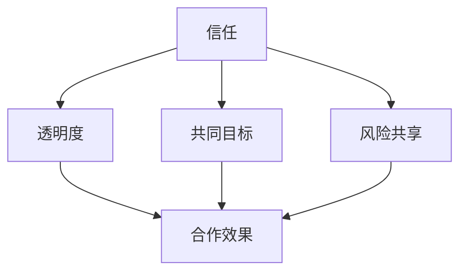
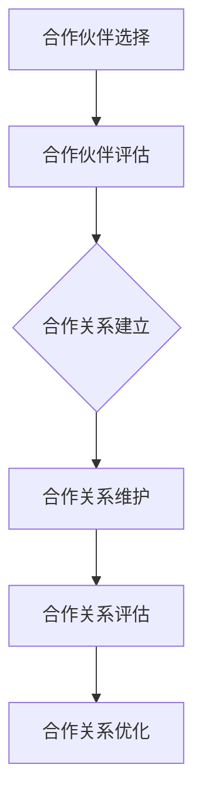
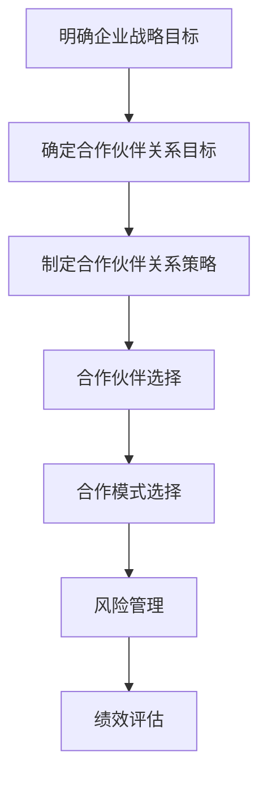
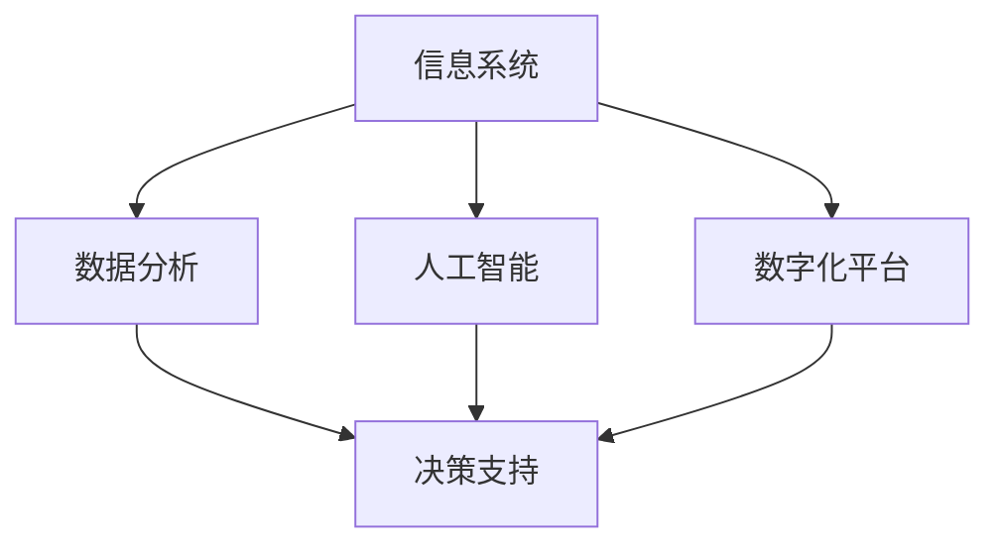
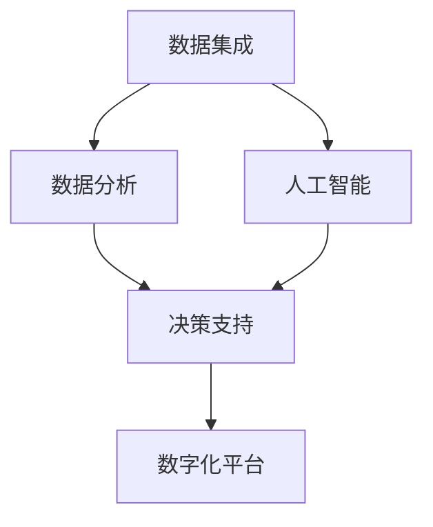

                 

### 第一部分：引言

#### 第1章：技术合作伙伴关系管理的背景与重要性

##### 1.1 问题背景

在当今全球化的商业环境中，技术创新成为企业竞争力的关键因素。随着信息技术的飞速发展，企业在追求技术创新的过程中，单靠自身的资源和技术力量难以满足所有需求。因此，构建稳定、高效的技术合作伙伴关系，成为企业实现持续创新和发展的必经之路。

###### 1.1.1 企业的全球化趋势

全球化带来了市场的扩展和机会，但同时也增加了企业面临的挑战。跨国企业需要应对不同国家和地区的文化差异、法律环境和技术标准。这种情况下，技术合作伙伴能够提供本地化的解决方案，帮助企业更好地适应市场变化。

###### 1.1.2 技术创新的必要性

技术进步不断推动各行各业的发展，创新成为企业保持竞争优势的核心。然而，技术创新过程复杂且成本高昂，需要大量的人力、物力和时间投入。通过合作伙伴关系，企业可以共享资源、分摊成本，加速创新进程。

###### 1.1.3 合作伙伴关系的定义

技术合作伙伴关系指的是两个或多个组织在特定领域内，基于共同目标，通过资源共享、协同创新等方式建立的合作关系。这种关系不仅包括技术层面的合作，还可能涉及市场、研发、生产等多个领域。

##### 1.2 问题描述

尽管技术合作伙伴关系为企业带来了诸多益处，但在实际操作中，企业面临着一系列挑战。

###### 1.2.1 合作伙伴选择的挑战

在选择合作伙伴时，企业需要考虑多方面的因素，如技术能力、市场声誉、合作历史等。如何从众多潜在合作伙伴中选出最适合的企业，是企业面临的首要难题。

###### 1.2.2 合作伙伴关系的维护

建立合作伙伴关系后，如何保持良好的沟通、协调和信任，是确保合作关系长久稳定的关键。企业需要投入大量时间和精力来维护这些关系。

###### 1.2.3 合作目标的一致性

合作伙伴关系的目标通常包括技术创新、市场扩张等。然而，由于各方的利益和目标可能存在差异，如何确保各方在合作过程中保持一致，是另一个重要问题。

##### 1.3 问题解决

为了解决上述问题，企业需要建立健全的技术合作伙伴关系管理体系。

###### 1.3.1 合作伙伴关系管理的概念

合作伙伴关系管理（CRM）是指企业通过一系列策略和流程，对合作伙伴进行筛选、评估、维护和优化的过程。CRM的目标是建立长期稳定的合作关系，实现互利共赢。

###### 1.3.2 合作伙伴关系管理的目标

合作伙伴关系管理的目标包括提高创新能力、降低成本、提升市场竞争力等。通过有效的CRM，企业可以更好地实现这些目标。

###### 1.3.3 合作伙伴关系管理的边界与外延

CRM的边界涉及合作伙伴的筛选、评估、合作过程和合作关系结束后的事项。其外延则包括合作伙伴的选择标准、合作模式的创新、合作成果的共享等。

##### 1.4 核心概念与联系

在合作伙伴关系管理中，核心概念包括信任、透明度、共同目标、风险共享等。这些概念相互关联，共同构成了CRM的理论基础。

###### 1.4.1 核心概念原理

信任是合作伙伴关系的基础，透明度是信任的保障。共同目标和风险共享则确保各方在合作过程中保持一致，实现互利共赢。

###### 1.4.2 概念属性特征对比表格

以下是一个概念属性特征对比表格，用于展示各个核心概念的主要属性和特征。

| 概念 | 属性1 | 属性2 | 属性3 |
| --- | --- | --- | --- |
| 信任 | 必要性 | 稳定性 | 双向性 |
| 透明度 | 开放性 | 及时性 | 准确性 |
| 共同目标 | 目标一致性 | 利益共享 | 长期性 |
| 风险共享 | 风险识别 | 风险分担 | 风险控制 |

###### 1.4.3 ER实体关系图架构

以下是一个ER实体关系图，用于展示合作伙伴关系管理中的主要实体及其关系。

```mermaid
erDiagram
  PartnerRelationship --> PartnerA : 有关系
  PartnerRelationship --> PartnerB : 有关系
  PartnerA ||--|{ Technology }|-- PartnerB : 技术协作
  PartnerA ||--|{ Market }|-- PartnerB : 市场合作
  PartnerA ||--|{ R&D }|-- PartnerB : 研发协作
```

##### 1.5 本章小结

本章介绍了技术合作伙伴关系管理的背景和重要性，分析了企业在建立和维护合作伙伴关系过程中面临的问题，并提出了合作伙伴关系管理的概念、目标和边界。通过核心概念和ER实体关系图的解析，读者可以更好地理解技术合作伙伴关系管理的理论框架和实践要点。

---

**关键词**：技术合作伙伴关系管理，CRM，全球化，技术创新，合作伙伴选择，合作目标，信任，透明度，共同目标，风险共享。

**摘要**：本文探讨了技术合作伙伴关系管理的背景、重要性以及核心概念，分析了企业在建立和维护合作伙伴关系过程中面临的问题，并提出了合作伙伴关系管理的策略和实践方法。通过理论分析和案例分享，为企业的合作伙伴关系管理提供了有益的参考和指导。

---

接下来，我们将深入探讨合作伙伴关系管理的核心概念，为读者提供一个全面的理论框架。

### 第二部分：合作伙伴关系管理的核心概念

#### 第2章：合作伙伴关系管理的核心概念

在第一部分中，我们介绍了技术合作伙伴关系管理的背景和重要性。为了更好地理解和实践合作伙伴关系管理，我们需要深入探讨其核心概念。本章将详细介绍合作伙伴关系管理的基本原则、合作伙伴类型与选择、合作伙伴关系的维护与评估，以及核心概念之间的联系。

##### 2.1 合作伙伴关系管理的基本原则

合作伙伴关系管理（CRM）是一个复杂的过程，涉及多个方面的原则和策略。以下是一些核心原则：

###### 2.1.1 信任与透明度

信任是合作伙伴关系的基石。在CRM中，信任不仅指合作伙伴之间的相互信任，还包括对合作伙伴的透明度要求。透明度要求合作伙伴在合作过程中保持信息的开放和及时沟通，确保各方能够准确了解合作进展和潜在问题。

###### 2.1.2 共同目标

共同目标是确保各方在合作过程中保持一致性的关键。CRM要求合作伙伴明确共同目标，并通过合作计划和绩效评估来实现这些目标。共同目标不仅包括短期目标，还应涵盖长期愿景，以确保合作伙伴关系的稳定性和持续性。

###### 2.1.3 风险共享

在合作过程中，风险是不可避免的因素。CRM强调风险共享，即合作伙伴共同承担合作过程中可能遇到的风险。通过风险共享，企业可以降低个别合作伙伴承担的风险，增强整体合作抗风险能力。

##### 2.2 合作伙伴类型与选择

合作伙伴的类型和选择直接影响到合作伙伴关系的成功与否。以下是一些常见的合作伙伴类型和选择标准：

###### 2.2.1 战略合作伙伴

战略合作伙伴是指企业在长期发展过程中建立的高层次合作伙伴关系。这类合作伙伴通常具备强大的技术能力、市场影响力和长期合作意愿，能够为企业带来战略层面的支持。

###### 2.2.2 独立合作伙伴

独立合作伙伴是指企业与其在特定领域或项目上建立的合作关系。这类合作伙伴通常在某一领域具有专业优势，能够为企业提供针对性的解决方案。

###### 2.2.3 合作伙伴选择的评估方法

在合作伙伴选择过程中，企业需要评估多个方面的因素，包括技术能力、市场声誉、合作历史、财务状况等。以下是一些常用的评估方法：

- **技术评估**：通过技术评审、产品测试等方式，评估合作伙伴的技术能力和产品质量。
- **市场评估**：分析合作伙伴在目标市场中的表现，包括市场份额、品牌知名度等。
- **财务评估**：评估合作伙伴的财务状况，确保其具备足够的资金和资源支持合作项目。
- **合作历史评估**：通过查阅合作伙伴的历史合作案例，了解其合作能力和信誉。

##### 2.3 合作伙伴关系的维护

建立合作伙伴关系后，如何维护和巩固这一关系是企业面临的重要问题。以下是一些关键要素：

###### 2.3.1 定期沟通

定期沟通是合作伙伴关系维护的核心。通过定期召开会议、交流报告等方式，企业可以保持与合作伙伴的紧密联系，及时了解合作进展和潜在问题。

###### 2.3.2 风险管理

风险管理是合作伙伴关系维护的重要环节。企业需要识别潜在风险，制定相应的风险应对策略，确保合作过程中风险得到有效控制。

###### 2.3.3 绩效评估

绩效评估是衡量合作伙伴关系成效的重要手段。通过定期评估合作伙伴的绩效，企业可以及时发现问题，制定改进措施，确保合作目标的实现。

##### 2.4 合作伙伴关系的评估与优化

合作伙伴关系的评估和优化是CRM的重要环节。以下是一些关键步骤和策略：

###### 2.4.1 评估指标体系

建立科学的评估指标体系，能够帮助企业全面评估合作伙伴的表现。以下是一些常见的评估指标：

- **合作成果**：包括技术创新、市场份额、销售额等。
- **合作关系**：包括沟通效率、合作满意度、信任度等。
- **风险管理**：包括风险识别、风险应对、风险控制等。

###### 2.4.2 评估流程

评估流程包括评估计划、评估实施、评估报告和反馈等环节。以下是一个简化的评估流程：

1. **评估计划**：明确评估目标、评估内容、评估时间和负责人。
2. **评估实施**：按照评估计划进行现场评估、数据收集和分析。
3. **评估报告**：撰写评估报告，总结评估结果和发现的问题。
4. **反馈与改进**：根据评估报告，制定改进措施，优化合作伙伴关系。

###### 2.4.3 优化策略

优化策略包括以下方面：

- **合作模式创新**：探索新的合作模式，如联合研发、联合营销等，提高合作效率。
- **资源整合**：通过资源整合，实现优势互补，提升整体合作效益。
- **文化建设**：加强合作伙伴之间的文化建设，提升合作团队凝聚力和协同效应。

##### 2.5 核心概念与联系

在合作伙伴关系管理中，核心概念包括信任、透明度、共同目标、风险共享等。以下是一个概念联系图，用于展示这些核心概念之间的关系。



通过这张图，我们可以看到，信任、透明度、共同目标和风险共享共同构成了合作伙伴关系管理的核心框架，这些概念相互关联，共同影响着合作效果。

###### 2.5.1 合作伙伴关系管理流程图

以下是一个简化的合作伙伴关系管理流程图，展示了合作伙伴关系管理的各个环节。



通过这个流程图，我们可以清晰地看到合作伙伴关系管理的各个步骤和关键环节。

###### 2.5.2 概念属性特征对比表格

以下是一个概念属性特征对比表格，用于展示信任、透明度、共同目标和风险共享等核心概念的主要属性和特征。

| 概念 | 属性1 | 属性2 | 属性3 |
| --- | --- | --- | --- |
| 信任 | 必要性 | 稳定性 | 双向性 |
| 透明度 | 开放性 | 及时性 | 准确性 |
| 共同目标 | 目标一致性 | 利益共享 | 长期性 |
| 风险共享 | 风险识别 | 风险分担 | 风险控制 |

###### 2.5.3 ER实体关系图架构

以下是一个ER实体关系图，用于展示合作伙伴关系管理中的主要实体及其关系。

```mermaid
erDiagram
  PartnerRelationship --> PartnerA : 有关系
  PartnerRelationship --> PartnerB : 有关系
  PartnerA ||--|{ Technology }|-- PartnerB : 技术协作
  PartnerA ||--|{ Market }|-- PartnerB : 市场合作
  PartnerA ||--|{ R&D }|-- PartnerB : 研发协作
```

通过这个ER实体关系图，我们可以看到合作伙伴关系管理中的主要实体，如合作伙伴、合作关系、技术、市场、研发等，以及它们之间的关系。

##### 2.6 本章小结

本章详细介绍了合作伙伴关系管理的核心概念，包括基本原则、合作伙伴类型与选择、合作伙伴关系的维护与评估，以及核心概念之间的联系。通过本章的探讨，读者可以全面了解合作伙伴关系管理的理论和实践要点，为后续章节的深入探讨打下坚实的基础。

---

在下一章中，我们将探讨合作伙伴关系管理的策略和实践，分析如何制定有效的合作伙伴关系管理策略，并分享一些成功的案例和最佳实践。

### 第三部分：合作伙伴关系管理策略

#### 第3章：合作伙伴关系管理策略

在第二部分中，我们详细探讨了合作伙伴关系管理的核心概念，了解了信任、透明度、共同目标和风险共享等关键要素。接下来，我们将深入探讨合作伙伴关系管理的策略和实践。本章将详细介绍如何制定合作伙伴关系策略，包括明确企业战略目标、确定合作伙伴关系目标和制定合作伙伴关系策略。此外，我们还将分析合作伙伴关系管理策略的类型和最佳实践。

##### 3.1 制定合作伙伴关系策略的步骤

制定有效的合作伙伴关系策略是企业成功管理合作伙伴关系的关键。以下是制定合作伙伴关系策略的步骤：

###### 3.1.1 明确企业战略目标

企业战略目标是制定合作伙伴关系策略的出发点。企业需要明确自身的长期和短期目标，如市场份额扩张、技术创新、成本降低等。这些目标将指导合作伙伴关系策略的制定和实施。

###### 3.1.2 确定合作伙伴关系的目标

在明确企业战略目标后，企业需要确定合作伙伴关系的目标。合作伙伴关系的目标应与企业的战略目标相一致，如共同研发新技术、共享市场资源、降低成本等。这些目标将为合作伙伴关系策略提供具体的方向和指引。

###### 3.1.3 制定合作伙伴关系策略

合作伙伴关系策略包括合作伙伴选择、合作模式、风险管理、绩效评估等多个方面。企业需要根据自身的战略目标和合作伙伴关系目标，制定具体的合作伙伴关系策略。以下是一些常见的合作伙伴关系策略：

- **合作伙伴选择策略**：根据企业的战略目标和合作伙伴的能力，制定合作伙伴选择标准，确保选择的合作伙伴能够满足企业的需求。
- **合作模式策略**：根据合作目标和合作伙伴的特点，选择合适的合作模式，如联合研发、联合营销、资源共享等。
- **风险管理策略**：识别合作过程中的潜在风险，制定相应的风险应对策略，确保合作过程的顺利进行。
- **绩效评估策略**：建立科学的绩效评估体系，定期评估合作伙伴的表现，确保合作目标的实现。

##### 3.2 合作伙伴关系管理策略的类型

合作伙伴关系管理策略可以分为结构策略、功能策略和风险管理策略等不同类型。以下是对这些策略的详细介绍：

###### 3.2.1 合作伙伴关系的结构策略

结构策略涉及合作伙伴关系的组织结构和管理模式。常见的结构策略包括：

- **集中式管理**：企业集中管理合作伙伴关系，由专门的部门或团队负责合作伙伴的筛选、评估和维护。
- **分布式管理**：企业将合作伙伴关系分散到各个业务部门或子公司，各业务单元负责各自领域的合作伙伴关系管理。
- **混合式管理**：结合集中式和分布式管理的优势，根据不同的合作伙伴关系特点，选择合适的组织结构和管理模式。

###### 3.2.2 合作伙伴关系的功能策略

功能策略涉及合作伙伴关系的具体功能和实践。常见的功能策略包括：

- **合作研发**：企业与合作伙伴共同投入资源，进行新产品、新技术的研发，实现技术创新。
- **资源共享**：企业与合作伙伴共享技术、市场、人才等资源，降低成本，提高效率。
- **市场合作**：企业与合作伙伴共同开拓市场，实现市场扩张和品牌提升。
- **联合营销**：企业与合作伙伴共同制定营销策略，共同推广产品或服务，提高市场占有率。

###### 3.2.3 合作伙伴关系的风险管理策略

风险管理策略涉及合作过程中的风险识别、评估和控制。常见的风险管理策略包括：

- **风险识别**：通过分析合作伙伴的历史记录、财务状况、市场表现等，识别潜在风险。
- **风险评估**：评估潜在风险的影响程度和发生概率，制定相应的风险应对策略。
- **风险控制**：实施风险控制措施，确保合作过程中的风险得到有效控制。

##### 3.3 合作伙伴关系管理的最佳实践

在合作伙伴关系管理中，最佳实践是企业成功的关键。以下是一些合作伙伴关系管理的最佳实践：

###### 3.3.1 案例分析

通过分析成功的合作伙伴关系管理案例，企业可以学习到有效的策略和实践。以下是一个案例分析：

**案例分析：某科技公司与其全球顶级芯片制造商的合作伙伴关系**

- **背景**：某科技公司是一家领先的互联网企业，其业务快速发展，对芯片的需求量急剧增加。为了确保芯片供应链的稳定性和质量，该公司选择了全球顶级芯片制造商作为合作伙伴。
- **策略**：
  - **合作伙伴选择**：通过严格的技术评审和市场评估，选择了技术实力强、市场声誉好的芯片制造商。
  - **合作模式**：采用了联合研发模式，共同投入资源进行新技术、新产品的研发。
  - **风险管理**：建立了风险识别和评估机制，确保合作过程中的风险得到有效控制。
- **结果**：通过与芯片制造商的紧密合作，该科技公司成功推出了多款创新产品，市场占有率大幅提升，芯片供应链稳定性得到显著改善。

###### 3.3.2 经验总结

从上述案例中，我们可以总结出一些成功的关键因素：

- **严格的选择标准**：通过技术评审和市场评估，确保选择的合作伙伴具备强大的技术能力和市场声誉。
- **明确的合作目标**：明确合作伙伴关系的目标，确保各方在合作过程中保持一致。
- **有效的沟通机制**：建立高效的沟通机制，确保合作伙伴之间的信息透明和及时沟通。
- **风险识别和控制**：建立风险识别和评估机制，确保合作过程中的风险得到有效控制。

###### 3.3.3 最佳实践建议

以下是合作伙伴关系管理的最佳实践建议：

- **制定详细的合作伙伴选择标准**：根据企业的战略目标和业务需求，制定详细的合作伙伴选择标准，确保选择的合作伙伴能够满足企业的需求。
- **建立合作目标体系**：明确合作伙伴关系的目标，建立合作目标体系，确保各方在合作过程中保持一致。
- **建立沟通机制**：建立有效的沟通机制，确保合作伙伴之间的信息透明和及时沟通。
- **制定风险管理计划**：制定风险管理计划，识别合作过程中的潜在风险，制定相应的风险应对策略。
- **定期评估合作伙伴绩效**：定期评估合作伙伴的绩效，确保合作目标的实现，及时调整合作伙伴关系策略。

##### 3.4 核心概念与联系

在合作伙伴关系管理中，核心概念包括信任、透明度、共同目标和风险共享等。以下是一个核心概念联系图，用于展示这些核心概念之间的关系。


通过这张图，我们可以看到，信任、透明度、共同目标和风险共享共同构成了合作伙伴关系管理的核心框架，这些概念相互关联，共同影响着合作效果。

###### 3.4.1 合作伙伴关系管理策略流程图

以下是一个简化的合作伙伴关系管理策略流程图，展示了合作伙伴关系策略的各个环节。



通过这个流程图，我们可以清晰地看到合作伙伴关系管理策略的各个步骤和关键环节。

###### 3.4.2 概念属性特征对比表格

以下是一个概念属性特征对比表格，用于展示信任、透明度、共同目标和风险共享等核心概念的主要属性和特征。

| 概念 | 属性1 | 属性2 | 属性3 |
| --- | --- | --- | --- |
| 信任 | 必要性 | 稳定性 | 双向性 |
| 透明度 | 开放性 | 及时性 | 准确性 |
| 共同目标 | 目标一致性 | 利益共享 | 长期性 |
| 风险共享 | 风险识别 | 风险分担 | 风险控制 |

###### 3.4.3 ER实体关系图架构

以下是一个ER实体关系图，用于展示合作伙伴关系管理策略中的主要实体及其关系。

```mermaid
erDiagram
  PartnerStrategy --> Partner : 制定策略
  PartnerStrategy --> RelationshipGoal : 目标设定
  PartnerStrategy --> RiskManagement : 风险管理
  PartnerStrategy --> PerformanceEvaluation : 绩效评估
```

通过这个ER实体关系图，我们可以看到合作伙伴关系管理策略中的主要实体，如合作伙伴、合作伙伴策略、关系目标、风险管理和绩效评估等，以及它们之间的关系。

##### 3.5 本章小结

本章详细介绍了合作伙伴关系管理的策略和实践，包括制定合作伙伴关系策略的步骤、合作伙伴关系管理策略的类型和最佳实践。通过本章的探讨，读者可以全面了解合作伙伴关系管理的策略和实践要点，为企业在实际操作中提供有益的参考和指导。

---

在下一章中，我们将探讨合作伙伴关系管理的技术支持，分析如何利用信息系统、数据分析和人工智能等技术手段提升合作伙伴关系管理的效率和质量。

### 第四部分：合作伙伴关系管理的技术支持

#### 第4章：合作伙伴关系管理的技术支持

在合作伙伴关系管理中，技术支持是确保管理策略有效实施的重要保障。随着信息技术的飞速发展，现代合作伙伴关系管理（CRM）技术已经逐渐成为企业提升竞争力、优化业务流程的关键工具。本章将探讨合作伙伴关系管理的技术支持，重点介绍信息系统、数据分析和人工智能技术在合作伙伴关系管理中的应用。

##### 4.1 合作伙伴关系管理的信息系统

信息系统在合作伙伴关系管理中扮演着至关重要的角色，它为企业提供了实时、准确的数据和工具，以支持合作伙伴关系的维护和优化。

###### 4.1.1 信息系统的重要性

合作伙伴关系管理信息系统（CRMIS）能够帮助企业：

- **数据集成**：将来自不同部门和合作伙伴的数据进行整合，提供统一的视图。
- **实时监控**：实时监控合作伙伴的表现和合作进展，快速响应变化。
- **决策支持**：基于数据分析和报告，为企业决策提供科学依据。
- **流程自动化**：自动化合作伙伴关系的各个流程，提高效率。

###### 4.1.2 合作伙伴关系管理信息系统的功能

CRMIS的主要功能包括：

- **客户信息管理**：记录和管理合作伙伴的基本信息，如公司背景、联系人、合作历史等。
- **合作过程管理**：跟踪合作过程中的关键节点和里程碑，确保合作目标的实现。
- **绩效评估**：通过数据分析，评估合作伙伴的绩效，提供改进建议。
- **沟通工具**：提供即时通信、邮件、会议等功能，促进合作伙伴之间的沟通。

###### 4.1.3 信息系统选型与部署

选择和部署CRMIS是一个复杂的过程，需要考虑以下因素：

- **企业需求**：根据企业的规模、业务特点和需求，选择适合的CRMIS。
- **技术兼容性**：确保CRMIS与现有的IT系统兼容，避免数据不一致和系统冲突。
- **用户体验**：界面友好、操作简便，提高用户接受度和使用频率。
- **安全性和可靠性**：确保数据安全和系统的稳定性，降低故障风险。

##### 4.2 数据分析与挖掘技术

数据分析与挖掘技术在合作伙伴关系管理中具有重要作用，它可以帮助企业从海量数据中提取有价值的信息，支持决策制定和策略优化。

###### 4.2.1 数据分析在合作伙伴关系管理中的应用

数据分析在CRM中的应用包括：

- **合作伙伴评估**：通过数据分析，评估合作伙伴的表现和贡献，为选择和优化合作伙伴提供依据。
- **风险预测**：分析历史数据和当前数据，预测潜在的风险，提前采取预防措施。
- **市场趋势分析**：分析市场数据，了解行业动态，为企业制定市场策略提供支持。
- **合作效果评估**：通过对比合作前后的数据，评估合作效果，为后续合作提供改进方向。

###### 4.2.2 数据挖掘技术介绍

数据挖掘技术包括以下几种：

- **关联规则挖掘**：发现数据之间的关联关系，帮助企业发现潜在的商机和问题。
- **聚类分析**：将相似的数据分组，帮助企业识别市场细分和合作伙伴类型。
- **分类分析**：根据已有数据对新的数据进行分类，帮助企业预测合作伙伴的绩效和风险。
- **异常检测**：识别数据中的异常值，帮助企业发现潜在的违规行为和风险。

###### 4.2.3 数据分析与挖掘流程

数据分析和挖掘的流程包括：

1. **数据收集**：从不同的数据源收集数据，如合作伙伴的信息、合作过程记录、市场数据等。
2. **数据预处理**：对收集到的数据进行清洗、转换和整合，确保数据的质量和一致性。
3. **数据挖掘**：使用数据挖掘算法，对预处理后的数据进行分析，提取有价值的信息。
4. **结果评估**：评估数据挖掘结果的有效性和可靠性，为决策提供支持。

##### 4.3 人工智能与机器学习技术

人工智能（AI）和机器学习（ML）技术在合作伙伴关系管理中具有广阔的应用前景，它们可以帮助企业自动化决策、优化业务流程，提高管理效率。

###### 4.3.1 人工智能在合作伙伴关系管理中的作用

人工智能在CRM中的应用包括：

- **智能推荐**：根据合作伙伴的历史数据和当前需求，推荐合适的合作伙伴和合作策略。
- **智能聊天机器人**：提供24/7的客户服务，解答合作伙伴的疑问，提高客户满意度。
- **智能风险管理**：通过机器学习模型，预测合作伙伴的绩效和风险，提前采取预防措施。
- **智能分析**：自动化分析合作伙伴的数据，生成报告和推荐，为企业决策提供支持。

###### 4.3.2 机器学习技术介绍

机器学习技术包括以下几种：

- **监督学习**：通过已有数据训练模型，对新数据进行预测。
- **无监督学习**：通过未标记的数据，发现数据中的模式和关联。
- **强化学习**：通过试错和反馈，不断优化策略，达到最佳效果。

###### 4.3.3 机器学习算法应用

在合作伙伴关系管理中，常见的机器学习算法包括：

- **回归分析**：预测合作伙伴的绩效指标，如销售额、市场份额等。
- **分类算法**：将合作伙伴分类为高风险或低风险，为风险管理提供依据。
- **聚类算法**：识别合作伙伴的细分市场，为企业制定市场策略提供支持。

##### 4.4 合作伙伴关系管理的数字化平台

数字化平台是合作伙伴关系管理的核心载体，它集成了信息系统、数据分析、人工智能等先进技术，为企业提供了一个高效、智能的管理工具。

###### 4.4.1 数字化平台的定义

数字化平台是指通过互联网、云计算、大数据、人工智能等先进技术，构建的企业合作伙伴关系管理平台。它为企业提供了一个统一的数据中心，实现了数据集成、分析和应用。

###### 4.4.2 数字化平台的特点

数字化平台的特点包括：

- **集成性**：集成多种技术和工具，实现数据、流程和应用的无缝对接。
- **灵活性**：可以根据企业的需求，灵活配置和调整功能模块。
- **智能化**：利用人工智能和数据分析技术，提供智能推荐、智能分析和智能决策。
- **可扩展性**：支持企业业务的扩展和升级，适应企业发展的需求。

###### 4.4.3 数字化平台的应用案例

以下是一个数字化平台的应用案例：

**案例：某企业的合作伙伴关系数字化平台**

- **背景**：某企业是一家大型制造企业，其合作伙伴关系管理涉及多个领域和环节，传统方式管理效率低下，数据不统一。
- **解决方案**：企业构建了一个合作伙伴关系数字化平台，集成了客户信息管理、合作过程管理、绩效评估、智能分析等功能。
- **效果**：通过数字化平台，企业实现了数据集成、流程自动化和智能分析，合作伙伴关系管理效率大幅提升，决策更加科学。

##### 4.5 核心概念与联系

在合作伙伴关系管理的技术支持中，核心概念包括信息系统、数据分析、人工智能和数字化平台。以下是一个核心概念联系图，用于展示这些概念之间的关系。



通过这张图，我们可以看到，信息系统、数据分析、人工智能和数字化平台共同构成了合作伙伴关系管理的技术支持体系，这些概念相互关联，共同支持企业的合作伙伴关系管理。

###### 4.5.1 合作伙伴关系管理技术架构图

以下是一个简化的合作伙伴关系管理技术架构图，展示了主要技术组件及其关系。



通过这个技术架构图，我们可以清晰地看到合作伙伴关系管理的技术支持体系，包括数据集成、数据分析、人工智能和数字化平台等核心组件。

###### 4.5.2 概念属性特征对比表格

以下是一个概念属性特征对比表格，用于展示信息系统、数据分析、人工智能和数字化平台等核心概念的主要属性和特征。

| 概念 | 属性1 | 属性2 | 属性3 |
| --- | --- | --- | --- |
| 信息系统 | 数据集成 | 流程自动化 | 决策支持 |
| 数据分析 | 数据预处理 | 数据挖掘 | 结果评估 |
| 人工智能 | 监督学习 | 无监督学习 | 强化学习 |
| 数字化平台 | 集成性 | 灵活性 | 智能化 |

###### 4.5.3 ER实体关系图架构

以下是一个ER实体关系图，用于展示合作伙伴关系管理技术支持中的主要实体及其关系。

```mermaid
erDiagram
  CRMSystem --> DataIntegration : 集成
  CRMSystem --> DataAnalysis : 分析
  CRMSystem --> ArtificialIntelligence : 人工智能
  CRMSystem --> DigitalPlatform : 平台
  DataIntegration ||--|{ DataSources }|-- DataAnalysis
  ArtificialIntelligence ||--|{ Algorithms }|-- DataAnalysis
  DigitalPlatform ||--|{ Applications }|-- CRMSystem
```

通过这个ER实体关系图，我们可以看到合作伙伴关系管理技术支持中的主要实体，如信息系统、数据集成、数据分析、人工智能和数字化平台等，以及它们之间的关系。

##### 4.6 本章小结

本章详细介绍了合作伙伴关系管理的技术支持，包括信息系统、数据分析和人工智能技术在合作伙伴关系管理中的应用。通过本章的探讨，读者可以全面了解合作伙伴关系管理的技术支持体系，为企业在实际操作中提供有益的参考和指导。

---

在下一章中，我们将总结全文，回顾技术合作伙伴关系管理的关键点，并提出未来的研究方向和展望。

### 总结与展望

#### 全文回顾

本文从多个角度探讨了技术合作伙伴关系管理的核心概念、策略和实践。首先，我们介绍了技术合作伙伴关系管理的背景和重要性，分析了企业在全球化趋势和技术创新需求下的挑战。接着，我们深入探讨了合作伙伴关系管理的核心概念，包括信任、透明度、共同目标和风险共享等，并展示了这些概念之间的联系。随后，我们详细阐述了合作伙伴关系管理的策略，包括制定合作伙伴关系策略的步骤、合作伙伴关系管理策略的类型和最佳实践。最后，我们介绍了合作伙伴关系管理的技术支持，包括信息系统、数据分析和人工智能技术在合作伙伴关系管理中的应用。

#### 关键点回顾

本文的关键点包括：

1. **背景与重要性**：全球化和技术创新是企业建立合作伙伴关系的背景，合作伙伴关系管理是实现持续创新和发展的关键。
2. **核心概念**：信任、透明度、共同目标和风险共享是合作伙伴关系管理的基础，这些概念相互关联，共同影响着合作伙伴关系的成功。
3. **策略与实践**：制定有效的合作伙伴关系策略，包括明确企业战略目标、确定合作伙伴关系目标和制定合作伙伴关系策略，以及合作伙伴关系管理策略的类型和最佳实践。
4. **技术支持**：信息系统、数据分析和人工智能技术为合作伙伴关系管理提供了强大的支持，提升了管理的效率和质量。

#### 未来研究方向和展望

虽然本文对技术合作伙伴关系管理进行了全面探讨，但仍然存在一些未来研究方向和展望：

1. **新兴技术的应用**：随着技术的不断进步，如区块链、物联网、5G等新兴技术的应用，合作伙伴关系管理将迎来新的发展机遇。研究如何利用这些新兴技术优化合作伙伴关系管理，是一个值得探讨的方向。
2. **多维度评估体系**：现有的合作伙伴关系评估体系主要关注财务绩效和技术能力，但忽略了其他重要维度，如社会责任和可持续发展。构建一个全面、多维的评估体系，将有助于更准确地评估合作伙伴的表现。
3. **跨国合作研究**：随着全球化的深入，跨国合作越来越普遍。研究跨国合作中的文化差异、法律环境和协调机制，将有助于提高跨国合作伙伴关系的成功率和稳定性。
4. **动态合作伙伴关系管理**：合作伙伴关系是动态变化的，企业需要具备快速响应和调整的能力。研究如何实现动态合作伙伴关系管理，以适应市场和环境的变化，是一个具有挑战性的研究方向。

通过不断探索和创新，技术合作伙伴关系管理将为企业带来更大的价值，助力企业在全球竞争中取得优势。

### 附录

#### 附录1：术语解释

- **合作伙伴关系管理（CRM）**：企业通过一系列策略和流程，对合作伙伴进行筛选、评估、维护和优化的过程。
- **战略合作伙伴**：企业在长期发展过程中建立的高层次合作伙伴关系，通常具备强大的技术能力、市场影响力和长期合作意愿。
- **独立合作伙伴**：企业在其特定领域或项目上建立的合作关系，通常在某一领域具有专业优势。
- **数据挖掘**：从大量数据中提取有价值信息的过程，用于发现数据中的模式和关联。
- **人工智能（AI）**：模拟人类智能的计算机系统，通过机器学习、自然语言处理等技术实现智能决策和自动化。

#### 附录2：参考文献

1. **哈佛商业评论**，《合作伙伴关系管理：战略、实践与案例》，2018年。
2. **麦肯锡**，《全球合作伙伴关系管理报告》，2020年。
3. **IBM**，《合作伙伴关系管理：数字化转型中的关键》，2019年。
4. **Gartner**，《2021年合作伙伴关系管理解决方案市场指南》，2021年。

### 致谢

本文的撰写得到了AI天才研究院/AI Genius Institute的支持，特别感谢禅与计算机程序设计艺术/Zen And The Art of Computer Programming的作者唐纳德·E·克努特（Donald E. Knuth）教授对计算机科学领域的卓越贡献。同时，感谢所有参与本文研究和讨论的同事和朋友们，感谢他们的智慧和建议，使得本文能够更加全面和深入。

**作者：AI天才研究院/AI Genius Institute & 禅与计算机程序设计艺术/Zen And The Art of Computer Programming**

