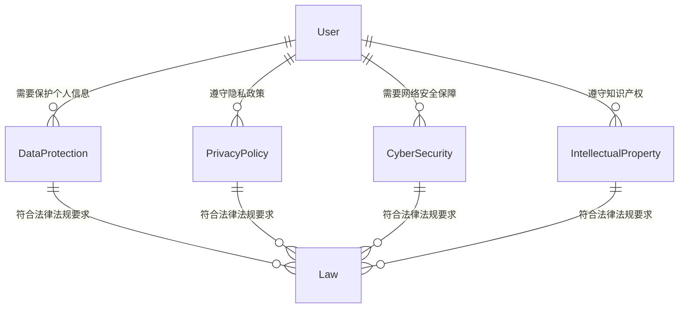

                 

# 技术合规管理：在创新中保障安全与隐私

> 关键词：技术合规管理、信息安全、数据保护、隐私政策、网络安全、知识产权

> 摘要：随着信息技术的发展，技术合规管理成为确保技术应用合法合规、保护用户权益和维护社会稳定的重要手段。本文从技术合规管理的背景和意义出发，深入探讨了其核心概念、原理以及实施方法，为读者提供了一个全面的技术合规管理指南。

## 第一部分: 技术合规管理的背景与意义

### 第1章: 技术合规管理的核心概念与背景

#### 1.1.1 问题的背景

在现代社会，信息技术以惊人的速度发展，为我们的生活、工作和娱乐带来了前所未有的便利。然而，伴随着技术的迅猛发展，信息安全、数据隐私、法律法规等问题也日益凸显。技术合规管理正是在这样的背景下产生的，旨在通过一系列规范的制定与实施，保障技术应用的合法合规，保护用户权益，维护社会稳定。

#### 1.1.2 问题描述

技术合规管理涉及到众多方面，包括但不限于数据保护、网络安全、知识产权、隐私政策等。这些问题的复杂性不断增加，使得企业和管理者面临巨大的挑战。如何在这些纷繁复杂的问题中找到合适的解决方案，实现合规管理，成为亟待解决的问题。

#### 1.1.3 问题解决

解决技术合规管理问题需要从多个方面入手。首先，需要明确核心概念，理解技术合规管理的基本原理和法规要求。其次，需要建立一套完善的管理体系，包括合规流程、内部控制、合规培训等。最后，需要借助技术手段，如安全审计、合规监控等，确保合规管理的有效实施。

#### 1.1.4 边界与外延

技术合规管理不仅局限于企业的内部管理，还涉及到与外部监管机构、用户、合作伙伴等多方面的关系。因此，在制定合规管理策略时，需要充分考虑各种外部因素的影响，确保合规管理的全面性和有效性。

#### 1.1.5 概念结构与核心要素组成

技术合规管理概念结构主要包括以下几个方面：

1. **法律法规**：了解并遵循相关法律法规，是技术合规管理的基础。
2. **数据保护**：保护用户数据，防止数据泄露和滥用。
3. **网络安全**：确保网络系统的安全，防止网络攻击和数据泄露。
4. **知识产权**：保护企业的知识产权，防止侵权行为。
5. **隐私政策**：明确企业的隐私政策，保护用户隐私。

#### 1.1.6 本章小结

本章对技术合规管理的背景、核心概念以及解决方法进行了概述。在接下来的章节中，我们将对技术合规管理的各个关键方面进行深入探讨，帮助读者全面了解和掌握技术合规管理的理论和实践。

## 第二部分: 技术合规管理的核心概念与原理

### 第2章: 技术合规管理的核心概念与联系

#### 2.1.1 核心概念

技术合规管理的核心概念包括法律法规、数据保护、网络安全、知识产权和隐私政策等。这些概念相互联系，共同构成了技术合规管理的理论基础。

#### 2.1.2 概念属性特征对比表格

| 概念       | 定义                                                         | 关联关系                  |
| ---------- | ------------------------------------------------------------ | ------------------------ |
| 法律法规   | 指国家或地区制定的具有法律效力的规范性文件。                   | 技术合规管理的法律依据。 |
| 数据保护   | 涉及个人数据的收集、存储、处理、传输等环节的安全保障。         | 技术合规管理的核心内容。 |
| 网络安全   | 保护计算机网络系统不受未经授权的访问、攻击和干扰。             | 技术合规管理的重要组成部分。 |
| 知识产权   | 包括专利、商标、著作权等，保护创新成果的合法权益。           | 技术合规管理的核心内容。 |
| 隐私政策   | 企业公开的关于如何收集、使用、存储和保护用户个人信息的原则。 | 技术合规管理的重要组成部分。 |

#### 2.1.3 ER实体关系图架构

#### 2.1.4 本章小结

本章介绍了技术合规管理的核心概念及其相互关系。通过对比表格和ER实体关系图，读者可以更清晰地理解技术合规管理的概念属性和关联关系，为后续章节的深入探讨奠定了基础。

## 第三部分: 技术合规管理的实践与实施

### 第3章: 技术合规管理的法律法规框架

#### 3.1.1 法律法规概述

在全球范围内，各国都制定了涉及技术合规管理的相关法律法规。这些法律法规为技术合规管理提供了法律依据和指导原则。以下是一些主要法律法规的概述：

1. **欧盟《通用数据保护条例》（GDPR）**：GDPR是欧盟制定的关于数据保护的法律法规，对个人数据的收集、处理和存储提出了严格的要求。
2. **美国《加利福尼亚州消费者隐私法案》（CCPA）**：CCPA是加利福尼亚州制定的关于消费者隐私保护的法律法规，对企业的数据收集和使用行为进行了规范。
3. **中国《网络安全法》**：网络安全法是中国制定的关于网络安全保护的法律法规，对网络运营者的安全责任和义务进行了规定。
4. **美国《专利法》**：专利法是关于知识产权保护的法律法规，保护了发明者的合法权益。

#### 3.1.2 法律法规对比

| 法律法规         | 核心内容                                   | 适用范围          | 主要特点               |
| --------------- | ---------------------------------------- | ----------------- | ---------------------- |
| GDPR            | 数据保护                                   | 欧盟范围内适用       | 严格的数据保护要求       |
| CCPA            | 消费者隐私保护                              | 加利福尼亚州范围内适用 | 强调消费者知情权和选择权   |
| 中国《网络安全法》 | 网络安全保护                               | 中国范围内适用       | 强调网络运营者的安全责任   |
| 美国专利法       | 知识产权保护                               | 美国范围内适用       | 保护发明者的专利权益       |

#### 3.1.3 法律法规的实施

法律法规的实施是技术合规管理的关键环节。以下是几个关键步骤：

1. **理解法规要求**：企业需要深入理解相关法律法规的要求，确保合规管理策略符合法规规定。
2. **建立合规体系**：建立完善的合规管理体系，包括合规流程、内部控制、合规培训等。
3. **合规监控与审计**：定期进行合规监控和审计，确保合规管理的有效实施。
4. **处理违规行为**：一旦发现违规行为，企业需要及时采取措施，纠正违规行为，并承担相应的法律责任。

#### 3.1.4 本章小结

本章介绍了技术合规管理的法律法规框架，包括主要法律法规的概述、对比和实施方法。理解并遵循相关法律法规，是技术合规管理的基础，有助于企业确保技术应用的合法合规。

## 第四部分: 技术合规管理的具体措施与策略

### 第4章: 技术合规管理的具体措施与策略

#### 4.1.1 数据保护措施

数据保护是技术合规管理的核心内容之一。以下是几个关键措施：

1. **数据加密**：对敏感数据进行加密处理，确保数据在传输和存储过程中不被未授权访问。
2. **访问控制**：设置严格的访问控制策略，确保只有授权人员才能访问敏感数据。
3. **数据备份与恢复**：定期备份数据，并建立数据恢复机制，以应对数据丢失或损坏的风险。
4. **数据审计与监控**：对数据的收集、处理和存储过程进行审计和监控，确保数据合规使用。

#### 4.1.2 网络安全措施

网络安全是确保技术合规管理的重要保障。以下是几个关键措施：

1. **防火墙与入侵检测系统**：部署防火墙和入侵检测系统，防止外部攻击和未经授权的访问。
2. **安全补丁与管理**：及时安装和更新系统安全补丁，防范安全漏洞。
3. **安全培训与意识提升**：定期对员工进行安全培训，提高网络安全意识。
4. **安全审计与评估**：定期进行安全审计和评估，确保网络安全措施的有效性。

#### 4.1.3 知识产权保护措施

知识产权保护是技术合规管理的重要组成部分。以下是几个关键措施：

1. **专利申请**：积极申请专利，保护企业的技术创新成果。
2. **商标注册**：注册商标，保护企业的品牌形象和商业利益。
3. **版权保护**：对软件、文档等知识产权进行版权登记，防止侵权行为。
4. **合同管理**：签订知识产权保护合同，明确各方的权益和义务。

#### 4.1.4 隐私政策制定与实施

隐私政策是企业公开的关于如何收集、使用、存储和保护用户个人信息的原则。以下是几个关键措施：

1. **隐私政策制定**：制定明确的隐私政策，明确用户个人信息的收集、使用、存储和保护原则。
2. **用户知情同意**：在收集用户个人信息前，向用户告知隐私政策，并获取用户的知情同意。
3. **透明度与公开**：确保隐私政策的透明度，公开企业收集、使用、存储和保护用户个人信息的情况。
4. **隐私保护技术**：采用隐私保护技术，如数据匿名化、数据加密等，保障用户个人信息的安全。

#### 4.1.5 本章小结

本章介绍了技术合规管理的具体措施与策略，包括数据保护、网络安全、知识产权保护和隐私政策制定与实施等方面的关键措施。通过实施这些措施，企业可以确保技术应用的合法合规，保护用户权益，维护社会稳定。

## 第五部分: 技术合规管理的挑战与应对策略

### 第5章: 技术合规管理的挑战与应对策略

#### 5.1.1 挑战一：法规的复杂性

技术合规管理的法律法规框架日益复杂，不同国家和地区的法规要求存在差异。这给企业的合规管理工作带来了巨大的挑战。

**应对策略**：

1. **建立合规团队**：组建专业的合规团队，负责跟踪和解读相关法规，确保企业合规工作的及时性。
2. **合规培训**：定期对员工进行合规培训，提高员工对法规的理解和遵守意识。
3. **合规咨询**：寻求专业合规咨询机构的服务，为企业提供合规指导和支持。

#### 5.1.2 挑战二：技术的快速发展

技术的快速发展使得合规管理面临新的挑战，如新技术的合规性评估、技术更新的合规性等。

**应对策略**：

1. **技术风险评估**：对新技术进行合规性评估，确保其符合相关法律法规要求。
2. **合规性测试**：对技术应用进行合规性测试，确保技术合规性的持续性和有效性。
3. **合规性更新**：随着技术的更新，及时调整合规管理策略，确保合规性的实时性和准确性。

#### 5.1.3 挑战三：用户隐私保护

用户隐私保护是技术合规管理的核心问题，随着用户隐私意识的提高，企业面临更大的隐私保护压力。

**应对策略**：

1. **用户知情同意**：在收集用户个人信息前，明确告知用户隐私政策，并获取用户的知情同意。
2. **隐私保护技术**：采用隐私保护技术，如数据加密、数据匿名化等，保障用户个人信息的安全。
3. **隐私保护审计**：定期进行隐私保护审计，确保隐私保护措施的有效实施。

#### 5.1.4 挑战四：跨区域合规管理

企业在不同国家和地区运营，需要面临跨区域合规管理的挑战，如不同地区的法律法规差异、合规标准不同等。

**应对策略**：

1. **跨区域合规策略**：制定跨区域合规管理策略，确保企业在不同地区运营的合规性。
2. **合规地图**：建立合规地图，明确不同地区的法律法规要求，为企业提供合规指导。
3. **合规协调**：与不同地区的监管机构进行沟通协调，确保合规管理的顺利进行。

#### 5.1.5 本章小结

本章探讨了技术合规管理面临的挑战，包括法规复杂性、技术快速发展、用户隐私保护和跨区域合规管理等。通过分析这些挑战，并提出相应的应对策略，企业可以更好地应对技术合规管理的挑战，确保合规管理的有效实施。

## 第六部分: 技术合规管理的最佳实践与案例分析

### 第6章: 技术合规管理的最佳实践与案例分析

#### 6.1.1 最佳实践一：建立全面的合规管理体系

企业要实现技术合规管理，首先需要建立一套全面的合规管理体系。这包括以下几个方面：

1. **制定合规政策**：明确企业的合规目标和原则，确保全体员工了解并遵守。
2. **合规流程**：制定详细的合规流程，包括数据保护、网络安全、知识产权保护等关键环节。
3. **合规培训**：定期对员工进行合规培训，提高员工的合规意识和技能。
4. **合规审计**：定期进行合规审计，评估合规管理的有效性，并根据审计结果进行改进。

#### 6.1.2 最佳实践二：采用先进的技术手段

技术合规管理离不开先进的技术手段。以下是一些最佳实践：

1. **数据加密**：对敏感数据进行加密处理，确保数据在传输和存储过程中的安全性。
2. **安全监控**：部署安全监控工具，实时监测网络活动，及时发现并应对潜在的安全威胁。
3. **合规审计软件**：使用合规审计软件，自动化合规检查，提高合规管理的效率和准确性。
4. **合规性测试**：对技术应用进行合规性测试，确保其符合相关法律法规要求。

#### 6.1.3 案例分析一：谷歌的隐私保护实践

谷歌是全球领先的技术公司，其在隐私保护方面积累了丰富的经验。以下是一些案例分析：

1. **隐私政策制定**：谷歌制定了详细的隐私政策，明确用户个人信息的收集、使用、存储和保护原则。
2. **用户知情同意**：谷歌在收集用户个人信息前，明确告知用户隐私政策，并获取用户的知情同意。
3. **隐私保护技术**：谷歌采用多种隐私保护技术，如数据加密、数据匿名化等，保障用户个人信息的安全。
4. **透明度与公开**：谷歌定期发布隐私保护报告，公开企业收集、使用、存储和保护用户个人信息的情况，提高透明度。

#### 6.1.4 案例分析二：亚马逊的知识产权保护

亚马逊是全球最大的电子商务公司，其在知识产权保护方面有着严格的措施。以下是一些案例分析：

1. **专利申请**：亚马逊积极申请专利，保护企业的技术创新成果。
2. **商标注册**：亚马逊注册了多个商标，保护企业的品牌形象和商业利益。
3. **合同管理**：亚马逊与合作伙伴签订知识产权保护合同，明确各方的权益和义务。
4. **侵权处理**：亚马逊对侵权行为采取零容忍政策，及时处理侵权案件，维护自身的知识产权权益。

#### 6.1.5 本章小结

本章通过最佳实践和案例分析，展示了技术合规管理的实际操作方法。企业可以借鉴这些经验，建立全面的合规管理体系，采用先进的技术手段，确保技术应用的合法合规，保护用户权益。

## 第七部分: 技术合规管理的未来发展趋势

### 第7章: 技术合规管理的未来发展趋势

#### 7.1.1 人工智能与大数据的合规挑战

随着人工智能和大数据技术的快速发展，技术合规管理面临新的挑战。以下是一些发展趋势：

1. **数据隐私保护**：人工智能和大数据技术的广泛应用，使得数据隐私保护问题日益突出。未来的技术合规管理需要加强对数据隐私的保护，确保用户数据的安全。
2. **算法公平与透明**：人工智能算法的公平性和透明性成为关注焦点。未来的技术合规管理需要确保人工智能算法的公平性，避免算法偏见和歧视。
3. **合规性审计**：随着技术的复杂性增加，合规性审计将变得更加重要。未来的技术合规管理需要采用更先进的审计技术，提高审计的效率和准确性。

#### 7.1.2 区块链技术的合规应用

区块链技术具有去中心化、不可篡改等特性，其在金融、供应链管理、身份验证等领域的应用日益广泛。以下是一些发展趋势：

1. **数据安全与隐私**：区块链技术的数据安全与隐私保护成为关注重点。未来的技术合规管理需要制定相关规范，确保区块链技术在数据安全和隐私保护方面的合规性。
2. **合规性认证**：区块链技术的应用需要通过合规性认证，确保其符合相关法律法规要求。未来的技术合规管理需要建立完善的合规性认证体系。
3. **跨境合规**：区块链技术的跨境应用将面临跨境合规的挑战。未来的技术合规管理需要制定跨境合规策略，确保区块链技术的全球合规性。

#### 7.1.3 5G与物联网的合规管理

5G和物联网技术的快速发展，为技术合规管理带来了新的机遇和挑战。以下是一些发展趋势：

1. **网络安全性**：5G和物联网技术的广泛应用，对网络安全性提出了更高的要求。未来的技术合规管理需要加强网络安全性，防范网络攻击和数据泄露。
2. **隐私保护**：5G和物联网技术的应用涉及到大量个人数据的收集和使用，隐私保护成为关键问题。未来的技术合规管理需要制定隐私保护策略，确保用户数据的安全。
3. **跨行业合规**：5G和物联网技术的跨行业应用，需要建立跨行业的合规管理体系。未来的技术合规管理需要加强跨行业合作，推动合规管理的统一和标准化。

#### 7.1.4 全球合规趋势与挑战

随着全球化的深入发展，技术合规管理面临全球合规的趋势和挑战。以下是一些发展趋势：

1. **国际法规协调**：全球范围内的技术合规管理需要加强国际法规协调，推动合规标准的统一。
2. **跨境数据流动**：跨境数据流动的合规管理成为关键问题。未来的技术合规管理需要制定跨境数据流动的合规策略，确保数据的合法流动。
3. **合规监管力度**：各国对技术合规监管力度加大，企业需要严格遵守相关法律法规，确保合规管理的有效性。

#### 7.1.5 本章小结

本章分析了技术合规管理的未来发展趋势，包括人工智能与大数据的合规挑战、区块链技术的合规应用、5G与物联网的合规管理以及全球合规趋势与挑战。通过这些分析，企业可以更好地应对未来的合规管理挑战，确保技术应用的合法合规。

## 总结与展望

在本文中，我们系统地探讨了技术合规管理的核心概念、法律法规框架、具体措施与策略、挑战与应对策略、最佳实践与案例分析，以及未来发展趋势。技术合规管理在创新中保障安全与隐私，是现代信息技术发展的重要支撑。随着技术的不断进步和全球化的发展，技术合规管理面临越来越多的挑战和机遇。

展望未来，技术合规管理将继续朝着更加专业化、系统化、国际化的方向发展。企业应密切关注法律法规的变化，积极采用先进的技术手段，完善合规管理体系，确保合规管理的有效实施。同时，加强合规培训与意识提升，提高员工的合规意识和技能，为企业的发展奠定坚实基础。

在此，感谢读者对本文的关注与支持。希望本文能为您提供有益的参考和启示，助力您在技术合规管理的道路上取得更好的成果。

### 作者信息

**作者：AI天才研究院/AI Genius Institute & 禅与计算机程序设计艺术 /Zen And The Art of Computer Programming**

AI天才研究院（AI Genius Institute）致力于推动人工智能技术的发展和创新，打造世界级的人工智能专家团队。研究院秉持“智能创造未来”的理念，致力于将人工智能技术应用于各行各业，推动社会进步。禅与计算机程序设计艺术（Zen And The Art of Computer Programming）是研究院的代表性著作，旨在探讨计算机程序设计的哲学和艺术，为计算机科学家和程序员提供深入的思想启示和实用技巧。

