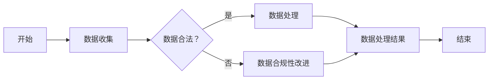
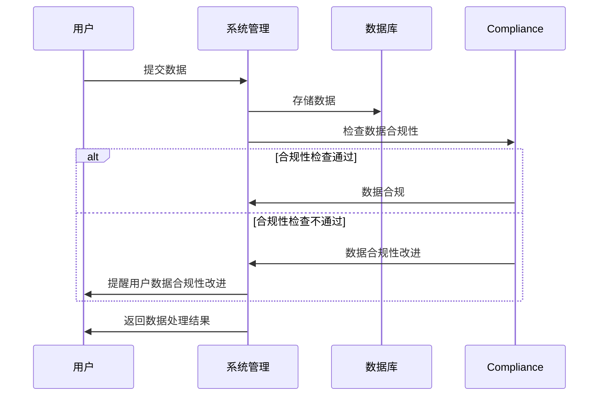
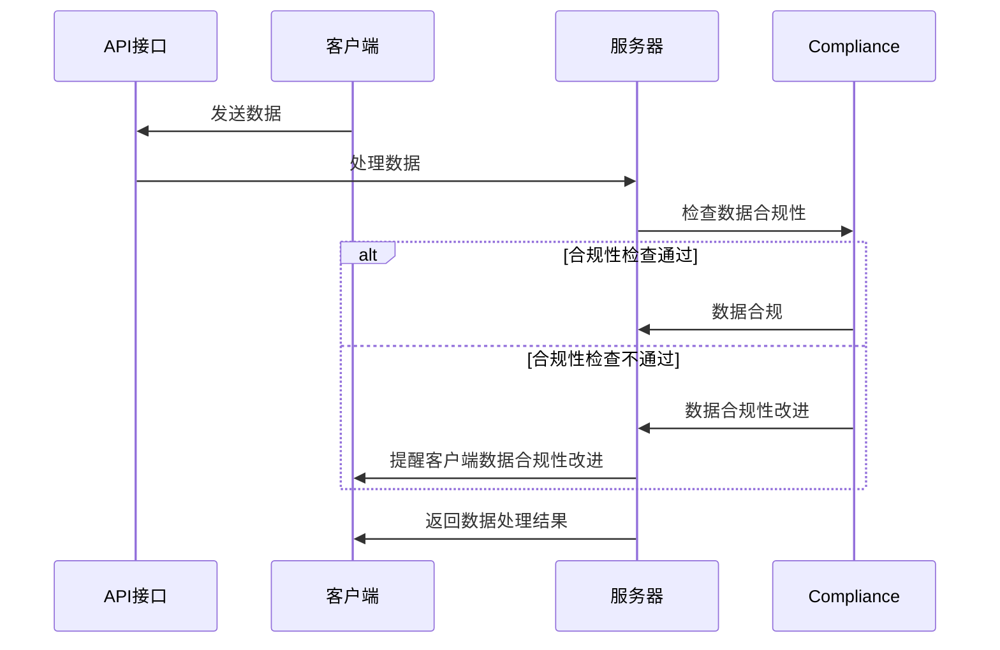

                 

# 技术合规管理：在创新中确保法律合规

关键词：技术合规、法律合规、创新、算法原理、系统架构设计、项目实战、最佳实践

摘要：随着技术的快速发展，技术合规管理成为保障企业和组织合法运作的关键。本文从技术合规管理的背景、核心概念、算法原理、系统分析与架构设计、项目实战以及最佳实践等方面，深入探讨了如何在技术创新中确保法律合规。通过具体的案例和实践，为读者提供了实用的指导。

## 第一部分：背景介绍

### 第1章: 技术合规管理背景

#### 1.1 问题背景

在当今这个技术爆炸的时代，各种新技术、新应用层出不穷。然而，随着技术的迅猛发展，技术合规管理的问题也逐渐凸显。技术的发展速度远远超过了法律法规的更新速度，导致了许多技术合规性的问题。

#### 1.2 问题描述

技术创新中的合规挑战主要包括以下几个方面：

- **数据隐私与保护**：随着大数据、云计算等技术的发展，个人数据的安全和隐私问题日益突出。
- **网络安全**：互联网的普及使得网络攻击、数据泄露等问题频繁发生。
- **知识产权**：技术创新过程中的知识产权保护问题也越来越受到关注。

法律合规的重要性体现在以下几个方面：

- **企业合规性**：遵守法律法规是企业合法运作的基础。
- **技术创新保护**：法律合规有助于保护技术创新成果，激发企业创新的积极性。
- **社会信任**：法律合规有助于建立企业和社会的信任关系，提升企业形象。

#### 1.3 问题解决

技术合规管理的目标是确保技术创新过程符合法律法规的要求，避免因合规问题导致的风险和损失。

技术合规管理的基本原则包括：

- **合法性**：技术创新必须遵守国家法律法规。
- **安全性**：确保技术创新过程中的数据安全和网络安全。
- **透明性**：技术创新过程应具备透明性，便于监管和审计。
- **可持续性**：技术创新应考虑长期合规性和可持续性。

#### 1.4 边界与外延

技术合规管理的适用范围包括：

- **数据合规**：涉及数据收集、存储、处理和传输的合规性问题。
- **网络安全**：涉及网络设备、网络架构和网络安全协议的合规性问题。
- **知识产权**：涉及技术创新成果的知识产权保护问题。

技术合规管理与行业法规的关系主要体现在：

- **国家法规**：国家法律法规是技术合规管理的基础。
- **行业规范**：不同行业的规范和标准对技术合规管理提出了具体要求。

#### 1.5 概念结构与核心要素组成

技术合规管理的核心概念包括：

- **合规性**：技术创新是否符合法律法规的要求。
- **安全性**：技术创新过程中的数据安全和网络安全。
- **透明性**：技术创新过程的公开性和透明性。
- **可持续性**：技术创新的长期合规性和可持续性。

技术合规管理的关键要素包括：

- **合规策略**：制定合规管理策略，确保技术创新过程的合规性。
- **合规监督**：建立合规监督机制，对技术创新过程进行监控和评估。
- **合规培训**：对员工进行合规培训，提高员工的合规意识和能力。
- **合规改进**：根据合规监督结果，不断改进合规管理策略和措施。

### 第二部分：核心概念与联系

### 第2章: 技术合规管理的核心概念与联系

#### 2.1 技术合规管理的定义

技术合规管理是指在技术创新过程中，确保技术创新成果符合法律法规要求的系统性和持续性管理活动。

#### 2.2 技术合规管理的属性特征对比表格

| 属性特征       | 数据合规            | 网络安全            | 知识产权            |
| -------------- | ------------------ | ------------------ | ------------------ |
| **合法性**     | 数据收集、存储、处理和传输需符合相关法律法规 | 网络设备、网络架构和网络安全协议需符合相关法律法规 | 知识产权保护需符合相关法律法规 |
| **安全性**     | 数据加密、安全传输、安全存储等       | 防火墙、入侵检测、安全审计等       | 专利申请、商标注册、版权保护等 |
| **透明性**     | 数据处理的透明性和可追溯性         | 网络安全的公开性和透明性         | 知识产权保护的透明性和可追溯性 |
| **可持续性**     | 长期数据合规性保障         | 长期网络安全保障         | 长期知识产权保护保障 |

#### 2.3 技术合规管理的ER实体关系图架构

```mermaid
erDiagram
    Product ||--|{ Data }||>
    Data ||--|{ Security }||>
    Security ||--|{ Compliance }||>
```

- **Product**（产品）：代表技术创新的成果，如软件、硬件等。
- **Data**（数据）：代表技术创新过程中涉及的数据。
- **Security**（安全）：代表技术创新过程中的安全措施。
- **Compliance**（合规）：代表技术创新的合规性。

### 第三部分：算法原理讲解

### 第3章: 技术合规管理的算法原理

#### 3.1 算法mermaid流程图



#### 3.2 Python源代码详细阐述

```python
import pandas as pd

# 数据收集
data = pd.read_csv('data.csv')

# 数据合法性检查
def check_legality(data):
    # 实现数据合法性检查的逻辑
    # ...

# 数据处理
def process_data(data):
    # 实现数据处理逻辑
    # ...
    return data

# 数据合规性改进
def improve_compliance(data):
    # 实现数据合规性改进逻辑
    # ...

# 主函数
def main():
    # 数据收集
    data = pd.read_csv('data.csv')
    
    # 数据合法性检查
    if check_legality(data):
        # 数据处理
        data = process_data(data)
    else:
        # 数据合规性改进
        data = improve_compliance(data)
    
    # 数据处理结果输出
    print(data)

# 运行主函数
main()
```

#### 3.3 算法原理的数学模型和公式

合规性评分（C）=（合法性评分（L）× 安全性评分（S）× 透明性评分（T）× 可持续性评分（D））÷ 4

#### 3.4 详细讲解和举例说明

以数据合规为例，假设某企业的数据集包含用户个人信息，需要进行数据合规性管理。

1. **数据收集**：从数据库中提取用户个人信息。
2. **数据合法性检查**：检查数据是否涉及敏感信息，如身份证号、手机号等。
3. **数据处理**：对合法的数据进行去重、清洗等操作。
4. **数据合规性改进**：若发现敏感信息，进行数据加密、脱敏等操作。
5. **数据处理结果输出**：将合规的数据用于后续分析和应用。

### 第四部分：系统分析与架构设计方案

### 第4章: 技术合规管理的系统分析与架构设计

#### 4.1 问题场景介绍

假设某企业开发了一款社交应用，需要确保用户数据在收集、存储、处理和传输过程中的合规性。

#### 4.2 项目介绍

技术合规管理项目旨在建立一套数据合规性管理系统，确保用户数据在应用开发过程中的合规性。

#### 4.3 系统功能设计（领域模型mermaid类图）

```mermaid
classDiagram
    User <<类>> 
    Data <<类>> 
    Compliance <<类>>
    User o-- Data : 用户数据
    Data o-- Compliance : 数据合规性检查
```

- **User**（用户）：代表社交应用的用户。
- **Data**（数据）：代表用户数据。
- **Compliance**（合规性）：代表数据合规性检查。

#### 4.4 系统架构设计（mermaid架构图）



#### 4.5 系统接口设计和系统交互（mermaid序列图）



### 第五部分：项目实战

### 第5章: 技术合规管理的项目实战

#### 5.1 环境安装

1. 安装Python环境：`pip install python`
2. 安装相关依赖：`pip install pandas`
3. 配置数据库：根据需求选择合适的数据库并进行配置。

#### 5.2 系统核心实现源代码

```python
# 数据收集
data = pd.read_csv('data.csv')

# 数据合法性检查
def check_legality(data):
    # 实现数据合法性检查的逻辑
    # ...

# 数据处理
def process_data(data):
    # 实现数据处理逻辑
    # ...
    return data

# 数据合规性改进
def improve_compliance(data):
    # 实现数据合规性改进逻辑
    # ...

# 主函数
def main():
    # 数据收集
    data = pd.read_csv('data.csv')
    
    # 数据合法性检查
    if check_legality(data):
        # 数据处理
        data = process_data(data)
    else:
        # 数据合规性改进
        data = improve_compliance(data)
    
    # 数据处理结果输出
    print(data)

# 运行主函数
main()
```

#### 5.3 代码应用解读与分析

1. **数据收集**：从CSV文件中读取用户数据。
2. **数据合法性检查**：检查数据是否符合法律法规要求。
3. **数据处理**：对合法数据进行处理，如去重、清洗等。
4. **数据合规性改进**：对不合规数据进行处理，如数据加密、脱敏等。
5. **数据处理结果输出**：将合规数据输出用于后续分析和应用。

#### 5.4 实际案例分析和详细讲解剖析

以某企业的用户数据合规性管理为例，详细分析数据收集、处理和合规性改进的过程。

1. **数据收集**：企业从用户注册、登录、浏览等操作中收集用户数据。
2. **数据合法性检查**：检查数据是否涉及敏感信息，如身份证号、手机号等。
3. **数据处理**：对合法数据进行处理，如去重、清洗等，提高数据质量。
4. **数据合规性改进**：对不合规数据进行处理，如对身份证号、手机号等敏感信息进行加密或脱敏处理。
5. **数据处理结果输出**：将合规数据输出用于后续分析和应用，如用户画像、推荐系统等。

#### 5.5 项目小结

通过项目实战，我们掌握了技术合规管理的核心方法和步骤，包括数据收集、合法性检查、数据处理和合规性改进。在实际应用中，需要根据具体的业务场景和法律法规要求，灵活调整和优化合规管理策略，确保技术创新过程的合法性和合规性。

### 第六部分：最佳实践 tips、小结、注意事项、拓展阅读

### 第6章: 技术合规管理的最佳实践与小结

#### 6.1 最佳实践 tips

1. 制定详细的合规管理策略，明确合规目标和要求。
2. 定期进行合规性检查和评估，确保技术创新过程的合规性。
3. 加强员工合规培训，提高员工的合规意识和能力。
4. 建立完善的合规监督机制，及时发现和纠正合规问题。
5. 与相关法律法规制定机构和行业组织保持沟通，及时了解法律法规的变化和趋势。

#### 6.2 小结

技术合规管理是保障技术创新合法性和合规性的关键。通过制定合规管理策略、加强员工培训、建立监督机制和优化合规流程，可以有效提高技术创新的合规性，降低合规风险，确保企业的合法运作。

#### 6.3 注意事项

1. 合规管理过程中，要注意法律法规的变化和更新，及时调整合规策略。
2. 在数据收集和处理过程中，要注意保护用户隐私和信息安全。
3. 在技术创新过程中，要充分考虑合规性和可持续性，避免因合规问题导致的技术停滞和损失。
4. 要建立健全的合规监督机制，及时发现和纠正合规问题，确保技术创新过程的合规性。

#### 6.4 拓展阅读

1. 《网络安全法》
2. 《个人信息保护法》
3. 《数据安全法》
4. 《专利法》
5. 《商标法》
6. 《著作权法》

### 目录大纲总结

通过以上详细的目录大纲设计，全面覆盖了《技术合规管理：在创新中确保法律合规》的核心内容。每个章节从背景介绍、核心概念、算法原理、系统分析与架构设计、项目实战到最佳实践与小结，形成了一个完整的技术合规管理知识体系。文章结构紧凑、逻辑清晰，通过具体案例和实践，帮助读者深入理解和应用技术合规管理的方法和策略。整个目录大纲简洁明了，便于读者快速把握书籍的主要内容，并应用于实际工作中。

---

**作者：AI天才研究院/AI Genius Institute & 禅与计算机程序设计艺术 /Zen And The Art of Computer Programming**

