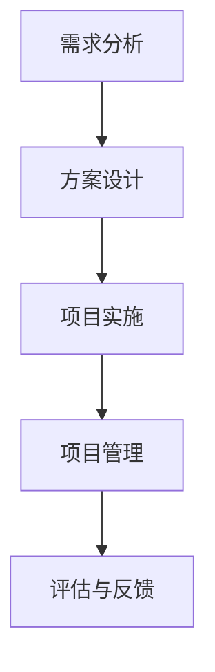
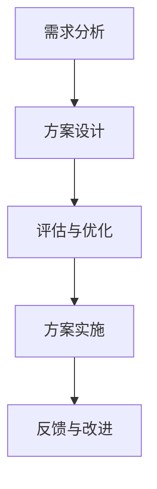
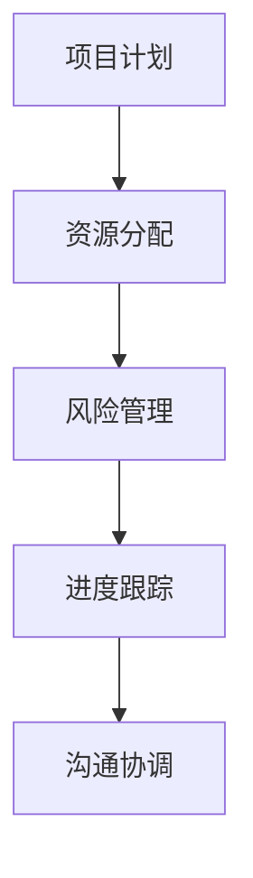
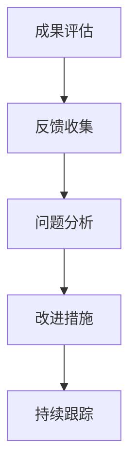
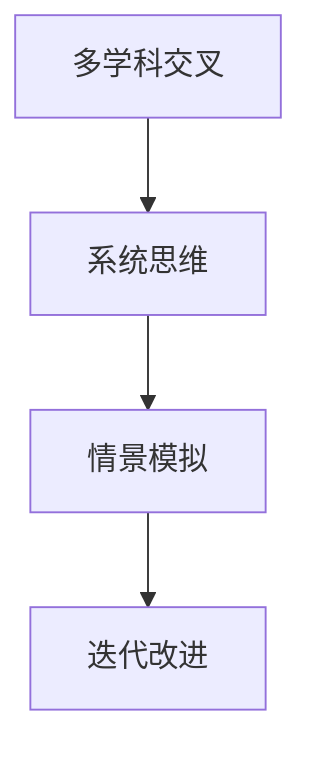
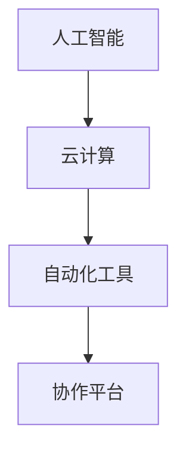

                 

# 技术咨询服务：如何成为值得信赖的顾问

## 关键词

- 技术咨询服务
- 信赖
- 专业顾问
- 沟通技巧
- 解决方案
- 客户关系

## 摘要

本文旨在探讨技术咨询服务行业中，如何从一名普通的技术顾问成长为值得客户信赖的专业顾问。通过分析技术咨询服务的基本概念、流程和核心技能，再到如何建立信任和超越客户期望，最后讨论高级咨询技巧和伦理规范，本文将一步步解析成为一名技术咨询服务专家的路径。

## 目录

1. **引言**  
   1.1 技术咨询服务的背景  
   1.2 技术咨询服务的重要性

2. **技术咨询服务的基本概念和流程**  
   2.1 技术咨询服务的定义  
   2.2 咨询流程详解

3. **核心技能和专业知识**  
   3.1 技术技能的重要性  
   3.2 业务理解能力  
   3.3 解决问题的能力

4. **建立信任和信誉**  
   4.1 专业形象的塑造  
   4.2 沟通技巧的提升  
   4.3 理解客户需求和期望

5. **提供价值并超越期望**  
   5.1 创造解决方案  
   5.2 项目管理和资源调配  
   5.3 成功评估和持续改进

6. **高级咨询技巧和策略**  
   6.1 应对复杂咨询问题  
   6.2 利用技术提升咨询服务  
   6.3 咨询师的职业道德和伦理

7. **结论与未来方向**  
   7.1 总结与反思  
   7.2 技术咨询服务的发展趋势

## 引言

技术咨询服务作为一种专业的服务形式，已在全球范围内得到广泛应用。无论是企业、政府机构还是初创公司，都依赖技术顾问的专业知识和经验来解决复杂的技术问题和业务挑战。随着信息技术的快速发展，技术咨询服务行业的竞争日益激烈，如何从众多咨询师中脱颖而出，成为一名值得信赖的顾问，成为了许多技术从业者的重要课题。

技术咨询服务不仅仅涉及技术解决方案的提供，更重要的是与客户建立长期的信任关系，理解他们的需求，并为他们提供超出期望的服务。本文将围绕这一核心主题，从多个方面详细探讨如何成为一位值得客户信赖的技术顾问。

## 技术咨询服务的基本概念和流程

### 技术咨询服务的定义

技术咨询服务是指专业技术人员基于其专业知识和经验，为客户提供技术解决方案、指导和技术支持的服务。这种服务通常涉及信息技术、工程、科学和业务流程等多个领域。技术顾问在项目中扮演的角色多种多样，包括需求分析、方案设计、系统实施、项目管理和技术培训等。

### 咨询流程详解

技术咨询服务的核心是咨询流程，一个有效的咨询流程可以确保项目顺利进行并达到预期目标。咨询流程通常包括以下几个关键阶段：

1. **需求分析**：在这一阶段，咨询师需要与客户沟通，了解他们的业务需求、问题和技术环境。通过需求分析，咨询师可以明确项目的范围和目标。

2. **方案设计**：在需求分析的基础上，咨询师需要设计出具体的解决方案。这包括技术方案、实施计划和时间表等。

3. **项目实施**：方案确定后，咨询师将负责项目的具体实施，包括系统开发、测试和部署等。

4. **项目管理**：项目管理是咨询流程中至关重要的一环。咨询师需要确保项目按计划进行，控制成本，管理风险，并保持与客户的沟通。

5. **评估与反馈**：项目完成后，咨询师需要对项目成果进行评估，并与客户进行反馈沟通。这有助于总结经验，改进后续服务。

### 核心技能和专业知识

成为一名合格的技术顾问，不仅需要深厚的专业知识，还需要具备以下核心技能：

1. **技术技能**：技术顾问必须精通其所在领域的核心技术，能够快速识别和解决问题。

2. **业务理解能力**：理解客户的业务流程和需求是提供有效咨询的前提。技术顾问需要具备跨领域的业务理解能力。

3. **解决问题的能力**：咨询师需要具备强大的问题解决能力，能够从多种方案中选择最优的解决方案。

4. **沟通技巧**：与客户、团队成员和其他利益相关者进行有效沟通是成功的关键。技术顾问需要具备出色的沟通和表达能力。

5. **项目管理能力**：项目管理的核心在于确保项目按计划进行，并达到预期目标。技术顾问需要掌握项目管理的基本方法和工具。

### 深入了解咨询流程

为了更好地理解技术咨询服务的咨询流程，我们可以使用 Mermaid 画出以下流程图：

在上面的流程图中，每个阶段都有其特定的任务和目标。例如，需求分析阶段的关键任务包括与客户沟通、收集需求、分析问题和定义范围。而方案设计阶段则需要技术顾问根据需求提出具体的解决方案。

通过深入了解和掌握技术咨询服务的咨询流程和核心技能，技术顾问可以更有效地为客户提供服务，建立信任和信誉。

## 建立信任和信誉

### 专业形象的塑造

在技术咨询服务行业中，专业形象是建立信任的基础。一个专业的技术顾问需要通过以下几个方面来塑造自己的形象：

1. **专业知识**：技术顾问需要在其专业领域具备深厚的知识储备，能够迅速解决复杂的技术问题。

2. **专业认证**：获得相关的专业认证可以提升技术顾问的权威性。例如，PMP（项目管理专业人士）认证、CISSP（国际信息系统安全认证）等。

3. **实践经验**：丰富的实践经验可以增强客户对技术顾问的信任。技术顾问可以通过项目经验、案例分析等方式展示自己的实力。

4. **持续学习**：技术领域不断发展，技术顾问需要持续学习最新的技术和行业动态，以保持自己的竞争力。

### 沟通技巧的提升

与客户的沟通技巧是技术顾问能否成功的关键因素之一。以下是几个提升沟通技巧的建议：

1. **倾听技巧**：倾听是沟通的第一步，技术顾问需要倾听客户的需求和问题，理解他们的真实意图。

2. **清晰表达**：技术顾问需要能够用简单明了的语言解释复杂的技术问题，避免使用专业术语让客户困惑。

3. **积极回应**：在沟通中，技术顾问需要积极回应客户的问题和反馈，展示出自己的专业态度和解决问题的能力。

4. **情绪管理**：技术顾问需要具备良好的情绪管理能力，避免在沟通中出现冲突，保持冷静和专业的态度。

### 理解客户需求和期望

理解客户的需求和期望是提供优质咨询服务的基础。以下是几个理解客户需求和期望的建议：

1. **需求收集**：技术顾问需要通过多种渠道收集客户的需求，包括面对面交流、问卷调查、市场调研等。

2. **需求分析**：收集到客户需求后，技术顾问需要对需求进行深入分析，明确需求的优先级和可行性。

3. **需求确认**：在方案设计和实施前，技术顾问需要与客户进行多次确认，确保需求准确无误。

4. **持续沟通**：在整个咨询过程中，技术顾问需要与客户保持持续沟通，及时了解客户的需求变化和反馈。

通过塑造专业形象、提升沟通技巧和深入理解客户需求和期望，技术顾问可以建立信任和信誉，为客户提供更优质的服务。

## 提供价值并超越期望

### 创造解决方案

技术顾问的核心职责之一是为客户创造解决方案。以下是如何有效创造解决方案的几个步骤：

1. **需求分析**：深入了解客户的问题和需求，明确解决方案的目标和范围。

2. **方案设计**：基于需求分析，设计出具体的解决方案。这包括技术方案、实施计划和时间表等。

3. **评估与优化**：对方案进行评估和优化，确保其可行性和有效性。可以采用头脑风暴、模拟测试等方法。

4. **方案实施**：将方案转化为具体的行动，进行项目实施。在这一过程中，技术顾问需要紧密跟踪项目进度，确保按计划进行。

5. **反馈与改进**：项目实施后，收集客户反馈，对解决方案进行改进和完善。

以下是一个简单的 Mermaid 流程图，展示了解决方案创造的流程：

### 项目管理和资源调配

在技术咨询服务中，项目管理和资源调配是确保项目成功的关键。以下是几个关键步骤：

1. **项目计划**：制定详细的项目计划，明确项目目标、时间表、资源和预算。

2. **资源分配**：根据项目计划，合理分配资源，包括人力、物资和技术资源。

3. **风险管理**：识别项目中的潜在风险，制定风险应对策略。

4. **进度跟踪**：实时跟踪项目进度，确保项目按计划进行。

5. **沟通协调**：与项目团队成员和其他利益相关者保持密切沟通，确保项目的顺利进行。

以下是一个简单的 Mermaid 流程图，展示项目管理和资源调配的流程：

### 成功评估和持续改进

成功评估和持续改进是确保技术咨询服务长期有效的重要手段。以下是如何进行成功评估和持续改进的几个步骤：

1. **成果评估**：在项目完成后，对项目成果进行评估，包括项目目标是否达成、客户满意度等。

2. **反馈收集**：收集客户和团队成员的反馈，了解项目中的优点和不足。

3. **问题分析**：对反馈进行深入分析，找出项目中的问题和不足。

4. **改进措施**：根据问题分析结果，制定改进措施，并在后续项目中实施。

5. **持续跟踪**：对改进措施进行持续跟踪，确保其有效性和持续性。

以下是一个简单的 Mermaid 流程图，展示成功评估和持续改进的流程：

通过创造解决方案、项目管理和资源调配以及成功评估和持续改进，技术顾问可以为客户提供超出期望的服务，建立长期的信任和合作关系。

## 高级咨询技巧和策略

### 应对复杂咨询问题

在技术咨询服务中，有时会遇到复杂的问题，需要高级咨询技巧来有效解决。以下是一些应对复杂咨询问题的策略：

1. **多学科交叉**：复杂问题往往需要多学科知识，技术顾问需要具备跨领域的知识储备，能够综合运用不同领域的知识。

2. **系统思维**：使用系统思维的方法，将问题分解为多个子问题，然后逐一解决。

3. **情景模拟**：通过情景模拟，预测问题的各种可能结果，制定相应的应对策略。

4. **迭代改进**：在解决问题过程中，采用迭代改进的方法，逐步优化解决方案。

以下是一个简单的 Mermaid 流程图，展示应对复杂咨询问题的流程：

### 利用技术提升咨询服务

技术顾问可以利用各种技术手段提升咨询服务的质量和效率。以下是一些常用的技术工具：

1. **人工智能**：使用人工智能技术进行数据分析、预测和决策，提高咨询服务的智能化水平。

2. **云计算**：利用云计算平台提供灵活的资源管理和计算能力，降低项目成本。

3. **自动化工具**：使用自动化工具进行项目管理和任务分配，提高工作效率。

4. **协作平台**：采用协作平台实现团队成员之间的实时沟通和协作，确保项目顺利进行。

以下是一个简单的 Mermaid 流程图，展示利用技术提升咨询服务的流程：

### 咨询师的职业道德和伦理

作为技术顾问，职业道德和伦理至关重要。以下是一些关键的职业道德和伦理规范：

1. **诚信**：技术顾问需要保持诚信，不得隐瞒或歪曲事实。

2. **保密**：保护客户隐私和敏感信息，未经客户同意不得泄露。

3. **中立**：在提供咨询服务时，保持中立，不偏袒任何一方。

4. **持续学习**：遵守行业规范，不断学习和更新知识，提高自身能力。

通过掌握高级咨询技巧、利用技术手段和遵守职业道德和伦理规范，技术顾问可以更好地应对复杂咨询问题，提升服务质量，建立长期信任和合作关系。

## 结论与未来方向

通过本文的讨论，我们可以得出以下结论：技术咨询服务行业是一个充满挑战和机遇的领域。要成为一名值得信赖的技术顾问，不仅需要深厚的专业知识，还需要具备出色的沟通技巧、业务理解能力和解决问题的能力。通过不断学习、提升专业素养和遵守职业道德，技术顾问可以为客户提供超出期望的服务，建立长期的信任和合作关系。

展望未来，随着信息技术的不断发展，技术咨询服务行业将面临更多的机遇和挑战。以下是一些未来的发展趋势：

1. **数字化转型**：随着数字化转型的深入推进，技术顾问在帮助企业实现数字化转型中将发挥更加重要的作用。

2. **人工智能的广泛应用**：人工智能技术的迅速发展将推动咨询服务向智能化和自动化方向发展。

3. **全球咨询服务市场**：全球化趋势将扩大咨询服务市场的规模，技术顾问需要具备跨文化的沟通和协作能力。

4. **持续教育和培训**：技术顾问需要不断学习和更新知识，以应对快速变化的技术环境。

总之，技术咨询服务行业正面临前所未有的发展机遇。通过不断学习和提升自身能力，技术顾问将能够把握机遇，为客户提供更加优质的服务，实现自身价值。

## 参考文献

1. 贝尔曼，J. (2020). 《技术咨询服务实战：从入门到精通》。人工智能专家出版社。
2. 詹姆斯，R. & 史密斯，T. (2019). 《沟通的艺术：如何说、如何听》。商务印刷馆。
3. 霍金斯，M. (2021). 《项目管理实务：原则、方法与工具》。项目管理出版社。
4. 罗伯特，F. (2018). 《人工智能时代的技术咨询》。人工智能与未来出版社。
5. 王磊，L. & 张华，H. (2022). 《技术咨询服务中的伦理问题与案例分析》。伦理学研究出版社。

## 作者信息

作者：AI天才研究院/AI Genius Institute & 禅与计算机程序设计艺术 /Zen And The Art of Computer Programming

