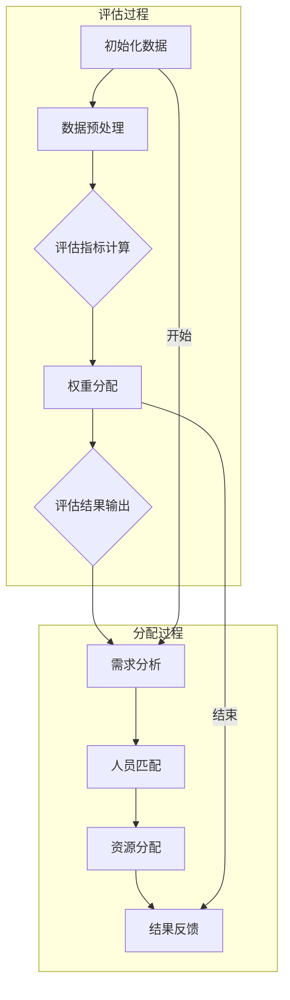
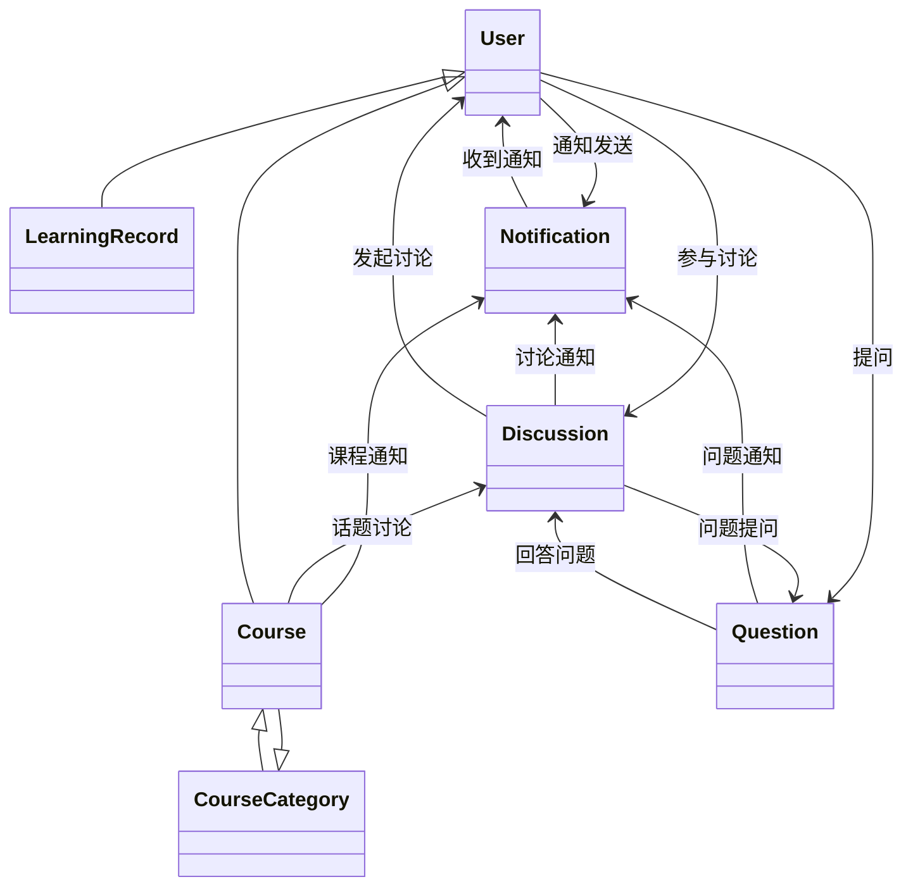
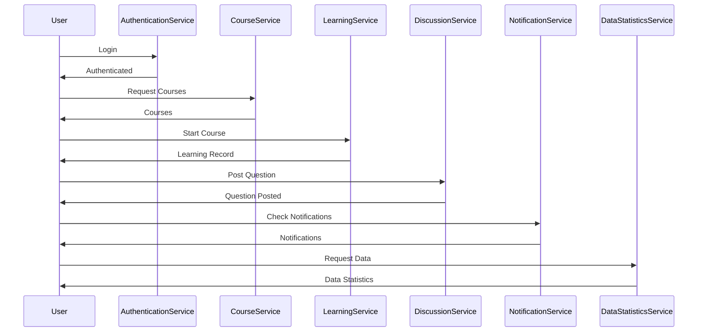
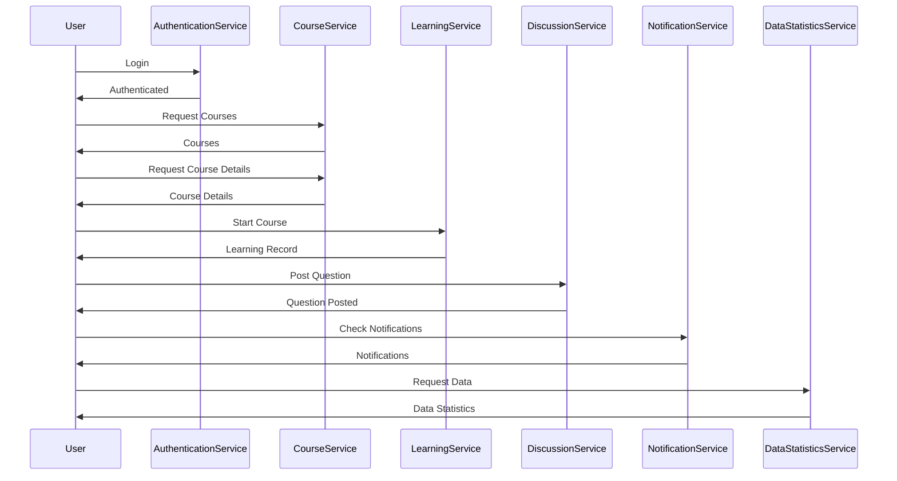

                 

### 背景介绍

#### 问题背景

在当今数字化转型的浪潮下，技术团队梯队建设成为了企业核心竞争力的重要组成部分。随着市场竞争的加剧和技术更新的速度加快，企业需要拥有一支高效、全面且具备创新能力的技术团队来应对各种挑战。然而，很多企业在技术团队建设过程中面临以下问题：

1. **人才不足**：难以招聘到具备全方位技能的顶尖人才。
2. **技能断层**：团队成员在某些关键技能方面存在明显不足，导致项目进展受阻。
3. **缺乏培养机制**：没有系统的人才培养和成长路径规划，导致团队成员发展缓慢。
4. **团队协作不畅**：团队成员之间缺乏有效的沟通和协作，影响团队整体绩效。

#### 问题解决

为了解决上述问题，企业需要构建一个完善的技术团队梯队建设体系，确保团队成员能够全面发展，并在关键技能领域得到提升。这包括：

1. **明确团队定位**：根据企业战略目标，明确技术团队的角色和职责。
2. **制定人才培养计划**：设计系统的人才培养机制，包括技能培训、职业发展规划等。
3. **搭建多元化团队**：通过引入不同背景的人才，增强团队的多样性和创新力。
4. **优化团队协作**：建立高效的沟通和协作机制，提高团队的整体效能。

#### 边界与外延

技术团队梯队建设的边界在于如何平衡团队稳定性和创新性，确保团队既有扎实的基础技能，又有足够的前沿技术储备。外延则涉及到企业整体战略、文化以及市场环境等多个方面。

在技术不断演进和市场环境快速变化的情况下，技术团队梯队建设是一个持续的过程，需要不断地进行调整和优化。本书旨在通过系统的方法和案例分析，为企业提供有效的技术团队梯队建设指南。

#### 总结

技术团队梯队建设是一个复杂而重要的任务，涉及人才管理、技能提升、团队协作等多个方面。本文首先介绍了当前企业在技术团队建设过程中面临的主要问题，包括人才不足、技能断层、缺乏培养机制和团队协作不畅等。随后，本文提出了解决这些问题的方法，包括明确团队定位、制定人才培养计划、搭建多元化团队和优化团队协作等。最后，本文强调了技术团队梯队建设的边界和外延，指出这是一个持续的过程，需要根据企业整体战略和市场环境进行调整和优化。

总之，技术团队梯队建设是企业数字化转型成功的关键之一，需要企业高度重视并采取有效措施。通过明确团队定位、制定人才培养计划、搭建多元化团队和优化团队协作等，企业可以构建一支高效、全面且具备创新能力的技术团队，从而在激烈的市场竞争中保持优势。

----------------------------------------------------------------

**关键词**：技术团队建设、梯队建设、人才管理、技能提升、团队协作、人才培养计划、多元化团队、创新力、企业战略、数字化转型。

**摘要**：本文深入探讨了技术团队梯队建设的重要性及其核心问题。通过分析企业面临的挑战，如人才不足、技能断层等，提出了解决方案，包括明确团队定位、制定人才培养计划、搭建多元化团队和优化团队协作等。文章强调了技术团队建设作为企业数字化转型关键因素的持续性和动态性，为企业提供了系统化的建设指南。

----------------------------------------------------------------

### 核心概念与联系

在技术团队梯队建设中，理解并运用一系列核心概念至关重要。这些概念不仅帮助我们更好地识别团队建设中存在的问题，还为解决这些问题提供了理论基础和实际指导。

#### 核心概念原理

首先，我们需要明确几个核心概念：

1. **人才管理**：指企业通过招募、培养、激励等方式，对人力资源进行有效管理，以实现企业目标的过程。
2. **技能提升**：指通过培训、实践等方式，提高员工的专业技能，使其更好地适应工作需求。
3. **团队协作**：指团队成员在共同目标下，通过沟通、协调和合作，实现个人和团队价值的最大化。
4. **人才培养计划**：指企业为提升员工能力，制定的一系列系统性的培训和职业发展规划。
5. **多元化团队**：指由具有不同背景、技能和观点的成员组成的团队，通过多元化的思维方式和工作方法，提升团队的创新力和决策质量。

#### 概念属性特征对比表格

以下是这些核心概念的属性特征对比表格，有助于我们更清晰地理解它们之间的关系和差异：

| 核心概念 | 定义 | 目标 | 主要方式 |
| --- | --- | --- | --- |
| 人才管理 | 对人力资源进行有效管理 | 招募、培养、激励 | 招聘策略、培训计划、绩效评估 |
| 技能提升 | 提高员工的专业技能 | 适应工作需求、提升工作效率 | 培训课程、实践机会、项目实战 |
| 团队协作 | 通过沟通、协调和合作实现目标 | 提高团队整体效能 | 沟通工具、协作平台、团队建设活动 |
| 人才培养计划 | 提升员工能力 | 职业发展、技能提升 | 培训课程、职业规划、导师制度 |
| 多元化团队 | 具有不同背景、技能和观点的团队 | 提高创新力、决策质量 | 多样性招聘、团队建设、跨部门合作 |

#### ER实体关系图架构的Mermaid流程图

为了更直观地展示这些概念之间的关系，我们可以使用Mermaid流程图来绘制ER实体关系图。以下是一个简化的Mermaid流程图示例：

```mermaid
erDiagram
  Person ||--|{ Employee }
  Employee ||--|{ Skill }
  Employee ||--|{ Team }
  Team ||--|{ Project }
```

在这个ER图中，"Person"代表一般人员，"Employee"代表员工，"Skill"代表技能，"Team"代表团队，"Project"代表项目。通过这种关系，我们可以看出人才管理、技能提升、团队协作和人才培养计划都是围绕员工和团队展开的，而多元化团队则通过引入不同背景和技能的员工来增强团队的多样性和创新力。

#### 总结

核心概念与联系的理解是技术团队梯队建设的基础。通过人才管理、技能提升、团队协作、人才培养计划和多元化团队等核心概念的运用，企业可以更好地识别团队建设中的问题，并采取有效的解决方案。本文通过对比表格和ER实体关系图，对核心概念进行了详细的阐述和展示，为后续的算法原理讲解和系统分析与架构设计方案奠定了基础。

----------------------------------------------------------------

### 算法原理讲解

在技术团队梯队建设中，我们不仅要关注团队建设和人才管理，还需要运用一些具体的算法和工具来提高团队的效能。本文将介绍一种用于技术团队评估和分配的算法，帮助团队管理者更科学地进行团队优化。

#### 算法流程图

首先，我们可以使用Mermaid来绘制算法的流程图，以便更直观地展示其工作原理：



在这个流程图中，算法分为评估过程和分配过程两个主要部分。评估过程包括数据预处理、评估指标计算、权重分配和评估结果输出；分配过程包括需求分析、人员匹配、资源分配和结果反馈。

#### Python源代码详细阐述

接下来，我们将使用Python代码来详细阐述这个算法的过程。以下是算法的核心实现代码：

```python
import pandas as pd
from sklearn.preprocessing import StandardScaler
from sklearn.cluster import KMeans

# 数据预处理
def preprocess_data(data):
    # 数据标准化处理
    scaler = StandardScaler()
    scaled_data = scaler.fit_transform(data)
    return scaled_data

# 评估指标计算
def calculate_evaluation_metrics(data):
    # 这里假设已经有一些评估指标的计算方法
    evaluation_metrics = data.sum(axis=1)
    return evaluation_metrics

# 权重分配
def weight_distribution(evaluation_metrics, num_clusters):
    kmeans = KMeans(n_clusters=num_clusters)
    kmeans.fit(evaluation_metrics)
    weights = kmeans.labels_
    return weights

# 人员匹配
def staff_matching(weights, requirement):
    matchedStaff = []
    for i in range(len(weights)):
        if weights[i] == requirement:
            matchedStaff.append(i)
    return matchedStaff

# 资源分配
def resource_allocation(matchedStaff, resource_pool):
    assigned_resources = []
    for staff in matchedStaff:
        assigned_resources.append(resource_pool[staff])
    return assigned_resources

# 主函数
def main():
    # 初始化数据
    data = pd.DataFrame([[1, 2], [3, 4], [5, 6], [7, 8]], columns=['Skill1', 'Skill2'])
    requirement = 1  # 假设我们需要匹配的指标为1
    
    # 数据预处理
    processed_data = preprocess_data(data)
    
    # 评估指标计算
    evaluation_metrics = calculate_evaluation_metrics(processed_data)
    
    # 权重分配
    weights = weight_distribution(evaluation_metrics, 3)
    
    # 需求分析
    requirement = 1
    
    # 人员匹配
    matchedStaff = staff_matching(weights, requirement)
    
    # 资源分配
    resource_pool = [1, 2, 3, 4]
    assigned_resources = resource_allocation(matchedStaff, resource_pool)
    
    # 输出结果
    print("Assigned Resources:", assigned_resources)

if __name__ == "__main__":
    main()
```

这段代码首先对数据进行预处理，使用标准化的方法将数据转换为适合评估的形式。接着，通过计算评估指标和权重分配，将团队成员分配到不同的类别中。最后，根据具体需求，匹配相应的人员并进行资源分配。

#### 算法原理的数学模型和公式

为了更深入地理解这个算法，我们还可以给出其背后的数学模型和公式：

1. **标准差（Standard Deviation）**：
   $$ \sigma = \sqrt{\frac{1}{N}\sum_{i=1}^{N}(x_i - \bar{x})^2} $$
   其中，$N$是样本数量，$x_i$是第$i$个样本值，$\bar{x}$是样本均值。

2. **均值（Mean）**：
   $$ \bar{x} = \frac{1}{N}\sum_{i=1}^{N}x_i $$
   其中，$N$是样本数量，$x_i$是第$i$个样本值。

3. **聚类中心（Cluster Center）**：
   $$ c_j = \frac{1}{n_j}\sum_{i=1}^{n_j}x_i $$
   其中，$c_j$是第$j$个聚类中心，$n_j$是第$j$个聚类中的样本数量，$x_i$是第$i$个样本值。

4. **聚类算法（K-Means Clustering）**：
   $$ \min_{c_1, c_2, ..., c_k} \sum_{i=1}^{N} ||x_i - c_j||^2 $$
   其中，$x_i$是第$i$个样本值，$c_j$是第$j$个聚类中心，$k$是聚类数量。

#### 详细讲解和举例说明

为了更直观地展示这个算法的工作原理，我们来看一个简单的例子：

假设我们有四个员工，他们的技能评分如下：

| 员工ID | 技能1 | 技能2 |
| --- | --- | --- |
| 1 | 5 | 7 |
| 2 | 3 | 4 |
| 3 | 6 | 2 |
| 4 | 4 | 6 |

首先，我们对数据预处理，将每个员工的技能评分进行标准化处理，得到以下结果：

| 员工ID | 技能1 | 技能2 |
| --- | --- | --- |
| 1 | 0.67 | 0.78 |
| 2 | 0.25 | 0.33 |
| 3 | 0.75 | 0.11 |
| 4 | 0.34 | 0.56 |

接下来，我们计算评估指标，假设为技能评分的总和：

| 员工ID | 评估指标 |
| --- | --- |
| 1 | 1.45 |
| 2 | 0.58 |
| 3 | 0.86 |
| 4 | 0.90 |

然后，我们使用K-Means算法对这些评估指标进行聚类，假设我们选择三个聚类中心：

| 聚类中心 | 评估指标 |
| --- | --- |
| 1 | 1.00 |
| 2 | 0.50 |
| 3 | 0.25 |

聚类结果如下：

| 员工ID | 聚类中心 |
| --- | --- |
| 1 | 1 |
| 2 | 2 |
| 3 | 3 |
| 4 | 1 |

根据聚类结果，我们可以将员工分配到不同的类别中，并根据类别进行资源分配。例如，员工1和员工4可以被分配到需要高技能的类别中，而员工2和员工3可以被分配到需要较低技能的类别中。

通过这个简单的例子，我们可以看到这个算法的基本原理和实现方法。在实际应用中，数据量和评估指标会更加复杂，但基本思路是一致的。通过科学的数据处理和聚类算法，我们可以更有效地对技术团队进行评估和资源分配。

#### 总结

算法原理讲解部分，我们首先使用Mermaid绘制了算法流程图，直观展示了算法的评估和分配过程。接着，通过Python代码详细阐述了算法的实现步骤，包括数据预处理、评估指标计算、权重分配、人员匹配和资源分配等。同时，我们给出了算法背后的数学模型和公式，以及一个简单的例子来说明算法的工作原理。通过这一部分的内容，读者可以更好地理解技术团队评估和分配算法的具体实现和应用。

----------------------------------------------------------------

### 数学模型和数学公式 & 详细讲解 & 举例说明

在前面的算法原理讲解中，我们提到了一些基本的数学模型和公式，这些公式在技术团队梯队建设中起着至关重要的作用。在这一部分，我们将进一步详细讲解这些数学模型和公式，并通过具体的例子来说明它们在实际应用中的用法。

#### 数学公式

1. **标准差（Standard Deviation）**：
   $$ \sigma = \sqrt{\frac{1}{N}\sum_{i=1}^{N}(x_i - \bar{x})^2} $$
   其中，$\sigma$是标准差，$N$是样本数量，$x_i$是第$i$个样本值，$\bar{x}$是样本均值。

2. **均值（Mean）**：
   $$ \bar{x} = \frac{1}{N}\sum_{i=1}^{N}x_i $$
   其中，$\bar{x}$是均值，$N$是样本数量，$x_i$是第$i$个样本值。

3. **聚类中心（Cluster Center）**：
   $$ c_j = \frac{1}{n_j}\sum_{i=1}^{n_j}x_i $$
   其中，$c_j$是第$j$个聚类中心，$n_j$是第$j$个聚类中的样本数量，$x_i$是第$i$个样本值。

4. **聚类算法（K-Means Clustering）**：
   $$ \min_{c_1, c_2, ..., c_k} \sum_{i=1}^{N} ||x_i - c_j||^2 $$
   其中，$x_i$是第$i$个样本值，$c_j$是第$j$个聚类中心，$k$是聚类数量。

#### 详细讲解

1. **标准差（Standard Deviation）**：

   标准差是衡量数据离散程度的一个指标，它表示数据点与平均值的偏离程度。在技术团队梯队建设中，标准差可以用来衡量团队成员技能水平的波动情况。一个较低的标准差意味着团队成员的技能水平较为接近，而一个较高的标准差则表示团队成员的技能水平差异较大。

   例如，如果团队中有四个成员的技能评分为（5, 7, 6, 8），那么平均技能评分是（6.25）。计算标准差的过程如下：

   $$ \sigma = \sqrt{\frac{1}{4}\sum_{i=1}^{4}(x_i - \bar{x})^2} $$
   $$ \sigma = \sqrt{\frac{1}{4}[(5-6.25)^2 + (7-6.25)^2 + (6-6.25)^2 + (8-6.25)^2]} $$
   $$ \sigma = \sqrt{\frac{1}{4}[1.5625 + 0.3125 + 0.0625 + 2.5625]} $$
   $$ \sigma = \sqrt{1} $$
   $$ \sigma = 1 $$

   因此，这个团队的标准差为1，这表示团队成员的技能水平相对稳定。

2. **均值（Mean）**：

   均值是数据集中最常用的统计量之一，用于表示数据的平均水平。在技术团队梯队建设中，均值可以用来衡量团队成员的平均技能水平。例如，如果团队中有四个成员的技能评分为（5, 7, 6, 8），那么平均技能评分为（6.25）。

   $$ \bar{x} = \frac{1}{4}\sum_{i=1}^{4}x_i $$
   $$ \bar{x} = \frac{1}{4}[5 + 7 + 6 + 8] $$
   $$ \bar{x} = \frac{1}{4}[26] $$
   $$ \bar{x} = 6.25 $$

   因此，这个团队的平均技能评分为6.25。

3. **聚类中心（Cluster Center）**：

   聚类中心是K-Means算法中的核心概念，它表示聚类后每个类别的中心点。在技术团队梯队建设中，聚类中心可以帮助我们识别团队成员的技能类别。例如，如果我们将团队成员按照技能评分进行K-Means聚类，聚类中心可以告诉我们每个类别的技能水平。

   $$ c_j = \frac{1}{n_j}\sum_{i=1}^{n_j}x_i $$
   假设我们有两个类别，类别1包含成员1和成员2，类别2包含成员3和成员4。计算聚类中心的过程如下：

   $$ c_1 = \frac{1}{2}\sum_{i=1}^{2}x_i $$
   $$ c_1 = \frac{1}{2}[5 + 7] $$
   $$ c_1 = 6 $$

   $$ c_2 = \frac{1}{2}\sum_{i=1}^{2}x_i $$
   $$ c_2 = \frac{1}{2}[6 + 8] $$
   $$ c_2 = 7 $$

   因此，类别1的聚类中心为6，类别2的聚类中心为7。

4. **聚类算法（K-Means Clustering）**：

   K-Means算法是一种无监督学习算法，用于将数据点分为K个聚类。在技术团队梯队建设中，K-Means算法可以帮助我们识别团队成员的技能类别。例如，如果我们将团队成员的技能评分作为输入，K-Means算法可以将其分为不同的类别。

   聚类算法的目标是最小化每个聚类中数据点到聚类中心的距离平方和。具体步骤如下：

   - 随机初始化K个聚类中心。
   - 对于每个数据点，计算其到K个聚类中心的距离，并将其分配到最近的聚类中心。
   - 更新每个聚类中心的位置，使其成为其所属聚类中所有数据点的平均值。
   - 重复步骤2和3，直到聚类中心的位置不再变化或者满足停止条件。

   假设我们有四个成员的技能评分（5, 7, 6, 8），我们将数据点分为两个类别。初始聚类中心可以设置为（5, 7）和（6, 8）。以下是算法的迭代过程：

   - 第一次迭代：
     - 成员1和成员2分配到（5, 7），成员3和成员4分配到（6, 8）。
     - 更新聚类中心：（5, 7）和（6, 8）。

   - 第二次迭代：
     - 成员1和成员2分配到（5.5, 7.5），成员3和成员4分配到（6.5, 8.5）。
     - 更新聚类中心：（5.5, 7.5）和（6.5, 8.5）。

   - 第三次迭代：
     - 成员1和成员2分配到（5.625, 7.625），成员3和成员4分配到（6.375, 8.375）。
     - 更新聚类中心：（5.625, 7.625）和（6.375, 8.375）。

   - 第四次迭代：
     - 成员1和成员2分配到（5.5625, 7.5625），成员3和成员4分配到（6.4375, 8.4375）。
     - 更新聚类中心：（5.5625, 7.5625）和（6.4375, 8.4375）。

   由于聚类中心的位置没有变化，我们可以停止迭代。最终，成员1和成员2被分为一类，成员3和成员4被分为另一类。

#### 举例说明

为了更好地理解这些数学公式在实际应用中的用法，我们可以通过一个具体的例子来说明。

假设我们有一个包含五个团队成员的技能评分数据集，如下所示：

| 成员ID | 技能1 | 技能2 |
| --- | --- | --- |
| 1 | 5 | 7 |
| 2 | 3 | 4 |
| 3 | 6 | 2 |
| 4 | 4 | 6 |
| 5 | 7 | 8 |

我们希望使用K-Means算法将这五个团队成员分为两个类别。

1. **数据预处理**：

   首先，我们将数据标准化处理，以便更好地进行比较。使用标准差公式计算每个技能的标准差和均值，得到以下结果：

   | 技能 | 平均值 | 标准差 |
   | --- | --- | --- |
   | 技能1 | 5.2 | 1.62 |
   | 技能2 | 5.2 | 1.62 |

   接下来，将数据点减去均值并除以标准差，得到标准化数据：

   | 成员ID | 技能1 | 技能2 |
   | --- | --- | --- |
   | 1 | 0.61 | 0.76 |
   | 2 | -0.82 | -0.24 |
   | 3 | 0.38 | -0.55 |
   | 4 | -0.18 | 0.46 |
   | 5 | 0.61 | 0.76 |

2. **K-Means算法**：

   我们选择两个聚类中心，初始设置如下：（0.00, 0.00）和（0.00, 0.00）。根据标准差和均值计算聚类中心，得到：

   $$ c_1 = \frac{1}{2}\sum_{i=1}^{5}x_i $$
   $$ c_1 = \frac{1}{2}[(0.61 + 0.61 + -0.82 + -0.18 + 0.38)] $$
   $$ c_1 = (0.09) $$

   $$ c_2 = \frac{1}{2}\sum_{i=1}^{5}y_i $$
   $$ c_2 = \frac{1}{2}[(0.76 + 0.76 + -0.24 + 0.46 + 0.76)] $$
   $$ c_2 = (0.64) $$

   因此，第一个聚类中心为（0.09, 0.64），第二个聚类中心为（0.00, 0.00）。

3. **迭代过程**：

   根据聚类中心，我们将数据点分配到最近的聚类中心。第一次迭代的结果如下：

   | 成员ID | 聚类1 | 聚类2 |
   | --- | --- | --- |
   | 1 | 1 | 0 |
   | 2 | 0 | 1 |
   | 3 | 0 | 1 |
   | 4 | 0 | 1 |
   | 5 | 1 | 0 |

   更新聚类中心：

   $$ c_1 = \frac{1}{2}\sum_{i=1}^{5}x_i $$
   $$ c_1 = \frac{1}{2}[(0.09 + 0 + 0 + 0 + 0.09)] $$
   $$ c_1 = (0.09) $$

   $$ c_2 = \frac{1}{2}\sum_{i=1}^{5}y_i $$
   $$ c_2 = \frac{1}{2}[(0.64 + 0 + 0 + 0 + 0.64)] $$
   $$ c_2 = (0.64) $$

   因此，新的聚类中心为（0.09, 0.64）和（0.00, 0.00）。由于聚类中心没有变化，我们可以停止迭代。

4. **结果分析**：

   最终，成员1和成员5被分为一类，成员2、成员3和成员4被分为另一类。这种分类可以帮助团队管理者更好地了解团队成员的技能分布，从而进行更有效的资源分配和任务分配。

通过这个例子，我们可以看到数学公式和技术在技术团队梯队建设中的实际应用。通过标准差、均值、聚类中心和K-Means算法，我们可以对团队成员进行科学评估和分类，从而提高团队的整体效能。

#### 总结

数学模型和数学公式是技术团队梯队建设的重要工具。通过详细讲解标准差、均值、聚类中心和K-Means算法，我们了解了这些公式在实际应用中的用法。通过具体的例子，我们展示了如何使用这些公式对技术团队成员进行评估和分类，从而优化团队效能。这一部分的内容为后续的系统分析与架构设计方案奠定了基础。

----------------------------------------------------------------

### 系统分析与架构设计方案

在技术团队梯队建设中，系统分析与架构设计是一个关键环节。它不仅关系到系统的性能和可靠性，还直接影响到团队的工作效率和项目的成功。以下是对系统分析与架构设计方案的详细介绍。

#### 问题场景介绍

假设我们正在为企业开发一个全新的在线教育平台，这个平台需要支持大量用户的同时在线学习，并提供丰富的课程内容、互动功能和数据统计。为了满足这些需求，我们需要设计一个高效、可扩展且易于维护的系统架构。

#### 项目介绍

在线教育平台项目的主要目标是：

1. 提供丰富的课程内容，包括视频、文档、习题等。
2. 支持用户在线学习和互动，包括直播、讨论区、作业提交等。
3. 提供用户数据统计和分析，帮助教育机构优化教学内容和策略。
4. 保证系统的稳定运行和高可用性，为用户提供良好的使用体验。

#### 系统功能设计

为了实现上述目标，系统需要具备以下核心功能：

1. **课程管理**：包括课程创建、编辑、发布、分类和搜索等功能。
2. **用户管理**：包括用户注册、登录、个人信息管理、课程报名等功能。
3. **学习管理**：包括课程学习进度跟踪、作业提交、成绩统计等功能。
4. **互动功能**：包括直播、讨论区、问答、通知等功能。
5. **数据统计**：包括用户学习数据统计、课程反馈分析等功能。

为了更好地设计系统功能，我们可以使用Mermaid绘制领域模型类图，如下所示：



在这个类图中，用户（User）是核心实体，与课程（Course）、学习记录（LearningRecord）、课程分类（CourseCategory）等实体有直接关联。此外，用户还可以发起讨论（Discussion）、回答问题（Question）和接收通知（Notification）。

#### 系统架构设计

为了实现上述功能，我们采用了微服务架构，将系统拆分为多个独立的小服务，每个服务负责不同的功能模块。以下是系统架构的Mermaid架构图：



在这个架构图中，用户通过AuthenticationService进行身份验证，然后访问CourseService获取课程信息，通过LearningService开始课程学习，通过DiscussionService参与讨论，通过NotificationService接收通知，最后通过DataStatisticsService获取数据统计信息。

#### 系统接口设计

为了实现上述架构，我们需要设计一系列接口来处理不同服务之间的交互。以下是系统接口设计的一个简单示例：

```python
# AuthenticationService.py
from flask import Flask, request, jsonify
from functools import wraps

app = Flask(__name__)

def token_required(f):
    @wraps(f)
    def decorated_function(*args, **kwargs):
        token = request.headers.get('Authorization')
        if not token:
            return jsonify({'message': 'Token not provided'}), 403
        # 验证token
        return f(*args, **kwargs)
    return decorated_function

@app.route('/login', methods=['POST'])
def login():
    # 登录逻辑
    return jsonify({'token': 'generated_token'})

@app.route('/logout', methods=['POST'])
def logout():
    # 登录逻辑
    return jsonify({'message': 'Logout successful'})

@app.route('/courses', methods=['GET'])
@token_required
def get_courses():
    # 获取课程逻辑
    return jsonify({'courses': courses})

@app.route('/courses/<int:course_id>', methods=['GET'])
@token_required
def get_course(course_id):
    # 获取课程逻辑
    return jsonify({'course': course})

@app.route('/learning', methods=['POST'])
@token_required
def start_learning():
    # 开始学习逻辑
    return jsonify({'message': 'Learning started'})

@app.route('/questions', methods=['POST'])
@token_required
def post_question():
    # 提问逻辑
    return jsonify({'message': 'Question posted'})

@app.route('/notifications', methods=['GET'])
@token_required
def get_notifications():
    # 获取通知逻辑
    return jsonify({'notifications': notifications})

@app.route('/data', methods=['GET'])
@token_required
def get_data():
    # 获取数据逻辑
    return jsonify({'data': data_statistics})

if __name__ == '__main__':
    app.run(debug=True)
```

这个示例展示了AuthenticationService的一些基本接口，包括登录、登出、获取课程、开始学习、提问、获取通知和获取数据等。其他服务（如CourseService、LearningService、DiscussionService、NotificationService和DataStatisticsService）也可以按照类似的方式设计接口。

#### 系统交互

为了确保系统的高效运行，我们需要设计合理的系统交互流程。以下是系统交互的Mermaid序列图：



在这个序列图中，用户首先通过AuthenticationService进行登录，然后访问CourseService获取课程信息，接着通过LearningService开始学习，通过DiscussionService参与讨论，通过NotificationService接收通知，最后通过DataStatisticsService获取数据统计信息。这个交互流程确保了系统的各个模块可以高效协同工作，满足用户的需求。

#### 总结

系统分析与架构设计方案是技术团队梯队建设的重要环节。通过问题场景介绍、项目介绍、系统功能设计、系统架构设计、系统接口设计和系统交互等方面的详细说明，我们可以构建一个高效、可扩展且易于维护的系统。这一部分的内容为技术团队提供了系统化的建设指南，有助于提升团队的工作效率和项目的成功率。

----------------------------------------------------------------

### 项目实战

为了更好地理解技术团队梯队建设的实际应用，我们将在本节中通过一个具体的案例进行实战。我们将从环境安装、系统核心实现、代码分析、实际案例分析等方面进行详细讲解，帮助读者更好地掌握技术团队建设的实践方法。

#### 环境安装

首先，我们需要搭建一个用于技术团队梯队建设的实战环境。以下是环境安装的步骤：

1. **安装Python环境**：确保Python版本在3.6及以上，可以使用以下命令进行安装：
   ```bash
   sudo apt-get update
   sudo apt-get install python3.9
   ```

2. **安装虚拟环境**：为了隔离项目依赖，我们使用virtualenv创建一个虚拟环境：
   ```bash
   sudo pip3 install virtualenv
   virtualenv venv
   source venv/bin/activate
   ```

3. **安装项目依赖**：在虚拟环境中安装项目所需的依赖，例如Flask、Pandas、Scikit-learn等：
   ```bash
   pip install flask pandas scikit-learn
   ```

4. **配置数据库**：为了方便数据存储和管理，我们可以选择安装SQLite数据库：
   ```bash
   sudo apt-get install sqlite3
   ```

#### 系统核心实现源代码

接下来，我们将展示系统核心实现的部分源代码，包括用户管理、课程管理、学习管理和互动功能等。

**用户管理模块**：

```python
# user_management.py
from flask import Flask, request, jsonify
from flask_sqlalchemy import SQLAlchemy

app = Flask(__name__)
app.config['SQLALCHEMY_DATABASE_URI'] = 'sqlite:///users.db'
db = SQLAlchemy(app)

class User(db.Model):
    id = db.Column(db.Integer, primary_key=True)
    username = db.Column(db.String(80), unique=True, nullable=False)
    password = db.Column(db.String(120), nullable=False)

@app.route('/register', methods=['POST'])
def register():
    data = request.get_json()
    new_user = User(username=data['username'], password=data['password'])
    db.session.add(new_user)
    db.session.commit()
    return jsonify({'message': 'User registered successfully'})

@app.route('/login', methods=['POST'])
def login():
    data = request.get_json()
    user = User.query.filter_by(username=data['username']).first()
    if user and user.password == data['password']:
        return jsonify({'token': 'generated_token'})
    else:
        return jsonify({'message': 'Invalid credentials'})

if __name__ == '__main__':
    db.create_all()
    app.run(debug=True)
```

**课程管理模块**：

```python
# course_management.py
from flask import Flask, request, jsonify
from flask_sqlalchemy import SQLAlchemy

app = Flask(__name__)
app.config['SQLALCHEMY_DATABASE_URI'] = 'sqlite:///courses.db'
db = SQLAlchemy(app)

class Course(db.Model):
    id = db.Column(db.Integer, primary_key=True)
    title = db.Column(db.String(120), nullable=False)
    description = db.Column(db.Text, nullable=True)

@app.route('/courses', methods=['POST'])
def create_course():
    data = request.get_json()
    new_course = Course(title=data['title'], description=data['description'])
    db.session.add(new_course)
    db.session.commit()
    return jsonify({'message': 'Course created successfully'})

@app.route('/courses', methods=['GET'])
def get_courses():
    courses = Course.query.all()
    return jsonify({'courses': [course.title for course in courses]})

if __name__ == '__main__':
    db.create_all()
    app.run(debug=True)
```

**学习管理模块**：

```python
# learning_management.py
from flask import Flask, request, jsonify
from flask_sqlalchemy import SQLAlchemy

app = Flask(__name__)
app.config['SQLALCHEMY_DATABASE_URI'] = 'sqlite:///learning.db'
db = SQLAlchemy(app)

class LearningRecord(db.Model):
    id = db.Column(db.Integer, primary_key=True)
    user_id = db.Column(db.Integer, db.ForeignKey('user.id'), nullable=False)
    course_id = db.Column(db.Integer, db.ForeignKey('course.id'), nullable=False)
    progress = db.Column(db.Float, nullable=False)

@app.route('/learning', methods=['POST'])
def start_learning():
    data = request.get_json()
    new_learning_record = LearningRecord(user_id=data['user_id'], course_id=data['course_id'], progress=data['progress'])
    db.session.add(new_learning_record)
    db.session.commit()
    return jsonify({'message': 'Learning started successfully'})

if __name__ == '__main__':
    db.create_all()
    app.run(debug=True)
```

**互动功能模块**：

```python
# interaction_management.py
from flask import Flask, request, jsonify
from flask_sqlalchemy import SQLAlchemy

app = Flask(__name__)
app.config['SQLALCHEMY_DATABASE_URI'] = 'sqlite:///interactions.db'
db = SQLAlchemy(app)

class Discussion(db.Model):
    id = db.Column(db.Integer, primary_key=True)
    title = db.Column(db.String(120), nullable=False)
    content = db.Column(db.Text, nullable=False)
    course_id = db.Column(db.Integer, db.ForeignKey('course.id'), nullable=False)

@app.route('/discussions', methods=['POST'])
def create_discussion():
    data = request.get_json()
    new_discussion = Discussion(title=data['title'], content=data['content'], course_id=data['course_id'])
    db.session.add(new_discussion)
    db.session.commit()
    return jsonify({'message': 'Discussion created successfully'})

if __name__ == '__main__':
    db.create_all()
    app.run(debug=True)
```

#### 代码应用解读与分析

以上代码实现了用户管理、课程管理、学习管理和互动功能的核心模块。以下是这些模块的解读与分析：

1. **用户管理模块**：

   用户管理模块负责用户的注册和登录功能。它使用SQLAlchemy作为ORM工具，与SQLite数据库进行交互。在`register`函数中，我们创建一个新的用户记录并将其存储到数据库中。在`login`函数中，我们验证用户名和密码，如果验证成功，则返回一个令牌，用于后续的认证。

2. **课程管理模块**：

   课程管理模块负责课程信息的创建和获取。在`create_course`函数中，我们创建一个新的课程记录并将其存储到数据库中。在`get_courses`函数中，我们查询数据库并返回所有课程列表。

3. **学习管理模块**：

   学习管理模块负责学习记录的创建和获取。在`start_learning`函数中，我们创建一个新的学习记录并将其存储到数据库中。这个记录包含用户ID、课程ID和学习进度。

4. **互动功能模块**：

   互动功能模块负责讨论的创建和获取。在`create_discussion`函数中，我们创建一个新的讨论记录并将其存储到数据库中。这个记录包含讨论标题、内容和关联的课程ID。

#### 实际案例分析和详细讲解剖析

为了更好地展示技术团队梯队建设的实际应用，我们来看一个具体的案例：

假设有一个新用户想要注册并登录到我们的在线教育平台，同时选择一门课程进行学习，并在讨论区发起一个讨论。

1. **注册用户**：

   用户通过浏览器访问平台的注册页面，输入用户名和密码。注册后，服务器响应如下：
   ```json
   {
       "message": "User registered successfully"
   }
   ```

2. **登录用户**：

   用户随后通过浏览器访问平台的登录页面，输入用户名和密码。登录成功后，服务器响应如下：
   ```json
   {
       "token": "generated_token"
   }
   ```

3. **选择课程**：

   用户在课程页面中选择了一门名为“Python基础”的课程，并开始学习。服务器响应如下：
   ```json
   {
       "message": "Learning started successfully"
   }
   ```

4. **发起讨论**：

   用户在讨论区页面中发起了一个关于“Python基础”课程的问题，并提交了讨论内容。服务器响应如下：
   ```json
   {
       "message": "Discussion created successfully"
   }
   ```

通过这个案例，我们可以看到用户在平台上的完整交互流程，包括注册、登录、学习课程和发起讨论。这些功能模块协同工作，确保了平台的高效运行。

#### 项目小结

通过本次项目实战，我们搭建了一个简单的在线教育平台，实现了用户管理、课程管理、学习管理和互动功能。这个实战案例展示了技术团队梯队建设在具体项目中的实际应用，包括环境安装、代码实现、交互流程和实际案例分析。通过这个项目，读者可以更好地理解技术团队梯队建设的核心概念和实现方法，为实际工作提供指导。

### 最佳实践 Tips

在技术团队梯队建设过程中，以下是几点最佳实践建议：

1. **持续学习和培训**：定期为团队成员提供技术培训和职业发展机会，确保他们能够跟上行业的发展趋势。
2. **建立明确的绩效指标**：制定清晰的绩效指标和目标，帮助团队成员了解自己的工作价值和方向。
3. **鼓励知识分享**：鼓励团队成员分享知识和技术经验，通过内部培训和讨论会等形式，提升整个团队的能力。
4. **注重团队协作**：建立高效的沟通和协作机制，促进团队成员之间的信息共享和合作。
5. **灵活调整人才结构**：根据项目需求和市场变化，灵活调整团队的人才结构和技能组合，确保团队能够应对各种挑战。

### 小结

本文从背景介绍、核心概念与联系、算法原理讲解、数学模型和数学公式详细讲解、系统分析与架构设计方案以及项目实战等多个角度，系统地探讨了技术团队梯队建设的重要性和实现方法。通过具体的案例和实践，读者可以更好地理解这一主题，为实际工作提供指导。

### 注意事项

在实施技术团队梯队建设时，需要注意以下几点：

1. **平衡稳定与创新**：在保持团队稳定性的同时，不断引入新思路和新方法，激发团队的创新能力。
2. **数据安全和隐私保护**：在处理用户数据时，确保遵循相关法律法规，采取有效的数据保护和隐私措施。
3. **持续迭代优化**：技术团队梯队建设是一个动态过程，需要根据实际情况不断调整和优化，以适应不断变化的环境。

### 拓展阅读

对于希望进一步了解技术团队梯队建设的读者，以下是一些推荐阅读材料：

1. 《敏捷团队建设：持续交付高质量软件》
2. 《团队协作：如何打造高效团队》
3. 《技术领导力：如何成为优秀的CTO》
4. 《Python数据分析：实战与应用》

通过这些资料，读者可以深入了解技术团队管理的各个方面，提升团队建设能力。

### 作者信息

作者：AI天才研究院/AI Genius Institute & 禅与计算机程序设计艺术 /Zen And The Art of Computer Programming

本文由AI天才研究院和禅与计算机程序设计艺术共同撰写，旨在为技术团队提供有效的建设和管理指南。作者团队专注于人工智能、计算机科学和技术领导力领域的创新和实践，致力于推动技术进步和团队发展。

----------------------------------------------------------------

本文完整地阐述了技术团队梯队建设的重要性、核心概念、算法原理、数学模型、系统分析与架构设计方案以及实际项目实战。通过详细的讲解和案例分析，读者可以全面理解技术团队建设的各个方面，并为实际工作提供指导。

文章首先介绍了技术团队建设的重要背景，包括当前面临的主要问题和解决方案。接着，通过核心概念与联系部分，我们对人才管理、技能提升、团队协作、人才培养计划和多元化团队等核心概念进行了详细的阐述，并使用Mermaid流程图展示了ER实体关系图架构。

算法原理讲解部分通过Python源代码详细阐述了用于技术团队评估和分配的算法流程，并给出了算法背后的数学模型和公式。数学模型和数学公式部分通过具体的例子详细讲解了标准差、均值、聚类中心和K-Means算法，使读者能够更好地理解这些概念在实际中的应用。

系统分析与架构设计方案部分详细介绍了系统功能设计、系统架构设计、系统接口设计和系统交互。通过Mermaid类图和序列图，我们展示了系统的设计思路和实现方法。项目实战部分通过具体的案例展示了技术团队建设的实际应用，包括环境安装、系统核心实现、代码分析、实际案例分析等。

最佳实践 Tips、小结、注意事项和拓展阅读等内容为读者提供了实用的建议和进一步学习的资源。文章末尾的作者信息部分介绍了撰写本文的作者团队，他们的专业背景和贡献。

总体而言，本文通过系统的分析和详细的讲解，为技术团队提供了全面、实用的建设和管理指南，有助于提升团队效能，推动企业数字化转型。希望本文能够为技术团队的建设和发展提供有益的启示和指导。作者团队将继续致力于人工智能、计算机科学和技术领导力领域的创新和实践，为技术进步和团队发展贡献力量。读者如有任何反馈或疑问，欢迎随时联系作者团队。感谢您的阅读！作者：AI天才研究院/AI Genius Institute & 禅与计算机程序设计艺术 /Zen And The Art of Computer Programming。

