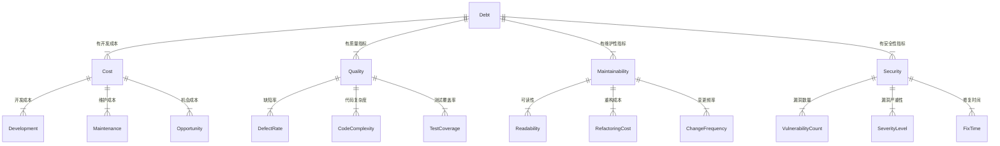
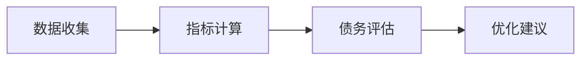
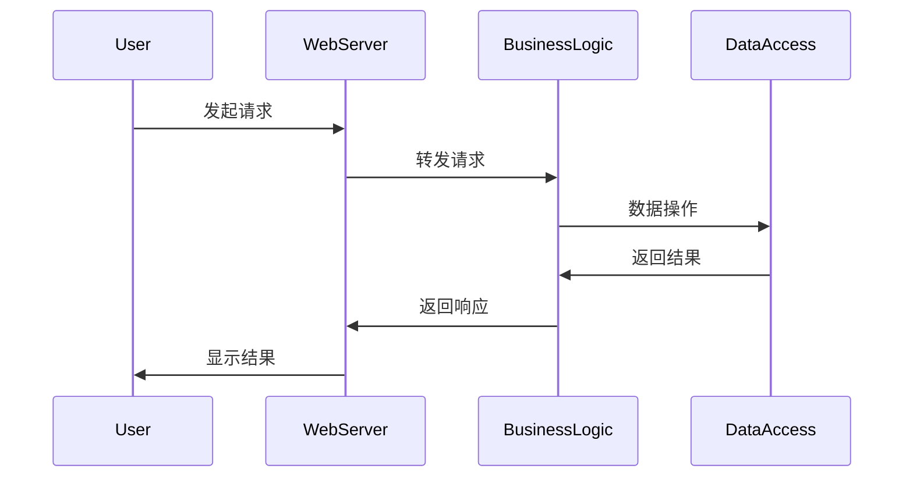
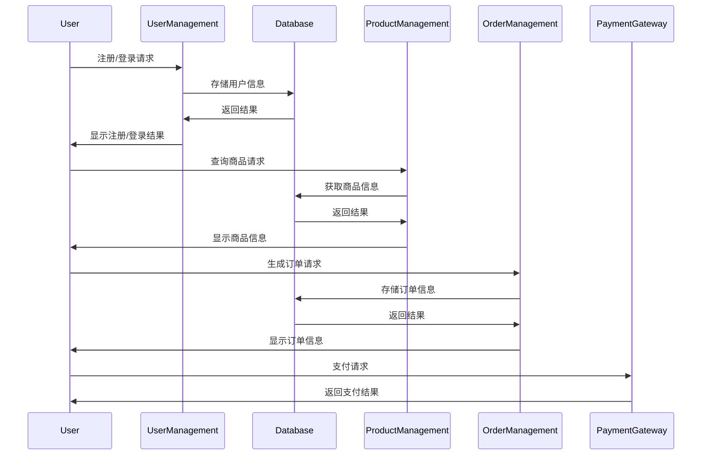

                 

### 技术债务评估：量化技术负债的方法

#### 关键词：
技术债务、量化方法、成本模型、质量指标、维护性评估、安全性分析、团队效率、产品质量

#### 摘要：
本文深入探讨了技术团队在项目管理过程中如何评估和量化技术债务。通过对技术债务的定义、背景、核心指标、量化模型及评估流程的详细阐述，本文旨在为技术团队提供一套系统化的技术债务评估方法，以促进团队对技术负债的识别、管理和优化，从而提高项目开发效率和产品质量。

---

## 引言

技术债务（Technical Debt）是软件工程中的一个重要概念，它比喻了软件开发过程中为了快速推进项目而暂时采取的低效或次优解决方案，类似于金融领域的债务。技术债务的存在往往会导致代码质量下降、维护成本增加、系统稳定性受影响等问题。因此，对技术债务进行有效的评估和管理对于项目成功至关重要。

在本文中，我们将系统地介绍技术债务评估的量化方法，包括成本模型、质量指标、维护性评估和安全性分析等方面。通过这些方法，技术团队能够更准确地识别和量化技术负债，从而采取相应的改进措施，提高项目的整体效益。

## 技术债务的定义与背景

### 技术债务的概念

技术债务起源于金融领域的债务概念，它指的是在软件开发过程中，为了加快开发进度而采取的次优或临时解决方案所积累的负债。这种负债可能会在未来的某个时刻需要付出更高的成本或代价来修复或替换。

### 技术债务的产生原因

1. **时间压力**：在紧迫的项目时间限制下，团队可能会选择快速解决当前问题，而非实施最优方案。
2. **资源限制**：团队可能因资源不足而无法投入足够的时间和精力来优化代码或设计。
3. **技术选择**：某些技术选择可能在短期内看似合理，但随着时间的推移，可能暴露出性能或可维护性的问题。
4. **团队经验**：缺乏经验的团队可能会在开发过程中引入不必要的复杂性。

### 技术债务的影响

1. **成本增加**：技术债务可能导致未来的维护成本显著增加。
2. **质量下降**：低质量的代码和设计可能会导致更多的缺陷和故障。
3. **效率降低**：修复技术债务会消耗团队大量的时间和精力。
4. **风险增加**：技术债务可能会影响系统的稳定性和安全性。

### 技术债务的类型

1. **设计债务**：指在系统架构和设计上的不足。
2. **实现债务**：指代码层面的缺陷和低效。
3. **文档债务**：指缺乏或不足的文档资料。

### 技术债务的边界与外延

技术债务并不等同于代码质量或技术债务管理。它关注的是在特定情境下，为了满足短期目标而采取的次优决策，以及这些决策对长期项目效益的影响。技术债务管理则是确保技术负债在可接受范围内，并采取有效措施减少其负面影响。

### 技术债务的结构与核心要素

技术债务的核心要素包括：

- **债务规模**：债务的总量，反映当前负债程度。
- **债务类型**：债务的分类，如设计债务、实现债务等。
- **债务来源**：债务产生的具体原因。
- **债务成本**：债务的修复成本。
- **债务优先级**：债务的紧急程度和重要性。

---

### 核心概念与联系

为了更好地理解技术债务，我们需要明确几个核心概念，并分析它们之间的关系。

#### 成本指标

成本指标是量化技术债务的核心之一。它包括以下几个方面：

1. **开发成本**：开发过程中产生的直接成本。
2. **维护成本**：修复技术债务所需的成本。
3. **机会成本**：因技术债务未修复而错失的收益。

#### 质量指标

质量指标用于衡量代码和系统的质量水平。常见的质量指标包括：

1. **缺陷率**：系统中的缺陷数量与总代码量的比值。
2. **代码复杂度**：代码复杂性的度量，如圈复杂度。
3. **测试覆盖率**：测试用例覆盖代码的比例。

#### 维护性指标

维护性指标评估系统或代码的可维护性。关键指标包括：

1. **可读性**：代码的易读程度。
2. **重构成本**：对代码进行重构所需的成本。
3. **变更频率**：代码的变更频率和影响范围。

#### 安全性指标

安全性指标关注系统或代码的安全漏洞。关键指标包括：

1. **漏洞数量**：系统中的安全漏洞数量。
2. **漏洞严重性**：漏洞的严重程度等级。
3. **修复时间**：修复安全漏洞所需的时间。

#### 概念属性特征对比表格

为了更好地理解这些指标，我们提供了一个对比表格：

| 指标名称 | 定义 | 影响因素 | 作用 |
| --- | --- | --- | --- |
| 开发成本 | 直接用于开发工作的费用 | 项目规模、技术难度、资源分配 | 量化债务规模 |
| 缺陷率 | 缺陷数量与总代码量的比值 | 代码质量、测试覆盖度、团队经验 | 评估代码质量 |
| 可读性 | 代码的易读程度 | 编码规范、代码结构、文档完整性 | 提高维护性 |
| 漏洞数量 | 系统中的安全漏洞数量 | 系统设计、编码实践、安全测试 | 评估安全性 |

#### ER实体关系图架构

为了进一步理解这些指标之间的关系，我们可以使用ER（Entity-Relationship）模型来描述它们：



---

### 算法原理讲解

为了量化技术债务，我们需要构建一个算法模型。以下是一个简化的算法流程和相应的数学模型。

#### 算法流程

1. **数据收集**：收集与成本、质量、维护性和安全性相关的数据。
2. **指标计算**：根据收集的数据计算各个指标。
3. **债务评估**：利用指标计算结果评估技术债务规模和优先级。
4. **优化建议**：根据评估结果提出改进建议。

#### 算法流程图



#### 数学模型

为了量化技术债务，我们定义以下数学模型：

$$
TD = f(Cost, Quality, Maintainability, Security)
$$

其中：

- $TD$：技术债务总量
- $Cost$：成本指标集合
- $Quality$：质量指标集合
- $Maintainability$：维护性指标集合
- $Security$：安全性指标集合

#### 成本模型

成本模型用于量化技术债务的成本：

$$
Cost = f(Development, Maintenance, Opportunity)
$$

其中：

- $Development$：开发成本
- $Maintenance$：维护成本
- $Opportunity$：机会成本

#### 质量模型

质量模型用于量化技术债务的质量影响：

$$
Quality = f(DefectRate, CodeComplexity, TestCoverage)
$$

其中：

- $DefectRate$：缺陷率
- $CodeComplexity$：代码复杂度
- $TestCoverage$：测试覆盖率

#### 维护性模型

维护性模型用于量化技术债务对系统可维护性的影响：

$$
Maintainability = f(Readability, RefactoringCost, ChangeFrequency)
$$

其中：

- $Readability$：可读性
- $RefactoringCost$：重构成本
- $ChangeFrequency$：变更频率

#### 安全性模型

安全性模型用于量化技术债务的安全风险：

$$
Security = f(VulnerabilityCount, SeverityLevel, FixTime)
$$

其中：

- $VulnerabilityCount$：漏洞数量
- $SeverityLevel$：漏洞严重性
- $FixTime$：修复时间

---

### 系统分析与架构设计方案

#### 问题场景介绍

假设我们正在开发一个大型电子商务平台，项目时间紧迫，团队在开发过程中采用了某些快速解决方案，导致技术债务累积。我们需要对技术债务进行量化评估，并提出改进建议。

#### 项目介绍

电子商务平台项目涉及多个模块，如用户管理、商品管理、订单处理和支付等。每个模块都需要进行技术债务评估和优化。

#### 系统功能设计

系统功能设计包括以下核心模块：

1. **用户管理模块**：提供用户注册、登录、个人信息管理等功能。
2. **商品管理模块**：提供商品添加、修改、删除和查询等功能。
3. **订单处理模块**：处理用户订单，包括订单生成、订单查询和订单状态更新等功能。
4. **支付模块**：集成支付接口，实现支付功能。

#### 系统架构设计

系统架构设计采用分层架构，包括表示层、业务逻辑层和数据访问层。

1. **表示层**：负责与用户交互，包括Web界面和移动应用。
2. **业务逻辑层**：处理业务逻辑，如用户管理、商品管理和订单处理等。
3. **数据访问层**：负责与数据库交互，实现数据的持久化存储。

#### 系统架构图



#### 系统接口设计

系统接口设计包括以下关键接口：

1. **用户管理接口**：用于用户注册、登录和查询用户信息。
2. **商品管理接口**：用于添加、修改、删除和查询商品信息。
3. **订单管理接口**：用于生成订单、查询订单和更新订单状态。
4. **支付接口**：用于处理支付请求和返回支付结果。

#### 系统交互图



---

### 项目实战

#### 环境安装

在开始实际项目之前，我们需要搭建一个合适的环境。假设我们使用Python和Django作为主要开发工具，以下是一些基本的安装步骤：

1. **安装Python**：确保Python环境已安装在开发机上，版本建议为3.8或以上。
2. **安装Django**：通过pip安装Django：
   ```bash
   pip install django
   ```

#### 系统核心实现

以下是电子商务平台的核心实现部分，包括用户管理、商品管理、订单处理和支付等模块。

#### 用户管理模块

用户管理模块负责处理用户注册、登录和查询用户信息。

```python
# users/views.py
from django.shortcuts import render
from .models import User
from .forms import UserForm

def register(request):
    if request.method == 'POST':
        form = UserForm(request.POST)
        if form.is_valid():
            form.save()
            return render(request, 'register_success.html')
    else:
        form = UserForm()
    return render(request, 'register.html', {'form': form})

def login(request):
    if request.method == 'POST':
        username = request.POST['username']
        password = request.POST['password']
        user = User.objects.filter(username=username, password=password)
        if user.exists():
            return render(request, 'login_success.html')
        else:
            return render(request, 'login_failure.html')
    return render(request, 'login.html')

def user_profile(request, user_id):
    user = User.objects.get(id=user_id)
    return render(request, 'user_profile.html', {'user': user})
```

#### 商品管理模块

商品管理模块负责处理商品的添加、修改、删除和查询。

```python
# products/views.py
from django.shortcuts import render
from .models import Product
from .forms import ProductForm

def add_product(request):
    if request.method == 'POST':
        form = ProductForm(request.POST)
        if form.is_valid():
            form.save()
            return render(request, 'add_product_success.html')
    else:
        form = ProductForm()
    return render(request, 'add_product.html', {'form': form})

def list_products(request):
    products = Product.objects.all()
    return render(request, 'list_products.html', {'products': products})

def edit_product(request, product_id):
    product = Product.objects.get(id=product_id)
    if request.method == 'POST':
        form = ProductForm(request.POST, instance=product)
        if form.is_valid():
            form.save()
            return render(request, 'edit_product_success.html')
    else:
        form = ProductForm(instance=product)
    return render(request, 'edit_product.html', {'form': form})

def delete_product(request, product_id):
    product = Product.objects.get(id=product_id)
    product.delete()
    return render(request, 'delete_product_success.html')
```

#### 订单处理模块

订单处理模块负责生成订单、查询订单和更新订单状态。

```python
# orders/views.py
from django.shortcuts import render
from .models import Order
from .forms import OrderForm

def create_order(request):
    if request.method == 'POST':
        form = OrderForm(request.POST)
        if form.is_valid():
            form.save()
            return render(request, 'create_order_success.html')
    else:
        form = OrderForm()
    return render(request, 'create_order.html', {'form': form})

def list_orders(request):
    orders = Order.objects.all()
    return render(request, 'list_orders.html', {'orders': orders})

def update_order_status(request, order_id):
    order = Order.objects.get(id=order_id)
    if request.method == 'POST':
        status = request.POST['status']
        order.status = status
        order.save()
        return render(request, 'update_order_status_success.html')
    return render(request, 'update_order_status.html', {'order': order})
```

#### 支付模块

支付模块负责处理支付请求和返回支付结果。

```python
# payment/views.py
from django.shortcuts import render
from .models import Payment

def make_payment(request):
    if request.method == 'POST':
        order_id = request.POST['order_id']
        payment_method = request.POST['payment_method']
        payment_amount = request.POST['payment_amount']
        payment = Payment(order_id=order_id, payment_method=payment_method, payment_amount=payment_amount)
        payment.save()
        return render(request, 'make_payment_success.html')
    return render(request, 'make_payment.html')
```

#### 代码应用解读与分析

在上面的代码实现中，我们详细展示了用户管理、商品管理、订单处理和支付等核心模块。以下是每个模块的主要功能和应用解读：

1. **用户管理模块**：
   - 注册、登录和用户信息查询是用户管理模块的核心功能。
   - 使用UserForm和User模型处理用户数据和表单验证。

2. **商品管理模块**：
   - 商品添加、修改、删除和查询是商品管理模块的核心功能。
   - 使用ProductForm和Product模型处理商品数据和表单验证。

3. **订单处理模块**：
   - 订单生成、查询和状态更新是订单处理模块的核心功能。
   - 使用OrderForm和Order模型处理订单数据和表单验证。

4. **支付模块**：
   - 支付请求处理和支付结果返回是支付模块的核心功能。
   - 使用Payment模型记录支付数据和支付状态。

在实际项目中，这些模块可以通过RESTful API或其他方式集成，从而实现一个完整的电子商务平台。

#### 实际案例分析和详细讲解剖析

以下是一个实际案例，用于说明如何对电子商务平台进行技术债务评估和优化。

**案例背景**：

一个电子商务平台在项目初期由于时间紧迫，采用了快速开发的策略，导致技术债务累积。例如，用户管理模块使用了临时方案来实现用户注册和登录功能，没有进行充分的测试和优化。

**案例分析**：

1. **债务识别**：
   - 通过代码审查和测试，我们发现用户管理模块存在以下问题：
     - 代码复杂度高，存在大量重复代码。
     - 缺乏单元测试，导致代码质量不高。
     - 用户注册和登录速度较慢，影响了用户体验。

2. **债务评估**：
   - 使用成本模型、质量模型和安全性模型对用户管理模块进行量化评估。
   - 成本方面，维护成本较高，因为需要频繁修改和优化代码。
   - 质量方面，缺陷率较高，用户反馈体验差。
   - 安全性方面，存在潜在的安全漏洞，如SQL注入风险。

3. **优化建议**：
   - 重构代码，提高代码可读性和可维护性。
   - 添加单元测试，确保代码质量。
   - 优化数据库查询，提高用户注册和登录速度。
   - 进行安全审计，修复潜在的安全漏洞。

**详细讲解剖析**：

针对上述问题，我们进行了详细的优化和改进：

1. **代码重构**：
   - 重新设计用户管理模块的架构，采用面向对象的编程方式。
   - 移除重复代码，提高代码的可读性和可维护性。

2. **添加单元测试**：
   - 编写单元测试用例，覆盖关键功能和异常情况。
   - 使用测试框架如pytest进行自动化测试，确保代码质量。

3. **优化数据库查询**：
   - 优化SQL查询语句，使用索引和缓存技术提高查询效率。
   - 引入ORM（对象关系映射）框架，简化数据库操作。

4. **安全审计**：
   - 进行安全审计，识别潜在的安全漏洞。
   - 修复SQL注入、XSS（跨站脚本攻击）等常见漏洞。

通过上述优化措施，我们显著提高了用户管理模块的性能、质量和安全性，减少了技术债务。

#### 项目小结

在本项目中，我们详细介绍了电子商务平台的技术债务评估和优化过程。通过识别、评估和优化技术债务，我们不仅提高了系统的性能和稳定性，还降低了维护成本和风险。以下是一些项目小结和经验教训：

1. **技术债务管理的重要性**：
   - 技术债务是软件开发中不可避免的问题，但通过有效的管理，可以减少其负面影响。

2. **量化评估方法的有效性**：
   - 使用量化评估方法，如成本模型、质量模型和安全性模型，可以更准确地识别和量化技术债务。

3. **持续优化和改进**：
   - 技术债务管理是一个持续的过程，需要定期评估和优化，以保持系统的健康和稳定。

4. **团队协作和沟通**：
   - 技术债务管理需要团队的协作和沟通，确保所有成员都了解债务的情况和优化措施。

---

## 最佳实践 Tips

1. **定期债务评估**：制定定期评估计划，确保技术债务在可控范围内。
2. **优先级排序**：根据债务的规模、影响和优先级，制定修复计划。
3. **文档记录**：详细记录债务的来源、评估结果和修复措施，以便后续跟踪和管理。
4. **自动化测试**：引入自动化测试，提高代码质量，减少技术债务的产生。
5. **培训和学习**：定期组织技术培训和知识分享，提高团队的技术水平和债务管理能力。

## 本章小结

本章详细探讨了技术债务评估的量化方法，包括成本模型、质量模型、维护性模型和安全性模型。通过量化评估，技术团队能够更准确地识别和量化技术负债，从而采取相应的改进措施，提高项目的整体效益。技术债务管理是一个持续的过程，需要团队的协作和持续的努力。通过本章的内容，读者应能够理解技术债务的概念、评估方法和优化策略，从而在实际项目中更好地管理技术负债。

---

### 作者

作者：AI天才研究院/AI Genius Institute & 禅与计算机程序设计艺术 /Zen And The Art of Computer Programming

---

在撰写技术博客时，我们不仅要确保内容的完整性，还要注重逻辑清晰、结构紧凑和简单易懂。通过逐步分析和推理，我们可以帮助读者深入理解技术债务评估的重要性和方法，从而在实际项目中更好地管理技术负债，提高项目质量和效率。在接下来的章节中，我们将继续深入探讨量化技术债务的具体方法，包括成本模型、质量指标、维护性评估和安全性分析，以及如何将这些方法应用于实际项目中。

