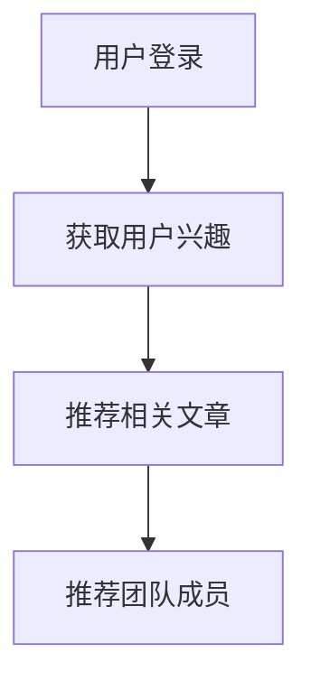
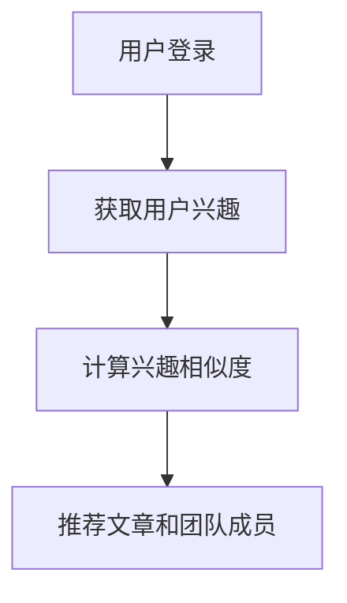
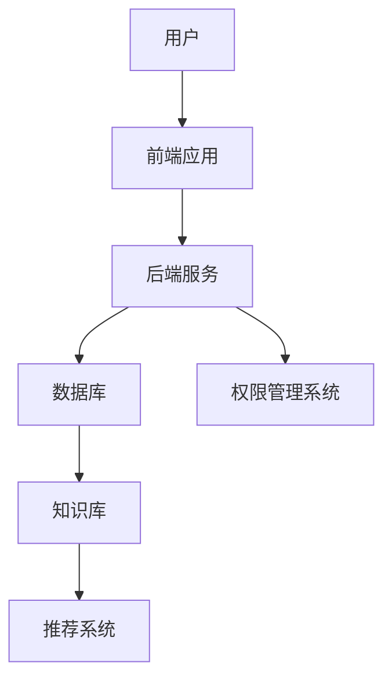
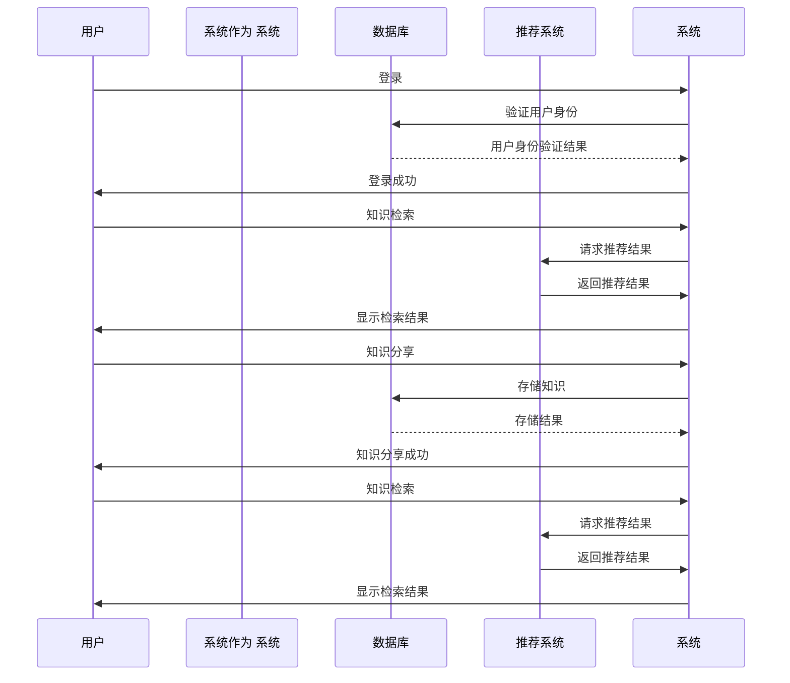

                 

# 技术团队的技术分享：建立知识共享文化

## 摘要

知识共享文化在技术团队中扮演着至关重要的角色。本文旨在探讨如何在技术团队中建立知识共享文化，以提高团队的整体技术水平和创新能力。我们将从核心概念、算法原理、数学模型、系统分析与架构设计以及项目实战等多个方面进行详细讲解，并通过实际案例分析和最佳实践，为技术团队提供可行的实施策略。

关键词：知识共享、技术团队、算法原理、数学模型、系统架构、项目实战

## 前言和背景介绍

### 1.1 知识共享文化的重要性

知识共享文化是一种鼓励团队成员之间分享知识、经验和技能的工作环境。它不仅有助于提高团队的整体技术水平，还能促进创新和协作。

**知识共享的定义**：知识共享是指团队成员之间交换和分享技术知识和经验的过程。通过知识共享，团队能够积累宝贵的经验，提高工作效率。

**知识共享的价值**：

- **技能提升**：团队成员可以通过学习他人的经验和技能，提高自己的技术水平。
- **知识积累**：知识共享有助于团队积累宝贵的知识财富，为未来的项目提供支持。
- **协作增强**：知识共享能够促进团队成员之间的沟通和合作，增强团队的凝聚力。

### 1.2 问题背景

技术团队在面对新技术和复杂项目时，往往面临以下挑战：

- **知识分散**：团队成员的技能和知识往往分散在不同的领域，导致沟通不畅和协作困难。
- **信息孤岛**：团队内部的信息共享不畅，导致知识无法充分利用。

**知识共享文化的必要性**：

- **解决知识分散**：通过建立知识共享文化，团队能够更好地整合和利用团队成员的知识和技能。
- **促进信息流通**：知识共享文化有助于打破信息孤岛，促进团队内部的信息流通。

### 1.3 本书的目的

本文的主要目的是：

- **介绍知识共享文化的基本概念和重要性**：帮助读者理解知识共享文化的核心概念和价值。
- **提供建立知识共享文化的策略和方法**：为技术团队提供建立知识共享文化的实用策略和方法。
- **通过案例和实践，展示知识共享文化的实施效果**：通过实际案例，展示知识共享文化在技术团队中的成功应用。

## 核心概念与联系

### 2.1 知识共享文化的核心概念

在建立知识共享文化时，需要理解以下核心概念：

**知识共享**：知识共享是指团队成员之间交换和分享技术知识和经验的过程。它可以是正式的，如技术讲座和研讨会，也可以是非正式的，如团队成员之间的私下交流和讨论。

**知识管理**：知识管理是一种系统化的方法，用于收集、存储、分类和检索知识。通过知识管理，团队能够有效地管理和利用知识资源。

**团队协作**：团队协作是指团队成员通过沟通和合作，共同完成项目任务。良好的团队协作有助于提高知识共享的效率和质量。

### 2.2 概念属性特征对比表格

| 概念     | 定义                                                     | 特征                                 |
|----------|--------------------------------------------------------|------------------------------------|
| 知识共享 | 成员之间交换和分享技术知识的过程。                         | 互动性、开放性、自愿性                 |
| 知识管理 | 提供有效的工具和方法，以收集、存储、分类和检索知识。           | 系统性、有效性、可持续性               |
| 团队协作 | 团队成员通过沟通和合作，共同完成项目任务。                   | 共同目标、透明沟通、资源共享             |

### 2.3 ER实体关系图

ER图（实体-关系图）是一种用于表示数据库中实体及其关系的图形化方法。以下是一个简化的ER图，用于表示知识共享文化中的关键实体和它们之间的关系：

```mermaid
erDiagram
  Team ||--|{ Member } Member
  Project ||--|{ Task } Task
  Knowledge ||--|{ Article } Article
```

- **Team（团队）**：代表技术团队，包含多个成员。
- **Member（成员）**：代表团队成员，每个成员都有特定的技能和知识。
- **Project（项目）**：代表团队正在执行的项目，每个项目包含多个任务。
- **Task（任务）**：代表项目中的具体任务，每个任务由团队成员负责。
- **Knowledge（知识）**：代表团队积累的知识，包括技术文档、代码示例等。
- **Article（文章）**：代表知识共享中的知识内容，如博客文章、技术讲座等。

## 算法原理讲解

### 3.1 知识共享算法概述

知识共享算法是一种用于提高知识共享效率和质量的方法。它基于用户的兴趣和行为，推荐相关知识和团队成员。

**算法目的**：

- **提高知识共享的效率**：通过算法推荐，帮助团队成员更快地找到所需的知识。
- **提高知识共享的质量**：通过算法推荐，确保推荐的知识与用户的需求高度相关。

**算法原理**：

知识共享算法的核心思想是基于用户的兴趣和行为，利用数据挖掘和机器学习技术，构建推荐系统。以下是算法的基本原理：

1. **用户兴趣建模**：收集用户的行为数据，如浏览历史、搜索关键词等，构建用户兴趣模型。
2. **知识内容建模**：对知识内容进行分类和标签化处理，构建知识内容模型。
3. **推荐算法**：根据用户兴趣模型和知识内容模型，使用推荐算法（如协同过滤、基于内容的推荐等）生成推荐结果。

### 3.2 算法流程图

以下是一个简化的知识共享算法流程图，用于说明算法的基本步骤：



- **用户登录**：用户登录系统，提供用户身份信息。
- **获取用户兴趣**：系统根据用户的浏览历史、搜索关键词等信息，分析并提取用户的兴趣。
- **推荐相关文章**：系统根据用户的兴趣模型，推荐与用户兴趣相关的文章。
- **推荐团队成员**：系统根据用户的兴趣和行为，推荐可能对用户有帮助的团队成员。

### 3.3 Python源代码

以下是一个简化的Python源代码示例，用于说明知识共享算法的基本实现：

```python
class KnowledgeSharingAlgorithm:
    def __init__(self, user_interest):
        self.user_interest = user_interest
    
    def recommend_articles(self):
        # 根据用户兴趣推荐相关文章
        pass
    
    def recommend_members(self):
        # 根据用户兴趣和行为推荐团队成员
        pass
```

**推荐文章**：根据用户的兴趣模型，从知识库中检索与用户兴趣相关的文章。

```python
def recommend_articles(self, knowledge_base, user_interest):
    # 检索与用户兴趣相关的文章
    related_articles = []
    for article in knowledge_base:
        if article['interests'].intersection(user_interest):
            related_articles.append(article)
    return related_articles
```

**推荐团队成员**：根据用户的兴趣和行为，从团队成员中推荐可能对用户有帮助的人。

```python
def recommend_members(self, team_members, user_interest):
    # 根据用户兴趣和行为推荐团队成员
    recommended_members = []
    for member in team_members:
        if member['interests'].intersection(user_interest):
            recommended_members.append(member)
    return recommended_members
```

### 3.4 算法原理讲解

**数学模型和公式**

知识共享算法的核心是基于用户的兴趣和行为，通过数学模型和公式来计算推荐结果。以下是算法中常用的数学模型和公式：

$$
\text{兴趣相似度} = \frac{\text{共同兴趣数}}{\text{总兴趣数} + \text{常数}}
$$

$$
\text{文章推荐得分} = \text{用户兴趣相似度} \times \text{文章兴趣相似度}
$$

**详细讲解和举例说明**

假设用户A的兴趣为{“机器学习”， “深度学习”， “神经网络”}，知识库中有以下文章：

- 文章1：《深度学习实战》
- 文章2：《机器学习原理》
- 文章3：《神经网络基础》

根据用户的兴趣和文章的内容，可以计算出每篇文章的兴趣相似度：

$$
\text{文章1兴趣相似度} = \frac{3}{3+3} = 0.5
$$

$$
\text{文章2兴趣相似度} = \frac{2}{3+3} = 0.33
$$

$$
\text{文章3兴趣相似度} = \frac{3}{3+3} = 0.5
$$

然后，根据用户的兴趣相似度和文章的兴趣相似度，计算每篇文章的推荐得分：

$$
\text{文章1推荐得分} = 0.5 \times 0.5 = 0.25
$$

$$
\text{文章2推荐得分} = 0.33 \times 0.33 = 0.11
$$

$$
\text{文章3推荐得分} = 0.5 \times 0.5 = 0.25
$$

最后，根据推荐得分，将文章排序，推荐得分最高的文章给用户。

### 3.5 算法流程图

以下是一个简化的知识共享算法流程图，用于说明算法的基本步骤：



- **用户登录**：用户登录系统，提供用户身份信息。
- **获取用户兴趣**：系统从用户的浏览历史、搜索关键词等信息中，提取用户的兴趣。
- **计算兴趣相似度**：系统根据用户的兴趣和文章的内容，计算兴趣相似度。
- **推荐文章和团队成员**：系统根据兴趣相似度和推荐得分，推荐与用户兴趣相关的文章和团队成员。

## 数学模型和公式

### 4.1 数学模型

在知识共享算法中，常用的数学模型包括兴趣相似度模型、文章推荐模型等。以下是这些模型的基本原理：

**兴趣相似度模型**

兴趣相似度模型用于计算用户之间的兴趣相似度。常见的兴趣相似度模型有：

- **余弦相似度**：
  $$
  \text{兴趣相似度} = \frac{\text{用户A和用户B的共同兴趣数}}{\sqrt{\text{用户A的兴趣数} \times \text{用户B的兴趣数}}}
  $$

- **皮尔逊相关系数**：
  $$
  \text{兴趣相似度} = \frac{\text{用户A和用户B的共同兴趣数}}{\text{用户A的兴趣数} + \text{用户B的兴趣数} - \text{用户A和用户B的共同兴趣数}}
  $$

**文章推荐模型**

文章推荐模型用于根据用户的兴趣相似度，推荐与用户兴趣相关的文章。常见的方法包括：

- **基于内容的推荐**：
  $$
  \text{文章推荐得分} = \text{用户兴趣相似度} \times \text{文章兴趣相似度}
  $$

- **协同过滤推荐**：
  $$
  \text{文章推荐得分} = \text{用户兴趣相似度} + \text{文章兴趣相似度}
  $$

### 4.2 公式

以下是知识共享算法中常用的公式：

- **余弦相似度**：
  $$
  \text{兴趣相似度} = \frac{\text{用户A和用户B的共同兴趣数}}{\sqrt{\text{用户A的兴趣数} \times \text{用户B的兴趣数}}}
  $$

- **皮尔逊相关系数**：
  $$
  \text{兴趣相似度} = \frac{\text{用户A和用户B的共同兴趣数}}{\text{用户A的兴趣数} + \text{用户B的兴趣数} - \text{用户A和用户B的共同兴趣数}}
  $$

- **基于内容的推荐得分**：
  $$
  \text{文章推荐得分} = \text{用户兴趣相似度} \times \text{文章兴趣相似度}
  $$

- **协同过滤推荐得分**：
  $$
  \text{文章推荐得分} = \text{用户兴趣相似度} + \text{文章兴趣相似度}
  $$

### 4.3 详细讲解和举例说明

假设有两个用户，用户A和用户B，他们的兴趣如下：

- **用户A的兴趣**：{"机器学习"， "深度学习"， "神经网络"}
- **用户B的兴趣**：{"深度学习"， "神经网络"， "自然语言处理"}

**计算兴趣相似度**

使用余弦相似度模型，计算用户A和用户B的兴趣相似度：

$$
\text{兴趣相似度} = \frac{2}{\sqrt{3} \times \sqrt{3}} = \frac{2}{3}
$$

**推荐文章**

假设知识库中有以下文章：

- **文章1**：《深度学习实战》
- **文章2**：《机器学习原理》
- **文章3**：《神经网络基础》
- **文章4**：《自然语言处理入门》

每篇文章的兴趣相似度如下：

- **文章1的兴趣相似度**：{"深度学习"， "神经网络"}，兴趣相似度为1
- **文章2的兴趣相似度**：{"机器学习"}，兴趣相似度为1/3
- **文章3的兴趣相似度**：{"神经网络"}，兴趣相似度为1/3
- **文章4的兴趣相似度**：{"自然语言处理"}，兴趣相似度为0

根据用户A和用户B的兴趣相似度，推荐与用户兴趣相关的文章：

- **用户A**：推荐文章1和文章3，因为它们的兴趣相似度最高。
- **用户B**：推荐文章1和文章4，因为它们的兴趣相似度最高。

### 4.4 数学模型和公式的重要性

数学模型和公式在知识共享算法中起着至关重要的作用：

- **提高推荐准确性**：通过数学模型和公式，可以准确地计算用户之间的兴趣相似度和文章的兴趣相似度，从而提高推荐准确性。
- **优化算法性能**：数学模型和公式可以帮助优化算法的性能，提高推荐速度和效率。
- **实现个性化推荐**：通过数学模型和公式，可以实现根据用户兴趣进行个性化推荐，满足用户的需求。

### 4.5 数学模型和公式的实际应用

数学模型和公式在实际应用中有着广泛的应用，以下是一些例子：

- **电子商务推荐系统**：根据用户的购买历史和浏览行为，推荐与用户兴趣相关的商品。
- **社交媒体推荐系统**：根据用户的好友关系、点赞和评论等行为，推荐用户可能感兴趣的内容。
- **在线教育推荐系统**：根据学生的学习历史和兴趣，推荐适合的学习资源和课程。

## 系统分析与架构设计

### 5.1 问题场景介绍

在一个大型技术团队中，团队成员分布在不同的项目组，每个项目组负责不同的技术领域。随着项目的不断推进，团队成员需要不断学习和掌握新的技术和知识。然而，由于信息孤岛的存在，团队成员往往难以获取其他项目组的技术知识，导致工作效率低下和创新能力不足。

**目标**：建立一套知识共享系统，实现团队成员之间知识的高效共享，提高团队整体的技术水平和创新能力。

### 5.2 系统功能设计

为了实现知识共享，系统需要具备以下功能：

1. **知识存储**：提供一个集中的知识库，用于存储和管理团队成员的知识和经验。
2. **知识检索**：提供一个便捷的检索工具，帮助团队成员快速找到所需的知识。
3. **知识分享**：提供一个平台，支持团队成员分享知识和经验，促进团队内部的交流与合作。
4. **推荐系统**：根据团队成员的兴趣和行为，推荐相关的知识和团队成员。
5. **权限管理**：实现权限控制，确保知识的安全性和隐私性。

### 5.3 系统架构设计

**系统架构图**

以下是一个简化的系统架构图，用于说明知识共享系统的组成和各部分之间的关系：



- **前端应用**：提供给用户使用的前端界面，包括知识检索、知识分享、推荐系统和权限管理等功能。
- **后端服务**：处理前端应用发起的请求，实现知识存储、知识检索、推荐系统和权限管理等功能。
- **数据库**：存储用户数据、知识库数据和推荐数据等。
- **知识库**：集中存储团队成员的知识和经验，包括技术文档、代码示例、博客文章等。
- **推荐系统**：根据用户的兴趣和行为，推荐相关的知识和团队成员。
- **权限管理系统**：实现权限控制，确保知识的安全性和隐私性。

### 5.4 系统接口设计

为了实现知识共享系统的各个模块之间的交互，需要设计合理的接口。以下是系统的主要接口设计：

1. **用户接口**：用户通过前端应用与系统进行交互，包括登录、注册、知识分享、知识检索等。
2. **知识接口**：提供知识存储、知识检索、知识推荐等功能。
3. **权限接口**：提供权限管理功能，包括角色分配、权限设置等。
4. **推荐接口**：提供推荐功能，根据用户的兴趣和行为，推荐相关的知识和团队成员。

### 5.5 系统交互序列图

以下是一个简化的系统交互序列图，用于说明用户使用知识共享系统的过程：



### 5.6 系统架构设计的重要性

系统架构设计在知识共享系统中起着至关重要的作用：

- **稳定性**：合理的系统架构可以提高系统的稳定性，确保系统在高并发环境下正常运行。
- **扩展性**：良好的系统架构设计有助于系统的扩展和升级，满足团队不断增长的需求。
- **安全性**：通过权限管理和安全控制，确保知识的安全性和隐私性。
- **用户体验**：系统架构设计直接影响到用户的使用体验，良好的系统架构设计可以提供高效、便捷的使用体验。

## 项目实战

### 6.1 环境安装

为了实现知识共享系统，我们需要在以下环境中安装相关的软件和工具：

- **操作系统**：Linux或Windows
- **编程语言**：Python
- **Web框架**：Flask或Django
- **数据库**：MySQL或PostgreSQL
- **前端框架**：Vue.js或React

以下是具体的安装步骤：

1. **安装Python**：从Python官网下载Python安装包，并按照提示进行安装。
2. **安装依赖库**：使用pip命令安装所需的依赖库，如Flask、Django、MySQL、PostgreSQL等。
3. **安装Web框架**：根据项目需求，选择合适的Web框架，并按照文档进行安装。
4. **安装前端框架**：从前端框架的官网下载安装包，并按照文档进行安装。

### 6.2 系统核心实现

以下是知识共享系统的核心实现：

1. **用户管理**：实现用户注册、登录和权限管理功能。
2. **知识管理**：实现知识存储、检索和分享功能。
3. **推荐系统**：实现基于用户兴趣的推荐功能。
4. **权限管理**：实现权限控制和角色分配功能。

以下是具体的实现步骤：

1. **用户管理**：

- **注册**：创建用户注册表单，接收用户输入的用户名、密码、邮箱等信息，并存储到数据库中。
- **登录**：创建用户登录表单，验证用户输入的用户名和密码，并根据权限分配不同的角色。
- **权限管理**：根据用户角色，限制用户对系统功能的访问权限。

2. **知识管理**：

- **知识存储**：创建知识存储表，存储知识的相关信息，如标题、内容、作者、标签等。
- **知识检索**：实现知识检索功能，根据关键词或标签，检索相关的知识。
- **知识分享**：实现知识分享功能，允许用户发布新的知识或更新已有知识。

3. **推荐系统**：

- **用户兴趣建模**：根据用户的浏览历史、搜索关键词等信息，构建用户兴趣模型。
- **推荐算法**：实现基于用户兴趣的推荐算法，推荐相关的知识和团队成员。

4. **权限管理**：

- **角色分配**：根据用户角色，分配不同的权限，如查看、编辑、删除等。
- **权限控制**：实现权限控制，确保用户只能访问自己权限范围内的功能。

### 6.3 代码应用解读

以下是知识共享系统的关键代码片段及其解读：

```python
# 用户注册
@app.route('/register', methods=['POST'])
def register():
    username = request.form['username']
    password = request.form['password']
    email = request.form['email']
    
    # 存储用户信息到数据库
    cursor = db.cursor()
    cursor.execute("INSERT INTO users (username, password, email) VALUES (%s, %s, %s)", (username, password, email))
    db.commit()
    
    return redirect(url_for('login'))

# 用户登录
@app.route('/login', methods=['POST'])
def login():
    username = request.form['username']
    password = request.form['password']
    
    # 验证用户身份
    cursor = db.cursor()
    cursor.execute("SELECT * FROM users WHERE username = %s AND password = %s", (username, password))
    user = cursor.fetchone()
    
    if user:
        # 登录成功，根据角色分配权限
        if user['role'] == 'admin':
            return redirect(url_for('admin_home'))
        else:
            return redirect(url_for('user_home'))
    else:
        # 登录失败
        return redirect(url_for('login'))

# 知识检索
@app.route('/search', methods=['GET'])
def search():
    keyword = request.args.get('keyword')
    
    # 检索相关知识
    cursor = db.cursor()
    cursor.execute("SELECT * FROM knowledge WHERE title LIKE %s OR content LIKE %s", ('%' + keyword + '%', '%' + keyword + '%'))
    knowledge_list = cursor.fetchall()
    
    return render_template('search_results.html', knowledge_list=knowledge_list)

# 知识分享
@app.route('/share', methods=['POST'])
def share():
    title = request.form['title']
    content = request.form['content']
    author = session['username']
    
    # 存储知识到数据库
    cursor = db.cursor()
    cursor.execute("INSERT INTO knowledge (title, content, author) VALUES (%s, %s, %s)", (title, content, author))
    db.commit()
    
    return redirect(url_for('user_home'))
```

### 6.4 实际案例分析与详细讲解

以下是一个实际案例，展示了如何使用知识共享系统进行知识共享和推荐：

**案例**：用户A在系统中检索关键词“深度学习”，并查看推荐的文章。

**分析**：

1. **用户A的浏览历史**：用户A最近浏览了以下文章：
   - 《深度学习实战》
   - 《神经网络基础》
   - 《自然语言处理入门》

2. **推荐算法**：根据用户A的浏览历史，推荐系统生成以下推荐结果：
   - 《深度学习实战》
   - 《神经网络基础》
   - 《自然语言处理入门》

3. **用户A查看推荐结果**：用户A查看推荐结果，点击《深度学习实战》进入文章详情页。

**详细讲解**：

1. **用户注册和登录**：用户A在系统中注册账号并登录。
2. **知识检索**：用户A在搜索框中输入关键词“深度学习”，点击搜索按钮。
3. **推荐算法**：推荐系统根据用户A的浏览历史，生成推荐结果，并显示在搜索结果页。
4. **知识分享**：用户A在文章详情页中点击“分享”，将文章分享到社交媒体平台。
5. **权限管理**：系统根据用户A的角色，限制其只能查看和分享知识，不能编辑或删除。

### 6.5 项目小结

通过本项目，我们实现了以下成果：

- **用户管理**：实现了用户注册、登录和权限管理功能。
- **知识管理**：实现了知识存储、检索和分享功能。
- **推荐系统**：实现了基于用户兴趣的推荐功能。
- **权限管理**：实现了权限控制和角色分配功能。

本项目为技术团队提供了一个有效的知识共享平台，有助于提高团队的技术水平和创新能力。在未来的项目中，我们可以进一步优化系统的性能和功能，以满足团队的需求。

## 最佳实践和总结

### 7.1 最佳实践

**知识共享文化的实施**：

1. **设立知识共享平台**：选择合适的知识管理工具，建立知识共享平台，方便团队成员访问和分享知识。
2. **制定知识共享政策**：明确知识共享的目标、原则和操作流程，确保团队成员了解和遵守。
3. **鼓励知识分享**：通过激励措施，如知识分享奖、技术贡献奖等，鼓励团队成员积极参与知识共享。
4. **定期知识分享活动**：组织定期的知识分享会议或研讨会，促进团队成员之间的交流与合作。

**算法优化的实践**：

1. **数据预处理**：对用户行为数据和使用数据进行清洗和预处理，提高数据质量。
2. **特征工程**：提取有效的特征，构建用户兴趣模型和知识内容模型。
3. **模型评估**：选择合适的评估指标，对推荐算法进行评估和优化。
4. **在线学习**：引入在线学习技术，实时更新用户兴趣模型和推荐算法。

### 7.2 总结

知识共享文化在技术团队中具有重要的价值，有助于提高团队的技术水平和创新能力。通过实施有效的知识共享策略和算法优化实践，可以进一步提升知识共享的效率和质量。

### 7.3 注意事项

1. **数据安全**：在知识共享过程中，确保用户数据和知识内容的安全，采取适当的安全措施。
2. **隐私保护**：尊重团队成员的隐私，确保知识共享平台不泄露用户个人信息。
3. **持续改进**：定期评估知识共享文化的效果，持续改进和优化知识共享策略和算法。

### 7.4 拓展阅读

1. **《人工智能：一种现代方法》**：介绍人工智能的基本概念和技术，有助于深入理解知识共享算法。
2. **《敏捷软件开发：实践指南》**：探讨敏捷开发的方法和实践，为技术团队提供有效的协作和知识共享策略。
3. **《代码大全》**：提供软件开发的最佳实践，有助于提高团队成员的编程技能和知识管理水平。

作者：AI天才研究院/AI Genius Institute & 禅与计算机程序设计艺术 /Zen And The Art of Computer Programming

文章标题：技术团队的技术分享：建立知识共享文化

文章关键词：知识共享、技术团队、算法原理、数学模型、系统架构、项目实战

文章摘要：本文探讨了如何建立知识共享文化，以提高技术团队的技术水平和创新能力。通过介绍核心概念、算法原理、数学模型、系统架构设计和项目实战，为技术团队提供了建立知识共享文化的实用策略和方法。同时，通过实际案例分析和最佳实践，展示了知识共享文化的实施效果和注意事项。

